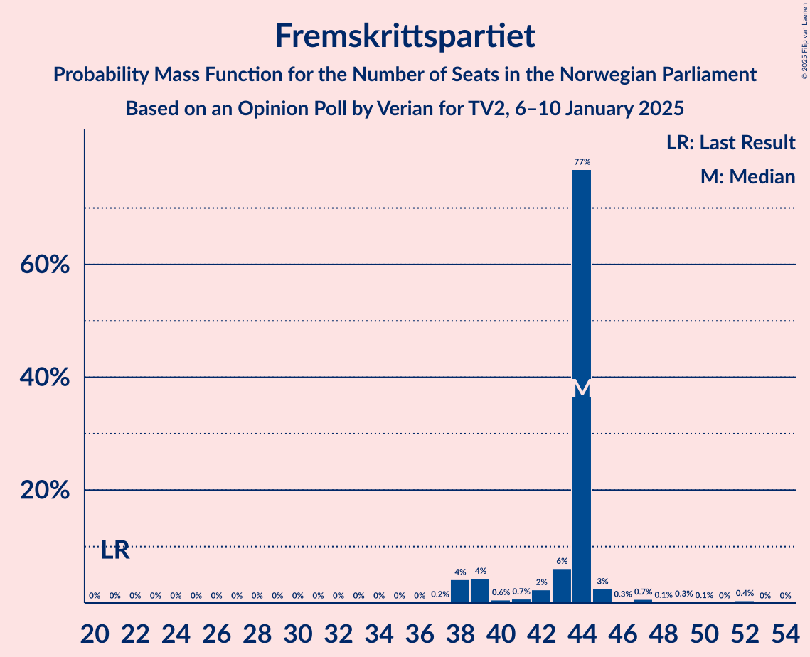
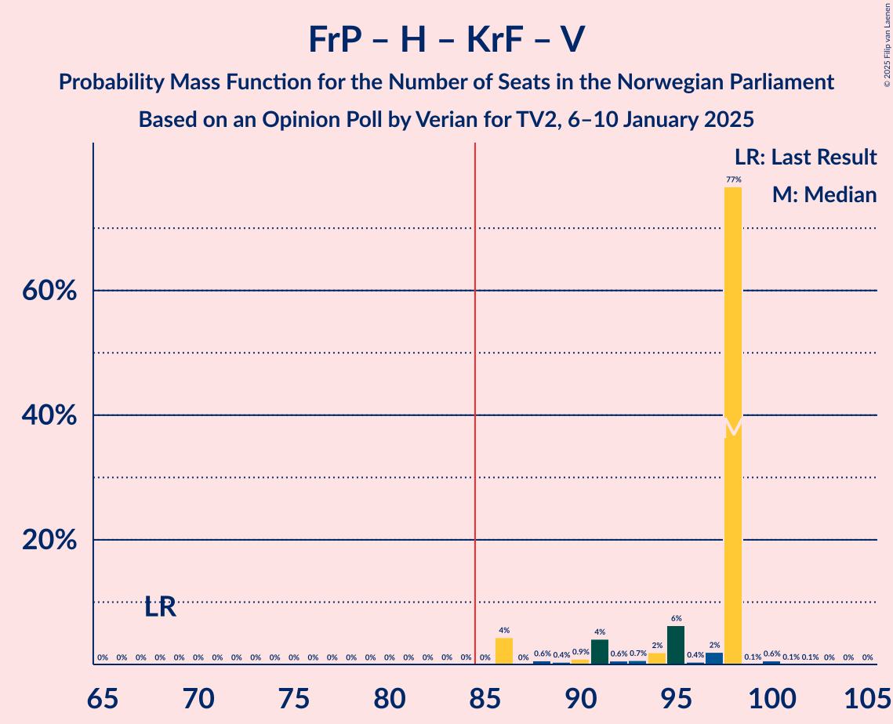
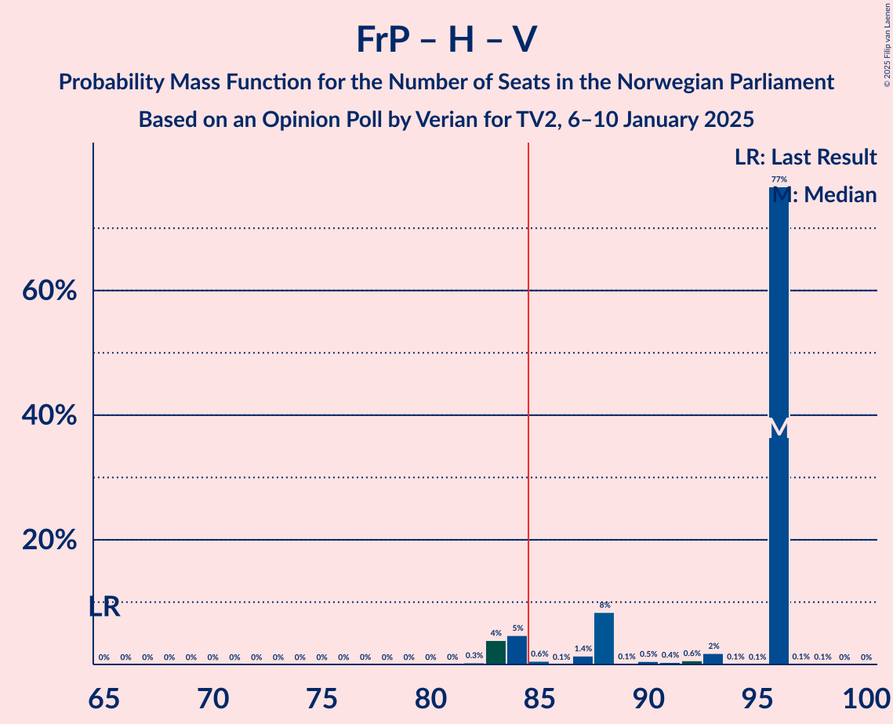
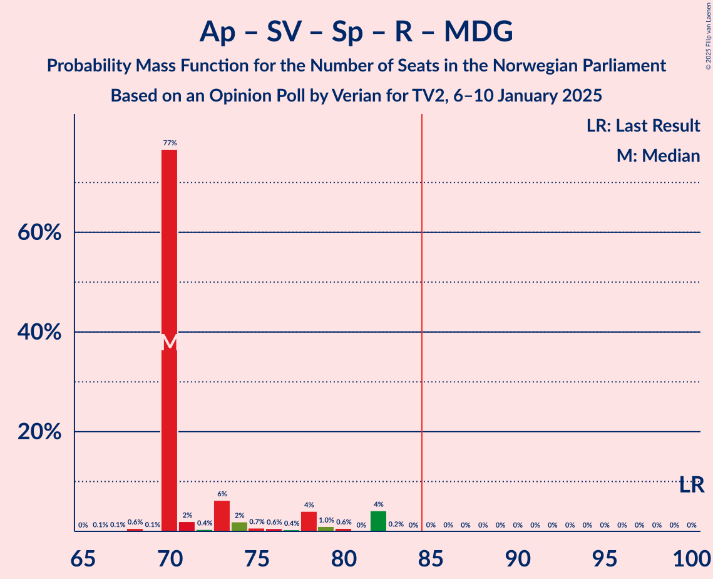
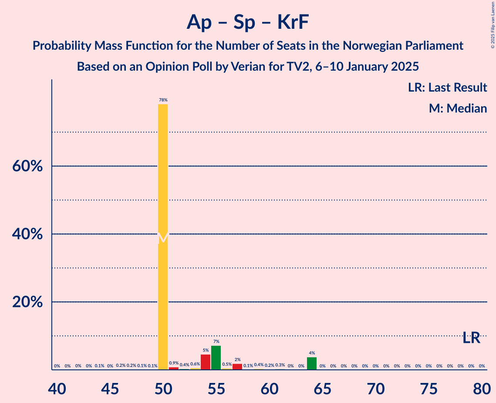
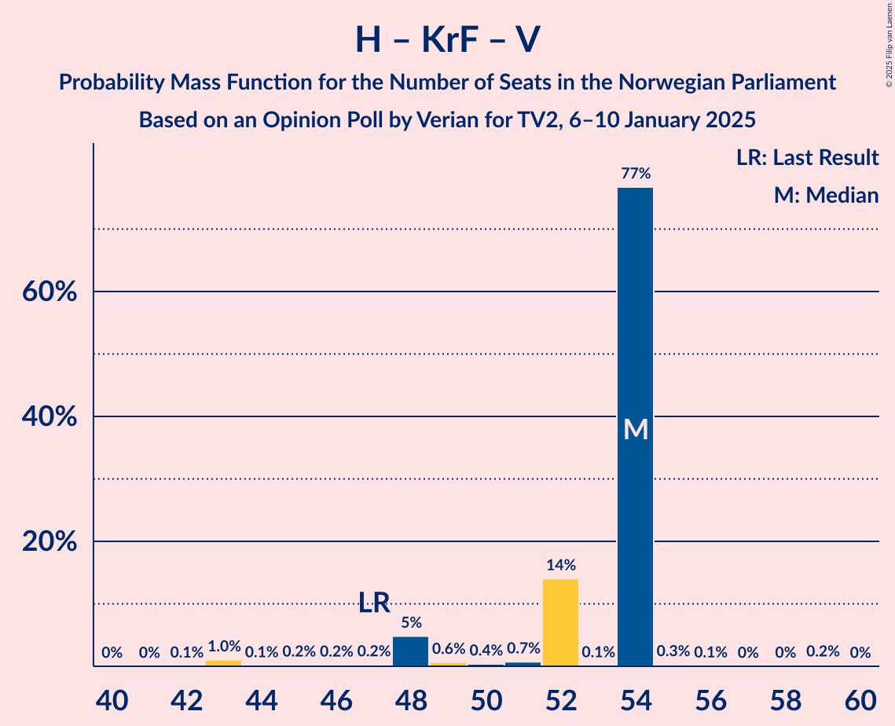

# Opinion Poll by Verian for TV2, 6–10 January 2025

<a href="#voting-intentions">Voting Intentions</a> | <a href="#seats">Seats</a> | <a href="#coalitions">Coalitions</a> | <a href="#technical-information">Technical Information</a>

## Voting Intentions

### Confidence Intervals

| Party | Last Result | Poll Result | 80% Confidence Interval | 90% Confidence Interval | 95% Confidence Interval | 99% Confidence Interval |
|:-----:|:-----------:|:-----------:|:-----------------------:|:-----------------------:|:-----------------------:|:-----------------------:|
| Fremskrittspartiet | 11.6% | 24.3% | 22.7–26.2% |22.2–26.7% |21.8–27.1% |21.0–28.0% |
| Høyre | 20.4% | 23.8% | 22.2–25.7% |21.7–26.2% |21.3–26.6% |20.5–27.5% |
| Arbeiderpartiet | 26.2% | 21.0% | 19.4–22.8% |19.0–23.2% |18.6–23.7% |17.9–24.5% |
| Sosialistisk Venstreparti | 7.6% | 6.9% | 6.0–8.1% |5.7–8.4% |5.5–8.7% |5.1–9.3% |
| Senterpartiet | 13.5% | 5.6% | 4.8–6.7% |4.6–7.0% |4.4–7.3% |4.0–7.8% |
| Rødt | 4.7% | 5.4% | 4.6–6.5% |4.4–6.8% |4.2–7.0% |3.8–7.6% |
| Kristelig Folkeparti | 3.8% | 3.9% | 3.2–4.8% |3.0–5.1% |2.9–5.3% |2.6–5.8% |
| Miljøpartiet De Grønne | 3.9% | 3.6% | 3.0–4.5% |2.8–4.8% |2.6–5.0% |2.3–5.4% |
| Venstre | 4.6% | 3.4% | 2.8–4.3% |2.6–4.5% |2.5–4.8% |2.2–5.2% |
| Industri- og Næringspartiet | 0.3% | 0.8% | 0.5–1.3% |0.5–1.4% |0.4–1.6% |0.3–1.9% |
| Norgesdemokratene | 1.1% | 0.3% | 0.2–0.7% |0.1–0.8% |0.1–0.9% |0.1–1.1% |
| Konservativt | 0.4% | 0.3% | 0.2–0.7% |0.1–0.8% |0.1–0.9% |0.1–1.1% |
| Liberalistene | 0.2% | 0.2% | 0.1–0.5% |0.1–0.6% |0.1–0.7% |0.0–0.9% |
| Pensjonistpartiet | 0.6% | 0.1% | 0.0–0.4% |0.0–0.5% |0.0–0.6% |0.0–0.7% |

*Note:* The poll result column reflects the actual value used in the calculations. Published results may vary slightly, and in addition be rounded to fewer digits.

## Seats

### Confidence Intervals

| Party | Last Result | Median | 80% Confidence Interval | 90% Confidence Interval | 95% Confidence Interval | 99% Confidence Interval |
|:-----:|:-----------:|:------:|:-----------------------:|:-----------------------:|:-----------------------:|:-----------------------:|
| <a href="#fremskrittspartiet">Fremskrittspartiet</a> | 21 | 44 | 43–44 |41–44 |38–45 |38–50 |
| <a href="#høyre">Høyre</a> | 36 | 45 | 41–45 |37–45 |37–45 |37–46 |
| <a href="#arbeiderpartiet">Arbeiderpartiet</a> | 48 | 40 | 39–40 |39–40 |39–40 |35–43 |
| <a href="#sosialistisk-venstreparti">Sosialistisk Venstreparti</a> | 13 | 10 | 10–14 |10–14 |10–17 |10–17 |
| <a href="#senterpartiet">Senterpartiet</a> | 28 | 8 | 8–9 |8–12 |8–13 |7–13 |
| <a href="#rødt">Rødt</a> | 8 | 10 | 10 |9–10 |9–10 |8–11 |
| <a href="#kristelig-folkeparti">Kristelig Folkeparti</a> | 3 | 2 | 2 |2–7 |2–8 |2–9 |
| <a href="#miljøpartiet-de-grønne">Miljøpartiet De Grønne</a> | 3 | 2 | 2 |2–3 |2–3 |2–9 |
| <a href="#venstre">Venstre</a> | 8 | 7 | 7 |2–8 |2–8 |2–8 |
| <a href="#industri--og-næringspartiet">Industri- og Næringspartiet</a> | 0 | 0 | 0 |0 |0 |0 |
| <a href="#norgesdemokratene">Norgesdemokratene</a> | 0 | 0 | 0 |0 |0 |0 |
| <a href="#konservativt">Konservativt</a> | 0 | 0 | 0 |0 |0 |0 |
| <a href="#liberalistene">Liberalistene</a> | 0 | 0 | 0 |0 |0 |0 |
| <a href="#pensjonistpartiet">Pensjonistpartiet</a> | 0 | 0 | 0 |0 |0 |0 |

### Fremskrittspartiet

*For a full overview of the results for this party, see the [Fremskrittspartiet](party-fremskrittspartiet.html) page.*

| Number of Seats | Probability | Accumulated | Special Marks |
|:---------------:|:-----------:|:-----------:|:-------------:|
| 21 | 0% | 100% | Last Result |
| 22 | 0% | 100% |  |
| 23 | 0% | 100% |  |
| 24 | 0% | 100% |  |
| 25 | 0% | 100% |  |
| 26 | 0% | 100% |  |
| 27 | 0% | 100% |  |
| 28 | 0% | 100% |  |
| 29 | 0% | 100% |  |
| 30 | 0% | 100% |  |
| 31 | 0% | 100% |  |
| 32 | 0% | 100% |  |
| 33 | 0% | 100% |  |
| 34 | 0% | 100% |  |
| 35 | 0% | 100% |  |
| 36 | 0% | 100% |  |
| 37 | 0% | 100% |  |
| 38 | 5% | 100% |  |
| 39 | 0% | 95% |  |
| 40 | 0.2% | 95% |  |
| 41 | 0.3% | 95% |  |
| 42 | 0.3% | 95% |  |
| 43 | 7% | 95% |  |
| 44 | 85% | 88% | Median |
| 45 | 2% | 3% |  |
| 46 | 0.1% | 2% |  |
| 47 | 0.6% | 2% |  |
| 48 | 0.1% | 0.9% |  |
| 49 | 0.3% | 0.9% |  |
| 50 | 0% | 0.5% |  |
| 51 | 0% | 0.5% |  |
| 52 | 0.5% | 0.5% |  |
| 53 | 0% | 0% |  |

### Høyre

*For a full overview of the results for this party, see the [Høyre](party-høyre.html) page.*

| Number of Seats | Probability | Accumulated | Special Marks |
|:---------------:|:-----------:|:-----------:|:-------------:|
| 36 | 0.1% | 100% | Last Result |
| 37 | 7% | 99.8% |  |
| 38 | 0.6% | 93% |  |
| 39 | 0.2% | 92% |  |
| 40 | 2% | 92% |  |
| 41 | 0.3% | 90% |  |
| 42 | 0.4% | 90% |  |
| 43 | 0% | 90% |  |
| 44 | 5% | 90% |  |
| 45 | 84% | 85% | Median |
| 46 | 0.4% | 0.6% |  |
| 47 | 0.1% | 0.1% |  |
| 48 | 0% | 0% |  |

### Arbeiderpartiet

*For a full overview of the results for this party, see the [Arbeiderpartiet](party-arbeiderpartiet.html) page.*

| Number of Seats | Probability | Accumulated | Special Marks |
|:---------------:|:-----------:|:-----------:|:-------------:|
| 33 | 0.1% | 100% |  |
| 34 | 0.1% | 99.9% |  |
| 35 | 0.3% | 99.8% |  |
| 36 | 0% | 99.5% |  |
| 37 | 0.1% | 99.4% |  |
| 38 | 0.1% | 99.3% |  |
| 39 | 13% | 99.2% |  |
| 40 | 85% | 86% | Median |
| 41 | 0.7% | 2% |  |
| 42 | 0.1% | 1.1% |  |
| 43 | 0.6% | 1.0% |  |
| 44 | 0.1% | 0.4% |  |
| 45 | 0.1% | 0.4% |  |
| 46 | 0% | 0.3% |  |
| 47 | 0.1% | 0.2% |  |
| 48 | 0% | 0.2% | Last Result |
| 49 | 0.2% | 0.2% |  |
| 50 | 0% | 0% |  |

### Sosialistisk Venstreparti

*For a full overview of the results for this party, see the [Sosialistisk Venstreparti](party-sosialistiskvenstreparti.html) page.*

| Number of Seats | Probability | Accumulated | Special Marks |
|:---------------:|:-----------:|:-----------:|:-------------:|
| 7 | 0.1% | 100% |  |
| 8 | 0% | 99.9% |  |
| 9 | 0.1% | 99.9% |  |
| 10 | 87% | 99.7% | Median |
| 11 | 0.3% | 13% |  |
| 12 | 0.6% | 12% |  |
| 13 | 0.2% | 12% | Last Result |
| 14 | 7% | 12% |  |
| 15 | 0.1% | 5% |  |
| 16 | 0.2% | 5% |  |
| 17 | 5% | 5% |  |
| 18 | 0% | 0% |  |

### Senterpartiet

*For a full overview of the results for this party, see the [Senterpartiet](party-senterpartiet.html) page.*

| Number of Seats | Probability | Accumulated | Special Marks |
|:---------------:|:-----------:|:-----------:|:-------------:|
| 1 | 0.1% | 100% |  |
| 2 | 0% | 99.9% |  |
| 3 | 0% | 99.9% |  |
| 4 | 0% | 99.9% |  |
| 5 | 0% | 99.9% |  |
| 6 | 0% | 99.9% |  |
| 7 | 0.6% | 99.9% |  |
| 8 | 85% | 99.3% | Median |
| 9 | 9% | 14% |  |
| 10 | 0.4% | 6% |  |
| 11 | 0.2% | 5% |  |
| 12 | 0.3% | 5% |  |
| 13 | 5% | 5% |  |
| 14 | 0% | 0% |  |
| 15 | 0% | 0% |  |
| 16 | 0% | 0% |  |
| 17 | 0% | 0% |  |
| 18 | 0% | 0% |  |
| 19 | 0% | 0% |  |
| 20 | 0% | 0% |  |
| 21 | 0% | 0% |  |
| 22 | 0% | 0% |  |
| 23 | 0% | 0% |  |
| 24 | 0% | 0% |  |
| 25 | 0% | 0% |  |
| 26 | 0% | 0% |  |
| 27 | 0% | 0% |  |
| 28 | 0% | 0% | Last Result |

### Rødt

*For a full overview of the results for this party, see the [Rødt](party-rødt.html) page.*

| Number of Seats | Probability | Accumulated | Special Marks |
|:---------------:|:-----------:|:-----------:|:-------------:|
| 1 | 0.1% | 100% |  |
| 2 | 0% | 99.9% |  |
| 3 | 0% | 99.9% |  |
| 4 | 0% | 99.9% |  |
| 5 | 0% | 99.9% |  |
| 6 | 0% | 99.9% |  |
| 7 | 0.1% | 99.9% |  |
| 8 | 0.6% | 99.8% | Last Result |
| 9 | 8% | 99.2% |  |
| 10 | 90% | 91% | Median |
| 11 | 2% | 2% |  |
| 12 | 0.1% | 0.1% |  |
| 13 | 0% | 0% |  |

### Kristelig Folkeparti

*For a full overview of the results for this party, see the [Kristelig Folkeparti](party-kristeligfolkeparti.html) page.*

| Number of Seats | Probability | Accumulated | Special Marks |
|:---------------:|:-----------:|:-----------:|:-------------:|
| 1 | 0.3% | 100% |  |
| 2 | 90% | 99.7% | Median |
| 3 | 0.5% | 10% | Last Result |
| 4 | 0% | 9% |  |
| 5 | 0% | 9% |  |
| 6 | 0.1% | 9% |  |
| 7 | 7% | 9% |  |
| 8 | 0.7% | 3% |  |
| 9 | 2% | 2% |  |
| 10 | 0.1% | 0.1% |  |
| 11 | 0% | 0% |  |

### Miljøpartiet De Grønne

*For a full overview of the results for this party, see the [Miljøpartiet De Grønne](party-miljøpartietdegrønne.html) page.*

| Number of Seats | Probability | Accumulated | Special Marks |
|:---------------:|:-----------:|:-----------:|:-------------:|
| 1 | 0.5% | 100% |  |
| 2 | 93% | 99.5% | Median |
| 3 | 5% | 6% | Last Result |
| 4 | 0% | 1.1% |  |
| 5 | 0% | 1.1% |  |
| 6 | 0% | 1.1% |  |
| 7 | 0.3% | 1.1% |  |
| 8 | 0.1% | 0.8% |  |
| 9 | 0.7% | 0.7% |  |
| 10 | 0% | 0% |  |

### Venstre

*For a full overview of the results for this party, see the [Venstre](party-venstre.html) page.*

| Number of Seats | Probability | Accumulated | Special Marks |
|:---------------:|:-----------:|:-----------:|:-------------:|
| 2 | 6% | 100% |  |
| 3 | 3% | 94% |  |
| 4 | 0% | 91% |  |
| 5 | 0% | 91% |  |
| 6 | 0% | 91% |  |
| 7 | 84% | 91% | Median |
| 8 | 7% | 7% | Last Result |
| 9 | 0.1% | 0.1% |  |
| 10 | 0% | 0% |  |

### Industri- og Næringspartiet

*For a full overview of the results for this party, see the [Industri- og Næringspartiet](party-industri-ognæringspartiet.html) page.*

| Number of Seats | Probability | Accumulated | Special Marks |
|:---------------:|:-----------:|:-----------:|:-------------:|
| 0 | 100% | 100% | Last Result, Median |

### Norgesdemokratene

*For a full overview of the results for this party, see the [Norgesdemokratene](party-norgesdemokratene.html) page.*

| Number of Seats | Probability | Accumulated | Special Marks |
|:---------------:|:-----------:|:-----------:|:-------------:|
| 0 | 100% | 100% | Last Result, Median |

### Konservativt

*For a full overview of the results for this party, see the [Konservativt](party-konservativt.html) page.*

| Number of Seats | Probability | Accumulated | Special Marks |
|:---------------:|:-----------:|:-----------:|:-------------:|
| 0 | 100% | 100% | Last Result, Median |

### Liberalistene

*For a full overview of the results for this party, see the [Liberalistene](party-liberalistene.html) page.*

| Number of Seats | Probability | Accumulated | Special Marks |
|:---------------:|:-----------:|:-----------:|:-------------:|
| 0 | 100% | 100% | Last Result, Median |

### Pensjonistpartiet

*For a full overview of the results for this party, see the [Pensjonistpartiet](party-pensjonistpartiet.html) page.*

| Number of Seats | Probability | Accumulated | Special Marks |
|:---------------:|:-----------:|:-----------:|:-------------:|
| 0 | 100% | 100% | Last Result, Median |

## Coalitions

### Confidence Intervals

| Coalition | Last Result | Median | Majority? | 80% Confidence Interval | 90% Confidence Interval | 95% Confidence Interval | 99% Confidence Interval |
|:---------:|:-----------:|:------:|:---------:|:-----------------------:|:-----------------------:|:-----------------------:|:-----------------------:|
| Fremskrittspartiet – Høyre – Senterpartiet – Kristelig Folkeparti – Venstre | 96 | 106 | 100% | 104–106 | 99–106 | 99–106 | 98–107 |
| Fremskrittspartiet – Høyre – Kristelig Folkeparti – Miljøpartiet De Grønne – Venstre | 71 | 100 | 100% | 97–100 | 91–100 | 89–100 | 89–102 |
| Fremskrittspartiet – Høyre – Kristelig Folkeparti – Venstre | 68 | 98 | 99.9% | 95–98 | 90–98 | 86–98 | 86–100 |
| Fremskrittspartiet – Høyre – Venstre | 65 | 96 | 95% | 88–96 | 85–96 | 84–96 | 84–96 |
| Fremskrittspartiet – Høyre | 57 | 89 | 88% | 82–89 | 80–89 | 80–89 | 80–89 |
| Arbeiderpartiet – Sosialistisk Venstreparti – Senterpartiet – Rødt – Miljøpartiet De Grønne | 100 | 70 | 0.1% | 70–73 | 70–79 | 70–82 | 68–82 |
| Arbeiderpartiet – Sosialistisk Venstreparti – Senterpartiet – Rødt | 97 | 68 | 0% | 68–71 | 68–78 | 68–79 | 66–79 |
| Arbeiderpartiet – Sosialistisk Venstreparti – Senterpartiet – Kristelig Folkeparti – Miljøpartiet De Grønne | 95 | 62 | 0% | 62–71 | 62–74 | 62–74 | 62–74 |
| Arbeiderpartiet – Sosialistisk Venstreparti – Senterpartiet – Miljøpartiet De Grønne | 92 | 60 | 0% | 60–64 | 60–70 | 60–72 | 60–72 |
| Arbeiderpartiet – Sosialistisk Venstreparti – Rødt – Miljøpartiet De Grønne | 72 | 62 | 0% | 62–64 | 62–69 | 62–69 | 61–71 |
| Arbeiderpartiet – Sosialistisk Venstreparti – Senterpartiet | 89 | 58 | 0% | 58–62 | 58–67 | 58–69 | 57–69 |
| Arbeiderpartiet – Senterpartiet – Kristelig Folkeparti – Miljøpartiet De Grønne | 82 | 52 | 0% | 52–57 | 52–57 | 52–59 | 52–62 |
| Arbeiderpartiet – Senterpartiet – Kristelig Folkeparti | 79 | 50 | 0% | 50–54 | 50–55 | 50–56 | 50–59 |
| Arbeiderpartiet – Sosialistisk Venstreparti | 61 | 50 | 0% | 50–53 | 50–56 | 50–56 | 47–56 |
| Høyre – Kristelig Folkeparti – Venstre | 47 | 54 | 0% | 52–54 | 48–54 | 48–54 | 43–54 |
| Arbeiderpartiet – Senterpartiet | 76 | 48 | 0% | 48 | 48–52 | 48–52 | 46–53 |
| Senterpartiet – Kristelig Folkeparti – Venstre | 39 | 17 | 0% | 17 | 17–24 | 17–24 | 13–24 |

### Fremskrittspartiet – Høyre – Senterpartiet – Kristelig Folkeparti – Venstre

| Number of Seats | Probability | Accumulated | Special Marks |
|:---------------:|:-----------:|:-----------:|:-------------:|
| 95 | 0.2% | 100% |  |
| 96 | 0% | 99.8% | Last Result |
| 97 | 0.1% | 99.8% |  |
| 98 | 0.5% | 99.7% |  |
| 99 | 5% | 99.1% |  |
| 100 | 0% | 94% |  |
| 101 | 0% | 94% |  |
| 102 | 0% | 94% |  |
| 103 | 0.3% | 94% |  |
| 104 | 7% | 94% |  |
| 105 | 0.3% | 87% |  |
| 106 | 86% | 87% | Median |
| 107 | 0.7% | 1.1% |  |
| 108 | 0.2% | 0.4% |  |
| 109 | 0% | 0.2% |  |
| 110 | 0.1% | 0.2% |  |
| 111 | 0% | 0.1% |  |
| 112 | 0% | 0.1% |  |
| 113 | 0% | 0.1% |  |
| 114 | 0% | 0% |  |

### Fremskrittspartiet – Høyre – Kristelig Folkeparti – Miljøpartiet De Grønne – Venstre

| Number of Seats | Probability | Accumulated | Special Marks |
|:---------------:|:-----------:|:-----------:|:-------------:|
| 71 | 0% | 100% | Last Result |
| 72 | 0% | 100% |  |
| 73 | 0% | 100% |  |
| 74 | 0% | 100% |  |
| 75 | 0% | 100% |  |
| 76 | 0% | 100% |  |
| 77 | 0% | 100% |  |
| 78 | 0% | 100% |  |
| 79 | 0% | 100% |  |
| 80 | 0% | 100% |  |
| 81 | 0% | 100% |  |
| 82 | 0% | 100% |  |
| 83 | 0% | 100% |  |
| 84 | 0% | 100% |  |
| 85 | 0% | 100% | Majority |
| 86 | 0% | 100% |  |
| 87 | 0% | 100% |  |
| 88 | 0.1% | 100% |  |
| 89 | 5% | 99.9% |  |
| 90 | 0.1% | 95% |  |
| 91 | 0.2% | 95% |  |
| 92 | 0% | 95% |  |
| 93 | 0% | 95% |  |
| 94 | 0% | 95% |  |
| 95 | 0.2% | 95% |  |
| 96 | 0.2% | 95% |  |
| 97 | 7% | 95% |  |
| 98 | 0.1% | 88% |  |
| 99 | 2% | 88% |  |
| 100 | 84% | 86% | Median |
| 101 | 0% | 1.2% |  |
| 102 | 0.7% | 1.2% |  |
| 103 | 0.2% | 0.5% |  |
| 104 | 0.2% | 0.3% |  |
| 105 | 0% | 0.1% |  |
| 106 | 0% | 0% |  |

### Fremskrittspartiet – Høyre – Kristelig Folkeparti – Venstre

| Number of Seats | Probability | Accumulated | Special Marks |
|:---------------:|:-----------:|:-----------:|:-------------:|
| 68 | 0% | 100% | Last Result |
| 69 | 0% | 100% |  |
| 70 | 0% | 100% |  |
| 71 | 0% | 100% |  |
| 72 | 0% | 100% |  |
| 73 | 0% | 100% |  |
| 74 | 0% | 100% |  |
| 75 | 0% | 100% |  |
| 76 | 0% | 100% |  |
| 77 | 0% | 100% |  |
| 78 | 0% | 100% |  |
| 79 | 0% | 100% |  |
| 80 | 0% | 100% |  |
| 81 | 0% | 100% |  |
| 82 | 0% | 100% |  |
| 83 | 0% | 100% |  |
| 84 | 0% | 100% |  |
| 85 | 0% | 99.9% | Majority |
| 86 | 5% | 99.9% |  |
| 87 | 0% | 95% |  |
| 88 | 0.1% | 95% |  |
| 89 | 0% | 95% |  |
| 90 | 0.7% | 95% |  |
| 91 | 0% | 94% |  |
| 92 | 0.3% | 94% |  |
| 93 | 0.2% | 94% |  |
| 94 | 0.1% | 94% |  |
| 95 | 7% | 94% |  |
| 96 | 0% | 87% |  |
| 97 | 2% | 87% |  |
| 98 | 84% | 85% | Median |
| 99 | 0.1% | 0.9% |  |
| 100 | 0.6% | 0.8% |  |
| 101 | 0.1% | 0.2% |  |
| 102 | 0.1% | 0.1% |  |
| 103 | 0% | 0% |  |

### Fremskrittspartiet – Høyre – Venstre

| Number of Seats | Probability | Accumulated | Special Marks |
|:---------------:|:-----------:|:-----------:|:-------------:|
| 65 | 0% | 100% | Last Result |
| 66 | 0% | 100% |  |
| 67 | 0% | 100% |  |
| 68 | 0% | 100% |  |
| 69 | 0% | 100% |  |
| 70 | 0% | 100% |  |
| 71 | 0% | 100% |  |
| 72 | 0% | 100% |  |
| 73 | 0% | 100% |  |
| 74 | 0% | 100% |  |
| 75 | 0% | 100% |  |
| 76 | 0% | 100% |  |
| 77 | 0% | 100% |  |
| 78 | 0% | 100% |  |
| 79 | 0% | 100% |  |
| 80 | 0% | 100% |  |
| 81 | 0% | 99.9% |  |
| 82 | 0% | 99.9% |  |
| 83 | 0.1% | 99.9% |  |
| 84 | 5% | 99.8% |  |
| 85 | 0.2% | 95% | Majority |
| 86 | 0% | 95% |  |
| 87 | 0.2% | 95% |  |
| 88 | 9% | 95% |  |
| 89 | 0.1% | 86% |  |
| 90 | 0.1% | 86% |  |
| 91 | 0.2% | 86% |  |
| 92 | 0.6% | 85% |  |
| 93 | 0.2% | 85% |  |
| 94 | 0% | 85% |  |
| 95 | 0.1% | 85% |  |
| 96 | 84% | 85% | Median |
| 97 | 0.1% | 0.2% |  |
| 98 | 0.1% | 0.1% |  |
| 99 | 0% | 0% |  |

### Fremskrittspartiet – Høyre

| Number of Seats | Probability | Accumulated | Special Marks |
|:---------------:|:-----------:|:-----------:|:-------------:|
| 57 | 0% | 100% | Last Result |
| 58 | 0% | 100% |  |
| 59 | 0% | 100% |  |
| 60 | 0% | 100% |  |
| 61 | 0% | 100% |  |
| 62 | 0% | 100% |  |
| 63 | 0% | 100% |  |
| 64 | 0% | 100% |  |
| 65 | 0% | 100% |  |
| 66 | 0% | 100% |  |
| 67 | 0% | 100% |  |
| 68 | 0% | 100% |  |
| 69 | 0% | 100% |  |
| 70 | 0% | 100% |  |
| 71 | 0% | 100% |  |
| 72 | 0% | 100% |  |
| 73 | 0% | 100% |  |
| 74 | 0% | 100% |  |
| 75 | 0% | 100% |  |
| 76 | 0% | 100% |  |
| 77 | 0% | 100% |  |
| 78 | 0% | 100% |  |
| 79 | 0% | 99.9% |  |
| 80 | 7% | 99.9% |  |
| 81 | 0.3% | 93% |  |
| 82 | 5% | 93% |  |
| 83 | 0.2% | 88% |  |
| 84 | 0.1% | 88% |  |
| 85 | 2% | 88% | Majority |
| 86 | 0.1% | 86% |  |
| 87 | 0.1% | 86% |  |
| 88 | 0.3% | 86% |  |
| 89 | 85% | 85% | Median |
| 90 | 0% | 0.4% |  |
| 91 | 0.2% | 0.4% |  |
| 92 | 0% | 0.2% |  |
| 93 | 0% | 0.2% |  |
| 94 | 0% | 0.2% |  |
| 95 | 0.1% | 0.2% |  |
| 96 | 0.1% | 0.1% |  |
| 97 | 0% | 0% |  |

### Arbeiderpartiet – Sosialistisk Venstreparti – Senterpartiet – Rødt – Miljøpartiet De Grønne

| Number of Seats | Probability | Accumulated | Special Marks |
|:---------------:|:-----------:|:-----------:|:-------------:|
| 66 | 0.1% | 100% |  |
| 67 | 0.1% | 99.9% |  |
| 68 | 0.6% | 99.8% |  |
| 69 | 0.1% | 99.2% |  |
| 70 | 84% | 99.1% | Median |
| 71 | 2% | 15% |  |
| 72 | 0% | 13% |  |
| 73 | 7% | 13% |  |
| 74 | 0.1% | 6% |  |
| 75 | 0.2% | 6% |  |
| 76 | 0.3% | 6% |  |
| 77 | 0% | 6% |  |
| 78 | 0% | 6% |  |
| 79 | 0.7% | 6% |  |
| 80 | 0.1% | 5% |  |
| 81 | 0% | 5% |  |
| 82 | 5% | 5% |  |
| 83 | 0.2% | 0.3% |  |
| 84 | 0% | 0.1% |  |
| 85 | 0% | 0.1% | Majority |
| 86 | 0% | 0% |  |
| 87 | 0% | 0% |  |
| 88 | 0% | 0% |  |
| 89 | 0% | 0% |  |
| 90 | 0% | 0% |  |
| 91 | 0% | 0% |  |
| 92 | 0% | 0% |  |
| 93 | 0% | 0% |  |
| 94 | 0% | 0% |  |
| 95 | 0% | 0% |  |
| 96 | 0% | 0% |  |
| 97 | 0% | 0% |  |
| 98 | 0% | 0% |  |
| 99 | 0% | 0% |  |
| 100 | 0% | 0% | Last Result |

### Arbeiderpartiet – Sosialistisk Venstreparti – Senterpartiet – Rødt

| Number of Seats | Probability | Accumulated | Special Marks |
|:---------------:|:-----------:|:-----------:|:-------------:|
| 63 | 0% | 100% |  |
| 64 | 0.2% | 99.9% |  |
| 65 | 0.2% | 99.7% |  |
| 66 | 0.7% | 99.5% |  |
| 67 | 0% | 98.8% |  |
| 68 | 84% | 98.8% | Median |
| 69 | 2% | 14% |  |
| 70 | 0.6% | 13% |  |
| 71 | 7% | 12% |  |
| 72 | 0.1% | 5% |  |
| 73 | 0.2% | 5% |  |
| 74 | 0% | 5% |  |
| 75 | 0% | 5% |  |
| 76 | 0% | 5% |  |
| 77 | 0% | 5% |  |
| 78 | 0.2% | 5% |  |
| 79 | 5% | 5% |  |
| 80 | 0.2% | 0.2% |  |
| 81 | 0.1% | 0.1% |  |
| 82 | 0% | 0% |  |
| 83 | 0% | 0% |  |
| 84 | 0% | 0% |  |
| 85 | 0% | 0% | Majority |
| 86 | 0% | 0% |  |
| 87 | 0% | 0% |  |
| 88 | 0% | 0% |  |
| 89 | 0% | 0% |  |
| 90 | 0% | 0% |  |
| 91 | 0% | 0% |  |
| 92 | 0% | 0% |  |
| 93 | 0% | 0% |  |
| 94 | 0% | 0% |  |
| 95 | 0% | 0% |  |
| 96 | 0% | 0% |  |
| 97 | 0% | 0% | Last Result |

### Arbeiderpartiet – Sosialistisk Venstreparti – Senterpartiet – Kristelig Folkeparti – Miljøpartiet De Grønne

| Number of Seats | Probability | Accumulated | Special Marks |
|:---------------:|:-----------:|:-----------:|:-------------:|
| 61 | 0.2% | 100% |  |
| 62 | 84% | 99.8% | Median |
| 63 | 0.1% | 16% |  |
| 64 | 0% | 15% |  |
| 65 | 0% | 15% |  |
| 66 | 0.2% | 15% |  |
| 67 | 0% | 15% |  |
| 68 | 0.8% | 15% |  |
| 69 | 2% | 14% |  |
| 70 | 0.1% | 13% |  |
| 71 | 7% | 13% |  |
| 72 | 0.6% | 6% |  |
| 73 | 0.1% | 5% |  |
| 74 | 5% | 5% |  |
| 75 | 0% | 0.3% |  |
| 76 | 0.1% | 0.3% |  |
| 77 | 0% | 0.2% |  |
| 78 | 0.1% | 0.1% |  |
| 79 | 0% | 0% |  |
| 80 | 0% | 0% |  |
| 81 | 0% | 0% |  |
| 82 | 0% | 0% |  |
| 83 | 0% | 0% |  |
| 84 | 0% | 0% |  |
| 85 | 0% | 0% | Majority |
| 86 | 0% | 0% |  |
| 87 | 0% | 0% |  |
| 88 | 0% | 0% |  |
| 89 | 0% | 0% |  |
| 90 | 0% | 0% |  |
| 91 | 0% | 0% |  |
| 92 | 0% | 0% |  |
| 93 | 0% | 0% |  |
| 94 | 0% | 0% |  |
| 95 | 0% | 0% | Last Result |

### Arbeiderpartiet – Sosialistisk Venstreparti – Senterpartiet – Miljøpartiet De Grønne

| Number of Seats | Probability | Accumulated | Special Marks |
|:---------------:|:-----------:|:-----------:|:-------------:|
| 58 | 0.2% | 100% |  |
| 59 | 0.1% | 99.8% |  |
| 60 | 86% | 99.7% | Median |
| 61 | 0.1% | 13% |  |
| 62 | 0.1% | 13% |  |
| 63 | 0.1% | 13% |  |
| 64 | 7% | 13% |  |
| 65 | 0.1% | 6% |  |
| 66 | 0.3% | 6% |  |
| 67 | 0.1% | 6% |  |
| 68 | 0.1% | 6% |  |
| 69 | 0.1% | 6% |  |
| 70 | 0.7% | 6% |  |
| 71 | 0% | 5% |  |
| 72 | 5% | 5% |  |
| 73 | 0.2% | 0.3% |  |
| 74 | 0% | 0.1% |  |
| 75 | 0% | 0.1% |  |
| 76 | 0% | 0% |  |
| 77 | 0% | 0% |  |
| 78 | 0% | 0% |  |
| 79 | 0% | 0% |  |
| 80 | 0% | 0% |  |
| 81 | 0% | 0% |  |
| 82 | 0% | 0% |  |
| 83 | 0% | 0% |  |
| 84 | 0% | 0% |  |
| 85 | 0% | 0% | Majority |
| 86 | 0% | 0% |  |
| 87 | 0% | 0% |  |
| 88 | 0% | 0% |  |
| 89 | 0% | 0% |  |
| 90 | 0% | 0% |  |
| 91 | 0% | 0% |  |
| 92 | 0% | 0% | Last Result |

### Arbeiderpartiet – Sosialistisk Venstreparti – Rødt – Miljøpartiet De Grønne

| Number of Seats | Probability | Accumulated | Special Marks |
|:---------------:|:-----------:|:-----------:|:-------------:|
| 55 | 0% | 100% |  |
| 56 | 0% | 99.9% |  |
| 57 | 0% | 99.9% |  |
| 58 | 0.1% | 99.9% |  |
| 59 | 0% | 99.8% |  |
| 60 | 0.2% | 99.8% |  |
| 61 | 0.7% | 99.6% |  |
| 62 | 86% | 98.9% | Median |
| 63 | 0.3% | 13% |  |
| 64 | 7% | 13% |  |
| 65 | 0.2% | 6% |  |
| 66 | 0.1% | 6% |  |
| 67 | 0% | 6% |  |
| 68 | 0% | 6% |  |
| 69 | 5% | 6% |  |
| 70 | 0% | 0.9% |  |
| 71 | 0.5% | 0.9% |  |
| 72 | 0.1% | 0.3% | Last Result |
| 73 | 0.1% | 0.2% |  |
| 74 | 0.2% | 0.2% |  |
| 75 | 0% | 0% |  |

### Arbeiderpartiet – Sosialistisk Venstreparti – Senterpartiet

| Number of Seats | Probability | Accumulated | Special Marks |
|:---------------:|:-----------:|:-----------:|:-------------:|
| 54 | 0.2% | 100% |  |
| 55 | 0.1% | 99.8% |  |
| 56 | 0.1% | 99.7% |  |
| 57 | 0.2% | 99.6% |  |
| 58 | 86% | 99.3% | Median |
| 59 | 0% | 13% |  |
| 60 | 0.1% | 13% |  |
| 61 | 0.6% | 13% |  |
| 62 | 7% | 12% |  |
| 63 | 0.3% | 5% |  |
| 64 | 0% | 5% |  |
| 65 | 0% | 5% |  |
| 66 | 0% | 5% |  |
| 67 | 0.2% | 5% |  |
| 68 | 0% | 5% |  |
| 69 | 5% | 5% |  |
| 70 | 0.2% | 0.3% |  |
| 71 | 0.1% | 0.1% |  |
| 72 | 0% | 0% |  |
| 73 | 0% | 0% |  |
| 74 | 0% | 0% |  |
| 75 | 0% | 0% |  |
| 76 | 0% | 0% |  |
| 77 | 0% | 0% |  |
| 78 | 0% | 0% |  |
| 79 | 0% | 0% |  |
| 80 | 0% | 0% |  |
| 81 | 0% | 0% |  |
| 82 | 0% | 0% |  |
| 83 | 0% | 0% |  |
| 84 | 0% | 0% |  |
| 85 | 0% | 0% | Majority |
| 86 | 0% | 0% |  |
| 87 | 0% | 0% |  |
| 88 | 0% | 0% |  |
| 89 | 0% | 0% | Last Result |

### Arbeiderpartiet – Senterpartiet – Kristelig Folkeparti – Miljøpartiet De Grønne

| Number of Seats | Probability | Accumulated | Special Marks |
|:---------------:|:-----------:|:-----------:|:-------------:|
| 46 | 0.1% | 100% |  |
| 47 | 0% | 99.9% |  |
| 48 | 0% | 99.9% |  |
| 49 | 0.1% | 99.9% |  |
| 50 | 0.1% | 99.8% |  |
| 51 | 0% | 99.7% |  |
| 52 | 84% | 99.7% | Median |
| 53 | 0% | 15% |  |
| 54 | 0% | 15% |  |
| 55 | 0.1% | 15% |  |
| 56 | 0.3% | 15% |  |
| 57 | 11% | 15% |  |
| 58 | 0.7% | 4% |  |
| 59 | 2% | 3% |  |
| 60 | 0% | 1.4% |  |
| 61 | 0.1% | 1.3% |  |
| 62 | 0.9% | 1.2% |  |
| 63 | 0.1% | 0.3% |  |
| 64 | 0% | 0.2% |  |
| 65 | 0% | 0.2% |  |
| 66 | 0% | 0.1% |  |
| 67 | 0.1% | 0.1% |  |
| 68 | 0% | 0% |  |
| 69 | 0% | 0% |  |
| 70 | 0% | 0% |  |
| 71 | 0% | 0% |  |
| 72 | 0% | 0% |  |
| 73 | 0% | 0% |  |
| 74 | 0% | 0% |  |
| 75 | 0% | 0% |  |
| 76 | 0% | 0% |  |
| 77 | 0% | 0% |  |
| 78 | 0% | 0% |  |
| 79 | 0% | 0% |  |
| 80 | 0% | 0% |  |
| 81 | 0% | 0% |  |
| 82 | 0% | 0% | Last Result |

### Arbeiderpartiet – Senterpartiet – Kristelig Folkeparti

| Number of Seats | Probability | Accumulated | Special Marks |
|:---------------:|:-----------:|:-----------:|:-------------:|
| 42 | 0.1% | 100% |  |
| 43 | 0% | 99.9% |  |
| 44 | 0.1% | 99.9% |  |
| 45 | 0% | 99.9% |  |
| 46 | 0.1% | 99.9% |  |
| 47 | 0.2% | 99.8% |  |
| 48 | 0% | 99.6% |  |
| 49 | 0% | 99.6% |  |
| 50 | 84% | 99.5% | Median |
| 51 | 0% | 15% |  |
| 52 | 0.1% | 15% |  |
| 53 | 0.7% | 15% |  |
| 54 | 5% | 14% |  |
| 55 | 7% | 10% |  |
| 56 | 0.5% | 3% |  |
| 57 | 2% | 2% |  |
| 58 | 0% | 0.6% |  |
| 59 | 0.2% | 0.6% |  |
| 60 | 0.1% | 0.5% |  |
| 61 | 0.3% | 0.4% |  |
| 62 | 0% | 0.1% |  |
| 63 | 0% | 0.1% |  |
| 64 | 0.1% | 0.1% |  |
| 65 | 0% | 0% |  |
| 66 | 0% | 0% |  |
| 67 | 0% | 0% |  |
| 68 | 0% | 0% |  |
| 69 | 0% | 0% |  |
| 70 | 0% | 0% |  |
| 71 | 0% | 0% |  |
| 72 | 0% | 0% |  |
| 73 | 0% | 0% |  |
| 74 | 0% | 0% |  |
| 75 | 0% | 0% |  |
| 76 | 0% | 0% |  |
| 77 | 0% | 0% |  |
| 78 | 0% | 0% |  |
| 79 | 0% | 0% | Last Result |

### Arbeiderpartiet – Sosialistisk Venstreparti

| Number of Seats | Probability | Accumulated | Special Marks |
|:---------------:|:-----------:|:-----------:|:-------------:|
| 45 | 0.1% | 100% |  |
| 46 | 0.1% | 99.9% |  |
| 47 | 0.2% | 99.7% |  |
| 48 | 0% | 99.5% |  |
| 49 | 2% | 99.5% |  |
| 50 | 84% | 98% | Median |
| 51 | 0.9% | 13% |  |
| 52 | 0.1% | 12% |  |
| 53 | 7% | 12% |  |
| 54 | 0% | 5% |  |
| 55 | 0% | 5% |  |
| 56 | 5% | 5% |  |
| 57 | 0% | 0.3% |  |
| 58 | 0.1% | 0.3% |  |
| 59 | 0% | 0.2% |  |
| 60 | 0% | 0.2% |  |
| 61 | 0.2% | 0.2% | Last Result |
| 62 | 0% | 0% |  |

### Høyre – Kristelig Folkeparti – Venstre

| Number of Seats | Probability | Accumulated | Special Marks |
|:---------------:|:-----------:|:-----------:|:-------------:|
| 42 | 0.1% | 100% |  |
| 43 | 0.5% | 99.9% |  |
| 44 | 0.1% | 99.4% |  |
| 45 | 0.2% | 99.3% |  |
| 46 | 0.2% | 99.1% |  |
| 47 | 0.1% | 98.9% | Last Result |
| 48 | 5% | 98.8% |  |
| 49 | 0.2% | 94% |  |
| 50 | 0% | 93% |  |
| 51 | 0.3% | 93% |  |
| 52 | 8% | 93% |  |
| 53 | 0.1% | 85% |  |
| 54 | 84% | 85% | Median |
| 55 | 0.2% | 0.3% |  |
| 56 | 0.1% | 0.1% |  |
| 57 | 0% | 0% |  |

### Arbeiderpartiet – Senterpartiet

| Number of Seats | Probability | Accumulated | Special Marks |
|:---------------:|:-----------:|:-----------:|:-------------:|
| 41 | 0.1% | 100% |  |
| 42 | 0% | 99.9% |  |
| 43 | 0.1% | 99.8% |  |
| 44 | 0% | 99.7% |  |
| 45 | 0.2% | 99.7% |  |
| 46 | 0% | 99.5% |  |
| 47 | 0.3% | 99.5% |  |
| 48 | 93% | 99.1% | Median |
| 49 | 0% | 6% |  |
| 50 | 0.1% | 6% |  |
| 51 | 0.7% | 6% |  |
| 52 | 5% | 5% |  |
| 53 | 0.1% | 0.6% |  |
| 54 | 0% | 0.5% |  |
| 55 | 0% | 0.4% |  |
| 56 | 0% | 0.4% |  |
| 57 | 0% | 0.4% |  |
| 58 | 0.3% | 0.3% |  |
| 59 | 0% | 0% |  |
| 60 | 0% | 0% |  |
| 61 | 0% | 0% |  |
| 62 | 0% | 0% |  |
| 63 | 0% | 0% |  |
| 64 | 0% | 0% |  |
| 65 | 0% | 0% |  |
| 66 | 0% | 0% |  |
| 67 | 0% | 0% |  |
| 68 | 0% | 0% |  |
| 69 | 0% | 0% |  |
| 70 | 0% | 0% |  |
| 71 | 0% | 0% |  |
| 72 | 0% | 0% |  |
| 73 | 0% | 0% |  |
| 74 | 0% | 0% |  |
| 75 | 0% | 0% |  |
| 76 | 0% | 0% | Last Result |

### Senterpartiet – Kristelig Folkeparti – Venstre

| Number of Seats | Probability | Accumulated | Special Marks |
|:---------------:|:-----------:|:-----------:|:-------------:|
| 4 | 0.1% | 100% |  |
| 5 | 0% | 99.9% |  |
| 6 | 0% | 99.9% |  |
| 7 | 0% | 99.9% |  |
| 8 | 0% | 99.9% |  |
| 9 | 0% | 99.9% |  |
| 10 | 0% | 99.9% |  |
| 11 | 0% | 99.9% |  |
| 12 | 0.3% | 99.9% |  |
| 13 | 0.5% | 99.7% |  |
| 14 | 0.1% | 99.1% |  |
| 15 | 0.3% | 99.1% |  |
| 16 | 0.2% | 98.8% |  |
| 17 | 89% | 98.6% | Median |
| 18 | 0.5% | 10% |  |
| 19 | 0.1% | 9% |  |
| 20 | 0% | 9% |  |
| 21 | 2% | 9% |  |
| 22 | 0% | 7% |  |
| 23 | 0.3% | 7% |  |
| 24 | 7% | 7% |  |
| 25 | 0% | 0% |  |
| 26 | 0% | 0% |  |
| 27 | 0% | 0% |  |
| 28 | 0% | 0% |  |
| 29 | 0% | 0% |  |
| 30 | 0% | 0% |  |
| 31 | 0% | 0% |  |
| 32 | 0% | 0% |  |
| 33 | 0% | 0% |  |
| 34 | 0% | 0% |  |
| 35 | 0% | 0% |  |
| 36 | 0% | 0% |  |
| 37 | 0% | 0% |  |
| 38 | 0% | 0% |  |
| 39 | 0% | 0% | Last Result |

## Technical Information

### Opinion Poll

+ **Polling firm:** Verian
+ **Commissioner(s):** TV2
+ **Fieldwork period:** 6–10 January 2025

### Calculations

+ **Sample size:** 994
+ **Simulations done:** 1,048,576
+ **Error estimate:** 5.18%

