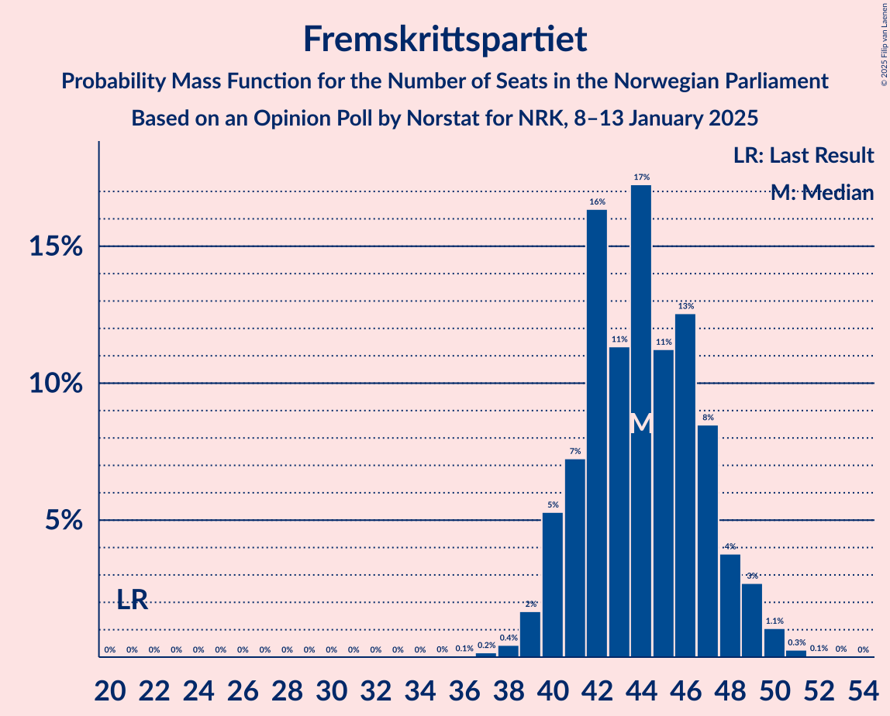
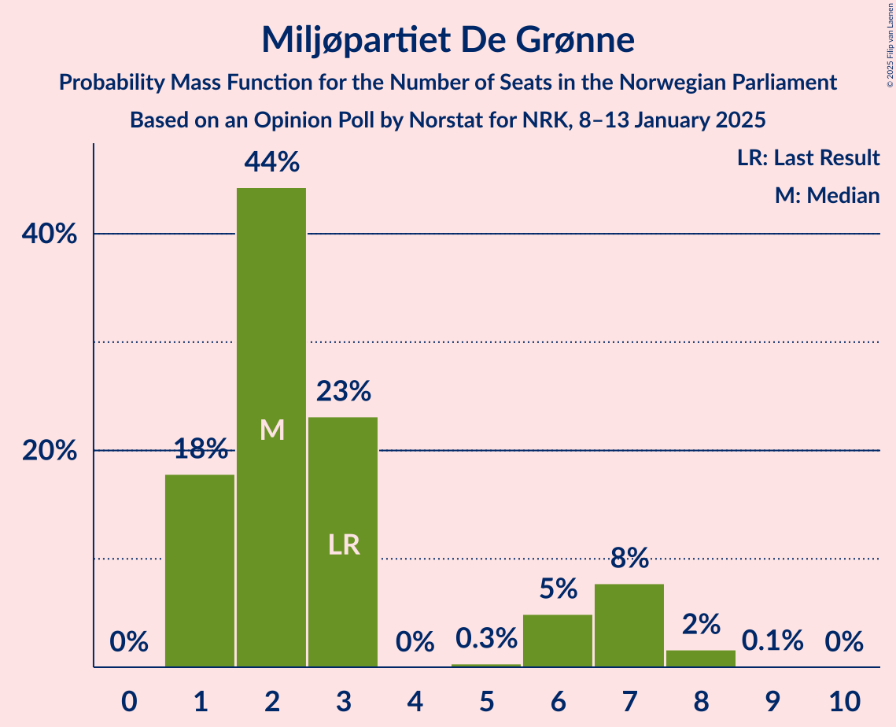
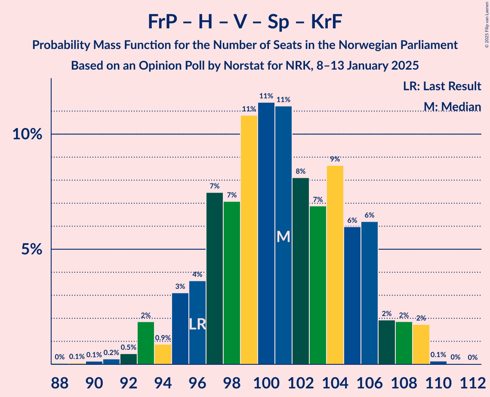
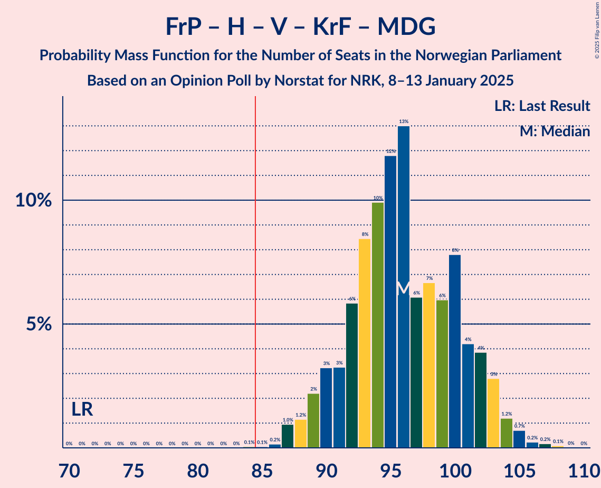
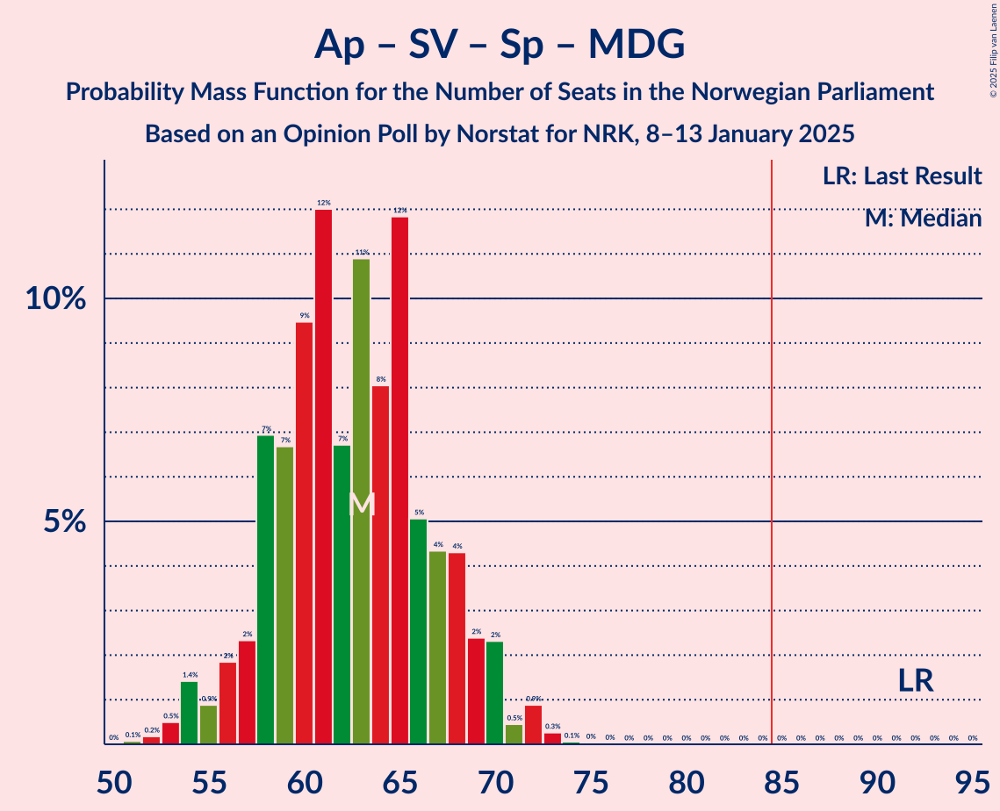
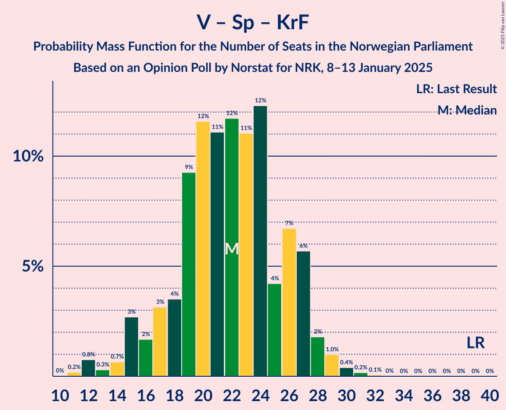

# Opinion Poll by Norstat for NRK, 8–13 January 2025

<a href="#voting-intentions">Voting Intentions</a> | <a href="#seats">Seats</a> | <a href="#coalitions">Coalitions</a> | <a href="#technical-information">Technical Information</a>

## Voting Intentions

### Confidence Intervals

| Party | Last Result | Poll Result | 80% Confidence Interval | 90% Confidence Interval | 95% Confidence Interval | 99% Confidence Interval |
|:-----:|:-----------:|:-----------:|:-----------------------:|:-----------------------:|:-----------------------:|:-----------------------:|
| Fremskrittspartiet | 11.6% | 23.7% | 22.0–25.5% |21.6–26.0% |21.1–26.4% |20.4–27.3% |
| Arbeiderpartiet | 26.2% | 20.2% | 18.6–21.9% |18.2–22.4% |17.8–22.8% |17.1–23.6% |
| Høyre | 20.4% | 19.8% | 18.2–21.5% |17.8–21.9% |17.4–22.4% |16.7–23.2% |
| Sosialistisk Venstreparti | 7.6% | 8.7% | 7.6–9.9% |7.3–10.3% |7.1–10.6% |6.6–11.2% |
| Rødt | 4.7% | 5.9% | 5.1–7.0% |4.8–7.3% |4.6–7.6% |4.3–8.2% |
| Venstre | 4.6% | 5.8% | 5.0–6.9% |4.8–7.2% |4.5–7.5% |4.2–8.0% |
| Senterpartiet | 13.5% | 4.9% | 4.2–5.9% |3.9–6.2% |3.7–6.5% |3.4–7.0% |
| Kristelig Folkeparti | 3.8% | 3.9% | 3.2–4.8% |3.0–5.1% |2.9–5.3% |2.6–5.8% |
| Miljøpartiet De Grønne | 3.9% | 3.3% | 2.7–4.2% |2.5–4.4% |2.4–4.6% |2.1–5.1% |

*Note:* The poll result column reflects the actual value used in the calculations. Published results may vary slightly, and in addition be rounded to fewer digits.

## Seats

### Confidence Intervals

| Party | Last Result | Median | 80% Confidence Interval | 90% Confidence Interval | 95% Confidence Interval | 99% Confidence Interval |
|:-----:|:-----------:|:------:|:-----------------------:|:-----------------------:|:-----------------------:|:-----------------------:|
| <a href="#fremskrittspartiet">Fremskrittspartiet</a> | 21 | 44 | 41–47 |40–48 |40–49 |38–50 |
| <a href="#arbeiderpartiet">Arbeiderpartiet</a> | 48 | 38 | 35–41 |35–43 |34–44 |33–47 |
| <a href="#høyre">Høyre</a> | 36 | 35 | 32–39 |32–39 |31–40 |30–41 |
| <a href="#sosialistisk-venstreparti">Sosialistisk Venstreparti</a> | 13 | 14 | 11–17 |11–18 |10–18 |9–20 |
| <a href="#rødt">Rødt</a> | 8 | 10 | 8–12 |7–12 |7–13 |6–14 |
| <a href="#venstre">Venstre</a> | 8 | 9 | 8–12 |7–12 |7–13 |6–14 |
| <a href="#senterpartiet">Senterpartiet</a> | 28 | 8 | 6–10 |1–11 |0–11 |0–12 |
| <a href="#kristelig-folkeparti">Kristelig Folkeparti</a> | 3 | 3 | 2–8 |2–8 |2–9 |1–9 |
| <a href="#miljøpartiet-de-grønne">Miljøpartiet De Grønne</a> | 3 | 2 | 1–6 |1–7 |1–7 |1–8 |

### Fremskrittspartiet

*For a full overview of the results for this party, see the [Fremskrittspartiet](party-fremskrittspartiet.html) page.*

| Number of Seats | Probability | Accumulated | Special Marks |
|:---------------:|:-----------:|:-----------:|:-------------:|
| 21 | 0% | 100% | Last Result |
| 22 | 0% | 100% |  |
| 23 | 0% | 100% |  |
| 24 | 0% | 100% |  |
| 25 | 0% | 100% |  |
| 26 | 0% | 100% |  |
| 27 | 0% | 100% |  |
| 28 | 0% | 100% |  |
| 29 | 0% | 100% |  |
| 30 | 0% | 100% |  |
| 31 | 0% | 100% |  |
| 32 | 0% | 100% |  |
| 33 | 0% | 100% |  |
| 34 | 0% | 100% |  |
| 35 | 0% | 100% |  |
| 36 | 0.1% | 100% |  |
| 37 | 0.2% | 99.9% |  |
| 38 | 0.4% | 99.8% |  |
| 39 | 2% | 99.3% |  |
| 40 | 5% | 98% |  |
| 41 | 7% | 92% |  |
| 42 | 16% | 85% |  |
| 43 | 11% | 69% |  |
| 44 | 17% | 57% | Median |
| 45 | 11% | 40% |  |
| 46 | 13% | 29% |  |
| 47 | 8% | 16% |  |
| 48 | 4% | 8% |  |
| 49 | 3% | 4% |  |
| 50 | 1.1% | 1.4% |  |
| 51 | 0.3% | 0.4% |  |
| 52 | 0.1% | 0.1% |  |
| 53 | 0% | 0% |  |

### Arbeiderpartiet

*For a full overview of the results for this party, see the [Arbeiderpartiet](party-arbeiderpartiet.html) page.*

| Number of Seats | Probability | Accumulated | Special Marks |
|:---------------:|:-----------:|:-----------:|:-------------:|
| 32 | 0.2% | 100% |  |
| 33 | 1.3% | 99.8% |  |
| 34 | 3% | 98.6% |  |
| 35 | 8% | 95% |  |
| 36 | 16% | 88% |  |
| 37 | 20% | 72% |  |
| 38 | 16% | 52% | Median |
| 39 | 12% | 36% |  |
| 40 | 7% | 23% |  |
| 41 | 8% | 17% |  |
| 42 | 4% | 9% |  |
| 43 | 2% | 5% |  |
| 44 | 0.9% | 3% |  |
| 45 | 0.9% | 2% |  |
| 46 | 0.6% | 1.3% |  |
| 47 | 0.3% | 0.7% |  |
| 48 | 0.4% | 0.4% | Last Result |
| 49 | 0% | 0% |  |

### Høyre

*For a full overview of the results for this party, see the [Høyre](party-høyre.html) page.*

| Number of Seats | Probability | Accumulated | Special Marks |
|:---------------:|:-----------:|:-----------:|:-------------:|
| 28 | 0% | 100% |  |
| 29 | 0.2% | 99.9% |  |
| 30 | 1.5% | 99.7% |  |
| 31 | 2% | 98% |  |
| 32 | 16% | 97% |  |
| 33 | 14% | 81% |  |
| 34 | 14% | 67% |  |
| 35 | 11% | 53% | Median |
| 36 | 13% | 42% | Last Result |
| 37 | 9% | 29% |  |
| 38 | 10% | 21% |  |
| 39 | 6% | 11% |  |
| 40 | 4% | 5% |  |
| 41 | 0.8% | 1.1% |  |
| 42 | 0.2% | 0.3% |  |
| 43 | 0.1% | 0.1% |  |
| 44 | 0% | 0% |  |

### Sosialistisk Venstreparti

*For a full overview of the results for this party, see the [Sosialistisk Venstreparti](party-sosialistiskvenstreparti.html) page.*

| Number of Seats | Probability | Accumulated | Special Marks |
|:---------------:|:-----------:|:-----------:|:-------------:|
| 8 | 0.1% | 100% |  |
| 9 | 0.5% | 99.9% |  |
| 10 | 3% | 99.4% |  |
| 11 | 7% | 96% |  |
| 12 | 14% | 89% |  |
| 13 | 13% | 75% | Last Result |
| 14 | 17% | 62% | Median |
| 15 | 19% | 45% |  |
| 16 | 16% | 26% |  |
| 17 | 4% | 11% |  |
| 18 | 4% | 6% |  |
| 19 | 1.1% | 2% |  |
| 20 | 0.5% | 0.7% |  |
| 21 | 0.1% | 0.2% |  |
| 22 | 0% | 0% |  |

### Rødt

*For a full overview of the results for this party, see the [Rødt](party-rødt.html) page.*

| Number of Seats | Probability | Accumulated | Special Marks |
|:---------------:|:-----------:|:-----------:|:-------------:|
| 1 | 0.2% | 100% |  |
| 2 | 0% | 99.8% |  |
| 3 | 0% | 99.8% |  |
| 4 | 0% | 99.8% |  |
| 5 | 0% | 99.8% |  |
| 6 | 0.5% | 99.8% |  |
| 7 | 5% | 99.3% |  |
| 8 | 16% | 95% | Last Result |
| 9 | 22% | 78% |  |
| 10 | 25% | 56% | Median |
| 11 | 19% | 32% |  |
| 12 | 9% | 12% |  |
| 13 | 3% | 3% |  |
| 14 | 0.6% | 0.8% |  |
| 15 | 0.1% | 0.1% |  |
| 16 | 0% | 0% |  |

### Venstre

*For a full overview of the results for this party, see the [Venstre](party-venstre.html) page.*

| Number of Seats | Probability | Accumulated | Special Marks |
|:---------------:|:-----------:|:-----------:|:-------------:|
| 3 | 0.2% | 100% |  |
| 4 | 0% | 99.8% |  |
| 5 | 0% | 99.8% |  |
| 6 | 1.1% | 99.8% |  |
| 7 | 7% | 98.7% |  |
| 8 | 13% | 92% | Last Result |
| 9 | 28% | 78% | Median |
| 10 | 24% | 50% |  |
| 11 | 14% | 26% |  |
| 12 | 9% | 12% |  |
| 13 | 2% | 3% |  |
| 14 | 0.5% | 0.6% |  |
| 15 | 0.1% | 0.1% |  |
| 16 | 0% | 0% |  |

### Senterpartiet

*For a full overview of the results for this party, see the [Senterpartiet](party-senterpartiet.html) page.*

| Number of Seats | Probability | Accumulated | Special Marks |
|:---------------:|:-----------:|:-----------:|:-------------:|
| 0 | 3% | 100% |  |
| 1 | 4% | 97% |  |
| 2 | 0.1% | 92% |  |
| 3 | 0% | 92% |  |
| 4 | 0% | 92% |  |
| 5 | 0.7% | 92% |  |
| 6 | 6% | 92% |  |
| 7 | 26% | 85% |  |
| 8 | 22% | 60% | Median |
| 9 | 21% | 38% |  |
| 10 | 11% | 16% |  |
| 11 | 4% | 6% |  |
| 12 | 2% | 2% |  |
| 13 | 0.2% | 0.2% |  |
| 14 | 0% | 0% |  |
| 15 | 0% | 0% |  |
| 16 | 0% | 0% |  |
| 17 | 0% | 0% |  |
| 18 | 0% | 0% |  |
| 19 | 0% | 0% |  |
| 20 | 0% | 0% |  |
| 21 | 0% | 0% |  |
| 22 | 0% | 0% |  |
| 23 | 0% | 0% |  |
| 24 | 0% | 0% |  |
| 25 | 0% | 0% |  |
| 26 | 0% | 0% |  |
| 27 | 0% | 0% |  |
| 28 | 0% | 0% | Last Result |

### Kristelig Folkeparti

*For a full overview of the results for this party, see the [Kristelig Folkeparti](party-kristeligfolkeparti.html) page.*

| Number of Seats | Probability | Accumulated | Special Marks |
|:---------------:|:-----------:|:-----------:|:-------------:|
| 0 | 0.1% | 100% |  |
| 1 | 1.2% | 99.9% |  |
| 2 | 22% | 98.8% |  |
| 3 | 29% | 77% | Last Result, Median |
| 4 | 0% | 47% |  |
| 5 | 0.2% | 47% |  |
| 6 | 13% | 47% |  |
| 7 | 23% | 34% |  |
| 8 | 8% | 10% |  |
| 9 | 2% | 3% |  |
| 10 | 0.4% | 0.4% |  |
| 11 | 0% | 0% |  |

### Miljøpartiet De Grønne

*For a full overview of the results for this party, see the [Miljøpartiet De Grønne](party-miljøpartietdegrønne.html) page.*

| Number of Seats | Probability | Accumulated | Special Marks |
|:---------------:|:-----------:|:-----------:|:-------------:|
| 1 | 18% | 100% |  |
| 2 | 44% | 82% | Median |
| 3 | 23% | 38% | Last Result |
| 4 | 0% | 15% |  |
| 5 | 0.3% | 15% |  |
| 6 | 5% | 14% |  |
| 7 | 8% | 10% |  |
| 8 | 2% | 2% |  |
| 9 | 0.1% | 0.1% |  |
| 10 | 0% | 0% |  |

## Coalitions

### Confidence Intervals

| Coalition | Last Result | Median | Majority? | 80% Confidence Interval | 90% Confidence Interval | 95% Confidence Interval | 99% Confidence Interval |
|:---------:|:-----------:|:------:|:---------:|:-----------------------:|:-----------------------:|:-----------------------:|:-----------------------:|
| Fremskrittspartiet – Høyre – Venstre – Senterpartiet – Kristelig Folkeparti | 96 | 101 | 100% | 96–106 | 95–107 | 93–108 | 91–109 |
| Fremskrittspartiet – Høyre – Venstre – Kristelig Folkeparti – Miljøpartiet De Grønne | 71 | 96 | 99.9% | 91–101 | 90–103 | 89–103 | 87–106 |
| Fremskrittspartiet – Høyre – Venstre – Kristelig Folkeparti | 68 | 93 | 99.3% | 88–98 | 87–100 | 86–101 | 84–103 |
| Fremskrittspartiet – Høyre – Venstre | 65 | 89 | 89% | 84–93 | 83–95 | 82–96 | 80–98 |
| Fremskrittspartiet – Høyre | 57 | 79 | 5% | 75–84 | 73–85 | 72–85 | 71–87 |
| Arbeiderpartiet – Sosialistisk Venstreparti – Rødt – Senterpartiet – Miljøpartiet De Grønne | 100 | 72 | 0.1% | 67–78 | 66–79 | 64–80 | 63–83 |
| Arbeiderpartiet – Sosialistisk Venstreparti – Rødt – Senterpartiet | 97 | 69 | 0% | 65–75 | 63–76 | 62–78 | 60–79 |
| Arbeiderpartiet – Sosialistisk Venstreparti – Senterpartiet – Kristelig Folkeparti – Miljøpartiet De Grønne | 95 | 67 | 0% | 62–72 | 61–74 | 60–75 | 58–77 |
| Arbeiderpartiet – Sosialistisk Venstreparti – Rødt – Miljøpartiet De Grønne | 72 | 64 | 0% | 60–70 | 59–71 | 58–73 | 56–75 |
| Arbeiderpartiet – Sosialistisk Venstreparti – Senterpartiet – Miljøpartiet De Grønne | 92 | 63 | 0% | 58–68 | 57–69 | 55–70 | 53–72 |
| Arbeiderpartiet – Sosialistisk Venstreparti – Senterpartiet | 89 | 60 | 0% | 56–64 | 54–66 | 52–67 | 51–69 |
| Arbeiderpartiet – Senterpartiet – Kristelig Folkeparti – Miljøpartiet De Grønne | 82 | 53 | 0% | 48–58 | 46–59 | 45–60 | 42–63 |
| Arbeiderpartiet – Sosialistisk Venstreparti | 61 | 52 | 0% | 49–56 | 48–57 | 47–58 | 46–60 |
| Arbeiderpartiet – Senterpartiet – Kristelig Folkeparti | 79 | 50 | 0% | 46–55 | 44–57 | 43–57 | 40–60 |
| Høyre – Venstre – Kristelig Folkeparti | 47 | 49 | 0% | 45–54 | 44–55 | 43–56 | 42–58 |
| Arbeiderpartiet – Senterpartiet | 76 | 46 | 0% | 42–50 | 40–51 | 37–52 | 36–55 |
| Venstre – Senterpartiet – Kristelig Folkeparti | 39 | 22 | 0% | 18–26 | 16–27 | 15–28 | 12–30 |

### Fremskrittspartiet – Høyre – Venstre – Senterpartiet – Kristelig Folkeparti

| Number of Seats | Probability | Accumulated | Special Marks |
|:---------------:|:-----------:|:-----------:|:-------------:|
| 88 | 0% | 100% |  |
| 89 | 0.1% | 99.9% |  |
| 90 | 0.1% | 99.9% |  |
| 91 | 0.2% | 99.7% |  |
| 92 | 0.5% | 99.5% |  |
| 93 | 2% | 99.0% |  |
| 94 | 0.9% | 97% |  |
| 95 | 3% | 96% |  |
| 96 | 4% | 93% | Last Result |
| 97 | 7% | 90% |  |
| 98 | 7% | 82% |  |
| 99 | 11% | 75% | Median |
| 100 | 11% | 64% |  |
| 101 | 11% | 53% |  |
| 102 | 8% | 42% |  |
| 103 | 7% | 33% |  |
| 104 | 9% | 27% |  |
| 105 | 6% | 18% |  |
| 106 | 6% | 12% |  |
| 107 | 2% | 6% |  |
| 108 | 2% | 4% |  |
| 109 | 2% | 2% |  |
| 110 | 0.1% | 0.2% |  |
| 111 | 0% | 0.1% |  |
| 112 | 0% | 0% |  |

### Fremskrittspartiet – Høyre – Venstre – Kristelig Folkeparti – Miljøpartiet De Grønne

| Number of Seats | Probability | Accumulated | Special Marks |
|:---------------:|:-----------:|:-----------:|:-------------:|
| 71 | 0% | 100% | Last Result |
| 72 | 0% | 100% |  |
| 73 | 0% | 100% |  |
| 74 | 0% | 100% |  |
| 75 | 0% | 100% |  |
| 76 | 0% | 100% |  |
| 77 | 0% | 100% |  |
| 78 | 0% | 100% |  |
| 79 | 0% | 100% |  |
| 80 | 0% | 100% |  |
| 81 | 0% | 100% |  |
| 82 | 0% | 100% |  |
| 83 | 0% | 100% |  |
| 84 | 0.1% | 100% |  |
| 85 | 0.1% | 99.9% | Majority |
| 86 | 0.2% | 99.9% |  |
| 87 | 1.0% | 99.7% |  |
| 88 | 1.2% | 98.8% |  |
| 89 | 2% | 98% |  |
| 90 | 3% | 95% |  |
| 91 | 3% | 92% |  |
| 92 | 6% | 89% |  |
| 93 | 8% | 83% | Median |
| 94 | 10% | 75% |  |
| 95 | 12% | 65% |  |
| 96 | 13% | 53% |  |
| 97 | 6% | 40% |  |
| 98 | 7% | 34% |  |
| 99 | 6% | 27% |  |
| 100 | 8% | 21% |  |
| 101 | 4% | 13% |  |
| 102 | 4% | 9% |  |
| 103 | 3% | 5% |  |
| 104 | 1.2% | 2% |  |
| 105 | 0.7% | 1.2% |  |
| 106 | 0.2% | 0.5% |  |
| 107 | 0.2% | 0.3% |  |
| 108 | 0.1% | 0.1% |  |
| 109 | 0% | 0% |  |

### Fremskrittspartiet – Høyre – Venstre – Kristelig Folkeparti

| Number of Seats | Probability | Accumulated | Special Marks |
|:---------------:|:-----------:|:-----------:|:-------------:|
| 68 | 0% | 100% | Last Result |
| 69 | 0% | 100% |  |
| 70 | 0% | 100% |  |
| 71 | 0% | 100% |  |
| 72 | 0% | 100% |  |
| 73 | 0% | 100% |  |
| 74 | 0% | 100% |  |
| 75 | 0% | 100% |  |
| 76 | 0% | 100% |  |
| 77 | 0% | 100% |  |
| 78 | 0% | 100% |  |
| 79 | 0% | 100% |  |
| 80 | 0% | 100% |  |
| 81 | 0% | 100% |  |
| 82 | 0.1% | 100% |  |
| 83 | 0.1% | 99.9% |  |
| 84 | 0.5% | 99.8% |  |
| 85 | 1.5% | 99.3% | Majority |
| 86 | 2% | 98% |  |
| 87 | 2% | 95% |  |
| 88 | 4% | 94% |  |
| 89 | 6% | 90% |  |
| 90 | 8% | 84% |  |
| 91 | 8% | 76% | Median |
| 92 | 12% | 68% |  |
| 93 | 11% | 56% |  |
| 94 | 9% | 45% |  |
| 95 | 8% | 36% |  |
| 96 | 8% | 28% |  |
| 97 | 4% | 20% |  |
| 98 | 8% | 16% |  |
| 99 | 3% | 8% |  |
| 100 | 1.3% | 6% |  |
| 101 | 3% | 4% |  |
| 102 | 1.1% | 2% |  |
| 103 | 0.4% | 0.6% |  |
| 104 | 0.2% | 0.3% |  |
| 105 | 0% | 0.1% |  |
| 106 | 0% | 0% |  |

### Fremskrittspartiet – Høyre – Venstre

| Number of Seats | Probability | Accumulated | Special Marks |
|:---------------:|:-----------:|:-----------:|:-------------:|
| 65 | 0% | 100% | Last Result |
| 66 | 0% | 100% |  |
| 67 | 0% | 100% |  |
| 68 | 0% | 100% |  |
| 69 | 0% | 100% |  |
| 70 | 0% | 100% |  |
| 71 | 0% | 100% |  |
| 72 | 0% | 100% |  |
| 73 | 0% | 100% |  |
| 74 | 0% | 100% |  |
| 75 | 0% | 100% |  |
| 76 | 0% | 100% |  |
| 77 | 0% | 100% |  |
| 78 | 0.1% | 100% |  |
| 79 | 0.1% | 99.9% |  |
| 80 | 0.4% | 99.8% |  |
| 81 | 1.1% | 99.4% |  |
| 82 | 2% | 98% |  |
| 83 | 4% | 96% |  |
| 84 | 4% | 93% |  |
| 85 | 9% | 89% | Majority |
| 86 | 7% | 80% |  |
| 87 | 14% | 73% |  |
| 88 | 8% | 59% | Median |
| 89 | 9% | 51% |  |
| 90 | 12% | 41% |  |
| 91 | 8% | 29% |  |
| 92 | 7% | 21% |  |
| 93 | 4% | 13% |  |
| 94 | 3% | 9% |  |
| 95 | 3% | 6% |  |
| 96 | 2% | 3% |  |
| 97 | 0.5% | 1.1% |  |
| 98 | 0.4% | 0.6% |  |
| 99 | 0.1% | 0.2% |  |
| 100 | 0% | 0.1% |  |
| 101 | 0% | 0% |  |

### Fremskrittspartiet – Høyre

| Number of Seats | Probability | Accumulated | Special Marks |
|:---------------:|:-----------:|:-----------:|:-------------:|
| 57 | 0% | 100% | Last Result |
| 58 | 0% | 100% |  |
| 59 | 0% | 100% |  |
| 60 | 0% | 100% |  |
| 61 | 0% | 100% |  |
| 62 | 0% | 100% |  |
| 63 | 0% | 100% |  |
| 64 | 0% | 100% |  |
| 65 | 0% | 100% |  |
| 66 | 0% | 100% |  |
| 67 | 0% | 100% |  |
| 68 | 0% | 100% |  |
| 69 | 0.1% | 100% |  |
| 70 | 0.1% | 99.9% |  |
| 71 | 0.5% | 99.8% |  |
| 72 | 2% | 99.3% |  |
| 73 | 3% | 97% |  |
| 74 | 3% | 95% |  |
| 75 | 6% | 91% |  |
| 76 | 7% | 85% |  |
| 77 | 10% | 78% |  |
| 78 | 14% | 68% |  |
| 79 | 8% | 54% | Median |
| 80 | 13% | 46% |  |
| 81 | 9% | 33% |  |
| 82 | 8% | 23% |  |
| 83 | 6% | 16% |  |
| 84 | 5% | 10% |  |
| 85 | 3% | 5% | Majority |
| 86 | 0.9% | 2% |  |
| 87 | 0.5% | 0.8% |  |
| 88 | 0.2% | 0.3% |  |
| 89 | 0% | 0.1% |  |
| 90 | 0% | 0.1% |  |
| 91 | 0% | 0% |  |

### Arbeiderpartiet – Sosialistisk Venstreparti – Rødt – Senterpartiet – Miljøpartiet De Grønne

| Number of Seats | Probability | Accumulated | Special Marks |
|:---------------:|:-----------:|:-----------:|:-------------:|
| 60 | 0.1% | 100% |  |
| 61 | 0.2% | 99.9% |  |
| 62 | 0.2% | 99.8% |  |
| 63 | 1.1% | 99.5% |  |
| 64 | 1.0% | 98% |  |
| 65 | 1.4% | 97% |  |
| 66 | 3% | 96% |  |
| 67 | 6% | 93% |  |
| 68 | 5% | 88% |  |
| 69 | 7% | 82% |  |
| 70 | 12% | 75% |  |
| 71 | 8% | 63% |  |
| 72 | 8% | 54% | Median |
| 73 | 8% | 47% |  |
| 74 | 7% | 38% |  |
| 75 | 8% | 32% |  |
| 76 | 7% | 23% |  |
| 77 | 4% | 16% |  |
| 78 | 4% | 12% |  |
| 79 | 4% | 8% |  |
| 80 | 2% | 4% |  |
| 81 | 0.7% | 2% |  |
| 82 | 0.7% | 2% |  |
| 83 | 0.5% | 0.9% |  |
| 84 | 0.3% | 0.3% |  |
| 85 | 0.1% | 0.1% | Majority |
| 86 | 0% | 0% |  |
| 87 | 0% | 0% |  |
| 88 | 0% | 0% |  |
| 89 | 0% | 0% |  |
| 90 | 0% | 0% |  |
| 91 | 0% | 0% |  |
| 92 | 0% | 0% |  |
| 93 | 0% | 0% |  |
| 94 | 0% | 0% |  |
| 95 | 0% | 0% |  |
| 96 | 0% | 0% |  |
| 97 | 0% | 0% |  |
| 98 | 0% | 0% |  |
| 99 | 0% | 0% |  |
| 100 | 0% | 0% | Last Result |

### Arbeiderpartiet – Sosialistisk Venstreparti – Rødt – Senterpartiet

| Number of Seats | Probability | Accumulated | Special Marks |
|:---------------:|:-----------:|:-----------:|:-------------:|
| 57 | 0% | 100% |  |
| 58 | 0.1% | 99.9% |  |
| 59 | 0.3% | 99.9% |  |
| 60 | 0.8% | 99.5% |  |
| 61 | 0.9% | 98.7% |  |
| 62 | 1.3% | 98% |  |
| 63 | 2% | 96% |  |
| 64 | 4% | 95% |  |
| 65 | 6% | 91% |  |
| 66 | 6% | 85% |  |
| 67 | 12% | 79% |  |
| 68 | 13% | 67% |  |
| 69 | 7% | 54% |  |
| 70 | 7% | 47% | Median |
| 71 | 4% | 40% |  |
| 72 | 13% | 36% |  |
| 73 | 5% | 23% |  |
| 74 | 7% | 18% |  |
| 75 | 3% | 12% |  |
| 76 | 4% | 8% |  |
| 77 | 2% | 4% |  |
| 78 | 2% | 3% |  |
| 79 | 0.9% | 1.3% |  |
| 80 | 0.2% | 0.4% |  |
| 81 | 0.1% | 0.1% |  |
| 82 | 0% | 0.1% |  |
| 83 | 0% | 0% |  |
| 84 | 0% | 0% |  |
| 85 | 0% | 0% | Majority |
| 86 | 0% | 0% |  |
| 87 | 0% | 0% |  |
| 88 | 0% | 0% |  |
| 89 | 0% | 0% |  |
| 90 | 0% | 0% |  |
| 91 | 0% | 0% |  |
| 92 | 0% | 0% |  |
| 93 | 0% | 0% |  |
| 94 | 0% | 0% |  |
| 95 | 0% | 0% |  |
| 96 | 0% | 0% |  |
| 97 | 0% | 0% | Last Result |

### Arbeiderpartiet – Sosialistisk Venstreparti – Senterpartiet – Kristelig Folkeparti – Miljøpartiet De Grønne

| Number of Seats | Probability | Accumulated | Special Marks |
|:---------------:|:-----------:|:-----------:|:-------------:|
| 54 | 0.1% | 100% |  |
| 55 | 0.1% | 99.9% |  |
| 56 | 0.1% | 99.9% |  |
| 57 | 0.3% | 99.8% |  |
| 58 | 0.4% | 99.5% |  |
| 59 | 0.8% | 99.1% |  |
| 60 | 2% | 98% |  |
| 61 | 5% | 96% |  |
| 62 | 4% | 91% |  |
| 63 | 5% | 87% |  |
| 64 | 9% | 82% |  |
| 65 | 6% | 73% | Median |
| 66 | 7% | 66% |  |
| 67 | 12% | 59% |  |
| 68 | 12% | 47% |  |
| 69 | 5% | 35% |  |
| 70 | 8% | 30% |  |
| 71 | 7% | 21% |  |
| 72 | 6% | 14% |  |
| 73 | 3% | 9% |  |
| 74 | 2% | 6% |  |
| 75 | 2% | 4% |  |
| 76 | 0.6% | 1.4% |  |
| 77 | 0.5% | 0.8% |  |
| 78 | 0.2% | 0.3% |  |
| 79 | 0.1% | 0.1% |  |
| 80 | 0% | 0% |  |
| 81 | 0% | 0% |  |
| 82 | 0% | 0% |  |
| 83 | 0% | 0% |  |
| 84 | 0% | 0% |  |
| 85 | 0% | 0% | Majority |
| 86 | 0% | 0% |  |
| 87 | 0% | 0% |  |
| 88 | 0% | 0% |  |
| 89 | 0% | 0% |  |
| 90 | 0% | 0% |  |
| 91 | 0% | 0% |  |
| 92 | 0% | 0% |  |
| 93 | 0% | 0% |  |
| 94 | 0% | 0% |  |
| 95 | 0% | 0% | Last Result |

### Arbeiderpartiet – Sosialistisk Venstreparti – Rødt – Miljøpartiet De Grønne

| Number of Seats | Probability | Accumulated | Special Marks |
|:---------------:|:-----------:|:-----------:|:-------------:|
| 54 | 0% | 100% |  |
| 55 | 0.2% | 99.9% |  |
| 56 | 0.3% | 99.8% |  |
| 57 | 0.6% | 99.5% |  |
| 58 | 2% | 98.9% |  |
| 59 | 3% | 97% |  |
| 60 | 5% | 93% |  |
| 61 | 8% | 88% |  |
| 62 | 13% | 81% |  |
| 63 | 9% | 68% |  |
| 64 | 12% | 59% | Median |
| 65 | 9% | 47% |  |
| 66 | 7% | 38% |  |
| 67 | 8% | 31% |  |
| 68 | 5% | 23% |  |
| 69 | 8% | 18% |  |
| 70 | 4% | 11% |  |
| 71 | 3% | 7% |  |
| 72 | 0.9% | 4% | Last Result |
| 73 | 2% | 3% |  |
| 74 | 0.2% | 0.8% |  |
| 75 | 0.4% | 0.6% |  |
| 76 | 0.1% | 0.2% |  |
| 77 | 0.1% | 0.1% |  |
| 78 | 0% | 0.1% |  |
| 79 | 0% | 0% |  |

### Arbeiderpartiet – Sosialistisk Venstreparti – Senterpartiet – Miljøpartiet De Grønne

| Number of Seats | Probability | Accumulated | Special Marks |
|:---------------:|:-----------:|:-----------:|:-------------:|
| 51 | 0.1% | 100% |  |
| 52 | 0.2% | 99.9% |  |
| 53 | 0.5% | 99.7% |  |
| 54 | 1.4% | 99.2% |  |
| 55 | 0.9% | 98% |  |
| 56 | 2% | 97% |  |
| 57 | 2% | 95% |  |
| 58 | 7% | 93% |  |
| 59 | 7% | 86% |  |
| 60 | 9% | 79% |  |
| 61 | 12% | 70% |  |
| 62 | 7% | 58% | Median |
| 63 | 11% | 51% |  |
| 64 | 8% | 40% |  |
| 65 | 12% | 32% |  |
| 66 | 5% | 20% |  |
| 67 | 4% | 15% |  |
| 68 | 4% | 11% |  |
| 69 | 2% | 6% |  |
| 70 | 2% | 4% |  |
| 71 | 0.5% | 2% |  |
| 72 | 0.9% | 1.3% |  |
| 73 | 0.3% | 0.4% |  |
| 74 | 0.1% | 0.1% |  |
| 75 | 0% | 0.1% |  |
| 76 | 0% | 0% |  |
| 77 | 0% | 0% |  |
| 78 | 0% | 0% |  |
| 79 | 0% | 0% |  |
| 80 | 0% | 0% |  |
| 81 | 0% | 0% |  |
| 82 | 0% | 0% |  |
| 83 | 0% | 0% |  |
| 84 | 0% | 0% |  |
| 85 | 0% | 0% | Majority |
| 86 | 0% | 0% |  |
| 87 | 0% | 0% |  |
| 88 | 0% | 0% |  |
| 89 | 0% | 0% |  |
| 90 | 0% | 0% |  |
| 91 | 0% | 0% |  |
| 92 | 0% | 0% | Last Result |

### Arbeiderpartiet – Sosialistisk Venstreparti – Senterpartiet

| Number of Seats | Probability | Accumulated | Special Marks |
|:---------------:|:-----------:|:-----------:|:-------------:|
| 49 | 0.2% | 100% |  |
| 50 | 0.2% | 99.8% |  |
| 51 | 0.8% | 99.6% |  |
| 52 | 2% | 98.8% |  |
| 53 | 1.3% | 97% |  |
| 54 | 2% | 96% |  |
| 55 | 3% | 94% |  |
| 56 | 6% | 90% |  |
| 57 | 8% | 84% |  |
| 58 | 17% | 76% |  |
| 59 | 9% | 59% |  |
| 60 | 8% | 50% | Median |
| 61 | 9% | 42% |  |
| 62 | 8% | 34% |  |
| 63 | 11% | 25% |  |
| 64 | 5% | 14% |  |
| 65 | 4% | 10% |  |
| 66 | 2% | 6% |  |
| 67 | 2% | 3% |  |
| 68 | 0.8% | 1.4% |  |
| 69 | 0.4% | 0.7% |  |
| 70 | 0.2% | 0.3% |  |
| 71 | 0% | 0.1% |  |
| 72 | 0% | 0% |  |
| 73 | 0% | 0% |  |
| 74 | 0% | 0% |  |
| 75 | 0% | 0% |  |
| 76 | 0% | 0% |  |
| 77 | 0% | 0% |  |
| 78 | 0% | 0% |  |
| 79 | 0% | 0% |  |
| 80 | 0% | 0% |  |
| 81 | 0% | 0% |  |
| 82 | 0% | 0% |  |
| 83 | 0% | 0% |  |
| 84 | 0% | 0% |  |
| 85 | 0% | 0% | Majority |
| 86 | 0% | 0% |  |
| 87 | 0% | 0% |  |
| 88 | 0% | 0% |  |
| 89 | 0% | 0% | Last Result |

### Arbeiderpartiet – Senterpartiet – Kristelig Folkeparti – Miljøpartiet De Grønne

| Number of Seats | Probability | Accumulated | Special Marks |
|:---------------:|:-----------:|:-----------:|:-------------:|
| 39 | 0.1% | 100% |  |
| 40 | 0.2% | 99.9% |  |
| 41 | 0.1% | 99.7% |  |
| 42 | 0.2% | 99.6% |  |
| 43 | 0.2% | 99.4% |  |
| 44 | 0.8% | 99.3% |  |
| 45 | 2% | 98% |  |
| 46 | 2% | 97% |  |
| 47 | 2% | 95% |  |
| 48 | 4% | 92% |  |
| 49 | 4% | 88% |  |
| 50 | 7% | 84% |  |
| 51 | 10% | 77% | Median |
| 52 | 13% | 67% |  |
| 53 | 9% | 54% |  |
| 54 | 9% | 44% |  |
| 55 | 9% | 36% |  |
| 56 | 7% | 27% |  |
| 57 | 6% | 20% |  |
| 58 | 4% | 14% |  |
| 59 | 6% | 10% |  |
| 60 | 2% | 4% |  |
| 61 | 0.7% | 2% |  |
| 62 | 0.6% | 1.4% |  |
| 63 | 0.4% | 0.8% |  |
| 64 | 0.3% | 0.4% |  |
| 65 | 0.1% | 0.2% |  |
| 66 | 0% | 0.1% |  |
| 67 | 0% | 0% |  |
| 68 | 0% | 0% |  |
| 69 | 0% | 0% |  |
| 70 | 0% | 0% |  |
| 71 | 0% | 0% |  |
| 72 | 0% | 0% |  |
| 73 | 0% | 0% |  |
| 74 | 0% | 0% |  |
| 75 | 0% | 0% |  |
| 76 | 0% | 0% |  |
| 77 | 0% | 0% |  |
| 78 | 0% | 0% |  |
| 79 | 0% | 0% |  |
| 80 | 0% | 0% |  |
| 81 | 0% | 0% |  |
| 82 | 0% | 0% | Last Result |

### Arbeiderpartiet – Sosialistisk Venstreparti

| Number of Seats | Probability | Accumulated | Special Marks |
|:---------------:|:-----------:|:-----------:|:-------------:|
| 44 | 0.1% | 100% |  |
| 45 | 0.2% | 99.9% |  |
| 46 | 0.9% | 99.6% |  |
| 47 | 2% | 98.7% |  |
| 48 | 4% | 96% |  |
| 49 | 8% | 92% |  |
| 50 | 16% | 84% |  |
| 51 | 18% | 69% |  |
| 52 | 9% | 50% | Median |
| 53 | 8% | 41% |  |
| 54 | 11% | 33% |  |
| 55 | 8% | 22% |  |
| 56 | 7% | 14% |  |
| 57 | 3% | 7% |  |
| 58 | 3% | 5% |  |
| 59 | 0.7% | 2% |  |
| 60 | 0.8% | 1.3% |  |
| 61 | 0.3% | 0.5% | Last Result |
| 62 | 0.1% | 0.2% |  |
| 63 | 0.1% | 0.1% |  |
| 64 | 0% | 0% |  |

### Arbeiderpartiet – Senterpartiet – Kristelig Folkeparti

| Number of Seats | Probability | Accumulated | Special Marks |
|:---------------:|:-----------:|:-----------:|:-------------:|
| 37 | 0.1% | 100% |  |
| 38 | 0.1% | 99.9% |  |
| 39 | 0.3% | 99.8% |  |
| 40 | 0.8% | 99.5% |  |
| 41 | 0.3% | 98.7% |  |
| 42 | 0.8% | 98% |  |
| 43 | 2% | 98% |  |
| 44 | 2% | 96% |  |
| 45 | 3% | 94% |  |
| 46 | 5% | 91% |  |
| 47 | 8% | 86% |  |
| 48 | 8% | 78% |  |
| 49 | 11% | 70% | Median |
| 50 | 12% | 59% |  |
| 51 | 8% | 47% |  |
| 52 | 11% | 39% |  |
| 53 | 9% | 29% |  |
| 54 | 7% | 19% |  |
| 55 | 3% | 12% |  |
| 56 | 3% | 8% |  |
| 57 | 3% | 5% |  |
| 58 | 1.1% | 2% |  |
| 59 | 0.3% | 1.3% |  |
| 60 | 0.5% | 0.9% |  |
| 61 | 0.2% | 0.4% |  |
| 62 | 0.1% | 0.1% |  |
| 63 | 0% | 0% |  |
| 64 | 0% | 0% |  |
| 65 | 0% | 0% |  |
| 66 | 0% | 0% |  |
| 67 | 0% | 0% |  |
| 68 | 0% | 0% |  |
| 69 | 0% | 0% |  |
| 70 | 0% | 0% |  |
| 71 | 0% | 0% |  |
| 72 | 0% | 0% |  |
| 73 | 0% | 0% |  |
| 74 | 0% | 0% |  |
| 75 | 0% | 0% |  |
| 76 | 0% | 0% |  |
| 77 | 0% | 0% |  |
| 78 | 0% | 0% |  |
| 79 | 0% | 0% | Last Result |

### Høyre – Venstre – Kristelig Folkeparti

| Number of Seats | Probability | Accumulated | Special Marks |
|:---------------:|:-----------:|:-----------:|:-------------:|
| 40 | 0% | 100% |  |
| 41 | 0.2% | 99.9% |  |
| 42 | 0.7% | 99.7% |  |
| 43 | 2% | 99.1% |  |
| 44 | 5% | 97% |  |
| 45 | 7% | 92% |  |
| 46 | 7% | 85% |  |
| 47 | 8% | 78% | Last Result, Median |
| 48 | 11% | 71% |  |
| 49 | 16% | 60% |  |
| 50 | 11% | 44% |  |
| 51 | 7% | 32% |  |
| 52 | 6% | 25% |  |
| 53 | 6% | 20% |  |
| 54 | 7% | 13% |  |
| 55 | 3% | 6% |  |
| 56 | 1.0% | 3% |  |
| 57 | 1.3% | 2% |  |
| 58 | 0.4% | 0.6% |  |
| 59 | 0.1% | 0.2% |  |
| 60 | 0% | 0.1% |  |
| 61 | 0% | 0% |  |

### Arbeiderpartiet – Senterpartiet

| Number of Seats | Probability | Accumulated | Special Marks |
|:---------------:|:-----------:|:-----------:|:-------------:|
| 34 | 0.1% | 100% |  |
| 35 | 0.1% | 99.9% |  |
| 36 | 1.2% | 99.8% |  |
| 37 | 1.2% | 98.6% |  |
| 38 | 0.7% | 97% |  |
| 39 | 0.9% | 97% |  |
| 40 | 1.1% | 96% |  |
| 41 | 3% | 95% |  |
| 42 | 3% | 92% |  |
| 43 | 10% | 89% |  |
| 44 | 13% | 79% |  |
| 45 | 11% | 66% |  |
| 46 | 18% | 55% | Median |
| 47 | 12% | 37% |  |
| 48 | 7% | 25% |  |
| 49 | 6% | 17% |  |
| 50 | 5% | 11% |  |
| 51 | 2% | 6% |  |
| 52 | 2% | 4% |  |
| 53 | 0.7% | 2% |  |
| 54 | 0.6% | 1.3% |  |
| 55 | 0.6% | 0.7% |  |
| 56 | 0.1% | 0.1% |  |
| 57 | 0% | 0% |  |
| 58 | 0% | 0% |  |
| 59 | 0% | 0% |  |
| 60 | 0% | 0% |  |
| 61 | 0% | 0% |  |
| 62 | 0% | 0% |  |
| 63 | 0% | 0% |  |
| 64 | 0% | 0% |  |
| 65 | 0% | 0% |  |
| 66 | 0% | 0% |  |
| 67 | 0% | 0% |  |
| 68 | 0% | 0% |  |
| 69 | 0% | 0% |  |
| 70 | 0% | 0% |  |
| 71 | 0% | 0% |  |
| 72 | 0% | 0% |  |
| 73 | 0% | 0% |  |
| 74 | 0% | 0% |  |
| 75 | 0% | 0% |  |
| 76 | 0% | 0% | Last Result |

### Venstre – Senterpartiet – Kristelig Folkeparti

| Number of Seats | Probability | Accumulated | Special Marks |
|:---------------:|:-----------:|:-----------:|:-------------:|
| 11 | 0.2% | 100% |  |
| 12 | 0.8% | 99.8% |  |
| 13 | 0.3% | 99.0% |  |
| 14 | 0.7% | 98.7% |  |
| 15 | 3% | 98% |  |
| 16 | 2% | 95% |  |
| 17 | 3% | 94% |  |
| 18 | 4% | 91% |  |
| 19 | 9% | 87% |  |
| 20 | 12% | 78% | Median |
| 21 | 11% | 66% |  |
| 22 | 12% | 55% |  |
| 23 | 11% | 43% |  |
| 24 | 12% | 32% |  |
| 25 | 4% | 20% |  |
| 26 | 7% | 16% |  |
| 27 | 6% | 9% |  |
| 28 | 2% | 3% |  |
| 29 | 1.0% | 2% |  |
| 30 | 0.4% | 0.6% |  |
| 31 | 0.2% | 0.2% |  |
| 32 | 0.1% | 0.1% |  |
| 33 | 0% | 0% |  |
| 34 | 0% | 0% |  |
| 35 | 0% | 0% |  |
| 36 | 0% | 0% |  |
| 37 | 0% | 0% |  |
| 38 | 0% | 0% |  |
| 39 | 0% | 0% | Last Result |

## Technical Information

### Opinion Poll

+ **Polling firm:** Norstat
+ **Commissioner(s):** NRK
+ **Fieldwork period:** 8–13 January 2025

### Calculations

+ **Sample size:** 992
+ **Simulations done:** 2,097,152
+ **Error estimate:** 1.16%

