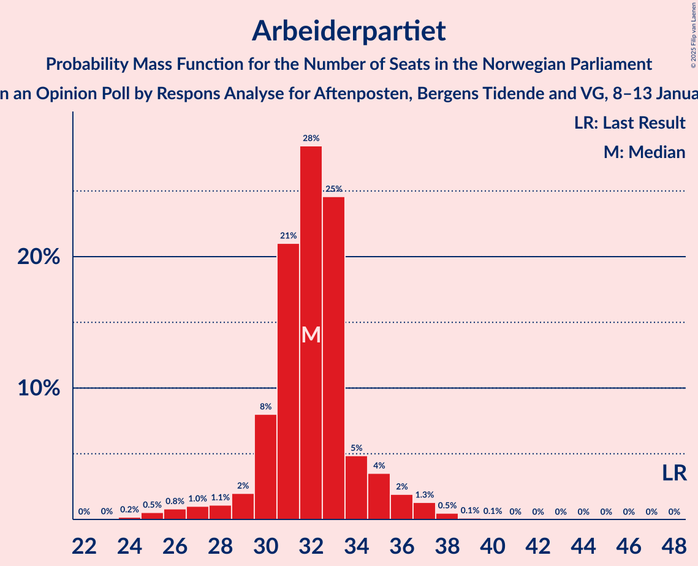
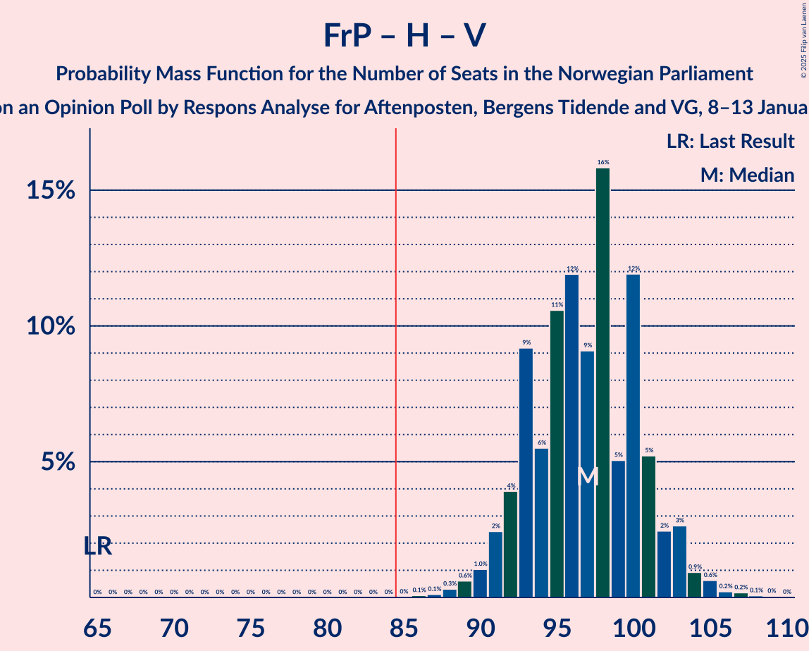
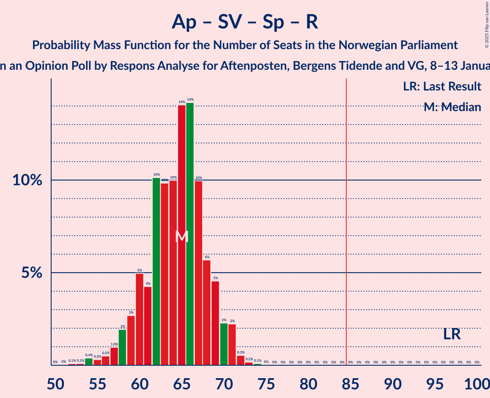
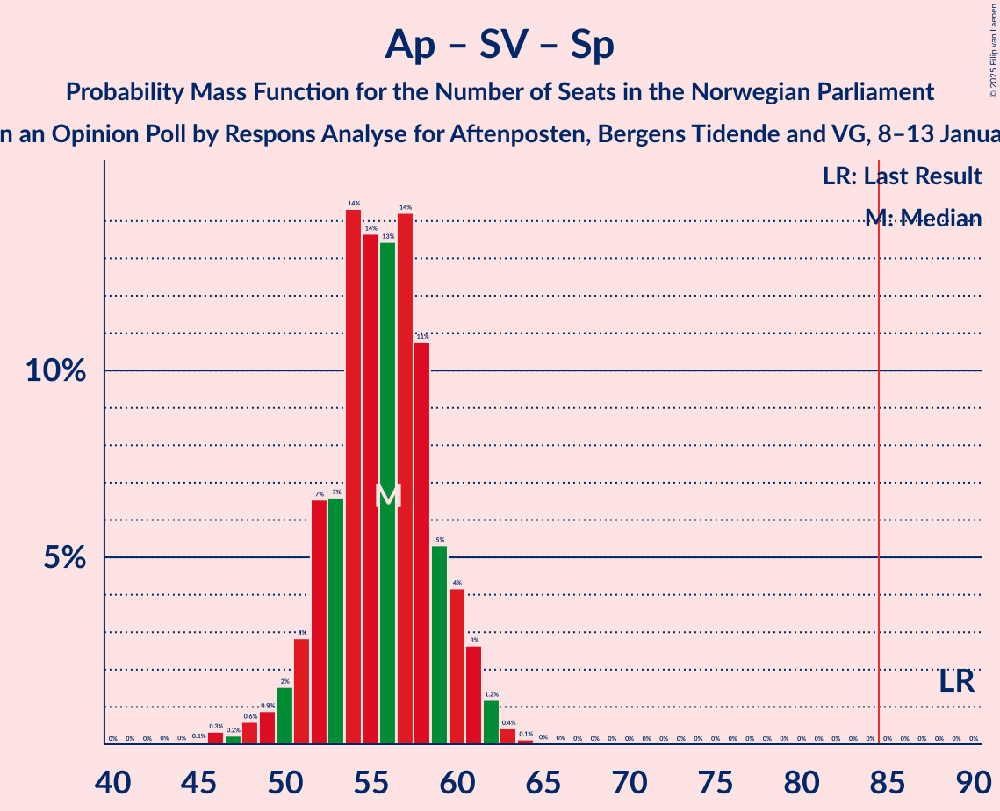
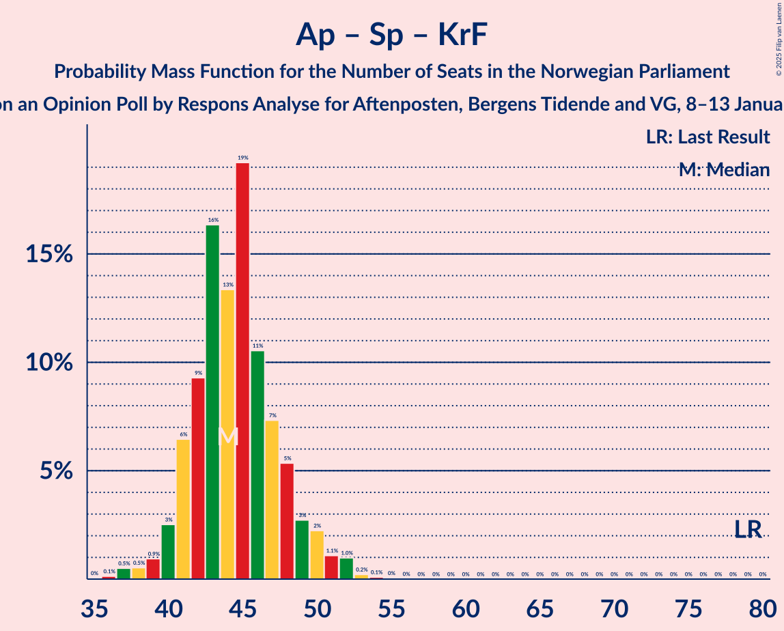

# Opinion Poll by Respons Analyse for Aftenposten, Bergens Tidende and VG, 8–13 January 2025

<a href="#voting-intentions">Voting Intentions</a> | <a href="#seats">Seats</a> | <a href="#coalitions">Coalitions</a> | <a href="#technical-information">Technical Information</a>

## Voting Intentions

### Confidence Intervals

| Party | Last Result | Poll Result | 80% Confidence Interval | 90% Confidence Interval | 95% Confidence Interval | 99% Confidence Interval |
|:-----:|:-----------:|:-----------:|:-----------------------:|:-----------------------:|:-----------------------:|:-----------------------:|
| Fremskrittspartiet | 11.6% | 24.5% | 22.8–26.3% |22.3–26.8% |21.9–27.3% |21.1–28.2% |
| Høyre | 20.4% | 24.0% | 22.3–25.8% |21.9–26.3% |21.4–26.7% |20.7–27.6% |
| Arbeiderpartiet | 26.2% | 16.7% | 15.3–18.3% |14.9–18.7% |14.5–19.1% |13.9–19.9% |
| Sosialistisk Venstreparti | 7.6% | 7.7% | 6.7–8.9% |6.4–9.2% |6.2–9.5% |5.8–10.1% |
| Senterpartiet | 13.5% | 6.1% | 5.2–7.2% |5.0–7.5% |4.8–7.8% |4.4–8.3% |
| Venstre | 4.6% | 5.9% | 5.0–7.0% |4.8–7.3% |4.6–7.5% |4.2–8.1% |
| Rødt | 4.7% | 5.2% | 4.4–6.2% |4.2–6.5% |4.0–6.8% |3.6–7.3% |
| Miljøpartiet De Grønne | 3.9% | 3.8% | 3.1–4.7% |2.9–5.0% |2.8–5.2% |2.5–5.6% |
| Kristelig Folkeparti | 3.8% | 3.1% | 2.5–3.9% |2.3–4.2% |2.2–4.4% |1.9–4.8% |

*Note:* The poll result column reflects the actual value used in the calculations. Published results may vary slightly, and in addition be rounded to fewer digits.

## Seats

### Confidence Intervals

| Party | Last Result | Median | 80% Confidence Interval | 90% Confidence Interval | 95% Confidence Interval | 99% Confidence Interval |
|:-----:|:-----------:|:------:|:-----------------------:|:-----------------------:|:-----------------------:|:-----------------------:|
| <a href="#fremskrittspartiet">Fremskrittspartiet</a> | 21 | 44 | 42–47 |41–49 |40–49 |39–52 |
| <a href="#høyre">Høyre</a> | 36 | 42 | 39–46 |38–47 |37–48 |36–49 |
| <a href="#arbeiderpartiet">Arbeiderpartiet</a> | 48 | 32 | 30–34 |29–35 |27–36 |25–38 |
| <a href="#sosialistisk-venstreparti">Sosialistisk Venstreparti</a> | 13 | 13 | 11–16 |11–16 |10–17 |9–18 |
| <a href="#senterpartiet">Senterpartiet</a> | 28 | 10 | 8–12 |8–13 |8–14 |7–15 |
| <a href="#venstre">Venstre</a> | 8 | 10 | 8–12 |8–13 |8–13 |7–14 |
| <a href="#rødt">Rødt</a> | 8 | 9 | 7–10 |7–11 |1–11 |1–12 |
| <a href="#miljøpartiet-de-grønne">Miljøpartiet De Grønne</a> | 3 | 3 | 2–8 |1–8 |1–9 |1–9 |
| <a href="#kristelig-folkeparti">Kristelig Folkeparti</a> | 3 | 1 | 1–6 |1–7 |0–7 |0–8 |

### Fremskrittspartiet

*For a full overview of the results for this party, see the [Fremskrittspartiet](party-fremskrittspartiet.html) page.*

| Number of Seats | Probability | Accumulated | Special Marks |
|:---------------:|:-----------:|:-----------:|:-------------:|
| 21 | 0% | 100% | Last Result |
| 22 | 0% | 100% |  |
| 23 | 0% | 100% |  |
| 24 | 0% | 100% |  |
| 25 | 0% | 100% |  |
| 26 | 0% | 100% |  |
| 27 | 0% | 100% |  |
| 28 | 0% | 100% |  |
| 29 | 0% | 100% |  |
| 30 | 0% | 100% |  |
| 31 | 0% | 100% |  |
| 32 | 0% | 100% |  |
| 33 | 0% | 100% |  |
| 34 | 0% | 100% |  |
| 35 | 0% | 100% |  |
| 36 | 0% | 100% |  |
| 37 | 0.1% | 100% |  |
| 38 | 0.3% | 99.9% |  |
| 39 | 1.1% | 99.6% |  |
| 40 | 1.4% | 98.5% |  |
| 41 | 4% | 97% |  |
| 42 | 9% | 93% |  |
| 43 | 28% | 84% |  |
| 44 | 20% | 56% | Median |
| 45 | 12% | 36% |  |
| 46 | 8% | 24% |  |
| 47 | 7% | 16% |  |
| 48 | 4% | 10% |  |
| 49 | 4% | 6% |  |
| 50 | 1.0% | 2% |  |
| 51 | 0.3% | 1.1% |  |
| 52 | 0.4% | 0.7% |  |
| 53 | 0.1% | 0.4% |  |
| 54 | 0.1% | 0.2% |  |
| 55 | 0.1% | 0.1% |  |
| 56 | 0% | 0.1% |  |
| 57 | 0% | 0% |  |

### Høyre

*For a full overview of the results for this party, see the [Høyre](party-høyre.html) page.*

| Number of Seats | Probability | Accumulated | Special Marks |
|:---------------:|:-----------:|:-----------:|:-------------:|
| 33 | 0% | 100% |  |
| 34 | 0.1% | 99.9% |  |
| 35 | 0.3% | 99.9% |  |
| 36 | 0.9% | 99.5% | Last Result |
| 37 | 2% | 98.6% |  |
| 38 | 2% | 97% |  |
| 39 | 8% | 94% |  |
| 40 | 13% | 86% |  |
| 41 | 12% | 73% |  |
| 42 | 11% | 61% | Median |
| 43 | 12% | 50% |  |
| 44 | 12% | 38% |  |
| 45 | 7% | 26% |  |
| 46 | 9% | 19% |  |
| 47 | 5% | 10% |  |
| 48 | 3% | 4% |  |
| 49 | 0.9% | 1.2% |  |
| 50 | 0.2% | 0.3% |  |
| 51 | 0.1% | 0.1% |  |
| 52 | 0% | 0% |  |

### Arbeiderpartiet

*For a full overview of the results for this party, see the [Arbeiderpartiet](party-arbeiderpartiet.html) page.*

| Number of Seats | Probability | Accumulated | Special Marks |
|:---------------:|:-----------:|:-----------:|:-------------:|
| 23 | 0% | 100% |  |
| 24 | 0.2% | 99.9% |  |
| 25 | 0.8% | 99.7% |  |
| 26 | 1.1% | 98.9% |  |
| 27 | 0.6% | 98% |  |
| 28 | 1.2% | 97% |  |
| 29 | 3% | 96% |  |
| 30 | 8% | 93% |  |
| 31 | 24% | 85% |  |
| 32 | 28% | 61% | Median |
| 33 | 19% | 33% |  |
| 34 | 6% | 14% |  |
| 35 | 4% | 8% |  |
| 36 | 2% | 4% |  |
| 37 | 1.2% | 2% |  |
| 38 | 0.5% | 0.7% |  |
| 39 | 0.1% | 0.2% |  |
| 40 | 0% | 0.1% |  |
| 41 | 0% | 0% |  |
| 42 | 0% | 0% |  |
| 43 | 0% | 0% |  |
| 44 | 0% | 0% |  |
| 45 | 0% | 0% |  |
| 46 | 0% | 0% |  |
| 47 | 0% | 0% |  |
| 48 | 0% | 0% | Last Result |

### Sosialistisk Venstreparti

*For a full overview of the results for this party, see the [Sosialistisk Venstreparti](party-sosialistiskvenstreparti.html) page.*

| Number of Seats | Probability | Accumulated | Special Marks |
|:---------------:|:-----------:|:-----------:|:-------------:|
| 8 | 0.1% | 100% |  |
| 9 | 0.9% | 99.9% |  |
| 10 | 4% | 99.0% |  |
| 11 | 10% | 95% |  |
| 12 | 20% | 85% |  |
| 13 | 27% | 65% | Last Result, Median |
| 14 | 18% | 37% |  |
| 15 | 9% | 19% |  |
| 16 | 7% | 10% |  |
| 17 | 2% | 3% |  |
| 18 | 0.5% | 0.7% |  |
| 19 | 0.1% | 0.1% |  |
| 20 | 0% | 0% |  |

### Senterpartiet

*For a full overview of the results for this party, see the [Senterpartiet](party-senterpartiet.html) page.*

| Number of Seats | Probability | Accumulated | Special Marks |
|:---------------:|:-----------:|:-----------:|:-------------:|
| 1 | 0.1% | 100% |  |
| 2 | 0% | 99.9% |  |
| 3 | 0% | 99.9% |  |
| 4 | 0% | 99.9% |  |
| 5 | 0% | 99.9% |  |
| 6 | 0.1% | 99.9% |  |
| 7 | 2% | 99.8% |  |
| 8 | 10% | 98% |  |
| 9 | 18% | 88% |  |
| 10 | 20% | 70% | Median |
| 11 | 26% | 50% |  |
| 12 | 15% | 24% |  |
| 13 | 5% | 9% |  |
| 14 | 3% | 4% |  |
| 15 | 0.6% | 0.7% |  |
| 16 | 0.1% | 0.1% |  |
| 17 | 0% | 0% |  |
| 18 | 0% | 0% |  |
| 19 | 0% | 0% |  |
| 20 | 0% | 0% |  |
| 21 | 0% | 0% |  |
| 22 | 0% | 0% |  |
| 23 | 0% | 0% |  |
| 24 | 0% | 0% |  |
| 25 | 0% | 0% |  |
| 26 | 0% | 0% |  |
| 27 | 0% | 0% |  |
| 28 | 0% | 0% | Last Result |

### Venstre

*For a full overview of the results for this party, see the [Venstre](party-venstre.html) page.*

| Number of Seats | Probability | Accumulated | Special Marks |
|:---------------:|:-----------:|:-----------:|:-------------:|
| 3 | 0.1% | 100% |  |
| 4 | 0% | 99.8% |  |
| 5 | 0% | 99.8% |  |
| 6 | 0.2% | 99.8% |  |
| 7 | 2% | 99.7% |  |
| 8 | 8% | 98% | Last Result |
| 9 | 26% | 90% |  |
| 10 | 22% | 64% | Median |
| 11 | 25% | 42% |  |
| 12 | 10% | 17% |  |
| 13 | 6% | 7% |  |
| 14 | 0.7% | 0.8% |  |
| 15 | 0.1% | 0.1% |  |
| 16 | 0% | 0% |  |

### Rødt

*For a full overview of the results for this party, see the [Rødt](party-rødt.html) page.*

| Number of Seats | Probability | Accumulated | Special Marks |
|:---------------:|:-----------:|:-----------:|:-------------:|
| 1 | 3% | 100% |  |
| 2 | 0% | 97% |  |
| 3 | 0% | 97% |  |
| 4 | 0% | 97% |  |
| 5 | 0% | 97% |  |
| 6 | 0.9% | 97% |  |
| 7 | 9% | 96% |  |
| 8 | 21% | 87% | Last Result |
| 9 | 33% | 66% | Median |
| 10 | 23% | 33% |  |
| 11 | 7% | 9% |  |
| 12 | 1.5% | 2% |  |
| 13 | 0.4% | 0.4% |  |
| 14 | 0.1% | 0.1% |  |
| 15 | 0% | 0% |  |

### Miljøpartiet De Grønne

*For a full overview of the results for this party, see the [Miljøpartiet De Grønne](party-miljøpartietdegrønne.html) page.*

| Number of Seats | Probability | Accumulated | Special Marks |
|:---------------:|:-----------:|:-----------:|:-------------:|
| 1 | 7% | 100% |  |
| 2 | 31% | 93% |  |
| 3 | 22% | 62% | Last Result, Median |
| 4 | 0% | 40% |  |
| 5 | 0% | 40% |  |
| 6 | 3% | 40% |  |
| 7 | 25% | 36% |  |
| 8 | 9% | 12% |  |
| 9 | 2% | 3% |  |
| 10 | 0.3% | 0.4% |  |
| 11 | 0% | 0% |  |

### Kristelig Folkeparti

*For a full overview of the results for this party, see the [Kristelig Folkeparti](party-kristeligfolkeparti.html) page.*

| Number of Seats | Probability | Accumulated | Special Marks |
|:---------------:|:-----------:|:-----------:|:-------------:|
| 0 | 5% | 100% |  |
| 1 | 45% | 95% | Median |
| 2 | 21% | 50% |  |
| 3 | 18% | 29% | Last Result |
| 4 | 0% | 11% |  |
| 5 | 0% | 11% |  |
| 6 | 2% | 11% |  |
| 7 | 7% | 9% |  |
| 8 | 1.2% | 1.3% |  |
| 9 | 0.1% | 0.1% |  |
| 10 | 0% | 0% |  |

## Coalitions

### Confidence Intervals

| Coalition | Last Result | Median | Majority? | 80% Confidence Interval | 90% Confidence Interval | 95% Confidence Interval | 99% Confidence Interval |
|:---------:|:-----------:|:------:|:---------:|:-----------------------:|:-----------------------:|:-----------------------:|:-----------------------:|
| Fremskrittspartiet – Høyre – Senterpartiet – Venstre – Kristelig Folkeparti | 96 | 110 | 100% | 105–113 | 104–115 | 103–116 | 101–119 |
| Fremskrittspartiet – Høyre – Venstre – Miljøpartiet De Grønne – Kristelig Folkeparti | 71 | 103 | 100% | 99–108 | 98–109 | 97–110 | 95–114 |
| Fremskrittspartiet – Høyre – Venstre – Kristelig Folkeparti | 68 | 99 | 100% | 95–103 | 93–105 | 92–106 | 90–108 |
| Fremskrittspartiet – Høyre – Venstre | 65 | 97 | 100% | 93–101 | 91–103 | 90–103 | 88–105 |
| Fremskrittspartiet – Høyre | 57 | 87 | 76% | 83–91 | 81–92 | 80–93 | 79–96 |
| Arbeiderpartiet – Sosialistisk Venstreparti – Senterpartiet – Rødt – Miljøpartiet De Grønne | 100 | 69 | 0% | 64–73 | 62–74 | 61–75 | 58–78 |
| Arbeiderpartiet – Sosialistisk Venstreparti – Senterpartiet – Rødt | 97 | 64 | 0% | 60–69 | 58–70 | 57–71 | 54–72 |
| Arbeiderpartiet – Sosialistisk Venstreparti – Senterpartiet – Miljøpartiet De Grønne – Kristelig Folkeparti | 95 | 62 | 0% | 58–66 | 56–68 | 55–69 | 53–71 |
| Arbeiderpartiet – Sosialistisk Venstreparti – Senterpartiet – Miljøpartiet De Grønne | 92 | 60 | 0% | 56–64 | 54–65 | 53–67 | 51–69 |
| Arbeiderpartiet – Sosialistisk Venstreparti – Rødt – Miljøpartiet De Grønne | 72 | 58 | 0% | 54–62 | 53–64 | 51–64 | 48–66 |
| Arbeiderpartiet – Sosialistisk Venstreparti – Senterpartiet | 89 | 55 | 0% | 52–60 | 51–60 | 49–61 | 46–63 |
| Høyre – Venstre – Kristelig Folkeparti | 47 | 55 | 0% | 50–59 | 50–60 | 49–61 | 47–63 |
| Arbeiderpartiet – Senterpartiet – Miljøpartiet De Grønne – Kristelig Folkeparti | 82 | 49 | 0% | 44–53 | 44–54 | 43–55 | 40–58 |
| Arbeiderpartiet – Senterpartiet – Kristelig Folkeparti | 79 | 44 | 0% | 41–48 | 40–50 | 40–51 | 37–52 |
| Arbeiderpartiet – Sosialistisk Venstreparti | 61 | 45 | 0% | 42–48 | 41–49 | 40–50 | 37–52 |
| Arbeiderpartiet – Senterpartiet | 76 | 42 | 0% | 39–45 | 39–46 | 37–47 | 35–49 |
| Senterpartiet – Venstre – Kristelig Folkeparti | 39 | 23 | 0% | 19–26 | 18–27 | 18–28 | 17–30 |

### Fremskrittspartiet – Høyre – Senterpartiet – Venstre – Kristelig Folkeparti

| Number of Seats | Probability | Accumulated | Special Marks |
|:---------------:|:-----------:|:-----------:|:-------------:|
| 96 | 0% | 100% | Last Result |
| 97 | 0% | 100% |  |
| 98 | 0% | 100% |  |
| 99 | 0% | 100% |  |
| 100 | 0.2% | 99.9% |  |
| 101 | 0.4% | 99.7% |  |
| 102 | 0.9% | 99.3% |  |
| 103 | 1.3% | 98% |  |
| 104 | 5% | 97% |  |
| 105 | 3% | 92% |  |
| 106 | 5% | 90% |  |
| 107 | 13% | 84% | Median |
| 108 | 10% | 72% |  |
| 109 | 11% | 62% |  |
| 110 | 10% | 51% |  |
| 111 | 9% | 41% |  |
| 112 | 16% | 32% |  |
| 113 | 7% | 16% |  |
| 114 | 4% | 9% |  |
| 115 | 2% | 5% |  |
| 116 | 1.1% | 3% |  |
| 117 | 1.3% | 2% |  |
| 118 | 0.4% | 1.1% |  |
| 119 | 0.5% | 0.7% |  |
| 120 | 0.1% | 0.2% |  |
| 121 | 0.1% | 0.1% |  |
| 122 | 0% | 0% |  |

### Fremskrittspartiet – Høyre – Venstre – Miljøpartiet De Grønne – Kristelig Folkeparti

| Number of Seats | Probability | Accumulated | Special Marks |
|:---------------:|:-----------:|:-----------:|:-------------:|
| 71 | 0% | 100% | Last Result |
| 72 | 0% | 100% |  |
| 73 | 0% | 100% |  |
| 74 | 0% | 100% |  |
| 75 | 0% | 100% |  |
| 76 | 0% | 100% |  |
| 77 | 0% | 100% |  |
| 78 | 0% | 100% |  |
| 79 | 0% | 100% |  |
| 80 | 0% | 100% |  |
| 81 | 0% | 100% |  |
| 82 | 0% | 100% |  |
| 83 | 0% | 100% |  |
| 84 | 0% | 100% |  |
| 85 | 0% | 100% | Majority |
| 86 | 0% | 100% |  |
| 87 | 0% | 100% |  |
| 88 | 0% | 100% |  |
| 89 | 0% | 100% |  |
| 90 | 0% | 100% |  |
| 91 | 0% | 100% |  |
| 92 | 0% | 100% |  |
| 93 | 0.1% | 100% |  |
| 94 | 0.2% | 99.8% |  |
| 95 | 0.3% | 99.7% |  |
| 96 | 1.2% | 99.3% |  |
| 97 | 3% | 98% |  |
| 98 | 3% | 96% |  |
| 99 | 5% | 92% |  |
| 100 | 7% | 87% | Median |
| 101 | 10% | 80% |  |
| 102 | 7% | 71% |  |
| 103 | 16% | 63% |  |
| 104 | 9% | 48% |  |
| 105 | 10% | 38% |  |
| 106 | 12% | 28% |  |
| 107 | 5% | 16% |  |
| 108 | 5% | 11% |  |
| 109 | 3% | 6% |  |
| 110 | 2% | 3% |  |
| 111 | 0.8% | 2% |  |
| 112 | 0.3% | 1.1% |  |
| 113 | 0.3% | 0.8% |  |
| 114 | 0.5% | 0.6% |  |
| 115 | 0% | 0.1% |  |
| 116 | 0% | 0.1% |  |
| 117 | 0% | 0% |  |

### Fremskrittspartiet – Høyre – Venstre – Kristelig Folkeparti

| Number of Seats | Probability | Accumulated | Special Marks |
|:---------------:|:-----------:|:-----------:|:-------------:|
| 68 | 0% | 100% | Last Result |
| 69 | 0% | 100% |  |
| 70 | 0% | 100% |  |
| 71 | 0% | 100% |  |
| 72 | 0% | 100% |  |
| 73 | 0% | 100% |  |
| 74 | 0% | 100% |  |
| 75 | 0% | 100% |  |
| 76 | 0% | 100% |  |
| 77 | 0% | 100% |  |
| 78 | 0% | 100% |  |
| 79 | 0% | 100% |  |
| 80 | 0% | 100% |  |
| 81 | 0% | 100% |  |
| 82 | 0% | 100% |  |
| 83 | 0% | 100% |  |
| 84 | 0% | 100% |  |
| 85 | 0% | 100% | Majority |
| 86 | 0% | 100% |  |
| 87 | 0% | 100% |  |
| 88 | 0.1% | 100% |  |
| 89 | 0.2% | 99.9% |  |
| 90 | 0.5% | 99.7% |  |
| 91 | 0.6% | 99.2% |  |
| 92 | 1.3% | 98.6% |  |
| 93 | 3% | 97% |  |
| 94 | 3% | 95% |  |
| 95 | 4% | 91% |  |
| 96 | 6% | 87% |  |
| 97 | 12% | 80% | Median |
| 98 | 11% | 69% |  |
| 99 | 15% | 58% |  |
| 100 | 4% | 43% |  |
| 101 | 16% | 39% |  |
| 102 | 8% | 23% |  |
| 103 | 6% | 15% |  |
| 104 | 3% | 9% |  |
| 105 | 2% | 5% |  |
| 106 | 2% | 4% |  |
| 107 | 0.6% | 2% |  |
| 108 | 0.8% | 1.1% |  |
| 109 | 0.2% | 0.4% |  |
| 110 | 0.1% | 0.2% |  |
| 111 | 0.1% | 0.1% |  |
| 112 | 0% | 0% |  |

### Fremskrittspartiet – Høyre – Venstre

| Number of Seats | Probability | Accumulated | Special Marks |
|:---------------:|:-----------:|:-----------:|:-------------:|
| 65 | 0% | 100% | Last Result |
| 66 | 0% | 100% |  |
| 67 | 0% | 100% |  |
| 68 | 0% | 100% |  |
| 69 | 0% | 100% |  |
| 70 | 0% | 100% |  |
| 71 | 0% | 100% |  |
| 72 | 0% | 100% |  |
| 73 | 0% | 100% |  |
| 74 | 0% | 100% |  |
| 75 | 0% | 100% |  |
| 76 | 0% | 100% |  |
| 77 | 0% | 100% |  |
| 78 | 0% | 100% |  |
| 79 | 0% | 100% |  |
| 80 | 0% | 100% |  |
| 81 | 0% | 100% |  |
| 82 | 0% | 100% |  |
| 83 | 0% | 100% |  |
| 84 | 0% | 100% |  |
| 85 | 0% | 100% | Majority |
| 86 | 0.1% | 100% |  |
| 87 | 0.1% | 99.9% |  |
| 88 | 0.3% | 99.8% |  |
| 89 | 0.9% | 99.5% |  |
| 90 | 1.1% | 98.6% |  |
| 91 | 4% | 97% |  |
| 92 | 3% | 94% |  |
| 93 | 6% | 91% |  |
| 94 | 6% | 85% |  |
| 95 | 15% | 79% |  |
| 96 | 12% | 64% | Median |
| 97 | 8% | 52% |  |
| 98 | 12% | 45% |  |
| 99 | 4% | 33% |  |
| 100 | 14% | 29% |  |
| 101 | 6% | 14% |  |
| 102 | 2% | 8% |  |
| 103 | 4% | 6% |  |
| 104 | 0.9% | 2% |  |
| 105 | 0.9% | 1.4% |  |
| 106 | 0.2% | 0.5% |  |
| 107 | 0.2% | 0.3% |  |
| 108 | 0.1% | 0.1% |  |
| 109 | 0% | 0.1% |  |
| 110 | 0% | 0% |  |

### Fremskrittspartiet – Høyre

| Number of Seats | Probability | Accumulated | Special Marks |
|:---------------:|:-----------:|:-----------:|:-------------:|
| 57 | 0% | 100% | Last Result |
| 58 | 0% | 100% |  |
| 59 | 0% | 100% |  |
| 60 | 0% | 100% |  |
| 61 | 0% | 100% |  |
| 62 | 0% | 100% |  |
| 63 | 0% | 100% |  |
| 64 | 0% | 100% |  |
| 65 | 0% | 100% |  |
| 66 | 0% | 100% |  |
| 67 | 0% | 100% |  |
| 68 | 0% | 100% |  |
| 69 | 0% | 100% |  |
| 70 | 0% | 100% |  |
| 71 | 0% | 100% |  |
| 72 | 0% | 100% |  |
| 73 | 0% | 100% |  |
| 74 | 0% | 100% |  |
| 75 | 0% | 100% |  |
| 76 | 0% | 100% |  |
| 77 | 0.1% | 100% |  |
| 78 | 0.3% | 99.9% |  |
| 79 | 0.8% | 99.5% |  |
| 80 | 1.4% | 98.7% |  |
| 81 | 3% | 97% |  |
| 82 | 4% | 94% |  |
| 83 | 4% | 91% |  |
| 84 | 11% | 87% |  |
| 85 | 10% | 76% | Majority |
| 86 | 12% | 65% | Median |
| 87 | 17% | 53% |  |
| 88 | 5% | 36% |  |
| 89 | 12% | 30% |  |
| 90 | 3% | 19% |  |
| 91 | 8% | 16% |  |
| 92 | 4% | 9% |  |
| 93 | 2% | 4% |  |
| 94 | 1.0% | 2% |  |
| 95 | 0.4% | 1.0% |  |
| 96 | 0.3% | 0.6% |  |
| 97 | 0.2% | 0.3% |  |
| 98 | 0.1% | 0.1% |  |
| 99 | 0% | 0.1% |  |
| 100 | 0% | 0% |  |

### Arbeiderpartiet – Sosialistisk Venstreparti – Senterpartiet – Rødt – Miljøpartiet De Grønne

| Number of Seats | Probability | Accumulated | Special Marks |
|:---------------:|:-----------:|:-----------:|:-------------:|
| 54 | 0.1% | 100% |  |
| 55 | 0% | 99.9% |  |
| 56 | 0% | 99.8% |  |
| 57 | 0.1% | 99.8% |  |
| 58 | 0.3% | 99.7% |  |
| 59 | 0.4% | 99.4% |  |
| 60 | 0.9% | 99.0% |  |
| 61 | 0.9% | 98% |  |
| 62 | 2% | 97% |  |
| 63 | 2% | 95% |  |
| 64 | 4% | 93% |  |
| 65 | 7% | 89% |  |
| 66 | 8% | 83% |  |
| 67 | 16% | 75% | Median |
| 68 | 5% | 58% |  |
| 69 | 15% | 54% |  |
| 70 | 11% | 39% |  |
| 71 | 11% | 28% |  |
| 72 | 6% | 17% |  |
| 73 | 4% | 11% |  |
| 74 | 3% | 7% |  |
| 75 | 2% | 4% |  |
| 76 | 1.3% | 2% |  |
| 77 | 0.5% | 1.1% |  |
| 78 | 0.3% | 0.6% |  |
| 79 | 0.2% | 0.2% |  |
| 80 | 0% | 0% |  |
| 81 | 0% | 0% |  |
| 82 | 0% | 0% |  |
| 83 | 0% | 0% |  |
| 84 | 0% | 0% |  |
| 85 | 0% | 0% | Majority |
| 86 | 0% | 0% |  |
| 87 | 0% | 0% |  |
| 88 | 0% | 0% |  |
| 89 | 0% | 0% |  |
| 90 | 0% | 0% |  |
| 91 | 0% | 0% |  |
| 92 | 0% | 0% |  |
| 93 | 0% | 0% |  |
| 94 | 0% | 0% |  |
| 95 | 0% | 0% |  |
| 96 | 0% | 0% |  |
| 97 | 0% | 0% |  |
| 98 | 0% | 0% |  |
| 99 | 0% | 0% |  |
| 100 | 0% | 0% | Last Result |

### Arbeiderpartiet – Sosialistisk Venstreparti – Senterpartiet – Rødt

| Number of Seats | Probability | Accumulated | Special Marks |
|:---------------:|:-----------:|:-----------:|:-------------:|
| 51 | 0.1% | 100% |  |
| 52 | 0.1% | 99.9% |  |
| 53 | 0.1% | 99.8% |  |
| 54 | 0.7% | 99.7% |  |
| 55 | 0.4% | 99.1% |  |
| 56 | 0.6% | 98.6% |  |
| 57 | 1.0% | 98% |  |
| 58 | 2% | 97% |  |
| 59 | 3% | 95% |  |
| 60 | 5% | 92% |  |
| 61 | 5% | 87% |  |
| 62 | 12% | 82% |  |
| 63 | 10% | 70% |  |
| 64 | 10% | 59% | Median |
| 65 | 16% | 49% |  |
| 66 | 7% | 34% |  |
| 67 | 9% | 27% |  |
| 68 | 7% | 17% |  |
| 69 | 4% | 10% |  |
| 70 | 3% | 6% |  |
| 71 | 2% | 3% |  |
| 72 | 0.8% | 1.1% |  |
| 73 | 0.2% | 0.3% |  |
| 74 | 0.1% | 0.1% |  |
| 75 | 0% | 0% |  |
| 76 | 0% | 0% |  |
| 77 | 0% | 0% |  |
| 78 | 0% | 0% |  |
| 79 | 0% | 0% |  |
| 80 | 0% | 0% |  |
| 81 | 0% | 0% |  |
| 82 | 0% | 0% |  |
| 83 | 0% | 0% |  |
| 84 | 0% | 0% |  |
| 85 | 0% | 0% | Majority |
| 86 | 0% | 0% |  |
| 87 | 0% | 0% |  |
| 88 | 0% | 0% |  |
| 89 | 0% | 0% |  |
| 90 | 0% | 0% |  |
| 91 | 0% | 0% |  |
| 92 | 0% | 0% |  |
| 93 | 0% | 0% |  |
| 94 | 0% | 0% |  |
| 95 | 0% | 0% |  |
| 96 | 0% | 0% |  |
| 97 | 0% | 0% | Last Result |

### Arbeiderpartiet – Sosialistisk Venstreparti – Senterpartiet – Miljøpartiet De Grønne – Kristelig Folkeparti

| Number of Seats | Probability | Accumulated | Special Marks |
|:---------------:|:-----------:|:-----------:|:-------------:|
| 50 | 0% | 100% |  |
| 51 | 0.2% | 99.9% |  |
| 52 | 0.1% | 99.8% |  |
| 53 | 0.3% | 99.7% |  |
| 54 | 0.8% | 99.3% |  |
| 55 | 1.3% | 98.5% |  |
| 56 | 3% | 97% |  |
| 57 | 4% | 94% |  |
| 58 | 11% | 90% |  |
| 59 | 9% | 79% | Median |
| 60 | 6% | 71% |  |
| 61 | 6% | 65% |  |
| 62 | 14% | 59% |  |
| 63 | 12% | 45% |  |
| 64 | 11% | 32% |  |
| 65 | 6% | 22% |  |
| 66 | 6% | 16% |  |
| 67 | 3% | 10% |  |
| 68 | 4% | 7% |  |
| 69 | 1.4% | 3% |  |
| 70 | 0.6% | 1.4% |  |
| 71 | 0.4% | 0.8% |  |
| 72 | 0.2% | 0.4% |  |
| 73 | 0.1% | 0.2% |  |
| 74 | 0% | 0.1% |  |
| 75 | 0% | 0% |  |
| 76 | 0% | 0% |  |
| 77 | 0% | 0% |  |
| 78 | 0% | 0% |  |
| 79 | 0% | 0% |  |
| 80 | 0% | 0% |  |
| 81 | 0% | 0% |  |
| 82 | 0% | 0% |  |
| 83 | 0% | 0% |  |
| 84 | 0% | 0% |  |
| 85 | 0% | 0% | Majority |
| 86 | 0% | 0% |  |
| 87 | 0% | 0% |  |
| 88 | 0% | 0% |  |
| 89 | 0% | 0% |  |
| 90 | 0% | 0% |  |
| 91 | 0% | 0% |  |
| 92 | 0% | 0% |  |
| 93 | 0% | 0% |  |
| 94 | 0% | 0% |  |
| 95 | 0% | 0% | Last Result |

### Arbeiderpartiet – Sosialistisk Venstreparti – Senterpartiet – Miljøpartiet De Grønne

| Number of Seats | Probability | Accumulated | Special Marks |
|:---------------:|:-----------:|:-----------:|:-------------:|
| 48 | 0.1% | 100% |  |
| 49 | 0.1% | 99.8% |  |
| 50 | 0.1% | 99.8% |  |
| 51 | 0.5% | 99.6% |  |
| 52 | 1.0% | 99.1% |  |
| 53 | 2% | 98% |  |
| 54 | 3% | 96% |  |
| 55 | 3% | 93% |  |
| 56 | 4% | 91% |  |
| 57 | 15% | 87% |  |
| 58 | 10% | 72% | Median |
| 59 | 9% | 62% |  |
| 60 | 10% | 53% |  |
| 61 | 15% | 43% |  |
| 62 | 9% | 28% |  |
| 63 | 6% | 20% |  |
| 64 | 7% | 14% |  |
| 65 | 2% | 7% |  |
| 66 | 2% | 5% |  |
| 67 | 2% | 3% |  |
| 68 | 0.9% | 1.4% |  |
| 69 | 0.3% | 0.5% |  |
| 70 | 0.2% | 0.3% |  |
| 71 | 0.1% | 0.1% |  |
| 72 | 0% | 0% |  |
| 73 | 0% | 0% |  |
| 74 | 0% | 0% |  |
| 75 | 0% | 0% |  |
| 76 | 0% | 0% |  |
| 77 | 0% | 0% |  |
| 78 | 0% | 0% |  |
| 79 | 0% | 0% |  |
| 80 | 0% | 0% |  |
| 81 | 0% | 0% |  |
| 82 | 0% | 0% |  |
| 83 | 0% | 0% |  |
| 84 | 0% | 0% |  |
| 85 | 0% | 0% | Majority |
| 86 | 0% | 0% |  |
| 87 | 0% | 0% |  |
| 88 | 0% | 0% |  |
| 89 | 0% | 0% |  |
| 90 | 0% | 0% |  |
| 91 | 0% | 0% |  |
| 92 | 0% | 0% | Last Result |

### Arbeiderpartiet – Sosialistisk Venstreparti – Rødt – Miljøpartiet De Grønne

| Number of Seats | Probability | Accumulated | Special Marks |
|:---------------:|:-----------:|:-----------:|:-------------:|
| 46 | 0.2% | 100% |  |
| 47 | 0.1% | 99.8% |  |
| 48 | 0.2% | 99.7% |  |
| 49 | 0.5% | 99.5% |  |
| 50 | 0.5% | 99.0% |  |
| 51 | 2% | 98% |  |
| 52 | 1.2% | 97% |  |
| 53 | 2% | 96% |  |
| 54 | 5% | 93% |  |
| 55 | 7% | 89% |  |
| 56 | 16% | 82% |  |
| 57 | 10% | 65% | Median |
| 58 | 10% | 56% |  |
| 59 | 11% | 45% |  |
| 60 | 10% | 34% |  |
| 61 | 12% | 25% |  |
| 62 | 5% | 13% |  |
| 63 | 2% | 8% |  |
| 64 | 4% | 6% |  |
| 65 | 0.7% | 2% |  |
| 66 | 0.8% | 1.1% |  |
| 67 | 0.2% | 0.4% |  |
| 68 | 0.1% | 0.1% |  |
| 69 | 0% | 0% |  |
| 70 | 0% | 0% |  |
| 71 | 0% | 0% |  |
| 72 | 0% | 0% | Last Result |

### Arbeiderpartiet – Sosialistisk Venstreparti – Senterpartiet

| Number of Seats | Probability | Accumulated | Special Marks |
|:---------------:|:-----------:|:-----------:|:-------------:|
| 45 | 0% | 100% |  |
| 46 | 0.6% | 99.9% |  |
| 47 | 0.3% | 99.3% |  |
| 48 | 0.5% | 99.1% |  |
| 49 | 1.1% | 98.6% |  |
| 50 | 2% | 97% |  |
| 51 | 4% | 96% |  |
| 52 | 7% | 92% |  |
| 53 | 9% | 85% |  |
| 54 | 15% | 76% |  |
| 55 | 13% | 60% | Median |
| 56 | 11% | 47% |  |
| 57 | 10% | 36% |  |
| 58 | 10% | 26% |  |
| 59 | 5% | 16% |  |
| 60 | 7% | 12% |  |
| 61 | 3% | 5% |  |
| 62 | 0.9% | 2% |  |
| 63 | 0.4% | 0.6% |  |
| 64 | 0.2% | 0.3% |  |
| 65 | 0% | 0.1% |  |
| 66 | 0% | 0% |  |
| 67 | 0% | 0% |  |
| 68 | 0% | 0% |  |
| 69 | 0% | 0% |  |
| 70 | 0% | 0% |  |
| 71 | 0% | 0% |  |
| 72 | 0% | 0% |  |
| 73 | 0% | 0% |  |
| 74 | 0% | 0% |  |
| 75 | 0% | 0% |  |
| 76 | 0% | 0% |  |
| 77 | 0% | 0% |  |
| 78 | 0% | 0% |  |
| 79 | 0% | 0% |  |
| 80 | 0% | 0% |  |
| 81 | 0% | 0% |  |
| 82 | 0% | 0% |  |
| 83 | 0% | 0% |  |
| 84 | 0% | 0% |  |
| 85 | 0% | 0% | Majority |
| 86 | 0% | 0% |  |
| 87 | 0% | 0% |  |
| 88 | 0% | 0% |  |
| 89 | 0% | 0% | Last Result |

### Høyre – Venstre – Kristelig Folkeparti

| Number of Seats | Probability | Accumulated | Special Marks |
|:---------------:|:-----------:|:-----------:|:-------------:|
| 45 | 0.1% | 100% |  |
| 46 | 0.2% | 99.9% |  |
| 47 | 0.5% | 99.7% | Last Result |
| 48 | 0.7% | 99.2% |  |
| 49 | 3% | 98% |  |
| 50 | 7% | 96% |  |
| 51 | 3% | 89% |  |
| 52 | 8% | 85% |  |
| 53 | 12% | 77% | Median |
| 54 | 8% | 65% |  |
| 55 | 12% | 57% |  |
| 56 | 11% | 45% |  |
| 57 | 9% | 33% |  |
| 58 | 10% | 24% |  |
| 59 | 7% | 14% |  |
| 60 | 4% | 7% |  |
| 61 | 2% | 3% |  |
| 62 | 0.4% | 1.0% |  |
| 63 | 0.4% | 0.6% |  |
| 64 | 0.1% | 0.2% |  |
| 65 | 0% | 0.1% |  |
| 66 | 0% | 0.1% |  |
| 67 | 0% | 0% |  |

### Arbeiderpartiet – Senterpartiet – Miljøpartiet De Grønne – Kristelig Folkeparti

| Number of Seats | Probability | Accumulated | Special Marks |
|:---------------:|:-----------:|:-----------:|:-------------:|
| 38 | 0% | 100% |  |
| 39 | 0.4% | 99.9% |  |
| 40 | 0.1% | 99.5% |  |
| 41 | 0.5% | 99.4% |  |
| 42 | 0.9% | 98.9% |  |
| 43 | 3% | 98% |  |
| 44 | 7% | 95% |  |
| 45 | 7% | 89% |  |
| 46 | 11% | 82% | Median |
| 47 | 9% | 71% |  |
| 48 | 9% | 62% |  |
| 49 | 10% | 53% |  |
| 50 | 11% | 43% |  |
| 51 | 9% | 32% |  |
| 52 | 10% | 23% |  |
| 53 | 4% | 13% |  |
| 54 | 5% | 9% |  |
| 55 | 2% | 5% |  |
| 56 | 1.3% | 2% |  |
| 57 | 0.5% | 1.1% |  |
| 58 | 0.3% | 0.6% |  |
| 59 | 0.2% | 0.2% |  |
| 60 | 0% | 0.1% |  |
| 61 | 0% | 0% |  |
| 62 | 0% | 0% |  |
| 63 | 0% | 0% |  |
| 64 | 0% | 0% |  |
| 65 | 0% | 0% |  |
| 66 | 0% | 0% |  |
| 67 | 0% | 0% |  |
| 68 | 0% | 0% |  |
| 69 | 0% | 0% |  |
| 70 | 0% | 0% |  |
| 71 | 0% | 0% |  |
| 72 | 0% | 0% |  |
| 73 | 0% | 0% |  |
| 74 | 0% | 0% |  |
| 75 | 0% | 0% |  |
| 76 | 0% | 0% |  |
| 77 | 0% | 0% |  |
| 78 | 0% | 0% |  |
| 79 | 0% | 0% |  |
| 80 | 0% | 0% |  |
| 81 | 0% | 0% |  |
| 82 | 0% | 0% | Last Result |

### Arbeiderpartiet – Senterpartiet – Kristelig Folkeparti

| Number of Seats | Probability | Accumulated | Special Marks |
|:---------------:|:-----------:|:-----------:|:-------------:|
| 35 | 0.1% | 100% |  |
| 36 | 0.2% | 99.9% |  |
| 37 | 0.7% | 99.7% |  |
| 38 | 0.4% | 99.1% |  |
| 39 | 1.1% | 98.6% |  |
| 40 | 3% | 98% |  |
| 41 | 7% | 94% |  |
| 42 | 12% | 87% |  |
| 43 | 16% | 75% | Median |
| 44 | 12% | 59% |  |
| 45 | 14% | 48% |  |
| 46 | 12% | 34% |  |
| 47 | 6% | 22% |  |
| 48 | 7% | 16% |  |
| 49 | 3% | 8% |  |
| 50 | 2% | 5% |  |
| 51 | 1.0% | 3% |  |
| 52 | 2% | 2% |  |
| 53 | 0.2% | 0.4% |  |
| 54 | 0.1% | 0.2% |  |
| 55 | 0% | 0% |  |
| 56 | 0% | 0% |  |
| 57 | 0% | 0% |  |
| 58 | 0% | 0% |  |
| 59 | 0% | 0% |  |
| 60 | 0% | 0% |  |
| 61 | 0% | 0% |  |
| 62 | 0% | 0% |  |
| 63 | 0% | 0% |  |
| 64 | 0% | 0% |  |
| 65 | 0% | 0% |  |
| 66 | 0% | 0% |  |
| 67 | 0% | 0% |  |
| 68 | 0% | 0% |  |
| 69 | 0% | 0% |  |
| 70 | 0% | 0% |  |
| 71 | 0% | 0% |  |
| 72 | 0% | 0% |  |
| 73 | 0% | 0% |  |
| 74 | 0% | 0% |  |
| 75 | 0% | 0% |  |
| 76 | 0% | 0% |  |
| 77 | 0% | 0% |  |
| 78 | 0% | 0% |  |
| 79 | 0% | 0% | Last Result |

### Arbeiderpartiet – Sosialistisk Venstreparti

| Number of Seats | Probability | Accumulated | Special Marks |
|:---------------:|:-----------:|:-----------:|:-------------:|
| 36 | 0.1% | 100% |  |
| 37 | 0.6% | 99.9% |  |
| 38 | 0.7% | 99.3% |  |
| 39 | 0.7% | 98.6% |  |
| 40 | 1.5% | 98% |  |
| 41 | 4% | 96% |  |
| 42 | 5% | 93% |  |
| 43 | 13% | 88% |  |
| 44 | 17% | 75% |  |
| 45 | 19% | 58% | Median |
| 46 | 12% | 39% |  |
| 47 | 9% | 27% |  |
| 48 | 9% | 17% |  |
| 49 | 4% | 9% |  |
| 50 | 2% | 4% |  |
| 51 | 1.0% | 2% |  |
| 52 | 0.6% | 0.7% |  |
| 53 | 0.1% | 0.2% |  |
| 54 | 0.1% | 0.1% |  |
| 55 | 0% | 0% |  |
| 56 | 0% | 0% |  |
| 57 | 0% | 0% |  |
| 58 | 0% | 0% |  |
| 59 | 0% | 0% |  |
| 60 | 0% | 0% |  |
| 61 | 0% | 0% | Last Result |

### Arbeiderpartiet – Senterpartiet

| Number of Seats | Probability | Accumulated | Special Marks |
|:---------------:|:-----------:|:-----------:|:-------------:|
| 33 | 0% | 100% |  |
| 34 | 0.2% | 99.9% |  |
| 35 | 1.0% | 99.7% |  |
| 36 | 0.3% | 98.7% |  |
| 37 | 1.0% | 98% |  |
| 38 | 2% | 97% |  |
| 39 | 6% | 96% |  |
| 40 | 9% | 90% |  |
| 41 | 15% | 80% |  |
| 42 | 18% | 65% | Median |
| 43 | 19% | 47% |  |
| 44 | 12% | 29% |  |
| 45 | 9% | 17% |  |
| 46 | 3% | 8% |  |
| 47 | 3% | 5% |  |
| 48 | 0.6% | 1.1% |  |
| 49 | 0.3% | 0.6% |  |
| 50 | 0.2% | 0.2% |  |
| 51 | 0% | 0.1% |  |
| 52 | 0% | 0% |  |
| 53 | 0% | 0% |  |
| 54 | 0% | 0% |  |
| 55 | 0% | 0% |  |
| 56 | 0% | 0% |  |
| 57 | 0% | 0% |  |
| 58 | 0% | 0% |  |
| 59 | 0% | 0% |  |
| 60 | 0% | 0% |  |
| 61 | 0% | 0% |  |
| 62 | 0% | 0% |  |
| 63 | 0% | 0% |  |
| 64 | 0% | 0% |  |
| 65 | 0% | 0% |  |
| 66 | 0% | 0% |  |
| 67 | 0% | 0% |  |
| 68 | 0% | 0% |  |
| 69 | 0% | 0% |  |
| 70 | 0% | 0% |  |
| 71 | 0% | 0% |  |
| 72 | 0% | 0% |  |
| 73 | 0% | 0% |  |
| 74 | 0% | 0% |  |
| 75 | 0% | 0% |  |
| 76 | 0% | 0% | Last Result |

### Senterpartiet – Venstre – Kristelig Folkeparti

| Number of Seats | Probability | Accumulated | Special Marks |
|:---------------:|:-----------:|:-----------:|:-------------:|
| 13 | 0% | 100% |  |
| 14 | 0% | 99.9% |  |
| 15 | 0.1% | 99.9% |  |
| 16 | 0.3% | 99.8% |  |
| 17 | 1.3% | 99.5% |  |
| 18 | 5% | 98% |  |
| 19 | 5% | 94% |  |
| 20 | 6% | 88% |  |
| 21 | 11% | 82% | Median |
| 22 | 16% | 72% |  |
| 23 | 22% | 55% |  |
| 24 | 7% | 33% |  |
| 25 | 12% | 26% |  |
| 26 | 5% | 14% |  |
| 27 | 5% | 9% |  |
| 28 | 3% | 4% |  |
| 29 | 1.1% | 2% |  |
| 30 | 0.3% | 0.7% |  |
| 31 | 0.2% | 0.4% |  |
| 32 | 0.1% | 0.2% |  |
| 33 | 0% | 0.1% |  |
| 34 | 0% | 0% |  |
| 35 | 0% | 0% |  |
| 36 | 0% | 0% |  |
| 37 | 0% | 0% |  |
| 38 | 0% | 0% |  |
| 39 | 0% | 0% | Last Result |

## Technical Information

### Opinion Poll

+ **Polling firm:** Respons Analyse
+ **Commissioner(s):** Aftenposten, Bergens Tidende and VG
+ **Fieldwork period:** 8–13 January 2025

### Calculations

+ **Sample size:** 1000
+ **Simulations done:** 1,048,576
+ **Error estimate:** 2.93%

