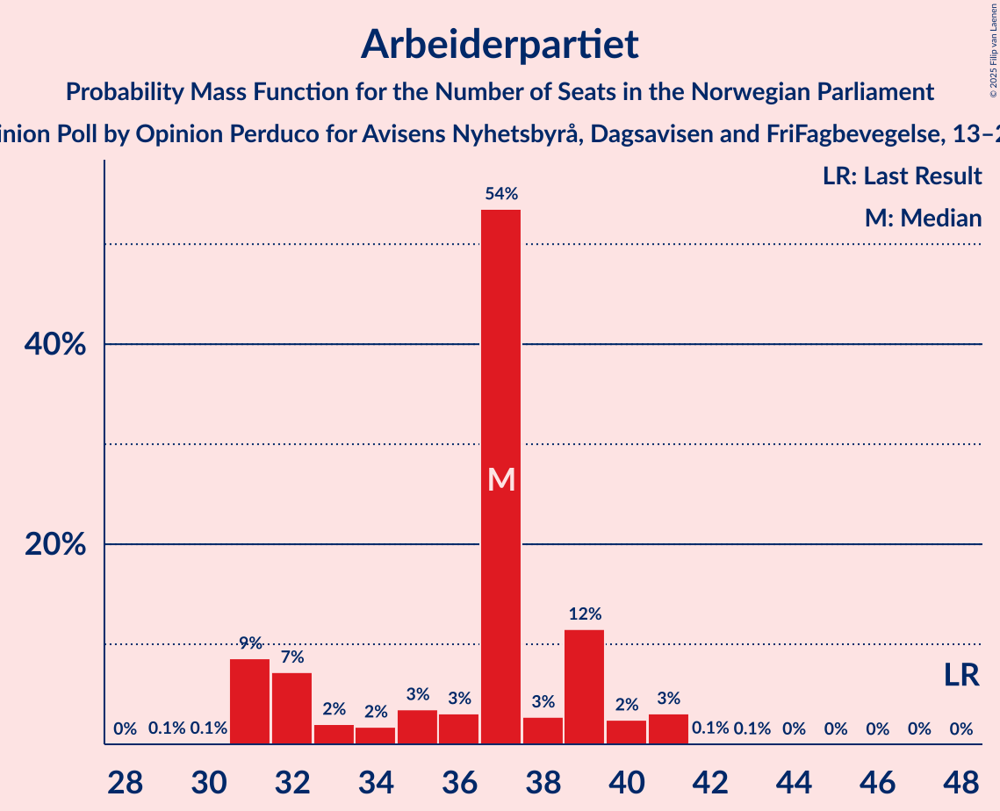
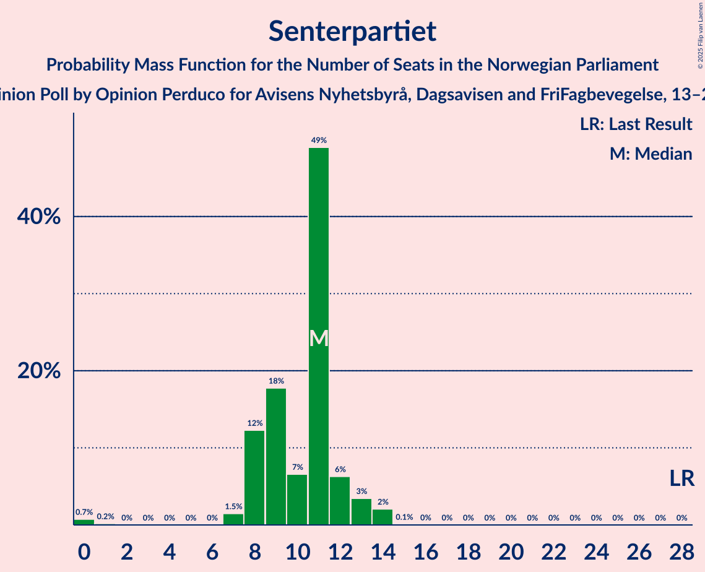
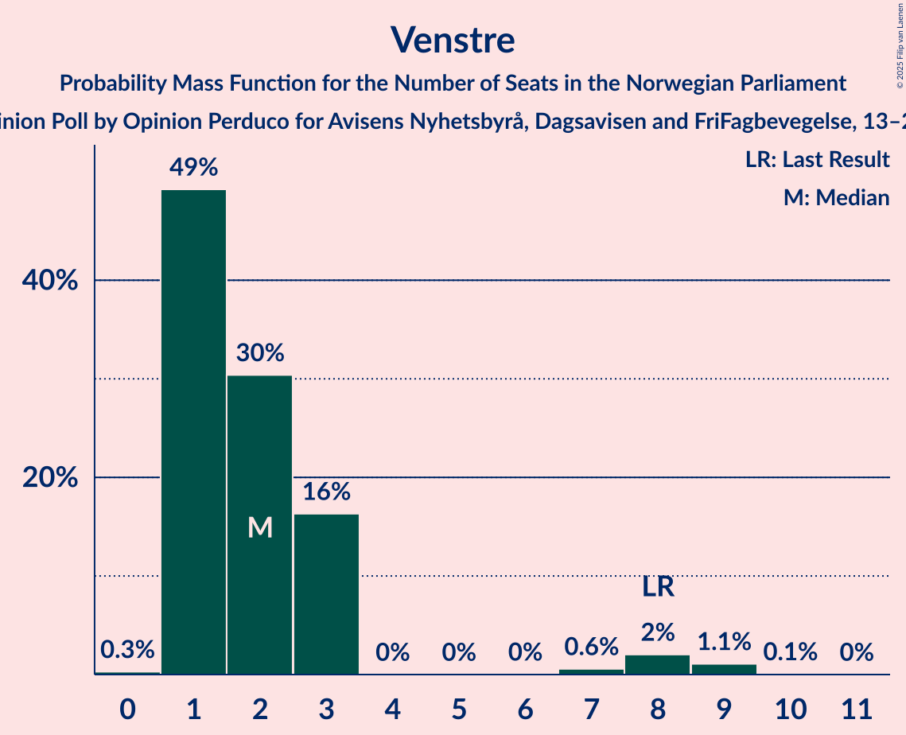
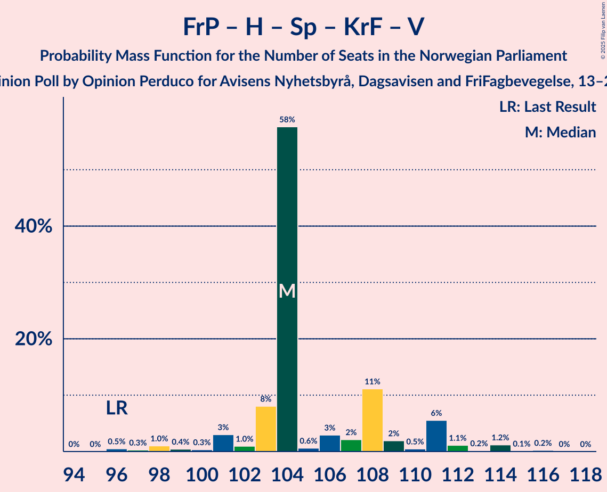
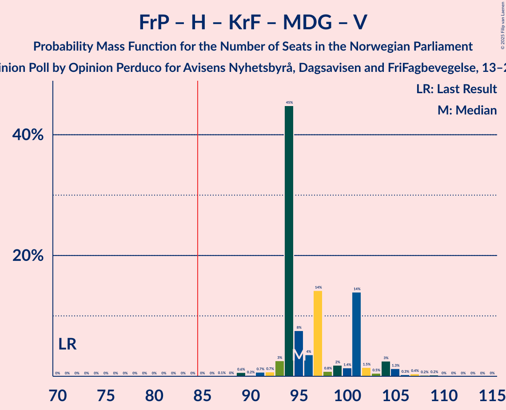
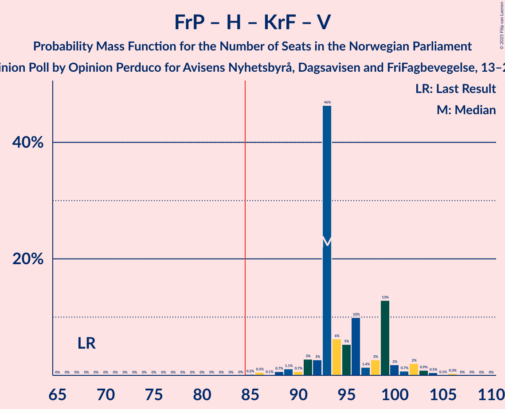
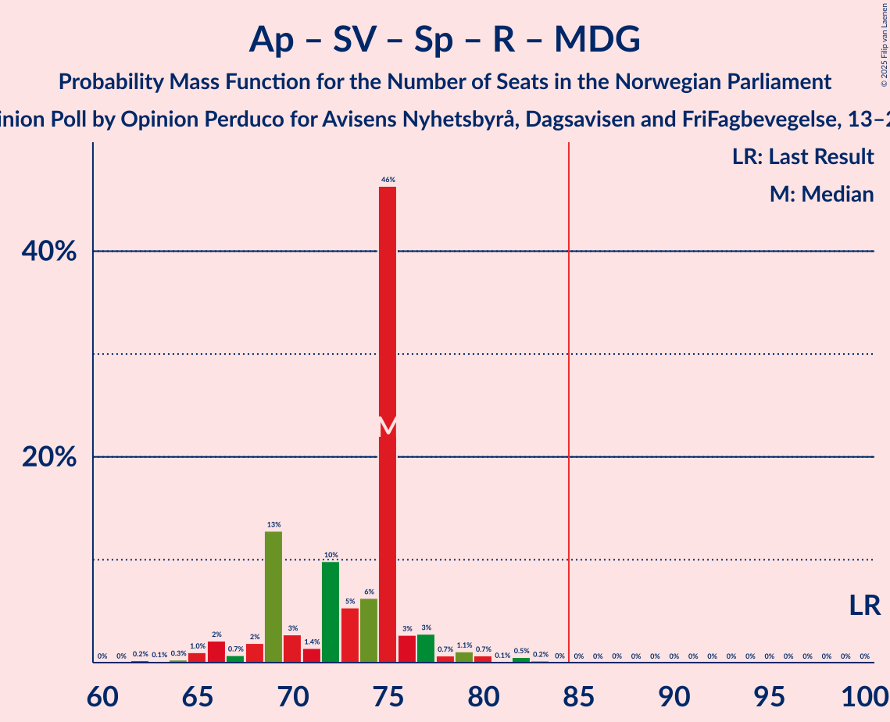
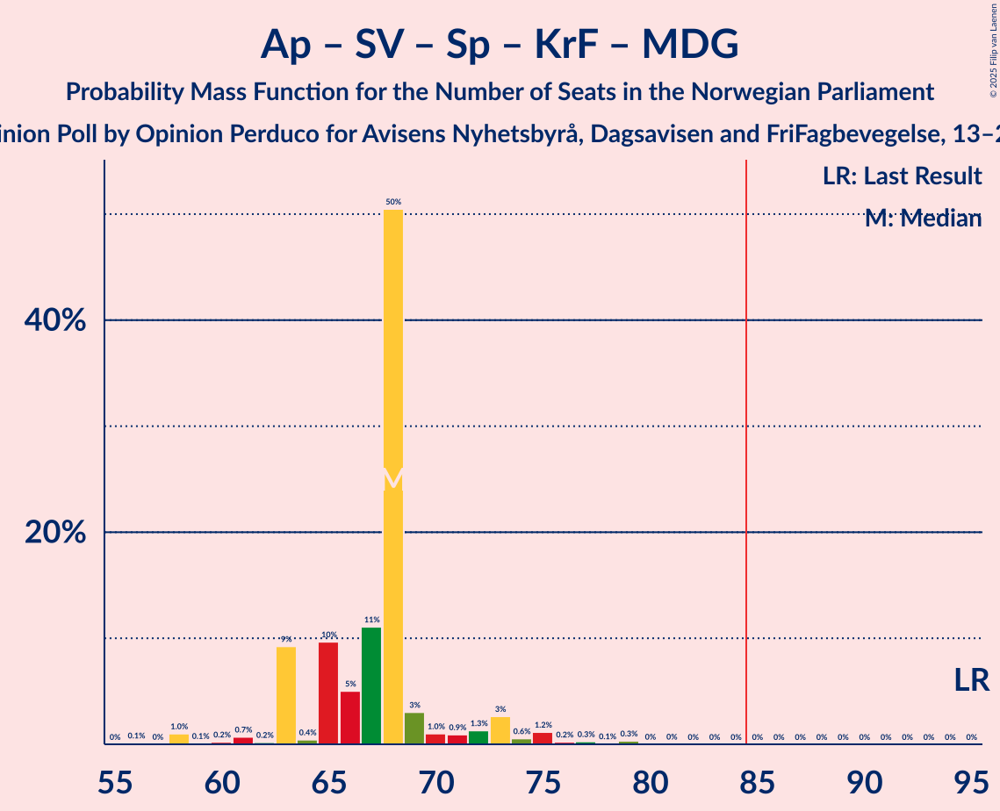

# Opinion Poll by Opinion Perduco for Avisens Nyhetsbyrå, Dagsavisen and FriFagbevegelse, 13–20 January 2025

<a href="#voting-intentions">Voting Intentions</a> | <a href="#seats">Seats</a> | <a href="#coalitions">Coalitions</a> | <a href="#technical-information">Technical Information</a>

## Voting Intentions

### Confidence Intervals

| Party | Last Result | Poll Result | 80% Confidence Interval | 90% Confidence Interval | 95% Confidence Interval | 99% Confidence Interval |
|:-----:|:-----------:|:-----------:|:-----------------------:|:-----------------------:|:-----------------------:|:-----------------------:|
| Fremskrittspartiet | 11.6% | 26.2% | 24.3–28.3% |23.7–28.9% |23.2–29.5% |22.3–30.5% |
| Høyre | 20.4% | 21.8% | 20.0–23.8% |19.5–24.4% |19.0–24.9% |18.2–25.9% |
| Arbeiderpartiet | 26.2% | 18.8% | 17.1–20.7% |16.6–21.3% |16.2–21.7% |15.4–22.7% |
| Sosialistisk Venstreparti | 7.6% | 8.3% | 7.2–9.7% |6.8–10.1% |6.6–10.5% |6.1–11.2% |
| Senterpartiet | 13.5% | 5.5% | 4.5–6.7% |4.3–7.0% |4.1–7.3% |3.7–7.9% |
| Rødt | 4.7% | 4.9% | 4.1–6.1% |3.8–6.4% |3.6–6.7% |3.2–7.3% |
| Kristelig Folkeparti | 3.8% | 3.5% | 2.8–4.5% |2.6–4.8% |2.4–5.1% |2.1–5.6% |
| Miljøpartiet De Grønne | 3.9% | 3.1% | 2.4–4.1% |2.3–4.4% |2.1–4.6% |1.8–5.1% |
| Venstre | 4.6% | 2.9% | 2.2–3.8% |2.0–4.1% |1.9–4.3% |1.6–4.8% |
| Norgesdemokratene | 1.1% | 1.2% | 0.8–1.8% |0.7–2.0% |0.6–2.2% |0.5–2.6% |
| Industri- og Næringspartiet | 0.3% | 0.8% | 0.5–1.4% |0.4–1.5% |0.4–1.7% |0.3–2.0% |
| Konservativt | 0.4% | 0.6% | 0.4–1.2% |0.3–1.4% |0.3–1.5% |0.2–1.8% |
| Pensjonistpartiet | 0.6% | 0.3% | 0.1–0.7% |0.1–0.8% |0.1–0.9% |0.0–1.2% |

*Note:* The poll result column reflects the actual value used in the calculations. Published results may vary slightly, and in addition be rounded to fewer digits.

## Seats

### Confidence Intervals

| Party | Last Result | Median | 80% Confidence Interval | 90% Confidence Interval | 95% Confidence Interval | 99% Confidence Interval |
|:-----:|:-----------:|:------:|:-----------------------:|:-----------------------:|:-----------------------:|:-----------------------:|
| <a href="#fremskrittspartiet">Fremskrittspartiet</a> | 21 | 49 | 47–49 |46–50 |45–52 |41–58 |
| <a href="#høyre">Høyre</a> | 36 | 40 | 40–42 |38–44 |36–46 |34–46 |
| <a href="#arbeiderpartiet">Arbeiderpartiet</a> | 48 | 37 | 35–37 |32–40 |32–40 |32–41 |
| <a href="#sosialistisk-venstreparti">Sosialistisk Venstreparti</a> | 13 | 16 | 13–16 |12–18 |11–18 |10–20 |
| <a href="#senterpartiet">Senterpartiet</a> | 28 | 11 | 10–11 |8–13 |7–14 |0–14 |
| <a href="#rødt">Rødt</a> | 8 | 10 | 9–10 |8–11 |1–12 |1–12 |
| <a href="#kristelig-folkeparti">Kristelig Folkeparti</a> | 3 | 3 | 3 |2–9 |1–9 |1–9 |
| <a href="#miljøpartiet-de-grønne">Miljøpartiet De Grønne</a> | 3 | 1 | 1–2 |1–3 |1–3 |1–8 |
| <a href="#venstre">Venstre</a> | 8 | 1 | 1–2 |1–3 |1–3 |1–8 |
| <a href="#norgesdemokratene">Norgesdemokratene</a> | 0 | 0 | 0 |0 |0 |0 |
| <a href="#industri--og-næringspartiet">Industri- og Næringspartiet</a> | 0 | 0 | 0 |0 |0 |0 |
| <a href="#konservativt">Konservativt</a> | 0 | 0 | 0 |0 |0 |0 |
| <a href="#pensjonistpartiet">Pensjonistpartiet</a> | 0 | 0 | 0 |0 |0 |0 |

### Fremskrittspartiet

*For a full overview of the results for this party, see the [Fremskrittspartiet](party-fremskrittspartiet.html) page.*

| Number of Seats | Probability | Accumulated | Special Marks |
|:---------------:|:-----------:|:-----------:|:-------------:|
| 21 | 0% | 100% | Last Result |
| 22 | 0% | 100% |  |
| 23 | 0% | 100% |  |
| 24 | 0% | 100% |  |
| 25 | 0% | 100% |  |
| 26 | 0% | 100% |  |
| 27 | 0% | 100% |  |
| 28 | 0% | 100% |  |
| 29 | 0% | 100% |  |
| 30 | 0% | 100% |  |
| 31 | 0% | 100% |  |
| 32 | 0% | 100% |  |
| 33 | 0% | 100% |  |
| 34 | 0% | 100% |  |
| 35 | 0% | 100% |  |
| 36 | 0% | 100% |  |
| 37 | 0% | 100% |  |
| 38 | 0% | 100% |  |
| 39 | 0% | 100% |  |
| 40 | 0% | 100% |  |
| 41 | 0.9% | 100% |  |
| 42 | 0.1% | 99.1% |  |
| 43 | 0.8% | 99.1% |  |
| 44 | 0.5% | 98% |  |
| 45 | 1.0% | 98% |  |
| 46 | 6% | 97% |  |
| 47 | 3% | 91% |  |
| 48 | 2% | 88% |  |
| 49 | 77% | 86% | Median |
| 50 | 5% | 9% |  |
| 51 | 1.0% | 4% |  |
| 52 | 0.9% | 3% |  |
| 53 | 0.6% | 2% |  |
| 54 | 0.6% | 1.5% |  |
| 55 | 0.1% | 0.9% |  |
| 56 | 0.1% | 0.8% |  |
| 57 | 0% | 0.7% |  |
| 58 | 0.5% | 0.7% |  |
| 59 | 0.2% | 0.2% |  |
| 60 | 0% | 0% |  |

### Høyre

*For a full overview of the results for this party, see the [Høyre](party-høyre.html) page.*

| Number of Seats | Probability | Accumulated | Special Marks |
|:---------------:|:-----------:|:-----------:|:-------------:|
| 33 | 0.4% | 100% |  |
| 34 | 0.7% | 99.6% |  |
| 35 | 0.8% | 98.8% |  |
| 36 | 2% | 98% | Last Result |
| 37 | 0.9% | 97% |  |
| 38 | 0.9% | 96% |  |
| 39 | 3% | 95% |  |
| 40 | 77% | 92% | Median |
| 41 | 3% | 15% |  |
| 42 | 3% | 12% |  |
| 43 | 1.2% | 9% |  |
| 44 | 3% | 8% |  |
| 45 | 2% | 5% |  |
| 46 | 3% | 3% |  |
| 47 | 0.1% | 0.2% |  |
| 48 | 0% | 0.1% |  |
| 49 | 0.1% | 0.1% |  |
| 50 | 0% | 0% |  |

### Arbeiderpartiet

*For a full overview of the results for this party, see the [Arbeiderpartiet](party-arbeiderpartiet.html) page.*

| Number of Seats | Probability | Accumulated | Special Marks |
|:---------------:|:-----------:|:-----------:|:-------------:|
| 29 | 0.1% | 100% |  |
| 30 | 0% | 99.9% |  |
| 31 | 0.3% | 99.8% |  |
| 32 | 5% | 99.5% |  |
| 33 | 0.9% | 95% |  |
| 34 | 1.4% | 94% |  |
| 35 | 5% | 93% |  |
| 36 | 3% | 87% |  |
| 37 | 76% | 84% | Median |
| 38 | 1.4% | 8% |  |
| 39 | 1.1% | 7% |  |
| 40 | 4% | 6% |  |
| 41 | 2% | 2% |  |
| 42 | 0.1% | 0.3% |  |
| 43 | 0.1% | 0.2% |  |
| 44 | 0% | 0.1% |  |
| 45 | 0% | 0.1% |  |
| 46 | 0% | 0.1% |  |
| 47 | 0.1% | 0.1% |  |
| 48 | 0% | 0% | Last Result |

### Sosialistisk Venstreparti

*For a full overview of the results for this party, see the [Sosialistisk Venstreparti](party-sosialistiskvenstreparti.html) page.*

| Number of Seats | Probability | Accumulated | Special Marks |
|:---------------:|:-----------:|:-----------:|:-------------:|
| 10 | 2% | 100% |  |
| 11 | 0.9% | 98% |  |
| 12 | 4% | 97% |  |
| 13 | 4% | 93% | Last Result |
| 14 | 0.9% | 89% |  |
| 15 | 0.9% | 88% |  |
| 16 | 79% | 88% | Median |
| 17 | 3% | 9% |  |
| 18 | 3% | 5% |  |
| 19 | 1.0% | 2% |  |
| 20 | 1.3% | 1.4% |  |
| 21 | 0% | 0.1% |  |
| 22 | 0.1% | 0.1% |  |
| 23 | 0% | 0% |  |

### Senterpartiet

*For a full overview of the results for this party, see the [Senterpartiet](party-senterpartiet.html) page.*

| Number of Seats | Probability | Accumulated | Special Marks |
|:---------------:|:-----------:|:-----------:|:-------------:|
| 0 | 1.2% | 100% |  |
| 1 | 0.2% | 98.8% |  |
| 2 | 0% | 98.7% |  |
| 3 | 0% | 98.6% |  |
| 4 | 0% | 98.6% |  |
| 5 | 0% | 98.6% |  |
| 6 | 0% | 98.6% |  |
| 7 | 2% | 98.6% |  |
| 8 | 2% | 96% |  |
| 9 | 4% | 94% |  |
| 10 | 6% | 90% |  |
| 11 | 77% | 85% | Median |
| 12 | 2% | 7% |  |
| 13 | 2% | 5% |  |
| 14 | 3% | 3% |  |
| 15 | 0.1% | 0.2% |  |
| 16 | 0% | 0% |  |
| 17 | 0% | 0% |  |
| 18 | 0% | 0% |  |
| 19 | 0% | 0% |  |
| 20 | 0% | 0% |  |
| 21 | 0% | 0% |  |
| 22 | 0% | 0% |  |
| 23 | 0% | 0% |  |
| 24 | 0% | 0% |  |
| 25 | 0% | 0% |  |
| 26 | 0% | 0% |  |
| 27 | 0% | 0% |  |
| 28 | 0% | 0% | Last Result |

### Rødt

*For a full overview of the results for this party, see the [Rødt](party-rødt.html) page.*

| Number of Seats | Probability | Accumulated | Special Marks |
|:---------------:|:-----------:|:-----------:|:-------------:|
| 1 | 4% | 100% |  |
| 2 | 0.2% | 96% |  |
| 3 | 0.1% | 96% |  |
| 4 | 0% | 96% |  |
| 5 | 0% | 96% |  |
| 6 | 0% | 96% |  |
| 7 | 0.7% | 96% |  |
| 8 | 3% | 95% | Last Result |
| 9 | 7% | 92% |  |
| 10 | 76% | 85% | Median |
| 11 | 6% | 9% |  |
| 12 | 3% | 3% |  |
| 13 | 0.2% | 0.4% |  |
| 14 | 0.2% | 0.2% |  |
| 15 | 0% | 0% |  |

### Kristelig Folkeparti

*For a full overview of the results for this party, see the [Kristelig Folkeparti](party-kristeligfolkeparti.html) page.*

| Number of Seats | Probability | Accumulated | Special Marks |
|:---------------:|:-----------:|:-----------:|:-------------:|
| 0 | 0.3% | 100% |  |
| 1 | 4% | 99.7% |  |
| 2 | 3% | 96% |  |
| 3 | 83% | 92% | Last Result, Median |
| 4 | 0% | 10% |  |
| 5 | 0% | 10% |  |
| 6 | 0% | 10% |  |
| 7 | 0.9% | 10% |  |
| 8 | 3% | 9% |  |
| 9 | 6% | 6% |  |
| 10 | 0.3% | 0.4% |  |
| 11 | 0.1% | 0.1% |  |
| 12 | 0% | 0% |  |

### Miljøpartiet De Grønne

*For a full overview of the results for this party, see the [Miljøpartiet De Grønne](party-miljøpartietdegrønne.html) page.*

| Number of Seats | Probability | Accumulated | Special Marks |
|:---------------:|:-----------:|:-----------:|:-------------:|
| 0 | 0.2% | 100% |  |
| 1 | 78% | 99.8% | Median |
| 2 | 16% | 22% |  |
| 3 | 5% | 7% | Last Result |
| 4 | 0% | 2% |  |
| 5 | 0% | 2% |  |
| 6 | 0% | 2% |  |
| 7 | 1.1% | 2% |  |
| 8 | 0.7% | 0.9% |  |
| 9 | 0.2% | 0.2% |  |
| 10 | 0.1% | 0.1% |  |
| 11 | 0% | 0% |  |

### Venstre

*For a full overview of the results for this party, see the [Venstre](party-venstre.html) page.*

| Number of Seats | Probability | Accumulated | Special Marks |
|:---------------:|:-----------:|:-----------:|:-------------:|
| 0 | 0.4% | 100% |  |
| 1 | 77% | 99.6% | Median |
| 2 | 14% | 22% |  |
| 3 | 7% | 8% |  |
| 4 | 0% | 1.2% |  |
| 5 | 0% | 1.2% |  |
| 6 | 0% | 1.2% |  |
| 7 | 0.5% | 1.2% |  |
| 8 | 0.4% | 0.7% | Last Result |
| 9 | 0.2% | 0.3% |  |
| 10 | 0.1% | 0.1% |  |
| 11 | 0% | 0% |  |

### Norgesdemokratene

*For a full overview of the results for this party, see the [Norgesdemokratene](party-norgesdemokratene.html) page.*

| Number of Seats | Probability | Accumulated | Special Marks |
|:---------------:|:-----------:|:-----------:|:-------------:|
| 0 | 100% | 100% | Last Result, Median |

### Industri- og Næringspartiet

*For a full overview of the results for this party, see the [Industri- og Næringspartiet](party-industri-ognæringspartiet.html) page.*

| Number of Seats | Probability | Accumulated | Special Marks |
|:---------------:|:-----------:|:-----------:|:-------------:|
| 0 | 100% | 100% | Last Result, Median |

### Konservativt

*For a full overview of the results for this party, see the [Konservativt](party-konservativt.html) page.*

| Number of Seats | Probability | Accumulated | Special Marks |
|:---------------:|:-----------:|:-----------:|:-------------:|
| 0 | 100% | 100% | Last Result, Median |

### Pensjonistpartiet

*For a full overview of the results for this party, see the [Pensjonistpartiet](party-pensjonistpartiet.html) page.*

| Number of Seats | Probability | Accumulated | Special Marks |
|:---------------:|:-----------:|:-----------:|:-------------:|
| 0 | 100% | 100% | Last Result, Median |

## Coalitions

### Confidence Intervals

| Coalition | Last Result | Median | Majority? | 80% Confidence Interval | 90% Confidence Interval | 95% Confidence Interval | 99% Confidence Interval |
|:---------:|:-----------:|:------:|:---------:|:-----------------------:|:-----------------------:|:-----------------------:|:-----------------------:|
| Fremskrittspartiet – Høyre – Senterpartiet – Kristelig Folkeparti – Venstre | 96 | 104 | 100% | 104–108 | 102–109 | 99–113 | 96–114 |
| Fremskrittspartiet – Høyre – Kristelig Folkeparti – Miljøpartiet De Grønne – Venstre | 71 | 94 | 100% | 94–100 | 94–104 | 93–104 | 89–108 |
| Fremskrittspartiet – Høyre – Kristelig Folkeparti – Venstre | 68 | 93 | 99.9% | 93–98 | 92–101 | 89–102 | 86–104 |
| Fremskrittspartiet – Høyre – Venstre | 65 | 90 | 98% | 90–92 | 88–95 | 85–99 | 81–101 |
| Fremskrittspartiet – Høyre | 57 | 89 | 96% | 89–90 | 86–92 | 83–96 | 80–99 |
| Arbeiderpartiet – Sosialistisk Venstreparti – Senterpartiet – Rødt – Miljøpartiet De Grønne | 100 | 75 | 0% | 70–75 | 67–76 | 66–79 | 63–82 |
| Arbeiderpartiet – Sosialistisk Venstreparti – Senterpartiet – Rødt | 97 | 74 | 0% | 68–74 | 64–74 | 64–75 | 60–79 |
| Arbeiderpartiet – Sosialistisk Venstreparti – Senterpartiet – Kristelig Folkeparti – Miljøpartiet De Grønne | 95 | 68 | 0% | 67–68 | 65–72 | 61–75 | 58–79 |
| Arbeiderpartiet – Sosialistisk Venstreparti – Senterpartiet – Miljøpartiet De Grønne | 92 | 65 | 0% | 63–65 | 59–68 | 55–70 | 53–72 |
| Arbeiderpartiet – Sosialistisk Venstreparti – Rødt – Miljøpartiet De Grønne | 72 | 64 | 0% | 60–64 | 59–66 | 55–69 | 54–72 |
| Arbeiderpartiet – Sosialistisk Venstreparti – Senterpartiet | 89 | 64 | 0% | 60–64 | 57–65 | 53–67 | 52–68 |
| Arbeiderpartiet – Senterpartiet – Kristelig Folkeparti – Miljøpartiet De Grønne | 82 | 52 | 0% | 52–55 | 48–58 | 46–59 | 44–63 |
| Arbeiderpartiet – Sosialistisk Venstreparti | 61 | 53 | 0% | 50–53 | 48–54 | 46–57 | 44–59 |
| Arbeiderpartiet – Senterpartiet – Kristelig Folkeparti | 79 | 51 | 0% | 49–52 | 45–55 | 44–56 | 42–58 |
| Høyre – Kristelig Folkeparti – Venstre | 47 | 44 | 0% | 44–49 | 44–52 | 42–52 | 39–54 |
| Arbeiderpartiet – Senterpartiet | 76 | 48 | 0% | 45–48 | 43–49 | 41–50 | 36–51 |
| Senterpartiet – Kristelig Folkeparti – Venstre | 39 | 15 | 0% | 15–18 | 14–21 | 13–22 | 10–24 |

### Fremskrittspartiet – Høyre – Senterpartiet – Kristelig Folkeparti – Venstre

| Number of Seats | Probability | Accumulated | Special Marks |
|:---------------:|:-----------:|:-----------:|:-------------:|
| 94 | 0% | 100% |  |
| 95 | 0% | 99.9% |  |
| 96 | 0.8% | 99.9% | Last Result |
| 97 | 0.4% | 99.1% |  |
| 98 | 0.8% | 98.7% |  |
| 99 | 0.6% | 98% |  |
| 100 | 0.4% | 97% |  |
| 101 | 2% | 97% |  |
| 102 | 0.9% | 95% |  |
| 103 | 2% | 95% |  |
| 104 | 76% | 93% | Median |
| 105 | 0.4% | 17% |  |
| 106 | 4% | 17% |  |
| 107 | 3% | 13% |  |
| 108 | 2% | 10% |  |
| 109 | 3% | 8% |  |
| 110 | 0.1% | 5% |  |
| 111 | 2% | 5% |  |
| 112 | 0.2% | 3% |  |
| 113 | 0.1% | 3% |  |
| 114 | 2% | 2% |  |
| 115 | 0.1% | 0.4% |  |
| 116 | 0.3% | 0.3% |  |
| 117 | 0% | 0% |  |

### Fremskrittspartiet – Høyre – Kristelig Folkeparti – Miljøpartiet De Grønne – Venstre

| Number of Seats | Probability | Accumulated | Special Marks |
|:---------------:|:-----------:|:-----------:|:-------------:|
| 71 | 0% | 100% | Last Result |
| 72 | 0% | 100% |  |
| 73 | 0% | 100% |  |
| 74 | 0% | 100% |  |
| 75 | 0% | 100% |  |
| 76 | 0% | 100% |  |
| 77 | 0% | 100% |  |
| 78 | 0% | 100% |  |
| 79 | 0% | 100% |  |
| 80 | 0% | 100% |  |
| 81 | 0% | 100% |  |
| 82 | 0% | 100% |  |
| 83 | 0% | 100% |  |
| 84 | 0% | 100% |  |
| 85 | 0% | 100% | Majority |
| 86 | 0% | 100% |  |
| 87 | 0.1% | 100% |  |
| 88 | 0% | 99.9% |  |
| 89 | 1.0% | 99.9% |  |
| 90 | 0.3% | 98.8% |  |
| 91 | 0.9% | 98.6% |  |
| 92 | 0.2% | 98% |  |
| 93 | 0.7% | 98% |  |
| 94 | 75% | 97% | Median |
| 95 | 2% | 22% |  |
| 96 | 3% | 20% |  |
| 97 | 5% | 18% |  |
| 98 | 0.4% | 13% |  |
| 99 | 2% | 13% |  |
| 100 | 2% | 11% |  |
| 101 | 0.4% | 9% |  |
| 102 | 2% | 8% |  |
| 103 | 0.5% | 6% |  |
| 104 | 4% | 6% |  |
| 105 | 0.3% | 2% |  |
| 106 | 0.3% | 2% |  |
| 107 | 0.6% | 1.2% |  |
| 108 | 0.2% | 0.6% |  |
| 109 | 0.3% | 0.3% |  |
| 110 | 0% | 0% |  |

### Fremskrittspartiet – Høyre – Kristelig Folkeparti – Venstre

| Number of Seats | Probability | Accumulated | Special Marks |
|:---------------:|:-----------:|:-----------:|:-------------:|
| 68 | 0% | 100% | Last Result |
| 69 | 0% | 100% |  |
| 70 | 0% | 100% |  |
| 71 | 0% | 100% |  |
| 72 | 0% | 100% |  |
| 73 | 0% | 100% |  |
| 74 | 0% | 100% |  |
| 75 | 0% | 100% |  |
| 76 | 0% | 100% |  |
| 77 | 0% | 100% |  |
| 78 | 0% | 100% |  |
| 79 | 0% | 100% |  |
| 80 | 0% | 100% |  |
| 81 | 0% | 100% |  |
| 82 | 0% | 100% |  |
| 83 | 0% | 100% |  |
| 84 | 0% | 100% |  |
| 85 | 0% | 99.9% | Majority |
| 86 | 0.9% | 99.9% |  |
| 87 | 0.1% | 99.0% |  |
| 88 | 0.9% | 98.9% |  |
| 89 | 0.9% | 98% |  |
| 90 | 0.6% | 97% |  |
| 91 | 1.1% | 97% |  |
| 92 | 0.5% | 95% |  |
| 93 | 75% | 95% | Median |
| 94 | 3% | 20% |  |
| 95 | 4% | 17% |  |
| 96 | 0.6% | 13% |  |
| 97 | 2% | 12% |  |
| 98 | 2% | 10% |  |
| 99 | 0.4% | 8% |  |
| 100 | 3% | 8% |  |
| 101 | 1.0% | 5% |  |
| 102 | 2% | 4% |  |
| 103 | 1.4% | 2% |  |
| 104 | 0.5% | 1.0% |  |
| 105 | 0% | 0.5% |  |
| 106 | 0.4% | 0.5% |  |
| 107 | 0% | 0% |  |

### Fremskrittspartiet – Høyre – Venstre

| Number of Seats | Probability | Accumulated | Special Marks |
|:---------------:|:-----------:|:-----------:|:-------------:|
| 65 | 0% | 100% | Last Result |
| 66 | 0% | 100% |  |
| 67 | 0% | 100% |  |
| 68 | 0% | 100% |  |
| 69 | 0% | 100% |  |
| 70 | 0% | 100% |  |
| 71 | 0% | 100% |  |
| 72 | 0% | 100% |  |
| 73 | 0% | 100% |  |
| 74 | 0% | 100% |  |
| 75 | 0% | 100% |  |
| 76 | 0% | 100% |  |
| 77 | 0% | 100% |  |
| 78 | 0% | 100% |  |
| 79 | 0% | 100% |  |
| 80 | 0% | 100% |  |
| 81 | 0.5% | 99.9% |  |
| 82 | 0.4% | 99.5% |  |
| 83 | 0.1% | 99.0% |  |
| 84 | 0.9% | 98.9% |  |
| 85 | 0.7% | 98% | Majority |
| 86 | 0.8% | 97% |  |
| 87 | 0.9% | 96% |  |
| 88 | 0.8% | 96% |  |
| 89 | 3% | 95% |  |
| 90 | 75% | 92% | Median |
| 91 | 3% | 17% |  |
| 92 | 4% | 14% |  |
| 93 | 1.5% | 9% |  |
| 94 | 3% | 8% |  |
| 95 | 2% | 5% |  |
| 96 | 0.3% | 4% |  |
| 97 | 0.3% | 3% |  |
| 98 | 0.5% | 3% |  |
| 99 | 2% | 3% |  |
| 100 | 0.1% | 0.9% |  |
| 101 | 0.4% | 0.8% |  |
| 102 | 0.2% | 0.3% |  |
| 103 | 0.1% | 0.2% |  |
| 104 | 0.1% | 0.1% |  |
| 105 | 0% | 0% |  |

### Fremskrittspartiet – Høyre

| Number of Seats | Probability | Accumulated | Special Marks |
|:---------------:|:-----------:|:-----------:|:-------------:|
| 57 | 0% | 100% | Last Result |
| 58 | 0% | 100% |  |
| 59 | 0% | 100% |  |
| 60 | 0% | 100% |  |
| 61 | 0% | 100% |  |
| 62 | 0% | 100% |  |
| 63 | 0% | 100% |  |
| 64 | 0% | 100% |  |
| 65 | 0% | 100% |  |
| 66 | 0% | 100% |  |
| 67 | 0% | 100% |  |
| 68 | 0% | 100% |  |
| 69 | 0% | 100% |  |
| 70 | 0% | 100% |  |
| 71 | 0% | 100% |  |
| 72 | 0% | 100% |  |
| 73 | 0% | 100% |  |
| 74 | 0% | 100% |  |
| 75 | 0% | 100% |  |
| 76 | 0% | 100% |  |
| 77 | 0% | 100% |  |
| 78 | 0% | 100% |  |
| 79 | 0.1% | 99.9% |  |
| 80 | 0.4% | 99.8% |  |
| 81 | 0.6% | 99.4% |  |
| 82 | 0.9% | 98.8% |  |
| 83 | 0.4% | 98% |  |
| 84 | 1.0% | 97% |  |
| 85 | 0.9% | 96% | Majority |
| 86 | 3% | 96% |  |
| 87 | 1.0% | 93% |  |
| 88 | 1.0% | 92% |  |
| 89 | 78% | 91% | Median |
| 90 | 4% | 13% |  |
| 91 | 1.4% | 9% |  |
| 92 | 3% | 7% |  |
| 93 | 1.1% | 4% |  |
| 94 | 0.2% | 3% |  |
| 95 | 0.2% | 3% |  |
| 96 | 2% | 3% |  |
| 97 | 0.2% | 0.9% |  |
| 98 | 0.1% | 0.7% |  |
| 99 | 0.3% | 0.5% |  |
| 100 | 0% | 0.2% |  |
| 101 | 0.1% | 0.1% |  |
| 102 | 0% | 0% |  |

### Arbeiderpartiet – Sosialistisk Venstreparti – Senterpartiet – Rødt – Miljøpartiet De Grønne

| Number of Seats | Probability | Accumulated | Special Marks |
|:---------------:|:-----------:|:-----------:|:-------------:|
| 62 | 0.3% | 100% |  |
| 63 | 0.2% | 99.7% |  |
| 64 | 0.2% | 99.5% |  |
| 65 | 2% | 99.3% |  |
| 66 | 2% | 98% |  |
| 67 | 1.0% | 96% |  |
| 68 | 3% | 95% |  |
| 69 | 0.4% | 92% |  |
| 70 | 2% | 92% |  |
| 71 | 2% | 90% |  |
| 72 | 0.6% | 88% |  |
| 73 | 4% | 87% |  |
| 74 | 3% | 83% |  |
| 75 | 75% | 80% | Median |
| 76 | 0.6% | 5% |  |
| 77 | 1.1% | 4% |  |
| 78 | 0.6% | 3% |  |
| 79 | 0.8% | 3% |  |
| 80 | 0.9% | 2% |  |
| 81 | 0.1% | 1.1% |  |
| 82 | 0.9% | 1.0% |  |
| 83 | 0% | 0.1% |  |
| 84 | 0% | 0.1% |  |
| 85 | 0% | 0% | Majority |
| 86 | 0% | 0% |  |
| 87 | 0% | 0% |  |
| 88 | 0% | 0% |  |
| 89 | 0% | 0% |  |
| 90 | 0% | 0% |  |
| 91 | 0% | 0% |  |
| 92 | 0% | 0% |  |
| 93 | 0% | 0% |  |
| 94 | 0% | 0% |  |
| 95 | 0% | 0% |  |
| 96 | 0% | 0% |  |
| 97 | 0% | 0% |  |
| 98 | 0% | 0% |  |
| 99 | 0% | 0% |  |
| 100 | 0% | 0% | Last Result |

### Arbeiderpartiet – Sosialistisk Venstreparti – Senterpartiet – Rødt

| Number of Seats | Probability | Accumulated | Special Marks |
|:---------------:|:-----------:|:-----------:|:-------------:|
| 59 | 0.2% | 100% |  |
| 60 | 0.3% | 99.7% |  |
| 61 | 0.2% | 99.4% |  |
| 62 | 0.6% | 99.2% |  |
| 63 | 0.4% | 98.6% |  |
| 64 | 4% | 98% |  |
| 65 | 0.5% | 94% |  |
| 66 | 2% | 94% |  |
| 67 | 0.4% | 92% |  |
| 68 | 2% | 91% |  |
| 69 | 2% | 89% |  |
| 70 | 0.3% | 87% |  |
| 71 | 5% | 87% |  |
| 72 | 3% | 82% |  |
| 73 | 2% | 80% |  |
| 74 | 75% | 78% | Median |
| 75 | 0.7% | 3% |  |
| 76 | 0.2% | 2% |  |
| 77 | 0.8% | 2% |  |
| 78 | 0.3% | 1.5% |  |
| 79 | 1.0% | 1.2% |  |
| 80 | 0% | 0.1% |  |
| 81 | 0.1% | 0.1% |  |
| 82 | 0% | 0% |  |
| 83 | 0% | 0% |  |
| 84 | 0% | 0% |  |
| 85 | 0% | 0% | Majority |
| 86 | 0% | 0% |  |
| 87 | 0% | 0% |  |
| 88 | 0% | 0% |  |
| 89 | 0% | 0% |  |
| 90 | 0% | 0% |  |
| 91 | 0% | 0% |  |
| 92 | 0% | 0% |  |
| 93 | 0% | 0% |  |
| 94 | 0% | 0% |  |
| 95 | 0% | 0% |  |
| 96 | 0% | 0% |  |
| 97 | 0% | 0% | Last Result |

### Arbeiderpartiet – Sosialistisk Venstreparti – Senterpartiet – Kristelig Folkeparti – Miljøpartiet De Grønne

| Number of Seats | Probability | Accumulated | Special Marks |
|:---------------:|:-----------:|:-----------:|:-------------:|
| 56 | 0.2% | 100% |  |
| 57 | 0% | 99.7% |  |
| 58 | 2% | 99.7% |  |
| 59 | 0.1% | 98% |  |
| 60 | 0.1% | 98% |  |
| 61 | 0.8% | 98% |  |
| 62 | 0.1% | 97% |  |
| 63 | 1.4% | 97% |  |
| 64 | 0.3% | 96% |  |
| 65 | 1.2% | 95% |  |
| 66 | 0.7% | 94% |  |
| 67 | 5% | 93% |  |
| 68 | 79% | 88% | Median |
| 69 | 1.0% | 9% |  |
| 70 | 1.0% | 8% |  |
| 71 | 1.0% | 7% |  |
| 72 | 2% | 6% |  |
| 73 | 2% | 5% |  |
| 74 | 0.4% | 3% |  |
| 75 | 2% | 3% |  |
| 76 | 0.2% | 0.9% |  |
| 77 | 0% | 0.7% |  |
| 78 | 0% | 0.6% |  |
| 79 | 0.5% | 0.6% |  |
| 80 | 0% | 0.1% |  |
| 81 | 0% | 0% |  |
| 82 | 0% | 0% |  |
| 83 | 0% | 0% |  |
| 84 | 0% | 0% |  |
| 85 | 0% | 0% | Majority |
| 86 | 0% | 0% |  |
| 87 | 0% | 0% |  |
| 88 | 0% | 0% |  |
| 89 | 0% | 0% |  |
| 90 | 0% | 0% |  |
| 91 | 0% | 0% |  |
| 92 | 0% | 0% |  |
| 93 | 0% | 0% |  |
| 94 | 0% | 0% |  |
| 95 | 0% | 0% | Last Result |

### Arbeiderpartiet – Sosialistisk Venstreparti – Senterpartiet – Miljøpartiet De Grønne

| Number of Seats | Probability | Accumulated | Special Marks |
|:---------------:|:-----------:|:-----------:|:-------------:|
| 53 | 0.7% | 100% |  |
| 54 | 0.1% | 99.3% |  |
| 55 | 2% | 99.1% |  |
| 56 | 0.3% | 97% |  |
| 57 | 0.6% | 97% |  |
| 58 | 0.2% | 97% |  |
| 59 | 4% | 96% |  |
| 60 | 0.2% | 92% |  |
| 61 | 0.5% | 92% |  |
| 62 | 1.5% | 92% |  |
| 63 | 0.8% | 90% |  |
| 64 | 4% | 89% |  |
| 65 | 76% | 85% | Median |
| 66 | 3% | 9% |  |
| 67 | 0.7% | 6% |  |
| 68 | 2% | 6% |  |
| 69 | 0.6% | 4% |  |
| 70 | 3% | 3% |  |
| 71 | 0.2% | 0.8% |  |
| 72 | 0.5% | 0.7% |  |
| 73 | 0% | 0.1% |  |
| 74 | 0% | 0.1% |  |
| 75 | 0% | 0.1% |  |
| 76 | 0% | 0.1% |  |
| 77 | 0% | 0.1% |  |
| 78 | 0% | 0% |  |
| 79 | 0% | 0% |  |
| 80 | 0% | 0% |  |
| 81 | 0% | 0% |  |
| 82 | 0% | 0% |  |
| 83 | 0% | 0% |  |
| 84 | 0% | 0% |  |
| 85 | 0% | 0% | Majority |
| 86 | 0% | 0% |  |
| 87 | 0% | 0% |  |
| 88 | 0% | 0% |  |
| 89 | 0% | 0% |  |
| 90 | 0% | 0% |  |
| 91 | 0% | 0% |  |
| 92 | 0% | 0% | Last Result |

### Arbeiderpartiet – Sosialistisk Venstreparti – Rødt – Miljøpartiet De Grønne

| Number of Seats | Probability | Accumulated | Special Marks |
|:---------------:|:-----------:|:-----------:|:-------------:|
| 52 | 0.3% | 100% |  |
| 53 | 0.1% | 99.7% |  |
| 54 | 2% | 99.6% |  |
| 55 | 0.5% | 98% |  |
| 56 | 0.2% | 97% |  |
| 57 | 2% | 97% |  |
| 58 | 0.3% | 96% |  |
| 59 | 3% | 95% |  |
| 60 | 2% | 92% |  |
| 61 | 3% | 90% |  |
| 62 | 4% | 87% |  |
| 63 | 0.5% | 83% |  |
| 64 | 76% | 83% | Median |
| 65 | 2% | 7% |  |
| 66 | 0.9% | 5% |  |
| 67 | 2% | 5% |  |
| 68 | 0.4% | 3% |  |
| 69 | 0.6% | 3% |  |
| 70 | 0.8% | 2% |  |
| 71 | 0.4% | 1.3% |  |
| 72 | 0.8% | 0.9% | Last Result |
| 73 | 0% | 0.1% |  |
| 74 | 0% | 0.1% |  |
| 75 | 0% | 0% |  |

### Arbeiderpartiet – Sosialistisk Venstreparti – Senterpartiet

| Number of Seats | Probability | Accumulated | Special Marks |
|:---------------:|:-----------:|:-----------:|:-------------:|
| 50 | 0% | 100% |  |
| 51 | 0.1% | 99.9% |  |
| 52 | 1.0% | 99.9% |  |
| 53 | 2% | 98.9% |  |
| 54 | 0.1% | 97% |  |
| 55 | 0.2% | 97% |  |
| 56 | 0.6% | 97% |  |
| 57 | 4% | 96% |  |
| 58 | 0.7% | 92% |  |
| 59 | 0.6% | 91% |  |
| 60 | 1.5% | 91% |  |
| 61 | 1.3% | 89% |  |
| 62 | 4% | 88% |  |
| 63 | 2% | 84% |  |
| 64 | 76% | 82% | Median |
| 65 | 2% | 6% |  |
| 66 | 0.4% | 4% |  |
| 67 | 1.5% | 4% |  |
| 68 | 2% | 2% |  |
| 69 | 0% | 0.2% |  |
| 70 | 0.2% | 0.2% |  |
| 71 | 0% | 0.1% |  |
| 72 | 0% | 0% |  |
| 73 | 0% | 0% |  |
| 74 | 0% | 0% |  |
| 75 | 0% | 0% |  |
| 76 | 0% | 0% |  |
| 77 | 0% | 0% |  |
| 78 | 0% | 0% |  |
| 79 | 0% | 0% |  |
| 80 | 0% | 0% |  |
| 81 | 0% | 0% |  |
| 82 | 0% | 0% |  |
| 83 | 0% | 0% |  |
| 84 | 0% | 0% |  |
| 85 | 0% | 0% | Majority |
| 86 | 0% | 0% |  |
| 87 | 0% | 0% |  |
| 88 | 0% | 0% |  |
| 89 | 0% | 0% | Last Result |

### Arbeiderpartiet – Senterpartiet – Kristelig Folkeparti – Miljøpartiet De Grønne

| Number of Seats | Probability | Accumulated | Special Marks |
|:---------------:|:-----------:|:-----------:|:-------------:|
| 39 | 0% | 100% |  |
| 40 | 0% | 99.9% |  |
| 41 | 0% | 99.9% |  |
| 42 | 0.2% | 99.9% |  |
| 43 | 0.1% | 99.8% |  |
| 44 | 0.3% | 99.7% |  |
| 45 | 0.9% | 99.4% |  |
| 46 | 3% | 98% |  |
| 47 | 0.7% | 96% |  |
| 48 | 0.5% | 95% |  |
| 49 | 0.4% | 94% |  |
| 50 | 0.7% | 94% |  |
| 51 | 2% | 93% |  |
| 52 | 76% | 92% | Median |
| 53 | 0.4% | 15% |  |
| 54 | 4% | 15% |  |
| 55 | 3% | 11% |  |
| 56 | 3% | 8% |  |
| 57 | 0.5% | 6% |  |
| 58 | 3% | 5% |  |
| 59 | 1.3% | 3% |  |
| 60 | 0.4% | 1.3% |  |
| 61 | 0.1% | 0.9% |  |
| 62 | 0.1% | 0.8% |  |
| 63 | 0.6% | 0.8% |  |
| 64 | 0.1% | 0.2% |  |
| 65 | 0.1% | 0.1% |  |
| 66 | 0% | 0% |  |
| 67 | 0% | 0% |  |
| 68 | 0% | 0% |  |
| 69 | 0% | 0% |  |
| 70 | 0% | 0% |  |
| 71 | 0% | 0% |  |
| 72 | 0% | 0% |  |
| 73 | 0% | 0% |  |
| 74 | 0% | 0% |  |
| 75 | 0% | 0% |  |
| 76 | 0% | 0% |  |
| 77 | 0% | 0% |  |
| 78 | 0% | 0% |  |
| 79 | 0% | 0% |  |
| 80 | 0% | 0% |  |
| 81 | 0% | 0% |  |
| 82 | 0% | 0% | Last Result |

### Arbeiderpartiet – Sosialistisk Venstreparti

| Number of Seats | Probability | Accumulated | Special Marks |
|:---------------:|:-----------:|:-----------:|:-------------:|
| 41 | 0.1% | 100% |  |
| 42 | 0% | 99.9% |  |
| 43 | 0% | 99.9% |  |
| 44 | 2% | 99.9% |  |
| 45 | 0.7% | 98% |  |
| 46 | 0.2% | 98% |  |
| 47 | 2% | 97% |  |
| 48 | 3% | 95% |  |
| 49 | 2% | 92% |  |
| 50 | 4% | 90% |  |
| 51 | 1.0% | 87% |  |
| 52 | 4% | 86% |  |
| 53 | 75% | 82% | Median |
| 54 | 2% | 7% |  |
| 55 | 0.8% | 5% |  |
| 56 | 1.0% | 4% |  |
| 57 | 0.9% | 3% |  |
| 58 | 0.7% | 2% |  |
| 59 | 2% | 2% |  |
| 60 | 0% | 0.1% |  |
| 61 | 0.1% | 0.1% | Last Result |
| 62 | 0% | 0% |  |

### Arbeiderpartiet – Senterpartiet – Kristelig Folkeparti

| Number of Seats | Probability | Accumulated | Special Marks |
|:---------------:|:-----------:|:-----------:|:-------------:|
| 37 | 0% | 100% |  |
| 38 | 0% | 99.9% |  |
| 39 | 0% | 99.9% |  |
| 40 | 0% | 99.9% |  |
| 41 | 0.2% | 99.9% |  |
| 42 | 0.5% | 99.7% |  |
| 43 | 0.1% | 99.2% |  |
| 44 | 3% | 99.1% |  |
| 45 | 1.3% | 96% |  |
| 46 | 0.3% | 94% |  |
| 47 | 0.5% | 94% |  |
| 48 | 0.7% | 94% |  |
| 49 | 3% | 93% |  |
| 50 | 0.5% | 90% |  |
| 51 | 75% | 89% | Median |
| 52 | 4% | 14% |  |
| 53 | 2% | 10% |  |
| 54 | 2% | 7% |  |
| 55 | 0.5% | 5% |  |
| 56 | 4% | 5% |  |
| 57 | 0.2% | 0.7% |  |
| 58 | 0.2% | 0.5% |  |
| 59 | 0.1% | 0.3% |  |
| 60 | 0% | 0.2% |  |
| 61 | 0.1% | 0.2% |  |
| 62 | 0% | 0.1% |  |
| 63 | 0.1% | 0.1% |  |
| 64 | 0% | 0% |  |
| 65 | 0% | 0% |  |
| 66 | 0% | 0% |  |
| 67 | 0% | 0% |  |
| 68 | 0% | 0% |  |
| 69 | 0% | 0% |  |
| 70 | 0% | 0% |  |
| 71 | 0% | 0% |  |
| 72 | 0% | 0% |  |
| 73 | 0% | 0% |  |
| 74 | 0% | 0% |  |
| 75 | 0% | 0% |  |
| 76 | 0% | 0% |  |
| 77 | 0% | 0% |  |
| 78 | 0% | 0% |  |
| 79 | 0% | 0% | Last Result |

### Høyre – Kristelig Folkeparti – Venstre

| Number of Seats | Probability | Accumulated | Special Marks |
|:---------------:|:-----------:|:-----------:|:-------------:|
| 37 | 0.2% | 100% |  |
| 38 | 0.1% | 99.8% |  |
| 39 | 0.6% | 99.7% |  |
| 40 | 0.7% | 99.1% |  |
| 41 | 0.7% | 98% |  |
| 42 | 0.6% | 98% |  |
| 43 | 0.5% | 97% |  |
| 44 | 75% | 97% | Median |
| 45 | 2% | 22% |  |
| 46 | 2% | 20% |  |
| 47 | 3% | 18% | Last Result |
| 48 | 2% | 16% |  |
| 49 | 4% | 14% |  |
| 50 | 2% | 9% |  |
| 51 | 1.3% | 7% |  |
| 52 | 3% | 6% |  |
| 53 | 1.0% | 2% |  |
| 54 | 0.7% | 1.1% |  |
| 55 | 0.4% | 0.5% |  |
| 56 | 0.1% | 0.1% |  |
| 57 | 0% | 0% |  |

### Arbeiderpartiet – Senterpartiet

| Number of Seats | Probability | Accumulated | Special Marks |
|:---------------:|:-----------:|:-----------:|:-------------:|
| 33 | 0.1% | 100% |  |
| 34 | 0% | 99.9% |  |
| 35 | 0% | 99.9% |  |
| 36 | 0.8% | 99.9% |  |
| 37 | 0% | 99.1% |  |
| 38 | 0.1% | 99.1% |  |
| 39 | 0.2% | 99.0% |  |
| 40 | 0.2% | 98.8% |  |
| 41 | 2% | 98.6% |  |
| 42 | 1.3% | 96% |  |
| 43 | 2% | 95% |  |
| 44 | 0.6% | 93% |  |
| 45 | 3% | 93% |  |
| 46 | 1.2% | 90% |  |
| 47 | 4% | 89% |  |
| 48 | 77% | 85% | Median |
| 49 | 4% | 8% |  |
| 50 | 3% | 4% |  |
| 51 | 0.5% | 0.9% |  |
| 52 | 0.2% | 0.4% |  |
| 53 | 0.1% | 0.3% |  |
| 54 | 0.1% | 0.2% |  |
| 55 | 0% | 0.1% |  |
| 56 | 0.1% | 0.1% |  |
| 57 | 0% | 0% |  |
| 58 | 0% | 0% |  |
| 59 | 0% | 0% |  |
| 60 | 0% | 0% |  |
| 61 | 0% | 0% |  |
| 62 | 0% | 0% |  |
| 63 | 0% | 0% |  |
| 64 | 0% | 0% |  |
| 65 | 0% | 0% |  |
| 66 | 0% | 0% |  |
| 67 | 0% | 0% |  |
| 68 | 0% | 0% |  |
| 69 | 0% | 0% |  |
| 70 | 0% | 0% |  |
| 71 | 0% | 0% |  |
| 72 | 0% | 0% |  |
| 73 | 0% | 0% |  |
| 74 | 0% | 0% |  |
| 75 | 0% | 0% |  |
| 76 | 0% | 0% | Last Result |

### Senterpartiet – Kristelig Folkeparti – Venstre

| Number of Seats | Probability | Accumulated | Special Marks |
|:---------------:|:-----------:|:-----------:|:-------------:|
| 5 | 0.1% | 100% |  |
| 6 | 0% | 99.9% |  |
| 7 | 0% | 99.9% |  |
| 8 | 0% | 99.8% |  |
| 9 | 0.1% | 99.8% |  |
| 10 | 1.3% | 99.8% |  |
| 11 | 0.4% | 98% |  |
| 12 | 0.5% | 98% |  |
| 13 | 0.7% | 98% |  |
| 14 | 5% | 97% |  |
| 15 | 79% | 92% | Median |
| 16 | 0.7% | 14% |  |
| 17 | 1.0% | 13% |  |
| 18 | 3% | 12% |  |
| 19 | 4% | 9% |  |
| 20 | 0.5% | 6% |  |
| 21 | 0.5% | 5% |  |
| 22 | 3% | 5% |  |
| 23 | 0.5% | 2% |  |
| 24 | 1.0% | 1.3% |  |
| 25 | 0.1% | 0.3% |  |
| 26 | 0.2% | 0.2% |  |
| 27 | 0% | 0% |  |
| 28 | 0% | 0% |  |
| 29 | 0% | 0% |  |
| 30 | 0% | 0% |  |
| 31 | 0% | 0% |  |
| 32 | 0% | 0% |  |
| 33 | 0% | 0% |  |
| 34 | 0% | 0% |  |
| 35 | 0% | 0% |  |
| 36 | 0% | 0% |  |
| 37 | 0% | 0% |  |
| 38 | 0% | 0% |  |
| 39 | 0% | 0% | Last Result |

## Technical Information

### Opinion Poll

+ **Polling firm:** Opinion Perduco
+ **Commissioner(s):** Avisens Nyhetsbyrå, Dagsavisen and FriFagbevegelse
+ **Fieldwork period:** 13–20 January 2025

### Calculations

+ **Sample size:** 770
+ **Simulations done:** 1,048,576
+ **Error estimate:** 1.98%

