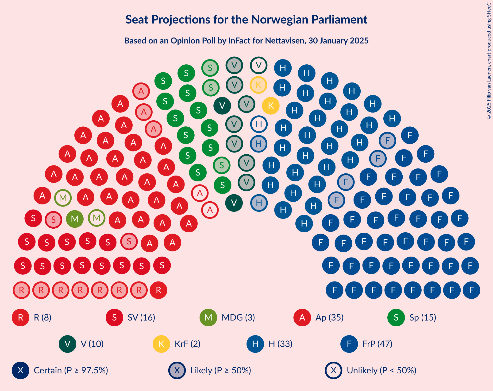
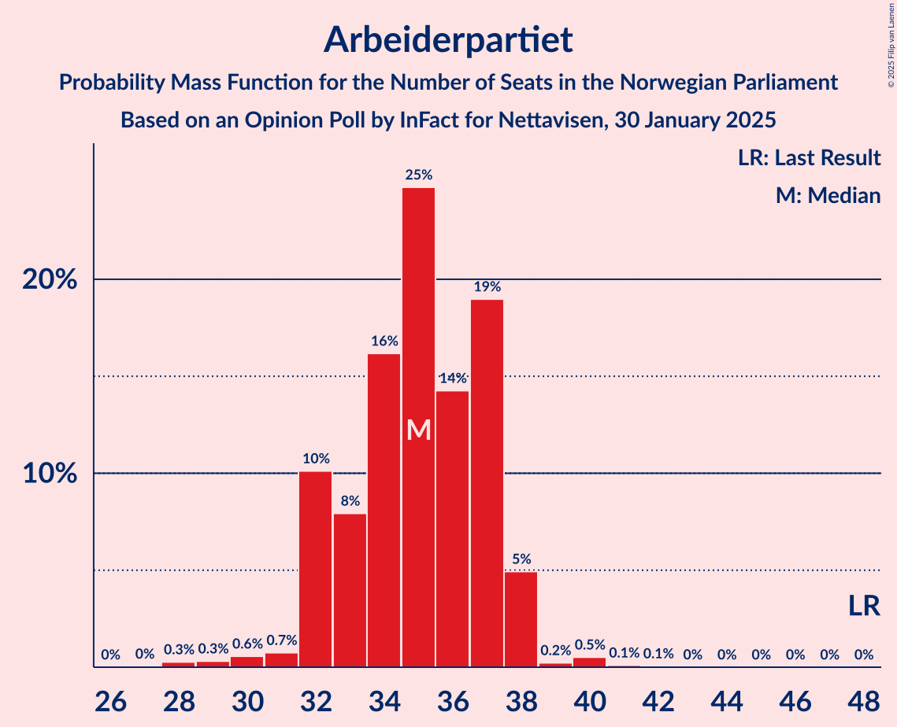
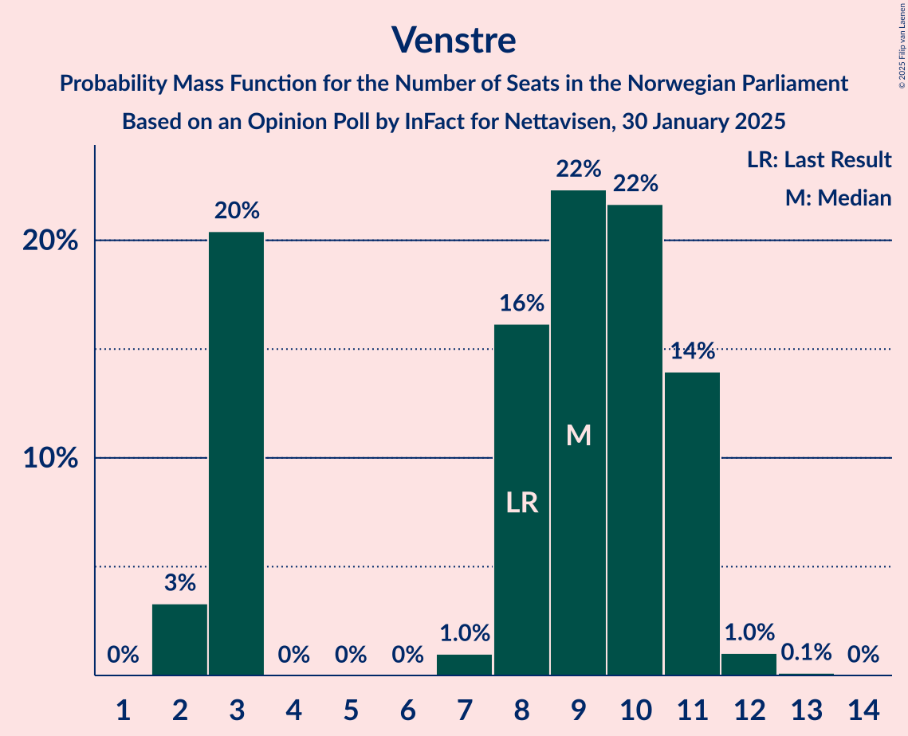
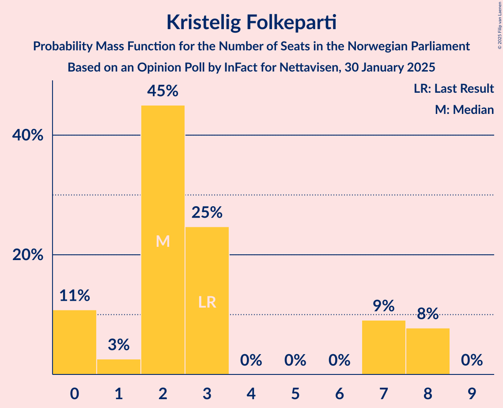
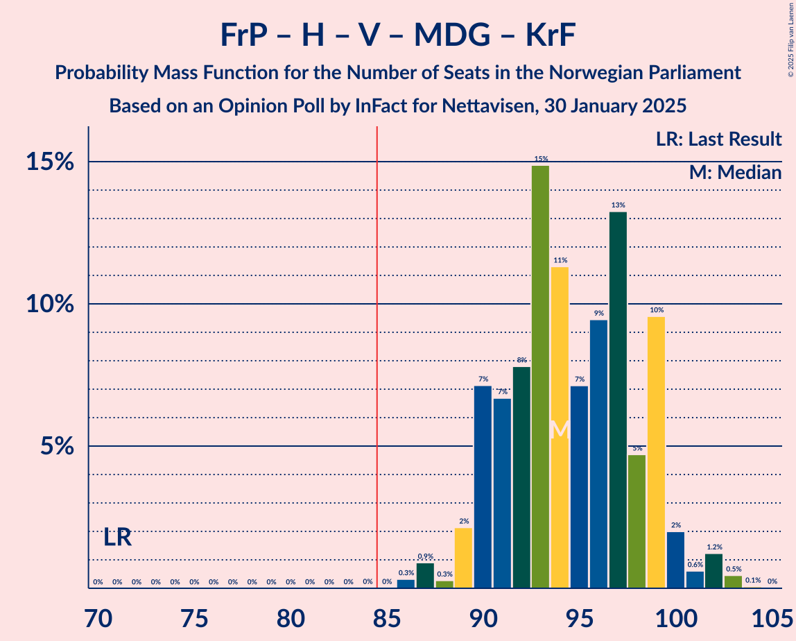
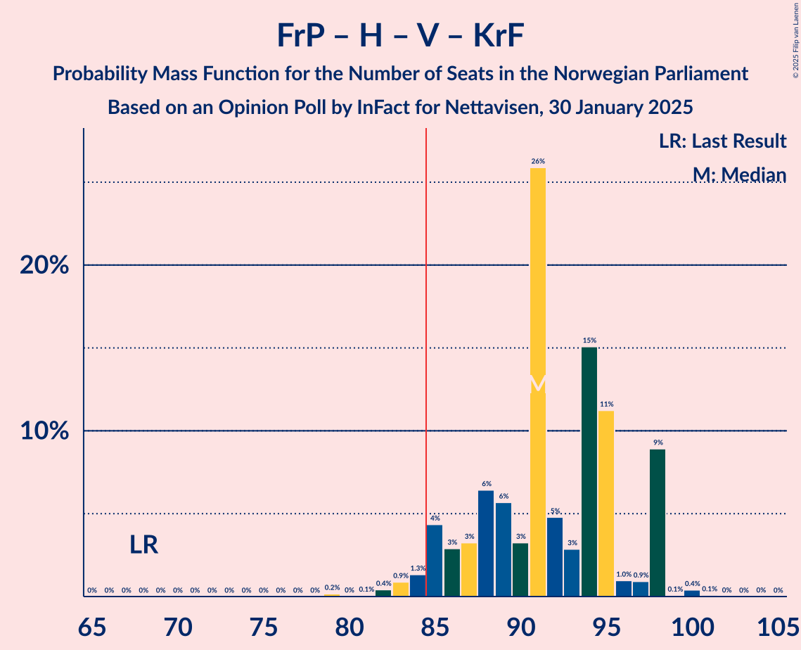
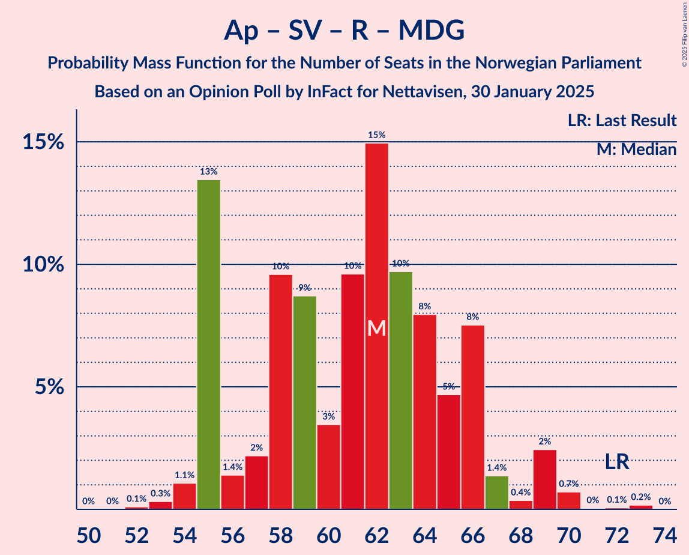
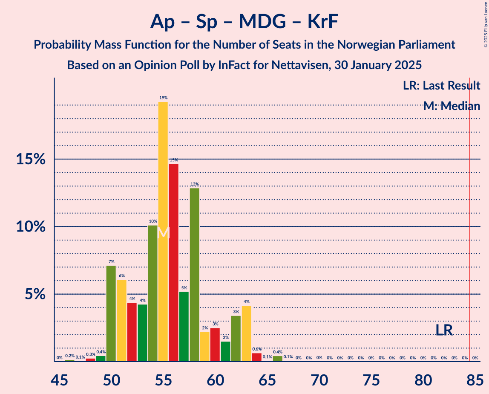

# Opinion Poll by InFact for Nettavisen, 30 January 2025

<a href="#voting-intentions">Voting Intentions</a> | <a href="#seats">Seats</a> | <a href="#coalitions">Coalitions</a> | <a href="#technical-information">Technical Information</a>

## Voting Intentions

### Confidence Intervals

| Party | Last Result | Poll Result | 80% Confidence Interval | 90% Confidence Interval | 95% Confidence Interval | 99% Confidence Interval |
|:-----:|:-----------:|:-----------:|:-----------------------:|:-----------------------:|:-----------------------:|:-----------------------:|
| Fremskrittspartiet | 11.6% | 26.1% | 24.5–27.8% |24.1–28.3% |23.7–28.7% |22.9–29.6% |
| Arbeiderpartiet | 26.2% | 18.4% | 17.0–19.9% |16.6–20.3% |16.2–20.7% |15.6–21.4% |
| Høyre | 20.4% | 18.3% | 16.9–19.8% |16.5–20.2% |16.2–20.6% |15.5–21.3% |
| Sosialistisk Venstreparti | 7.6% | 9.1% | 8.1–10.3% |7.8–10.6% |7.6–10.9% |7.2–11.5% |
| Senterpartiet | 13.5% | 8.2% | 7.3–9.3% |7.0–9.6% |6.8–9.9% |6.3–10.5% |
| Venstre | 4.6% | 4.7% | 4.0–5.6% |3.8–5.9% |3.6–6.1% |3.3–6.5% |
| Rødt | 4.7% | 4.5% | 3.8–5.4% |3.6–5.7% |3.5–5.9% |3.2–6.3% |
| Miljøpartiet De Grønne | 3.9% | 3.4% | 2.8–4.2% |2.7–4.4% |2.5–4.6% |2.3–5.0% |
| Kristelig Folkeparti | 3.8% | 3.0% | 2.4–3.7% |2.3–3.9% |2.1–4.1% |1.9–4.5% |
| Industri- og Næringspartiet | 0.3% | 2.5% | 2.0–3.2% |1.8–3.4% |1.7–3.5% |1.5–3.9% |
| Pensjonistpartiet | 0.6% | 0.4% | 0.3–0.8% |0.2–0.9% |0.2–1.0% |0.1–1.2% |
| Konservativt | 0.4% | 0.3% | 0.2–0.7% |0.2–0.8% |0.1–0.9% |0.1–1.1% |
| Norgesdemokratene | 1.1% | 0.1% | 0.0–0.3% |0.0–0.4% |0.0–0.5% |0.0–0.6% |

*Note:* The poll result column reflects the actual value used in the calculations. Published results may vary slightly, and in addition be rounded to fewer digits.

## Seats

### Confidence Intervals

| Party | Last Result | Median | 80% Confidence Interval | 90% Confidence Interval | 95% Confidence Interval | 99% Confidence Interval |
|:-----:|:-----------:|:------:|:-----------------------:|:-----------------------:|:-----------------------:|:-----------------------:|
| <a href="#fremskrittspartiet">Fremskrittspartiet</a> | 21 | 47 | 44–52 |43–55 |43–55 |42–56 |
| <a href="#arbeiderpartiet">Arbeiderpartiet</a> | 48 | 35 | 32–37 |32–38 |32–38 |29–40 |
| <a href="#høyre">Høyre</a> | 36 | 32 | 29–37 |29–38 |29–38 |28–39 |
| <a href="#sosialistisk-venstreparti">Sosialistisk Venstreparti</a> | 13 | 16 | 15–19 |15–19 |14–20 |13–21 |
| <a href="#senterpartiet">Senterpartiet</a> | 28 | 15 | 13–17 |12–17 |12–18 |11–19 |
| <a href="#venstre">Venstre</a> | 8 | 9 | 3–11 |3–11 |2–11 |2–12 |
| <a href="#rødt">Rødt</a> | 8 | 8 | 1–10 |1–10 |1–12 |1–12 |
| <a href="#miljøpartiet-de-grønne">Miljøpartiet De Grønne</a> | 3 | 3 | 1–7 |1–8 |1–8 |1–10 |
| <a href="#kristelig-folkeparti">Kristelig Folkeparti</a> | 3 | 2 | 0–7 |0–8 |0–8 |0–8 |
| <a href="#industri--og-næringspartiet">Industri- og Næringspartiet</a> | 0 | 0 | 0–2 |0–2 |0–2 |0–2 |
| <a href="#pensjonistpartiet">Pensjonistpartiet</a> | 0 | 0 | 0 |0 |0 |0 |
| <a href="#konservativt">Konservativt</a> | 0 | 0 | 0 |0 |0 |0 |
| <a href="#norgesdemokratene">Norgesdemokratene</a> | 0 | 0 | 0 |0 |0 |0 |

### Fremskrittspartiet

*For a full overview of the results for this party, see the [Fremskrittspartiet](party-fremskrittspartiet.html) page.*

| Number of Seats | Probability | Accumulated | Special Marks |
|:---------------:|:-----------:|:-----------:|:-------------:|
| 21 | 0% | 100% | Last Result |
| 22 | 0% | 100% |  |
| 23 | 0% | 100% |  |
| 24 | 0% | 100% |  |
| 25 | 0% | 100% |  |
| 26 | 0% | 100% |  |
| 27 | 0% | 100% |  |
| 28 | 0% | 100% |  |
| 29 | 0% | 100% |  |
| 30 | 0% | 100% |  |
| 31 | 0% | 100% |  |
| 32 | 0% | 100% |  |
| 33 | 0% | 100% |  |
| 34 | 0% | 100% |  |
| 35 | 0% | 100% |  |
| 36 | 0% | 100% |  |
| 37 | 0% | 100% |  |
| 38 | 0% | 100% |  |
| 39 | 0% | 100% |  |
| 40 | 0.1% | 100% |  |
| 41 | 0.4% | 99.9% |  |
| 42 | 1.4% | 99.5% |  |
| 43 | 5% | 98% |  |
| 44 | 12% | 94% |  |
| 45 | 5% | 82% |  |
| 46 | 12% | 77% |  |
| 47 | 18% | 65% | Median |
| 48 | 9% | 47% |  |
| 49 | 8% | 38% |  |
| 50 | 4% | 30% |  |
| 51 | 12% | 26% |  |
| 52 | 4% | 14% |  |
| 53 | 2% | 9% |  |
| 54 | 0.3% | 7% |  |
| 55 | 6% | 7% |  |
| 56 | 0.6% | 0.8% |  |
| 57 | 0% | 0.1% |  |
| 58 | 0.1% | 0.1% |  |
| 59 | 0% | 0% |  |

### Arbeiderpartiet

*For a full overview of the results for this party, see the [Arbeiderpartiet](party-arbeiderpartiet.html) page.*

| Number of Seats | Probability | Accumulated | Special Marks |
|:---------------:|:-----------:|:-----------:|:-------------:|
| 28 | 0.3% | 100% |  |
| 29 | 0.3% | 99.7% |  |
| 30 | 0.6% | 99.4% |  |
| 31 | 0.7% | 98.8% |  |
| 32 | 10% | 98% |  |
| 33 | 8% | 88% |  |
| 34 | 16% | 80% |  |
| 35 | 25% | 64% | Median |
| 36 | 14% | 39% |  |
| 37 | 19% | 25% |  |
| 38 | 5% | 6% |  |
| 39 | 0.2% | 0.9% |  |
| 40 | 0.5% | 0.7% |  |
| 41 | 0.1% | 0.2% |  |
| 42 | 0.1% | 0.1% |  |
| 43 | 0% | 0% |  |
| 44 | 0% | 0% |  |
| 45 | 0% | 0% |  |
| 46 | 0% | 0% |  |
| 47 | 0% | 0% |  |
| 48 | 0% | 0% | Last Result |

### Høyre

*For a full overview of the results for this party, see the [Høyre](party-høyre.html) page.*

| Number of Seats | Probability | Accumulated | Special Marks |
|:---------------:|:-----------:|:-----------:|:-------------:|
| 25 | 0.1% | 100% |  |
| 26 | 0% | 99.9% |  |
| 27 | 0.4% | 99.9% |  |
| 28 | 1.5% | 99.5% |  |
| 29 | 8% | 98% |  |
| 30 | 2% | 90% |  |
| 31 | 16% | 88% |  |
| 32 | 23% | 72% | Median |
| 33 | 21% | 49% |  |
| 34 | 3% | 27% |  |
| 35 | 2% | 25% |  |
| 36 | 10% | 23% | Last Result |
| 37 | 3% | 13% |  |
| 38 | 8% | 9% |  |
| 39 | 1.5% | 2% |  |
| 40 | 0.2% | 0.2% |  |
| 41 | 0% | 0% |  |

### Sosialistisk Venstreparti

*For a full overview of the results for this party, see the [Sosialistisk Venstreparti](party-sosialistiskvenstreparti.html) page.*

| Number of Seats | Probability | Accumulated | Special Marks |
|:---------------:|:-----------:|:-----------:|:-------------:|
| 12 | 0.4% | 100% |  |
| 13 | 0.5% | 99.6% | Last Result |
| 14 | 4% | 99.1% |  |
| 15 | 7% | 95% |  |
| 16 | 41% | 88% | Median |
| 17 | 25% | 47% |  |
| 18 | 7% | 22% |  |
| 19 | 12% | 15% |  |
| 20 | 0.9% | 3% |  |
| 21 | 2% | 2% |  |
| 22 | 0% | 0% |  |

### Senterpartiet

*For a full overview of the results for this party, see the [Senterpartiet](party-senterpartiet.html) page.*

| Number of Seats | Probability | Accumulated | Special Marks |
|:---------------:|:-----------:|:-----------:|:-------------:|
| 10 | 0.1% | 100% |  |
| 11 | 2% | 99.9% |  |
| 12 | 8% | 98% |  |
| 13 | 12% | 90% |  |
| 14 | 13% | 79% |  |
| 15 | 36% | 66% | Median |
| 16 | 19% | 30% |  |
| 17 | 7% | 11% |  |
| 18 | 2% | 3% |  |
| 19 | 2% | 2% |  |
| 20 | 0.1% | 0.1% |  |
| 21 | 0.1% | 0.1% |  |
| 22 | 0% | 0% |  |
| 23 | 0% | 0% |  |
| 24 | 0% | 0% |  |
| 25 | 0% | 0% |  |
| 26 | 0% | 0% |  |
| 27 | 0% | 0% |  |
| 28 | 0% | 0% | Last Result |

### Venstre

*For a full overview of the results for this party, see the [Venstre](party-venstre.html) page.*

| Number of Seats | Probability | Accumulated | Special Marks |
|:---------------:|:-----------:|:-----------:|:-------------:|
| 2 | 3% | 100% |  |
| 3 | 20% | 97% |  |
| 4 | 0% | 76% |  |
| 5 | 0% | 76% |  |
| 6 | 0% | 76% |  |
| 7 | 1.0% | 76% |  |
| 8 | 16% | 75% | Last Result |
| 9 | 22% | 59% | Median |
| 10 | 22% | 37% |  |
| 11 | 14% | 15% |  |
| 12 | 1.0% | 1.2% |  |
| 13 | 0.1% | 0.1% |  |
| 14 | 0% | 0% |  |

### Rødt

*For a full overview of the results for this party, see the [Rødt](party-rødt.html) page.*

| Number of Seats | Probability | Accumulated | Special Marks |
|:---------------:|:-----------:|:-----------:|:-------------:|
| 1 | 31% | 100% |  |
| 2 | 0% | 69% |  |
| 3 | 0% | 69% |  |
| 4 | 0% | 69% |  |
| 5 | 0% | 69% |  |
| 6 | 0% | 69% |  |
| 7 | 6% | 69% |  |
| 8 | 30% | 63% | Last Result, Median |
| 9 | 18% | 33% |  |
| 10 | 10% | 15% |  |
| 11 | 1.5% | 5% |  |
| 12 | 3% | 3% |  |
| 13 | 0.1% | 0.2% |  |
| 14 | 0% | 0% |  |

### Miljøpartiet De Grønne

*For a full overview of the results for this party, see the [Miljøpartiet De Grønne](party-miljøpartietdegrønne.html) page.*

| Number of Seats | Probability | Accumulated | Special Marks |
|:---------------:|:-----------:|:-----------:|:-------------:|
| 1 | 26% | 100% |  |
| 2 | 16% | 74% |  |
| 3 | 45% | 59% | Last Result, Median |
| 4 | 0% | 13% |  |
| 5 | 0% | 13% |  |
| 6 | 0% | 13% |  |
| 7 | 6% | 13% |  |
| 8 | 5% | 7% |  |
| 9 | 1.0% | 2% |  |
| 10 | 0.5% | 0.5% |  |
| 11 | 0% | 0% |  |

### Kristelig Folkeparti

*For a full overview of the results for this party, see the [Kristelig Folkeparti](party-kristeligfolkeparti.html) page.*

| Number of Seats | Probability | Accumulated | Special Marks |
|:---------------:|:-----------:|:-----------:|:-------------:|
| 0 | 11% | 100% |  |
| 1 | 3% | 89% |  |
| 2 | 45% | 87% | Median |
| 3 | 25% | 42% | Last Result |
| 4 | 0% | 17% |  |
| 5 | 0% | 17% |  |
| 6 | 0% | 17% |  |
| 7 | 9% | 17% |  |
| 8 | 8% | 8% |  |
| 9 | 0% | 0% |  |

### Industri- og Næringspartiet

*For a full overview of the results for this party, see the [Industri- og Næringspartiet](party-industri-ognæringspartiet.html) page.*

| Number of Seats | Probability | Accumulated | Special Marks |
|:---------------:|:-----------:|:-----------:|:-------------:|
| 0 | 59% | 100% | Last Result, Median |
| 1 | 18% | 41% |  |
| 2 | 23% | 23% |  |
| 3 | 0% | 0.1% |  |
| 4 | 0% | 0.1% |  |
| 5 | 0% | 0.1% |  |
| 6 | 0% | 0.1% |  |
| 7 | 0.1% | 0.1% |  |
| 8 | 0% | 0% |  |

### Pensjonistpartiet

*For a full overview of the results for this party, see the [Pensjonistpartiet](party-pensjonistpartiet.html) page.*

| Number of Seats | Probability | Accumulated | Special Marks |
|:---------------:|:-----------:|:-----------:|:-------------:|
| 0 | 100% | 100% | Last Result, Median |

### Konservativt

*For a full overview of the results for this party, see the [Konservativt](party-konservativt.html) page.*

| Number of Seats | Probability | Accumulated | Special Marks |
|:---------------:|:-----------:|:-----------:|:-------------:|
| 0 | 100% | 100% | Last Result, Median |

### Norgesdemokratene

*For a full overview of the results for this party, see the [Norgesdemokratene](party-norgesdemokratene.html) page.*

| Number of Seats | Probability | Accumulated | Special Marks |
|:---------------:|:-----------:|:-----------:|:-------------:|
| 0 | 100% | 100% | Last Result, Median |

## Coalitions

### Confidence Intervals

| Coalition | Last Result | Median | Majority? | 80% Confidence Interval | 90% Confidence Interval | 95% Confidence Interval | 99% Confidence Interval |
|:---------:|:-----------:|:------:|:---------:|:-----------------------:|:-----------------------:|:-----------------------:|:-----------------------:|
| Fremskrittspartiet – Høyre – Senterpartiet – Venstre – Kristelig Folkeparti | 96 | 106 | 100% | 101–113 | 100–113 | 99–113 | 97–114 |
| Fremskrittspartiet – Høyre – Venstre – Miljøpartiet De Grønne – Kristelig Folkeparti | 71 | 94 | 100% | 90–99 | 90–99 | 89–100 | 87–103 |
| Fremskrittspartiet – Høyre – Venstre – Kristelig Folkeparti | 68 | 91 | 97% | 86–97 | 85–98 | 84–98 | 82–100 |
| Fremskrittspartiet – Høyre – Venstre | 65 | 88 | 83% | 84–95 | 83–95 | 82–95 | 80–98 |
| Fremskrittspartiet – Høyre | 57 | 80 | 13% | 76–86 | 75–91 | 74–91 | 72–92 |
| Arbeiderpartiet – Sosialistisk Venstreparti – Senterpartiet – Rødt – Miljøpartiet De Grønne | 100 | 76 | 1.3% | 71–81 | 70–82 | 70–82 | 68–86 |
| Arbeiderpartiet – Sosialistisk Venstreparti – Senterpartiet – Miljøpartiet De Grønne – Kristelig Folkeparti | 95 | 72 | 0% | 67–77 | 66–81 | 66–81 | 65–83 |
| Arbeiderpartiet – Sosialistisk Venstreparti – Senterpartiet – Rødt | 97 | 73 | 0% | 69–77 | 68–78 | 68–79 | 64–81 |
| Arbeiderpartiet – Sosialistisk Venstreparti – Senterpartiet – Miljøpartiet De Grønne | 92 | 69 | 0% | 65–73 | 64–74 | 64–76 | 63–79 |
| Arbeiderpartiet – Sosialistisk Venstreparti – Senterpartiet | 89 | 67 | 0% | 63–70 | 62–70 | 61–71 | 60–74 |
| Arbeiderpartiet – Sosialistisk Venstreparti – Rødt – Miljøpartiet De Grønne | 72 | 62 | 0% | 55–66 | 55–67 | 55–69 | 54–70 |
| Arbeiderpartiet – Senterpartiet – Miljøpartiet De Grønne – Kristelig Folkeparti | 82 | 55 | 0% | 51–61 | 50–63 | 50–63 | 48–66 |
| Arbeiderpartiet – Senterpartiet – Kristelig Folkeparti | 79 | 52 | 0% | 49–57 | 48–59 | 48–60 | 45–60 |
| Arbeiderpartiet – Sosialistisk Venstreparti | 61 | 52 | 0% | 49–55 | 48–55 | 47–56 | 46–57 |
| Arbeiderpartiet – Senterpartiet | 76 | 50 | 0% | 47–52 | 46–53 | 46–54 | 44–55 |
| Høyre – Venstre – Kristelig Folkeparti | 47 | 44 | 0% | 39–49 | 36–49 | 36–50 | 34–52 |
| Senterpartiet – Venstre – Kristelig Folkeparti | 39 | 26 | 0% | 20–30 | 18–33 | 18–33 | 17–33 |

### Fremskrittspartiet – Høyre – Senterpartiet – Venstre – Kristelig Folkeparti

| Number of Seats | Probability | Accumulated | Special Marks |
|:---------------:|:-----------:|:-----------:|:-------------:|
| 95 | 0.2% | 100% |  |
| 96 | 0.1% | 99.8% | Last Result |
| 97 | 0.5% | 99.7% |  |
| 98 | 0.9% | 99.1% |  |
| 99 | 3% | 98% |  |
| 100 | 1.3% | 96% |  |
| 101 | 6% | 94% |  |
| 102 | 4% | 89% |  |
| 103 | 4% | 85% |  |
| 104 | 15% | 81% |  |
| 105 | 5% | 66% | Median |
| 106 | 14% | 61% |  |
| 107 | 11% | 47% |  |
| 108 | 7% | 36% |  |
| 109 | 4% | 29% |  |
| 110 | 6% | 25% |  |
| 111 | 7% | 18% |  |
| 112 | 0.4% | 11% |  |
| 113 | 10% | 11% |  |
| 114 | 0.9% | 1.1% |  |
| 115 | 0.1% | 0.2% |  |
| 116 | 0.1% | 0.1% |  |
| 117 | 0% | 0% |  |

### Fremskrittspartiet – Høyre – Venstre – Miljøpartiet De Grønne – Kristelig Folkeparti

| Number of Seats | Probability | Accumulated | Special Marks |
|:---------------:|:-----------:|:-----------:|:-------------:|
| 71 | 0% | 100% | Last Result |
| 72 | 0% | 100% |  |
| 73 | 0% | 100% |  |
| 74 | 0% | 100% |  |
| 75 | 0% | 100% |  |
| 76 | 0% | 100% |  |
| 77 | 0% | 100% |  |
| 78 | 0% | 100% |  |
| 79 | 0% | 100% |  |
| 80 | 0% | 100% |  |
| 81 | 0% | 100% |  |
| 82 | 0% | 100% |  |
| 83 | 0% | 100% |  |
| 84 | 0% | 100% |  |
| 85 | 0% | 100% | Majority |
| 86 | 0.3% | 100% |  |
| 87 | 0.9% | 99.6% |  |
| 88 | 0.3% | 98.7% |  |
| 89 | 2% | 98% |  |
| 90 | 7% | 96% |  |
| 91 | 7% | 89% |  |
| 92 | 8% | 82% |  |
| 93 | 15% | 75% | Median |
| 94 | 11% | 60% |  |
| 95 | 7% | 49% |  |
| 96 | 9% | 41% |  |
| 97 | 13% | 32% |  |
| 98 | 5% | 19% |  |
| 99 | 10% | 14% |  |
| 100 | 2% | 4% |  |
| 101 | 0.6% | 2% |  |
| 102 | 1.2% | 2% |  |
| 103 | 0.5% | 0.6% |  |
| 104 | 0.1% | 0.1% |  |
| 105 | 0% | 0% |  |

### Fremskrittspartiet – Høyre – Venstre – Kristelig Folkeparti

| Number of Seats | Probability | Accumulated | Special Marks |
|:---------------:|:-----------:|:-----------:|:-------------:|
| 68 | 0% | 100% | Last Result |
| 69 | 0% | 100% |  |
| 70 | 0% | 100% |  |
| 71 | 0% | 100% |  |
| 72 | 0% | 100% |  |
| 73 | 0% | 100% |  |
| 74 | 0% | 100% |  |
| 75 | 0% | 100% |  |
| 76 | 0% | 100% |  |
| 77 | 0% | 100% |  |
| 78 | 0% | 100% |  |
| 79 | 0.2% | 100% |  |
| 80 | 0% | 99.8% |  |
| 81 | 0.1% | 99.8% |  |
| 82 | 0.4% | 99.8% |  |
| 83 | 0.9% | 99.3% |  |
| 84 | 1.3% | 98% |  |
| 85 | 4% | 97% | Majority |
| 86 | 3% | 93% |  |
| 87 | 3% | 90% |  |
| 88 | 6% | 87% |  |
| 89 | 6% | 80% |  |
| 90 | 3% | 75% | Median |
| 91 | 26% | 71% |  |
| 92 | 5% | 45% |  |
| 93 | 3% | 41% |  |
| 94 | 15% | 38% |  |
| 95 | 11% | 23% |  |
| 96 | 1.0% | 11% |  |
| 97 | 0.9% | 10% |  |
| 98 | 9% | 10% |  |
| 99 | 0.1% | 0.6% |  |
| 100 | 0.4% | 0.5% |  |
| 101 | 0.1% | 0.1% |  |
| 102 | 0% | 0% |  |

### Fremskrittspartiet – Høyre – Venstre

| Number of Seats | Probability | Accumulated | Special Marks |
|:---------------:|:-----------:|:-----------:|:-------------:|
| 65 | 0% | 100% | Last Result |
| 66 | 0% | 100% |  |
| 67 | 0% | 100% |  |
| 68 | 0% | 100% |  |
| 69 | 0% | 100% |  |
| 70 | 0% | 100% |  |
| 71 | 0% | 100% |  |
| 72 | 0% | 100% |  |
| 73 | 0% | 100% |  |
| 74 | 0% | 100% |  |
| 75 | 0% | 100% |  |
| 76 | 0% | 100% |  |
| 77 | 0.2% | 100% |  |
| 78 | 0% | 99.8% |  |
| 79 | 0.2% | 99.8% |  |
| 80 | 0.5% | 99.6% |  |
| 81 | 1.1% | 99.2% |  |
| 82 | 1.5% | 98% |  |
| 83 | 4% | 97% |  |
| 84 | 9% | 92% |  |
| 85 | 3% | 83% | Majority |
| 86 | 11% | 80% |  |
| 87 | 4% | 69% |  |
| 88 | 15% | 65% | Median |
| 89 | 15% | 50% |  |
| 90 | 3% | 34% |  |
| 91 | 6% | 31% |  |
| 92 | 2% | 25% |  |
| 93 | 7% | 23% |  |
| 94 | 6% | 16% |  |
| 95 | 9% | 10% |  |
| 96 | 0.2% | 0.8% |  |
| 97 | 0.1% | 0.6% |  |
| 98 | 0.1% | 0.5% |  |
| 99 | 0% | 0.4% |  |
| 100 | 0.4% | 0.4% |  |
| 101 | 0% | 0% |  |

### Fremskrittspartiet – Høyre

| Number of Seats | Probability | Accumulated | Special Marks |
|:---------------:|:-----------:|:-----------:|:-------------:|
| 57 | 0% | 100% | Last Result |
| 58 | 0% | 100% |  |
| 59 | 0% | 100% |  |
| 60 | 0% | 100% |  |
| 61 | 0% | 100% |  |
| 62 | 0% | 100% |  |
| 63 | 0% | 100% |  |
| 64 | 0% | 100% |  |
| 65 | 0% | 100% |  |
| 66 | 0% | 100% |  |
| 67 | 0% | 100% |  |
| 68 | 0% | 100% |  |
| 69 | 0% | 100% |  |
| 70 | 0% | 100% |  |
| 71 | 0.4% | 100% |  |
| 72 | 0.3% | 99.6% |  |
| 73 | 1.0% | 99.3% |  |
| 74 | 1.5% | 98% |  |
| 75 | 3% | 97% |  |
| 76 | 7% | 93% |  |
| 77 | 6% | 86% |  |
| 78 | 8% | 80% |  |
| 79 | 14% | 72% | Median |
| 80 | 10% | 58% |  |
| 81 | 12% | 48% |  |
| 82 | 5% | 36% |  |
| 83 | 4% | 31% |  |
| 84 | 15% | 28% |  |
| 85 | 2% | 13% | Majority |
| 86 | 4% | 11% |  |
| 87 | 0.6% | 8% |  |
| 88 | 0.8% | 7% |  |
| 89 | 0.1% | 6% |  |
| 90 | 0.1% | 6% |  |
| 91 | 5% | 6% |  |
| 92 | 1.1% | 1.2% |  |
| 93 | 0.1% | 0.1% |  |
| 94 | 0% | 0% |  |

### Arbeiderpartiet – Sosialistisk Venstreparti – Senterpartiet – Rødt – Miljøpartiet De Grønne

| Number of Seats | Probability | Accumulated | Special Marks |
|:---------------:|:-----------:|:-----------:|:-------------:|
| 66 | 0% | 100% |  |
| 67 | 0.4% | 99.9% |  |
| 68 | 0.1% | 99.5% |  |
| 69 | 0.2% | 99.5% |  |
| 70 | 9% | 99.3% |  |
| 71 | 5% | 90% |  |
| 72 | 6% | 85% |  |
| 73 | 10% | 79% |  |
| 74 | 11% | 70% |  |
| 75 | 6% | 59% |  |
| 76 | 5% | 53% |  |
| 77 | 17% | 48% | Median |
| 78 | 9% | 31% |  |
| 79 | 9% | 22% |  |
| 80 | 2% | 13% |  |
| 81 | 2% | 11% |  |
| 82 | 7% | 9% |  |
| 83 | 1.0% | 2% |  |
| 84 | 0.2% | 1.5% |  |
| 85 | 0.8% | 1.3% | Majority |
| 86 | 0.3% | 0.5% |  |
| 87 | 0% | 0.2% |  |
| 88 | 0% | 0.2% |  |
| 89 | 0.2% | 0.2% |  |
| 90 | 0% | 0% |  |
| 91 | 0% | 0% |  |
| 92 | 0% | 0% |  |
| 93 | 0% | 0% |  |
| 94 | 0% | 0% |  |
| 95 | 0% | 0% |  |
| 96 | 0% | 0% |  |
| 97 | 0% | 0% |  |
| 98 | 0% | 0% |  |
| 99 | 0% | 0% |  |
| 100 | 0% | 0% | Last Result |

### Arbeiderpartiet – Sosialistisk Venstreparti – Senterpartiet – Miljøpartiet De Grønne – Kristelig Folkeparti

| Number of Seats | Probability | Accumulated | Special Marks |
|:---------------:|:-----------:|:-----------:|:-------------:|
| 61 | 0.1% | 100% |  |
| 62 | 0.1% | 99.9% |  |
| 63 | 0.1% | 99.9% |  |
| 64 | 0.2% | 99.7% |  |
| 65 | 0.4% | 99.5% |  |
| 66 | 7% | 99.2% |  |
| 67 | 4% | 92% |  |
| 68 | 7% | 88% |  |
| 69 | 4% | 81% |  |
| 70 | 1.3% | 78% |  |
| 71 | 15% | 76% | Median |
| 72 | 22% | 61% |  |
| 73 | 3% | 38% |  |
| 74 | 14% | 35% |  |
| 75 | 4% | 21% |  |
| 76 | 1.2% | 17% |  |
| 77 | 6% | 16% |  |
| 78 | 0.8% | 10% |  |
| 79 | 0.9% | 9% |  |
| 80 | 1.0% | 8% |  |
| 81 | 6% | 7% |  |
| 82 | 0.1% | 0.6% |  |
| 83 | 0.5% | 0.6% |  |
| 84 | 0% | 0% |  |
| 85 | 0% | 0% | Majority |
| 86 | 0% | 0% |  |
| 87 | 0% | 0% |  |
| 88 | 0% | 0% |  |
| 89 | 0% | 0% |  |
| 90 | 0% | 0% |  |
| 91 | 0% | 0% |  |
| 92 | 0% | 0% |  |
| 93 | 0% | 0% |  |
| 94 | 0% | 0% |  |
| 95 | 0% | 0% | Last Result |

### Arbeiderpartiet – Sosialistisk Venstreparti – Senterpartiet – Rødt

| Number of Seats | Probability | Accumulated | Special Marks |
|:---------------:|:-----------:|:-----------:|:-------------:|
| 63 | 0% | 100% |  |
| 64 | 0.5% | 99.9% |  |
| 65 | 0.1% | 99.5% |  |
| 66 | 1.3% | 99.4% |  |
| 67 | 0.6% | 98% |  |
| 68 | 6% | 98% |  |
| 69 | 15% | 91% |  |
| 70 | 4% | 77% |  |
| 71 | 8% | 72% |  |
| 72 | 10% | 64% |  |
| 73 | 6% | 54% |  |
| 74 | 9% | 48% | Median |
| 75 | 19% | 39% |  |
| 76 | 8% | 20% |  |
| 77 | 4% | 11% |  |
| 78 | 5% | 8% |  |
| 79 | 2% | 3% |  |
| 80 | 0.2% | 0.7% |  |
| 81 | 0.2% | 0.5% |  |
| 82 | 0.2% | 0.3% |  |
| 83 | 0.1% | 0.1% |  |
| 84 | 0% | 0% |  |
| 85 | 0% | 0% | Majority |
| 86 | 0% | 0% |  |
| 87 | 0% | 0% |  |
| 88 | 0% | 0% |  |
| 89 | 0% | 0% |  |
| 90 | 0% | 0% |  |
| 91 | 0% | 0% |  |
| 92 | 0% | 0% |  |
| 93 | 0% | 0% |  |
| 94 | 0% | 0% |  |
| 95 | 0% | 0% |  |
| 96 | 0% | 0% |  |
| 97 | 0% | 0% | Last Result |

### Arbeiderpartiet – Sosialistisk Venstreparti – Senterpartiet – Miljøpartiet De Grønne

| Number of Seats | Probability | Accumulated | Special Marks |
|:---------------:|:-----------:|:-----------:|:-------------:|
| 59 | 0% | 100% |  |
| 60 | 0.1% | 99.9% |  |
| 61 | 0.1% | 99.9% |  |
| 62 | 0.2% | 99.7% |  |
| 63 | 0.3% | 99.5% |  |
| 64 | 6% | 99.2% |  |
| 65 | 9% | 93% |  |
| 66 | 3% | 84% |  |
| 67 | 5% | 81% |  |
| 68 | 4% | 75% |  |
| 69 | 24% | 72% | Median |
| 70 | 14% | 48% |  |
| 71 | 7% | 34% |  |
| 72 | 13% | 27% |  |
| 73 | 8% | 14% |  |
| 74 | 2% | 6% |  |
| 75 | 1.3% | 5% |  |
| 76 | 1.3% | 3% |  |
| 77 | 0.6% | 2% |  |
| 78 | 0.9% | 1.4% |  |
| 79 | 0.4% | 0.5% |  |
| 80 | 0% | 0.1% |  |
| 81 | 0% | 0.1% |  |
| 82 | 0.1% | 0.1% |  |
| 83 | 0% | 0% |  |
| 84 | 0% | 0% |  |
| 85 | 0% | 0% | Majority |
| 86 | 0% | 0% |  |
| 87 | 0% | 0% |  |
| 88 | 0% | 0% |  |
| 89 | 0% | 0% |  |
| 90 | 0% | 0% |  |
| 91 | 0% | 0% |  |
| 92 | 0% | 0% | Last Result |

### Arbeiderpartiet – Sosialistisk Venstreparti – Senterpartiet

| Number of Seats | Probability | Accumulated | Special Marks |
|:---------------:|:-----------:|:-----------:|:-------------:|
| 57 | 0% | 100% |  |
| 58 | 0.1% | 99.9% |  |
| 59 | 0.1% | 99.9% |  |
| 60 | 0.4% | 99.8% |  |
| 61 | 2% | 99.4% |  |
| 62 | 6% | 97% |  |
| 63 | 8% | 91% |  |
| 64 | 6% | 84% |  |
| 65 | 13% | 78% |  |
| 66 | 7% | 65% | Median |
| 67 | 19% | 58% |  |
| 68 | 17% | 39% |  |
| 69 | 11% | 22% |  |
| 70 | 7% | 11% |  |
| 71 | 2% | 3% |  |
| 72 | 0.7% | 1.4% |  |
| 73 | 0.3% | 0.8% |  |
| 74 | 0.4% | 0.5% |  |
| 75 | 0.1% | 0.1% |  |
| 76 | 0% | 0% |  |
| 77 | 0% | 0% |  |
| 78 | 0% | 0% |  |
| 79 | 0% | 0% |  |
| 80 | 0% | 0% |  |
| 81 | 0% | 0% |  |
| 82 | 0% | 0% |  |
| 83 | 0% | 0% |  |
| 84 | 0% | 0% |  |
| 85 | 0% | 0% | Majority |
| 86 | 0% | 0% |  |
| 87 | 0% | 0% |  |
| 88 | 0% | 0% |  |
| 89 | 0% | 0% | Last Result |

### Arbeiderpartiet – Sosialistisk Venstreparti – Rødt – Miljøpartiet De Grønne

| Number of Seats | Probability | Accumulated | Special Marks |
|:---------------:|:-----------:|:-----------:|:-------------:|
| 52 | 0.1% | 100% |  |
| 53 | 0.3% | 99.9% |  |
| 54 | 1.1% | 99.5% |  |
| 55 | 13% | 98% |  |
| 56 | 1.4% | 85% |  |
| 57 | 2% | 84% |  |
| 58 | 10% | 81% |  |
| 59 | 9% | 72% |  |
| 60 | 3% | 63% |  |
| 61 | 10% | 60% |  |
| 62 | 15% | 50% | Median |
| 63 | 10% | 35% |  |
| 64 | 8% | 25% |  |
| 65 | 5% | 17% |  |
| 66 | 8% | 13% |  |
| 67 | 1.4% | 5% |  |
| 68 | 0.4% | 4% |  |
| 69 | 2% | 3% |  |
| 70 | 0.7% | 1.0% |  |
| 71 | 0% | 0.3% |  |
| 72 | 0.1% | 0.3% | Last Result |
| 73 | 0.2% | 0.2% |  |
| 74 | 0% | 0% |  |

### Arbeiderpartiet – Senterpartiet – Miljøpartiet De Grønne – Kristelig Folkeparti

| Number of Seats | Probability | Accumulated | Special Marks |
|:---------------:|:-----------:|:-----------:|:-------------:|
| 46 | 0.2% | 100% |  |
| 47 | 0.1% | 99.8% |  |
| 48 | 0.3% | 99.7% |  |
| 49 | 0.4% | 99.5% |  |
| 50 | 7% | 99.0% |  |
| 51 | 6% | 92% |  |
| 52 | 4% | 86% |  |
| 53 | 4% | 81% |  |
| 54 | 10% | 77% |  |
| 55 | 19% | 67% | Median |
| 56 | 15% | 48% |  |
| 57 | 5% | 33% |  |
| 58 | 13% | 28% |  |
| 59 | 2% | 15% |  |
| 60 | 3% | 13% |  |
| 61 | 2% | 10% |  |
| 62 | 3% | 9% |  |
| 63 | 4% | 5% |  |
| 64 | 0.6% | 1.3% |  |
| 65 | 0.1% | 0.6% |  |
| 66 | 0.4% | 0.5% |  |
| 67 | 0.1% | 0.1% |  |
| 68 | 0% | 0% |  |
| 69 | 0% | 0% |  |
| 70 | 0% | 0% |  |
| 71 | 0% | 0% |  |
| 72 | 0% | 0% |  |
| 73 | 0% | 0% |  |
| 74 | 0% | 0% |  |
| 75 | 0% | 0% |  |
| 76 | 0% | 0% |  |
| 77 | 0% | 0% |  |
| 78 | 0% | 0% |  |
| 79 | 0% | 0% |  |
| 80 | 0% | 0% |  |
| 81 | 0% | 0% |  |
| 82 | 0% | 0% | Last Result |

### Arbeiderpartiet – Senterpartiet – Kristelig Folkeparti

| Number of Seats | Probability | Accumulated | Special Marks |
|:---------------:|:-----------:|:-----------:|:-------------:|
| 44 | 0% | 100% |  |
| 45 | 0.6% | 99.9% |  |
| 46 | 0.2% | 99.4% |  |
| 47 | 1.0% | 99.2% |  |
| 48 | 4% | 98% |  |
| 49 | 12% | 94% |  |
| 50 | 6% | 82% |  |
| 51 | 5% | 76% |  |
| 52 | 28% | 71% | Median |
| 53 | 7% | 43% |  |
| 54 | 6% | 36% |  |
| 55 | 19% | 30% |  |
| 56 | 0.9% | 11% |  |
| 57 | 2% | 10% |  |
| 58 | 1.1% | 8% |  |
| 59 | 3% | 7% |  |
| 60 | 4% | 4% |  |
| 61 | 0.2% | 0.2% |  |
| 62 | 0% | 0% |  |
| 63 | 0% | 0% |  |
| 64 | 0% | 0% |  |
| 65 | 0% | 0% |  |
| 66 | 0% | 0% |  |
| 67 | 0% | 0% |  |
| 68 | 0% | 0% |  |
| 69 | 0% | 0% |  |
| 70 | 0% | 0% |  |
| 71 | 0% | 0% |  |
| 72 | 0% | 0% |  |
| 73 | 0% | 0% |  |
| 74 | 0% | 0% |  |
| 75 | 0% | 0% |  |
| 76 | 0% | 0% |  |
| 77 | 0% | 0% |  |
| 78 | 0% | 0% |  |
| 79 | 0% | 0% | Last Result |

### Arbeiderpartiet – Sosialistisk Venstreparti

| Number of Seats | Probability | Accumulated | Special Marks |
|:---------------:|:-----------:|:-----------:|:-------------:|
| 43 | 0.1% | 100% |  |
| 44 | 0.1% | 99.9% |  |
| 45 | 0.2% | 99.8% |  |
| 46 | 0.5% | 99.6% |  |
| 47 | 2% | 99.0% |  |
| 48 | 7% | 97% |  |
| 49 | 11% | 90% |  |
| 50 | 12% | 80% |  |
| 51 | 10% | 68% | Median |
| 52 | 15% | 57% |  |
| 53 | 22% | 42% |  |
| 54 | 7% | 20% |  |
| 55 | 10% | 14% |  |
| 56 | 3% | 3% |  |
| 57 | 0.3% | 0.6% |  |
| 58 | 0.2% | 0.3% |  |
| 59 | 0.1% | 0.1% |  |
| 60 | 0% | 0% |  |
| 61 | 0% | 0% | Last Result |

### Arbeiderpartiet – Senterpartiet

| Number of Seats | Probability | Accumulated | Special Marks |
|:---------------:|:-----------:|:-----------:|:-------------:|
| 41 | 0% | 100% |  |
| 42 | 0% | 99.9% |  |
| 43 | 0.1% | 99.9% |  |
| 44 | 0.4% | 99.8% |  |
| 45 | 2% | 99.4% |  |
| 46 | 6% | 98% |  |
| 47 | 10% | 92% |  |
| 48 | 11% | 82% |  |
| 49 | 9% | 70% |  |
| 50 | 26% | 62% | Median |
| 51 | 7% | 36% |  |
| 52 | 22% | 28% |  |
| 53 | 4% | 7% |  |
| 54 | 1.3% | 3% |  |
| 55 | 1.2% | 2% |  |
| 56 | 0.1% | 0.3% |  |
| 57 | 0.1% | 0.2% |  |
| 58 | 0.1% | 0.1% |  |
| 59 | 0% | 0% |  |
| 60 | 0% | 0% |  |
| 61 | 0% | 0% |  |
| 62 | 0% | 0% |  |
| 63 | 0% | 0% |  |
| 64 | 0% | 0% |  |
| 65 | 0% | 0% |  |
| 66 | 0% | 0% |  |
| 67 | 0% | 0% |  |
| 68 | 0% | 0% |  |
| 69 | 0% | 0% |  |
| 70 | 0% | 0% |  |
| 71 | 0% | 0% |  |
| 72 | 0% | 0% |  |
| 73 | 0% | 0% |  |
| 74 | 0% | 0% |  |
| 75 | 0% | 0% |  |
| 76 | 0% | 0% | Last Result |

### Høyre – Venstre – Kristelig Folkeparti

| Number of Seats | Probability | Accumulated | Special Marks |
|:---------------:|:-----------:|:-----------:|:-------------:|
| 34 | 0.5% | 100% |  |
| 35 | 0.3% | 99.4% |  |
| 36 | 5% | 99.1% |  |
| 37 | 1.1% | 94% |  |
| 38 | 3% | 93% |  |
| 39 | 9% | 90% |  |
| 40 | 6% | 81% |  |
| 41 | 5% | 75% |  |
| 42 | 4% | 69% |  |
| 43 | 8% | 65% | Median |
| 44 | 17% | 57% |  |
| 45 | 4% | 40% |  |
| 46 | 4% | 36% |  |
| 47 | 12% | 32% | Last Result |
| 48 | 2% | 20% |  |
| 49 | 14% | 18% |  |
| 50 | 4% | 4% |  |
| 51 | 0.1% | 0.9% |  |
| 52 | 0.8% | 0.8% |  |
| 53 | 0% | 0% |  |

### Senterpartiet – Venstre – Kristelig Folkeparti

| Number of Seats | Probability | Accumulated | Special Marks |
|:---------------:|:-----------:|:-----------:|:-------------:|
| 15 | 0.1% | 100% |  |
| 16 | 0.4% | 99.9% |  |
| 17 | 2% | 99.5% |  |
| 18 | 4% | 98% |  |
| 19 | 1.1% | 94% |  |
| 20 | 8% | 93% |  |
| 21 | 6% | 85% |  |
| 22 | 1.2% | 79% |  |
| 23 | 3% | 77% |  |
| 24 | 6% | 74% |  |
| 25 | 8% | 68% |  |
| 26 | 15% | 60% | Median |
| 27 | 16% | 45% |  |
| 28 | 6% | 30% |  |
| 29 | 13% | 24% |  |
| 30 | 2% | 11% |  |
| 31 | 1.1% | 9% |  |
| 32 | 0.6% | 8% |  |
| 33 | 7% | 7% |  |
| 34 | 0.2% | 0.3% |  |
| 35 | 0% | 0% |  |
| 36 | 0% | 0% |  |
| 37 | 0% | 0% |  |
| 38 | 0% | 0% |  |
| 39 | 0% | 0% | Last Result |

## Technical Information

### Opinion Poll

+ **Polling firm:** InFact
+ **Commissioner(s):** Nettavisen
+ **Fieldwork period:** 30 January 2025

### Calculations

+ **Sample size:** 1171
+ **Simulations done:** 2,097,152
+ **Error estimate:** 1.87%

