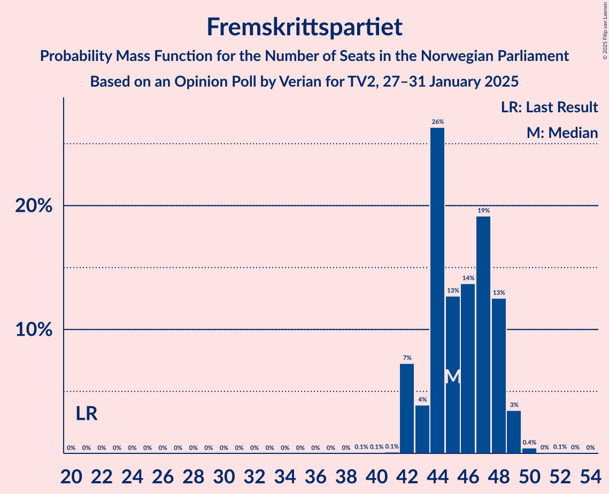
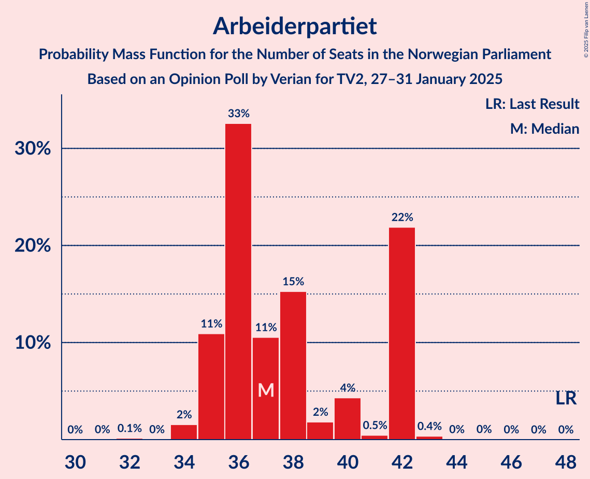
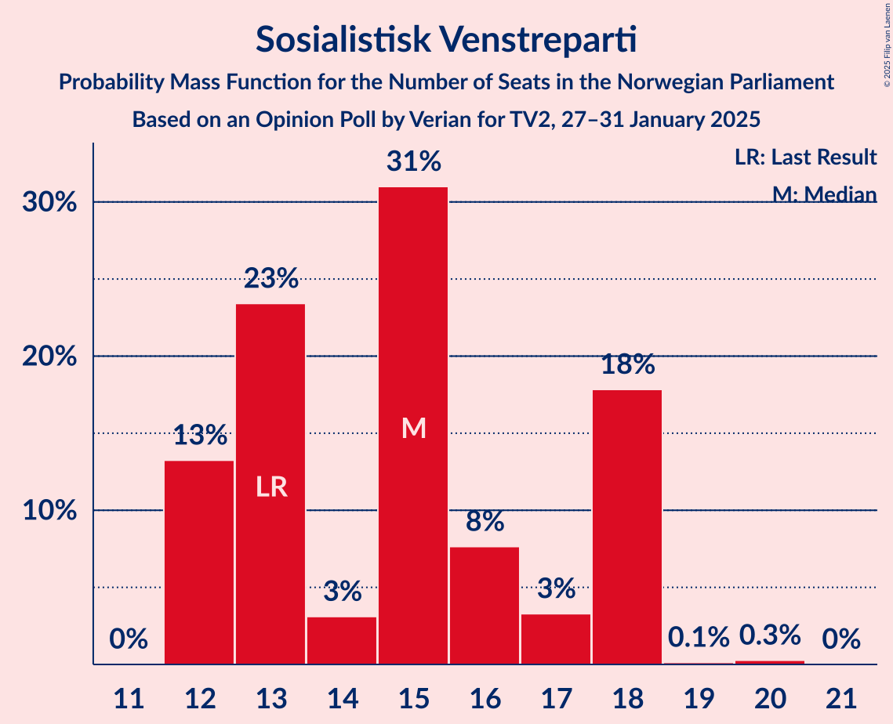
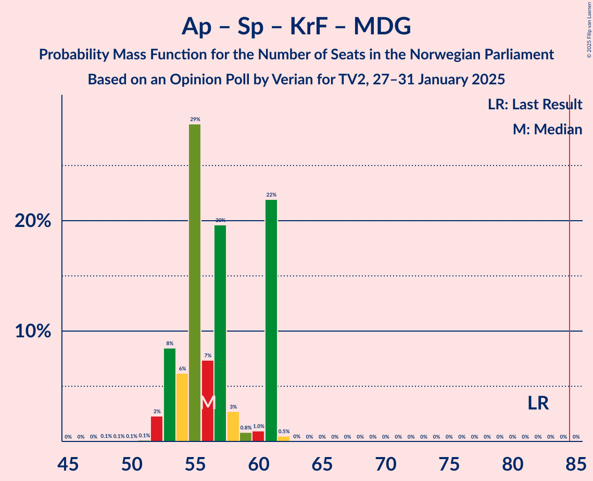
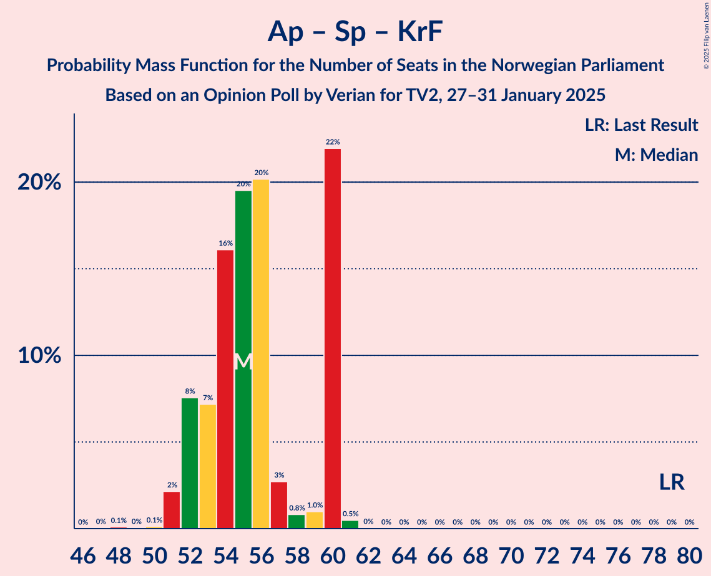
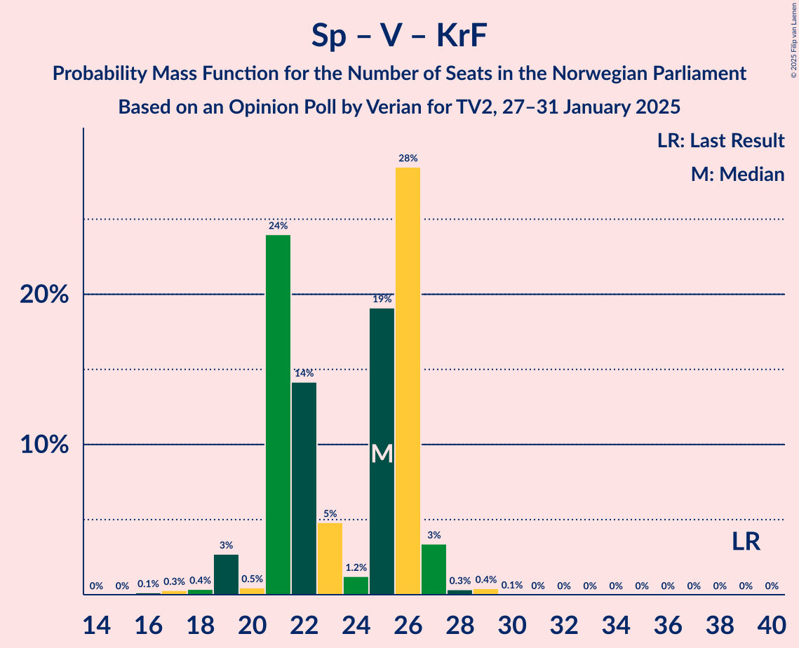

# Opinion Poll by Verian for TV2, 27–31 January 2025

<a href="#voting-intentions">Voting Intentions</a> | <a href="#seats">Seats</a> | <a href="#coalitions">Coalitions</a> | <a href="#technical-information">Technical Information</a>

## Voting Intentions

### Confidence Intervals

| Party | Last Result | Poll Result | 80% Confidence Interval | 90% Confidence Interval | 95% Confidence Interval | 99% Confidence Interval |
|:-----:|:-----------:|:-----------:|:-----------------------:|:-----------------------:|:-----------------------:|:-----------------------:|
| Fremskrittspartiet | 11.6% | 25.1% | 23.6–26.6% |23.2–27.1% |22.8–27.4% |22.2–28.2% |
| Arbeiderpartiet | 26.2% | 19.8% | 18.5–21.2% |18.1–21.6% |17.8–22.0% |17.1–22.7% |
| Høyre | 20.4% | 18.9% | 17.6–20.3% |17.2–20.7% |16.9–21.1% |16.3–21.8% |
| Senterpartiet | 13.5% | 8.6% | 7.7–9.7% |7.5–10.0% |7.3–10.2% |6.8–10.7% |
| Sosialistisk Venstreparti | 7.6% | 8.4% | 7.5–9.4% |7.3–9.7% |7.1–10.0% |6.6–10.5% |
| Rødt | 4.7% | 5.6% | 4.9–6.5% |4.6–6.7% |4.5–6.9% |4.2–7.4% |
| Venstre | 4.6% | 4.2% | 3.6–5.0% |3.4–5.2% |3.3–5.4% |3.0–5.8% |
| Kristelig Folkeparti | 3.8% | 2.5% | 2.1–3.2% |1.9–3.4% |1.8–3.5% |1.6–3.8% |
| Miljøpartiet De Grønne | 3.9% | 1.8% | 1.4–2.4% |1.3–2.5% |1.2–2.7% |1.1–3.0% |
| Industri- og Næringspartiet | 0.3% | 1.5% | 1.2–2.0% |1.1–2.2% |1.0–2.3% |0.9–2.6% |
| Norgesdemokratene | 1.1% | 0.8% | 0.6–1.2% |0.5–1.3% |0.4–1.4% |0.4–1.6% |
| Konservativt | 0.4% | 0.8% | 0.6–1.2% |0.5–1.3% |0.4–1.4% |0.4–1.6% |
| Pensjonistpartiet | 0.6% | 0.4% | 0.3–0.8% |0.2–0.9% |0.2–0.9% |0.1–1.1% |
| Kystpartiet | 0.0% | 0.1% | 0.0–0.3% |0.0–0.4% |0.0–0.4% |0.0–0.5% |

*Note:* The poll result column reflects the actual value used in the calculations. Published results may vary slightly, and in addition be rounded to fewer digits.

## Seats

### Confidence Intervals

| Party | Last Result | Median | 80% Confidence Interval | 90% Confidence Interval | 95% Confidence Interval | 99% Confidence Interval |
|:-----:|:-----------:|:------:|:-----------------------:|:-----------------------:|:-----------------------:|:-----------------------:|
| <a href="#fremskrittspartiet">Fremskrittspartiet</a> | 21 | 45 | 43–48 |42–48 |42–49 |42–50 |
| <a href="#arbeiderpartiet">Arbeiderpartiet</a> | 48 | 37 | 35–42 |35–42 |35–42 |34–42 |
| <a href="#høyre">Høyre</a> | 36 | 35 | 32–38 |32–38 |32–39 |29–39 |
| <a href="#senterpartiet">Senterpartiet</a> | 28 | 16 | 15–17 |15–17 |14–18 |13–19 |
| <a href="#sosialistisk-venstreparti">Sosialistisk Venstreparti</a> | 13 | 15 | 12–18 |12–18 |12–18 |12–18 |
| <a href="#rødt">Rødt</a> | 8 | 11 | 9–12 |9–12 |9–12 |8–13 |
| <a href="#venstre">Venstre</a> | 8 | 7 | 3–8 |3–9 |2–9 |2–10 |
| <a href="#kristelig-folkeparti">Kristelig Folkeparti</a> | 3 | 2 | 0–3 |0–3 |0–3 |0–3 |
| <a href="#miljøpartiet-de-grønne">Miljøpartiet De Grønne</a> | 3 | 1 | 0–1 |0–1 |0–1 |0–1 |
| <a href="#industri--og-næringspartiet">Industri- og Næringspartiet</a> | 0 | 0 | 0 |0 |0 |0–1 |
| <a href="#norgesdemokratene">Norgesdemokratene</a> | 0 | 0 | 0 |0 |0 |0 |
| <a href="#konservativt">Konservativt</a> | 0 | 0 | 0 |0 |0 |0 |
| <a href="#pensjonistpartiet">Pensjonistpartiet</a> | 0 | 0 | 0 |0 |0 |0 |
| <a href="#kystpartiet">Kystpartiet</a> | 0 | 0 | 0 |0 |0 |0 |

### Fremskrittspartiet

*For a full overview of the results for this party, see the [Fremskrittspartiet](party-fremskrittspartiet.html) page.*

| Number of Seats | Probability | Accumulated | Special Marks |
|:---------------:|:-----------:|:-----------:|:-------------:|
| 21 | 0% | 100% | Last Result |
| 22 | 0% | 100% |  |
| 23 | 0% | 100% |  |
| 24 | 0% | 100% |  |
| 25 | 0% | 100% |  |
| 26 | 0% | 100% |  |
| 27 | 0% | 100% |  |
| 28 | 0% | 100% |  |
| 29 | 0% | 100% |  |
| 30 | 0% | 100% |  |
| 31 | 0% | 100% |  |
| 32 | 0% | 100% |  |
| 33 | 0% | 100% |  |
| 34 | 0% | 100% |  |
| 35 | 0% | 100% |  |
| 36 | 0% | 100% |  |
| 37 | 0% | 100% |  |
| 38 | 0% | 100% |  |
| 39 | 0.1% | 100% |  |
| 40 | 0.1% | 99.9% |  |
| 41 | 0.1% | 99.8% |  |
| 42 | 7% | 99.7% |  |
| 43 | 4% | 92% |  |
| 44 | 26% | 89% |  |
| 45 | 13% | 62% | Median |
| 46 | 14% | 50% |  |
| 47 | 19% | 36% |  |
| 48 | 13% | 17% |  |
| 49 | 3% | 4% |  |
| 50 | 0.4% | 0.6% |  |
| 51 | 0% | 0.2% |  |
| 52 | 0.1% | 0.2% |  |
| 53 | 0% | 0.1% |  |
| 54 | 0% | 0% |  |

### Arbeiderpartiet

*For a full overview of the results for this party, see the [Arbeiderpartiet](party-arbeiderpartiet.html) page.*

| Number of Seats | Probability | Accumulated | Special Marks |
|:---------------:|:-----------:|:-----------:|:-------------:|
| 32 | 0.1% | 100% |  |
| 33 | 0% | 99.8% |  |
| 34 | 2% | 99.8% |  |
| 35 | 11% | 98% |  |
| 36 | 33% | 87% |  |
| 37 | 11% | 55% | Median |
| 38 | 15% | 44% |  |
| 39 | 2% | 29% |  |
| 40 | 4% | 27% |  |
| 41 | 0.5% | 23% |  |
| 42 | 22% | 22% |  |
| 43 | 0.4% | 0.4% |  |
| 44 | 0% | 0.1% |  |
| 45 | 0% | 0.1% |  |
| 46 | 0% | 0% |  |
| 47 | 0% | 0% |  |
| 48 | 0% | 0% | Last Result |

### Høyre

*For a full overview of the results for this party, see the [Høyre](party-høyre.html) page.*

| Number of Seats | Probability | Accumulated | Special Marks |
|:---------------:|:-----------:|:-----------:|:-------------:|
| 28 | 0.1% | 100% |  |
| 29 | 0.4% | 99.9% |  |
| 30 | 0.7% | 99.5% |  |
| 31 | 0.6% | 98.8% |  |
| 32 | 11% | 98% |  |
| 33 | 27% | 87% |  |
| 34 | 5% | 60% |  |
| 35 | 27% | 55% | Median |
| 36 | 4% | 28% | Last Result |
| 37 | 8% | 24% |  |
| 38 | 12% | 15% |  |
| 39 | 3% | 4% |  |
| 40 | 0% | 0.2% |  |
| 41 | 0.1% | 0.1% |  |
| 42 | 0% | 0% |  |

### Senterpartiet

*For a full overview of the results for this party, see the [Senterpartiet](party-senterpartiet.html) page.*

| Number of Seats | Probability | Accumulated | Special Marks |
|:---------------:|:-----------:|:-----------:|:-------------:|
| 12 | 0.4% | 100% |  |
| 13 | 0.3% | 99.6% |  |
| 14 | 4% | 99.3% |  |
| 15 | 12% | 96% |  |
| 16 | 49% | 83% | Median |
| 17 | 31% | 35% |  |
| 18 | 3% | 4% |  |
| 19 | 0.3% | 0.5% |  |
| 20 | 0% | 0.2% |  |
| 21 | 0.1% | 0.1% |  |
| 22 | 0.1% | 0.1% |  |
| 23 | 0% | 0% |  |
| 24 | 0% | 0% |  |
| 25 | 0% | 0% |  |
| 26 | 0% | 0% |  |
| 27 | 0% | 0% |  |
| 28 | 0% | 0% | Last Result |

### Sosialistisk Venstreparti

*For a full overview of the results for this party, see the [Sosialistisk Venstreparti](party-sosialistiskvenstreparti.html) page.*

| Number of Seats | Probability | Accumulated | Special Marks |
|:---------------:|:-----------:|:-----------:|:-------------:|
| 12 | 13% | 100% |  |
| 13 | 23% | 87% | Last Result |
| 14 | 3% | 63% |  |
| 15 | 31% | 60% | Median |
| 16 | 8% | 29% |  |
| 17 | 3% | 22% |  |
| 18 | 18% | 18% |  |
| 19 | 0.1% | 0.4% |  |
| 20 | 0.3% | 0.3% |  |
| 21 | 0% | 0% |  |

### Rødt

*For a full overview of the results for this party, see the [Rødt](party-rødt.html) page.*

| Number of Seats | Probability | Accumulated | Special Marks |
|:---------------:|:-----------:|:-----------:|:-------------:|
| 1 | 0.1% | 100% |  |
| 2 | 0% | 99.9% |  |
| 3 | 0% | 99.9% |  |
| 4 | 0% | 99.9% |  |
| 5 | 0% | 99.9% |  |
| 6 | 0% | 99.9% |  |
| 7 | 0.1% | 99.9% |  |
| 8 | 0.5% | 99.8% | Last Result |
| 9 | 27% | 99.3% |  |
| 10 | 14% | 72% |  |
| 11 | 21% | 59% | Median |
| 12 | 37% | 38% |  |
| 13 | 0.5% | 0.8% |  |
| 14 | 0.3% | 0.3% |  |
| 15 | 0% | 0% |  |

### Venstre

*For a full overview of the results for this party, see the [Venstre](party-venstre.html) page.*

| Number of Seats | Probability | Accumulated | Special Marks |
|:---------------:|:-----------:|:-----------:|:-------------:|
| 2 | 3% | 100% |  |
| 3 | 39% | 97% |  |
| 4 | 0% | 57% |  |
| 5 | 0% | 57% |  |
| 6 | 0% | 57% |  |
| 7 | 22% | 57% | Median |
| 8 | 30% | 36% | Last Result |
| 9 | 4% | 5% |  |
| 10 | 1.2% | 1.3% |  |
| 11 | 0.1% | 0.2% |  |
| 12 | 0% | 0% |  |

### Kristelig Folkeparti

*For a full overview of the results for this party, see the [Kristelig Folkeparti](party-kristeligfolkeparti.html) page.*

| Number of Seats | Probability | Accumulated | Special Marks |
|:---------------:|:-----------:|:-----------:|:-------------:|
| 0 | 11% | 100% |  |
| 1 | 21% | 89% |  |
| 2 | 47% | 68% | Median |
| 3 | 21% | 21% | Last Result |
| 4 | 0% | 0.1% |  |
| 5 | 0% | 0.1% |  |
| 6 | 0% | 0.1% |  |
| 7 | 0% | 0.1% |  |
| 8 | 0% | 0% |  |

### Miljøpartiet De Grønne

*For a full overview of the results for this party, see the [Miljøpartiet De Grønne](party-miljøpartietdegrønne.html) page.*

| Number of Seats | Probability | Accumulated | Special Marks |
|:---------------:|:-----------:|:-----------:|:-------------:|
| 0 | 15% | 100% |  |
| 1 | 84% | 85% | Median |
| 2 | 0.3% | 0.3% |  |
| 3 | 0.1% | 0.1% | Last Result |
| 4 | 0% | 0% |  |

### Industri- og Næringspartiet

*For a full overview of the results for this party, see the [Industri- og Næringspartiet](party-industri-ognæringspartiet.html) page.*

| Number of Seats | Probability | Accumulated | Special Marks |
|:---------------:|:-----------:|:-----------:|:-------------:|
| 0 | 99.0% | 100% | Last Result, Median |
| 1 | 0.9% | 1.0% |  |
| 2 | 0.1% | 0.1% |  |
| 3 | 0% | 0% |  |

### Norgesdemokratene

*For a full overview of the results for this party, see the [Norgesdemokratene](party-norgesdemokratene.html) page.*

| Number of Seats | Probability | Accumulated | Special Marks |
|:---------------:|:-----------:|:-----------:|:-------------:|
| 0 | 100% | 100% | Last Result, Median |

### Konservativt

*For a full overview of the results for this party, see the [Konservativt](party-konservativt.html) page.*

| Number of Seats | Probability | Accumulated | Special Marks |
|:---------------:|:-----------:|:-----------:|:-------------:|
| 0 | 100% | 100% | Last Result, Median |

### Pensjonistpartiet

*For a full overview of the results for this party, see the [Pensjonistpartiet](party-pensjonistpartiet.html) page.*

| Number of Seats | Probability | Accumulated | Special Marks |
|:---------------:|:-----------:|:-----------:|:-------------:|
| 0 | 100% | 100% | Last Result, Median |

### Kystpartiet

*For a full overview of the results for this party, see the [Kystpartiet](party-kystpartiet.html) page.*

| Number of Seats | Probability | Accumulated | Special Marks |
|:---------------:|:-----------:|:-----------:|:-------------:|
| 0 | 100% | 100% | Last Result, Median |

## Coalitions

### Confidence Intervals

| Coalition | Last Result | Median | Majority? | 80% Confidence Interval | 90% Confidence Interval | 95% Confidence Interval | 99% Confidence Interval |
|:---------:|:-----------:|:------:|:---------:|:-----------------------:|:-----------------------:|:-----------------------:|:-----------------------:|
| Fremskrittspartiet – Høyre – Senterpartiet – Venstre – Kristelig Folkeparti | 96 | 104 | 100% | 98–108 | 98–108 | 98–109 | 98–109 |
| Fremskrittspartiet – Høyre – Venstre – Kristelig Folkeparti – Miljøpartiet De Grønne | 71 | 89 | 77% | 83–92 | 83–93 | 83–94 | 83–95 |
| Fremskrittspartiet – Høyre – Venstre – Kristelig Folkeparti | 68 | 88 | 76% | 82–91 | 82–92 | 82–93 | 82–94 |
| Fremskrittspartiet – Høyre – Venstre | 65 | 87 | 67% | 80–90 | 80–91 | 80–92 | 80–93 |
| Fremskrittspartiet – Høyre | 57 | 81 | 12% | 77–86 | 77–86 | 77–86 | 76–86 |
| Arbeiderpartiet – Senterpartiet – Sosialistisk Venstreparti – Rødt – Miljøpartiet De Grønne | 100 | 80 | 23% | 77–86 | 76–86 | 75–86 | 74–87 |
| Arbeiderpartiet – Senterpartiet – Sosialistisk Venstreparti – Rødt | 97 | 79 | 22% | 76–85 | 75–85 | 74–85 | 73–86 |
| Arbeiderpartiet – Senterpartiet – Sosialistisk Venstreparti – Kristelig Folkeparti – Miljøpartiet De Grønne | 95 | 71 | 0% | 67–76 | 67–76 | 67–76 | 65–78 |
| Arbeiderpartiet – Senterpartiet – Sosialistisk Venstreparti – Miljøpartiet De Grønne | 92 | 70 | 0% | 65–74 | 65–74 | 65–74 | 63–76 |
| Arbeiderpartiet – Senterpartiet – Sosialistisk Venstreparti | 89 | 69 | 0% | 65–73 | 65–73 | 65–73 | 62–75 |
| Arbeiderpartiet – Sosialistisk Venstreparti – Rødt – Miljøpartiet De Grønne | 72 | 64 | 0% | 60–70 | 60–70 | 59–70 | 59–70 |
| Arbeiderpartiet – Senterpartiet – Kristelig Folkeparti – Miljøpartiet De Grønne | 82 | 56 | 0% | 53–61 | 53–61 | 52–61 | 52–62 |
| Arbeiderpartiet – Senterpartiet – Kristelig Folkeparti | 79 | 55 | 0% | 52–60 | 52–60 | 52–60 | 51–61 |
| Arbeiderpartiet – Senterpartiet | 76 | 53 | 0% | 51–58 | 51–58 | 51–58 | 48–59 |
| Arbeiderpartiet – Sosialistisk Venstreparti | 61 | 53 | 0% | 48–57 | 48–57 | 48–57 | 48–58 |
| Høyre – Venstre – Kristelig Folkeparti | 47 | 43 | 0% | 38–46 | 38–46 | 37–46 | 35–48 |
| Senterpartiet – Venstre – Kristelig Folkeparti | 39 | 25 | 0% | 21–26 | 21–26 | 19–27 | 18–28 |

### Fremskrittspartiet – Høyre – Senterpartiet – Venstre – Kristelig Folkeparti

| Number of Seats | Probability | Accumulated | Special Marks |
|:---------------:|:-----------:|:-----------:|:-------------:|
| 96 | 0% | 100% | Last Result |
| 97 | 0.1% | 100% |  |
| 98 | 22% | 99.9% |  |
| 99 | 0.3% | 78% |  |
| 100 | 2% | 78% |  |
| 101 | 4% | 76% |  |
| 102 | 8% | 72% |  |
| 103 | 5% | 64% |  |
| 104 | 14% | 59% |  |
| 105 | 6% | 46% | Median |
| 106 | 1.3% | 40% |  |
| 107 | 12% | 38% |  |
| 108 | 22% | 27% |  |
| 109 | 4% | 4% |  |
| 110 | 0.2% | 0.4% |  |
| 111 | 0.1% | 0.2% |  |
| 112 | 0% | 0.1% |  |
| 113 | 0% | 0.1% |  |
| 114 | 0% | 0% |  |

### Fremskrittspartiet – Høyre – Venstre – Kristelig Folkeparti – Miljøpartiet De Grønne

| Number of Seats | Probability | Accumulated | Special Marks |
|:---------------:|:-----------:|:-----------:|:-------------:|
| 71 | 0% | 100% | Last Result |
| 72 | 0% | 100% |  |
| 73 | 0% | 100% |  |
| 74 | 0% | 100% |  |
| 75 | 0% | 100% |  |
| 76 | 0% | 100% |  |
| 77 | 0% | 100% |  |
| 78 | 0% | 100% |  |
| 79 | 0% | 100% |  |
| 80 | 0% | 100% |  |
| 81 | 0.1% | 100% |  |
| 82 | 0.1% | 99.9% |  |
| 83 | 22% | 99.8% |  |
| 84 | 0.6% | 78% |  |
| 85 | 0.8% | 77% | Majority |
| 86 | 5% | 76% |  |
| 87 | 3% | 71% |  |
| 88 | 14% | 69% |  |
| 89 | 10% | 55% |  |
| 90 | 2% | 45% | Median |
| 91 | 15% | 42% |  |
| 92 | 21% | 27% |  |
| 93 | 3% | 6% |  |
| 94 | 1.2% | 3% |  |
| 95 | 1.2% | 1.5% |  |
| 96 | 0.1% | 0.2% |  |
| 97 | 0.1% | 0.1% |  |
| 98 | 0% | 0.1% |  |
| 99 | 0% | 0% |  |

### Fremskrittspartiet – Høyre – Venstre – Kristelig Folkeparti

| Number of Seats | Probability | Accumulated | Special Marks |
|:---------------:|:-----------:|:-----------:|:-------------:|
| 68 | 0% | 100% | Last Result |
| 69 | 0% | 100% |  |
| 70 | 0% | 100% |  |
| 71 | 0% | 100% |  |
| 72 | 0% | 100% |  |
| 73 | 0% | 100% |  |
| 74 | 0% | 100% |  |
| 75 | 0% | 100% |  |
| 76 | 0% | 100% |  |
| 77 | 0% | 100% |  |
| 78 | 0% | 100% |  |
| 79 | 0% | 100% |  |
| 80 | 0.1% | 100% |  |
| 81 | 0.1% | 99.9% |  |
| 82 | 22% | 99.8% |  |
| 83 | 0.7% | 78% |  |
| 84 | 0.8% | 77% |  |
| 85 | 5% | 76% | Majority |
| 86 | 2% | 71% |  |
| 87 | 13% | 69% |  |
| 88 | 9% | 56% |  |
| 89 | 4% | 47% | Median |
| 90 | 4% | 43% |  |
| 91 | 33% | 38% |  |
| 92 | 3% | 6% |  |
| 93 | 1.2% | 3% |  |
| 94 | 1.2% | 1.5% |  |
| 95 | 0.1% | 0.2% |  |
| 96 | 0% | 0.1% |  |
| 97 | 0.1% | 0.1% |  |
| 98 | 0.1% | 0.1% |  |
| 99 | 0% | 0% |  |

### Fremskrittspartiet – Høyre – Venstre

| Number of Seats | Probability | Accumulated | Special Marks |
|:---------------:|:-----------:|:-----------:|:-------------:|
| 65 | 0% | 100% | Last Result |
| 66 | 0% | 100% |  |
| 67 | 0% | 100% |  |
| 68 | 0% | 100% |  |
| 69 | 0% | 100% |  |
| 70 | 0% | 100% |  |
| 71 | 0% | 100% |  |
| 72 | 0% | 100% |  |
| 73 | 0% | 100% |  |
| 74 | 0% | 100% |  |
| 75 | 0% | 100% |  |
| 76 | 0% | 100% |  |
| 77 | 0% | 100% |  |
| 78 | 0.1% | 100% |  |
| 79 | 0.1% | 99.9% |  |
| 80 | 22% | 99.8% |  |
| 81 | 0.6% | 78% |  |
| 82 | 0.8% | 77% |  |
| 83 | 0.6% | 77% |  |
| 84 | 9% | 76% |  |
| 85 | 10% | 67% | Majority |
| 86 | 2% | 56% |  |
| 87 | 10% | 54% | Median |
| 88 | 15% | 44% |  |
| 89 | 9% | 28% |  |
| 90 | 14% | 19% |  |
| 91 | 1.4% | 6% |  |
| 92 | 3% | 4% |  |
| 93 | 0.9% | 1.1% |  |
| 94 | 0% | 0.2% |  |
| 95 | 0.1% | 0.2% |  |
| 96 | 0.1% | 0.1% |  |
| 97 | 0% | 0% |  |

### Fremskrittspartiet – Høyre

| Number of Seats | Probability | Accumulated | Special Marks |
|:---------------:|:-----------:|:-----------:|:-------------:|
| 57 | 0% | 100% | Last Result |
| 58 | 0% | 100% |  |
| 59 | 0% | 100% |  |
| 60 | 0% | 100% |  |
| 61 | 0% | 100% |  |
| 62 | 0% | 100% |  |
| 63 | 0% | 100% |  |
| 64 | 0% | 100% |  |
| 65 | 0% | 100% |  |
| 66 | 0% | 100% |  |
| 67 | 0% | 100% |  |
| 68 | 0% | 100% |  |
| 69 | 0% | 100% |  |
| 70 | 0% | 100% |  |
| 71 | 0% | 100% |  |
| 72 | 0% | 100% |  |
| 73 | 0% | 99.9% |  |
| 74 | 0.2% | 99.9% |  |
| 75 | 0.2% | 99.7% |  |
| 76 | 0.6% | 99.5% |  |
| 77 | 31% | 98.9% |  |
| 78 | 8% | 67% |  |
| 79 | 9% | 60% |  |
| 80 | 0.8% | 51% | Median |
| 81 | 15% | 50% |  |
| 82 | 17% | 35% |  |
| 83 | 2% | 18% |  |
| 84 | 3% | 16% |  |
| 85 | 1.2% | 12% | Majority |
| 86 | 11% | 11% |  |
| 87 | 0.1% | 0.2% |  |
| 88 | 0% | 0.1% |  |
| 89 | 0% | 0% |  |

### Arbeiderpartiet – Senterpartiet – Sosialistisk Venstreparti – Rødt – Miljøpartiet De Grønne

| Number of Seats | Probability | Accumulated | Special Marks |
|:---------------:|:-----------:|:-----------:|:-------------:|
| 70 | 0.1% | 100% |  |
| 71 | 0.1% | 99.9% |  |
| 72 | 0% | 99.9% |  |
| 73 | 0.1% | 99.9% |  |
| 74 | 1.2% | 99.8% |  |
| 75 | 1.2% | 98.5% |  |
| 76 | 3% | 97% |  |
| 77 | 33% | 94% |  |
| 78 | 3% | 61% |  |
| 79 | 4% | 57% |  |
| 80 | 9% | 53% | Median |
| 81 | 13% | 45% |  |
| 82 | 2% | 32% |  |
| 83 | 5% | 29% |  |
| 84 | 0.7% | 24% |  |
| 85 | 0.8% | 23% | Majority |
| 86 | 22% | 22% |  |
| 87 | 0.4% | 0.5% |  |
| 88 | 0.1% | 0.1% |  |
| 89 | 0% | 0% |  |
| 90 | 0% | 0% |  |
| 91 | 0% | 0% |  |
| 92 | 0% | 0% |  |
| 93 | 0% | 0% |  |
| 94 | 0% | 0% |  |
| 95 | 0% | 0% |  |
| 96 | 0% | 0% |  |
| 97 | 0% | 0% |  |
| 98 | 0% | 0% |  |
| 99 | 0% | 0% |  |
| 100 | 0% | 0% | Last Result |

### Arbeiderpartiet – Senterpartiet – Sosialistisk Venstreparti – Rødt

| Number of Seats | Probability | Accumulated | Special Marks |
|:---------------:|:-----------:|:-----------:|:-------------:|
| 70 | 0% | 100% |  |
| 71 | 0.1% | 99.9% |  |
| 72 | 0.1% | 99.9% |  |
| 73 | 1.2% | 99.8% |  |
| 74 | 1.2% | 98.5% |  |
| 75 | 3% | 97% |  |
| 76 | 22% | 94% |  |
| 77 | 15% | 72% |  |
| 78 | 2% | 58% |  |
| 79 | 10% | 55% | Median |
| 80 | 13% | 45% |  |
| 81 | 2% | 32% |  |
| 82 | 6% | 29% |  |
| 83 | 0.7% | 24% |  |
| 84 | 0.8% | 23% |  |
| 85 | 22% | 22% | Majority |
| 86 | 0.4% | 0.6% |  |
| 87 | 0.1% | 0.1% |  |
| 88 | 0% | 0% |  |
| 89 | 0% | 0% |  |
| 90 | 0% | 0% |  |
| 91 | 0% | 0% |  |
| 92 | 0% | 0% |  |
| 93 | 0% | 0% |  |
| 94 | 0% | 0% |  |
| 95 | 0% | 0% |  |
| 96 | 0% | 0% |  |
| 97 | 0% | 0% | Last Result |

### Arbeiderpartiet – Senterpartiet – Sosialistisk Venstreparti – Kristelig Folkeparti – Miljøpartiet De Grønne

| Number of Seats | Probability | Accumulated | Special Marks |
|:---------------:|:-----------:|:-----------:|:-------------:|
| 63 | 0.1% | 100% |  |
| 64 | 0% | 99.9% |  |
| 65 | 0.9% | 99.9% |  |
| 66 | 1.3% | 99.0% |  |
| 67 | 16% | 98% |  |
| 68 | 12% | 82% |  |
| 69 | 0.8% | 70% |  |
| 70 | 12% | 69% |  |
| 71 | 14% | 57% | Median |
| 72 | 3% | 43% |  |
| 73 | 6% | 40% |  |
| 74 | 4% | 34% |  |
| 75 | 8% | 31% |  |
| 76 | 22% | 23% |  |
| 77 | 0.2% | 0.8% |  |
| 78 | 0.6% | 0.7% |  |
| 79 | 0% | 0.1% |  |
| 80 | 0% | 0% |  |
| 81 | 0% | 0% |  |
| 82 | 0% | 0% |  |
| 83 | 0% | 0% |  |
| 84 | 0% | 0% |  |
| 85 | 0% | 0% | Majority |
| 86 | 0% | 0% |  |
| 87 | 0% | 0% |  |
| 88 | 0% | 0% |  |
| 89 | 0% | 0% |  |
| 90 | 0% | 0% |  |
| 91 | 0% | 0% |  |
| 92 | 0% | 0% |  |
| 93 | 0% | 0% |  |
| 94 | 0% | 0% |  |
| 95 | 0% | 0% | Last Result |

### Arbeiderpartiet – Senterpartiet – Sosialistisk Venstreparti – Miljøpartiet De Grønne

| Number of Seats | Probability | Accumulated | Special Marks |
|:---------------:|:-----------:|:-----------:|:-------------:|
| 61 | 0% | 100% |  |
| 62 | 0% | 99.9% |  |
| 63 | 1.2% | 99.9% |  |
| 64 | 0.2% | 98.8% |  |
| 65 | 12% | 98.6% |  |
| 66 | 14% | 86% |  |
| 67 | 3% | 73% |  |
| 68 | 12% | 69% |  |
| 69 | 7% | 57% | Median |
| 70 | 10% | 51% |  |
| 71 | 2% | 41% |  |
| 72 | 11% | 39% |  |
| 73 | 5% | 28% |  |
| 74 | 22% | 23% |  |
| 75 | 0.3% | 1.2% |  |
| 76 | 0.4% | 0.9% |  |
| 77 | 0.1% | 0.5% |  |
| 78 | 0.4% | 0.4% |  |
| 79 | 0% | 0% |  |
| 80 | 0% | 0% |  |
| 81 | 0% | 0% |  |
| 82 | 0% | 0% |  |
| 83 | 0% | 0% |  |
| 84 | 0% | 0% |  |
| 85 | 0% | 0% | Majority |
| 86 | 0% | 0% |  |
| 87 | 0% | 0% |  |
| 88 | 0% | 0% |  |
| 89 | 0% | 0% |  |
| 90 | 0% | 0% |  |
| 91 | 0% | 0% |  |
| 92 | 0% | 0% | Last Result |

### Arbeiderpartiet – Senterpartiet – Sosialistisk Venstreparti

| Number of Seats | Probability | Accumulated | Special Marks |
|:---------------:|:-----------:|:-----------:|:-------------:|
| 61 | 0% | 100% |  |
| 62 | 1.2% | 99.9% |  |
| 63 | 0.2% | 98.8% |  |
| 64 | 1.0% | 98.6% |  |
| 65 | 25% | 98% |  |
| 66 | 3% | 73% |  |
| 67 | 10% | 69% |  |
| 68 | 8% | 59% | Median |
| 69 | 9% | 51% |  |
| 70 | 3% | 43% |  |
| 71 | 11% | 39% |  |
| 72 | 5% | 28% |  |
| 73 | 22% | 23% |  |
| 74 | 0.3% | 1.3% |  |
| 75 | 0.4% | 0.9% |  |
| 76 | 0.1% | 0.5% |  |
| 77 | 0.4% | 0.4% |  |
| 78 | 0% | 0% |  |
| 79 | 0% | 0% |  |
| 80 | 0% | 0% |  |
| 81 | 0% | 0% |  |
| 82 | 0% | 0% |  |
| 83 | 0% | 0% |  |
| 84 | 0% | 0% |  |
| 85 | 0% | 0% | Majority |
| 86 | 0% | 0% |  |
| 87 | 0% | 0% |  |
| 88 | 0% | 0% |  |
| 89 | 0% | 0% | Last Result |

### Arbeiderpartiet – Sosialistisk Venstreparti – Rødt – Miljøpartiet De Grønne

| Number of Seats | Probability | Accumulated | Special Marks |
|:---------------:|:-----------:|:-----------:|:-------------:|
| 55 | 0% | 100% |  |
| 56 | 0.1% | 99.9% |  |
| 57 | 0.1% | 99.9% |  |
| 58 | 0% | 99.8% |  |
| 59 | 4% | 99.8% |  |
| 60 | 22% | 96% |  |
| 61 | 12% | 74% |  |
| 62 | 1.2% | 62% |  |
| 63 | 6% | 61% |  |
| 64 | 13% | 54% | Median |
| 65 | 6% | 41% |  |
| 66 | 8% | 36% |  |
| 67 | 4% | 28% |  |
| 68 | 1.4% | 24% |  |
| 69 | 0.7% | 23% |  |
| 70 | 22% | 22% |  |
| 71 | 0.1% | 0.1% |  |
| 72 | 0% | 0% | Last Result |

### Arbeiderpartiet – Senterpartiet – Kristelig Folkeparti – Miljøpartiet De Grønne

| Number of Seats | Probability | Accumulated | Special Marks |
|:---------------:|:-----------:|:-----------:|:-------------:|
| 48 | 0.1% | 100% |  |
| 49 | 0.1% | 99.9% |  |
| 50 | 0.1% | 99.9% |  |
| 51 | 0.1% | 99.8% |  |
| 52 | 2% | 99.7% |  |
| 53 | 8% | 97% |  |
| 54 | 6% | 89% |  |
| 55 | 29% | 83% |  |
| 56 | 7% | 54% | Median |
| 57 | 20% | 47% |  |
| 58 | 3% | 27% |  |
| 59 | 0.8% | 24% |  |
| 60 | 1.0% | 23% |  |
| 61 | 22% | 22% |  |
| 62 | 0.5% | 0.5% |  |
| 63 | 0% | 0% |  |
| 64 | 0% | 0% |  |
| 65 | 0% | 0% |  |
| 66 | 0% | 0% |  |
| 67 | 0% | 0% |  |
| 68 | 0% | 0% |  |
| 69 | 0% | 0% |  |
| 70 | 0% | 0% |  |
| 71 | 0% | 0% |  |
| 72 | 0% | 0% |  |
| 73 | 0% | 0% |  |
| 74 | 0% | 0% |  |
| 75 | 0% | 0% |  |
| 76 | 0% | 0% |  |
| 77 | 0% | 0% |  |
| 78 | 0% | 0% |  |
| 79 | 0% | 0% |  |
| 80 | 0% | 0% |  |
| 81 | 0% | 0% |  |
| 82 | 0% | 0% | Last Result |

### Arbeiderpartiet – Senterpartiet – Kristelig Folkeparti

| Number of Seats | Probability | Accumulated | Special Marks |
|:---------------:|:-----------:|:-----------:|:-------------:|
| 48 | 0.1% | 100% |  |
| 49 | 0% | 99.9% |  |
| 50 | 0.1% | 99.8% |  |
| 51 | 2% | 99.7% |  |
| 52 | 8% | 98% |  |
| 53 | 7% | 90% |  |
| 54 | 16% | 83% |  |
| 55 | 20% | 67% | Median |
| 56 | 20% | 47% |  |
| 57 | 3% | 27% |  |
| 58 | 0.8% | 24% |  |
| 59 | 1.0% | 23% |  |
| 60 | 22% | 22% |  |
| 61 | 0.5% | 0.5% |  |
| 62 | 0% | 0% |  |
| 63 | 0% | 0% |  |
| 64 | 0% | 0% |  |
| 65 | 0% | 0% |  |
| 66 | 0% | 0% |  |
| 67 | 0% | 0% |  |
| 68 | 0% | 0% |  |
| 69 | 0% | 0% |  |
| 70 | 0% | 0% |  |
| 71 | 0% | 0% |  |
| 72 | 0% | 0% |  |
| 73 | 0% | 0% |  |
| 74 | 0% | 0% |  |
| 75 | 0% | 0% |  |
| 76 | 0% | 0% |  |
| 77 | 0% | 0% |  |
| 78 | 0% | 0% |  |
| 79 | 0% | 0% | Last Result |

### Arbeiderpartiet – Senterpartiet

| Number of Seats | Probability | Accumulated | Special Marks |
|:---------------:|:-----------:|:-----------:|:-------------:|
| 46 | 0.1% | 100% |  |
| 47 | 0% | 99.9% |  |
| 48 | 1.2% | 99.9% |  |
| 49 | 0.1% | 98.6% |  |
| 50 | 0.4% | 98.5% |  |
| 51 | 11% | 98% |  |
| 52 | 16% | 87% |  |
| 53 | 31% | 72% | Median |
| 54 | 9% | 41% |  |
| 55 | 3% | 32% |  |
| 56 | 5% | 29% |  |
| 57 | 0.7% | 24% |  |
| 58 | 22% | 23% |  |
| 59 | 0.4% | 0.7% |  |
| 60 | 0% | 0.4% |  |
| 61 | 0.4% | 0.4% |  |
| 62 | 0% | 0% |  |
| 63 | 0% | 0% |  |
| 64 | 0% | 0% |  |
| 65 | 0% | 0% |  |
| 66 | 0% | 0% |  |
| 67 | 0% | 0% |  |
| 68 | 0% | 0% |  |
| 69 | 0% | 0% |  |
| 70 | 0% | 0% |  |
| 71 | 0% | 0% |  |
| 72 | 0% | 0% |  |
| 73 | 0% | 0% |  |
| 74 | 0% | 0% |  |
| 75 | 0% | 0% |  |
| 76 | 0% | 0% | Last Result |

### Arbeiderpartiet – Sosialistisk Venstreparti

| Number of Seats | Probability | Accumulated | Special Marks |
|:---------------:|:-----------:|:-----------:|:-------------:|
| 46 | 0% | 100% |  |
| 47 | 0.1% | 99.9% |  |
| 48 | 15% | 99.8% |  |
| 49 | 14% | 85% |  |
| 50 | 9% | 70% |  |
| 51 | 3% | 62% |  |
| 52 | 4% | 59% | Median |
| 53 | 15% | 55% |  |
| 54 | 5% | 40% |  |
| 55 | 1.1% | 36% |  |
| 56 | 12% | 35% |  |
| 57 | 22% | 23% |  |
| 58 | 0.3% | 0.7% |  |
| 59 | 0.4% | 0.4% |  |
| 60 | 0% | 0% |  |
| 61 | 0% | 0% | Last Result |

### Høyre – Venstre – Kristelig Folkeparti

| Number of Seats | Probability | Accumulated | Special Marks |
|:---------------:|:-----------:|:-----------:|:-------------:|
| 34 | 0.4% | 100% |  |
| 35 | 0.1% | 99.6% |  |
| 36 | 0.3% | 99.5% |  |
| 37 | 2% | 99.2% |  |
| 38 | 23% | 97% |  |
| 39 | 1.4% | 75% |  |
| 40 | 5% | 73% |  |
| 41 | 2% | 69% |  |
| 42 | 9% | 67% |  |
| 43 | 14% | 58% |  |
| 44 | 21% | 44% | Median |
| 45 | 12% | 23% |  |
| 46 | 10% | 10% |  |
| 47 | 0.2% | 0.7% | Last Result |
| 48 | 0.3% | 0.5% |  |
| 49 | 0.2% | 0.2% |  |
| 50 | 0% | 0.1% |  |
| 51 | 0% | 0% |  |

### Senterpartiet – Venstre – Kristelig Folkeparti

| Number of Seats | Probability | Accumulated | Special Marks |
|:---------------:|:-----------:|:-----------:|:-------------:|
| 16 | 0.1% | 100% |  |
| 17 | 0.3% | 99.9% |  |
| 18 | 0.4% | 99.6% |  |
| 19 | 3% | 99.2% |  |
| 20 | 0.5% | 96% |  |
| 21 | 24% | 96% |  |
| 22 | 14% | 72% |  |
| 23 | 5% | 58% |  |
| 24 | 1.2% | 53% |  |
| 25 | 19% | 52% | Median |
| 26 | 28% | 33% |  |
| 27 | 3% | 4% |  |
| 28 | 0.3% | 0.8% |  |
| 29 | 0.4% | 0.5% |  |
| 30 | 0.1% | 0.1% |  |
| 31 | 0% | 0% |  |
| 32 | 0% | 0% |  |
| 33 | 0% | 0% |  |
| 34 | 0% | 0% |  |
| 35 | 0% | 0% |  |
| 36 | 0% | 0% |  |
| 37 | 0% | 0% |  |
| 38 | 0% | 0% |  |
| 39 | 0% | 0% | Last Result |

## Technical Information

### Opinion Poll

+ **Polling firm:** Verian
+ **Commissioner(s):** TV2
+ **Fieldwork period:** 27–31 January 2025

### Calculations

+ **Sample size:** 1380
+ **Simulations done:** 2,097,152
+ **Error estimate:** 2.80%

