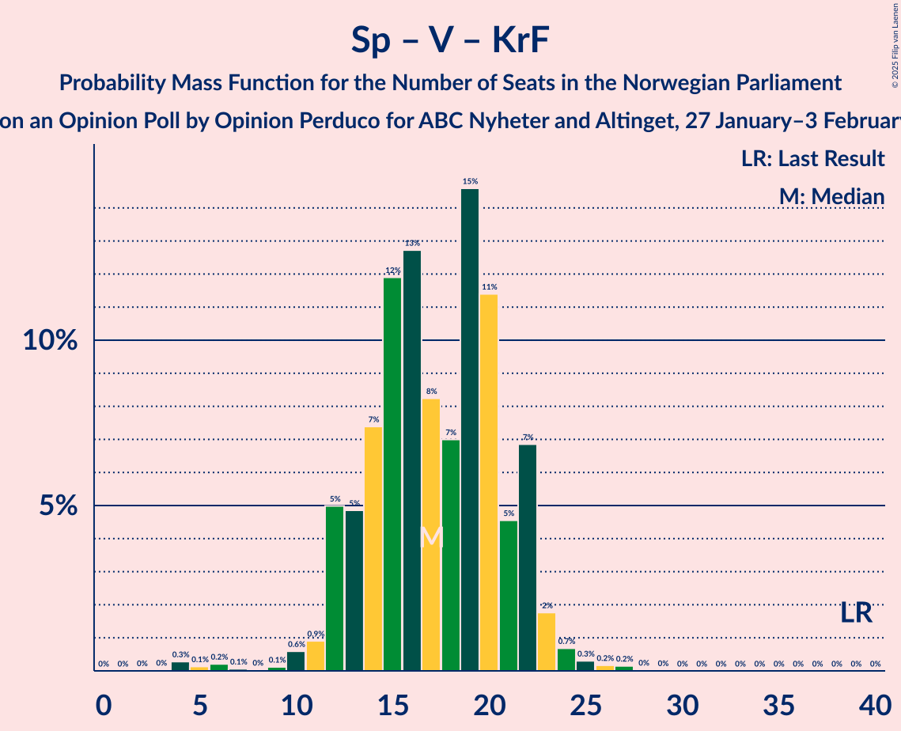

# Opinion Poll by Opinion Perduco for ABC Nyheter and Altinget, 27 January–3 February 2025

<a href="#voting-intentions">Voting Intentions</a> | <a href="#seats">Seats</a> | <a href="#coalitions">Coalitions</a> | <a href="#technical-information">Technical Information</a>

## Voting Intentions

### Confidence Intervals

| Party | Last Result | Poll Result | 80% Confidence Interval | 90% Confidence Interval | 95% Confidence Interval | 99% Confidence Interval |
|:-----:|:-----------:|:-----------:|:-----------------------:|:-----------------------:|:-----------------------:|:-----------------------:|
| Fremskrittspartiet | 11.6% | 25.0% | 23.3–26.8% |22.8–27.3% |22.4–27.7% |21.6–28.6% |
| Arbeiderpartiet | 26.2% | 22.0% | 20.3–23.7% |19.9–24.2% |19.5–24.6% |18.7–25.5% |
| Høyre | 20.4% | 18.2% | 16.7–19.8% |16.2–20.3% |15.9–20.7% |15.2–21.5% |
| Sosialistisk Venstreparti | 7.6% | 8.1% | 7.1–9.3% |6.8–9.6% |6.6–9.9% |6.1–10.5% |
| Rødt | 4.7% | 6.1% | 5.2–7.2% |5.0–7.5% |4.8–7.8% |4.4–8.3% |
| Senterpartiet | 13.5% | 5.2% | 4.4–6.2% |4.2–6.5% |4.0–6.8% |3.6–7.3% |
| Venstre | 4.6% | 4.2% | 3.5–5.1% |3.3–5.4% |3.1–5.6% |2.8–6.1% |
| Miljøpartiet De Grønne | 3.9% | 3.8% | 3.1–4.7% |2.9–4.9% |2.8–5.2% |2.5–5.6% |
| Kristelig Folkeparti | 3.8% | 3.0% | 2.4–3.8% |2.2–4.0% |2.1–4.3% |1.8–4.7% |
| Industri- og Næringspartiet | 0.3% | 1.5% | 1.1–2.1% |1.0–2.3% |0.9–2.5% |0.7–2.8% |

*Note:* The poll result column reflects the actual value used in the calculations. Published results may vary slightly, and in addition be rounded to fewer digits.

## Seats

### Confidence Intervals

| Party | Last Result | Median | 80% Confidence Interval | 90% Confidence Interval | 95% Confidence Interval | 99% Confidence Interval |
|:-----:|:-----------:|:------:|:-----------------------:|:-----------------------:|:-----------------------:|:-----------------------:|
| <a href="#fremskrittspartiet">Fremskrittspartiet</a> | 21 | 47 | 43–50 |42–51 |41–51 |40–53 |
| <a href="#arbeiderpartiet">Arbeiderpartiet</a> | 48 | 41 | 38–46 |37–47 |37–48 |36–50 |
| <a href="#høyre">Høyre</a> | 36 | 33 | 30–35 |29–37 |27–37 |26–40 |
| <a href="#sosialistisk-venstreparti">Sosialistisk Venstreparti</a> | 13 | 14 | 11–17 |11–17 |10–18 |9–19 |
| <a href="#rødt">Rødt</a> | 8 | 10 | 9–13 |8–14 |8–14 |7–15 |
| <a href="#senterpartiet">Senterpartiet</a> | 28 | 9 | 7–11 |7–12 |1–12 |0–14 |
| <a href="#venstre">Venstre</a> | 8 | 7 | 2–9 |2–9 |2–9 |2–11 |
| <a href="#miljøpartiet-de-grønne">Miljøpartiet De Grønne</a> | 3 | 3 | 2–8 |2–9 |1–9 |1–10 |
| <a href="#kristelig-folkeparti">Kristelig Folkeparti</a> | 3 | 2 | 1–3 |1–6 |0–7 |0–8 |
| <a href="#industri--og-næringspartiet">Industri- og Næringspartiet</a> | 0 | 0 | 0 |0 |0–1 |0–2 |

### Fremskrittspartiet

*For a full overview of the results for this party, see the [Fremskrittspartiet](party-fremskrittspartiet.html) page.*

| Number of Seats | Probability | Accumulated | Special Marks |
|:---------------:|:-----------:|:-----------:|:-------------:|
| 21 | 0% | 100% | Last Result |
| 22 | 0% | 100% |  |
| 23 | 0% | 100% |  |
| 24 | 0% | 100% |  |
| 25 | 0% | 100% |  |
| 26 | 0% | 100% |  |
| 27 | 0% | 100% |  |
| 28 | 0% | 100% |  |
| 29 | 0% | 100% |  |
| 30 | 0% | 100% |  |
| 31 | 0% | 100% |  |
| 32 | 0% | 100% |  |
| 33 | 0% | 100% |  |
| 34 | 0% | 100% |  |
| 35 | 0% | 100% |  |
| 36 | 0% | 100% |  |
| 37 | 0% | 100% |  |
| 38 | 0% | 100% |  |
| 39 | 0.1% | 100% |  |
| 40 | 0.7% | 99.8% |  |
| 41 | 3% | 99.1% |  |
| 42 | 5% | 96% |  |
| 43 | 9% | 90% |  |
| 44 | 7% | 81% |  |
| 45 | 7% | 74% |  |
| 46 | 9% | 67% |  |
| 47 | 26% | 59% | Median |
| 48 | 5% | 33% |  |
| 49 | 16% | 28% |  |
| 50 | 6% | 12% |  |
| 51 | 4% | 5% |  |
| 52 | 1.0% | 2% |  |
| 53 | 0.4% | 0.6% |  |
| 54 | 0.1% | 0.3% |  |
| 55 | 0.1% | 0.2% |  |
| 56 | 0% | 0% |  |

### Arbeiderpartiet

*For a full overview of the results for this party, see the [Arbeiderpartiet](party-arbeiderpartiet.html) page.*

| Number of Seats | Probability | Accumulated | Special Marks |
|:---------------:|:-----------:|:-----------:|:-------------:|
| 34 | 0% | 100% |  |
| 35 | 0.1% | 99.9% |  |
| 36 | 1.3% | 99.8% |  |
| 37 | 7% | 98.5% |  |
| 38 | 9% | 91% |  |
| 39 | 6% | 82% |  |
| 40 | 13% | 76% |  |
| 41 | 13% | 63% | Median |
| 42 | 11% | 50% |  |
| 43 | 12% | 39% |  |
| 44 | 6% | 26% |  |
| 45 | 8% | 20% |  |
| 46 | 6% | 12% |  |
| 47 | 2% | 6% |  |
| 48 | 2% | 4% | Last Result |
| 49 | 1.0% | 2% |  |
| 50 | 0.3% | 0.6% |  |
| 51 | 0.3% | 0.3% |  |
| 52 | 0% | 0.1% |  |
| 53 | 0% | 0% |  |

### Høyre

*For a full overview of the results for this party, see the [Høyre](party-høyre.html) page.*

| Number of Seats | Probability | Accumulated | Special Marks |
|:---------------:|:-----------:|:-----------:|:-------------:|
| 24 | 0.1% | 100% |  |
| 25 | 0.1% | 99.9% |  |
| 26 | 0.6% | 99.8% |  |
| 27 | 2% | 99.3% |  |
| 28 | 0.8% | 97% |  |
| 29 | 3% | 97% |  |
| 30 | 12% | 94% |  |
| 31 | 13% | 82% |  |
| 32 | 9% | 68% |  |
| 33 | 24% | 59% | Median |
| 34 | 21% | 35% |  |
| 35 | 4% | 13% |  |
| 36 | 4% | 9% | Last Result |
| 37 | 3% | 5% |  |
| 38 | 1.3% | 2% |  |
| 39 | 0.5% | 1.0% |  |
| 40 | 0.3% | 0.5% |  |
| 41 | 0.2% | 0.2% |  |
| 42 | 0% | 0% |  |

### Sosialistisk Venstreparti

*For a full overview of the results for this party, see the [Sosialistisk Venstreparti](party-sosialistiskvenstreparti.html) page.*

| Number of Seats | Probability | Accumulated | Special Marks |
|:---------------:|:-----------:|:-----------:|:-------------:|
| 9 | 0.8% | 100% |  |
| 10 | 2% | 99.2% |  |
| 11 | 9% | 97% |  |
| 12 | 8% | 88% |  |
| 13 | 12% | 80% | Last Result |
| 14 | 21% | 68% | Median |
| 15 | 24% | 47% |  |
| 16 | 12% | 23% |  |
| 17 | 7% | 11% |  |
| 18 | 2% | 3% |  |
| 19 | 1.0% | 1.4% |  |
| 20 | 0.3% | 0.4% |  |
| 21 | 0.1% | 0.1% |  |
| 22 | 0% | 0% |  |

### Rødt

*For a full overview of the results for this party, see the [Rødt](party-rødt.html) page.*

| Number of Seats | Probability | Accumulated | Special Marks |
|:---------------:|:-----------:|:-----------:|:-------------:|
| 1 | 0.1% | 100% |  |
| 2 | 0% | 99.9% |  |
| 3 | 0% | 99.9% |  |
| 4 | 0% | 99.9% |  |
| 5 | 0% | 99.9% |  |
| 6 | 0.1% | 99.9% |  |
| 7 | 0.7% | 99.8% |  |
| 8 | 4% | 99.2% | Last Result |
| 9 | 12% | 95% |  |
| 10 | 37% | 83% | Median |
| 11 | 25% | 45% |  |
| 12 | 8% | 21% |  |
| 13 | 7% | 13% |  |
| 14 | 5% | 6% |  |
| 15 | 0.5% | 0.5% |  |
| 16 | 0.1% | 0.1% |  |
| 17 | 0% | 0% |  |

### Senterpartiet

*For a full overview of the results for this party, see the [Senterpartiet](party-senterpartiet.html) page.*

| Number of Seats | Probability | Accumulated | Special Marks |
|:---------------:|:-----------:|:-----------:|:-------------:|
| 0 | 2% | 100% |  |
| 1 | 2% | 98% |  |
| 2 | 0% | 97% |  |
| 3 | 0% | 97% |  |
| 4 | 0% | 97% |  |
| 5 | 0% | 97% |  |
| 6 | 1.1% | 97% |  |
| 7 | 9% | 95% |  |
| 8 | 19% | 86% |  |
| 9 | 23% | 67% | Median |
| 10 | 19% | 44% |  |
| 11 | 16% | 24% |  |
| 12 | 7% | 8% |  |
| 13 | 1.0% | 2% |  |
| 14 | 0.5% | 0.5% |  |
| 15 | 0% | 0% |  |
| 16 | 0% | 0% |  |
| 17 | 0% | 0% |  |
| 18 | 0% | 0% |  |
| 19 | 0% | 0% |  |
| 20 | 0% | 0% |  |
| 21 | 0% | 0% |  |
| 22 | 0% | 0% |  |
| 23 | 0% | 0% |  |
| 24 | 0% | 0% |  |
| 25 | 0% | 0% |  |
| 26 | 0% | 0% |  |
| 27 | 0% | 0% |  |
| 28 | 0% | 0% | Last Result |

### Venstre

*For a full overview of the results for this party, see the [Venstre](party-venstre.html) page.*

| Number of Seats | Probability | Accumulated | Special Marks |
|:---------------:|:-----------:|:-----------:|:-------------:|
| 2 | 15% | 100% |  |
| 3 | 26% | 85% |  |
| 4 | 0% | 59% |  |
| 5 | 0% | 59% |  |
| 6 | 6% | 59% |  |
| 7 | 17% | 53% | Median |
| 8 | 19% | 36% | Last Result |
| 9 | 15% | 17% |  |
| 10 | 2% | 2% |  |
| 11 | 0.6% | 0.6% |  |
| 12 | 0% | 0.1% |  |
| 13 | 0% | 0% |  |

### Miljøpartiet De Grønne

*For a full overview of the results for this party, see the [Miljøpartiet De Grønne](party-miljøpartietdegrønne.html) page.*

| Number of Seats | Probability | Accumulated | Special Marks |
|:---------------:|:-----------:|:-----------:|:-------------:|
| 1 | 4% | 100% |  |
| 2 | 19% | 96% |  |
| 3 | 28% | 77% | Last Result, Median |
| 4 | 0.1% | 49% |  |
| 5 | 0% | 49% |  |
| 6 | 3% | 49% |  |
| 7 | 25% | 46% |  |
| 8 | 13% | 22% |  |
| 9 | 8% | 8% |  |
| 10 | 0.4% | 0.5% |  |
| 11 | 0.1% | 0.1% |  |
| 12 | 0% | 0% |  |

### Kristelig Folkeparti

*For a full overview of the results for this party, see the [Kristelig Folkeparti](party-kristeligfolkeparti.html) page.*

| Number of Seats | Probability | Accumulated | Special Marks |
|:---------------:|:-----------:|:-----------:|:-------------:|
| 0 | 5% | 100% |  |
| 1 | 9% | 95% |  |
| 2 | 53% | 87% | Median |
| 3 | 27% | 33% | Last Result |
| 4 | 0% | 6% |  |
| 5 | 0% | 6% |  |
| 6 | 2% | 6% |  |
| 7 | 3% | 5% |  |
| 8 | 2% | 2% |  |
| 9 | 0.1% | 0.1% |  |
| 10 | 0% | 0% |  |

### Industri- og Næringspartiet

*For a full overview of the results for this party, see the [Industri- og Næringspartiet](party-industri-ognæringspartiet.html) page.*

| Number of Seats | Probability | Accumulated | Special Marks |
|:---------------:|:-----------:|:-----------:|:-------------:|
| 0 | 97% | 100% | Last Result, Median |
| 1 | 2% | 3% |  |
| 2 | 1.4% | 1.4% |  |
| 3 | 0% | 0% |  |

## Coalitions

### Confidence Intervals

| Coalition | Last Result | Median | Majority? | 80% Confidence Interval | 90% Confidence Interval | 95% Confidence Interval | 99% Confidence Interval |
|:---------:|:-----------:|:------:|:---------:|:-----------------------:|:-----------------------:|:-----------------------:|:-----------------------:|
| Fremskrittspartiet – Høyre – Senterpartiet – Venstre – Kristelig Folkeparti | 96 | 96 | 99.9% | 91–101 | 91–102 | 89–103 | 87–105 |
| Fremskrittspartiet – Høyre – Venstre – Miljøpartiet De Grønne – Kristelig Folkeparti | 71 | 92 | 98.7% | 88–97 | 86–99 | 85–100 | 83–101 |
| Fremskrittspartiet – Høyre – Venstre – Kristelig Folkeparti | 68 | 87 | 78% | 82–93 | 81–94 | 81–95 | 78–97 |
| Fremskrittspartiet – Høyre – Venstre | 65 | 85 | 53% | 80–90 | 79–91 | 78–92 | 76–94 |
| Arbeiderpartiet – Sosialistisk Venstreparti – Rødt – Senterpartiet – Miljøpartiet De Grønne | 100 | 81 | 17% | 75–86 | 73–87 | 72–88 | 69–90 |
| Fremskrittspartiet – Høyre | 57 | 79 | 6% | 75–83 | 74–85 | 73–85 | 71–87 |
| Arbeiderpartiet – Sosialistisk Venstreparti – Rødt – Senterpartiet | 97 | 76 | 0.9% | 70–81 | 69–82 | 67–82 | 65–86 |
| Arbeiderpartiet – Sosialistisk Venstreparti – Senterpartiet – Miljøpartiet De Grønne – Kristelig Folkeparti | 95 | 72 | 0% | 67–77 | 65–78 | 64–80 | 61–81 |
| Arbeiderpartiet – Sosialistisk Venstreparti – Rødt – Miljøpartiet De Grønne | 72 | 71 | 0% | 66–77 | 65–78 | 64–79 | 62–81 |
| Arbeiderpartiet – Sosialistisk Venstreparti – Senterpartiet – Miljøpartiet De Grønne | 92 | 70 | 0% | 64–75 | 63–76 | 61–77 | 59–79 |
| Arbeiderpartiet – Sosialistisk Venstreparti – Senterpartiet | 89 | 65 | 0% | 60–70 | 59–70 | 58–72 | 54–75 |
| Arbeiderpartiet – Senterpartiet – Miljøpartiet De Grønne – Kristelig Folkeparti | 82 | 59 | 0% | 53–63 | 51–64 | 50–66 | 48–68 |
| Arbeiderpartiet – Sosialistisk Venstreparti | 61 | 56 | 0% | 52–60 | 51–62 | 50–63 | 49–65 |
| Arbeiderpartiet – Senterpartiet – Kristelig Folkeparti | 79 | 53 | 0% | 49–58 | 47–59 | 46–60 | 41–63 |
| Arbeiderpartiet – Senterpartiet | 76 | 51 | 0% | 46–56 | 45–56 | 44–57 | 39–59 |
| Høyre – Venstre – Kristelig Folkeparti | 47 | 41 | 0% | 37–45 | 36–46 | 35–47 | 33–50 |
| Senterpartiet – Venstre – Kristelig Folkeparti | 39 | 17 | 0% | 13–21 | 12–22 | 12–23 | 6–25 |

### Fremskrittspartiet – Høyre – Senterpartiet – Venstre – Kristelig Folkeparti

| Number of Seats | Probability | Accumulated | Special Marks |
|:---------------:|:-----------:|:-----------:|:-------------:|
| 84 | 0% | 100% |  |
| 85 | 0.2% | 99.9% | Majority |
| 86 | 0.2% | 99.8% |  |
| 87 | 0.4% | 99.6% |  |
| 88 | 0.6% | 99.2% |  |
| 89 | 2% | 98.6% |  |
| 90 | 1.5% | 97% |  |
| 91 | 6% | 95% |  |
| 92 | 4% | 90% |  |
| 93 | 5% | 86% |  |
| 94 | 10% | 80% |  |
| 95 | 11% | 70% |  |
| 96 | 10% | 59% | Last Result |
| 97 | 12% | 49% |  |
| 98 | 11% | 37% | Median |
| 99 | 9% | 26% |  |
| 100 | 5% | 17% |  |
| 101 | 4% | 12% |  |
| 102 | 5% | 8% |  |
| 103 | 2% | 4% |  |
| 104 | 1.0% | 2% |  |
| 105 | 0.5% | 0.9% |  |
| 106 | 0.4% | 0.4% |  |
| 107 | 0% | 0% |  |

### Fremskrittspartiet – Høyre – Venstre – Miljøpartiet De Grønne – Kristelig Folkeparti

| Number of Seats | Probability | Accumulated | Special Marks |
|:---------------:|:-----------:|:-----------:|:-------------:|
| 71 | 0% | 100% | Last Result |
| 72 | 0% | 100% |  |
| 73 | 0% | 100% |  |
| 74 | 0% | 100% |  |
| 75 | 0% | 100% |  |
| 76 | 0% | 100% |  |
| 77 | 0% | 100% |  |
| 78 | 0% | 100% |  |
| 79 | 0% | 100% |  |
| 80 | 0.1% | 100% |  |
| 81 | 0.1% | 99.9% |  |
| 82 | 0.3% | 99.8% |  |
| 83 | 0.3% | 99.5% |  |
| 84 | 0.6% | 99.2% |  |
| 85 | 2% | 98.7% | Majority |
| 86 | 2% | 97% |  |
| 87 | 3% | 95% |  |
| 88 | 8% | 92% |  |
| 89 | 4% | 84% |  |
| 90 | 13% | 80% |  |
| 91 | 14% | 66% |  |
| 92 | 11% | 52% | Median |
| 93 | 9% | 42% |  |
| 94 | 8% | 33% |  |
| 95 | 6% | 25% |  |
| 96 | 4% | 19% |  |
| 97 | 5% | 15% |  |
| 98 | 4% | 10% |  |
| 99 | 3% | 6% |  |
| 100 | 2% | 3% |  |
| 101 | 0.9% | 1.3% |  |
| 102 | 0.2% | 0.4% |  |
| 103 | 0.1% | 0.2% |  |
| 104 | 0% | 0.1% |  |
| 105 | 0% | 0% |  |

### Fremskrittspartiet – Høyre – Venstre – Kristelig Folkeparti

| Number of Seats | Probability | Accumulated | Special Marks |
|:---------------:|:-----------:|:-----------:|:-------------:|
| 68 | 0% | 100% | Last Result |
| 69 | 0% | 100% |  |
| 70 | 0% | 100% |  |
| 71 | 0% | 100% |  |
| 72 | 0% | 100% |  |
| 73 | 0% | 100% |  |
| 74 | 0% | 100% |  |
| 75 | 0% | 100% |  |
| 76 | 0% | 100% |  |
| 77 | 0.1% | 99.9% |  |
| 78 | 0.4% | 99.8% |  |
| 79 | 0.4% | 99.4% |  |
| 80 | 0.9% | 99.0% |  |
| 81 | 6% | 98% |  |
| 82 | 3% | 93% |  |
| 83 | 7% | 90% |  |
| 84 | 5% | 83% |  |
| 85 | 16% | 78% | Majority |
| 86 | 7% | 62% |  |
| 87 | 9% | 55% |  |
| 88 | 14% | 47% |  |
| 89 | 5% | 32% | Median |
| 90 | 7% | 28% |  |
| 91 | 6% | 21% |  |
| 92 | 3% | 14% |  |
| 93 | 5% | 11% |  |
| 94 | 3% | 6% |  |
| 95 | 2% | 3% |  |
| 96 | 0.5% | 2% |  |
| 97 | 1.0% | 1.3% |  |
| 98 | 0.1% | 0.3% |  |
| 99 | 0.1% | 0.1% |  |
| 100 | 0% | 0% |  |

### Fremskrittspartiet – Høyre – Venstre

| Number of Seats | Probability | Accumulated | Special Marks |
|:---------------:|:-----------:|:-----------:|:-------------:|
| 65 | 0% | 100% | Last Result |
| 66 | 0% | 100% |  |
| 67 | 0% | 100% |  |
| 68 | 0% | 100% |  |
| 69 | 0% | 100% |  |
| 70 | 0% | 100% |  |
| 71 | 0% | 100% |  |
| 72 | 0% | 100% |  |
| 73 | 0% | 100% |  |
| 74 | 0.1% | 99.9% |  |
| 75 | 0.2% | 99.9% |  |
| 76 | 0.3% | 99.7% |  |
| 77 | 0.6% | 99.4% |  |
| 78 | 3% | 98.8% |  |
| 79 | 5% | 96% |  |
| 80 | 3% | 91% |  |
| 81 | 8% | 88% |  |
| 82 | 11% | 81% |  |
| 83 | 12% | 69% |  |
| 84 | 5% | 57% |  |
| 85 | 10% | 53% | Majority |
| 86 | 11% | 43% |  |
| 87 | 6% | 31% | Median |
| 88 | 6% | 25% |  |
| 89 | 6% | 20% |  |
| 90 | 6% | 13% |  |
| 91 | 2% | 7% |  |
| 92 | 2% | 5% |  |
| 93 | 2% | 2% |  |
| 94 | 0.4% | 0.8% |  |
| 95 | 0.2% | 0.3% |  |
| 96 | 0.1% | 0.2% |  |
| 97 | 0% | 0.1% |  |
| 98 | 0% | 0% |  |

### Arbeiderpartiet – Sosialistisk Venstreparti – Rødt – Senterpartiet – Miljøpartiet De Grønne

| Number of Seats | Probability | Accumulated | Special Marks |
|:---------------:|:-----------:|:-----------:|:-------------:|
| 67 | 0.1% | 100% |  |
| 68 | 0.1% | 99.9% |  |
| 69 | 0.3% | 99.7% |  |
| 70 | 0.6% | 99.4% |  |
| 71 | 0.9% | 98.9% |  |
| 72 | 1.5% | 98% |  |
| 73 | 2% | 97% |  |
| 74 | 3% | 95% |  |
| 75 | 5% | 91% |  |
| 76 | 4% | 86% |  |
| 77 | 6% | 82% | Median |
| 78 | 7% | 76% |  |
| 79 | 5% | 69% |  |
| 80 | 12% | 64% |  |
| 81 | 8% | 52% |  |
| 82 | 7% | 44% |  |
| 83 | 12% | 37% |  |
| 84 | 8% | 26% |  |
| 85 | 7% | 17% | Majority |
| 86 | 2% | 10% |  |
| 87 | 6% | 9% |  |
| 88 | 2% | 3% |  |
| 89 | 0.5% | 1.1% |  |
| 90 | 0.3% | 0.6% |  |
| 91 | 0.1% | 0.3% |  |
| 92 | 0.1% | 0.2% |  |
| 93 | 0% | 0.1% |  |
| 94 | 0% | 0% |  |
| 95 | 0% | 0% |  |
| 96 | 0% | 0% |  |
| 97 | 0% | 0% |  |
| 98 | 0% | 0% |  |
| 99 | 0% | 0% |  |
| 100 | 0% | 0% | Last Result |

### Fremskrittspartiet – Høyre

| Number of Seats | Probability | Accumulated | Special Marks |
|:---------------:|:-----------:|:-----------:|:-------------:|
| 57 | 0% | 100% | Last Result |
| 58 | 0% | 100% |  |
| 59 | 0% | 100% |  |
| 60 | 0% | 100% |  |
| 61 | 0% | 100% |  |
| 62 | 0% | 100% |  |
| 63 | 0% | 100% |  |
| 64 | 0% | 100% |  |
| 65 | 0% | 100% |  |
| 66 | 0% | 100% |  |
| 67 | 0% | 100% |  |
| 68 | 0% | 100% |  |
| 69 | 0.1% | 99.9% |  |
| 70 | 0.2% | 99.8% |  |
| 71 | 0.4% | 99.6% |  |
| 72 | 0.7% | 99.2% |  |
| 73 | 2% | 98.5% |  |
| 74 | 5% | 96% |  |
| 75 | 7% | 91% |  |
| 76 | 9% | 84% |  |
| 77 | 12% | 75% |  |
| 78 | 10% | 63% |  |
| 79 | 5% | 53% |  |
| 80 | 14% | 47% | Median |
| 81 | 5% | 33% |  |
| 82 | 6% | 29% |  |
| 83 | 13% | 23% |  |
| 84 | 4% | 10% |  |
| 85 | 4% | 6% | Majority |
| 86 | 1.3% | 2% |  |
| 87 | 0.5% | 1.0% |  |
| 88 | 0.2% | 0.5% |  |
| 89 | 0.1% | 0.2% |  |
| 90 | 0% | 0.1% |  |
| 91 | 0% | 0% |  |

### Arbeiderpartiet – Sosialistisk Venstreparti – Rødt – Senterpartiet

| Number of Seats | Probability | Accumulated | Special Marks |
|:---------------:|:-----------:|:-----------:|:-------------:|
| 62 | 0% | 100% |  |
| 63 | 0.1% | 99.9% |  |
| 64 | 0.2% | 99.9% |  |
| 65 | 0.3% | 99.7% |  |
| 66 | 0.6% | 99.4% |  |
| 67 | 2% | 98.8% |  |
| 68 | 2% | 97% |  |
| 69 | 4% | 95% |  |
| 70 | 4% | 91% |  |
| 71 | 5% | 87% |  |
| 72 | 4% | 82% |  |
| 73 | 6% | 78% |  |
| 74 | 7% | 72% | Median |
| 75 | 9% | 65% |  |
| 76 | 11% | 56% |  |
| 77 | 13% | 46% |  |
| 78 | 10% | 33% |  |
| 79 | 7% | 23% |  |
| 80 | 5% | 15% |  |
| 81 | 6% | 11% |  |
| 82 | 3% | 5% |  |
| 83 | 0.6% | 2% |  |
| 84 | 1.0% | 2% |  |
| 85 | 0.4% | 0.9% | Majority |
| 86 | 0.2% | 0.5% |  |
| 87 | 0.2% | 0.3% |  |
| 88 | 0.1% | 0.1% |  |
| 89 | 0% | 0% |  |
| 90 | 0% | 0% |  |
| 91 | 0% | 0% |  |
| 92 | 0% | 0% |  |
| 93 | 0% | 0% |  |
| 94 | 0% | 0% |  |
| 95 | 0% | 0% |  |
| 96 | 0% | 0% |  |
| 97 | 0% | 0% | Last Result |

### Arbeiderpartiet – Sosialistisk Venstreparti – Senterpartiet – Miljøpartiet De Grønne – Kristelig Folkeparti

| Number of Seats | Probability | Accumulated | Special Marks |
|:---------------:|:-----------:|:-----------:|:-------------:|
| 59 | 0.1% | 100% |  |
| 60 | 0.1% | 99.8% |  |
| 61 | 0.3% | 99.7% |  |
| 62 | 0.4% | 99.5% |  |
| 63 | 1.0% | 99.0% |  |
| 64 | 1.3% | 98% |  |
| 65 | 2% | 97% |  |
| 66 | 2% | 95% |  |
| 67 | 6% | 93% |  |
| 68 | 6% | 86% |  |
| 69 | 6% | 81% | Median |
| 70 | 9% | 75% |  |
| 71 | 4% | 66% |  |
| 72 | 13% | 62% |  |
| 73 | 9% | 49% |  |
| 74 | 6% | 40% |  |
| 75 | 8% | 34% |  |
| 76 | 9% | 25% |  |
| 77 | 7% | 17% |  |
| 78 | 5% | 10% |  |
| 79 | 2% | 4% |  |
| 80 | 0.5% | 3% |  |
| 81 | 2% | 2% |  |
| 82 | 0.2% | 0.3% |  |
| 83 | 0.1% | 0.2% |  |
| 84 | 0% | 0.1% |  |
| 85 | 0% | 0% | Majority |
| 86 | 0% | 0% |  |
| 87 | 0% | 0% |  |
| 88 | 0% | 0% |  |
| 89 | 0% | 0% |  |
| 90 | 0% | 0% |  |
| 91 | 0% | 0% |  |
| 92 | 0% | 0% |  |
| 93 | 0% | 0% |  |
| 94 | 0% | 0% |  |
| 95 | 0% | 0% | Last Result |

### Arbeiderpartiet – Sosialistisk Venstreparti – Rødt – Miljøpartiet De Grønne

| Number of Seats | Probability | Accumulated | Special Marks |
|:---------------:|:-----------:|:-----------:|:-------------:|
| 60 | 0% | 100% |  |
| 61 | 0.3% | 99.9% |  |
| 62 | 1.0% | 99.7% |  |
| 63 | 0.9% | 98.7% |  |
| 64 | 1.3% | 98% |  |
| 65 | 2% | 96% |  |
| 66 | 5% | 94% |  |
| 67 | 5% | 89% |  |
| 68 | 5% | 84% | Median |
| 69 | 6% | 79% |  |
| 70 | 13% | 73% |  |
| 71 | 12% | 60% |  |
| 72 | 6% | 48% | Last Result |
| 73 | 14% | 42% |  |
| 74 | 8% | 28% |  |
| 75 | 5% | 20% |  |
| 76 | 4% | 15% |  |
| 77 | 6% | 11% |  |
| 78 | 2% | 5% |  |
| 79 | 0.8% | 3% |  |
| 80 | 2% | 2% |  |
| 81 | 0.3% | 0.7% |  |
| 82 | 0.3% | 0.4% |  |
| 83 | 0.1% | 0.2% |  |
| 84 | 0% | 0.1% |  |
| 85 | 0% | 0% | Majority |

### Arbeiderpartiet – Sosialistisk Venstreparti – Senterpartiet – Miljøpartiet De Grønne

| Number of Seats | Probability | Accumulated | Special Marks |
|:---------------:|:-----------:|:-----------:|:-------------:|
| 57 | 0.1% | 100% |  |
| 58 | 0.1% | 99.9% |  |
| 59 | 0.4% | 99.8% |  |
| 60 | 0.4% | 99.4% |  |
| 61 | 2% | 99.0% |  |
| 62 | 1.3% | 97% |  |
| 63 | 2% | 96% |  |
| 64 | 5% | 94% |  |
| 65 | 7% | 89% |  |
| 66 | 3% | 82% |  |
| 67 | 6% | 79% | Median |
| 68 | 5% | 73% |  |
| 69 | 8% | 67% |  |
| 70 | 15% | 60% |  |
| 71 | 8% | 44% |  |
| 72 | 7% | 36% |  |
| 73 | 11% | 30% |  |
| 74 | 5% | 19% |  |
| 75 | 4% | 14% |  |
| 76 | 6% | 9% |  |
| 77 | 1.1% | 3% |  |
| 78 | 2% | 2% |  |
| 79 | 0.4% | 0.7% |  |
| 80 | 0.1% | 0.2% |  |
| 81 | 0.1% | 0.2% |  |
| 82 | 0% | 0.1% |  |
| 83 | 0% | 0% |  |
| 84 | 0% | 0% |  |
| 85 | 0% | 0% | Majority |
| 86 | 0% | 0% |  |
| 87 | 0% | 0% |  |
| 88 | 0% | 0% |  |
| 89 | 0% | 0% |  |
| 90 | 0% | 0% |  |
| 91 | 0% | 0% |  |
| 92 | 0% | 0% | Last Result |

### Arbeiderpartiet – Sosialistisk Venstreparti – Senterpartiet

| Number of Seats | Probability | Accumulated | Special Marks |
|:---------------:|:-----------:|:-----------:|:-------------:|
| 52 | 0% | 100% |  |
| 53 | 0.1% | 99.9% |  |
| 54 | 0.6% | 99.9% |  |
| 55 | 0.2% | 99.3% |  |
| 56 | 0.3% | 99.1% |  |
| 57 | 1.2% | 98.8% |  |
| 58 | 2% | 98% |  |
| 59 | 3% | 95% |  |
| 60 | 4% | 92% |  |
| 61 | 6% | 88% |  |
| 62 | 9% | 83% |  |
| 63 | 10% | 73% |  |
| 64 | 7% | 64% | Median |
| 65 | 6% | 56% |  |
| 66 | 10% | 50% |  |
| 67 | 14% | 39% |  |
| 68 | 9% | 25% |  |
| 69 | 5% | 16% |  |
| 70 | 6% | 11% |  |
| 71 | 2% | 4% |  |
| 72 | 0.8% | 3% |  |
| 73 | 0.7% | 2% |  |
| 74 | 0.5% | 1.0% |  |
| 75 | 0.4% | 0.6% |  |
| 76 | 0.1% | 0.2% |  |
| 77 | 0.1% | 0.1% |  |
| 78 | 0% | 0% |  |
| 79 | 0% | 0% |  |
| 80 | 0% | 0% |  |
| 81 | 0% | 0% |  |
| 82 | 0% | 0% |  |
| 83 | 0% | 0% |  |
| 84 | 0% | 0% |  |
| 85 | 0% | 0% | Majority |
| 86 | 0% | 0% |  |
| 87 | 0% | 0% |  |
| 88 | 0% | 0% |  |
| 89 | 0% | 0% | Last Result |

### Arbeiderpartiet – Senterpartiet – Miljøpartiet De Grønne – Kristelig Folkeparti

| Number of Seats | Probability | Accumulated | Special Marks |
|:---------------:|:-----------:|:-----------:|:-------------:|
| 43 | 0% | 100% |  |
| 44 | 0.1% | 99.9% |  |
| 45 | 0.1% | 99.8% |  |
| 46 | 0.1% | 99.7% |  |
| 47 | 0.1% | 99.6% |  |
| 48 | 0.8% | 99.5% |  |
| 49 | 0.6% | 98.7% |  |
| 50 | 2% | 98% |  |
| 51 | 2% | 96% |  |
| 52 | 2% | 94% |  |
| 53 | 5% | 92% |  |
| 54 | 8% | 87% |  |
| 55 | 5% | 80% | Median |
| 56 | 4% | 74% |  |
| 57 | 12% | 70% |  |
| 58 | 7% | 58% |  |
| 59 | 11% | 51% |  |
| 60 | 12% | 40% |  |
| 61 | 5% | 28% |  |
| 62 | 12% | 23% |  |
| 63 | 4% | 11% |  |
| 64 | 2% | 7% |  |
| 65 | 2% | 5% |  |
| 66 | 2% | 3% |  |
| 67 | 0.3% | 0.9% |  |
| 68 | 0.2% | 0.6% |  |
| 69 | 0.2% | 0.4% |  |
| 70 | 0.2% | 0.3% |  |
| 71 | 0% | 0% |  |
| 72 | 0% | 0% |  |
| 73 | 0% | 0% |  |
| 74 | 0% | 0% |  |
| 75 | 0% | 0% |  |
| 76 | 0% | 0% |  |
| 77 | 0% | 0% |  |
| 78 | 0% | 0% |  |
| 79 | 0% | 0% |  |
| 80 | 0% | 0% |  |
| 81 | 0% | 0% |  |
| 82 | 0% | 0% | Last Result |

### Arbeiderpartiet – Sosialistisk Venstreparti

| Number of Seats | Probability | Accumulated | Special Marks |
|:---------------:|:-----------:|:-----------:|:-------------:|
| 47 | 0.1% | 100% |  |
| 48 | 0.2% | 99.9% |  |
| 49 | 0.7% | 99.7% |  |
| 50 | 2% | 99.0% |  |
| 51 | 6% | 97% |  |
| 52 | 7% | 92% |  |
| 53 | 7% | 85% |  |
| 54 | 15% | 78% |  |
| 55 | 10% | 63% | Median |
| 56 | 10% | 53% |  |
| 57 | 12% | 43% |  |
| 58 | 11% | 30% |  |
| 59 | 9% | 19% |  |
| 60 | 2% | 10% |  |
| 61 | 3% | 9% | Last Result |
| 62 | 2% | 5% |  |
| 63 | 2% | 3% |  |
| 64 | 0.6% | 1.2% |  |
| 65 | 0.3% | 0.6% |  |
| 66 | 0.1% | 0.3% |  |
| 67 | 0.1% | 0.2% |  |
| 68 | 0% | 0.1% |  |
| 69 | 0% | 0% |  |

### Arbeiderpartiet – Senterpartiet – Kristelig Folkeparti

| Number of Seats | Probability | Accumulated | Special Marks |
|:---------------:|:-----------:|:-----------:|:-------------:|
| 40 | 0.1% | 100% |  |
| 41 | 0.6% | 99.9% |  |
| 42 | 0.2% | 99.3% |  |
| 43 | 0.2% | 99.1% |  |
| 44 | 0.3% | 98.9% |  |
| 45 | 0.4% | 98.7% |  |
| 46 | 1.5% | 98% |  |
| 47 | 3% | 97% |  |
| 48 | 3% | 94% |  |
| 49 | 4% | 91% |  |
| 50 | 6% | 87% |  |
| 51 | 7% | 81% |  |
| 52 | 15% | 74% | Median |
| 53 | 17% | 59% |  |
| 54 | 10% | 41% |  |
| 55 | 6% | 31% |  |
| 56 | 6% | 25% |  |
| 57 | 6% | 19% |  |
| 58 | 5% | 13% |  |
| 59 | 6% | 9% |  |
| 60 | 1.5% | 3% |  |
| 61 | 0.8% | 2% |  |
| 62 | 0.3% | 0.8% |  |
| 63 | 0.4% | 0.5% |  |
| 64 | 0% | 0.1% |  |
| 65 | 0% | 0% |  |
| 66 | 0% | 0% |  |
| 67 | 0% | 0% |  |
| 68 | 0% | 0% |  |
| 69 | 0% | 0% |  |
| 70 | 0% | 0% |  |
| 71 | 0% | 0% |  |
| 72 | 0% | 0% |  |
| 73 | 0% | 0% |  |
| 74 | 0% | 0% |  |
| 75 | 0% | 0% |  |
| 76 | 0% | 0% |  |
| 77 | 0% | 0% |  |
| 78 | 0% | 0% |  |
| 79 | 0% | 0% | Last Result |

### Arbeiderpartiet – Senterpartiet

| Number of Seats | Probability | Accumulated | Special Marks |
|:---------------:|:-----------:|:-----------:|:-------------:|
| 38 | 0.1% | 100% |  |
| 39 | 0.6% | 99.9% |  |
| 40 | 0.2% | 99.3% |  |
| 41 | 0.2% | 99.1% |  |
| 42 | 0.4% | 98.9% |  |
| 43 | 0.7% | 98.5% |  |
| 44 | 0.9% | 98% |  |
| 45 | 3% | 97% |  |
| 46 | 4% | 94% |  |
| 47 | 4% | 90% |  |
| 48 | 8% | 86% |  |
| 49 | 9% | 79% |  |
| 50 | 15% | 70% | Median |
| 51 | 19% | 55% |  |
| 52 | 8% | 36% |  |
| 53 | 7% | 28% |  |
| 54 | 6% | 21% |  |
| 55 | 4% | 15% |  |
| 56 | 6% | 10% |  |
| 57 | 2% | 4% |  |
| 58 | 1.1% | 2% |  |
| 59 | 0.3% | 0.7% |  |
| 60 | 0.2% | 0.3% |  |
| 61 | 0.1% | 0.1% |  |
| 62 | 0% | 0% |  |
| 63 | 0% | 0% |  |
| 64 | 0% | 0% |  |
| 65 | 0% | 0% |  |
| 66 | 0% | 0% |  |
| 67 | 0% | 0% |  |
| 68 | 0% | 0% |  |
| 69 | 0% | 0% |  |
| 70 | 0% | 0% |  |
| 71 | 0% | 0% |  |
| 72 | 0% | 0% |  |
| 73 | 0% | 0% |  |
| 74 | 0% | 0% |  |
| 75 | 0% | 0% |  |
| 76 | 0% | 0% | Last Result |

### Høyre – Venstre – Kristelig Folkeparti

| Number of Seats | Probability | Accumulated | Special Marks |
|:---------------:|:-----------:|:-----------:|:-------------:|
| 30 | 0.1% | 100% |  |
| 31 | 0.1% | 99.9% |  |
| 32 | 0.2% | 99.8% |  |
| 33 | 0.2% | 99.6% |  |
| 34 | 0.7% | 99.4% |  |
| 35 | 2% | 98.7% |  |
| 36 | 6% | 97% |  |
| 37 | 5% | 90% |  |
| 38 | 16% | 86% |  |
| 39 | 5% | 70% |  |
| 40 | 9% | 65% |  |
| 41 | 18% | 56% |  |
| 42 | 8% | 38% | Median |
| 43 | 10% | 30% |  |
| 44 | 9% | 20% |  |
| 45 | 4% | 11% |  |
| 46 | 3% | 7% |  |
| 47 | 2% | 5% | Last Result |
| 48 | 1.1% | 2% |  |
| 49 | 0.7% | 1.2% |  |
| 50 | 0.3% | 0.6% |  |
| 51 | 0.1% | 0.2% |  |
| 52 | 0.1% | 0.1% |  |
| 53 | 0% | 0% |  |

### Senterpartiet – Venstre – Kristelig Folkeparti

| Number of Seats | Probability | Accumulated | Special Marks |
|:---------------:|:-----------:|:-----------:|:-------------:|
| 4 | 0.3% | 100% |  |
| 5 | 0.1% | 99.7% |  |
| 6 | 0.2% | 99.5% |  |
| 7 | 0.1% | 99.3% |  |
| 8 | 0% | 99.3% |  |
| 9 | 0.1% | 99.2% |  |
| 10 | 0.6% | 99.1% |  |
| 11 | 0.9% | 98.5% |  |
| 12 | 5% | 98% |  |
| 13 | 5% | 93% |  |
| 14 | 7% | 88% |  |
| 15 | 12% | 80% |  |
| 16 | 13% | 68% |  |
| 17 | 8% | 56% |  |
| 18 | 7% | 48% | Median |
| 19 | 15% | 41% |  |
| 20 | 11% | 26% |  |
| 21 | 5% | 15% |  |
| 22 | 7% | 10% |  |
| 23 | 2% | 3% |  |
| 24 | 0.7% | 1.4% |  |
| 25 | 0.3% | 0.7% |  |
| 26 | 0.2% | 0.4% |  |
| 27 | 0.2% | 0.2% |  |
| 28 | 0% | 0% |  |
| 29 | 0% | 0% |  |
| 30 | 0% | 0% |  |
| 31 | 0% | 0% |  |
| 32 | 0% | 0% |  |
| 33 | 0% | 0% |  |
| 34 | 0% | 0% |  |
| 35 | 0% | 0% |  |
| 36 | 0% | 0% |  |
| 37 | 0% | 0% |  |
| 38 | 0% | 0% |  |
| 39 | 0% | 0% | Last Result |

## Technical Information

### Opinion Poll

+ **Polling firm:** Opinion Perduco
+ **Commissioner(s):** ABC Nyheter and Altinget
+ **Fieldwork period:** 27 January–3 February 2025

### Calculations

+ **Sample size:** 1002
+ **Simulations done:** 2,097,152
+ **Error estimate:** 1.63%

