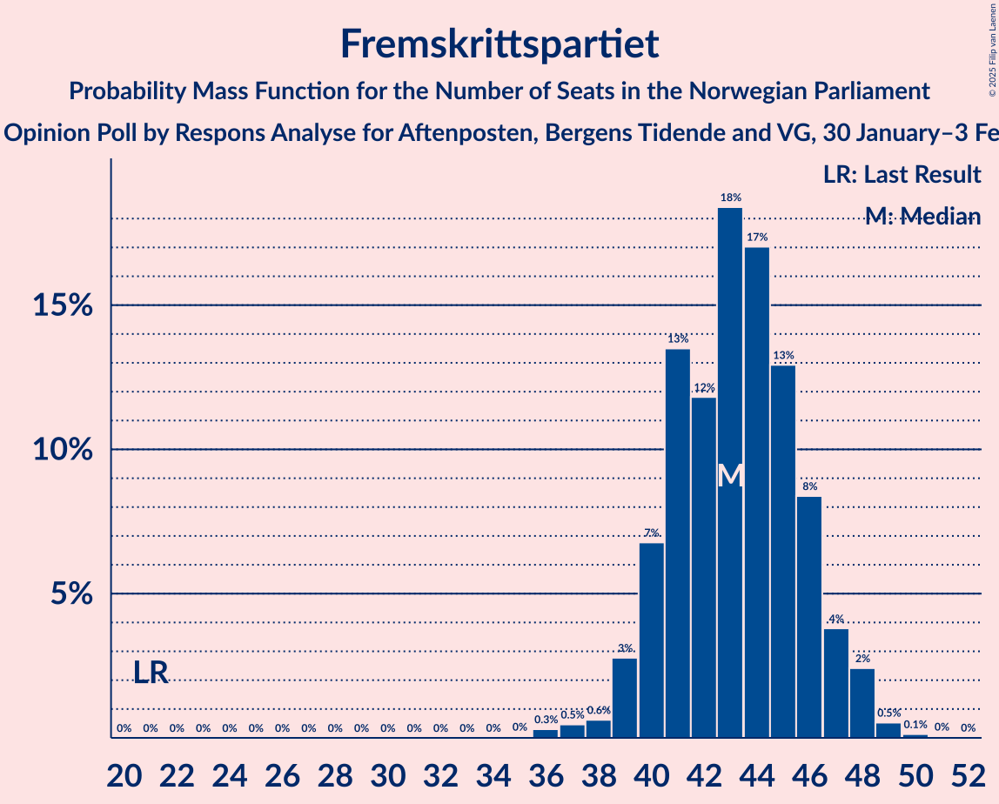
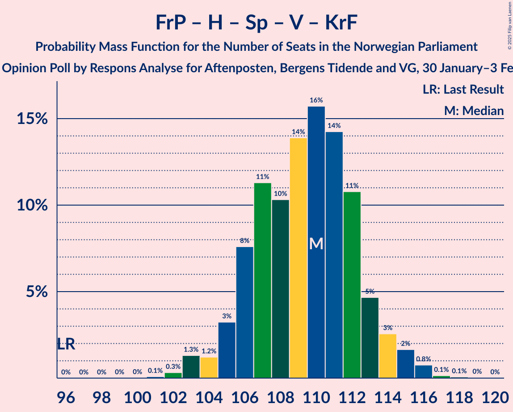

# Opinion Poll by Respons Analyse for Aftenposten, Bergens Tidende and VG, 30 January–3 February 2025

<a href="#voting-intentions">Voting Intentions</a> | <a href="#seats">Seats</a> | <a href="#coalitions">Coalitions</a> | <a href="#technical-information">Technical Information</a>

## Voting Intentions

### Confidence Intervals

| Party | Last Result | Poll Result | 80% Confidence Interval | 90% Confidence Interval | 95% Confidence Interval | 99% Confidence Interval |
|:-----:|:-----------:|:-----------:|:-----------------------:|:-----------------------:|:-----------------------:|:-----------------------:|
| Fremskrittspartiet | 11.6% | 24.2% | 22.5–26.0% |22.1–26.5% |21.6–27.0% |20.9–27.8% |
| Høyre | 20.4% | 22.0% | 20.4–23.7% |19.9–24.2% |19.5–24.7% |18.8–25.5% |
| Arbeiderpartiet | 26.2% | 18.3% | 16.8–20.0% |16.4–20.4% |16.0–20.8% |15.3–21.6% |
| Sosialistisk Venstreparti | 7.6% | 8.0% | 7.0–9.2% |6.7–9.6% |6.5–9.9% |6.0–10.5% |
| Senterpartiet | 13.5% | 7.5% | 6.5–8.7% |6.2–9.0% |6.0–9.3% |5.6–9.9% |
| Venstre | 4.6% | 6.5% | 5.6–7.6% |5.3–7.9% |5.1–8.2% |4.7–8.8% |
| Rødt | 4.7% | 5.9% | 5.0–7.0% |4.8–7.3% |4.6–7.5% |4.2–8.1% |
| Kristelig Folkeparti | 3.8% | 3.7% | 3.0–4.6% |2.9–4.8% |2.7–5.1% |2.4–5.5% |
| Miljøpartiet De Grønne | 3.9% | 1.9% | 1.4–2.6% |1.3–2.8% |1.2–3.0% |1.0–3.3% |

*Note:* The poll result column reflects the actual value used in the calculations. Published results may vary slightly, and in addition be rounded to fewer digits.

## Seats

### Confidence Intervals

| Party | Last Result | Median | 80% Confidence Interval | 90% Confidence Interval | 95% Confidence Interval | 99% Confidence Interval |
|:-----:|:-----------:|:------:|:-----------------------:|:-----------------------:|:-----------------------:|:-----------------------:|
| <a href="#fremskrittspartiet">Fremskrittspartiet</a> | 21 | 43 | 40–46 |40–47 |39–48 |37–49 |
| <a href="#høyre">Høyre</a> | 36 | 38 | 35–41 |34–42 |33–43 |31–45 |
| <a href="#arbeiderpartiet">Arbeiderpartiet</a> | 48 | 34 | 32–36 |31–37 |31–38 |29–40 |
| <a href="#sosialistisk-venstreparti">Sosialistisk Venstreparti</a> | 13 | 14 | 12–16 |11–16 |11–17 |10–18 |
| <a href="#senterpartiet">Senterpartiet</a> | 28 | 13 | 11–15 |11–16 |10–16 |9–17 |
| <a href="#venstre">Venstre</a> | 8 | 11 | 9–13 |9–14 |9–14 |8–15 |
| <a href="#rødt">Rødt</a> | 8 | 10 | 9–12 |8–13 |8–13 |7–14 |
| <a href="#kristelig-folkeparti">Kristelig Folkeparti</a> | 3 | 3 | 2–8 |1–8 |1–8 |0–9 |
| <a href="#miljøpartiet-de-grønne">Miljøpartiet De Grønne</a> | 3 | 1 | 0–1 |0–1 |0–1 |0–2 |

### Fremskrittspartiet

*For a full overview of the results for this party, see the [Fremskrittspartiet](party-fremskrittspartiet.html) page.*

| Number of Seats | Probability | Accumulated | Special Marks |
|:---------------:|:-----------:|:-----------:|:-------------:|
| 21 | 0% | 100% | Last Result |
| 22 | 0% | 100% |  |
| 23 | 0% | 100% |  |
| 24 | 0% | 100% |  |
| 25 | 0% | 100% |  |
| 26 | 0% | 100% |  |
| 27 | 0% | 100% |  |
| 28 | 0% | 100% |  |
| 29 | 0% | 100% |  |
| 30 | 0% | 100% |  |
| 31 | 0% | 100% |  |
| 32 | 0% | 100% |  |
| 33 | 0% | 100% |  |
| 34 | 0% | 100% |  |
| 35 | 0% | 100% |  |
| 36 | 0.3% | 99.9% |  |
| 37 | 0.5% | 99.6% |  |
| 38 | 0.6% | 99.2% |  |
| 39 | 3% | 98.6% |  |
| 40 | 7% | 96% |  |
| 41 | 13% | 89% |  |
| 42 | 12% | 76% |  |
| 43 | 18% | 64% | Median |
| 44 | 17% | 45% |  |
| 45 | 13% | 28% |  |
| 46 | 8% | 15% |  |
| 47 | 4% | 7% |  |
| 48 | 2% | 3% |  |
| 49 | 0.5% | 0.7% |  |
| 50 | 0.1% | 0.2% |  |
| 51 | 0% | 0.1% |  |
| 52 | 0% | 0% |  |

### Høyre

*For a full overview of the results for this party, see the [Høyre](party-høyre.html) page.*

| Number of Seats | Probability | Accumulated | Special Marks |
|:---------------:|:-----------:|:-----------:|:-------------:|
| 31 | 0.5% | 100% |  |
| 32 | 0.9% | 99.5% |  |
| 33 | 2% | 98.6% |  |
| 34 | 4% | 97% |  |
| 35 | 8% | 92% |  |
| 36 | 15% | 84% | Last Result |
| 37 | 16% | 69% |  |
| 38 | 13% | 53% | Median |
| 39 | 15% | 40% |  |
| 40 | 12% | 25% |  |
| 41 | 6% | 13% |  |
| 42 | 4% | 7% |  |
| 43 | 2% | 3% |  |
| 44 | 0.9% | 1.5% |  |
| 45 | 0.4% | 0.6% |  |
| 46 | 0.2% | 0.2% |  |
| 47 | 0% | 0% |  |

### Arbeiderpartiet

*For a full overview of the results for this party, see the [Arbeiderpartiet](party-arbeiderpartiet.html) page.*

| Number of Seats | Probability | Accumulated | Special Marks |
|:---------------:|:-----------:|:-----------:|:-------------:|
| 27 | 0.1% | 100% |  |
| 28 | 0.1% | 99.9% |  |
| 29 | 0.4% | 99.8% |  |
| 30 | 0.9% | 99.4% |  |
| 31 | 4% | 98.5% |  |
| 32 | 17% | 95% |  |
| 33 | 25% | 78% |  |
| 34 | 16% | 53% | Median |
| 35 | 22% | 37% |  |
| 36 | 9% | 16% |  |
| 37 | 4% | 7% |  |
| 38 | 2% | 3% |  |
| 39 | 0.5% | 1.1% |  |
| 40 | 0.4% | 0.5% |  |
| 41 | 0.1% | 0.2% |  |
| 42 | 0% | 0.1% |  |
| 43 | 0% | 0% |  |
| 44 | 0% | 0% |  |
| 45 | 0% | 0% |  |
| 46 | 0% | 0% |  |
| 47 | 0% | 0% |  |
| 48 | 0% | 0% | Last Result |

### Sosialistisk Venstreparti

*For a full overview of the results for this party, see the [Sosialistisk Venstreparti](party-sosialistiskvenstreparti.html) page.*

| Number of Seats | Probability | Accumulated | Special Marks |
|:---------------:|:-----------:|:-----------:|:-------------:|
| 9 | 0.1% | 100% |  |
| 10 | 1.3% | 99.9% |  |
| 11 | 6% | 98.6% |  |
| 12 | 14% | 93% |  |
| 13 | 24% | 80% | Last Result |
| 14 | 21% | 56% | Median |
| 15 | 19% | 34% |  |
| 16 | 10% | 15% |  |
| 17 | 4% | 5% |  |
| 18 | 1.0% | 1.3% |  |
| 19 | 0.3% | 0.3% |  |
| 20 | 0% | 0.1% |  |
| 21 | 0% | 0% |  |

### Senterpartiet

*For a full overview of the results for this party, see the [Senterpartiet](party-senterpartiet.html) page.*

| Number of Seats | Probability | Accumulated | Special Marks |
|:---------------:|:-----------:|:-----------:|:-------------:|
| 8 | 0.1% | 100% |  |
| 9 | 1.0% | 99.9% |  |
| 10 | 4% | 98.9% |  |
| 11 | 10% | 95% |  |
| 12 | 23% | 85% |  |
| 13 | 23% | 62% | Median |
| 14 | 22% | 39% |  |
| 15 | 11% | 16% |  |
| 16 | 3% | 5% |  |
| 17 | 1.3% | 2% |  |
| 18 | 0.2% | 0.3% |  |
| 19 | 0% | 0% |  |
| 20 | 0% | 0% |  |
| 21 | 0% | 0% |  |
| 22 | 0% | 0% |  |
| 23 | 0% | 0% |  |
| 24 | 0% | 0% |  |
| 25 | 0% | 0% |  |
| 26 | 0% | 0% |  |
| 27 | 0% | 0% |  |
| 28 | 0% | 0% | Last Result |

### Venstre

*For a full overview of the results for this party, see the [Venstre](party-venstre.html) page.*

| Number of Seats | Probability | Accumulated | Special Marks |
|:---------------:|:-----------:|:-----------:|:-------------:|
| 7 | 0.1% | 100% |  |
| 8 | 2% | 99.9% | Last Result |
| 9 | 9% | 98% |  |
| 10 | 21% | 89% |  |
| 11 | 29% | 69% | Median |
| 12 | 21% | 40% |  |
| 13 | 13% | 19% |  |
| 14 | 5% | 6% |  |
| 15 | 1.0% | 1.3% |  |
| 16 | 0.2% | 0.2% |  |
| 17 | 0% | 0% |  |

### Rødt

*For a full overview of the results for this party, see the [Rødt](party-rødt.html) page.*

| Number of Seats | Probability | Accumulated | Special Marks |
|:---------------:|:-----------:|:-----------:|:-------------:|
| 1 | 0.2% | 100% |  |
| 2 | 0% | 99.8% |  |
| 3 | 0% | 99.8% |  |
| 4 | 0% | 99.8% |  |
| 5 | 0% | 99.8% |  |
| 6 | 0% | 99.8% |  |
| 7 | 1.1% | 99.8% |  |
| 8 | 8% | 98.7% | Last Result |
| 9 | 25% | 91% |  |
| 10 | 28% | 66% | Median |
| 11 | 22% | 38% |  |
| 12 | 12% | 17% |  |
| 13 | 4% | 5% |  |
| 14 | 0.9% | 1.0% |  |
| 15 | 0.1% | 0.1% |  |
| 16 | 0% | 0% |  |

### Kristelig Folkeparti

*For a full overview of the results for this party, see the [Kristelig Folkeparti](party-kristeligfolkeparti.html) page.*

| Number of Seats | Probability | Accumulated | Special Marks |
|:---------------:|:-----------:|:-----------:|:-------------:|
| 0 | 0.8% | 100% |  |
| 1 | 9% | 99.2% |  |
| 2 | 30% | 90% |  |
| 3 | 25% | 61% | Last Result, Median |
| 4 | 0% | 36% |  |
| 5 | 0% | 36% |  |
| 6 | 0.1% | 36% |  |
| 7 | 23% | 36% |  |
| 8 | 11% | 12% |  |
| 9 | 2% | 2% |  |
| 10 | 0.2% | 0.2% |  |
| 11 | 0% | 0% |  |

### Miljøpartiet De Grønne

*For a full overview of the results for this party, see the [Miljøpartiet De Grønne](party-miljøpartietdegrønne.html) page.*

| Number of Seats | Probability | Accumulated | Special Marks |
|:---------------:|:-----------:|:-----------:|:-------------:|
| 0 | 27% | 100% |  |
| 1 | 71% | 73% | Median |
| 2 | 2% | 2% |  |
| 3 | 0.1% | 0.1% | Last Result |
| 4 | 0% | 0% |  |

## Coalitions

### Confidence Intervals

| Coalition | Last Result | Median | Majority? | 80% Confidence Interval | 90% Confidence Interval | 95% Confidence Interval | 99% Confidence Interval |
|:---------:|:-----------:|:------:|:---------:|:-----------------------:|:-----------------------:|:-----------------------:|:-----------------------:|
| Fremskrittspartiet – Høyre – Senterpartiet – Venstre – Kristelig Folkeparti | 96 | 110 | 100% | 106–112 | 105–114 | 104–115 | 103–116 |
| Fremskrittspartiet – Høyre – Venstre – Kristelig Folkeparti – Miljøpartiet De Grønne | 71 | 97 | 100% | 94–101 | 93–102 | 92–103 | 90–104 |
| Fremskrittspartiet – Høyre – Venstre – Kristelig Folkeparti | 68 | 96 | 100% | 93–100 | 92–101 | 91–102 | 89–103 |
| Fremskrittspartiet – Høyre – Venstre | 65 | 92 | 99.6% | 89–96 | 88–97 | 86–98 | 85–100 |
| Fremskrittspartiet – Høyre | 57 | 81 | 12% | 78–85 | 76–86 | 76–87 | 74–89 |
| Arbeiderpartiet – Sosialistisk Venstreparti – Senterpartiet – Rødt – Miljøpartiet De Grønne | 100 | 72 | 0% | 68–75 | 67–76 | 66–77 | 65–79 |
| Arbeiderpartiet – Sosialistisk Venstreparti – Senterpartiet – Rødt | 97 | 71 | 0% | 67–74 | 66–75 | 65–76 | 64–78 |
| Arbeiderpartiet – Sosialistisk Venstreparti – Senterpartiet – Kristelig Folkeparti – Miljøpartiet De Grønne | 95 | 66 | 0% | 62–69 | 61–71 | 60–72 | 58–74 |
| Arbeiderpartiet – Sosialistisk Venstreparti – Senterpartiet – Miljøpartiet De Grønne | 92 | 62 | 0% | 58–65 | 58–66 | 57–67 | 55–68 |
| Arbeiderpartiet – Sosialistisk Venstreparti – Senterpartiet | 89 | 61 | 0% | 57–64 | 57–65 | 56–66 | 54–67 |
| Arbeiderpartiet – Sosialistisk Venstreparti – Rødt – Miljøpartiet De Grønne | 72 | 58 | 0% | 56–62 | 54–63 | 53–64 | 52–65 |
| Høyre – Venstre – Kristelig Folkeparti | 47 | 53 | 0% | 50–57 | 49–58 | 48–59 | 47–61 |
| Arbeiderpartiet – Senterpartiet – Kristelig Folkeparti – Miljøpartiet De Grønne | 82 | 52 | 0% | 48–56 | 47–57 | 47–58 | 45–60 |
| Arbeiderpartiet – Senterpartiet – Kristelig Folkeparti | 79 | 51 | 0% | 47–55 | 46–56 | 46–57 | 44–59 |
| Arbeiderpartiet – Sosialistisk Venstreparti | 61 | 48 | 0% | 45–50 | 44–51 | 43–52 | 42–54 |
| Arbeiderpartiet – Senterpartiet | 76 | 47 | 0% | 44–50 | 44–50 | 43–51 | 42–53 |
| Senterpartiet – Venstre – Kristelig Folkeparti | 39 | 28 | 0% | 25–32 | 24–33 | 24–34 | 22–35 |

### Fremskrittspartiet – Høyre – Senterpartiet – Venstre – Kristelig Folkeparti

| Number of Seats | Probability | Accumulated | Special Marks |
|:---------------:|:-----------:|:-----------:|:-------------:|
| 96 | 0% | 100% | Last Result |
| 97 | 0% | 100% |  |
| 98 | 0% | 100% |  |
| 99 | 0% | 100% |  |
| 100 | 0% | 100% |  |
| 101 | 0.1% | 100% |  |
| 102 | 0.3% | 99.9% |  |
| 103 | 1.3% | 99.6% |  |
| 104 | 1.2% | 98% |  |
| 105 | 3% | 97% |  |
| 106 | 8% | 94% |  |
| 107 | 11% | 86% |  |
| 108 | 10% | 75% | Median |
| 109 | 14% | 65% |  |
| 110 | 16% | 51% |  |
| 111 | 14% | 35% |  |
| 112 | 11% | 21% |  |
| 113 | 5% | 10% |  |
| 114 | 3% | 5% |  |
| 115 | 2% | 3% |  |
| 116 | 0.8% | 1.0% |  |
| 117 | 0.1% | 0.3% |  |
| 118 | 0.1% | 0.1% |  |
| 119 | 0% | 0.1% |  |
| 120 | 0% | 0% |  |

### Fremskrittspartiet – Høyre – Venstre – Kristelig Folkeparti – Miljøpartiet De Grønne

| Number of Seats | Probability | Accumulated | Special Marks |
|:---------------:|:-----------:|:-----------:|:-------------:|
| 71 | 0% | 100% | Last Result |
| 72 | 0% | 100% |  |
| 73 | 0% | 100% |  |
| 74 | 0% | 100% |  |
| 75 | 0% | 100% |  |
| 76 | 0% | 100% |  |
| 77 | 0% | 100% |  |
| 78 | 0% | 100% |  |
| 79 | 0% | 100% |  |
| 80 | 0% | 100% |  |
| 81 | 0% | 100% |  |
| 82 | 0% | 100% |  |
| 83 | 0% | 100% |  |
| 84 | 0% | 100% |  |
| 85 | 0% | 100% | Majority |
| 86 | 0% | 100% |  |
| 87 | 0% | 100% |  |
| 88 | 0% | 100% |  |
| 89 | 0.3% | 99.9% |  |
| 90 | 0.5% | 99.6% |  |
| 91 | 1.5% | 99.1% |  |
| 92 | 2% | 98% |  |
| 93 | 5% | 96% |  |
| 94 | 7% | 91% |  |
| 95 | 13% | 84% |  |
| 96 | 14% | 71% | Median |
| 97 | 11% | 57% |  |
| 98 | 17% | 46% |  |
| 99 | 9% | 29% |  |
| 100 | 7% | 20% |  |
| 101 | 8% | 13% |  |
| 102 | 3% | 5% |  |
| 103 | 2% | 3% |  |
| 104 | 0.6% | 1.0% |  |
| 105 | 0.2% | 0.4% |  |
| 106 | 0.1% | 0.2% |  |
| 107 | 0.1% | 0.1% |  |
| 108 | 0% | 0% |  |

### Fremskrittspartiet – Høyre – Venstre – Kristelig Folkeparti

| Number of Seats | Probability | Accumulated | Special Marks |
|:---------------:|:-----------:|:-----------:|:-------------:|
| 68 | 0% | 100% | Last Result |
| 69 | 0% | 100% |  |
| 70 | 0% | 100% |  |
| 71 | 0% | 100% |  |
| 72 | 0% | 100% |  |
| 73 | 0% | 100% |  |
| 74 | 0% | 100% |  |
| 75 | 0% | 100% |  |
| 76 | 0% | 100% |  |
| 77 | 0% | 100% |  |
| 78 | 0% | 100% |  |
| 79 | 0% | 100% |  |
| 80 | 0% | 100% |  |
| 81 | 0% | 100% |  |
| 82 | 0% | 100% |  |
| 83 | 0% | 100% |  |
| 84 | 0% | 100% |  |
| 85 | 0% | 100% | Majority |
| 86 | 0% | 100% |  |
| 87 | 0% | 100% |  |
| 88 | 0.2% | 99.9% |  |
| 89 | 0.6% | 99.8% |  |
| 90 | 1.0% | 99.2% |  |
| 91 | 2% | 98% |  |
| 92 | 4% | 96% |  |
| 93 | 7% | 92% |  |
| 94 | 11% | 85% |  |
| 95 | 14% | 74% | Median |
| 96 | 12% | 60% |  |
| 97 | 14% | 48% |  |
| 98 | 12% | 34% |  |
| 99 | 7% | 22% |  |
| 100 | 7% | 14% |  |
| 101 | 4% | 7% |  |
| 102 | 2% | 4% |  |
| 103 | 0.8% | 1.3% |  |
| 104 | 0.2% | 0.4% |  |
| 105 | 0.1% | 0.2% |  |
| 106 | 0.1% | 0.1% |  |
| 107 | 0% | 0% |  |

### Fremskrittspartiet – Høyre – Venstre

| Number of Seats | Probability | Accumulated | Special Marks |
|:---------------:|:-----------:|:-----------:|:-------------:|
| 65 | 0% | 100% | Last Result |
| 66 | 0% | 100% |  |
| 67 | 0% | 100% |  |
| 68 | 0% | 100% |  |
| 69 | 0% | 100% |  |
| 70 | 0% | 100% |  |
| 71 | 0% | 100% |  |
| 72 | 0% | 100% |  |
| 73 | 0% | 100% |  |
| 74 | 0% | 100% |  |
| 75 | 0% | 100% |  |
| 76 | 0% | 100% |  |
| 77 | 0% | 100% |  |
| 78 | 0% | 100% |  |
| 79 | 0% | 100% |  |
| 80 | 0% | 100% |  |
| 81 | 0% | 100% |  |
| 82 | 0% | 100% |  |
| 83 | 0.1% | 100% |  |
| 84 | 0.3% | 99.9% |  |
| 85 | 1.2% | 99.6% | Majority |
| 86 | 1.1% | 98% |  |
| 87 | 2% | 97% |  |
| 88 | 6% | 96% |  |
| 89 | 7% | 90% |  |
| 90 | 10% | 83% |  |
| 91 | 12% | 73% |  |
| 92 | 14% | 61% | Median |
| 93 | 12% | 46% |  |
| 94 | 12% | 34% |  |
| 95 | 8% | 22% |  |
| 96 | 7% | 14% |  |
| 97 | 3% | 7% |  |
| 98 | 2% | 4% |  |
| 99 | 0.9% | 2% |  |
| 100 | 0.5% | 0.8% |  |
| 101 | 0.2% | 0.3% |  |
| 102 | 0.1% | 0.1% |  |
| 103 | 0% | 0% |  |

### Fremskrittspartiet – Høyre

| Number of Seats | Probability | Accumulated | Special Marks |
|:---------------:|:-----------:|:-----------:|:-------------:|
| 57 | 0% | 100% | Last Result |
| 58 | 0% | 100% |  |
| 59 | 0% | 100% |  |
| 60 | 0% | 100% |  |
| 61 | 0% | 100% |  |
| 62 | 0% | 100% |  |
| 63 | 0% | 100% |  |
| 64 | 0% | 100% |  |
| 65 | 0% | 100% |  |
| 66 | 0% | 100% |  |
| 67 | 0% | 100% |  |
| 68 | 0% | 100% |  |
| 69 | 0% | 100% |  |
| 70 | 0% | 100% |  |
| 71 | 0% | 100% |  |
| 72 | 0.1% | 100% |  |
| 73 | 0.2% | 99.9% |  |
| 74 | 0.6% | 99.7% |  |
| 75 | 1.0% | 99.1% |  |
| 76 | 3% | 98% |  |
| 77 | 5% | 95% |  |
| 78 | 10% | 90% |  |
| 79 | 10% | 80% |  |
| 80 | 14% | 70% |  |
| 81 | 13% | 56% | Median |
| 82 | 11% | 43% |  |
| 83 | 11% | 32% |  |
| 84 | 9% | 21% |  |
| 85 | 6% | 12% | Majority |
| 86 | 3% | 6% |  |
| 87 | 2% | 3% |  |
| 88 | 0.7% | 1.3% |  |
| 89 | 0.5% | 0.7% |  |
| 90 | 0.1% | 0.1% |  |
| 91 | 0% | 0.1% |  |
| 92 | 0% | 0% |  |

### Arbeiderpartiet – Sosialistisk Venstreparti – Senterpartiet – Rødt – Miljøpartiet De Grønne

| Number of Seats | Probability | Accumulated | Special Marks |
|:---------------:|:-----------:|:-----------:|:-------------:|
| 62 | 0.1% | 100% |  |
| 63 | 0.1% | 99.9% |  |
| 64 | 0.2% | 99.8% |  |
| 65 | 0.8% | 99.6% |  |
| 66 | 2% | 98.7% |  |
| 67 | 4% | 96% |  |
| 68 | 7% | 93% |  |
| 69 | 7% | 86% |  |
| 70 | 12% | 78% |  |
| 71 | 14% | 66% |  |
| 72 | 12% | 52% | Median |
| 73 | 14% | 40% |  |
| 74 | 11% | 26% |  |
| 75 | 7% | 15% |  |
| 76 | 5% | 9% |  |
| 77 | 2% | 4% |  |
| 78 | 1.1% | 2% |  |
| 79 | 0.6% | 0.9% |  |
| 80 | 0.2% | 0.3% |  |
| 81 | 0% | 0.1% |  |
| 82 | 0% | 0% |  |
| 83 | 0% | 0% |  |
| 84 | 0% | 0% |  |
| 85 | 0% | 0% | Majority |
| 86 | 0% | 0% |  |
| 87 | 0% | 0% |  |
| 88 | 0% | 0% |  |
| 89 | 0% | 0% |  |
| 90 | 0% | 0% |  |
| 91 | 0% | 0% |  |
| 92 | 0% | 0% |  |
| 93 | 0% | 0% |  |
| 94 | 0% | 0% |  |
| 95 | 0% | 0% |  |
| 96 | 0% | 0% |  |
| 97 | 0% | 0% |  |
| 98 | 0% | 0% |  |
| 99 | 0% | 0% |  |
| 100 | 0% | 0% | Last Result |

### Arbeiderpartiet – Sosialistisk Venstreparti – Senterpartiet – Rødt

| Number of Seats | Probability | Accumulated | Special Marks |
|:---------------:|:-----------:|:-----------:|:-------------:|
| 61 | 0.1% | 100% |  |
| 62 | 0.1% | 99.9% |  |
| 63 | 0.2% | 99.8% |  |
| 64 | 0.6% | 99.6% |  |
| 65 | 2% | 99.0% |  |
| 66 | 3% | 97% |  |
| 67 | 8% | 95% |  |
| 68 | 7% | 87% |  |
| 69 | 9% | 80% |  |
| 70 | 17% | 71% |  |
| 71 | 11% | 54% | Median |
| 72 | 14% | 43% |  |
| 73 | 13% | 29% |  |
| 74 | 7% | 16% |  |
| 75 | 5% | 10% |  |
| 76 | 2% | 4% |  |
| 77 | 1.5% | 2% |  |
| 78 | 0.6% | 1.0% |  |
| 79 | 0.3% | 0.4% |  |
| 80 | 0.1% | 0.1% |  |
| 81 | 0% | 0% |  |
| 82 | 0% | 0% |  |
| 83 | 0% | 0% |  |
| 84 | 0% | 0% |  |
| 85 | 0% | 0% | Majority |
| 86 | 0% | 0% |  |
| 87 | 0% | 0% |  |
| 88 | 0% | 0% |  |
| 89 | 0% | 0% |  |
| 90 | 0% | 0% |  |
| 91 | 0% | 0% |  |
| 92 | 0% | 0% |  |
| 93 | 0% | 0% |  |
| 94 | 0% | 0% |  |
| 95 | 0% | 0% |  |
| 96 | 0% | 0% |  |
| 97 | 0% | 0% | Last Result |

### Arbeiderpartiet – Sosialistisk Venstreparti – Senterpartiet – Kristelig Folkeparti – Miljøpartiet De Grønne

| Number of Seats | Probability | Accumulated | Special Marks |
|:---------------:|:-----------:|:-----------:|:-------------:|
| 56 | 0% | 100% |  |
| 57 | 0.2% | 99.9% |  |
| 58 | 0.4% | 99.7% |  |
| 59 | 0.7% | 99.3% |  |
| 60 | 2% | 98.6% |  |
| 61 | 4% | 96% |  |
| 62 | 6% | 93% |  |
| 63 | 10% | 87% |  |
| 64 | 12% | 76% |  |
| 65 | 14% | 64% | Median |
| 66 | 15% | 50% |  |
| 67 | 12% | 35% |  |
| 68 | 6% | 23% |  |
| 69 | 8% | 17% |  |
| 70 | 3% | 9% |  |
| 71 | 3% | 5% |  |
| 72 | 1.2% | 3% |  |
| 73 | 0.8% | 1.3% |  |
| 74 | 0.3% | 0.5% |  |
| 75 | 0.1% | 0.2% |  |
| 76 | 0% | 0.1% |  |
| 77 | 0% | 0% |  |
| 78 | 0% | 0% |  |
| 79 | 0% | 0% |  |
| 80 | 0% | 0% |  |
| 81 | 0% | 0% |  |
| 82 | 0% | 0% |  |
| 83 | 0% | 0% |  |
| 84 | 0% | 0% |  |
| 85 | 0% | 0% | Majority |
| 86 | 0% | 0% |  |
| 87 | 0% | 0% |  |
| 88 | 0% | 0% |  |
| 89 | 0% | 0% |  |
| 90 | 0% | 0% |  |
| 91 | 0% | 0% |  |
| 92 | 0% | 0% |  |
| 93 | 0% | 0% |  |
| 94 | 0% | 0% |  |
| 95 | 0% | 0% | Last Result |

### Arbeiderpartiet – Sosialistisk Venstreparti – Senterpartiet – Miljøpartiet De Grønne

| Number of Seats | Probability | Accumulated | Special Marks |
|:---------------:|:-----------:|:-----------:|:-------------:|
| 53 | 0.1% | 100% |  |
| 54 | 0.2% | 99.9% |  |
| 55 | 0.5% | 99.7% |  |
| 56 | 1.1% | 99.2% |  |
| 57 | 3% | 98% |  |
| 58 | 9% | 95% |  |
| 59 | 8% | 86% |  |
| 60 | 12% | 79% |  |
| 61 | 16% | 67% |  |
| 62 | 15% | 51% | Median |
| 63 | 17% | 36% |  |
| 64 | 7% | 19% |  |
| 65 | 6% | 12% |  |
| 66 | 3% | 5% |  |
| 67 | 2% | 3% |  |
| 68 | 0.4% | 0.8% |  |
| 69 | 0.2% | 0.4% |  |
| 70 | 0.1% | 0.1% |  |
| 71 | 0% | 0% |  |
| 72 | 0% | 0% |  |
| 73 | 0% | 0% |  |
| 74 | 0% | 0% |  |
| 75 | 0% | 0% |  |
| 76 | 0% | 0% |  |
| 77 | 0% | 0% |  |
| 78 | 0% | 0% |  |
| 79 | 0% | 0% |  |
| 80 | 0% | 0% |  |
| 81 | 0% | 0% |  |
| 82 | 0% | 0% |  |
| 83 | 0% | 0% |  |
| 84 | 0% | 0% |  |
| 85 | 0% | 0% | Majority |
| 86 | 0% | 0% |  |
| 87 | 0% | 0% |  |
| 88 | 0% | 0% |  |
| 89 | 0% | 0% |  |
| 90 | 0% | 0% |  |
| 91 | 0% | 0% |  |
| 92 | 0% | 0% | Last Result |

### Arbeiderpartiet – Sosialistisk Venstreparti – Senterpartiet

| Number of Seats | Probability | Accumulated | Special Marks |
|:---------------:|:-----------:|:-----------:|:-------------:|
| 52 | 0.1% | 100% |  |
| 53 | 0.2% | 99.9% |  |
| 54 | 0.4% | 99.8% |  |
| 55 | 0.9% | 99.3% |  |
| 56 | 2% | 98% |  |
| 57 | 6% | 96% |  |
| 58 | 8% | 90% |  |
| 59 | 12% | 82% |  |
| 60 | 17% | 70% |  |
| 61 | 13% | 54% | Median |
| 62 | 20% | 41% |  |
| 63 | 8% | 20% |  |
| 64 | 6% | 12% |  |
| 65 | 3% | 6% |  |
| 66 | 2% | 3% |  |
| 67 | 0.7% | 1.2% |  |
| 68 | 0.3% | 0.4% |  |
| 69 | 0.1% | 0.2% |  |
| 70 | 0.1% | 0.1% |  |
| 71 | 0% | 0% |  |
| 72 | 0% | 0% |  |
| 73 | 0% | 0% |  |
| 74 | 0% | 0% |  |
| 75 | 0% | 0% |  |
| 76 | 0% | 0% |  |
| 77 | 0% | 0% |  |
| 78 | 0% | 0% |  |
| 79 | 0% | 0% |  |
| 80 | 0% | 0% |  |
| 81 | 0% | 0% |  |
| 82 | 0% | 0% |  |
| 83 | 0% | 0% |  |
| 84 | 0% | 0% |  |
| 85 | 0% | 0% | Majority |
| 86 | 0% | 0% |  |
| 87 | 0% | 0% |  |
| 88 | 0% | 0% |  |
| 89 | 0% | 0% | Last Result |

### Arbeiderpartiet – Sosialistisk Venstreparti – Rødt – Miljøpartiet De Grønne

| Number of Seats | Probability | Accumulated | Special Marks |
|:---------------:|:-----------:|:-----------:|:-------------:|
| 49 | 0% | 100% |  |
| 50 | 0.1% | 99.9% |  |
| 51 | 0.1% | 99.9% |  |
| 52 | 0.8% | 99.8% |  |
| 53 | 2% | 99.0% |  |
| 54 | 3% | 97% |  |
| 55 | 5% | 95% |  |
| 56 | 11% | 90% |  |
| 57 | 14% | 80% |  |
| 58 | 15% | 65% |  |
| 59 | 14% | 50% | Median |
| 60 | 10% | 36% |  |
| 61 | 11% | 25% |  |
| 62 | 8% | 14% |  |
| 63 | 3% | 6% |  |
| 64 | 1.2% | 3% |  |
| 65 | 1.3% | 2% |  |
| 66 | 0.3% | 0.4% |  |
| 67 | 0.1% | 0.1% |  |
| 68 | 0% | 0% |  |
| 69 | 0% | 0% |  |
| 70 | 0% | 0% |  |
| 71 | 0% | 0% |  |
| 72 | 0% | 0% | Last Result |

### Høyre – Venstre – Kristelig Folkeparti

| Number of Seats | Probability | Accumulated | Special Marks |
|:---------------:|:-----------:|:-----------:|:-------------:|
| 45 | 0.1% | 100% |  |
| 46 | 0.4% | 99.9% |  |
| 47 | 1.0% | 99.5% | Last Result |
| 48 | 3% | 98% |  |
| 49 | 4% | 95% |  |
| 50 | 8% | 91% |  |
| 51 | 11% | 82% |  |
| 52 | 12% | 71% | Median |
| 53 | 14% | 60% |  |
| 54 | 16% | 46% |  |
| 55 | 10% | 30% |  |
| 56 | 9% | 21% |  |
| 57 | 5% | 11% |  |
| 58 | 3% | 6% |  |
| 59 | 1.3% | 3% |  |
| 60 | 0.9% | 1.4% |  |
| 61 | 0.3% | 0.5% |  |
| 62 | 0.1% | 0.2% |  |
| 63 | 0% | 0.1% |  |
| 64 | 0% | 0% |  |

### Arbeiderpartiet – Senterpartiet – Kristelig Folkeparti – Miljøpartiet De Grønne

| Number of Seats | Probability | Accumulated | Special Marks |
|:---------------:|:-----------:|:-----------:|:-------------:|
| 43 | 0.1% | 100% |  |
| 44 | 0.2% | 99.9% |  |
| 45 | 0.9% | 99.7% |  |
| 46 | 1.2% | 98.8% |  |
| 47 | 5% | 98% |  |
| 48 | 5% | 93% |  |
| 49 | 11% | 87% |  |
| 50 | 13% | 76% |  |
| 51 | 12% | 63% | Median |
| 52 | 14% | 51% |  |
| 53 | 10% | 38% |  |
| 54 | 8% | 28% |  |
| 55 | 9% | 20% |  |
| 56 | 5% | 11% |  |
| 57 | 3% | 6% |  |
| 58 | 2% | 3% |  |
| 59 | 0.9% | 1.5% |  |
| 60 | 0.4% | 0.6% |  |
| 61 | 0.1% | 0.1% |  |
| 62 | 0% | 0.1% |  |
| 63 | 0% | 0% |  |
| 64 | 0% | 0% |  |
| 65 | 0% | 0% |  |
| 66 | 0% | 0% |  |
| 67 | 0% | 0% |  |
| 68 | 0% | 0% |  |
| 69 | 0% | 0% |  |
| 70 | 0% | 0% |  |
| 71 | 0% | 0% |  |
| 72 | 0% | 0% |  |
| 73 | 0% | 0% |  |
| 74 | 0% | 0% |  |
| 75 | 0% | 0% |  |
| 76 | 0% | 0% |  |
| 77 | 0% | 0% |  |
| 78 | 0% | 0% |  |
| 79 | 0% | 0% |  |
| 80 | 0% | 0% |  |
| 81 | 0% | 0% |  |
| 82 | 0% | 0% | Last Result |

### Arbeiderpartiet – Senterpartiet – Kristelig Folkeparti

| Number of Seats | Probability | Accumulated | Special Marks |
|:---------------:|:-----------:|:-----------:|:-------------:|
| 42 | 0.1% | 100% |  |
| 43 | 0.1% | 99.9% |  |
| 44 | 0.6% | 99.8% |  |
| 45 | 1.1% | 99.2% |  |
| 46 | 3% | 98% |  |
| 47 | 7% | 95% |  |
| 48 | 8% | 88% |  |
| 49 | 14% | 80% |  |
| 50 | 12% | 66% | Median |
| 51 | 13% | 54% |  |
| 52 | 9% | 41% |  |
| 53 | 11% | 32% |  |
| 54 | 8% | 21% |  |
| 55 | 4% | 12% |  |
| 56 | 5% | 9% |  |
| 57 | 2% | 3% |  |
| 58 | 1.0% | 2% |  |
| 59 | 0.5% | 0.6% |  |
| 60 | 0.1% | 0.2% |  |
| 61 | 0% | 0.1% |  |
| 62 | 0% | 0% |  |
| 63 | 0% | 0% |  |
| 64 | 0% | 0% |  |
| 65 | 0% | 0% |  |
| 66 | 0% | 0% |  |
| 67 | 0% | 0% |  |
| 68 | 0% | 0% |  |
| 69 | 0% | 0% |  |
| 70 | 0% | 0% |  |
| 71 | 0% | 0% |  |
| 72 | 0% | 0% |  |
| 73 | 0% | 0% |  |
| 74 | 0% | 0% |  |
| 75 | 0% | 0% |  |
| 76 | 0% | 0% |  |
| 77 | 0% | 0% |  |
| 78 | 0% | 0% |  |
| 79 | 0% | 0% | Last Result |

### Arbeiderpartiet – Sosialistisk Venstreparti

| Number of Seats | Probability | Accumulated | Special Marks |
|:---------------:|:-----------:|:-----------:|:-------------:|
| 40 | 0.1% | 100% |  |
| 41 | 0.2% | 99.9% |  |
| 42 | 1.0% | 99.7% |  |
| 43 | 1.4% | 98.7% |  |
| 44 | 3% | 97% |  |
| 45 | 7% | 94% |  |
| 46 | 16% | 87% |  |
| 47 | 18% | 71% |  |
| 48 | 19% | 53% | Median |
| 49 | 14% | 34% |  |
| 50 | 10% | 20% |  |
| 51 | 5% | 9% |  |
| 52 | 3% | 5% |  |
| 53 | 1.2% | 2% |  |
| 54 | 0.5% | 0.8% |  |
| 55 | 0.1% | 0.2% |  |
| 56 | 0.1% | 0.1% |  |
| 57 | 0% | 0% |  |
| 58 | 0% | 0% |  |
| 59 | 0% | 0% |  |
| 60 | 0% | 0% |  |
| 61 | 0% | 0% | Last Result |

### Arbeiderpartiet – Senterpartiet

| Number of Seats | Probability | Accumulated | Special Marks |
|:---------------:|:-----------:|:-----------:|:-------------:|
| 39 | 0.1% | 100% |  |
| 40 | 0.1% | 99.9% |  |
| 41 | 0.2% | 99.8% |  |
| 42 | 0.8% | 99.6% |  |
| 43 | 3% | 98.8% |  |
| 44 | 7% | 96% |  |
| 45 | 14% | 89% |  |
| 46 | 18% | 75% |  |
| 47 | 21% | 57% | Median |
| 48 | 13% | 35% |  |
| 49 | 12% | 22% |  |
| 50 | 6% | 10% |  |
| 51 | 2% | 4% |  |
| 52 | 1.4% | 2% |  |
| 53 | 0.3% | 0.7% |  |
| 54 | 0.3% | 0.4% |  |
| 55 | 0% | 0.1% |  |
| 56 | 0% | 0% |  |
| 57 | 0% | 0% |  |
| 58 | 0% | 0% |  |
| 59 | 0% | 0% |  |
| 60 | 0% | 0% |  |
| 61 | 0% | 0% |  |
| 62 | 0% | 0% |  |
| 63 | 0% | 0% |  |
| 64 | 0% | 0% |  |
| 65 | 0% | 0% |  |
| 66 | 0% | 0% |  |
| 67 | 0% | 0% |  |
| 68 | 0% | 0% |  |
| 69 | 0% | 0% |  |
| 70 | 0% | 0% |  |
| 71 | 0% | 0% |  |
| 72 | 0% | 0% |  |
| 73 | 0% | 0% |  |
| 74 | 0% | 0% |  |
| 75 | 0% | 0% |  |
| 76 | 0% | 0% | Last Result |

### Senterpartiet – Venstre – Kristelig Folkeparti

| Number of Seats | Probability | Accumulated | Special Marks |
|:---------------:|:-----------:|:-----------:|:-------------:|
| 20 | 0.1% | 100% |  |
| 21 | 0.2% | 99.9% |  |
| 22 | 0.5% | 99.7% |  |
| 23 | 2% | 99.2% |  |
| 24 | 5% | 98% |  |
| 25 | 10% | 93% |  |
| 26 | 9% | 83% |  |
| 27 | 15% | 75% | Median |
| 28 | 14% | 60% |  |
| 29 | 13% | 46% |  |
| 30 | 9% | 33% |  |
| 31 | 9% | 24% |  |
| 32 | 9% | 15% |  |
| 33 | 3% | 6% |  |
| 34 | 2% | 3% |  |
| 35 | 0.6% | 0.9% |  |
| 36 | 0.2% | 0.3% |  |
| 37 | 0.1% | 0.1% |  |
| 38 | 0% | 0% |  |
| 39 | 0% | 0% | Last Result |

## Technical Information

### Opinion Poll

+ **Polling firm:** Respons Analyse
+ **Commissioner(s):** Aftenposten, Bergens Tidende and VG
+ **Fieldwork period:** 30 January–3 February 2025

### Calculations

+ **Sample size:** 1000
+ **Simulations done:** 2,097,152
+ **Error estimate:** 2.12%

