# Opinion Poll by Verian for TV2, 4 February 2025

<a href="#voting-intentions">Voting Intentions</a> | <a href="#seats">Seats</a> | <a href="#coalitions">Coalitions</a> | <a href="#technical-information">Technical Information</a>

## Voting Intentions

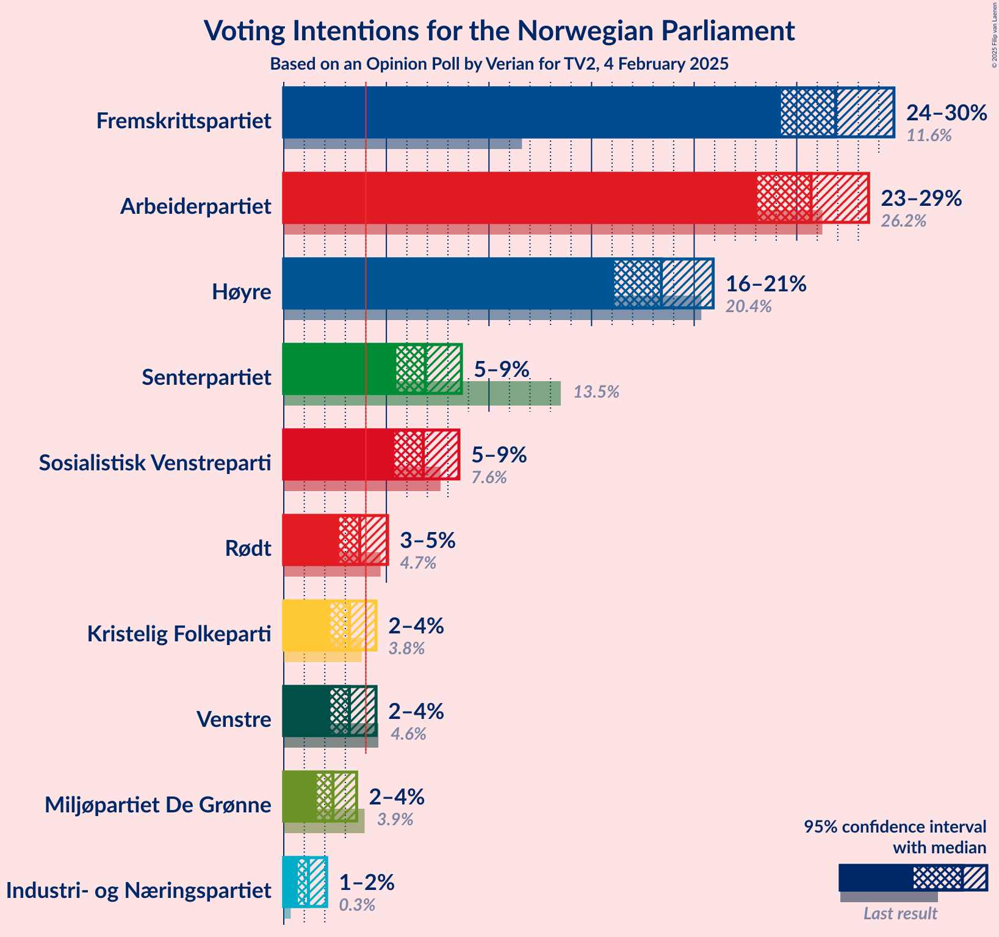

### Confidence Intervals

| Party | Last Result | Poll Result | 80% Confidence Interval | 90% Confidence Interval | 95% Confidence Interval | 99% Confidence Interval |
|:-----:|:-----------:|:-----------:|:-----------------------:|:-----------------------:|:-----------------------:|:-----------------------:|
| Fremskrittspartiet | 11.6% | 26.9% | 25.1–28.8% |24.7–29.3% |24.2–29.7% |23.4–30.7% |
| Arbeiderpartiet | 26.2% | 25.7% | 24.0–27.5% |23.5–28.1% |23.1–28.5% |22.3–29.4% |
| Høyre | 20.4% | 18.4% | 16.9–20.1% |16.5–20.5% |16.1–20.9% |15.4–21.7% |
| Senterpartiet | 13.5% | 6.9% | 6.0–8.0% |5.7–8.4% |5.5–8.7% |5.1–9.2% |
| Sosialistisk Venstreparti | 7.6% | 6.8% | 5.9–7.9% |5.6–8.3% |5.4–8.5% |5.0–9.1% |
| Rødt | 4.7% | 3.7% | 3.0–4.6% |2.9–4.8% |2.7–5.1% |2.4–5.5% |
| Kristelig Folkeparti | 3.8% | 3.2% | 2.6–4.0% |2.4–4.3% |2.3–4.5% |2.0–4.9% |
| Venstre | 4.6% | 3.2% | 2.6–4.0% |2.4–4.3% |2.3–4.5% |2.0–4.9% |
| Miljøpartiet De Grønne | 3.9% | 2.4% | 1.9–3.2% |1.7–3.4% |1.6–3.6% |1.4–3.9% |
| Industri- og Næringspartiet | 0.3% | 1.2% | 0.9–1.8% |0.8–1.9% |0.7–2.1% |0.5–2.4% |

*Note:* The poll result column reflects the actual value used in the calculations. Published results may vary slightly, and in addition be rounded to fewer digits.

## Seats

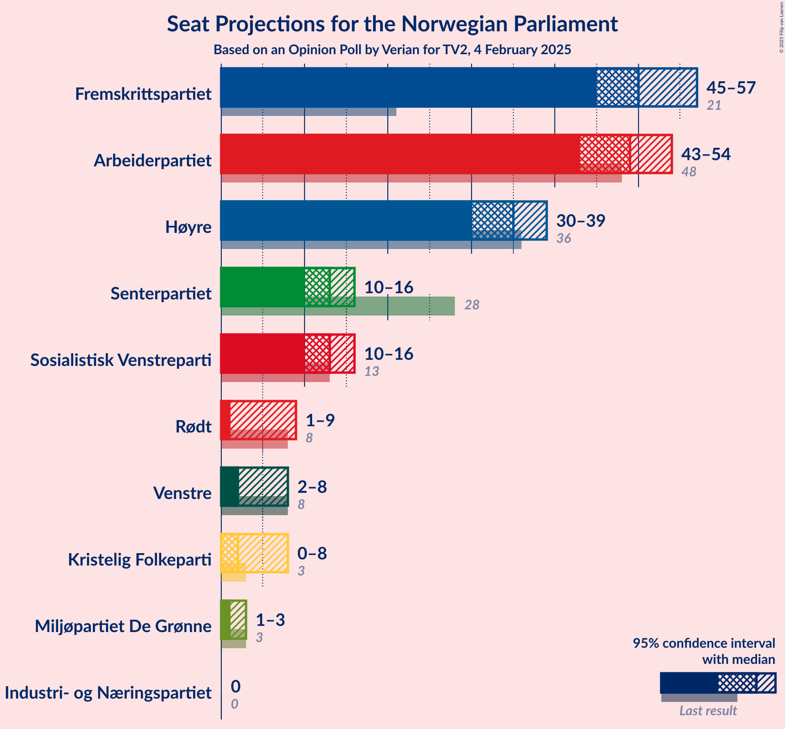

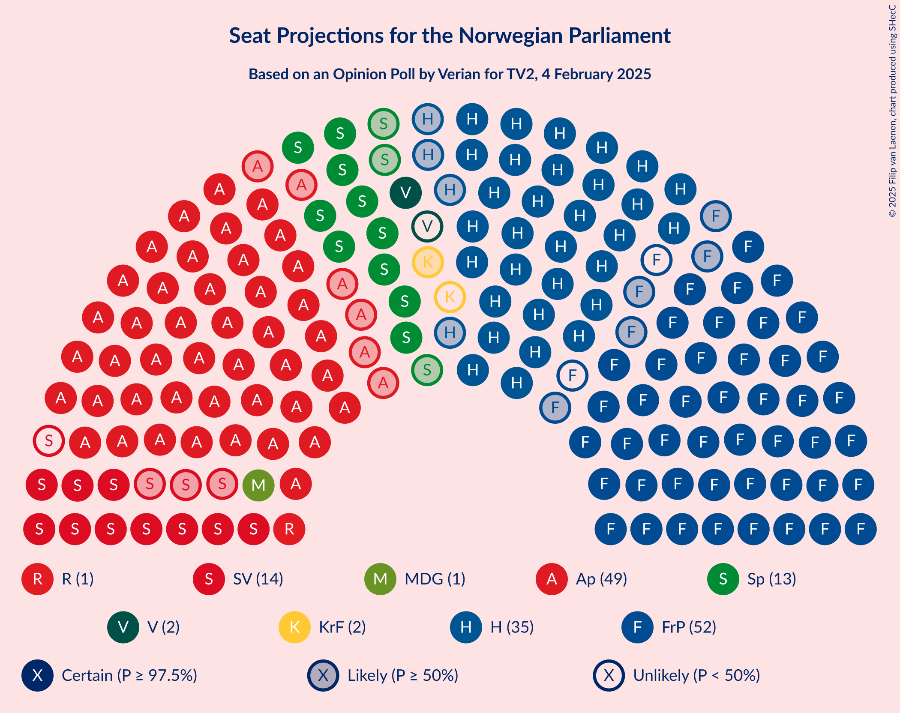

### Confidence Intervals

| Party | Last Result | Median | 80% Confidence Interval | 90% Confidence Interval | 95% Confidence Interval | 99% Confidence Interval |
|:-----:|:-----------:|:------:|:-----------------------:|:-----------------------:|:-----------------------:|:-----------------------:|
| <a href="#fremskrittspartiet">Fremskrittspartiet</a> | 21 | 50 | 47–54 |46–55 |45–57 |43–57 |
| <a href="#arbeiderpartiet">Arbeiderpartiet</a> | 48 | 49 | 46–52 |44–53 |43–54 |41–55 |
| <a href="#høyre">Høyre</a> | 36 | 35 | 31–37 |30–38 |30–39 |28–41 |
| <a href="#senterpartiet">Senterpartiet</a> | 28 | 13 | 11–14 |11–15 |10–16 |9–17 |
| <a href="#sosialistisk-venstreparti">Sosialistisk Venstreparti</a> | 13 | 13 | 11–15 |10–15 |10–16 |9–17 |
| <a href="#rødt">Rødt</a> | 8 | 1 | 1–8 |1–9 |1–9 |1–10 |
| <a href="#kristelig-folkeparti">Kristelig Folkeparti</a> | 3 | 2 | 2–3 |1–8 |0–8 |0–9 |
| <a href="#venstre">Venstre</a> | 8 | 2 | 2–3 |2–7 |2–8 |1–9 |
| <a href="#miljøpartiet-de-grønne">Miljøpartiet De Grønne</a> | 3 | 1 | 1–2 |1–3 |1–3 |0–3 |
| <a href="#industri--og-næringspartiet">Industri- og Næringspartiet</a> | 0 | 0 | 0 |0 |0 |0 |

### Fremskrittspartiet

*For a full overview of the results for this party, see the [Fremskrittspartiet](party-fremskrittspartiet.html) page.*

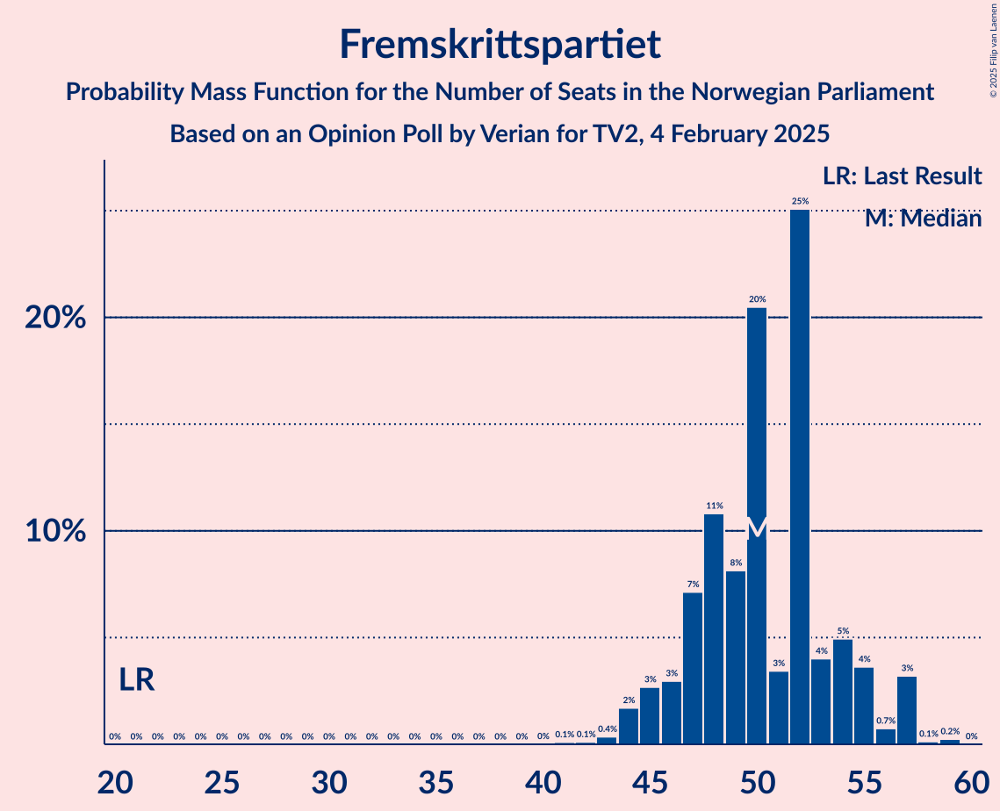

| Number of Seats | Probability | Accumulated | Special Marks |
|:---------------:|:-----------:|:-----------:|:-------------:|
| 21 | 0% | 100% | Last Result |
| 22 | 0% | 100% |  |
| 23 | 0% | 100% |  |
| 24 | 0% | 100% |  |
| 25 | 0% | 100% |  |
| 26 | 0% | 100% |  |
| 27 | 0% | 100% |  |
| 28 | 0% | 100% |  |
| 29 | 0% | 100% |  |
| 30 | 0% | 100% |  |
| 31 | 0% | 100% |  |
| 32 | 0% | 100% |  |
| 33 | 0% | 100% |  |
| 34 | 0% | 100% |  |
| 35 | 0% | 100% |  |
| 36 | 0% | 100% |  |
| 37 | 0% | 100% |  |
| 38 | 0% | 100% |  |
| 39 | 0% | 100% |  |
| 40 | 0% | 100% |  |
| 41 | 0.1% | 100% |  |
| 42 | 0.1% | 99.9% |  |
| 43 | 0.4% | 99.8% |  |
| 44 | 2% | 99.4% |  |
| 45 | 3% | 98% |  |
| 46 | 3% | 95% |  |
| 47 | 7% | 92% |  |
| 48 | 11% | 85% |  |
| 49 | 8% | 74% |  |
| 50 | 20% | 66% | Median |
| 51 | 3% | 45% |  |
| 52 | 25% | 42% |  |
| 53 | 4% | 17% |  |
| 54 | 5% | 13% |  |
| 55 | 4% | 8% |  |
| 56 | 0.7% | 4% |  |
| 57 | 3% | 4% |  |
| 58 | 0.1% | 0.4% |  |
| 59 | 0.2% | 0.3% |  |
| 60 | 0% | 0% |  |

### Arbeiderpartiet

*For a full overview of the results for this party, see the [Arbeiderpartiet](party-arbeiderpartiet.html) page.*

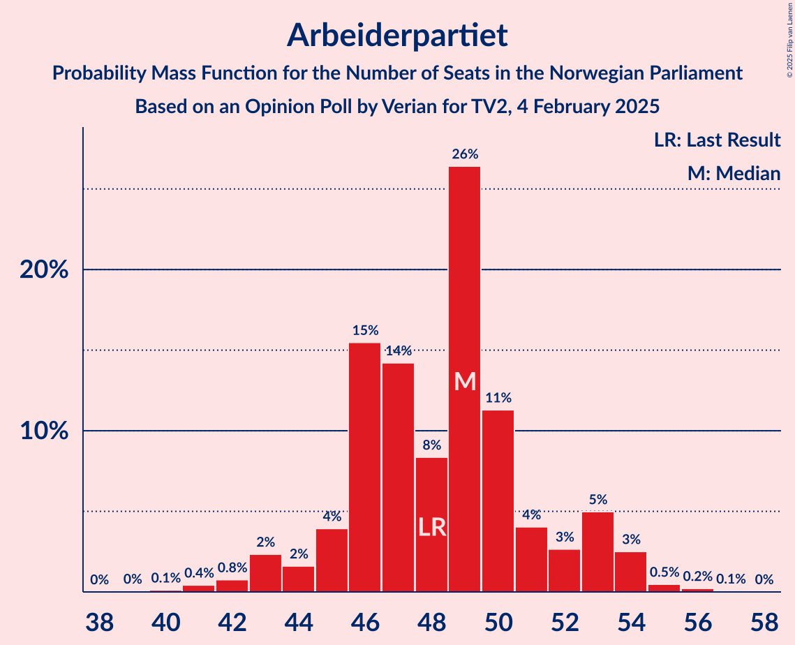

| Number of Seats | Probability | Accumulated | Special Marks |
|:---------------:|:-----------:|:-----------:|:-------------:|
| 39 | 0% | 100% |  |
| 40 | 0.1% | 99.9% |  |
| 41 | 0.4% | 99.8% |  |
| 42 | 0.8% | 99.4% |  |
| 43 | 2% | 98.6% |  |
| 44 | 2% | 96% |  |
| 45 | 4% | 95% |  |
| 46 | 15% | 91% |  |
| 47 | 14% | 75% |  |
| 48 | 8% | 61% | Last Result |
| 49 | 26% | 53% | Median |
| 50 | 11% | 26% |  |
| 51 | 4% | 15% |  |
| 52 | 3% | 11% |  |
| 53 | 5% | 8% |  |
| 54 | 3% | 3% |  |
| 55 | 0.5% | 0.8% |  |
| 56 | 0.2% | 0.3% |  |
| 57 | 0.1% | 0.1% |  |
| 58 | 0% | 0% |  |

### Høyre

*For a full overview of the results for this party, see the [Høyre](party-høyre.html) page.*

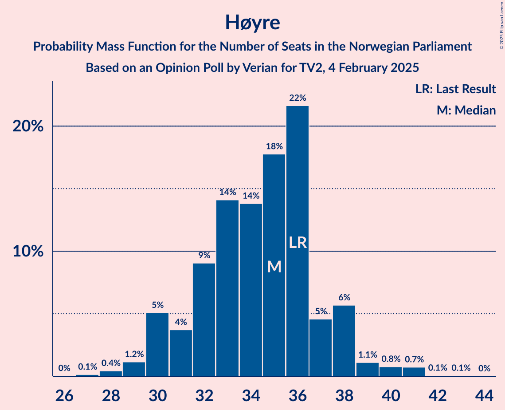

| Number of Seats | Probability | Accumulated | Special Marks |
|:---------------:|:-----------:|:-----------:|:-------------:|
| 26 | 0% | 100% |  |
| 27 | 0.1% | 99.9% |  |
| 28 | 0.4% | 99.8% |  |
| 29 | 1.2% | 99.3% |  |
| 30 | 5% | 98% |  |
| 31 | 4% | 93% |  |
| 32 | 9% | 89% |  |
| 33 | 14% | 80% |  |
| 34 | 14% | 66% |  |
| 35 | 18% | 52% | Median |
| 36 | 22% | 35% | Last Result |
| 37 | 5% | 13% |  |
| 38 | 6% | 8% |  |
| 39 | 1.1% | 3% |  |
| 40 | 0.8% | 2% |  |
| 41 | 0.7% | 0.9% |  |
| 42 | 0.1% | 0.1% |  |
| 43 | 0.1% | 0.1% |  |
| 44 | 0% | 0% |  |

### Senterpartiet

*For a full overview of the results for this party, see the [Senterpartiet](party-senterpartiet.html) page.*

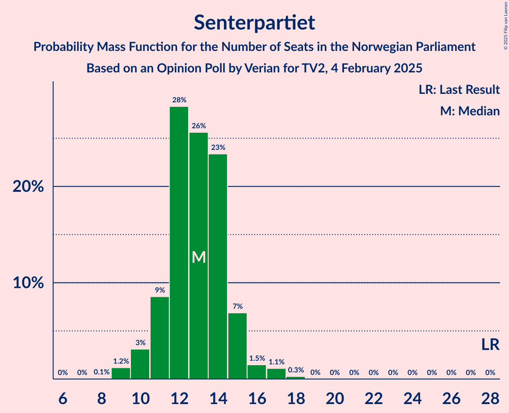

| Number of Seats | Probability | Accumulated | Special Marks |
|:---------------:|:-----------:|:-----------:|:-------------:|
| 8 | 0.1% | 100% |  |
| 9 | 1.2% | 99.9% |  |
| 10 | 3% | 98.7% |  |
| 11 | 9% | 96% |  |
| 12 | 28% | 87% |  |
| 13 | 26% | 59% | Median |
| 14 | 23% | 33% |  |
| 15 | 7% | 10% |  |
| 16 | 1.5% | 3% |  |
| 17 | 1.1% | 1.4% |  |
| 18 | 0.3% | 0.3% |  |
| 19 | 0% | 0% |  |
| 20 | 0% | 0% |  |
| 21 | 0% | 0% |  |
| 22 | 0% | 0% |  |
| 23 | 0% | 0% |  |
| 24 | 0% | 0% |  |
| 25 | 0% | 0% |  |
| 26 | 0% | 0% |  |
| 27 | 0% | 0% |  |
| 28 | 0% | 0% | Last Result |

### Sosialistisk Venstreparti

*For a full overview of the results for this party, see the [Sosialistisk Venstreparti](party-sosialistiskvenstreparti.html) page.*

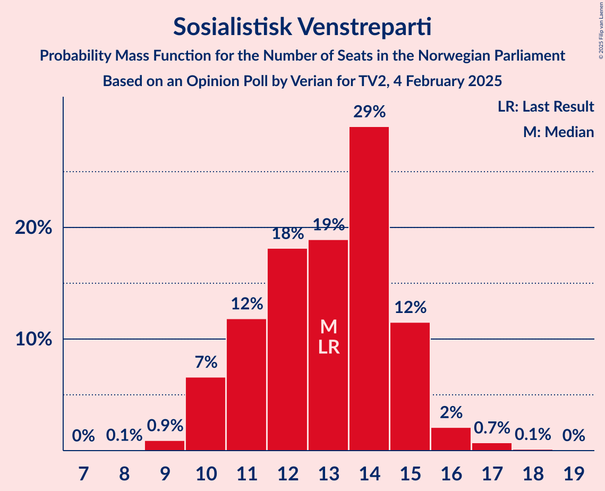

| Number of Seats | Probability | Accumulated | Special Marks |
|:---------------:|:-----------:|:-----------:|:-------------:|
| 8 | 0.1% | 100% |  |
| 9 | 0.9% | 99.9% |  |
| 10 | 7% | 99.0% |  |
| 11 | 12% | 92% |  |
| 12 | 18% | 81% |  |
| 13 | 19% | 62% | Last Result, Median |
| 14 | 29% | 44% |  |
| 15 | 12% | 14% |  |
| 16 | 2% | 3% |  |
| 17 | 0.7% | 0.9% |  |
| 18 | 0.1% | 0.2% |  |
| 19 | 0% | 0% |  |

### Rødt

*For a full overview of the results for this party, see the [Rødt](party-rødt.html) page.*

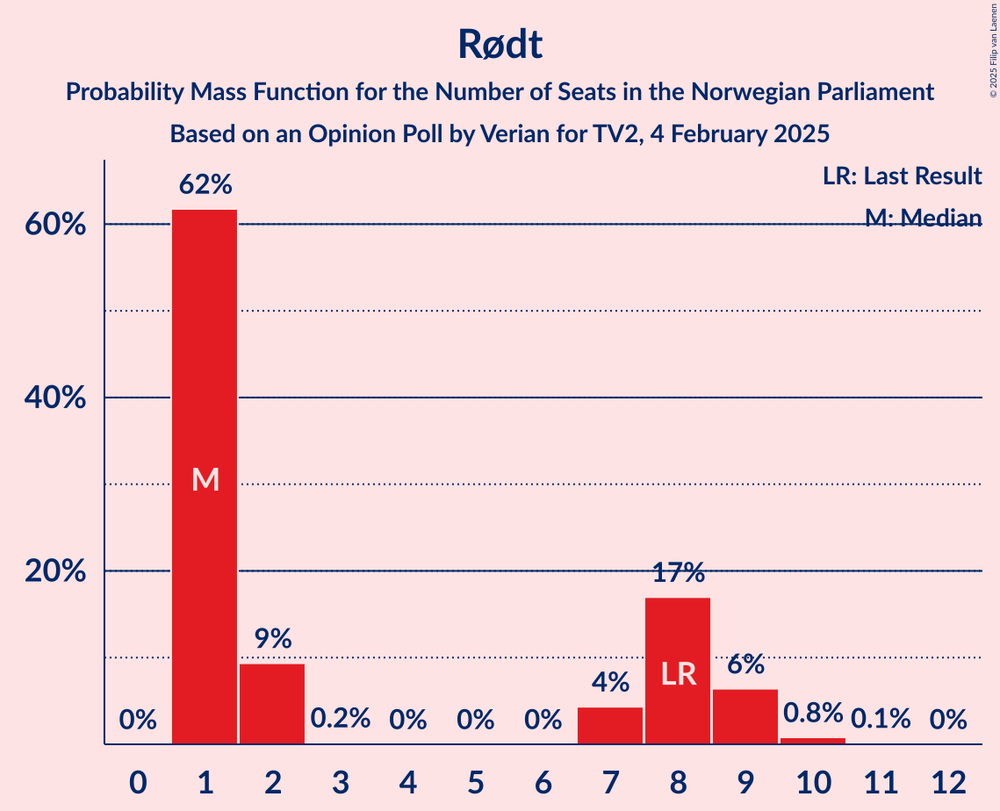

| Number of Seats | Probability | Accumulated | Special Marks |
|:---------------:|:-----------:|:-----------:|:-------------:|
| 1 | 62% | 100% | Median |
| 2 | 9% | 38% |  |
| 3 | 0.2% | 29% |  |
| 4 | 0% | 29% |  |
| 5 | 0% | 29% |  |
| 6 | 0% | 29% |  |
| 7 | 4% | 29% |  |
| 8 | 17% | 24% | Last Result |
| 9 | 6% | 7% |  |
| 10 | 0.8% | 1.0% |  |
| 11 | 0.1% | 0.2% |  |
| 12 | 0% | 0% |  |

### Kristelig Folkeparti

*For a full overview of the results for this party, see the [Kristelig Folkeparti](party-kristeligfolkeparti.html) page.*

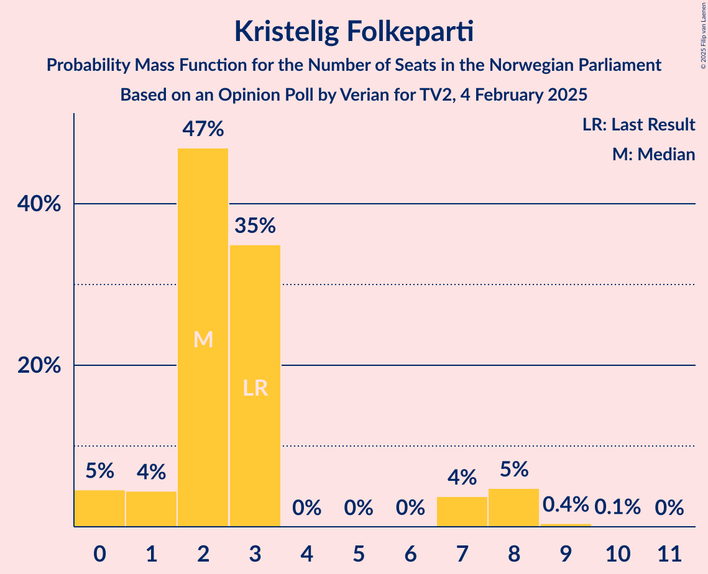

| Number of Seats | Probability | Accumulated | Special Marks |
|:---------------:|:-----------:|:-----------:|:-------------:|
| 0 | 5% | 100% |  |
| 1 | 4% | 95% |  |
| 2 | 47% | 91% | Median |
| 3 | 35% | 44% | Last Result |
| 4 | 0% | 9% |  |
| 5 | 0% | 9% |  |
| 6 | 0% | 9% |  |
| 7 | 4% | 9% |  |
| 8 | 5% | 5% |  |
| 9 | 0.4% | 0.5% |  |
| 10 | 0.1% | 0.1% |  |
| 11 | 0% | 0% |  |

### Venstre

*For a full overview of the results for this party, see the [Venstre](party-venstre.html) page.*

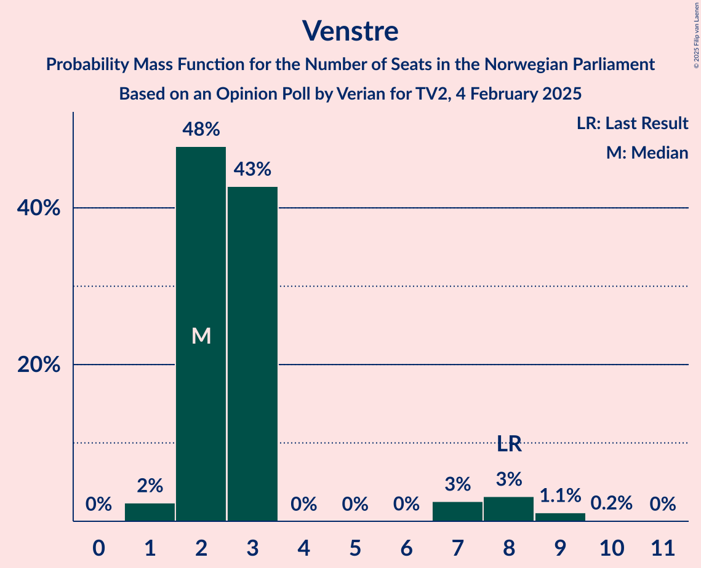

| Number of Seats | Probability | Accumulated | Special Marks |
|:---------------:|:-----------:|:-----------:|:-------------:|
| 1 | 2% | 100% |  |
| 2 | 48% | 98% | Median |
| 3 | 43% | 50% |  |
| 4 | 0% | 7% |  |
| 5 | 0% | 7% |  |
| 6 | 0% | 7% |  |
| 7 | 3% | 7% |  |
| 8 | 3% | 4% | Last Result |
| 9 | 1.1% | 1.3% |  |
| 10 | 0.2% | 0.2% |  |
| 11 | 0% | 0% |  |

### Miljøpartiet De Grønne

*For a full overview of the results for this party, see the [Miljøpartiet De Grønne](party-miljøpartietdegrønne.html) page.*

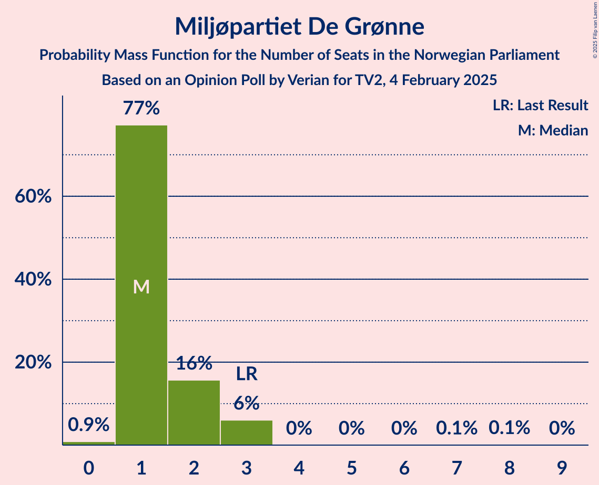

| Number of Seats | Probability | Accumulated | Special Marks |
|:---------------:|:-----------:|:-----------:|:-------------:|
| 0 | 0.9% | 100% |  |
| 1 | 77% | 99.1% | Median |
| 2 | 16% | 22% |  |
| 3 | 6% | 6% | Last Result |
| 4 | 0% | 0.2% |  |
| 5 | 0% | 0.2% |  |
| 6 | 0% | 0.2% |  |
| 7 | 0.1% | 0.2% |  |
| 8 | 0.1% | 0.2% |  |
| 9 | 0% | 0% |  |

### Industri- og Næringspartiet

*For a full overview of the results for this party, see the [Industri- og Næringspartiet](party-industri-ognæringspartiet.html) page.*

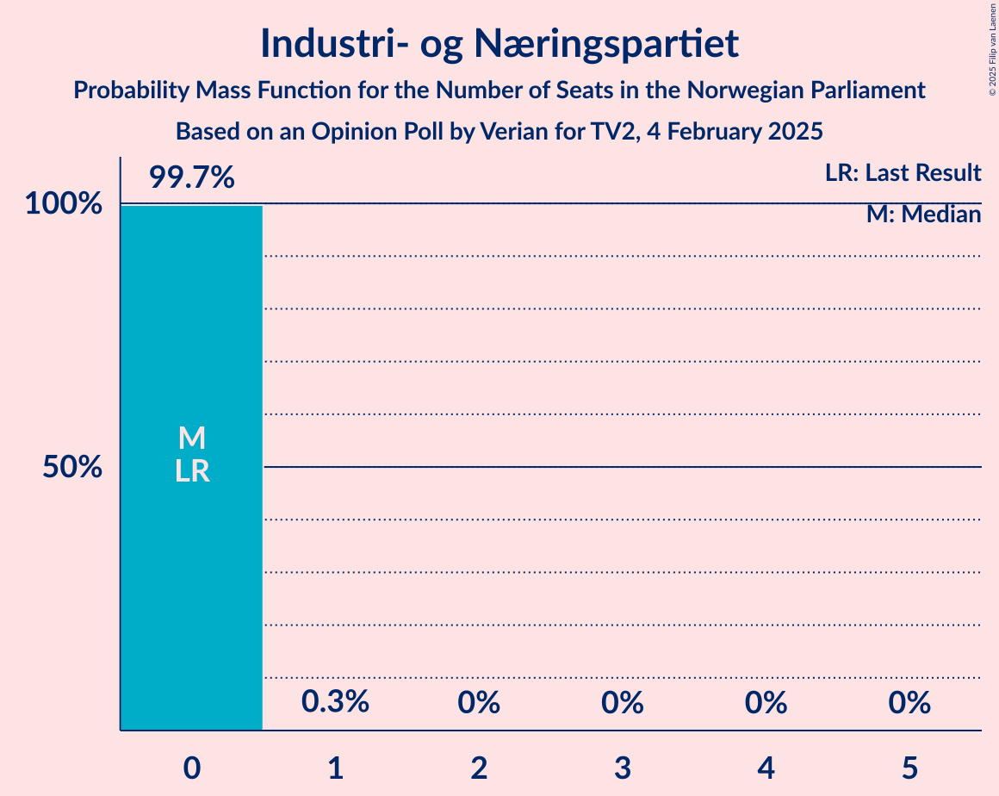

| Number of Seats | Probability | Accumulated | Special Marks |
|:---------------:|:-----------:|:-----------:|:-------------:|
| 0 | 99.7% | 100% | Last Result, Median |
| 1 | 0.3% | 0.3% |  |
| 2 | 0% | 0% |  |

## Coalitions

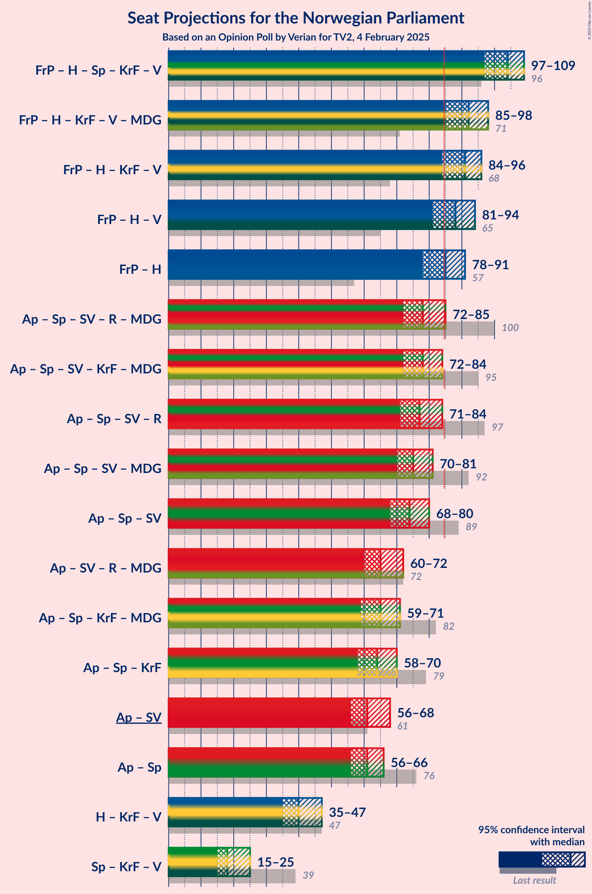

### Confidence Intervals

| Coalition | Last Result | Median | Majority? | 80% Confidence Interval | 90% Confidence Interval | 95% Confidence Interval | 99% Confidence Interval |
|:---------:|:-----------:|:------:|:---------:|:-----------------------:|:-----------------------:|:-----------------------:|:-----------------------:|
| Fremskrittspartiet – Høyre – Senterpartiet – Kristelig Folkeparti – Venstre | 96 | 104 | 100% | 99–108 | 97–108 | 97–109 | 94–111 |
| Fremskrittspartiet – Høyre – Kristelig Folkeparti – Venstre – Miljøpartiet De Grønne | 71 | 92 | 98% | 87–96 | 86–97 | 85–98 | 82–100 |
| Fremskrittspartiet – Høyre – Kristelig Folkeparti – Venstre | 68 | 91 | 96% | 85–94 | 85–95 | 84–96 | 81–98 |
| Fremskrittspartiet – Høyre – Venstre | 65 | 88 | 79% | 83–91 | 82–93 | 81–94 | 78–96 |
| Fremskrittspartiet – Høyre | 57 | 85 | 60% | 80–89 | 79–90 | 78–91 | 75–93 |
| Arbeiderpartiet – Senterpartiet – Sosialistisk Venstreparti – Rødt – Miljøpartiet De Grønne | 100 | 78 | 4% | 75–84 | 74–84 | 72–85 | 70–88 |
| Arbeiderpartiet – Senterpartiet – Sosialistisk Venstreparti – Kristelig Folkeparti – Miljøpartiet De Grønne | 95 | 78 | 2% | 74–82 | 73–84 | 72–84 | 70–87 |
| Arbeiderpartiet – Senterpartiet – Sosialistisk Venstreparti – Rødt | 97 | 77 | 2% | 73–82 | 72–83 | 71–84 | 69–87 |
| Arbeiderpartiet – Senterpartiet – Sosialistisk Venstreparti – Miljøpartiet De Grønne | 92 | 75 | 0.2% | 71–80 | 70–81 | 70–81 | 68–83 |
| Arbeiderpartiet – Senterpartiet – Sosialistisk Venstreparti | 89 | 74 | 0% | 70–78 | 69–80 | 68–80 | 66–81 |
| Arbeiderpartiet – Sosialistisk Venstreparti – Rødt – Miljøpartiet De Grønne | 72 | 65 | 0% | 61–70 | 61–72 | 60–72 | 57–75 |
| Arbeiderpartiet – Senterpartiet – Kristelig Folkeparti – Miljøpartiet De Grønne | 82 | 65 | 0% | 62–70 | 61–70 | 59–71 | 58–74 |
| Arbeiderpartiet – Senterpartiet – Kristelig Folkeparti | 79 | 64 | 0% | 61–68 | 60–69 | 58–70 | 56–72 |
| Arbeiderpartiet – Sosialistisk Venstreparti | 61 | 61 | 0% | 58–65 | 57–67 | 56–68 | 54–68 |
| Arbeiderpartiet – Senterpartiet | 76 | 61 | 0% | 58–65 | 57–66 | 56–66 | 54–69 |
| Høyre – Kristelig Folkeparti – Venstre | 47 | 40 | 0% | 37–43 | 35–45 | 35–47 | 33–49 |
| Senterpartiet – Kristelig Folkeparti – Venstre | 39 | 18 | 0% | 16–22 | 15–24 | 15–25 | 14–28 |

### Fremskrittspartiet – Høyre – Senterpartiet – Kristelig Folkeparti – Venstre

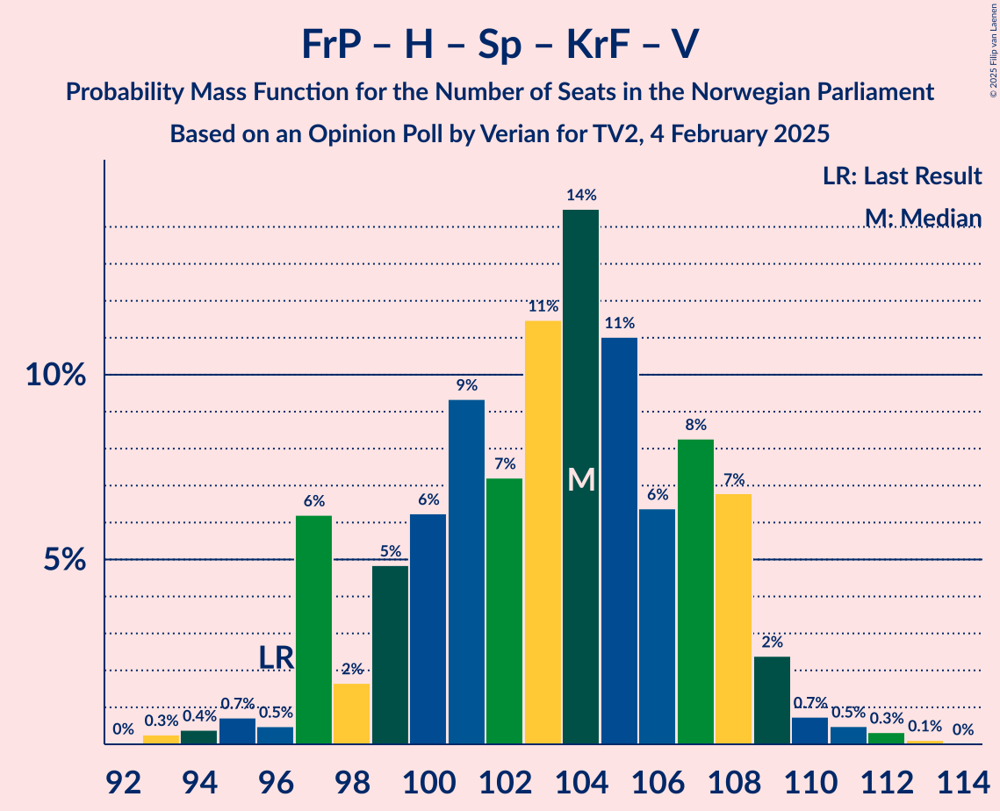

| Number of Seats | Probability | Accumulated | Special Marks |
|:---------------:|:-----------:|:-----------:|:-------------:|
| 92 | 0% | 100% |  |
| 93 | 0.3% | 99.9% |  |
| 94 | 0.4% | 99.7% |  |
| 95 | 0.7% | 99.3% |  |
| 96 | 0.5% | 98.6% | Last Result |
| 97 | 6% | 98% |  |
| 98 | 2% | 92% |  |
| 99 | 5% | 90% |  |
| 100 | 6% | 85% |  |
| 101 | 9% | 79% |  |
| 102 | 7% | 70% | Median |
| 103 | 11% | 63% |  |
| 104 | 14% | 51% |  |
| 105 | 11% | 37% |  |
| 106 | 6% | 26% |  |
| 107 | 8% | 19% |  |
| 108 | 7% | 11% |  |
| 109 | 2% | 4% |  |
| 110 | 0.7% | 2% |  |
| 111 | 0.5% | 1.0% |  |
| 112 | 0.3% | 0.5% |  |
| 113 | 0.1% | 0.2% |  |
| 114 | 0% | 0% |  |

### Fremskrittspartiet – Høyre – Kristelig Folkeparti – Venstre – Miljøpartiet De Grønne

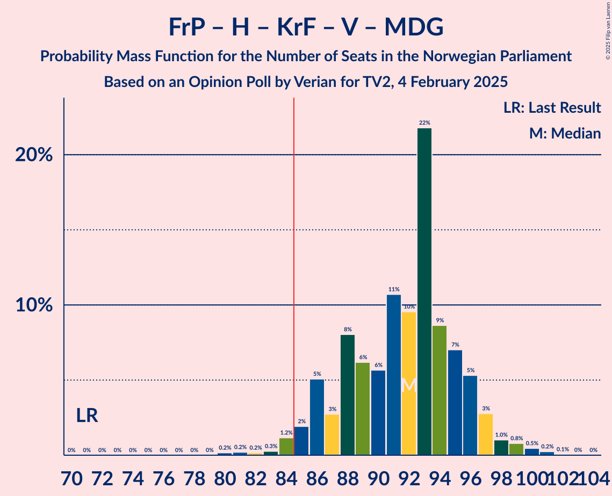

| Number of Seats | Probability | Accumulated | Special Marks |
|:---------------:|:-----------:|:-----------:|:-------------:|
| 71 | 0% | 100% | Last Result |
| 72 | 0% | 100% |  |
| 73 | 0% | 100% |  |
| 74 | 0% | 100% |  |
| 75 | 0% | 100% |  |
| 76 | 0% | 100% |  |
| 77 | 0% | 100% |  |
| 78 | 0% | 100% |  |
| 79 | 0% | 100% |  |
| 80 | 0.2% | 100% |  |
| 81 | 0.2% | 99.8% |  |
| 82 | 0.2% | 99.6% |  |
| 83 | 0.3% | 99.5% |  |
| 84 | 1.2% | 99.2% |  |
| 85 | 2% | 98% | Majority |
| 86 | 5% | 96% |  |
| 87 | 3% | 91% |  |
| 88 | 8% | 88% |  |
| 89 | 6% | 80% |  |
| 90 | 6% | 74% | Median |
| 91 | 11% | 68% |  |
| 92 | 10% | 58% |  |
| 93 | 22% | 48% |  |
| 94 | 9% | 26% |  |
| 95 | 7% | 18% |  |
| 96 | 5% | 11% |  |
| 97 | 3% | 5% |  |
| 98 | 1.0% | 3% |  |
| 99 | 0.8% | 2% |  |
| 100 | 0.5% | 0.8% |  |
| 101 | 0.2% | 0.3% |  |
| 102 | 0.1% | 0.1% |  |
| 103 | 0% | 0% |  |

### Fremskrittspartiet – Høyre – Kristelig Folkeparti – Venstre

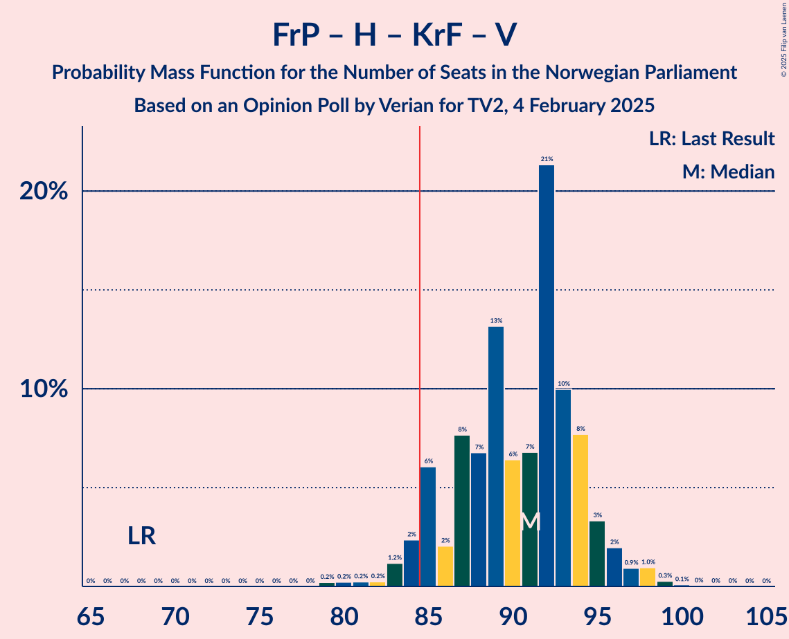

| Number of Seats | Probability | Accumulated | Special Marks |
|:---------------:|:-----------:|:-----------:|:-------------:|
| 68 | 0% | 100% | Last Result |
| 69 | 0% | 100% |  |
| 70 | 0% | 100% |  |
| 71 | 0% | 100% |  |
| 72 | 0% | 100% |  |
| 73 | 0% | 100% |  |
| 74 | 0% | 100% |  |
| 75 | 0% | 100% |  |
| 76 | 0% | 100% |  |
| 77 | 0% | 100% |  |
| 78 | 0% | 100% |  |
| 79 | 0.2% | 100% |  |
| 80 | 0.2% | 99.8% |  |
| 81 | 0.2% | 99.6% |  |
| 82 | 0.2% | 99.3% |  |
| 83 | 1.2% | 99.1% |  |
| 84 | 2% | 98% |  |
| 85 | 6% | 96% | Majority |
| 86 | 2% | 89% |  |
| 87 | 8% | 87% |  |
| 88 | 7% | 80% |  |
| 89 | 13% | 73% | Median |
| 90 | 6% | 60% |  |
| 91 | 7% | 53% |  |
| 92 | 21% | 47% |  |
| 93 | 10% | 25% |  |
| 94 | 8% | 15% |  |
| 95 | 3% | 8% |  |
| 96 | 2% | 4% |  |
| 97 | 0.9% | 2% |  |
| 98 | 1.0% | 1.4% |  |
| 99 | 0.3% | 0.4% |  |
| 100 | 0.1% | 0.1% |  |
| 101 | 0% | 0.1% |  |
| 102 | 0% | 0% |  |

### Fremskrittspartiet – Høyre – Venstre

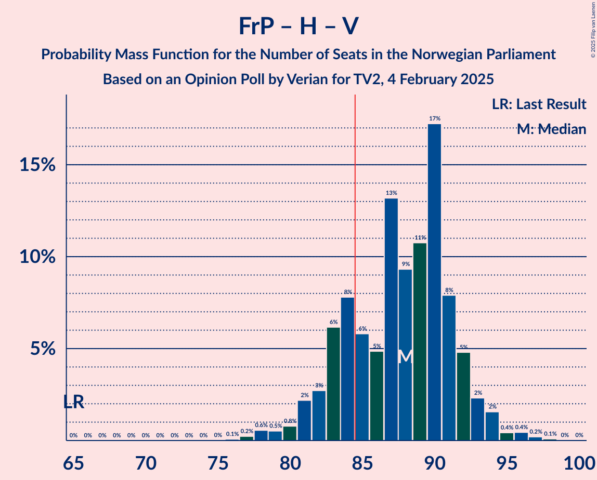

| Number of Seats | Probability | Accumulated | Special Marks |
|:---------------:|:-----------:|:-----------:|:-------------:|
| 65 | 0% | 100% | Last Result |
| 66 | 0% | 100% |  |
| 67 | 0% | 100% |  |
| 68 | 0% | 100% |  |
| 69 | 0% | 100% |  |
| 70 | 0% | 100% |  |
| 71 | 0% | 100% |  |
| 72 | 0% | 100% |  |
| 73 | 0% | 100% |  |
| 74 | 0% | 100% |  |
| 75 | 0% | 100% |  |
| 76 | 0.1% | 100% |  |
| 77 | 0.2% | 99.9% |  |
| 78 | 0.6% | 99.7% |  |
| 79 | 0.5% | 99.1% |  |
| 80 | 0.8% | 98.6% |  |
| 81 | 2% | 98% |  |
| 82 | 3% | 96% |  |
| 83 | 6% | 93% |  |
| 84 | 8% | 87% |  |
| 85 | 6% | 79% | Majority |
| 86 | 5% | 73% |  |
| 87 | 13% | 68% | Median |
| 88 | 9% | 55% |  |
| 89 | 11% | 46% |  |
| 90 | 17% | 35% |  |
| 91 | 8% | 18% |  |
| 92 | 5% | 10% |  |
| 93 | 2% | 5% |  |
| 94 | 2% | 3% |  |
| 95 | 0.4% | 1.2% |  |
| 96 | 0.4% | 0.8% |  |
| 97 | 0.2% | 0.3% |  |
| 98 | 0.1% | 0.1% |  |
| 99 | 0% | 0% |  |

### Fremskrittspartiet – Høyre

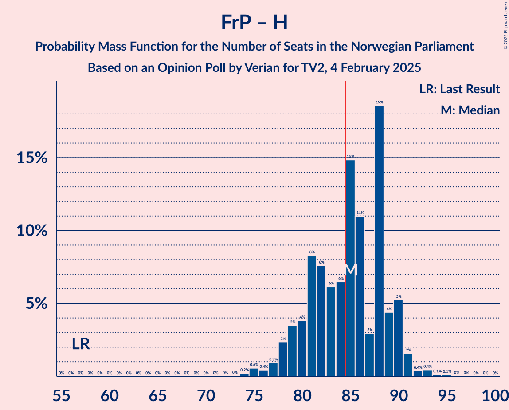

| Number of Seats | Probability | Accumulated | Special Marks |
|:---------------:|:-----------:|:-----------:|:-------------:|
| 57 | 0% | 100% | Last Result |
| 58 | 0% | 100% |  |
| 59 | 0% | 100% |  |
| 60 | 0% | 100% |  |
| 61 | 0% | 100% |  |
| 62 | 0% | 100% |  |
| 63 | 0% | 100% |  |
| 64 | 0% | 100% |  |
| 65 | 0% | 100% |  |
| 66 | 0% | 100% |  |
| 67 | 0% | 100% |  |
| 68 | 0% | 100% |  |
| 69 | 0% | 100% |  |
| 70 | 0% | 100% |  |
| 71 | 0% | 100% |  |
| 72 | 0% | 100% |  |
| 73 | 0% | 100% |  |
| 74 | 0.2% | 100% |  |
| 75 | 0.6% | 99.7% |  |
| 76 | 0.4% | 99.2% |  |
| 77 | 0.9% | 98.8% |  |
| 78 | 2% | 98% |  |
| 79 | 3% | 95% |  |
| 80 | 4% | 92% |  |
| 81 | 8% | 88% |  |
| 82 | 8% | 80% |  |
| 83 | 6% | 72% |  |
| 84 | 6% | 66% |  |
| 85 | 15% | 60% | Median, Majority |
| 86 | 11% | 45% |  |
| 87 | 3% | 34% |  |
| 88 | 19% | 31% |  |
| 89 | 4% | 12% |  |
| 90 | 5% | 8% |  |
| 91 | 2% | 3% |  |
| 92 | 0.4% | 1.1% |  |
| 93 | 0.4% | 0.7% |  |
| 94 | 0.1% | 0.2% |  |
| 95 | 0.1% | 0.1% |  |
| 96 | 0% | 0% |  |

### Arbeiderpartiet – Senterpartiet – Sosialistisk Venstreparti – Rødt – Miljøpartiet De Grønne

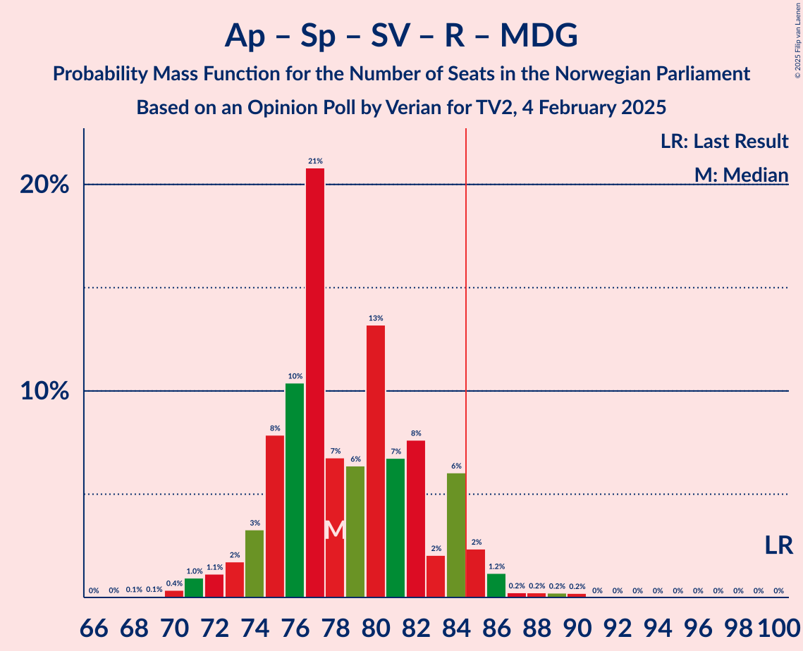

| Number of Seats | Probability | Accumulated | Special Marks |
|:---------------:|:-----------:|:-----------:|:-------------:|
| 68 | 0.1% | 100% |  |
| 69 | 0.1% | 99.9% |  |
| 70 | 0.4% | 99.8% |  |
| 71 | 1.0% | 99.5% |  |
| 72 | 1.1% | 98.5% |  |
| 73 | 2% | 97% |  |
| 74 | 3% | 96% |  |
| 75 | 8% | 92% |  |
| 76 | 10% | 84% |  |
| 77 | 21% | 74% | Median |
| 78 | 7% | 53% |  |
| 79 | 6% | 47% |  |
| 80 | 13% | 40% |  |
| 81 | 7% | 27% |  |
| 82 | 8% | 20% |  |
| 83 | 2% | 13% |  |
| 84 | 6% | 11% |  |
| 85 | 2% | 4% | Majority |
| 86 | 1.2% | 2% |  |
| 87 | 0.2% | 0.9% |  |
| 88 | 0.2% | 0.7% |  |
| 89 | 0.2% | 0.4% |  |
| 90 | 0.2% | 0.2% |  |
| 91 | 0% | 0% |  |
| 92 | 0% | 0% |  |
| 93 | 0% | 0% |  |
| 94 | 0% | 0% |  |
| 95 | 0% | 0% |  |
| 96 | 0% | 0% |  |
| 97 | 0% | 0% |  |
| 98 | 0% | 0% |  |
| 99 | 0% | 0% |  |
| 100 | 0% | 0% | Last Result |

### Arbeiderpartiet – Senterpartiet – Sosialistisk Venstreparti – Kristelig Folkeparti – Miljøpartiet De Grønne

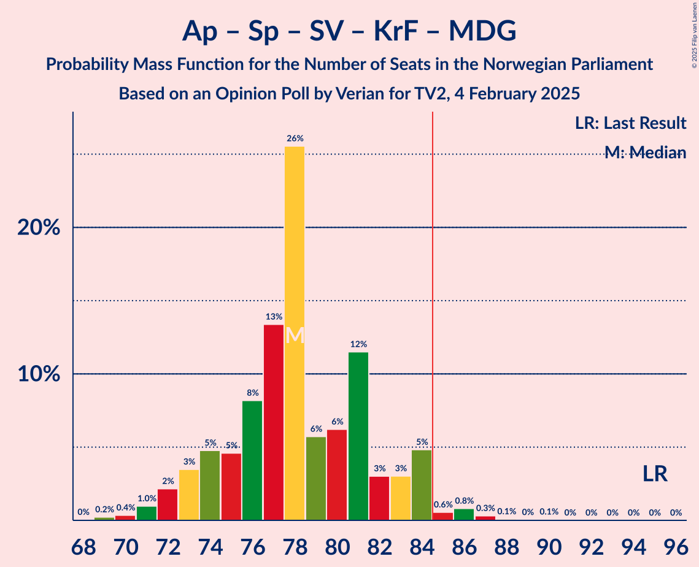

| Number of Seats | Probability | Accumulated | Special Marks |
|:---------------:|:-----------:|:-----------:|:-------------:|
| 68 | 0% | 100% |  |
| 69 | 0.2% | 99.9% |  |
| 70 | 0.4% | 99.7% |  |
| 71 | 1.0% | 99.3% |  |
| 72 | 2% | 98% |  |
| 73 | 3% | 96% |  |
| 74 | 5% | 93% |  |
| 75 | 5% | 88% |  |
| 76 | 8% | 83% |  |
| 77 | 13% | 75% |  |
| 78 | 26% | 62% | Median |
| 79 | 6% | 36% |  |
| 80 | 6% | 30% |  |
| 81 | 12% | 24% |  |
| 82 | 3% | 13% |  |
| 83 | 3% | 10% |  |
| 84 | 5% | 7% |  |
| 85 | 0.6% | 2% | Majority |
| 86 | 0.8% | 1.3% |  |
| 87 | 0.3% | 0.5% |  |
| 88 | 0.1% | 0.2% |  |
| 89 | 0% | 0.1% |  |
| 90 | 0.1% | 0.1% |  |
| 91 | 0% | 0% |  |
| 92 | 0% | 0% |  |
| 93 | 0% | 0% |  |
| 94 | 0% | 0% |  |
| 95 | 0% | 0% | Last Result |

### Arbeiderpartiet – Senterpartiet – Sosialistisk Venstreparti – Rødt

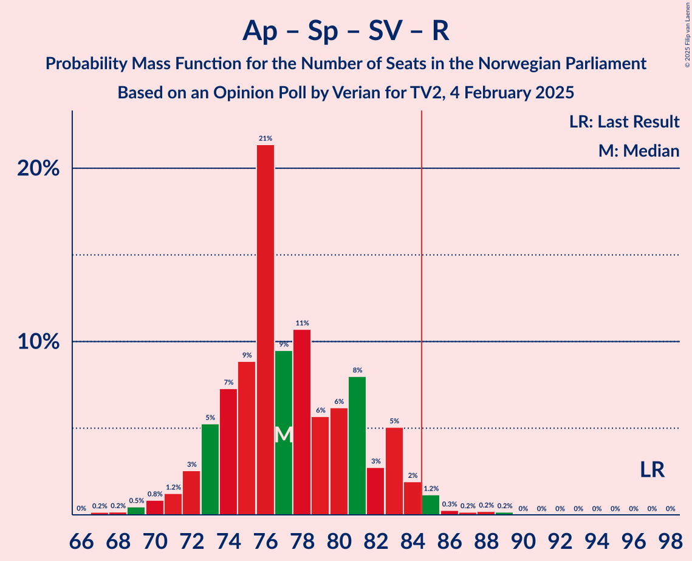

| Number of Seats | Probability | Accumulated | Special Marks |
|:---------------:|:-----------:|:-----------:|:-------------:|
| 67 | 0.2% | 100% |  |
| 68 | 0.2% | 99.8% |  |
| 69 | 0.5% | 99.6% |  |
| 70 | 0.8% | 99.2% |  |
| 71 | 1.2% | 98% |  |
| 72 | 3% | 97% |  |
| 73 | 5% | 95% |  |
| 74 | 7% | 89% |  |
| 75 | 9% | 82% |  |
| 76 | 21% | 73% | Median |
| 77 | 9% | 52% |  |
| 78 | 11% | 42% |  |
| 79 | 6% | 32% |  |
| 80 | 6% | 26% |  |
| 81 | 8% | 20% |  |
| 82 | 3% | 12% |  |
| 83 | 5% | 9% |  |
| 84 | 2% | 4% |  |
| 85 | 1.2% | 2% | Majority |
| 86 | 0.3% | 0.8% |  |
| 87 | 0.2% | 0.5% |  |
| 88 | 0.2% | 0.4% |  |
| 89 | 0.2% | 0.2% |  |
| 90 | 0% | 0% |  |
| 91 | 0% | 0% |  |
| 92 | 0% | 0% |  |
| 93 | 0% | 0% |  |
| 94 | 0% | 0% |  |
| 95 | 0% | 0% |  |
| 96 | 0% | 0% |  |
| 97 | 0% | 0% | Last Result |

### Arbeiderpartiet – Senterpartiet – Sosialistisk Venstreparti – Miljøpartiet De Grønne

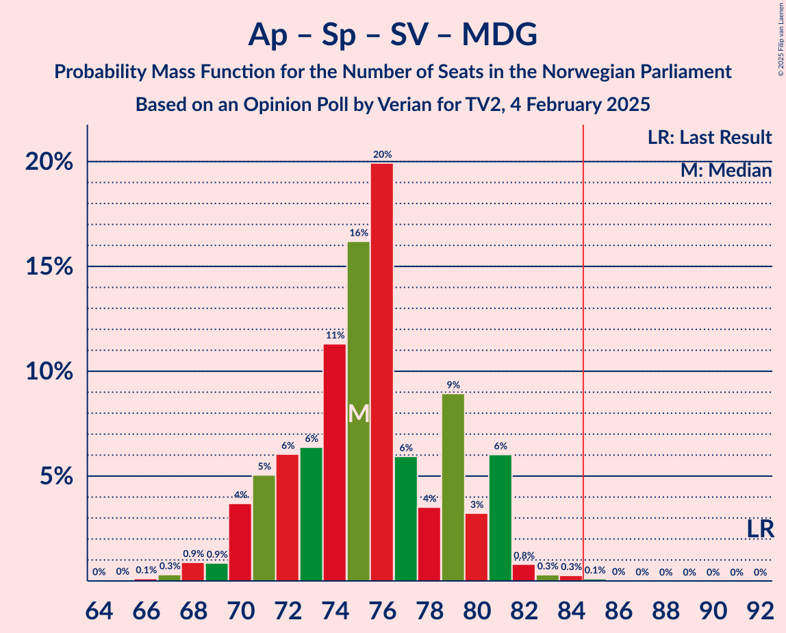

| Number of Seats | Probability | Accumulated | Special Marks |
|:---------------:|:-----------:|:-----------:|:-------------:|
| 65 | 0% | 100% |  |
| 66 | 0.1% | 99.9% |  |
| 67 | 0.3% | 99.8% |  |
| 68 | 0.9% | 99.5% |  |
| 69 | 0.9% | 98.6% |  |
| 70 | 4% | 98% |  |
| 71 | 5% | 94% |  |
| 72 | 6% | 89% |  |
| 73 | 6% | 83% |  |
| 74 | 11% | 77% |  |
| 75 | 16% | 65% |  |
| 76 | 20% | 49% | Median |
| 77 | 6% | 29% |  |
| 78 | 4% | 23% |  |
| 79 | 9% | 20% |  |
| 80 | 3% | 11% |  |
| 81 | 6% | 8% |  |
| 82 | 0.8% | 2% |  |
| 83 | 0.3% | 0.7% |  |
| 84 | 0.3% | 0.4% |  |
| 85 | 0.1% | 0.2% | Majority |
| 86 | 0% | 0.1% |  |
| 87 | 0% | 0% |  |
| 88 | 0% | 0% |  |
| 89 | 0% | 0% |  |
| 90 | 0% | 0% |  |
| 91 | 0% | 0% |  |
| 92 | 0% | 0% | Last Result |

### Arbeiderpartiet – Senterpartiet – Sosialistisk Venstreparti

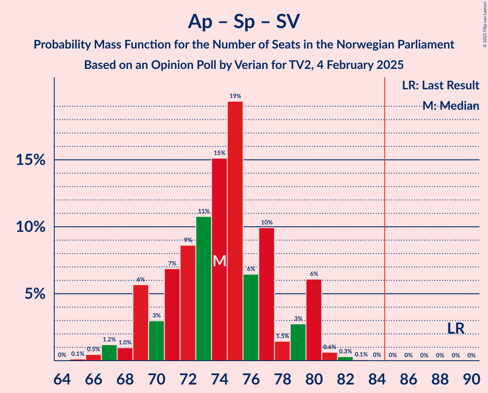

| Number of Seats | Probability | Accumulated | Special Marks |
|:---------------:|:-----------:|:-----------:|:-------------:|
| 64 | 0% | 100% |  |
| 65 | 0.1% | 99.9% |  |
| 66 | 0.5% | 99.8% |  |
| 67 | 1.2% | 99.3% |  |
| 68 | 1.0% | 98% |  |
| 69 | 6% | 97% |  |
| 70 | 3% | 91% |  |
| 71 | 7% | 89% |  |
| 72 | 9% | 82% |  |
| 73 | 11% | 73% |  |
| 74 | 15% | 62% |  |
| 75 | 19% | 47% | Median |
| 76 | 6% | 28% |  |
| 77 | 10% | 21% |  |
| 78 | 1.5% | 11% |  |
| 79 | 3% | 10% |  |
| 80 | 6% | 7% |  |
| 81 | 0.6% | 1.1% |  |
| 82 | 0.3% | 0.5% |  |
| 83 | 0.1% | 0.2% |  |
| 84 | 0% | 0.1% |  |
| 85 | 0% | 0% | Majority |
| 86 | 0% | 0% |  |
| 87 | 0% | 0% |  |
| 88 | 0% | 0% |  |
| 89 | 0% | 0% | Last Result |

### Arbeiderpartiet – Sosialistisk Venstreparti – Rødt – Miljøpartiet De Grønne

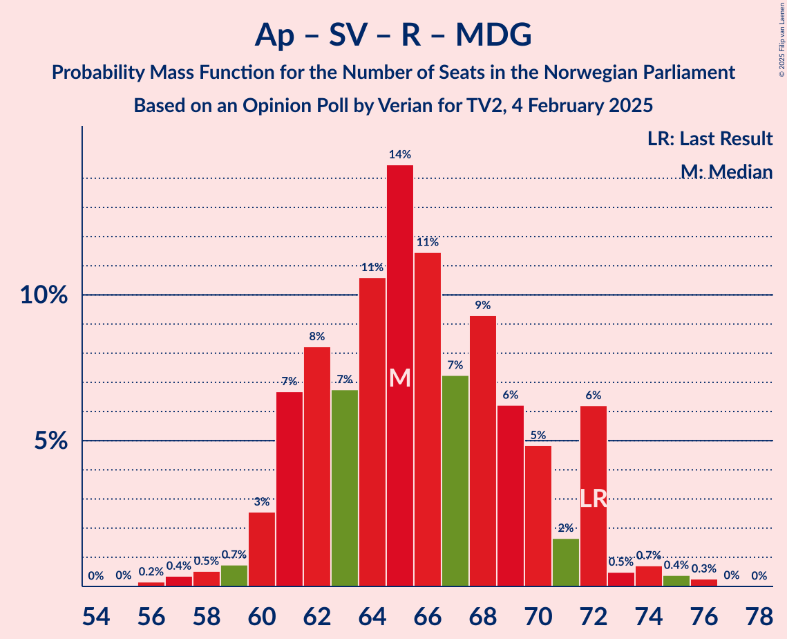

| Number of Seats | Probability | Accumulated | Special Marks |
|:---------------:|:-----------:|:-----------:|:-------------:|
| 55 | 0% | 100% |  |
| 56 | 0.2% | 99.9% |  |
| 57 | 0.4% | 99.8% |  |
| 58 | 0.5% | 99.4% |  |
| 59 | 0.7% | 98.9% |  |
| 60 | 3% | 98% |  |
| 61 | 7% | 96% |  |
| 62 | 8% | 89% |  |
| 63 | 7% | 81% |  |
| 64 | 11% | 74% | Median |
| 65 | 14% | 63% |  |
| 66 | 11% | 49% |  |
| 67 | 7% | 37% |  |
| 68 | 9% | 30% |  |
| 69 | 6% | 21% |  |
| 70 | 5% | 15% |  |
| 71 | 2% | 10% |  |
| 72 | 6% | 8% | Last Result |
| 73 | 0.5% | 2% |  |
| 74 | 0.7% | 1.4% |  |
| 75 | 0.4% | 0.7% |  |
| 76 | 0.3% | 0.3% |  |
| 77 | 0% | 0.1% |  |
| 78 | 0% | 0% |  |

### Arbeiderpartiet – Senterpartiet – Kristelig Folkeparti – Miljøpartiet De Grønne

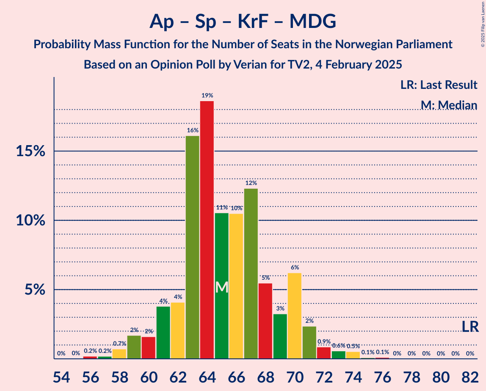

| Number of Seats | Probability | Accumulated | Special Marks |
|:---------------:|:-----------:|:-----------:|:-------------:|
| 56 | 0.2% | 100% |  |
| 57 | 0.2% | 99.8% |  |
| 58 | 0.7% | 99.6% |  |
| 59 | 2% | 98.8% |  |
| 60 | 2% | 97% |  |
| 61 | 4% | 96% |  |
| 62 | 4% | 92% |  |
| 63 | 16% | 88% |  |
| 64 | 19% | 72% |  |
| 65 | 11% | 53% | Median |
| 66 | 10% | 42% |  |
| 67 | 12% | 32% |  |
| 68 | 5% | 20% |  |
| 69 | 3% | 14% |  |
| 70 | 6% | 11% |  |
| 71 | 2% | 5% |  |
| 72 | 0.9% | 2% |  |
| 73 | 0.6% | 1.3% |  |
| 74 | 0.5% | 0.8% |  |
| 75 | 0.1% | 0.2% |  |
| 76 | 0.1% | 0.1% |  |
| 77 | 0% | 0% |  |
| 78 | 0% | 0% |  |
| 79 | 0% | 0% |  |
| 80 | 0% | 0% |  |
| 81 | 0% | 0% |  |
| 82 | 0% | 0% | Last Result |

### Arbeiderpartiet – Senterpartiet – Kristelig Folkeparti

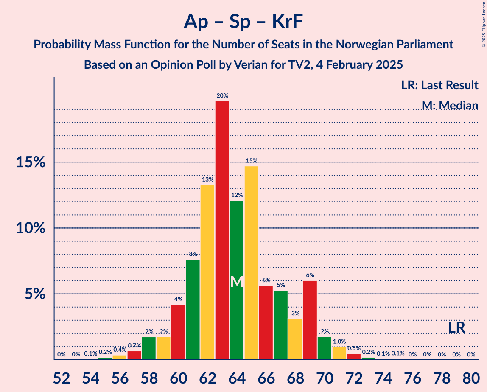

| Number of Seats | Probability | Accumulated | Special Marks |
|:---------------:|:-----------:|:-----------:|:-------------:|
| 54 | 0.1% | 100% |  |
| 55 | 0.2% | 99.9% |  |
| 56 | 0.4% | 99.7% |  |
| 57 | 0.7% | 99.4% |  |
| 58 | 2% | 98.7% |  |
| 59 | 2% | 97% |  |
| 60 | 4% | 95% |  |
| 61 | 8% | 91% |  |
| 62 | 13% | 83% |  |
| 63 | 20% | 70% |  |
| 64 | 12% | 50% | Median |
| 65 | 15% | 38% |  |
| 66 | 6% | 24% |  |
| 67 | 5% | 18% |  |
| 68 | 3% | 13% |  |
| 69 | 6% | 10% |  |
| 70 | 2% | 4% |  |
| 71 | 1.0% | 2% |  |
| 72 | 0.5% | 0.9% |  |
| 73 | 0.2% | 0.4% |  |
| 74 | 0.1% | 0.2% |  |
| 75 | 0.1% | 0.1% |  |
| 76 | 0% | 0% |  |
| 77 | 0% | 0% |  |
| 78 | 0% | 0% |  |
| 79 | 0% | 0% | Last Result |

### Arbeiderpartiet – Sosialistisk Venstreparti

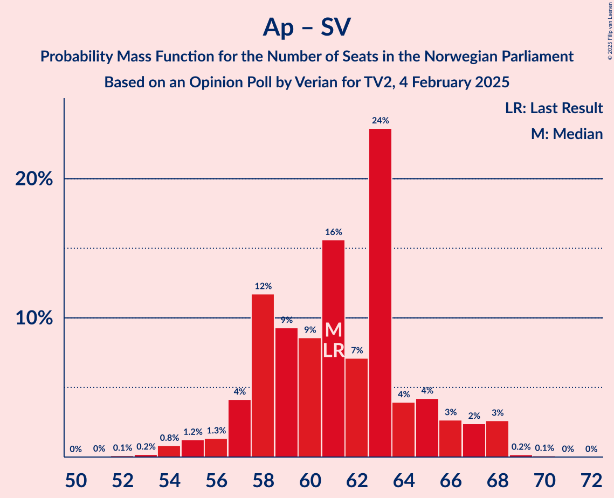

| Number of Seats | Probability | Accumulated | Special Marks |
|:---------------:|:-----------:|:-----------:|:-------------:|
| 51 | 0% | 100% |  |
| 52 | 0.1% | 99.9% |  |
| 53 | 0.2% | 99.8% |  |
| 54 | 0.8% | 99.6% |  |
| 55 | 1.2% | 98.8% |  |
| 56 | 1.3% | 98% |  |
| 57 | 4% | 96% |  |
| 58 | 12% | 92% |  |
| 59 | 9% | 80% |  |
| 60 | 9% | 71% |  |
| 61 | 16% | 63% | Last Result |
| 62 | 7% | 47% | Median |
| 63 | 24% | 40% |  |
| 64 | 4% | 16% |  |
| 65 | 4% | 12% |  |
| 66 | 3% | 8% |  |
| 67 | 2% | 5% |  |
| 68 | 3% | 3% |  |
| 69 | 0.2% | 0.3% |  |
| 70 | 0.1% | 0.1% |  |
| 71 | 0% | 0% |  |

### Arbeiderpartiet – Senterpartiet

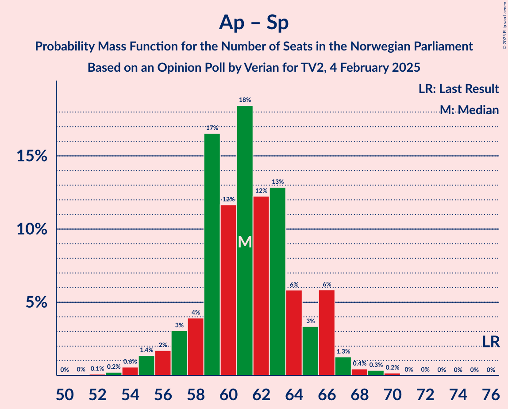

| Number of Seats | Probability | Accumulated | Special Marks |
|:---------------:|:-----------:|:-----------:|:-------------:|
| 52 | 0.1% | 100% |  |
| 53 | 0.2% | 99.9% |  |
| 54 | 0.6% | 99.7% |  |
| 55 | 1.4% | 99.1% |  |
| 56 | 2% | 98% |  |
| 57 | 3% | 96% |  |
| 58 | 4% | 93% |  |
| 59 | 17% | 89% |  |
| 60 | 12% | 73% |  |
| 61 | 18% | 61% |  |
| 62 | 12% | 42% | Median |
| 63 | 13% | 30% |  |
| 64 | 6% | 17% |  |
| 65 | 3% | 11% |  |
| 66 | 6% | 8% |  |
| 67 | 1.3% | 2% |  |
| 68 | 0.4% | 1.0% |  |
| 69 | 0.3% | 0.6% |  |
| 70 | 0.2% | 0.2% |  |
| 71 | 0% | 0% |  |
| 72 | 0% | 0% |  |
| 73 | 0% | 0% |  |
| 74 | 0% | 0% |  |
| 75 | 0% | 0% |  |
| 76 | 0% | 0% | Last Result |

### Høyre – Kristelig Folkeparti – Venstre

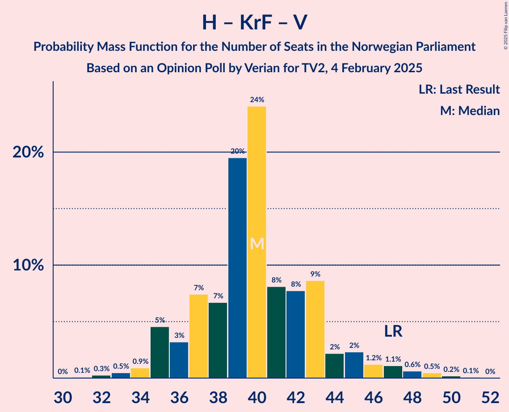

| Number of Seats | Probability | Accumulated | Special Marks |
|:---------------:|:-----------:|:-----------:|:-------------:|
| 31 | 0.1% | 100% |  |
| 32 | 0.3% | 99.9% |  |
| 33 | 0.5% | 99.6% |  |
| 34 | 0.9% | 99.1% |  |
| 35 | 5% | 98% |  |
| 36 | 3% | 94% |  |
| 37 | 7% | 90% |  |
| 38 | 7% | 83% |  |
| 39 | 20% | 76% | Median |
| 40 | 24% | 57% |  |
| 41 | 8% | 33% |  |
| 42 | 8% | 25% |  |
| 43 | 9% | 17% |  |
| 44 | 2% | 8% |  |
| 45 | 2% | 6% |  |
| 46 | 1.2% | 4% |  |
| 47 | 1.1% | 3% | Last Result |
| 48 | 0.6% | 1.4% |  |
| 49 | 0.5% | 0.8% |  |
| 50 | 0.2% | 0.3% |  |
| 51 | 0.1% | 0.1% |  |
| 52 | 0% | 0% |  |

### Senterpartiet – Kristelig Folkeparti – Venstre

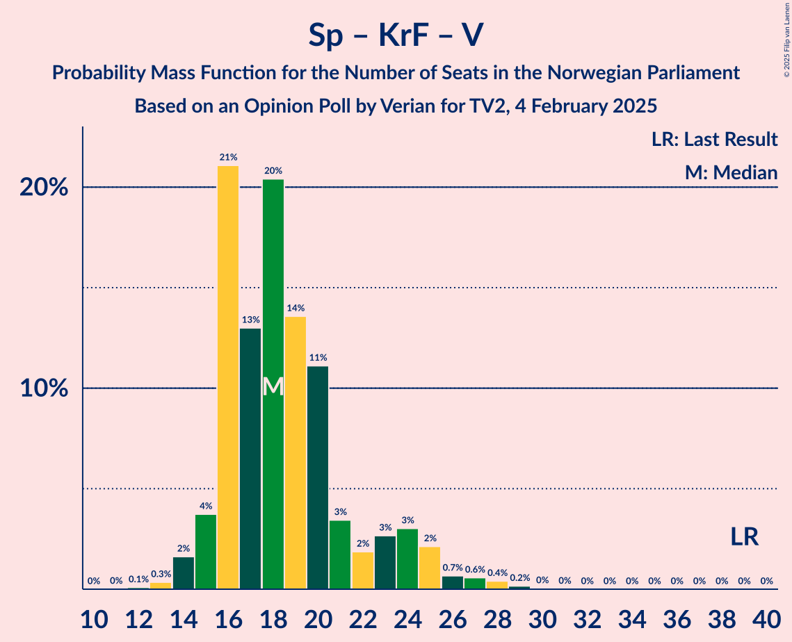

| Number of Seats | Probability | Accumulated | Special Marks |
|:---------------:|:-----------:|:-----------:|:-------------:|
| 12 | 0.1% | 100% |  |
| 13 | 0.3% | 99.9% |  |
| 14 | 2% | 99.5% |  |
| 15 | 4% | 98% |  |
| 16 | 21% | 94% |  |
| 17 | 13% | 73% | Median |
| 18 | 20% | 60% |  |
| 19 | 14% | 40% |  |
| 20 | 11% | 26% |  |
| 21 | 3% | 15% |  |
| 22 | 2% | 12% |  |
| 23 | 3% | 10% |  |
| 24 | 3% | 7% |  |
| 25 | 2% | 4% |  |
| 26 | 0.7% | 2% |  |
| 27 | 0.6% | 1.2% |  |
| 28 | 0.4% | 0.6% |  |
| 29 | 0.2% | 0.2% |  |
| 30 | 0% | 0.1% |  |
| 31 | 0% | 0% |  |
| 32 | 0% | 0% |  |
| 33 | 0% | 0% |  |
| 34 | 0% | 0% |  |
| 35 | 0% | 0% |  |
| 36 | 0% | 0% |  |
| 37 | 0% | 0% |  |
| 38 | 0% | 0% |  |
| 39 | 0% | 0% | Last Result |

## Technical Information

### Opinion Poll

+ **Polling firm:** Verian
+ **Commissioner(s):** TV2
+ **Fieldwork period:** 4 February 2025

### Calculations

+ **Sample size:** 1000
+ **Simulations done:** 2,097,152
+ **Error estimate:** 1.57%

