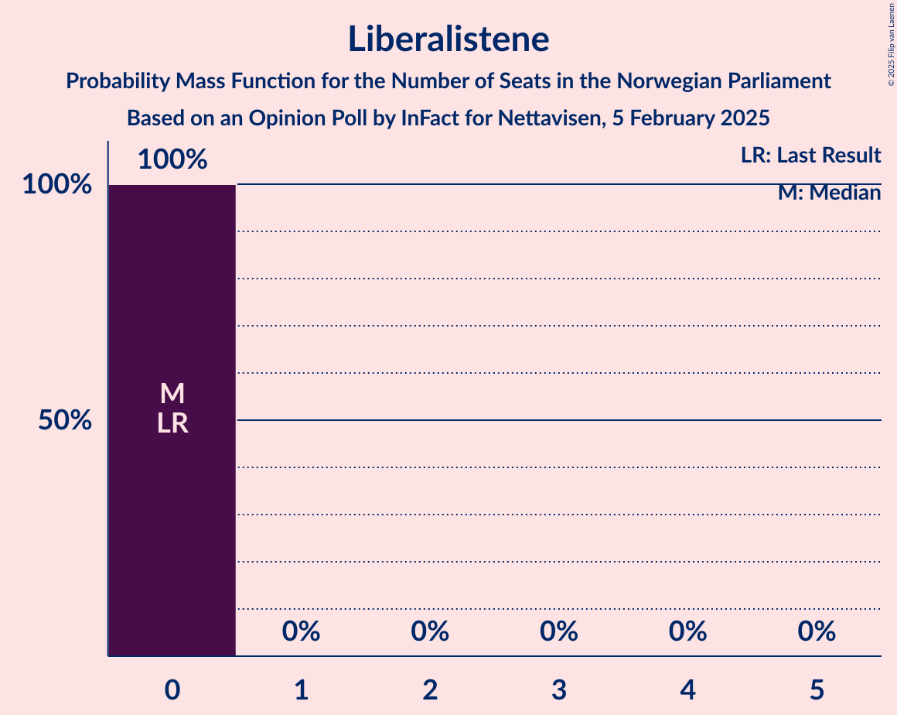

# Opinion Poll by InFact for Nettavisen, 5 February 2025

<a href="#voting-intentions">Voting Intentions</a> | <a href="#seats">Seats</a> | <a href="#coalitions">Coalitions</a> | <a href="#technical-information">Technical Information</a>

## Voting Intentions

### Confidence Intervals

| Party | Last Result | Poll Result | 80% Confidence Interval | 90% Confidence Interval | 95% Confidence Interval | 99% Confidence Interval |
|:-----:|:-----------:|:-----------:|:-----------------------:|:-----------------------:|:-----------------------:|:-----------------------:|
| Arbeiderpartiet | 26.2% | 30.7% | 28.9–32.6% |28.4–33.1% |28.0–33.5% |27.2–34.4% |
| Fremskrittspartiet | 11.6% | 24.3% | 22.7–26.0% |22.2–26.5% |21.8–27.0% |21.0–27.8% |
| Høyre | 20.4% | 15.6% | 14.3–17.1% |13.9–17.6% |13.6–18.0% |12.9–18.7% |
| Sosialistisk Venstreparti | 7.6% | 6.5% | 5.6–7.6% |5.4–7.9% |5.2–8.2% |4.8–8.7% |
| Senterpartiet | 13.5% | 6.0% | 5.2–7.1% |4.9–7.4% |4.7–7.6% |4.4–8.2% |
| Rødt | 4.7% | 5.5% | 4.7–6.5% |4.4–6.8% |4.2–7.0% |3.9–7.5% |
| Venstre | 4.6% | 3.4% | 2.8–4.2% |2.6–4.5% |2.5–4.7% |2.2–5.1% |
| Kristelig Folkeparti | 3.8% | 3.0% | 2.4–3.8% |2.3–4.0% |2.1–4.2% |1.9–4.6% |
| Miljøpartiet De Grønne | 3.9% | 2.3% | 1.8–3.0% |1.6–3.2% |1.5–3.4% |1.3–3.7% |
| Industri- og Næringspartiet | 0.3% | 0.8% | 0.5–1.2% |0.4–1.4% |0.4–1.5% |0.3–1.8% |
| Liberalistene | 0.2% | 0.3% | 0.2–0.6% |0.1–0.7% |0.1–0.8% |0.1–1.0% |
| Konservativt | 0.4% | 0.3% | 0.2–0.6% |0.1–0.7% |0.1–0.8% |0.1–1.0% |
| Norgesdemokratene | 1.1% | 0.1% | 0.0–0.4% |0.0–0.5% |0.0–0.5% |0.0–0.7% |
| Pensjonistpartiet | 0.6% | 0.1% | 0.0–0.4% |0.0–0.5% |0.0–0.5% |0.0–0.7% |

*Note:* The poll result column reflects the actual value used in the calculations. Published results may vary slightly, and in addition be rounded to fewer digits.

## Seats

### Confidence Intervals

| Party | Last Result | Median | 80% Confidence Interval | 90% Confidence Interval | 95% Confidence Interval | 99% Confidence Interval |
|:-----:|:-----------:|:------:|:-----------------------:|:-----------------------:|:-----------------------:|:-----------------------:|
| <a href="#arbeiderpartiet">Arbeiderpartiet</a> | 48 | 56 | 53–62 |53–63 |52–66 |50–67 |
| <a href="#fremskrittspartiet">Fremskrittspartiet</a> | 21 | 46 | 41–48 |40–48 |39–48 |39–51 |
| <a href="#høyre">Høyre</a> | 36 | 28 | 25–32 |24–32 |24–32 |22–33 |
| <a href="#sosialistisk-venstreparti">Sosialistisk Venstreparti</a> | 13 | 11 | 9–13 |9–13 |9–15 |9–16 |
| <a href="#senterpartiet">Senterpartiet</a> | 28 | 11 | 9–15 |9–15 |8–15 |7–15 |
| <a href="#rødt">Rødt</a> | 8 | 9 | 8–11 |8–11 |7–12 |1–13 |
| <a href="#venstre">Venstre</a> | 8 | 3 | 2–7 |2–8 |2–8 |2–8 |
| <a href="#kristelig-folkeparti">Kristelig Folkeparti</a> | 3 | 2 | 1–3 |1–7 |0–8 |0–8 |
| <a href="#miljøpartiet-de-grønne">Miljøpartiet De Grønne</a> | 3 | 1 | 1 |1–2 |1–3 |0–7 |
| <a href="#industri--og-næringspartiet">Industri- og Næringspartiet</a> | 0 | 0 | 0 |0 |0 |0 |
| <a href="#liberalistene">Liberalistene</a> | 0 | 0 | 0 |0 |0 |0 |
| <a href="#konservativt">Konservativt</a> | 0 | 0 | 0 |0 |0 |0 |
| <a href="#norgesdemokratene">Norgesdemokratene</a> | 0 | 0 | 0 |0 |0 |0 |
| <a href="#pensjonistpartiet">Pensjonistpartiet</a> | 0 | 0 | 0 |0 |0 |0 |

### Arbeiderpartiet

*For a full overview of the results for this party, see the [Arbeiderpartiet](party-arbeiderpartiet.html) page.*

| Number of Seats | Probability | Accumulated | Special Marks |
|:---------------:|:-----------:|:-----------:|:-------------:|
| 48 | 0.1% | 100% | Last Result |
| 49 | 0.2% | 99.8% |  |
| 50 | 0.6% | 99.7% |  |
| 51 | 1.2% | 99.1% |  |
| 52 | 3% | 98% |  |
| 53 | 32% | 95% |  |
| 54 | 8% | 63% |  |
| 55 | 4% | 55% |  |
| 56 | 2% | 51% | Median |
| 57 | 19% | 48% |  |
| 58 | 6% | 29% |  |
| 59 | 4% | 23% |  |
| 60 | 1.3% | 19% |  |
| 61 | 1.1% | 18% |  |
| 62 | 10% | 17% |  |
| 63 | 3% | 6% |  |
| 64 | 0.2% | 3% |  |
| 65 | 0.1% | 3% |  |
| 66 | 1.5% | 3% |  |
| 67 | 0.9% | 1.4% |  |
| 68 | 0% | 0.5% |  |
| 69 | 0% | 0.5% |  |
| 70 | 0.4% | 0.5% |  |
| 71 | 0% | 0% |  |

### Fremskrittspartiet

*For a full overview of the results for this party, see the [Fremskrittspartiet](party-fremskrittspartiet.html) page.*

| Number of Seats | Probability | Accumulated | Special Marks |
|:---------------:|:-----------:|:-----------:|:-------------:|
| 21 | 0% | 100% | Last Result |
| 22 | 0% | 100% |  |
| 23 | 0% | 100% |  |
| 24 | 0% | 100% |  |
| 25 | 0% | 100% |  |
| 26 | 0% | 100% |  |
| 27 | 0% | 100% |  |
| 28 | 0% | 100% |  |
| 29 | 0% | 100% |  |
| 30 | 0% | 100% |  |
| 31 | 0% | 100% |  |
| 32 | 0% | 100% |  |
| 33 | 0% | 100% |  |
| 34 | 0% | 100% |  |
| 35 | 0% | 100% |  |
| 36 | 0% | 100% |  |
| 37 | 0% | 100% |  |
| 38 | 0.1% | 99.9% |  |
| 39 | 3% | 99.8% |  |
| 40 | 4% | 97% |  |
| 41 | 10% | 92% |  |
| 42 | 5% | 82% |  |
| 43 | 3% | 77% |  |
| 44 | 2% | 74% |  |
| 45 | 4% | 73% |  |
| 46 | 35% | 69% | Median |
| 47 | 21% | 33% |  |
| 48 | 11% | 12% |  |
| 49 | 0.7% | 1.3% |  |
| 50 | 0.2% | 0.7% |  |
| 51 | 0.4% | 0.5% |  |
| 52 | 0% | 0.1% |  |
| 53 | 0.1% | 0.1% |  |
| 54 | 0% | 0% |  |

### Høyre

*For a full overview of the results for this party, see the [Høyre](party-høyre.html) page.*

| Number of Seats | Probability | Accumulated | Special Marks |
|:---------------:|:-----------:|:-----------:|:-------------:|
| 20 | 0.4% | 100% |  |
| 21 | 0% | 99.6% |  |
| 22 | 1.1% | 99.6% |  |
| 23 | 0.6% | 98.5% |  |
| 24 | 5% | 98% |  |
| 25 | 22% | 93% |  |
| 26 | 3% | 71% |  |
| 27 | 13% | 68% |  |
| 28 | 13% | 56% | Median |
| 29 | 2% | 43% |  |
| 30 | 2% | 41% |  |
| 31 | 26% | 39% |  |
| 32 | 13% | 14% |  |
| 33 | 0.5% | 0.8% |  |
| 34 | 0.2% | 0.3% |  |
| 35 | 0% | 0.1% |  |
| 36 | 0.1% | 0.1% | Last Result |
| 37 | 0% | 0% |  |

### Sosialistisk Venstreparti

*For a full overview of the results for this party, see the [Sosialistisk Venstreparti](party-sosialistiskvenstreparti.html) page.*

| Number of Seats | Probability | Accumulated | Special Marks |
|:---------------:|:-----------:|:-----------:|:-------------:|
| 7 | 0.2% | 100% |  |
| 8 | 0.1% | 99.8% |  |
| 9 | 20% | 99.7% |  |
| 10 | 28% | 80% |  |
| 11 | 18% | 52% | Median |
| 12 | 7% | 34% |  |
| 13 | 21% | 26% | Last Result |
| 14 | 2% | 5% |  |
| 15 | 0.9% | 3% |  |
| 16 | 1.4% | 2% |  |
| 17 | 0.1% | 0.3% |  |
| 18 | 0.2% | 0.2% |  |
| 19 | 0% | 0% |  |

### Senterpartiet

*For a full overview of the results for this party, see the [Senterpartiet](party-senterpartiet.html) page.*

| Number of Seats | Probability | Accumulated | Special Marks |
|:---------------:|:-----------:|:-----------:|:-------------:|
| 0 | 0.1% | 100% |  |
| 1 | 0% | 99.9% |  |
| 2 | 0% | 99.9% |  |
| 3 | 0% | 99.9% |  |
| 4 | 0% | 99.9% |  |
| 5 | 0% | 99.9% |  |
| 6 | 0% | 99.9% |  |
| 7 | 0.5% | 99.9% |  |
| 8 | 4% | 99.4% |  |
| 9 | 9% | 95% |  |
| 10 | 6% | 86% |  |
| 11 | 32% | 81% | Median |
| 12 | 25% | 48% |  |
| 13 | 5% | 23% |  |
| 14 | 1.1% | 18% |  |
| 15 | 17% | 17% |  |
| 16 | 0.1% | 0.1% |  |
| 17 | 0% | 0% |  |
| 18 | 0% | 0% |  |
| 19 | 0% | 0% |  |
| 20 | 0% | 0% |  |
| 21 | 0% | 0% |  |
| 22 | 0% | 0% |  |
| 23 | 0% | 0% |  |
| 24 | 0% | 0% |  |
| 25 | 0% | 0% |  |
| 26 | 0% | 0% |  |
| 27 | 0% | 0% |  |
| 28 | 0% | 0% | Last Result |

### Rødt

*For a full overview of the results for this party, see the [Rødt](party-rødt.html) page.*

| Number of Seats | Probability | Accumulated | Special Marks |
|:---------------:|:-----------:|:-----------:|:-------------:|
| 1 | 0.5% | 100% |  |
| 2 | 0% | 99.5% |  |
| 3 | 0% | 99.5% |  |
| 4 | 0% | 99.5% |  |
| 5 | 0% | 99.5% |  |
| 6 | 0% | 99.5% |  |
| 7 | 3% | 99.5% |  |
| 8 | 16% | 96% | Last Result |
| 9 | 32% | 81% | Median |
| 10 | 38% | 49% |  |
| 11 | 7% | 11% |  |
| 12 | 2% | 4% |  |
| 13 | 2% | 2% |  |
| 14 | 0.1% | 0.3% |  |
| 15 | 0.2% | 0.2% |  |
| 16 | 0% | 0% |  |

### Venstre

*For a full overview of the results for this party, see the [Venstre](party-venstre.html) page.*

| Number of Seats | Probability | Accumulated | Special Marks |
|:---------------:|:-----------:|:-----------:|:-------------:|
| 1 | 0.3% | 100% |  |
| 2 | 36% | 99.7% |  |
| 3 | 35% | 64% | Median |
| 4 | 0% | 29% |  |
| 5 | 0% | 29% |  |
| 6 | 0% | 29% |  |
| 7 | 21% | 29% |  |
| 8 | 7% | 8% | Last Result |
| 9 | 0.2% | 0.3% |  |
| 10 | 0.1% | 0.1% |  |
| 11 | 0% | 0% |  |

### Kristelig Folkeparti

*For a full overview of the results for this party, see the [Kristelig Folkeparti](party-kristeligfolkeparti.html) page.*

| Number of Seats | Probability | Accumulated | Special Marks |
|:---------------:|:-----------:|:-----------:|:-------------:|
| 0 | 4% | 100% |  |
| 1 | 34% | 96% |  |
| 2 | 37% | 61% | Median |
| 3 | 18% | 25% | Last Result |
| 4 | 0% | 7% |  |
| 5 | 0% | 7% |  |
| 6 | 0% | 7% |  |
| 7 | 2% | 7% |  |
| 8 | 5% | 5% |  |
| 9 | 0.1% | 0.2% |  |
| 10 | 0% | 0% |  |

### Miljøpartiet De Grønne

*For a full overview of the results for this party, see the [Miljøpartiet De Grønne](party-miljøpartietdegrønne.html) page.*

| Number of Seats | Probability | Accumulated | Special Marks |
|:---------------:|:-----------:|:-----------:|:-------------:|
| 0 | 1.2% | 100% |  |
| 1 | 90% | 98.8% | Median |
| 2 | 4% | 9% |  |
| 3 | 3% | 5% | Last Result |
| 4 | 0% | 2% |  |
| 5 | 0% | 2% |  |
| 6 | 0% | 2% |  |
| 7 | 2% | 2% |  |
| 8 | 0.1% | 0.1% |  |
| 9 | 0% | 0% |  |

### Industri- og Næringspartiet

*For a full overview of the results for this party, see the [Industri- og Næringspartiet](party-industri-ognæringspartiet.html) page.*

| Number of Seats | Probability | Accumulated | Special Marks |
|:---------------:|:-----------:|:-----------:|:-------------:|
| 0 | 100% | 100% | Last Result, Median |

### Liberalistene

*For a full overview of the results for this party, see the [Liberalistene](party-liberalistene.html) page.*

| Number of Seats | Probability | Accumulated | Special Marks |
|:---------------:|:-----------:|:-----------:|:-------------:|
| 0 | 100% | 100% | Last Result, Median |

### Konservativt

*For a full overview of the results for this party, see the [Konservativt](party-konservativt.html) page.*

| Number of Seats | Probability | Accumulated | Special Marks |
|:---------------:|:-----------:|:-----------:|:-------------:|
| 0 | 100% | 100% | Last Result, Median |

### Norgesdemokratene

*For a full overview of the results for this party, see the [Norgesdemokratene](party-norgesdemokratene.html) page.*

| Number of Seats | Probability | Accumulated | Special Marks |
|:---------------:|:-----------:|:-----------:|:-------------:|
| 0 | 100% | 100% | Last Result, Median |

### Pensjonistpartiet

*For a full overview of the results for this party, see the [Pensjonistpartiet](party-pensjonistpartiet.html) page.*

| Number of Seats | Probability | Accumulated | Special Marks |
|:---------------:|:-----------:|:-----------:|:-------------:|
| 0 | 100% | 100% | Last Result, Median |

## Coalitions

### Confidence Intervals

| Coalition | Last Result | Median | Majority? | 80% Confidence Interval | 90% Confidence Interval | 95% Confidence Interval | 99% Confidence Interval |
|:---------:|:-----------:|:------:|:---------:|:-----------------------:|:-----------------------:|:-----------------------:|:-----------------------:|
| Arbeiderpartiet – Sosialistisk Venstreparti – Senterpartiet – Rødt – Miljøpartiet De Grønne | 100 | 90 | 80% | 84–96 | 84–96 | 84–98 | 83–100 |
| Arbeiderpartiet – Sosialistisk Venstreparti – Senterpartiet – Rødt | 97 | 89 | 68% | 83–95 | 83–95 | 83–97 | 82–99 |
| Fremskrittspartiet – Høyre – Senterpartiet – Venstre – Kristelig Folkeparti | 96 | 92 | 85% | 84–96 | 84–96 | 83–96 | 80–97 |
| Arbeiderpartiet – Sosialistisk Venstreparti – Senterpartiet – Kristelig Folkeparti – Miljøpartiet De Grønne | 95 | 82 | 29% | 76–89 | 76–89 | 76–90 | 76–93 |
| Arbeiderpartiet – Sosialistisk Venstreparti – Senterpartiet – Miljøpartiet De Grønne | 92 | 80 | 22% | 75–87 | 75–87 | 75–88 | 73–91 |
| Arbeiderpartiet – Sosialistisk Venstreparti – Senterpartiet | 89 | 79 | 18% | 74–86 | 74–86 | 74–87 | 72–90 |
| Arbeiderpartiet – Sosialistisk Venstreparti – Rødt – Miljøpartiet De Grønne | 72 | 77 | 15% | 73–85 | 73–85 | 73–86 | 72–89 |
| Fremskrittspartiet – Høyre – Venstre – Kristelig Folkeparti – Miljøpartiet De Grønne | 71 | 80 | 32% | 74–86 | 74–86 | 72–86 | 70–87 |
| Fremskrittspartiet – Høyre – Venstre – Kristelig Folkeparti | 68 | 79 | 20% | 73–85 | 73–85 | 71–85 | 69–86 |
| Fremskrittspartiet – Høyre – Venstre | 65 | 77 | 0.1% | 71–84 | 70–84 | 69–84 | 67–84 |
| Arbeiderpartiet – Senterpartiet – Kristelig Folkeparti – Miljøpartiet De Grønne | 82 | 70 | 0% | 66–76 | 66–76 | 66–80 | 64–82 |
| Arbeiderpartiet – Senterpartiet – Kristelig Folkeparti | 79 | 68 | 0% | 65–75 | 65–75 | 65–79 | 63–81 |
| Fremskrittspartiet – Høyre | 57 | 73 | 0% | 68–78 | 67–78 | 67–78 | 64–80 |
| Arbeiderpartiet – Senterpartiet | 76 | 67 | 0% | 64–73 | 64–73 | 62–76 | 61–79 |
| Arbeiderpartiet – Sosialistisk Venstreparti | 61 | 66 | 0% | 63–75 | 63–75 | 63–75 | 62–80 |
| Høyre – Venstre – Kristelig Folkeparti | 47 | 34 | 0% | 30–39 | 30–39 | 29–39 | 26–41 |
| Senterpartiet – Venstre – Kristelig Folkeparti | 39 | 19 | 0% | 15–20 | 12–21 | 11–22 | 11–24 |

### Arbeiderpartiet – Sosialistisk Venstreparti – Senterpartiet – Rødt – Miljøpartiet De Grønne

| Number of Seats | Probability | Accumulated | Special Marks |
|:---------------:|:-----------:|:-----------:|:-------------:|
| 79 | 0.2% | 100% |  |
| 80 | 0% | 99.7% |  |
| 81 | 0% | 99.7% |  |
| 82 | 0% | 99.7% |  |
| 83 | 0.2% | 99.7% |  |
| 84 | 19% | 99.5% |  |
| 85 | 12% | 80% | Majority |
| 86 | 3% | 68% |  |
| 87 | 0.8% | 65% |  |
| 88 | 6% | 64% | Median |
| 89 | 5% | 58% |  |
| 90 | 9% | 53% |  |
| 91 | 3% | 45% |  |
| 92 | 18% | 41% |  |
| 93 | 4% | 23% |  |
| 94 | 0.7% | 20% |  |
| 95 | 4% | 19% |  |
| 96 | 10% | 15% |  |
| 97 | 0.7% | 5% |  |
| 98 | 2% | 4% |  |
| 99 | 1.3% | 2% |  |
| 100 | 0.2% | 0.7% | Last Result |
| 101 | 0% | 0.5% |  |
| 102 | 0.4% | 0.4% |  |
| 103 | 0% | 0% |  |

### Arbeiderpartiet – Sosialistisk Venstreparti – Senterpartiet – Rødt

| Number of Seats | Probability | Accumulated | Special Marks |
|:---------------:|:-----------:|:-----------:|:-------------:|
| 78 | 0.3% | 100% |  |
| 79 | 0% | 99.7% |  |
| 80 | 0% | 99.7% |  |
| 81 | 0% | 99.7% |  |
| 82 | 0.2% | 99.6% |  |
| 83 | 19% | 99.4% |  |
| 84 | 13% | 80% |  |
| 85 | 3% | 68% | Majority |
| 86 | 1.4% | 64% |  |
| 87 | 6% | 63% | Median |
| 88 | 6% | 57% |  |
| 89 | 9% | 51% |  |
| 90 | 4% | 42% |  |
| 91 | 17% | 38% |  |
| 92 | 4% | 21% |  |
| 93 | 2% | 17% |  |
| 94 | 2% | 16% |  |
| 95 | 10% | 14% |  |
| 96 | 0.4% | 4% |  |
| 97 | 2% | 4% | Last Result |
| 98 | 2% | 2% |  |
| 99 | 0.1% | 0.6% |  |
| 100 | 0.5% | 0.5% |  |
| 101 | 0% | 0% |  |

### Fremskrittspartiet – Høyre – Senterpartiet – Venstre – Kristelig Folkeparti

| Number of Seats | Probability | Accumulated | Special Marks |
|:---------------:|:-----------:|:-----------:|:-------------:|
| 76 | 0.4% | 100% |  |
| 77 | 0% | 99.6% |  |
| 78 | 0% | 99.6% |  |
| 79 | 0% | 99.5% |  |
| 80 | 0.2% | 99.5% |  |
| 81 | 0.2% | 99.3% |  |
| 82 | 2% | 99.2% |  |
| 83 | 2% | 98% |  |
| 84 | 11% | 96% |  |
| 85 | 0.9% | 85% | Majority |
| 86 | 6% | 84% |  |
| 87 | 1.5% | 78% |  |
| 88 | 5% | 77% |  |
| 89 | 1.4% | 72% |  |
| 90 | 8% | 71% | Median |
| 91 | 10% | 63% |  |
| 92 | 18% | 53% |  |
| 93 | 0.5% | 34% |  |
| 94 | 0.6% | 34% |  |
| 95 | 2% | 33% |  |
| 96 | 31% | 31% | Last Result |
| 97 | 0.1% | 0.5% |  |
| 98 | 0.3% | 0.4% |  |
| 99 | 0.1% | 0.1% |  |
| 100 | 0% | 0% |  |

### Arbeiderpartiet – Sosialistisk Venstreparti – Senterpartiet – Kristelig Folkeparti – Miljøpartiet De Grønne

| Number of Seats | Probability | Accumulated | Special Marks |
|:---------------:|:-----------:|:-----------:|:-------------:|
| 75 | 0.3% | 100% |  |
| 76 | 20% | 99.7% |  |
| 77 | 0.6% | 79% |  |
| 78 | 0.9% | 79% |  |
| 79 | 4% | 78% |  |
| 80 | 15% | 74% |  |
| 81 | 2% | 59% | Median |
| 82 | 9% | 57% |  |
| 83 | 2% | 49% |  |
| 84 | 17% | 46% |  |
| 85 | 2% | 29% | Majority |
| 86 | 7% | 28% |  |
| 87 | 5% | 21% |  |
| 88 | 1.2% | 16% |  |
| 89 | 12% | 15% |  |
| 90 | 1.2% | 3% |  |
| 91 | 1.1% | 2% |  |
| 92 | 0.1% | 1.0% |  |
| 93 | 0.7% | 0.9% |  |
| 94 | 0.2% | 0.2% |  |
| 95 | 0% | 0% | Last Result |

### Arbeiderpartiet – Sosialistisk Venstreparti – Senterpartiet – Miljøpartiet De Grønne

| Number of Seats | Probability | Accumulated | Special Marks |
|:---------------:|:-----------:|:-----------:|:-------------:|
| 69 | 0.1% | 100% |  |
| 70 | 0% | 99.9% |  |
| 71 | 0.2% | 99.9% |  |
| 72 | 0% | 99.7% |  |
| 73 | 0.5% | 99.7% |  |
| 74 | 0.6% | 99.2% |  |
| 75 | 20% | 98.5% |  |
| 76 | 3% | 79% |  |
| 77 | 12% | 76% |  |
| 78 | 10% | 64% |  |
| 79 | 1.4% | 54% | Median |
| 80 | 9% | 52% |  |
| 81 | 0.8% | 43% |  |
| 82 | 17% | 42% |  |
| 83 | 2% | 25% |  |
| 84 | 1.1% | 23% |  |
| 85 | 2% | 22% | Majority |
| 86 | 4% | 19% |  |
| 87 | 11% | 15% |  |
| 88 | 3% | 5% |  |
| 89 | 1.2% | 2% |  |
| 90 | 0.1% | 0.7% |  |
| 91 | 0.2% | 0.6% |  |
| 92 | 0% | 0.5% | Last Result |
| 93 | 0.4% | 0.4% |  |
| 94 | 0% | 0% |  |

### Arbeiderpartiet – Sosialistisk Venstreparti – Senterpartiet

| Number of Seats | Probability | Accumulated | Special Marks |
|:---------------:|:-----------:|:-----------:|:-------------:|
| 69 | 0% | 100% |  |
| 70 | 0.2% | 99.9% |  |
| 71 | 0.1% | 99.7% |  |
| 72 | 0.6% | 99.6% |  |
| 73 | 0.8% | 99.0% |  |
| 74 | 19% | 98% |  |
| 75 | 3% | 79% |  |
| 76 | 13% | 76% |  |
| 77 | 9% | 63% |  |
| 78 | 3% | 53% | Median |
| 79 | 9% | 50% |  |
| 80 | 2% | 41% |  |
| 81 | 17% | 40% |  |
| 82 | 2% | 22% |  |
| 83 | 1.3% | 20% |  |
| 84 | 1.0% | 19% |  |
| 85 | 3% | 18% | Majority |
| 86 | 10% | 15% |  |
| 87 | 2% | 4% |  |
| 88 | 1.3% | 2% |  |
| 89 | 0.1% | 0.7% | Last Result |
| 90 | 0.2% | 0.6% |  |
| 91 | 0.5% | 0.5% |  |
| 92 | 0% | 0% |  |

### Arbeiderpartiet – Sosialistisk Venstreparti – Rødt – Miljøpartiet De Grønne

| Number of Seats | Probability | Accumulated | Special Marks |
|:---------------:|:-----------:|:-----------:|:-------------:|
| 70 | 0.1% | 100% |  |
| 71 | 0.3% | 99.9% |  |
| 72 | 0.1% | 99.6% | Last Result |
| 73 | 31% | 99.5% |  |
| 74 | 2% | 69% |  |
| 75 | 0.6% | 67% |  |
| 76 | 0.5% | 66% |  |
| 77 | 18% | 66% | Median |
| 78 | 10% | 47% |  |
| 79 | 8% | 37% |  |
| 80 | 1.4% | 29% |  |
| 81 | 5% | 28% |  |
| 82 | 1.5% | 23% |  |
| 83 | 6% | 22% |  |
| 84 | 0.9% | 16% |  |
| 85 | 11% | 15% | Majority |
| 86 | 2% | 4% |  |
| 87 | 2% | 2% |  |
| 88 | 0.2% | 0.8% |  |
| 89 | 0.2% | 0.7% |  |
| 90 | 0% | 0.5% |  |
| 91 | 0% | 0.5% |  |
| 92 | 0% | 0.4% |  |
| 93 | 0.4% | 0.4% |  |
| 94 | 0% | 0% |  |

### Fremskrittspartiet – Høyre – Venstre – Kristelig Folkeparti – Miljøpartiet De Grønne

| Number of Seats | Probability | Accumulated | Special Marks |
|:---------------:|:-----------:|:-----------:|:-------------:|
| 69 | 0.5% | 100% |  |
| 70 | 0.1% | 99.5% |  |
| 71 | 2% | 99.4% | Last Result |
| 72 | 2% | 98% |  |
| 73 | 0.4% | 96% |  |
| 74 | 10% | 96% |  |
| 75 | 2% | 86% |  |
| 76 | 2% | 84% |  |
| 77 | 4% | 83% |  |
| 78 | 17% | 79% |  |
| 79 | 4% | 62% |  |
| 80 | 9% | 58% | Median |
| 81 | 6% | 49% |  |
| 82 | 6% | 43% |  |
| 83 | 1.4% | 37% |  |
| 84 | 3% | 36% |  |
| 85 | 13% | 32% | Majority |
| 86 | 19% | 20% |  |
| 87 | 0.2% | 0.6% |  |
| 88 | 0% | 0.4% |  |
| 89 | 0% | 0.3% |  |
| 90 | 0% | 0.3% |  |
| 91 | 0.3% | 0.3% |  |
| 92 | 0% | 0% |  |

### Fremskrittspartiet – Høyre – Venstre – Kristelig Folkeparti

| Number of Seats | Probability | Accumulated | Special Marks |
|:---------------:|:-----------:|:-----------:|:-------------:|
| 67 | 0.4% | 100% |  |
| 68 | 0% | 99.6% | Last Result |
| 69 | 0.2% | 99.5% |  |
| 70 | 1.3% | 99.3% |  |
| 71 | 2% | 98% |  |
| 72 | 0.7% | 96% |  |
| 73 | 10% | 95% |  |
| 74 | 4% | 85% |  |
| 75 | 0.7% | 81% |  |
| 76 | 4% | 80% |  |
| 77 | 18% | 77% |  |
| 78 | 3% | 59% |  |
| 79 | 9% | 55% | Median |
| 80 | 5% | 47% |  |
| 81 | 6% | 42% |  |
| 82 | 0.8% | 36% |  |
| 83 | 3% | 35% |  |
| 84 | 12% | 32% |  |
| 85 | 19% | 20% | Majority |
| 86 | 0.2% | 0.5% |  |
| 87 | 0% | 0.3% |  |
| 88 | 0% | 0.3% |  |
| 89 | 0% | 0.3% |  |
| 90 | 0.2% | 0.3% |  |
| 91 | 0% | 0% |  |

### Fremskrittspartiet – Høyre – Venstre

| Number of Seats | Probability | Accumulated | Special Marks |
|:---------------:|:-----------:|:-----------:|:-------------:|
| 65 | 0% | 100% | Last Result |
| 66 | 0.1% | 100% |  |
| 67 | 0.7% | 99.9% |  |
| 68 | 0.2% | 99.2% |  |
| 69 | 2% | 99.1% |  |
| 70 | 2% | 97% |  |
| 71 | 10% | 95% |  |
| 72 | 1.2% | 85% |  |
| 73 | 8% | 83% |  |
| 74 | 1.1% | 75% |  |
| 75 | 20% | 74% |  |
| 76 | 3% | 54% |  |
| 77 | 9% | 51% | Median |
| 78 | 2% | 41% |  |
| 79 | 3% | 39% |  |
| 80 | 1.2% | 36% |  |
| 81 | 13% | 34% |  |
| 82 | 0.7% | 21% |  |
| 83 | 2% | 21% |  |
| 84 | 19% | 19% |  |
| 85 | 0% | 0.1% | Majority |
| 86 | 0% | 0.1% |  |
| 87 | 0% | 0% |  |

### Arbeiderpartiet – Senterpartiet – Kristelig Folkeparti – Miljøpartiet De Grønne

| Number of Seats | Probability | Accumulated | Special Marks |
|:---------------:|:-----------:|:-----------:|:-------------:|
| 62 | 0% | 100% |  |
| 63 | 0% | 99.9% |  |
| 64 | 0.5% | 99.9% |  |
| 65 | 0.4% | 99.5% |  |
| 66 | 21% | 99.1% |  |
| 67 | 4% | 78% |  |
| 68 | 0.8% | 75% |  |
| 69 | 23% | 74% |  |
| 70 | 2% | 50% | Median |
| 71 | 0.9% | 48% |  |
| 72 | 2% | 47% |  |
| 73 | 3% | 45% |  |
| 74 | 2% | 43% |  |
| 75 | 23% | 41% |  |
| 76 | 14% | 18% |  |
| 77 | 0.3% | 5% |  |
| 78 | 0.2% | 4% |  |
| 79 | 1.0% | 4% |  |
| 80 | 1.4% | 3% |  |
| 81 | 0.6% | 2% |  |
| 82 | 1.0% | 1.1% | Last Result |
| 83 | 0% | 0% |  |

### Arbeiderpartiet – Senterpartiet – Kristelig Folkeparti

| Number of Seats | Probability | Accumulated | Special Marks |
|:---------------:|:-----------:|:-----------:|:-------------:|
| 61 | 0% | 100% |  |
| 62 | 0.1% | 99.9% |  |
| 63 | 0.4% | 99.9% |  |
| 64 | 0.7% | 99.4% |  |
| 65 | 20% | 98.7% |  |
| 66 | 4% | 78% |  |
| 67 | 0.7% | 74% |  |
| 68 | 26% | 74% |  |
| 69 | 2% | 48% | Median |
| 70 | 0.6% | 46% |  |
| 71 | 3% | 45% |  |
| 72 | 2% | 42% |  |
| 73 | 1.5% | 40% |  |
| 74 | 20% | 38% |  |
| 75 | 14% | 18% |  |
| 76 | 0.2% | 4% |  |
| 77 | 0.5% | 4% |  |
| 78 | 1.0% | 4% |  |
| 79 | 1.4% | 3% | Last Result |
| 80 | 0.2% | 1.2% |  |
| 81 | 1.0% | 1.0% |  |
| 82 | 0% | 0% |  |

### Fremskrittspartiet – Høyre

| Number of Seats | Probability | Accumulated | Special Marks |
|:---------------:|:-----------:|:-----------:|:-------------:|
| 57 | 0% | 100% | Last Result |
| 58 | 0% | 100% |  |
| 59 | 0% | 100% |  |
| 60 | 0% | 100% |  |
| 61 | 0% | 100% |  |
| 62 | 0% | 100% |  |
| 63 | 0.1% | 99.9% |  |
| 64 | 0.8% | 99.9% |  |
| 65 | 0.7% | 99.1% |  |
| 66 | 0.6% | 98% |  |
| 67 | 6% | 98% |  |
| 68 | 4% | 92% |  |
| 69 | 10% | 88% |  |
| 70 | 3% | 78% |  |
| 71 | 6% | 75% |  |
| 72 | 18% | 69% |  |
| 73 | 2% | 51% |  |
| 74 | 0.8% | 49% | Median |
| 75 | 11% | 48% |  |
| 76 | 1.4% | 37% |  |
| 77 | 22% | 36% |  |
| 78 | 13% | 14% |  |
| 79 | 0.4% | 1.2% |  |
| 80 | 0.7% | 0.8% |  |
| 81 | 0.1% | 0.1% |  |
| 82 | 0% | 0% |  |

### Arbeiderpartiet – Senterpartiet

| Number of Seats | Probability | Accumulated | Special Marks |
|:---------------:|:-----------:|:-----------:|:-------------:|
| 57 | 0% | 100% |  |
| 58 | 0% | 99.9% |  |
| 59 | 0% | 99.9% |  |
| 60 | 0.1% | 99.9% |  |
| 61 | 0.6% | 99.8% |  |
| 62 | 2% | 99.2% |  |
| 63 | 1.5% | 97% |  |
| 64 | 21% | 96% |  |
| 65 | 14% | 75% |  |
| 66 | 11% | 61% |  |
| 67 | 10% | 50% | Median |
| 68 | 1.3% | 41% |  |
| 69 | 0.2% | 39% |  |
| 70 | 2% | 39% |  |
| 71 | 3% | 37% |  |
| 72 | 17% | 34% |  |
| 73 | 12% | 17% |  |
| 74 | 0.4% | 4% |  |
| 75 | 1.0% | 4% |  |
| 76 | 0.2% | 3% | Last Result |
| 77 | 0.2% | 2% |  |
| 78 | 0.9% | 2% |  |
| 79 | 1.4% | 1.4% |  |
| 80 | 0% | 0% |  |

### Arbeiderpartiet – Sosialistisk Venstreparti

| Number of Seats | Probability | Accumulated | Special Marks |
|:---------------:|:-----------:|:-----------:|:-------------:|
| 59 | 0.1% | 100% |  |
| 60 | 0.2% | 99.9% |  |
| 61 | 0.2% | 99.7% | Last Result |
| 62 | 0.3% | 99.5% |  |
| 63 | 21% | 99.3% |  |
| 64 | 12% | 78% |  |
| 65 | 2% | 66% |  |
| 66 | 20% | 64% |  |
| 67 | 11% | 43% | Median |
| 68 | 5% | 33% |  |
| 69 | 5% | 27% |  |
| 70 | 1.4% | 23% |  |
| 71 | 1.2% | 21% |  |
| 72 | 0.5% | 20% |  |
| 73 | 2% | 20% |  |
| 74 | 2% | 18% |  |
| 75 | 14% | 16% |  |
| 76 | 1.1% | 2% |  |
| 77 | 0.4% | 1.1% |  |
| 78 | 0% | 0.7% |  |
| 79 | 0.2% | 0.7% |  |
| 80 | 0.1% | 0.5% |  |
| 81 | 0% | 0.5% |  |
| 82 | 0.4% | 0.4% |  |
| 83 | 0% | 0% |  |

### Høyre – Venstre – Kristelig Folkeparti

| Number of Seats | Probability | Accumulated | Special Marks |
|:---------------:|:-----------:|:-----------:|:-------------:|
| 25 | 0.1% | 100% |  |
| 26 | 0.5% | 99.9% |  |
| 27 | 0.1% | 99.4% |  |
| 28 | 2% | 99.3% |  |
| 29 | 1.4% | 98% |  |
| 30 | 19% | 96% |  |
| 31 | 11% | 78% |  |
| 32 | 10% | 67% |  |
| 33 | 2% | 56% | Median |
| 34 | 12% | 55% |  |
| 35 | 4% | 43% |  |
| 36 | 2% | 39% |  |
| 37 | 2% | 36% |  |
| 38 | 13% | 35% |  |
| 39 | 20% | 21% |  |
| 40 | 0.3% | 1.5% |  |
| 41 | 0.8% | 1.2% |  |
| 42 | 0.1% | 0.4% |  |
| 43 | 0.1% | 0.3% |  |
| 44 | 0.1% | 0.3% |  |
| 45 | 0.2% | 0.2% |  |
| 46 | 0% | 0% |  |
| 47 | 0% | 0% | Last Result |

### Senterpartiet – Venstre – Kristelig Folkeparti

| Number of Seats | Probability | Accumulated | Special Marks |
|:---------------:|:-----------:|:-----------:|:-------------:|
| 9 | 0.2% | 100% |  |
| 10 | 0.1% | 99.8% |  |
| 11 | 5% | 99.7% |  |
| 12 | 0.8% | 95% |  |
| 13 | 0.5% | 94% |  |
| 14 | 2% | 94% |  |
| 15 | 11% | 92% |  |
| 16 | 13% | 81% | Median |
| 17 | 4% | 67% |  |
| 18 | 12% | 64% |  |
| 19 | 29% | 51% |  |
| 20 | 17% | 23% |  |
| 21 | 1.0% | 6% |  |
| 22 | 4% | 5% |  |
| 23 | 0.2% | 1.0% |  |
| 24 | 0.6% | 0.8% |  |
| 25 | 0.1% | 0.2% |  |
| 26 | 0% | 0.1% |  |
| 27 | 0.1% | 0.1% |  |
| 28 | 0% | 0% |  |
| 29 | 0% | 0% |  |
| 30 | 0% | 0% |  |
| 31 | 0% | 0% |  |
| 32 | 0% | 0% |  |
| 33 | 0% | 0% |  |
| 34 | 0% | 0% |  |
| 35 | 0% | 0% |  |
| 36 | 0% | 0% |  |
| 37 | 0% | 0% |  |
| 38 | 0% | 0% |  |
| 39 | 0% | 0% | Last Result |

## Technical Information

### Opinion Poll

+ **Polling firm:** InFact
+ **Commissioner(s):** Nettavisen
+ **Fieldwork period:** 5 February 2025

### Calculations

+ **Sample size:** 1062
+ **Simulations done:** 2,097,152
+ **Error estimate:** 1.30%

