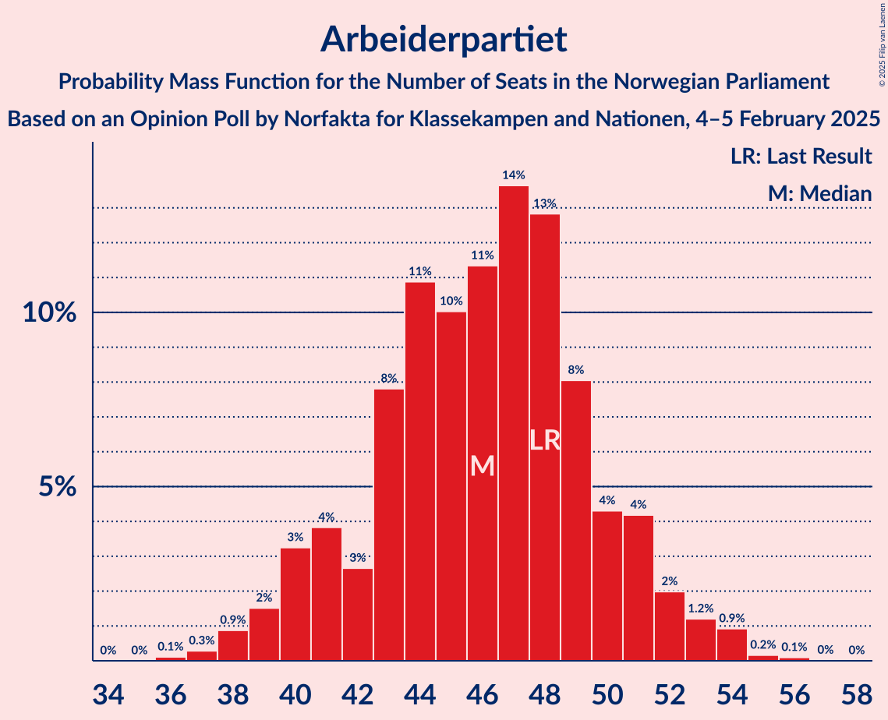
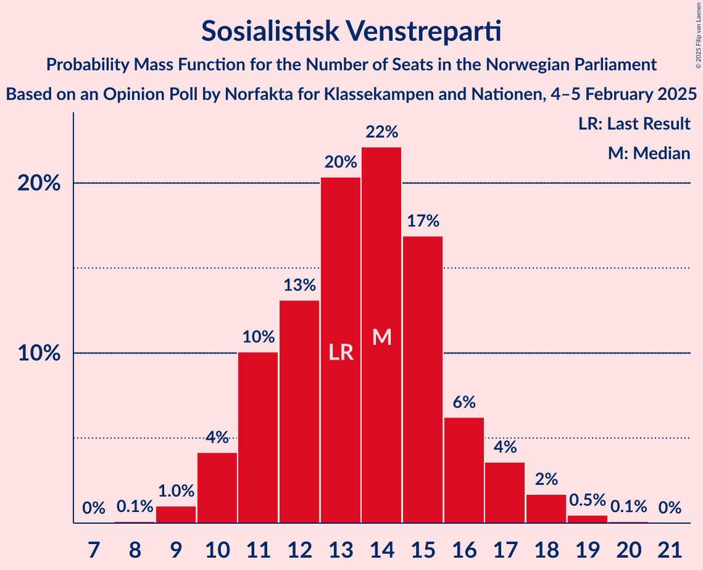
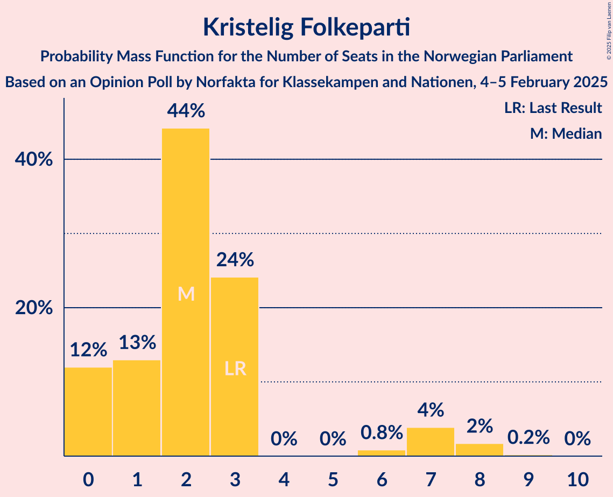
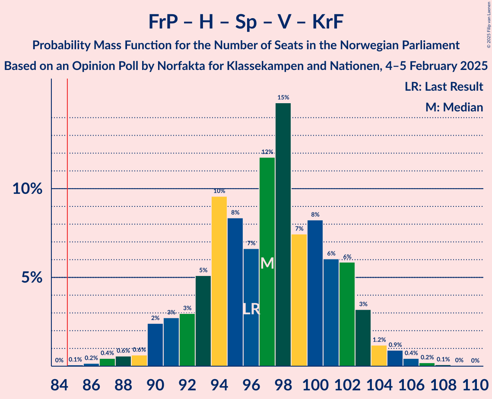
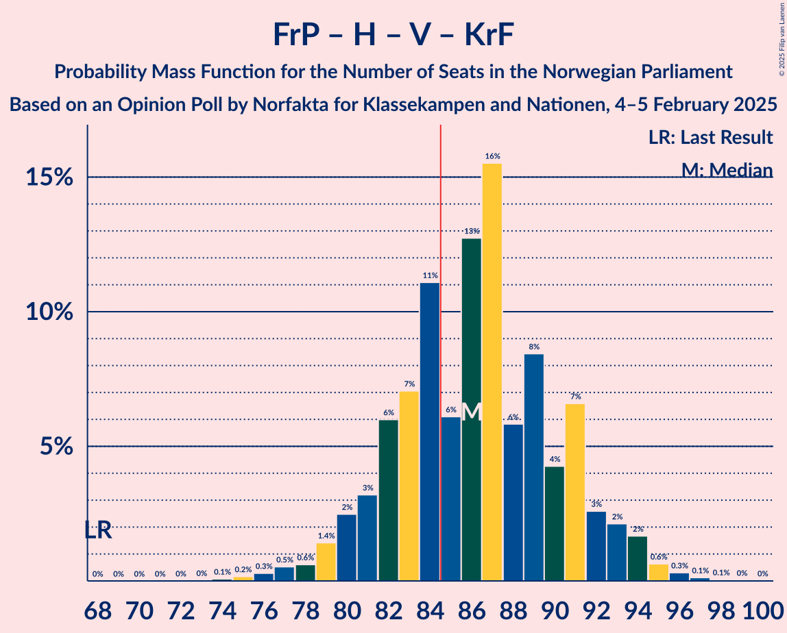
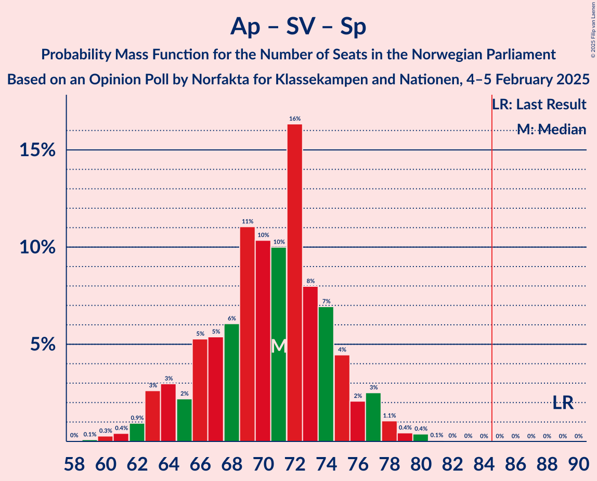

# Opinion Poll by Norfakta for Klassekampen and Nationen, 4–5 February 2025

<a href="#voting-intentions">Voting Intentions</a> | <a href="#seats">Seats</a> | <a href="#coalitions">Coalitions</a> | <a href="#technical-information">Technical Information</a>

## Voting Intentions

### Confidence Intervals

| Party | Last Result | Poll Result | 80% Confidence Interval | 90% Confidence Interval | 95% Confidence Interval | 99% Confidence Interval |
|:-----:|:-----------:|:-----------:|:-----------------------:|:-----------------------:|:-----------------------:|:-----------------------:|
| Arbeiderpartiet | 26.2% | 24.6% | 22.9–26.4% |22.5–26.9% |22.1–27.4% |21.3–28.3% |
| Fremskrittspartiet | 11.6% | 24.6% | 22.9–26.4% |22.5–26.9% |22.1–27.4% |21.3–28.3% |
| Høyre | 20.4% | 18.1% | 16.7–19.8% |16.2–20.3% |15.9–20.7% |15.2–21.5% |
| Sosialistisk Venstreparti | 7.6% | 7.6% | 6.6–8.8% |6.3–9.1% |6.1–9.4% |5.7–10.0% |
| Senterpartiet | 13.5% | 6.1% | 5.2–7.2% |5.0–7.5% |4.8–7.7% |4.4–8.3% |
| Rødt | 4.7% | 5.7% | 4.8–6.7% |4.6–7.0% |4.4–7.3% |4.0–7.8% |
| Venstre | 4.6% | 4.6% | 3.8–5.5% |3.6–5.8% |3.4–6.1% |3.1–6.6% |
| Kristelig Folkeparti | 3.8% | 3.0% | 2.4–3.8% |2.2–4.0% |2.1–4.3% |1.8–4.7% |
| Miljøpartiet De Grønne | 3.9% | 2.7% | 2.1–3.5% |2.0–3.7% |1.9–3.9% |1.6–4.3% |

*Note:* The poll result column reflects the actual value used in the calculations. Published results may vary slightly, and in addition be rounded to fewer digits.

## Seats

### Confidence Intervals

| Party | Last Result | Median | 80% Confidence Interval | 90% Confidence Interval | 95% Confidence Interval | 99% Confidence Interval |
|:-----:|:-----------:|:------:|:-----------------------:|:-----------------------:|:-----------------------:|:-----------------------:|
| <a href="#arbeiderpartiet">Arbeiderpartiet</a> | 48 | 46 | 42–50 |41–51 |40–52 |39–53 |
| <a href="#fremskrittspartiet">Fremskrittspartiet</a> | 21 | 45 | 42–48 |41–49 |40–49 |39–51 |
| <a href="#høyre">Høyre</a> | 36 | 32 | 29–35 |29–37 |28–37 |26–38 |
| <a href="#sosialistisk-venstreparti">Sosialistisk Venstreparti</a> | 13 | 13 | 11–15 |11–16 |10–17 |9–18 |
| <a href="#senterpartiet">Senterpartiet</a> | 28 | 11 | 9–13 |8–13 |8–14 |7–15 |
| <a href="#rødt">Rødt</a> | 8 | 10 | 8–12 |8–12 |7–13 |1–14 |
| <a href="#venstre">Venstre</a> | 8 | 8 | 3–10 |3–10 |3–11 |2–12 |
| <a href="#kristelig-folkeparti">Kristelig Folkeparti</a> | 3 | 2 | 0–3 |0–7 |0–7 |0–8 |
| <a href="#miljøpartiet-de-grønne">Miljøpartiet De Grønne</a> | 3 | 1 | 1–2 |1–3 |1–3 |1–7 |

### Arbeiderpartiet

*For a full overview of the results for this party, see the [Arbeiderpartiet](party-arbeiderpartiet.html) page.*

| Number of Seats | Probability | Accumulated | Special Marks |
|:---------------:|:-----------:|:-----------:|:-------------:|
| 37 | 0.1% | 100% |  |
| 38 | 0.4% | 99.9% |  |
| 39 | 0.9% | 99.5% |  |
| 40 | 2% | 98.6% |  |
| 41 | 3% | 96% |  |
| 42 | 3% | 93% |  |
| 43 | 7% | 90% |  |
| 44 | 10% | 83% |  |
| 45 | 15% | 74% |  |
| 46 | 11% | 59% | Median |
| 47 | 12% | 48% |  |
| 48 | 13% | 36% | Last Result |
| 49 | 12% | 23% |  |
| 50 | 5% | 11% |  |
| 51 | 3% | 6% |  |
| 52 | 1.4% | 3% |  |
| 53 | 1.2% | 2% |  |
| 54 | 0.2% | 0.4% |  |
| 55 | 0.2% | 0.2% |  |
| 56 | 0% | 0% |  |

### Fremskrittspartiet

*For a full overview of the results for this party, see the [Fremskrittspartiet](party-fremskrittspartiet.html) page.*

| Number of Seats | Probability | Accumulated | Special Marks |
|:---------------:|:-----------:|:-----------:|:-------------:|
| 21 | 0% | 100% | Last Result |
| 22 | 0% | 100% |  |
| 23 | 0% | 100% |  |
| 24 | 0% | 100% |  |
| 25 | 0% | 100% |  |
| 26 | 0% | 100% |  |
| 27 | 0% | 100% |  |
| 28 | 0% | 100% |  |
| 29 | 0% | 100% |  |
| 30 | 0% | 100% |  |
| 31 | 0% | 100% |  |
| 32 | 0% | 100% |  |
| 33 | 0% | 100% |  |
| 34 | 0% | 100% |  |
| 35 | 0% | 100% |  |
| 36 | 0% | 100% |  |
| 37 | 0% | 100% |  |
| 38 | 0.2% | 99.9% |  |
| 39 | 1.4% | 99.8% |  |
| 40 | 2% | 98% |  |
| 41 | 5% | 97% |  |
| 42 | 15% | 91% |  |
| 43 | 16% | 76% |  |
| 44 | 9% | 60% |  |
| 45 | 12% | 51% | Median |
| 46 | 12% | 39% |  |
| 47 | 9% | 27% |  |
| 48 | 10% | 18% |  |
| 49 | 6% | 8% |  |
| 50 | 1.4% | 2% |  |
| 51 | 0.4% | 0.6% |  |
| 52 | 0.1% | 0.2% |  |
| 53 | 0.1% | 0.1% |  |
| 54 | 0% | 0% |  |

### Høyre

*For a full overview of the results for this party, see the [Høyre](party-høyre.html) page.*

| Number of Seats | Probability | Accumulated | Special Marks |
|:---------------:|:-----------:|:-----------:|:-------------:|
| 24 | 0% | 100% |  |
| 25 | 0.3% | 99.9% |  |
| 26 | 0.6% | 99.7% |  |
| 27 | 1.0% | 99.0% |  |
| 28 | 3% | 98% |  |
| 29 | 7% | 95% |  |
| 30 | 15% | 89% |  |
| 31 | 16% | 74% |  |
| 32 | 15% | 57% | Median |
| 33 | 14% | 43% |  |
| 34 | 12% | 28% |  |
| 35 | 9% | 17% |  |
| 36 | 3% | 8% | Last Result |
| 37 | 3% | 5% |  |
| 38 | 2% | 2% |  |
| 39 | 0.2% | 0.4% |  |
| 40 | 0.1% | 0.2% |  |
| 41 | 0% | 0.1% |  |
| 42 | 0% | 0% |  |

### Sosialistisk Venstreparti

*For a full overview of the results for this party, see the [Sosialistisk Venstreparti](party-sosialistiskvenstreparti.html) page.*

| Number of Seats | Probability | Accumulated | Special Marks |
|:---------------:|:-----------:|:-----------:|:-------------:|
| 8 | 0.1% | 100% |  |
| 9 | 0.5% | 99.9% |  |
| 10 | 3% | 99.4% |  |
| 11 | 12% | 96% |  |
| 12 | 18% | 84% |  |
| 13 | 25% | 66% | Last Result, Median |
| 14 | 20% | 41% |  |
| 15 | 12% | 21% |  |
| 16 | 6% | 10% |  |
| 17 | 2% | 3% |  |
| 18 | 0.6% | 0.9% |  |
| 19 | 0.2% | 0.2% |  |
| 20 | 0% | 0% |  |

### Senterpartiet

*For a full overview of the results for this party, see the [Senterpartiet](party-senterpartiet.html) page.*

| Number of Seats | Probability | Accumulated | Special Marks |
|:---------------:|:-----------:|:-----------:|:-------------:|
| 0 | 0.1% | 100% |  |
| 1 | 0% | 99.9% |  |
| 2 | 0% | 99.9% |  |
| 3 | 0% | 99.9% |  |
| 4 | 0% | 99.9% |  |
| 5 | 0% | 99.9% |  |
| 6 | 0.1% | 99.9% |  |
| 7 | 1.5% | 99.8% |  |
| 8 | 7% | 98% |  |
| 9 | 12% | 91% |  |
| 10 | 23% | 80% |  |
| 11 | 23% | 56% | Median |
| 12 | 18% | 33% |  |
| 13 | 11% | 15% |  |
| 14 | 4% | 5% |  |
| 15 | 0.6% | 0.8% |  |
| 16 | 0.2% | 0.2% |  |
| 17 | 0% | 0% |  |
| 18 | 0% | 0% |  |
| 19 | 0% | 0% |  |
| 20 | 0% | 0% |  |
| 21 | 0% | 0% |  |
| 22 | 0% | 0% |  |
| 23 | 0% | 0% |  |
| 24 | 0% | 0% |  |
| 25 | 0% | 0% |  |
| 26 | 0% | 0% |  |
| 27 | 0% | 0% |  |
| 28 | 0% | 0% | Last Result |

### Rødt

*For a full overview of the results for this party, see the [Rødt](party-rødt.html) page.*

| Number of Seats | Probability | Accumulated | Special Marks |
|:---------------:|:-----------:|:-----------:|:-------------:|
| 1 | 0.6% | 100% |  |
| 2 | 0.1% | 99.4% |  |
| 3 | 0% | 99.3% |  |
| 4 | 0% | 99.3% |  |
| 5 | 0% | 99.3% |  |
| 6 | 0.1% | 99.3% |  |
| 7 | 2% | 99.2% |  |
| 8 | 12% | 97% | Last Result |
| 9 | 24% | 86% |  |
| 10 | 23% | 62% | Median |
| 11 | 19% | 39% |  |
| 12 | 15% | 20% |  |
| 13 | 4% | 5% |  |
| 14 | 0.7% | 0.9% |  |
| 15 | 0.2% | 0.2% |  |
| 16 | 0% | 0% |  |

### Venstre

*For a full overview of the results for this party, see the [Venstre](party-venstre.html) page.*

| Number of Seats | Probability | Accumulated | Special Marks |
|:---------------:|:-----------:|:-----------:|:-------------:|
| 2 | 2% | 100% |  |
| 3 | 13% | 98% |  |
| 4 | 0% | 85% |  |
| 5 | 0% | 85% |  |
| 6 | 1.1% | 85% |  |
| 7 | 18% | 84% |  |
| 8 | 22% | 65% | Last Result, Median |
| 9 | 32% | 44% |  |
| 10 | 8% | 11% |  |
| 11 | 2% | 3% |  |
| 12 | 0.5% | 0.5% |  |
| 13 | 0% | 0.1% |  |
| 14 | 0% | 0% |  |

### Kristelig Folkeparti

*For a full overview of the results for this party, see the [Kristelig Folkeparti](party-kristeligfolkeparti.html) page.*

| Number of Seats | Probability | Accumulated | Special Marks |
|:---------------:|:-----------:|:-----------:|:-------------:|
| 0 | 11% | 100% |  |
| 1 | 14% | 89% |  |
| 2 | 45% | 76% | Median |
| 3 | 22% | 30% | Last Result |
| 4 | 0% | 8% |  |
| 5 | 0% | 8% |  |
| 6 | 1.2% | 8% |  |
| 7 | 6% | 7% |  |
| 8 | 1.3% | 1.4% |  |
| 9 | 0% | 0.1% |  |
| 10 | 0% | 0% |  |

### Miljøpartiet De Grønne

*For a full overview of the results for this party, see the [Miljøpartiet De Grønne](party-miljøpartietdegrønne.html) page.*

| Number of Seats | Probability | Accumulated | Special Marks |
|:---------------:|:-----------:|:-----------:|:-------------:|
| 0 | 0.4% | 100% |  |
| 1 | 62% | 99.6% | Median |
| 2 | 28% | 37% |  |
| 3 | 7% | 9% | Last Result |
| 4 | 0% | 2% |  |
| 5 | 0% | 2% |  |
| 6 | 0.3% | 2% |  |
| 7 | 1.0% | 1.2% |  |
| 8 | 0.2% | 0.2% |  |
| 9 | 0% | 0% |  |

## Coalitions

### Confidence Intervals

| Coalition | Last Result | Median | Majority? | 80% Confidence Interval | 90% Confidence Interval | 95% Confidence Interval | 99% Confidence Interval |
|:---------:|:-----------:|:------:|:---------:|:-----------------------:|:-----------------------:|:-----------------------:|:-----------------------:|
| Fremskrittspartiet – Høyre – Senterpartiet – Venstre – Kristelig Folkeparti | 96 | 98 | 100% | 93–101 | 92–103 | 91–104 | 89–106 |
| Fremskrittspartiet – Høyre – Venstre – Kristelig Folkeparti – Miljøpartiet De Grønne | 71 | 88 | 86% | 84–93 | 83–94 | 81–95 | 80–97 |
| Fremskrittspartiet – Høyre – Venstre – Kristelig Folkeparti | 68 | 87 | 77% | 82–91 | 81–92 | 80–94 | 78–96 |
| Fremskrittspartiet – Høyre – Venstre | 65 | 84 | 48% | 80–88 | 79–90 | 78–90 | 76–93 |
| Arbeiderpartiet – Sosialistisk Venstreparti – Senterpartiet – Rødt – Miljøpartiet De Grønne | 100 | 82 | 20% | 77–86 | 75–88 | 74–89 | 72–90 |
| Arbeiderpartiet – Sosialistisk Venstreparti – Senterpartiet – Rødt | 97 | 80 | 11% | 76–85 | 74–86 | 72–87 | 70–89 |
| Fremskrittspartiet – Høyre | 57 | 77 | 0.8% | 73–81 | 72–83 | 71–84 | 69–85 |
| Arbeiderpartiet – Sosialistisk Venstreparti – Senterpartiet – Kristelig Folkeparti – Miljøpartiet De Grønne | 95 | 74 | 0.1% | 70–78 | 69–79 | 68–80 | 65–82 |
| Arbeiderpartiet – Sosialistisk Venstreparti – Senterpartiet – Miljøpartiet De Grønne | 92 | 72 | 0% | 68–76 | 66–77 | 65–78 | 63–80 |
| Arbeiderpartiet – Sosialistisk Venstreparti – Rødt – Miljøpartiet De Grønne | 72 | 71 | 0% | 67–75 | 66–76 | 64–78 | 61–80 |
| Arbeiderpartiet – Sosialistisk Venstreparti – Senterpartiet | 89 | 70 | 0% | 66–74 | 65–76 | 64–76 | 62–78 |
| Arbeiderpartiet – Senterpartiet – Kristelig Folkeparti – Miljøpartiet De Grønne | 82 | 61 | 0% | 56–65 | 55–66 | 54–67 | 52–69 |
| Arbeiderpartiet – Sosialistisk Venstreparti | 61 | 60 | 0% | 56–63 | 55–64 | 53–66 | 51–67 |
| Arbeiderpartiet – Senterpartiet – Kristelig Folkeparti | 79 | 59 | 0% | 55–63 | 54–64 | 53–65 | 51–67 |
| Arbeiderpartiet – Senterpartiet | 76 | 57 | 0% | 53–61 | 52–61 | 51–62 | 49–64 |
| Høyre – Venstre – Kristelig Folkeparti | 47 | 42 | 0% | 38–46 | 37–47 | 35–48 | 34–49 |
| Senterpartiet – Venstre – Kristelig Folkeparti | 39 | 21 | 0% | 17–24 | 15–25 | 14–26 | 13–27 |

### Fremskrittspartiet – Høyre – Senterpartiet – Venstre – Kristelig Folkeparti

| Number of Seats | Probability | Accumulated | Special Marks |
|:---------------:|:-----------:|:-----------:|:-------------:|
| 86 | 0.1% | 100% |  |
| 87 | 0.1% | 99.9% |  |
| 88 | 0.2% | 99.8% |  |
| 89 | 0.5% | 99.6% |  |
| 90 | 0.9% | 99.0% |  |
| 91 | 2% | 98% |  |
| 92 | 3% | 96% |  |
| 93 | 5% | 93% |  |
| 94 | 5% | 87% |  |
| 95 | 9% | 82% |  |
| 96 | 12% | 73% | Last Result |
| 97 | 10% | 61% |  |
| 98 | 11% | 52% | Median |
| 99 | 10% | 40% |  |
| 100 | 11% | 30% |  |
| 101 | 10% | 19% |  |
| 102 | 4% | 9% |  |
| 103 | 3% | 5% |  |
| 104 | 1.4% | 3% |  |
| 105 | 0.7% | 1.3% |  |
| 106 | 0.2% | 0.6% |  |
| 107 | 0.1% | 0.3% |  |
| 108 | 0.1% | 0.2% |  |
| 109 | 0% | 0% |  |

### Fremskrittspartiet – Høyre – Venstre – Kristelig Folkeparti – Miljøpartiet De Grønne

| Number of Seats | Probability | Accumulated | Special Marks |
|:---------------:|:-----------:|:-----------:|:-------------:|
| 71 | 0% | 100% | Last Result |
| 72 | 0% | 100% |  |
| 73 | 0% | 100% |  |
| 74 | 0% | 100% |  |
| 75 | 0% | 100% |  |
| 76 | 0% | 100% |  |
| 77 | 0% | 100% |  |
| 78 | 0.1% | 99.9% |  |
| 79 | 0.2% | 99.8% |  |
| 80 | 0.6% | 99.6% |  |
| 81 | 2% | 99.0% |  |
| 82 | 2% | 97% |  |
| 83 | 4% | 95% |  |
| 84 | 6% | 92% |  |
| 85 | 5% | 86% | Majority |
| 86 | 17% | 81% |  |
| 87 | 8% | 64% |  |
| 88 | 9% | 56% | Median |
| 89 | 10% | 47% |  |
| 90 | 11% | 37% |  |
| 91 | 9% | 26% |  |
| 92 | 6% | 17% |  |
| 93 | 4% | 11% |  |
| 94 | 3% | 7% |  |
| 95 | 2% | 4% |  |
| 96 | 0.9% | 2% |  |
| 97 | 0.4% | 0.8% |  |
| 98 | 0.3% | 0.4% |  |
| 99 | 0.1% | 0.1% |  |
| 100 | 0% | 0% |  |

### Fremskrittspartiet – Høyre – Venstre – Kristelig Folkeparti

| Number of Seats | Probability | Accumulated | Special Marks |
|:---------------:|:-----------:|:-----------:|:-------------:|
| 68 | 0% | 100% | Last Result |
| 69 | 0% | 100% |  |
| 70 | 0% | 100% |  |
| 71 | 0% | 100% |  |
| 72 | 0% | 100% |  |
| 73 | 0% | 100% |  |
| 74 | 0% | 100% |  |
| 75 | 0% | 100% |  |
| 76 | 0.1% | 99.9% |  |
| 77 | 0.2% | 99.8% |  |
| 78 | 0.3% | 99.7% |  |
| 79 | 0.8% | 99.4% |  |
| 80 | 2% | 98.6% |  |
| 81 | 3% | 96% |  |
| 82 | 5% | 94% |  |
| 83 | 6% | 88% |  |
| 84 | 6% | 83% |  |
| 85 | 17% | 77% | Majority |
| 86 | 8% | 59% |  |
| 87 | 10% | 51% | Median |
| 88 | 10% | 41% |  |
| 89 | 9% | 31% |  |
| 90 | 8% | 22% |  |
| 91 | 6% | 14% |  |
| 92 | 3% | 8% |  |
| 93 | 2% | 5% |  |
| 94 | 2% | 3% |  |
| 95 | 0.3% | 0.9% |  |
| 96 | 0.3% | 0.6% |  |
| 97 | 0.2% | 0.3% |  |
| 98 | 0.1% | 0.1% |  |
| 99 | 0% | 0% |  |

### Fremskrittspartiet – Høyre – Venstre

| Number of Seats | Probability | Accumulated | Special Marks |
|:---------------:|:-----------:|:-----------:|:-------------:|
| 65 | 0% | 100% | Last Result |
| 66 | 0% | 100% |  |
| 67 | 0% | 100% |  |
| 68 | 0% | 100% |  |
| 69 | 0% | 100% |  |
| 70 | 0% | 100% |  |
| 71 | 0% | 100% |  |
| 72 | 0% | 100% |  |
| 73 | 0% | 100% |  |
| 74 | 0.1% | 99.9% |  |
| 75 | 0.2% | 99.8% |  |
| 76 | 0.4% | 99.6% |  |
| 77 | 0.7% | 99.2% |  |
| 78 | 2% | 98.6% |  |
| 79 | 4% | 96% |  |
| 80 | 6% | 93% |  |
| 81 | 5% | 86% |  |
| 82 | 8% | 82% |  |
| 83 | 15% | 73% |  |
| 84 | 10% | 58% |  |
| 85 | 9% | 48% | Median, Majority |
| 86 | 10% | 39% |  |
| 87 | 9% | 29% |  |
| 88 | 12% | 20% |  |
| 89 | 3% | 8% |  |
| 90 | 3% | 6% |  |
| 91 | 0.9% | 2% |  |
| 92 | 0.9% | 2% |  |
| 93 | 0.3% | 0.7% |  |
| 94 | 0.1% | 0.3% |  |
| 95 | 0.2% | 0.2% |  |
| 96 | 0% | 0% |  |

### Arbeiderpartiet – Sosialistisk Venstreparti – Senterpartiet – Rødt – Miljøpartiet De Grønne

| Number of Seats | Probability | Accumulated | Special Marks |
|:---------------:|:-----------:|:-----------:|:-------------:|
| 69 | 0.1% | 100% |  |
| 70 | 0.1% | 99.9% |  |
| 71 | 0.3% | 99.8% |  |
| 72 | 0.5% | 99.5% |  |
| 73 | 0.7% | 99.1% |  |
| 74 | 1.1% | 98% |  |
| 75 | 2% | 97% |  |
| 76 | 3% | 95% |  |
| 77 | 3% | 92% |  |
| 78 | 7% | 89% |  |
| 79 | 8% | 82% |  |
| 80 | 11% | 74% |  |
| 81 | 9% | 63% | Median |
| 82 | 9% | 54% |  |
| 83 | 8% | 45% |  |
| 84 | 17% | 37% |  |
| 85 | 6% | 20% | Majority |
| 86 | 4% | 14% |  |
| 87 | 4% | 10% |  |
| 88 | 3% | 6% |  |
| 89 | 2% | 3% |  |
| 90 | 0.6% | 1.0% |  |
| 91 | 0.2% | 0.4% |  |
| 92 | 0.1% | 0.2% |  |
| 93 | 0.1% | 0.1% |  |
| 94 | 0% | 0% |  |
| 95 | 0% | 0% |  |
| 96 | 0% | 0% |  |
| 97 | 0% | 0% |  |
| 98 | 0% | 0% |  |
| 99 | 0% | 0% |  |
| 100 | 0% | 0% | Last Result |

### Arbeiderpartiet – Sosialistisk Venstreparti – Senterpartiet – Rødt

| Number of Seats | Probability | Accumulated | Special Marks |
|:---------------:|:-----------:|:-----------:|:-------------:|
| 68 | 0.1% | 100% |  |
| 69 | 0.1% | 99.8% |  |
| 70 | 0.4% | 99.7% |  |
| 71 | 0.7% | 99.4% |  |
| 72 | 1.3% | 98.7% |  |
| 73 | 1.1% | 97% |  |
| 74 | 3% | 96% |  |
| 75 | 3% | 93% |  |
| 76 | 5% | 90% |  |
| 77 | 6% | 85% |  |
| 78 | 10% | 79% |  |
| 79 | 12% | 70% |  |
| 80 | 10% | 58% | Median |
| 81 | 9% | 48% |  |
| 82 | 7% | 40% |  |
| 83 | 17% | 32% |  |
| 84 | 4% | 16% |  |
| 85 | 5% | 11% | Majority |
| 86 | 3% | 7% |  |
| 87 | 2% | 4% |  |
| 88 | 1.4% | 2% |  |
| 89 | 0.5% | 0.7% |  |
| 90 | 0.1% | 0.2% |  |
| 91 | 0.1% | 0.1% |  |
| 92 | 0% | 0% |  |
| 93 | 0% | 0% |  |
| 94 | 0% | 0% |  |
| 95 | 0% | 0% |  |
| 96 | 0% | 0% |  |
| 97 | 0% | 0% | Last Result |

### Fremskrittspartiet – Høyre

| Number of Seats | Probability | Accumulated | Special Marks |
|:---------------:|:-----------:|:-----------:|:-------------:|
| 57 | 0% | 100% | Last Result |
| 58 | 0% | 100% |  |
| 59 | 0% | 100% |  |
| 60 | 0% | 100% |  |
| 61 | 0% | 100% |  |
| 62 | 0% | 100% |  |
| 63 | 0% | 100% |  |
| 64 | 0% | 100% |  |
| 65 | 0% | 100% |  |
| 66 | 0% | 100% |  |
| 67 | 0.1% | 100% |  |
| 68 | 0.1% | 99.9% |  |
| 69 | 0.4% | 99.8% |  |
| 70 | 1.4% | 99.4% |  |
| 71 | 3% | 98% |  |
| 72 | 5% | 95% |  |
| 73 | 4% | 91% |  |
| 74 | 12% | 87% |  |
| 75 | 12% | 75% |  |
| 76 | 9% | 62% |  |
| 77 | 13% | 54% | Median |
| 78 | 11% | 41% |  |
| 79 | 11% | 30% |  |
| 80 | 6% | 20% |  |
| 81 | 6% | 13% |  |
| 82 | 2% | 7% |  |
| 83 | 2% | 5% |  |
| 84 | 2% | 3% |  |
| 85 | 0.5% | 0.8% | Majority |
| 86 | 0.2% | 0.4% |  |
| 87 | 0.1% | 0.2% |  |
| 88 | 0% | 0% |  |

### Arbeiderpartiet – Sosialistisk Venstreparti – Senterpartiet – Kristelig Folkeparti – Miljøpartiet De Grønne

| Number of Seats | Probability | Accumulated | Special Marks |
|:---------------:|:-----------:|:-----------:|:-------------:|
| 63 | 0.1% | 100% |  |
| 64 | 0.2% | 99.9% |  |
| 65 | 0.4% | 99.7% |  |
| 66 | 0.6% | 99.3% |  |
| 67 | 1.0% | 98.7% |  |
| 68 | 2% | 98% |  |
| 69 | 3% | 95% |  |
| 70 | 5% | 92% |  |
| 71 | 10% | 88% |  |
| 72 | 12% | 78% |  |
| 73 | 12% | 66% | Median |
| 74 | 12% | 54% |  |
| 75 | 8% | 42% |  |
| 76 | 9% | 34% |  |
| 77 | 7% | 24% |  |
| 78 | 8% | 17% |  |
| 79 | 5% | 9% |  |
| 80 | 2% | 4% |  |
| 81 | 1.1% | 2% |  |
| 82 | 0.6% | 1.1% |  |
| 83 | 0.3% | 0.5% |  |
| 84 | 0.1% | 0.2% |  |
| 85 | 0% | 0.1% | Majority |
| 86 | 0% | 0% |  |
| 87 | 0% | 0% |  |
| 88 | 0% | 0% |  |
| 89 | 0% | 0% |  |
| 90 | 0% | 0% |  |
| 91 | 0% | 0% |  |
| 92 | 0% | 0% |  |
| 93 | 0% | 0% |  |
| 94 | 0% | 0% |  |
| 95 | 0% | 0% | Last Result |

### Arbeiderpartiet – Sosialistisk Venstreparti – Senterpartiet – Miljøpartiet De Grønne

| Number of Seats | Probability | Accumulated | Special Marks |
|:---------------:|:-----------:|:-----------:|:-------------:|
| 61 | 0.1% | 100% |  |
| 62 | 0.2% | 99.9% |  |
| 63 | 0.4% | 99.7% |  |
| 64 | 0.8% | 99.3% |  |
| 65 | 2% | 98.5% |  |
| 66 | 2% | 97% |  |
| 67 | 4% | 95% |  |
| 68 | 6% | 91% |  |
| 69 | 11% | 85% |  |
| 70 | 10% | 75% |  |
| 71 | 11% | 65% | Median |
| 72 | 15% | 54% |  |
| 73 | 9% | 39% |  |
| 74 | 9% | 30% |  |
| 75 | 8% | 21% |  |
| 76 | 6% | 13% |  |
| 77 | 3% | 7% |  |
| 78 | 3% | 4% |  |
| 79 | 0.7% | 1.3% |  |
| 80 | 0.3% | 0.6% |  |
| 81 | 0.2% | 0.3% |  |
| 82 | 0.1% | 0.1% |  |
| 83 | 0% | 0.1% |  |
| 84 | 0% | 0% |  |
| 85 | 0% | 0% | Majority |
| 86 | 0% | 0% |  |
| 87 | 0% | 0% |  |
| 88 | 0% | 0% |  |
| 89 | 0% | 0% |  |
| 90 | 0% | 0% |  |
| 91 | 0% | 0% |  |
| 92 | 0% | 0% | Last Result |

### Arbeiderpartiet – Sosialistisk Venstreparti – Rødt – Miljøpartiet De Grønne

| Number of Seats | Probability | Accumulated | Special Marks |
|:---------------:|:-----------:|:-----------:|:-------------:|
| 60 | 0.1% | 100% |  |
| 61 | 0.4% | 99.9% |  |
| 62 | 0.3% | 99.5% |  |
| 63 | 0.9% | 99.2% |  |
| 64 | 1.0% | 98% |  |
| 65 | 2% | 97% |  |
| 66 | 3% | 95% |  |
| 67 | 5% | 92% |  |
| 68 | 10% | 87% |  |
| 69 | 12% | 77% |  |
| 70 | 11% | 66% | Median |
| 71 | 12% | 55% |  |
| 72 | 9% | 43% | Last Result |
| 73 | 12% | 34% |  |
| 74 | 9% | 22% |  |
| 75 | 5% | 14% |  |
| 76 | 4% | 9% |  |
| 77 | 2% | 5% |  |
| 78 | 2% | 3% |  |
| 79 | 0.7% | 1.3% |  |
| 80 | 0.4% | 0.6% |  |
| 81 | 0.1% | 0.2% |  |
| 82 | 0.1% | 0.1% |  |
| 83 | 0% | 0% |  |

### Arbeiderpartiet – Sosialistisk Venstreparti – Senterpartiet

| Number of Seats | Probability | Accumulated | Special Marks |
|:---------------:|:-----------:|:-----------:|:-------------:|
| 59 | 0% | 100% |  |
| 60 | 0.1% | 99.9% |  |
| 61 | 0.3% | 99.8% |  |
| 62 | 0.6% | 99.5% |  |
| 63 | 1.3% | 98.9% |  |
| 64 | 2% | 98% |  |
| 65 | 2% | 95% |  |
| 66 | 4% | 93% |  |
| 67 | 8% | 89% |  |
| 68 | 12% | 81% |  |
| 69 | 10% | 69% |  |
| 70 | 11% | 60% | Median |
| 71 | 14% | 48% |  |
| 72 | 10% | 34% |  |
| 73 | 7% | 24% |  |
| 74 | 9% | 17% |  |
| 75 | 3% | 9% |  |
| 76 | 3% | 5% |  |
| 77 | 2% | 2% |  |
| 78 | 0.3% | 0.6% |  |
| 79 | 0.2% | 0.3% |  |
| 80 | 0.1% | 0.2% |  |
| 81 | 0% | 0.1% |  |
| 82 | 0% | 0% |  |
| 83 | 0% | 0% |  |
| 84 | 0% | 0% |  |
| 85 | 0% | 0% | Majority |
| 86 | 0% | 0% |  |
| 87 | 0% | 0% |  |
| 88 | 0% | 0% |  |
| 89 | 0% | 0% | Last Result |

### Arbeiderpartiet – Senterpartiet – Kristelig Folkeparti – Miljøpartiet De Grønne

| Number of Seats | Probability | Accumulated | Special Marks |
|:---------------:|:-----------:|:-----------:|:-------------:|
| 50 | 0.1% | 100% |  |
| 51 | 0.1% | 99.9% |  |
| 52 | 0.4% | 99.8% |  |
| 53 | 1.1% | 99.4% |  |
| 54 | 1.3% | 98% |  |
| 55 | 3% | 97% |  |
| 56 | 4% | 94% |  |
| 57 | 5% | 90% |  |
| 58 | 9% | 85% |  |
| 59 | 9% | 76% |  |
| 60 | 13% | 67% | Median |
| 61 | 11% | 55% |  |
| 62 | 14% | 44% |  |
| 63 | 8% | 30% |  |
| 64 | 11% | 22% |  |
| 65 | 5% | 11% |  |
| 66 | 3% | 6% |  |
| 67 | 1.2% | 3% |  |
| 68 | 1.0% | 2% |  |
| 69 | 0.5% | 0.8% |  |
| 70 | 0.2% | 0.3% |  |
| 71 | 0% | 0.1% |  |
| 72 | 0% | 0% |  |
| 73 | 0% | 0% |  |
| 74 | 0% | 0% |  |
| 75 | 0% | 0% |  |
| 76 | 0% | 0% |  |
| 77 | 0% | 0% |  |
| 78 | 0% | 0% |  |
| 79 | 0% | 0% |  |
| 80 | 0% | 0% |  |
| 81 | 0% | 0% |  |
| 82 | 0% | 0% | Last Result |

### Arbeiderpartiet – Sosialistisk Venstreparti

| Number of Seats | Probability | Accumulated | Special Marks |
|:---------------:|:-----------:|:-----------:|:-------------:|
| 50 | 0.1% | 100% |  |
| 51 | 0.4% | 99.8% |  |
| 52 | 0.9% | 99.5% |  |
| 53 | 1.2% | 98.5% |  |
| 54 | 2% | 97% |  |
| 55 | 4% | 95% |  |
| 56 | 7% | 92% |  |
| 57 | 13% | 85% |  |
| 58 | 12% | 72% |  |
| 59 | 10% | 60% | Median |
| 60 | 13% | 50% |  |
| 61 | 13% | 37% | Last Result |
| 62 | 9% | 24% |  |
| 63 | 7% | 15% |  |
| 64 | 3% | 8% |  |
| 65 | 2% | 5% |  |
| 66 | 2% | 3% |  |
| 67 | 0.8% | 1.2% |  |
| 68 | 0.3% | 0.4% |  |
| 69 | 0.1% | 0.1% |  |
| 70 | 0% | 0% |  |

### Arbeiderpartiet – Senterpartiet – Kristelig Folkeparti

| Number of Seats | Probability | Accumulated | Special Marks |
|:---------------:|:-----------:|:-----------:|:-------------:|
| 49 | 0.1% | 100% |  |
| 50 | 0.2% | 99.9% |  |
| 51 | 0.6% | 99.7% |  |
| 52 | 1.3% | 99.1% |  |
| 53 | 2% | 98% |  |
| 54 | 4% | 96% |  |
| 55 | 4% | 92% |  |
| 56 | 7% | 88% |  |
| 57 | 8% | 81% |  |
| 58 | 11% | 73% |  |
| 59 | 13% | 62% | Median |
| 60 | 11% | 49% |  |
| 61 | 15% | 38% |  |
| 62 | 9% | 23% |  |
| 63 | 7% | 15% |  |
| 64 | 3% | 7% |  |
| 65 | 3% | 4% |  |
| 66 | 0.6% | 2% |  |
| 67 | 0.7% | 1.0% |  |
| 68 | 0.2% | 0.3% |  |
| 69 | 0.1% | 0.1% |  |
| 70 | 0% | 0% |  |
| 71 | 0% | 0% |  |
| 72 | 0% | 0% |  |
| 73 | 0% | 0% |  |
| 74 | 0% | 0% |  |
| 75 | 0% | 0% |  |
| 76 | 0% | 0% |  |
| 77 | 0% | 0% |  |
| 78 | 0% | 0% |  |
| 79 | 0% | 0% | Last Result |

### Arbeiderpartiet – Senterpartiet

| Number of Seats | Probability | Accumulated | Special Marks |
|:---------------:|:-----------:|:-----------:|:-------------:|
| 47 | 0.1% | 100% |  |
| 48 | 0.2% | 99.9% |  |
| 49 | 0.6% | 99.7% |  |
| 50 | 1.1% | 99.1% |  |
| 51 | 2% | 98% |  |
| 52 | 4% | 96% |  |
| 53 | 6% | 92% |  |
| 54 | 5% | 85% |  |
| 55 | 9% | 81% |  |
| 56 | 11% | 71% |  |
| 57 | 14% | 60% | Median |
| 58 | 14% | 47% |  |
| 59 | 12% | 32% |  |
| 60 | 9% | 20% |  |
| 61 | 6% | 11% |  |
| 62 | 2% | 5% |  |
| 63 | 1.4% | 2% |  |
| 64 | 0.6% | 1.0% |  |
| 65 | 0.2% | 0.3% |  |
| 66 | 0.1% | 0.1% |  |
| 67 | 0% | 0% |  |
| 68 | 0% | 0% |  |
| 69 | 0% | 0% |  |
| 70 | 0% | 0% |  |
| 71 | 0% | 0% |  |
| 72 | 0% | 0% |  |
| 73 | 0% | 0% |  |
| 74 | 0% | 0% |  |
| 75 | 0% | 0% |  |
| 76 | 0% | 0% | Last Result |

### Høyre – Venstre – Kristelig Folkeparti

| Number of Seats | Probability | Accumulated | Special Marks |
|:---------------:|:-----------:|:-----------:|:-------------:|
| 31 | 0.1% | 100% |  |
| 32 | 0.2% | 99.9% |  |
| 33 | 0.3% | 99.8% |  |
| 34 | 0.9% | 99.5% |  |
| 35 | 1.1% | 98.6% |  |
| 36 | 2% | 97% |  |
| 37 | 4% | 96% |  |
| 38 | 4% | 92% |  |
| 39 | 5% | 88% |  |
| 40 | 11% | 83% |  |
| 41 | 15% | 72% |  |
| 42 | 17% | 57% | Median |
| 43 | 10% | 40% |  |
| 44 | 8% | 30% |  |
| 45 | 9% | 22% |  |
| 46 | 5% | 13% |  |
| 47 | 4% | 8% | Last Result |
| 48 | 3% | 4% |  |
| 49 | 0.8% | 1.3% |  |
| 50 | 0.3% | 0.4% |  |
| 51 | 0.1% | 0.1% |  |
| 52 | 0% | 0% |  |

### Senterpartiet – Venstre – Kristelig Folkeparti

| Number of Seats | Probability | Accumulated | Special Marks |
|:---------------:|:-----------:|:-----------:|:-------------:|
| 11 | 0.1% | 100% |  |
| 12 | 0.1% | 99.9% |  |
| 13 | 0.4% | 99.8% |  |
| 14 | 2% | 99.3% |  |
| 15 | 3% | 97% |  |
| 16 | 4% | 95% |  |
| 17 | 4% | 91% |  |
| 18 | 7% | 87% |  |
| 19 | 12% | 80% |  |
| 20 | 10% | 68% |  |
| 21 | 16% | 58% | Median |
| 22 | 19% | 42% |  |
| 23 | 7% | 23% |  |
| 24 | 9% | 16% |  |
| 25 | 4% | 7% |  |
| 26 | 2% | 3% |  |
| 27 | 0.9% | 1.4% |  |
| 28 | 0.3% | 0.5% |  |
| 29 | 0.1% | 0.2% |  |
| 30 | 0% | 0% |  |
| 31 | 0% | 0% |  |
| 32 | 0% | 0% |  |
| 33 | 0% | 0% |  |
| 34 | 0% | 0% |  |
| 35 | 0% | 0% |  |
| 36 | 0% | 0% |  |
| 37 | 0% | 0% |  |
| 38 | 0% | 0% |  |
| 39 | 0% | 0% | Last Result |

## Technical Information

### Opinion Poll

+ **Polling firm:** Norfakta
+ **Commissioner(s):** Klassekampen and Nationen
+ **Fieldwork period:** 4–5 February 2025

### Calculations

+ **Sample size:** 1003
+ **Simulations done:** 2,097,152
+ **Error estimate:** 1.52%

