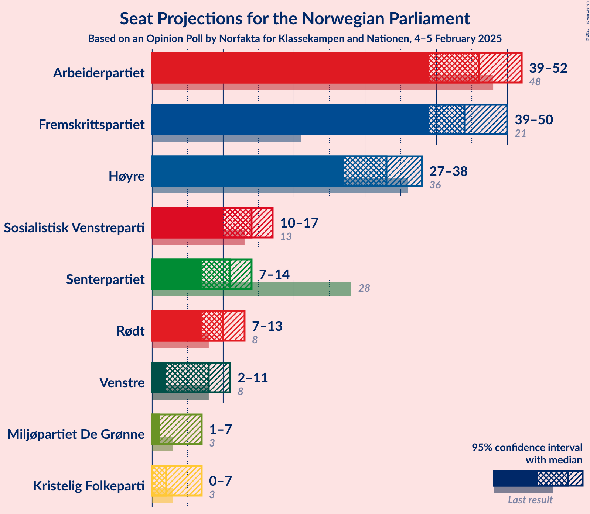
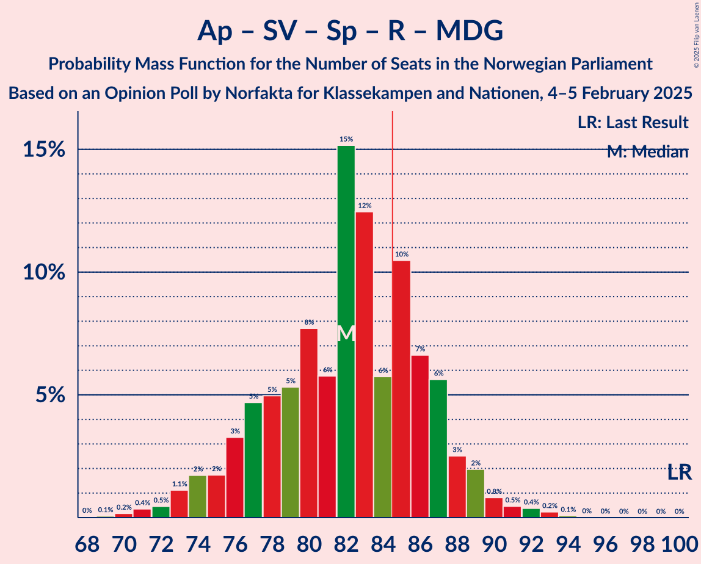
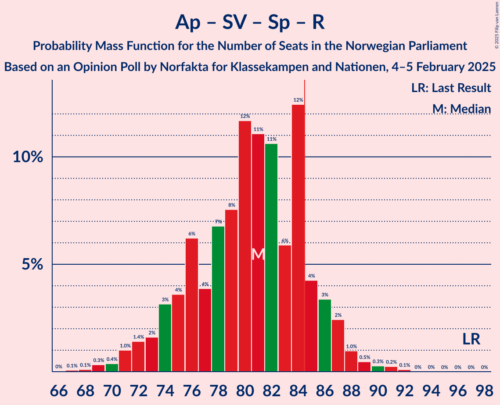
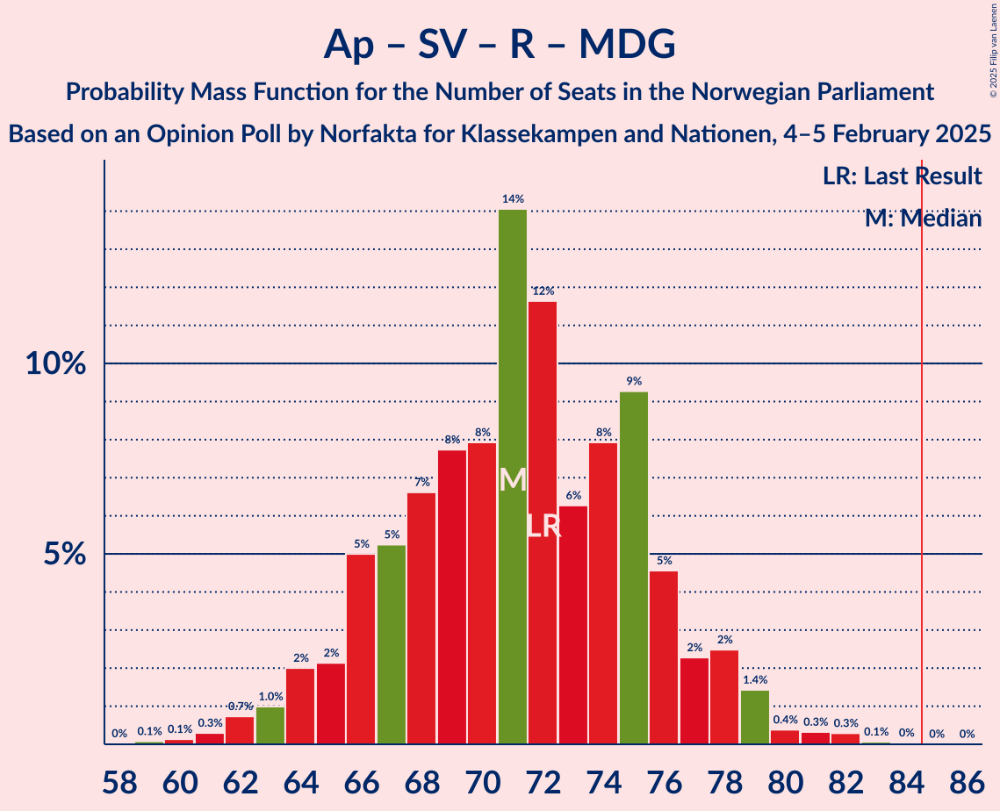
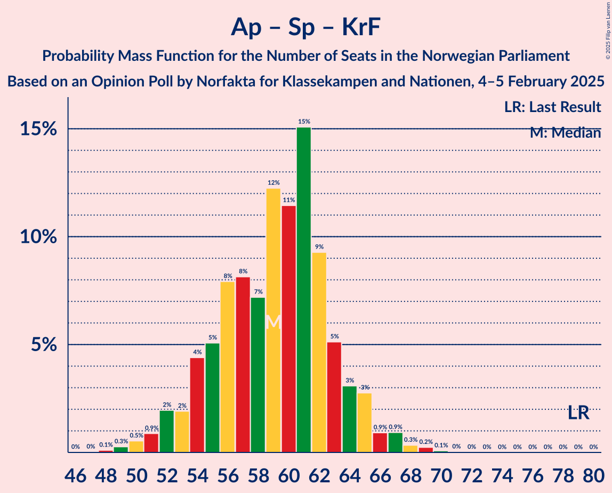
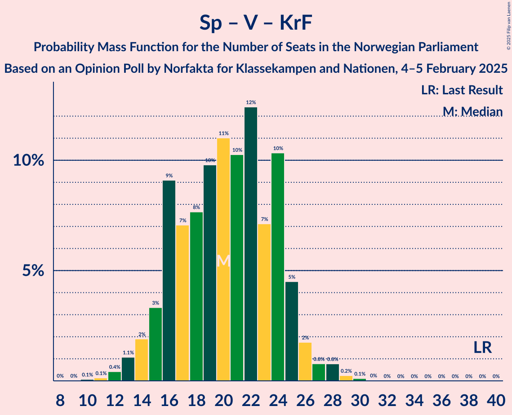

# Opinion Poll by Norfakta for Klassekampen and Nationen, 4–5 February 2025

<a href="#voting-intentions">Voting Intentions</a> | <a href="#seats">Seats</a> | <a href="#coalitions">Coalitions</a> | <a href="#technical-information">Technical Information</a>

## Voting Intentions

### Confidence Intervals

| Party | Last Result | Poll Result | 80% Confidence Interval | 90% Confidence Interval | 95% Confidence Interval | 99% Confidence Interval |
|:-----:|:-----------:|:-----------:|:-----------------------:|:-----------------------:|:-----------------------:|:-----------------------:|
| Arbeiderpartiet | 26.2% | 24.6% | 22.7–26.7% |22.2–27.3% |21.7–27.8% |20.8–28.8% |
| Fremskrittspartiet | 11.6% | 24.6% | 22.7–26.7% |22.2–27.3% |21.7–27.8% |20.8–28.8% |
| Høyre | 20.4% | 18.1% | 16.4–20.0% |16.0–20.5% |15.6–21.0% |14.8–21.9% |
| Sosialistisk Venstreparti | 7.6% | 7.6% | 6.5–9.0% |6.2–9.4% |6.0–9.7% |5.5–10.4% |
| Senterpartiet | 13.5% | 6.1% | 5.1–7.3% |4.8–7.7% |4.6–8.0% |4.2–8.6% |
| Rødt | 4.7% | 5.7% | 4.8–6.9% |4.5–7.3% |4.3–7.6% |3.9–8.2% |
| Venstre | 4.6% | 4.5% | 3.7–5.7% |3.5–6.0% |3.3–6.2% |2.9–6.8% |
| Kristelig Folkeparti | 3.8% | 3.0% | 2.3–3.9% |2.1–4.2% |2.0–4.4% |1.7–4.9% |
| Miljøpartiet De Grønne | 3.9% | 2.7% | 2.1–3.6% |1.9–3.9% |1.8–4.1% |1.5–4.6% |

*Note:* The poll result column reflects the actual value used in the calculations. Published results may vary slightly, and in addition be rounded to fewer digits.

## Seats

### Confidence Intervals

| Party | Last Result | Median | 80% Confidence Interval | 90% Confidence Interval | 95% Confidence Interval | 99% Confidence Interval |
|:-----:|:-----------:|:------:|:-----------------------:|:-----------------------:|:-----------------------:|:-----------------------:|
| <a href="#arbeiderpartiet">Arbeiderpartiet</a> | 48 | 46 | 42–50 |40–51 |39–52 |38–54 |
| <a href="#fremskrittspartiet">Fremskrittspartiet</a> | 21 | 44 | 41–49 |40–49 |39–50 |38–52 |
| <a href="#høyre">Høyre</a> | 36 | 33 | 29–36 |28–36 |27–38 |25–39 |
| <a href="#sosialistisk-venstreparti">Sosialistisk Venstreparti</a> | 13 | 14 | 11–16 |10–17 |10–17 |9–19 |
| <a href="#senterpartiet">Senterpartiet</a> | 28 | 11 | 9–13 |8–14 |7–14 |6–15 |
| <a href="#rødt">Rødt</a> | 8 | 10 | 8–12 |8–13 |7–13 |1–14 |
| <a href="#venstre">Venstre</a> | 8 | 8 | 3–10 |3–10 |2–11 |2–12 |
| <a href="#kristelig-folkeparti">Kristelig Folkeparti</a> | 3 | 2 | 0–3 |0–7 |0–7 |0–8 |
| <a href="#miljøpartiet-de-grønne">Miljøpartiet De Grønne</a> | 3 | 1 | 1–3 |1–3 |1–7 |0–8 |

### Arbeiderpartiet

*For a full overview of the results for this party, see the [Arbeiderpartiet](party-arbeiderpartiet.html) page.*

| Number of Seats | Probability | Accumulated | Special Marks |
|:---------------:|:-----------:|:-----------:|:-------------:|
| 36 | 0.1% | 100% |  |
| 37 | 0.3% | 99.9% |  |
| 38 | 0.9% | 99.6% |  |
| 39 | 2% | 98.7% |  |
| 40 | 3% | 97% |  |
| 41 | 4% | 94% |  |
| 42 | 3% | 90% |  |
| 43 | 8% | 87% |  |
| 44 | 11% | 80% |  |
| 45 | 10% | 69% |  |
| 46 | 11% | 59% | Median |
| 47 | 14% | 47% |  |
| 48 | 13% | 34% | Last Result |
| 49 | 8% | 21% |  |
| 50 | 4% | 13% |  |
| 51 | 4% | 9% |  |
| 52 | 2% | 4% |  |
| 53 | 1.2% | 2% |  |
| 54 | 0.9% | 1.2% |  |
| 55 | 0.2% | 0.3% |  |
| 56 | 0.1% | 0.1% |  |
| 57 | 0% | 0% |  |

### Fremskrittspartiet

*For a full overview of the results for this party, see the [Fremskrittspartiet](party-fremskrittspartiet.html) page.*

| Number of Seats | Probability | Accumulated | Special Marks |
|:---------------:|:-----------:|:-----------:|:-------------:|
| 21 | 0% | 100% | Last Result |
| 22 | 0% | 100% |  |
| 23 | 0% | 100% |  |
| 24 | 0% | 100% |  |
| 25 | 0% | 100% |  |
| 26 | 0% | 100% |  |
| 27 | 0% | 100% |  |
| 28 | 0% | 100% |  |
| 29 | 0% | 100% |  |
| 30 | 0% | 100% |  |
| 31 | 0% | 100% |  |
| 32 | 0% | 100% |  |
| 33 | 0% | 100% |  |
| 34 | 0% | 100% |  |
| 35 | 0% | 100% |  |
| 36 | 0.1% | 100% |  |
| 37 | 0.1% | 99.9% |  |
| 38 | 0.4% | 99.8% |  |
| 39 | 2% | 99.5% |  |
| 40 | 4% | 97% |  |
| 41 | 5% | 93% |  |
| 42 | 15% | 88% |  |
| 43 | 16% | 73% |  |
| 44 | 11% | 57% | Median |
| 45 | 12% | 46% |  |
| 46 | 9% | 35% |  |
| 47 | 7% | 26% |  |
| 48 | 7% | 19% |  |
| 49 | 8% | 12% |  |
| 50 | 3% | 4% |  |
| 51 | 0.7% | 1.2% |  |
| 52 | 0.3% | 0.5% |  |
| 53 | 0.2% | 0.3% |  |
| 54 | 0.1% | 0.1% |  |
| 55 | 0% | 0% |  |

### Høyre

*For a full overview of the results for this party, see the [Høyre](party-høyre.html) page.*

| Number of Seats | Probability | Accumulated | Special Marks |
|:---------------:|:-----------:|:-----------:|:-------------:|
| 23 | 0.1% | 100% |  |
| 24 | 0.2% | 99.9% |  |
| 25 | 0.4% | 99.7% |  |
| 26 | 0.7% | 99.3% |  |
| 27 | 2% | 98.5% |  |
| 28 | 3% | 96% |  |
| 29 | 7% | 93% |  |
| 30 | 10% | 87% |  |
| 31 | 15% | 77% |  |
| 32 | 10% | 62% |  |
| 33 | 17% | 52% | Median |
| 34 | 16% | 35% |  |
| 35 | 9% | 19% |  |
| 36 | 5% | 10% | Last Result |
| 37 | 2% | 5% |  |
| 38 | 2% | 3% |  |
| 39 | 0.6% | 1.0% |  |
| 40 | 0.2% | 0.4% |  |
| 41 | 0.1% | 0.1% |  |
| 42 | 0.1% | 0.1% |  |
| 43 | 0% | 0% |  |

### Sosialistisk Venstreparti

*For a full overview of the results for this party, see the [Sosialistisk Venstreparti](party-sosialistiskvenstreparti.html) page.*

| Number of Seats | Probability | Accumulated | Special Marks |
|:---------------:|:-----------:|:-----------:|:-------------:|
| 8 | 0.1% | 100% |  |
| 9 | 1.0% | 99.9% |  |
| 10 | 4% | 98.9% |  |
| 11 | 10% | 95% |  |
| 12 | 13% | 85% |  |
| 13 | 20% | 72% | Last Result |
| 14 | 22% | 51% | Median |
| 15 | 17% | 29% |  |
| 16 | 6% | 12% |  |
| 17 | 4% | 6% |  |
| 18 | 2% | 2% |  |
| 19 | 0.5% | 0.6% |  |
| 20 | 0.1% | 0.1% |  |
| 21 | 0% | 0% |  |

### Senterpartiet

*For a full overview of the results for this party, see the [Senterpartiet](party-senterpartiet.html) page.*

| Number of Seats | Probability | Accumulated | Special Marks |
|:---------------:|:-----------:|:-----------:|:-------------:|
| 0 | 0.2% | 100% |  |
| 1 | 0.1% | 99.8% |  |
| 2 | 0% | 99.7% |  |
| 3 | 0% | 99.7% |  |
| 4 | 0% | 99.7% |  |
| 5 | 0% | 99.7% |  |
| 6 | 0.3% | 99.7% |  |
| 7 | 2% | 99.5% |  |
| 8 | 6% | 97% |  |
| 9 | 13% | 91% |  |
| 10 | 17% | 78% |  |
| 11 | 25% | 60% | Median |
| 12 | 18% | 35% |  |
| 13 | 11% | 17% |  |
| 14 | 5% | 6% |  |
| 15 | 0.9% | 1.3% |  |
| 16 | 0.3% | 0.4% |  |
| 17 | 0.1% | 0.1% |  |
| 18 | 0% | 0% |  |
| 19 | 0% | 0% |  |
| 20 | 0% | 0% |  |
| 21 | 0% | 0% |  |
| 22 | 0% | 0% |  |
| 23 | 0% | 0% |  |
| 24 | 0% | 0% |  |
| 25 | 0% | 0% |  |
| 26 | 0% | 0% |  |
| 27 | 0% | 0% |  |
| 28 | 0% | 0% | Last Result |

### Rødt

*For a full overview of the results for this party, see the [Rødt](party-rødt.html) page.*

| Number of Seats | Probability | Accumulated | Special Marks |
|:---------------:|:-----------:|:-----------:|:-------------:|
| 1 | 1.1% | 100% |  |
| 2 | 0% | 98.9% |  |
| 3 | 0% | 98.9% |  |
| 4 | 0% | 98.9% |  |
| 5 | 0% | 98.9% |  |
| 6 | 0.2% | 98.9% |  |
| 7 | 3% | 98.7% |  |
| 8 | 11% | 96% | Last Result |
| 9 | 24% | 85% |  |
| 10 | 22% | 62% | Median |
| 11 | 24% | 40% |  |
| 12 | 10% | 16% |  |
| 13 | 4% | 6% |  |
| 14 | 1.2% | 2% |  |
| 15 | 0.4% | 0.5% |  |
| 16 | 0.1% | 0.1% |  |
| 17 | 0% | 0% |  |

### Venstre

*For a full overview of the results for this party, see the [Venstre](party-venstre.html) page.*

| Number of Seats | Probability | Accumulated | Special Marks |
|:---------------:|:-----------:|:-----------:|:-------------:|
| 2 | 3% | 100% |  |
| 3 | 20% | 97% |  |
| 4 | 0% | 77% |  |
| 5 | 0% | 77% |  |
| 6 | 0.8% | 77% |  |
| 7 | 15% | 76% |  |
| 8 | 26% | 61% | Last Result, Median |
| 9 | 22% | 35% |  |
| 10 | 10% | 13% |  |
| 11 | 3% | 3% |  |
| 12 | 0.5% | 0.7% |  |
| 13 | 0.2% | 0.2% |  |
| 14 | 0% | 0% |  |

### Kristelig Folkeparti

*For a full overview of the results for this party, see the [Kristelig Folkeparti](party-kristeligfolkeparti.html) page.*

| Number of Seats | Probability | Accumulated | Special Marks |
|:---------------:|:-----------:|:-----------:|:-------------:|
| 0 | 12% | 100% |  |
| 1 | 13% | 88% |  |
| 2 | 44% | 75% | Median |
| 3 | 24% | 31% | Last Result |
| 4 | 0% | 7% |  |
| 5 | 0% | 7% |  |
| 6 | 0.8% | 7% |  |
| 7 | 4% | 6% |  |
| 8 | 2% | 2% |  |
| 9 | 0.2% | 0.2% |  |
| 10 | 0% | 0% |  |

### Miljøpartiet De Grønne

*For a full overview of the results for this party, see the [Miljøpartiet De Grønne](party-miljøpartietdegrønne.html) page.*

| Number of Seats | Probability | Accumulated | Special Marks |
|:---------------:|:-----------:|:-----------:|:-------------:|
| 0 | 1.0% | 100% |  |
| 1 | 55% | 99.0% | Median |
| 2 | 33% | 44% |  |
| 3 | 8% | 12% | Last Result |
| 4 | 0% | 3% |  |
| 5 | 0% | 3% |  |
| 6 | 0.6% | 3% |  |
| 7 | 2% | 3% |  |
| 8 | 0.8% | 0.9% |  |
| 9 | 0.1% | 0.1% |  |
| 10 | 0% | 0% |  |

## Coalitions

### Confidence Intervals

| Coalition | Last Result | Median | Majority? | 80% Confidence Interval | 90% Confidence Interval | 95% Confidence Interval | 99% Confidence Interval |
|:---------:|:-----------:|:------:|:---------:|:-----------------------:|:-----------------------:|:-----------------------:|:-----------------------:|
| Fremskrittspartiet – Høyre – Senterpartiet – Venstre – Kristelig Folkeparti | 96 | 97 | 99.9% | 92–102 | 91–103 | 90–104 | 87–106 |
| Fremskrittspartiet – Høyre – Venstre – Kristelig Folkeparti – Miljøpartiet De Grønne | 71 | 88 | 85% | 83–93 | 82–94 | 81–95 | 78–97 |
| Fremskrittspartiet – Høyre – Venstre – Kristelig Folkeparti | 68 | 86 | 67% | 82–91 | 80–92 | 79–94 | 76–96 |
| Fremskrittspartiet – Høyre – Venstre | 65 | 84 | 44% | 80–89 | 78–90 | 77–91 | 74–93 |
| Arbeiderpartiet – Sosialistisk Venstreparti – Senterpartiet – Rødt – Miljøpartiet De Grønne | 100 | 82 | 29% | 77–87 | 75–88 | 74–89 | 71–92 |
| Arbeiderpartiet – Sosialistisk Venstreparti – Senterpartiet – Rødt | 97 | 81 | 12% | 75–85 | 74–86 | 72–87 | 69–90 |
| Fremskrittspartiet – Høyre | 57 | 77 | 2% | 72–82 | 71–83 | 70–84 | 68–86 |
| Arbeiderpartiet – Sosialistisk Venstreparti – Senterpartiet – Kristelig Folkeparti – Miljøpartiet De Grønne | 95 | 74 | 0.3% | 70–79 | 68–80 | 66–81 | 64–84 |
| Arbeiderpartiet – Sosialistisk Venstreparti – Rødt – Miljøpartiet De Grønne | 72 | 71 | 0% | 66–76 | 65–78 | 64–79 | 61–81 |
| Arbeiderpartiet – Sosialistisk Venstreparti – Senterpartiet – Miljøpartiet De Grønne | 92 | 72 | 0% | 67–77 | 65–78 | 64–79 | 62–81 |
| Arbeiderpartiet – Sosialistisk Venstreparti – Senterpartiet | 89 | 71 | 0% | 66–75 | 64–76 | 63–77 | 61–79 |
| Arbeiderpartiet – Senterpartiet – Kristelig Folkeparti – Miljøpartiet De Grønne | 82 | 61 | 0% | 56–65 | 55–67 | 53–68 | 51–70 |
| Arbeiderpartiet – Sosialistisk Venstreparti | 61 | 60 | 0% | 55–64 | 54–65 | 52–67 | 51–68 |
| Arbeiderpartiet – Senterpartiet – Kristelig Folkeparti | 79 | 59 | 0% | 54–63 | 53–65 | 52–66 | 50–68 |
| Arbeiderpartiet – Senterpartiet | 76 | 58 | 0% | 52–61 | 51–62 | 50–63 | 48–65 |
| Høyre – Venstre – Kristelig Folkeparti | 47 | 42 | 0% | 38–46 | 36–47 | 35–48 | 33–50 |
| Senterpartiet – Venstre – Kristelig Folkeparti | 39 | 20 | 0% | 16–24 | 15–25 | 14–26 | 12–28 |

### Fremskrittspartiet – Høyre – Senterpartiet – Venstre – Kristelig Folkeparti

| Number of Seats | Probability | Accumulated | Special Marks |
|:---------------:|:-----------:|:-----------:|:-------------:|
| 84 | 0% | 100% |  |
| 85 | 0.1% | 99.9% | Majority |
| 86 | 0.2% | 99.9% |  |
| 87 | 0.4% | 99.7% |  |
| 88 | 0.6% | 99.2% |  |
| 89 | 0.6% | 98.7% |  |
| 90 | 2% | 98% |  |
| 91 | 3% | 96% |  |
| 92 | 3% | 93% |  |
| 93 | 5% | 90% |  |
| 94 | 10% | 85% |  |
| 95 | 8% | 75% |  |
| 96 | 7% | 67% | Last Result |
| 97 | 12% | 60% |  |
| 98 | 15% | 49% | Median |
| 99 | 7% | 34% |  |
| 100 | 8% | 26% |  |
| 101 | 6% | 18% |  |
| 102 | 6% | 12% |  |
| 103 | 3% | 6% |  |
| 104 | 1.2% | 3% |  |
| 105 | 0.9% | 2% |  |
| 106 | 0.4% | 0.8% |  |
| 107 | 0.2% | 0.3% |  |
| 108 | 0.1% | 0.1% |  |
| 109 | 0% | 0.1% |  |
| 110 | 0% | 0% |  |

### Fremskrittspartiet – Høyre – Venstre – Kristelig Folkeparti – Miljøpartiet De Grønne

| Number of Seats | Probability | Accumulated | Special Marks |
|:---------------:|:-----------:|:-----------:|:-------------:|
| 71 | 0% | 100% | Last Result |
| 72 | 0% | 100% |  |
| 73 | 0% | 100% |  |
| 74 | 0% | 100% |  |
| 75 | 0% | 100% |  |
| 76 | 0.1% | 99.9% |  |
| 77 | 0.1% | 99.9% |  |
| 78 | 0.3% | 99.7% |  |
| 79 | 0.4% | 99.4% |  |
| 80 | 0.6% | 99.0% |  |
| 81 | 2% | 98% |  |
| 82 | 3% | 97% |  |
| 83 | 4% | 94% |  |
| 84 | 5% | 90% |  |
| 85 | 13% | 85% | Majority |
| 86 | 6% | 72% |  |
| 87 | 11% | 66% |  |
| 88 | 11% | 54% | Median |
| 89 | 12% | 44% |  |
| 90 | 9% | 32% |  |
| 91 | 6% | 23% |  |
| 92 | 5% | 17% |  |
| 93 | 5% | 12% |  |
| 94 | 2% | 7% |  |
| 95 | 3% | 5% |  |
| 96 | 0.8% | 2% |  |
| 97 | 0.6% | 1.0% |  |
| 98 | 0.2% | 0.4% |  |
| 99 | 0.1% | 0.2% |  |
| 100 | 0% | 0.1% |  |
| 101 | 0% | 0.1% |  |
| 102 | 0% | 0% |  |

### Fremskrittspartiet – Høyre – Venstre – Kristelig Folkeparti

| Number of Seats | Probability | Accumulated | Special Marks |
|:---------------:|:-----------:|:-----------:|:-------------:|
| 68 | 0% | 100% | Last Result |
| 69 | 0% | 100% |  |
| 70 | 0% | 100% |  |
| 71 | 0% | 100% |  |
| 72 | 0% | 100% |  |
| 73 | 0% | 100% |  |
| 74 | 0.1% | 100% |  |
| 75 | 0.2% | 99.9% |  |
| 76 | 0.3% | 99.7% |  |
| 77 | 0.5% | 99.4% |  |
| 78 | 0.6% | 98.9% |  |
| 79 | 1.4% | 98% |  |
| 80 | 2% | 97% |  |
| 81 | 3% | 94% |  |
| 82 | 6% | 91% |  |
| 83 | 7% | 85% |  |
| 84 | 11% | 78% |  |
| 85 | 6% | 67% | Majority |
| 86 | 13% | 61% |  |
| 87 | 16% | 48% | Median |
| 88 | 6% | 33% |  |
| 89 | 8% | 27% |  |
| 90 | 4% | 18% |  |
| 91 | 7% | 14% |  |
| 92 | 3% | 8% |  |
| 93 | 2% | 5% |  |
| 94 | 2% | 3% |  |
| 95 | 0.6% | 1.2% |  |
| 96 | 0.3% | 0.5% |  |
| 97 | 0.1% | 0.2% |  |
| 98 | 0.1% | 0.1% |  |
| 99 | 0% | 0.1% |  |
| 100 | 0% | 0% |  |

### Fremskrittspartiet – Høyre – Venstre

| Number of Seats | Probability | Accumulated | Special Marks |
|:---------------:|:-----------:|:-----------:|:-------------:|
| 65 | 0% | 100% | Last Result |
| 66 | 0% | 100% |  |
| 67 | 0% | 100% |  |
| 68 | 0% | 100% |  |
| 69 | 0% | 100% |  |
| 70 | 0% | 100% |  |
| 71 | 0% | 100% |  |
| 72 | 0.1% | 100% |  |
| 73 | 0.2% | 99.9% |  |
| 74 | 0.2% | 99.7% |  |
| 75 | 0.4% | 99.5% |  |
| 76 | 0.8% | 99.1% |  |
| 77 | 2% | 98% |  |
| 78 | 3% | 96% |  |
| 79 | 3% | 93% |  |
| 80 | 7% | 90% |  |
| 81 | 7% | 83% |  |
| 82 | 9% | 77% |  |
| 83 | 10% | 67% |  |
| 84 | 14% | 58% |  |
| 85 | 10% | 44% | Median, Majority |
| 86 | 9% | 34% |  |
| 87 | 8% | 25% |  |
| 88 | 5% | 17% |  |
| 89 | 6% | 12% |  |
| 90 | 2% | 6% |  |
| 91 | 2% | 4% |  |
| 92 | 0.9% | 2% |  |
| 93 | 0.6% | 1.0% |  |
| 94 | 0.2% | 0.4% |  |
| 95 | 0.1% | 0.2% |  |
| 96 | 0.1% | 0.1% |  |
| 97 | 0% | 0% |  |

### Arbeiderpartiet – Sosialistisk Venstreparti – Senterpartiet – Rødt – Miljøpartiet De Grønne

| Number of Seats | Probability | Accumulated | Special Marks |
|:---------------:|:-----------:|:-----------:|:-------------:|
| 68 | 0% | 100% |  |
| 69 | 0.1% | 99.9% |  |
| 70 | 0.2% | 99.9% |  |
| 71 | 0.4% | 99.7% |  |
| 72 | 0.5% | 99.3% |  |
| 73 | 1.1% | 98.9% |  |
| 74 | 2% | 98% |  |
| 75 | 2% | 96% |  |
| 76 | 3% | 94% |  |
| 77 | 5% | 91% |  |
| 78 | 5% | 86% |  |
| 79 | 5% | 81% |  |
| 80 | 8% | 76% |  |
| 81 | 6% | 68% |  |
| 82 | 15% | 63% | Median |
| 83 | 12% | 47% |  |
| 84 | 6% | 35% |  |
| 85 | 10% | 29% | Majority |
| 86 | 7% | 19% |  |
| 87 | 6% | 12% |  |
| 88 | 3% | 6% |  |
| 89 | 2% | 4% |  |
| 90 | 0.8% | 2% |  |
| 91 | 0.5% | 1.2% |  |
| 92 | 0.4% | 0.7% |  |
| 93 | 0.2% | 0.3% |  |
| 94 | 0.1% | 0.1% |  |
| 95 | 0% | 0% |  |
| 96 | 0% | 0% |  |
| 97 | 0% | 0% |  |
| 98 | 0% | 0% |  |
| 99 | 0% | 0% |  |
| 100 | 0% | 0% | Last Result |

### Arbeiderpartiet – Sosialistisk Venstreparti – Senterpartiet – Rødt

| Number of Seats | Probability | Accumulated | Special Marks |
|:---------------:|:-----------:|:-----------:|:-------------:|
| 66 | 0% | 100% |  |
| 67 | 0.1% | 99.9% |  |
| 68 | 0.1% | 99.9% |  |
| 69 | 0.3% | 99.8% |  |
| 70 | 0.4% | 99.4% |  |
| 71 | 1.0% | 99.1% |  |
| 72 | 1.4% | 98% |  |
| 73 | 2% | 97% |  |
| 74 | 3% | 95% |  |
| 75 | 4% | 92% |  |
| 76 | 6% | 88% |  |
| 77 | 4% | 82% |  |
| 78 | 7% | 78% |  |
| 79 | 8% | 71% |  |
| 80 | 12% | 64% |  |
| 81 | 11% | 52% | Median |
| 82 | 11% | 41% |  |
| 83 | 6% | 30% |  |
| 84 | 12% | 25% |  |
| 85 | 4% | 12% | Majority |
| 86 | 3% | 8% |  |
| 87 | 2% | 5% |  |
| 88 | 1.0% | 2% |  |
| 89 | 0.5% | 1.1% |  |
| 90 | 0.3% | 0.6% |  |
| 91 | 0.2% | 0.4% |  |
| 92 | 0.1% | 0.1% |  |
| 93 | 0% | 0% |  |
| 94 | 0% | 0% |  |
| 95 | 0% | 0% |  |
| 96 | 0% | 0% |  |
| 97 | 0% | 0% | Last Result |

### Fremskrittspartiet – Høyre

| Number of Seats | Probability | Accumulated | Special Marks |
|:---------------:|:-----------:|:-----------:|:-------------:|
| 57 | 0% | 100% | Last Result |
| 58 | 0% | 100% |  |
| 59 | 0% | 100% |  |
| 60 | 0% | 100% |  |
| 61 | 0% | 100% |  |
| 62 | 0% | 100% |  |
| 63 | 0% | 100% |  |
| 64 | 0% | 100% |  |
| 65 | 0% | 100% |  |
| 66 | 0.1% | 100% |  |
| 67 | 0.2% | 99.9% |  |
| 68 | 0.4% | 99.7% |  |
| 69 | 0.8% | 99.4% |  |
| 70 | 3% | 98.6% |  |
| 71 | 3% | 96% |  |
| 72 | 3% | 93% |  |
| 73 | 9% | 90% |  |
| 74 | 10% | 81% |  |
| 75 | 9% | 71% |  |
| 76 | 7% | 62% |  |
| 77 | 11% | 55% | Median |
| 78 | 11% | 44% |  |
| 79 | 8% | 32% |  |
| 80 | 6% | 25% |  |
| 81 | 6% | 19% |  |
| 82 | 6% | 13% |  |
| 83 | 3% | 7% |  |
| 84 | 2% | 4% |  |
| 85 | 1.1% | 2% | Majority |
| 86 | 0.4% | 0.7% |  |
| 87 | 0.2% | 0.3% |  |
| 88 | 0.1% | 0.1% |  |
| 89 | 0% | 0.1% |  |
| 90 | 0% | 0% |  |

### Arbeiderpartiet – Sosialistisk Venstreparti – Senterpartiet – Kristelig Folkeparti – Miljøpartiet De Grønne

| Number of Seats | Probability | Accumulated | Special Marks |
|:---------------:|:-----------:|:-----------:|:-------------:|
| 62 | 0.1% | 100% |  |
| 63 | 0.2% | 99.9% |  |
| 64 | 0.3% | 99.8% |  |
| 65 | 0.7% | 99.5% |  |
| 66 | 1.4% | 98.8% |  |
| 67 | 1.4% | 97% |  |
| 68 | 3% | 96% |  |
| 69 | 2% | 93% |  |
| 70 | 8% | 91% |  |
| 71 | 4% | 83% |  |
| 72 | 7% | 79% |  |
| 73 | 12% | 72% |  |
| 74 | 13% | 61% | Median |
| 75 | 7% | 48% |  |
| 76 | 15% | 41% |  |
| 77 | 8% | 26% |  |
| 78 | 6% | 18% |  |
| 79 | 4% | 11% |  |
| 80 | 3% | 7% |  |
| 81 | 2% | 5% |  |
| 82 | 1.4% | 2% |  |
| 83 | 0.6% | 1.1% |  |
| 84 | 0.3% | 0.5% |  |
| 85 | 0.1% | 0.3% | Majority |
| 86 | 0.1% | 0.1% |  |
| 87 | 0% | 0.1% |  |
| 88 | 0% | 0% |  |
| 89 | 0% | 0% |  |
| 90 | 0% | 0% |  |
| 91 | 0% | 0% |  |
| 92 | 0% | 0% |  |
| 93 | 0% | 0% |  |
| 94 | 0% | 0% |  |
| 95 | 0% | 0% | Last Result |

### Arbeiderpartiet – Sosialistisk Venstreparti – Rødt – Miljøpartiet De Grønne

| Number of Seats | Probability | Accumulated | Special Marks |
|:---------------:|:-----------:|:-----------:|:-------------:|
| 59 | 0.1% | 100% |  |
| 60 | 0.1% | 99.9% |  |
| 61 | 0.3% | 99.7% |  |
| 62 | 0.7% | 99.4% |  |
| 63 | 1.0% | 98.7% |  |
| 64 | 2% | 98% |  |
| 65 | 2% | 96% |  |
| 66 | 5% | 94% |  |
| 67 | 5% | 89% |  |
| 68 | 7% | 83% |  |
| 69 | 8% | 77% |  |
| 70 | 8% | 69% |  |
| 71 | 14% | 61% | Median |
| 72 | 12% | 47% | Last Result |
| 73 | 6% | 35% |  |
| 74 | 8% | 29% |  |
| 75 | 9% | 21% |  |
| 76 | 5% | 12% |  |
| 77 | 2% | 7% |  |
| 78 | 2% | 5% |  |
| 79 | 1.4% | 3% |  |
| 80 | 0.4% | 1.1% |  |
| 81 | 0.3% | 0.7% |  |
| 82 | 0.3% | 0.4% |  |
| 83 | 0.1% | 0.1% |  |
| 84 | 0% | 0.1% |  |
| 85 | 0% | 0% | Majority |

### Arbeiderpartiet – Sosialistisk Venstreparti – Senterpartiet – Miljøpartiet De Grønne

| Number of Seats | Probability | Accumulated | Special Marks |
|:---------------:|:-----------:|:-----------:|:-------------:|
| 60 | 0.1% | 100% |  |
| 61 | 0.1% | 99.9% |  |
| 62 | 0.3% | 99.8% |  |
| 63 | 0.7% | 99.4% |  |
| 64 | 2% | 98.8% |  |
| 65 | 3% | 97% |  |
| 66 | 2% | 94% |  |
| 67 | 3% | 92% |  |
| 68 | 6% | 89% |  |
| 69 | 6% | 83% |  |
| 70 | 5% | 77% |  |
| 71 | 12% | 72% |  |
| 72 | 12% | 60% | Median |
| 73 | 15% | 48% |  |
| 74 | 10% | 33% |  |
| 75 | 7% | 24% |  |
| 76 | 6% | 16% |  |
| 77 | 4% | 10% |  |
| 78 | 3% | 7% |  |
| 79 | 1.1% | 3% |  |
| 80 | 1.3% | 2% |  |
| 81 | 0.6% | 1.0% |  |
| 82 | 0.3% | 0.4% |  |
| 83 | 0.1% | 0.2% |  |
| 84 | 0% | 0.1% |  |
| 85 | 0% | 0% | Majority |
| 86 | 0% | 0% |  |
| 87 | 0% | 0% |  |
| 88 | 0% | 0% |  |
| 89 | 0% | 0% |  |
| 90 | 0% | 0% |  |
| 91 | 0% | 0% |  |
| 92 | 0% | 0% | Last Result |

### Arbeiderpartiet – Sosialistisk Venstreparti – Senterpartiet

| Number of Seats | Probability | Accumulated | Special Marks |
|:---------------:|:-----------:|:-----------:|:-------------:|
| 58 | 0% | 100% |  |
| 59 | 0.1% | 99.9% |  |
| 60 | 0.3% | 99.8% |  |
| 61 | 0.4% | 99.6% |  |
| 62 | 0.9% | 99.1% |  |
| 63 | 3% | 98% |  |
| 64 | 3% | 96% |  |
| 65 | 2% | 93% |  |
| 66 | 5% | 90% |  |
| 67 | 5% | 85% |  |
| 68 | 6% | 80% |  |
| 69 | 11% | 74% |  |
| 70 | 10% | 63% |  |
| 71 | 10% | 52% | Median |
| 72 | 16% | 42% |  |
| 73 | 8% | 26% |  |
| 74 | 7% | 18% |  |
| 75 | 4% | 11% |  |
| 76 | 2% | 7% |  |
| 77 | 3% | 5% |  |
| 78 | 1.1% | 2% |  |
| 79 | 0.4% | 0.9% |  |
| 80 | 0.4% | 0.5% |  |
| 81 | 0.1% | 0.1% |  |
| 82 | 0% | 0% |  |
| 83 | 0% | 0% |  |
| 84 | 0% | 0% |  |
| 85 | 0% | 0% | Majority |
| 86 | 0% | 0% |  |
| 87 | 0% | 0% |  |
| 88 | 0% | 0% |  |
| 89 | 0% | 0% | Last Result |

### Arbeiderpartiet – Senterpartiet – Kristelig Folkeparti – Miljøpartiet De Grønne

| Number of Seats | Probability | Accumulated | Special Marks |
|:---------------:|:-----------:|:-----------:|:-------------:|
| 49 | 0% | 100% |  |
| 50 | 0.2% | 99.9% |  |
| 51 | 0.5% | 99.7% |  |
| 52 | 0.6% | 99.3% |  |
| 53 | 1.4% | 98.7% |  |
| 54 | 2% | 97% |  |
| 55 | 3% | 95% |  |
| 56 | 4% | 92% |  |
| 57 | 6% | 89% |  |
| 58 | 7% | 83% |  |
| 59 | 9% | 76% |  |
| 60 | 11% | 66% | Median |
| 61 | 10% | 55% |  |
| 62 | 14% | 46% |  |
| 63 | 12% | 32% |  |
| 64 | 8% | 20% |  |
| 65 | 3% | 12% |  |
| 66 | 3% | 8% |  |
| 67 | 3% | 6% |  |
| 68 | 1.2% | 3% |  |
| 69 | 1.0% | 2% |  |
| 70 | 0.4% | 0.7% |  |
| 71 | 0.2% | 0.3% |  |
| 72 | 0.1% | 0.1% |  |
| 73 | 0% | 0.1% |  |
| 74 | 0% | 0% |  |
| 75 | 0% | 0% |  |
| 76 | 0% | 0% |  |
| 77 | 0% | 0% |  |
| 78 | 0% | 0% |  |
| 79 | 0% | 0% |  |
| 80 | 0% | 0% |  |
| 81 | 0% | 0% |  |
| 82 | 0% | 0% | Last Result |

### Arbeiderpartiet – Sosialistisk Venstreparti

| Number of Seats | Probability | Accumulated | Special Marks |
|:---------------:|:-----------:|:-----------:|:-------------:|
| 49 | 0.1% | 100% |  |
| 50 | 0.3% | 99.9% |  |
| 51 | 0.7% | 99.6% |  |
| 52 | 2% | 98.9% |  |
| 53 | 2% | 97% |  |
| 54 | 4% | 96% |  |
| 55 | 3% | 92% |  |
| 56 | 6% | 88% |  |
| 57 | 8% | 82% |  |
| 58 | 8% | 73% |  |
| 59 | 14% | 66% |  |
| 60 | 12% | 51% | Median |
| 61 | 11% | 40% | Last Result |
| 62 | 11% | 28% |  |
| 63 | 6% | 18% |  |
| 64 | 5% | 11% |  |
| 65 | 2% | 7% |  |
| 66 | 2% | 5% |  |
| 67 | 0.9% | 3% |  |
| 68 | 1.4% | 2% |  |
| 69 | 0.2% | 0.3% |  |
| 70 | 0.1% | 0.1% |  |
| 71 | 0% | 0.1% |  |
| 72 | 0% | 0% |  |

### Arbeiderpartiet – Senterpartiet – Kristelig Folkeparti

| Number of Seats | Probability | Accumulated | Special Marks |
|:---------------:|:-----------:|:-----------:|:-------------:|
| 48 | 0.1% | 100% |  |
| 49 | 0.3% | 99.8% |  |
| 50 | 0.5% | 99.6% |  |
| 51 | 0.9% | 99.0% |  |
| 52 | 2% | 98% |  |
| 53 | 2% | 96% |  |
| 54 | 4% | 94% |  |
| 55 | 5% | 90% |  |
| 56 | 8% | 85% |  |
| 57 | 8% | 77% |  |
| 58 | 7% | 69% |  |
| 59 | 12% | 62% | Median |
| 60 | 11% | 49% |  |
| 61 | 15% | 38% |  |
| 62 | 9% | 23% |  |
| 63 | 5% | 14% |  |
| 64 | 3% | 8% |  |
| 65 | 3% | 5% |  |
| 66 | 0.9% | 3% |  |
| 67 | 0.9% | 2% |  |
| 68 | 0.3% | 0.7% |  |
| 69 | 0.2% | 0.4% |  |
| 70 | 0.1% | 0.1% |  |
| 71 | 0% | 0% |  |
| 72 | 0% | 0% |  |
| 73 | 0% | 0% |  |
| 74 | 0% | 0% |  |
| 75 | 0% | 0% |  |
| 76 | 0% | 0% |  |
| 77 | 0% | 0% |  |
| 78 | 0% | 0% |  |
| 79 | 0% | 0% | Last Result |

### Arbeiderpartiet – Senterpartiet

| Number of Seats | Probability | Accumulated | Special Marks |
|:---------------:|:-----------:|:-----------:|:-------------:|
| 46 | 0.1% | 100% |  |
| 47 | 0.2% | 99.9% |  |
| 48 | 0.5% | 99.7% |  |
| 49 | 1.2% | 99.2% |  |
| 50 | 2% | 98% |  |
| 51 | 3% | 96% |  |
| 52 | 4% | 93% |  |
| 53 | 5% | 90% |  |
| 54 | 10% | 84% |  |
| 55 | 7% | 75% |  |
| 56 | 7% | 68% |  |
| 57 | 10% | 61% | Median |
| 58 | 19% | 51% |  |
| 59 | 13% | 32% |  |
| 60 | 8% | 19% |  |
| 61 | 4% | 11% |  |
| 62 | 4% | 7% |  |
| 63 | 1.3% | 3% |  |
| 64 | 1.2% | 2% |  |
| 65 | 0.4% | 0.6% |  |
| 66 | 0.2% | 0.2% |  |
| 67 | 0% | 0.1% |  |
| 68 | 0% | 0% |  |
| 69 | 0% | 0% |  |
| 70 | 0% | 0% |  |
| 71 | 0% | 0% |  |
| 72 | 0% | 0% |  |
| 73 | 0% | 0% |  |
| 74 | 0% | 0% |  |
| 75 | 0% | 0% |  |
| 76 | 0% | 0% | Last Result |

### Høyre – Venstre – Kristelig Folkeparti

| Number of Seats | Probability | Accumulated | Special Marks |
|:---------------:|:-----------:|:-----------:|:-------------:|
| 30 | 0.1% | 100% |  |
| 31 | 0.1% | 99.9% |  |
| 32 | 0.2% | 99.8% |  |
| 33 | 0.6% | 99.6% |  |
| 34 | 0.9% | 99.0% |  |
| 35 | 2% | 98% |  |
| 36 | 3% | 96% |  |
| 37 | 3% | 93% |  |
| 38 | 6% | 90% |  |
| 39 | 10% | 84% |  |
| 40 | 9% | 74% |  |
| 41 | 11% | 65% |  |
| 42 | 10% | 55% |  |
| 43 | 13% | 44% | Median |
| 44 | 8% | 31% |  |
| 45 | 11% | 23% |  |
| 46 | 6% | 12% |  |
| 47 | 3% | 6% | Last Result |
| 48 | 1.3% | 3% |  |
| 49 | 1.0% | 2% |  |
| 50 | 0.3% | 0.5% |  |
| 51 | 0.1% | 0.2% |  |
| 52 | 0.1% | 0.1% |  |
| 53 | 0.1% | 0.1% |  |
| 54 | 0% | 0% |  |

### Senterpartiet – Venstre – Kristelig Folkeparti

| Number of Seats | Probability | Accumulated | Special Marks |
|:---------------:|:-----------:|:-----------:|:-------------:|
| 8 | 0% | 100% |  |
| 9 | 0% | 99.9% |  |
| 10 | 0.1% | 99.9% |  |
| 11 | 0.1% | 99.8% |  |
| 12 | 0.4% | 99.7% |  |
| 13 | 1.1% | 99.3% |  |
| 14 | 2% | 98% |  |
| 15 | 3% | 96% |  |
| 16 | 9% | 93% |  |
| 17 | 7% | 84% |  |
| 18 | 8% | 77% |  |
| 19 | 10% | 69% |  |
| 20 | 11% | 59% |  |
| 21 | 10% | 48% | Median |
| 22 | 12% | 38% |  |
| 23 | 7% | 26% |  |
| 24 | 10% | 19% |  |
| 25 | 5% | 8% |  |
| 26 | 2% | 4% |  |
| 27 | 0.8% | 2% |  |
| 28 | 0.8% | 1.2% |  |
| 29 | 0.2% | 0.4% |  |
| 30 | 0.1% | 0.2% |  |
| 31 | 0% | 0% |  |
| 32 | 0% | 0% |  |
| 33 | 0% | 0% |  |
| 34 | 0% | 0% |  |
| 35 | 0% | 0% |  |
| 36 | 0% | 0% |  |
| 37 | 0% | 0% |  |
| 38 | 0% | 0% |  |
| 39 | 0% | 0% | Last Result |

## Technical Information

### Opinion Poll

+ **Polling firm:** Norfakta
+ **Commissioner(s):** Klassekampen and Nationen
+ **Fieldwork period:** 4–5 February 2025

### Calculations

+ **Sample size:** 772
+ **Simulations done:** 2,097,152
+ **Error estimate:** 1.11%

