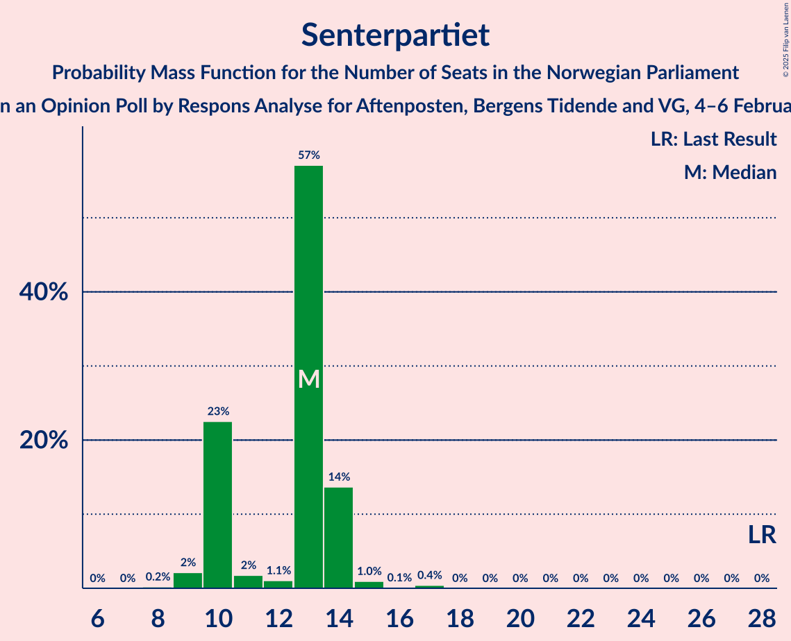
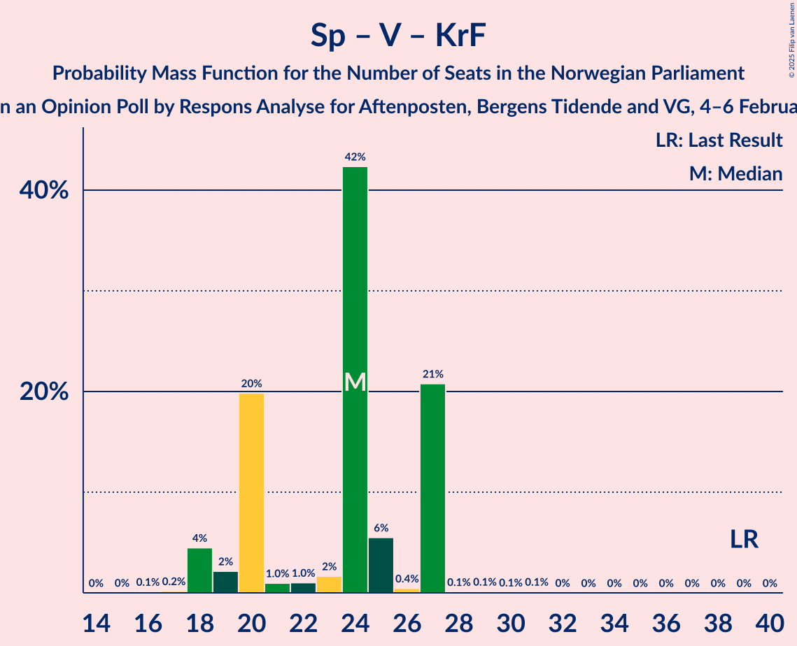

# Opinion Poll by Respons Analyse for Aftenposten, Bergens Tidende and VG, 4–6 February 2025

<a href="#voting-intentions">Voting Intentions</a> | <a href="#seats">Seats</a> | <a href="#coalitions">Coalitions</a> | <a href="#technical-information">Technical Information</a>

## Voting Intentions

### Confidence Intervals

| Party | Last Result | Poll Result | 80% Confidence Interval | 90% Confidence Interval | 95% Confidence Interval | 99% Confidence Interval |
|:-----:|:-----------:|:-----------:|:-----------------------:|:-----------------------:|:-----------------------:|:-----------------------:|
| Arbeiderpartiet | 26.2% | 26.7% | 25.0–28.6% |24.5–29.1% |24.1–29.5% |23.2–30.4% |
| Fremskrittspartiet | 11.6% | 23.6% | 21.9–25.4% |21.5–25.9% |21.1–26.3% |20.3–27.2% |
| Høyre | 20.4% | 19.1% | 17.6–20.8% |17.1–21.2% |16.8–21.7% |16.1–22.5% |
| Sosialistisk Venstreparti | 7.6% | 6.8% | 5.9–7.9% |5.6–8.3% |5.4–8.5% |5.0–9.1% |
| Senterpartiet | 13.5% | 6.8% | 5.9–7.9% |5.6–8.3% |5.4–8.5% |5.0–9.1% |
| Venstre | 4.6% | 4.9% | 4.1–5.9% |3.9–6.2% |3.7–6.4% |3.4–6.9% |
| Rødt | 4.7% | 4.9% | 4.1–5.9% |3.9–6.2% |3.7–6.4% |3.4–6.9% |
| Kristelig Folkeparti | 3.8% | 3.0% | 2.4–3.8% |2.2–4.1% |2.1–4.3% |1.9–4.7% |
| Miljøpartiet De Grønne | 3.9% | 1.6% | 1.2–2.2% |1.1–2.4% |1.0–2.6% |0.8–2.9% |
| Industri- og Næringspartiet | 0.3% | 1.1% | 0.8–1.7% |0.7–1.8% |0.6–2.0% |0.5–2.3% |
| Konservativt | 0.4% | 0.7% | 0.5–1.2% |0.4–1.3% |0.3–1.4% |0.2–1.7% |
| Norgesdemokratene | 1.1% | 0.3% | 0.2–0.7% |0.1–0.8% |0.1–0.9% |0.1–1.1% |
| Liberalistene | 0.2% | 0.1% | 0.0–0.4% |0.0–0.5% |0.0–0.6% |0.0–0.7% |
| Pensjonistpartiet | 0.6% | 0.1% | 0.0–0.4% |0.0–0.5% |0.0–0.6% |0.0–0.7% |

*Note:* The poll result column reflects the actual value used in the calculations. Published results may vary slightly, and in addition be rounded to fewer digits.

## Seats

### Confidence Intervals

| Party | Last Result | Median | 80% Confidence Interval | 90% Confidence Interval | 95% Confidence Interval | 99% Confidence Interval |
|:-----:|:-----------:|:------:|:-----------------------:|:-----------------------:|:-----------------------:|:-----------------------:|
| <a href="#arbeiderpartiet">Arbeiderpartiet</a> | 48 | 48 | 44–49 |44–49 |44–51 |43–54 |
| <a href="#fremskrittspartiet">Fremskrittspartiet</a> | 21 | 42 | 41–49 |39–49 |39–49 |38–49 |
| <a href="#høyre">Høyre</a> | 36 | 35 | 30–37 |30–38 |30–38 |30–39 |
| <a href="#sosialistisk-venstreparti">Sosialistisk Venstreparti</a> | 13 | 11 | 10–15 |10–16 |10–16 |9–17 |
| <a href="#senterpartiet">Senterpartiet</a> | 28 | 13 | 10–14 |10–14 |10–14 |9–16 |
| <a href="#venstre">Venstre</a> | 8 | 10 | 7–11 |7–11 |3–11 |3–11 |
| <a href="#rødt">Rødt</a> | 8 | 8 | 7–9 |7–11 |7–11 |1–12 |
| <a href="#kristelig-folkeparti">Kristelig Folkeparti</a> | 3 | 1 | 1–3 |1–3 |1–3 |0–7 |
| <a href="#miljøpartiet-de-grønne">Miljøpartiet De Grønne</a> | 3 | 0 | 0–1 |0–1 |0–1 |0–1 |
| <a href="#industri--og-næringspartiet">Industri- og Næringspartiet</a> | 0 | 0 | 0 |0 |0 |0 |
| <a href="#konservativt">Konservativt</a> | 0 | 0 | 0 |0 |0 |0 |
| <a href="#norgesdemokratene">Norgesdemokratene</a> | 0 | 0 | 0 |0 |0 |0 |
| <a href="#liberalistene">Liberalistene</a> | 0 | 0 | 0 |0 |0 |0 |
| <a href="#pensjonistpartiet">Pensjonistpartiet</a> | 0 | 0 | 0 |0 |0 |0 |

### Arbeiderpartiet

*For a full overview of the results for this party, see the [Arbeiderpartiet](party-arbeiderpartiet.html) page.*

| Number of Seats | Probability | Accumulated | Special Marks |
|:---------------:|:-----------:|:-----------:|:-------------:|
| 40 | 0.1% | 100% |  |
| 41 | 0.3% | 99.9% |  |
| 42 | 0% | 99.6% |  |
| 43 | 0.8% | 99.6% |  |
| 44 | 9% | 98.7% |  |
| 45 | 3% | 89% |  |
| 46 | 19% | 87% |  |
| 47 | 3% | 68% |  |
| 48 | 42% | 65% | Last Result, Median |
| 49 | 19% | 23% |  |
| 50 | 0.3% | 4% |  |
| 51 | 2% | 4% |  |
| 52 | 0.4% | 2% |  |
| 53 | 0.4% | 2% |  |
| 54 | 0.8% | 1.1% |  |
| 55 | 0% | 0.3% |  |
| 56 | 0.2% | 0.2% |  |
| 57 | 0.1% | 0.1% |  |
| 58 | 0% | 0% |  |

### Fremskrittspartiet

*For a full overview of the results for this party, see the [Fremskrittspartiet](party-fremskrittspartiet.html) page.*

| Number of Seats | Probability | Accumulated | Special Marks |
|:---------------:|:-----------:|:-----------:|:-------------:|
| 21 | 0% | 100% | Last Result |
| 22 | 0% | 100% |  |
| 23 | 0% | 100% |  |
| 24 | 0% | 100% |  |
| 25 | 0% | 100% |  |
| 26 | 0% | 100% |  |
| 27 | 0% | 100% |  |
| 28 | 0% | 100% |  |
| 29 | 0% | 100% |  |
| 30 | 0% | 100% |  |
| 31 | 0% | 100% |  |
| 32 | 0% | 100% |  |
| 33 | 0% | 100% |  |
| 34 | 0% | 100% |  |
| 35 | 0.1% | 99.9% |  |
| 36 | 0.1% | 99.9% |  |
| 37 | 0.2% | 99.8% |  |
| 38 | 0.7% | 99.6% |  |
| 39 | 5% | 98.9% |  |
| 40 | 0.6% | 94% |  |
| 41 | 17% | 94% |  |
| 42 | 53% | 77% | Median |
| 43 | 3% | 24% |  |
| 44 | 1.3% | 21% |  |
| 45 | 1.3% | 20% |  |
| 46 | 0.7% | 19% |  |
| 47 | 0.4% | 18% |  |
| 48 | 0.1% | 17% |  |
| 49 | 17% | 17% |  |
| 50 | 0% | 0% |  |

### Høyre

*For a full overview of the results for this party, see the [Høyre](party-høyre.html) page.*

| Number of Seats | Probability | Accumulated | Special Marks |
|:---------------:|:-----------:|:-----------:|:-------------:|
| 28 | 0.1% | 100% |  |
| 29 | 0% | 99.9% |  |
| 30 | 12% | 99.8% |  |
| 31 | 2% | 88% |  |
| 32 | 4% | 86% |  |
| 33 | 28% | 81% |  |
| 34 | 3% | 53% |  |
| 35 | 0.6% | 50% | Median |
| 36 | 0.5% | 49% | Last Result |
| 37 | 42% | 49% |  |
| 38 | 5% | 7% |  |
| 39 | 2% | 2% |  |
| 40 | 0% | 0.1% |  |
| 41 | 0.1% | 0.1% |  |
| 42 | 0% | 0% |  |

### Sosialistisk Venstreparti

*For a full overview of the results for this party, see the [Sosialistisk Venstreparti](party-sosialistiskvenstreparti.html) page.*

| Number of Seats | Probability | Accumulated | Special Marks |
|:---------------:|:-----------:|:-----------:|:-------------:|
| 9 | 0.6% | 100% |  |
| 10 | 42% | 99.4% |  |
| 11 | 8% | 57% | Median |
| 12 | 1.4% | 49% |  |
| 13 | 30% | 48% | Last Result |
| 14 | 2% | 17% |  |
| 15 | 9% | 15% |  |
| 16 | 3% | 6% |  |
| 17 | 2% | 2% |  |
| 18 | 0% | 0% |  |

### Senterpartiet

*For a full overview of the results for this party, see the [Senterpartiet](party-senterpartiet.html) page.*

| Number of Seats | Probability | Accumulated | Special Marks |
|:---------------:|:-----------:|:-----------:|:-------------:|
| 8 | 0.2% | 100% |  |
| 9 | 2% | 99.8% |  |
| 10 | 23% | 98% |  |
| 11 | 2% | 75% |  |
| 12 | 1.1% | 73% |  |
| 13 | 57% | 72% | Median |
| 14 | 14% | 15% |  |
| 15 | 1.0% | 1.5% |  |
| 16 | 0.1% | 0.5% |  |
| 17 | 0.4% | 0.4% |  |
| 18 | 0% | 0% |  |
| 19 | 0% | 0% |  |
| 20 | 0% | 0% |  |
| 21 | 0% | 0% |  |
| 22 | 0% | 0% |  |
| 23 | 0% | 0% |  |
| 24 | 0% | 0% |  |
| 25 | 0% | 0% |  |
| 26 | 0% | 0% |  |
| 27 | 0% | 0% |  |
| 28 | 0% | 0% | Last Result |

### Venstre

*For a full overview of the results for this party, see the [Venstre](party-venstre.html) page.*

| Number of Seats | Probability | Accumulated | Special Marks |
|:---------------:|:-----------:|:-----------:|:-------------:|
| 2 | 0.2% | 100% |  |
| 3 | 3% | 99.8% |  |
| 4 | 0% | 97% |  |
| 5 | 0% | 97% |  |
| 6 | 0% | 97% |  |
| 7 | 22% | 97% |  |
| 8 | 4% | 75% | Last Result |
| 9 | 7% | 71% |  |
| 10 | 42% | 64% | Median |
| 11 | 21% | 21% |  |
| 12 | 0.3% | 0.3% |  |
| 13 | 0% | 0% |  |

### Rødt

*For a full overview of the results for this party, see the [Rødt](party-rødt.html) page.*

| Number of Seats | Probability | Accumulated | Special Marks |
|:---------------:|:-----------:|:-----------:|:-------------:|
| 1 | 0.6% | 100% |  |
| 2 | 0% | 99.4% |  |
| 3 | 0% | 99.4% |  |
| 4 | 0% | 99.4% |  |
| 5 | 0% | 99.4% |  |
| 6 | 0% | 99.4% |  |
| 7 | 10% | 99.4% |  |
| 8 | 63% | 89% | Last Result, Median |
| 9 | 20% | 27% |  |
| 10 | 0.9% | 7% |  |
| 11 | 5% | 6% |  |
| 12 | 0.9% | 1.0% |  |
| 13 | 0.1% | 0.1% |  |
| 14 | 0% | 0% |  |

### Kristelig Folkeparti

*For a full overview of the results for this party, see the [Kristelig Folkeparti](party-kristeligfolkeparti.html) page.*

| Number of Seats | Probability | Accumulated | Special Marks |
|:---------------:|:-----------:|:-----------:|:-------------:|
| 0 | 0.7% | 100% |  |
| 1 | 50% | 99.3% | Median |
| 2 | 12% | 50% |  |
| 3 | 37% | 37% | Last Result |
| 4 | 0% | 0.9% |  |
| 5 | 0% | 0.9% |  |
| 6 | 0% | 0.9% |  |
| 7 | 0.8% | 0.9% |  |
| 8 | 0.1% | 0.1% |  |
| 9 | 0% | 0% |  |

### Miljøpartiet De Grønne

*For a full overview of the results for this party, see the [Miljøpartiet De Grønne](party-miljøpartietdegrønne.html) page.*

| Number of Seats | Probability | Accumulated | Special Marks |
|:---------------:|:-----------:|:-----------:|:-------------:|
| 0 | 74% | 100% | Median |
| 1 | 26% | 26% |  |
| 2 | 0.2% | 0.2% |  |
| 3 | 0% | 0% | Last Result |

### Industri- og Næringspartiet

*For a full overview of the results for this party, see the [Industri- og Næringspartiet](party-industri-ognæringspartiet.html) page.*

| Number of Seats | Probability | Accumulated | Special Marks |
|:---------------:|:-----------:|:-----------:|:-------------:|
| 0 | 100% | 100% | Last Result, Median |

### Konservativt

*For a full overview of the results for this party, see the [Konservativt](party-konservativt.html) page.*

| Number of Seats | Probability | Accumulated | Special Marks |
|:---------------:|:-----------:|:-----------:|:-------------:|
| 0 | 100% | 100% | Last Result, Median |

### Norgesdemokratene

*For a full overview of the results for this party, see the [Norgesdemokratene](party-norgesdemokratene.html) page.*

| Number of Seats | Probability | Accumulated | Special Marks |
|:---------------:|:-----------:|:-----------:|:-------------:|
| 0 | 100% | 100% | Last Result, Median |

### Liberalistene

*For a full overview of the results for this party, see the [Liberalistene](party-liberalistene.html) page.*

| Number of Seats | Probability | Accumulated | Special Marks |
|:---------------:|:-----------:|:-----------:|:-------------:|
| 0 | 100% | 100% | Last Result, Median |

### Pensjonistpartiet

*For a full overview of the results for this party, see the [Pensjonistpartiet](party-pensjonistpartiet.html) page.*

| Number of Seats | Probability | Accumulated | Special Marks |
|:---------------:|:-----------:|:-----------:|:-------------:|
| 0 | 100% | 100% | Last Result, Median |

## Coalitions

### Confidence Intervals

| Coalition | Last Result | Median | Majority? | 80% Confidence Interval | 90% Confidence Interval | 95% Confidence Interval | 99% Confidence Interval |
|:---------:|:-----------:|:------:|:---------:|:-----------------------:|:-----------------------:|:-----------------------:|:-----------------------:|
| Fremskrittspartiet – Høyre – Senterpartiet – Venstre – Kristelig Folkeparti | 96 | 102 | 100% | 97–103 | 96–103 | 95–103 | 94–105 |
| Fremskrittspartiet – Høyre – Venstre – Kristelig Folkeparti – Miljøpartiet De Grønne | 71 | 90 | 92% | 85–92 | 84–92 | 83–92 | 81–94 |
| Fremskrittspartiet – Høyre – Venstre – Kristelig Folkeparti | 68 | 90 | 91% | 85–92 | 83–92 | 82–92 | 80–94 |
| Fremskrittspartiet – Høyre – Venstre | 65 | 89 | 78% | 82–89 | 80–89 | 79–89 | 78–90 |
| Arbeiderpartiet – Senterpartiet – Sosialistisk Venstreparti – Rødt – Miljøpartiet De Grønne | 100 | 79 | 9% | 77–84 | 77–86 | 77–87 | 75–89 |
| Arbeiderpartiet – Senterpartiet – Sosialistisk Venstreparti – Rødt | 97 | 79 | 8% | 77–84 | 77–85 | 77–86 | 75–88 |
| Fremskrittspartiet – Høyre | 57 | 79 | 0.1% | 71–82 | 71–82 | 71–82 | 70–82 |
| Arbeiderpartiet – Senterpartiet – Sosialistisk Venstreparti – Kristelig Folkeparti – Miljøpartiet De Grønne | 95 | 72 | 0.1% | 72–78 | 72–80 | 72–81 | 71–84 |
| Arbeiderpartiet – Senterpartiet – Sosialistisk Venstreparti – Miljøpartiet De Grønne | 92 | 71 | 0% | 69–75 | 69–77 | 69–79 | 69–82 |
| Arbeiderpartiet – Senterpartiet – Sosialistisk Venstreparti | 89 | 71 | 0% | 69–75 | 69–76 | 69–78 | 68–81 |
| Arbeiderpartiet – Sosialistisk Venstreparti – Rødt – Miljøpartiet De Grønne | 72 | 67 | 0% | 66–72 | 66–73 | 66–74 | 64–75 |
| Arbeiderpartiet – Senterpartiet – Kristelig Folkeparti – Miljøpartiet De Grønne | 82 | 62 | 0% | 59–65 | 59–65 | 59–67 | 57–72 |
| Arbeiderpartiet – Senterpartiet – Kristelig Folkeparti | 79 | 62 | 0% | 59–65 | 59–65 | 59–66 | 56–71 |
| Arbeiderpartiet – Sosialistisk Venstreparti | 61 | 59 | 0% | 58–62 | 58–63 | 58–65 | 55–66 |
| Arbeiderpartiet – Senterpartiet | 76 | 61 | 0% | 56–62 | 56–62 | 56–65 | 54–69 |
| Høyre – Venstre – Kristelig Folkeparti | 47 | 46 | 0% | 43–48 | 41–48 | 40–49 | 40–50 |
| Senterpartiet – Venstre – Kristelig Folkeparti | 39 | 24 | 0% | 20–27 | 19–27 | 18–27 | 18–27 |

### Fremskrittspartiet – Høyre – Senterpartiet – Venstre – Kristelig Folkeparti

| Number of Seats | Probability | Accumulated | Special Marks |
|:---------------:|:-----------:|:-----------:|:-------------:|
| 90 | 0% | 100% |  |
| 91 | 0.1% | 99.9% |  |
| 92 | 0.1% | 99.8% |  |
| 93 | 0.1% | 99.7% |  |
| 94 | 1.4% | 99.6% |  |
| 95 | 1.4% | 98% |  |
| 96 | 3% | 97% | Last Result |
| 97 | 7% | 94% |  |
| 98 | 12% | 87% |  |
| 99 | 0.6% | 75% |  |
| 100 | 5% | 74% |  |
| 101 | 0.3% | 70% | Median |
| 102 | 26% | 69% |  |
| 103 | 42% | 43% |  |
| 104 | 0.3% | 1.4% |  |
| 105 | 0.6% | 1.0% |  |
| 106 | 0.2% | 0.4% |  |
| 107 | 0.1% | 0.2% |  |
| 108 | 0% | 0.1% |  |
| 109 | 0% | 0% |  |

### Fremskrittspartiet – Høyre – Venstre – Kristelig Folkeparti – Miljøpartiet De Grønne

| Number of Seats | Probability | Accumulated | Special Marks |
|:---------------:|:-----------:|:-----------:|:-------------:|
| 71 | 0% | 100% | Last Result |
| 72 | 0% | 100% |  |
| 73 | 0% | 100% |  |
| 74 | 0% | 100% |  |
| 75 | 0% | 100% |  |
| 76 | 0% | 100% |  |
| 77 | 0% | 100% |  |
| 78 | 0% | 100% |  |
| 79 | 0% | 100% |  |
| 80 | 0.1% | 99.9% |  |
| 81 | 2% | 99.8% |  |
| 82 | 0.1% | 98% |  |
| 83 | 0.8% | 98% |  |
| 84 | 5% | 97% |  |
| 85 | 12% | 92% | Majority |
| 86 | 0.9% | 80% |  |
| 87 | 0.8% | 79% |  |
| 88 | 5% | 78% | Median |
| 89 | 9% | 73% |  |
| 90 | 43% | 64% |  |
| 91 | 0.3% | 21% |  |
| 92 | 19% | 20% |  |
| 93 | 0.3% | 1.0% |  |
| 94 | 0.2% | 0.6% |  |
| 95 | 0.4% | 0.4% |  |
| 96 | 0% | 0.1% |  |
| 97 | 0% | 0% |  |

### Fremskrittspartiet – Høyre – Venstre – Kristelig Folkeparti

| Number of Seats | Probability | Accumulated | Special Marks |
|:---------------:|:-----------:|:-----------:|:-------------:|
| 68 | 0% | 100% | Last Result |
| 69 | 0% | 100% |  |
| 70 | 0% | 100% |  |
| 71 | 0% | 100% |  |
| 72 | 0% | 100% |  |
| 73 | 0% | 100% |  |
| 74 | 0% | 100% |  |
| 75 | 0% | 100% |  |
| 76 | 0% | 100% |  |
| 77 | 0% | 100% |  |
| 78 | 0.1% | 100% |  |
| 79 | 0% | 99.9% |  |
| 80 | 2% | 99.9% |  |
| 81 | 0.1% | 98% |  |
| 82 | 0.7% | 98% |  |
| 83 | 5% | 97% |  |
| 84 | 0.3% | 92% |  |
| 85 | 12% | 91% | Majority |
| 86 | 1.0% | 79% |  |
| 87 | 5% | 78% |  |
| 88 | 9% | 73% | Median |
| 89 | 1.1% | 64% |  |
| 90 | 42% | 63% |  |
| 91 | 2% | 21% |  |
| 92 | 18% | 18% |  |
| 93 | 0.1% | 0.6% |  |
| 94 | 0.4% | 0.6% |  |
| 95 | 0.1% | 0.1% |  |
| 96 | 0% | 0% |  |

### Fremskrittspartiet – Høyre – Venstre

| Number of Seats | Probability | Accumulated | Special Marks |
|:---------------:|:-----------:|:-----------:|:-------------:|
| 65 | 0% | 100% | Last Result |
| 66 | 0% | 100% |  |
| 67 | 0% | 100% |  |
| 68 | 0% | 100% |  |
| 69 | 0% | 100% |  |
| 70 | 0% | 100% |  |
| 71 | 0% | 100% |  |
| 72 | 0% | 100% |  |
| 73 | 0% | 100% |  |
| 74 | 0% | 100% |  |
| 75 | 0% | 100% |  |
| 76 | 0% | 100% |  |
| 77 | 0.1% | 100% |  |
| 78 | 0.8% | 99.8% |  |
| 79 | 2% | 99.0% |  |
| 80 | 5% | 97% |  |
| 81 | 0.7% | 92% |  |
| 82 | 12% | 91% |  |
| 83 | 0.8% | 79% |  |
| 84 | 0.2% | 79% |  |
| 85 | 0.9% | 78% | Majority |
| 86 | 14% | 77% |  |
| 87 | 2% | 64% | Median |
| 88 | 0.6% | 62% |  |
| 89 | 59% | 61% |  |
| 90 | 2% | 2% |  |
| 91 | 0.1% | 0.3% |  |
| 92 | 0.2% | 0.3% |  |
| 93 | 0.1% | 0.1% |  |
| 94 | 0% | 0% |  |

### Arbeiderpartiet – Senterpartiet – Sosialistisk Venstreparti – Rødt – Miljøpartiet De Grønne

| Number of Seats | Probability | Accumulated | Special Marks |
|:---------------:|:-----------:|:-----------:|:-------------:|
| 73 | 0.1% | 100% |  |
| 74 | 0% | 99.9% |  |
| 75 | 0.4% | 99.9% |  |
| 76 | 0.1% | 99.4% |  |
| 77 | 18% | 99.3% |  |
| 78 | 2% | 82% |  |
| 79 | 42% | 79% |  |
| 80 | 1.1% | 37% | Median |
| 81 | 9% | 36% |  |
| 82 | 5% | 27% |  |
| 83 | 1.0% | 22% |  |
| 84 | 12% | 21% |  |
| 85 | 0.3% | 9% | Majority |
| 86 | 5% | 8% |  |
| 87 | 0.7% | 3% |  |
| 88 | 0.1% | 2% |  |
| 89 | 2% | 2% |  |
| 90 | 0% | 0.1% |  |
| 91 | 0.1% | 0.1% |  |
| 92 | 0% | 0% |  |
| 93 | 0% | 0% |  |
| 94 | 0% | 0% |  |
| 95 | 0% | 0% |  |
| 96 | 0% | 0% |  |
| 97 | 0% | 0% |  |
| 98 | 0% | 0% |  |
| 99 | 0% | 0% |  |
| 100 | 0% | 0% | Last Result |

### Arbeiderpartiet – Senterpartiet – Sosialistisk Venstreparti – Rødt

| Number of Seats | Probability | Accumulated | Special Marks |
|:---------------:|:-----------:|:-----------:|:-------------:|
| 73 | 0.1% | 100% |  |
| 74 | 0.3% | 99.9% |  |
| 75 | 0.2% | 99.6% |  |
| 76 | 0.3% | 99.4% |  |
| 77 | 20% | 99.0% |  |
| 78 | 0% | 79% |  |
| 79 | 43% | 79% |  |
| 80 | 9% | 36% | Median |
| 81 | 5% | 27% |  |
| 82 | 0.8% | 22% |  |
| 83 | 0.9% | 21% |  |
| 84 | 12% | 20% |  |
| 85 | 5% | 8% | Majority |
| 86 | 0.8% | 3% |  |
| 87 | 0.1% | 2% |  |
| 88 | 2% | 2% |  |
| 89 | 0.1% | 0.2% |  |
| 90 | 0% | 0.1% |  |
| 91 | 0% | 0% |  |
| 92 | 0% | 0% |  |
| 93 | 0% | 0% |  |
| 94 | 0% | 0% |  |
| 95 | 0% | 0% |  |
| 96 | 0% | 0% |  |
| 97 | 0% | 0% | Last Result |

### Fremskrittspartiet – Høyre

| Number of Seats | Probability | Accumulated | Special Marks |
|:---------------:|:-----------:|:-----------:|:-------------:|
| 57 | 0% | 100% | Last Result |
| 58 | 0% | 100% |  |
| 59 | 0% | 100% |  |
| 60 | 0% | 100% |  |
| 61 | 0% | 100% |  |
| 62 | 0% | 100% |  |
| 63 | 0% | 100% |  |
| 64 | 0% | 100% |  |
| 65 | 0% | 100% |  |
| 66 | 0% | 100% |  |
| 67 | 0% | 100% |  |
| 68 | 0% | 100% |  |
| 69 | 0.1% | 100% |  |
| 70 | 1.2% | 99.8% |  |
| 71 | 15% | 98.7% |  |
| 72 | 0.1% | 83% |  |
| 73 | 0.9% | 83% |  |
| 74 | 0.3% | 82% |  |
| 75 | 10% | 82% |  |
| 76 | 0.5% | 72% |  |
| 77 | 3% | 71% | Median |
| 78 | 1.1% | 68% |  |
| 79 | 47% | 67% |  |
| 80 | 0.2% | 20% |  |
| 81 | 2% | 20% |  |
| 82 | 17% | 17% |  |
| 83 | 0% | 0.1% |  |
| 84 | 0% | 0.1% |  |
| 85 | 0% | 0.1% | Majority |
| 86 | 0% | 0% |  |

### Arbeiderpartiet – Senterpartiet – Sosialistisk Venstreparti – Kristelig Folkeparti – Miljøpartiet De Grønne

| Number of Seats | Probability | Accumulated | Special Marks |
|:---------------:|:-----------:|:-----------:|:-------------:|
| 68 | 0.2% | 100% |  |
| 69 | 0.1% | 99.8% |  |
| 70 | 0% | 99.7% |  |
| 71 | 2% | 99.7% |  |
| 72 | 64% | 98% |  |
| 73 | 1.2% | 34% | Median |
| 74 | 1.4% | 32% |  |
| 75 | 0.7% | 31% |  |
| 76 | 9% | 30% |  |
| 77 | 0.1% | 21% |  |
| 78 | 12% | 21% |  |
| 79 | 0.7% | 9% |  |
| 80 | 5% | 8% |  |
| 81 | 2% | 3% |  |
| 82 | 0.7% | 2% |  |
| 83 | 0.1% | 0.9% |  |
| 84 | 0.8% | 0.8% |  |
| 85 | 0.1% | 0.1% | Majority |
| 86 | 0% | 0% |  |
| 87 | 0% | 0% |  |
| 88 | 0% | 0% |  |
| 89 | 0% | 0% |  |
| 90 | 0% | 0% |  |
| 91 | 0% | 0% |  |
| 92 | 0% | 0% |  |
| 93 | 0% | 0% |  |
| 94 | 0% | 0% |  |
| 95 | 0% | 0% | Last Result |

### Arbeiderpartiet – Senterpartiet – Sosialistisk Venstreparti – Miljøpartiet De Grønne

| Number of Seats | Probability | Accumulated | Special Marks |
|:---------------:|:-----------:|:-----------:|:-------------:|
| 65 | 0.1% | 100% |  |
| 66 | 0.2% | 99.9% |  |
| 67 | 0.1% | 99.7% |  |
| 68 | 0.1% | 99.6% |  |
| 69 | 18% | 99.5% |  |
| 70 | 2% | 81% |  |
| 71 | 48% | 79% |  |
| 72 | 0.6% | 32% | Median |
| 73 | 1.0% | 31% |  |
| 74 | 9% | 30% |  |
| 75 | 12% | 21% |  |
| 76 | 0.2% | 9% |  |
| 77 | 6% | 9% |  |
| 78 | 0.3% | 3% |  |
| 79 | 0.5% | 3% |  |
| 80 | 1.4% | 2% |  |
| 81 | 0.1% | 0.8% |  |
| 82 | 0.7% | 0.7% |  |
| 83 | 0% | 0% |  |
| 84 | 0% | 0% |  |
| 85 | 0% | 0% | Majority |
| 86 | 0% | 0% |  |
| 87 | 0% | 0% |  |
| 88 | 0% | 0% |  |
| 89 | 0% | 0% |  |
| 90 | 0% | 0% |  |
| 91 | 0% | 0% |  |
| 92 | 0% | 0% | Last Result |

### Arbeiderpartiet – Senterpartiet – Sosialistisk Venstreparti

| Number of Seats | Probability | Accumulated | Special Marks |
|:---------------:|:-----------:|:-----------:|:-------------:|
| 65 | 0.1% | 100% |  |
| 66 | 0.2% | 99.9% |  |
| 67 | 0.1% | 99.6% |  |
| 68 | 0.4% | 99.6% |  |
| 69 | 20% | 99.2% |  |
| 70 | 5% | 79% |  |
| 71 | 43% | 74% |  |
| 72 | 0.6% | 31% | Median |
| 73 | 10% | 31% |  |
| 74 | 0.2% | 21% |  |
| 75 | 12% | 21% |  |
| 76 | 6% | 9% |  |
| 77 | 0.3% | 3% |  |
| 78 | 0.6% | 3% |  |
| 79 | 1.4% | 2% |  |
| 80 | 0.1% | 0.9% |  |
| 81 | 0.8% | 0.8% |  |
| 82 | 0% | 0% |  |
| 83 | 0% | 0% |  |
| 84 | 0% | 0% |  |
| 85 | 0% | 0% | Majority |
| 86 | 0% | 0% |  |
| 87 | 0% | 0% |  |
| 88 | 0% | 0% |  |
| 89 | 0% | 0% | Last Result |

### Arbeiderpartiet – Sosialistisk Venstreparti – Rødt – Miljøpartiet De Grønne

| Number of Seats | Probability | Accumulated | Special Marks |
|:---------------:|:-----------:|:-----------:|:-------------:|
| 61 | 0% | 100% |  |
| 62 | 0.2% | 99.9% |  |
| 63 | 0.1% | 99.7% |  |
| 64 | 0.8% | 99.6% |  |
| 65 | 0.1% | 98.8% |  |
| 66 | 42% | 98.6% |  |
| 67 | 26% | 57% | Median |
| 68 | 0.3% | 31% |  |
| 69 | 5% | 30% |  |
| 70 | 0.6% | 26% |  |
| 71 | 12% | 25% |  |
| 72 | 7% | 13% | Last Result |
| 73 | 3% | 6% |  |
| 74 | 1.4% | 3% |  |
| 75 | 1.4% | 2% |  |
| 76 | 0.1% | 0.4% |  |
| 77 | 0.1% | 0.3% |  |
| 78 | 0.1% | 0.2% |  |
| 79 | 0% | 0.1% |  |
| 80 | 0% | 0% |  |

### Arbeiderpartiet – Senterpartiet – Kristelig Folkeparti – Miljøpartiet De Grønne

| Number of Seats | Probability | Accumulated | Special Marks |
|:---------------:|:-----------:|:-----------:|:-------------:|
| 56 | 0.1% | 100% |  |
| 57 | 1.2% | 99.9% |  |
| 58 | 0.1% | 98.7% |  |
| 59 | 18% | 98.6% |  |
| 60 | 2% | 81% |  |
| 61 | 13% | 79% |  |
| 62 | 42% | 65% | Median |
| 63 | 4% | 23% |  |
| 64 | 3% | 19% |  |
| 65 | 12% | 16% |  |
| 66 | 0.6% | 4% |  |
| 67 | 2% | 4% |  |
| 68 | 0.8% | 2% |  |
| 69 | 0.6% | 2% |  |
| 70 | 0.1% | 0.9% |  |
| 71 | 0% | 0.9% |  |
| 72 | 0.8% | 0.8% |  |
| 73 | 0.1% | 0.1% |  |
| 74 | 0% | 0% |  |
| 75 | 0% | 0% |  |
| 76 | 0% | 0% |  |
| 77 | 0% | 0% |  |
| 78 | 0% | 0% |  |
| 79 | 0% | 0% |  |
| 80 | 0% | 0% |  |
| 81 | 0% | 0% |  |
| 82 | 0% | 0% | Last Result |

### Arbeiderpartiet – Senterpartiet – Kristelig Folkeparti

| Number of Seats | Probability | Accumulated | Special Marks |
|:---------------:|:-----------:|:-----------:|:-------------:|
| 56 | 0.9% | 100% |  |
| 57 | 0.4% | 99.1% |  |
| 58 | 0.1% | 98.7% |  |
| 59 | 20% | 98.5% |  |
| 60 | 13% | 79% |  |
| 61 | 0.7% | 65% |  |
| 62 | 44% | 65% | Median |
| 63 | 4% | 20% |  |
| 64 | 0.2% | 16% |  |
| 65 | 12% | 16% |  |
| 66 | 2% | 4% |  |
| 67 | 0.7% | 2% |  |
| 68 | 0.7% | 2% |  |
| 69 | 0% | 0.9% |  |
| 70 | 0% | 0.9% |  |
| 71 | 0.8% | 0.8% |  |
| 72 | 0% | 0.1% |  |
| 73 | 0.1% | 0.1% |  |
| 74 | 0% | 0% |  |
| 75 | 0% | 0% |  |
| 76 | 0% | 0% |  |
| 77 | 0% | 0% |  |
| 78 | 0% | 0% |  |
| 79 | 0% | 0% | Last Result |

### Arbeiderpartiet – Sosialistisk Venstreparti

| Number of Seats | Probability | Accumulated | Special Marks |
|:---------------:|:-----------:|:-----------:|:-------------:|
| 53 | 0% | 100% |  |
| 54 | 0.1% | 99.9% |  |
| 55 | 0.4% | 99.8% |  |
| 56 | 0.4% | 99.4% |  |
| 57 | 1.0% | 99.0% |  |
| 58 | 42% | 98% |  |
| 59 | 28% | 56% | Median |
| 60 | 7% | 28% |  |
| 61 | 0.8% | 22% | Last Result |
| 62 | 15% | 21% |  |
| 63 | 3% | 6% |  |
| 64 | 0.3% | 3% |  |
| 65 | 2% | 3% |  |
| 66 | 0.8% | 1.3% |  |
| 67 | 0.2% | 0.4% |  |
| 68 | 0.1% | 0.2% |  |
| 69 | 0.1% | 0.1% |  |
| 70 | 0% | 0% |  |

### Arbeiderpartiet – Senterpartiet

| Number of Seats | Probability | Accumulated | Special Marks |
|:---------------:|:-----------:|:-----------:|:-------------:|
| 51 | 0.1% | 100% |  |
| 52 | 0% | 99.9% |  |
| 53 | 0% | 99.9% |  |
| 54 | 1.0% | 99.9% |  |
| 55 | 0.3% | 98.9% |  |
| 56 | 18% | 98.6% |  |
| 57 | 0.1% | 81% |  |
| 58 | 11% | 81% |  |
| 59 | 7% | 69% |  |
| 60 | 4% | 62% |  |
| 61 | 42% | 58% | Median |
| 62 | 12% | 16% |  |
| 63 | 0.4% | 4% |  |
| 64 | 1.0% | 4% |  |
| 65 | 1.5% | 3% |  |
| 66 | 0.5% | 1.4% |  |
| 67 | 0.2% | 1.0% |  |
| 68 | 0.1% | 0.8% |  |
| 69 | 0.7% | 0.7% |  |
| 70 | 0% | 0% |  |
| 71 | 0% | 0% |  |
| 72 | 0% | 0% |  |
| 73 | 0% | 0% |  |
| 74 | 0% | 0% |  |
| 75 | 0% | 0% |  |
| 76 | 0% | 0% | Last Result |

### Høyre – Venstre – Kristelig Folkeparti

| Number of Seats | Probability | Accumulated | Special Marks |
|:---------------:|:-----------:|:-----------:|:-------------:|
| 36 | 0.1% | 100% |  |
| 37 | 0% | 99.9% |  |
| 38 | 0.1% | 99.9% |  |
| 39 | 0.2% | 99.8% |  |
| 40 | 3% | 99.6% |  |
| 41 | 2% | 97% |  |
| 42 | 1.1% | 95% |  |
| 43 | 18% | 94% |  |
| 44 | 16% | 76% |  |
| 45 | 0.6% | 60% |  |
| 46 | 14% | 59% | Median |
| 47 | 0.7% | 45% | Last Result |
| 48 | 42% | 45% |  |
| 49 | 2% | 3% |  |
| 50 | 0.6% | 0.9% |  |
| 51 | 0.1% | 0.3% |  |
| 52 | 0.1% | 0.3% |  |
| 53 | 0% | 0.2% |  |
| 54 | 0% | 0.1% |  |
| 55 | 0% | 0.1% |  |
| 56 | 0.1% | 0.1% |  |
| 57 | 0% | 0% |  |

### Senterpartiet – Venstre – Kristelig Folkeparti

| Number of Seats | Probability | Accumulated | Special Marks |
|:---------------:|:-----------:|:-----------:|:-------------:|
| 15 | 0% | 100% |  |
| 16 | 0.1% | 99.9% |  |
| 17 | 0.2% | 99.8% |  |
| 18 | 4% | 99.7% |  |
| 19 | 2% | 95% |  |
| 20 | 20% | 93% |  |
| 21 | 1.0% | 73% |  |
| 22 | 1.0% | 72% |  |
| 23 | 2% | 71% |  |
| 24 | 42% | 70% | Median |
| 25 | 6% | 27% |  |
| 26 | 0.4% | 22% |  |
| 27 | 21% | 21% |  |
| 28 | 0.1% | 0.4% |  |
| 29 | 0.1% | 0.3% |  |
| 30 | 0.1% | 0.2% |  |
| 31 | 0.1% | 0.1% |  |
| 32 | 0% | 0% |  |
| 33 | 0% | 0% |  |
| 34 | 0% | 0% |  |
| 35 | 0% | 0% |  |
| 36 | 0% | 0% |  |
| 37 | 0% | 0% |  |
| 38 | 0% | 0% |  |
| 39 | 0% | 0% | Last Result |

## Technical Information

### Opinion Poll

+ **Polling firm:** Respons Analyse
+ **Commissioner(s):** Aftenposten, Bergens Tidende and VG
+ **Fieldwork period:** 4–6 February 2025

### Calculations

+ **Sample size:** 1000
+ **Simulations done:** 2,097,152
+ **Error estimate:** 4.10%

