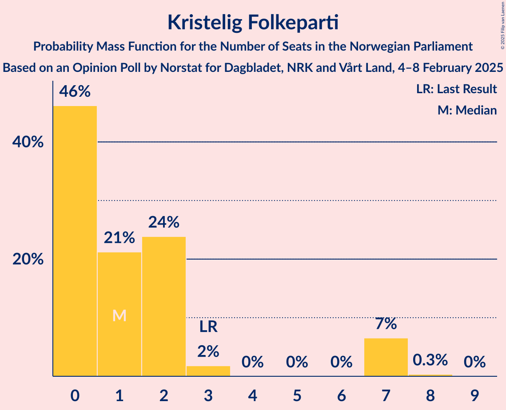
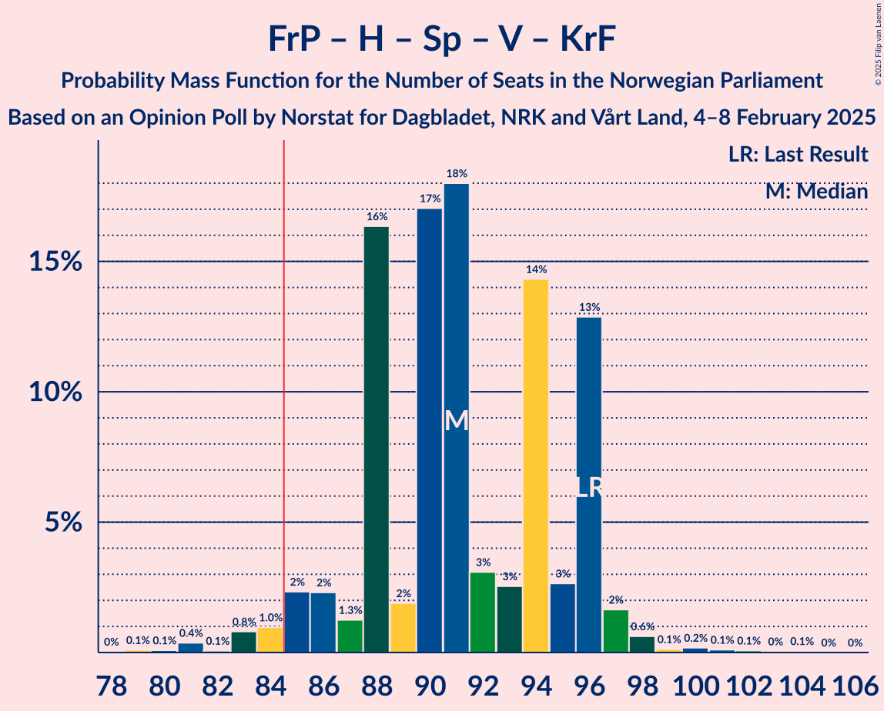
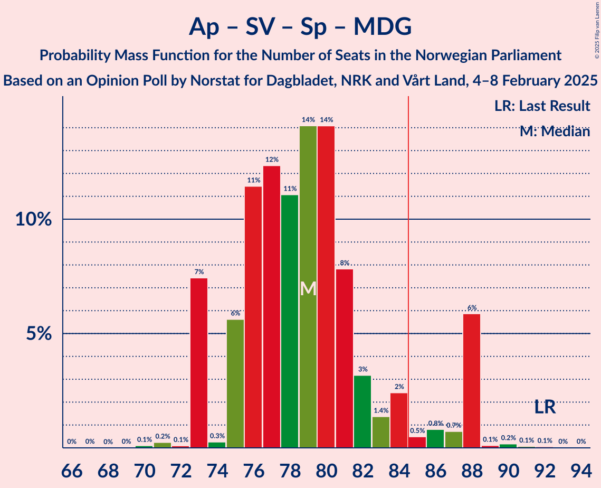
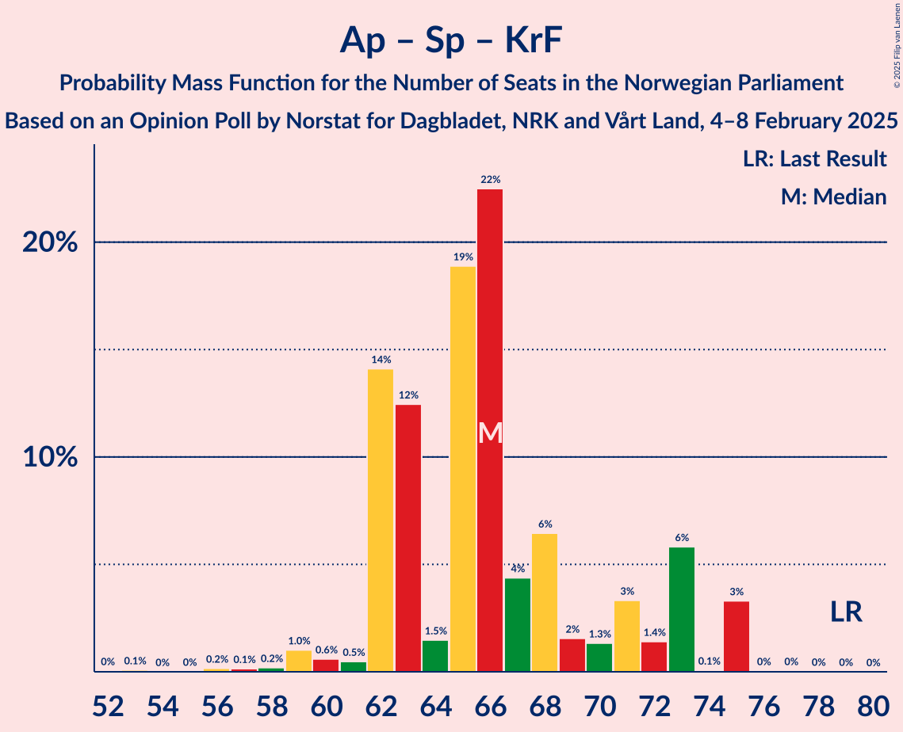

# Opinion Poll by Norstat for Dagbladet, NRK and Vårt Land, 4–8 February 2025

<a href="#voting-intentions">Voting Intentions</a> | <a href="#seats">Seats</a> | <a href="#coalitions">Coalitions</a> | <a href="#technical-information">Technical Information</a>

## Voting Intentions

### Confidence Intervals

| Party | Last Result | Poll Result | 80% Confidence Interval | 90% Confidence Interval | 95% Confidence Interval | 99% Confidence Interval |
|:-----:|:-----------:|:-----------:|:-----------------------:|:-----------------------:|:-----------------------:|:-----------------------:|
| Arbeiderpartiet | 26.2% | 28.7% | 26.6–30.9% |26.1–31.5% |25.6–32.1% |24.6–33.2% |
| Fremskrittspartiet | 11.6% | 25.3% | 23.4–27.5% |22.8–28.1% |22.3–28.6% |21.4–29.6% |
| Høyre | 20.4% | 16.2% | 14.5–18.0% |14.1–18.5% |13.7–19.0% |13.0–19.9% |
| Sosialistisk Venstreparti | 7.6% | 7.4% | 6.3–8.8% |6.0–9.2% |5.7–9.5% |5.2–10.2% |
| Senterpartiet | 13.5% | 6.1% | 5.1–7.3% |4.8–7.7% |4.6–8.0% |4.1–8.7% |
| Rødt | 4.7% | 5.3% | 4.3–6.5% |4.1–6.8% |3.9–7.1% |3.5–7.7% |
| Venstre | 4.6% | 3.1% | 2.4–4.1% |2.2–4.4% |2.1–4.6% |1.8–5.1% |
| Miljøpartiet De Grønne | 3.9% | 2.7% | 2.1–3.6% |1.9–3.9% |1.8–4.1% |1.5–4.6% |
| Kristelig Folkeparti | 3.8% | 2.2% | 1.6–3.0% |1.4–3.3% |1.3–3.5% |1.1–3.9% |
| Pensjonistpartiet | 0.6% | 0.8% | 0.5–1.4% |0.4–1.6% |0.4–1.8% |0.3–2.1% |
| Industri- og Næringspartiet | 0.3% | 0.8% | 0.5–1.4% |0.4–1.6% |0.4–1.8% |0.3–2.1% |
| Norgesdemokratene | 1.1% | 0.7% | 0.4–1.2% |0.4–1.4% |0.3–1.6% |0.2–1.9% |
| Konservativt | 0.4% | 0.7% | 0.4–1.2% |0.4–1.4% |0.3–1.6% |0.2–1.9% |

*Note:* The poll result column reflects the actual value used in the calculations. Published results may vary slightly, and in addition be rounded to fewer digits.

## Seats

### Confidence Intervals

| Party | Last Result | Median | 80% Confidence Interval | 90% Confidence Interval | 95% Confidence Interval | 99% Confidence Interval |
|:-----:|:-----------:|:------:|:-----------------------:|:-----------------------:|:-----------------------:|:-----------------------:|
| <a href="#arbeiderpartiet">Arbeiderpartiet</a> | 48 | 56 | 51–59 |49–60 |48–60 |46–60 |
| <a href="#fremskrittspartiet">Fremskrittspartiet</a> | 21 | 47 | 45–50 |43–51 |40–53 |40–54 |
| <a href="#høyre">Høyre</a> | 36 | 28 | 26–33 |25–33 |23–36 |23–37 |
| <a href="#sosialistisk-venstreparti">Sosialistisk Venstreparti</a> | 13 | 13 | 10–14 |10–16 |10–17 |10–19 |
| <a href="#senterpartiet">Senterpartiet</a> | 28 | 10 | 9–12 |8–13 |8–13 |8–16 |
| <a href="#rødt">Rødt</a> | 8 | 9 | 8–11 |8–11 |1–12 |1–14 |
| <a href="#venstre">Venstre</a> | 8 | 2 | 1–3 |1–9 |1–9 |1–9 |
| <a href="#miljøpartiet-de-grønne">Miljøpartiet De Grønne</a> | 3 | 1 | 1–3 |1–3 |1–3 |0–8 |
| <a href="#kristelig-folkeparti">Kristelig Folkeparti</a> | 3 | 0 | 0–2 |0–2 |0–2 |0–8 |
| <a href="#pensjonistpartiet">Pensjonistpartiet</a> | 0 | 0 | 0 |0 |0 |0 |
| <a href="#industri--og-næringspartiet">Industri- og Næringspartiet</a> | 0 | 0 | 0 |0 |0 |0 |
| <a href="#norgesdemokratene">Norgesdemokratene</a> | 0 | 0 | 0 |0 |0 |0 |
| <a href="#konservativt">Konservativt</a> | 0 | 0 | 0 |0 |0 |0 |

### Arbeiderpartiet

*For a full overview of the results for this party, see the [Arbeiderpartiet](party-arbeiderpartiet.html) page.*

| Number of Seats | Probability | Accumulated | Special Marks |
|:---------------:|:-----------:|:-----------:|:-------------:|
| 43 | 0% | 100% |  |
| 44 | 0.1% | 99.9% |  |
| 45 | 0.1% | 99.8% |  |
| 46 | 0.4% | 99.7% |  |
| 47 | 0.1% | 99.4% |  |
| 48 | 2% | 99.3% | Last Result |
| 49 | 4% | 97% |  |
| 50 | 1.1% | 94% |  |
| 51 | 5% | 93% |  |
| 52 | 2% | 88% |  |
| 53 | 5% | 86% |  |
| 54 | 3% | 81% |  |
| 55 | 9% | 78% |  |
| 56 | 50% | 69% | Median |
| 57 | 5% | 19% |  |
| 58 | 2% | 14% |  |
| 59 | 6% | 12% |  |
| 60 | 6% | 6% |  |
| 61 | 0.1% | 0.3% |  |
| 62 | 0.1% | 0.2% |  |
| 63 | 0.1% | 0.1% |  |
| 64 | 0% | 0% |  |

### Fremskrittspartiet

*For a full overview of the results for this party, see the [Fremskrittspartiet](party-fremskrittspartiet.html) page.*

| Number of Seats | Probability | Accumulated | Special Marks |
|:---------------:|:-----------:|:-----------:|:-------------:|
| 21 | 0% | 100% | Last Result |
| 22 | 0% | 100% |  |
| 23 | 0% | 100% |  |
| 24 | 0% | 100% |  |
| 25 | 0% | 100% |  |
| 26 | 0% | 100% |  |
| 27 | 0% | 100% |  |
| 28 | 0% | 100% |  |
| 29 | 0% | 100% |  |
| 30 | 0% | 100% |  |
| 31 | 0% | 100% |  |
| 32 | 0% | 100% |  |
| 33 | 0% | 100% |  |
| 34 | 0% | 100% |  |
| 35 | 0% | 100% |  |
| 36 | 0% | 100% |  |
| 37 | 0% | 100% |  |
| 38 | 0% | 100% |  |
| 39 | 0.2% | 100% |  |
| 40 | 3% | 99.7% |  |
| 41 | 0.3% | 97% |  |
| 42 | 1.1% | 97% |  |
| 43 | 2% | 96% |  |
| 44 | 2% | 94% |  |
| 45 | 11% | 93% |  |
| 46 | 9% | 82% |  |
| 47 | 24% | 73% | Median |
| 48 | 0.5% | 49% |  |
| 49 | 37% | 48% |  |
| 50 | 3% | 12% |  |
| 51 | 5% | 9% |  |
| 52 | 0.3% | 4% |  |
| 53 | 3% | 3% |  |
| 54 | 0.4% | 0.6% |  |
| 55 | 0.1% | 0.2% |  |
| 56 | 0.1% | 0.2% |  |
| 57 | 0% | 0.1% |  |
| 58 | 0.1% | 0.1% |  |
| 59 | 0% | 0% |  |

### Høyre

*For a full overview of the results for this party, see the [Høyre](party-høyre.html) page.*

| Number of Seats | Probability | Accumulated | Special Marks |
|:---------------:|:-----------:|:-----------:|:-------------:|
| 21 | 0% | 100% |  |
| 22 | 0.1% | 99.9% |  |
| 23 | 3% | 99.8% |  |
| 24 | 0.9% | 97% |  |
| 25 | 4% | 96% |  |
| 26 | 6% | 92% |  |
| 27 | 2% | 86% |  |
| 28 | 36% | 84% | Median |
| 29 | 2% | 48% |  |
| 30 | 0.8% | 46% |  |
| 31 | 6% | 45% |  |
| 32 | 24% | 39% |  |
| 33 | 11% | 15% |  |
| 34 | 0.2% | 4% |  |
| 35 | 0.5% | 3% |  |
| 36 | 2% | 3% | Last Result |
| 37 | 0.9% | 0.9% |  |
| 38 | 0% | 0.1% |  |
| 39 | 0% | 0% |  |

### Sosialistisk Venstreparti

*For a full overview of the results for this party, see the [Sosialistisk Venstreparti](party-sosialistiskvenstreparti.html) page.*

| Number of Seats | Probability | Accumulated | Special Marks |
|:---------------:|:-----------:|:-----------:|:-------------:|
| 9 | 0.3% | 100% |  |
| 10 | 15% | 99.6% |  |
| 11 | 13% | 85% |  |
| 12 | 6% | 72% |  |
| 13 | 54% | 66% | Last Result, Median |
| 14 | 4% | 12% |  |
| 15 | 2% | 9% |  |
| 16 | 2% | 6% |  |
| 17 | 3% | 4% |  |
| 18 | 0.6% | 1.1% |  |
| 19 | 0.2% | 0.5% |  |
| 20 | 0% | 0.3% |  |
| 21 | 0% | 0.3% |  |
| 22 | 0.2% | 0.2% |  |
| 23 | 0% | 0% |  |

### Senterpartiet

*For a full overview of the results for this party, see the [Senterpartiet](party-senterpartiet.html) page.*

| Number of Seats | Probability | Accumulated | Special Marks |
|:---------------:|:-----------:|:-----------:|:-------------:|
| 0 | 0.1% | 100% |  |
| 1 | 0.2% | 99.9% |  |
| 2 | 0% | 99.7% |  |
| 3 | 0% | 99.7% |  |
| 4 | 0% | 99.7% |  |
| 5 | 0% | 99.7% |  |
| 6 | 0% | 99.7% |  |
| 7 | 0.2% | 99.7% |  |
| 8 | 5% | 99.5% |  |
| 9 | 22% | 95% |  |
| 10 | 36% | 72% | Median |
| 11 | 14% | 36% |  |
| 12 | 12% | 22% |  |
| 13 | 8% | 10% |  |
| 14 | 0.6% | 2% |  |
| 15 | 0.5% | 1.3% |  |
| 16 | 0.7% | 0.9% |  |
| 17 | 0.1% | 0.1% |  |
| 18 | 0% | 0% |  |
| 19 | 0% | 0% |  |
| 20 | 0% | 0% |  |
| 21 | 0% | 0% |  |
| 22 | 0% | 0% |  |
| 23 | 0% | 0% |  |
| 24 | 0% | 0% |  |
| 25 | 0% | 0% |  |
| 26 | 0% | 0% |  |
| 27 | 0% | 0% |  |
| 28 | 0% | 0% | Last Result |

### Rødt

*For a full overview of the results for this party, see the [Rødt](party-rødt.html) page.*

| Number of Seats | Probability | Accumulated | Special Marks |
|:---------------:|:-----------:|:-----------:|:-------------:|
| 1 | 3% | 100% |  |
| 2 | 0.6% | 97% |  |
| 3 | 0% | 96% |  |
| 4 | 0% | 96% |  |
| 5 | 0% | 96% |  |
| 6 | 0% | 96% |  |
| 7 | 0.5% | 96% |  |
| 8 | 26% | 96% | Last Result |
| 9 | 27% | 69% | Median |
| 10 | 8% | 42% |  |
| 11 | 32% | 35% |  |
| 12 | 1.4% | 3% |  |
| 13 | 0.8% | 1.4% |  |
| 14 | 0.5% | 0.6% |  |
| 15 | 0.1% | 0.1% |  |
| 16 | 0% | 0% |  |

### Venstre

*For a full overview of the results for this party, see the [Venstre](party-venstre.html) page.*

| Number of Seats | Probability | Accumulated | Special Marks |
|:---------------:|:-----------:|:-----------:|:-------------:|
| 1 | 38% | 100% |  |
| 2 | 40% | 62% | Median |
| 3 | 14% | 22% |  |
| 4 | 0% | 7% |  |
| 5 | 0% | 7% |  |
| 6 | 0% | 7% |  |
| 7 | 1.2% | 7% |  |
| 8 | 0.5% | 6% | Last Result |
| 9 | 5% | 6% |  |
| 10 | 0% | 0.1% |  |
| 11 | 0% | 0% |  |

### Miljøpartiet De Grønne

*For a full overview of the results for this party, see the [Miljøpartiet De Grønne](party-miljøpartietdegrønne.html) page.*

| Number of Seats | Probability | Accumulated | Special Marks |
|:---------------:|:-----------:|:-----------:|:-------------:|
| 0 | 0.5% | 100% |  |
| 1 | 69% | 99.5% | Median |
| 2 | 16% | 31% |  |
| 3 | 12% | 14% | Last Result |
| 4 | 0% | 2% |  |
| 5 | 0% | 2% |  |
| 6 | 0% | 2% |  |
| 7 | 2% | 2% |  |
| 8 | 0.3% | 0.7% |  |
| 9 | 0.4% | 0.5% |  |
| 10 | 0% | 0% |  |

### Kristelig Folkeparti

*For a full overview of the results for this party, see the [Kristelig Folkeparti](party-kristeligfolkeparti.html) page.*

| Number of Seats | Probability | Accumulated | Special Marks |
|:---------------:|:-----------:|:-----------:|:-------------:|
| 0 | 70% | 100% | Median |
| 1 | 15% | 30% |  |
| 2 | 13% | 15% |  |
| 3 | 1.4% | 2% | Last Result |
| 4 | 0% | 0.8% |  |
| 5 | 0% | 0.8% |  |
| 6 | 0% | 0.8% |  |
| 7 | 0.1% | 0.8% |  |
| 8 | 0.7% | 0.7% |  |
| 9 | 0% | 0% |  |

### Pensjonistpartiet

*For a full overview of the results for this party, see the [Pensjonistpartiet](party-pensjonistpartiet.html) page.*

| Number of Seats | Probability | Accumulated | Special Marks |
|:---------------:|:-----------:|:-----------:|:-------------:|
| 0 | 99.7% | 100% | Last Result, Median |
| 1 | 0.3% | 0.3% |  |
| 2 | 0% | 0% |  |

### Industri- og Næringspartiet

*For a full overview of the results for this party, see the [Industri- og Næringspartiet](party-industri-ognæringspartiet.html) page.*

| Number of Seats | Probability | Accumulated | Special Marks |
|:---------------:|:-----------:|:-----------:|:-------------:|
| 0 | 99.8% | 100% | Last Result, Median |
| 1 | 0.2% | 0.2% |  |
| 2 | 0% | 0% |  |

### Norgesdemokratene

*For a full overview of the results for this party, see the [Norgesdemokratene](party-norgesdemokratene.html) page.*

| Number of Seats | Probability | Accumulated | Special Marks |
|:---------------:|:-----------:|:-----------:|:-------------:|
| 0 | 100% | 100% | Last Result, Median |

### Konservativt

*For a full overview of the results for this party, see the [Konservativt](party-konservativt.html) page.*

| Number of Seats | Probability | Accumulated | Special Marks |
|:---------------:|:-----------:|:-----------:|:-------------:|
| 0 | 100% | 100% | Last Result, Median |

## Coalitions

### Confidence Intervals

| Coalition | Last Result | Median | Majority? | 80% Confidence Interval | 90% Confidence Interval | 95% Confidence Interval | 99% Confidence Interval |
|:---------:|:-----------:|:------:|:---------:|:-----------------------:|:-----------------------:|:-----------------------:|:-----------------------:|
| Fremskrittspartiet – Høyre – Senterpartiet – Venstre – Kristelig Folkeparti | 96 | 90 | 98% | 87–95 | 86–96 | 85–97 | 83–100 |
| Arbeiderpartiet – Sosialistisk Venstreparti – Senterpartiet – Rødt – Miljøpartiet De Grønne | 100 | 89 | 88% | 84–93 | 84–94 | 84–96 | 81–98 |
| Arbeiderpartiet – Sosialistisk Venstreparti – Senterpartiet – Rødt | 97 | 87 | 79% | 83–92 | 83–92 | 82–93 | 79–94 |
| Arbeiderpartiet – Sosialistisk Venstreparti – Senterpartiet – Miljøpartiet De Grønne – Kristelig Folkeparti | 95 | 80 | 8% | 76–84 | 76–87 | 76–88 | 74–89 |
| Arbeiderpartiet – Sosialistisk Venstreparti – Senterpartiet – Miljøpartiet De Grønne | 92 | 80 | 5% | 76–83 | 76–85 | 76–88 | 73–88 |
| Fremskrittspartiet – Høyre – Venstre – Miljøpartiet De Grønne – Kristelig Folkeparti | 71 | 82 | 21% | 77–86 | 77–86 | 76–87 | 75–90 |
| Arbeiderpartiet – Sosialistisk Venstreparti – Senterpartiet | 89 | 79 | 3% | 75–81 | 75–83 | 73–85 | 71–86 |
| Fremskrittspartiet – Høyre – Venstre – Kristelig Folkeparti | 68 | 80 | 12% | 76–85 | 75–85 | 73–85 | 71–88 |
| Fremskrittspartiet – Høyre – Venstre | 65 | 80 | 11% | 76–85 | 74–85 | 73–85 | 70–86 |
| Arbeiderpartiet – Sosialistisk Venstreparti – Rødt – Miljøpartiet De Grønne | 72 | 79 | 2% | 74–82 | 73–83 | 72–84 | 69–86 |
| Fremskrittspartiet – Høyre | 57 | 77 | 0.4% | 71–82 | 71–82 | 70–82 | 67–84 |
| Arbeiderpartiet – Senterpartiet – Miljøpartiet De Grønne – Kristelig Folkeparti | 82 | 67 | 0% | 66–72 | 64–72 | 64–75 | 60–76 |
| Arbeiderpartiet – Sosialistisk Venstreparti | 61 | 69 | 0% | 64–71 | 62–72 | 62–73 | 60–74 |
| Arbeiderpartiet – Senterpartiet – Kristelig Folkeparti | 79 | 66 | 0% | 64–71 | 63–71 | 62–72 | 58–73 |
| Arbeiderpartiet – Senterpartiet | 76 | 66 | 0% | 63–70 | 61–71 | 61–72 | 57–72 |
| Høyre – Venstre – Kristelig Folkeparti | 47 | 33 | 0% | 29–36 | 28–37 | 26–39 | 25–40 |
| Senterpartiet – Venstre – Kristelig Folkeparti | 39 | 12 | 0% | 11–17 | 11–20 | 11–20 | 9–22 |

### Fremskrittspartiet – Høyre – Senterpartiet – Venstre – Kristelig Folkeparti

| Number of Seats | Probability | Accumulated | Special Marks |
|:---------------:|:-----------:|:-----------:|:-------------:|
| 79 | 0.1% | 100% |  |
| 80 | 0% | 99.9% |  |
| 81 | 0.3% | 99.8% |  |
| 82 | 0.1% | 99.6% |  |
| 83 | 0.7% | 99.5% |  |
| 84 | 0.7% | 98.9% |  |
| 85 | 3% | 98% | Majority |
| 86 | 5% | 96% |  |
| 87 | 1.1% | 91% | Median |
| 88 | 32% | 89% |  |
| 89 | 3% | 58% |  |
| 90 | 13% | 55% |  |
| 91 | 13% | 41% |  |
| 92 | 3% | 29% |  |
| 93 | 5% | 26% |  |
| 94 | 10% | 21% |  |
| 95 | 2% | 10% |  |
| 96 | 5% | 9% | Last Result |
| 97 | 3% | 4% |  |
| 98 | 0.8% | 1.5% |  |
| 99 | 0.1% | 0.6% |  |
| 100 | 0.1% | 0.5% |  |
| 101 | 0.1% | 0.4% |  |
| 102 | 0.1% | 0.3% |  |
| 103 | 0.1% | 0.2% |  |
| 104 | 0.1% | 0.1% |  |
| 105 | 0% | 0% |  |

### Arbeiderpartiet – Sosialistisk Venstreparti – Senterpartiet – Rødt – Miljøpartiet De Grønne

| Number of Seats | Probability | Accumulated | Special Marks |
|:---------------:|:-----------:|:-----------:|:-------------:|
| 76 | 0.2% | 100% |  |
| 77 | 0% | 99.8% |  |
| 78 | 0.1% | 99.8% |  |
| 79 | 0% | 99.7% |  |
| 80 | 0.2% | 99.7% |  |
| 81 | 0.1% | 99.5% |  |
| 82 | 0.8% | 99.5% |  |
| 83 | 0.2% | 98.7% |  |
| 84 | 10% | 98% |  |
| 85 | 4% | 88% | Majority |
| 86 | 5% | 85% |  |
| 87 | 6% | 79% |  |
| 88 | 18% | 73% |  |
| 89 | 9% | 55% | Median |
| 90 | 3% | 46% |  |
| 91 | 29% | 43% |  |
| 92 | 2% | 15% |  |
| 93 | 7% | 13% |  |
| 94 | 1.2% | 6% |  |
| 95 | 1.0% | 5% |  |
| 96 | 3% | 4% |  |
| 97 | 0.3% | 1.0% |  |
| 98 | 0.5% | 0.7% |  |
| 99 | 0.1% | 0.2% |  |
| 100 | 0% | 0.1% | Last Result |
| 101 | 0% | 0% |  |

### Arbeiderpartiet – Sosialistisk Venstreparti – Senterpartiet – Rødt

| Number of Seats | Probability | Accumulated | Special Marks |
|:---------------:|:-----------:|:-----------:|:-------------:|
| 75 | 0.2% | 100% |  |
| 76 | 0% | 99.8% |  |
| 77 | 0.1% | 99.8% |  |
| 78 | 0.1% | 99.7% |  |
| 79 | 0.2% | 99.6% |  |
| 80 | 1.0% | 99.4% |  |
| 81 | 0.2% | 98% |  |
| 82 | 2% | 98% |  |
| 83 | 14% | 96% |  |
| 84 | 2% | 81% |  |
| 85 | 6% | 79% | Majority |
| 86 | 2% | 73% |  |
| 87 | 25% | 71% |  |
| 88 | 3% | 46% | Median |
| 89 | 4% | 43% |  |
| 90 | 27% | 39% |  |
| 91 | 2% | 12% |  |
| 92 | 6% | 11% |  |
| 93 | 4% | 5% |  |
| 94 | 0.7% | 1.2% |  |
| 95 | 0.4% | 0.5% |  |
| 96 | 0% | 0.1% |  |
| 97 | 0% | 0.1% | Last Result |
| 98 | 0% | 0.1% |  |
| 99 | 0% | 0% |  |

### Arbeiderpartiet – Sosialistisk Venstreparti – Senterpartiet – Miljøpartiet De Grønne – Kristelig Folkeparti

| Number of Seats | Probability | Accumulated | Special Marks |
|:---------------:|:-----------:|:-----------:|:-------------:|
| 69 | 0% | 100% |  |
| 70 | 0% | 99.9% |  |
| 71 | 0% | 99.9% |  |
| 72 | 0.1% | 99.8% |  |
| 73 | 0.1% | 99.8% |  |
| 74 | 0.3% | 99.7% |  |
| 75 | 0.9% | 99.4% |  |
| 76 | 10% | 98.5% |  |
| 77 | 0.2% | 88% |  |
| 78 | 3% | 88% |  |
| 79 | 13% | 86% |  |
| 80 | 38% | 72% | Median |
| 81 | 12% | 34% |  |
| 82 | 11% | 22% |  |
| 83 | 2% | 12% |  |
| 84 | 3% | 10% |  |
| 85 | 2% | 8% | Majority |
| 86 | 0.4% | 6% |  |
| 87 | 0.8% | 6% |  |
| 88 | 3% | 5% |  |
| 89 | 1.1% | 2% |  |
| 90 | 0.2% | 0.4% |  |
| 91 | 0% | 0.2% |  |
| 92 | 0.1% | 0.2% |  |
| 93 | 0.1% | 0.1% |  |
| 94 | 0% | 0% |  |
| 95 | 0% | 0% | Last Result |

### Arbeiderpartiet – Sosialistisk Venstreparti – Senterpartiet – Miljøpartiet De Grønne

| Number of Seats | Probability | Accumulated | Special Marks |
|:---------------:|:-----------:|:-----------:|:-------------:|
| 67 | 0% | 100% |  |
| 68 | 0% | 99.9% |  |
| 69 | 0% | 99.9% |  |
| 70 | 0.1% | 99.9% |  |
| 71 | 0.1% | 99.8% |  |
| 72 | 0.1% | 99.7% |  |
| 73 | 0.2% | 99.7% |  |
| 74 | 0.2% | 99.4% |  |
| 75 | 1.1% | 99.2% |  |
| 76 | 12% | 98% |  |
| 77 | 0.3% | 86% |  |
| 78 | 6% | 86% |  |
| 79 | 26% | 80% |  |
| 80 | 27% | 54% | Median |
| 81 | 11% | 27% |  |
| 82 | 6% | 17% |  |
| 83 | 1.4% | 10% |  |
| 84 | 4% | 9% |  |
| 85 | 0.9% | 5% | Majority |
| 86 | 0.7% | 4% |  |
| 87 | 0.4% | 4% |  |
| 88 | 3% | 3% |  |
| 89 | 0.1% | 0.4% |  |
| 90 | 0.2% | 0.3% |  |
| 91 | 0% | 0.2% |  |
| 92 | 0.1% | 0.1% | Last Result |
| 93 | 0% | 0.1% |  |
| 94 | 0% | 0% |  |

### Fremskrittspartiet – Høyre – Venstre – Miljøpartiet De Grønne – Kristelig Folkeparti

| Number of Seats | Probability | Accumulated | Special Marks |
|:---------------:|:-----------:|:-----------:|:-------------:|
| 71 | 0% | 100% | Last Result |
| 72 | 0% | 99.9% |  |
| 73 | 0% | 99.9% |  |
| 74 | 0.4% | 99.9% |  |
| 75 | 0.7% | 99.5% |  |
| 76 | 4% | 98.8% |  |
| 77 | 6% | 95% |  |
| 78 | 2% | 89% | Median |
| 79 | 26% | 87% |  |
| 80 | 4% | 61% |  |
| 81 | 3% | 57% |  |
| 82 | 25% | 54% |  |
| 83 | 2% | 29% |  |
| 84 | 6% | 27% |  |
| 85 | 2% | 21% | Majority |
| 86 | 14% | 19% |  |
| 87 | 2% | 4% |  |
| 88 | 0.2% | 2% |  |
| 89 | 1.0% | 2% |  |
| 90 | 0.2% | 0.6% |  |
| 91 | 0.1% | 0.4% |  |
| 92 | 0.1% | 0.3% |  |
| 93 | 0% | 0.2% |  |
| 94 | 0.2% | 0.2% |  |
| 95 | 0% | 0% |  |

### Arbeiderpartiet – Sosialistisk Venstreparti – Senterpartiet

| Number of Seats | Probability | Accumulated | Special Marks |
|:---------------:|:-----------:|:-----------:|:-------------:|
| 66 | 0% | 100% |  |
| 67 | 0% | 99.9% |  |
| 68 | 0.1% | 99.9% |  |
| 69 | 0.1% | 99.8% |  |
| 70 | 0.1% | 99.7% |  |
| 71 | 0.2% | 99.6% |  |
| 72 | 0.3% | 99.4% |  |
| 73 | 2% | 99.1% |  |
| 74 | 1.1% | 97% |  |
| 75 | 14% | 96% |  |
| 76 | 2% | 81% |  |
| 77 | 7% | 80% |  |
| 78 | 23% | 73% |  |
| 79 | 34% | 50% | Median |
| 80 | 2% | 16% |  |
| 81 | 6% | 14% |  |
| 82 | 1.4% | 8% |  |
| 83 | 3% | 7% |  |
| 84 | 1.3% | 4% |  |
| 85 | 2% | 3% | Majority |
| 86 | 0.2% | 0.5% |  |
| 87 | 0% | 0.3% |  |
| 88 | 0.1% | 0.3% |  |
| 89 | 0% | 0.1% | Last Result |
| 90 | 0.1% | 0.1% |  |
| 91 | 0% | 0% |  |

### Fremskrittspartiet – Høyre – Venstre – Kristelig Folkeparti

| Number of Seats | Probability | Accumulated | Special Marks |
|:---------------:|:-----------:|:-----------:|:-------------:|
| 68 | 0% | 100% | Last Result |
| 69 | 0% | 100% |  |
| 70 | 0.1% | 99.9% |  |
| 71 | 0.5% | 99.8% |  |
| 72 | 0.3% | 99.3% |  |
| 73 | 3% | 99.0% |  |
| 74 | 1.0% | 96% |  |
| 75 | 1.2% | 95% |  |
| 76 | 7% | 94% |  |
| 77 | 2% | 87% | Median |
| 78 | 29% | 85% |  |
| 79 | 3% | 57% |  |
| 80 | 9% | 54% |  |
| 81 | 18% | 45% |  |
| 82 | 6% | 27% |  |
| 83 | 5% | 21% |  |
| 84 | 4% | 15% |  |
| 85 | 10% | 12% | Majority |
| 86 | 0.2% | 2% |  |
| 87 | 0.8% | 1.3% |  |
| 88 | 0.1% | 0.5% |  |
| 89 | 0.2% | 0.5% |  |
| 90 | 0% | 0.3% |  |
| 91 | 0.1% | 0.3% |  |
| 92 | 0% | 0.2% |  |
| 93 | 0.2% | 0.2% |  |
| 94 | 0% | 0% |  |

### Fremskrittspartiet – Høyre – Venstre

| Number of Seats | Probability | Accumulated | Special Marks |
|:---------------:|:-----------:|:-----------:|:-------------:|
| 65 | 0% | 100% | Last Result |
| 66 | 0% | 100% |  |
| 67 | 0% | 100% |  |
| 68 | 0.1% | 100% |  |
| 69 | 0.3% | 99.9% |  |
| 70 | 0.4% | 99.6% |  |
| 71 | 0.1% | 99.2% |  |
| 72 | 0.6% | 99.1% |  |
| 73 | 3% | 98% |  |
| 74 | 0.4% | 95% |  |
| 75 | 2% | 95% |  |
| 76 | 6% | 93% |  |
| 77 | 5% | 87% | Median |
| 78 | 30% | 82% |  |
| 79 | 2% | 52% |  |
| 80 | 17% | 50% |  |
| 81 | 16% | 33% |  |
| 82 | 3% | 17% |  |
| 83 | 0.8% | 14% |  |
| 84 | 2% | 13% |  |
| 85 | 10% | 11% | Majority |
| 86 | 0.2% | 0.7% |  |
| 87 | 0% | 0.5% |  |
| 88 | 0.1% | 0.4% |  |
| 89 | 0.1% | 0.3% |  |
| 90 | 0% | 0.3% |  |
| 91 | 0% | 0.2% |  |
| 92 | 0% | 0.2% |  |
| 93 | 0.1% | 0.1% |  |
| 94 | 0% | 0% |  |

### Arbeiderpartiet – Sosialistisk Venstreparti – Rødt – Miljøpartiet De Grønne

| Number of Seats | Probability | Accumulated | Special Marks |
|:---------------:|:-----------:|:-----------:|:-------------:|
| 65 | 0.1% | 100% |  |
| 66 | 0.1% | 99.9% |  |
| 67 | 0.1% | 99.8% |  |
| 68 | 0.1% | 99.7% |  |
| 69 | 0.1% | 99.6% |  |
| 70 | 0.1% | 99.5% |  |
| 71 | 0.8% | 99.4% |  |
| 72 | 3% | 98.5% | Last Result |
| 73 | 5% | 96% |  |
| 74 | 2% | 91% |  |
| 75 | 10% | 89% |  |
| 76 | 5% | 79% |  |
| 77 | 3% | 74% |  |
| 78 | 13% | 71% |  |
| 79 | 13% | 59% | Median |
| 80 | 3% | 45% |  |
| 81 | 32% | 42% |  |
| 82 | 1.1% | 11% |  |
| 83 | 5% | 9% |  |
| 84 | 3% | 4% |  |
| 85 | 0.6% | 2% | Majority |
| 86 | 0.7% | 1.1% |  |
| 87 | 0.1% | 0.5% |  |
| 88 | 0.3% | 0.4% |  |
| 89 | 0% | 0.2% |  |
| 90 | 0.1% | 0.1% |  |
| 91 | 0% | 0% |  |

### Fremskrittspartiet – Høyre

| Number of Seats | Probability | Accumulated | Special Marks |
|:---------------:|:-----------:|:-----------:|:-------------:|
| 57 | 0% | 100% | Last Result |
| 58 | 0% | 100% |  |
| 59 | 0% | 100% |  |
| 60 | 0% | 100% |  |
| 61 | 0% | 100% |  |
| 62 | 0% | 100% |  |
| 63 | 0% | 100% |  |
| 64 | 0% | 100% |  |
| 65 | 0.1% | 99.9% |  |
| 66 | 0.1% | 99.9% |  |
| 67 | 0.4% | 99.8% |  |
| 68 | 0.4% | 99.5% |  |
| 69 | 0.2% | 99.0% |  |
| 70 | 2% | 98.8% |  |
| 71 | 8% | 97% |  |
| 72 | 2% | 89% |  |
| 73 | 2% | 88% |  |
| 74 | 1.2% | 86% |  |
| 75 | 8% | 85% | Median |
| 76 | 6% | 76% |  |
| 77 | 27% | 70% |  |
| 78 | 8% | 44% |  |
| 79 | 19% | 36% |  |
| 80 | 2% | 17% |  |
| 81 | 3% | 14% |  |
| 82 | 10% | 12% |  |
| 83 | 2% | 2% |  |
| 84 | 0.1% | 0.5% |  |
| 85 | 0.1% | 0.4% | Majority |
| 86 | 0.1% | 0.3% |  |
| 87 | 0% | 0.3% |  |
| 88 | 0% | 0.2% |  |
| 89 | 0% | 0.2% |  |
| 90 | 0% | 0.2% |  |
| 91 | 0.2% | 0.2% |  |
| 92 | 0% | 0% |  |

### Arbeiderpartiet – Senterpartiet – Miljøpartiet De Grønne – Kristelig Folkeparti

| Number of Seats | Probability | Accumulated | Special Marks |
|:---------------:|:-----------:|:-----------:|:-------------:|
| 54 | 0.1% | 100% |  |
| 55 | 0% | 99.9% |  |
| 56 | 0% | 99.9% |  |
| 57 | 0% | 99.9% |  |
| 58 | 0% | 99.9% |  |
| 59 | 0.3% | 99.8% |  |
| 60 | 0.1% | 99.5% |  |
| 61 | 0.2% | 99.5% |  |
| 62 | 0.4% | 99.3% |  |
| 63 | 1.2% | 98.9% |  |
| 64 | 3% | 98% |  |
| 65 | 2% | 95% |  |
| 66 | 23% | 92% |  |
| 67 | 34% | 69% | Median |
| 68 | 6% | 35% |  |
| 69 | 5% | 29% |  |
| 70 | 8% | 24% |  |
| 71 | 3% | 16% |  |
| 72 | 8% | 13% |  |
| 73 | 0.8% | 5% |  |
| 74 | 0.2% | 4% |  |
| 75 | 3% | 4% |  |
| 76 | 0.2% | 0.5% |  |
| 77 | 0% | 0.3% |  |
| 78 | 0.2% | 0.3% |  |
| 79 | 0.1% | 0.1% |  |
| 80 | 0% | 0% |  |
| 81 | 0% | 0% |  |
| 82 | 0% | 0% | Last Result |

### Arbeiderpartiet – Sosialistisk Venstreparti

| Number of Seats | Probability | Accumulated | Special Marks |
|:---------------:|:-----------:|:-----------:|:-------------:|
| 56 | 0.1% | 100% |  |
| 57 | 0.1% | 99.9% |  |
| 58 | 0.1% | 99.8% |  |
| 59 | 0.1% | 99.7% |  |
| 60 | 2% | 99.6% |  |
| 61 | 0.2% | 98% | Last Result |
| 62 | 5% | 98% |  |
| 63 | 0.9% | 92% |  |
| 64 | 2% | 91% |  |
| 65 | 0.9% | 90% |  |
| 66 | 17% | 89% |  |
| 67 | 1.1% | 72% |  |
| 68 | 15% | 71% |  |
| 69 | 43% | 56% | Median |
| 70 | 2% | 13% |  |
| 71 | 6% | 11% |  |
| 72 | 2% | 6% |  |
| 73 | 3% | 4% |  |
| 74 | 1.0% | 1.3% |  |
| 75 | 0.1% | 0.3% |  |
| 76 | 0% | 0.1% |  |
| 77 | 0% | 0.1% |  |
| 78 | 0% | 0.1% |  |
| 79 | 0% | 0% |  |

### Arbeiderpartiet – Senterpartiet – Kristelig Folkeparti

| Number of Seats | Probability | Accumulated | Special Marks |
|:---------------:|:-----------:|:-----------:|:-------------:|
| 53 | 0% | 100% |  |
| 54 | 0% | 99.9% |  |
| 55 | 0% | 99.9% |  |
| 56 | 0.1% | 99.9% |  |
| 57 | 0% | 99.8% |  |
| 58 | 0.4% | 99.8% |  |
| 59 | 0.2% | 99.4% |  |
| 60 | 0.7% | 99.2% |  |
| 61 | 0.5% | 98% |  |
| 62 | 2% | 98% |  |
| 63 | 6% | 96% |  |
| 64 | 3% | 90% |  |
| 65 | 21% | 87% |  |
| 66 | 42% | 67% | Median |
| 67 | 4% | 25% |  |
| 68 | 5% | 21% |  |
| 69 | 3% | 15% |  |
| 70 | 1.4% | 12% |  |
| 71 | 7% | 11% |  |
| 72 | 3% | 4% |  |
| 73 | 0.8% | 1.0% |  |
| 74 | 0.1% | 0.3% |  |
| 75 | 0% | 0.2% |  |
| 76 | 0.1% | 0.2% |  |
| 77 | 0.1% | 0.1% |  |
| 78 | 0% | 0% |  |
| 79 | 0% | 0% | Last Result |

### Arbeiderpartiet – Senterpartiet

| Number of Seats | Probability | Accumulated | Special Marks |
|:---------------:|:-----------:|:-----------:|:-------------:|
| 53 | 0.1% | 100% |  |
| 54 | 0% | 99.9% |  |
| 55 | 0% | 99.9% |  |
| 56 | 0.1% | 99.8% |  |
| 57 | 0.3% | 99.7% |  |
| 58 | 0.3% | 99.5% |  |
| 59 | 0.3% | 99.2% |  |
| 60 | 0.8% | 98.8% |  |
| 61 | 4% | 98% |  |
| 62 | 2% | 94% |  |
| 63 | 3% | 92% |  |
| 64 | 10% | 89% |  |
| 65 | 28% | 79% |  |
| 66 | 29% | 50% | Median |
| 67 | 2% | 21% |  |
| 68 | 8% | 19% |  |
| 69 | 1.0% | 11% |  |
| 70 | 1.1% | 10% |  |
| 71 | 6% | 9% |  |
| 72 | 2% | 3% |  |
| 73 | 0.1% | 0.2% |  |
| 74 | 0% | 0.1% |  |
| 75 | 0% | 0.1% |  |
| 76 | 0.1% | 0.1% | Last Result |
| 77 | 0% | 0% |  |

### Høyre – Venstre – Kristelig Folkeparti

| Number of Seats | Probability | Accumulated | Special Marks |
|:---------------:|:-----------:|:-----------:|:-------------:|
| 24 | 0.1% | 100% |  |
| 25 | 1.2% | 99.9% |  |
| 26 | 2% | 98.7% |  |
| 27 | 0.4% | 97% |  |
| 28 | 3% | 96% |  |
| 29 | 30% | 93% |  |
| 30 | 2% | 62% | Median |
| 31 | 6% | 60% |  |
| 32 | 2% | 54% |  |
| 33 | 5% | 52% |  |
| 34 | 11% | 47% |  |
| 35 | 15% | 36% |  |
| 36 | 14% | 21% |  |
| 37 | 4% | 7% |  |
| 38 | 0.9% | 4% |  |
| 39 | 0.6% | 3% |  |
| 40 | 2% | 2% |  |
| 41 | 0% | 0.1% |  |
| 42 | 0.1% | 0.1% |  |
| 43 | 0% | 0.1% |  |
| 44 | 0% | 0% |  |
| 45 | 0% | 0% |  |
| 46 | 0% | 0% |  |
| 47 | 0% | 0% | Last Result |

### Senterpartiet – Venstre – Kristelig Folkeparti

| Number of Seats | Probability | Accumulated | Special Marks |
|:---------------:|:-----------:|:-----------:|:-------------:|
| 3 | 0% | 100% |  |
| 4 | 0% | 99.9% |  |
| 5 | 0.2% | 99.9% |  |
| 6 | 0% | 99.8% |  |
| 7 | 0% | 99.8% |  |
| 8 | 0% | 99.7% |  |
| 9 | 1.1% | 99.7% |  |
| 10 | 0.3% | 98.7% |  |
| 11 | 40% | 98% |  |
| 12 | 12% | 58% | Median |
| 13 | 16% | 46% |  |
| 14 | 8% | 30% |  |
| 15 | 2% | 22% |  |
| 16 | 5% | 20% |  |
| 17 | 6% | 15% |  |
| 18 | 1.0% | 8% |  |
| 19 | 1.2% | 7% |  |
| 20 | 5% | 6% |  |
| 21 | 0.2% | 1.1% |  |
| 22 | 0.7% | 0.9% |  |
| 23 | 0.1% | 0.2% |  |
| 24 | 0% | 0.1% |  |
| 25 | 0% | 0.1% |  |
| 26 | 0% | 0% |  |
| 27 | 0% | 0% |  |
| 28 | 0% | 0% |  |
| 29 | 0% | 0% |  |
| 30 | 0% | 0% |  |
| 31 | 0% | 0% |  |
| 32 | 0% | 0% |  |
| 33 | 0% | 0% |  |
| 34 | 0% | 0% |  |
| 35 | 0% | 0% |  |
| 36 | 0% | 0% |  |
| 37 | 0% | 0% |  |
| 38 | 0% | 0% |  |
| 39 | 0% | 0% | Last Result |

## Technical Information

### Opinion Poll

+ **Polling firm:** Norstat
+ **Commissioner(s):** Dagbladet, NRK and Vårt Land
+ **Fieldwork period:** 4–8 February 2025

### Calculations

+ **Sample size:** 742
+ **Simulations done:** 1,048,576
+ **Error estimate:** 2.67%

