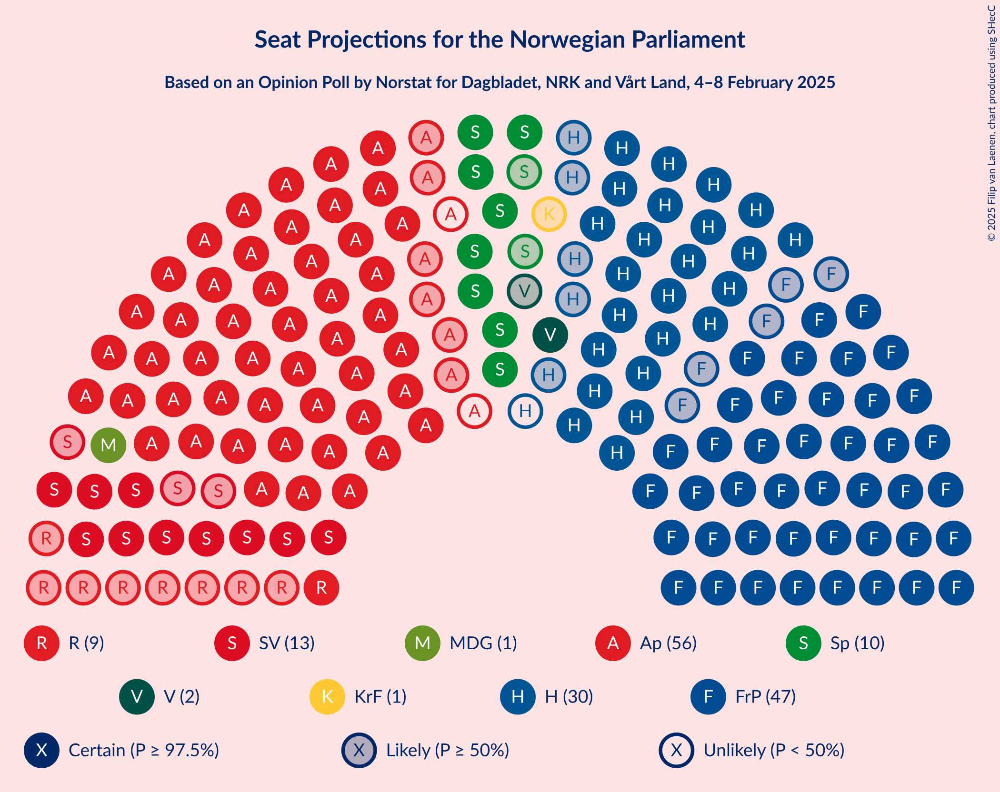
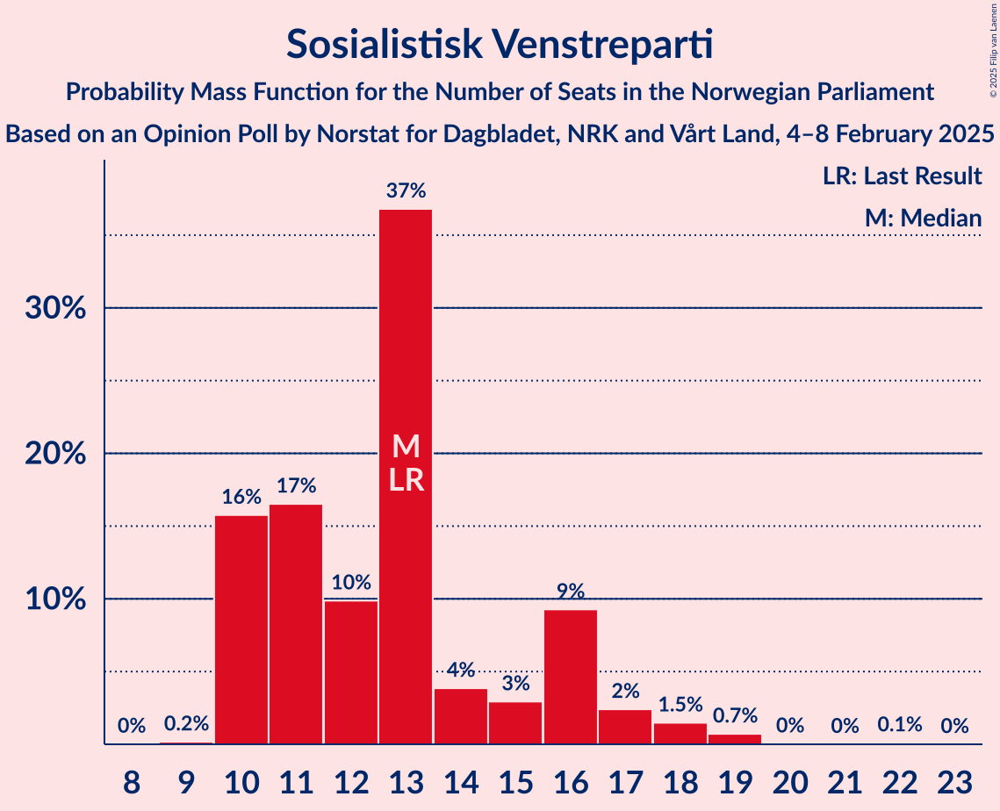
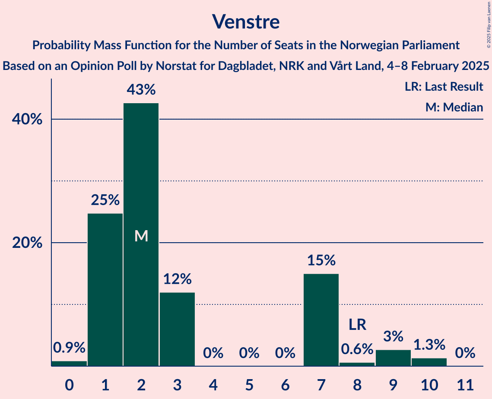
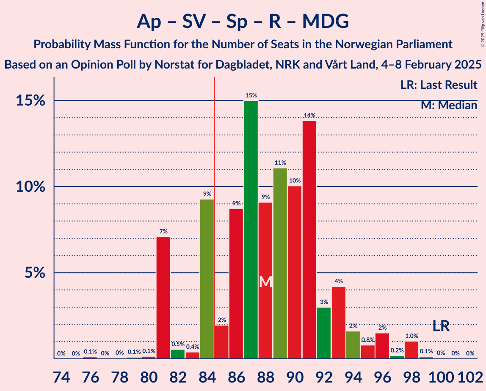
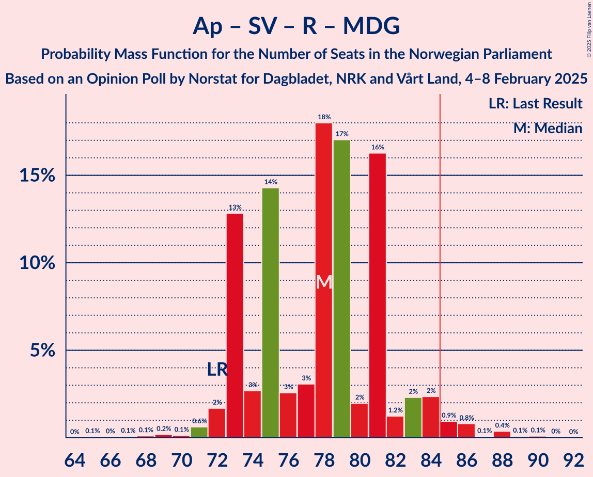
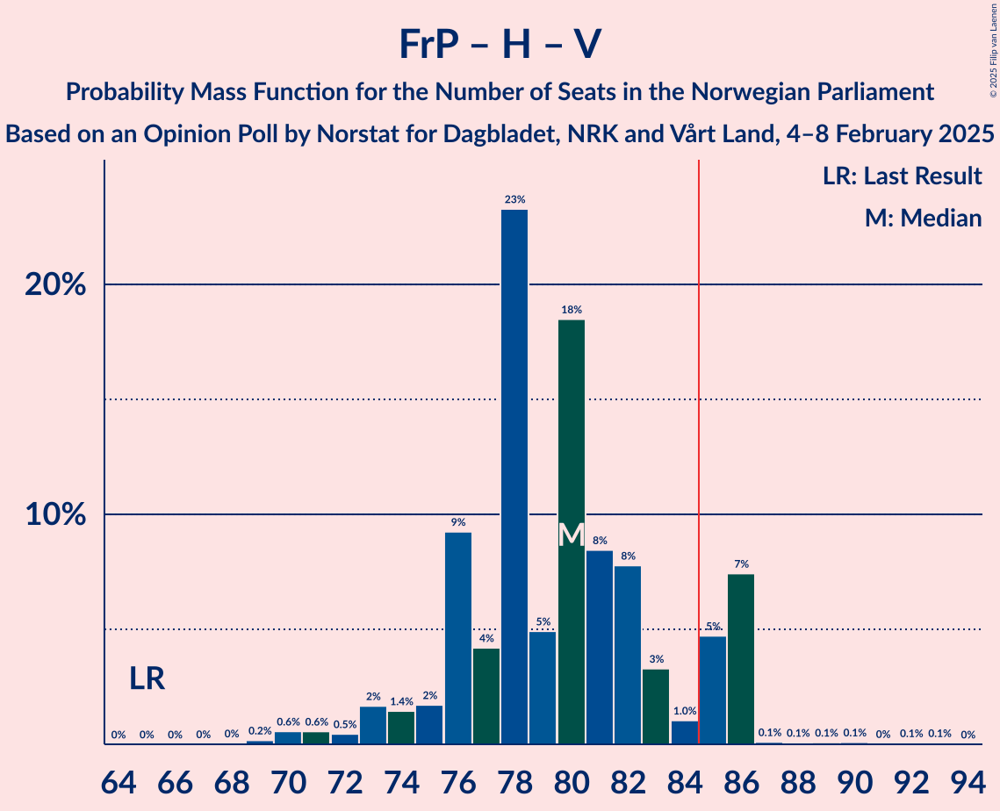

# Opinion Poll by Norstat for Dagbladet, NRK and Vårt Land, 4–8 February 2025

<a href="#voting-intentions">Voting Intentions</a> | <a href="#seats">Seats</a> | <a href="#coalitions">Coalitions</a> | <a href="#technical-information">Technical Information</a>

## Voting Intentions

### Confidence Intervals

| Party | Last Result | Poll Result | 80% Confidence Interval | 90% Confidence Interval | 95% Confidence Interval | 99% Confidence Interval |
|:-----:|:-----------:|:-----------:|:-----------------------:|:-----------------------:|:-----------------------:|:-----------------------:|
| Arbeiderpartiet | 26.2% | 28.7% | 26.9–30.6% |26.4–31.2% |26.0–31.6% |25.1–32.5% |
| Fremskrittspartiet | 11.6% | 25.3% | 23.6–27.1% |23.1–27.6% |22.7–28.1% |21.9–29.0% |
| Høyre | 20.4% | 16.2% | 14.8–17.8% |14.4–18.2% |14.0–18.6% |13.4–19.4% |
| Sosialistisk Venstreparti | 7.6% | 7.4% | 6.4–8.6% |6.1–8.9% |5.9–9.2% |5.5–9.8% |
| Senterpartiet | 13.5% | 6.0% | 5.1–7.1% |4.8–7.4% |4.6–7.6% |4.3–8.2% |
| Rødt | 4.7% | 5.3% | 4.5–6.3% |4.2–6.6% |4.0–6.8% |3.7–7.4% |
| Venstre | 4.6% | 3.1% | 2.5–4.0% |2.4–4.2% |2.2–4.4% |2.0–4.9% |
| Miljøpartiet De Grønne | 3.9% | 2.7% | 2.2–3.5% |2.0–3.7% |1.9–3.9% |1.6–4.4% |
| Kristelig Folkeparti | 3.8% | 2.1% | 1.6–2.9% |1.5–3.0% |1.4–3.2% |1.2–3.6% |
| Pensjonistpartiet | 0.6% | 0.8% | 0.5–1.3% |0.5–1.5% |0.4–1.6% |0.3–1.9% |
| Industri- og Næringspartiet | 0.3% | 0.8% | 0.5–1.3% |0.5–1.5% |0.4–1.6% |0.3–1.9% |
| Norgesdemokratene | 1.1% | 0.7% | 0.5–1.2% |0.4–1.3% |0.3–1.5% |0.3–1.7% |
| Konservativt | 0.4% | 0.7% | 0.5–1.2% |0.4–1.3% |0.3–1.5% |0.3–1.7% |

*Note:* The poll result column reflects the actual value used in the calculations. Published results may vary slightly, and in addition be rounded to fewer digits.

## Seats

### Confidence Intervals

| Party | Last Result | Median | 80% Confidence Interval | 90% Confidence Interval | 95% Confidence Interval | 99% Confidence Interval |
|:-----:|:-----------:|:------:|:-----------------------:|:-----------------------:|:-----------------------:|:-----------------------:|
| <a href="#arbeiderpartiet">Arbeiderpartiet</a> | 48 | 55 | 53–57 |48–59 |47–59 |47–60 |
| <a href="#fremskrittspartiet">Fremskrittspartiet</a> | 21 | 50 | 46–50 |42–50 |40–50 |40–51 |
| <a href="#høyre">Høyre</a> | 36 | 27 | 27–31 |26–32 |26–32 |24–33 |
| <a href="#sosialistisk-venstreparti">Sosialistisk Venstreparti</a> | 13 | 13 | 13–16 |11–17 |10–17 |10–18 |
| <a href="#senterpartiet">Senterpartiet</a> | 28 | 12 | 10–12 |10–12 |10–12 |8–14 |
| <a href="#rødt">Rødt</a> | 8 | 8 | 8–10 |8–11 |8–11 |2–13 |
| <a href="#venstre">Venstre</a> | 8 | 2 | 1–2 |1–3 |1–3 |1–7 |
| <a href="#miljøpartiet-de-grønne">Miljøpartiet De Grønne</a> | 3 | 2 | 1–2 |1–2 |1–3 |0–8 |
| <a href="#kristelig-folkeparti">Kristelig Folkeparti</a> | 3 | 0 | 0–1 |0–1 |0–1 |0–3 |
| <a href="#pensjonistpartiet">Pensjonistpartiet</a> | 0 | 0 | 0 |0 |0 |0 |
| <a href="#industri--og-næringspartiet">Industri- og Næringspartiet</a> | 0 | 0 | 0 |0 |0 |0 |
| <a href="#norgesdemokratene">Norgesdemokratene</a> | 0 | 0 | 0 |0 |0 |0 |
| <a href="#konservativt">Konservativt</a> | 0 | 0 | 0 |0 |0 |0 |

### Arbeiderpartiet

*For a full overview of the results for this party, see the [Arbeiderpartiet](party-arbeiderpartiet.html) page.*

| Number of Seats | Probability | Accumulated | Special Marks |
|:---------------:|:-----------:|:-----------:|:-------------:|
| 46 | 0% | 100% |  |
| 47 | 5% | 99.9% |  |
| 48 | 0.4% | 95% | Last Result |
| 49 | 1.5% | 95% |  |
| 50 | 0.6% | 93% |  |
| 51 | 0.7% | 93% |  |
| 52 | 2% | 92% |  |
| 53 | 1.0% | 91% |  |
| 54 | 0.7% | 90% |  |
| 55 | 59% | 89% | Median |
| 56 | 20% | 30% |  |
| 57 | 2% | 10% |  |
| 58 | 3% | 9% |  |
| 59 | 4% | 5% |  |
| 60 | 0.6% | 1.0% |  |
| 61 | 0.2% | 0.4% |  |
| 62 | 0% | 0.2% |  |
| 63 | 0.1% | 0.2% |  |
| 64 | 0% | 0% |  |

### Fremskrittspartiet

*For a full overview of the results for this party, see the [Fremskrittspartiet](party-fremskrittspartiet.html) page.*

| Number of Seats | Probability | Accumulated | Special Marks |
|:---------------:|:-----------:|:-----------:|:-------------:|
| 21 | 0% | 100% | Last Result |
| 22 | 0% | 100% |  |
| 23 | 0% | 100% |  |
| 24 | 0% | 100% |  |
| 25 | 0% | 100% |  |
| 26 | 0% | 100% |  |
| 27 | 0% | 100% |  |
| 28 | 0% | 100% |  |
| 29 | 0% | 100% |  |
| 30 | 0% | 100% |  |
| 31 | 0% | 100% |  |
| 32 | 0% | 100% |  |
| 33 | 0% | 100% |  |
| 34 | 0% | 100% |  |
| 35 | 0% | 100% |  |
| 36 | 0% | 100% |  |
| 37 | 0% | 100% |  |
| 38 | 0% | 100% |  |
| 39 | 0% | 100% |  |
| 40 | 4% | 100% |  |
| 41 | 0.5% | 96% |  |
| 42 | 1.2% | 95% |  |
| 43 | 0.7% | 94% |  |
| 44 | 0.6% | 93% |  |
| 45 | 1.3% | 92% |  |
| 46 | 2% | 91% |  |
| 47 | 28% | 89% |  |
| 48 | 4% | 61% |  |
| 49 | 0.6% | 57% |  |
| 50 | 55% | 56% | Median |
| 51 | 0.3% | 0.7% |  |
| 52 | 0.2% | 0.5% |  |
| 53 | 0.2% | 0.2% |  |
| 54 | 0% | 0.1% |  |
| 55 | 0% | 0% |  |

### Høyre

*For a full overview of the results for this party, see the [Høyre](party-høyre.html) page.*

| Number of Seats | Probability | Accumulated | Special Marks |
|:---------------:|:-----------:|:-----------:|:-------------:|
| 23 | 0.1% | 100% |  |
| 24 | 0.5% | 99.9% |  |
| 25 | 0.5% | 99.4% |  |
| 26 | 4% | 98.9% |  |
| 27 | 50% | 95% | Median |
| 28 | 11% | 45% |  |
| 29 | 3% | 34% |  |
| 30 | 19% | 31% |  |
| 31 | 6% | 12% |  |
| 32 | 5% | 6% |  |
| 33 | 0.5% | 0.8% |  |
| 34 | 0.2% | 0.4% |  |
| 35 | 0.1% | 0.2% |  |
| 36 | 0% | 0.1% | Last Result |
| 37 | 0% | 0.1% |  |
| 38 | 0% | 0% |  |

### Sosialistisk Venstreparti

*For a full overview of the results for this party, see the [Sosialistisk Venstreparti](party-sosialistiskvenstreparti.html) page.*

| Number of Seats | Probability | Accumulated | Special Marks |
|:---------------:|:-----------:|:-----------:|:-------------:|
| 10 | 3% | 100% |  |
| 11 | 2% | 97% |  |
| 12 | 1.4% | 94% |  |
| 13 | 70% | 93% | Last Result, Median |
| 14 | 6% | 23% |  |
| 15 | 2% | 18% |  |
| 16 | 6% | 16% |  |
| 17 | 9% | 10% |  |
| 18 | 0.6% | 0.7% |  |
| 19 | 0% | 0.1% |  |
| 20 | 0% | 0% |  |

### Senterpartiet

*For a full overview of the results for this party, see the [Senterpartiet](party-senterpartiet.html) page.*

| Number of Seats | Probability | Accumulated | Special Marks |
|:---------------:|:-----------:|:-----------:|:-------------:|
| 7 | 0.2% | 100% |  |
| 8 | 0.4% | 99.8% |  |
| 9 | 0.8% | 99.4% |  |
| 10 | 31% | 98.7% |  |
| 11 | 5% | 68% |  |
| 12 | 61% | 63% | Median |
| 13 | 1.3% | 2% |  |
| 14 | 0.8% | 0.9% |  |
| 15 | 0.1% | 0.1% |  |
| 16 | 0% | 0% |  |
| 17 | 0% | 0% |  |
| 18 | 0% | 0% |  |
| 19 | 0% | 0% |  |
| 20 | 0% | 0% |  |
| 21 | 0% | 0% |  |
| 22 | 0% | 0% |  |
| 23 | 0% | 0% |  |
| 24 | 0% | 0% |  |
| 25 | 0% | 0% |  |
| 26 | 0% | 0% |  |
| 27 | 0% | 0% |  |
| 28 | 0% | 0% | Last Result |

### Rødt

*For a full overview of the results for this party, see the [Rødt](party-rødt.html) page.*

| Number of Seats | Probability | Accumulated | Special Marks |
|:---------------:|:-----------:|:-----------:|:-------------:|
| 1 | 0.3% | 100% |  |
| 2 | 0.2% | 99.7% |  |
| 3 | 0% | 99.5% |  |
| 4 | 0% | 99.5% |  |
| 5 | 0% | 99.5% |  |
| 6 | 0% | 99.5% |  |
| 7 | 0.1% | 99.5% |  |
| 8 | 51% | 99.3% | Last Result, Median |
| 9 | 34% | 49% |  |
| 10 | 8% | 15% |  |
| 11 | 6% | 7% |  |
| 12 | 1.0% | 2% |  |
| 13 | 0.4% | 0.5% |  |
| 14 | 0% | 0.1% |  |
| 15 | 0% | 0% |  |

### Venstre

*For a full overview of the results for this party, see the [Venstre](party-venstre.html) page.*

| Number of Seats | Probability | Accumulated | Special Marks |
|:---------------:|:-----------:|:-----------:|:-------------:|
| 1 | 19% | 100% |  |
| 2 | 73% | 81% | Median |
| 3 | 7% | 8% |  |
| 4 | 0% | 1.2% |  |
| 5 | 0% | 1.2% |  |
| 6 | 0% | 1.2% |  |
| 7 | 0.7% | 1.2% |  |
| 8 | 0.4% | 0.5% | Last Result |
| 9 | 0% | 0% |  |

### Miljøpartiet De Grønne

*For a full overview of the results for this party, see the [Miljøpartiet De Grønne](party-miljøpartietdegrønne.html) page.*

| Number of Seats | Probability | Accumulated | Special Marks |
|:---------------:|:-----------:|:-----------:|:-------------:|
| 0 | 0.6% | 100% |  |
| 1 | 26% | 99.4% |  |
| 2 | 70% | 73% | Median |
| 3 | 2% | 3% | Last Result |
| 4 | 0% | 0.8% |  |
| 5 | 0% | 0.8% |  |
| 6 | 0% | 0.8% |  |
| 7 | 0.2% | 0.8% |  |
| 8 | 0.6% | 0.6% |  |
| 9 | 0% | 0% |  |

### Kristelig Folkeparti

*For a full overview of the results for this party, see the [Kristelig Folkeparti](party-kristeligfolkeparti.html) page.*

| Number of Seats | Probability | Accumulated | Special Marks |
|:---------------:|:-----------:|:-----------:|:-------------:|
| 0 | 72% | 100% | Median |
| 1 | 25% | 28% |  |
| 2 | 0.9% | 2% |  |
| 3 | 1.4% | 2% | Last Result |
| 4 | 0% | 0.2% |  |
| 5 | 0% | 0.2% |  |
| 6 | 0% | 0.2% |  |
| 7 | 0.2% | 0.2% |  |
| 8 | 0% | 0% |  |

### Pensjonistpartiet

*For a full overview of the results for this party, see the [Pensjonistpartiet](party-pensjonistpartiet.html) page.*

| Number of Seats | Probability | Accumulated | Special Marks |
|:---------------:|:-----------:|:-----------:|:-------------:|
| 0 | 100% | 100% | Last Result, Median |

### Industri- og Næringspartiet

*For a full overview of the results for this party, see the [Industri- og Næringspartiet](party-industri-ognæringspartiet.html) page.*

| Number of Seats | Probability | Accumulated | Special Marks |
|:---------------:|:-----------:|:-----------:|:-------------:|
| 0 | 100% | 100% | Last Result, Median |

### Norgesdemokratene

*For a full overview of the results for this party, see the [Norgesdemokratene](party-norgesdemokratene.html) page.*

| Number of Seats | Probability | Accumulated | Special Marks |
|:---------------:|:-----------:|:-----------:|:-------------:|
| 0 | 100% | 100% | Last Result, Median |

### Konservativt

*For a full overview of the results for this party, see the [Konservativt](party-konservativt.html) page.*

| Number of Seats | Probability | Accumulated | Special Marks |
|:---------------:|:-----------:|:-----------:|:-------------:|
| 0 | 100% | 100% | Last Result, Median |

## Coalitions

### Confidence Intervals

| Coalition | Last Result | Median | Majority? | 80% Confidence Interval | 90% Confidence Interval | 95% Confidence Interval | 99% Confidence Interval |
|:---------:|:-----------:|:------:|:---------:|:-----------------------:|:-----------------------:|:-----------------------:|:-----------------------:|
| Arbeiderpartiet – Sosialistisk Venstreparti – Senterpartiet – Rødt – Miljøpartiet De Grønne | 100 | 90 | 99.5% | 90–92 | 86–95 | 86–95 | 84–97 |
| Fremskrittspartiet – Høyre – Senterpartiet – Venstre – Kristelig Folkeparti | 96 | 91 | 98.7% | 87–91 | 86–95 | 86–95 | 82–96 |
| Arbeiderpartiet – Sosialistisk Venstreparti – Senterpartiet – Rødt | 97 | 88 | 98% | 88–91 | 85–93 | 85–94 | 81–94 |
| Arbeiderpartiet – Sosialistisk Venstreparti – Senterpartiet – Miljøpartiet De Grønne – Kristelig Folkeparti | 95 | 82 | 6% | 81–83 | 76–86 | 76–86 | 76–87 |
| Arbeiderpartiet – Sosialistisk Venstreparti – Senterpartiet – Miljøpartiet De Grønne | 92 | 82 | 6% | 79–83 | 76–86 | 76–86 | 75–86 |
| Arbeiderpartiet – Sosialistisk Venstreparti – Senterpartiet | 89 | 80 | 5% | 78–82 | 75–84 | 75–85 | 74–85 |
| Fremskrittspartiet – Høyre – Venstre – Miljøpartiet De Grønne – Kristelig Folkeparti | 71 | 81 | 2% | 78–81 | 76–84 | 75–84 | 75–88 |
| Arbeiderpartiet – Sosialistisk Venstreparti – Rødt – Miljøpartiet De Grønne | 72 | 78 | 1.3% | 78–82 | 74–83 | 74–83 | 73–87 |
| Fremskrittspartiet – Høyre – Venstre – Kristelig Folkeparti | 68 | 79 | 0.5% | 77–79 | 74–83 | 74–83 | 72–85 |
| Fremskrittspartiet – Høyre – Venstre | 65 | 79 | 0.4% | 77–79 | 74–83 | 74–83 | 71–84 |
| Fremskrittspartiet – Høyre | 57 | 77 | 0.1% | 74–77 | 72–81 | 72–81 | 69–82 |
| Arbeiderpartiet – Sosialistisk Venstreparti | 61 | 68 | 0% | 67–72 | 63–73 | 63–73 | 62–73 |
| Arbeiderpartiet – Senterpartiet – Miljøpartiet De Grønne – Kristelig Folkeparti | 82 | 69 | 0% | 66–71 | 62–72 | 60–72 | 60–73 |
| Arbeiderpartiet – Senterpartiet – Kristelig Folkeparti | 79 | 67 | 0% | 65–69 | 60–71 | 59–71 | 59–71 |
| Arbeiderpartiet – Senterpartiet | 76 | 67 | 0% | 65–68 | 59–70 | 59–71 | 59–71 |
| Høyre – Venstre – Kristelig Folkeparti | 47 | 29 | 0% | 29–33 | 29–34 | 29–35 | 28–38 |
| Senterpartiet – Venstre – Kristelig Folkeparti | 39 | 14 | 0% | 12–14 | 12–15 | 12–16 | 11–19 |

### Arbeiderpartiet – Sosialistisk Venstreparti – Senterpartiet – Rødt – Miljøpartiet De Grønne

| Number of Seats | Probability | Accumulated | Special Marks |
|:---------------:|:-----------:|:-----------:|:-------------:|
| 79 | 0.1% | 100% |  |
| 80 | 0.2% | 99.9% |  |
| 81 | 0.1% | 99.7% |  |
| 82 | 0.1% | 99.7% |  |
| 83 | 0% | 99.6% |  |
| 84 | 0.1% | 99.6% |  |
| 85 | 0.3% | 99.5% | Majority |
| 86 | 6% | 99.2% |  |
| 87 | 0.7% | 93% |  |
| 88 | 1.4% | 92% |  |
| 89 | 0.6% | 91% |  |
| 90 | 68% | 90% | Median |
| 91 | 4% | 22% |  |
| 92 | 10% | 18% |  |
| 93 | 2% | 8% |  |
| 94 | 0.4% | 6% |  |
| 95 | 4% | 6% |  |
| 96 | 0.7% | 1.3% |  |
| 97 | 0.6% | 0.7% |  |
| 98 | 0.1% | 0.1% |  |
| 99 | 0% | 0% |  |
| 100 | 0% | 0% | Last Result |

### Fremskrittspartiet – Høyre – Senterpartiet – Venstre – Kristelig Folkeparti

| Number of Seats | Probability | Accumulated | Special Marks |
|:---------------:|:-----------:|:-----------:|:-------------:|
| 81 | 0.2% | 100% |  |
| 82 | 0.3% | 99.8% |  |
| 83 | 0.1% | 99.4% |  |
| 84 | 0.7% | 99.4% |  |
| 85 | 0.2% | 98.7% | Majority |
| 86 | 5% | 98.5% |  |
| 87 | 9% | 93% |  |
| 88 | 2% | 84% |  |
| 89 | 23% | 82% |  |
| 90 | 0.6% | 59% |  |
| 91 | 50% | 59% | Median |
| 92 | 0.5% | 9% |  |
| 93 | 1.5% | 8% |  |
| 94 | 0.4% | 7% |  |
| 95 | 6% | 7% |  |
| 96 | 0.2% | 0.7% | Last Result |
| 97 | 0.1% | 0.5% |  |
| 98 | 0.1% | 0.3% |  |
| 99 | 0.1% | 0.3% |  |
| 100 | 0.1% | 0.1% |  |
| 101 | 0% | 0.1% |  |
| 102 | 0% | 0% |  |

### Arbeiderpartiet – Sosialistisk Venstreparti – Senterpartiet – Rødt

| Number of Seats | Probability | Accumulated | Special Marks |
|:---------------:|:-----------:|:-----------:|:-------------:|
| 78 | 0.1% | 100% |  |
| 79 | 0.1% | 99.8% |  |
| 80 | 0.1% | 99.7% |  |
| 81 | 0.2% | 99.6% |  |
| 82 | 0.2% | 99.5% |  |
| 83 | 0.3% | 99.2% |  |
| 84 | 1.4% | 99.0% |  |
| 85 | 5% | 98% | Majority |
| 86 | 0.8% | 93% |  |
| 87 | 1.5% | 92% |  |
| 88 | 68% | 90% | Median |
| 89 | 2% | 23% |  |
| 90 | 5% | 21% |  |
| 91 | 10% | 16% |  |
| 92 | 1.2% | 6% |  |
| 93 | 0.5% | 5% |  |
| 94 | 4% | 5% |  |
| 95 | 0.2% | 0.3% |  |
| 96 | 0% | 0.1% |  |
| 97 | 0% | 0% | Last Result |

### Arbeiderpartiet – Sosialistisk Venstreparti – Senterpartiet – Miljøpartiet De Grønne – Kristelig Folkeparti

| Number of Seats | Probability | Accumulated | Special Marks |
|:---------------:|:-----------:|:-----------:|:-------------:|
| 72 | 0% | 100% |  |
| 73 | 0.1% | 99.9% |  |
| 74 | 0.1% | 99.9% |  |
| 75 | 0% | 99.8% |  |
| 76 | 5% | 99.7% |  |
| 77 | 2% | 95% |  |
| 78 | 0.4% | 93% |  |
| 79 | 1.3% | 93% |  |
| 80 | 0.7% | 91% |  |
| 81 | 4% | 91% |  |
| 82 | 69% | 87% | Median |
| 83 | 11% | 18% |  |
| 84 | 1.2% | 8% |  |
| 85 | 0.7% | 6% | Majority |
| 86 | 5% | 6% |  |
| 87 | 0.7% | 0.9% |  |
| 88 | 0.1% | 0.2% |  |
| 89 | 0% | 0.1% |  |
| 90 | 0% | 0.1% |  |
| 91 | 0% | 0% |  |
| 92 | 0% | 0% |  |
| 93 | 0% | 0% |  |
| 94 | 0% | 0% |  |
| 95 | 0% | 0% | Last Result |

### Arbeiderpartiet – Sosialistisk Venstreparti – Senterpartiet – Miljøpartiet De Grønne

| Number of Seats | Probability | Accumulated | Special Marks |
|:---------------:|:-----------:|:-----------:|:-------------:|
| 71 | 0.1% | 100% |  |
| 72 | 0.1% | 99.9% |  |
| 73 | 0% | 99.8% |  |
| 74 | 0.3% | 99.8% |  |
| 75 | 0.1% | 99.5% |  |
| 76 | 6% | 99.4% |  |
| 77 | 0.6% | 93% |  |
| 78 | 0.9% | 93% |  |
| 79 | 2% | 92% |  |
| 80 | 4% | 90% |  |
| 81 | 19% | 86% |  |
| 82 | 49% | 67% | Median |
| 83 | 11% | 18% |  |
| 84 | 0.9% | 7% |  |
| 85 | 0.6% | 6% | Majority |
| 86 | 5% | 5% |  |
| 87 | 0% | 0.2% |  |
| 88 | 0.1% | 0.2% |  |
| 89 | 0% | 0.1% |  |
| 90 | 0% | 0% |  |
| 91 | 0% | 0% |  |
| 92 | 0% | 0% | Last Result |

### Arbeiderpartiet – Sosialistisk Venstreparti – Senterpartiet

| Number of Seats | Probability | Accumulated | Special Marks |
|:---------------:|:-----------:|:-----------:|:-------------:|
| 70 | 0.1% | 100% |  |
| 71 | 0% | 99.8% |  |
| 72 | 0.2% | 99.8% |  |
| 73 | 0.1% | 99.6% |  |
| 74 | 2% | 99.5% |  |
| 75 | 5% | 98% |  |
| 76 | 0.7% | 93% |  |
| 77 | 0.8% | 92% |  |
| 78 | 2% | 91% |  |
| 79 | 23% | 90% |  |
| 80 | 51% | 67% | Median |
| 81 | 0.6% | 16% |  |
| 82 | 10% | 16% |  |
| 83 | 0.5% | 6% |  |
| 84 | 0.4% | 5% |  |
| 85 | 5% | 5% | Majority |
| 86 | 0% | 0.1% |  |
| 87 | 0.1% | 0.1% |  |
| 88 | 0% | 0% |  |
| 89 | 0% | 0% | Last Result |

### Fremskrittspartiet – Høyre – Venstre – Miljøpartiet De Grønne – Kristelig Folkeparti

| Number of Seats | Probability | Accumulated | Special Marks |
|:---------------:|:-----------:|:-----------:|:-------------:|
| 71 | 0% | 100% | Last Result |
| 72 | 0% | 100% |  |
| 73 | 0% | 100% |  |
| 74 | 0.2% | 99.9% |  |
| 75 | 4% | 99.7% |  |
| 76 | 0.5% | 95% |  |
| 77 | 1.2% | 95% |  |
| 78 | 10% | 94% |  |
| 79 | 5% | 84% |  |
| 80 | 2% | 79% |  |
| 81 | 68% | 77% | Median |
| 82 | 1.5% | 10% |  |
| 83 | 0.8% | 8% |  |
| 84 | 5% | 7% |  |
| 85 | 1.4% | 2% | Majority |
| 86 | 0.3% | 1.0% |  |
| 87 | 0.2% | 0.8% |  |
| 88 | 0.2% | 0.5% |  |
| 89 | 0.1% | 0.4% |  |
| 90 | 0.1% | 0.3% |  |
| 91 | 0.1% | 0.2% |  |
| 92 | 0% | 0% |  |

### Arbeiderpartiet – Sosialistisk Venstreparti – Rødt – Miljøpartiet De Grønne

| Number of Seats | Probability | Accumulated | Special Marks |
|:---------------:|:-----------:|:-----------:|:-------------:|
| 68 | 0% | 100% |  |
| 69 | 0.1% | 99.9% |  |
| 70 | 0.1% | 99.9% |  |
| 71 | 0.1% | 99.7% |  |
| 72 | 0.1% | 99.7% | Last Result |
| 73 | 0.2% | 99.5% |  |
| 74 | 6% | 99.3% |  |
| 75 | 0.4% | 93% |  |
| 76 | 1.5% | 93% |  |
| 77 | 0.5% | 92% |  |
| 78 | 50% | 91% | Median |
| 79 | 0.6% | 41% |  |
| 80 | 23% | 41% |  |
| 81 | 2% | 18% |  |
| 82 | 9% | 16% |  |
| 83 | 5% | 7% |  |
| 84 | 0.2% | 1.5% |  |
| 85 | 0.7% | 1.3% | Majority |
| 86 | 0.1% | 0.6% |  |
| 87 | 0.3% | 0.6% |  |
| 88 | 0.2% | 0.2% |  |
| 89 | 0% | 0% |  |

### Fremskrittspartiet – Høyre – Venstre – Kristelig Folkeparti

| Number of Seats | Probability | Accumulated | Special Marks |
|:---------------:|:-----------:|:-----------:|:-------------:|
| 68 | 0% | 100% | Last Result |
| 69 | 0% | 100% |  |
| 70 | 0% | 100% |  |
| 71 | 0.1% | 100% |  |
| 72 | 0.6% | 99.9% |  |
| 73 | 0.7% | 99.3% |  |
| 74 | 4% | 98.7% |  |
| 75 | 0.4% | 94% |  |
| 76 | 2% | 94% |  |
| 77 | 10% | 92% |  |
| 78 | 4% | 82% |  |
| 79 | 68% | 78% | Median |
| 80 | 0.6% | 10% |  |
| 81 | 1.4% | 9% |  |
| 82 | 0.7% | 8% |  |
| 83 | 6% | 7% |  |
| 84 | 0.3% | 0.8% |  |
| 85 | 0.1% | 0.5% | Majority |
| 86 | 0% | 0.4% |  |
| 87 | 0.1% | 0.4% |  |
| 88 | 0.1% | 0.3% |  |
| 89 | 0.2% | 0.3% |  |
| 90 | 0.1% | 0.1% |  |
| 91 | 0% | 0% |  |

### Fremskrittspartiet – Høyre – Venstre

| Number of Seats | Probability | Accumulated | Special Marks |
|:---------------:|:-----------:|:-----------:|:-------------:|
| 65 | 0% | 100% | Last Result |
| 66 | 0% | 100% |  |
| 67 | 0% | 100% |  |
| 68 | 0% | 100% |  |
| 69 | 0% | 100% |  |
| 70 | 0% | 100% |  |
| 71 | 0.6% | 100% |  |
| 72 | 0.2% | 99.3% |  |
| 73 | 0.7% | 99.1% |  |
| 74 | 5% | 98% |  |
| 75 | 0.5% | 93% |  |
| 76 | 2% | 93% |  |
| 77 | 13% | 91% |  |
| 78 | 19% | 78% |  |
| 79 | 50% | 59% | Median |
| 80 | 0.7% | 9% |  |
| 81 | 0.9% | 8% |  |
| 82 | 2% | 7% |  |
| 83 | 5% | 5% |  |
| 84 | 0.2% | 0.7% |  |
| 85 | 0.1% | 0.4% | Majority |
| 86 | 0% | 0.4% |  |
| 87 | 0.2% | 0.3% |  |
| 88 | 0% | 0.1% |  |
| 89 | 0.1% | 0.1% |  |
| 90 | 0% | 0% |  |

### Fremskrittspartiet – Høyre

| Number of Seats | Probability | Accumulated | Special Marks |
|:---------------:|:-----------:|:-----------:|:-------------:|
| 57 | 0% | 100% | Last Result |
| 58 | 0% | 100% |  |
| 59 | 0% | 100% |  |
| 60 | 0% | 100% |  |
| 61 | 0% | 100% |  |
| 62 | 0% | 100% |  |
| 63 | 0% | 100% |  |
| 64 | 0% | 100% |  |
| 65 | 0% | 100% |  |
| 66 | 0% | 100% |  |
| 67 | 0% | 100% |  |
| 68 | 0% | 100% |  |
| 69 | 0.6% | 99.9% |  |
| 70 | 0.8% | 99.3% |  |
| 71 | 0.7% | 98.5% |  |
| 72 | 5% | 98% |  |
| 73 | 0.4% | 93% |  |
| 74 | 6% | 92% |  |
| 75 | 10% | 87% |  |
| 76 | 0.7% | 77% |  |
| 77 | 68% | 76% | Median |
| 78 | 0.7% | 8% |  |
| 79 | 2% | 8% |  |
| 80 | 0.1% | 5% |  |
| 81 | 5% | 5% |  |
| 82 | 0.3% | 0.5% |  |
| 83 | 0% | 0.3% |  |
| 84 | 0.1% | 0.2% |  |
| 85 | 0.1% | 0.1% | Majority |
| 86 | 0% | 0.1% |  |
| 87 | 0% | 0% |  |

### Arbeiderpartiet – Sosialistisk Venstreparti

| Number of Seats | Probability | Accumulated | Special Marks |
|:---------------:|:-----------:|:-----------:|:-------------:|
| 59 | 0% | 100% |  |
| 60 | 0.2% | 99.9% |  |
| 61 | 0.2% | 99.8% | Last Result |
| 62 | 0.2% | 99.5% |  |
| 63 | 5% | 99.3% |  |
| 64 | 2% | 94% |  |
| 65 | 0.5% | 92% |  |
| 66 | 2% | 92% |  |
| 67 | 0.6% | 90% |  |
| 68 | 54% | 90% | Median |
| 69 | 20% | 36% |  |
| 70 | 0.2% | 16% |  |
| 71 | 1.2% | 16% |  |
| 72 | 9% | 15% |  |
| 73 | 5% | 5% |  |
| 74 | 0.1% | 0.5% |  |
| 75 | 0.2% | 0.4% |  |
| 76 | 0% | 0.2% |  |
| 77 | 0.1% | 0.2% |  |
| 78 | 0% | 0% |  |

### Arbeiderpartiet – Senterpartiet – Miljøpartiet De Grønne – Kristelig Folkeparti

| Number of Seats | Probability | Accumulated | Special Marks |
|:---------------:|:-----------:|:-----------:|:-------------:|
| 60 | 5% | 100% |  |
| 61 | 0.2% | 95% |  |
| 62 | 1.4% | 95% |  |
| 63 | 0.4% | 94% |  |
| 64 | 0.5% | 93% |  |
| 65 | 0.8% | 93% |  |
| 66 | 10% | 92% |  |
| 67 | 0.8% | 82% |  |
| 68 | 0.7% | 81% |  |
| 69 | 68% | 80% | Median |
| 70 | 0.4% | 12% |  |
| 71 | 5% | 12% |  |
| 72 | 6% | 7% |  |
| 73 | 0.9% | 1.1% |  |
| 74 | 0.1% | 0.3% |  |
| 75 | 0% | 0.1% |  |
| 76 | 0% | 0.1% |  |
| 77 | 0% | 0% |  |
| 78 | 0% | 0% |  |
| 79 | 0% | 0% |  |
| 80 | 0% | 0% |  |
| 81 | 0% | 0% |  |
| 82 | 0% | 0% | Last Result |

### Arbeiderpartiet – Senterpartiet – Kristelig Folkeparti

| Number of Seats | Probability | Accumulated | Special Marks |
|:---------------:|:-----------:|:-----------:|:-------------:|
| 58 | 0% | 100% |  |
| 59 | 5% | 99.9% |  |
| 60 | 2% | 95% |  |
| 61 | 0.2% | 94% |  |
| 62 | 0.3% | 94% |  |
| 63 | 0.9% | 93% |  |
| 64 | 0.5% | 93% |  |
| 65 | 12% | 92% |  |
| 66 | 0.7% | 80% |  |
| 67 | 68% | 80% | Median |
| 68 | 0.7% | 11% |  |
| 69 | 1.1% | 11% |  |
| 70 | 5% | 10% |  |
| 71 | 5% | 5% |  |
| 72 | 0.3% | 0.4% |  |
| 73 | 0.1% | 0.1% |  |
| 74 | 0% | 0% |  |
| 75 | 0% | 0% |  |
| 76 | 0% | 0% |  |
| 77 | 0% | 0% |  |
| 78 | 0% | 0% |  |
| 79 | 0% | 0% | Last Result |

### Arbeiderpartiet – Senterpartiet

| Number of Seats | Probability | Accumulated | Special Marks |
|:---------------:|:-----------:|:-----------:|:-------------:|
| 58 | 0.1% | 100% |  |
| 59 | 6% | 99.8% |  |
| 60 | 0.2% | 94% |  |
| 61 | 0.7% | 94% |  |
| 62 | 0.3% | 93% |  |
| 63 | 0.8% | 93% |  |
| 64 | 1.5% | 92% |  |
| 65 | 11% | 90% |  |
| 66 | 19% | 79% |  |
| 67 | 50% | 60% | Median |
| 68 | 0.3% | 10% |  |
| 69 | 4% | 10% |  |
| 70 | 0.6% | 5% |  |
| 71 | 4% | 5% |  |
| 72 | 0.3% | 0.4% |  |
| 73 | 0.1% | 0.1% |  |
| 74 | 0% | 0% |  |
| 75 | 0% | 0% |  |
| 76 | 0% | 0% | Last Result |

### Høyre – Venstre – Kristelig Folkeparti

| Number of Seats | Probability | Accumulated | Special Marks |
|:---------------:|:-----------:|:-----------:|:-------------:|
| 25 | 0% | 100% |  |
| 26 | 0.1% | 99.9% |  |
| 27 | 0% | 99.9% |  |
| 28 | 0.6% | 99.8% |  |
| 29 | 49% | 99.2% | Median |
| 30 | 14% | 50% |  |
| 31 | 0.7% | 35% |  |
| 32 | 19% | 35% |  |
| 33 | 7% | 16% |  |
| 34 | 5% | 8% |  |
| 35 | 1.3% | 3% |  |
| 36 | 0.7% | 2% |  |
| 37 | 0.4% | 0.9% |  |
| 38 | 0.1% | 0.5% |  |
| 39 | 0.2% | 0.4% |  |
| 40 | 0.1% | 0.2% |  |
| 41 | 0% | 0.1% |  |
| 42 | 0% | 0.1% |  |
| 43 | 0% | 0.1% |  |
| 44 | 0% | 0.1% |  |
| 45 | 0% | 0% |  |
| 46 | 0% | 0% |  |
| 47 | 0% | 0% | Last Result |

### Senterpartiet – Venstre – Kristelig Folkeparti

| Number of Seats | Probability | Accumulated | Special Marks |
|:---------------:|:-----------:|:-----------:|:-------------:|
| 10 | 0.3% | 100% |  |
| 11 | 0.8% | 99.7% |  |
| 12 | 28% | 98.9% |  |
| 13 | 0.7% | 71% |  |
| 14 | 61% | 70% | Median |
| 15 | 6% | 10% |  |
| 16 | 2% | 4% |  |
| 17 | 0.6% | 2% |  |
| 18 | 0.1% | 1.2% |  |
| 19 | 0.6% | 1.1% |  |
| 20 | 0.2% | 0.4% |  |
| 21 | 0% | 0.2% |  |
| 22 | 0.1% | 0.2% |  |
| 23 | 0% | 0% |  |
| 24 | 0% | 0% |  |
| 25 | 0% | 0% |  |
| 26 | 0% | 0% |  |
| 27 | 0% | 0% |  |
| 28 | 0% | 0% |  |
| 29 | 0% | 0% |  |
| 30 | 0% | 0% |  |
| 31 | 0% | 0% |  |
| 32 | 0% | 0% |  |
| 33 | 0% | 0% |  |
| 34 | 0% | 0% |  |
| 35 | 0% | 0% |  |
| 36 | 0% | 0% |  |
| 37 | 0% | 0% |  |
| 38 | 0% | 0% |  |
| 39 | 0% | 0% | Last Result |

## Technical Information

### Opinion Poll

+ **Polling firm:** Norstat
+ **Commissioner(s):** Dagbladet, NRK and Vårt Land
+ **Fieldwork period:** 4–8 February 2025

### Calculations

+ **Sample size:** 989
+ **Simulations done:** 2,097,152
+ **Error estimate:** 1.95%

