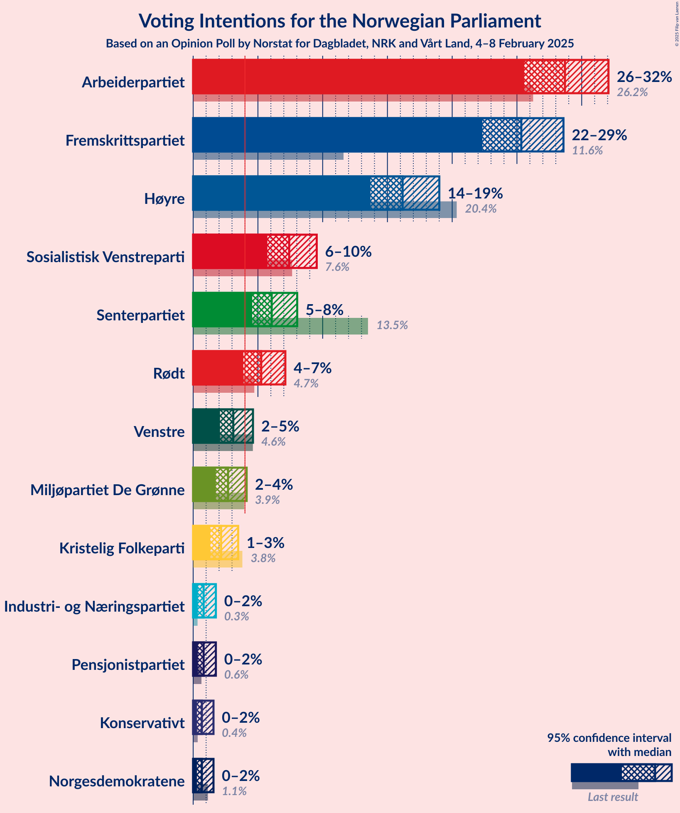
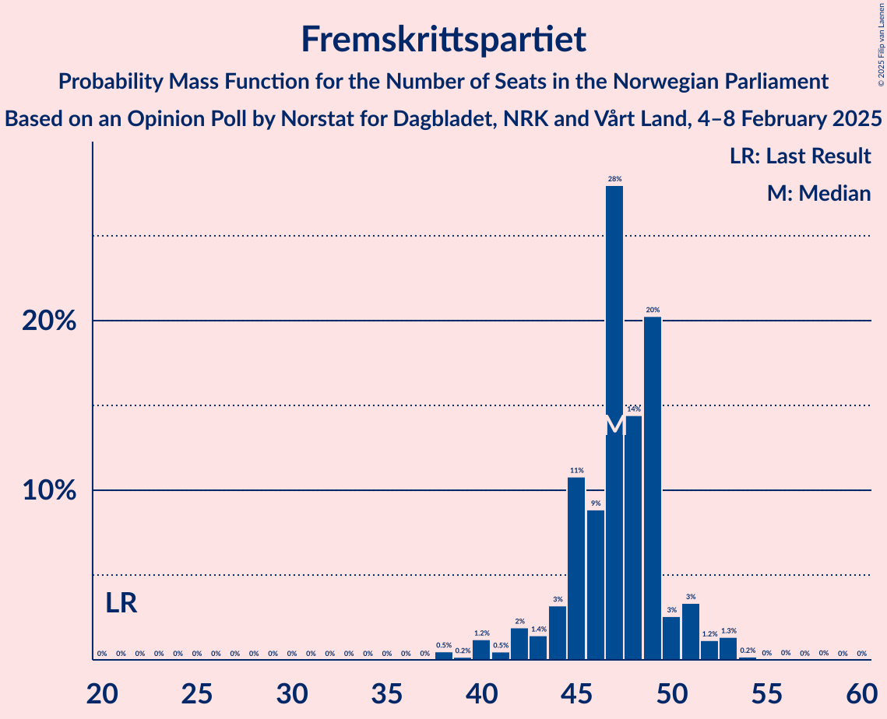
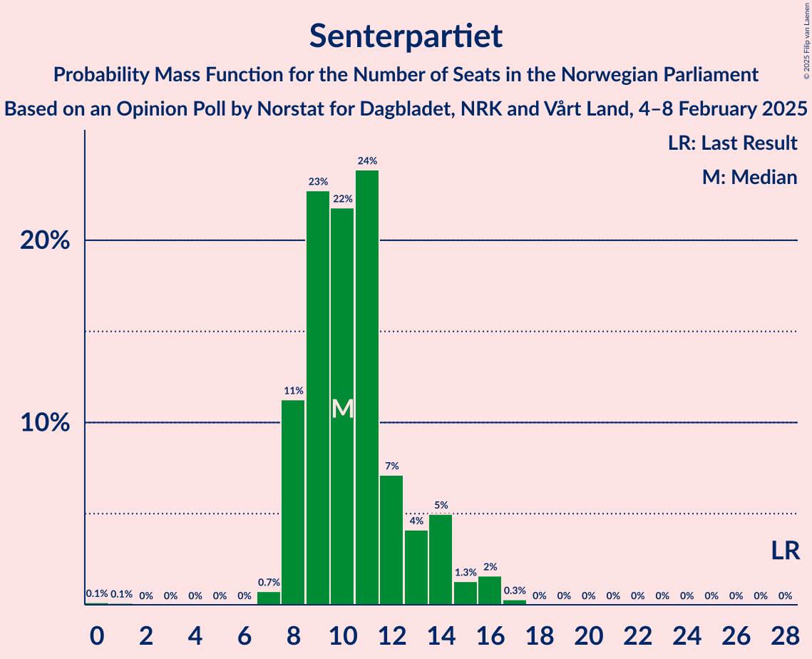
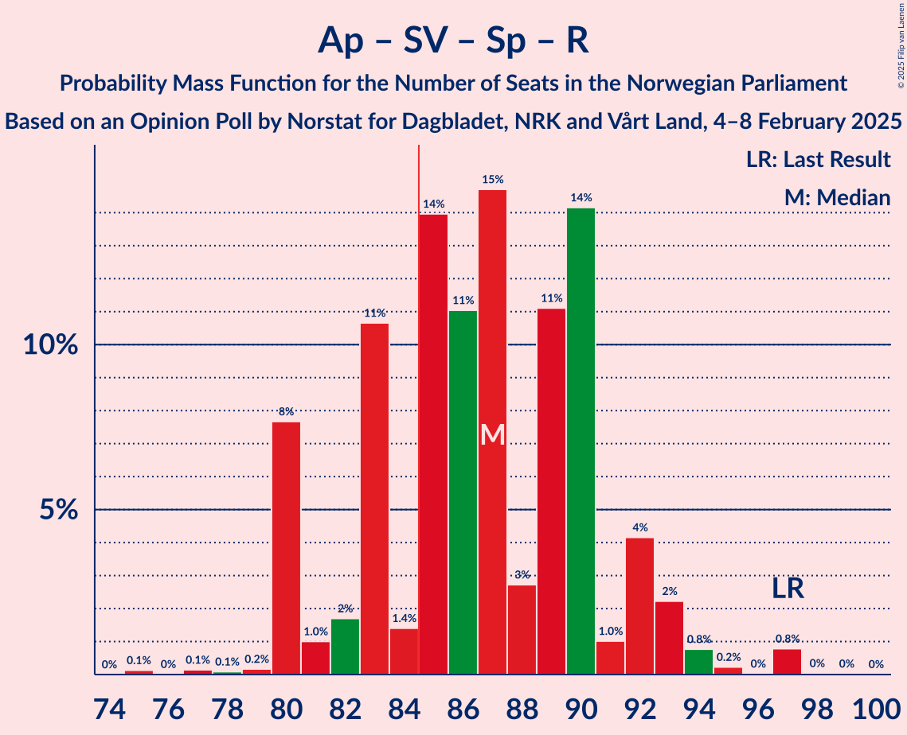
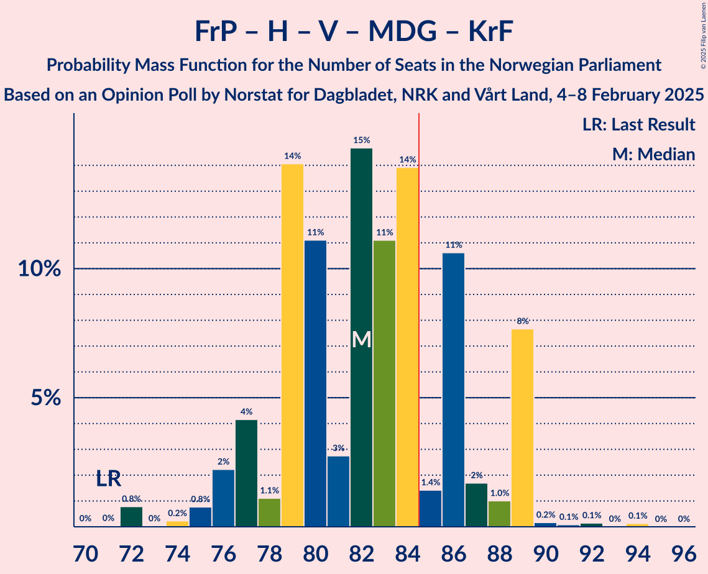
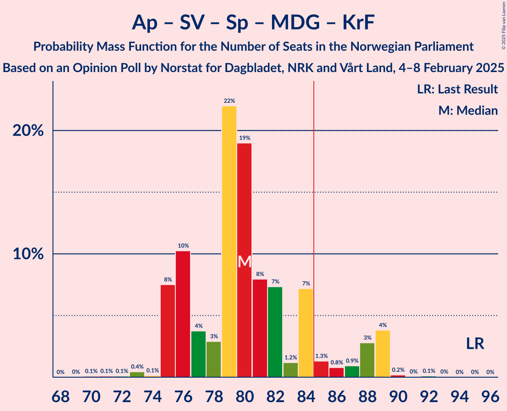
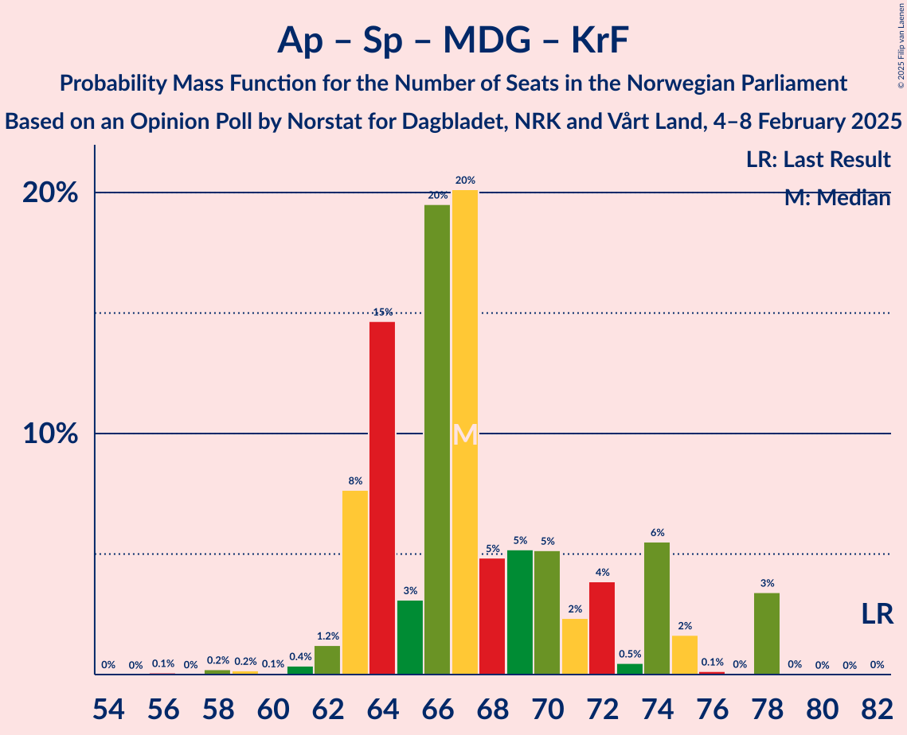

# Opinion Poll by Norstat for Dagbladet, NRK and Vårt Land, 4–8 February 2025

<a href="#voting-intentions">Voting Intentions</a> | <a href="#seats">Seats</a> | <a href="#coalitions">Coalitions</a> | <a href="#technical-information">Technical Information</a>

## Voting Intentions

### Confidence Intervals

| Party | Last Result | Poll Result | 80% Confidence Interval | 90% Confidence Interval | 95% Confidence Interval | 99% Confidence Interval |
|:-----:|:-----------:|:-----------:|:-----------------------:|:-----------------------:|:-----------------------:|:-----------------------:|
| Arbeiderpartiet | 26.2% | 28.7% | 26.6–30.9% |26.1–31.5% |25.6–32.1% |24.6–33.2% |
| Fremskrittspartiet | 11.6% | 25.3% | 23.4–27.5% |22.8–28.1% |22.3–28.6% |21.4–29.6% |
| Høyre | 20.4% | 16.2% | 14.5–18.0% |14.1–18.5% |13.7–19.0% |13.0–19.9% |
| Sosialistisk Venstreparti | 7.6% | 7.4% | 6.3–8.8% |6.0–9.2% |5.7–9.5% |5.2–10.2% |
| Senterpartiet | 13.5% | 6.1% | 5.1–7.3% |4.8–7.7% |4.6–8.0% |4.1–8.7% |
| Rødt | 4.7% | 5.3% | 4.3–6.5% |4.1–6.8% |3.9–7.1% |3.5–7.7% |
| Venstre | 4.6% | 3.1% | 2.4–4.1% |2.2–4.4% |2.1–4.6% |1.8–5.1% |
| Miljøpartiet De Grønne | 3.9% | 2.7% | 2.1–3.6% |1.9–3.9% |1.8–4.1% |1.5–4.6% |
| Kristelig Folkeparti | 3.8% | 2.2% | 1.6–3.0% |1.4–3.3% |1.3–3.5% |1.1–3.9% |
| Pensjonistpartiet | 0.6% | 0.8% | 0.5–1.4% |0.4–1.6% |0.4–1.8% |0.3–2.1% |
| Industri- og Næringspartiet | 0.3% | 0.8% | 0.5–1.4% |0.4–1.6% |0.4–1.8% |0.3–2.1% |
| Norgesdemokratene | 1.1% | 0.7% | 0.4–1.2% |0.4–1.4% |0.3–1.6% |0.2–1.9% |
| Konservativt | 0.4% | 0.7% | 0.4–1.2% |0.4–1.4% |0.3–1.6% |0.2–1.9% |

*Note:* The poll result column reflects the actual value used in the calculations. Published results may vary slightly, and in addition be rounded to fewer digits.

## Seats

### Confidence Intervals

| Party | Last Result | Median | 80% Confidence Interval | 90% Confidence Interval | 95% Confidence Interval | 99% Confidence Interval |
|:-----:|:-----------:|:------:|:-----------------------:|:-----------------------:|:-----------------------:|:-----------------------:|
| <a href="#arbeiderpartiet">Arbeiderpartiet</a> | 48 | 54 | 51–58 |49–60 |48–60 |46–61 |
| <a href="#fremskrittspartiet">Fremskrittspartiet</a> | 21 | 47 | 45–49 |43–51 |42–52 |38–53 |
| <a href="#høyre">Høyre</a> | 36 | 29 | 26–33 |25–33 |23–34 |23–37 |
| <a href="#sosialistisk-venstreparti">Sosialistisk Venstreparti</a> | 13 | 13 | 10–16 |10–16 |10–17 |10–19 |
| <a href="#senterpartiet">Senterpartiet</a> | 28 | 10 | 8–13 |8–14 |8–15 |7–16 |
| <a href="#rødt">Rødt</a> | 8 | 9 | 8–12 |1–12 |1–12 |1–14 |
| <a href="#venstre">Venstre</a> | 8 | 2 | 1–7 |1–7 |1–9 |0–10 |
| <a href="#miljøpartiet-de-grønne">Miljøpartiet De Grønne</a> | 3 | 1 | 1–3 |1–3 |1–3 |0–8 |
| <a href="#kristelig-folkeparti">Kristelig Folkeparti</a> | 3 | 1 | 0–2 |0–7 |0–7 |0–7 |
| <a href="#pensjonistpartiet">Pensjonistpartiet</a> | 0 | 0 | 0 |0 |0 |0 |
| <a href="#industri--og-næringspartiet">Industri- og Næringspartiet</a> | 0 | 0 | 0 |0 |0 |0 |
| <a href="#norgesdemokratene">Norgesdemokratene</a> | 0 | 0 | 0 |0 |0 |0 |
| <a href="#konservativt">Konservativt</a> | 0 | 0 | 0 |0 |0 |0 |

### Arbeiderpartiet

*For a full overview of the results for this party, see the [Arbeiderpartiet](party-arbeiderpartiet.html) page.*

| Number of Seats | Probability | Accumulated | Special Marks |
|:---------------:|:-----------:|:-----------:|:-------------:|
| 43 | 0.2% | 100% |  |
| 44 | 0% | 99.8% |  |
| 45 | 0.2% | 99.8% |  |
| 46 | 1.3% | 99.6% |  |
| 47 | 0.2% | 98% |  |
| 48 | 1.1% | 98% | Last Result |
| 49 | 2% | 97% |  |
| 50 | 2% | 95% |  |
| 51 | 10% | 93% |  |
| 52 | 4% | 83% |  |
| 53 | 27% | 79% |  |
| 54 | 2% | 52% | Median |
| 55 | 10% | 50% |  |
| 56 | 24% | 39% |  |
| 57 | 4% | 16% |  |
| 58 | 2% | 12% |  |
| 59 | 3% | 10% |  |
| 60 | 7% | 7% |  |
| 61 | 0.2% | 0.5% |  |
| 62 | 0.1% | 0.3% |  |
| 63 | 0.1% | 0.2% |  |
| 64 | 0% | 0.1% |  |
| 65 | 0% | 0.1% |  |
| 66 | 0% | 0.1% |  |
| 67 | 0% | 0% |  |

### Fremskrittspartiet

*For a full overview of the results for this party, see the [Fremskrittspartiet](party-fremskrittspartiet.html) page.*

| Number of Seats | Probability | Accumulated | Special Marks |
|:---------------:|:-----------:|:-----------:|:-------------:|
| 21 | 0% | 100% | Last Result |
| 22 | 0% | 100% |  |
| 23 | 0% | 100% |  |
| 24 | 0% | 100% |  |
| 25 | 0% | 100% |  |
| 26 | 0% | 100% |  |
| 27 | 0% | 100% |  |
| 28 | 0% | 100% |  |
| 29 | 0% | 100% |  |
| 30 | 0% | 100% |  |
| 31 | 0% | 100% |  |
| 32 | 0% | 100% |  |
| 33 | 0% | 100% |  |
| 34 | 0% | 100% |  |
| 35 | 0% | 100% |  |
| 36 | 0% | 100% |  |
| 37 | 0% | 100% |  |
| 38 | 0.5% | 100% |  |
| 39 | 0.2% | 99.5% |  |
| 40 | 1.2% | 99.3% |  |
| 41 | 0.5% | 98% |  |
| 42 | 2% | 98% |  |
| 43 | 1.4% | 96% |  |
| 44 | 3% | 94% |  |
| 45 | 11% | 91% |  |
| 46 | 9% | 80% |  |
| 47 | 28% | 71% | Median |
| 48 | 14% | 43% |  |
| 49 | 20% | 29% |  |
| 50 | 3% | 9% |  |
| 51 | 3% | 6% |  |
| 52 | 1.2% | 3% |  |
| 53 | 1.3% | 2% |  |
| 54 | 0.2% | 0.3% |  |
| 55 | 0% | 0.1% |  |
| 56 | 0% | 0.1% |  |
| 57 | 0% | 0.1% |  |
| 58 | 0% | 0.1% |  |
| 59 | 0% | 0% |  |

### Høyre

*For a full overview of the results for this party, see the [Høyre](party-høyre.html) page.*

| Number of Seats | Probability | Accumulated | Special Marks |
|:---------------:|:-----------:|:-----------:|:-------------:|
| 21 | 0% | 100% |  |
| 22 | 0.2% | 99.9% |  |
| 23 | 2% | 99.8% |  |
| 24 | 1.0% | 97% |  |
| 25 | 3% | 96% |  |
| 26 | 5% | 94% |  |
| 27 | 8% | 89% |  |
| 28 | 30% | 81% |  |
| 29 | 2% | 51% | Median |
| 30 | 6% | 49% |  |
| 31 | 11% | 43% |  |
| 32 | 21% | 32% |  |
| 33 | 8% | 11% |  |
| 34 | 0.7% | 3% |  |
| 35 | 0.6% | 2% |  |
| 36 | 1.1% | 2% | Last Result |
| 37 | 0.5% | 0.5% |  |
| 38 | 0% | 0% |  |

### Sosialistisk Venstreparti

*For a full overview of the results for this party, see the [Sosialistisk Venstreparti](party-sosialistiskvenstreparti.html) page.*

| Number of Seats | Probability | Accumulated | Special Marks |
|:---------------:|:-----------:|:-----------:|:-------------:|
| 9 | 0.2% | 100% |  |
| 10 | 16% | 99.8% |  |
| 11 | 17% | 84% |  |
| 12 | 10% | 68% |  |
| 13 | 37% | 58% | Last Result, Median |
| 14 | 4% | 21% |  |
| 15 | 3% | 17% |  |
| 16 | 9% | 14% |  |
| 17 | 2% | 5% |  |
| 18 | 1.5% | 2% |  |
| 19 | 0.7% | 0.9% |  |
| 20 | 0% | 0.2% |  |
| 21 | 0% | 0.1% |  |
| 22 | 0.1% | 0.1% |  |
| 23 | 0% | 0% |  |

### Senterpartiet

*For a full overview of the results for this party, see the [Senterpartiet](party-senterpartiet.html) page.*

| Number of Seats | Probability | Accumulated | Special Marks |
|:---------------:|:-----------:|:-----------:|:-------------:|
| 0 | 0.1% | 100% |  |
| 1 | 0.1% | 99.9% |  |
| 2 | 0% | 99.8% |  |
| 3 | 0% | 99.8% |  |
| 4 | 0% | 99.8% |  |
| 5 | 0% | 99.8% |  |
| 6 | 0% | 99.8% |  |
| 7 | 0.7% | 99.8% |  |
| 8 | 11% | 99.0% |  |
| 9 | 23% | 88% |  |
| 10 | 22% | 65% | Median |
| 11 | 24% | 43% |  |
| 12 | 7% | 19% |  |
| 13 | 4% | 12% |  |
| 14 | 5% | 8% |  |
| 15 | 1.3% | 3% |  |
| 16 | 2% | 2% |  |
| 17 | 0.3% | 0.3% |  |
| 18 | 0% | 0% |  |
| 19 | 0% | 0% |  |
| 20 | 0% | 0% |  |
| 21 | 0% | 0% |  |
| 22 | 0% | 0% |  |
| 23 | 0% | 0% |  |
| 24 | 0% | 0% |  |
| 25 | 0% | 0% |  |
| 26 | 0% | 0% |  |
| 27 | 0% | 0% |  |
| 28 | 0% | 0% | Last Result |

### Rødt

*For a full overview of the results for this party, see the [Rødt](party-rødt.html) page.*

| Number of Seats | Probability | Accumulated | Special Marks |
|:---------------:|:-----------:|:-----------:|:-------------:|
| 1 | 6% | 100% |  |
| 2 | 0.4% | 94% |  |
| 3 | 0% | 93% |  |
| 4 | 0% | 93% |  |
| 5 | 0% | 93% |  |
| 6 | 0% | 93% |  |
| 7 | 0.3% | 93% |  |
| 8 | 21% | 93% | Last Result |
| 9 | 23% | 72% | Median |
| 10 | 13% | 49% |  |
| 11 | 23% | 36% |  |
| 12 | 12% | 13% |  |
| 13 | 0.5% | 1.2% |  |
| 14 | 0.4% | 0.7% |  |
| 15 | 0.1% | 0.3% |  |
| 16 | 0.2% | 0.3% |  |
| 17 | 0% | 0% |  |

### Venstre

*For a full overview of the results for this party, see the [Venstre](party-venstre.html) page.*

| Number of Seats | Probability | Accumulated | Special Marks |
|:---------------:|:-----------:|:-----------:|:-------------:|
| 0 | 0.9% | 100% |  |
| 1 | 25% | 99.1% |  |
| 2 | 43% | 74% | Median |
| 3 | 12% | 32% |  |
| 4 | 0% | 20% |  |
| 5 | 0% | 20% |  |
| 6 | 0% | 20% |  |
| 7 | 15% | 20% |  |
| 8 | 0.6% | 5% | Last Result |
| 9 | 3% | 4% |  |
| 10 | 1.3% | 1.4% |  |
| 11 | 0% | 0% |  |

### Miljøpartiet De Grønne

*For a full overview of the results for this party, see the [Miljøpartiet De Grønne](party-miljøpartietdegrønne.html) page.*

| Number of Seats | Probability | Accumulated | Special Marks |
|:---------------:|:-----------:|:-----------:|:-------------:|
| 0 | 0.9% | 100% |  |
| 1 | 68% | 99.1% | Median |
| 2 | 18% | 31% |  |
| 3 | 12% | 13% | Last Result |
| 4 | 0% | 2% |  |
| 5 | 0% | 1.5% |  |
| 6 | 0% | 1.5% |  |
| 7 | 0.9% | 1.5% |  |
| 8 | 0.2% | 0.6% |  |
| 9 | 0.3% | 0.3% |  |
| 10 | 0% | 0% |  |

### Kristelig Folkeparti

*For a full overview of the results for this party, see the [Kristelig Folkeparti](party-kristeligfolkeparti.html) page.*

| Number of Seats | Probability | Accumulated | Special Marks |
|:---------------:|:-----------:|:-----------:|:-------------:|
| 0 | 46% | 100% |  |
| 1 | 21% | 54% | Median |
| 2 | 24% | 33% |  |
| 3 | 2% | 9% | Last Result |
| 4 | 0% | 7% |  |
| 5 | 0% | 7% |  |
| 6 | 0% | 7% |  |
| 7 | 7% | 7% |  |
| 8 | 0.3% | 0.4% |  |
| 9 | 0% | 0% |  |

### Pensjonistpartiet

*For a full overview of the results for this party, see the [Pensjonistpartiet](party-pensjonistpartiet.html) page.*

| Number of Seats | Probability | Accumulated | Special Marks |
|:---------------:|:-----------:|:-----------:|:-------------:|
| 0 | 99.8% | 100% | Last Result, Median |
| 1 | 0.2% | 0.2% |  |
| 2 | 0% | 0% |  |

### Industri- og Næringspartiet

*For a full overview of the results for this party, see the [Industri- og Næringspartiet](party-industri-ognæringspartiet.html) page.*

| Number of Seats | Probability | Accumulated | Special Marks |
|:---------------:|:-----------:|:-----------:|:-------------:|
| 0 | 99.9% | 100% | Last Result, Median |
| 1 | 0.1% | 0.1% |  |
| 2 | 0% | 0% |  |

### Norgesdemokratene

*For a full overview of the results for this party, see the [Norgesdemokratene](party-norgesdemokratene.html) page.*

| Number of Seats | Probability | Accumulated | Special Marks |
|:---------------:|:-----------:|:-----------:|:-------------:|
| 0 | 100% | 100% | Last Result, Median |

### Konservativt

*For a full overview of the results for this party, see the [Konservativt](party-konservativt.html) page.*

| Number of Seats | Probability | Accumulated | Special Marks |
|:---------------:|:-----------:|:-----------:|:-------------:|
| 0 | 100% | 100% | Last Result, Median |

## Coalitions

### Confidence Intervals

| Coalition | Last Result | Median | Majority? | 80% Confidence Interval | 90% Confidence Interval | 95% Confidence Interval | 99% Confidence Interval |
|:---------:|:-----------:|:------:|:---------:|:-----------------------:|:-----------------------:|:-----------------------:|:-----------------------:|
| Fremskrittspartiet – Høyre – Senterpartiet – Venstre – Kristelig Folkeparti | 96 | 91 | 98% | 88–96 | 86–96 | 85–97 | 81–99 |
| Arbeiderpartiet – Sosialistisk Venstreparti – Senterpartiet – Rødt – Miljøpartiet De Grønne | 100 | 88 | 82% | 84–92 | 81–94 | 81–96 | 81–98 |
| Arbeiderpartiet – Sosialistisk Venstreparti – Senterpartiet – Rødt | 97 | 87 | 77% | 82–90 | 80–92 | 80–93 | 79–97 |
| Fremskrittspartiet – Høyre – Venstre – Miljøpartiet De Grønne – Kristelig Folkeparti | 71 | 82 | 23% | 79–87 | 77–89 | 76–89 | 72–90 |
| Arbeiderpartiet – Sosialistisk Venstreparti – Senterpartiet – Miljøpartiet De Grønne – Kristelig Folkeparti | 95 | 80 | 10% | 76–85 | 75–88 | 75–89 | 73–89 |
| Arbeiderpartiet – Sosialistisk Venstreparti – Senterpartiet – Miljøpartiet De Grønne | 92 | 79 | 8% | 75–84 | 73–88 | 73–88 | 72–88 |
| Fremskrittspartiet – Høyre – Venstre – Kristelig Folkeparti | 68 | 81 | 18% | 77–85 | 75–88 | 73–88 | 71–88 |
| Fremskrittspartiet – Høyre – Venstre | 65 | 80 | 13% | 76–85 | 75–86 | 73–86 | 70–86 |
| Arbeiderpartiet – Sosialistisk Venstreparti – Senterpartiet | 89 | 77 | 7% | 73–82 | 72–85 | 72–85 | 70–86 |
| Arbeiderpartiet – Sosialistisk Venstreparti – Rødt – Miljøpartiet De Grønne | 72 | 78 | 2% | 73–81 | 73–83 | 72–84 | 70–88 |
| Fremskrittspartiet – Høyre | 57 | 77 | 0.3% | 73–80 | 71–82 | 70–82 | 68–84 |
| Arbeiderpartiet – Senterpartiet – Miljøpartiet De Grønne – Kristelig Folkeparti | 82 | 67 | 0% | 64–74 | 63–75 | 63–78 | 59–78 |
| Arbeiderpartiet – Senterpartiet – Kristelig Folkeparti | 79 | 66 | 0% | 62–72 | 62–73 | 61–75 | 58–75 |
| Arbeiderpartiet – Senterpartiet | 76 | 65 | 0% | 60–68 | 60–71 | 60–74 | 56–74 |
| Arbeiderpartiet – Sosialistisk Venstreparti | 61 | 67 | 0% | 63–71 | 62–71 | 62–73 | 58–76 |
| Høyre – Venstre – Kristelig Folkeparti | 47 | 34 | 0% | 29–39 | 29–41 | 28–41 | 25–41 |
| Senterpartiet – Venstre – Kristelig Folkeparti | 39 | 14 | 0% | 11–19 | 11–19 | 11–20 | 9–22 |

### Fremskrittspartiet – Høyre – Senterpartiet – Venstre – Kristelig Folkeparti

| Number of Seats | Probability | Accumulated | Special Marks |
|:---------------:|:-----------:|:-----------:|:-------------:|
| 79 | 0.1% | 100% |  |
| 80 | 0.1% | 99.9% |  |
| 81 | 0.4% | 99.8% |  |
| 82 | 0.1% | 99.4% |  |
| 83 | 0.8% | 99.3% |  |
| 84 | 1.0% | 98.5% |  |
| 85 | 2% | 98% | Majority |
| 86 | 2% | 95% |  |
| 87 | 1.3% | 93% |  |
| 88 | 16% | 92% |  |
| 89 | 2% | 75% | Median |
| 90 | 17% | 73% |  |
| 91 | 18% | 56% |  |
| 92 | 3% | 38% |  |
| 93 | 3% | 35% |  |
| 94 | 14% | 33% |  |
| 95 | 3% | 18% |  |
| 96 | 13% | 16% | Last Result |
| 97 | 2% | 3% |  |
| 98 | 0.6% | 1.2% |  |
| 99 | 0.1% | 0.6% |  |
| 100 | 0.2% | 0.5% |  |
| 101 | 0.1% | 0.3% |  |
| 102 | 0.1% | 0.2% |  |
| 103 | 0% | 0.1% |  |
| 104 | 0.1% | 0.1% |  |
| 105 | 0% | 0% |  |

### Arbeiderpartiet – Sosialistisk Venstreparti – Senterpartiet – Rødt – Miljøpartiet De Grønne

| Number of Seats | Probability | Accumulated | Special Marks |
|:---------------:|:-----------:|:-----------:|:-------------:|
| 76 | 0.1% | 100% |  |
| 77 | 0% | 99.9% |  |
| 78 | 0% | 99.9% |  |
| 79 | 0.1% | 99.8% |  |
| 80 | 0.1% | 99.7% |  |
| 81 | 7% | 99.6% |  |
| 82 | 0.5% | 92% |  |
| 83 | 0.4% | 92% |  |
| 84 | 9% | 92% |  |
| 85 | 2% | 82% | Majority |
| 86 | 9% | 80% |  |
| 87 | 15% | 72% | Median |
| 88 | 9% | 57% |  |
| 89 | 11% | 47% |  |
| 90 | 10% | 36% |  |
| 91 | 14% | 26% |  |
| 92 | 3% | 13% |  |
| 93 | 4% | 10% |  |
| 94 | 2% | 5% |  |
| 95 | 0.8% | 4% |  |
| 96 | 2% | 3% |  |
| 97 | 0.2% | 1.4% |  |
| 98 | 1.0% | 1.2% |  |
| 99 | 0.1% | 0.2% |  |
| 100 | 0% | 0.1% | Last Result |
| 101 | 0% | 0% |  |

### Arbeiderpartiet – Sosialistisk Venstreparti – Senterpartiet – Rødt

| Number of Seats | Probability | Accumulated | Special Marks |
|:---------------:|:-----------:|:-----------:|:-------------:|
| 75 | 0.1% | 100% |  |
| 76 | 0% | 99.9% |  |
| 77 | 0.1% | 99.8% |  |
| 78 | 0.1% | 99.7% |  |
| 79 | 0.2% | 99.6% |  |
| 80 | 8% | 99.4% |  |
| 81 | 1.0% | 92% |  |
| 82 | 2% | 91% |  |
| 83 | 11% | 89% |  |
| 84 | 1.4% | 78% |  |
| 85 | 14% | 77% | Majority |
| 86 | 11% | 63% | Median |
| 87 | 15% | 52% |  |
| 88 | 3% | 37% |  |
| 89 | 11% | 35% |  |
| 90 | 14% | 23% |  |
| 91 | 1.0% | 9% |  |
| 92 | 4% | 8% |  |
| 93 | 2% | 4% |  |
| 94 | 0.8% | 2% |  |
| 95 | 0.2% | 1.1% |  |
| 96 | 0% | 0.9% |  |
| 97 | 0.8% | 0.9% | Last Result |
| 98 | 0% | 0.1% |  |
| 99 | 0% | 0% |  |

### Fremskrittspartiet – Høyre – Venstre – Miljøpartiet De Grønne – Kristelig Folkeparti

| Number of Seats | Probability | Accumulated | Special Marks |
|:---------------:|:-----------:|:-----------:|:-------------:|
| 71 | 0% | 100% | Last Result |
| 72 | 0.8% | 99.9% |  |
| 73 | 0% | 99.1% |  |
| 74 | 0.2% | 99.1% |  |
| 75 | 0.8% | 98.9% |  |
| 76 | 2% | 98% |  |
| 77 | 4% | 96% |  |
| 78 | 1.1% | 92% |  |
| 79 | 14% | 91% |  |
| 80 | 11% | 77% | Median |
| 81 | 3% | 65% |  |
| 82 | 15% | 63% |  |
| 83 | 11% | 48% |  |
| 84 | 14% | 37% |  |
| 85 | 1.4% | 23% | Majority |
| 86 | 11% | 22% |  |
| 87 | 2% | 11% |  |
| 88 | 1.0% | 9% |  |
| 89 | 8% | 8% |  |
| 90 | 0.2% | 0.6% |  |
| 91 | 0.1% | 0.4% |  |
| 92 | 0.1% | 0.3% |  |
| 93 | 0% | 0.2% |  |
| 94 | 0.1% | 0.1% |  |
| 95 | 0% | 0% |  |

### Arbeiderpartiet – Sosialistisk Venstreparti – Senterpartiet – Miljøpartiet De Grønne – Kristelig Folkeparti

| Number of Seats | Probability | Accumulated | Special Marks |
|:---------------:|:-----------:|:-----------:|:-------------:|
| 69 | 0% | 100% |  |
| 70 | 0.1% | 99.9% |  |
| 71 | 0.1% | 99.8% |  |
| 72 | 0.1% | 99.8% |  |
| 73 | 0.4% | 99.7% |  |
| 74 | 0.1% | 99.2% |  |
| 75 | 8% | 99.1% |  |
| 76 | 10% | 92% |  |
| 77 | 4% | 81% |  |
| 78 | 3% | 78% |  |
| 79 | 22% | 75% | Median |
| 80 | 19% | 53% |  |
| 81 | 8% | 34% |  |
| 82 | 7% | 26% |  |
| 83 | 1.2% | 18% |  |
| 84 | 7% | 17% |  |
| 85 | 1.3% | 10% | Majority |
| 86 | 0.8% | 9% |  |
| 87 | 0.9% | 8% |  |
| 88 | 3% | 7% |  |
| 89 | 4% | 4% |  |
| 90 | 0.2% | 0.4% |  |
| 91 | 0% | 0.2% |  |
| 92 | 0.1% | 0.2% |  |
| 93 | 0% | 0.1% |  |
| 94 | 0% | 0% |  |
| 95 | 0% | 0% | Last Result |

### Arbeiderpartiet – Sosialistisk Venstreparti – Senterpartiet – Miljøpartiet De Grønne

| Number of Seats | Probability | Accumulated | Special Marks |
|:---------------:|:-----------:|:-----------:|:-------------:|
| 66 | 0% | 100% |  |
| 67 | 0% | 99.9% |  |
| 68 | 0% | 99.9% |  |
| 69 | 0% | 99.9% |  |
| 70 | 0.1% | 99.9% |  |
| 71 | 0.2% | 99.8% |  |
| 72 | 0.1% | 99.6% |  |
| 73 | 7% | 99.5% |  |
| 74 | 0.3% | 92% |  |
| 75 | 6% | 92% |  |
| 76 | 11% | 86% |  |
| 77 | 12% | 75% |  |
| 78 | 11% | 62% | Median |
| 79 | 14% | 51% |  |
| 80 | 14% | 37% |  |
| 81 | 8% | 23% |  |
| 82 | 3% | 15% |  |
| 83 | 1.4% | 12% |  |
| 84 | 2% | 11% |  |
| 85 | 0.5% | 8% | Majority |
| 86 | 0.8% | 8% |  |
| 87 | 0.7% | 7% |  |
| 88 | 6% | 6% |  |
| 89 | 0.1% | 0.4% |  |
| 90 | 0.2% | 0.3% |  |
| 91 | 0.1% | 0.2% |  |
| 92 | 0.1% | 0.1% | Last Result |
| 93 | 0% | 0% |  |

### Fremskrittspartiet – Høyre – Venstre – Kristelig Folkeparti

| Number of Seats | Probability | Accumulated | Special Marks |
|:---------------:|:-----------:|:-----------:|:-------------:|
| 68 | 0% | 100% | Last Result |
| 69 | 0% | 100% |  |
| 70 | 0.1% | 99.9% |  |
| 71 | 1.0% | 99.8% |  |
| 72 | 0.2% | 98.8% |  |
| 73 | 2% | 98.6% |  |
| 74 | 0.8% | 97% |  |
| 75 | 2% | 96% |  |
| 76 | 4% | 95% |  |
| 77 | 3% | 90% |  |
| 78 | 14% | 87% |  |
| 79 | 10% | 74% | Median |
| 80 | 11% | 64% |  |
| 81 | 9% | 52% |  |
| 82 | 15% | 43% |  |
| 83 | 9% | 28% |  |
| 84 | 2% | 20% |  |
| 85 | 9% | 18% | Majority |
| 86 | 0.4% | 8% |  |
| 87 | 0.5% | 8% |  |
| 88 | 7% | 8% |  |
| 89 | 0.2% | 0.4% |  |
| 90 | 0.1% | 0.3% |  |
| 91 | 0% | 0.2% |  |
| 92 | 0% | 0.1% |  |
| 93 | 0.1% | 0.1% |  |
| 94 | 0% | 0% |  |

### Fremskrittspartiet – Høyre – Venstre

| Number of Seats | Probability | Accumulated | Special Marks |
|:---------------:|:-----------:|:-----------:|:-------------:|
| 65 | 0% | 100% | Last Result |
| 66 | 0% | 100% |  |
| 67 | 0% | 100% |  |
| 68 | 0% | 100% |  |
| 69 | 0.2% | 99.9% |  |
| 70 | 0.6% | 99.8% |  |
| 71 | 0.6% | 99.2% |  |
| 72 | 0.5% | 98.6% |  |
| 73 | 2% | 98% |  |
| 74 | 1.4% | 97% |  |
| 75 | 2% | 95% |  |
| 76 | 9% | 93% |  |
| 77 | 4% | 84% |  |
| 78 | 23% | 80% | Median |
| 79 | 5% | 57% |  |
| 80 | 18% | 52% |  |
| 81 | 8% | 33% |  |
| 82 | 8% | 25% |  |
| 83 | 3% | 17% |  |
| 84 | 1.0% | 14% |  |
| 85 | 5% | 13% | Majority |
| 86 | 7% | 8% |  |
| 87 | 0.1% | 0.5% |  |
| 88 | 0.1% | 0.4% |  |
| 89 | 0.1% | 0.3% |  |
| 90 | 0.1% | 0.2% |  |
| 91 | 0% | 0.2% |  |
| 92 | 0.1% | 0.1% |  |
| 93 | 0.1% | 0.1% |  |
| 94 | 0% | 0% |  |

### Arbeiderpartiet – Sosialistisk Venstreparti – Senterpartiet

| Number of Seats | Probability | Accumulated | Special Marks |
|:---------------:|:-----------:|:-----------:|:-------------:|
| 65 | 0% | 100% |  |
| 66 | 0% | 99.9% |  |
| 67 | 0% | 99.9% |  |
| 68 | 0.2% | 99.9% |  |
| 69 | 0.2% | 99.8% |  |
| 70 | 0.1% | 99.5% |  |
| 71 | 0.2% | 99.5% |  |
| 72 | 9% | 99.3% |  |
| 73 | 1.2% | 90% |  |
| 74 | 10% | 89% |  |
| 75 | 7% | 79% |  |
| 76 | 13% | 72% |  |
| 77 | 12% | 59% | Median |
| 78 | 14% | 47% |  |
| 79 | 17% | 33% |  |
| 80 | 3% | 17% |  |
| 81 | 4% | 14% |  |
| 82 | 1.0% | 10% |  |
| 83 | 2% | 9% |  |
| 84 | 0.7% | 8% |  |
| 85 | 5% | 7% | Majority |
| 86 | 2% | 2% |  |
| 87 | 0.1% | 0.3% |  |
| 88 | 0.1% | 0.3% |  |
| 89 | 0% | 0.1% | Last Result |
| 90 | 0% | 0.1% |  |
| 91 | 0% | 0% |  |

### Arbeiderpartiet – Sosialistisk Venstreparti – Rødt – Miljøpartiet De Grønne

| Number of Seats | Probability | Accumulated | Special Marks |
|:---------------:|:-----------:|:-----------:|:-------------:|
| 65 | 0.1% | 100% |  |
| 66 | 0% | 99.9% |  |
| 67 | 0.1% | 99.9% |  |
| 68 | 0.1% | 99.8% |  |
| 69 | 0.2% | 99.7% |  |
| 70 | 0.1% | 99.5% |  |
| 71 | 0.6% | 99.4% |  |
| 72 | 2% | 98.8% | Last Result |
| 73 | 13% | 97% |  |
| 74 | 3% | 84% |  |
| 75 | 14% | 82% |  |
| 76 | 3% | 67% |  |
| 77 | 3% | 65% | Median |
| 78 | 18% | 62% |  |
| 79 | 17% | 44% |  |
| 80 | 2% | 27% |  |
| 81 | 16% | 25% |  |
| 82 | 1.2% | 8% |  |
| 83 | 2% | 7% |  |
| 84 | 2% | 5% |  |
| 85 | 0.9% | 2% | Majority |
| 86 | 0.8% | 1.5% |  |
| 87 | 0.1% | 0.7% |  |
| 88 | 0.4% | 0.6% |  |
| 89 | 0.1% | 0.2% |  |
| 90 | 0.1% | 0.1% |  |
| 91 | 0% | 0% |  |

### Fremskrittspartiet – Høyre

| Number of Seats | Probability | Accumulated | Special Marks |
|:---------------:|:-----------:|:-----------:|:-------------:|
| 57 | 0% | 100% | Last Result |
| 58 | 0% | 100% |  |
| 59 | 0% | 100% |  |
| 60 | 0% | 100% |  |
| 61 | 0% | 100% |  |
| 62 | 0% | 100% |  |
| 63 | 0% | 100% |  |
| 64 | 0% | 100% |  |
| 65 | 0% | 99.9% |  |
| 66 | 0.1% | 99.9% |  |
| 67 | 0.3% | 99.8% |  |
| 68 | 0.6% | 99.6% |  |
| 69 | 0.7% | 99.0% |  |
| 70 | 2% | 98% |  |
| 71 | 4% | 96% |  |
| 72 | 2% | 92% |  |
| 73 | 3% | 90% |  |
| 74 | 3% | 87% |  |
| 75 | 15% | 84% |  |
| 76 | 11% | 69% | Median |
| 77 | 18% | 58% |  |
| 78 | 13% | 40% |  |
| 79 | 16% | 28% |  |
| 80 | 5% | 12% |  |
| 81 | 1.3% | 7% |  |
| 82 | 5% | 6% |  |
| 83 | 0.7% | 1.4% |  |
| 84 | 0.4% | 0.7% |  |
| 85 | 0.1% | 0.3% | Majority |
| 86 | 0% | 0.2% |  |
| 87 | 0% | 0.1% |  |
| 88 | 0% | 0.1% |  |
| 89 | 0% | 0.1% |  |
| 90 | 0% | 0.1% |  |
| 91 | 0.1% | 0.1% |  |
| 92 | 0% | 0% |  |

### Arbeiderpartiet – Senterpartiet – Miljøpartiet De Grønne – Kristelig Folkeparti

| Number of Seats | Probability | Accumulated | Special Marks |
|:---------------:|:-----------:|:-----------:|:-------------:|
| 54 | 0% | 100% |  |
| 55 | 0% | 99.9% |  |
| 56 | 0.1% | 99.9% |  |
| 57 | 0% | 99.8% |  |
| 58 | 0.2% | 99.8% |  |
| 59 | 0.2% | 99.6% |  |
| 60 | 0.1% | 99.4% |  |
| 61 | 0.4% | 99.4% |  |
| 62 | 1.2% | 99.0% |  |
| 63 | 8% | 98% |  |
| 64 | 15% | 90% |  |
| 65 | 3% | 75% |  |
| 66 | 20% | 72% | Median |
| 67 | 20% | 53% |  |
| 68 | 5% | 33% |  |
| 69 | 5% | 28% |  |
| 70 | 5% | 23% |  |
| 71 | 2% | 18% |  |
| 72 | 4% | 15% |  |
| 73 | 0.5% | 11% |  |
| 74 | 6% | 11% |  |
| 75 | 2% | 5% |  |
| 76 | 0.1% | 4% |  |
| 77 | 0% | 4% |  |
| 78 | 3% | 4% |  |
| 79 | 0% | 0.1% |  |
| 80 | 0% | 0% |  |
| 81 | 0% | 0% |  |
| 82 | 0% | 0% | Last Result |

### Arbeiderpartiet – Senterpartiet – Kristelig Folkeparti

| Number of Seats | Probability | Accumulated | Special Marks |
|:---------------:|:-----------:|:-----------:|:-------------:|
| 52 | 0% | 100% |  |
| 53 | 0.1% | 99.9% |  |
| 54 | 0% | 99.9% |  |
| 55 | 0% | 99.9% |  |
| 56 | 0.2% | 99.8% |  |
| 57 | 0.1% | 99.7% |  |
| 58 | 0.2% | 99.5% |  |
| 59 | 1.0% | 99.3% |  |
| 60 | 0.6% | 98% |  |
| 61 | 0.5% | 98% |  |
| 62 | 14% | 97% |  |
| 63 | 12% | 83% |  |
| 64 | 1.5% | 71% |  |
| 65 | 19% | 69% | Median |
| 66 | 22% | 50% |  |
| 67 | 4% | 28% |  |
| 68 | 6% | 23% |  |
| 69 | 2% | 17% |  |
| 70 | 1.3% | 15% |  |
| 71 | 3% | 14% |  |
| 72 | 1.4% | 11% |  |
| 73 | 6% | 9% |  |
| 74 | 0.1% | 4% |  |
| 75 | 3% | 3% |  |
| 76 | 0% | 0.1% |  |
| 77 | 0% | 0.1% |  |
| 78 | 0% | 0% |  |
| 79 | 0% | 0% | Last Result |

### Arbeiderpartiet – Senterpartiet

| Number of Seats | Probability | Accumulated | Special Marks |
|:---------------:|:-----------:|:-----------:|:-------------:|
| 52 | 0% | 100% |  |
| 53 | 0.1% | 99.9% |  |
| 54 | 0% | 99.8% |  |
| 55 | 0% | 99.8% |  |
| 56 | 0.9% | 99.8% |  |
| 57 | 0.4% | 98.9% |  |
| 58 | 0.3% | 98% |  |
| 59 | 0.2% | 98% |  |
| 60 | 8% | 98% |  |
| 61 | 10% | 90% |  |
| 62 | 7% | 79% |  |
| 63 | 4% | 73% |  |
| 64 | 15% | 69% | Median |
| 65 | 14% | 53% |  |
| 66 | 21% | 39% |  |
| 67 | 3% | 18% |  |
| 68 | 6% | 15% |  |
| 69 | 0.6% | 9% |  |
| 70 | 0.9% | 9% |  |
| 71 | 3% | 8% |  |
| 72 | 1.3% | 5% |  |
| 73 | 0.1% | 4% |  |
| 74 | 3% | 3% |  |
| 75 | 0% | 0.1% |  |
| 76 | 0.1% | 0.1% | Last Result |
| 77 | 0% | 0% |  |

### Arbeiderpartiet – Sosialistisk Venstreparti

| Number of Seats | Probability | Accumulated | Special Marks |
|:---------------:|:-----------:|:-----------:|:-------------:|
| 56 | 0.1% | 100% |  |
| 57 | 0.1% | 99.9% |  |
| 58 | 0.4% | 99.8% |  |
| 59 | 0.2% | 99.5% |  |
| 60 | 1.2% | 99.3% |  |
| 61 | 0.4% | 98% | Last Result |
| 62 | 4% | 98% |  |
| 63 | 4% | 94% |  |
| 64 | 9% | 90% |  |
| 65 | 12% | 81% |  |
| 66 | 15% | 68% |  |
| 67 | 10% | 53% | Median |
| 68 | 8% | 43% |  |
| 69 | 20% | 35% |  |
| 70 | 3% | 15% |  |
| 71 | 8% | 12% |  |
| 72 | 1.2% | 4% |  |
| 73 | 2% | 3% |  |
| 74 | 0.6% | 2% |  |
| 75 | 0.5% | 1.1% |  |
| 76 | 0.4% | 0.5% |  |
| 77 | 0.1% | 0.2% |  |
| 78 | 0% | 0.1% |  |
| 79 | 0% | 0.1% |  |
| 80 | 0% | 0% |  |

### Høyre – Venstre – Kristelig Folkeparti

| Number of Seats | Probability | Accumulated | Special Marks |
|:---------------:|:-----------:|:-----------:|:-------------:|
| 24 | 0% | 100% |  |
| 25 | 0.6% | 99.9% |  |
| 26 | 1.0% | 99.4% |  |
| 27 | 0.5% | 98% |  |
| 28 | 2% | 98% |  |
| 29 | 16% | 96% |  |
| 30 | 3% | 80% |  |
| 31 | 15% | 77% |  |
| 32 | 1.4% | 62% | Median |
| 33 | 4% | 60% |  |
| 34 | 13% | 56% |  |
| 35 | 14% | 43% |  |
| 36 | 8% | 29% |  |
| 37 | 2% | 21% |  |
| 38 | 8% | 19% |  |
| 39 | 1.5% | 11% |  |
| 40 | 1.4% | 9% |  |
| 41 | 8% | 8% |  |
| 42 | 0% | 0.1% |  |
| 43 | 0% | 0.1% |  |
| 44 | 0% | 0.1% |  |
| 45 | 0% | 0.1% |  |
| 46 | 0% | 0% |  |
| 47 | 0% | 0% | Last Result |

### Senterpartiet – Venstre – Kristelig Folkeparti

| Number of Seats | Probability | Accumulated | Special Marks |
|:---------------:|:-----------:|:-----------:|:-------------:|
| 3 | 0% | 100% |  |
| 4 | 0% | 99.9% |  |
| 5 | 0.1% | 99.9% |  |
| 6 | 0% | 99.8% |  |
| 7 | 0% | 99.8% |  |
| 8 | 0% | 99.8% |  |
| 9 | 0.6% | 99.8% |  |
| 10 | 0.5% | 99.2% |  |
| 11 | 20% | 98.7% |  |
| 12 | 6% | 78% |  |
| 13 | 15% | 73% | Median |
| 14 | 12% | 58% |  |
| 15 | 3% | 45% |  |
| 16 | 13% | 42% |  |
| 17 | 15% | 30% |  |
| 18 | 4% | 15% |  |
| 19 | 6% | 11% |  |
| 20 | 4% | 5% |  |
| 21 | 0.3% | 1.0% |  |
| 22 | 0.4% | 0.7% |  |
| 23 | 0.1% | 0.3% |  |
| 24 | 0.2% | 0.2% |  |
| 25 | 0% | 0% |  |
| 26 | 0% | 0% |  |
| 27 | 0% | 0% |  |
| 28 | 0% | 0% |  |
| 29 | 0% | 0% |  |
| 30 | 0% | 0% |  |
| 31 | 0% | 0% |  |
| 32 | 0% | 0% |  |
| 33 | 0% | 0% |  |
| 34 | 0% | 0% |  |
| 35 | 0% | 0% |  |
| 36 | 0% | 0% |  |
| 37 | 0% | 0% |  |
| 38 | 0% | 0% |  |
| 39 | 0% | 0% | Last Result |

## Technical Information

### Opinion Poll

+ **Polling firm:** Norstat
+ **Commissioner(s):** Dagbladet, NRK and Vårt Land
+ **Fieldwork period:** 4–8 February 2025

### Calculations

+ **Sample size:** 742
+ **Simulations done:** 2,097,152
+ **Error estimate:** 1.55%

