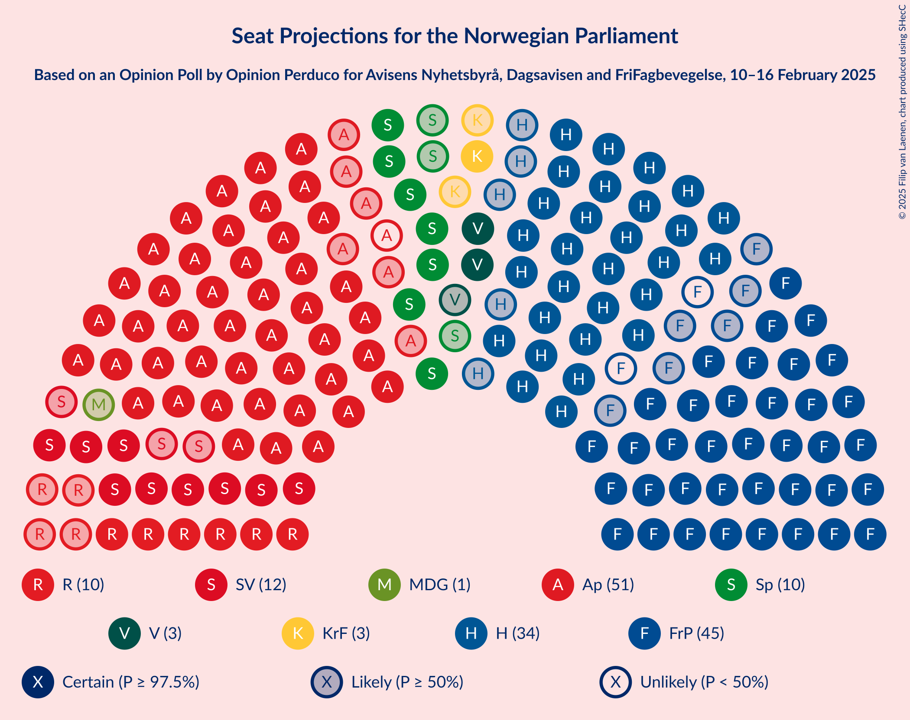

# Opinion Poll by Opinion Perduco for Avisens Nyhetsbyrå, Dagsavisen and FriFagbevegelse, 10–16 February 2025

<a href="#voting-intentions">Voting Intentions</a> | <a href="#seats">Seats</a> | <a href="#coalitions">Coalitions</a> | <a href="#technical-information">Technical Information</a>

## Voting Intentions

### Confidence Intervals

| Party | Last Result | Poll Result | 80% Confidence Interval | 90% Confidence Interval | 95% Confidence Interval | 99% Confidence Interval |
|:-----:|:-----------:|:-----------:|:-----------------------:|:-----------------------:|:-----------------------:|:-----------------------:|
| Arbeiderpartiet | 26.2% | 26.6% | 24.4–28.9% |23.8–29.6% |23.3–30.2% |22.3–31.3% |
| Fremskrittspartiet | 11.6% | 22.4% | 20.4–24.6% |19.8–25.2% |19.3–25.8% |18.4–26.9% |
| Høyre | 20.4% | 19.1% | 17.2–21.2% |16.7–21.8% |16.2–22.3% |15.4–23.4% |
| Sosialistisk Venstreparti | 7.6% | 7.2% | 6.0–8.7% |5.7–9.1% |5.4–9.5% |4.9–10.2% |
| Senterpartiet | 13.5% | 5.9% | 4.9–7.3% |4.6–7.7% |4.4–8.1% |3.9–8.8% |
| Rødt | 4.7% | 5.5% | 4.5–6.8% |4.2–7.2% |4.0–7.5% |3.5–8.2% |
| Venstre | 4.6% | 3.9% | 3.1–5.1% |2.9–5.4% |2.7–5.7% |2.3–6.3% |
| Kristelig Folkeparti | 3.8% | 3.4% | 2.7–4.6% |2.5–4.9% |2.3–5.2% |2.0–5.7% |
| Miljøpartiet De Grønne | 3.9% | 2.0% | 1.5–3.0% |1.3–3.2% |1.2–3.5% |1.0–3.9% |
| Industri- og Næringspartiet | 0.3% | 0.5% | 0.3–1.1% |0.2–1.2% |0.2–1.4% |0.1–1.7% |

*Note:* The poll result column reflects the actual value used in the calculations. Published results may vary slightly, and in addition be rounded to fewer digits.

## Seats

### Confidence Intervals

| Party | Last Result | Median | 80% Confidence Interval | 90% Confidence Interval | 95% Confidence Interval | 99% Confidence Interval |
|:-----:|:-----------:|:------:|:-----------------------:|:-----------------------:|:-----------------------:|:-----------------------:|
| <a href="#arbeiderpartiet">Arbeiderpartiet</a> | 48 | 49 | 47–53 |46–55 |44–57 |42–58 |
| <a href="#fremskrittspartiet">Fremskrittspartiet</a> | 21 | 43 | 39–46 |38–47 |37–49 |35–49 |
| <a href="#høyre">Høyre</a> | 36 | 34 | 30–37 |29–39 |29–41 |27–43 |
| <a href="#sosialistisk-venstreparti">Sosialistisk Venstreparti</a> | 13 | 12 | 10–15 |9–16 |9–17 |8–18 |
| <a href="#senterpartiet">Senterpartiet</a> | 28 | 10 | 8–13 |8–13 |7–15 |1–15 |
| <a href="#rødt">Rødt</a> | 8 | 10 | 8–11 |7–12 |2–13 |1–14 |
| <a href="#venstre">Venstre</a> | 8 | 3 | 2–8 |2–9 |2–10 |2–11 |
| <a href="#kristelig-folkeparti">Kristelig Folkeparti</a> | 3 | 3 | 1–7 |1–8 |0–9 |0–9 |
| <a href="#miljøpartiet-de-grønne">Miljøpartiet De Grønne</a> | 3 | 1 | 0–1 |0–2 |0–2 |0–6 |
| <a href="#industri--og-næringspartiet">Industri- og Næringspartiet</a> | 0 | 0 | 0 |0 |0 |0 |

### Arbeiderpartiet

*For a full overview of the results for this party, see the [Arbeiderpartiet](party-arbeiderpartiet.html) page.*

| Number of Seats | Probability | Accumulated | Special Marks |
|:---------------:|:-----------:|:-----------:|:-------------:|
| 39 | 0.1% | 100% |  |
| 40 | 0.1% | 99.9% |  |
| 41 | 0.3% | 99.8% |  |
| 42 | 0.3% | 99.5% |  |
| 43 | 0.4% | 99.3% |  |
| 44 | 2% | 98.9% |  |
| 45 | 1.5% | 97% |  |
| 46 | 3% | 96% |  |
| 47 | 12% | 93% |  |
| 48 | 13% | 81% | Last Result |
| 49 | 29% | 68% | Median |
| 50 | 7% | 39% |  |
| 51 | 5% | 32% |  |
| 52 | 8% | 27% |  |
| 53 | 13% | 20% |  |
| 54 | 1.0% | 7% |  |
| 55 | 2% | 6% |  |
| 56 | 1.3% | 4% |  |
| 57 | 1.2% | 3% |  |
| 58 | 1.0% | 1.3% |  |
| 59 | 0.1% | 0.4% |  |
| 60 | 0.1% | 0.3% |  |
| 61 | 0.2% | 0.2% |  |
| 62 | 0% | 0% |  |

### Fremskrittspartiet

*For a full overview of the results for this party, see the [Fremskrittspartiet](party-fremskrittspartiet.html) page.*

| Number of Seats | Probability | Accumulated | Special Marks |
|:---------------:|:-----------:|:-----------:|:-------------:|
| 21 | 0% | 100% | Last Result |
| 22 | 0% | 100% |  |
| 23 | 0% | 100% |  |
| 24 | 0% | 100% |  |
| 25 | 0% | 100% |  |
| 26 | 0% | 100% |  |
| 27 | 0% | 100% |  |
| 28 | 0% | 100% |  |
| 29 | 0% | 100% |  |
| 30 | 0% | 100% |  |
| 31 | 0% | 100% |  |
| 32 | 0% | 100% |  |
| 33 | 0.1% | 100% |  |
| 34 | 0.3% | 99.9% |  |
| 35 | 0.7% | 99.6% |  |
| 36 | 1.2% | 98.9% |  |
| 37 | 1.4% | 98% |  |
| 38 | 4% | 96% |  |
| 39 | 8% | 93% |  |
| 40 | 17% | 84% |  |
| 41 | 8% | 67% |  |
| 42 | 9% | 59% |  |
| 43 | 5% | 50% | Median |
| 44 | 5% | 45% |  |
| 45 | 29% | 40% |  |
| 46 | 4% | 10% |  |
| 47 | 2% | 7% |  |
| 48 | 0.9% | 4% |  |
| 49 | 3% | 3% |  |
| 50 | 0.1% | 0.1% |  |
| 51 | 0.1% | 0.1% |  |
| 52 | 0% | 0% |  |

### Høyre

*For a full overview of the results for this party, see the [Høyre](party-høyre.html) page.*

| Number of Seats | Probability | Accumulated | Special Marks |
|:---------------:|:-----------:|:-----------:|:-------------:|
| 25 | 0.1% | 100% |  |
| 26 | 0.1% | 99.9% |  |
| 27 | 0.3% | 99.8% |  |
| 28 | 0.8% | 99.5% |  |
| 29 | 4% | 98.7% |  |
| 30 | 5% | 95% |  |
| 31 | 10% | 89% |  |
| 32 | 17% | 79% |  |
| 33 | 11% | 62% |  |
| 34 | 13% | 51% | Median |
| 35 | 22% | 38% |  |
| 36 | 3% | 16% | Last Result |
| 37 | 4% | 13% |  |
| 38 | 4% | 10% |  |
| 39 | 2% | 5% |  |
| 40 | 0.7% | 3% |  |
| 41 | 1.5% | 3% |  |
| 42 | 0.5% | 1.3% |  |
| 43 | 0.7% | 0.8% |  |
| 44 | 0% | 0.1% |  |
| 45 | 0% | 0.1% |  |
| 46 | 0% | 0% |  |

### Sosialistisk Venstreparti

*For a full overview of the results for this party, see the [Sosialistisk Venstreparti](party-sosialistiskvenstreparti.html) page.*

| Number of Seats | Probability | Accumulated | Special Marks |
|:---------------:|:-----------:|:-----------:|:-------------:|
| 7 | 0.2% | 100% |  |
| 8 | 1.4% | 99.7% |  |
| 9 | 4% | 98% |  |
| 10 | 12% | 95% |  |
| 11 | 16% | 82% |  |
| 12 | 18% | 67% | Median |
| 13 | 27% | 48% | Last Result |
| 14 | 8% | 22% |  |
| 15 | 4% | 13% |  |
| 16 | 5% | 10% |  |
| 17 | 4% | 5% |  |
| 18 | 0.4% | 0.7% |  |
| 19 | 0.3% | 0.3% |  |
| 20 | 0.1% | 0.1% |  |
| 21 | 0% | 0% |  |

### Senterpartiet

*For a full overview of the results for this party, see the [Senterpartiet](party-senterpartiet.html) page.*

| Number of Seats | Probability | Accumulated | Special Marks |
|:---------------:|:-----------:|:-----------:|:-------------:|
| 0 | 0.2% | 100% |  |
| 1 | 0.4% | 99.8% |  |
| 2 | 0% | 99.4% |  |
| 3 | 0% | 99.4% |  |
| 4 | 0% | 99.4% |  |
| 5 | 0% | 99.4% |  |
| 6 | 0.6% | 99.4% |  |
| 7 | 3% | 98.8% |  |
| 8 | 14% | 95% |  |
| 9 | 11% | 82% |  |
| 10 | 29% | 71% | Median |
| 11 | 10% | 42% |  |
| 12 | 14% | 32% |  |
| 13 | 13% | 18% |  |
| 14 | 2% | 5% |  |
| 15 | 2% | 3% |  |
| 16 | 0.3% | 0.5% |  |
| 17 | 0.2% | 0.2% |  |
| 18 | 0% | 0% |  |
| 19 | 0% | 0% |  |
| 20 | 0% | 0% |  |
| 21 | 0% | 0% |  |
| 22 | 0% | 0% |  |
| 23 | 0% | 0% |  |
| 24 | 0% | 0% |  |
| 25 | 0% | 0% |  |
| 26 | 0% | 0% |  |
| 27 | 0% | 0% |  |
| 28 | 0% | 0% | Last Result |

### Rødt

*For a full overview of the results for this party, see the [Rødt](party-rødt.html) page.*

| Number of Seats | Probability | Accumulated | Special Marks |
|:---------------:|:-----------:|:-----------:|:-------------:|
| 1 | 2% | 100% |  |
| 2 | 0.4% | 98% |  |
| 3 | 0.2% | 97% |  |
| 4 | 0% | 97% |  |
| 5 | 0% | 97% |  |
| 6 | 0.5% | 97% |  |
| 7 | 3% | 97% |  |
| 8 | 16% | 93% | Last Result |
| 9 | 26% | 77% |  |
| 10 | 28% | 51% | Median |
| 11 | 15% | 23% |  |
| 12 | 4% | 8% |  |
| 13 | 2% | 4% |  |
| 14 | 1.2% | 2% |  |
| 15 | 0.2% | 0.3% |  |
| 16 | 0% | 0% |  |

### Venstre

*For a full overview of the results for this party, see the [Venstre](party-venstre.html) page.*

| Number of Seats | Probability | Accumulated | Special Marks |
|:---------------:|:-----------:|:-----------:|:-------------:|
| 1 | 0.4% | 100% |  |
| 2 | 13% | 99.6% |  |
| 3 | 47% | 87% | Median |
| 4 | 0% | 40% |  |
| 5 | 0% | 40% |  |
| 6 | 6% | 40% |  |
| 7 | 13% | 34% |  |
| 8 | 12% | 21% | Last Result |
| 9 | 6% | 10% |  |
| 10 | 3% | 4% |  |
| 11 | 0.9% | 1.1% |  |
| 12 | 0.1% | 0.2% |  |
| 13 | 0% | 0% |  |

### Kristelig Folkeparti

*For a full overview of the results for this party, see the [Kristelig Folkeparti](party-kristeligfolkeparti.html) page.*

| Number of Seats | Probability | Accumulated | Special Marks |
|:---------------:|:-----------:|:-----------:|:-------------:|
| 0 | 3% | 100% |  |
| 1 | 11% | 97% |  |
| 2 | 35% | 86% |  |
| 3 | 33% | 52% | Last Result, Median |
| 4 | 0% | 18% |  |
| 5 | 0% | 18% |  |
| 6 | 5% | 18% |  |
| 7 | 7% | 13% |  |
| 8 | 3% | 6% |  |
| 9 | 2% | 3% |  |
| 10 | 0.2% | 0.4% |  |
| 11 | 0.1% | 0.1% |  |
| 12 | 0% | 0% |  |

### Miljøpartiet De Grønne

*For a full overview of the results for this party, see the [Miljøpartiet De Grønne](party-miljøpartietdegrønne.html) page.*

| Number of Seats | Probability | Accumulated | Special Marks |
|:---------------:|:-----------:|:-----------:|:-------------:|
| 0 | 12% | 100% |  |
| 1 | 78% | 88% | Median |
| 2 | 8% | 10% |  |
| 3 | 1.2% | 2% | Last Result |
| 4 | 0% | 0.5% |  |
| 5 | 0% | 0.5% |  |
| 6 | 0.2% | 0.5% |  |
| 7 | 0.3% | 0.3% |  |
| 8 | 0.1% | 0.1% |  |
| 9 | 0% | 0% |  |

### Industri- og Næringspartiet

*For a full overview of the results for this party, see the [Industri- og Næringspartiet](party-industri-ognæringspartiet.html) page.*

| Number of Seats | Probability | Accumulated | Special Marks |
|:---------------:|:-----------:|:-----------:|:-------------:|
| 0 | 100% | 100% | Last Result, Median |

## Coalitions

### Confidence Intervals

| Coalition | Last Result | Median | Majority? | 80% Confidence Interval | 90% Confidence Interval | 95% Confidence Interval | 99% Confidence Interval |
|:---------:|:-----------:|:------:|:---------:|:-----------------------:|:-----------------------:|:-----------------------:|:-----------------------:|
| Fremskrittspartiet – Høyre – Senterpartiet – Venstre – Kristelig Folkeparti | 96 | 95 | 99.1% | 90–99 | 87–101 | 86–101 | 84–104 |
| Fremskrittspartiet – Høyre – Venstre – Kristelig Folkeparti – Miljøpartiet De Grønne | 71 | 85 | 55% | 80–90 | 78–92 | 77–93 | 75–94 |
| Arbeiderpartiet – Sosialistisk Venstreparti – Senterpartiet – Rødt – Miljøpartiet De Grønne | 100 | 83 | 30% | 79–88 | 77–91 | 76–92 | 73–95 |
| Fremskrittspartiet – Høyre – Venstre – Kristelig Folkeparti | 68 | 84 | 48% | 79–89 | 77–91 | 76–92 | 74–93 |
| Arbeiderpartiet – Sosialistisk Venstreparti – Senterpartiet – Rødt | 97 | 82 | 25% | 77–87 | 76–90 | 75–91 | 71–93 |
| Fremskrittspartiet – Høyre – Venstre | 65 | 82 | 14% | 75–86 | 74–87 | 73–88 | 71–91 |
| Arbeiderpartiet – Sosialistisk Venstreparti – Senterpartiet – Kristelig Folkeparti – Miljøpartiet De Grønne | 95 | 76 | 3% | 73–82 | 71–83 | 70–85 | 67–87 |
| Fremskrittspartiet – Høyre | 57 | 77 | 0.3% | 72–80 | 71–83 | 69–83 | 67–84 |
| Arbeiderpartiet – Sosialistisk Venstreparti – Rødt – Miljøpartiet De Grønne | 72 | 73 | 0.2% | 68–77 | 67–79 | 66–81 | 63–84 |
| Arbeiderpartiet – Sosialistisk Venstreparti – Senterpartiet – Miljøpartiet De Grønne | 92 | 73 | 0.2% | 69–79 | 68–80 | 66–81 | 64–83 |
| Arbeiderpartiet – Sosialistisk Venstreparti – Senterpartiet | 89 | 72 | 0.2% | 68–78 | 67–79 | 65–80 | 63–82 |
| Arbeiderpartiet – Senterpartiet – Kristelig Folkeparti – Miljøpartiet De Grønne | 82 | 63 | 0% | 61–69 | 60–71 | 58–73 | 55–74 |
| Arbeiderpartiet – Senterpartiet – Kristelig Folkeparti | 79 | 63 | 0% | 60–68 | 59–70 | 57–72 | 54–74 |
| Arbeiderpartiet – Sosialistisk Venstreparti | 61 | 62 | 0% | 58–66 | 57–68 | 56–69 | 54–72 |
| Arbeiderpartiet – Senterpartiet | 76 | 60 | 0% | 57–64 | 56–66 | 54–67 | 51–70 |
| Høyre – Venstre – Kristelig Folkeparti | 47 | 41 | 0% | 37–47 | 37–49 | 35–51 | 34–53 |
| Senterpartiet – Venstre – Kristelig Folkeparti | 39 | 18 | 0% | 14–24 | 13–25 | 13–26 | 11–29 |

### Fremskrittspartiet – Høyre – Senterpartiet – Venstre – Kristelig Folkeparti

| Number of Seats | Probability | Accumulated | Special Marks |
|:---------------:|:-----------:|:-----------:|:-------------:|
| 82 | 0% | 100% |  |
| 83 | 0.2% | 99.9% |  |
| 84 | 0.6% | 99.8% |  |
| 85 | 0.8% | 99.1% | Majority |
| 86 | 2% | 98% |  |
| 87 | 2% | 97% |  |
| 88 | 1.4% | 95% |  |
| 89 | 2% | 93% |  |
| 90 | 9% | 92% |  |
| 91 | 4% | 83% |  |
| 92 | 7% | 79% |  |
| 93 | 10% | 71% | Median |
| 94 | 8% | 61% |  |
| 95 | 4% | 53% |  |
| 96 | 22% | 49% | Last Result |
| 97 | 10% | 28% |  |
| 98 | 3% | 18% |  |
| 99 | 5% | 14% |  |
| 100 | 4% | 10% |  |
| 101 | 3% | 5% |  |
| 102 | 0.5% | 2% |  |
| 103 | 0.9% | 1.5% |  |
| 104 | 0.2% | 0.6% |  |
| 105 | 0.2% | 0.4% |  |
| 106 | 0.1% | 0.3% |  |
| 107 | 0.1% | 0.2% |  |
| 108 | 0% | 0.1% |  |
| 109 | 0% | 0% |  |

### Fremskrittspartiet – Høyre – Venstre – Kristelig Folkeparti – Miljøpartiet De Grønne

| Number of Seats | Probability | Accumulated | Special Marks |
|:---------------:|:-----------:|:-----------:|:-------------:|
| 71 | 0% | 100% | Last Result |
| 72 | 0% | 100% |  |
| 73 | 0.2% | 99.9% |  |
| 74 | 0.1% | 99.8% |  |
| 75 | 1.1% | 99.7% |  |
| 76 | 0.6% | 98.6% |  |
| 77 | 2% | 98% |  |
| 78 | 4% | 96% |  |
| 79 | 1.2% | 93% |  |
| 80 | 4% | 91% |  |
| 81 | 4% | 87% |  |
| 82 | 10% | 83% |  |
| 83 | 5% | 74% |  |
| 84 | 13% | 68% | Median |
| 85 | 7% | 55% | Majority |
| 86 | 9% | 48% |  |
| 87 | 17% | 40% |  |
| 88 | 2% | 23% |  |
| 89 | 7% | 21% |  |
| 90 | 4% | 14% |  |
| 91 | 4% | 9% |  |
| 92 | 2% | 6% |  |
| 93 | 3% | 4% |  |
| 94 | 0.6% | 0.9% |  |
| 95 | 0.2% | 0.4% |  |
| 96 | 0.1% | 0.2% |  |
| 97 | 0% | 0.1% |  |
| 98 | 0% | 0.1% |  |
| 99 | 0% | 0% |  |

### Arbeiderpartiet – Sosialistisk Venstreparti – Senterpartiet – Rødt – Miljøpartiet De Grønne

| Number of Seats | Probability | Accumulated | Special Marks |
|:---------------:|:-----------:|:-----------:|:-------------:|
| 69 | 0.1% | 100% |  |
| 70 | 0% | 99.9% |  |
| 71 | 0.1% | 99.8% |  |
| 72 | 0.1% | 99.7% |  |
| 73 | 0.2% | 99.6% |  |
| 74 | 0.3% | 99.3% |  |
| 75 | 0.8% | 99.1% |  |
| 76 | 2% | 98% |  |
| 77 | 4% | 96% |  |
| 78 | 2% | 93% |  |
| 79 | 10% | 90% |  |
| 80 | 13% | 81% |  |
| 81 | 7% | 68% |  |
| 82 | 5% | 61% | Median |
| 83 | 17% | 56% |  |
| 84 | 9% | 39% |  |
| 85 | 5% | 30% | Majority |
| 86 | 9% | 26% |  |
| 87 | 3% | 17% |  |
| 88 | 3% | 13% |  |
| 89 | 0.8% | 10% |  |
| 90 | 4% | 9% |  |
| 91 | 0.7% | 5% |  |
| 92 | 3% | 5% |  |
| 93 | 1.0% | 2% |  |
| 94 | 0.4% | 0.9% |  |
| 95 | 0.4% | 0.6% |  |
| 96 | 0.1% | 0.1% |  |
| 97 | 0% | 0% |  |
| 98 | 0% | 0% |  |
| 99 | 0% | 0% |  |
| 100 | 0% | 0% | Last Result |

### Fremskrittspartiet – Høyre – Venstre – Kristelig Folkeparti

| Number of Seats | Probability | Accumulated | Special Marks |
|:---------------:|:-----------:|:-----------:|:-------------:|
| 68 | 0% | 100% | Last Result |
| 69 | 0% | 100% |  |
| 70 | 0% | 100% |  |
| 71 | 0% | 100% |  |
| 72 | 0.1% | 99.9% |  |
| 73 | 0.1% | 99.8% |  |
| 74 | 1.4% | 99.7% |  |
| 75 | 0.5% | 98% |  |
| 76 | 2% | 98% |  |
| 77 | 3% | 96% |  |
| 78 | 1.2% | 93% |  |
| 79 | 7% | 91% |  |
| 80 | 2% | 84% |  |
| 81 | 4% | 83% |  |
| 82 | 11% | 79% |  |
| 83 | 15% | 68% | Median |
| 84 | 5% | 54% |  |
| 85 | 9% | 48% | Majority |
| 86 | 17% | 39% |  |
| 87 | 2% | 22% |  |
| 88 | 6% | 20% |  |
| 89 | 5% | 14% |  |
| 90 | 4% | 9% |  |
| 91 | 2% | 5% |  |
| 92 | 2% | 4% |  |
| 93 | 0.9% | 1.4% |  |
| 94 | 0.2% | 0.4% |  |
| 95 | 0.1% | 0.2% |  |
| 96 | 0% | 0.1% |  |
| 97 | 0% | 0.1% |  |
| 98 | 0% | 0% |  |

### Arbeiderpartiet – Sosialistisk Venstreparti – Senterpartiet – Rødt

| Number of Seats | Probability | Accumulated | Special Marks |
|:---------------:|:-----------:|:-----------:|:-------------:|
| 68 | 0.1% | 100% |  |
| 69 | 0% | 99.9% |  |
| 70 | 0.1% | 99.8% |  |
| 71 | 0.2% | 99.7% |  |
| 72 | 0.2% | 99.5% |  |
| 73 | 0.4% | 99.3% |  |
| 74 | 0.5% | 98.9% |  |
| 75 | 2% | 98% |  |
| 76 | 5% | 97% |  |
| 77 | 4% | 92% |  |
| 78 | 8% | 88% |  |
| 79 | 8% | 81% |  |
| 80 | 15% | 73% |  |
| 81 | 3% | 58% | Median |
| 82 | 17% | 55% |  |
| 83 | 8% | 39% |  |
| 84 | 6% | 31% |  |
| 85 | 9% | 25% | Majority |
| 86 | 3% | 17% |  |
| 87 | 4% | 14% |  |
| 88 | 0.8% | 10% |  |
| 89 | 3% | 9% |  |
| 90 | 0.8% | 5% |  |
| 91 | 3% | 5% |  |
| 92 | 1.0% | 2% |  |
| 93 | 0.4% | 0.7% |  |
| 94 | 0.1% | 0.2% |  |
| 95 | 0% | 0.1% |  |
| 96 | 0% | 0% |  |
| 97 | 0% | 0% | Last Result |

### Fremskrittspartiet – Høyre – Venstre

| Number of Seats | Probability | Accumulated | Special Marks |
|:---------------:|:-----------:|:-----------:|:-------------:|
| 65 | 0% | 100% | Last Result |
| 66 | 0% | 100% |  |
| 67 | 0% | 100% |  |
| 68 | 0.1% | 100% |  |
| 69 | 0.1% | 99.9% |  |
| 70 | 0.1% | 99.8% |  |
| 71 | 0.7% | 99.7% |  |
| 72 | 0.3% | 99.0% |  |
| 73 | 2% | 98.7% |  |
| 74 | 3% | 97% |  |
| 75 | 4% | 94% |  |
| 76 | 1.3% | 90% |  |
| 77 | 10% | 88% |  |
| 78 | 3% | 78% |  |
| 79 | 4% | 75% |  |
| 80 | 14% | 71% | Median |
| 81 | 6% | 58% |  |
| 82 | 13% | 51% |  |
| 83 | 19% | 38% |  |
| 84 | 5% | 20% |  |
| 85 | 3% | 14% | Majority |
| 86 | 6% | 11% |  |
| 87 | 2% | 5% |  |
| 88 | 2% | 3% |  |
| 89 | 0.4% | 2% |  |
| 90 | 0.2% | 1.1% |  |
| 91 | 0.7% | 0.9% |  |
| 92 | 0.1% | 0.2% |  |
| 93 | 0% | 0.1% |  |
| 94 | 0% | 0.1% |  |
| 95 | 0% | 0% |  |

### Arbeiderpartiet – Sosialistisk Venstreparti – Senterpartiet – Kristelig Folkeparti – Miljøpartiet De Grønne

| Number of Seats | Probability | Accumulated | Special Marks |
|:---------------:|:-----------:|:-----------:|:-------------:|
| 64 | 0% | 100% |  |
| 65 | 0.1% | 99.9% |  |
| 66 | 0.2% | 99.8% |  |
| 67 | 0.4% | 99.7% |  |
| 68 | 0.2% | 99.3% |  |
| 69 | 0.9% | 99.1% |  |
| 70 | 1.2% | 98% |  |
| 71 | 3% | 97% |  |
| 72 | 2% | 94% |  |
| 73 | 9% | 93% |  |
| 74 | 13% | 84% |  |
| 75 | 8% | 71% | Median |
| 76 | 20% | 63% |  |
| 77 | 6% | 43% |  |
| 78 | 15% | 37% |  |
| 79 | 2% | 22% |  |
| 80 | 4% | 20% |  |
| 81 | 5% | 16% |  |
| 82 | 4% | 11% |  |
| 83 | 2% | 7% |  |
| 84 | 2% | 5% |  |
| 85 | 0.5% | 3% | Majority |
| 86 | 1.3% | 2% |  |
| 87 | 0.6% | 1.0% |  |
| 88 | 0.1% | 0.4% |  |
| 89 | 0.1% | 0.3% |  |
| 90 | 0.2% | 0.2% |  |
| 91 | 0% | 0.1% |  |
| 92 | 0% | 0% |  |
| 93 | 0% | 0% |  |
| 94 | 0% | 0% |  |
| 95 | 0% | 0% | Last Result |

### Fremskrittspartiet – Høyre

| Number of Seats | Probability | Accumulated | Special Marks |
|:---------------:|:-----------:|:-----------:|:-------------:|
| 57 | 0% | 100% | Last Result |
| 58 | 0% | 100% |  |
| 59 | 0% | 100% |  |
| 60 | 0% | 100% |  |
| 61 | 0% | 100% |  |
| 62 | 0% | 100% |  |
| 63 | 0% | 100% |  |
| 64 | 0.1% | 100% |  |
| 65 | 0.2% | 99.9% |  |
| 66 | 0.2% | 99.7% |  |
| 67 | 0.9% | 99.5% |  |
| 68 | 1.0% | 98.6% |  |
| 69 | 0.9% | 98% |  |
| 70 | 1.4% | 97% |  |
| 71 | 5% | 95% |  |
| 72 | 8% | 90% |  |
| 73 | 9% | 82% |  |
| 74 | 8% | 73% |  |
| 75 | 10% | 65% |  |
| 76 | 5% | 55% |  |
| 77 | 15% | 50% | Median |
| 78 | 6% | 35% |  |
| 79 | 2% | 29% |  |
| 80 | 18% | 28% |  |
| 81 | 3% | 9% |  |
| 82 | 1.1% | 7% |  |
| 83 | 4% | 6% |  |
| 84 | 1.0% | 1.3% |  |
| 85 | 0.1% | 0.3% | Majority |
| 86 | 0.2% | 0.3% |  |
| 87 | 0% | 0.1% |  |
| 88 | 0.1% | 0.1% |  |
| 89 | 0% | 0% |  |

### Arbeiderpartiet – Sosialistisk Venstreparti – Rødt – Miljøpartiet De Grønne

| Number of Seats | Probability | Accumulated | Special Marks |
|:---------------:|:-----------:|:-----------:|:-------------:|
| 60 | 0.1% | 100% |  |
| 61 | 0.1% | 99.9% |  |
| 62 | 0.2% | 99.8% |  |
| 63 | 0.3% | 99.6% |  |
| 64 | 0.3% | 99.3% |  |
| 65 | 0.6% | 99.0% |  |
| 66 | 2% | 98% |  |
| 67 | 3% | 96% |  |
| 68 | 4% | 93% |  |
| 69 | 9% | 89% |  |
| 70 | 9% | 80% |  |
| 71 | 4% | 71% |  |
| 72 | 16% | 67% | Last Result, Median |
| 73 | 22% | 52% |  |
| 74 | 2% | 30% |  |
| 75 | 8% | 27% |  |
| 76 | 7% | 20% |  |
| 77 | 5% | 12% |  |
| 78 | 2% | 7% |  |
| 79 | 2% | 6% |  |
| 80 | 0.8% | 3% |  |
| 81 | 0.6% | 3% |  |
| 82 | 1.1% | 2% |  |
| 83 | 0.2% | 0.9% |  |
| 84 | 0.5% | 0.7% |  |
| 85 | 0.2% | 0.2% | Majority |
| 86 | 0% | 0.1% |  |
| 87 | 0% | 0% |  |

### Arbeiderpartiet – Sosialistisk Venstreparti – Senterpartiet – Miljøpartiet De Grønne

| Number of Seats | Probability | Accumulated | Special Marks |
|:---------------:|:-----------:|:-----------:|:-------------:|
| 61 | 0% | 100% |  |
| 62 | 0.1% | 99.9% |  |
| 63 | 0.1% | 99.8% |  |
| 64 | 0.2% | 99.7% |  |
| 65 | 0.6% | 99.5% |  |
| 66 | 2% | 98.9% |  |
| 67 | 0.8% | 97% |  |
| 68 | 3% | 97% |  |
| 69 | 5% | 94% |  |
| 70 | 4% | 88% |  |
| 71 | 6% | 84% |  |
| 72 | 17% | 78% | Median |
| 73 | 22% | 61% |  |
| 74 | 3% | 39% |  |
| 75 | 12% | 36% |  |
| 76 | 5% | 24% |  |
| 77 | 4% | 19% |  |
| 78 | 3% | 15% |  |
| 79 | 6% | 12% |  |
| 80 | 0.7% | 6% |  |
| 81 | 3% | 5% |  |
| 82 | 0.8% | 2% |  |
| 83 | 0.8% | 1.2% |  |
| 84 | 0.1% | 0.3% |  |
| 85 | 0.1% | 0.2% | Majority |
| 86 | 0% | 0.2% |  |
| 87 | 0.1% | 0.1% |  |
| 88 | 0% | 0.1% |  |
| 89 | 0% | 0% |  |
| 90 | 0% | 0% |  |
| 91 | 0% | 0% |  |
| 92 | 0% | 0% | Last Result |

### Arbeiderpartiet – Sosialistisk Venstreparti – Senterpartiet

| Number of Seats | Probability | Accumulated | Special Marks |
|:---------------:|:-----------:|:-----------:|:-------------:|
| 60 | 0% | 100% |  |
| 61 | 0.1% | 99.9% |  |
| 62 | 0.1% | 99.8% |  |
| 63 | 0.3% | 99.7% |  |
| 64 | 0.6% | 99.4% |  |
| 65 | 2% | 98.9% |  |
| 66 | 0.9% | 97% |  |
| 67 | 3% | 96% |  |
| 68 | 5% | 93% |  |
| 69 | 4% | 88% |  |
| 70 | 8% | 84% |  |
| 71 | 11% | 76% | Median |
| 72 | 26% | 65% |  |
| 73 | 3% | 39% |  |
| 74 | 11% | 36% |  |
| 75 | 6% | 25% |  |
| 76 | 4% | 19% |  |
| 77 | 4% | 15% |  |
| 78 | 6% | 11% |  |
| 79 | 1.1% | 5% |  |
| 80 | 3% | 4% |  |
| 81 | 0.7% | 2% |  |
| 82 | 0.6% | 0.9% |  |
| 83 | 0.1% | 0.3% |  |
| 84 | 0.1% | 0.2% |  |
| 85 | 0.1% | 0.2% | Majority |
| 86 | 0.1% | 0.1% |  |
| 87 | 0% | 0% |  |
| 88 | 0% | 0% |  |
| 89 | 0% | 0% | Last Result |

### Arbeiderpartiet – Senterpartiet – Kristelig Folkeparti – Miljøpartiet De Grønne

| Number of Seats | Probability | Accumulated | Special Marks |
|:---------------:|:-----------:|:-----------:|:-------------:|
| 51 | 0% | 100% |  |
| 52 | 0% | 99.9% |  |
| 53 | 0.1% | 99.9% |  |
| 54 | 0.3% | 99.8% |  |
| 55 | 0.3% | 99.6% |  |
| 56 | 0.6% | 99.2% |  |
| 57 | 0.3% | 98.7% |  |
| 58 | 2% | 98% |  |
| 59 | 0.8% | 96% |  |
| 60 | 2% | 96% |  |
| 61 | 5% | 94% |  |
| 62 | 10% | 89% |  |
| 63 | 29% | 78% | Median |
| 64 | 14% | 49% |  |
| 65 | 10% | 35% |  |
| 66 | 4% | 25% |  |
| 67 | 4% | 21% |  |
| 68 | 6% | 17% |  |
| 69 | 3% | 11% |  |
| 70 | 2% | 8% |  |
| 71 | 1.4% | 6% |  |
| 72 | 1.3% | 4% |  |
| 73 | 2% | 3% |  |
| 74 | 0.5% | 1.0% |  |
| 75 | 0.2% | 0.5% |  |
| 76 | 0.1% | 0.2% |  |
| 77 | 0% | 0.1% |  |
| 78 | 0.1% | 0.1% |  |
| 79 | 0% | 0% |  |
| 80 | 0% | 0% |  |
| 81 | 0% | 0% |  |
| 82 | 0% | 0% | Last Result |

### Arbeiderpartiet – Senterpartiet – Kristelig Folkeparti

| Number of Seats | Probability | Accumulated | Special Marks |
|:---------------:|:-----------:|:-----------:|:-------------:|
| 50 | 0% | 100% |  |
| 51 | 0% | 99.9% |  |
| 52 | 0.1% | 99.9% |  |
| 53 | 0.3% | 99.8% |  |
| 54 | 0.3% | 99.6% |  |
| 55 | 0.2% | 99.3% |  |
| 56 | 0.8% | 99.1% |  |
| 57 | 2% | 98% |  |
| 58 | 0.9% | 97% |  |
| 59 | 2% | 96% |  |
| 60 | 5% | 94% |  |
| 61 | 11% | 88% |  |
| 62 | 26% | 77% | Median |
| 63 | 17% | 51% |  |
| 64 | 10% | 35% |  |
| 65 | 4% | 25% |  |
| 66 | 5% | 20% |  |
| 67 | 5% | 15% |  |
| 68 | 3% | 11% |  |
| 69 | 2% | 7% |  |
| 70 | 2% | 6% |  |
| 71 | 0.9% | 4% |  |
| 72 | 2% | 3% |  |
| 73 | 0.6% | 1.1% |  |
| 74 | 0.3% | 0.5% |  |
| 75 | 0% | 0.2% |  |
| 76 | 0.1% | 0.2% |  |
| 77 | 0.1% | 0.1% |  |
| 78 | 0% | 0% |  |
| 79 | 0% | 0% | Last Result |

### Arbeiderpartiet – Sosialistisk Venstreparti

| Number of Seats | Probability | Accumulated | Special Marks |
|:---------------:|:-----------:|:-----------:|:-------------:|
| 51 | 0% | 100% |  |
| 52 | 0.2% | 99.9% |  |
| 53 | 0.2% | 99.7% |  |
| 54 | 0.5% | 99.5% |  |
| 55 | 1.4% | 99.0% |  |
| 56 | 1.0% | 98% |  |
| 57 | 2% | 97% |  |
| 58 | 7% | 94% |  |
| 59 | 10% | 88% |  |
| 60 | 6% | 78% |  |
| 61 | 12% | 72% | Last Result, Median |
| 62 | 19% | 61% |  |
| 63 | 10% | 41% |  |
| 64 | 9% | 31% |  |
| 65 | 11% | 22% |  |
| 66 | 4% | 11% |  |
| 67 | 2% | 8% |  |
| 68 | 2% | 6% |  |
| 69 | 2% | 4% |  |
| 70 | 0.9% | 2% |  |
| 71 | 0.1% | 0.9% |  |
| 72 | 0.4% | 0.7% |  |
| 73 | 0.2% | 0.3% |  |
| 74 | 0.1% | 0.1% |  |
| 75 | 0% | 0.1% |  |
| 76 | 0% | 0% |  |

### Arbeiderpartiet – Senterpartiet

| Number of Seats | Probability | Accumulated | Special Marks |
|:---------------:|:-----------:|:-----------:|:-------------:|
| 48 | 0% | 100% |  |
| 49 | 0.1% | 99.9% |  |
| 50 | 0.1% | 99.9% |  |
| 51 | 0.3% | 99.8% |  |
| 52 | 0.4% | 99.5% |  |
| 53 | 0.5% | 99.1% |  |
| 54 | 2% | 98.6% |  |
| 55 | 0.9% | 97% |  |
| 56 | 2% | 96% |  |
| 57 | 5% | 94% |  |
| 58 | 8% | 89% |  |
| 59 | 28% | 80% | Median |
| 60 | 12% | 52% |  |
| 61 | 17% | 40% |  |
| 62 | 7% | 23% |  |
| 63 | 5% | 16% |  |
| 64 | 3% | 10% |  |
| 65 | 2% | 8% |  |
| 66 | 3% | 6% |  |
| 67 | 0.5% | 3% |  |
| 68 | 0.3% | 2% |  |
| 69 | 0.6% | 2% |  |
| 70 | 1.3% | 1.3% |  |
| 71 | 0% | 0.1% |  |
| 72 | 0% | 0% |  |
| 73 | 0% | 0% |  |
| 74 | 0% | 0% |  |
| 75 | 0% | 0% |  |
| 76 | 0% | 0% | Last Result |

### Høyre – Venstre – Kristelig Folkeparti

| Number of Seats | Probability | Accumulated | Special Marks |
|:---------------:|:-----------:|:-----------:|:-------------:|
| 30 | 0.1% | 100% |  |
| 31 | 0% | 99.9% |  |
| 32 | 0.1% | 99.9% |  |
| 33 | 0.2% | 99.8% |  |
| 34 | 1.1% | 99.6% |  |
| 35 | 1.2% | 98.5% |  |
| 36 | 2% | 97% |  |
| 37 | 9% | 96% |  |
| 38 | 7% | 86% |  |
| 39 | 13% | 80% |  |
| 40 | 9% | 66% | Median |
| 41 | 18% | 57% |  |
| 42 | 3% | 39% |  |
| 43 | 7% | 36% |  |
| 44 | 11% | 29% |  |
| 45 | 3% | 18% |  |
| 46 | 3% | 15% |  |
| 47 | 4% | 12% | Last Result |
| 48 | 3% | 8% |  |
| 49 | 1.5% | 5% |  |
| 50 | 0.9% | 4% |  |
| 51 | 1.3% | 3% |  |
| 52 | 1.2% | 2% |  |
| 53 | 0.3% | 0.6% |  |
| 54 | 0.2% | 0.3% |  |
| 55 | 0% | 0.1% |  |
| 56 | 0.1% | 0.1% |  |
| 57 | 0% | 0% |  |

### Senterpartiet – Venstre – Kristelig Folkeparti

| Number of Seats | Probability | Accumulated | Special Marks |
|:---------------:|:-----------:|:-----------:|:-------------:|
| 5 | 0% | 100% |  |
| 6 | 0% | 99.9% |  |
| 7 | 0.1% | 99.9% |  |
| 8 | 0% | 99.9% |  |
| 9 | 0% | 99.8% |  |
| 10 | 0.2% | 99.8% |  |
| 11 | 0.4% | 99.7% |  |
| 12 | 1.3% | 99.2% |  |
| 13 | 7% | 98% |  |
| 14 | 4% | 91% |  |
| 15 | 6% | 87% |  |
| 16 | 19% | 82% | Median |
| 17 | 11% | 62% |  |
| 18 | 9% | 52% |  |
| 19 | 7% | 43% |  |
| 20 | 9% | 36% |  |
| 21 | 5% | 27% |  |
| 22 | 8% | 21% |  |
| 23 | 2% | 13% |  |
| 24 | 6% | 11% |  |
| 25 | 2% | 5% |  |
| 26 | 2% | 3% |  |
| 27 | 0.4% | 1.1% |  |
| 28 | 0.2% | 0.8% |  |
| 29 | 0.2% | 0.5% |  |
| 30 | 0.2% | 0.3% |  |
| 31 | 0.1% | 0.1% |  |
| 32 | 0.1% | 0.1% |  |
| 33 | 0% | 0% |  |
| 34 | 0% | 0% |  |
| 35 | 0% | 0% |  |
| 36 | 0% | 0% |  |
| 37 | 0% | 0% |  |
| 38 | 0% | 0% |  |
| 39 | 0% | 0% | Last Result |

## Technical Information

### Opinion Poll

+ **Polling firm:** Opinion Perduco
+ **Commissioner(s):** Avisens Nyhetsbyrå, Dagsavisen and FriFagbevegelse
+ **Fieldwork period:** 10–16 February 2025

### Calculations

+ **Sample size:** 639
+ **Simulations done:** 1,048,576
+ **Error estimate:** 0.81%

