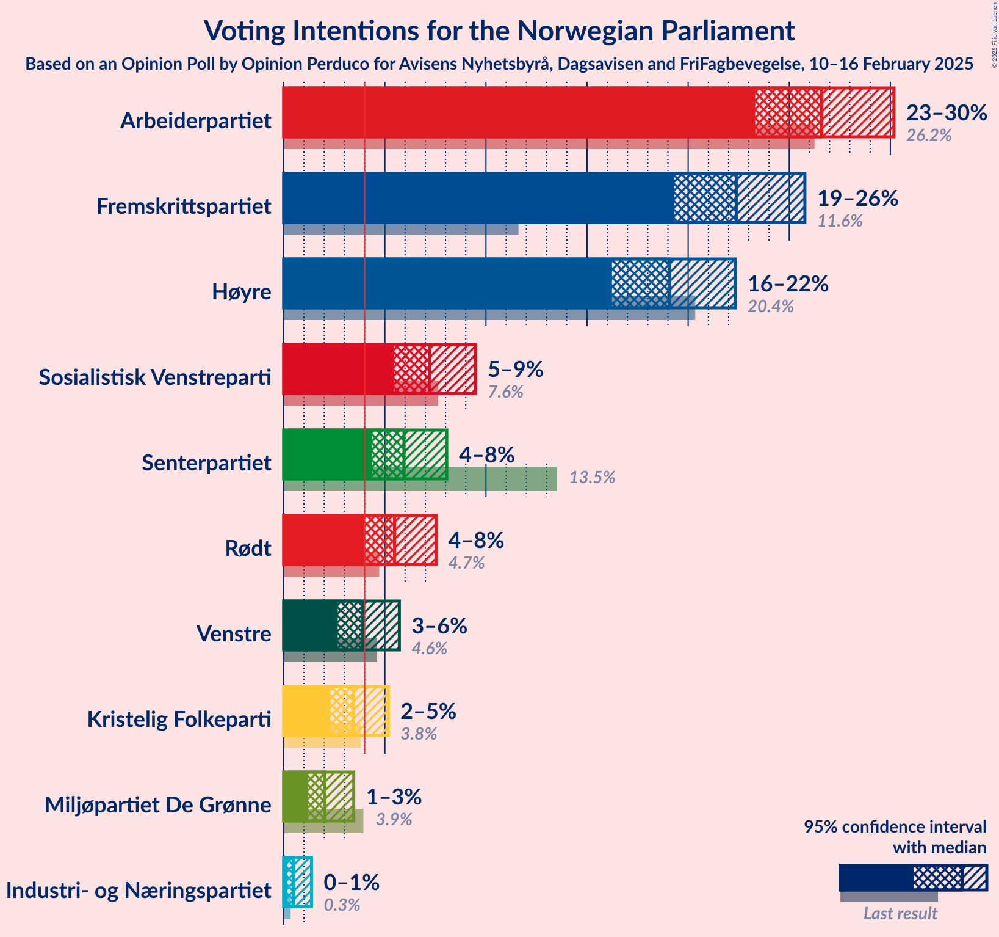
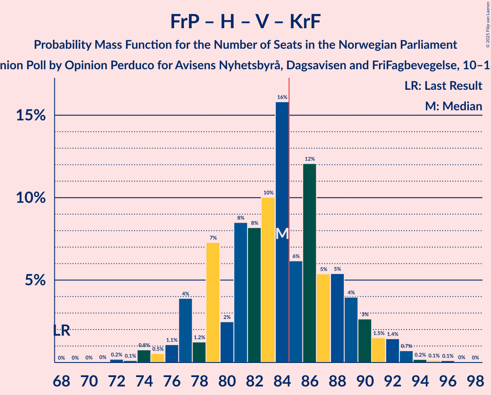
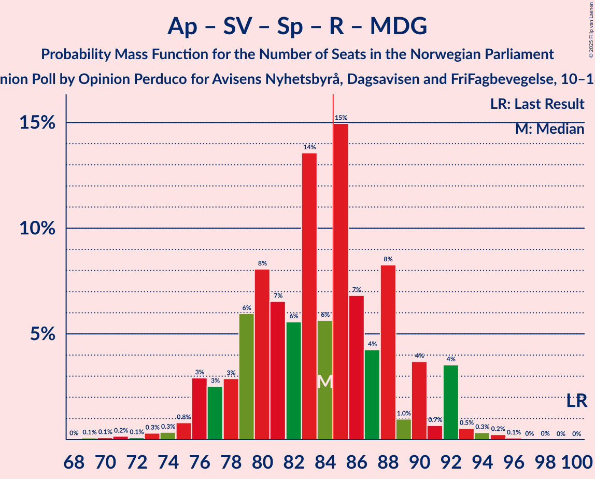
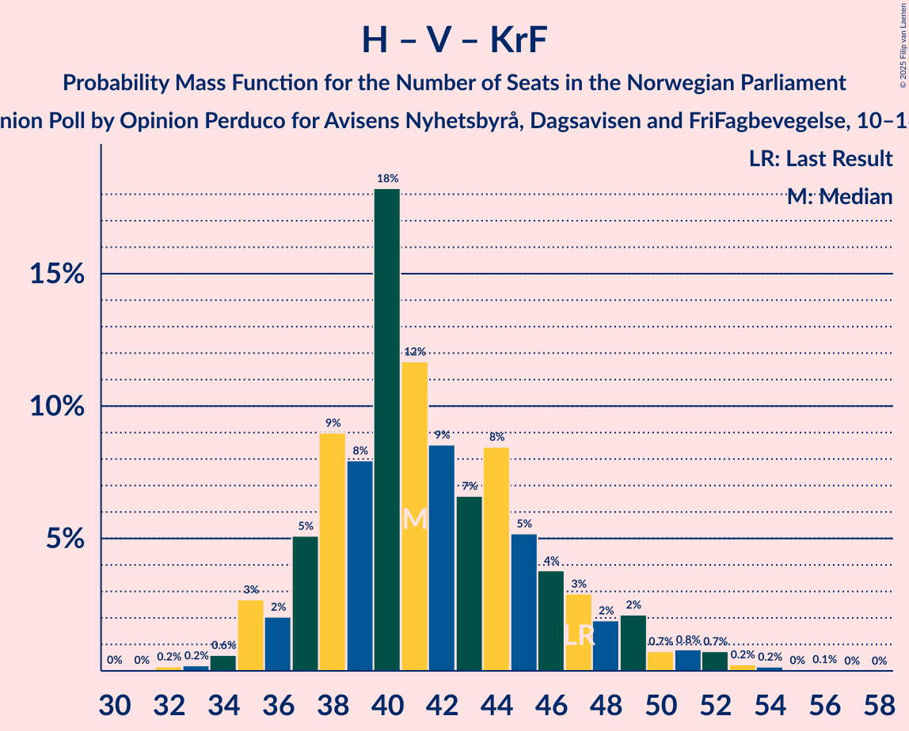
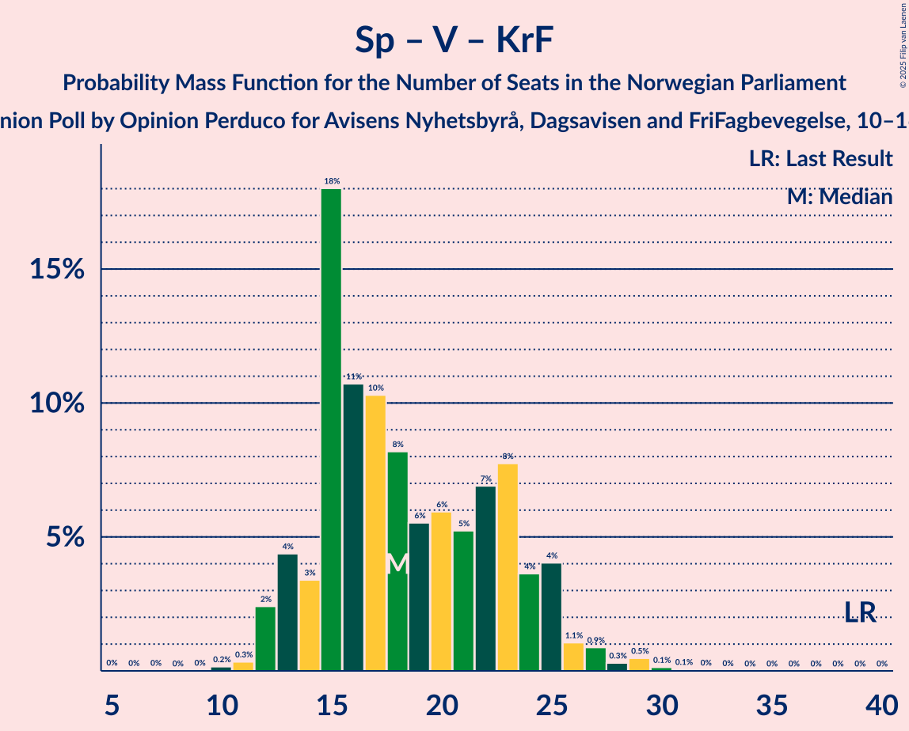

# Opinion Poll by Opinion Perduco for Avisens Nyhetsbyrå, Dagsavisen and FriFagbevegelse, 10–16 February 2025

<a href="#voting-intentions">Voting Intentions</a> | <a href="#seats">Seats</a> | <a href="#coalitions">Coalitions</a> | <a href="#technical-information">Technical Information</a>

## Voting Intentions

### Confidence Intervals

| Party | Last Result | Poll Result | 80% Confidence Interval | 90% Confidence Interval | 95% Confidence Interval | 99% Confidence Interval |
|:-----:|:-----------:|:-----------:|:-----------------------:|:-----------------------:|:-----------------------:|:-----------------------:|
| Arbeiderpartiet | 26.2% | 26.7% | 24.7–28.7% |24.2–29.3% |23.7–29.8% |22.8–30.8% |
| Fremskrittspartiet | 11.6% | 22.4% | 20.6–24.4% |20.1–24.9% |19.6–25.4% |18.8–26.4% |
| Høyre | 20.4% | 19.1% | 17.5–21.0% |17.0–21.6% |16.6–22.0% |15.8–23.0% |
| Sosialistisk Venstreparti | 7.6% | 7.3% | 6.2–8.6% |5.9–8.9% |5.7–9.3% |5.2–10.0% |
| Senterpartiet | 13.5% | 6.0% | 5.0–7.2% |4.8–7.6% |4.6–7.9% |4.1–8.5% |
| Rødt | 4.7% | 5.5% | 4.6–6.7% |4.3–7.0% |4.1–7.3% |3.7–7.9% |
| Venstre | 4.6% | 3.9% | 3.1–4.9% |2.9–5.2% |2.7–5.5% |2.4–6.0% |
| Kristelig Folkeparti | 3.8% | 3.5% | 2.8–4.5% |2.6–4.8% |2.4–5.0% |2.1–5.5% |
| Miljøpartiet De Grønne | 3.9% | 2.1% | 1.6–2.9% |1.4–3.2% |1.3–3.4% |1.1–3.8% |
| Industri- og Næringspartiet | 0.3% | 0.5% | 0.3–1.0% |0.2–1.1% |0.2–1.3% |0.1–1.6% |

*Note:* The poll result column reflects the actual value used in the calculations. Published results may vary slightly, and in addition be rounded to fewer digits.

## Seats

### Confidence Intervals

| Party | Last Result | Median | 80% Confidence Interval | 90% Confidence Interval | 95% Confidence Interval | 99% Confidence Interval |
|:-----:|:-----------:|:------:|:-----------------------:|:-----------------------:|:-----------------------:|:-----------------------:|
| <a href="#arbeiderpartiet">Arbeiderpartiet</a> | 48 | 49 | 46–54 |45–55 |45–56 |42–59 |
| <a href="#fremskrittspartiet">Fremskrittspartiet</a> | 21 | 42 | 38–45 |37–46 |36–47 |35–49 |
| <a href="#høyre">Høyre</a> | 36 | 34 | 31–38 |29–39 |28–40 |28–42 |
| <a href="#sosialistisk-venstreparti">Sosialistisk Venstreparti</a> | 13 | 13 | 10–15 |10–16 |9–17 |9–18 |
| <a href="#senterpartiet">Senterpartiet</a> | 28 | 11 | 8–14 |7–14 |7–15 |1–16 |
| <a href="#rødt">Rødt</a> | 8 | 9 | 8–12 |7–12 |6–13 |1–14 |
| <a href="#venstre">Venstre</a> | 8 | 3 | 2–8 |2–9 |2–10 |2–11 |
| <a href="#kristelig-folkeparti">Kristelig Folkeparti</a> | 3 | 3 | 1–8 |1–8 |1–9 |0–9 |
| <a href="#miljøpartiet-de-grønne">Miljøpartiet De Grønne</a> | 3 | 1 | 1–2 |0–2 |0–3 |0–3 |
| <a href="#industri--og-næringspartiet">Industri- og Næringspartiet</a> | 0 | 0 | 0 |0 |0 |0 |

### Arbeiderpartiet

*For a full overview of the results for this party, see the [Arbeiderpartiet](party-arbeiderpartiet.html) page.*

| Number of Seats | Probability | Accumulated | Special Marks |
|:---------------:|:-----------:|:-----------:|:-------------:|
| 39 | 0% | 100% |  |
| 40 | 0.1% | 99.9% |  |
| 41 | 0.3% | 99.8% |  |
| 42 | 0.2% | 99.5% |  |
| 43 | 0.6% | 99.3% |  |
| 44 | 1.2% | 98.7% |  |
| 45 | 3% | 98% |  |
| 46 | 5% | 94% |  |
| 47 | 12% | 89% |  |
| 48 | 13% | 77% | Last Result |
| 49 | 18% | 64% | Median |
| 50 | 8% | 46% |  |
| 51 | 9% | 37% |  |
| 52 | 12% | 28% |  |
| 53 | 6% | 16% |  |
| 54 | 4% | 10% |  |
| 55 | 3% | 6% |  |
| 56 | 1.0% | 3% |  |
| 57 | 0.8% | 2% |  |
| 58 | 0.5% | 1.0% |  |
| 59 | 0.5% | 0.6% |  |
| 60 | 0.1% | 0.1% |  |
| 61 | 0% | 0.1% |  |
| 62 | 0% | 0% |  |

### Fremskrittspartiet

*For a full overview of the results for this party, see the [Fremskrittspartiet](party-fremskrittspartiet.html) page.*

| Number of Seats | Probability | Accumulated | Special Marks |
|:---------------:|:-----------:|:-----------:|:-------------:|
| 21 | 0% | 100% | Last Result |
| 22 | 0% | 100% |  |
| 23 | 0% | 100% |  |
| 24 | 0% | 100% |  |
| 25 | 0% | 100% |  |
| 26 | 0% | 100% |  |
| 27 | 0% | 100% |  |
| 28 | 0% | 100% |  |
| 29 | 0% | 100% |  |
| 30 | 0% | 100% |  |
| 31 | 0% | 100% |  |
| 32 | 0% | 100% |  |
| 33 | 0.1% | 100% |  |
| 34 | 0.3% | 99.9% |  |
| 35 | 0.6% | 99.6% |  |
| 36 | 2% | 99.0% |  |
| 37 | 2% | 97% |  |
| 38 | 6% | 95% |  |
| 39 | 9% | 89% |  |
| 40 | 14% | 80% |  |
| 41 | 16% | 66% |  |
| 42 | 25% | 50% | Median |
| 43 | 9% | 25% |  |
| 44 | 5% | 16% |  |
| 45 | 5% | 11% |  |
| 46 | 3% | 5% |  |
| 47 | 1.0% | 3% |  |
| 48 | 0.6% | 2% |  |
| 49 | 0.9% | 1.0% |  |
| 50 | 0.1% | 0.1% |  |
| 51 | 0% | 0% |  |

### Høyre

*For a full overview of the results for this party, see the [Høyre](party-høyre.html) page.*

| Number of Seats | Probability | Accumulated | Special Marks |
|:---------------:|:-----------:|:-----------:|:-------------:|
| 25 | 0% | 100% |  |
| 26 | 0.1% | 99.9% |  |
| 27 | 0.3% | 99.8% |  |
| 28 | 2% | 99.5% |  |
| 29 | 2% | 97% |  |
| 30 | 3% | 95% |  |
| 31 | 7% | 91% |  |
| 32 | 12% | 84% |  |
| 33 | 10% | 72% |  |
| 34 | 15% | 62% | Median |
| 35 | 12% | 47% |  |
| 36 | 8% | 34% | Last Result |
| 37 | 14% | 26% |  |
| 38 | 8% | 13% |  |
| 39 | 2% | 5% |  |
| 40 | 2% | 4% |  |
| 41 | 1.3% | 2% |  |
| 42 | 0.3% | 0.6% |  |
| 43 | 0.2% | 0.3% |  |
| 44 | 0% | 0.1% |  |
| 45 | 0% | 0.1% |  |
| 46 | 0% | 0% |  |

### Sosialistisk Venstreparti

*For a full overview of the results for this party, see the [Sosialistisk Venstreparti](party-sosialistiskvenstreparti.html) page.*

| Number of Seats | Probability | Accumulated | Special Marks |
|:---------------:|:-----------:|:-----------:|:-------------:|
| 7 | 0% | 100% |  |
| 8 | 0.4% | 99.9% |  |
| 9 | 2% | 99.5% |  |
| 10 | 9% | 97% |  |
| 11 | 14% | 89% |  |
| 12 | 22% | 75% |  |
| 13 | 19% | 53% | Last Result, Median |
| 14 | 15% | 34% |  |
| 15 | 10% | 19% |  |
| 16 | 6% | 9% |  |
| 17 | 2% | 3% |  |
| 18 | 0.6% | 0.9% |  |
| 19 | 0.2% | 0.3% |  |
| 20 | 0.1% | 0.1% |  |
| 21 | 0% | 0% |  |

### Senterpartiet

*For a full overview of the results for this party, see the [Senterpartiet](party-senterpartiet.html) page.*

| Number of Seats | Probability | Accumulated | Special Marks |
|:---------------:|:-----------:|:-----------:|:-------------:|
| 0 | 0.3% | 100% |  |
| 1 | 0.3% | 99.7% |  |
| 2 | 0% | 99.4% |  |
| 3 | 0% | 99.4% |  |
| 4 | 0% | 99.4% |  |
| 5 | 0% | 99.4% |  |
| 6 | 0.5% | 99.4% |  |
| 7 | 5% | 98.9% |  |
| 8 | 7% | 94% |  |
| 9 | 17% | 86% |  |
| 10 | 14% | 69% |  |
| 11 | 9% | 55% | Median |
| 12 | 23% | 46% |  |
| 13 | 10% | 23% |  |
| 14 | 10% | 13% |  |
| 15 | 2% | 3% |  |
| 16 | 0.5% | 0.6% |  |
| 17 | 0.1% | 0.1% |  |
| 18 | 0% | 0% |  |
| 19 | 0% | 0% |  |
| 20 | 0% | 0% |  |
| 21 | 0% | 0% |  |
| 22 | 0% | 0% |  |
| 23 | 0% | 0% |  |
| 24 | 0% | 0% |  |
| 25 | 0% | 0% |  |
| 26 | 0% | 0% |  |
| 27 | 0% | 0% |  |
| 28 | 0% | 0% | Last Result |

### Rødt

*For a full overview of the results for this party, see the [Rødt](party-rødt.html) page.*

| Number of Seats | Probability | Accumulated | Special Marks |
|:---------------:|:-----------:|:-----------:|:-------------:|
| 1 | 2% | 100% |  |
| 2 | 0.3% | 98% |  |
| 3 | 0.1% | 98% |  |
| 4 | 0% | 98% |  |
| 5 | 0% | 98% |  |
| 6 | 0.7% | 98% |  |
| 7 | 5% | 97% |  |
| 8 | 13% | 92% | Last Result |
| 9 | 31% | 80% | Median |
| 10 | 22% | 49% |  |
| 11 | 15% | 27% |  |
| 12 | 7% | 12% |  |
| 13 | 4% | 5% |  |
| 14 | 0.8% | 1.1% |  |
| 15 | 0.2% | 0.3% |  |
| 16 | 0% | 0.1% |  |
| 17 | 0% | 0% |  |

### Venstre

*For a full overview of the results for this party, see the [Venstre](party-venstre.html) page.*

| Number of Seats | Probability | Accumulated | Special Marks |
|:---------------:|:-----------:|:-----------:|:-------------:|
| 1 | 0.2% | 100% |  |
| 2 | 22% | 99.8% |  |
| 3 | 33% | 77% | Median |
| 4 | 0% | 45% |  |
| 5 | 0% | 45% |  |
| 6 | 3% | 45% |  |
| 7 | 17% | 42% |  |
| 8 | 16% | 25% | Last Result |
| 9 | 6% | 9% |  |
| 10 | 2% | 3% |  |
| 11 | 0.5% | 0.6% |  |
| 12 | 0% | 0.1% |  |
| 13 | 0% | 0% |  |

### Kristelig Folkeparti

*For a full overview of the results for this party, see the [Kristelig Folkeparti](party-kristeligfolkeparti.html) page.*

| Number of Seats | Probability | Accumulated | Special Marks |
|:---------------:|:-----------:|:-----------:|:-------------:|
| 0 | 1.3% | 100% |  |
| 1 | 11% | 98.7% |  |
| 2 | 28% | 88% |  |
| 3 | 32% | 60% | Last Result, Median |
| 4 | 0% | 28% |  |
| 5 | 0% | 28% |  |
| 6 | 2% | 28% |  |
| 7 | 11% | 26% |  |
| 8 | 11% | 14% |  |
| 9 | 3% | 4% |  |
| 10 | 0.4% | 0.5% |  |
| 11 | 0% | 0% |  |

### Miljøpartiet De Grønne

*For a full overview of the results for this party, see the [Miljøpartiet De Grønne](party-miljøpartietdegrønne.html) page.*

| Number of Seats | Probability | Accumulated | Special Marks |
|:---------------:|:-----------:|:-----------:|:-------------:|
| 0 | 9% | 100% |  |
| 1 | 78% | 91% | Median |
| 2 | 10% | 12% |  |
| 3 | 2% | 3% | Last Result |
| 4 | 0% | 0.3% |  |
| 5 | 0% | 0.3% |  |
| 6 | 0% | 0.3% |  |
| 7 | 0.2% | 0.2% |  |
| 8 | 0% | 0% |  |

### Industri- og Næringspartiet

*For a full overview of the results for this party, see the [Industri- og Næringspartiet](party-industri-ognæringspartiet.html) page.*

| Number of Seats | Probability | Accumulated | Special Marks |
|:---------------:|:-----------:|:-----------:|:-------------:|
| 0 | 100% | 100% | Last Result, Median |

## Coalitions

### Confidence Intervals

| Coalition | Last Result | Median | Majority? | 80% Confidence Interval | 90% Confidence Interval | 95% Confidence Interval | 99% Confidence Interval |
|:---------:|:-----------:|:------:|:---------:|:-----------------------:|:-----------------------:|:-----------------------:|:-----------------------:|
| Fremskrittspartiet – Høyre – Senterpartiet – Venstre – Kristelig Folkeparti | 96 | 95 | 99.7% | 90–100 | 89–101 | 88–103 | 86–105 |
| Fremskrittspartiet – Høyre – Venstre – Kristelig Folkeparti – Miljøpartiet De Grønne | 71 | 85 | 55% | 80–90 | 79–92 | 78–93 | 76–95 |
| Fremskrittspartiet – Høyre – Venstre – Kristelig Folkeparti | 68 | 84 | 47% | 79–89 | 78–91 | 77–92 | 75–94 |
| Arbeiderpartiet – Sosialistisk Venstreparti – Senterpartiet – Rødt – Miljøpartiet De Grønne | 100 | 84 | 46% | 78–89 | 78–91 | 76–92 | 74–94 |
| Arbeiderpartiet – Sosialistisk Venstreparti – Senterpartiet – Rødt | 97 | 83 | 38% | 77–88 | 76–90 | 75–90 | 73–93 |
| Fremskrittspartiet – Høyre – Venstre | 65 | 81 | 15% | 76–85 | 74–86 | 73–88 | 71–90 |
| Arbeiderpartiet – Sosialistisk Venstreparti – Senterpartiet – Kristelig Folkeparti – Miljøpartiet De Grønne | 95 | 78 | 5% | 74–83 | 72–85 | 71–86 | 69–87 |
| Fremskrittspartiet – Høyre | 57 | 76 | 0.7% | 71–80 | 70–81 | 69–82 | 67–85 |
| Arbeiderpartiet – Sosialistisk Venstreparti – Senterpartiet – Miljøpartiet De Grønne | 92 | 74 | 0.4% | 70–79 | 69–80 | 68–81 | 65–84 |
| Arbeiderpartiet – Sosialistisk Venstreparti – Rødt – Miljøpartiet De Grønne | 72 | 73 | 0.1% | 68–78 | 67–79 | 66–81 | 64–83 |
| Arbeiderpartiet – Sosialistisk Venstreparti – Senterpartiet | 89 | 73 | 0.1% | 69–78 | 67–79 | 67–80 | 64–83 |
| Arbeiderpartiet – Senterpartiet – Kristelig Folkeparti – Miljøpartiet De Grønne | 82 | 65 | 0% | 61–70 | 60–71 | 59–72 | 56–75 |
| Arbeiderpartiet – Senterpartiet – Kristelig Folkeparti | 79 | 64 | 0% | 60–69 | 59–70 | 58–71 | 55–73 |
| Arbeiderpartiet – Sosialistisk Venstreparti | 61 | 62 | 0% | 58–67 | 58–68 | 57–70 | 54–72 |
| Arbeiderpartiet – Senterpartiet | 76 | 60 | 0% | 57–64 | 56–65 | 55–67 | 52–69 |
| Høyre – Venstre – Kristelig Folkeparti | 47 | 43 | 0% | 38–48 | 37–49 | 35–51 | 34–52 |
| Senterpartiet – Venstre – Kristelig Folkeparti | 39 | 19 | 0% | 15–24 | 14–25 | 13–27 | 11–29 |

### Fremskrittspartiet – Høyre – Senterpartiet – Venstre – Kristelig Folkeparti

| Number of Seats | Probability | Accumulated | Special Marks |
|:---------------:|:-----------:|:-----------:|:-------------:|
| 83 | 0.1% | 100% |  |
| 84 | 0.1% | 99.9% |  |
| 85 | 0.2% | 99.7% | Majority |
| 86 | 0.9% | 99.5% |  |
| 87 | 0.6% | 98.6% |  |
| 88 | 2% | 98% |  |
| 89 | 4% | 96% |  |
| 90 | 5% | 92% |  |
| 91 | 5% | 87% |  |
| 92 | 8% | 82% |  |
| 93 | 7% | 75% | Median |
| 94 | 7% | 68% |  |
| 95 | 12% | 61% |  |
| 96 | 11% | 49% | Last Result |
| 97 | 11% | 38% |  |
| 98 | 7% | 27% |  |
| 99 | 6% | 20% |  |
| 100 | 5% | 14% |  |
| 101 | 5% | 8% |  |
| 102 | 1.3% | 4% |  |
| 103 | 2% | 3% |  |
| 104 | 0.4% | 0.9% |  |
| 105 | 0.4% | 0.6% |  |
| 106 | 0.1% | 0.2% |  |
| 107 | 0% | 0.1% |  |
| 108 | 0% | 0.1% |  |
| 109 | 0% | 0% |  |

### Fremskrittspartiet – Høyre – Venstre – Kristelig Folkeparti – Miljøpartiet De Grønne

| Number of Seats | Probability | Accumulated | Special Marks |
|:---------------:|:-----------:|:-----------:|:-------------:|
| 71 | 0% | 100% | Last Result |
| 72 | 0% | 100% |  |
| 73 | 0% | 100% |  |
| 74 | 0.1% | 100% |  |
| 75 | 0.3% | 99.8% |  |
| 76 | 0.4% | 99.5% |  |
| 77 | 0.6% | 99.2% |  |
| 78 | 2% | 98.5% |  |
| 79 | 4% | 97% |  |
| 80 | 4% | 93% |  |
| 81 | 4% | 89% |  |
| 82 | 6% | 85% |  |
| 83 | 10% | 79% | Median |
| 84 | 14% | 70% |  |
| 85 | 7% | 55% | Majority |
| 86 | 12% | 48% |  |
| 87 | 7% | 36% |  |
| 88 | 7% | 29% |  |
| 89 | 5% | 22% |  |
| 90 | 8% | 18% |  |
| 91 | 3% | 10% |  |
| 92 | 4% | 7% |  |
| 93 | 1.3% | 3% |  |
| 94 | 0.9% | 2% |  |
| 95 | 0.5% | 0.8% |  |
| 96 | 0.2% | 0.3% |  |
| 97 | 0.1% | 0.1% |  |
| 98 | 0% | 0.1% |  |
| 99 | 0% | 0% |  |

### Fremskrittspartiet – Høyre – Venstre – Kristelig Folkeparti

| Number of Seats | Probability | Accumulated | Special Marks |
|:---------------:|:-----------:|:-----------:|:-------------:|
| 68 | 0% | 100% | Last Result |
| 69 | 0% | 100% |  |
| 70 | 0% | 100% |  |
| 71 | 0% | 100% |  |
| 72 | 0% | 100% |  |
| 73 | 0.1% | 99.9% |  |
| 74 | 0.3% | 99.8% |  |
| 75 | 0.4% | 99.5% |  |
| 76 | 1.0% | 99.2% |  |
| 77 | 2% | 98% |  |
| 78 | 4% | 97% |  |
| 79 | 4% | 93% |  |
| 80 | 4% | 89% |  |
| 81 | 6% | 85% |  |
| 82 | 9% | 79% | Median |
| 83 | 15% | 70% |  |
| 84 | 9% | 55% |  |
| 85 | 11% | 47% | Majority |
| 86 | 8% | 36% |  |
| 87 | 7% | 28% |  |
| 88 | 5% | 21% |  |
| 89 | 7% | 16% |  |
| 90 | 3% | 10% |  |
| 91 | 4% | 7% |  |
| 92 | 1.2% | 3% |  |
| 93 | 0.7% | 2% |  |
| 94 | 0.6% | 0.8% |  |
| 95 | 0.2% | 0.3% |  |
| 96 | 0.1% | 0.1% |  |
| 97 | 0% | 0.1% |  |
| 98 | 0% | 0% |  |

### Arbeiderpartiet – Sosialistisk Venstreparti – Senterpartiet – Rødt – Miljøpartiet De Grønne

| Number of Seats | Probability | Accumulated | Special Marks |
|:---------------:|:-----------:|:-----------:|:-------------:|
| 71 | 0% | 100% |  |
| 72 | 0.1% | 99.9% |  |
| 73 | 0.2% | 99.8% |  |
| 74 | 0.4% | 99.7% |  |
| 75 | 0.9% | 99.3% |  |
| 76 | 0.9% | 98% |  |
| 77 | 2% | 97% |  |
| 78 | 6% | 95% |  |
| 79 | 4% | 89% |  |
| 80 | 7% | 85% |  |
| 81 | 5% | 78% |  |
| 82 | 7% | 72% |  |
| 83 | 8% | 65% | Median |
| 84 | 11% | 57% |  |
| 85 | 8% | 46% | Majority |
| 86 | 14% | 38% |  |
| 87 | 7% | 24% |  |
| 88 | 5% | 17% |  |
| 89 | 3% | 11% |  |
| 90 | 3% | 8% |  |
| 91 | 3% | 5% |  |
| 92 | 1.2% | 3% |  |
| 93 | 0.9% | 1.5% |  |
| 94 | 0.3% | 0.6% |  |
| 95 | 0.2% | 0.3% |  |
| 96 | 0.1% | 0.1% |  |
| 97 | 0% | 0% |  |
| 98 | 0% | 0% |  |
| 99 | 0% | 0% |  |
| 100 | 0% | 0% | Last Result |

### Arbeiderpartiet – Sosialistisk Venstreparti – Senterpartiet – Rødt

| Number of Seats | Probability | Accumulated | Special Marks |
|:---------------:|:-----------:|:-----------:|:-------------:|
| 69 | 0% | 100% |  |
| 70 | 0% | 99.9% |  |
| 71 | 0.1% | 99.9% |  |
| 72 | 0.2% | 99.8% |  |
| 73 | 0.4% | 99.6% |  |
| 74 | 0.8% | 99.2% |  |
| 75 | 1.1% | 98% |  |
| 76 | 3% | 97% |  |
| 77 | 5% | 94% |  |
| 78 | 4% | 89% |  |
| 79 | 8% | 85% |  |
| 80 | 6% | 77% |  |
| 81 | 7% | 71% |  |
| 82 | 9% | 64% | Median |
| 83 | 10% | 56% |  |
| 84 | 7% | 45% |  |
| 85 | 14% | 38% | Majority |
| 86 | 8% | 25% |  |
| 87 | 5% | 16% |  |
| 88 | 3% | 11% |  |
| 89 | 2% | 8% |  |
| 90 | 3% | 6% |  |
| 91 | 1.3% | 2% |  |
| 92 | 0.5% | 1.1% |  |
| 93 | 0.3% | 0.6% |  |
| 94 | 0.2% | 0.3% |  |
| 95 | 0.1% | 0.1% |  |
| 96 | 0% | 0% |  |
| 97 | 0% | 0% | Last Result |

### Fremskrittspartiet – Høyre – Venstre

| Number of Seats | Probability | Accumulated | Special Marks |
|:---------------:|:-----------:|:-----------:|:-------------:|
| 65 | 0% | 100% | Last Result |
| 66 | 0% | 100% |  |
| 67 | 0% | 100% |  |
| 68 | 0% | 100% |  |
| 69 | 0.1% | 100% |  |
| 70 | 0.1% | 99.9% |  |
| 71 | 0.3% | 99.8% |  |
| 72 | 0.6% | 99.5% |  |
| 73 | 1.5% | 98.9% |  |
| 74 | 3% | 97% |  |
| 75 | 3% | 95% |  |
| 76 | 5% | 91% |  |
| 77 | 9% | 86% |  |
| 78 | 6% | 77% |  |
| 79 | 10% | 71% | Median |
| 80 | 8% | 61% |  |
| 81 | 14% | 54% |  |
| 82 | 7% | 39% |  |
| 83 | 10% | 33% |  |
| 84 | 7% | 23% |  |
| 85 | 6% | 15% | Majority |
| 86 | 4% | 9% |  |
| 87 | 1.5% | 5% |  |
| 88 | 2% | 4% |  |
| 89 | 0.9% | 2% |  |
| 90 | 0.4% | 0.8% |  |
| 91 | 0.3% | 0.4% |  |
| 92 | 0.1% | 0.2% |  |
| 93 | 0% | 0.1% |  |
| 94 | 0% | 0% |  |

### Arbeiderpartiet – Sosialistisk Venstreparti – Senterpartiet – Kristelig Folkeparti – Miljøpartiet De Grønne

| Number of Seats | Probability | Accumulated | Special Marks |
|:---------------:|:-----------:|:-----------:|:-------------:|
| 65 | 0.1% | 100% |  |
| 66 | 0% | 99.9% |  |
| 67 | 0.1% | 99.9% |  |
| 68 | 0.2% | 99.8% |  |
| 69 | 0.4% | 99.6% |  |
| 70 | 1.1% | 99.2% |  |
| 71 | 1.5% | 98% |  |
| 72 | 2% | 97% |  |
| 73 | 3% | 94% |  |
| 74 | 9% | 91% |  |
| 75 | 7% | 82% |  |
| 76 | 10% | 75% |  |
| 77 | 9% | 65% | Median |
| 78 | 7% | 56% |  |
| 79 | 16% | 48% |  |
| 80 | 6% | 32% |  |
| 81 | 7% | 25% |  |
| 82 | 5% | 18% |  |
| 83 | 4% | 13% |  |
| 84 | 4% | 9% |  |
| 85 | 2% | 5% | Majority |
| 86 | 3% | 4% |  |
| 87 | 0.6% | 1.0% |  |
| 88 | 0.2% | 0.4% |  |
| 89 | 0.2% | 0.3% |  |
| 90 | 0.1% | 0.1% |  |
| 91 | 0% | 0% |  |
| 92 | 0% | 0% |  |
| 93 | 0% | 0% |  |
| 94 | 0% | 0% |  |
| 95 | 0% | 0% | Last Result |

### Fremskrittspartiet – Høyre

| Number of Seats | Probability | Accumulated | Special Marks |
|:---------------:|:-----------:|:-----------:|:-------------:|
| 57 | 0% | 100% | Last Result |
| 58 | 0% | 100% |  |
| 59 | 0% | 100% |  |
| 60 | 0% | 100% |  |
| 61 | 0% | 100% |  |
| 62 | 0% | 100% |  |
| 63 | 0% | 100% |  |
| 64 | 0% | 100% |  |
| 65 | 0.1% | 100% |  |
| 66 | 0.1% | 99.9% |  |
| 67 | 0.6% | 99.8% |  |
| 68 | 0.7% | 99.2% |  |
| 69 | 2% | 98.6% |  |
| 70 | 3% | 97% |  |
| 71 | 5% | 94% |  |
| 72 | 8% | 89% |  |
| 73 | 7% | 81% |  |
| 74 | 9% | 74% |  |
| 75 | 13% | 65% |  |
| 76 | 10% | 52% | Median |
| 77 | 10% | 42% |  |
| 78 | 11% | 32% |  |
| 79 | 8% | 21% |  |
| 80 | 6% | 12% |  |
| 81 | 2% | 7% |  |
| 82 | 2% | 5% |  |
| 83 | 1.0% | 2% |  |
| 84 | 0.6% | 1.3% |  |
| 85 | 0.4% | 0.7% | Majority |
| 86 | 0.1% | 0.2% |  |
| 87 | 0.1% | 0.1% |  |
| 88 | 0% | 0.1% |  |
| 89 | 0% | 0.1% |  |
| 90 | 0% | 0% |  |

### Arbeiderpartiet – Sosialistisk Venstreparti – Senterpartiet – Miljøpartiet De Grønne

| Number of Seats | Probability | Accumulated | Special Marks |
|:---------------:|:-----------:|:-----------:|:-------------:|
| 62 | 0% | 100% |  |
| 63 | 0.1% | 99.9% |  |
| 64 | 0.2% | 99.8% |  |
| 65 | 0.2% | 99.7% |  |
| 66 | 0.4% | 99.5% |  |
| 67 | 0.9% | 99.1% |  |
| 68 | 3% | 98% |  |
| 69 | 4% | 96% |  |
| 70 | 5% | 91% |  |
| 71 | 9% | 86% |  |
| 72 | 7% | 77% |  |
| 73 | 11% | 71% |  |
| 74 | 13% | 60% | Median |
| 75 | 7% | 47% |  |
| 76 | 9% | 40% |  |
| 77 | 14% | 30% |  |
| 78 | 5% | 17% |  |
| 79 | 4% | 12% |  |
| 80 | 4% | 8% |  |
| 81 | 2% | 4% |  |
| 82 | 1.3% | 2% |  |
| 83 | 0.5% | 1.1% |  |
| 84 | 0.2% | 0.6% |  |
| 85 | 0.3% | 0.4% | Majority |
| 86 | 0.1% | 0.1% |  |
| 87 | 0% | 0% |  |
| 88 | 0% | 0% |  |
| 89 | 0% | 0% |  |
| 90 | 0% | 0% |  |
| 91 | 0% | 0% |  |
| 92 | 0% | 0% | Last Result |

### Arbeiderpartiet – Sosialistisk Venstreparti – Rødt – Miljøpartiet De Grønne

| Number of Seats | Probability | Accumulated | Special Marks |
|:---------------:|:-----------:|:-----------:|:-------------:|
| 61 | 0.1% | 100% |  |
| 62 | 0.1% | 99.9% |  |
| 63 | 0.1% | 99.8% |  |
| 64 | 0.5% | 99.7% |  |
| 65 | 0.9% | 99.2% |  |
| 66 | 2% | 98% |  |
| 67 | 2% | 96% |  |
| 68 | 6% | 94% |  |
| 69 | 6% | 89% |  |
| 70 | 7% | 83% |  |
| 71 | 7% | 75% |  |
| 72 | 12% | 68% | Last Result, Median |
| 73 | 12% | 55% |  |
| 74 | 13% | 44% |  |
| 75 | 6% | 31% |  |
| 76 | 5% | 25% |  |
| 77 | 6% | 19% |  |
| 78 | 4% | 13% |  |
| 79 | 4% | 9% |  |
| 80 | 2% | 5% |  |
| 81 | 1.4% | 3% |  |
| 82 | 0.4% | 1.4% |  |
| 83 | 0.7% | 1.0% |  |
| 84 | 0.1% | 0.3% |  |
| 85 | 0.1% | 0.1% | Majority |
| 86 | 0% | 0% |  |

### Arbeiderpartiet – Sosialistisk Venstreparti – Senterpartiet

| Number of Seats | Probability | Accumulated | Special Marks |
|:---------------:|:-----------:|:-----------:|:-------------:|
| 61 | 0% | 100% |  |
| 62 | 0.1% | 99.9% |  |
| 63 | 0.2% | 99.8% |  |
| 64 | 0.2% | 99.6% |  |
| 65 | 0.4% | 99.5% |  |
| 66 | 1.3% | 99.1% |  |
| 67 | 3% | 98% |  |
| 68 | 4% | 95% |  |
| 69 | 5% | 91% |  |
| 70 | 10% | 86% |  |
| 71 | 7% | 76% |  |
| 72 | 10% | 69% |  |
| 73 | 13% | 59% | Median |
| 74 | 7% | 47% |  |
| 75 | 9% | 39% |  |
| 76 | 14% | 31% |  |
| 77 | 5% | 17% |  |
| 78 | 4% | 12% |  |
| 79 | 4% | 8% |  |
| 80 | 2% | 4% |  |
| 81 | 0.8% | 2% |  |
| 82 | 0.6% | 1.2% |  |
| 83 | 0.2% | 0.6% |  |
| 84 | 0.3% | 0.4% |  |
| 85 | 0.1% | 0.1% | Majority |
| 86 | 0% | 0% |  |
| 87 | 0% | 0% |  |
| 88 | 0% | 0% |  |
| 89 | 0% | 0% | Last Result |

### Arbeiderpartiet – Senterpartiet – Kristelig Folkeparti – Miljøpartiet De Grønne

| Number of Seats | Probability | Accumulated | Special Marks |
|:---------------:|:-----------:|:-----------:|:-------------:|
| 52 | 0% | 100% |  |
| 53 | 0.1% | 99.9% |  |
| 54 | 0.1% | 99.9% |  |
| 55 | 0.1% | 99.8% |  |
| 56 | 0.4% | 99.7% |  |
| 57 | 0.6% | 99.3% |  |
| 58 | 0.9% | 98.7% |  |
| 59 | 2% | 98% |  |
| 60 | 3% | 96% |  |
| 61 | 4% | 93% |  |
| 62 | 12% | 89% |  |
| 63 | 10% | 77% |  |
| 64 | 8% | 67% | Median |
| 65 | 12% | 59% |  |
| 66 | 10% | 47% |  |
| 67 | 11% | 36% |  |
| 68 | 6% | 25% |  |
| 69 | 8% | 19% |  |
| 70 | 3% | 12% |  |
| 71 | 4% | 8% |  |
| 72 | 2% | 4% |  |
| 73 | 1.3% | 2% |  |
| 74 | 0.3% | 0.8% |  |
| 75 | 0.2% | 0.5% |  |
| 76 | 0.2% | 0.3% |  |
| 77 | 0.1% | 0.1% |  |
| 78 | 0% | 0% |  |
| 79 | 0% | 0% |  |
| 80 | 0% | 0% |  |
| 81 | 0% | 0% |  |
| 82 | 0% | 0% | Last Result |

### Arbeiderpartiet – Senterpartiet – Kristelig Folkeparti

| Number of Seats | Probability | Accumulated | Special Marks |
|:---------------:|:-----------:|:-----------:|:-------------:|
| 51 | 0% | 100% |  |
| 52 | 0% | 99.9% |  |
| 53 | 0.1% | 99.9% |  |
| 54 | 0.1% | 99.8% |  |
| 55 | 0.5% | 99.7% |  |
| 56 | 0.5% | 99.2% |  |
| 57 | 0.8% | 98.7% |  |
| 58 | 2% | 98% |  |
| 59 | 3% | 96% |  |
| 60 | 5% | 94% |  |
| 61 | 12% | 89% |  |
| 62 | 11% | 77% |  |
| 63 | 8% | 66% | Median |
| 64 | 12% | 58% |  |
| 65 | 11% | 46% |  |
| 66 | 11% | 36% |  |
| 67 | 6% | 25% |  |
| 68 | 8% | 19% |  |
| 69 | 3% | 11% |  |
| 70 | 4% | 8% |  |
| 71 | 1.5% | 4% |  |
| 72 | 2% | 2% |  |
| 73 | 0.3% | 0.7% |  |
| 74 | 0.2% | 0.5% |  |
| 75 | 0.2% | 0.3% |  |
| 76 | 0% | 0.1% |  |
| 77 | 0% | 0% |  |
| 78 | 0% | 0% |  |
| 79 | 0% | 0% | Last Result |

### Arbeiderpartiet – Sosialistisk Venstreparti

| Number of Seats | Probability | Accumulated | Special Marks |
|:---------------:|:-----------:|:-----------:|:-------------:|
| 52 | 0.1% | 100% |  |
| 53 | 0.2% | 99.9% |  |
| 54 | 0.3% | 99.7% |  |
| 55 | 0.5% | 99.4% |  |
| 56 | 0.9% | 98.8% |  |
| 57 | 3% | 98% |  |
| 58 | 7% | 95% |  |
| 59 | 7% | 88% |  |
| 60 | 11% | 81% |  |
| 61 | 14% | 70% | Last Result |
| 62 | 8% | 56% | Median |
| 63 | 10% | 48% |  |
| 64 | 11% | 38% |  |
| 65 | 8% | 27% |  |
| 66 | 6% | 19% |  |
| 67 | 6% | 13% |  |
| 68 | 2% | 7% |  |
| 69 | 2% | 5% |  |
| 70 | 1.0% | 3% |  |
| 71 | 1.4% | 2% |  |
| 72 | 0.4% | 0.5% |  |
| 73 | 0.1% | 0.2% |  |
| 74 | 0% | 0.1% |  |
| 75 | 0% | 0% |  |

### Arbeiderpartiet – Senterpartiet

| Number of Seats | Probability | Accumulated | Special Marks |
|:---------------:|:-----------:|:-----------:|:-------------:|
| 47 | 0.1% | 100% |  |
| 48 | 0% | 99.9% |  |
| 49 | 0.1% | 99.9% |  |
| 50 | 0.1% | 99.8% |  |
| 51 | 0.2% | 99.7% |  |
| 52 | 0.4% | 99.5% |  |
| 53 | 0.6% | 99.1% |  |
| 54 | 1.0% | 98.5% |  |
| 55 | 1.4% | 98% |  |
| 56 | 4% | 96% |  |
| 57 | 6% | 93% |  |
| 58 | 10% | 86% |  |
| 59 | 13% | 76% |  |
| 60 | 14% | 63% | Median |
| 61 | 14% | 49% |  |
| 62 | 8% | 35% |  |
| 63 | 8% | 26% |  |
| 64 | 10% | 18% |  |
| 65 | 4% | 8% |  |
| 66 | 2% | 4% |  |
| 67 | 1.2% | 3% |  |
| 68 | 0.6% | 1.4% |  |
| 69 | 0.3% | 0.7% |  |
| 70 | 0.3% | 0.4% |  |
| 71 | 0% | 0.1% |  |
| 72 | 0.1% | 0.1% |  |
| 73 | 0% | 0% |  |
| 74 | 0% | 0% |  |
| 75 | 0% | 0% |  |
| 76 | 0% | 0% | Last Result |

### Høyre – Venstre – Kristelig Folkeparti

| Number of Seats | Probability | Accumulated | Special Marks |
|:---------------:|:-----------:|:-----------:|:-------------:|
| 32 | 0.1% | 100% |  |
| 33 | 0.2% | 99.9% |  |
| 34 | 0.4% | 99.7% |  |
| 35 | 2% | 99.3% |  |
| 36 | 1.5% | 97% |  |
| 37 | 4% | 96% |  |
| 38 | 5% | 91% |  |
| 39 | 5% | 87% |  |
| 40 | 7% | 81% | Median |
| 41 | 6% | 74% |  |
| 42 | 12% | 68% |  |
| 43 | 12% | 56% |  |
| 44 | 14% | 44% |  |
| 45 | 5% | 30% |  |
| 46 | 6% | 24% |  |
| 47 | 6% | 19% | Last Result |
| 48 | 3% | 13% |  |
| 49 | 5% | 9% |  |
| 50 | 1.0% | 4% |  |
| 51 | 2% | 3% |  |
| 52 | 0.5% | 0.9% |  |
| 53 | 0.3% | 0.5% |  |
| 54 | 0.2% | 0.2% |  |
| 55 | 0% | 0.1% |  |
| 56 | 0% | 0% |  |

### Senterpartiet – Venstre – Kristelig Folkeparti

| Number of Seats | Probability | Accumulated | Special Marks |
|:---------------:|:-----------:|:-----------:|:-------------:|
| 5 | 0.1% | 100% |  |
| 6 | 0.1% | 99.9% |  |
| 7 | 0% | 99.8% |  |
| 8 | 0% | 99.8% |  |
| 9 | 0% | 99.8% |  |
| 10 | 0.1% | 99.8% |  |
| 11 | 0.5% | 99.8% |  |
| 12 | 0.5% | 99.3% |  |
| 13 | 3% | 98.8% |  |
| 14 | 6% | 96% |  |
| 15 | 6% | 90% |  |
| 16 | 6% | 85% |  |
| 17 | 15% | 78% | Median |
| 18 | 5% | 64% |  |
| 19 | 10% | 58% |  |
| 20 | 6% | 48% |  |
| 21 | 10% | 42% |  |
| 22 | 6% | 32% |  |
| 23 | 10% | 26% |  |
| 24 | 8% | 16% |  |
| 25 | 3% | 7% |  |
| 26 | 2% | 4% |  |
| 27 | 1.0% | 3% |  |
| 28 | 0.9% | 2% |  |
| 29 | 0.3% | 0.6% |  |
| 30 | 0.2% | 0.3% |  |
| 31 | 0% | 0% |  |
| 32 | 0% | 0% |  |
| 33 | 0% | 0% |  |
| 34 | 0% | 0% |  |
| 35 | 0% | 0% |  |
| 36 | 0% | 0% |  |
| 37 | 0% | 0% |  |
| 38 | 0% | 0% |  |
| 39 | 0% | 0% | Last Result |

## Technical Information

### Opinion Poll

+ **Polling firm:** Opinion Perduco
+ **Commissioner(s):** Avisens Nyhetsbyrå, Dagsavisen and FriFagbevegelse
+ **Fieldwork period:** 10–16 February 2025

### Calculations

+ **Sample size:** 799
+ **Simulations done:** 2,097,152
+ **Error estimate:** 2.35%

