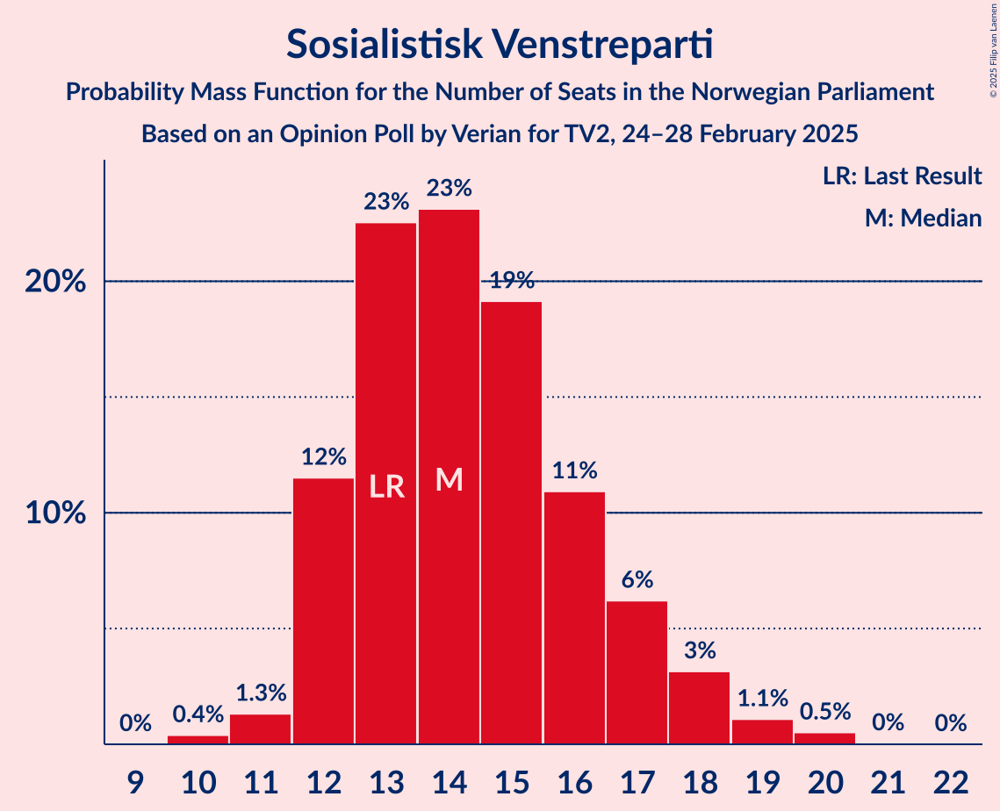
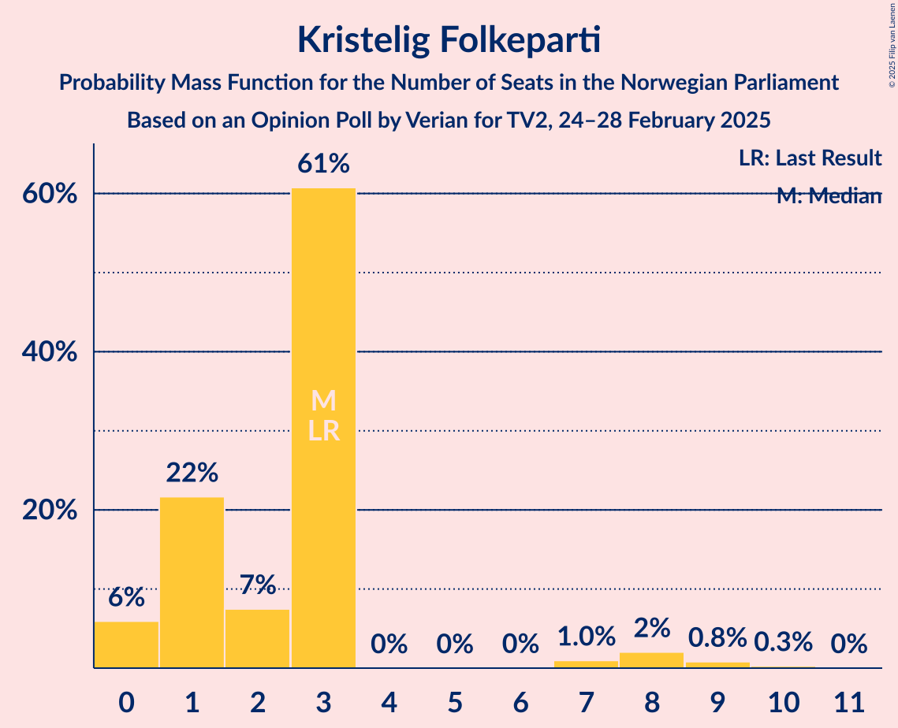
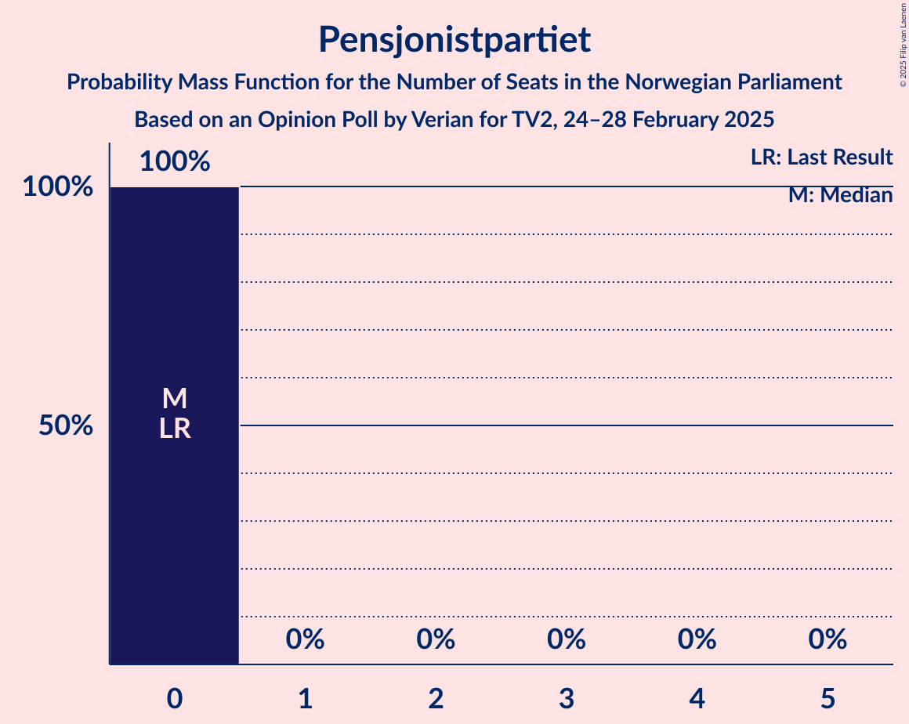
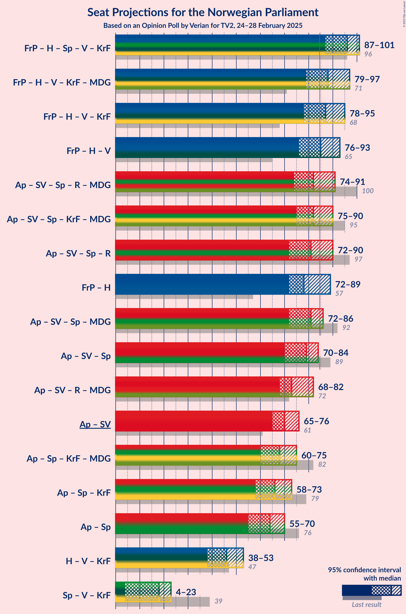
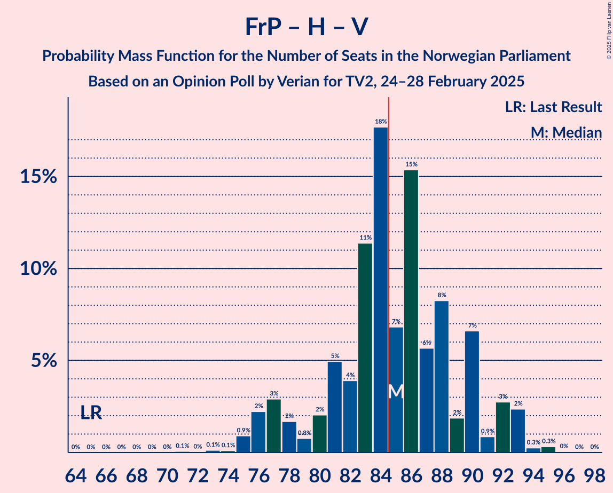
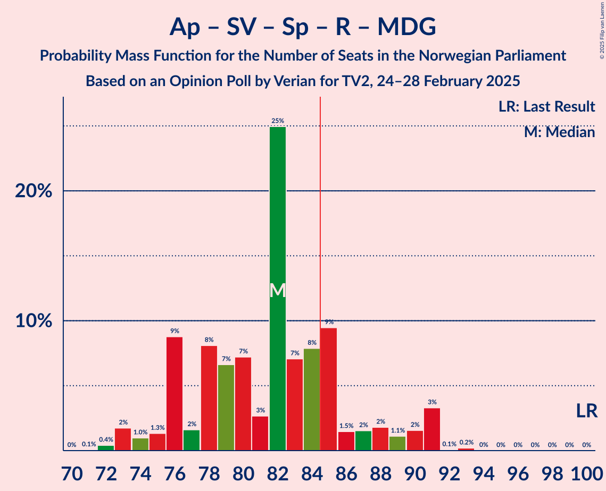
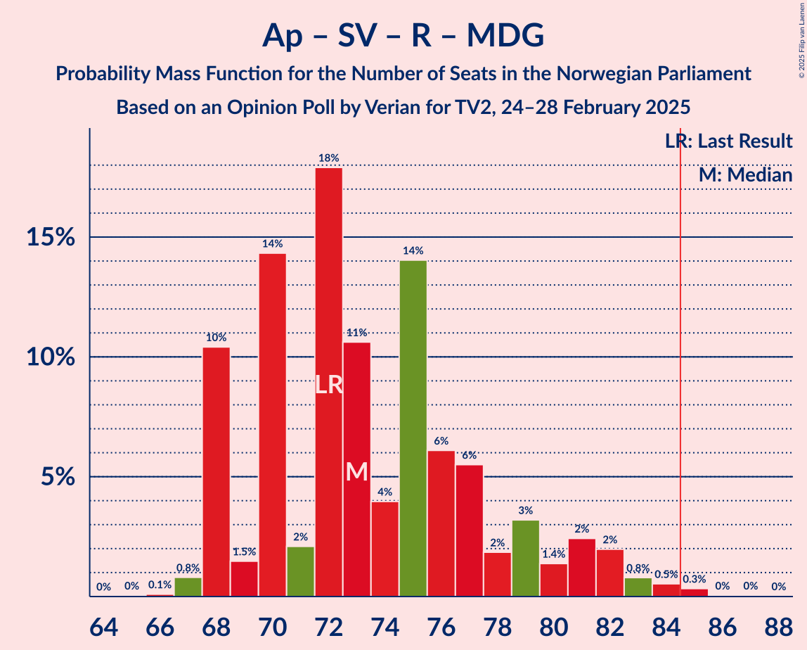

# Opinion Poll by Verian for TV2, 24–28 February 2025

<a href="#voting-intentions">Voting Intentions</a> | <a href="#seats">Seats</a> | <a href="#coalitions">Coalitions</a> | <a href="#technical-information">Technical Information</a>

## Voting Intentions

### Confidence Intervals

| Party | Last Result | Poll Result | 80% Confidence Interval | 90% Confidence Interval | 95% Confidence Interval | 99% Confidence Interval |
|:-----:|:-----------:|:-----------:|:-----------------------:|:-----------------------:|:-----------------------:|:-----------------------:|
| Arbeiderpartiet | 26.2% | 29.5% | 27.7–31.4% |27.2–31.9% |26.7–32.4% |25.9–33.3% |
| Fremskrittspartiet | 11.6% | 21.7% | 20.1–23.5% |19.7–23.9% |19.3–24.4% |18.5–25.2% |
| Høyre | 20.4% | 19.3% | 17.8–21.0% |17.4–21.5% |17.0–21.9% |16.3–22.7% |
| Sosialistisk Venstreparti | 7.6% | 7.9% | 6.9–9.1% |6.6–9.4% |6.4–9.7% |5.9–10.3% |
| Senterpartiet | 13.5% | 4.6% | 3.8–5.5% |3.6–5.8% |3.4–6.1% |3.1–6.6% |
| Venstre | 4.6% | 4.1% | 3.4–5.0% |3.2–5.3% |3.0–5.5% |2.7–6.0% |
| Rødt | 4.7% | 3.5% | 2.9–4.4% |2.7–4.6% |2.5–4.8% |2.2–5.3% |
| Kristelig Folkeparti | 3.8% | 3.2% | 2.6–4.0% |2.4–4.3% |2.3–4.5% |2.0–4.9% |
| Miljøpartiet De Grønne | 3.9% | 2.6% | 2.0–3.4% |1.9–3.6% |1.8–3.8% |1.5–4.2% |
| Konservativt | 0.4% | 1.1% | 0.8–1.7% |0.7–1.8% |0.6–2.0% |0.5–2.3% |
| Industri- og Næringspartiet | 0.3% | 1.1% | 0.8–1.7% |0.7–1.8% |0.6–2.0% |0.5–2.3% |
| Pensjonistpartiet | 0.6% | 0.1% | 0.0–0.4% |0.0–0.5% |0.0–0.6% |0.0–0.7% |

*Note:* The poll result column reflects the actual value used in the calculations. Published results may vary slightly, and in addition be rounded to fewer digits.

## Seats

### Confidence Intervals

| Party | Last Result | Median | 80% Confidence Interval | 90% Confidence Interval | 95% Confidence Interval | 99% Confidence Interval |
|:-----:|:-----------:|:------:|:-----------------------:|:-----------------------:|:-----------------------:|:-----------------------:|
| <a href="#arbeiderpartiet">Arbeiderpartiet</a> | 48 | 56 | 52–61 |51–61 |51–61 |49–63 |
| <a href="#fremskrittspartiet">Fremskrittspartiet</a> | 21 | 41 | 39–45 |38–46 |37–48 |35–49 |
| <a href="#høyre">Høyre</a> | 36 | 36 | 34–39 |32–40 |31–42 |30–44 |
| <a href="#sosialistisk-venstreparti">Sosialistisk Venstreparti</a> | 13 | 14 | 12–17 |12–17 |12–18 |11–20 |
| <a href="#senterpartiet">Senterpartiet</a> | 28 | 9 | 1–11 |0–12 |0–12 |0–12 |
| <a href="#venstre">Venstre</a> | 8 | 8 | 3–9 |2–9 |2–10 |2–12 |
| <a href="#rødt">Rødt</a> | 8 | 1 | 1–8 |1–8 |1–9 |1–10 |
| <a href="#kristelig-folkeparti">Kristelig Folkeparti</a> | 3 | 3 | 1–3 |0–3 |0–8 |0–9 |
| <a href="#miljøpartiet-de-grønne">Miljøpartiet De Grønne</a> | 3 | 1 | 1–2 |1–2 |1–3 |0–7 |
| <a href="#konservativt">Konservativt</a> | 0 | 0 | 0 |0 |0 |0 |
| <a href="#industri--og-næringspartiet">Industri- og Næringspartiet</a> | 0 | 0 | 0 |0 |0 |0 |
| <a href="#pensjonistpartiet">Pensjonistpartiet</a> | 0 | 0 | 0 |0 |0 |0 |

### Arbeiderpartiet

*For a full overview of the results for this party, see the [Arbeiderpartiet](party-arbeiderpartiet.html) page.*

| Number of Seats | Probability | Accumulated | Special Marks |
|:---------------:|:-----------:|:-----------:|:-------------:|
| 48 | 0.3% | 100% | Last Result |
| 49 | 0.6% | 99.7% |  |
| 50 | 1.1% | 99.1% |  |
| 51 | 5% | 98% |  |
| 52 | 8% | 93% |  |
| 53 | 8% | 85% |  |
| 54 | 9% | 77% |  |
| 55 | 16% | 68% |  |
| 56 | 23% | 52% | Median |
| 57 | 9% | 29% |  |
| 58 | 4% | 20% |  |
| 59 | 2% | 16% |  |
| 60 | 2% | 14% |  |
| 61 | 10% | 12% |  |
| 62 | 0.5% | 2% |  |
| 63 | 1.4% | 2% |  |
| 64 | 0.2% | 0.4% |  |
| 65 | 0% | 0.1% |  |
| 66 | 0.1% | 0.1% |  |
| 67 | 0% | 0% |  |

### Fremskrittspartiet

*For a full overview of the results for this party, see the [Fremskrittspartiet](party-fremskrittspartiet.html) page.*

| Number of Seats | Probability | Accumulated | Special Marks |
|:---------------:|:-----------:|:-----------:|:-------------:|
| 21 | 0% | 100% | Last Result |
| 22 | 0% | 100% |  |
| 23 | 0% | 100% |  |
| 24 | 0% | 100% |  |
| 25 | 0% | 100% |  |
| 26 | 0% | 100% |  |
| 27 | 0% | 100% |  |
| 28 | 0% | 100% |  |
| 29 | 0% | 100% |  |
| 30 | 0% | 100% |  |
| 31 | 0% | 100% |  |
| 32 | 0% | 100% |  |
| 33 | 0% | 100% |  |
| 34 | 0.1% | 100% |  |
| 35 | 0.5% | 99.8% |  |
| 36 | 1.0% | 99.3% |  |
| 37 | 1.3% | 98% |  |
| 38 | 5% | 97% |  |
| 39 | 8% | 92% |  |
| 40 | 13% | 85% |  |
| 41 | 24% | 71% | Median |
| 42 | 15% | 47% |  |
| 43 | 3% | 32% |  |
| 44 | 11% | 29% |  |
| 45 | 10% | 18% |  |
| 46 | 3% | 8% |  |
| 47 | 1.2% | 5% |  |
| 48 | 1.0% | 3% |  |
| 49 | 2% | 2% |  |
| 50 | 0% | 0.1% |  |
| 51 | 0% | 0% |  |

### Høyre

*For a full overview of the results for this party, see the [Høyre](party-høyre.html) page.*

| Number of Seats | Probability | Accumulated | Special Marks |
|:---------------:|:-----------:|:-----------:|:-------------:|
| 29 | 0.2% | 100% |  |
| 30 | 0.4% | 99.8% |  |
| 31 | 3% | 99.4% |  |
| 32 | 2% | 97% |  |
| 33 | 1.4% | 95% |  |
| 34 | 34% | 93% |  |
| 35 | 6% | 59% |  |
| 36 | 11% | 53% | Last Result, Median |
| 37 | 9% | 42% |  |
| 38 | 12% | 33% |  |
| 39 | 13% | 22% |  |
| 40 | 4% | 9% |  |
| 41 | 1.4% | 4% |  |
| 42 | 0.8% | 3% |  |
| 43 | 0.3% | 2% |  |
| 44 | 2% | 2% |  |
| 45 | 0.1% | 0.1% |  |
| 46 | 0% | 0.1% |  |
| 47 | 0% | 0% |  |

### Sosialistisk Venstreparti

*For a full overview of the results for this party, see the [Sosialistisk Venstreparti](party-sosialistiskvenstreparti.html) page.*

| Number of Seats | Probability | Accumulated | Special Marks |
|:---------------:|:-----------:|:-----------:|:-------------:|
| 10 | 0.4% | 100% |  |
| 11 | 1.3% | 99.6% |  |
| 12 | 12% | 98% |  |
| 13 | 23% | 87% | Last Result |
| 14 | 23% | 64% | Median |
| 15 | 19% | 41% |  |
| 16 | 11% | 22% |  |
| 17 | 6% | 11% |  |
| 18 | 3% | 5% |  |
| 19 | 1.1% | 2% |  |
| 20 | 0.5% | 0.6% |  |
| 21 | 0% | 0.1% |  |
| 22 | 0% | 0% |  |

### Senterpartiet

*For a full overview of the results for this party, see the [Senterpartiet](party-senterpartiet.html) page.*

| Number of Seats | Probability | Accumulated | Special Marks |
|:---------------:|:-----------:|:-----------:|:-------------:|
| 0 | 7% | 100% |  |
| 1 | 3% | 93% |  |
| 2 | 0% | 89% |  |
| 3 | 0% | 89% |  |
| 4 | 0% | 89% |  |
| 5 | 0% | 89% |  |
| 6 | 0% | 89% |  |
| 7 | 10% | 89% |  |
| 8 | 25% | 79% |  |
| 9 | 12% | 54% | Median |
| 10 | 29% | 43% |  |
| 11 | 8% | 13% |  |
| 12 | 5% | 5% |  |
| 13 | 0.4% | 0.4% |  |
| 14 | 0% | 0% |  |
| 15 | 0% | 0% |  |
| 16 | 0% | 0% |  |
| 17 | 0% | 0% |  |
| 18 | 0% | 0% |  |
| 19 | 0% | 0% |  |
| 20 | 0% | 0% |  |
| 21 | 0% | 0% |  |
| 22 | 0% | 0% |  |
| 23 | 0% | 0% |  |
| 24 | 0% | 0% |  |
| 25 | 0% | 0% |  |
| 26 | 0% | 0% |  |
| 27 | 0% | 0% |  |
| 28 | 0% | 0% | Last Result |

### Venstre

*For a full overview of the results for this party, see the [Venstre](party-venstre.html) page.*

| Number of Seats | Probability | Accumulated | Special Marks |
|:---------------:|:-----------:|:-----------:|:-------------:|
| 2 | 6% | 100% |  |
| 3 | 24% | 94% |  |
| 4 | 0% | 69% |  |
| 5 | 0% | 69% |  |
| 6 | 0% | 69% |  |
| 7 | 2% | 69% |  |
| 8 | 24% | 67% | Last Result, Median |
| 9 | 40% | 44% |  |
| 10 | 3% | 4% |  |
| 11 | 0.3% | 1.0% |  |
| 12 | 0.7% | 0.7% |  |
| 13 | 0% | 0% |  |

### Rødt

*For a full overview of the results for this party, see the [Rødt](party-rødt.html) page.*

| Number of Seats | Probability | Accumulated | Special Marks |
|:---------------:|:-----------:|:-----------:|:-------------:|
| 1 | 84% | 100% | Median |
| 2 | 0.2% | 16% |  |
| 3 | 0% | 16% |  |
| 4 | 0% | 16% |  |
| 5 | 0% | 16% |  |
| 6 | 0% | 16% |  |
| 7 | 3% | 15% |  |
| 8 | 9% | 12% | Last Result |
| 9 | 3% | 3% |  |
| 10 | 0.5% | 0.5% |  |
| 11 | 0% | 0% |  |

### Kristelig Folkeparti

*For a full overview of the results for this party, see the [Kristelig Folkeparti](party-kristeligfolkeparti.html) page.*

| Number of Seats | Probability | Accumulated | Special Marks |
|:---------------:|:-----------:|:-----------:|:-------------:|
| 0 | 6% | 100% |  |
| 1 | 22% | 94% |  |
| 2 | 7% | 72% |  |
| 3 | 61% | 65% | Last Result, Median |
| 4 | 0% | 4% |  |
| 5 | 0% | 4% |  |
| 6 | 0% | 4% |  |
| 7 | 1.0% | 4% |  |
| 8 | 2% | 3% |  |
| 9 | 0.8% | 1.1% |  |
| 10 | 0.3% | 0.3% |  |
| 11 | 0% | 0% |  |

### Miljøpartiet De Grønne

*For a full overview of the results for this party, see the [Miljøpartiet De Grønne](party-miljøpartietdegrønne.html) page.*

| Number of Seats | Probability | Accumulated | Special Marks |
|:---------------:|:-----------:|:-----------:|:-------------:|
| 0 | 0.8% | 100% |  |
| 1 | 73% | 99.2% | Median |
| 2 | 21% | 26% |  |
| 3 | 4% | 5% | Last Result |
| 4 | 0% | 0.6% |  |
| 5 | 0% | 0.6% |  |
| 6 | 0% | 0.6% |  |
| 7 | 0.3% | 0.6% |  |
| 8 | 0.2% | 0.3% |  |
| 9 | 0% | 0% |  |

### Konservativt

*For a full overview of the results for this party, see the [Konservativt](party-konservativt.html) page.*

| Number of Seats | Probability | Accumulated | Special Marks |
|:---------------:|:-----------:|:-----------:|:-------------:|
| 0 | 100% | 100% | Last Result, Median |

### Industri- og Næringspartiet

*For a full overview of the results for this party, see the [Industri- og Næringspartiet](party-industri-ognæringspartiet.html) page.*

| Number of Seats | Probability | Accumulated | Special Marks |
|:---------------:|:-----------:|:-----------:|:-------------:|
| 0 | 99.8% | 100% | Last Result, Median |
| 1 | 0.2% | 0.2% |  |
| 2 | 0% | 0% |  |

### Pensjonistpartiet

*For a full overview of the results for this party, see the [Pensjonistpartiet](party-pensjonistpartiet.html) page.*

| Number of Seats | Probability | Accumulated | Special Marks |
|:---------------:|:-----------:|:-----------:|:-------------:|
| 0 | 100% | 100% | Last Result, Median |

## Coalitions

### Confidence Intervals

| Coalition | Last Result | Median | Majority? | 80% Confidence Interval | 90% Confidence Interval | 95% Confidence Interval | 99% Confidence Interval |
|:---------:|:-----------:|:------:|:---------:|:-----------------------:|:-----------------------:|:-----------------------:|:-----------------------:|
| Fremskrittspartiet – Høyre – Senterpartiet – Venstre – Kristelig Folkeparti | 96 | 96 | 99.5% | 90–101 | 88–101 | 87–101 | 85–102 |
| Fremskrittspartiet – Høyre – Venstre – Kristelig Folkeparti – Miljøpartiet De Grønne | 71 | 88 | 90% | 84–94 | 81–95 | 79–97 | 79–99 |
| Fremskrittspartiet – Høyre – Venstre – Kristelig Folkeparti | 68 | 87 | 79% | 83–93 | 79–93 | 78–95 | 78–96 |
| Fremskrittspartiet – Høyre – Venstre | 65 | 85 | 51% | 80–90 | 77–92 | 76–93 | 75–94 |
| Arbeiderpartiet – Sosialistisk Venstreparti – Senterpartiet – Rødt – Miljøpartiet De Grønne | 100 | 82 | 21% | 76–86 | 76–90 | 74–91 | 73–91 |
| Arbeiderpartiet – Sosialistisk Venstreparti – Senterpartiet – Kristelig Folkeparti – Miljøpartiet De Grønne | 95 | 82 | 21% | 77–85 | 76–87 | 75–90 | 72–92 |
| Arbeiderpartiet – Sosialistisk Venstreparti – Senterpartiet – Rødt | 97 | 81 | 10% | 75–85 | 74–88 | 72–90 | 70–90 |
| Fremskrittspartiet – Høyre | 57 | 78 | 5% | 74–82 | 73–84 | 72–89 | 69–91 |
| Arbeiderpartiet – Sosialistisk Venstreparti – Senterpartiet – Miljøpartiet De Grønne | 92 | 81 | 5% | 75–84 | 73–84 | 72–86 | 69–90 |
| Arbeiderpartiet – Sosialistisk Venstreparti – Senterpartiet | 89 | 79 | 2% | 74–82 | 72–82 | 70–84 | 68–89 |
| Arbeiderpartiet – Sosialistisk Venstreparti – Rødt – Miljøpartiet De Grønne | 72 | 73 | 0.5% | 68–79 | 68–81 | 68–82 | 67–84 |
| Arbeiderpartiet – Sosialistisk Venstreparti | 61 | 70 | 0% | 66–73 | 66–74 | 65–76 | 63–79 |
| Arbeiderpartiet – Senterpartiet – Kristelig Folkeparti – Miljøpartiet De Grønne | 82 | 68 | 0% | 64–72 | 61–73 | 60–75 | 56–77 |
| Arbeiderpartiet – Senterpartiet – Kristelig Folkeparti | 79 | 66 | 0% | 62–70 | 59–71 | 58–73 | 54–76 |
| Arbeiderpartiet – Senterpartiet | 76 | 64 | 0% | 59–68 | 57–69 | 55–70 | 52–75 |
| Høyre – Venstre – Kristelig Folkeparti | 47 | 46 | 0% | 42–51 | 40–51 | 38–53 | 37–56 |
| Senterpartiet – Venstre – Kristelig Folkeparti | 39 | 18 | 0% | 12–22 | 9–23 | 4–23 | 3–24 |

### Fremskrittspartiet – Høyre – Senterpartiet – Venstre – Kristelig Folkeparti

| Number of Seats | Probability | Accumulated | Special Marks |
|:---------------:|:-----------:|:-----------:|:-------------:|
| 82 | 0% | 100% |  |
| 83 | 0% | 99.9% |  |
| 84 | 0.3% | 99.9% |  |
| 85 | 0.5% | 99.5% | Majority |
| 86 | 0.8% | 99.0% |  |
| 87 | 2% | 98% |  |
| 88 | 2% | 96% |  |
| 89 | 1.4% | 94% |  |
| 90 | 3% | 92% |  |
| 91 | 2% | 89% |  |
| 92 | 5% | 87% |  |
| 93 | 6% | 82% |  |
| 94 | 14% | 76% |  |
| 95 | 4% | 62% |  |
| 96 | 11% | 58% | Last Result |
| 97 | 18% | 47% | Median |
| 98 | 2% | 29% |  |
| 99 | 14% | 27% |  |
| 100 | 1.5% | 13% |  |
| 101 | 10% | 11% |  |
| 102 | 0.8% | 1.0% |  |
| 103 | 0.1% | 0.2% |  |
| 104 | 0% | 0.1% |  |
| 105 | 0% | 0% |  |

### Fremskrittspartiet – Høyre – Venstre – Kristelig Folkeparti – Miljøpartiet De Grønne

| Number of Seats | Probability | Accumulated | Special Marks |
|:---------------:|:-----------:|:-----------:|:-------------:|
| 71 | 0% | 100% | Last Result |
| 72 | 0% | 100% |  |
| 73 | 0% | 100% |  |
| 74 | 0% | 100% |  |
| 75 | 0% | 100% |  |
| 76 | 0% | 100% |  |
| 77 | 0% | 100% |  |
| 78 | 0.1% | 100% |  |
| 79 | 3% | 99.9% |  |
| 80 | 1.0% | 97% |  |
| 81 | 0.6% | 96% |  |
| 82 | 1.3% | 95% |  |
| 83 | 2% | 94% |  |
| 84 | 2% | 92% |  |
| 85 | 4% | 90% | Majority |
| 86 | 12% | 86% |  |
| 87 | 2% | 73% |  |
| 88 | 31% | 72% |  |
| 89 | 2% | 41% | Median |
| 90 | 9% | 39% |  |
| 91 | 7% | 30% |  |
| 92 | 8% | 23% |  |
| 93 | 1.1% | 15% |  |
| 94 | 7% | 14% |  |
| 95 | 3% | 7% |  |
| 96 | 0.9% | 4% |  |
| 97 | 1.1% | 3% |  |
| 98 | 1.3% | 2% |  |
| 99 | 0.3% | 0.5% |  |
| 100 | 0.2% | 0.2% |  |
| 101 | 0% | 0% |  |

### Fremskrittspartiet – Høyre – Venstre – Kristelig Folkeparti

| Number of Seats | Probability | Accumulated | Special Marks |
|:---------------:|:-----------:|:-----------:|:-------------:|
| 68 | 0% | 100% | Last Result |
| 69 | 0% | 100% |  |
| 70 | 0% | 100% |  |
| 71 | 0% | 100% |  |
| 72 | 0% | 100% |  |
| 73 | 0% | 100% |  |
| 74 | 0% | 100% |  |
| 75 | 0% | 100% |  |
| 76 | 0.2% | 100% |  |
| 77 | 0.1% | 99.8% |  |
| 78 | 3% | 99.7% |  |
| 79 | 2% | 96% |  |
| 80 | 1.1% | 95% |  |
| 81 | 2% | 94% |  |
| 82 | 2% | 92% |  |
| 83 | 1.5% | 90% |  |
| 84 | 10% | 89% |  |
| 85 | 8% | 79% | Majority |
| 86 | 7% | 72% |  |
| 87 | 25% | 64% |  |
| 88 | 3% | 40% | Median |
| 89 | 7% | 37% |  |
| 90 | 7% | 30% |  |
| 91 | 8% | 23% |  |
| 92 | 2% | 15% |  |
| 93 | 9% | 13% |  |
| 94 | 1.3% | 5% |  |
| 95 | 1.0% | 3% |  |
| 96 | 2% | 2% |  |
| 97 | 0.4% | 0.5% |  |
| 98 | 0.1% | 0.1% |  |
| 99 | 0% | 0% |  |

### Fremskrittspartiet – Høyre – Venstre

| Number of Seats | Probability | Accumulated | Special Marks |
|:---------------:|:-----------:|:-----------:|:-------------:|
| 65 | 0% | 100% | Last Result |
| 66 | 0% | 100% |  |
| 67 | 0% | 100% |  |
| 68 | 0% | 100% |  |
| 69 | 0% | 100% |  |
| 70 | 0% | 100% |  |
| 71 | 0.1% | 100% |  |
| 72 | 0% | 99.9% |  |
| 73 | 0.1% | 99.9% |  |
| 74 | 0.1% | 99.8% |  |
| 75 | 0.9% | 99.7% |  |
| 76 | 2% | 98.8% |  |
| 77 | 3% | 97% |  |
| 78 | 2% | 94% |  |
| 79 | 0.8% | 92% |  |
| 80 | 2% | 91% |  |
| 81 | 5% | 89% |  |
| 82 | 4% | 84% |  |
| 83 | 11% | 80% |  |
| 84 | 18% | 69% |  |
| 85 | 7% | 51% | Median, Majority |
| 86 | 15% | 44% |  |
| 87 | 6% | 29% |  |
| 88 | 8% | 23% |  |
| 89 | 2% | 15% |  |
| 90 | 7% | 13% |  |
| 91 | 0.9% | 7% |  |
| 92 | 3% | 6% |  |
| 93 | 2% | 3% |  |
| 94 | 0.3% | 0.6% |  |
| 95 | 0.3% | 0.4% |  |
| 96 | 0% | 0.1% |  |
| 97 | 0% | 0% |  |

### Arbeiderpartiet – Sosialistisk Venstreparti – Senterpartiet – Rødt – Miljøpartiet De Grønne

| Number of Seats | Probability | Accumulated | Special Marks |
|:---------------:|:-----------:|:-----------:|:-------------:|
| 71 | 0.1% | 100% |  |
| 72 | 0.4% | 99.9% |  |
| 73 | 2% | 99.5% |  |
| 74 | 1.0% | 98% |  |
| 75 | 1.3% | 97% |  |
| 76 | 9% | 95% |  |
| 77 | 2% | 87% |  |
| 78 | 8% | 85% |  |
| 79 | 7% | 77% |  |
| 80 | 7% | 70% |  |
| 81 | 3% | 63% | Median |
| 82 | 25% | 60% |  |
| 83 | 7% | 36% |  |
| 84 | 8% | 28% |  |
| 85 | 9% | 21% | Majority |
| 86 | 1.5% | 11% |  |
| 87 | 2% | 10% |  |
| 88 | 2% | 8% |  |
| 89 | 1.1% | 6% |  |
| 90 | 2% | 5% |  |
| 91 | 3% | 4% |  |
| 92 | 0.1% | 0.3% |  |
| 93 | 0.2% | 0.2% |  |
| 94 | 0% | 0% |  |
| 95 | 0% | 0% |  |
| 96 | 0% | 0% |  |
| 97 | 0% | 0% |  |
| 98 | 0% | 0% |  |
| 99 | 0% | 0% |  |
| 100 | 0% | 0% | Last Result |

### Arbeiderpartiet – Sosialistisk Venstreparti – Senterpartiet – Kristelig Folkeparti – Miljøpartiet De Grønne

| Number of Seats | Probability | Accumulated | Special Marks |
|:---------------:|:-----------:|:-----------:|:-------------:|
| 70 | 0.2% | 100% |  |
| 71 | 0.2% | 99.8% |  |
| 72 | 0.1% | 99.6% |  |
| 73 | 0.3% | 99.5% |  |
| 74 | 0.4% | 99.1% |  |
| 75 | 4% | 98.8% |  |
| 76 | 3% | 95% |  |
| 77 | 3% | 92% |  |
| 78 | 7% | 90% |  |
| 79 | 3% | 83% |  |
| 80 | 12% | 80% |  |
| 81 | 6% | 68% |  |
| 82 | 16% | 62% |  |
| 83 | 6% | 46% | Median |
| 84 | 19% | 41% |  |
| 85 | 12% | 21% | Majority |
| 86 | 4% | 9% |  |
| 87 | 0.8% | 5% |  |
| 88 | 2% | 5% |  |
| 89 | 0.4% | 3% |  |
| 90 | 0.3% | 3% |  |
| 91 | 2% | 2% |  |
| 92 | 0.4% | 0.9% |  |
| 93 | 0.3% | 0.4% |  |
| 94 | 0.1% | 0.2% |  |
| 95 | 0.1% | 0.1% | Last Result |
| 96 | 0% | 0% |  |

### Arbeiderpartiet – Sosialistisk Venstreparti – Senterpartiet – Rødt

| Number of Seats | Probability | Accumulated | Special Marks |
|:---------------:|:-----------:|:-----------:|:-------------:|
| 69 | 0.2% | 100% |  |
| 70 | 0.3% | 99.8% |  |
| 71 | 1.3% | 99.5% |  |
| 72 | 1.1% | 98% |  |
| 73 | 0.9% | 97% |  |
| 74 | 3% | 96% |  |
| 75 | 7% | 93% |  |
| 76 | 1.1% | 86% |  |
| 77 | 8% | 85% |  |
| 78 | 7% | 77% |  |
| 79 | 9% | 70% |  |
| 80 | 2% | 61% | Median |
| 81 | 31% | 59% |  |
| 82 | 2% | 28% |  |
| 83 | 12% | 27% |  |
| 84 | 4% | 14% |  |
| 85 | 2% | 10% | Majority |
| 86 | 2% | 8% |  |
| 87 | 1.3% | 6% |  |
| 88 | 0.6% | 5% |  |
| 89 | 1.0% | 4% |  |
| 90 | 3% | 3% |  |
| 91 | 0.1% | 0.1% |  |
| 92 | 0% | 0% |  |
| 93 | 0% | 0% |  |
| 94 | 0% | 0% |  |
| 95 | 0% | 0% |  |
| 96 | 0% | 0% |  |
| 97 | 0% | 0% | Last Result |

### Fremskrittspartiet – Høyre

| Number of Seats | Probability | Accumulated | Special Marks |
|:---------------:|:-----------:|:-----------:|:-------------:|
| 57 | 0% | 100% | Last Result |
| 58 | 0% | 100% |  |
| 59 | 0% | 100% |  |
| 60 | 0% | 100% |  |
| 61 | 0% | 100% |  |
| 62 | 0% | 100% |  |
| 63 | 0% | 100% |  |
| 64 | 0% | 100% |  |
| 65 | 0% | 100% |  |
| 66 | 0% | 100% |  |
| 67 | 0% | 100% |  |
| 68 | 0.4% | 99.9% |  |
| 69 | 0.1% | 99.5% |  |
| 70 | 0.7% | 99.4% |  |
| 71 | 0.4% | 98.7% |  |
| 72 | 2% | 98% |  |
| 73 | 2% | 96% |  |
| 74 | 4% | 94% |  |
| 75 | 20% | 90% |  |
| 76 | 6% | 69% |  |
| 77 | 3% | 63% | Median |
| 78 | 23% | 60% |  |
| 79 | 11% | 38% |  |
| 80 | 6% | 27% |  |
| 81 | 10% | 21% |  |
| 82 | 2% | 10% |  |
| 83 | 2% | 9% |  |
| 84 | 2% | 7% |  |
| 85 | 0.8% | 5% | Majority |
| 86 | 0.3% | 4% |  |
| 87 | 0.8% | 4% |  |
| 88 | 0.1% | 3% |  |
| 89 | 2% | 3% |  |
| 90 | 0.1% | 0.7% |  |
| 91 | 0.6% | 0.6% |  |
| 92 | 0% | 0% |  |

### Arbeiderpartiet – Sosialistisk Venstreparti – Senterpartiet – Miljøpartiet De Grønne

| Number of Seats | Probability | Accumulated | Special Marks |
|:---------------:|:-----------:|:-----------:|:-------------:|
| 68 | 0.1% | 100% |  |
| 69 | 0.4% | 99.9% |  |
| 70 | 0.1% | 99.5% |  |
| 71 | 0.7% | 99.4% |  |
| 72 | 3% | 98.6% |  |
| 73 | 1.1% | 96% |  |
| 74 | 1.4% | 95% |  |
| 75 | 11% | 93% |  |
| 76 | 2% | 82% |  |
| 77 | 11% | 80% |  |
| 78 | 7% | 69% |  |
| 79 | 8% | 62% |  |
| 80 | 3% | 54% | Median |
| 81 | 24% | 52% |  |
| 82 | 8% | 27% |  |
| 83 | 9% | 20% |  |
| 84 | 6% | 10% |  |
| 85 | 1.2% | 5% | Majority |
| 86 | 1.0% | 3% |  |
| 87 | 1.1% | 2% |  |
| 88 | 0.2% | 1.3% |  |
| 89 | 0.1% | 1.1% |  |
| 90 | 1.0% | 1.0% |  |
| 91 | 0% | 0% |  |
| 92 | 0% | 0% | Last Result |

### Arbeiderpartiet – Sosialistisk Venstreparti – Senterpartiet

| Number of Seats | Probability | Accumulated | Special Marks |
|:---------------:|:-----------:|:-----------:|:-------------:|
| 66 | 0% | 100% |  |
| 67 | 0.1% | 99.9% |  |
| 68 | 0.6% | 99.9% |  |
| 69 | 0.4% | 99.3% |  |
| 70 | 2% | 98.9% |  |
| 71 | 2% | 97% |  |
| 72 | 1.1% | 95% |  |
| 73 | 3% | 94% |  |
| 74 | 9% | 91% |  |
| 75 | 2% | 81% |  |
| 76 | 12% | 80% |  |
| 77 | 7% | 68% |  |
| 78 | 10% | 61% |  |
| 79 | 2% | 51% | Median |
| 80 | 29% | 49% |  |
| 81 | 2% | 20% |  |
| 82 | 14% | 18% |  |
| 83 | 0.7% | 5% |  |
| 84 | 2% | 4% |  |
| 85 | 1.1% | 2% | Majority |
| 86 | 0.2% | 1.3% |  |
| 87 | 0.1% | 1.1% |  |
| 88 | 0.1% | 1.0% |  |
| 89 | 0.9% | 1.0% | Last Result |
| 90 | 0% | 0% |  |

### Arbeiderpartiet – Sosialistisk Venstreparti – Rødt – Miljøpartiet De Grønne

| Number of Seats | Probability | Accumulated | Special Marks |
|:---------------:|:-----------:|:-----------:|:-------------:|
| 65 | 0% | 100% |  |
| 66 | 0.1% | 99.9% |  |
| 67 | 0.8% | 99.8% |  |
| 68 | 10% | 99.0% |  |
| 69 | 1.5% | 89% |  |
| 70 | 14% | 87% |  |
| 71 | 2% | 73% |  |
| 72 | 18% | 71% | Last Result, Median |
| 73 | 11% | 53% |  |
| 74 | 4% | 42% |  |
| 75 | 14% | 38% |  |
| 76 | 6% | 24% |  |
| 77 | 6% | 18% |  |
| 78 | 2% | 13% |  |
| 79 | 3% | 11% |  |
| 80 | 1.4% | 8% |  |
| 81 | 2% | 6% |  |
| 82 | 2% | 4% |  |
| 83 | 0.8% | 2% |  |
| 84 | 0.5% | 1.0% |  |
| 85 | 0.3% | 0.5% | Majority |
| 86 | 0% | 0.1% |  |
| 87 | 0% | 0.1% |  |
| 88 | 0% | 0% |  |

### Arbeiderpartiet – Sosialistisk Venstreparti

| Number of Seats | Probability | Accumulated | Special Marks |
|:---------------:|:-----------:|:-----------:|:-------------:|
| 61 | 0.1% | 100% | Last Result |
| 62 | 0% | 99.9% |  |
| 63 | 0.7% | 99.8% |  |
| 64 | 0.8% | 99.2% |  |
| 65 | 1.0% | 98% |  |
| 66 | 10% | 97% |  |
| 67 | 3% | 87% |  |
| 68 | 19% | 83% |  |
| 69 | 5% | 64% |  |
| 70 | 25% | 59% | Median |
| 71 | 4% | 34% |  |
| 72 | 5% | 30% |  |
| 73 | 18% | 25% |  |
| 74 | 2% | 6% |  |
| 75 | 0.8% | 5% |  |
| 76 | 2% | 4% |  |
| 77 | 1.4% | 2% |  |
| 78 | 0.3% | 0.9% |  |
| 79 | 0.2% | 0.5% |  |
| 80 | 0.1% | 0.3% |  |
| 81 | 0.1% | 0.2% |  |
| 82 | 0% | 0.1% |  |
| 83 | 0% | 0.1% |  |
| 84 | 0% | 0% |  |

### Arbeiderpartiet – Senterpartiet – Kristelig Folkeparti – Miljøpartiet De Grønne

| Number of Seats | Probability | Accumulated | Special Marks |
|:---------------:|:-----------:|:-----------:|:-------------:|
| 52 | 0.1% | 100% |  |
| 53 | 0.1% | 99.9% |  |
| 54 | 0% | 99.8% |  |
| 55 | 0.1% | 99.8% |  |
| 56 | 0.3% | 99.6% |  |
| 57 | 0.9% | 99.3% |  |
| 58 | 0.5% | 98% |  |
| 59 | 0.4% | 98% |  |
| 60 | 1.1% | 98% |  |
| 61 | 3% | 96% |  |
| 62 | 2% | 93% |  |
| 63 | 0.8% | 91% |  |
| 64 | 4% | 90% |  |
| 65 | 9% | 86% |  |
| 66 | 17% | 78% |  |
| 67 | 10% | 61% |  |
| 68 | 2% | 51% |  |
| 69 | 7% | 49% | Median |
| 70 | 27% | 42% |  |
| 71 | 3% | 16% |  |
| 72 | 6% | 12% |  |
| 73 | 3% | 6% |  |
| 74 | 0.5% | 3% |  |
| 75 | 1.1% | 3% |  |
| 76 | 0.4% | 2% |  |
| 77 | 1.1% | 1.3% |  |
| 78 | 0% | 0.2% |  |
| 79 | 0% | 0.1% |  |
| 80 | 0.1% | 0.1% |  |
| 81 | 0% | 0% |  |
| 82 | 0% | 0% | Last Result |

### Arbeiderpartiet – Senterpartiet – Kristelig Folkeparti

| Number of Seats | Probability | Accumulated | Special Marks |
|:---------------:|:-----------:|:-----------:|:-------------:|
| 51 | 0.1% | 100% |  |
| 52 | 0.1% | 99.9% |  |
| 53 | 0% | 99.8% |  |
| 54 | 0.3% | 99.8% |  |
| 55 | 0.8% | 99.4% |  |
| 56 | 0.4% | 98.7% |  |
| 57 | 0.6% | 98% |  |
| 58 | 0.3% | 98% |  |
| 59 | 4% | 97% |  |
| 60 | 0.6% | 93% |  |
| 61 | 2% | 93% |  |
| 62 | 2% | 91% |  |
| 63 | 4% | 89% |  |
| 64 | 8% | 85% |  |
| 65 | 17% | 78% |  |
| 66 | 11% | 60% |  |
| 67 | 5% | 49% |  |
| 68 | 7% | 44% | Median |
| 69 | 23% | 37% |  |
| 70 | 7% | 14% |  |
| 71 | 4% | 7% |  |
| 72 | 0.5% | 3% |  |
| 73 | 0.9% | 3% |  |
| 74 | 0.5% | 2% |  |
| 75 | 0.3% | 1.3% |  |
| 76 | 0.9% | 1.0% |  |
| 77 | 0% | 0.1% |  |
| 78 | 0.1% | 0.1% |  |
| 79 | 0% | 0% | Last Result |

### Arbeiderpartiet – Senterpartiet

| Number of Seats | Probability | Accumulated | Special Marks |
|:---------------:|:-----------:|:-----------:|:-------------:|
| 49 | 0.1% | 100% |  |
| 50 | 0% | 99.9% |  |
| 51 | 0.1% | 99.9% |  |
| 52 | 0.4% | 99.8% |  |
| 53 | 0.3% | 99.4% |  |
| 54 | 1.1% | 99.1% |  |
| 55 | 0.5% | 98% |  |
| 56 | 2% | 97% |  |
| 57 | 0.5% | 95% |  |
| 58 | 4% | 95% |  |
| 59 | 1.3% | 91% |  |
| 60 | 3% | 89% |  |
| 61 | 8% | 87% |  |
| 62 | 15% | 79% |  |
| 63 | 11% | 63% |  |
| 64 | 3% | 53% |  |
| 65 | 9% | 49% | Median |
| 66 | 16% | 41% |  |
| 67 | 11% | 25% |  |
| 68 | 9% | 14% |  |
| 69 | 1.3% | 5% |  |
| 70 | 3% | 4% |  |
| 71 | 0.1% | 1.3% |  |
| 72 | 0.1% | 1.2% |  |
| 73 | 0.2% | 1.1% |  |
| 74 | 0% | 0.9% |  |
| 75 | 0.9% | 0.9% |  |
| 76 | 0% | 0% | Last Result |

### Høyre – Venstre – Kristelig Folkeparti

| Number of Seats | Probability | Accumulated | Special Marks |
|:---------------:|:-----------:|:-----------:|:-------------:|
| 35 | 0.1% | 100% |  |
| 36 | 0.2% | 99.9% |  |
| 37 | 2% | 99.7% |  |
| 38 | 1.2% | 98% |  |
| 39 | 1.0% | 97% |  |
| 40 | 4% | 96% |  |
| 41 | 1.2% | 91% |  |
| 42 | 4% | 90% |  |
| 43 | 15% | 86% |  |
| 44 | 7% | 71% |  |
| 45 | 11% | 64% |  |
| 46 | 25% | 53% |  |
| 47 | 2% | 28% | Last Result, Median |
| 48 | 7% | 26% |  |
| 49 | 7% | 19% |  |
| 50 | 0.8% | 12% |  |
| 51 | 7% | 11% |  |
| 52 | 0.9% | 4% |  |
| 53 | 1.0% | 3% |  |
| 54 | 0.3% | 2% |  |
| 55 | 0% | 1.3% |  |
| 56 | 1.1% | 1.2% |  |
| 57 | 0.1% | 0.1% |  |
| 58 | 0% | 0% |  |

### Senterpartiet – Venstre – Kristelig Folkeparti

| Number of Seats | Probability | Accumulated | Special Marks |
|:---------------:|:-----------:|:-----------:|:-------------:|
| 3 | 1.0% | 100% |  |
| 4 | 2% | 99.0% |  |
| 5 | 0.4% | 97% |  |
| 6 | 1.3% | 97% |  |
| 7 | 0.2% | 95% |  |
| 8 | 0% | 95% |  |
| 9 | 0.3% | 95% |  |
| 10 | 0.7% | 95% |  |
| 11 | 2% | 94% |  |
| 12 | 3% | 92% |  |
| 13 | 4% | 89% |  |
| 14 | 5% | 85% |  |
| 15 | 2% | 80% |  |
| 16 | 20% | 78% |  |
| 17 | 1.0% | 58% |  |
| 18 | 7% | 57% |  |
| 19 | 4% | 50% |  |
| 20 | 15% | 46% | Median |
| 21 | 9% | 31% |  |
| 22 | 15% | 21% |  |
| 23 | 5% | 6% |  |
| 24 | 1.3% | 2% |  |
| 25 | 0.3% | 0.4% |  |
| 26 | 0.1% | 0.1% |  |
| 27 | 0% | 0% |  |
| 28 | 0% | 0% |  |
| 29 | 0% | 0% |  |
| 30 | 0% | 0% |  |
| 31 | 0% | 0% |  |
| 32 | 0% | 0% |  |
| 33 | 0% | 0% |  |
| 34 | 0% | 0% |  |
| 35 | 0% | 0% |  |
| 36 | 0% | 0% |  |
| 37 | 0% | 0% |  |
| 38 | 0% | 0% |  |
| 39 | 0% | 0% | Last Result |

## Technical Information

### Opinion Poll

+ **Polling firm:** Verian
+ **Commissioner(s):** TV2
+ **Fieldwork period:** 24–28 February 2025

### Calculations

+ **Sample size:** 1004
+ **Simulations done:** 2,097,152
+ **Error estimate:** 2.27%

