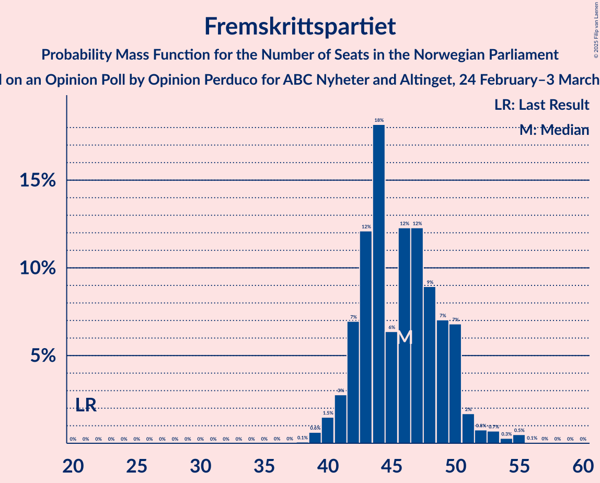
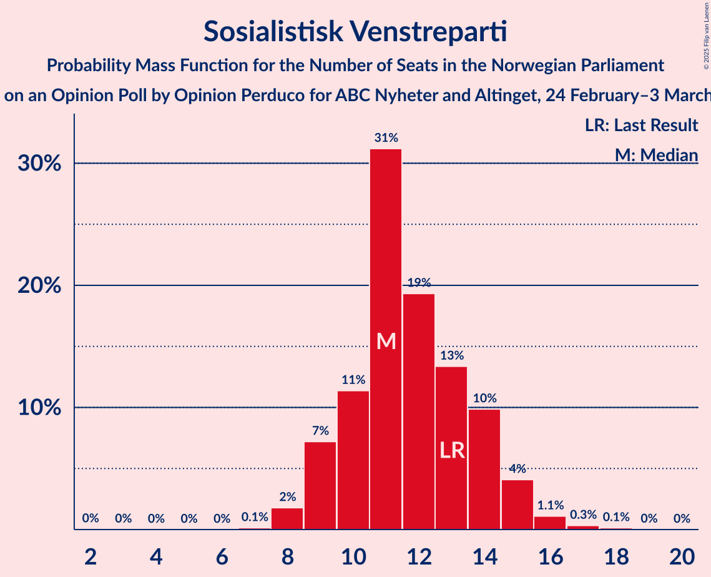
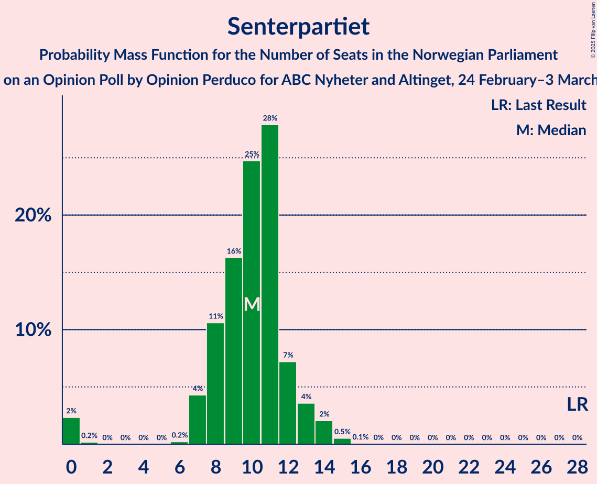
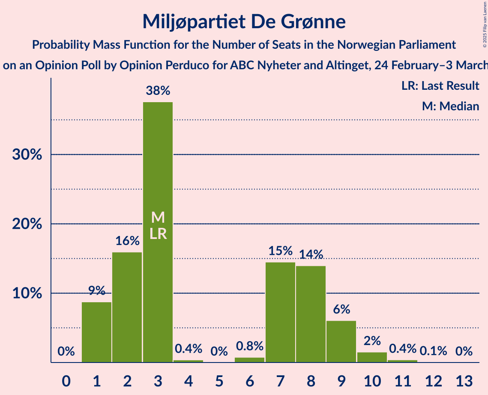
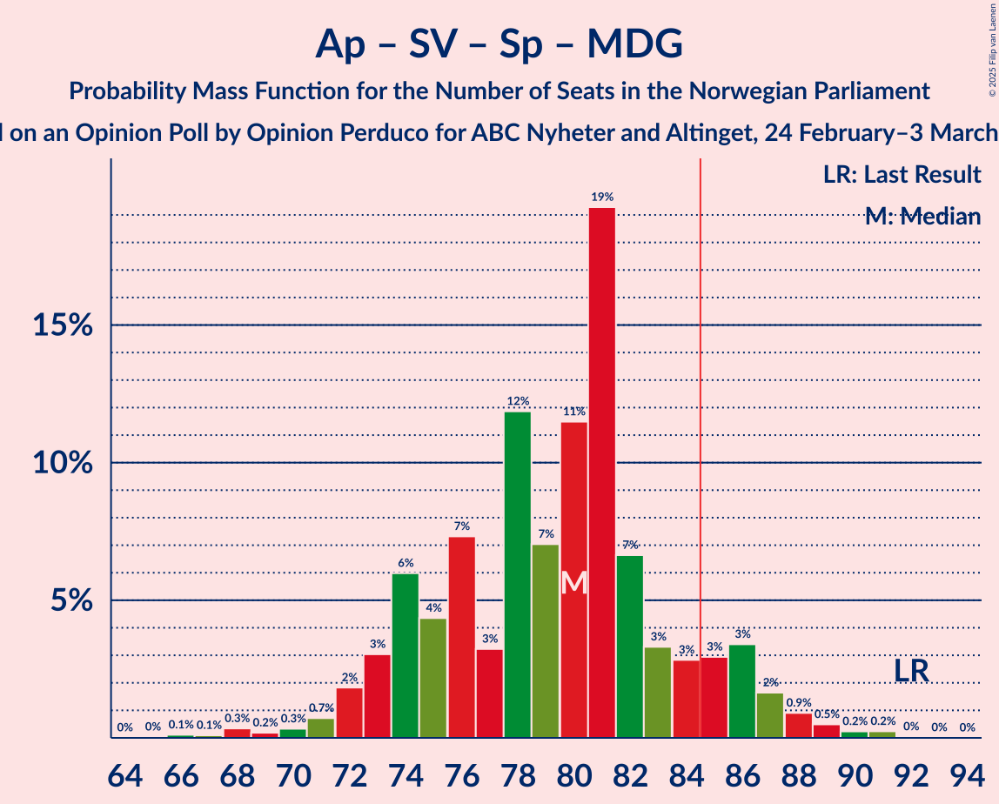
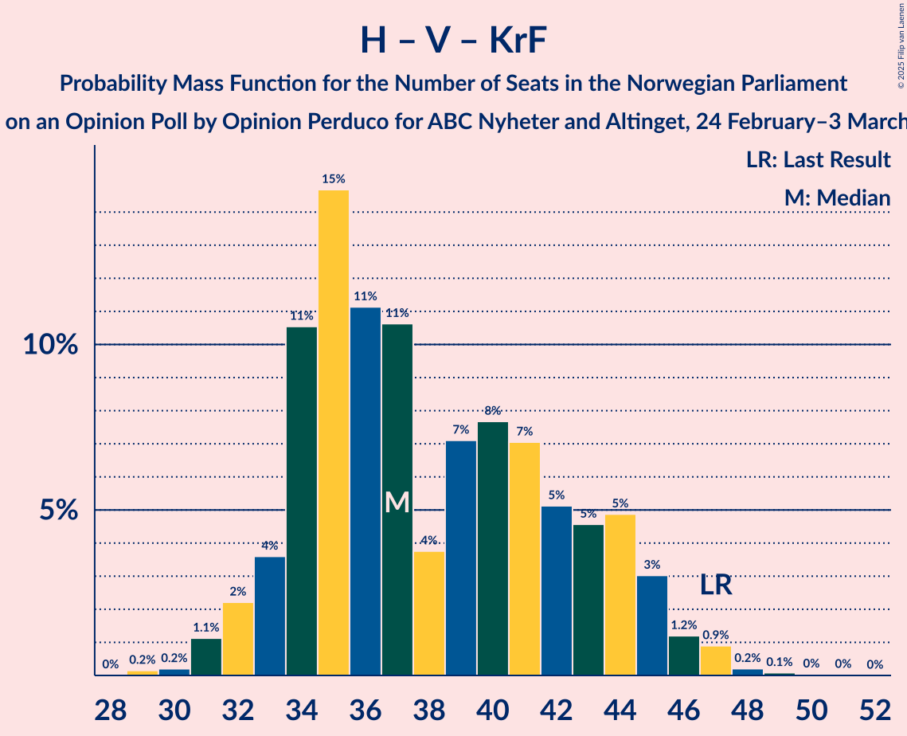

# Opinion Poll by Opinion Perduco for ABC Nyheter and Altinget, 24 February–3 March 2025

<a href="#voting-intentions">Voting Intentions</a> | <a href="#seats">Seats</a> | <a href="#coalitions">Coalitions</a> | <a href="#technical-information">Technical Information</a>

## Voting Intentions

### Confidence Intervals

| Party | Last Result | Poll Result | 80% Confidence Interval | 90% Confidence Interval | 95% Confidence Interval | 99% Confidence Interval |
|:-----:|:-----------:|:-----------:|:-----------------------:|:-----------------------:|:-----------------------:|:-----------------------:|
| Arbeiderpartiet | 26.2% | 28.2% | 26.4–30.1% |25.9–30.6% |25.5–31.1% |24.7–32.0% |
| Fremskrittspartiet | 11.6% | 24.8% | 23.1–26.6% |22.6–27.2% |22.3–27.6% |21.5–28.5% |
| Høyre | 20.4% | 18.5% | 17.0–20.2% |16.6–20.7% |16.3–21.1% |15.6–21.9% |
| Sosialistisk Venstreparti | 7.6% | 6.3% | 5.4–7.4% |5.2–7.7% |4.9–8.0% |4.5–8.5% |
| Senterpartiet | 13.5% | 5.4% | 4.6–6.4% |4.3–6.7% |4.1–7.0% |3.8–7.5% |
| Rødt | 4.7% | 4.2% | 3.5–5.1% |3.3–5.4% |3.1–5.6% |2.8–6.1% |
| Miljøpartiet De Grønne | 3.9% | 3.7% | 3.0–4.6% |2.8–4.8% |2.7–5.0% |2.4–5.5% |
| Venstre | 4.6% | 3.2% | 2.6–4.0% |2.4–4.3% |2.3–4.5% |2.0–4.9% |
| Kristelig Folkeparti | 3.8% | 2.6% | 2.0–3.4% |1.9–3.6% |1.8–3.8% |1.5–4.2% |
| Industri- og Næringspartiet | 0.3% | 1.1% | 0.8–1.7% |0.7–1.8% |0.6–2.0% |0.5–2.3% |

*Note:* The poll result column reflects the actual value used in the calculations. Published results may vary slightly, and in addition be rounded to fewer digits.

## Seats

### Confidence Intervals

| Party | Last Result | Median | 80% Confidence Interval | 90% Confidence Interval | 95% Confidence Interval | 99% Confidence Interval |
|:-----:|:-----------:|:------:|:-----------------------:|:-----------------------:|:-----------------------:|:-----------------------:|
| <a href="#arbeiderpartiet">Arbeiderpartiet</a> | 48 | 53 | 50–58 |49–58 |48–58 |46–60 |
| <a href="#fremskrittspartiet">Fremskrittspartiet</a> | 21 | 46 | 43–49 |42–50 |41–51 |40–53 |
| <a href="#høyre">Høyre</a> | 36 | 34 | 31–37 |30–39 |30–39 |27–41 |
| <a href="#sosialistisk-venstreparti">Sosialistisk Venstreparti</a> | 13 | 11 | 10–14 |9–14 |9–14 |8–16 |
| <a href="#senterpartiet">Senterpartiet</a> | 28 | 10 | 8–12 |8–13 |7–13 |0–14 |
| <a href="#rødt">Rødt</a> | 8 | 8 | 1–9 |1–10 |1–10 |1–11 |
| <a href="#miljøpartiet-de-grønne">Miljøpartiet De Grønne</a> | 3 | 3 | 2–8 |2–9 |1–9 |1–10 |
| <a href="#venstre">Venstre</a> | 8 | 2 | 2–3 |2–8 |1–8 |1–9 |
| <a href="#kristelig-folkeparti">Kristelig Folkeparti</a> | 3 | 1 | 0–3 |0–3 |0–3 |0–7 |
| <a href="#industri--og-næringspartiet">Industri- og Næringspartiet</a> | 0 | 0 | 0 |0 |0 |0 |

### Arbeiderpartiet

*For a full overview of the results for this party, see the [Arbeiderpartiet](party-arbeiderpartiet.html) page.*

| Number of Seats | Probability | Accumulated | Special Marks |
|:---------------:|:-----------:|:-----------:|:-------------:|
| 44 | 0.1% | 100% |  |
| 45 | 0.1% | 99.9% |  |
| 46 | 0.7% | 99.8% |  |
| 47 | 0.7% | 99.1% |  |
| 48 | 2% | 98% | Last Result |
| 49 | 5% | 96% |  |
| 50 | 9% | 91% |  |
| 51 | 10% | 82% |  |
| 52 | 12% | 72% |  |
| 53 | 13% | 61% | Median |
| 54 | 14% | 48% |  |
| 55 | 12% | 34% |  |
| 56 | 8% | 22% |  |
| 57 | 4% | 14% |  |
| 58 | 8% | 10% |  |
| 59 | 1.2% | 2% |  |
| 60 | 0.9% | 1.3% |  |
| 61 | 0.2% | 0.4% |  |
| 62 | 0.1% | 0.1% |  |
| 63 | 0% | 0% |  |

### Fremskrittspartiet

*For a full overview of the results for this party, see the [Fremskrittspartiet](party-fremskrittspartiet.html) page.*

| Number of Seats | Probability | Accumulated | Special Marks |
|:---------------:|:-----------:|:-----------:|:-------------:|
| 21 | 0% | 100% | Last Result |
| 22 | 0% | 100% |  |
| 23 | 0% | 100% |  |
| 24 | 0% | 100% |  |
| 25 | 0% | 100% |  |
| 26 | 0% | 100% |  |
| 27 | 0% | 100% |  |
| 28 | 0% | 100% |  |
| 29 | 0% | 100% |  |
| 30 | 0% | 100% |  |
| 31 | 0% | 100% |  |
| 32 | 0% | 100% |  |
| 33 | 0% | 100% |  |
| 34 | 0% | 100% |  |
| 35 | 0% | 100% |  |
| 36 | 0% | 100% |  |
| 37 | 0% | 100% |  |
| 38 | 0% | 100% |  |
| 39 | 0.1% | 100% |  |
| 40 | 0.4% | 99.9% |  |
| 41 | 3% | 99.5% |  |
| 42 | 6% | 96% |  |
| 43 | 17% | 91% |  |
| 44 | 7% | 74% |  |
| 45 | 16% | 67% |  |
| 46 | 9% | 51% | Median |
| 47 | 16% | 42% |  |
| 48 | 7% | 26% |  |
| 49 | 11% | 19% |  |
| 50 | 5% | 8% |  |
| 51 | 1.4% | 3% |  |
| 52 | 0.8% | 2% |  |
| 53 | 0.4% | 0.7% |  |
| 54 | 0.2% | 0.3% |  |
| 55 | 0% | 0.1% |  |
| 56 | 0% | 0% |  |

### Høyre

*For a full overview of the results for this party, see the [Høyre](party-høyre.html) page.*

| Number of Seats | Probability | Accumulated | Special Marks |
|:---------------:|:-----------:|:-----------:|:-------------:|
| 26 | 0.1% | 100% |  |
| 27 | 0.4% | 99.9% |  |
| 28 | 0.5% | 99.5% |  |
| 29 | 1.5% | 99.0% |  |
| 30 | 4% | 98% |  |
| 31 | 6% | 94% |  |
| 32 | 10% | 87% |  |
| 33 | 21% | 77% |  |
| 34 | 13% | 56% | Median |
| 35 | 14% | 43% |  |
| 36 | 6% | 29% | Last Result |
| 37 | 13% | 23% |  |
| 38 | 4% | 10% |  |
| 39 | 3% | 5% |  |
| 40 | 1.0% | 2% |  |
| 41 | 0.6% | 0.9% |  |
| 42 | 0.2% | 0.3% |  |
| 43 | 0.1% | 0.1% |  |
| 44 | 0% | 0% |  |

### Sosialistisk Venstreparti

*For a full overview of the results for this party, see the [Sosialistisk Venstreparti](party-sosialistiskvenstreparti.html) page.*

| Number of Seats | Probability | Accumulated | Special Marks |
|:---------------:|:-----------:|:-----------:|:-------------:|
| 7 | 0.1% | 100% |  |
| 8 | 0.7% | 99.9% |  |
| 9 | 4% | 99.2% |  |
| 10 | 22% | 95% |  |
| 11 | 25% | 72% | Median |
| 12 | 24% | 47% |  |
| 13 | 11% | 23% | Last Result |
| 14 | 10% | 12% |  |
| 15 | 2% | 2% |  |
| 16 | 0.5% | 0.7% |  |
| 17 | 0.2% | 0.3% |  |
| 18 | 0% | 0% |  |

### Senterpartiet

*For a full overview of the results for this party, see the [Senterpartiet](party-senterpartiet.html) page.*

| Number of Seats | Probability | Accumulated | Special Marks |
|:---------------:|:-----------:|:-----------:|:-------------:|
| 0 | 1.2% | 100% |  |
| 1 | 0.2% | 98.8% |  |
| 2 | 0% | 98.5% |  |
| 3 | 0% | 98.5% |  |
| 4 | 0% | 98.5% |  |
| 5 | 0% | 98.5% |  |
| 6 | 0.1% | 98.5% |  |
| 7 | 3% | 98% |  |
| 8 | 10% | 96% |  |
| 9 | 18% | 85% |  |
| 10 | 28% | 67% | Median |
| 11 | 26% | 40% |  |
| 12 | 8% | 14% |  |
| 13 | 5% | 6% |  |
| 14 | 0.9% | 1.1% |  |
| 15 | 0.2% | 0.2% |  |
| 16 | 0% | 0% |  |
| 17 | 0% | 0% |  |
| 18 | 0% | 0% |  |
| 19 | 0% | 0% |  |
| 20 | 0% | 0% |  |
| 21 | 0% | 0% |  |
| 22 | 0% | 0% |  |
| 23 | 0% | 0% |  |
| 24 | 0% | 0% |  |
| 25 | 0% | 0% |  |
| 26 | 0% | 0% |  |
| 27 | 0% | 0% |  |
| 28 | 0% | 0% | Last Result |

### Rødt

*For a full overview of the results for this party, see the [Rødt](party-rødt.html) page.*

| Number of Seats | Probability | Accumulated | Special Marks |
|:---------------:|:-----------:|:-----------:|:-------------:|
| 1 | 27% | 100% |  |
| 2 | 2% | 73% |  |
| 3 | 0.1% | 71% |  |
| 4 | 0% | 70% |  |
| 5 | 0% | 70% |  |
| 6 | 0.2% | 70% |  |
| 7 | 6% | 70% |  |
| 8 | 41% | 64% | Last Result, Median |
| 9 | 17% | 23% |  |
| 10 | 5% | 6% |  |
| 11 | 0.7% | 0.9% |  |
| 12 | 0.1% | 0.1% |  |
| 13 | 0% | 0% |  |

### Miljøpartiet De Grønne

*For a full overview of the results for this party, see the [Miljøpartiet De Grønne](party-miljøpartietdegrønne.html) page.*

| Number of Seats | Probability | Accumulated | Special Marks |
|:---------------:|:-----------:|:-----------:|:-------------:|
| 1 | 4% | 100% |  |
| 2 | 21% | 96% |  |
| 3 | 48% | 75% | Last Result, Median |
| 4 | 1.4% | 27% |  |
| 5 | 0% | 25% |  |
| 6 | 0.3% | 25% |  |
| 7 | 8% | 25% |  |
| 8 | 9% | 17% |  |
| 9 | 7% | 8% |  |
| 10 | 1.2% | 1.3% |  |
| 11 | 0.1% | 0.1% |  |
| 12 | 0% | 0% |  |

### Venstre

*For a full overview of the results for this party, see the [Venstre](party-venstre.html) page.*

| Number of Seats | Probability | Accumulated | Special Marks |
|:---------------:|:-----------:|:-----------:|:-------------:|
| 1 | 4% | 100% |  |
| 2 | 49% | 96% | Median |
| 3 | 41% | 47% |  |
| 4 | 0% | 7% |  |
| 5 | 0% | 7% |  |
| 6 | 0.3% | 7% |  |
| 7 | 1.2% | 6% |  |
| 8 | 4% | 5% | Last Result |
| 9 | 1.0% | 1.0% |  |
| 10 | 0% | 0% |  |

### Kristelig Folkeparti

*For a full overview of the results for this party, see the [Kristelig Folkeparti](party-kristeligfolkeparti.html) page.*

| Number of Seats | Probability | Accumulated | Special Marks |
|:---------------:|:-----------:|:-----------:|:-------------:|
| 0 | 30% | 100% |  |
| 1 | 34% | 70% | Median |
| 2 | 25% | 36% |  |
| 3 | 10% | 11% | Last Result |
| 4 | 0% | 0.8% |  |
| 5 | 0% | 0.8% |  |
| 6 | 0% | 0.8% |  |
| 7 | 0.5% | 0.8% |  |
| 8 | 0.3% | 0.3% |  |
| 9 | 0% | 0% |  |

### Industri- og Næringspartiet

*For a full overview of the results for this party, see the [Industri- og Næringspartiet](party-industri-ognæringspartiet.html) page.*

| Number of Seats | Probability | Accumulated | Special Marks |
|:---------------:|:-----------:|:-----------:|:-------------:|
| 0 | 99.7% | 100% | Last Result, Median |
| 1 | 0.3% | 0.3% |  |
| 2 | 0.1% | 0.1% |  |
| 3 | 0% | 0% |  |

## Coalitions

### Confidence Intervals

| Coalition | Last Result | Median | Majority? | 80% Confidence Interval | 90% Confidence Interval | 95% Confidence Interval | 99% Confidence Interval |
|:---------:|:-----------:|:------:|:---------:|:-----------------------:|:-----------------------:|:-----------------------:|:-----------------------:|
| Fremskrittspartiet – Høyre – Senterpartiet – Venstre – Kristelig Folkeparti | 96 | 93 | 99.3% | 89–99 | 88–100 | 87–101 | 84–105 |
| Fremskrittspartiet – Høyre – Miljøpartiet De Grønne – Venstre – Kristelig Folkeparti | 71 | 88 | 84% | 83–93 | 82–94 | 82–96 | 80–99 |
| Fremskrittspartiet – Høyre – Venstre – Kristelig Folkeparti | 68 | 84 | 38% | 80–89 | 79–90 | 78–92 | 75–95 |
| Arbeiderpartiet – Sosialistisk Venstreparti – Senterpartiet – Rødt – Miljøpartiet De Grønne | 100 | 85 | 62% | 80–89 | 79–90 | 77–91 | 74–94 |
| Fremskrittspartiet – Høyre – Venstre | 65 | 82 | 26% | 79–87 | 78–89 | 77–90 | 74–93 |
| Arbeiderpartiet – Sosialistisk Venstreparti – Senterpartiet – Miljøpartiet De Grønne – Kristelig Folkeparti | 95 | 80 | 12% | 76–85 | 75–86 | 74–88 | 71–89 |
| Fremskrittspartiet – Høyre | 57 | 80 | 7% | 76–84 | 75–86 | 74–88 | 72–90 |
| Arbeiderpartiet – Sosialistisk Venstreparti – Senterpartiet – Rødt | 97 | 81 | 16% | 76–86 | 75–87 | 73–87 | 70–89 |
| Arbeiderpartiet – Sosialistisk Venstreparti – Senterpartiet – Miljøpartiet De Grønne | 92 | 79 | 8% | 75–84 | 74–85 | 72–87 | 69–88 |
| Arbeiderpartiet – Sosialistisk Venstreparti – Rødt – Miljøpartiet De Grønne | 72 | 76 | 0.7% | 70–80 | 69–81 | 68–82 | 64–85 |
| Arbeiderpartiet – Sosialistisk Venstreparti – Senterpartiet | 89 | 75 | 0.1% | 71–78 | 70–79 | 69–81 | 66–83 |
| Arbeiderpartiet – Senterpartiet – Miljøpartiet De Grønne – Kristelig Folkeparti | 82 | 69 | 0% | 64–73 | 63–75 | 63–75 | 59–78 |
| Arbeiderpartiet – Sosialistisk Venstreparti | 61 | 65 | 0% | 61–68 | 60–70 | 59–71 | 57–73 |
| Arbeiderpartiet – Senterpartiet – Kristelig Folkeparti | 79 | 64 | 0% | 61–69 | 60–69 | 59–70 | 55–72 |
| Arbeiderpartiet – Senterpartiet | 76 | 63 | 0% | 60–68 | 59–68 | 57–68 | 54–71 |
| Høyre – Venstre – Kristelig Folkeparti | 47 | 38 | 0% | 35–42 | 34–43 | 33–44 | 31–47 |
| Senterpartiet – Venstre – Kristelig Folkeparti | 39 | 14 | 0% | 11–16 | 11–18 | 10–19 | 3–22 |

### Fremskrittspartiet – Høyre – Senterpartiet – Venstre – Kristelig Folkeparti

| Number of Seats | Probability | Accumulated | Special Marks |
|:---------------:|:-----------:|:-----------:|:-------------:|
| 82 | 0% | 100% |  |
| 83 | 0.1% | 99.9% |  |
| 84 | 0.5% | 99.8% |  |
| 85 | 0.3% | 99.3% | Majority |
| 86 | 0.7% | 99.0% |  |
| 87 | 1.3% | 98% |  |
| 88 | 4% | 97% |  |
| 89 | 4% | 93% |  |
| 90 | 3% | 88% |  |
| 91 | 12% | 85% |  |
| 92 | 8% | 74% |  |
| 93 | 18% | 66% | Median |
| 94 | 6% | 48% |  |
| 95 | 9% | 42% |  |
| 96 | 10% | 32% | Last Result |
| 97 | 4% | 23% |  |
| 98 | 3% | 18% |  |
| 99 | 6% | 15% |  |
| 100 | 6% | 10% |  |
| 101 | 2% | 4% |  |
| 102 | 0.7% | 2% |  |
| 103 | 0.5% | 1.4% |  |
| 104 | 0.4% | 0.9% |  |
| 105 | 0.3% | 0.5% |  |
| 106 | 0.2% | 0.2% |  |
| 107 | 0% | 0% |  |

### Fremskrittspartiet – Høyre – Miljøpartiet De Grønne – Venstre – Kristelig Folkeparti

| Number of Seats | Probability | Accumulated | Special Marks |
|:---------------:|:-----------:|:-----------:|:-------------:|
| 71 | 0% | 100% | Last Result |
| 72 | 0% | 100% |  |
| 73 | 0% | 100% |  |
| 74 | 0% | 100% |  |
| 75 | 0% | 100% |  |
| 76 | 0% | 100% |  |
| 77 | 0% | 100% |  |
| 78 | 0% | 100% |  |
| 79 | 0.1% | 99.9% |  |
| 80 | 0.5% | 99.8% |  |
| 81 | 0.7% | 99.3% |  |
| 82 | 5% | 98.6% |  |
| 83 | 7% | 94% |  |
| 84 | 3% | 87% |  |
| 85 | 10% | 84% | Majority |
| 86 | 12% | 74% | Median |
| 87 | 11% | 62% |  |
| 88 | 13% | 51% |  |
| 89 | 7% | 38% |  |
| 90 | 5% | 31% |  |
| 91 | 5% | 26% |  |
| 92 | 11% | 22% |  |
| 93 | 4% | 11% |  |
| 94 | 3% | 7% |  |
| 95 | 2% | 4% |  |
| 96 | 0.8% | 3% |  |
| 97 | 0.6% | 2% |  |
| 98 | 0.7% | 2% |  |
| 99 | 0.6% | 0.8% |  |
| 100 | 0.1% | 0.2% |  |
| 101 | 0.1% | 0.1% |  |
| 102 | 0% | 0% |  |

### Fremskrittspartiet – Høyre – Venstre – Kristelig Folkeparti

| Number of Seats | Probability | Accumulated | Special Marks |
|:---------------:|:-----------:|:-----------:|:-------------:|
| 68 | 0% | 100% | Last Result |
| 69 | 0% | 100% |  |
| 70 | 0% | 100% |  |
| 71 | 0% | 100% |  |
| 72 | 0% | 100% |  |
| 73 | 0% | 100% |  |
| 74 | 0.3% | 100% |  |
| 75 | 0.4% | 99.7% |  |
| 76 | 0.4% | 99.3% |  |
| 77 | 0.9% | 98.9% |  |
| 78 | 2% | 98% |  |
| 79 | 3% | 96% |  |
| 80 | 8% | 94% |  |
| 81 | 11% | 86% |  |
| 82 | 11% | 75% |  |
| 83 | 13% | 64% | Median |
| 84 | 13% | 51% |  |
| 85 | 9% | 38% | Majority |
| 86 | 10% | 30% |  |
| 87 | 2% | 19% |  |
| 88 | 3% | 17% |  |
| 89 | 7% | 14% |  |
| 90 | 2% | 7% |  |
| 91 | 2% | 5% |  |
| 92 | 1.2% | 3% |  |
| 93 | 0.4% | 1.5% |  |
| 94 | 0.3% | 1.0% |  |
| 95 | 0.3% | 0.7% |  |
| 96 | 0.3% | 0.3% |  |
| 97 | 0% | 0.1% |  |
| 98 | 0% | 0% |  |

### Arbeiderpartiet – Sosialistisk Venstreparti – Senterpartiet – Rødt – Miljøpartiet De Grønne

| Number of Seats | Probability | Accumulated | Special Marks |
|:---------------:|:-----------:|:-----------:|:-------------:|
| 72 | 0% | 100% |  |
| 73 | 0.3% | 99.9% |  |
| 74 | 0.3% | 99.7% |  |
| 75 | 0.3% | 99.3% |  |
| 76 | 0.5% | 99.0% |  |
| 77 | 1.2% | 98.5% |  |
| 78 | 2% | 97% |  |
| 79 | 2% | 95% |  |
| 80 | 7% | 93% |  |
| 81 | 3% | 86% |  |
| 82 | 2% | 83% |  |
| 83 | 10% | 81% |  |
| 84 | 9% | 70% |  |
| 85 | 13% | 62% | Median, Majority |
| 86 | 13% | 49% |  |
| 87 | 11% | 36% |  |
| 88 | 11% | 25% |  |
| 89 | 8% | 14% |  |
| 90 | 3% | 6% |  |
| 91 | 2% | 4% |  |
| 92 | 0.9% | 2% |  |
| 93 | 0.4% | 1.1% |  |
| 94 | 0.4% | 0.7% |  |
| 95 | 0.3% | 0.3% |  |
| 96 | 0% | 0% |  |
| 97 | 0% | 0% |  |
| 98 | 0% | 0% |  |
| 99 | 0% | 0% |  |
| 100 | 0% | 0% | Last Result |

### Fremskrittspartiet – Høyre – Venstre

| Number of Seats | Probability | Accumulated | Special Marks |
|:---------------:|:-----------:|:-----------:|:-------------:|
| 65 | 0% | 100% | Last Result |
| 66 | 0% | 100% |  |
| 67 | 0% | 100% |  |
| 68 | 0% | 100% |  |
| 69 | 0% | 100% |  |
| 70 | 0% | 100% |  |
| 71 | 0% | 100% |  |
| 72 | 0% | 100% |  |
| 73 | 0.1% | 100% |  |
| 74 | 0.5% | 99.9% |  |
| 75 | 0.7% | 99.4% |  |
| 76 | 0.9% | 98.6% |  |
| 77 | 2% | 98% |  |
| 78 | 4% | 96% |  |
| 79 | 8% | 92% |  |
| 80 | 13% | 84% |  |
| 81 | 7% | 71% |  |
| 82 | 16% | 64% | Median |
| 83 | 8% | 48% |  |
| 84 | 14% | 40% |  |
| 85 | 5% | 26% | Majority |
| 86 | 6% | 21% |  |
| 87 | 7% | 15% |  |
| 88 | 2% | 8% |  |
| 89 | 2% | 6% |  |
| 90 | 2% | 4% |  |
| 91 | 0.7% | 2% |  |
| 92 | 0.5% | 1.3% |  |
| 93 | 0.6% | 0.8% |  |
| 94 | 0.1% | 0.2% |  |
| 95 | 0.1% | 0.1% |  |
| 96 | 0% | 0% |  |

### Arbeiderpartiet – Sosialistisk Venstreparti – Senterpartiet – Miljøpartiet De Grønne – Kristelig Folkeparti

| Number of Seats | Probability | Accumulated | Special Marks |
|:---------------:|:-----------:|:-----------:|:-------------:|
| 68 | 0.2% | 100% |  |
| 69 | 0.1% | 99.7% |  |
| 70 | 0.1% | 99.6% |  |
| 71 | 0.3% | 99.5% |  |
| 72 | 0.3% | 99.3% |  |
| 73 | 0.6% | 98.9% |  |
| 74 | 3% | 98% |  |
| 75 | 3% | 96% |  |
| 76 | 8% | 93% |  |
| 77 | 8% | 85% |  |
| 78 | 8% | 76% | Median |
| 79 | 14% | 69% |  |
| 80 | 10% | 55% |  |
| 81 | 20% | 45% |  |
| 82 | 5% | 25% |  |
| 83 | 4% | 20% |  |
| 84 | 4% | 16% |  |
| 85 | 5% | 12% | Majority |
| 86 | 3% | 8% |  |
| 87 | 1.2% | 5% |  |
| 88 | 2% | 3% |  |
| 89 | 1.1% | 2% |  |
| 90 | 0.2% | 0.5% |  |
| 91 | 0.1% | 0.2% |  |
| 92 | 0.1% | 0.1% |  |
| 93 | 0% | 0.1% |  |
| 94 | 0% | 0% |  |
| 95 | 0% | 0% | Last Result |

### Fremskrittspartiet – Høyre

| Number of Seats | Probability | Accumulated | Special Marks |
|:---------------:|:-----------:|:-----------:|:-------------:|
| 57 | 0% | 100% | Last Result |
| 58 | 0% | 100% |  |
| 59 | 0% | 100% |  |
| 60 | 0% | 100% |  |
| 61 | 0% | 100% |  |
| 62 | 0% | 100% |  |
| 63 | 0% | 100% |  |
| 64 | 0% | 100% |  |
| 65 | 0% | 100% |  |
| 66 | 0% | 100% |  |
| 67 | 0% | 100% |  |
| 68 | 0% | 100% |  |
| 69 | 0% | 100% |  |
| 70 | 0.1% | 100% |  |
| 71 | 0.3% | 99.9% |  |
| 72 | 0.6% | 99.6% |  |
| 73 | 0.9% | 99.0% |  |
| 74 | 2% | 98% |  |
| 75 | 3% | 97% |  |
| 76 | 7% | 93% |  |
| 77 | 11% | 86% |  |
| 78 | 11% | 75% |  |
| 79 | 8% | 64% |  |
| 80 | 15% | 56% | Median |
| 81 | 8% | 41% |  |
| 82 | 12% | 33% |  |
| 83 | 5% | 21% |  |
| 84 | 9% | 16% |  |
| 85 | 2% | 7% | Majority |
| 86 | 1.3% | 5% |  |
| 87 | 1.0% | 4% |  |
| 88 | 2% | 3% |  |
| 89 | 0.4% | 1.3% |  |
| 90 | 0.7% | 0.9% |  |
| 91 | 0.1% | 0.2% |  |
| 92 | 0.1% | 0.1% |  |
| 93 | 0% | 0.1% |  |
| 94 | 0% | 0% |  |

### Arbeiderpartiet – Sosialistisk Venstreparti – Senterpartiet – Rødt

| Number of Seats | Probability | Accumulated | Special Marks |
|:---------------:|:-----------:|:-----------:|:-------------:|
| 68 | 0.1% | 100% |  |
| 69 | 0.1% | 99.9% |  |
| 70 | 0.6% | 99.8% |  |
| 71 | 0.7% | 99.2% |  |
| 72 | 0.6% | 98% |  |
| 73 | 0.8% | 98% |  |
| 74 | 2% | 97% |  |
| 75 | 3% | 96% |  |
| 76 | 4% | 93% |  |
| 77 | 11% | 89% |  |
| 78 | 4% | 78% |  |
| 79 | 5% | 74% |  |
| 80 | 7% | 69% |  |
| 81 | 13% | 62% |  |
| 82 | 11% | 49% | Median |
| 83 | 12% | 38% |  |
| 84 | 10% | 26% |  |
| 85 | 3% | 16% | Majority |
| 86 | 7% | 13% |  |
| 87 | 5% | 6% |  |
| 88 | 0.7% | 1.4% |  |
| 89 | 0.5% | 0.7% |  |
| 90 | 0.1% | 0.2% |  |
| 91 | 0% | 0.1% |  |
| 92 | 0% | 0% |  |
| 93 | 0% | 0% |  |
| 94 | 0% | 0% |  |
| 95 | 0% | 0% |  |
| 96 | 0% | 0% |  |
| 97 | 0% | 0% | Last Result |

### Arbeiderpartiet – Sosialistisk Venstreparti – Senterpartiet – Miljøpartiet De Grønne

| Number of Seats | Probability | Accumulated | Special Marks |
|:---------------:|:-----------:|:-----------:|:-------------:|
| 67 | 0.1% | 100% |  |
| 68 | 0.4% | 99.9% |  |
| 69 | 0.1% | 99.5% |  |
| 70 | 0.3% | 99.4% |  |
| 71 | 0.5% | 99.1% |  |
| 72 | 2% | 98.7% |  |
| 73 | 1.4% | 97% |  |
| 74 | 4% | 95% |  |
| 75 | 4% | 91% |  |
| 76 | 12% | 88% |  |
| 77 | 11% | 76% | Median |
| 78 | 12% | 65% |  |
| 79 | 16% | 53% |  |
| 80 | 12% | 37% |  |
| 81 | 7% | 25% |  |
| 82 | 4% | 18% |  |
| 83 | 3% | 13% |  |
| 84 | 2% | 10% |  |
| 85 | 4% | 8% | Majority |
| 86 | 2% | 5% |  |
| 87 | 2% | 3% |  |
| 88 | 1.1% | 2% |  |
| 89 | 0.3% | 0.5% |  |
| 90 | 0.1% | 0.2% |  |
| 91 | 0% | 0.1% |  |
| 92 | 0% | 0.1% | Last Result |
| 93 | 0% | 0% |  |

### Arbeiderpartiet – Sosialistisk Venstreparti – Rødt – Miljøpartiet De Grønne

| Number of Seats | Probability | Accumulated | Special Marks |
|:---------------:|:-----------:|:-----------:|:-------------:|
| 63 | 0.2% | 100% |  |
| 64 | 0.3% | 99.8% |  |
| 65 | 0.4% | 99.5% |  |
| 66 | 0.5% | 99.1% |  |
| 67 | 0.7% | 98.6% |  |
| 68 | 2% | 98% |  |
| 69 | 6% | 96% |  |
| 70 | 6% | 90% |  |
| 71 | 2% | 84% |  |
| 72 | 4% | 82% | Last Result |
| 73 | 10% | 77% |  |
| 74 | 9% | 67% |  |
| 75 | 6% | 58% | Median |
| 76 | 18% | 52% |  |
| 77 | 8% | 34% |  |
| 78 | 12% | 26% |  |
| 79 | 3% | 15% |  |
| 80 | 4% | 12% |  |
| 81 | 4% | 7% |  |
| 82 | 1.3% | 3% |  |
| 83 | 0.7% | 2% |  |
| 84 | 0.3% | 1.0% |  |
| 85 | 0.5% | 0.7% | Majority |
| 86 | 0.1% | 0.2% |  |
| 87 | 0% | 0.1% |  |
| 88 | 0% | 0% |  |

### Arbeiderpartiet – Sosialistisk Venstreparti – Senterpartiet

| Number of Seats | Probability | Accumulated | Special Marks |
|:---------------:|:-----------:|:-----------:|:-------------:|
| 63 | 0% | 100% |  |
| 64 | 0.1% | 99.9% |  |
| 65 | 0.2% | 99.9% |  |
| 66 | 0.4% | 99.6% |  |
| 67 | 1.0% | 99.2% |  |
| 68 | 0.7% | 98% |  |
| 69 | 2% | 98% |  |
| 70 | 3% | 95% |  |
| 71 | 4% | 92% |  |
| 72 | 8% | 88% |  |
| 73 | 10% | 80% |  |
| 74 | 13% | 70% | Median |
| 75 | 15% | 57% |  |
| 76 | 17% | 42% |  |
| 77 | 4% | 25% |  |
| 78 | 12% | 21% |  |
| 79 | 4% | 9% |  |
| 80 | 2% | 5% |  |
| 81 | 1.1% | 3% |  |
| 82 | 0.9% | 2% |  |
| 83 | 0.4% | 0.7% |  |
| 84 | 0.2% | 0.3% |  |
| 85 | 0% | 0.1% | Majority |
| 86 | 0.1% | 0.1% |  |
| 87 | 0% | 0% |  |
| 88 | 0% | 0% |  |
| 89 | 0% | 0% | Last Result |

### Arbeiderpartiet – Senterpartiet – Miljøpartiet De Grønne – Kristelig Folkeparti

| Number of Seats | Probability | Accumulated | Special Marks |
|:---------------:|:-----------:|:-----------:|:-------------:|
| 56 | 0.2% | 100% |  |
| 57 | 0.1% | 99.8% |  |
| 58 | 0.2% | 99.7% |  |
| 59 | 0.1% | 99.5% |  |
| 60 | 0.3% | 99.4% |  |
| 61 | 0.4% | 99.1% |  |
| 62 | 0.9% | 98.7% |  |
| 63 | 5% | 98% |  |
| 64 | 6% | 93% |  |
| 65 | 2% | 87% |  |
| 66 | 14% | 84% |  |
| 67 | 14% | 70% | Median |
| 68 | 6% | 56% |  |
| 69 | 7% | 50% |  |
| 70 | 13% | 43% |  |
| 71 | 14% | 30% |  |
| 72 | 5% | 16% |  |
| 73 | 2% | 11% |  |
| 74 | 3% | 8% |  |
| 75 | 3% | 5% |  |
| 76 | 0.8% | 2% |  |
| 77 | 0.4% | 1.1% |  |
| 78 | 0.5% | 0.7% |  |
| 79 | 0.2% | 0.3% |  |
| 80 | 0.1% | 0.1% |  |
| 81 | 0% | 0% |  |
| 82 | 0% | 0% | Last Result |

### Arbeiderpartiet – Sosialistisk Venstreparti

| Number of Seats | Probability | Accumulated | Special Marks |
|:---------------:|:-----------:|:-----------:|:-------------:|
| 55 | 0% | 100% |  |
| 56 | 0.1% | 99.9% |  |
| 57 | 0.4% | 99.8% |  |
| 58 | 2% | 99.4% |  |
| 59 | 2% | 98% |  |
| 60 | 3% | 96% |  |
| 61 | 5% | 93% | Last Result |
| 62 | 10% | 88% |  |
| 63 | 9% | 78% |  |
| 64 | 8% | 70% | Median |
| 65 | 25% | 61% |  |
| 66 | 11% | 37% |  |
| 67 | 8% | 26% |  |
| 68 | 9% | 18% |  |
| 69 | 4% | 9% |  |
| 70 | 2% | 5% |  |
| 71 | 2% | 3% |  |
| 72 | 0.7% | 1.2% |  |
| 73 | 0.2% | 0.5% |  |
| 74 | 0.1% | 0.3% |  |
| 75 | 0.1% | 0.2% |  |
| 76 | 0.1% | 0.1% |  |
| 77 | 0% | 0% |  |

### Arbeiderpartiet – Senterpartiet – Kristelig Folkeparti

| Number of Seats | Probability | Accumulated | Special Marks |
|:---------------:|:-----------:|:-----------:|:-------------:|
| 53 | 0% | 100% |  |
| 54 | 0.3% | 99.9% |  |
| 55 | 0.2% | 99.7% |  |
| 56 | 0.2% | 99.5% |  |
| 57 | 0.6% | 99.2% |  |
| 58 | 0.7% | 98.7% |  |
| 59 | 1.0% | 98% |  |
| 60 | 3% | 97% |  |
| 61 | 7% | 94% |  |
| 62 | 8% | 87% |  |
| 63 | 19% | 79% |  |
| 64 | 16% | 60% | Median |
| 65 | 10% | 44% |  |
| 66 | 7% | 35% |  |
| 67 | 9% | 28% |  |
| 68 | 8% | 19% |  |
| 69 | 7% | 10% |  |
| 70 | 1.5% | 3% |  |
| 71 | 0.4% | 1.4% |  |
| 72 | 0.6% | 1.0% |  |
| 73 | 0.1% | 0.4% |  |
| 74 | 0.2% | 0.2% |  |
| 75 | 0% | 0% |  |
| 76 | 0% | 0% |  |
| 77 | 0% | 0% |  |
| 78 | 0% | 0% |  |
| 79 | 0% | 0% | Last Result |

### Arbeiderpartiet – Senterpartiet

| Number of Seats | Probability | Accumulated | Special Marks |
|:---------------:|:-----------:|:-----------:|:-------------:|
| 52 | 0% | 100% |  |
| 53 | 0.1% | 99.9% |  |
| 54 | 0.5% | 99.8% |  |
| 55 | 0.3% | 99.3% |  |
| 56 | 0.4% | 99.0% |  |
| 57 | 1.3% | 98.6% |  |
| 58 | 2% | 97% |  |
| 59 | 5% | 95% |  |
| 60 | 7% | 90% |  |
| 61 | 12% | 84% |  |
| 62 | 8% | 72% |  |
| 63 | 15% | 64% | Median |
| 64 | 19% | 50% |  |
| 65 | 10% | 31% |  |
| 66 | 5% | 21% |  |
| 67 | 6% | 16% |  |
| 68 | 8% | 10% |  |
| 69 | 1.0% | 2% |  |
| 70 | 0.3% | 1.2% |  |
| 71 | 0.6% | 0.9% |  |
| 72 | 0.1% | 0.3% |  |
| 73 | 0.2% | 0.2% |  |
| 74 | 0% | 0% |  |
| 75 | 0% | 0% |  |
| 76 | 0% | 0% | Last Result |

### Høyre – Venstre – Kristelig Folkeparti

| Number of Seats | Probability | Accumulated | Special Marks |
|:---------------:|:-----------:|:-----------:|:-------------:|
| 29 | 0% | 100% |  |
| 30 | 0.3% | 99.9% |  |
| 31 | 0.6% | 99.6% |  |
| 32 | 0.7% | 99.0% |  |
| 33 | 1.3% | 98% |  |
| 34 | 4% | 97% |  |
| 35 | 13% | 93% |  |
| 36 | 8% | 80% |  |
| 37 | 10% | 72% | Median |
| 38 | 18% | 62% |  |
| 39 | 16% | 43% |  |
| 40 | 6% | 27% |  |
| 41 | 8% | 21% |  |
| 42 | 6% | 13% |  |
| 43 | 3% | 7% |  |
| 44 | 2% | 4% |  |
| 45 | 1.2% | 2% |  |
| 46 | 0.4% | 1.0% |  |
| 47 | 0.2% | 0.6% | Last Result |
| 48 | 0.1% | 0.3% |  |
| 49 | 0.1% | 0.2% |  |
| 50 | 0% | 0% |  |

### Senterpartiet – Venstre – Kristelig Folkeparti

| Number of Seats | Probability | Accumulated | Special Marks |
|:---------------:|:-----------:|:-----------:|:-------------:|
| 2 | 0.4% | 100% |  |
| 3 | 0.2% | 99.6% |  |
| 4 | 0.2% | 99.4% |  |
| 5 | 0.3% | 99.2% |  |
| 6 | 0.2% | 98.9% |  |
| 7 | 0% | 98.7% |  |
| 8 | 0% | 98.6% |  |
| 9 | 0.3% | 98.6% |  |
| 10 | 2% | 98% |  |
| 11 | 10% | 97% |  |
| 12 | 9% | 87% |  |
| 13 | 23% | 78% | Median |
| 14 | 14% | 55% |  |
| 15 | 16% | 40% |  |
| 16 | 15% | 24% |  |
| 17 | 3% | 10% |  |
| 18 | 2% | 6% |  |
| 19 | 2% | 4% |  |
| 20 | 1.1% | 2% |  |
| 21 | 0.7% | 1.2% |  |
| 22 | 0.3% | 0.5% |  |
| 23 | 0.2% | 0.2% |  |
| 24 | 0% | 0.1% |  |
| 25 | 0% | 0% |  |
| 26 | 0% | 0% |  |
| 27 | 0% | 0% |  |
| 28 | 0% | 0% |  |
| 29 | 0% | 0% |  |
| 30 | 0% | 0% |  |
| 31 | 0% | 0% |  |
| 32 | 0% | 0% |  |
| 33 | 0% | 0% |  |
| 34 | 0% | 0% |  |
| 35 | 0% | 0% |  |
| 36 | 0% | 0% |  |
| 37 | 0% | 0% |  |
| 38 | 0% | 0% |  |
| 39 | 0% | 0% | Last Result |

## Technical Information

### Opinion Poll

+ **Polling firm:** Opinion Perduco
+ **Commissioner(s):** ABC Nyheter and Altinget
+ **Fieldwork period:** 24 February–3 March 2025

### Calculations

+ **Sample size:** 1003
+ **Simulations done:** 2,097,152
+ **Error estimate:** 1.33%

