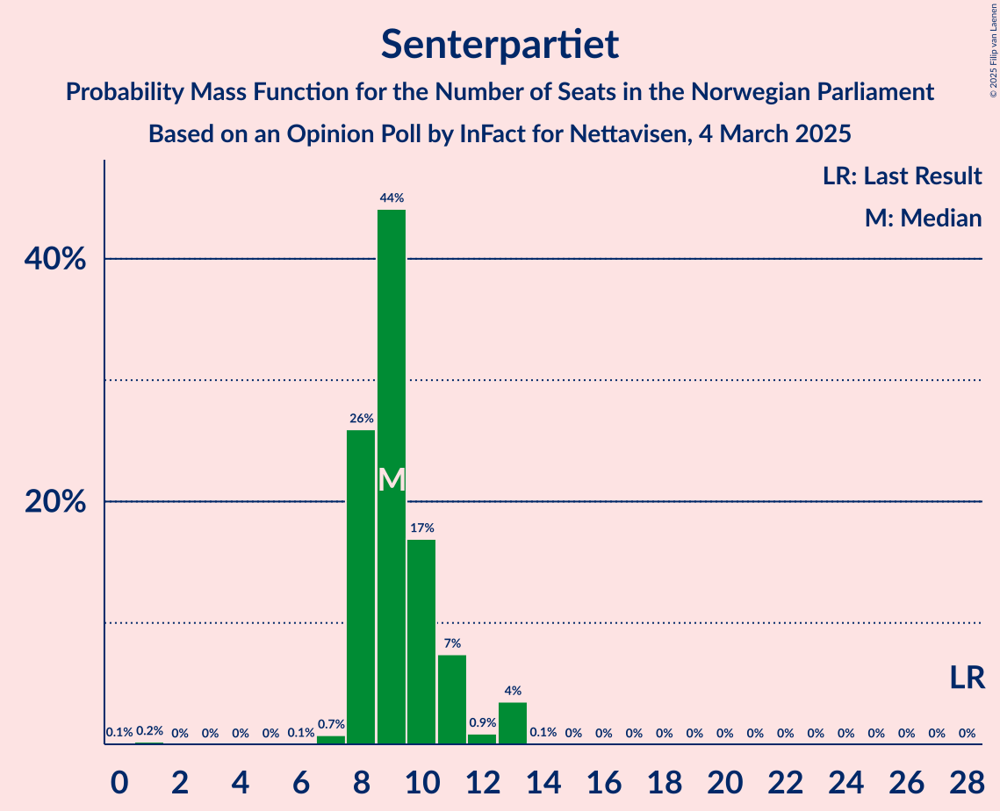
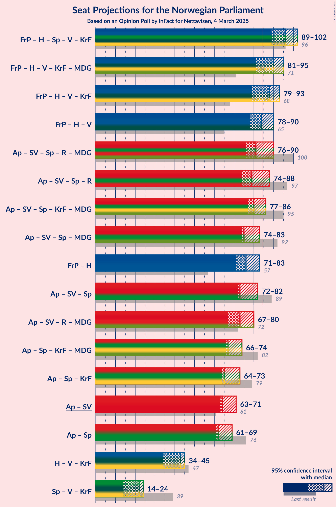
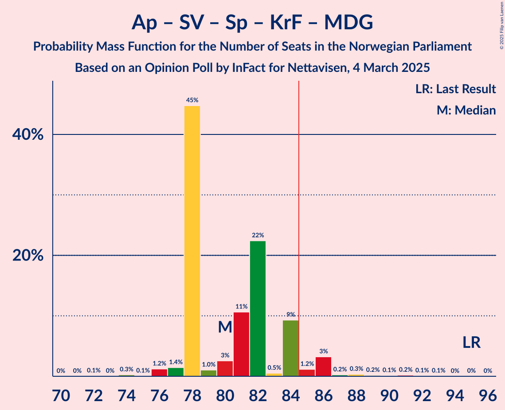
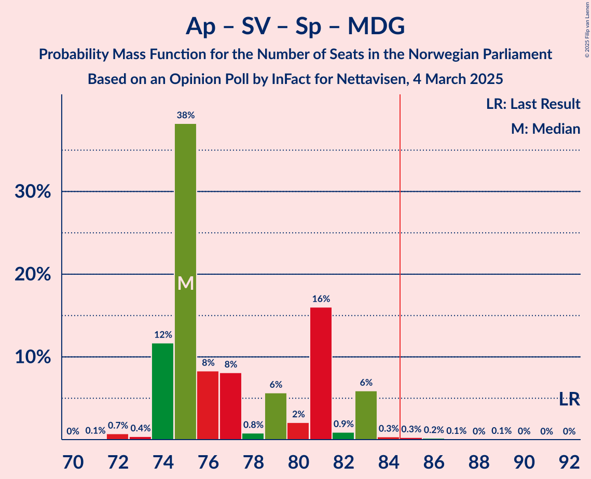
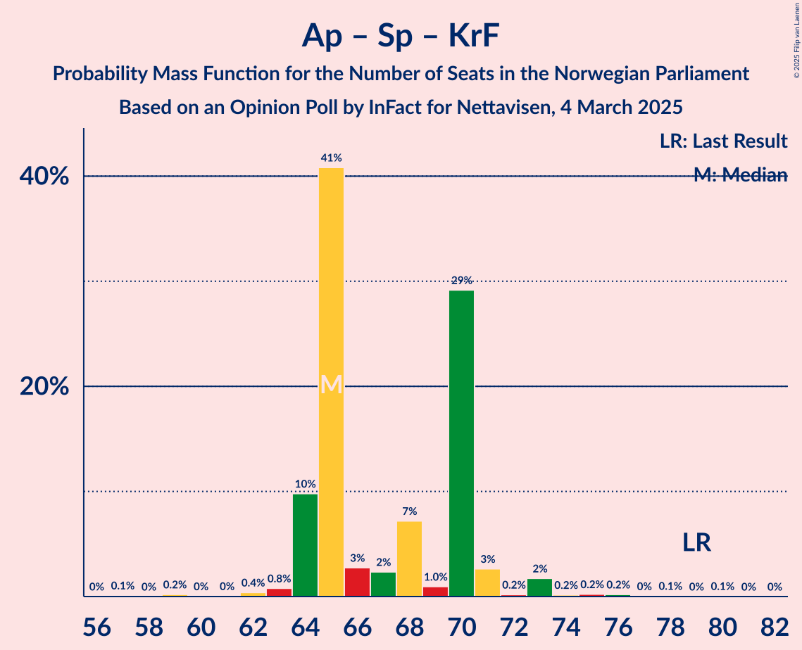
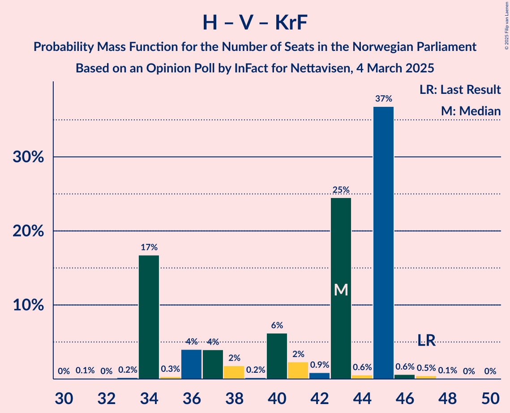

# Opinion Poll by InFact for Nettavisen, 4 March 2025

<a href="#voting-intentions">Voting Intentions</a> | <a href="#seats">Seats</a> | <a href="#coalitions">Coalitions</a> | <a href="#technical-information">Technical Information</a>

## Voting Intentions

### Confidence Intervals

| Party | Last Result | Poll Result | 80% Confidence Interval | 90% Confidence Interval | 95% Confidence Interval | 99% Confidence Interval |
|:-----:|:-----------:|:-----------:|:-----------------------:|:-----------------------:|:-----------------------:|:-----------------------:|
| Arbeiderpartiet | 26.2% | 29.5% | 27.7–31.3% |27.2–31.8% |26.8–32.3% |26.0–33.1% |
| Fremskrittspartiet | 11.6% | 24.1% | 22.5–25.8% |22.0–26.3% |21.6–26.7% |20.9–27.6% |
| Høyre | 20.4% | 16.4% | 15.1–18.0% |14.7–18.4% |14.3–18.8% |13.7–19.5% |
| Sosialistisk Venstreparti | 7.6% | 6.6% | 5.7–7.6% |5.4–7.9% |5.2–8.2% |4.8–8.7% |
| Senterpartiet | 13.5% | 5.4% | 4.6–6.3% |4.3–6.6% |4.2–6.9% |3.8–7.4% |
| Venstre | 4.6% | 4.3% | 3.6–5.2% |3.4–5.5% |3.3–5.7% |3.0–6.2% |
| Rødt | 4.7% | 4.0% | 3.3–4.8% |3.1–5.1% |3.0–5.3% |2.7–5.8% |
| Kristelig Folkeparti | 3.8% | 3.3% | 2.7–4.1% |2.5–4.4% |2.4–4.6% |2.1–5.0% |
| Miljøpartiet De Grønne | 3.9% | 3.0% | 2.4–3.7% |2.2–3.9% |2.1–4.1% |1.9–4.6% |
| Konservativt | 0.4% | 0.9% | 0.6–1.4% |0.6–1.6% |0.5–1.7% |0.4–2.0% |
| Industri- og Næringspartiet | 0.3% | 0.7% | 0.5–1.2% |0.4–1.3% |0.4–1.5% |0.3–1.7% |
| Norgesdemokratene | 1.1% | 0.6% | 0.4–1.0% |0.3–1.1% |0.3–1.2% |0.2–1.4% |
| Liberalistene | 0.2% | 0.2% | 0.1–0.5% |0.1–0.6% |0.0–0.7% |0.0–0.9% |

*Note:* The poll result column reflects the actual value used in the calculations. Published results may vary slightly, and in addition be rounded to fewer digits.

## Seats

### Confidence Intervals

| Party | Last Result | Median | 80% Confidence Interval | 90% Confidence Interval | 95% Confidence Interval | 99% Confidence Interval |
|:-----:|:-----------:|:------:|:-----------------------:|:-----------------------:|:-----------------------:|:-----------------------:|
| <a href="#arbeiderpartiet">Arbeiderpartiet</a> | 48 | 55 | 54–57 |54–61 |51–62 |48–62 |
| <a href="#fremskrittspartiet">Fremskrittspartiet</a> | 21 | 45 | 43–46 |43–48 |43–48 |40–51 |
| <a href="#høyre">Høyre</a> | 36 | 29 | 27–32 |27–32 |27–34 |25–36 |
| <a href="#sosialistisk-venstreparti">Sosialistisk Venstreparti</a> | 13 | 11 | 9–14 |9–14 |9–14 |9–16 |
| <a href="#senterpartiet">Senterpartiet</a> | 28 | 8 | 8–11 |8–11 |8–12 |7–13 |
| <a href="#venstre">Venstre</a> | 8 | 9 | 3–9 |3–9 |3–10 |2–11 |
| <a href="#rødt">Rødt</a> | 8 | 7 | 1–8 |1–9 |1–9 |1–10 |
| <a href="#kristelig-folkeparti">Kristelig Folkeparti</a> | 3 | 3 | 2–7 |1–7 |1–7 |1–9 |
| <a href="#miljøpartiet-de-grønne">Miljøpartiet De Grønne</a> | 3 | 2 | 1–3 |1–3 |1–3 |1–8 |
| <a href="#konservativt">Konservativt</a> | 0 | 0 | 0 |0 |0 |0 |
| <a href="#industri--og-næringspartiet">Industri- og Næringspartiet</a> | 0 | 0 | 0 |0 |0 |0 |
| <a href="#norgesdemokratene">Norgesdemokratene</a> | 0 | 0 | 0 |0 |0 |0 |
| <a href="#liberalistene">Liberalistene</a> | 0 | 0 | 0 |0 |0 |0 |

### Arbeiderpartiet

*For a full overview of the results for this party, see the [Arbeiderpartiet](party-arbeiderpartiet.html) page.*

| Number of Seats | Probability | Accumulated | Special Marks |
|:---------------:|:-----------:|:-----------:|:-------------:|
| 48 | 0.5% | 100% | Last Result |
| 49 | 0.3% | 99.5% |  |
| 50 | 2% | 99.2% |  |
| 51 | 0.4% | 98% |  |
| 52 | 0.7% | 97% |  |
| 53 | 1.2% | 96% |  |
| 54 | 37% | 95% |  |
| 55 | 40% | 58% | Median |
| 56 | 2% | 18% |  |
| 57 | 10% | 17% |  |
| 58 | 1.0% | 7% |  |
| 59 | 0.3% | 6% |  |
| 60 | 0.3% | 5% |  |
| 61 | 0.5% | 5% |  |
| 62 | 4% | 5% |  |
| 63 | 0.3% | 0.4% |  |
| 64 | 0% | 0% |  |

### Fremskrittspartiet

*For a full overview of the results for this party, see the [Fremskrittspartiet](party-fremskrittspartiet.html) page.*

| Number of Seats | Probability | Accumulated | Special Marks |
|:---------------:|:-----------:|:-----------:|:-------------:|
| 21 | 0% | 100% | Last Result |
| 22 | 0% | 100% |  |
| 23 | 0% | 100% |  |
| 24 | 0% | 100% |  |
| 25 | 0% | 100% |  |
| 26 | 0% | 100% |  |
| 27 | 0% | 100% |  |
| 28 | 0% | 100% |  |
| 29 | 0% | 100% |  |
| 30 | 0% | 100% |  |
| 31 | 0% | 100% |  |
| 32 | 0% | 100% |  |
| 33 | 0% | 100% |  |
| 34 | 0% | 100% |  |
| 35 | 0% | 100% |  |
| 36 | 0% | 100% |  |
| 37 | 0.1% | 100% |  |
| 38 | 0% | 99.9% |  |
| 39 | 0.2% | 99.9% |  |
| 40 | 0.6% | 99.7% |  |
| 41 | 1.0% | 99.1% |  |
| 42 | 0.4% | 98% |  |
| 43 | 33% | 98% |  |
| 44 | 8% | 64% |  |
| 45 | 40% | 57% | Median |
| 46 | 7% | 17% |  |
| 47 | 1.3% | 9% |  |
| 48 | 7% | 8% |  |
| 49 | 0.3% | 1.3% |  |
| 50 | 0.4% | 1.0% |  |
| 51 | 0.1% | 0.5% |  |
| 52 | 0.2% | 0.4% |  |
| 53 | 0.1% | 0.2% |  |
| 54 | 0.1% | 0.2% |  |
| 55 | 0% | 0.1% |  |
| 56 | 0% | 0% |  |

### Høyre

*For a full overview of the results for this party, see the [Høyre](party-høyre.html) page.*

| Number of Seats | Probability | Accumulated | Special Marks |
|:---------------:|:-----------:|:-----------:|:-------------:|
| 22 | 0.1% | 100% |  |
| 23 | 0% | 99.9% |  |
| 24 | 0.1% | 99.8% |  |
| 25 | 1.2% | 99.7% |  |
| 26 | 0.2% | 98.5% |  |
| 27 | 39% | 98% |  |
| 28 | 6% | 59% |  |
| 29 | 4% | 54% | Median |
| 30 | 2% | 50% |  |
| 31 | 8% | 48% |  |
| 32 | 37% | 41% |  |
| 33 | 0.9% | 4% |  |
| 34 | 1.4% | 3% |  |
| 35 | 0.8% | 1.4% |  |
| 36 | 0.1% | 0.6% | Last Result |
| 37 | 0.5% | 0.5% |  |
| 38 | 0% | 0% |  |

### Sosialistisk Venstreparti

*For a full overview of the results for this party, see the [Sosialistisk Venstreparti](party-sosialistiskvenstreparti.html) page.*

| Number of Seats | Probability | Accumulated | Special Marks |
|:---------------:|:-----------:|:-----------:|:-------------:|
| 8 | 0.1% | 100% |  |
| 9 | 47% | 99.9% |  |
| 10 | 2% | 53% |  |
| 11 | 34% | 51% | Median |
| 12 | 3% | 18% |  |
| 13 | 2% | 15% | Last Result |
| 14 | 12% | 13% |  |
| 15 | 0.4% | 1.0% |  |
| 16 | 0.4% | 0.6% |  |
| 17 | 0.1% | 0.2% |  |
| 18 | 0% | 0% |  |

### Senterpartiet

*For a full overview of the results for this party, see the [Senterpartiet](party-senterpartiet.html) page.*

| Number of Seats | Probability | Accumulated | Special Marks |
|:---------------:|:-----------:|:-----------:|:-------------:|
| 0 | 0.2% | 100% |  |
| 1 | 0.1% | 99.8% |  |
| 2 | 0% | 99.8% |  |
| 3 | 0% | 99.8% |  |
| 4 | 0% | 99.8% |  |
| 5 | 0% | 99.8% |  |
| 6 | 0% | 99.8% |  |
| 7 | 2% | 99.8% |  |
| 8 | 75% | 98% | Median |
| 9 | 3% | 22% |  |
| 10 | 2% | 20% |  |
| 11 | 15% | 17% |  |
| 12 | 1.5% | 3% |  |
| 13 | 0.8% | 1.1% |  |
| 14 | 0.3% | 0.3% |  |
| 15 | 0% | 0% |  |
| 16 | 0% | 0% |  |
| 17 | 0% | 0% |  |
| 18 | 0% | 0% |  |
| 19 | 0% | 0% |  |
| 20 | 0% | 0% |  |
| 21 | 0% | 0% |  |
| 22 | 0% | 0% |  |
| 23 | 0% | 0% |  |
| 24 | 0% | 0% |  |
| 25 | 0% | 0% |  |
| 26 | 0% | 0% |  |
| 27 | 0% | 0% |  |
| 28 | 0% | 0% | Last Result |

### Venstre

*For a full overview of the results for this party, see the [Venstre](party-venstre.html) page.*

| Number of Seats | Probability | Accumulated | Special Marks |
|:---------------:|:-----------:|:-----------:|:-------------:|
| 2 | 1.2% | 100% |  |
| 3 | 19% | 98.8% |  |
| 4 | 0% | 80% |  |
| 5 | 0% | 80% |  |
| 6 | 0% | 80% |  |
| 7 | 3% | 80% |  |
| 8 | 5% | 77% | Last Result |
| 9 | 68% | 72% | Median |
| 10 | 3% | 4% |  |
| 11 | 0.7% | 0.8% |  |
| 12 | 0.1% | 0.1% |  |
| 13 | 0% | 0% |  |

### Rødt

*For a full overview of the results for this party, see the [Rødt](party-rødt.html) page.*

| Number of Seats | Probability | Accumulated | Special Marks |
|:---------------:|:-----------:|:-----------:|:-------------:|
| 1 | 11% | 100% |  |
| 2 | 0.1% | 89% |  |
| 3 | 0% | 89% |  |
| 4 | 0% | 89% |  |
| 5 | 0% | 89% |  |
| 6 | 0% | 89% |  |
| 7 | 70% | 89% | Median |
| 8 | 11% | 18% | Last Result |
| 9 | 6% | 7% |  |
| 10 | 0.8% | 0.9% |  |
| 11 | 0.1% | 0.1% |  |
| 12 | 0% | 0% |  |

### Kristelig Folkeparti

*For a full overview of the results for this party, see the [Kristelig Folkeparti](party-kristeligfolkeparti.html) page.*

| Number of Seats | Probability | Accumulated | Special Marks |
|:---------------:|:-----------:|:-----------:|:-------------:|
| 0 | 0.3% | 100% |  |
| 1 | 5% | 99.7% |  |
| 2 | 36% | 94% |  |
| 3 | 16% | 59% | Last Result, Median |
| 4 | 0% | 43% |  |
| 5 | 0% | 43% |  |
| 6 | 0.1% | 43% |  |
| 7 | 41% | 43% |  |
| 8 | 1.1% | 2% |  |
| 9 | 0.9% | 0.9% |  |
| 10 | 0% | 0% |  |

### Miljøpartiet De Grønne

*For a full overview of the results for this party, see the [Miljøpartiet De Grønne](party-miljøpartietdegrønne.html) page.*

| Number of Seats | Probability | Accumulated | Special Marks |
|:---------------:|:-----------:|:-----------:|:-------------:|
| 1 | 20% | 100% |  |
| 2 | 49% | 80% | Median |
| 3 | 30% | 31% | Last Result |
| 4 | 0.1% | 0.8% |  |
| 5 | 0% | 0.7% |  |
| 6 | 0% | 0.7% |  |
| 7 | 0.1% | 0.7% |  |
| 8 | 0.5% | 0.6% |  |
| 9 | 0% | 0% |  |

### Konservativt

*For a full overview of the results for this party, see the [Konservativt](party-konservativt.html) page.*

| Number of Seats | Probability | Accumulated | Special Marks |
|:---------------:|:-----------:|:-----------:|:-------------:|
| 0 | 100% | 100% | Last Result, Median |

### Industri- og Næringspartiet

*For a full overview of the results for this party, see the [Industri- og Næringspartiet](party-industri-ognæringspartiet.html) page.*

| Number of Seats | Probability | Accumulated | Special Marks |
|:---------------:|:-----------:|:-----------:|:-------------:|
| 0 | 100% | 100% | Last Result, Median |

### Norgesdemokratene

*For a full overview of the results for this party, see the [Norgesdemokratene](party-norgesdemokratene.html) page.*

| Number of Seats | Probability | Accumulated | Special Marks |
|:---------------:|:-----------:|:-----------:|:-------------:|
| 0 | 100% | 100% | Last Result, Median |

### Liberalistene

*For a full overview of the results for this party, see the [Liberalistene](party-liberalistene.html) page.*

| Number of Seats | Probability | Accumulated | Special Marks |
|:---------------:|:-----------:|:-----------:|:-------------:|
| 0 | 100% | 100% | Last Result, Median |

## Coalitions

### Confidence Intervals

| Coalition | Last Result | Median | Majority? | 80% Confidence Interval | 90% Confidence Interval | 95% Confidence Interval | 99% Confidence Interval |
|:---------:|:-----------:|:------:|:---------:|:-----------------------:|:-----------------------:|:-----------------------:|:-----------------------:|
| Fremskrittspartiet – Høyre – Senterpartiet – Venstre – Kristelig Folkeparti | 96 | 96 | 100% | 92–96 | 87–97 | 85–101 | 85–104 |
| Fremskrittspartiet – Høyre – Venstre – Kristelig Folkeparti – Miljøpartiet De Grønne | 71 | 89 | 87% | 82–90 | 82–91 | 79–92 | 79–94 |
| Arbeiderpartiet – Sosialistisk Venstreparti – Senterpartiet – Rødt – Miljøpartiet De Grønne | 100 | 83 | 16% | 81–88 | 80–92 | 78–92 | 77–93 |
| Fremskrittspartiet – Høyre – Venstre – Kristelig Folkeparti | 68 | 86 | 84% | 81–88 | 77–89 | 77–91 | 76–92 |
| Arbeiderpartiet – Sosialistisk Venstreparti – Senterpartiet – Rødt | 97 | 80 | 13% | 79–87 | 78–87 | 77–90 | 75–90 |
| Arbeiderpartiet – Sosialistisk Venstreparti – Senterpartiet – Kristelig Folkeparti – Miljøpartiet De Grønne | 95 | 81 | 13% | 78–86 | 78–86 | 76–87 | 74–90 |
| Fremskrittspartiet – Høyre – Venstre | 65 | 81 | 8% | 79–84 | 74–86 | 74–87 | 73–89 |
| Arbeiderpartiet – Sosialistisk Venstreparti – Rødt – Miljøpartiet De Grønne | 72 | 73 | 0% | 73–77 | 72–82 | 68–84 | 65–84 |
| Arbeiderpartiet – Sosialistisk Venstreparti – Senterpartiet – Miljøpartiet De Grønne | 92 | 76 | 2% | 74–83 | 74–83 | 73–83 | 72–86 |
| Arbeiderpartiet – Sosialistisk Venstreparti – Senterpartiet | 89 | 73 | 0.3% | 72–81 | 72–82 | 70–82 | 69–84 |
| Fremskrittspartiet – Høyre | 57 | 75 | 0.5% | 72–78 | 71–79 | 71–79 | 69–85 |
| Arbeiderpartiet – Senterpartiet – Kristelig Folkeparti – Miljøpartiet De Grønne | 82 | 72 | 0% | 67–72 | 67–75 | 66–75 | 62–78 |
| Arbeiderpartiet – Senterpartiet – Kristelig Folkeparti | 79 | 70 | 0% | 64–71 | 64–73 | 63–73 | 59–76 |
| Arbeiderpartiet – Sosialistisk Venstreparti | 61 | 65 | 0% | 64–71 | 63–73 | 63–73 | 60–75 |
| Arbeiderpartiet – Senterpartiet | 76 | 63 | 0% | 62–68 | 62–70 | 60–70 | 57–71 |
| Høyre – Venstre – Kristelig Folkeparti | 47 | 43 | 0% | 37–43 | 34–43 | 34–44 | 31–47 |
| Senterpartiet – Venstre – Kristelig Folkeparti | 39 | 19 | 0% | 16–24 | 14–24 | 14–24 | 11–29 |

### Fremskrittspartiet – Høyre – Senterpartiet – Venstre – Kristelig Folkeparti

| Number of Seats | Probability | Accumulated | Special Marks |
|:---------------:|:-----------:|:-----------:|:-------------:|
| 85 | 5% | 100% | Majority |
| 86 | 0% | 95% |  |
| 87 | 0.2% | 95% |  |
| 88 | 0.2% | 95% |  |
| 89 | 0.2% | 95% |  |
| 90 | 0.6% | 95% |  |
| 91 | 1.2% | 94% |  |
| 92 | 7% | 93% |  |
| 93 | 0.5% | 86% |  |
| 94 | 28% | 85% | Median |
| 95 | 5% | 57% |  |
| 96 | 47% | 53% | Last Result |
| 97 | 0.7% | 6% |  |
| 98 | 0.4% | 5% |  |
| 99 | 0.8% | 4% |  |
| 100 | 0.3% | 4% |  |
| 101 | 1.0% | 3% |  |
| 102 | 0.2% | 2% |  |
| 103 | 1.3% | 2% |  |
| 104 | 0.9% | 1.0% |  |
| 105 | 0% | 0.1% |  |
| 106 | 0% | 0% |  |

### Fremskrittspartiet – Høyre – Venstre – Kristelig Folkeparti – Miljøpartiet De Grønne

| Number of Seats | Probability | Accumulated | Special Marks |
|:---------------:|:-----------:|:-----------:|:-------------:|
| 71 | 0% | 100% | Last Result |
| 72 | 0% | 100% |  |
| 73 | 0% | 100% |  |
| 74 | 0% | 100% |  |
| 75 | 0% | 100% |  |
| 76 | 0% | 100% |  |
| 77 | 0.3% | 100% |  |
| 78 | 0.1% | 99.6% |  |
| 79 | 4% | 99.6% |  |
| 80 | 0.1% | 95% |  |
| 81 | 0.2% | 95% |  |
| 82 | 6% | 95% |  |
| 83 | 0.9% | 89% |  |
| 84 | 1.0% | 88% |  |
| 85 | 2% | 87% | Majority |
| 86 | 5% | 85% |  |
| 87 | 1.4% | 80% |  |
| 88 | 5% | 78% | Median |
| 89 | 28% | 73% |  |
| 90 | 39% | 46% |  |
| 91 | 3% | 7% |  |
| 92 | 1.1% | 4% |  |
| 93 | 2% | 2% |  |
| 94 | 0.4% | 0.8% |  |
| 95 | 0.2% | 0.4% |  |
| 96 | 0% | 0.2% |  |
| 97 | 0% | 0.1% |  |
| 98 | 0% | 0.1% |  |
| 99 | 0% | 0.1% |  |
| 100 | 0.1% | 0.1% |  |
| 101 | 0% | 0% |  |

### Arbeiderpartiet – Sosialistisk Venstreparti – Senterpartiet – Rødt – Miljøpartiet De Grønne

| Number of Seats | Probability | Accumulated | Special Marks |
|:---------------:|:-----------:|:-----------:|:-------------:|
| 72 | 0.1% | 100% |  |
| 73 | 0% | 99.9% |  |
| 74 | 0% | 99.9% |  |
| 75 | 0.2% | 99.9% |  |
| 76 | 0.1% | 99.7% |  |
| 77 | 1.0% | 99.6% |  |
| 78 | 2% | 98.7% |  |
| 79 | 1.0% | 97% |  |
| 80 | 2% | 96% |  |
| 81 | 39% | 94% |  |
| 82 | 4% | 54% |  |
| 83 | 28% | 51% | Median |
| 84 | 7% | 23% |  |
| 85 | 1.2% | 16% | Majority |
| 86 | 2% | 14% |  |
| 87 | 0.3% | 13% |  |
| 88 | 7% | 12% |  |
| 89 | 0.6% | 6% |  |
| 90 | 0.1% | 5% |  |
| 91 | 0.2% | 5% |  |
| 92 | 4% | 5% |  |
| 93 | 0.7% | 0.8% |  |
| 94 | 0% | 0.1% |  |
| 95 | 0.1% | 0.1% |  |
| 96 | 0% | 0% |  |
| 97 | 0% | 0% |  |
| 98 | 0% | 0% |  |
| 99 | 0% | 0% |  |
| 100 | 0% | 0% | Last Result |

### Fremskrittspartiet – Høyre – Venstre – Kristelig Folkeparti

| Number of Seats | Probability | Accumulated | Special Marks |
|:---------------:|:-----------:|:-----------:|:-------------:|
| 68 | 0% | 100% | Last Result |
| 69 | 0% | 100% |  |
| 70 | 0% | 100% |  |
| 71 | 0% | 100% |  |
| 72 | 0% | 100% |  |
| 73 | 0% | 100% |  |
| 74 | 0.1% | 100% |  |
| 75 | 0% | 99.9% |  |
| 76 | 0.7% | 99.9% |  |
| 77 | 4% | 99.2% |  |
| 78 | 0.2% | 95% |  |
| 79 | 0.1% | 95% |  |
| 80 | 0.6% | 95% |  |
| 81 | 7% | 94% |  |
| 82 | 0.3% | 88% |  |
| 83 | 2% | 87% |  |
| 84 | 1.2% | 86% |  |
| 85 | 7% | 84% | Majority |
| 86 | 28% | 77% | Median |
| 87 | 4% | 49% |  |
| 88 | 39% | 46% |  |
| 89 | 2% | 6% |  |
| 90 | 1.0% | 4% |  |
| 91 | 2% | 3% |  |
| 92 | 1.0% | 1.3% |  |
| 93 | 0.1% | 0.4% |  |
| 94 | 0.2% | 0.3% |  |
| 95 | 0% | 0.1% |  |
| 96 | 0% | 0.1% |  |
| 97 | 0.1% | 0.1% |  |
| 98 | 0% | 0% |  |

### Arbeiderpartiet – Sosialistisk Venstreparti – Senterpartiet – Rødt

| Number of Seats | Probability | Accumulated | Special Marks |
|:---------------:|:-----------:|:-----------:|:-------------:|
| 69 | 0.1% | 100% |  |
| 70 | 0% | 99.9% |  |
| 71 | 0% | 99.9% |  |
| 72 | 0% | 99.9% |  |
| 73 | 0% | 99.9% |  |
| 74 | 0.2% | 99.8% |  |
| 75 | 0.4% | 99.6% |  |
| 76 | 2% | 99.2% |  |
| 77 | 1.1% | 98% |  |
| 78 | 3% | 96% |  |
| 79 | 39% | 93% |  |
| 80 | 28% | 54% |  |
| 81 | 5% | 27% | Median |
| 82 | 1.4% | 22% |  |
| 83 | 5% | 20% |  |
| 84 | 2% | 15% |  |
| 85 | 1.0% | 13% | Majority |
| 86 | 0.9% | 12% |  |
| 87 | 6% | 11% |  |
| 88 | 0.2% | 5% |  |
| 89 | 0.1% | 5% |  |
| 90 | 4% | 5% |  |
| 91 | 0.1% | 0.4% |  |
| 92 | 0.3% | 0.4% |  |
| 93 | 0% | 0% |  |
| 94 | 0% | 0% |  |
| 95 | 0% | 0% |  |
| 96 | 0% | 0% |  |
| 97 | 0% | 0% | Last Result |

### Arbeiderpartiet – Sosialistisk Venstreparti – Senterpartiet – Kristelig Folkeparti – Miljøpartiet De Grønne

| Number of Seats | Probability | Accumulated | Special Marks |
|:---------------:|:-----------:|:-----------:|:-------------:|
| 71 | 0% | 100% |  |
| 72 | 0% | 99.9% |  |
| 73 | 0.1% | 99.9% |  |
| 74 | 0.4% | 99.9% |  |
| 75 | 0.2% | 99.4% |  |
| 76 | 3% | 99.3% |  |
| 77 | 0.4% | 96% |  |
| 78 | 30% | 96% |  |
| 79 | 3% | 66% | Median |
| 80 | 2% | 63% |  |
| 81 | 40% | 60% |  |
| 82 | 6% | 20% |  |
| 83 | 0.9% | 14% |  |
| 84 | 0.4% | 13% |  |
| 85 | 1.0% | 13% | Majority |
| 86 | 9% | 12% |  |
| 87 | 0.7% | 3% |  |
| 88 | 0.9% | 2% |  |
| 89 | 0.5% | 1.0% |  |
| 90 | 0.2% | 0.5% |  |
| 91 | 0.1% | 0.3% |  |
| 92 | 0.1% | 0.2% |  |
| 93 | 0% | 0.1% |  |
| 94 | 0% | 0.1% |  |
| 95 | 0.1% | 0.1% | Last Result |
| 96 | 0% | 0% |  |

### Fremskrittspartiet – Høyre – Venstre

| Number of Seats | Probability | Accumulated | Special Marks |
|:---------------:|:-----------:|:-----------:|:-------------:|
| 65 | 0% | 100% | Last Result |
| 66 | 0% | 100% |  |
| 67 | 0% | 100% |  |
| 68 | 0% | 100% |  |
| 69 | 0% | 100% |  |
| 70 | 0% | 100% |  |
| 71 | 0% | 100% |  |
| 72 | 0.1% | 100% |  |
| 73 | 1.3% | 99.9% |  |
| 74 | 4% | 98.5% |  |
| 75 | 0.2% | 94% |  |
| 76 | 0.2% | 94% |  |
| 77 | 0.3% | 94% |  |
| 78 | 0.5% | 94% |  |
| 79 | 6% | 93% |  |
| 80 | 1.0% | 87% |  |
| 81 | 40% | 86% |  |
| 82 | 9% | 47% |  |
| 83 | 2% | 38% | Median |
| 84 | 28% | 35% |  |
| 85 | 0.6% | 8% | Majority |
| 86 | 4% | 7% |  |
| 87 | 1.2% | 3% |  |
| 88 | 2% | 2% |  |
| 89 | 0.1% | 0.6% |  |
| 90 | 0.3% | 0.5% |  |
| 91 | 0.2% | 0.2% |  |
| 92 | 0% | 0.1% |  |
| 93 | 0% | 0% |  |

### Arbeiderpartiet – Sosialistisk Venstreparti – Rødt – Miljøpartiet De Grønne

| Number of Seats | Probability | Accumulated | Special Marks |
|:---------------:|:-----------:|:-----------:|:-------------:|
| 64 | 0% | 100% |  |
| 65 | 0.9% | 99.9% |  |
| 66 | 1.3% | 99.0% |  |
| 67 | 0.2% | 98% |  |
| 68 | 1.0% | 98% |  |
| 69 | 0.3% | 97% |  |
| 70 | 0.8% | 96% |  |
| 71 | 0.4% | 96% |  |
| 72 | 0.7% | 95% | Last Result |
| 73 | 47% | 94% |  |
| 74 | 5% | 47% |  |
| 75 | 28% | 43% | Median |
| 76 | 0.5% | 15% |  |
| 77 | 7% | 14% |  |
| 78 | 1.2% | 7% |  |
| 79 | 0.6% | 6% |  |
| 80 | 0.2% | 5% |  |
| 81 | 0.2% | 5% |  |
| 82 | 0.2% | 5% |  |
| 83 | 0% | 5% |  |
| 84 | 5% | 5% |  |
| 85 | 0% | 0% | Majority |

### Arbeiderpartiet – Sosialistisk Venstreparti – Senterpartiet – Miljøpartiet De Grønne

| Number of Seats | Probability | Accumulated | Special Marks |
|:---------------:|:-----------:|:-----------:|:-------------:|
| 68 | 0% | 100% |  |
| 69 | 0.1% | 99.9% |  |
| 70 | 0.1% | 99.9% |  |
| 71 | 0.1% | 99.8% |  |
| 72 | 2% | 99.7% |  |
| 73 | 0.1% | 98% |  |
| 74 | 39% | 97% |  |
| 75 | 5% | 58% |  |
| 76 | 30% | 54% | Median |
| 77 | 2% | 24% |  |
| 78 | 2% | 22% |  |
| 79 | 0.6% | 20% |  |
| 80 | 7% | 19% |  |
| 81 | 0.7% | 12% |  |
| 82 | 0.3% | 12% |  |
| 83 | 9% | 11% |  |
| 84 | 0.6% | 2% |  |
| 85 | 0.7% | 2% | Majority |
| 86 | 0.5% | 0.9% |  |
| 87 | 0.1% | 0.4% |  |
| 88 | 0% | 0.2% |  |
| 89 | 0% | 0.2% |  |
| 90 | 0.1% | 0.2% |  |
| 91 | 0% | 0.1% |  |
| 92 | 0% | 0.1% | Last Result |
| 93 | 0% | 0.1% |  |
| 94 | 0.1% | 0.1% |  |
| 95 | 0% | 0% |  |

### Arbeiderpartiet – Sosialistisk Venstreparti – Senterpartiet

| Number of Seats | Probability | Accumulated | Special Marks |
|:---------------:|:-----------:|:-----------:|:-------------:|
| 66 | 0% | 100% |  |
| 67 | 0% | 99.9% |  |
| 68 | 0.1% | 99.9% |  |
| 69 | 0.5% | 99.8% |  |
| 70 | 2% | 99.3% |  |
| 71 | 0.1% | 97% |  |
| 72 | 40% | 97% |  |
| 73 | 28% | 57% |  |
| 74 | 5% | 30% | Median |
| 75 | 2% | 24% |  |
| 76 | 2% | 22% |  |
| 77 | 2% | 21% |  |
| 78 | 2% | 19% |  |
| 79 | 6% | 17% |  |
| 80 | 0.6% | 12% |  |
| 81 | 4% | 11% |  |
| 82 | 5% | 7% |  |
| 83 | 0.9% | 2% |  |
| 84 | 0.4% | 0.7% |  |
| 85 | 0.1% | 0.3% | Majority |
| 86 | 0.2% | 0.3% |  |
| 87 | 0.1% | 0.1% |  |
| 88 | 0% | 0% |  |
| 89 | 0% | 0% | Last Result |

### Fremskrittspartiet – Høyre

| Number of Seats | Probability | Accumulated | Special Marks |
|:---------------:|:-----------:|:-----------:|:-------------:|
| 57 | 0% | 100% | Last Result |
| 58 | 0% | 100% |  |
| 59 | 0% | 100% |  |
| 60 | 0% | 100% |  |
| 61 | 0% | 100% |  |
| 62 | 0% | 100% |  |
| 63 | 0% | 100% |  |
| 64 | 0% | 100% |  |
| 65 | 0% | 100% |  |
| 66 | 0% | 100% |  |
| 67 | 0.1% | 100% |  |
| 68 | 0.2% | 99.8% |  |
| 69 | 0.1% | 99.6% |  |
| 70 | 2% | 99.5% |  |
| 71 | 5% | 98% |  |
| 72 | 39% | 93% |  |
| 73 | 1.4% | 54% |  |
| 74 | 3% | 53% | Median |
| 75 | 30% | 50% |  |
| 76 | 6% | 21% |  |
| 77 | 2% | 14% |  |
| 78 | 4% | 12% |  |
| 79 | 7% | 8% |  |
| 80 | 0.8% | 2% |  |
| 81 | 0.1% | 1.0% |  |
| 82 | 0.2% | 0.9% |  |
| 83 | 0% | 0.7% |  |
| 84 | 0.1% | 0.7% |  |
| 85 | 0.5% | 0.5% | Majority |
| 86 | 0% | 0% |  |

### Arbeiderpartiet – Senterpartiet – Kristelig Folkeparti – Miljøpartiet De Grønne

| Number of Seats | Probability | Accumulated | Special Marks |
|:---------------:|:-----------:|:-----------:|:-------------:|
| 58 | 0% | 100% |  |
| 59 | 0% | 99.9% |  |
| 60 | 0% | 99.9% |  |
| 61 | 0% | 99.9% |  |
| 62 | 0.5% | 99.9% |  |
| 63 | 0.2% | 99.4% |  |
| 64 | 0.3% | 99.1% |  |
| 65 | 0.3% | 98.8% |  |
| 66 | 2% | 98.5% |  |
| 67 | 31% | 96% |  |
| 68 | 6% | 65% | Median |
| 69 | 3% | 59% |  |
| 70 | 2% | 57% |  |
| 71 | 1.1% | 54% |  |
| 72 | 45% | 53% |  |
| 73 | 0.2% | 8% |  |
| 74 | 2% | 8% |  |
| 75 | 5% | 6% |  |
| 76 | 0.4% | 2% |  |
| 77 | 0.1% | 1.1% |  |
| 78 | 0.8% | 1.1% |  |
| 79 | 0.1% | 0.3% |  |
| 80 | 0% | 0.2% |  |
| 81 | 0% | 0.1% |  |
| 82 | 0% | 0.1% | Last Result |
| 83 | 0.1% | 0.1% |  |
| 84 | 0% | 0% |  |

### Arbeiderpartiet – Senterpartiet – Kristelig Folkeparti

| Number of Seats | Probability | Accumulated | Special Marks |
|:---------------:|:-----------:|:-----------:|:-------------:|
| 56 | 0% | 100% |  |
| 57 | 0% | 99.9% |  |
| 58 | 0% | 99.9% |  |
| 59 | 0.4% | 99.9% |  |
| 60 | 0% | 99.5% |  |
| 61 | 0.1% | 99.5% |  |
| 62 | 0.6% | 99.3% |  |
| 63 | 2% | 98.7% |  |
| 64 | 27% | 97% |  |
| 65 | 1.0% | 70% |  |
| 66 | 4% | 69% | Median |
| 67 | 8% | 65% |  |
| 68 | 3% | 57% |  |
| 69 | 0.4% | 54% |  |
| 70 | 40% | 54% |  |
| 71 | 6% | 14% |  |
| 72 | 0.6% | 8% |  |
| 73 | 6% | 7% |  |
| 74 | 0.3% | 1.4% |  |
| 75 | 0.2% | 1.1% |  |
| 76 | 0.7% | 0.9% |  |
| 77 | 0% | 0.1% |  |
| 78 | 0.1% | 0.1% |  |
| 79 | 0% | 0% | Last Result |

### Arbeiderpartiet – Sosialistisk Venstreparti

| Number of Seats | Probability | Accumulated | Special Marks |
|:---------------:|:-----------:|:-----------:|:-------------:|
| 59 | 0% | 100% |  |
| 60 | 0.5% | 99.9% |  |
| 61 | 0.4% | 99.4% | Last Result |
| 62 | 2% | 99.1% |  |
| 63 | 4% | 98% |  |
| 64 | 40% | 94% |  |
| 65 | 28% | 54% |  |
| 66 | 5% | 26% | Median |
| 67 | 2% | 21% |  |
| 68 | 6% | 19% |  |
| 69 | 2% | 13% |  |
| 70 | 0.4% | 11% |  |
| 71 | 5% | 11% |  |
| 72 | 0.2% | 5% |  |
| 73 | 4% | 5% |  |
| 74 | 0% | 0.9% |  |
| 75 | 0.8% | 0.9% |  |
| 76 | 0% | 0.1% |  |
| 77 | 0% | 0% |  |

### Arbeiderpartiet – Senterpartiet

| Number of Seats | Probability | Accumulated | Special Marks |
|:---------------:|:-----------:|:-----------:|:-------------:|
| 54 | 0.1% | 100% |  |
| 55 | 0% | 99.9% |  |
| 56 | 0% | 99.9% |  |
| 57 | 0.4% | 99.9% |  |
| 58 | 0.1% | 99.4% |  |
| 59 | 0.4% | 99.4% |  |
| 60 | 2% | 99.0% |  |
| 61 | 2% | 97% |  |
| 62 | 28% | 95% |  |
| 63 | 39% | 67% | Median |
| 64 | 3% | 28% |  |
| 65 | 10% | 25% |  |
| 66 | 0.6% | 15% |  |
| 67 | 1.5% | 14% |  |
| 68 | 7% | 13% |  |
| 69 | 0.2% | 6% |  |
| 70 | 5% | 6% |  |
| 71 | 0.4% | 0.7% |  |
| 72 | 0.1% | 0.3% |  |
| 73 | 0% | 0.2% |  |
| 74 | 0.2% | 0.2% |  |
| 75 | 0% | 0% |  |
| 76 | 0% | 0% | Last Result |

### Høyre – Venstre – Kristelig Folkeparti

| Number of Seats | Probability | Accumulated | Special Marks |
|:---------------:|:-----------:|:-----------:|:-------------:|
| 28 | 0.1% | 100% |  |
| 29 | 0% | 99.9% |  |
| 30 | 0.1% | 99.9% |  |
| 31 | 0.5% | 99.9% |  |
| 32 | 0.1% | 99.4% |  |
| 33 | 0.2% | 99.3% |  |
| 34 | 4% | 99.1% |  |
| 35 | 0.5% | 95% |  |
| 36 | 2% | 94% |  |
| 37 | 11% | 93% |  |
| 38 | 0.3% | 81% |  |
| 39 | 0.2% | 81% |  |
| 40 | 0.7% | 81% |  |
| 41 | 5% | 80% | Median |
| 42 | 3% | 75% |  |
| 43 | 70% | 72% |  |
| 44 | 0.6% | 3% |  |
| 45 | 0.3% | 2% |  |
| 46 | 1.3% | 2% |  |
| 47 | 0.4% | 0.7% | Last Result |
| 48 | 0.2% | 0.3% |  |
| 49 | 0% | 0% |  |

### Senterpartiet – Venstre – Kristelig Folkeparti

| Number of Seats | Probability | Accumulated | Special Marks |
|:---------------:|:-----------:|:-----------:|:-------------:|
| 10 | 0% | 100% |  |
| 11 | 0.7% | 99.9% |  |
| 12 | 0.2% | 99.3% |  |
| 13 | 0.3% | 99.1% |  |
| 14 | 5% | 98.8% |  |
| 15 | 2% | 94% |  |
| 16 | 6% | 92% |  |
| 17 | 8% | 87% |  |
| 18 | 1.4% | 78% |  |
| 19 | 28% | 77% |  |
| 20 | 0.8% | 49% | Median |
| 21 | 3% | 48% |  |
| 22 | 1.1% | 45% |  |
| 23 | 2% | 44% |  |
| 24 | 40% | 42% |  |
| 25 | 0.7% | 2% |  |
| 26 | 0.2% | 1.3% |  |
| 27 | 0.1% | 1.1% |  |
| 28 | 0.1% | 0.9% |  |
| 29 | 0.8% | 0.9% |  |
| 30 | 0% | 0.1% |  |
| 31 | 0% | 0% |  |
| 32 | 0% | 0% |  |
| 33 | 0% | 0% |  |
| 34 | 0% | 0% |  |
| 35 | 0% | 0% |  |
| 36 | 0% | 0% |  |
| 37 | 0% | 0% |  |
| 38 | 0% | 0% |  |
| 39 | 0% | 0% | Last Result |

## Technical Information

### Opinion Poll

+ **Polling firm:** InFact
+ **Commissioner(s):** Nettavisen
+ **Fieldwork period:** 4 March 2025

### Calculations

+ **Sample size:** 1083
+ **Simulations done:** 1,048,576
+ **Error estimate:** 2.96%

