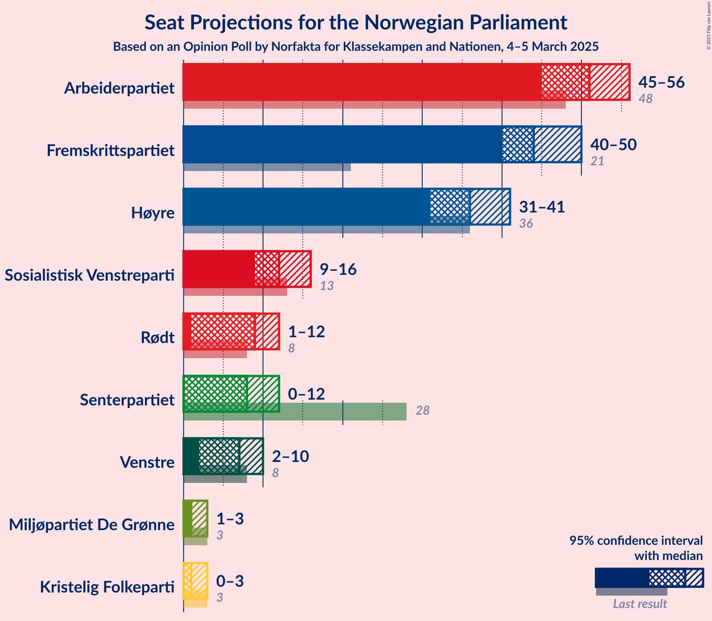
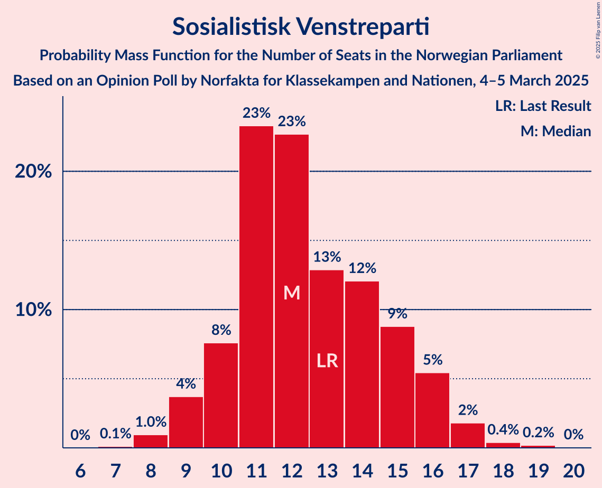
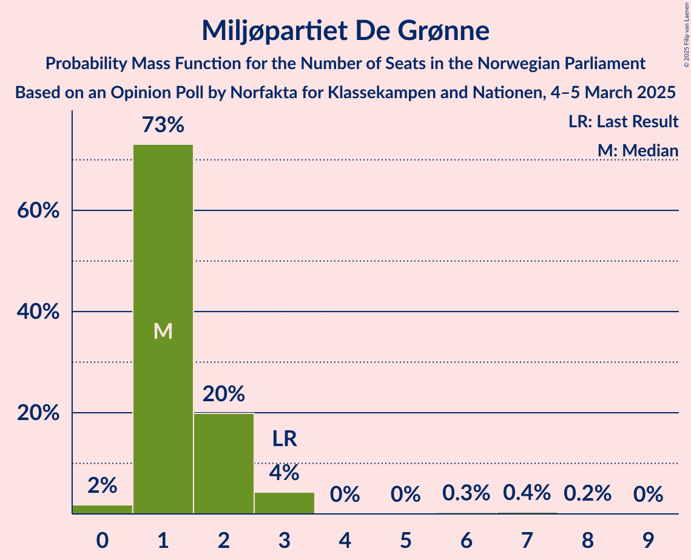
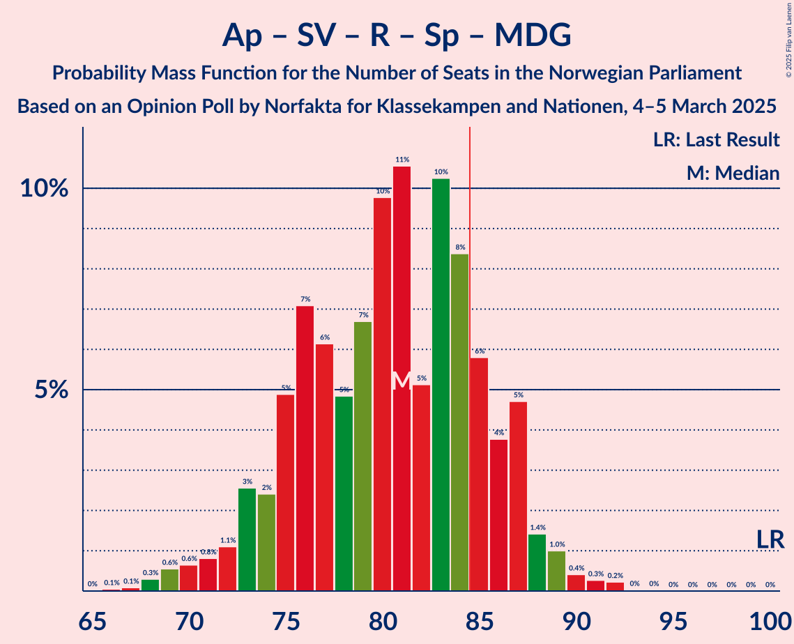
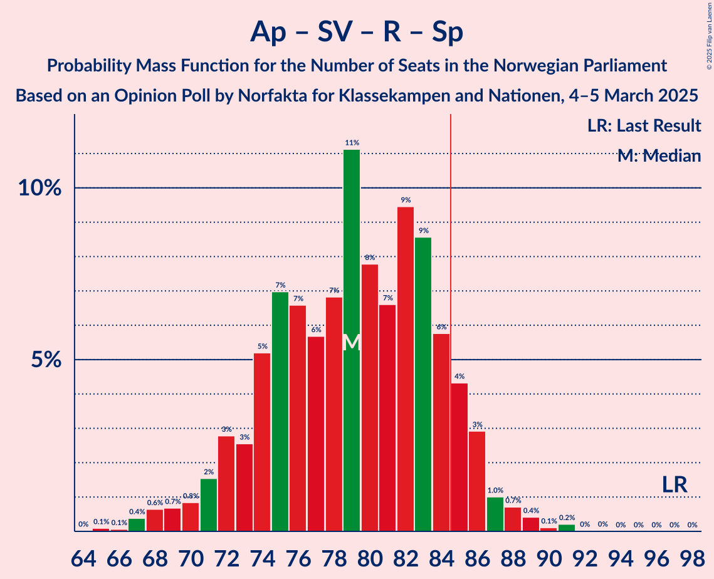
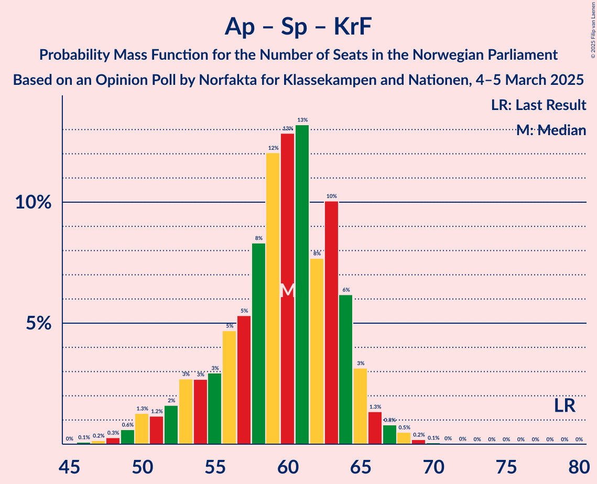

# Opinion Poll by Norfakta for Klassekampen and Nationen, 4–5 March 2025

<a href="#voting-intentions">Voting Intentions</a> | <a href="#seats">Seats</a> | <a href="#coalitions">Coalitions</a> | <a href="#technical-information">Technical Information</a>

## Voting Intentions

### Confidence Intervals

| Party | Last Result | Poll Result | 80% Confidence Interval | 90% Confidence Interval | 95% Confidence Interval | 99% Confidence Interval |
|:-----:|:-----------:|:-----------:|:-----------------------:|:-----------------------:|:-----------------------:|:-----------------------:|
| Arbeiderpartiet | 26.2% | 26.5% | 24.6–28.6% |24.1–29.2% |23.6–29.7% |22.7–30.7% |
| Fremskrittspartiet | 11.6% | 24.3% | 22.4–26.3% |21.9–26.9% |21.5–27.4% |20.6–28.3% |
| Høyre | 20.4% | 19.7% | 18.0–21.6% |17.5–22.1% |17.1–22.6% |16.3–23.5% |
| Sosialistisk Venstreparti | 7.6% | 7.2% | 6.1–8.4% |5.8–8.8% |5.6–9.1% |5.1–9.8% |
| Rødt | 4.7% | 5.1% | 4.2–6.2% |3.9–6.5% |3.7–6.8% |3.4–7.4% |
| Senterpartiet | 13.5% | 4.8% | 4.0–5.9% |3.7–6.2% |3.5–6.5% |3.2–7.1% |
| Venstre | 4.6% | 4.1% | 3.3–5.1% |3.1–5.4% |2.9–5.7% |2.6–6.2% |
| Kristelig Folkeparti | 3.8% | 2.6% | 2.0–3.5% |1.8–3.7% |1.7–3.9% |1.4–4.4% |
| Miljøpartiet De Grønne | 3.9% | 2.5% | 1.9–3.3% |1.7–3.6% |1.6–3.8% |1.4–4.2% |

*Note:* The poll result column reflects the actual value used in the calculations. Published results may vary slightly, and in addition be rounded to fewer digits.

## Seats

### Confidence Intervals

| Party | Last Result | Median | 80% Confidence Interval | 90% Confidence Interval | 95% Confidence Interval | 99% Confidence Interval |
|:-----:|:-----------:|:------:|:-----------------------:|:-----------------------:|:-----------------------:|:-----------------------:|
| <a href="#arbeiderpartiet">Arbeiderpartiet</a> | 48 | 51 | 47–54 |46–55 |44–56 |42–58 |
| <a href="#fremskrittspartiet">Fremskrittspartiet</a> | 21 | 44 | 42–48 |41–49 |40–50 |39–52 |
| <a href="#høyre">Høyre</a> | 36 | 36 | 32–40 |31–40 |31–41 |29–44 |
| <a href="#sosialistisk-venstreparti">Sosialistisk Venstreparti</a> | 13 | 12 | 10–15 |10–16 |9–16 |8–18 |
| <a href="#rødt">Rødt</a> | 8 | 9 | 7–11 |1–11 |1–12 |1–13 |
| <a href="#senterpartiet">Senterpartiet</a> | 28 | 8 | 0–11 |0–11 |0–12 |0–13 |
| <a href="#venstre">Venstre</a> | 8 | 7 | 2–9 |2–9 |2–10 |2–11 |
| <a href="#kristelig-folkeparti">Kristelig Folkeparti</a> | 3 | 1 | 0–3 |0–3 |0–3 |0–7 |
| <a href="#miljøpartiet-de-grønne">Miljøpartiet De Grønne</a> | 3 | 1 | 1–2 |1–3 |1–3 |0–7 |

### Arbeiderpartiet

*For a full overview of the results for this party, see the [Arbeiderpartiet](party-arbeiderpartiet.html) page.*

| Number of Seats | Probability | Accumulated | Special Marks |
|:---------------:|:-----------:|:-----------:|:-------------:|
| 40 | 0.1% | 100% |  |
| 41 | 0.2% | 99.9% |  |
| 42 | 0.6% | 99.7% |  |
| 43 | 0.6% | 99.1% |  |
| 44 | 1.0% | 98.5% |  |
| 45 | 2% | 97% |  |
| 46 | 4% | 96% |  |
| 47 | 3% | 91% |  |
| 48 | 12% | 88% | Last Result |
| 49 | 10% | 76% |  |
| 50 | 15% | 66% |  |
| 51 | 15% | 52% | Median |
| 52 | 14% | 36% |  |
| 53 | 5% | 22% |  |
| 54 | 7% | 17% |  |
| 55 | 5% | 10% |  |
| 56 | 3% | 5% |  |
| 57 | 0.8% | 2% |  |
| 58 | 0.4% | 0.7% |  |
| 59 | 0.2% | 0.3% |  |
| 60 | 0.1% | 0.2% |  |
| 61 | 0% | 0% |  |

### Fremskrittspartiet

*For a full overview of the results for this party, see the [Fremskrittspartiet](party-fremskrittspartiet.html) page.*

| Number of Seats | Probability | Accumulated | Special Marks |
|:---------------:|:-----------:|:-----------:|:-------------:|
| 21 | 0% | 100% | Last Result |
| 22 | 0% | 100% |  |
| 23 | 0% | 100% |  |
| 24 | 0% | 100% |  |
| 25 | 0% | 100% |  |
| 26 | 0% | 100% |  |
| 27 | 0% | 100% |  |
| 28 | 0% | 100% |  |
| 29 | 0% | 100% |  |
| 30 | 0% | 100% |  |
| 31 | 0% | 100% |  |
| 32 | 0% | 100% |  |
| 33 | 0% | 100% |  |
| 34 | 0% | 100% |  |
| 35 | 0% | 100% |  |
| 36 | 0% | 100% |  |
| 37 | 0% | 100% |  |
| 38 | 0.3% | 99.9% |  |
| 39 | 0.9% | 99.7% |  |
| 40 | 3% | 98.8% |  |
| 41 | 3% | 96% |  |
| 42 | 22% | 94% |  |
| 43 | 11% | 72% |  |
| 44 | 12% | 60% | Median |
| 45 | 12% | 48% |  |
| 46 | 10% | 36% |  |
| 47 | 5% | 27% |  |
| 48 | 14% | 22% |  |
| 49 | 4% | 8% |  |
| 50 | 2% | 3% |  |
| 51 | 0.4% | 1.5% |  |
| 52 | 0.7% | 1.0% |  |
| 53 | 0.2% | 0.4% |  |
| 54 | 0.1% | 0.2% |  |
| 55 | 0% | 0.1% |  |
| 56 | 0% | 0% |  |

### Høyre

*For a full overview of the results for this party, see the [Høyre](party-høyre.html) page.*

| Number of Seats | Probability | Accumulated | Special Marks |
|:---------------:|:-----------:|:-----------:|:-------------:|
| 27 | 0.1% | 100% |  |
| 28 | 0.1% | 99.9% |  |
| 29 | 0.5% | 99.8% |  |
| 30 | 1.1% | 99.3% |  |
| 31 | 5% | 98% |  |
| 32 | 7% | 93% |  |
| 33 | 9% | 86% |  |
| 34 | 12% | 77% |  |
| 35 | 4% | 64% |  |
| 36 | 15% | 60% | Last Result, Median |
| 37 | 14% | 45% |  |
| 38 | 10% | 31% |  |
| 39 | 10% | 21% |  |
| 40 | 7% | 11% |  |
| 41 | 1.4% | 4% |  |
| 42 | 0.9% | 2% |  |
| 43 | 0.4% | 1.4% |  |
| 44 | 0.7% | 1.0% |  |
| 45 | 0.2% | 0.3% |  |
| 46 | 0.1% | 0.1% |  |
| 47 | 0% | 0% |  |

### Sosialistisk Venstreparti

*For a full overview of the results for this party, see the [Sosialistisk Venstreparti](party-sosialistiskvenstreparti.html) page.*

| Number of Seats | Probability | Accumulated | Special Marks |
|:---------------:|:-----------:|:-----------:|:-------------:|
| 7 | 0.1% | 100% |  |
| 8 | 1.3% | 99.9% |  |
| 9 | 3% | 98.6% |  |
| 10 | 8% | 95% |  |
| 11 | 24% | 87% |  |
| 12 | 16% | 62% | Median |
| 13 | 16% | 46% | Last Result |
| 14 | 13% | 30% |  |
| 15 | 8% | 18% |  |
| 16 | 8% | 10% |  |
| 17 | 2% | 2% |  |
| 18 | 0.3% | 0.6% |  |
| 19 | 0.3% | 0.3% |  |
| 20 | 0% | 0.1% |  |
| 21 | 0% | 0% |  |

### Rødt

*For a full overview of the results for this party, see the [Rødt](party-rødt.html) page.*

| Number of Seats | Probability | Accumulated | Special Marks |
|:---------------:|:-----------:|:-----------:|:-------------:|
| 1 | 5% | 100% |  |
| 2 | 0.2% | 95% |  |
| 3 | 0% | 94% |  |
| 4 | 0% | 94% |  |
| 5 | 0% | 94% |  |
| 6 | 2% | 94% |  |
| 7 | 14% | 93% |  |
| 8 | 24% | 79% | Last Result |
| 9 | 23% | 54% | Median |
| 10 | 20% | 31% |  |
| 11 | 7% | 11% |  |
| 12 | 3% | 4% |  |
| 13 | 0.7% | 0.9% |  |
| 14 | 0.1% | 0.2% |  |
| 15 | 0.1% | 0.1% |  |
| 16 | 0% | 0% |  |

### Senterpartiet

*For a full overview of the results for this party, see the [Senterpartiet](party-senterpartiet.html) page.*

| Number of Seats | Probability | Accumulated | Special Marks |
|:---------------:|:-----------:|:-----------:|:-------------:|
| 0 | 11% | 100% |  |
| 1 | 1.4% | 89% |  |
| 2 | 0% | 87% |  |
| 3 | 0% | 87% |  |
| 4 | 0% | 87% |  |
| 5 | 0% | 87% |  |
| 6 | 8% | 87% |  |
| 7 | 14% | 79% |  |
| 8 | 23% | 65% | Median |
| 9 | 20% | 42% |  |
| 10 | 9% | 22% |  |
| 11 | 10% | 13% |  |
| 12 | 2% | 4% |  |
| 13 | 1.0% | 1.1% |  |
| 14 | 0.1% | 0.1% |  |
| 15 | 0% | 0% |  |
| 16 | 0% | 0% |  |
| 17 | 0% | 0% |  |
| 18 | 0% | 0% |  |
| 19 | 0% | 0% |  |
| 20 | 0% | 0% |  |
| 21 | 0% | 0% |  |
| 22 | 0% | 0% |  |
| 23 | 0% | 0% |  |
| 24 | 0% | 0% |  |
| 25 | 0% | 0% |  |
| 26 | 0% | 0% |  |
| 27 | 0% | 0% |  |
| 28 | 0% | 0% | Last Result |

### Venstre

*For a full overview of the results for this party, see the [Venstre](party-venstre.html) page.*

| Number of Seats | Probability | Accumulated | Special Marks |
|:---------------:|:-----------:|:-----------:|:-------------:|
| 1 | 0.1% | 100% |  |
| 2 | 14% | 99.9% |  |
| 3 | 30% | 86% |  |
| 4 | 0% | 56% |  |
| 5 | 0.1% | 56% |  |
| 6 | 4% | 56% |  |
| 7 | 22% | 52% | Median |
| 8 | 18% | 30% | Last Result |
| 9 | 7% | 12% |  |
| 10 | 4% | 5% |  |
| 11 | 0.5% | 0.7% |  |
| 12 | 0.1% | 0.2% |  |
| 13 | 0% | 0% |  |

### Kristelig Folkeparti

*For a full overview of the results for this party, see the [Kristelig Folkeparti](party-kristeligfolkeparti.html) page.*

| Number of Seats | Probability | Accumulated | Special Marks |
|:---------------:|:-----------:|:-----------:|:-------------:|
| 0 | 21% | 100% |  |
| 1 | 33% | 79% | Median |
| 2 | 34% | 46% |  |
| 3 | 11% | 12% | Last Result |
| 4 | 0% | 2% |  |
| 5 | 0% | 2% |  |
| 6 | 0.4% | 2% |  |
| 7 | 1.1% | 1.4% |  |
| 8 | 0.3% | 0.3% |  |
| 9 | 0% | 0% |  |

### Miljøpartiet De Grønne

*For a full overview of the results for this party, see the [Miljøpartiet De Grønne](party-miljøpartietdegrønne.html) page.*

| Number of Seats | Probability | Accumulated | Special Marks |
|:---------------:|:-----------:|:-----------:|:-------------:|
| 0 | 2% | 100% |  |
| 1 | 75% | 98% | Median |
| 2 | 17% | 22% |  |
| 3 | 4% | 5% | Last Result |
| 4 | 0% | 0.7% |  |
| 5 | 0% | 0.7% |  |
| 6 | 0.1% | 0.7% |  |
| 7 | 0.4% | 0.6% |  |
| 8 | 0.2% | 0.2% |  |
| 9 | 0% | 0% |  |

## Coalitions

### Confidence Intervals

| Coalition | Last Result | Median | Majority? | 80% Confidence Interval | 90% Confidence Interval | 95% Confidence Interval | 99% Confidence Interval |
|:---------:|:-----------:|:------:|:---------:|:-----------------------:|:-----------------------:|:-----------------------:|:-----------------------:|
| Fremskrittspartiet – Høyre – Senterpartiet – Venstre – Kristelig Folkeparti | 96 | 95 | 99.5% | 90–100 | 88–102 | 87–103 | 84–107 |
| Fremskrittspartiet – Høyre – Venstre – Kristelig Folkeparti – Miljøpartiet De Grønne | 71 | 88 | 86% | 84–94 | 83–96 | 81–97 | 78–100 |
| Fremskrittspartiet – Høyre – Venstre – Kristelig Folkeparti | 68 | 86 | 76% | 82–93 | 81–95 | 80–96 | 77–98 |
| Fremskrittspartiet – Høyre – Venstre | 65 | 86 | 58% | 81–91 | 80–94 | 79–95 | 76–97 |
| Fremskrittspartiet – Høyre | 57 | 80 | 12% | 75–85 | 74–87 | 73–88 | 72–93 |
| Arbeiderpartiet – Sosialistisk Venstreparti – Rødt – Senterpartiet – Miljøpartiet De Grønne | 100 | 80 | 18% | 75–86 | 73–87 | 72–88 | 68–90 |
| Arbeiderpartiet – Sosialistisk Venstreparti – Rødt – Senterpartiet | 97 | 79 | 11% | 73–85 | 72–86 | 70–86 | 67–89 |
| Arbeiderpartiet – Sosialistisk Venstreparti – Senterpartiet – Kristelig Folkeparti – Miljøpartiet De Grønne | 95 | 74 | 0.1% | 68–79 | 66–79 | 65–80 | 63–83 |
| Arbeiderpartiet – Sosialistisk Venstreparti – Rødt – Miljøpartiet De Grønne | 72 | 73 | 0.1% | 68–78 | 66–79 | 65–80 | 61–83 |
| Arbeiderpartiet – Sosialistisk Venstreparti – Senterpartiet – Miljøpartiet De Grønne | 92 | 72 | 0.1% | 66–77 | 65–78 | 64–79 | 61–82 |
| Arbeiderpartiet – Sosialistisk Venstreparti – Senterpartiet | 89 | 71 | 0% | 65–76 | 63–77 | 62–77 | 60–80 |
| Arbeiderpartiet – Sosialistisk Venstreparti | 61 | 63 | 0% | 59–67 | 58–68 | 57–70 | 54–73 |
| Arbeiderpartiet – Senterpartiet – Kristelig Folkeparti – Miljøpartiet De Grønne | 82 | 61 | 0% | 55–65 | 54–66 | 52–67 | 50–70 |
| Arbeiderpartiet – Senterpartiet – Kristelig Folkeparti | 79 | 60 | 0% | 54–64 | 52–65 | 50–66 | 49–68 |
| Arbeiderpartiet – Senterpartiet | 76 | 59 | 0% | 53–63 | 51–64 | 49–64 | 47–67 |
| Høyre – Venstre – Kristelig Folkeparti | 47 | 43 | 0% | 38–48 | 37–48 | 36–50 | 34–52 |
| Senterpartiet – Venstre – Kristelig Folkeparti | 39 | 15 | 0% | 10–19 | 8–21 | 4–21 | 2–23 |

### Fremskrittspartiet – Høyre – Senterpartiet – Venstre – Kristelig Folkeparti

| Number of Seats | Probability | Accumulated | Special Marks |
|:---------------:|:-----------:|:-----------:|:-------------:|
| 81 | 0% | 100% |  |
| 82 | 0.1% | 99.9% |  |
| 83 | 0.1% | 99.9% |  |
| 84 | 0.3% | 99.8% |  |
| 85 | 0.4% | 99.5% | Majority |
| 86 | 1.3% | 99.1% |  |
| 87 | 2% | 98% |  |
| 88 | 1.5% | 96% |  |
| 89 | 2% | 94% |  |
| 90 | 4% | 92% |  |
| 91 | 6% | 89% |  |
| 92 | 7% | 82% |  |
| 93 | 10% | 75% |  |
| 94 | 13% | 65% |  |
| 95 | 7% | 52% |  |
| 96 | 11% | 46% | Last Result, Median |
| 97 | 7% | 35% |  |
| 98 | 5% | 29% |  |
| 99 | 13% | 23% |  |
| 100 | 2% | 10% |  |
| 101 | 2% | 8% |  |
| 102 | 2% | 6% |  |
| 103 | 2% | 4% |  |
| 104 | 0.4% | 1.4% |  |
| 105 | 0.3% | 1.1% |  |
| 106 | 0.2% | 0.8% |  |
| 107 | 0.1% | 0.6% |  |
| 108 | 0.4% | 0.4% |  |
| 109 | 0% | 0% |  |

### Fremskrittspartiet – Høyre – Venstre – Kristelig Folkeparti – Miljøpartiet De Grønne

| Number of Seats | Probability | Accumulated | Special Marks |
|:---------------:|:-----------:|:-----------:|:-------------:|
| 71 | 0% | 100% | Last Result |
| 72 | 0% | 100% |  |
| 73 | 0% | 100% |  |
| 74 | 0% | 100% |  |
| 75 | 0% | 100% |  |
| 76 | 0.1% | 100% |  |
| 77 | 0.1% | 99.9% |  |
| 78 | 0.4% | 99.9% |  |
| 79 | 0.3% | 99.5% |  |
| 80 | 0.5% | 99.1% |  |
| 81 | 1.2% | 98.6% |  |
| 82 | 1.2% | 97% |  |
| 83 | 5% | 96% |  |
| 84 | 6% | 91% |  |
| 85 | 7% | 86% | Majority |
| 86 | 10% | 79% |  |
| 87 | 16% | 69% |  |
| 88 | 8% | 53% |  |
| 89 | 3% | 45% | Median |
| 90 | 7% | 42% |  |
| 91 | 7% | 35% |  |
| 92 | 4% | 28% |  |
| 93 | 6% | 24% |  |
| 94 | 9% | 18% |  |
| 95 | 2% | 9% |  |
| 96 | 2% | 7% |  |
| 97 | 3% | 5% |  |
| 98 | 1.3% | 2% |  |
| 99 | 0.6% | 1.2% |  |
| 100 | 0.3% | 0.6% |  |
| 101 | 0.1% | 0.3% |  |
| 102 | 0.2% | 0.2% |  |
| 103 | 0% | 0% |  |

### Fremskrittspartiet – Høyre – Venstre – Kristelig Folkeparti

| Number of Seats | Probability | Accumulated | Special Marks |
|:---------------:|:-----------:|:-----------:|:-------------:|
| 68 | 0% | 100% | Last Result |
| 69 | 0% | 100% |  |
| 70 | 0% | 100% |  |
| 71 | 0% | 100% |  |
| 72 | 0% | 100% |  |
| 73 | 0% | 100% |  |
| 74 | 0% | 100% |  |
| 75 | 0.1% | 100% |  |
| 76 | 0.1% | 99.9% |  |
| 77 | 0.5% | 99.8% |  |
| 78 | 0.2% | 99.3% |  |
| 79 | 0.8% | 99.1% |  |
| 80 | 2% | 98% |  |
| 81 | 2% | 97% |  |
| 82 | 7% | 95% |  |
| 83 | 4% | 88% |  |
| 84 | 8% | 84% |  |
| 85 | 10% | 76% | Majority |
| 86 | 16% | 66% |  |
| 87 | 6% | 50% |  |
| 88 | 4% | 44% | Median |
| 89 | 7% | 40% |  |
| 90 | 6% | 33% |  |
| 91 | 3% | 26% |  |
| 92 | 6% | 23% |  |
| 93 | 9% | 17% |  |
| 94 | 1.5% | 8% |  |
| 95 | 2% | 6% |  |
| 96 | 3% | 5% |  |
| 97 | 0.6% | 2% |  |
| 98 | 0.7% | 1.1% |  |
| 99 | 0.2% | 0.5% |  |
| 100 | 0% | 0.2% |  |
| 101 | 0.2% | 0.2% |  |
| 102 | 0% | 0% |  |

### Fremskrittspartiet – Høyre – Venstre

| Number of Seats | Probability | Accumulated | Special Marks |
|:---------------:|:-----------:|:-----------:|:-------------:|
| 65 | 0% | 100% | Last Result |
| 66 | 0% | 100% |  |
| 67 | 0% | 100% |  |
| 68 | 0% | 100% |  |
| 69 | 0% | 100% |  |
| 70 | 0% | 100% |  |
| 71 | 0% | 100% |  |
| 72 | 0% | 100% |  |
| 73 | 0% | 100% |  |
| 74 | 0.1% | 100% |  |
| 75 | 0.1% | 99.9% |  |
| 76 | 0.3% | 99.8% |  |
| 77 | 0.9% | 99.5% |  |
| 78 | 1.0% | 98.6% |  |
| 79 | 2% | 98% |  |
| 80 | 3% | 96% |  |
| 81 | 5% | 93% |  |
| 82 | 9% | 88% |  |
| 83 | 9% | 79% |  |
| 84 | 12% | 70% |  |
| 85 | 8% | 58% | Majority |
| 86 | 10% | 50% |  |
| 87 | 4% | 40% | Median |
| 88 | 6% | 36% |  |
| 89 | 5% | 31% |  |
| 90 | 3% | 25% |  |
| 91 | 12% | 22% |  |
| 92 | 4% | 10% |  |
| 93 | 1.0% | 6% |  |
| 94 | 1.4% | 5% |  |
| 95 | 2% | 4% |  |
| 96 | 1.0% | 2% |  |
| 97 | 0.4% | 0.8% |  |
| 98 | 0.3% | 0.4% |  |
| 99 | 0.1% | 0.1% |  |
| 100 | 0% | 0% |  |

### Fremskrittspartiet – Høyre

| Number of Seats | Probability | Accumulated | Special Marks |
|:---------------:|:-----------:|:-----------:|:-------------:|
| 57 | 0% | 100% | Last Result |
| 58 | 0% | 100% |  |
| 59 | 0% | 100% |  |
| 60 | 0% | 100% |  |
| 61 | 0% | 100% |  |
| 62 | 0% | 100% |  |
| 63 | 0% | 100% |  |
| 64 | 0% | 100% |  |
| 65 | 0% | 100% |  |
| 66 | 0% | 100% |  |
| 67 | 0% | 100% |  |
| 68 | 0% | 100% |  |
| 69 | 0% | 100% |  |
| 70 | 0.1% | 100% |  |
| 71 | 0.2% | 99.9% |  |
| 72 | 0.5% | 99.7% |  |
| 73 | 2% | 99.2% |  |
| 74 | 3% | 97% |  |
| 75 | 4% | 94% |  |
| 76 | 6% | 90% |  |
| 77 | 6% | 84% |  |
| 78 | 4% | 78% |  |
| 79 | 11% | 73% |  |
| 80 | 13% | 62% | Median |
| 81 | 10% | 49% |  |
| 82 | 7% | 39% |  |
| 83 | 5% | 32% |  |
| 84 | 14% | 27% |  |
| 85 | 3% | 12% | Majority |
| 86 | 2% | 9% |  |
| 87 | 4% | 7% |  |
| 88 | 1.0% | 3% |  |
| 89 | 0.5% | 2% |  |
| 90 | 0.4% | 2% |  |
| 91 | 0.6% | 1.3% |  |
| 92 | 0.1% | 0.7% |  |
| 93 | 0.4% | 0.6% |  |
| 94 | 0.2% | 0.2% |  |
| 95 | 0% | 0% |  |

### Arbeiderpartiet – Sosialistisk Venstreparti – Rødt – Senterpartiet – Miljøpartiet De Grønne

| Number of Seats | Probability | Accumulated | Special Marks |
|:---------------:|:-----------:|:-----------:|:-------------:|
| 65 | 0% | 100% |  |
| 66 | 0% | 99.9% |  |
| 67 | 0.1% | 99.9% |  |
| 68 | 0.3% | 99.8% |  |
| 69 | 0.2% | 99.5% |  |
| 70 | 0.6% | 99.3% |  |
| 71 | 1.1% | 98.7% |  |
| 72 | 1.4% | 98% |  |
| 73 | 4% | 96% |  |
| 74 | 2% | 93% |  |
| 75 | 4% | 90% |  |
| 76 | 11% | 87% |  |
| 77 | 8% | 75% |  |
| 78 | 4% | 67% |  |
| 79 | 7% | 63% |  |
| 80 | 8% | 56% |  |
| 81 | 3% | 49% | Median |
| 82 | 5% | 46% |  |
| 83 | 14% | 41% |  |
| 84 | 9% | 27% |  |
| 85 | 6% | 18% | Majority |
| 86 | 3% | 12% |  |
| 87 | 6% | 9% |  |
| 88 | 1.3% | 3% |  |
| 89 | 1.0% | 2% |  |
| 90 | 0.4% | 0.9% |  |
| 91 | 0.2% | 0.5% |  |
| 92 | 0.2% | 0.3% |  |
| 93 | 0% | 0.1% |  |
| 94 | 0% | 0% |  |
| 95 | 0% | 0% |  |
| 96 | 0% | 0% |  |
| 97 | 0% | 0% |  |
| 98 | 0% | 0% |  |
| 99 | 0% | 0% |  |
| 100 | 0% | 0% | Last Result |

### Arbeiderpartiet – Sosialistisk Venstreparti – Rødt – Senterpartiet

| Number of Seats | Probability | Accumulated | Special Marks |
|:---------------:|:-----------:|:-----------:|:-------------:|
| 64 | 0% | 100% |  |
| 65 | 0.1% | 99.9% |  |
| 66 | 0% | 99.8% |  |
| 67 | 0.4% | 99.8% |  |
| 68 | 0.2% | 99.4% |  |
| 69 | 0.8% | 99.2% |  |
| 70 | 1.1% | 98% |  |
| 71 | 2% | 97% |  |
| 72 | 3% | 95% |  |
| 73 | 2% | 92% |  |
| 74 | 4% | 89% |  |
| 75 | 11% | 85% |  |
| 76 | 8% | 74% |  |
| 77 | 4% | 66% |  |
| 78 | 7% | 62% |  |
| 79 | 7% | 54% |  |
| 80 | 3% | 47% | Median |
| 81 | 7% | 44% |  |
| 82 | 13% | 38% |  |
| 83 | 9% | 25% |  |
| 84 | 5% | 16% |  |
| 85 | 5% | 11% | Majority |
| 86 | 4% | 6% |  |
| 87 | 0.6% | 2% |  |
| 88 | 0.6% | 1.3% |  |
| 89 | 0.3% | 0.7% |  |
| 90 | 0.1% | 0.4% |  |
| 91 | 0.2% | 0.3% |  |
| 92 | 0% | 0.1% |  |
| 93 | 0% | 0% |  |
| 94 | 0% | 0% |  |
| 95 | 0% | 0% |  |
| 96 | 0% | 0% |  |
| 97 | 0% | 0% | Last Result |

### Arbeiderpartiet – Sosialistisk Venstreparti – Senterpartiet – Kristelig Folkeparti – Miljøpartiet De Grønne

| Number of Seats | Probability | Accumulated | Special Marks |
|:---------------:|:-----------:|:-----------:|:-------------:|
| 60 | 0.1% | 100% |  |
| 61 | 0.1% | 99.8% |  |
| 62 | 0.1% | 99.7% |  |
| 63 | 0.5% | 99.6% |  |
| 64 | 1.3% | 99.1% |  |
| 65 | 2% | 98% |  |
| 66 | 4% | 96% |  |
| 67 | 2% | 92% |  |
| 68 | 4% | 91% |  |
| 69 | 5% | 87% |  |
| 70 | 7% | 81% |  |
| 71 | 10% | 74% |  |
| 72 | 6% | 64% |  |
| 73 | 7% | 58% | Median |
| 74 | 7% | 51% |  |
| 75 | 12% | 44% |  |
| 76 | 9% | 32% |  |
| 77 | 6% | 24% |  |
| 78 | 7% | 18% |  |
| 79 | 6% | 11% |  |
| 80 | 2% | 5% |  |
| 81 | 1.0% | 2% |  |
| 82 | 0.7% | 1.5% |  |
| 83 | 0.4% | 0.8% |  |
| 84 | 0.3% | 0.4% |  |
| 85 | 0.1% | 0.1% | Majority |
| 86 | 0.1% | 0.1% |  |
| 87 | 0% | 0% |  |
| 88 | 0% | 0% |  |
| 89 | 0% | 0% |  |
| 90 | 0% | 0% |  |
| 91 | 0% | 0% |  |
| 92 | 0% | 0% |  |
| 93 | 0% | 0% |  |
| 94 | 0% | 0% |  |
| 95 | 0% | 0% | Last Result |

### Arbeiderpartiet – Sosialistisk Venstreparti – Rødt – Miljøpartiet De Grønne

| Number of Seats | Probability | Accumulated | Special Marks |
|:---------------:|:-----------:|:-----------:|:-------------:|
| 59 | 0% | 100% |  |
| 60 | 0.1% | 99.9% |  |
| 61 | 0.5% | 99.9% |  |
| 62 | 0.4% | 99.4% |  |
| 63 | 0.5% | 99.0% |  |
| 64 | 0.5% | 98% |  |
| 65 | 1.1% | 98% |  |
| 66 | 3% | 97% |  |
| 67 | 3% | 94% |  |
| 68 | 3% | 91% |  |
| 69 | 5% | 88% |  |
| 70 | 14% | 83% |  |
| 71 | 6% | 69% |  |
| 72 | 7% | 62% | Last Result |
| 73 | 11% | 56% | Median |
| 74 | 7% | 44% |  |
| 75 | 12% | 37% |  |
| 76 | 9% | 26% |  |
| 77 | 6% | 17% |  |
| 78 | 5% | 10% |  |
| 79 | 3% | 5% |  |
| 80 | 0.7% | 3% |  |
| 81 | 0.7% | 2% |  |
| 82 | 0.3% | 1.2% |  |
| 83 | 0.7% | 0.9% |  |
| 84 | 0.1% | 0.2% |  |
| 85 | 0.1% | 0.1% | Majority |
| 86 | 0% | 0.1% |  |
| 87 | 0% | 0% |  |

### Arbeiderpartiet – Sosialistisk Venstreparti – Senterpartiet – Miljøpartiet De Grønne

| Number of Seats | Probability | Accumulated | Special Marks |
|:---------------:|:-----------:|:-----------:|:-------------:|
| 58 | 0.1% | 100% |  |
| 59 | 0.1% | 99.9% |  |
| 60 | 0.2% | 99.8% |  |
| 61 | 0.4% | 99.7% |  |
| 62 | 0.6% | 99.3% |  |
| 63 | 0.7% | 98.8% |  |
| 64 | 3% | 98% |  |
| 65 | 4% | 96% |  |
| 66 | 1.4% | 91% |  |
| 67 | 5% | 90% |  |
| 68 | 5% | 85% |  |
| 69 | 13% | 80% |  |
| 70 | 5% | 67% |  |
| 71 | 7% | 62% |  |
| 72 | 8% | 56% | Median |
| 73 | 9% | 48% |  |
| 74 | 11% | 39% |  |
| 75 | 5% | 27% |  |
| 76 | 10% | 22% |  |
| 77 | 4% | 12% |  |
| 78 | 4% | 8% |  |
| 79 | 2% | 4% |  |
| 80 | 0.8% | 2% |  |
| 81 | 0.4% | 1.0% |  |
| 82 | 0.3% | 0.6% |  |
| 83 | 0.2% | 0.3% |  |
| 84 | 0% | 0.1% |  |
| 85 | 0% | 0.1% | Majority |
| 86 | 0% | 0% |  |
| 87 | 0% | 0% |  |
| 88 | 0% | 0% |  |
| 89 | 0% | 0% |  |
| 90 | 0% | 0% |  |
| 91 | 0% | 0% |  |
| 92 | 0% | 0% | Last Result |

### Arbeiderpartiet – Sosialistisk Venstreparti – Senterpartiet

| Number of Seats | Probability | Accumulated | Special Marks |
|:---------------:|:-----------:|:-----------:|:-------------:|
| 56 | 0.1% | 100% |  |
| 57 | 0% | 99.9% |  |
| 58 | 0.1% | 99.9% |  |
| 59 | 0.2% | 99.8% |  |
| 60 | 0.3% | 99.6% |  |
| 61 | 0.8% | 99.3% |  |
| 62 | 1.3% | 98% |  |
| 63 | 2% | 97% |  |
| 64 | 4% | 95% |  |
| 65 | 2% | 91% |  |
| 66 | 5% | 89% |  |
| 67 | 5% | 84% |  |
| 68 | 14% | 79% |  |
| 69 | 5% | 65% |  |
| 70 | 6% | 60% |  |
| 71 | 10% | 54% | Median |
| 72 | 8% | 45% |  |
| 73 | 12% | 37% |  |
| 74 | 5% | 24% |  |
| 75 | 9% | 19% |  |
| 76 | 5% | 11% |  |
| 77 | 3% | 6% |  |
| 78 | 1.0% | 2% |  |
| 79 | 0.6% | 1.4% |  |
| 80 | 0.3% | 0.8% |  |
| 81 | 0.3% | 0.4% |  |
| 82 | 0.1% | 0.1% |  |
| 83 | 0% | 0.1% |  |
| 84 | 0% | 0.1% |  |
| 85 | 0% | 0% | Majority |
| 86 | 0% | 0% |  |
| 87 | 0% | 0% |  |
| 88 | 0% | 0% |  |
| 89 | 0% | 0% | Last Result |

### Arbeiderpartiet – Sosialistisk Venstreparti

| Number of Seats | Probability | Accumulated | Special Marks |
|:---------------:|:-----------:|:-----------:|:-------------:|
| 52 | 0.1% | 100% |  |
| 53 | 0.2% | 99.8% |  |
| 54 | 0.2% | 99.6% |  |
| 55 | 0.7% | 99.4% |  |
| 56 | 1.1% | 98.7% |  |
| 57 | 3% | 98% |  |
| 58 | 4% | 95% |  |
| 59 | 5% | 91% |  |
| 60 | 3% | 86% |  |
| 61 | 13% | 83% | Last Result |
| 62 | 17% | 70% |  |
| 63 | 9% | 53% | Median |
| 64 | 12% | 43% |  |
| 65 | 6% | 32% |  |
| 66 | 11% | 25% |  |
| 67 | 6% | 15% |  |
| 68 | 4% | 9% |  |
| 69 | 2% | 4% |  |
| 70 | 1.0% | 3% |  |
| 71 | 0.9% | 2% |  |
| 72 | 0.3% | 0.8% |  |
| 73 | 0.4% | 0.5% |  |
| 74 | 0% | 0.1% |  |
| 75 | 0% | 0.1% |  |
| 76 | 0.1% | 0.1% |  |
| 77 | 0% | 0% |  |

### Arbeiderpartiet – Senterpartiet – Kristelig Folkeparti – Miljøpartiet De Grønne

| Number of Seats | Probability | Accumulated | Special Marks |
|:---------------:|:-----------:|:-----------:|:-------------:|
| 46 | 0% | 100% |  |
| 47 | 0.1% | 99.9% |  |
| 48 | 0.1% | 99.9% |  |
| 49 | 0.1% | 99.8% |  |
| 50 | 0.8% | 99.7% |  |
| 51 | 1.0% | 98.9% |  |
| 52 | 1.0% | 98% |  |
| 53 | 2% | 97% |  |
| 54 | 3% | 95% |  |
| 55 | 3% | 93% |  |
| 56 | 5% | 90% |  |
| 57 | 3% | 85% |  |
| 58 | 5% | 83% |  |
| 59 | 10% | 78% |  |
| 60 | 12% | 68% |  |
| 61 | 8% | 56% | Median |
| 62 | 17% | 48% |  |
| 63 | 4% | 31% |  |
| 64 | 11% | 27% |  |
| 65 | 8% | 16% |  |
| 66 | 4% | 9% |  |
| 67 | 3% | 5% |  |
| 68 | 0.9% | 2% |  |
| 69 | 0.5% | 1.2% |  |
| 70 | 0.4% | 0.7% |  |
| 71 | 0.2% | 0.3% |  |
| 72 | 0.1% | 0.1% |  |
| 73 | 0% | 0% |  |
| 74 | 0% | 0% |  |
| 75 | 0% | 0% |  |
| 76 | 0% | 0% |  |
| 77 | 0% | 0% |  |
| 78 | 0% | 0% |  |
| 79 | 0% | 0% |  |
| 80 | 0% | 0% |  |
| 81 | 0% | 0% |  |
| 82 | 0% | 0% | Last Result |

### Arbeiderpartiet – Senterpartiet – Kristelig Folkeparti

| Number of Seats | Probability | Accumulated | Special Marks |
|:---------------:|:-----------:|:-----------:|:-------------:|
| 45 | 0% | 100% |  |
| 46 | 0.1% | 99.9% |  |
| 47 | 0.1% | 99.9% |  |
| 48 | 0.2% | 99.8% |  |
| 49 | 0.7% | 99.6% |  |
| 50 | 2% | 98.8% |  |
| 51 | 0.6% | 97% |  |
| 52 | 2% | 97% |  |
| 53 | 3% | 95% |  |
| 54 | 4% | 92% |  |
| 55 | 4% | 88% |  |
| 56 | 2% | 84% |  |
| 57 | 6% | 82% |  |
| 58 | 9% | 76% |  |
| 59 | 13% | 67% |  |
| 60 | 9% | 53% | Median |
| 61 | 15% | 45% |  |
| 62 | 8% | 30% |  |
| 63 | 8% | 22% |  |
| 64 | 8% | 14% |  |
| 65 | 3% | 6% |  |
| 66 | 2% | 3% |  |
| 67 | 0.6% | 1.4% |  |
| 68 | 0.4% | 0.8% |  |
| 69 | 0.2% | 0.4% |  |
| 70 | 0.1% | 0.2% |  |
| 71 | 0.1% | 0.1% |  |
| 72 | 0% | 0% |  |
| 73 | 0% | 0% |  |
| 74 | 0% | 0% |  |
| 75 | 0% | 0% |  |
| 76 | 0% | 0% |  |
| 77 | 0% | 0% |  |
| 78 | 0% | 0% |  |
| 79 | 0% | 0% | Last Result |

### Arbeiderpartiet – Senterpartiet

| Number of Seats | Probability | Accumulated | Special Marks |
|:---------------:|:-----------:|:-----------:|:-------------:|
| 44 | 0% | 100% |  |
| 45 | 0.1% | 99.9% |  |
| 46 | 0.2% | 99.9% |  |
| 47 | 0.2% | 99.6% |  |
| 48 | 0.8% | 99.4% |  |
| 49 | 1.3% | 98.6% |  |
| 50 | 2% | 97% |  |
| 51 | 2% | 96% |  |
| 52 | 3% | 94% |  |
| 53 | 3% | 91% |  |
| 54 | 5% | 88% |  |
| 55 | 2% | 83% |  |
| 56 | 5% | 80% |  |
| 57 | 16% | 75% |  |
| 58 | 8% | 59% |  |
| 59 | 18% | 51% | Median |
| 60 | 9% | 34% |  |
| 61 | 7% | 24% |  |
| 62 | 6% | 18% |  |
| 63 | 6% | 12% |  |
| 64 | 4% | 6% |  |
| 65 | 0.7% | 2% |  |
| 66 | 0.5% | 1.1% |  |
| 67 | 0.3% | 0.6% |  |
| 68 | 0.2% | 0.3% |  |
| 69 | 0% | 0.1% |  |
| 70 | 0% | 0.1% |  |
| 71 | 0% | 0% |  |
| 72 | 0% | 0% |  |
| 73 | 0% | 0% |  |
| 74 | 0% | 0% |  |
| 75 | 0% | 0% |  |
| 76 | 0% | 0% | Last Result |

### Høyre – Venstre – Kristelig Folkeparti

| Number of Seats | Probability | Accumulated | Special Marks |
|:---------------:|:-----------:|:-----------:|:-------------:|
| 32 | 0.1% | 100% |  |
| 33 | 0.1% | 99.9% |  |
| 34 | 0.7% | 99.8% |  |
| 35 | 1.0% | 99.1% |  |
| 36 | 2% | 98% |  |
| 37 | 3% | 96% |  |
| 38 | 6% | 92% |  |
| 39 | 4% | 87% |  |
| 40 | 9% | 83% |  |
| 41 | 9% | 74% |  |
| 42 | 14% | 66% |  |
| 43 | 8% | 52% |  |
| 44 | 10% | 43% | Median |
| 45 | 9% | 34% |  |
| 46 | 6% | 25% |  |
| 47 | 7% | 19% | Last Result |
| 48 | 8% | 12% |  |
| 49 | 2% | 5% |  |
| 50 | 1.3% | 3% |  |
| 51 | 0.5% | 1.3% |  |
| 52 | 0.4% | 0.8% |  |
| 53 | 0.3% | 0.4% |  |
| 54 | 0.1% | 0.1% |  |
| 55 | 0% | 0% |  |

### Senterpartiet – Venstre – Kristelig Folkeparti

| Number of Seats | Probability | Accumulated | Special Marks |
|:---------------:|:-----------:|:-----------:|:-------------:|
| 2 | 0.5% | 100% |  |
| 3 | 0.9% | 99.5% |  |
| 4 | 1.1% | 98.5% |  |
| 5 | 1.1% | 97% |  |
| 6 | 0.2% | 96% |  |
| 7 | 0.4% | 96% |  |
| 8 | 2% | 96% |  |
| 9 | 3% | 94% |  |
| 10 | 4% | 91% |  |
| 11 | 6% | 87% |  |
| 12 | 8% | 82% |  |
| 13 | 10% | 74% |  |
| 14 | 10% | 64% |  |
| 15 | 17% | 54% |  |
| 16 | 12% | 37% | Median |
| 17 | 5% | 26% |  |
| 18 | 5% | 21% |  |
| 19 | 6% | 15% |  |
| 20 | 4% | 9% |  |
| 21 | 3% | 5% |  |
| 22 | 1.4% | 2% |  |
| 23 | 0.6% | 0.9% |  |
| 24 | 0.1% | 0.3% |  |
| 25 | 0.1% | 0.2% |  |
| 26 | 0% | 0% |  |
| 27 | 0% | 0% |  |
| 28 | 0% | 0% |  |
| 29 | 0% | 0% |  |
| 30 | 0% | 0% |  |
| 31 | 0% | 0% |  |
| 32 | 0% | 0% |  |
| 33 | 0% | 0% |  |
| 34 | 0% | 0% |  |
| 35 | 0% | 0% |  |
| 36 | 0% | 0% |  |
| 37 | 0% | 0% |  |
| 38 | 0% | 0% |  |
| 39 | 0% | 0% | Last Result |

## Technical Information

### Opinion Poll

+ **Polling firm:** Norfakta
+ **Commissioner(s):** Klassekampen and Nationen
+ **Fieldwork period:** 4–5 March 2025

### Calculations

+ **Sample size:** 811
+ **Simulations done:** 1,048,576
+ **Error estimate:** 1.71%

