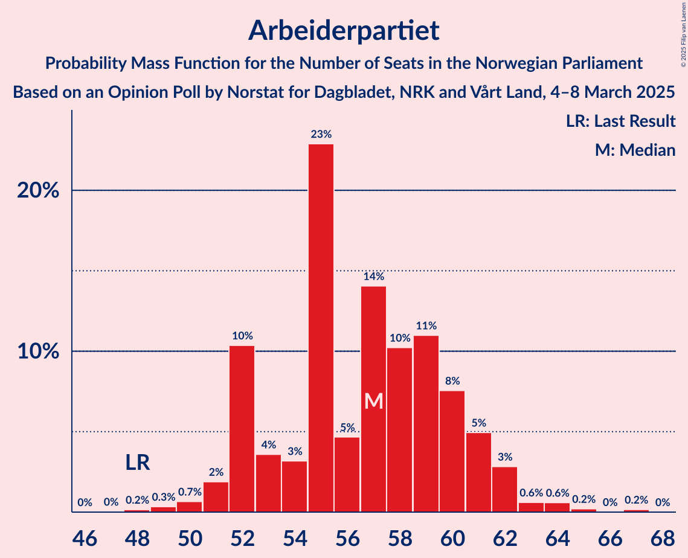
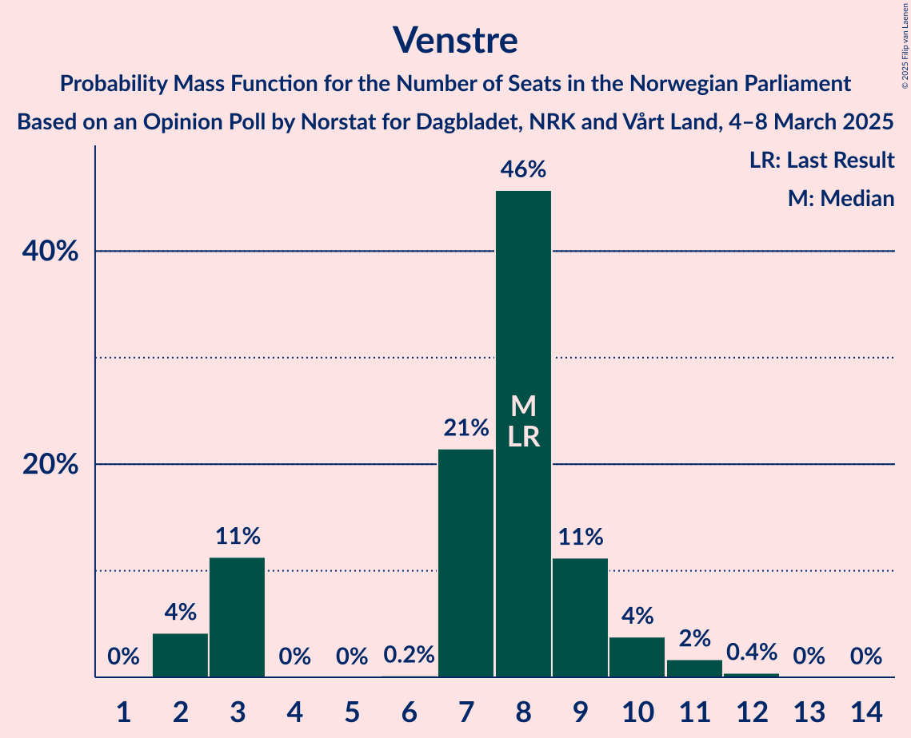
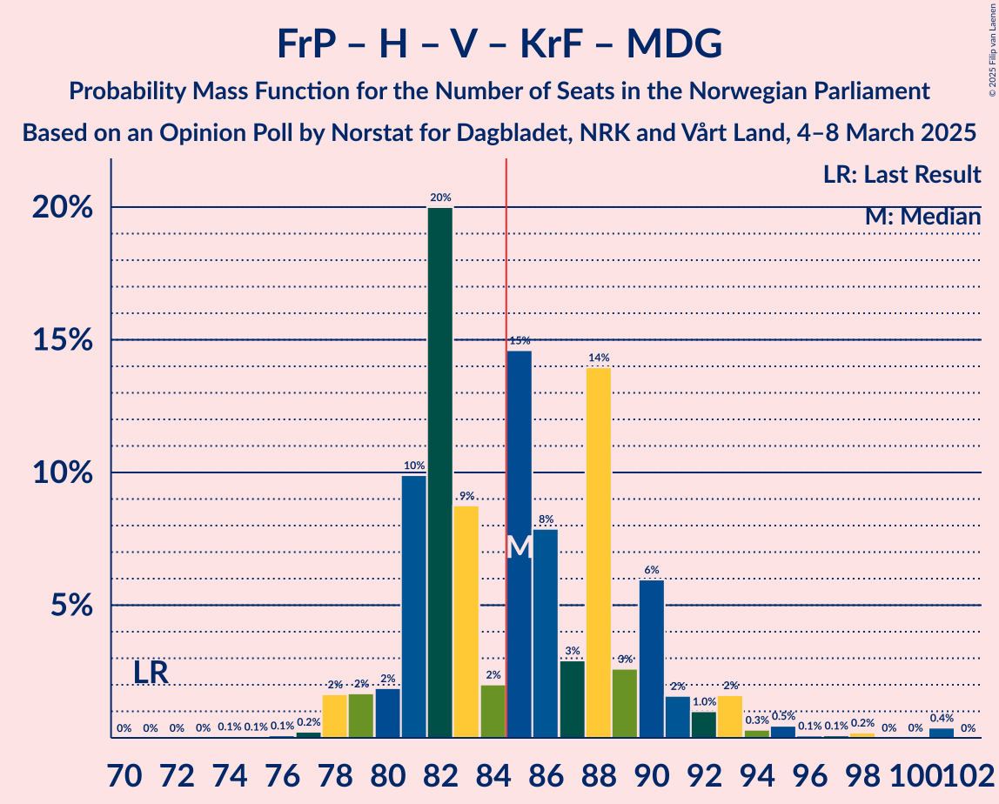
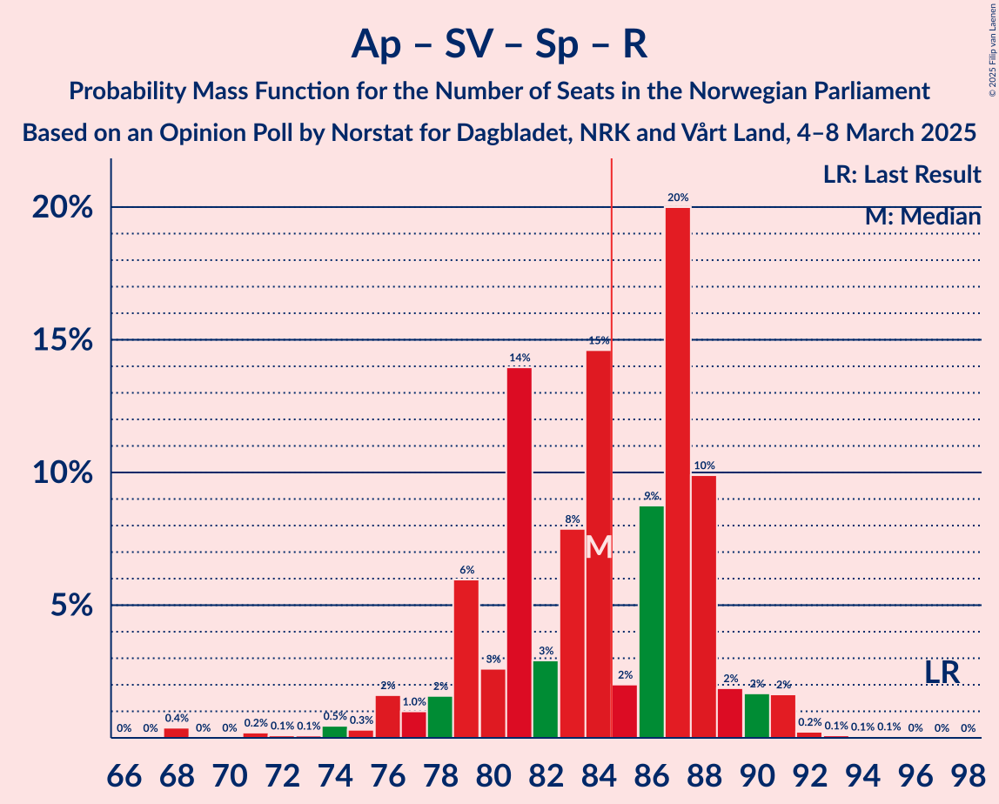
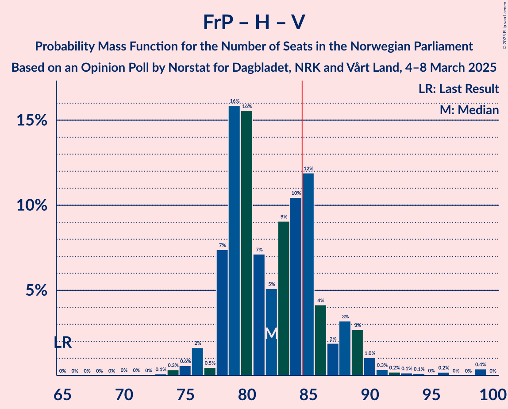
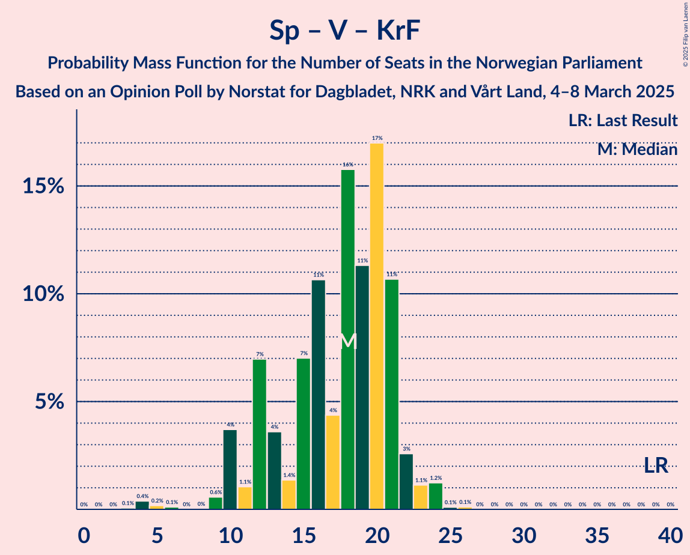

# Opinion Poll by Norstat for Dagbladet, NRK and Vårt Land, 4–8 March 2025

<a href="#voting-intentions">Voting Intentions</a> | <a href="#seats">Seats</a> | <a href="#coalitions">Coalitions</a> | <a href="#technical-information">Technical Information</a>

## Voting Intentions

### Confidence Intervals

| Party | Last Result | Poll Result | 80% Confidence Interval | 90% Confidence Interval | 95% Confidence Interval | 99% Confidence Interval |
|:-----:|:-----------:|:-----------:|:-----------------------:|:-----------------------:|:-----------------------:|:-----------------------:|
| Arbeiderpartiet | 26.2% | 30.1% | 28.3–32.0% |27.8–32.6% |27.3–33.1% |26.5–34.0% |
| Fremskrittspartiet | 11.6% | 23.0% | 21.3–24.8% |20.9–25.3% |20.5–25.7% |19.7–26.6% |
| Høyre | 20.4% | 18.1% | 16.6–19.8% |16.2–20.2% |15.8–20.7% |15.1–21.5% |
| Sosialistisk Venstreparti | 7.6% | 6.4% | 5.5–7.5% |5.3–7.8% |5.0–8.1% |4.6–8.7% |
| Senterpartiet | 13.5% | 5.0% | 4.2–6.0% |4.0–6.3% |3.8–6.5% |3.4–7.1% |
| Rødt | 4.7% | 4.5% | 3.7–5.4% |3.5–5.7% |3.4–6.0% |3.0–6.5% |
| Venstre | 4.6% | 4.4% | 3.6–5.3% |3.4–5.6% |3.3–5.9% |2.9–6.3% |
| Kristelig Folkeparti | 3.8% | 2.6% | 2.1–3.4% |1.9–3.7% |1.8–3.9% |1.6–4.3% |
| Miljøpartiet De Grønne | 3.9% | 2.5% | 2.0–3.3% |1.8–3.5% |1.7–3.7% |1.5–4.1% |
| Konservativt | 0.4% | 0.8% | 0.5–1.3% |0.5–1.5% |0.4–1.6% |0.3–1.9% |
| Industri- og Næringspartiet | 0.3% | 0.8% | 0.5–1.3% |0.5–1.5% |0.4–1.6% |0.3–1.9% |
| Pensjonistpartiet | 0.6% | 0.3% | 0.2–0.7% |0.1–0.8% |0.1–0.9% |0.1–1.1% |

*Note:* The poll result column reflects the actual value used in the calculations. Published results may vary slightly, and in addition be rounded to fewer digits.

## Seats

### Confidence Intervals

| Party | Last Result | Median | 80% Confidence Interval | 90% Confidence Interval | 95% Confidence Interval | 99% Confidence Interval |
|:-----:|:-----------:|:------:|:-----------------------:|:-----------------------:|:-----------------------:|:-----------------------:|
| <a href="#arbeiderpartiet">Arbeiderpartiet</a> | 48 | 57 | 54–61 |52–62 |51–62 |50–64 |
| <a href="#fremskrittspartiet">Fremskrittspartiet</a> | 21 | 41 | 40–46 |40–47 |39–48 |38–50 |
| <a href="#høyre">Høyre</a> | 36 | 32 | 31–36 |29–39 |28–40 |26–44 |
| <a href="#sosialistisk-venstreparti">Sosialistisk Venstreparti</a> | 13 | 11 | 10–13 |9–14 |8–14 |8–16 |
| <a href="#senterpartiet">Senterpartiet</a> | 28 | 9 | 1–11 |1–11 |0–12 |0–14 |
| <a href="#rødt">Rødt</a> | 8 | 8 | 1–10 |1–11 |1–11 |1–12 |
| <a href="#venstre">Venstre</a> | 8 | 8 | 3–9 |2–10 |2–11 |2–11 |
| <a href="#kristelig-folkeparti">Kristelig Folkeparti</a> | 3 | 1 | 0–3 |0–3 |0–7 |0–8 |
| <a href="#miljøpartiet-de-grønne">Miljøpartiet De Grønne</a> | 3 | 1 | 1–2 |1–3 |1–3 |0–4 |
| <a href="#konservativt">Konservativt</a> | 0 | 0 | 0 |0 |0 |0 |
| <a href="#industri--og-næringspartiet">Industri- og Næringspartiet</a> | 0 | 0 | 0 |0 |0 |0 |
| <a href="#pensjonistpartiet">Pensjonistpartiet</a> | 0 | 0 | 0 |0 |0 |0 |

### Arbeiderpartiet

*For a full overview of the results for this party, see the [Arbeiderpartiet](party-arbeiderpartiet.html) page.*

| Number of Seats | Probability | Accumulated | Special Marks |
|:---------------:|:-----------:|:-----------:|:-------------:|
| 48 | 0.1% | 100% | Last Result |
| 49 | 0.3% | 99.9% |  |
| 50 | 1.0% | 99.6% |  |
| 51 | 2% | 98.6% |  |
| 52 | 2% | 97% |  |
| 53 | 4% | 95% |  |
| 54 | 3% | 91% |  |
| 55 | 29% | 88% |  |
| 56 | 8% | 59% |  |
| 57 | 11% | 51% | Median |
| 58 | 11% | 40% |  |
| 59 | 5% | 30% |  |
| 60 | 7% | 25% |  |
| 61 | 10% | 18% |  |
| 62 | 6% | 8% |  |
| 63 | 0.3% | 1.4% |  |
| 64 | 1.0% | 1.1% |  |
| 65 | 0% | 0.1% |  |
| 66 | 0% | 0.1% |  |
| 67 | 0.1% | 0.1% |  |
| 68 | 0% | 0% |  |

### Fremskrittspartiet

*For a full overview of the results for this party, see the [Fremskrittspartiet](party-fremskrittspartiet.html) page.*

| Number of Seats | Probability | Accumulated | Special Marks |
|:---------------:|:-----------:|:-----------:|:-------------:|
| 21 | 0% | 100% | Last Result |
| 22 | 0% | 100% |  |
| 23 | 0% | 100% |  |
| 24 | 0% | 100% |  |
| 25 | 0% | 100% |  |
| 26 | 0% | 100% |  |
| 27 | 0% | 100% |  |
| 28 | 0% | 100% |  |
| 29 | 0% | 100% |  |
| 30 | 0% | 100% |  |
| 31 | 0% | 100% |  |
| 32 | 0% | 100% |  |
| 33 | 0% | 100% |  |
| 34 | 0% | 100% |  |
| 35 | 0.1% | 100% |  |
| 36 | 0.1% | 99.9% |  |
| 37 | 0.1% | 99.8% |  |
| 38 | 0.4% | 99.7% |  |
| 39 | 4% | 99.3% |  |
| 40 | 30% | 95% |  |
| 41 | 27% | 65% | Median |
| 42 | 6% | 37% |  |
| 43 | 9% | 31% |  |
| 44 | 6% | 23% |  |
| 45 | 6% | 17% |  |
| 46 | 3% | 11% |  |
| 47 | 5% | 8% |  |
| 48 | 3% | 3% |  |
| 49 | 0.2% | 0.8% |  |
| 50 | 0.2% | 0.6% |  |
| 51 | 0.3% | 0.4% |  |
| 52 | 0% | 0.1% |  |
| 53 | 0% | 0% |  |

### Høyre

*For a full overview of the results for this party, see the [Høyre](party-høyre.html) page.*

| Number of Seats | Probability | Accumulated | Special Marks |
|:---------------:|:-----------:|:-----------:|:-------------:|
| 24 | 0.1% | 100% |  |
| 25 | 0.1% | 99.9% |  |
| 26 | 0.3% | 99.7% |  |
| 27 | 0.2% | 99.4% |  |
| 28 | 4% | 99.2% |  |
| 29 | 2% | 95% |  |
| 30 | 2% | 93% |  |
| 31 | 11% | 91% |  |
| 32 | 45% | 79% | Median |
| 33 | 5% | 35% |  |
| 34 | 7% | 29% |  |
| 35 | 9% | 22% |  |
| 36 | 5% | 13% | Last Result |
| 37 | 1.2% | 8% |  |
| 38 | 1.2% | 7% |  |
| 39 | 2% | 6% |  |
| 40 | 3% | 4% |  |
| 41 | 0.1% | 1.0% |  |
| 42 | 0% | 0.9% |  |
| 43 | 0% | 0.9% |  |
| 44 | 0.9% | 0.9% |  |
| 45 | 0% | 0% |  |

### Sosialistisk Venstreparti

*For a full overview of the results for this party, see the [Sosialistisk Venstreparti](party-sosialistiskvenstreparti.html) page.*

| Number of Seats | Probability | Accumulated | Special Marks |
|:---------------:|:-----------:|:-----------:|:-------------:|
| 7 | 0.1% | 100% |  |
| 8 | 3% | 99.9% |  |
| 9 | 6% | 97% |  |
| 10 | 25% | 91% |  |
| 11 | 21% | 67% | Median |
| 12 | 8% | 46% |  |
| 13 | 30% | 38% | Last Result |
| 14 | 7% | 8% |  |
| 15 | 0.8% | 1.4% |  |
| 16 | 0.5% | 0.6% |  |
| 17 | 0.2% | 0.2% |  |
| 18 | 0% | 0% |  |

### Senterpartiet

*For a full overview of the results for this party, see the [Senterpartiet](party-senterpartiet.html) page.*

| Number of Seats | Probability | Accumulated | Special Marks |
|:---------------:|:-----------:|:-----------:|:-------------:|
| 0 | 5% | 100% |  |
| 1 | 7% | 95% |  |
| 2 | 0% | 88% |  |
| 3 | 0% | 88% |  |
| 4 | 0% | 88% |  |
| 5 | 0% | 88% |  |
| 6 | 0.1% | 88% |  |
| 7 | 5% | 88% |  |
| 8 | 29% | 83% |  |
| 9 | 30% | 54% | Median |
| 10 | 10% | 24% |  |
| 11 | 10% | 14% |  |
| 12 | 2% | 3% |  |
| 13 | 0.1% | 1.2% |  |
| 14 | 1.0% | 1.1% |  |
| 15 | 0% | 0% |  |
| 16 | 0% | 0% |  |
| 17 | 0% | 0% |  |
| 18 | 0% | 0% |  |
| 19 | 0% | 0% |  |
| 20 | 0% | 0% |  |
| 21 | 0% | 0% |  |
| 22 | 0% | 0% |  |
| 23 | 0% | 0% |  |
| 24 | 0% | 0% |  |
| 25 | 0% | 0% |  |
| 26 | 0% | 0% |  |
| 27 | 0% | 0% |  |
| 28 | 0% | 0% | Last Result |

### Rødt

*For a full overview of the results for this party, see the [Rødt](party-rødt.html) page.*

| Number of Seats | Probability | Accumulated | Special Marks |
|:---------------:|:-----------:|:-----------:|:-------------:|
| 1 | 13% | 100% |  |
| 2 | 4% | 87% |  |
| 3 | 2% | 83% |  |
| 4 | 0% | 81% |  |
| 5 | 0% | 81% |  |
| 6 | 0.1% | 81% |  |
| 7 | 12% | 81% |  |
| 8 | 23% | 69% | Last Result, Median |
| 9 | 15% | 47% |  |
| 10 | 26% | 32% |  |
| 11 | 5% | 6% |  |
| 12 | 0.5% | 0.9% |  |
| 13 | 0.4% | 0.4% |  |
| 14 | 0.1% | 0.1% |  |
| 15 | 0% | 0% |  |

### Venstre

*For a full overview of the results for this party, see the [Venstre](party-venstre.html) page.*

| Number of Seats | Probability | Accumulated | Special Marks |
|:---------------:|:-----------:|:-----------:|:-------------:|
| 2 | 7% | 100% |  |
| 3 | 8% | 93% |  |
| 4 | 0% | 84% |  |
| 5 | 0% | 84% |  |
| 6 | 0% | 84% |  |
| 7 | 13% | 84% |  |
| 8 | 46% | 71% | Last Result, Median |
| 9 | 17% | 25% |  |
| 10 | 5% | 8% |  |
| 11 | 2% | 3% |  |
| 12 | 0.3% | 0.3% |  |
| 13 | 0% | 0% |  |

### Kristelig Folkeparti

*For a full overview of the results for this party, see the [Kristelig Folkeparti](party-kristeligfolkeparti.html) page.*

| Number of Seats | Probability | Accumulated | Special Marks |
|:---------------:|:-----------:|:-----------:|:-------------:|
| 0 | 11% | 100% |  |
| 1 | 66% | 89% | Median |
| 2 | 5% | 23% |  |
| 3 | 14% | 17% | Last Result |
| 4 | 0% | 3% |  |
| 5 | 0% | 3% |  |
| 6 | 0% | 3% |  |
| 7 | 0.6% | 3% |  |
| 8 | 2% | 2% |  |
| 9 | 0% | 0% |  |

### Miljøpartiet De Grønne

*For a full overview of the results for this party, see the [Miljøpartiet De Grønne](party-miljøpartietdegrønne.html) page.*

| Number of Seats | Probability | Accumulated | Special Marks |
|:---------------:|:-----------:|:-----------:|:-------------:|
| 0 | 1.5% | 100% |  |
| 1 | 74% | 98.5% | Median |
| 2 | 15% | 25% |  |
| 3 | 9% | 10% | Last Result |
| 4 | 0% | 0.5% |  |
| 5 | 0% | 0.5% |  |
| 6 | 0.2% | 0.5% |  |
| 7 | 0.2% | 0.3% |  |
| 8 | 0.1% | 0.1% |  |
| 9 | 0% | 0% |  |

### Konservativt

*For a full overview of the results for this party, see the [Konservativt](party-konservativt.html) page.*

| Number of Seats | Probability | Accumulated | Special Marks |
|:---------------:|:-----------:|:-----------:|:-------------:|
| 0 | 100% | 100% | Last Result, Median |

### Industri- og Næringspartiet

*For a full overview of the results for this party, see the [Industri- og Næringspartiet](party-industri-ognæringspartiet.html) page.*

| Number of Seats | Probability | Accumulated | Special Marks |
|:---------------:|:-----------:|:-----------:|:-------------:|
| 0 | 100% | 100% | Last Result, Median |

### Pensjonistpartiet

*For a full overview of the results for this party, see the [Pensjonistpartiet](party-pensjonistpartiet.html) page.*

| Number of Seats | Probability | Accumulated | Special Marks |
|:---------------:|:-----------:|:-----------:|:-------------:|
| 0 | 100% | 100% | Last Result, Median |

## Coalitions

### Confidence Intervals

| Coalition | Last Result | Median | Majority? | 80% Confidence Interval | 90% Confidence Interval | 95% Confidence Interval | 99% Confidence Interval |
|:---------:|:-----------:|:------:|:---------:|:-----------------------:|:-----------------------:|:-----------------------:|:-----------------------:|
| Fremskrittspartiet – Høyre – Senterpartiet – Venstre – Kristelig Folkeparti | 96 | 90 | 99.4% | 88–98 | 85–100 | 85–100 | 84–103 |
| Fremskrittspartiet – Høyre – Venstre – Kristelig Folkeparti – Miljøpartiet De Grønne | 71 | 84 | 49% | 81–90 | 80–93 | 79–93 | 77–101 |
| Arbeiderpartiet – Sosialistisk Venstreparti – Senterpartiet – Rødt – Miljøpartiet De Grønne | 100 | 87 | 65% | 80–90 | 78–90 | 77–92 | 69–94 |
| Fremskrittspartiet – Høyre – Venstre – Kristelig Folkeparti | 68 | 82 | 35% | 79–89 | 79–91 | 77–92 | 75–100 |
| Arbeiderpartiet – Sosialistisk Venstreparti – Senterpartiet – Rødt | 97 | 85 | 51% | 79–88 | 76–89 | 76–90 | 68–92 |
| Fremskrittspartiet – Høyre – Venstre | 65 | 81 | 25% | 78–88 | 78–89 | 76–90 | 74–99 |
| Arbeiderpartiet – Sosialistisk Venstreparti – Senterpartiet – Kristelig Folkeparti – Miljøpartiet De Grønne | 95 | 79 | 7% | 75–83 | 72–86 | 70–86 | 69–88 |
| Arbeiderpartiet – Sosialistisk Venstreparti – Senterpartiet – Miljøpartiet De Grønne | 92 | 78 | 2% | 73–83 | 70–83 | 70–84 | 68–86 |
| Arbeiderpartiet – Sosialistisk Venstreparti – Rødt – Miljøpartiet De Grønne | 72 | 79 | 0.6% | 71–81 | 69–84 | 69–84 | 66–85 |
| Fremskrittspartiet – Høyre | 57 | 73 | 2% | 72–80 | 71–81 | 70–82 | 68–91 |
| Arbeiderpartiet – Sosialistisk Venstreparti – Senterpartiet | 89 | 77 | 0.6% | 72–82 | 69–82 | 68–82 | 67–85 |
| Arbeiderpartiet – Sosialistisk Venstreparti | 61 | 68 | 0% | 65–72 | 62–74 | 62–74 | 60–76 |
| Arbeiderpartiet – Senterpartiet – Kristelig Folkeparti – Miljøpartiet De Grønne | 82 | 67 | 0% | 64–72 | 62–74 | 57–74 | 57–75 |
| Arbeiderpartiet – Senterpartiet – Kristelig Folkeparti | 79 | 66 | 0% | 62–71 | 60–72 | 56–73 | 56–74 |
| Arbeiderpartiet – Senterpartiet | 76 | 64 | 0% | 61–69 | 58–70 | 56–71 | 56–73 |
| Høyre – Venstre – Kristelig Folkeparti | 47 | 41 | 0% | 38–46 | 38–49 | 36–49 | 34–53 |
| Senterpartiet – Venstre – Kristelig Folkeparti | 39 | 18 | 0% | 10–20 | 10–22 | 10–23 | 4–24 |

### Fremskrittspartiet – Høyre – Senterpartiet – Venstre – Kristelig Folkeparti

| Number of Seats | Probability | Accumulated | Special Marks |
|:---------------:|:-----------:|:-----------:|:-------------:|
| 81 | 0% | 100% |  |
| 82 | 0.1% | 99.9% |  |
| 83 | 0.1% | 99.9% |  |
| 84 | 0.4% | 99.7% |  |
| 85 | 5% | 99.4% | Majority |
| 86 | 2% | 95% |  |
| 87 | 2% | 93% |  |
| 88 | 5% | 91% |  |
| 89 | 13% | 86% |  |
| 90 | 27% | 73% |  |
| 91 | 4% | 46% | Median |
| 92 | 5% | 42% |  |
| 93 | 12% | 37% |  |
| 94 | 6% | 24% |  |
| 95 | 2% | 19% |  |
| 96 | 1.3% | 16% | Last Result |
| 97 | 5% | 15% |  |
| 98 | 2% | 10% |  |
| 99 | 2% | 8% |  |
| 100 | 4% | 6% |  |
| 101 | 1.2% | 2% |  |
| 102 | 0.1% | 0.7% |  |
| 103 | 0.2% | 0.5% |  |
| 104 | 0.1% | 0.3% |  |
| 105 | 0.3% | 0.3% |  |
| 106 | 0% | 0% |  |

### Fremskrittspartiet – Høyre – Venstre – Kristelig Folkeparti – Miljøpartiet De Grønne

| Number of Seats | Probability | Accumulated | Special Marks |
|:---------------:|:-----------:|:-----------:|:-------------:|
| 71 | 0% | 100% | Last Result |
| 72 | 0% | 100% |  |
| 73 | 0% | 100% |  |
| 74 | 0.1% | 100% |  |
| 75 | 0.1% | 99.9% |  |
| 76 | 0.1% | 99.8% |  |
| 77 | 0.2% | 99.7% |  |
| 78 | 2% | 99.4% |  |
| 79 | 1.3% | 98% |  |
| 80 | 4% | 96% |  |
| 81 | 5% | 92% |  |
| 82 | 32% | 87% |  |
| 83 | 3% | 55% | Median |
| 84 | 3% | 52% |  |
| 85 | 6% | 49% | Majority |
| 86 | 13% | 43% |  |
| 87 | 6% | 30% |  |
| 88 | 6% | 24% |  |
| 89 | 1.2% | 18% |  |
| 90 | 7% | 17% |  |
| 91 | 2% | 9% |  |
| 92 | 2% | 8% |  |
| 93 | 3% | 5% |  |
| 94 | 0.6% | 2% |  |
| 95 | 0.3% | 2% |  |
| 96 | 0% | 1.3% |  |
| 97 | 0% | 1.2% |  |
| 98 | 0.2% | 1.2% |  |
| 99 | 0% | 1.0% |  |
| 100 | 0% | 0.9% |  |
| 101 | 0.9% | 0.9% |  |
| 102 | 0% | 0% |  |

### Arbeiderpartiet – Sosialistisk Venstreparti – Senterpartiet – Rødt – Miljøpartiet De Grønne

| Number of Seats | Probability | Accumulated | Special Marks |
|:---------------:|:-----------:|:-----------:|:-------------:|
| 69 | 0.9% | 100% |  |
| 70 | 0% | 99.1% |  |
| 71 | 0% | 99.1% |  |
| 72 | 0.2% | 99.1% |  |
| 73 | 0% | 98.8% |  |
| 74 | 0% | 98.8% |  |
| 75 | 0.2% | 98.8% |  |
| 76 | 0.5% | 98.5% |  |
| 77 | 2% | 98% |  |
| 78 | 2% | 96% |  |
| 79 | 2% | 93% |  |
| 80 | 7% | 91% |  |
| 81 | 1.3% | 84% |  |
| 82 | 6% | 83% |  |
| 83 | 5% | 77% |  |
| 84 | 7% | 72% |  |
| 85 | 10% | 65% | Majority |
| 86 | 2% | 54% | Median |
| 87 | 7% | 52% |  |
| 88 | 29% | 45% |  |
| 89 | 1.4% | 16% |  |
| 90 | 11% | 15% |  |
| 91 | 0.7% | 4% |  |
| 92 | 3% | 3% |  |
| 93 | 0% | 0.6% |  |
| 94 | 0.3% | 0.6% |  |
| 95 | 0.1% | 0.3% |  |
| 96 | 0.1% | 0.2% |  |
| 97 | 0% | 0% |  |
| 98 | 0% | 0% |  |
| 99 | 0% | 0% |  |
| 100 | 0% | 0% | Last Result |

### Fremskrittspartiet – Høyre – Venstre – Kristelig Folkeparti

| Number of Seats | Probability | Accumulated | Special Marks |
|:---------------:|:-----------:|:-----------:|:-------------:|
| 68 | 0% | 100% | Last Result |
| 69 | 0% | 100% |  |
| 70 | 0% | 100% |  |
| 71 | 0% | 100% |  |
| 72 | 0% | 100% |  |
| 73 | 0.1% | 100% |  |
| 74 | 0.1% | 99.8% |  |
| 75 | 0.3% | 99.7% |  |
| 76 | 0% | 99.4% |  |
| 77 | 3% | 99.4% |  |
| 78 | 0.7% | 97% |  |
| 79 | 11% | 96% |  |
| 80 | 1.4% | 85% |  |
| 81 | 29% | 84% |  |
| 82 | 7% | 55% | Median |
| 83 | 2% | 48% |  |
| 84 | 10% | 46% |  |
| 85 | 7% | 35% | Majority |
| 86 | 5% | 28% |  |
| 87 | 6% | 23% |  |
| 88 | 1.3% | 17% |  |
| 89 | 7% | 16% |  |
| 90 | 2% | 9% |  |
| 91 | 2% | 7% |  |
| 92 | 2% | 4% |  |
| 93 | 0.5% | 2% |  |
| 94 | 0.2% | 1.5% |  |
| 95 | 0% | 1.2% |  |
| 96 | 0% | 1.2% |  |
| 97 | 0.2% | 1.2% |  |
| 98 | 0% | 0.9% |  |
| 99 | 0% | 0.9% |  |
| 100 | 0.9% | 0.9% |  |
| 101 | 0% | 0% |  |

### Arbeiderpartiet – Sosialistisk Venstreparti – Senterpartiet – Rødt

| Number of Seats | Probability | Accumulated | Special Marks |
|:---------------:|:-----------:|:-----------:|:-------------:|
| 68 | 0.9% | 100% |  |
| 69 | 0% | 99.1% |  |
| 70 | 0% | 99.1% |  |
| 71 | 0.2% | 99.0% |  |
| 72 | 0% | 98.8% |  |
| 73 | 0% | 98.8% |  |
| 74 | 0.3% | 98.7% |  |
| 75 | 0.6% | 98% |  |
| 76 | 3% | 98% |  |
| 77 | 2% | 95% |  |
| 78 | 2% | 92% |  |
| 79 | 7% | 91% |  |
| 80 | 1.2% | 83% |  |
| 81 | 6% | 82% |  |
| 82 | 6% | 76% |  |
| 83 | 13% | 70% |  |
| 84 | 6% | 57% |  |
| 85 | 3% | 51% | Median, Majority |
| 86 | 3% | 48% |  |
| 87 | 32% | 45% |  |
| 88 | 5% | 13% |  |
| 89 | 4% | 8% |  |
| 90 | 1.3% | 4% |  |
| 91 | 2% | 2% |  |
| 92 | 0.2% | 0.6% |  |
| 93 | 0.1% | 0.3% |  |
| 94 | 0.1% | 0.2% |  |
| 95 | 0.1% | 0.1% |  |
| 96 | 0% | 0% |  |
| 97 | 0% | 0% | Last Result |

### Fremskrittspartiet – Høyre – Venstre

| Number of Seats | Probability | Accumulated | Special Marks |
|:---------------:|:-----------:|:-----------:|:-------------:|
| 65 | 0% | 100% | Last Result |
| 66 | 0% | 100% |  |
| 67 | 0% | 100% |  |
| 68 | 0% | 100% |  |
| 69 | 0% | 100% |  |
| 70 | 0.1% | 100% |  |
| 71 | 0% | 99.9% |  |
| 72 | 0.1% | 99.9% |  |
| 73 | 0.1% | 99.8% |  |
| 74 | 0.3% | 99.7% |  |
| 75 | 0.1% | 99.4% |  |
| 76 | 3% | 99.3% |  |
| 77 | 0.3% | 96% |  |
| 78 | 9% | 96% |  |
| 79 | 6% | 87% |  |
| 80 | 29% | 81% |  |
| 81 | 8% | 52% | Median |
| 82 | 7% | 44% |  |
| 83 | 8% | 37% |  |
| 84 | 4% | 29% |  |
| 85 | 6% | 25% | Majority |
| 86 | 5% | 19% |  |
| 87 | 3% | 14% |  |
| 88 | 4% | 11% |  |
| 89 | 4% | 8% |  |
| 90 | 2% | 4% |  |
| 91 | 0.2% | 2% |  |
| 92 | 0.4% | 2% |  |
| 93 | 0.2% | 1.4% |  |
| 94 | 0% | 1.2% |  |
| 95 | 0% | 1.2% |  |
| 96 | 0.2% | 1.2% |  |
| 97 | 0% | 0.9% |  |
| 98 | 0% | 0.9% |  |
| 99 | 0.9% | 0.9% |  |
| 100 | 0% | 0% |  |

### Arbeiderpartiet – Sosialistisk Venstreparti – Senterpartiet – Kristelig Folkeparti – Miljøpartiet De Grønne

| Number of Seats | Probability | Accumulated | Special Marks |
|:---------------:|:-----------:|:-----------:|:-------------:|
| 66 | 0.1% | 100% |  |
| 67 | 0% | 99.9% |  |
| 68 | 0.1% | 99.9% |  |
| 69 | 1.4% | 99.8% |  |
| 70 | 2% | 98% |  |
| 71 | 0.7% | 96% |  |
| 72 | 2% | 95% |  |
| 73 | 0.1% | 94% |  |
| 74 | 3% | 93% |  |
| 75 | 8% | 91% |  |
| 76 | 6% | 82% |  |
| 77 | 1.5% | 77% |  |
| 78 | 4% | 75% |  |
| 79 | 22% | 71% | Median |
| 80 | 10% | 49% |  |
| 81 | 11% | 39% |  |
| 82 | 9% | 28% |  |
| 83 | 10% | 19% |  |
| 84 | 2% | 9% |  |
| 85 | 1.5% | 7% | Majority |
| 86 | 4% | 6% |  |
| 87 | 1.2% | 2% |  |
| 88 | 0.5% | 0.8% |  |
| 89 | 0.2% | 0.3% |  |
| 90 | 0.1% | 0.2% |  |
| 91 | 0% | 0.1% |  |
| 92 | 0% | 0% |  |
| 93 | 0% | 0% |  |
| 94 | 0% | 0% |  |
| 95 | 0% | 0% | Last Result |

### Arbeiderpartiet – Sosialistisk Venstreparti – Senterpartiet – Miljøpartiet De Grønne

| Number of Seats | Probability | Accumulated | Special Marks |
|:---------------:|:-----------:|:-----------:|:-------------:|
| 66 | 0.1% | 100% |  |
| 67 | 0% | 99.8% |  |
| 68 | 1.4% | 99.8% |  |
| 69 | 0.8% | 98% |  |
| 70 | 3% | 98% |  |
| 71 | 1.1% | 95% |  |
| 72 | 0.6% | 93% |  |
| 73 | 5% | 93% |  |
| 74 | 10% | 87% |  |
| 75 | 3% | 78% |  |
| 76 | 3% | 75% |  |
| 77 | 9% | 72% |  |
| 78 | 22% | 63% | Median |
| 79 | 7% | 41% |  |
| 80 | 10% | 35% |  |
| 81 | 7% | 25% |  |
| 82 | 5% | 17% |  |
| 83 | 9% | 13% |  |
| 84 | 2% | 4% |  |
| 85 | 0.4% | 2% | Majority |
| 86 | 1.2% | 2% |  |
| 87 | 0.2% | 0.4% |  |
| 88 | 0.1% | 0.2% |  |
| 89 | 0% | 0.1% |  |
| 90 | 0% | 0% |  |
| 91 | 0% | 0% |  |
| 92 | 0% | 0% | Last Result |

### Arbeiderpartiet – Sosialistisk Venstreparti – Rødt – Miljøpartiet De Grønne

| Number of Seats | Probability | Accumulated | Special Marks |
|:---------------:|:-----------:|:-----------:|:-------------:|
| 64 | 0.3% | 100% |  |
| 65 | 0.1% | 99.7% |  |
| 66 | 0.2% | 99.7% |  |
| 67 | 0.1% | 99.5% |  |
| 68 | 1.2% | 99.3% |  |
| 69 | 4% | 98% |  |
| 70 | 2% | 94% |  |
| 71 | 2% | 92% |  |
| 72 | 5% | 90% | Last Result |
| 73 | 1.3% | 85% |  |
| 74 | 2% | 84% |  |
| 75 | 6% | 81% |  |
| 76 | 12% | 76% |  |
| 77 | 5% | 63% | Median |
| 78 | 4% | 58% |  |
| 79 | 27% | 54% |  |
| 80 | 13% | 27% |  |
| 81 | 5% | 14% |  |
| 82 | 2% | 9% |  |
| 83 | 2% | 7% |  |
| 84 | 5% | 5% |  |
| 85 | 0.4% | 0.6% | Majority |
| 86 | 0.1% | 0.3% |  |
| 87 | 0.1% | 0.1% |  |
| 88 | 0% | 0.1% |  |
| 89 | 0% | 0% |  |

### Fremskrittspartiet – Høyre

| Number of Seats | Probability | Accumulated | Special Marks |
|:---------------:|:-----------:|:-----------:|:-------------:|
| 57 | 0% | 100% | Last Result |
| 58 | 0% | 100% |  |
| 59 | 0% | 100% |  |
| 60 | 0% | 100% |  |
| 61 | 0% | 100% |  |
| 62 | 0% | 100% |  |
| 63 | 0.1% | 100% |  |
| 64 | 0% | 99.9% |  |
| 65 | 0% | 99.9% |  |
| 66 | 0.1% | 99.9% |  |
| 67 | 0% | 99.8% |  |
| 68 | 0.3% | 99.8% |  |
| 69 | 0.9% | 99.5% |  |
| 70 | 2% | 98.6% |  |
| 71 | 6% | 96% |  |
| 72 | 20% | 90% |  |
| 73 | 22% | 70% | Median |
| 74 | 2% | 49% |  |
| 75 | 13% | 47% |  |
| 76 | 9% | 34% |  |
| 77 | 6% | 25% |  |
| 78 | 4% | 19% |  |
| 79 | 4% | 15% |  |
| 80 | 4% | 11% |  |
| 81 | 3% | 7% |  |
| 82 | 0.8% | 3% |  |
| 83 | 0.4% | 2% |  |
| 84 | 0.2% | 2% |  |
| 85 | 0.3% | 2% | Majority |
| 86 | 0.5% | 2% |  |
| 87 | 0% | 1.0% |  |
| 88 | 0% | 0.9% |  |
| 89 | 0% | 0.9% |  |
| 90 | 0% | 0.9% |  |
| 91 | 0.9% | 0.9% |  |
| 92 | 0% | 0% |  |

### Arbeiderpartiet – Sosialistisk Venstreparti – Senterpartiet

| Number of Seats | Probability | Accumulated | Special Marks |
|:---------------:|:-----------:|:-----------:|:-------------:|
| 65 | 0.1% | 100% |  |
| 66 | 0.1% | 99.8% |  |
| 67 | 1.4% | 99.8% |  |
| 68 | 1.0% | 98% |  |
| 69 | 3% | 97% |  |
| 70 | 0.6% | 94% |  |
| 71 | 0.5% | 93% |  |
| 72 | 10% | 93% |  |
| 73 | 7% | 83% |  |
| 74 | 3% | 76% |  |
| 75 | 3% | 73% |  |
| 76 | 10% | 70% |  |
| 77 | 22% | 60% | Median |
| 78 | 5% | 38% |  |
| 79 | 16% | 33% |  |
| 80 | 4% | 17% |  |
| 81 | 3% | 14% |  |
| 82 | 9% | 11% |  |
| 83 | 0.5% | 2% |  |
| 84 | 1.1% | 2% |  |
| 85 | 0.3% | 0.6% | Majority |
| 86 | 0.2% | 0.3% |  |
| 87 | 0.1% | 0.1% |  |
| 88 | 0% | 0.1% |  |
| 89 | 0% | 0% | Last Result |

### Arbeiderpartiet – Sosialistisk Venstreparti

| Number of Seats | Probability | Accumulated | Special Marks |
|:---------------:|:-----------:|:-----------:|:-------------:|
| 59 | 0.1% | 100% |  |
| 60 | 0.4% | 99.9% |  |
| 61 | 1.2% | 99.5% | Last Result |
| 62 | 4% | 98% |  |
| 63 | 0.4% | 94% |  |
| 64 | 2% | 94% |  |
| 65 | 9% | 92% |  |
| 66 | 2% | 82% |  |
| 67 | 9% | 81% |  |
| 68 | 28% | 71% | Median |
| 69 | 6% | 43% |  |
| 70 | 8% | 38% |  |
| 71 | 18% | 30% |  |
| 72 | 4% | 12% |  |
| 73 | 2% | 8% |  |
| 74 | 4% | 6% |  |
| 75 | 1.2% | 2% |  |
| 76 | 0.3% | 0.6% |  |
| 77 | 0.1% | 0.3% |  |
| 78 | 0% | 0.1% |  |
| 79 | 0.1% | 0.1% |  |
| 80 | 0% | 0% |  |

### Arbeiderpartiet – Senterpartiet – Kristelig Folkeparti – Miljøpartiet De Grønne

| Number of Seats | Probability | Accumulated | Special Marks |
|:---------------:|:-----------:|:-----------:|:-------------:|
| 55 | 0.1% | 100% |  |
| 56 | 0% | 99.9% |  |
| 57 | 2% | 99.8% |  |
| 58 | 1.0% | 97% |  |
| 59 | 0.7% | 96% |  |
| 60 | 0.2% | 96% |  |
| 61 | 0.6% | 96% |  |
| 62 | 2% | 95% |  |
| 63 | 1.1% | 93% |  |
| 64 | 8% | 92% |  |
| 65 | 6% | 84% |  |
| 66 | 23% | 78% |  |
| 67 | 6% | 55% |  |
| 68 | 2% | 48% | Median |
| 69 | 7% | 46% |  |
| 70 | 7% | 39% |  |
| 71 | 14% | 33% |  |
| 72 | 11% | 19% |  |
| 73 | 0.8% | 7% |  |
| 74 | 5% | 6% |  |
| 75 | 1.2% | 2% |  |
| 76 | 0.1% | 0.4% |  |
| 77 | 0.1% | 0.4% |  |
| 78 | 0.1% | 0.3% |  |
| 79 | 0.2% | 0.2% |  |
| 80 | 0% | 0% |  |
| 81 | 0% | 0% |  |
| 82 | 0% | 0% | Last Result |

### Arbeiderpartiet – Senterpartiet – Kristelig Folkeparti

| Number of Seats | Probability | Accumulated | Special Marks |
|:---------------:|:-----------:|:-----------:|:-------------:|
| 54 | 0.1% | 100% |  |
| 55 | 0% | 99.8% |  |
| 56 | 2% | 99.8% |  |
| 57 | 1.0% | 97% |  |
| 58 | 0.7% | 96% |  |
| 59 | 0.6% | 96% |  |
| 60 | 0.2% | 95% |  |
| 61 | 2% | 95% |  |
| 62 | 6% | 93% |  |
| 63 | 4% | 87% |  |
| 64 | 7% | 83% |  |
| 65 | 23% | 76% |  |
| 66 | 6% | 54% |  |
| 67 | 2% | 48% | Median |
| 68 | 8% | 45% |  |
| 69 | 14% | 37% |  |
| 70 | 12% | 23% |  |
| 71 | 5% | 11% |  |
| 72 | 2% | 6% |  |
| 73 | 3% | 5% |  |
| 74 | 0.7% | 1.1% |  |
| 75 | 0% | 0.4% |  |
| 76 | 0.1% | 0.3% |  |
| 77 | 0.1% | 0.2% |  |
| 78 | 0.1% | 0.2% |  |
| 79 | 0% | 0% | Last Result |

### Arbeiderpartiet – Senterpartiet

| Number of Seats | Probability | Accumulated | Special Marks |
|:---------------:|:-----------:|:-----------:|:-------------:|
| 53 | 0.1% | 100% |  |
| 54 | 0.1% | 99.9% |  |
| 55 | 0.2% | 99.8% |  |
| 56 | 3% | 99.6% |  |
| 57 | 0.7% | 96% |  |
| 58 | 1.4% | 96% |  |
| 59 | 0.4% | 94% |  |
| 60 | 1.1% | 94% |  |
| 61 | 6% | 93% |  |
| 62 | 4% | 87% |  |
| 63 | 12% | 82% |  |
| 64 | 22% | 70% |  |
| 65 | 6% | 49% |  |
| 66 | 7% | 43% | Median |
| 67 | 3% | 36% |  |
| 68 | 13% | 33% |  |
| 69 | 11% | 20% |  |
| 70 | 6% | 9% |  |
| 71 | 2% | 3% |  |
| 72 | 0.4% | 1.3% |  |
| 73 | 0.6% | 0.9% |  |
| 74 | 0% | 0.3% |  |
| 75 | 0.2% | 0.2% |  |
| 76 | 0% | 0% | Last Result |

### Høyre – Venstre – Kristelig Folkeparti

| Number of Seats | Probability | Accumulated | Special Marks |
|:---------------:|:-----------:|:-----------:|:-------------:|
| 31 | 0.1% | 100% |  |
| 32 | 0% | 99.9% |  |
| 33 | 0.2% | 99.8% |  |
| 34 | 0.3% | 99.6% |  |
| 35 | 0.7% | 99.3% |  |
| 36 | 2% | 98.6% |  |
| 37 | 2% | 97% |  |
| 38 | 9% | 95% |  |
| 39 | 11% | 87% |  |
| 40 | 11% | 76% |  |
| 41 | 32% | 65% | Median |
| 42 | 3% | 33% |  |
| 43 | 4% | 30% |  |
| 44 | 6% | 26% |  |
| 45 | 5% | 20% |  |
| 46 | 5% | 14% |  |
| 47 | 0.8% | 9% | Last Result |
| 48 | 3% | 8% |  |
| 49 | 4% | 5% |  |
| 50 | 0.3% | 2% |  |
| 51 | 0.3% | 1.3% |  |
| 52 | 0% | 1.0% |  |
| 53 | 0.9% | 1.0% |  |
| 54 | 0% | 0% |  |

### Senterpartiet – Venstre – Kristelig Folkeparti

| Number of Seats | Probability | Accumulated | Special Marks |
|:---------------:|:-----------:|:-----------:|:-------------:|
| 3 | 0.1% | 100% |  |
| 4 | 0.5% | 99.9% |  |
| 5 | 0.2% | 99.4% |  |
| 6 | 0.1% | 99.2% |  |
| 7 | 0% | 99.1% |  |
| 8 | 0% | 99.1% |  |
| 9 | 1.1% | 99.1% |  |
| 10 | 9% | 98% |  |
| 11 | 1.5% | 89% |  |
| 12 | 2% | 88% |  |
| 13 | 7% | 86% |  |
| 14 | 2% | 79% |  |
| 15 | 4% | 77% |  |
| 16 | 10% | 73% |  |
| 17 | 3% | 63% |  |
| 18 | 28% | 60% | Median |
| 19 | 12% | 32% |  |
| 20 | 10% | 20% |  |
| 21 | 1.3% | 10% |  |
| 22 | 5% | 9% |  |
| 23 | 1.1% | 4% |  |
| 24 | 2% | 2% |  |
| 25 | 0.1% | 0.2% |  |
| 26 | 0% | 0% |  |
| 27 | 0% | 0% |  |
| 28 | 0% | 0% |  |
| 29 | 0% | 0% |  |
| 30 | 0% | 0% |  |
| 31 | 0% | 0% |  |
| 32 | 0% | 0% |  |
| 33 | 0% | 0% |  |
| 34 | 0% | 0% |  |
| 35 | 0% | 0% |  |
| 36 | 0% | 0% |  |
| 37 | 0% | 0% |  |
| 38 | 0% | 0% |  |
| 39 | 0% | 0% | Last Result |

## Technical Information

### Opinion Poll

+ **Polling firm:** Norstat
+ **Commissioner(s):** Dagbladet, NRK and Vårt Land
+ **Fieldwork period:** 4–8 March 2025

### Calculations

+ **Sample size:** 983
+ **Simulations done:** 1,048,576
+ **Error estimate:** 2.00%

