# Opinion Poll by Norstat for Dagbladet, NRK and Vårt Land, 4–8 March 2025

<a href="#voting-intentions">Voting Intentions</a> | <a href="#seats">Seats</a> | <a href="#coalitions">Coalitions</a> | <a href="#technical-information">Technical Information</a>

## Voting Intentions

### Confidence Intervals

| Party | Last Result | Poll Result | 80% Confidence Interval | 90% Confidence Interval | 95% Confidence Interval | 99% Confidence Interval |
|:-----:|:-----------:|:-----------:|:-----------------------:|:-----------------------:|:-----------------------:|:-----------------------:|
| Arbeiderpartiet | 26.2% | 30.1% | 28.3–32.0% |27.8–32.6% |27.3–33.1% |26.5–34.0% |
| Fremskrittspartiet | 11.6% | 23.0% | 21.3–24.8% |20.9–25.3% |20.5–25.7% |19.7–26.6% |
| Høyre | 20.4% | 18.1% | 16.6–19.8% |16.2–20.2% |15.8–20.7% |15.1–21.5% |
| Sosialistisk Venstreparti | 7.6% | 6.4% | 5.5–7.5% |5.3–7.8% |5.0–8.1% |4.6–8.7% |
| Senterpartiet | 13.5% | 5.0% | 4.2–6.0% |4.0–6.3% |3.8–6.5% |3.4–7.1% |
| Rødt | 4.7% | 4.5% | 3.7–5.4% |3.5–5.7% |3.4–6.0% |3.0–6.5% |
| Venstre | 4.6% | 4.4% | 3.6–5.3% |3.4–5.6% |3.3–5.9% |2.9–6.3% |
| Kristelig Folkeparti | 3.8% | 2.6% | 2.1–3.4% |1.9–3.7% |1.8–3.9% |1.6–4.3% |
| Miljøpartiet De Grønne | 3.9% | 2.5% | 2.0–3.3% |1.8–3.5% |1.7–3.7% |1.5–4.1% |
| Konservativt | 0.4% | 0.8% | 0.5–1.3% |0.5–1.5% |0.4–1.6% |0.3–1.9% |
| Industri- og Næringspartiet | 0.3% | 0.8% | 0.5–1.3% |0.5–1.5% |0.4–1.6% |0.3–1.9% |
| Pensjonistpartiet | 0.6% | 0.3% | 0.2–0.7% |0.1–0.8% |0.1–0.9% |0.1–1.1% |

*Note:* The poll result column reflects the actual value used in the calculations. Published results may vary slightly, and in addition be rounded to fewer digits.

## Seats

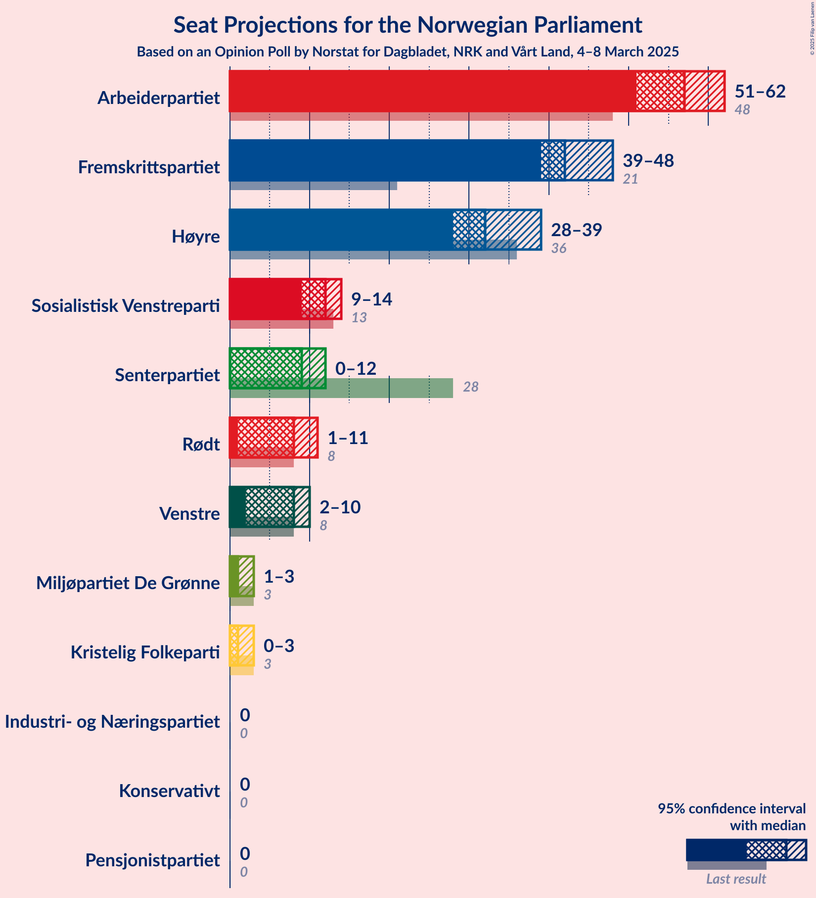

### Confidence Intervals

| Party | Last Result | Median | 80% Confidence Interval | 90% Confidence Interval | 95% Confidence Interval | 99% Confidence Interval |
|:-----:|:-----------:|:------:|:-----------------------:|:-----------------------:|:-----------------------:|:-----------------------:|
| <a href="#arbeiderpartiet">Arbeiderpartiet</a> | 48 | 57 | 52–60 |52–61 |51–62 |49–64 |
| <a href="#fremskrittspartiet">Fremskrittspartiet</a> | 21 | 42 | 39–45 |39–47 |39–48 |38–51 |
| <a href="#høyre">Høyre</a> | 36 | 32 | 31–35 |29–37 |28–39 |27–41 |
| <a href="#sosialistisk-venstreparti">Sosialistisk Venstreparti</a> | 13 | 12 | 10–13 |9–14 |9–14 |8–15 |
| <a href="#senterpartiet">Senterpartiet</a> | 28 | 9 | 8–12 |1–12 |0–12 |0–14 |
| <a href="#rødt">Rødt</a> | 8 | 8 | 1–10 |1–10 |1–11 |1–12 |
| <a href="#venstre">Venstre</a> | 8 | 8 | 3–9 |3–10 |2–10 |2–11 |
| <a href="#kristelig-folkeparti">Kristelig Folkeparti</a> | 3 | 1 | 0–3 |0–3 |0–3 |0–8 |
| <a href="#miljøpartiet-de-grønne">Miljøpartiet De Grønne</a> | 3 | 1 | 1–3 |1–3 |1–3 |0–7 |
| <a href="#konservativt">Konservativt</a> | 0 | 0 | 0 |0 |0 |0 |
| <a href="#industri--og-næringspartiet">Industri- og Næringspartiet</a> | 0 | 0 | 0 |0 |0 |0 |
| <a href="#pensjonistpartiet">Pensjonistpartiet</a> | 0 | 0 | 0 |0 |0 |0 |

### Arbeiderpartiet

*For a full overview of the results for this party, see the [Arbeiderpartiet](party-arbeiderpartiet.html) page.*

| Number of Seats | Probability | Accumulated | Special Marks |
|:---------------:|:-----------:|:-----------:|:-------------:|
| 48 | 0.2% | 100% | Last Result |
| 49 | 0.3% | 99.8% |  |
| 50 | 0.7% | 99.5% |  |
| 51 | 2% | 98.8% |  |
| 52 | 10% | 97% |  |
| 53 | 4% | 87% |  |
| 54 | 3% | 83% |  |
| 55 | 23% | 80% |  |
| 56 | 5% | 57% |  |
| 57 | 14% | 52% | Median |
| 58 | 10% | 38% |  |
| 59 | 11% | 28% |  |
| 60 | 8% | 17% |  |
| 61 | 5% | 9% |  |
| 62 | 3% | 4% |  |
| 63 | 0.6% | 2% |  |
| 64 | 0.6% | 1.0% |  |
| 65 | 0.2% | 0.4% |  |
| 66 | 0% | 0.2% |  |
| 67 | 0.2% | 0.2% |  |
| 68 | 0% | 0% |  |

### Fremskrittspartiet

*For a full overview of the results for this party, see the [Fremskrittspartiet](party-fremskrittspartiet.html) page.*

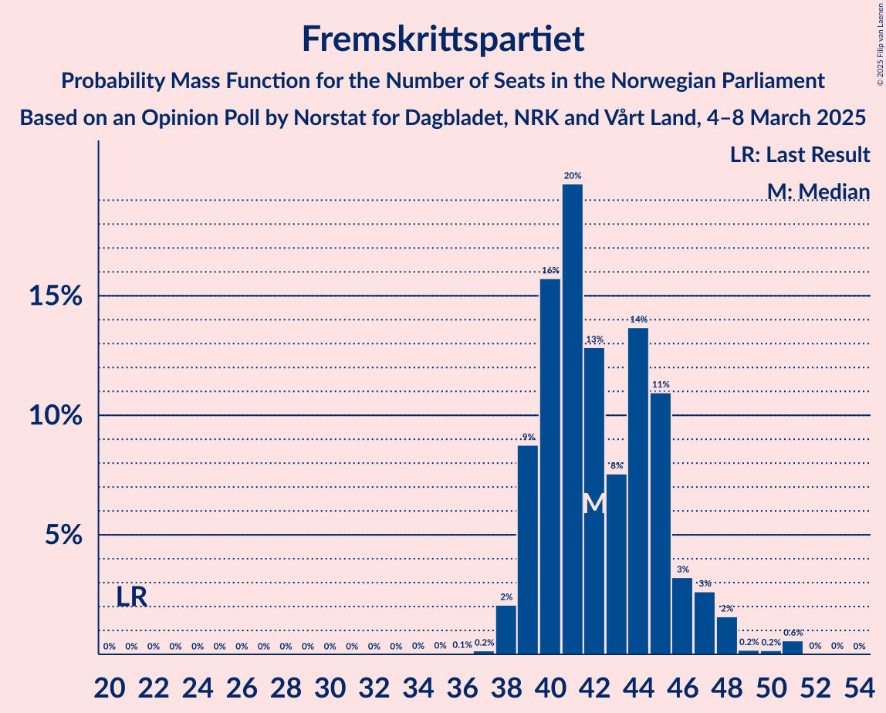

| Number of Seats | Probability | Accumulated | Special Marks |
|:---------------:|:-----------:|:-----------:|:-------------:|
| 21 | 0% | 100% | Last Result |
| 22 | 0% | 100% |  |
| 23 | 0% | 100% |  |
| 24 | 0% | 100% |  |
| 25 | 0% | 100% |  |
| 26 | 0% | 100% |  |
| 27 | 0% | 100% |  |
| 28 | 0% | 100% |  |
| 29 | 0% | 100% |  |
| 30 | 0% | 100% |  |
| 31 | 0% | 100% |  |
| 32 | 0% | 100% |  |
| 33 | 0% | 100% |  |
| 34 | 0% | 100% |  |
| 35 | 0% | 100% |  |
| 36 | 0.1% | 99.9% |  |
| 37 | 0.2% | 99.9% |  |
| 38 | 2% | 99.7% |  |
| 39 | 9% | 98% |  |
| 40 | 16% | 89% |  |
| 41 | 20% | 73% |  |
| 42 | 13% | 53% | Median |
| 43 | 8% | 41% |  |
| 44 | 14% | 33% |  |
| 45 | 11% | 19% |  |
| 46 | 3% | 8% |  |
| 47 | 3% | 5% |  |
| 48 | 2% | 3% |  |
| 49 | 0.2% | 1.0% |  |
| 50 | 0.2% | 0.8% |  |
| 51 | 0.6% | 0.6% |  |
| 52 | 0% | 0.1% |  |
| 53 | 0% | 0% |  |

### Høyre

*For a full overview of the results for this party, see the [Høyre](party-høyre.html) page.*

| Number of Seats | Probability | Accumulated | Special Marks |
|:---------------:|:-----------:|:-----------:|:-------------:|
| 24 | 0.1% | 100% |  |
| 25 | 0.1% | 99.9% |  |
| 26 | 0.2% | 99.9% |  |
| 27 | 0.5% | 99.7% |  |
| 28 | 2% | 99.1% |  |
| 29 | 3% | 97% |  |
| 30 | 2% | 93% |  |
| 31 | 16% | 91% |  |
| 32 | 34% | 76% | Median |
| 33 | 14% | 41% |  |
| 34 | 6% | 28% |  |
| 35 | 13% | 21% |  |
| 36 | 3% | 8% | Last Result |
| 37 | 0.9% | 6% |  |
| 38 | 0.9% | 5% |  |
| 39 | 2% | 4% |  |
| 40 | 1.2% | 2% |  |
| 41 | 0.1% | 0.6% |  |
| 42 | 0% | 0.5% |  |
| 43 | 0.1% | 0.4% |  |
| 44 | 0.4% | 0.4% |  |
| 45 | 0% | 0% |  |

### Sosialistisk Venstreparti

*For a full overview of the results for this party, see the [Sosialistisk Venstreparti](party-sosialistiskvenstreparti.html) page.*

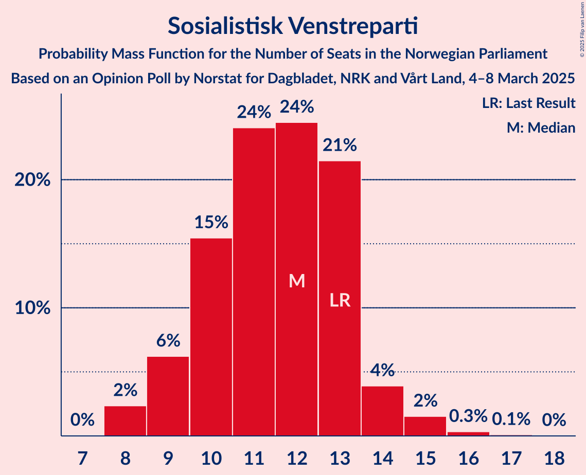

| Number of Seats | Probability | Accumulated | Special Marks |
|:---------------:|:-----------:|:-----------:|:-------------:|
| 7 | 0% | 100% |  |
| 8 | 2% | 99.9% |  |
| 9 | 6% | 98% |  |
| 10 | 15% | 91% |  |
| 11 | 24% | 76% |  |
| 12 | 24% | 52% | Median |
| 13 | 21% | 27% | Last Result |
| 14 | 4% | 6% |  |
| 15 | 2% | 2% |  |
| 16 | 0.3% | 0.5% |  |
| 17 | 0.1% | 0.1% |  |
| 18 | 0% | 0% |  |

### Senterpartiet

*For a full overview of the results for this party, see the [Senterpartiet](party-senterpartiet.html) page.*

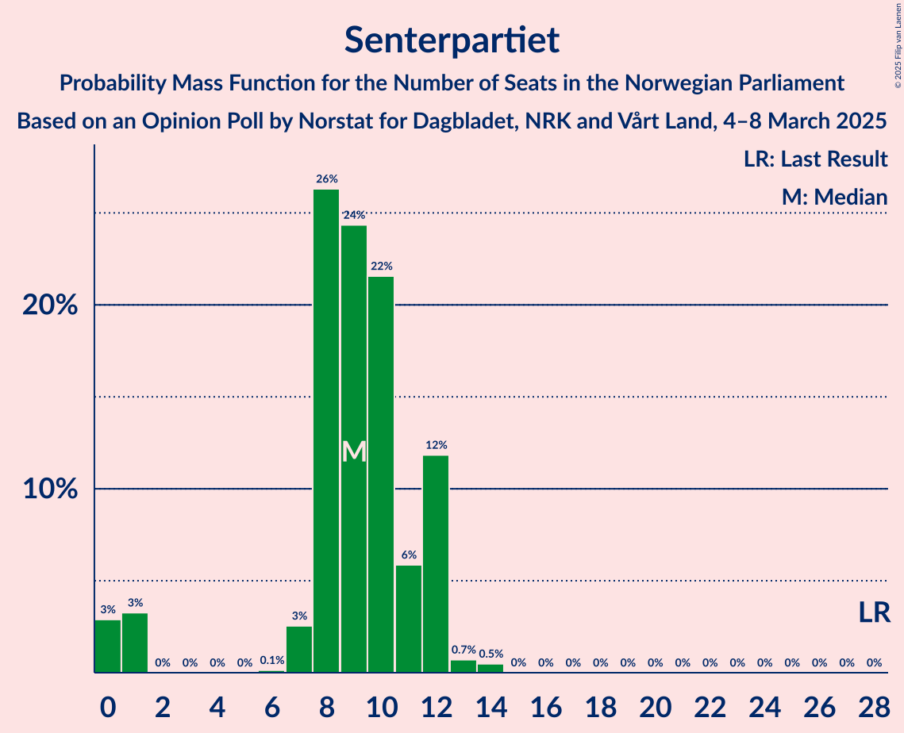

| Number of Seats | Probability | Accumulated | Special Marks |
|:---------------:|:-----------:|:-----------:|:-------------:|
| 0 | 3% | 100% |  |
| 1 | 3% | 97% |  |
| 2 | 0% | 94% |  |
| 3 | 0% | 94% |  |
| 4 | 0% | 94% |  |
| 5 | 0% | 94% |  |
| 6 | 0.1% | 94% |  |
| 7 | 3% | 94% |  |
| 8 | 26% | 91% |  |
| 9 | 24% | 65% | Median |
| 10 | 22% | 40% |  |
| 11 | 6% | 19% |  |
| 12 | 12% | 13% |  |
| 13 | 0.7% | 1.2% |  |
| 14 | 0.5% | 0.5% |  |
| 15 | 0% | 0% |  |
| 16 | 0% | 0% |  |
| 17 | 0% | 0% |  |
| 18 | 0% | 0% |  |
| 19 | 0% | 0% |  |
| 20 | 0% | 0% |  |
| 21 | 0% | 0% |  |
| 22 | 0% | 0% |  |
| 23 | 0% | 0% |  |
| 24 | 0% | 0% |  |
| 25 | 0% | 0% |  |
| 26 | 0% | 0% |  |
| 27 | 0% | 0% |  |
| 28 | 0% | 0% | Last Result |

### Rødt

*For a full overview of the results for this party, see the [Rødt](party-rødt.html) page.*

| Number of Seats | Probability | Accumulated | Special Marks |
|:---------------:|:-----------:|:-----------:|:-------------:|
| 1 | 14% | 100% |  |
| 2 | 2% | 86% |  |
| 3 | 0.9% | 84% |  |
| 4 | 0% | 83% |  |
| 5 | 0% | 83% |  |
| 6 | 5% | 83% |  |
| 7 | 21% | 78% |  |
| 8 | 22% | 57% | Last Result, Median |
| 9 | 13% | 35% |  |
| 10 | 18% | 21% |  |
| 11 | 3% | 3% |  |
| 12 | 0.3% | 0.5% |  |
| 13 | 0.2% | 0.2% |  |
| 14 | 0% | 0% |  |

### Venstre

*For a full overview of the results for this party, see the [Venstre](party-venstre.html) page.*

| Number of Seats | Probability | Accumulated | Special Marks |
|:---------------:|:-----------:|:-----------:|:-------------:|
| 2 | 4% | 100% |  |
| 3 | 11% | 96% |  |
| 4 | 0% | 85% |  |
| 5 | 0% | 85% |  |
| 6 | 0.2% | 85% |  |
| 7 | 21% | 84% |  |
| 8 | 46% | 63% | Last Result, Median |
| 9 | 11% | 17% |  |
| 10 | 4% | 6% |  |
| 11 | 2% | 2% |  |
| 12 | 0.4% | 0.5% |  |
| 13 | 0% | 0.1% |  |
| 14 | 0% | 0% |  |

### Kristelig Folkeparti

*For a full overview of the results for this party, see the [Kristelig Folkeparti](party-kristeligfolkeparti.html) page.*

| Number of Seats | Probability | Accumulated | Special Marks |
|:---------------:|:-----------:|:-----------:|:-------------:|
| 0 | 24% | 100% |  |
| 1 | 49% | 76% | Median |
| 2 | 14% | 27% |  |
| 3 | 12% | 14% | Last Result |
| 4 | 0% | 2% |  |
| 5 | 0% | 2% |  |
| 6 | 0.1% | 2% |  |
| 7 | 0.6% | 2% |  |
| 8 | 1.1% | 1.1% |  |
| 9 | 0% | 0% |  |

### Miljøpartiet De Grønne

*For a full overview of the results for this party, see the [Miljøpartiet De Grønne](party-miljøpartietdegrønne.html) page.*

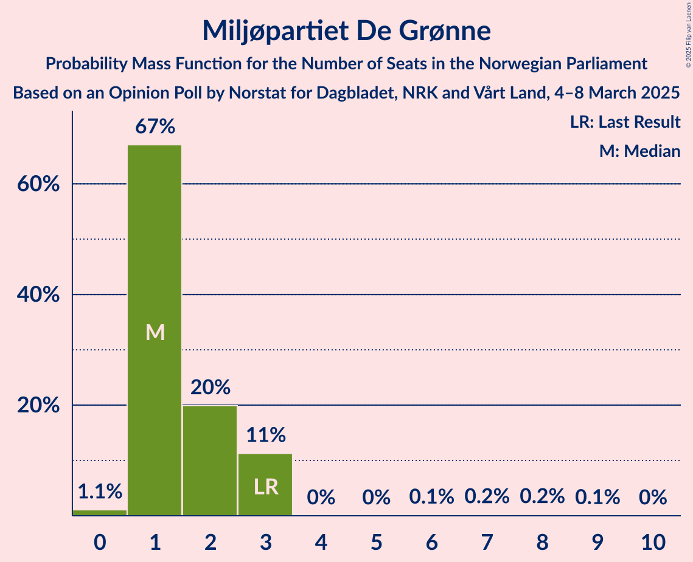

| Number of Seats | Probability | Accumulated | Special Marks |
|:---------------:|:-----------:|:-----------:|:-------------:|
| 0 | 1.1% | 100% |  |
| 1 | 67% | 98.9% | Median |
| 2 | 20% | 32% |  |
| 3 | 11% | 12% | Last Result |
| 4 | 0% | 0.7% |  |
| 5 | 0% | 0.6% |  |
| 6 | 0.1% | 0.6% |  |
| 7 | 0.2% | 0.5% |  |
| 8 | 0.2% | 0.3% |  |
| 9 | 0.1% | 0.1% |  |
| 10 | 0% | 0% |  |

### Konservativt

*For a full overview of the results for this party, see the [Konservativt](party-konservativt.html) page.*

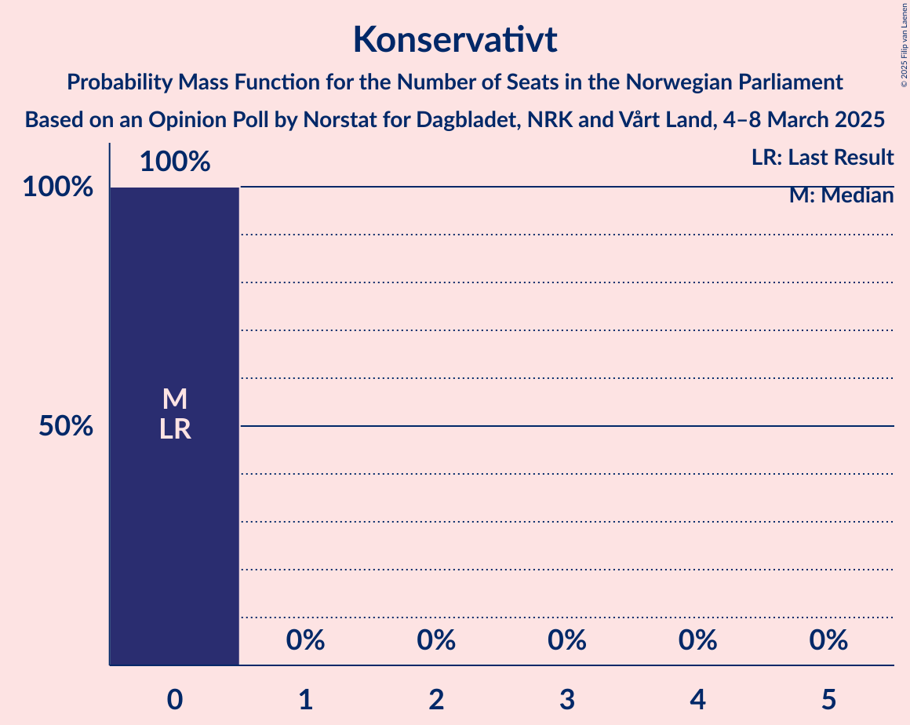

| Number of Seats | Probability | Accumulated | Special Marks |
|:---------------:|:-----------:|:-----------:|:-------------:|
| 0 | 100% | 100% | Last Result, Median |

### Industri- og Næringspartiet

*For a full overview of the results for this party, see the [Industri- og Næringspartiet](party-industri-ognæringspartiet.html) page.*

| Number of Seats | Probability | Accumulated | Special Marks |
|:---------------:|:-----------:|:-----------:|:-------------:|
| 0 | 100% | 100% | Last Result, Median |

### Pensjonistpartiet

*For a full overview of the results for this party, see the [Pensjonistpartiet](party-pensjonistpartiet.html) page.*

| Number of Seats | Probability | Accumulated | Special Marks |
|:---------------:|:-----------:|:-----------:|:-------------:|
| 0 | 100% | 100% | Last Result, Median |

## Coalitions

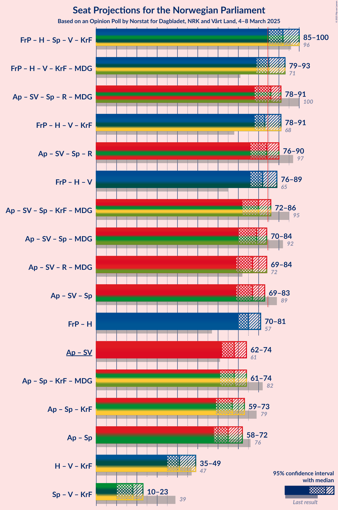

### Confidence Intervals

| Coalition | Last Result | Median | Majority? | 80% Confidence Interval | 90% Confidence Interval | 95% Confidence Interval | 99% Confidence Interval |
|:---------:|:-----------:|:------:|:---------:|:-----------------------:|:-----------------------:|:-----------------------:|:-----------------------:|
| Fremskrittspartiet – Høyre – Senterpartiet – Venstre – Kristelig Folkeparti | 96 | 92 | 99.0% | 88–97 | 87–99 | 85–100 | 84–102 |
| Fremskrittspartiet – Høyre – Venstre – Kristelig Folkeparti – Miljøpartiet De Grønne | 71 | 85 | 54% | 81–90 | 80–91 | 79–93 | 78–98 |
| Arbeiderpartiet – Sosialistisk Venstreparti – Senterpartiet – Rødt – Miljøpartiet De Grønne | 100 | 86 | 65% | 80–90 | 80–90 | 78–91 | 72–94 |
| Fremskrittspartiet – Høyre – Venstre – Kristelig Folkeparti | 68 | 83 | 35% | 79–89 | 79–89 | 78–91 | 75–97 |
| Arbeiderpartiet – Sosialistisk Venstreparti – Senterpartiet – Rødt | 97 | 84 | 46% | 79–88 | 78–89 | 76–90 | 71–91 |
| Fremskrittspartiet – Høyre – Venstre | 65 | 82 | 26% | 78–87 | 78–89 | 76–89 | 74–96 |
| Arbeiderpartiet – Sosialistisk Venstreparti – Senterpartiet – Kristelig Folkeparti – Miljøpartiet De Grønne | 95 | 80 | 6% | 75–83 | 74–85 | 72–86 | 69–88 |
| Arbeiderpartiet – Sosialistisk Venstreparti – Senterpartiet – Miljøpartiet De Grønne | 92 | 79 | 2% | 74–83 | 73–84 | 70–84 | 68–87 |
| Arbeiderpartiet – Sosialistisk Venstreparti – Rødt – Miljøpartiet De Grønne | 72 | 77 | 1.0% | 72–81 | 70–82 | 69–84 | 67–85 |
| Arbeiderpartiet – Sosialistisk Venstreparti – Senterpartiet | 89 | 77 | 0.6% | 72–81 | 72–82 | 69–83 | 67–85 |
| Fremskrittspartiet – Høyre | 57 | 75 | 1.3% | 71–79 | 71–80 | 70–81 | 69–86 |
| Arbeiderpartiet – Sosialistisk Venstreparti | 61 | 68 | 0% | 64–71 | 63–73 | 62–74 | 61–76 |
| Arbeiderpartiet – Senterpartiet – Kristelig Folkeparti – Miljøpartiet De Grønne | 82 | 68 | 0% | 65–72 | 64–74 | 61–74 | 57–75 |
| Arbeiderpartiet – Senterpartiet – Kristelig Folkeparti | 79 | 67 | 0% | 63–71 | 62–72 | 59–73 | 56–74 |
| Arbeiderpartiet – Senterpartiet | 76 | 65 | 0% | 62–69 | 61–70 | 58–72 | 55–73 |
| Høyre – Venstre – Kristelig Folkeparti | 47 | 41 | 0% | 37–45 | 35–47 | 35–49 | 32–51 |
| Senterpartiet – Venstre – Kristelig Folkeparti | 39 | 18 | 0% | 12–21 | 10–22 | 10–23 | 5–24 |

### Fremskrittspartiet – Høyre – Senterpartiet – Venstre – Kristelig Folkeparti

| Number of Seats | Probability | Accumulated | Special Marks |
|:---------------:|:-----------:|:-----------:|:-------------:|
| 78 | 0.1% | 100% |  |
| 79 | 0% | 99.9% |  |
| 80 | 0% | 99.9% |  |
| 81 | 0.1% | 99.9% |  |
| 82 | 0.1% | 99.8% |  |
| 83 | 0.2% | 99.8% |  |
| 84 | 0.6% | 99.5% |  |
| 85 | 3% | 99.0% | Majority |
| 86 | 0.9% | 96% |  |
| 87 | 2% | 95% |  |
| 88 | 7% | 94% |  |
| 89 | 9% | 87% |  |
| 90 | 13% | 77% |  |
| 91 | 10% | 64% |  |
| 92 | 11% | 54% | Median |
| 93 | 12% | 44% |  |
| 94 | 4% | 32% |  |
| 95 | 3% | 28% |  |
| 96 | 4% | 25% | Last Result |
| 97 | 14% | 21% |  |
| 98 | 2% | 7% |  |
| 99 | 2% | 5% |  |
| 100 | 2% | 3% |  |
| 101 | 0.7% | 1.4% |  |
| 102 | 0.2% | 0.7% |  |
| 103 | 0.3% | 0.5% |  |
| 104 | 0.1% | 0.2% |  |
| 105 | 0.1% | 0.1% |  |
| 106 | 0% | 0% |  |

### Fremskrittspartiet – Høyre – Venstre – Kristelig Folkeparti – Miljøpartiet De Grønne

| Number of Seats | Probability | Accumulated | Special Marks |
|:---------------:|:-----------:|:-----------:|:-------------:|
| 71 | 0% | 100% | Last Result |
| 72 | 0% | 100% |  |
| 73 | 0% | 100% |  |
| 74 | 0.1% | 100% |  |
| 75 | 0.1% | 99.9% |  |
| 76 | 0.1% | 99.9% |  |
| 77 | 0.2% | 99.8% |  |
| 78 | 2% | 99.5% |  |
| 79 | 2% | 98% |  |
| 80 | 2% | 96% |  |
| 81 | 10% | 94% |  |
| 82 | 20% | 84% |  |
| 83 | 9% | 64% |  |
| 84 | 2% | 56% | Median |
| 85 | 15% | 54% | Majority |
| 86 | 8% | 39% |  |
| 87 | 3% | 31% |  |
| 88 | 14% | 28% |  |
| 89 | 3% | 14% |  |
| 90 | 6% | 12% |  |
| 91 | 2% | 6% |  |
| 92 | 1.0% | 4% |  |
| 93 | 2% | 3% |  |
| 94 | 0.3% | 2% |  |
| 95 | 0.5% | 1.3% |  |
| 96 | 0.1% | 0.8% |  |
| 97 | 0.1% | 0.7% |  |
| 98 | 0.2% | 0.6% |  |
| 99 | 0% | 0.4% |  |
| 100 | 0% | 0.4% |  |
| 101 | 0.4% | 0.4% |  |
| 102 | 0% | 0% |  |

### Arbeiderpartiet – Sosialistisk Venstreparti – Senterpartiet – Rødt – Miljøpartiet De Grønne

| Number of Seats | Probability | Accumulated | Special Marks |
|:---------------:|:-----------:|:-----------:|:-------------:|
| 69 | 0.4% | 100% |  |
| 70 | 0% | 99.6% |  |
| 71 | 0% | 99.6% |  |
| 72 | 0.2% | 99.6% |  |
| 73 | 0.1% | 99.4% |  |
| 74 | 0.1% | 99.4% |  |
| 75 | 0.3% | 99.3% |  |
| 76 | 0.3% | 99.0% |  |
| 77 | 1.2% | 98.7% |  |
| 78 | 1.2% | 98% |  |
| 79 | 1.2% | 96% |  |
| 80 | 6% | 95% |  |
| 81 | 2% | 89% |  |
| 82 | 13% | 88% |  |
| 83 | 4% | 75% |  |
| 84 | 7% | 71% |  |
| 85 | 11% | 65% | Majority |
| 86 | 7% | 53% |  |
| 87 | 6% | 47% | Median |
| 88 | 19% | 40% |  |
| 89 | 8% | 22% |  |
| 90 | 10% | 14% |  |
| 91 | 1.5% | 4% |  |
| 92 | 2% | 2% |  |
| 93 | 0.4% | 0.9% |  |
| 94 | 0.3% | 0.5% |  |
| 95 | 0.1% | 0.2% |  |
| 96 | 0.1% | 0.1% |  |
| 97 | 0% | 0% |  |
| 98 | 0% | 0% |  |
| 99 | 0% | 0% |  |
| 100 | 0% | 0% | Last Result |

### Fremskrittspartiet – Høyre – Venstre – Kristelig Folkeparti

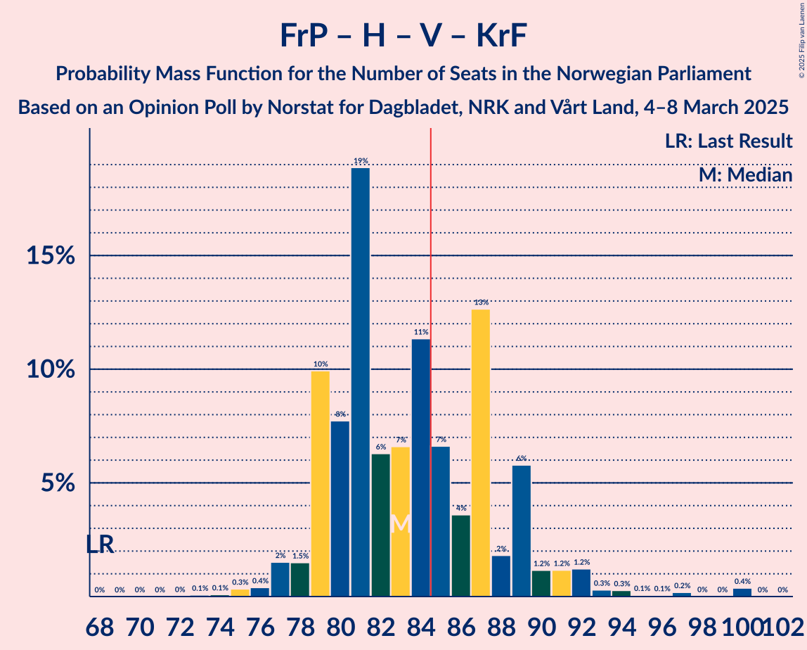

| Number of Seats | Probability | Accumulated | Special Marks |
|:---------------:|:-----------:|:-----------:|:-------------:|
| 68 | 0% | 100% | Last Result |
| 69 | 0% | 100% |  |
| 70 | 0% | 100% |  |
| 71 | 0% | 100% |  |
| 72 | 0% | 100% |  |
| 73 | 0.1% | 100% |  |
| 74 | 0.1% | 99.9% |  |
| 75 | 0.3% | 99.8% |  |
| 76 | 0.4% | 99.5% |  |
| 77 | 2% | 99.1% |  |
| 78 | 1.5% | 98% |  |
| 79 | 10% | 96% |  |
| 80 | 8% | 86% |  |
| 81 | 19% | 78% |  |
| 82 | 6% | 60% |  |
| 83 | 7% | 53% | Median |
| 84 | 11% | 47% |  |
| 85 | 7% | 35% | Majority |
| 86 | 4% | 29% |  |
| 87 | 13% | 25% |  |
| 88 | 2% | 12% |  |
| 89 | 6% | 11% |  |
| 90 | 1.2% | 5% |  |
| 91 | 1.2% | 4% |  |
| 92 | 1.2% | 2% |  |
| 93 | 0.3% | 1.3% |  |
| 94 | 0.3% | 1.0% |  |
| 95 | 0.1% | 0.7% |  |
| 96 | 0.1% | 0.6% |  |
| 97 | 0.2% | 0.6% |  |
| 98 | 0% | 0.4% |  |
| 99 | 0% | 0.4% |  |
| 100 | 0.4% | 0.4% |  |
| 101 | 0% | 0% |  |

### Arbeiderpartiet – Sosialistisk Venstreparti – Senterpartiet – Rødt

| Number of Seats | Probability | Accumulated | Special Marks |
|:---------------:|:-----------:|:-----------:|:-------------:|
| 68 | 0.4% | 100% |  |
| 69 | 0% | 99.6% |  |
| 70 | 0% | 99.6% |  |
| 71 | 0.2% | 99.6% |  |
| 72 | 0.1% | 99.4% |  |
| 73 | 0.1% | 99.3% |  |
| 74 | 0.5% | 99.2% |  |
| 75 | 0.3% | 98.7% |  |
| 76 | 2% | 98% |  |
| 77 | 1.0% | 97% |  |
| 78 | 2% | 96% |  |
| 79 | 6% | 94% |  |
| 80 | 3% | 88% |  |
| 81 | 14% | 86% |  |
| 82 | 3% | 72% |  |
| 83 | 8% | 69% |  |
| 84 | 15% | 61% |  |
| 85 | 2% | 46% | Majority |
| 86 | 9% | 44% | Median |
| 87 | 20% | 36% |  |
| 88 | 10% | 16% |  |
| 89 | 2% | 6% |  |
| 90 | 2% | 4% |  |
| 91 | 2% | 2% |  |
| 92 | 0.2% | 0.5% |  |
| 93 | 0.1% | 0.2% |  |
| 94 | 0.1% | 0.1% |  |
| 95 | 0.1% | 0.1% |  |
| 96 | 0% | 0% |  |
| 97 | 0% | 0% | Last Result |

### Fremskrittspartiet – Høyre – Venstre

| Number of Seats | Probability | Accumulated | Special Marks |
|:---------------:|:-----------:|:-----------:|:-------------:|
| 65 | 0% | 100% | Last Result |
| 66 | 0% | 100% |  |
| 67 | 0% | 100% |  |
| 68 | 0% | 100% |  |
| 69 | 0% | 100% |  |
| 70 | 0% | 100% |  |
| 71 | 0% | 99.9% |  |
| 72 | 0% | 99.9% |  |
| 73 | 0.1% | 99.9% |  |
| 74 | 0.3% | 99.8% |  |
| 75 | 0.6% | 99.5% |  |
| 76 | 2% | 98.9% |  |
| 77 | 0.5% | 97% |  |
| 78 | 7% | 97% |  |
| 79 | 16% | 89% |  |
| 80 | 16% | 74% |  |
| 81 | 7% | 58% |  |
| 82 | 5% | 51% | Median |
| 83 | 9% | 46% |  |
| 84 | 10% | 37% |  |
| 85 | 12% | 26% | Majority |
| 86 | 4% | 14% |  |
| 87 | 2% | 10% |  |
| 88 | 3% | 8% |  |
| 89 | 3% | 5% |  |
| 90 | 1.0% | 2% |  |
| 91 | 0.3% | 1.4% |  |
| 92 | 0.2% | 1.0% |  |
| 93 | 0.1% | 0.8% |  |
| 94 | 0.1% | 0.7% |  |
| 95 | 0% | 0.6% |  |
| 96 | 0.2% | 0.6% |  |
| 97 | 0% | 0.4% |  |
| 98 | 0% | 0.4% |  |
| 99 | 0.4% | 0.4% |  |
| 100 | 0% | 0% |  |

### Arbeiderpartiet – Sosialistisk Venstreparti – Senterpartiet – Kristelig Folkeparti – Miljøpartiet De Grønne

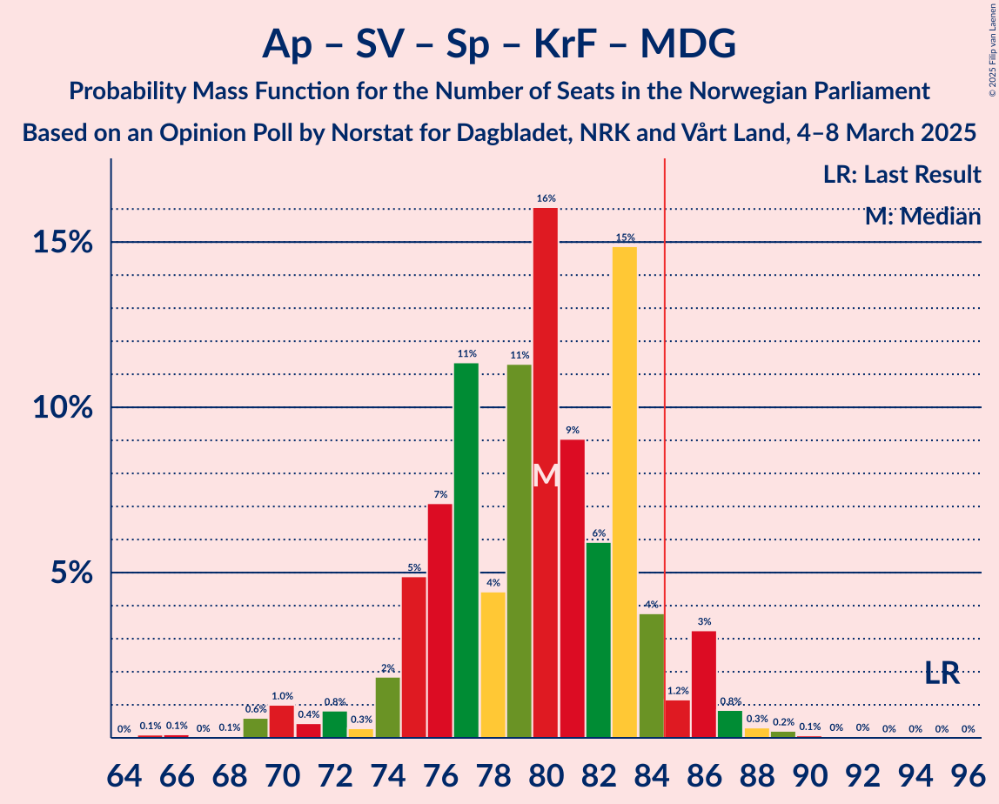

| Number of Seats | Probability | Accumulated | Special Marks |
|:---------------:|:-----------:|:-----------:|:-------------:|
| 65 | 0.1% | 100% |  |
| 66 | 0.1% | 99.9% |  |
| 67 | 0% | 99.8% |  |
| 68 | 0.1% | 99.8% |  |
| 69 | 0.6% | 99.7% |  |
| 70 | 1.0% | 99.1% |  |
| 71 | 0.4% | 98% |  |
| 72 | 0.8% | 98% |  |
| 73 | 0.3% | 97% |  |
| 74 | 2% | 97% |  |
| 75 | 5% | 95% |  |
| 76 | 7% | 90% |  |
| 77 | 11% | 83% |  |
| 78 | 4% | 71% |  |
| 79 | 11% | 67% |  |
| 80 | 16% | 56% | Median |
| 81 | 9% | 40% |  |
| 82 | 6% | 31% |  |
| 83 | 15% | 25% |  |
| 84 | 4% | 10% |  |
| 85 | 1.2% | 6% | Majority |
| 86 | 3% | 5% |  |
| 87 | 0.8% | 2% |  |
| 88 | 0.3% | 0.7% |  |
| 89 | 0.2% | 0.4% |  |
| 90 | 0.1% | 0.2% |  |
| 91 | 0% | 0.1% |  |
| 92 | 0% | 0.1% |  |
| 93 | 0% | 0% |  |
| 94 | 0% | 0% |  |
| 95 | 0% | 0% | Last Result |

### Arbeiderpartiet – Sosialistisk Venstreparti – Senterpartiet – Miljøpartiet De Grønne

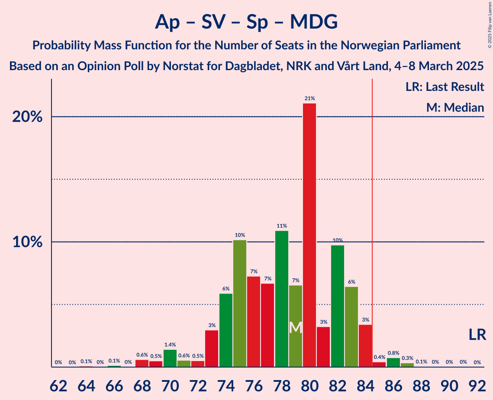

| Number of Seats | Probability | Accumulated | Special Marks |
|:---------------:|:-----------:|:-----------:|:-------------:|
| 64 | 0.1% | 100% |  |
| 65 | 0% | 99.9% |  |
| 66 | 0.1% | 99.9% |  |
| 67 | 0% | 99.7% |  |
| 68 | 0.6% | 99.7% |  |
| 69 | 0.5% | 99.1% |  |
| 70 | 1.4% | 98.6% |  |
| 71 | 0.6% | 97% |  |
| 72 | 0.5% | 97% |  |
| 73 | 3% | 96% |  |
| 74 | 6% | 93% |  |
| 75 | 10% | 87% |  |
| 76 | 7% | 77% |  |
| 77 | 7% | 70% |  |
| 78 | 11% | 63% |  |
| 79 | 7% | 52% | Median |
| 80 | 21% | 46% |  |
| 81 | 3% | 25% |  |
| 82 | 10% | 21% |  |
| 83 | 6% | 12% |  |
| 84 | 3% | 5% |  |
| 85 | 0.4% | 2% | Majority |
| 86 | 0.8% | 1.3% |  |
| 87 | 0.3% | 0.5% |  |
| 88 | 0.1% | 0.2% |  |
| 89 | 0% | 0.1% |  |
| 90 | 0% | 0.1% |  |
| 91 | 0% | 0.1% |  |
| 92 | 0% | 0% | Last Result |

### Arbeiderpartiet – Sosialistisk Venstreparti – Rødt – Miljøpartiet De Grønne

| Number of Seats | Probability | Accumulated | Special Marks |
|:---------------:|:-----------:|:-----------:|:-------------:|
| 64 | 0.1% | 100% |  |
| 65 | 0.1% | 99.9% |  |
| 66 | 0.3% | 99.8% |  |
| 67 | 0.2% | 99.5% |  |
| 68 | 0.7% | 99.3% |  |
| 69 | 2% | 98.6% |  |
| 70 | 2% | 97% |  |
| 71 | 2% | 95% |  |
| 72 | 14% | 93% | Last Result |
| 73 | 4% | 79% |  |
| 74 | 3% | 75% |  |
| 75 | 4% | 72% |  |
| 76 | 12% | 68% |  |
| 77 | 11% | 56% |  |
| 78 | 10% | 46% | Median |
| 79 | 13% | 36% |  |
| 80 | 9% | 23% |  |
| 81 | 7% | 13% |  |
| 82 | 2% | 6% |  |
| 83 | 0.9% | 5% |  |
| 84 | 3% | 4% |  |
| 85 | 0.6% | 1.0% | Majority |
| 86 | 0.2% | 0.5% |  |
| 87 | 0.1% | 0.2% |  |
| 88 | 0.1% | 0.2% |  |
| 89 | 0% | 0.1% |  |
| 90 | 0% | 0.1% |  |
| 91 | 0.1% | 0.1% |  |
| 92 | 0% | 0% |  |

### Arbeiderpartiet – Sosialistisk Venstreparti – Senterpartiet

| Number of Seats | Probability | Accumulated | Special Marks |
|:---------------:|:-----------:|:-----------:|:-------------:|
| 63 | 0.1% | 100% |  |
| 64 | 0% | 99.9% |  |
| 65 | 0.1% | 99.8% |  |
| 66 | 0.1% | 99.7% |  |
| 67 | 0.7% | 99.6% |  |
| 68 | 0.6% | 99.0% |  |
| 69 | 2% | 98% |  |
| 70 | 0.4% | 97% |  |
| 71 | 0.9% | 96% |  |
| 72 | 6% | 96% |  |
| 73 | 4% | 89% |  |
| 74 | 10% | 86% |  |
| 75 | 8% | 76% |  |
| 76 | 7% | 68% |  |
| 77 | 15% | 61% |  |
| 78 | 15% | 46% | Median |
| 79 | 9% | 31% |  |
| 80 | 4% | 21% |  |
| 81 | 8% | 17% |  |
| 82 | 5% | 9% |  |
| 83 | 3% | 4% |  |
| 84 | 0.7% | 1.3% |  |
| 85 | 0.3% | 0.6% | Majority |
| 86 | 0.2% | 0.3% |  |
| 87 | 0.1% | 0.1% |  |
| 88 | 0% | 0.1% |  |
| 89 | 0% | 0.1% | Last Result |
| 90 | 0% | 0% |  |

### Fremskrittspartiet – Høyre

| Number of Seats | Probability | Accumulated | Special Marks |
|:---------------:|:-----------:|:-----------:|:-------------:|
| 57 | 0% | 100% | Last Result |
| 58 | 0% | 100% |  |
| 59 | 0% | 100% |  |
| 60 | 0% | 100% |  |
| 61 | 0% | 100% |  |
| 62 | 0% | 100% |  |
| 63 | 0.1% | 100% |  |
| 64 | 0% | 99.9% |  |
| 65 | 0% | 99.9% |  |
| 66 | 0.1% | 99.9% |  |
| 67 | 0.2% | 99.9% |  |
| 68 | 0.2% | 99.7% |  |
| 69 | 0.5% | 99.5% |  |
| 70 | 2% | 99.0% |  |
| 71 | 11% | 97% |  |
| 72 | 14% | 86% |  |
| 73 | 11% | 71% |  |
| 74 | 4% | 60% | Median |
| 75 | 7% | 56% |  |
| 76 | 17% | 49% |  |
| 77 | 17% | 32% |  |
| 78 | 4% | 15% |  |
| 79 | 4% | 11% |  |
| 80 | 2% | 7% |  |
| 81 | 2% | 5% |  |
| 82 | 0.5% | 2% |  |
| 83 | 0.4% | 2% |  |
| 84 | 0.2% | 2% |  |
| 85 | 0.5% | 1.3% | Majority |
| 86 | 0.3% | 0.8% |  |
| 87 | 0% | 0.5% |  |
| 88 | 0.1% | 0.5% |  |
| 89 | 0% | 0.4% |  |
| 90 | 0% | 0.4% |  |
| 91 | 0.4% | 0.4% |  |
| 92 | 0% | 0% |  |

### Arbeiderpartiet – Sosialistisk Venstreparti

| Number of Seats | Probability | Accumulated | Special Marks |
|:---------------:|:-----------:|:-----------:|:-------------:|
| 59 | 0.1% | 100% |  |
| 60 | 0.4% | 99.9% |  |
| 61 | 0.7% | 99.6% | Last Result |
| 62 | 4% | 98.9% |  |
| 63 | 0.8% | 95% |  |
| 64 | 11% | 94% |  |
| 65 | 5% | 84% |  |
| 66 | 6% | 79% |  |
| 67 | 7% | 72% |  |
| 68 | 21% | 66% |  |
| 69 | 10% | 45% | Median |
| 70 | 14% | 34% |  |
| 71 | 12% | 20% |  |
| 72 | 3% | 8% |  |
| 73 | 2% | 5% |  |
| 74 | 2% | 4% |  |
| 75 | 0.6% | 1.4% |  |
| 76 | 0.4% | 0.8% |  |
| 77 | 0.1% | 0.4% |  |
| 78 | 0% | 0.2% |  |
| 79 | 0.1% | 0.2% |  |
| 80 | 0% | 0.1% |  |
| 81 | 0% | 0.1% |  |
| 82 | 0.1% | 0.1% |  |
| 83 | 0% | 0% |  |

### Arbeiderpartiet – Senterpartiet – Kristelig Folkeparti – Miljøpartiet De Grønne

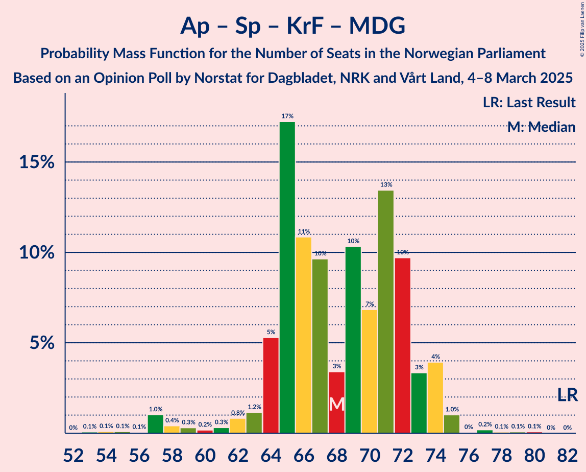

| Number of Seats | Probability | Accumulated | Special Marks |
|:---------------:|:-----------:|:-----------:|:-------------:|
| 53 | 0.1% | 100% |  |
| 54 | 0.1% | 99.9% |  |
| 55 | 0.1% | 99.8% |  |
| 56 | 0.1% | 99.7% |  |
| 57 | 1.0% | 99.7% |  |
| 58 | 0.4% | 98.7% |  |
| 59 | 0.3% | 98% |  |
| 60 | 0.2% | 98% |  |
| 61 | 0.3% | 98% |  |
| 62 | 0.8% | 97% |  |
| 63 | 1.2% | 97% |  |
| 64 | 5% | 95% |  |
| 65 | 17% | 90% |  |
| 66 | 11% | 73% |  |
| 67 | 10% | 62% |  |
| 68 | 3% | 52% | Median |
| 69 | 10% | 49% |  |
| 70 | 7% | 39% |  |
| 71 | 13% | 32% |  |
| 72 | 10% | 18% |  |
| 73 | 3% | 9% |  |
| 74 | 4% | 5% |  |
| 75 | 1.0% | 1.5% |  |
| 76 | 0% | 0.5% |  |
| 77 | 0.2% | 0.4% |  |
| 78 | 0.1% | 0.2% |  |
| 79 | 0.1% | 0.2% |  |
| 80 | 0.1% | 0.1% |  |
| 81 | 0% | 0% |  |
| 82 | 0% | 0% | Last Result |

### Arbeiderpartiet – Senterpartiet – Kristelig Folkeparti

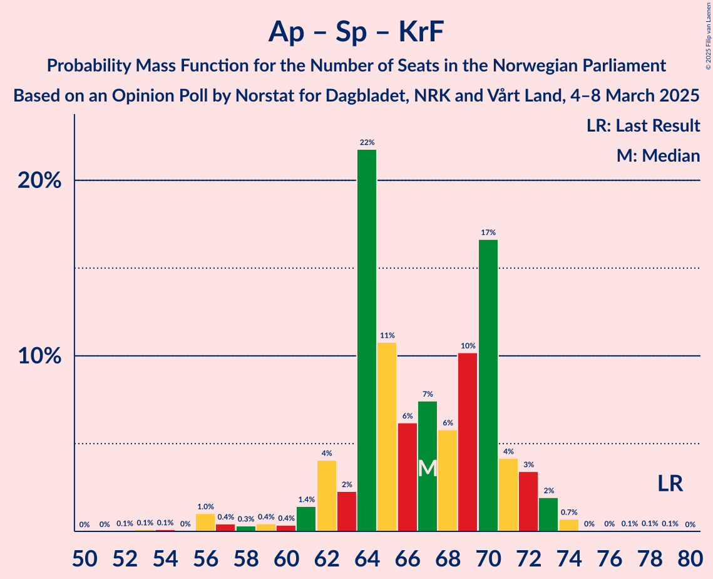

| Number of Seats | Probability | Accumulated | Special Marks |
|:---------------:|:-----------:|:-----------:|:-------------:|
| 52 | 0.1% | 100% |  |
| 53 | 0.1% | 99.9% |  |
| 54 | 0.1% | 99.8% |  |
| 55 | 0% | 99.7% |  |
| 56 | 1.0% | 99.7% |  |
| 57 | 0.4% | 98.6% |  |
| 58 | 0.3% | 98% |  |
| 59 | 0.4% | 98% |  |
| 60 | 0.4% | 97% |  |
| 61 | 1.4% | 97% |  |
| 62 | 4% | 96% |  |
| 63 | 2% | 92% |  |
| 64 | 22% | 89% |  |
| 65 | 11% | 68% |  |
| 66 | 6% | 57% |  |
| 67 | 7% | 51% | Median |
| 68 | 6% | 43% |  |
| 69 | 10% | 37% |  |
| 70 | 17% | 27% |  |
| 71 | 4% | 10% |  |
| 72 | 3% | 6% |  |
| 73 | 2% | 3% |  |
| 74 | 0.7% | 1.0% |  |
| 75 | 0% | 0.3% |  |
| 76 | 0% | 0.2% |  |
| 77 | 0.1% | 0.2% |  |
| 78 | 0.1% | 0.1% |  |
| 79 | 0.1% | 0.1% | Last Result |
| 80 | 0% | 0% |  |

### Arbeiderpartiet – Senterpartiet

| Number of Seats | Probability | Accumulated | Special Marks |
|:---------------:|:-----------:|:-----------:|:-------------:|
| 52 | 0.2% | 100% |  |
| 53 | 0% | 99.8% |  |
| 54 | 0.1% | 99.7% |  |
| 55 | 0.2% | 99.6% |  |
| 56 | 1.4% | 99.5% |  |
| 57 | 0.4% | 98% |  |
| 58 | 0.8% | 98% |  |
| 59 | 0.4% | 97% |  |
| 60 | 1.2% | 96% |  |
| 61 | 4% | 95% |  |
| 62 | 11% | 91% |  |
| 63 | 7% | 80% |  |
| 64 | 18% | 73% |  |
| 65 | 7% | 55% |  |
| 66 | 7% | 47% | Median |
| 67 | 7% | 41% |  |
| 68 | 11% | 34% |  |
| 69 | 15% | 23% |  |
| 70 | 3% | 8% |  |
| 71 | 1.1% | 4% |  |
| 72 | 3% | 3% |  |
| 73 | 0.6% | 0.8% |  |
| 74 | 0.1% | 0.3% |  |
| 75 | 0.1% | 0.2% |  |
| 76 | 0% | 0.1% | Last Result |
| 77 | 0% | 0.1% |  |
| 78 | 0% | 0% |  |

### Høyre – Venstre – Kristelig Folkeparti

| Number of Seats | Probability | Accumulated | Special Marks |
|:---------------:|:-----------:|:-----------:|:-------------:|
| 31 | 0.2% | 100% |  |
| 32 | 0.4% | 99.8% |  |
| 33 | 0.1% | 99.4% |  |
| 34 | 0.8% | 99.3% |  |
| 35 | 5% | 98% |  |
| 36 | 1.4% | 94% |  |
| 37 | 4% | 92% |  |
| 38 | 9% | 88% |  |
| 39 | 7% | 79% |  |
| 40 | 12% | 72% |  |
| 41 | 26% | 60% | Median |
| 42 | 3% | 35% |  |
| 43 | 5% | 32% |  |
| 44 | 7% | 27% |  |
| 45 | 11% | 20% |  |
| 46 | 3% | 8% |  |
| 47 | 1.4% | 6% | Last Result |
| 48 | 2% | 4% |  |
| 49 | 2% | 3% |  |
| 50 | 0.2% | 0.9% |  |
| 51 | 0.2% | 0.7% |  |
| 52 | 0% | 0.4% |  |
| 53 | 0.4% | 0.4% |  |
| 54 | 0% | 0% |  |

### Senterpartiet – Venstre – Kristelig Folkeparti

| Number of Seats | Probability | Accumulated | Special Marks |
|:---------------:|:-----------:|:-----------:|:-------------:|
| 3 | 0.1% | 100% |  |
| 4 | 0.4% | 99.9% |  |
| 5 | 0.2% | 99.5% |  |
| 6 | 0.1% | 99.4% |  |
| 7 | 0% | 99.3% |  |
| 8 | 0% | 99.3% |  |
| 9 | 0.6% | 99.2% |  |
| 10 | 4% | 98.7% |  |
| 11 | 1.1% | 95% |  |
| 12 | 7% | 94% |  |
| 13 | 4% | 87% |  |
| 14 | 1.4% | 83% |  |
| 15 | 7% | 82% |  |
| 16 | 11% | 75% |  |
| 17 | 4% | 64% |  |
| 18 | 16% | 60% | Median |
| 19 | 11% | 44% |  |
| 20 | 17% | 33% |  |
| 21 | 11% | 16% |  |
| 22 | 3% | 5% |  |
| 23 | 1.1% | 3% |  |
| 24 | 1.2% | 1.5% |  |
| 25 | 0.1% | 0.2% |  |
| 26 | 0.1% | 0.1% |  |
| 27 | 0% | 0% |  |
| 28 | 0% | 0% |  |
| 29 | 0% | 0% |  |
| 30 | 0% | 0% |  |
| 31 | 0% | 0% |  |
| 32 | 0% | 0% |  |
| 33 | 0% | 0% |  |
| 34 | 0% | 0% |  |
| 35 | 0% | 0% |  |
| 36 | 0% | 0% |  |
| 37 | 0% | 0% |  |
| 38 | 0% | 0% |  |
| 39 | 0% | 0% | Last Result |

## Technical Information

### Opinion Poll

+ **Polling firm:** Norstat
+ **Commissioner(s):** Dagbladet, NRK and Vårt Land
+ **Fieldwork period:** 4–8 March 2025

### Calculations

+ **Sample size:** 983
+ **Simulations done:** 2,097,152
+ **Error estimate:** 2.23%

