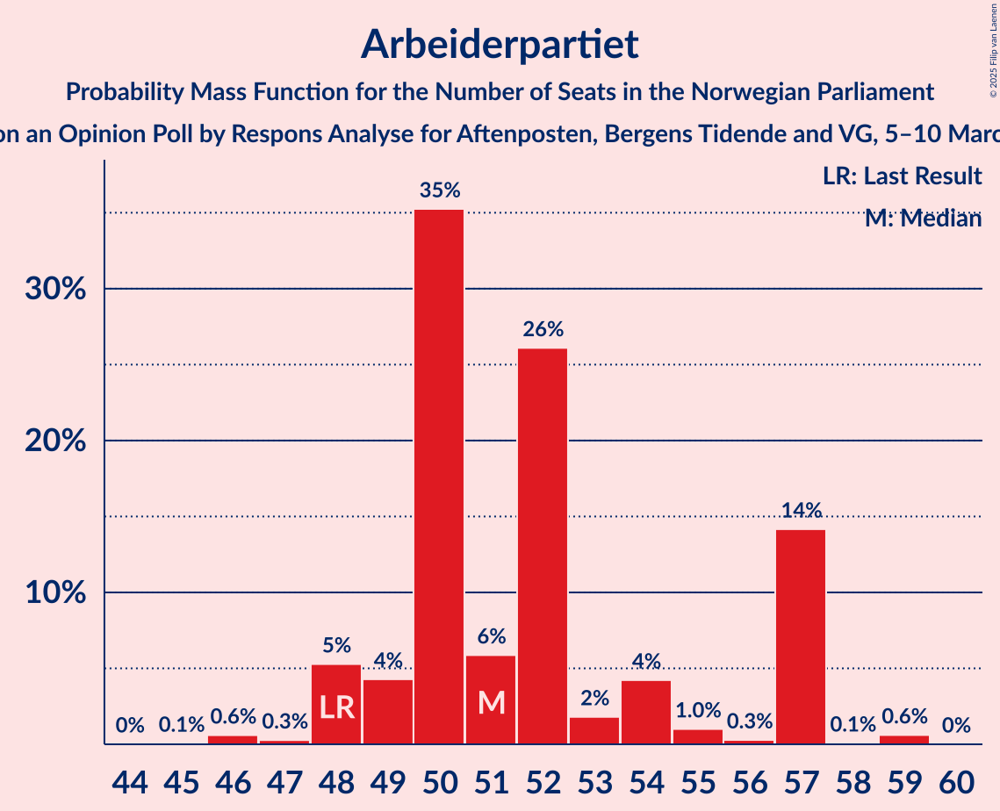
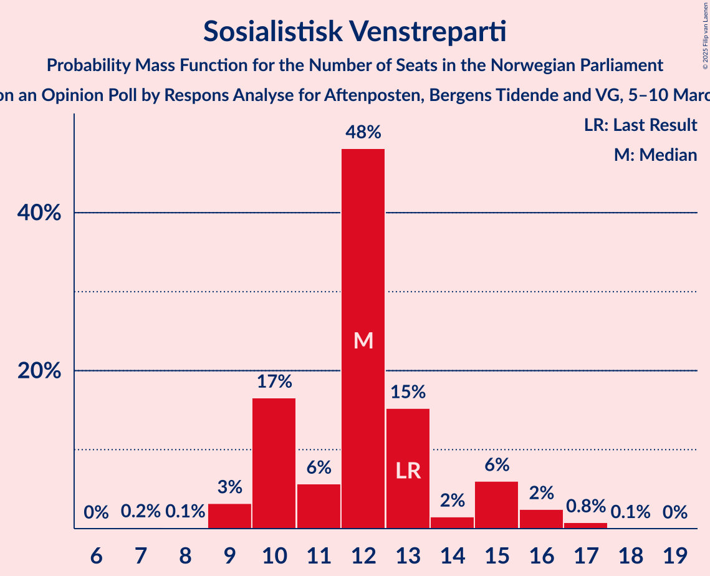
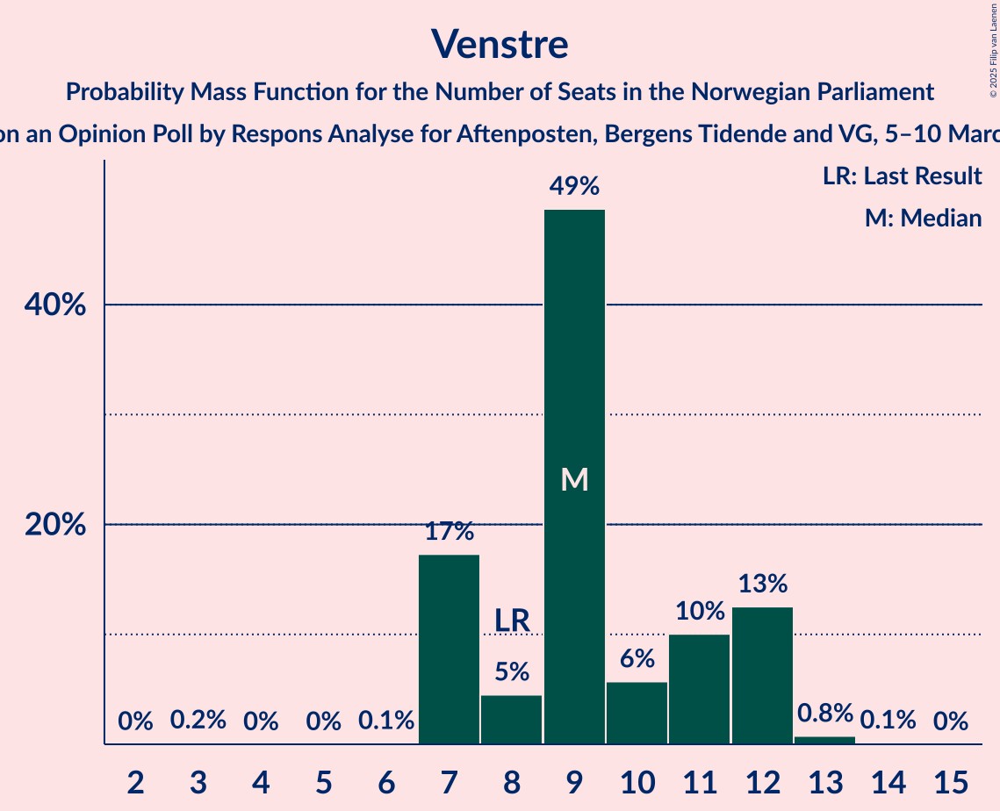
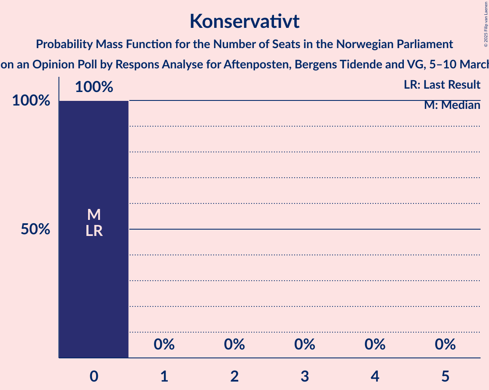
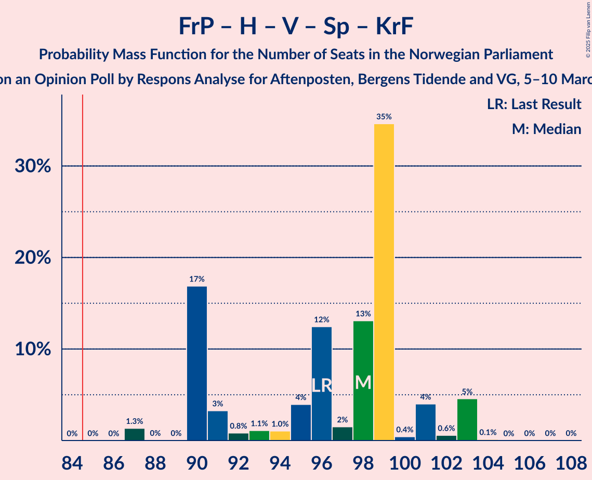
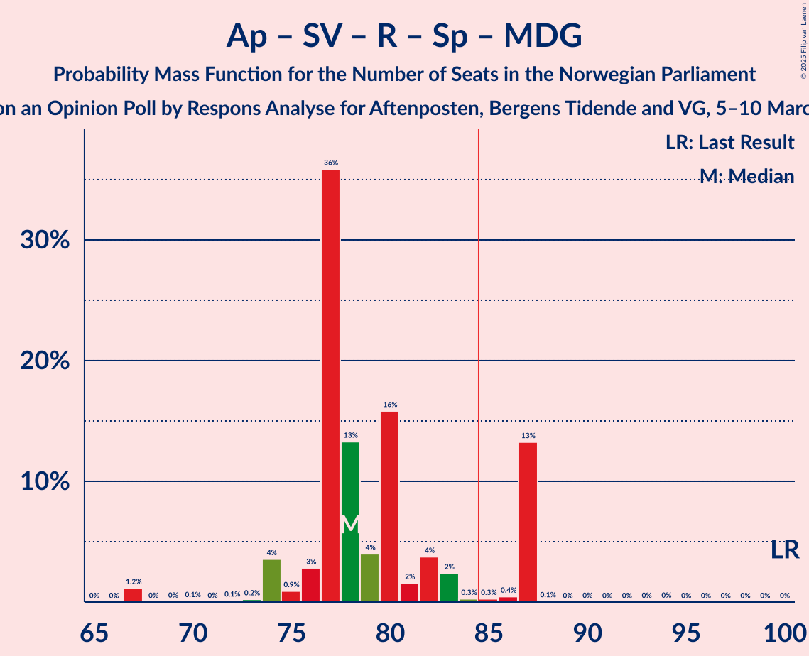
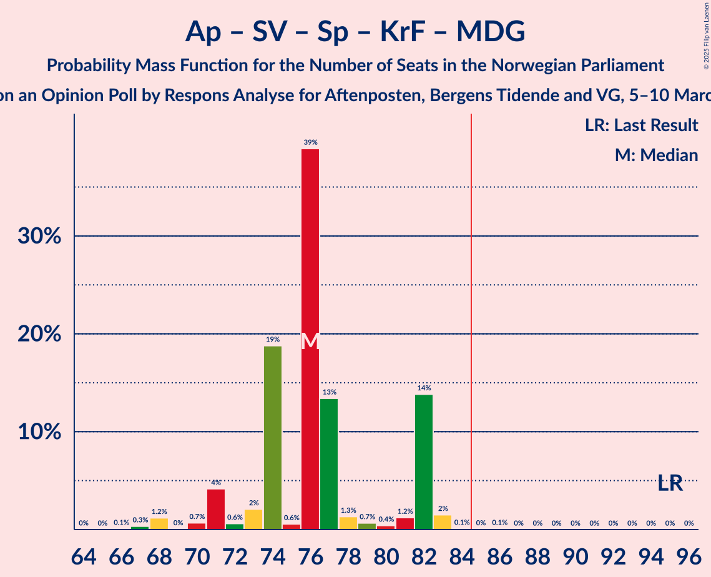
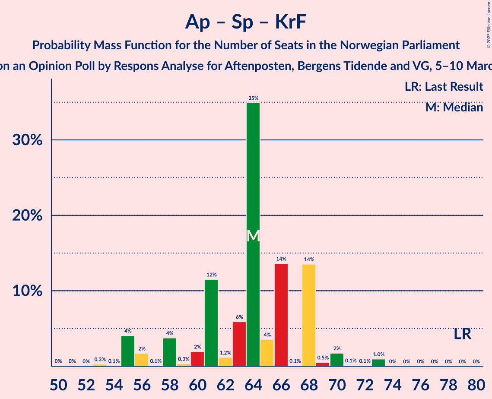

# Opinion Poll by Respons Analyse for Aftenposten, Bergens Tidende and VG, 5–10 March 2025

<a href="#voting-intentions">Voting Intentions</a> | <a href="#seats">Seats</a> | <a href="#coalitions">Coalitions</a> | <a href="#technical-information">Technical Information</a>

## Voting Intentions

### Confidence Intervals

| Party | Last Result | Poll Result | 80% Confidence Interval | 90% Confidence Interval | 95% Confidence Interval | 99% Confidence Interval |
|:-----:|:-----------:|:-----------:|:-----------------------:|:-----------------------:|:-----------------------:|:-----------------------:|
| Arbeiderpartiet | 26.2% | 27.4% | 25.6–29.2% |25.1–29.8% |24.7–30.2% |23.9–31.1% |
| Fremskrittspartiet | 11.6% | 21.5% | 19.9–23.2% |19.4–23.7% |19.0–24.1% |18.3–25.0% |
| Høyre | 20.4% | 20.2% | 18.6–21.9% |18.2–22.4% |17.8–22.8% |17.1–23.6% |
| Sosialistisk Venstreparti | 7.6% | 7.1% | 6.1–8.2% |5.9–8.6% |5.7–8.9% |5.2–9.4% |
| Venstre | 4.6% | 5.4% | 4.6–6.4% |4.3–6.7% |4.2–7.0% |3.8–7.5% |
| Rødt | 4.7% | 5.0% | 4.2–6.0% |4.0–6.3% |3.8–6.5% |3.5–7.0% |
| Senterpartiet | 13.5% | 4.6% | 3.8–5.6% |3.6–5.8% |3.5–6.1% |3.1–6.6% |
| Kristelig Folkeparti | 3.8% | 3.9% | 3.2–4.8% |3.0–5.1% |2.9–5.3% |2.6–5.8% |
| Miljøpartiet De Grønne | 3.9% | 1.9% | 1.4–2.6% |1.3–2.8% |1.2–3.0% |1.0–3.3% |
| Konservativt | 0.4% | 1.0% | 0.7–1.5% |0.6–1.7% |0.5–1.8% |0.4–2.1% |
| Norgesdemokratene | 1.1% | 0.8% | 0.5–1.3% |0.5–1.4% |0.4–1.6% |0.3–1.8% |
| Industri- og Næringspartiet | 0.3% | 0.6% | 0.4–1.1% |0.3–1.2% |0.3–1.3% |0.2–1.6% |
| Pensjonistpartiet | 0.6% | 0.3% | 0.2–0.7% |0.1–0.8% |0.1–0.9% |0.1–1.1% |
| Kystpartiet | 0.0% | 0.1% | 0.0–0.4% |0.0–0.5% |0.0–0.6% |0.0–0.7% |

*Note:* The poll result column reflects the actual value used in the calculations. Published results may vary slightly, and in addition be rounded to fewer digits.

## Seats

### Confidence Intervals

| Party | Last Result | Median | 80% Confidence Interval | 90% Confidence Interval | 95% Confidence Interval | 99% Confidence Interval |
|:-----:|:-----------:|:------:|:-----------------------:|:-----------------------:|:-----------------------:|:-----------------------:|
| <a href="#arbeiderpartiet">Arbeiderpartiet</a> | 48 | 50 | 50–57 |48–57 |48–57 |46–59 |
| <a href="#fremskrittspartiet">Fremskrittspartiet</a> | 21 | 41 | 37–42 |37–42 |37–43 |35–44 |
| <a href="#høyre">Høyre</a> | 36 | 35 | 33–40 |33–40 |33–40 |31–40 |
| <a href="#sosialistisk-venstreparti">Sosialistisk Venstreparti</a> | 13 | 12 | 10–13 |10–13 |9–15 |9–17 |
| <a href="#venstre">Venstre</a> | 8 | 9 | 7–11 |7–11 |7–12 |7–13 |
| <a href="#rødt">Rødt</a> | 8 | 8 | 8 |7–9 |7–10 |7–11 |
| <a href="#senterpartiet">Senterpartiet</a> | 28 | 7 | 7–8 |1–8 |1–9 |0–12 |
| <a href="#kristelig-folkeparti">Kristelig Folkeparti</a> | 3 | 7 | 3–7 |3–7 |2–8 |2–9 |
| <a href="#miljøpartiet-de-grønne">Miljøpartiet De Grønne</a> | 3 | 0 | 0–1 |0–1 |0–1 |0–2 |
| <a href="#konservativt">Konservativt</a> | 0 | 0 | 0 |0 |0 |0 |
| <a href="#norgesdemokratene">Norgesdemokratene</a> | 0 | 0 | 0 |0 |0 |0 |
| <a href="#industri--og-næringspartiet">Industri- og Næringspartiet</a> | 0 | 0 | 0 |0 |0 |0 |
| <a href="#pensjonistpartiet">Pensjonistpartiet</a> | 0 | 0 | 0 |0 |0 |0 |
| <a href="#kystpartiet">Kystpartiet</a> | 0 | 0 | 0 |0 |0 |0 |

### Arbeiderpartiet

*For a full overview of the results for this party, see the [Arbeiderpartiet](party-arbeiderpartiet.html) page.*

| Number of Seats | Probability | Accumulated | Special Marks |
|:---------------:|:-----------:|:-----------:|:-------------:|
| 45 | 0% | 100% |  |
| 46 | 0.8% | 99.9% |  |
| 47 | 0.2% | 99.1% |  |
| 48 | 7% | 98.9% | Last Result |
| 49 | 0.7% | 92% |  |
| 50 | 49% | 92% | Median |
| 51 | 0.4% | 43% |  |
| 52 | 20% | 43% |  |
| 53 | 0.3% | 22% |  |
| 54 | 2% | 22% |  |
| 55 | 0.3% | 20% |  |
| 56 | 0.4% | 20% |  |
| 57 | 19% | 20% |  |
| 58 | 0.1% | 1.0% |  |
| 59 | 0.9% | 0.9% |  |
| 60 | 0% | 0% |  |

### Fremskrittspartiet

*For a full overview of the results for this party, see the [Fremskrittspartiet](party-fremskrittspartiet.html) page.*

| Number of Seats | Probability | Accumulated | Special Marks |
|:---------------:|:-----------:|:-----------:|:-------------:|
| 21 | 0% | 100% | Last Result |
| 22 | 0% | 100% |  |
| 23 | 0% | 100% |  |
| 24 | 0% | 100% |  |
| 25 | 0% | 100% |  |
| 26 | 0% | 100% |  |
| 27 | 0% | 100% |  |
| 28 | 0% | 100% |  |
| 29 | 0% | 100% |  |
| 30 | 0% | 100% |  |
| 31 | 0% | 100% |  |
| 32 | 0% | 100% |  |
| 33 | 0% | 100% |  |
| 34 | 0.4% | 100% |  |
| 35 | 0.5% | 99.5% |  |
| 36 | 0.7% | 99.0% |  |
| 37 | 38% | 98% |  |
| 38 | 0.7% | 60% |  |
| 39 | 0.3% | 59% |  |
| 40 | 0.6% | 59% |  |
| 41 | 49% | 59% | Median |
| 42 | 6% | 10% |  |
| 43 | 3% | 4% |  |
| 44 | 0.2% | 0.5% |  |
| 45 | 0.2% | 0.4% |  |
| 46 | 0% | 0.1% |  |
| 47 | 0% | 0.1% |  |
| 48 | 0% | 0.1% |  |
| 49 | 0.1% | 0.1% |  |
| 50 | 0% | 0% |  |

### Høyre

*For a full overview of the results for this party, see the [Høyre](party-høyre.html) page.*

| Number of Seats | Probability | Accumulated | Special Marks |
|:---------------:|:-----------:|:-----------:|:-------------:|
| 29 | 0% | 100% |  |
| 30 | 0.1% | 99.9% |  |
| 31 | 1.4% | 99.9% |  |
| 32 | 1.0% | 98.5% |  |
| 33 | 20% | 98% |  |
| 34 | 1.0% | 78% |  |
| 35 | 54% | 77% | Median |
| 36 | 0.3% | 23% | Last Result |
| 37 | 0.4% | 22% |  |
| 38 | 2% | 22% |  |
| 39 | 0.5% | 20% |  |
| 40 | 19% | 19% |  |
| 41 | 0% | 0.1% |  |
| 42 | 0% | 0.1% |  |
| 43 | 0% | 0% |  |

### Sosialistisk Venstreparti

*For a full overview of the results for this party, see the [Sosialistisk Venstreparti](party-sosialistiskvenstreparti.html) page.*

| Number of Seats | Probability | Accumulated | Special Marks |
|:---------------:|:-----------:|:-----------:|:-------------:|
| 8 | 0.2% | 100% |  |
| 9 | 3% | 99.8% |  |
| 10 | 19% | 97% |  |
| 11 | 5% | 78% |  |
| 12 | 50% | 73% | Median |
| 13 | 19% | 24% | Last Result |
| 14 | 2% | 5% |  |
| 15 | 1.5% | 3% |  |
| 16 | 0.1% | 1.2% |  |
| 17 | 1.1% | 1.1% |  |
| 18 | 0% | 0% |  |

### Venstre

*For a full overview of the results for this party, see the [Venstre](party-venstre.html) page.*

| Number of Seats | Probability | Accumulated | Special Marks |
|:---------------:|:-----------:|:-----------:|:-------------:|
| 3 | 0.1% | 100% |  |
| 4 | 0% | 99.9% |  |
| 5 | 0% | 99.9% |  |
| 6 | 0.1% | 99.9% |  |
| 7 | 18% | 99.7% |  |
| 8 | 3% | 81% | Last Result |
| 9 | 67% | 79% | Median |
| 10 | 2% | 12% |  |
| 11 | 7% | 10% |  |
| 12 | 2% | 3% |  |
| 13 | 0.5% | 0.6% |  |
| 14 | 0.1% | 0.1% |  |
| 15 | 0% | 0% |  |

### Rødt

*For a full overview of the results for this party, see the [Rødt](party-rødt.html) page.*

| Number of Seats | Probability | Accumulated | Special Marks |
|:---------------:|:-----------:|:-----------:|:-------------:|
| 1 | 0.3% | 100% |  |
| 2 | 0.1% | 99.7% |  |
| 3 | 0% | 99.6% |  |
| 4 | 0% | 99.6% |  |
| 5 | 0% | 99.6% |  |
| 6 | 0.1% | 99.6% |  |
| 7 | 5% | 99.5% |  |
| 8 | 88% | 95% | Last Result, Median |
| 9 | 4% | 7% |  |
| 10 | 3% | 3% |  |
| 11 | 0.7% | 0.8% |  |
| 12 | 0% | 0.1% |  |
| 13 | 0% | 0% |  |

### Senterpartiet

*For a full overview of the results for this party, see the [Senterpartiet](party-senterpartiet.html) page.*

| Number of Seats | Probability | Accumulated | Special Marks |
|:---------------:|:-----------:|:-----------:|:-------------:|
| 0 | 2% | 100% |  |
| 1 | 4% | 98% |  |
| 2 | 0% | 95% |  |
| 3 | 0% | 95% |  |
| 4 | 0% | 95% |  |
| 5 | 0% | 95% |  |
| 6 | 0.3% | 95% |  |
| 7 | 67% | 94% | Median |
| 8 | 24% | 27% |  |
| 9 | 0.8% | 3% |  |
| 10 | 0.8% | 2% |  |
| 11 | 0.9% | 1.5% |  |
| 12 | 0.5% | 0.5% |  |
| 13 | 0% | 0% |  |
| 14 | 0% | 0% |  |
| 15 | 0% | 0% |  |
| 16 | 0% | 0% |  |
| 17 | 0% | 0% |  |
| 18 | 0% | 0% |  |
| 19 | 0% | 0% |  |
| 20 | 0% | 0% |  |
| 21 | 0% | 0% |  |
| 22 | 0% | 0% |  |
| 23 | 0% | 0% |  |
| 24 | 0% | 0% |  |
| 25 | 0% | 0% |  |
| 26 | 0% | 0% |  |
| 27 | 0% | 0% |  |
| 28 | 0% | 0% | Last Result |

### Kristelig Folkeparti

*For a full overview of the results for this party, see the [Kristelig Folkeparti](party-kristeligfolkeparti.html) page.*

| Number of Seats | Probability | Accumulated | Special Marks |
|:---------------:|:-----------:|:-----------:|:-------------:|
| 1 | 0.3% | 100% |  |
| 2 | 2% | 99.6% |  |
| 3 | 22% | 97% | Last Result |
| 4 | 0% | 76% |  |
| 5 | 0% | 76% |  |
| 6 | 0.6% | 76% |  |
| 7 | 72% | 75% | Median |
| 8 | 1.2% | 3% |  |
| 9 | 2% | 2% |  |
| 10 | 0.1% | 0.1% |  |
| 11 | 0% | 0% |  |

### Miljøpartiet De Grønne

*For a full overview of the results for this party, see the [Miljøpartiet De Grønne](party-miljøpartietdegrønne.html) page.*

| Number of Seats | Probability | Accumulated | Special Marks |
|:---------------:|:-----------:|:-----------:|:-------------:|
| 0 | 55% | 100% | Median |
| 1 | 44% | 45% |  |
| 2 | 1.5% | 1.5% |  |
| 3 | 0% | 0% | Last Result |

### Konservativt

*For a full overview of the results for this party, see the [Konservativt](party-konservativt.html) page.*

| Number of Seats | Probability | Accumulated | Special Marks |
|:---------------:|:-----------:|:-----------:|:-------------:|
| 0 | 100% | 100% | Last Result, Median |

### Norgesdemokratene

*For a full overview of the results for this party, see the [Norgesdemokratene](party-norgesdemokratene.html) page.*

| Number of Seats | Probability | Accumulated | Special Marks |
|:---------------:|:-----------:|:-----------:|:-------------:|
| 0 | 100% | 100% | Last Result, Median |

### Industri- og Næringspartiet

*For a full overview of the results for this party, see the [Industri- og Næringspartiet](party-industri-ognæringspartiet.html) page.*

| Number of Seats | Probability | Accumulated | Special Marks |
|:---------------:|:-----------:|:-----------:|:-------------:|
| 0 | 100% | 100% | Last Result, Median |

### Pensjonistpartiet

*For a full overview of the results for this party, see the [Pensjonistpartiet](party-pensjonistpartiet.html) page.*

| Number of Seats | Probability | Accumulated | Special Marks |
|:---------------:|:-----------:|:-----------:|:-------------:|
| 0 | 100% | 100% | Last Result, Median |

### Kystpartiet

*For a full overview of the results for this party, see the [Kystpartiet](party-kystpartiet.html) page.*

| Number of Seats | Probability | Accumulated | Special Marks |
|:---------------:|:-----------:|:-----------:|:-------------:|
| 0 | 99.7% | 100% | Last Result, Median |
| 1 | 0.2% | 0.3% |  |
| 2 | 0% | 0% |  |

## Coalitions

### Confidence Intervals

| Coalition | Last Result | Median | Majority? | 80% Confidence Interval | 90% Confidence Interval | 95% Confidence Interval | 99% Confidence Interval |
|:---------:|:-----------:|:------:|:---------:|:-----------------------:|:-----------------------:|:-----------------------:|:-----------------------:|
| Fremskrittspartiet – Høyre – Venstre – Senterpartiet – Kristelig Folkeparti | 96 | 99 | 100% | 90–99 | 90–103 | 90–103 | 87–103 |
| Fremskrittspartiet – Høyre – Venstre – Kristelig Folkeparti – Miljøpartiet De Grønne | 71 | 92 | 81% | 83–92 | 83–95 | 83–95 | 83–103 |
| Fremskrittspartiet – Høyre – Venstre – Kristelig Folkeparti | 68 | 92 | 80% | 82–92 | 82–95 | 82–95 | 82–102 |
| Fremskrittspartiet – Høyre – Venstre | 65 | 85 | 59% | 79–85 | 79–88 | 79–89 | 78–93 |
| Arbeiderpartiet – Sosialistisk Venstreparti – Rødt – Senterpartiet – Miljøpartiet De Grønne | 100 | 77 | 20% | 77–87 | 74–87 | 74–87 | 67–87 |
| Arbeiderpartiet – Sosialistisk Venstreparti – Rødt – Senterpartiet | 97 | 77 | 19% | 77–86 | 74–86 | 74–86 | 66–86 |
| Arbeiderpartiet – Sosialistisk Venstreparti – Senterpartiet – Kristelig Folkeparti – Miljøpartiet De Grønne | 95 | 76 | 0.1% | 74–82 | 74–82 | 72–82 | 68–82 |
| Fremskrittspartiet – Høyre | 57 | 76 | 0% | 70–77 | 70–77 | 70–80 | 68–81 |
| Arbeiderpartiet – Sosialistisk Venstreparti – Senterpartiet – Miljøpartiet De Grønne | 92 | 69 | 0% | 69–79 | 67–79 | 67–79 | 59–79 |
| Arbeiderpartiet – Sosialistisk Venstreparti – Rødt – Miljøpartiet De Grønne | 72 | 70 | 0% | 70–79 | 66–79 | 66–79 | 66–82 |
| Arbeiderpartiet – Sosialistisk Venstreparti – Senterpartiet | 89 | 69 | 0% | 69–78 | 67–78 | 67–78 | 58–78 |
| Arbeiderpartiet – Sosialistisk Venstreparti | 61 | 62 | 0% | 62–70 | 59–70 | 59–70 | 57–71 |
| Arbeiderpartiet – Senterpartiet – Kristelig Folkeparti – Miljøpartiet De Grønne | 82 | 64 | 0% | 63–69 | 60–69 | 58–69 | 57–71 |
| Arbeiderpartiet – Senterpartiet – Kristelig Folkeparti | 79 | 64 | 0% | 63–68 | 60–68 | 56–68 | 56–70 |
| Arbeiderpartiet – Senterpartiet | 76 | 57 | 0% | 56–65 | 54–65 | 53–65 | 49–67 |
| Høyre – Venstre – Kristelig Folkeparti | 47 | 51 | 0% | 45–54 | 45–54 | 45–55 | 44–59 |
| Venstre – Senterpartiet – Kristelig Folkeparti | 39 | 23 | 0% | 20–23 | 20–26 | 15–26 | 10–26 |

### Fremskrittspartiet – Høyre – Venstre – Senterpartiet – Kristelig Folkeparti

| Number of Seats | Probability | Accumulated | Special Marks |
|:---------------:|:-----------:|:-----------:|:-------------:|
| 85 | 0% | 100% | Majority |
| 86 | 0% | 99.9% |  |
| 87 | 2% | 99.9% |  |
| 88 | 0% | 98% |  |
| 89 | 0% | 98% |  |
| 90 | 18% | 98% |  |
| 91 | 1.3% | 80% |  |
| 92 | 0.1% | 78% |  |
| 93 | 1.3% | 78% |  |
| 94 | 0.6% | 77% |  |
| 95 | 0.5% | 76% |  |
| 96 | 1.1% | 76% | Last Result |
| 97 | 0.1% | 75% |  |
| 98 | 18% | 75% |  |
| 99 | 49% | 56% | Median |
| 100 | 0.2% | 8% |  |
| 101 | 1.0% | 8% |  |
| 102 | 0.1% | 7% |  |
| 103 | 6% | 6% |  |
| 104 | 0% | 0.1% |  |
| 105 | 0% | 0% |  |

### Fremskrittspartiet – Høyre – Venstre – Kristelig Folkeparti – Miljøpartiet De Grønne

| Number of Seats | Probability | Accumulated | Special Marks |
|:---------------:|:-----------:|:-----------:|:-------------:|
| 71 | 0% | 100% | Last Result |
| 72 | 0% | 100% |  |
| 73 | 0% | 100% |  |
| 74 | 0% | 100% |  |
| 75 | 0% | 100% |  |
| 76 | 0.1% | 100% |  |
| 77 | 0% | 99.9% |  |
| 78 | 0% | 99.9% |  |
| 79 | 0% | 99.9% |  |
| 80 | 0% | 99.9% |  |
| 81 | 0% | 99.9% |  |
| 82 | 0% | 99.9% |  |
| 83 | 19% | 99.9% |  |
| 84 | 0.5% | 81% |  |
| 85 | 0.5% | 81% | Majority |
| 86 | 0.2% | 80% |  |
| 87 | 1.2% | 80% |  |
| 88 | 2% | 79% |  |
| 89 | 0.3% | 77% |  |
| 90 | 0.8% | 77% |  |
| 91 | 0.5% | 76% |  |
| 92 | 68% | 75% | Median |
| 93 | 0.2% | 8% |  |
| 94 | 0.8% | 8% |  |
| 95 | 5% | 7% |  |
| 96 | 0.1% | 2% |  |
| 97 | 0.2% | 2% |  |
| 98 | 0.1% | 2% |  |
| 99 | 0% | 2% |  |
| 100 | 0% | 2% |  |
| 101 | 0% | 2% |  |
| 102 | 0% | 2% |  |
| 103 | 2% | 2% |  |
| 104 | 0% | 0% |  |

### Fremskrittspartiet – Høyre – Venstre – Kristelig Folkeparti

| Number of Seats | Probability | Accumulated | Special Marks |
|:---------------:|:-----------:|:-----------:|:-------------:|
| 68 | 0% | 100% | Last Result |
| 69 | 0% | 100% |  |
| 70 | 0% | 100% |  |
| 71 | 0% | 100% |  |
| 72 | 0% | 100% |  |
| 73 | 0% | 100% |  |
| 74 | 0% | 100% |  |
| 75 | 0% | 100% |  |
| 76 | 0% | 100% |  |
| 77 | 0% | 99.9% |  |
| 78 | 0% | 99.9% |  |
| 79 | 0% | 99.9% |  |
| 80 | 0% | 99.9% |  |
| 81 | 0% | 99.9% |  |
| 82 | 19% | 99.9% |  |
| 83 | 0.5% | 81% |  |
| 84 | 0.3% | 81% |  |
| 85 | 0.3% | 80% | Majority |
| 86 | 1.3% | 80% |  |
| 87 | 2% | 79% |  |
| 88 | 0.3% | 77% |  |
| 89 | 0.4% | 77% |  |
| 90 | 2% | 76% |  |
| 91 | 18% | 74% |  |
| 92 | 48% | 56% | Median |
| 93 | 0.1% | 8% |  |
| 94 | 0.8% | 7% |  |
| 95 | 5% | 7% |  |
| 96 | 0.1% | 2% |  |
| 97 | 0.1% | 2% |  |
| 98 | 0% | 2% |  |
| 99 | 0% | 2% |  |
| 100 | 0% | 2% |  |
| 101 | 0% | 2% |  |
| 102 | 2% | 2% |  |
| 103 | 0% | 0% |  |

### Fremskrittspartiet – Høyre – Venstre

| Number of Seats | Probability | Accumulated | Special Marks |
|:---------------:|:-----------:|:-----------:|:-------------:|
| 65 | 0% | 100% | Last Result |
| 66 | 0% | 100% |  |
| 67 | 0% | 100% |  |
| 68 | 0% | 100% |  |
| 69 | 0% | 100% |  |
| 70 | 0% | 100% |  |
| 71 | 0% | 100% |  |
| 72 | 0% | 100% |  |
| 73 | 0% | 100% |  |
| 74 | 0% | 99.9% |  |
| 75 | 0% | 99.9% |  |
| 76 | 0% | 99.9% |  |
| 77 | 0% | 99.9% |  |
| 78 | 0.8% | 99.9% |  |
| 79 | 19% | 99.1% |  |
| 80 | 0.6% | 80% |  |
| 81 | 1.0% | 80% |  |
| 82 | 0.4% | 79% |  |
| 83 | 0.3% | 78% |  |
| 84 | 19% | 78% |  |
| 85 | 49% | 59% | Median, Majority |
| 86 | 0.1% | 10% |  |
| 87 | 2% | 10% |  |
| 88 | 5% | 8% |  |
| 89 | 0.5% | 3% |  |
| 90 | 0.1% | 2% |  |
| 91 | 0.1% | 2% |  |
| 92 | 0% | 2% |  |
| 93 | 2% | 2% |  |
| 94 | 0% | 0.1% |  |
| 95 | 0% | 0.1% |  |
| 96 | 0% | 0.1% |  |
| 97 | 0% | 0% |  |

### Arbeiderpartiet – Sosialistisk Venstreparti – Rødt – Senterpartiet – Miljøpartiet De Grønne

| Number of Seats | Probability | Accumulated | Special Marks |
|:---------------:|:-----------:|:-----------:|:-------------:|
| 67 | 2% | 100% |  |
| 68 | 0% | 98% |  |
| 69 | 0% | 98% |  |
| 70 | 0% | 98% |  |
| 71 | 0% | 98% |  |
| 72 | 0.1% | 98% |  |
| 73 | 0.1% | 98% |  |
| 74 | 5% | 98% |  |
| 75 | 0.8% | 93% |  |
| 76 | 0.1% | 93% |  |
| 77 | 48% | 92% | Median |
| 78 | 18% | 44% |  |
| 79 | 2% | 26% |  |
| 80 | 0.4% | 24% |  |
| 81 | 0.3% | 23% |  |
| 82 | 2% | 23% |  |
| 83 | 1.2% | 21% |  |
| 84 | 0.3% | 20% |  |
| 85 | 0.3% | 20% | Majority |
| 86 | 0.5% | 19% |  |
| 87 | 19% | 19% |  |
| 88 | 0% | 0.1% |  |
| 89 | 0% | 0.1% |  |
| 90 | 0% | 0.1% |  |
| 91 | 0% | 0.1% |  |
| 92 | 0% | 0.1% |  |
| 93 | 0% | 0.1% |  |
| 94 | 0% | 0% |  |
| 95 | 0% | 0% |  |
| 96 | 0% | 0% |  |
| 97 | 0% | 0% |  |
| 98 | 0% | 0% |  |
| 99 | 0% | 0% |  |
| 100 | 0% | 0% | Last Result |

### Arbeiderpartiet – Sosialistisk Venstreparti – Rødt – Senterpartiet

| Number of Seats | Probability | Accumulated | Special Marks |
|:---------------:|:-----------:|:-----------:|:-------------:|
| 66 | 2% | 100% |  |
| 67 | 0% | 98% |  |
| 68 | 0% | 98% |  |
| 69 | 0% | 98% |  |
| 70 | 0% | 98% |  |
| 71 | 0.1% | 98% |  |
| 72 | 0.2% | 98% |  |
| 73 | 0.1% | 98% |  |
| 74 | 5% | 98% |  |
| 75 | 0.8% | 93% |  |
| 76 | 0.2% | 92% |  |
| 77 | 68% | 92% | Median |
| 78 | 0.5% | 25% |  |
| 79 | 0.8% | 24% |  |
| 80 | 0.3% | 23% |  |
| 81 | 2% | 23% |  |
| 82 | 1.3% | 21% |  |
| 83 | 0.1% | 20% |  |
| 84 | 0.5% | 20% |  |
| 85 | 0.5% | 19% | Majority |
| 86 | 19% | 19% |  |
| 87 | 0% | 0.1% |  |
| 88 | 0% | 0.1% |  |
| 89 | 0% | 0.1% |  |
| 90 | 0% | 0.1% |  |
| 91 | 0% | 0.1% |  |
| 92 | 0% | 0.1% |  |
| 93 | 0.1% | 0.1% |  |
| 94 | 0% | 0% |  |
| 95 | 0% | 0% |  |
| 96 | 0% | 0% |  |
| 97 | 0% | 0% | Last Result |

### Arbeiderpartiet – Sosialistisk Venstreparti – Senterpartiet – Kristelig Folkeparti – Miljøpartiet De Grønne

| Number of Seats | Probability | Accumulated | Special Marks |
|:---------------:|:-----------:|:-----------:|:-------------:|
| 66 | 0.1% | 100% |  |
| 67 | 0% | 99.9% |  |
| 68 | 2% | 99.9% |  |
| 69 | 0% | 98% |  |
| 70 | 0.4% | 98% |  |
| 71 | 0.2% | 98% |  |
| 72 | 0.1% | 98% |  |
| 73 | 2% | 97% |  |
| 74 | 7% | 96% |  |
| 75 | 0.3% | 89% |  |
| 76 | 48% | 89% | Median |
| 77 | 19% | 40% |  |
| 78 | 0.2% | 21% |  |
| 79 | 0.7% | 21% |  |
| 80 | 0.5% | 21% |  |
| 81 | 2% | 20% |  |
| 82 | 18% | 19% |  |
| 83 | 0.1% | 0.2% |  |
| 84 | 0% | 0.1% |  |
| 85 | 0% | 0.1% | Majority |
| 86 | 0.1% | 0.1% |  |
| 87 | 0% | 0% |  |
| 88 | 0% | 0% |  |
| 89 | 0% | 0% |  |
| 90 | 0% | 0% |  |
| 91 | 0% | 0% |  |
| 92 | 0% | 0% |  |
| 93 | 0% | 0% |  |
| 94 | 0% | 0% |  |
| 95 | 0% | 0% | Last Result |

### Fremskrittspartiet – Høyre

| Number of Seats | Probability | Accumulated | Special Marks |
|:---------------:|:-----------:|:-----------:|:-------------:|
| 57 | 0% | 100% | Last Result |
| 58 | 0% | 100% |  |
| 59 | 0% | 100% |  |
| 60 | 0% | 100% |  |
| 61 | 0% | 100% |  |
| 62 | 0% | 100% |  |
| 63 | 0.1% | 100% |  |
| 64 | 0% | 99.9% |  |
| 65 | 0% | 99.9% |  |
| 66 | 0% | 99.9% |  |
| 67 | 0% | 99.9% |  |
| 68 | 0.8% | 99.9% |  |
| 69 | 1.3% | 99.1% |  |
| 70 | 18% | 98% |  |
| 71 | 0.5% | 79% |  |
| 72 | 0.1% | 79% |  |
| 73 | 0.8% | 79% |  |
| 74 | 0.2% | 78% |  |
| 75 | 0.5% | 78% |  |
| 76 | 50% | 77% | Median |
| 77 | 24% | 27% |  |
| 78 | 0.1% | 3% |  |
| 79 | 0.5% | 3% |  |
| 80 | 0.6% | 3% |  |
| 81 | 2% | 2% |  |
| 82 | 0.2% | 0.3% |  |
| 83 | 0.1% | 0.1% |  |
| 84 | 0% | 0.1% |  |
| 85 | 0% | 0% | Majority |

### Arbeiderpartiet – Sosialistisk Venstreparti – Senterpartiet – Miljøpartiet De Grønne

| Number of Seats | Probability | Accumulated | Special Marks |
|:---------------:|:-----------:|:-----------:|:-------------:|
| 59 | 2% | 100% |  |
| 60 | 0% | 98% |  |
| 61 | 0.1% | 98% |  |
| 62 | 0% | 98% |  |
| 63 | 0.1% | 98% |  |
| 64 | 0% | 98% |  |
| 65 | 0.1% | 98% |  |
| 66 | 0.2% | 98% |  |
| 67 | 5% | 98% |  |
| 68 | 0.1% | 93% |  |
| 69 | 49% | 92% | Median |
| 70 | 19% | 44% |  |
| 71 | 0.9% | 24% |  |
| 72 | 1.2% | 23% |  |
| 73 | 2% | 22% |  |
| 74 | 0.4% | 21% |  |
| 75 | 0.5% | 20% |  |
| 76 | 0.1% | 20% |  |
| 77 | 0.5% | 20% |  |
| 78 | 0.7% | 19% |  |
| 79 | 18% | 18% |  |
| 80 | 0.1% | 0.2% |  |
| 81 | 0% | 0.1% |  |
| 82 | 0% | 0.1% |  |
| 83 | 0.1% | 0.1% |  |
| 84 | 0% | 0% |  |
| 85 | 0% | 0% | Majority |
| 86 | 0% | 0% |  |
| 87 | 0% | 0% |  |
| 88 | 0% | 0% |  |
| 89 | 0% | 0% |  |
| 90 | 0% | 0% |  |
| 91 | 0% | 0% |  |
| 92 | 0% | 0% | Last Result |

### Arbeiderpartiet – Sosialistisk Venstreparti – Rødt – Miljøpartiet De Grønne

| Number of Seats | Probability | Accumulated | Special Marks |
|:---------------:|:-----------:|:-----------:|:-------------:|
| 65 | 0% | 100% |  |
| 66 | 6% | 99.9% |  |
| 67 | 0.1% | 94% |  |
| 68 | 1.0% | 93% |  |
| 69 | 0.3% | 92% |  |
| 70 | 48% | 92% | Median |
| 71 | 18% | 44% |  |
| 72 | 0.1% | 25% | Last Result |
| 73 | 1.1% | 25% |  |
| 74 | 0.5% | 24% |  |
| 75 | 0.7% | 24% |  |
| 76 | 1.2% | 23% |  |
| 77 | 0.1% | 22% |  |
| 78 | 1.3% | 22% |  |
| 79 | 18% | 20% |  |
| 80 | 0% | 2% |  |
| 81 | 0% | 2% |  |
| 82 | 2% | 2% |  |
| 83 | 0% | 0.1% |  |
| 84 | 0% | 0.1% |  |
| 85 | 0% | 0% | Majority |

### Arbeiderpartiet – Sosialistisk Venstreparti – Senterpartiet

| Number of Seats | Probability | Accumulated | Special Marks |
|:---------------:|:-----------:|:-----------:|:-------------:|
| 58 | 2% | 100% |  |
| 59 | 0% | 98% |  |
| 60 | 0.1% | 98% |  |
| 61 | 0% | 98% |  |
| 62 | 0.1% | 98% |  |
| 63 | 0% | 98% |  |
| 64 | 0.2% | 98% |  |
| 65 | 0.1% | 98% |  |
| 66 | 0.2% | 98% |  |
| 67 | 5% | 98% |  |
| 68 | 2% | 92% |  |
| 69 | 66% | 91% | Median |
| 70 | 0.6% | 24% |  |
| 71 | 2% | 24% |  |
| 72 | 1.5% | 22% |  |
| 73 | 0.5% | 21% |  |
| 74 | 0.4% | 20% |  |
| 75 | 0.2% | 20% |  |
| 76 | 0.5% | 20% |  |
| 77 | 0.7% | 19% |  |
| 78 | 18% | 18% |  |
| 79 | 0.1% | 0.2% |  |
| 80 | 0% | 0.1% |  |
| 81 | 0% | 0.1% |  |
| 82 | 0% | 0.1% |  |
| 83 | 0% | 0% |  |
| 84 | 0% | 0% |  |
| 85 | 0% | 0% | Majority |
| 86 | 0% | 0% |  |
| 87 | 0% | 0% |  |
| 88 | 0% | 0% |  |
| 89 | 0% | 0% | Last Result |

### Arbeiderpartiet – Sosialistisk Venstreparti

| Number of Seats | Probability | Accumulated | Special Marks |
|:---------------:|:-----------:|:-----------:|:-------------:|
| 56 | 0.2% | 100% |  |
| 57 | 2% | 99.8% |  |
| 58 | 0.3% | 98% |  |
| 59 | 5% | 98% |  |
| 60 | 0.9% | 93% |  |
| 61 | 0.4% | 92% | Last Result |
| 62 | 66% | 92% | Median |
| 63 | 1.2% | 25% |  |
| 64 | 0.3% | 24% |  |
| 65 | 0.2% | 24% |  |
| 66 | 2% | 24% |  |
| 67 | 1.4% | 22% |  |
| 68 | 0.4% | 21% |  |
| 69 | 0% | 20% |  |
| 70 | 18% | 20% |  |
| 71 | 2% | 2% |  |
| 72 | 0% | 0.1% |  |
| 73 | 0% | 0.1% |  |
| 74 | 0% | 0% |  |

### Arbeiderpartiet – Senterpartiet – Kristelig Folkeparti – Miljøpartiet De Grønne

| Number of Seats | Probability | Accumulated | Special Marks |
|:---------------:|:-----------:|:-----------:|:-------------:|
| 51 | 0.1% | 100% |  |
| 52 | 0% | 99.9% |  |
| 53 | 0% | 99.9% |  |
| 54 | 0% | 99.9% |  |
| 55 | 0.1% | 99.9% |  |
| 56 | 0.1% | 99.8% |  |
| 57 | 1.1% | 99.7% |  |
| 58 | 1.4% | 98.6% |  |
| 59 | 2% | 97% |  |
| 60 | 0.7% | 95% |  |
| 61 | 0.5% | 95% |  |
| 62 | 0.5% | 94% |  |
| 63 | 5% | 94% |  |
| 64 | 49% | 89% | Median |
| 65 | 0.6% | 40% |  |
| 66 | 0.1% | 40% |  |
| 67 | 19% | 40% |  |
| 68 | 0.1% | 20% |  |
| 69 | 19% | 20% |  |
| 70 | 0.5% | 1.1% |  |
| 71 | 0.5% | 0.6% |  |
| 72 | 0.1% | 0.1% |  |
| 73 | 0% | 0% |  |
| 74 | 0% | 0% |  |
| 75 | 0% | 0% |  |
| 76 | 0% | 0% |  |
| 77 | 0% | 0% |  |
| 78 | 0% | 0% |  |
| 79 | 0% | 0% |  |
| 80 | 0% | 0% |  |
| 81 | 0% | 0% |  |
| 82 | 0% | 0% | Last Result |

### Arbeiderpartiet – Senterpartiet – Kristelig Folkeparti

| Number of Seats | Probability | Accumulated | Special Marks |
|:---------------:|:-----------:|:-----------:|:-------------:|
| 50 | 0.1% | 100% |  |
| 51 | 0% | 99.9% |  |
| 52 | 0% | 99.9% |  |
| 53 | 0% | 99.9% |  |
| 54 | 0% | 99.9% |  |
| 55 | 0.1% | 99.9% |  |
| 56 | 2% | 99.7% |  |
| 57 | 0.1% | 97% |  |
| 58 | 2% | 97% |  |
| 59 | 0% | 95% |  |
| 60 | 0.9% | 95% |  |
| 61 | 0.5% | 94% |  |
| 62 | 0.4% | 94% |  |
| 63 | 5% | 94% |  |
| 64 | 49% | 88% | Median |
| 65 | 0.1% | 40% |  |
| 66 | 19% | 40% |  |
| 67 | 0.1% | 20% |  |
| 68 | 19% | 20% |  |
| 69 | 0.7% | 1.3% |  |
| 70 | 0.5% | 0.6% |  |
| 71 | 0.1% | 0.1% |  |
| 72 | 0.1% | 0.1% |  |
| 73 | 0% | 0% |  |
| 74 | 0% | 0% |  |
| 75 | 0% | 0% |  |
| 76 | 0% | 0% |  |
| 77 | 0% | 0% |  |
| 78 | 0% | 0% |  |
| 79 | 0% | 0% | Last Result |

### Arbeiderpartiet – Senterpartiet

| Number of Seats | Probability | Accumulated | Special Marks |
|:---------------:|:-----------:|:-----------:|:-------------:|
| 47 | 0.1% | 100% |  |
| 48 | 0% | 99.9% |  |
| 49 | 2% | 99.9% |  |
| 50 | 0% | 98% |  |
| 51 | 0.1% | 98% |  |
| 52 | 0% | 98% |  |
| 53 | 2% | 98% |  |
| 54 | 1.2% | 96% |  |
| 55 | 0.1% | 95% |  |
| 56 | 5% | 95% |  |
| 57 | 49% | 90% | Median |
| 58 | 0.2% | 41% |  |
| 59 | 19% | 41% |  |
| 60 | 2% | 22% |  |
| 61 | 0.2% | 21% |  |
| 62 | 0.2% | 21% |  |
| 63 | 1.1% | 20% |  |
| 64 | 0.4% | 19% |  |
| 65 | 18% | 19% |  |
| 66 | 0.2% | 0.7% |  |
| 67 | 0.5% | 0.5% |  |
| 68 | 0% | 0% |  |
| 69 | 0% | 0% |  |
| 70 | 0% | 0% |  |
| 71 | 0% | 0% |  |
| 72 | 0% | 0% |  |
| 73 | 0% | 0% |  |
| 74 | 0% | 0% |  |
| 75 | 0% | 0% |  |
| 76 | 0% | 0% | Last Result |

### Høyre – Venstre – Kristelig Folkeparti

| Number of Seats | Probability | Accumulated | Special Marks |
|:---------------:|:-----------:|:-----------:|:-------------:|
| 41 | 0% | 100% |  |
| 42 | 0.2% | 99.9% |  |
| 43 | 0% | 99.7% |  |
| 44 | 0.3% | 99.7% |  |
| 45 | 20% | 99.4% |  |
| 46 | 0.5% | 79% |  |
| 47 | 2% | 79% | Last Result |
| 48 | 0.9% | 77% |  |
| 49 | 0.9% | 76% |  |
| 50 | 0.5% | 75% |  |
| 51 | 49% | 75% | Median |
| 52 | 0.5% | 26% |  |
| 53 | 5% | 26% |  |
| 54 | 18% | 21% |  |
| 55 | 0.1% | 3% |  |
| 56 | 0% | 2% |  |
| 57 | 0% | 2% |  |
| 58 | 0.7% | 2% |  |
| 59 | 2% | 2% |  |
| 60 | 0% | 0% |  |

### Venstre – Senterpartiet – Kristelig Folkeparti

| Number of Seats | Probability | Accumulated | Special Marks |
|:---------------:|:-----------:|:-----------:|:-------------:|
| 10 | 1.1% | 100% |  |
| 11 | 0.2% | 98.9% |  |
| 12 | 0.1% | 98.7% |  |
| 13 | 0.1% | 98.6% |  |
| 14 | 0.1% | 98.6% |  |
| 15 | 1.3% | 98% |  |
| 16 | 0% | 97% |  |
| 17 | 0.1% | 97% |  |
| 18 | 0.7% | 97% |  |
| 19 | 0.9% | 96% |  |
| 20 | 19% | 96% |  |
| 21 | 18% | 77% |  |
| 22 | 2% | 59% |  |
| 23 | 49% | 57% | Median |
| 24 | 2% | 8% |  |
| 25 | 0.9% | 6% |  |
| 26 | 5% | 5% |  |
| 27 | 0.1% | 0.2% |  |
| 28 | 0% | 0.1% |  |
| 29 | 0% | 0% |  |
| 30 | 0% | 0% |  |
| 31 | 0% | 0% |  |
| 32 | 0% | 0% |  |
| 33 | 0% | 0% |  |
| 34 | 0% | 0% |  |
| 35 | 0% | 0% |  |
| 36 | 0% | 0% |  |
| 37 | 0% | 0% |  |
| 38 | 0% | 0% |  |
| 39 | 0% | 0% | Last Result |

## Technical Information

### Opinion Poll

+ **Polling firm:** Respons Analyse
+ **Commissioner(s):** Aftenposten, Bergens Tidende and VG
+ **Fieldwork period:** 5–10 March 2025

### Calculations

+ **Sample size:** 1001
+ **Simulations done:** 1,048,576
+ **Error estimate:** 2.44%

