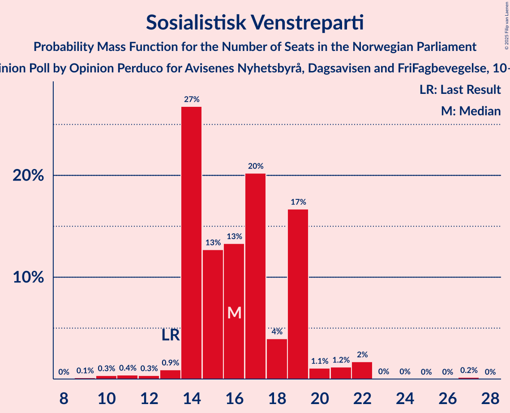
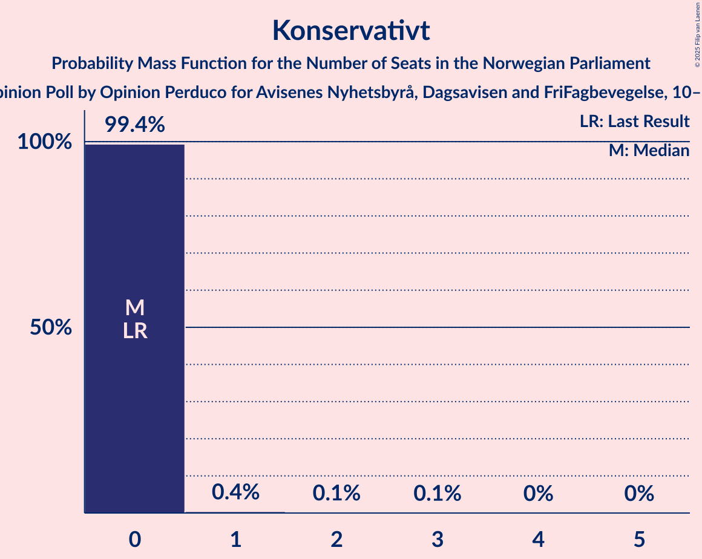
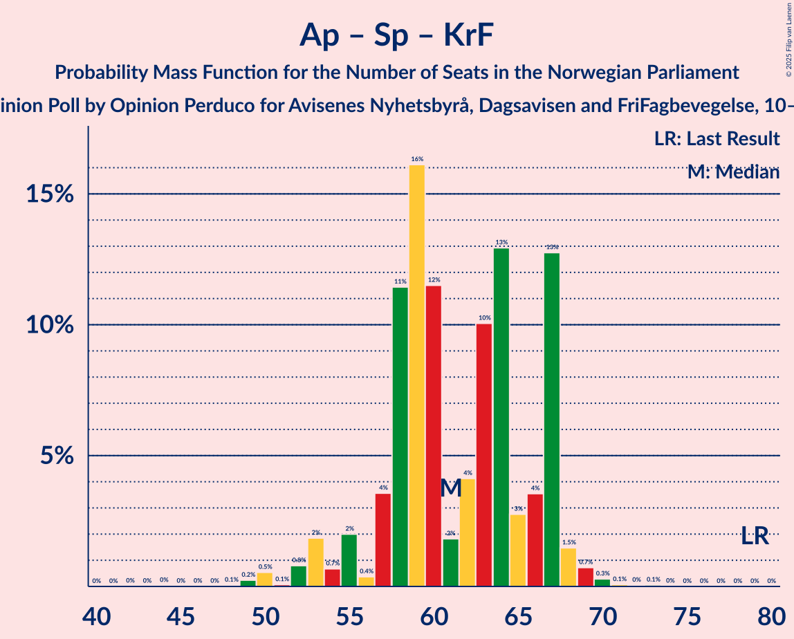

# Opinion Poll by Opinion Perduco for Avisenes Nyhetsbyrå, Dagsavisen and FriFagbevegelse, 10–12 March 2025

<a href="#voting-intentions">Voting Intentions</a> | <a href="#seats">Seats</a> | <a href="#coalitions">Coalitions</a> | <a href="#technical-information">Technical Information</a>

## Voting Intentions

### Confidence Intervals

| Party | Last Result | Poll Result | 80% Confidence Interval | 90% Confidence Interval | 95% Confidence Interval | 99% Confidence Interval |
|:-----:|:-----------:|:-----------:|:-----------------------:|:-----------------------:|:-----------------------:|:-----------------------:|
| Arbeiderpartiet | 26.2% | 25.8% | 23.9–27.9% |23.4–28.5% |22.9–29.0% |22.0–30.0% |
| Fremskrittspartiet | 11.6% | 19.7% | 18.0–21.7% |17.5–22.2% |17.1–22.7% |16.3–23.6% |
| Høyre | 20.4% | 19.5% | 17.8–21.4% |17.3–21.9% |16.9–22.4% |16.1–23.4% |
| Sosialistisk Venstreparti | 7.6% | 9.2% | 8.0–10.7% |7.7–11.1% |7.4–11.5% |6.9–12.2% |
| Rødt | 4.7% | 5.9% | 5.0–7.2% |4.7–7.5% |4.5–7.8% |4.1–8.5% |
| Senterpartiet | 13.5% | 4.7% | 3.8–5.8% |3.6–6.1% |3.4–6.4% |3.0–7.0% |
| Venstre | 4.6% | 4.6% | 3.7–5.7% |3.5–6.0% |3.3–6.2% |3.0–6.8% |
| Kristelig Folkeparti | 3.8% | 3.7% | 2.9–4.7% |2.7–5.0% |2.6–5.2% |2.3–5.8% |
| Miljøpartiet De Grønne | 3.9% | 2.8% | 2.2–3.7% |2.0–4.0% |1.8–4.2% |1.6–4.7% |
| Konservativt | 0.4% | 1.6% | 1.2–2.4% |1.1–2.6% |1.0–2.8% |0.8–3.2% |
| Industri- og Næringspartiet | 0.3% | 1.3% | 0.9–2.0% |0.8–2.1% |0.7–2.3% |0.5–2.7% |
| Norgesdemokratene | 1.1% | 0.3% | 0.1–0.7% |0.1–0.8% |0.1–0.9% |0.0–1.2% |
| Pensjonistpartiet | 0.6% | 0.3% | 0.1–0.7% |0.1–0.8% |0.1–0.9% |0.0–1.2% |

*Note:* The poll result column reflects the actual value used in the calculations. Published results may vary slightly, and in addition be rounded to fewer digits.

## Seats

### Confidence Intervals

| Party | Last Result | Median | 80% Confidence Interval | 90% Confidence Interval | 95% Confidence Interval | 99% Confidence Interval |
|:-----:|:-----------:|:------:|:-----------------------:|:-----------------------:|:-----------------------:|:-----------------------:|
| <a href="#arbeiderpartiet">Arbeiderpartiet</a> | 48 | 49 | 46–54 |44–55 |44–55 |41–57 |
| <a href="#fremskrittspartiet">Fremskrittspartiet</a> | 21 | 39 | 33–41 |33–41 |32–42 |32–43 |
| <a href="#høyre">Høyre</a> | 36 | 34 | 31–38 |30–41 |29–41 |29–44 |
| <a href="#sosialistisk-venstreparti">Sosialistisk Venstreparti</a> | 13 | 16 | 14–19 |14–19 |14–21 |11–22 |
| <a href="#rødt">Rødt</a> | 8 | 10 | 9–12 |9–13 |8–14 |7–16 |
| <a href="#senterpartiet">Senterpartiet</a> | 28 | 9 | 1–12 |0–12 |0–12 |0–12 |
| <a href="#venstre">Venstre</a> | 8 | 7 | 2–9 |2–9 |2–10 |2–12 |
| <a href="#kristelig-folkeparti">Kristelig Folkeparti</a> | 3 | 3 | 2–8 |1–9 |1–9 |1–9 |
| <a href="#miljøpartiet-de-grønne">Miljøpartiet De Grønne</a> | 3 | 2 | 1–7 |1–7 |1–8 |1–8 |
| <a href="#konservativt">Konservativt</a> | 0 | 0 | 0 |0 |0 |0–1 |
| <a href="#industri--og-næringspartiet">Industri- og Næringspartiet</a> | 0 | 0 | 0 |0 |0 |0–1 |
| <a href="#norgesdemokratene">Norgesdemokratene</a> | 0 | 0 | 0 |0 |0 |0 |
| <a href="#pensjonistpartiet">Pensjonistpartiet</a> | 0 | 0 | 0 |0 |0 |0 |

### Arbeiderpartiet

*For a full overview of the results for this party, see the [Arbeiderpartiet](party-arbeiderpartiet.html) page.*

| Number of Seats | Probability | Accumulated | Special Marks |
|:---------------:|:-----------:|:-----------:|:-------------:|
| 39 | 0.1% | 100% |  |
| 40 | 0.1% | 99.9% |  |
| 41 | 0.3% | 99.8% |  |
| 42 | 0.2% | 99.5% |  |
| 43 | 1.1% | 99.3% |  |
| 44 | 5% | 98% |  |
| 45 | 3% | 93% |  |
| 46 | 7% | 90% |  |
| 47 | 11% | 83% |  |
| 48 | 16% | 72% | Last Result |
| 49 | 20% | 56% | Median |
| 50 | 19% | 37% |  |
| 51 | 2% | 18% |  |
| 52 | 1.3% | 16% |  |
| 53 | 3% | 15% |  |
| 54 | 4% | 11% |  |
| 55 | 6% | 8% |  |
| 56 | 0.6% | 1.2% |  |
| 57 | 0.1% | 0.6% |  |
| 58 | 0.4% | 0.5% |  |
| 59 | 0% | 0.1% |  |
| 60 | 0% | 0.1% |  |
| 61 | 0% | 0% |  |

### Fremskrittspartiet

*For a full overview of the results for this party, see the [Fremskrittspartiet](party-fremskrittspartiet.html) page.*

| Number of Seats | Probability | Accumulated | Special Marks |
|:---------------:|:-----------:|:-----------:|:-------------:|
| 21 | 0% | 100% | Last Result |
| 22 | 0% | 100% |  |
| 23 | 0% | 100% |  |
| 24 | 0% | 100% |  |
| 25 | 0% | 100% |  |
| 26 | 0% | 100% |  |
| 27 | 0% | 100% |  |
| 28 | 0% | 100% |  |
| 29 | 0% | 100% |  |
| 30 | 0.3% | 100% |  |
| 31 | 0.2% | 99.7% |  |
| 32 | 4% | 99.5% |  |
| 33 | 10% | 96% |  |
| 34 | 2% | 86% |  |
| 35 | 5% | 84% |  |
| 36 | 7% | 79% |  |
| 37 | 4% | 72% |  |
| 38 | 17% | 68% |  |
| 39 | 29% | 51% | Median |
| 40 | 12% | 22% |  |
| 41 | 7% | 10% |  |
| 42 | 3% | 3% |  |
| 43 | 0.2% | 0.5% |  |
| 44 | 0.2% | 0.4% |  |
| 45 | 0.1% | 0.2% |  |
| 46 | 0% | 0.1% |  |
| 47 | 0% | 0% |  |

### Høyre

*For a full overview of the results for this party, see the [Høyre](party-høyre.html) page.*

| Number of Seats | Probability | Accumulated | Special Marks |
|:---------------:|:-----------:|:-----------:|:-------------:|
| 26 | 0% | 100% |  |
| 27 | 0% | 99.9% |  |
| 28 | 0.1% | 99.9% |  |
| 29 | 3% | 99.8% |  |
| 30 | 5% | 97% |  |
| 31 | 3% | 92% |  |
| 32 | 4% | 89% |  |
| 33 | 13% | 86% |  |
| 34 | 26% | 73% | Median |
| 35 | 5% | 46% |  |
| 36 | 24% | 42% | Last Result |
| 37 | 6% | 17% |  |
| 38 | 3% | 12% |  |
| 39 | 3% | 9% |  |
| 40 | 0.4% | 6% |  |
| 41 | 4% | 5% |  |
| 42 | 0.3% | 1.3% |  |
| 43 | 0.1% | 1.1% |  |
| 44 | 0.7% | 0.9% |  |
| 45 | 0% | 0.2% |  |
| 46 | 0.2% | 0.2% |  |
| 47 | 0% | 0% |  |

### Sosialistisk Venstreparti

*For a full overview of the results for this party, see the [Sosialistisk Venstreparti](party-sosialistiskvenstreparti.html) page.*

| Number of Seats | Probability | Accumulated | Special Marks |
|:---------------:|:-----------:|:-----------:|:-------------:|
| 9 | 0.1% | 100% |  |
| 10 | 0.3% | 99.9% |  |
| 11 | 0.4% | 99.5% |  |
| 12 | 0.3% | 99.1% |  |
| 13 | 0.9% | 98.8% | Last Result |
| 14 | 27% | 98% |  |
| 15 | 13% | 71% |  |
| 16 | 13% | 58% | Median |
| 17 | 20% | 45% |  |
| 18 | 4% | 25% |  |
| 19 | 17% | 21% |  |
| 20 | 1.1% | 4% |  |
| 21 | 1.2% | 3% |  |
| 22 | 2% | 2% |  |
| 23 | 0% | 0.3% |  |
| 24 | 0% | 0.2% |  |
| 25 | 0% | 0.2% |  |
| 26 | 0% | 0.2% |  |
| 27 | 0.2% | 0.2% |  |
| 28 | 0% | 0% |  |

### Rødt

*For a full overview of the results for this party, see the [Rødt](party-rødt.html) page.*

| Number of Seats | Probability | Accumulated | Special Marks |
|:---------------:|:-----------:|:-----------:|:-------------:|
| 1 | 0.4% | 100% |  |
| 2 | 0% | 99.6% |  |
| 3 | 0% | 99.6% |  |
| 4 | 0% | 99.6% |  |
| 5 | 0% | 99.6% |  |
| 6 | 0% | 99.6% |  |
| 7 | 1.2% | 99.6% |  |
| 8 | 2% | 98% | Last Result |
| 9 | 26% | 96% |  |
| 10 | 27% | 70% | Median |
| 11 | 15% | 44% |  |
| 12 | 20% | 29% |  |
| 13 | 5% | 9% |  |
| 14 | 2% | 4% |  |
| 15 | 0.4% | 1.4% |  |
| 16 | 0.9% | 1.0% |  |
| 17 | 0% | 0% |  |

### Senterpartiet

*For a full overview of the results for this party, see the [Senterpartiet](party-senterpartiet.html) page.*

| Number of Seats | Probability | Accumulated | Special Marks |
|:---------------:|:-----------:|:-----------:|:-------------:|
| 0 | 6% | 100% |  |
| 1 | 10% | 94% |  |
| 2 | 0% | 84% |  |
| 3 | 0% | 84% |  |
| 4 | 0% | 84% |  |
| 5 | 0% | 84% |  |
| 6 | 0.1% | 84% |  |
| 7 | 5% | 84% |  |
| 8 | 29% | 79% |  |
| 9 | 15% | 50% | Median |
| 10 | 14% | 35% |  |
| 11 | 8% | 21% |  |
| 12 | 12% | 13% |  |
| 13 | 0.4% | 0.4% |  |
| 14 | 0% | 0.1% |  |
| 15 | 0% | 0% |  |
| 16 | 0% | 0% |  |
| 17 | 0% | 0% |  |
| 18 | 0% | 0% |  |
| 19 | 0% | 0% |  |
| 20 | 0% | 0% |  |
| 21 | 0% | 0% |  |
| 22 | 0% | 0% |  |
| 23 | 0% | 0% |  |
| 24 | 0% | 0% |  |
| 25 | 0% | 0% |  |
| 26 | 0% | 0% |  |
| 27 | 0% | 0% |  |
| 28 | 0% | 0% | Last Result |

### Venstre

*For a full overview of the results for this party, see the [Venstre](party-venstre.html) page.*

| Number of Seats | Probability | Accumulated | Special Marks |
|:---------------:|:-----------:|:-----------:|:-------------:|
| 2 | 13% | 100% |  |
| 3 | 27% | 87% |  |
| 4 | 0% | 60% |  |
| 5 | 0% | 60% |  |
| 6 | 0.1% | 60% |  |
| 7 | 33% | 60% | Median |
| 8 | 5% | 27% | Last Result |
| 9 | 17% | 21% |  |
| 10 | 3% | 5% |  |
| 11 | 0.8% | 1.5% |  |
| 12 | 0.4% | 0.7% |  |
| 13 | 0.1% | 0.3% |  |
| 14 | 0.1% | 0.2% |  |
| 15 | 0% | 0% |  |

### Kristelig Folkeparti

*For a full overview of the results for this party, see the [Kristelig Folkeparti](party-kristeligfolkeparti.html) page.*

| Number of Seats | Probability | Accumulated | Special Marks |
|:---------------:|:-----------:|:-----------:|:-------------:|
| 0 | 0.2% | 100% |  |
| 1 | 6% | 99.8% |  |
| 2 | 15% | 94% |  |
| 3 | 39% | 79% | Last Result, Median |
| 4 | 0% | 40% |  |
| 5 | 0% | 40% |  |
| 6 | 0.3% | 40% |  |
| 7 | 27% | 39% |  |
| 8 | 5% | 13% |  |
| 9 | 7% | 8% |  |
| 10 | 0.3% | 0.4% |  |
| 11 | 0.1% | 0.1% |  |
| 12 | 0% | 0% |  |

### Miljøpartiet De Grønne

*For a full overview of the results for this party, see the [Miljøpartiet De Grønne](party-miljøpartietdegrønne.html) page.*

| Number of Seats | Probability | Accumulated | Special Marks |
|:---------------:|:-----------:|:-----------:|:-------------:|
| 0 | 0.2% | 100% |  |
| 1 | 38% | 99.8% |  |
| 2 | 45% | 62% | Median |
| 3 | 2% | 17% | Last Result |
| 4 | 0% | 16% |  |
| 5 | 0% | 16% |  |
| 6 | 0% | 16% |  |
| 7 | 13% | 16% |  |
| 8 | 3% | 3% |  |
| 9 | 0.2% | 0.3% |  |
| 10 | 0.1% | 0.1% |  |
| 11 | 0% | 0% |  |

### Konservativt

*For a full overview of the results for this party, see the [Konservativt](party-konservativt.html) page.*

| Number of Seats | Probability | Accumulated | Special Marks |
|:---------------:|:-----------:|:-----------:|:-------------:|
| 0 | 99.4% | 100% | Last Result, Median |
| 1 | 0.4% | 0.6% |  |
| 2 | 0.1% | 0.2% |  |
| 3 | 0.1% | 0.1% |  |
| 4 | 0% | 0% |  |

### Industri- og Næringspartiet

*For a full overview of the results for this party, see the [Industri- og Næringspartiet](party-industri-ognæringspartiet.html) page.*

| Number of Seats | Probability | Accumulated | Special Marks |
|:---------------:|:-----------:|:-----------:|:-------------:|
| 0 | 99.4% | 100% | Last Result, Median |
| 1 | 0.1% | 0.6% |  |
| 2 | 0.5% | 0.5% |  |
| 3 | 0% | 0% |  |

### Norgesdemokratene

*For a full overview of the results for this party, see the [Norgesdemokratene](party-norgesdemokratene.html) page.*

| Number of Seats | Probability | Accumulated | Special Marks |
|:---------------:|:-----------:|:-----------:|:-------------:|
| 0 | 100% | 100% | Last Result, Median |

### Pensjonistpartiet

*For a full overview of the results for this party, see the [Pensjonistpartiet](party-pensjonistpartiet.html) page.*

| Number of Seats | Probability | Accumulated | Special Marks |
|:---------------:|:-----------:|:-----------:|:-------------:|
| 0 | 100% | 100% | Last Result, Median |

## Coalitions

### Confidence Intervals

| Coalition | Last Result | Median | Majority? | 80% Confidence Interval | 90% Confidence Interval | 95% Confidence Interval | 99% Confidence Interval |
|:---------:|:-----------:|:------:|:---------:|:-----------------------:|:-----------------------:|:-----------------------:|:-----------------------:|
| Fremskrittspartiet – Høyre – Senterpartiet – Venstre – Kristelig Folkeparti | 96 | 91 | 95% | 88–94 | 85–98 | 84–98 | 82–100 |
| Fremskrittspartiet – Høyre – Venstre – Kristelig Folkeparti – Miljøpartiet De Grønne | 71 | 86 | 56% | 78–89 | 78–94 | 77–97 | 76–97 |
| Arbeiderpartiet – Sosialistisk Venstreparti – Rødt – Senterpartiet – Miljøpartiet De Grønne | 100 | 87 | 60% | 82–92 | 79–92 | 79–94 | 75–94 |
| Arbeiderpartiet – Sosialistisk Venstreparti – Rødt – Senterpartiet | 97 | 83 | 43% | 80–91 | 74–91 | 72–92 | 72–93 |
| Fremskrittspartiet – Høyre – Venstre – Kristelig Folkeparti | 68 | 82 | 40% | 77–87 | 77–90 | 75–90 | 75–94 |
| Arbeiderpartiet – Sosialistisk Venstreparti – Senterpartiet – Kristelig Folkeparti – Miljøpartiet De Grønne | 95 | 80 | 18% | 74–87 | 74–87 | 72–87 | 70–88 |
| Arbeiderpartiet – Sosialistisk Venstreparti – Rødt – Miljøpartiet De Grønne | 72 | 78 | 5% | 75–81 | 71–84 | 71–85 | 69–87 |
| Fremskrittspartiet – Høyre – Venstre | 65 | 79 | 3% | 70–84 | 70–84 | 70–85 | 70–89 |
| Arbeiderpartiet – Sosialistisk Venstreparti – Senterpartiet – Miljøpartiet De Grønne | 92 | 77 | 0.2% | 71–80 | 69–80 | 68–84 | 65–84 |
| Arbeiderpartiet – Sosialistisk Venstreparti – Senterpartiet | 89 | 74 | 0.1% | 69–79 | 65–79 | 63–82 | 63–82 |
| Fremskrittspartiet – Høyre | 57 | 72 | 0.1% | 67–76 | 67–79 | 66–79 | 64–81 |
| Arbeiderpartiet – Sosialistisk Venstreparti | 61 | 66 | 0% | 62–69 | 61–70 | 60–73 | 57–75 |
| Arbeiderpartiet – Senterpartiet – Kristelig Folkeparti – Miljøpartiet De Grønne | 82 | 65 | 0% | 59–68 | 57–68 | 55–69 | 51–71 |
| Arbeiderpartiet – Senterpartiet – Kristelig Folkeparti | 79 | 61 | 0% | 57–67 | 55–67 | 53–68 | 50–69 |
| Arbeiderpartiet – Senterpartiet | 76 | 57 | 0% | 52–60 | 49–62 | 49–63 | 47–65 |
| Høyre – Venstre – Kristelig Folkeparti | 47 | 44 | 0% | 41–51 | 41–51 | 40–53 | 38–56 |
| Senterpartiet – Venstre – Kristelig Folkeparti | 39 | 19 | 0% | 13–23 | 12–26 | 12–26 | 5–27 |

### Fremskrittspartiet – Høyre – Senterpartiet – Venstre – Kristelig Folkeparti

| Number of Seats | Probability | Accumulated | Special Marks |
|:---------------:|:-----------:|:-----------:|:-------------:|
| 76 | 0% | 100% |  |
| 77 | 0% | 99.9% |  |
| 78 | 0% | 99.9% |  |
| 79 | 0.1% | 99.9% |  |
| 80 | 0% | 99.8% |  |
| 81 | 0.1% | 99.8% |  |
| 82 | 0.6% | 99.7% |  |
| 83 | 0.3% | 99.1% |  |
| 84 | 4% | 98.9% |  |
| 85 | 1.3% | 95% | Majority |
| 86 | 1.1% | 94% |  |
| 87 | 0.7% | 93% |  |
| 88 | 17% | 92% |  |
| 89 | 14% | 75% |  |
| 90 | 3% | 61% |  |
| 91 | 24% | 58% |  |
| 92 | 7% | 34% | Median |
| 93 | 5% | 27% |  |
| 94 | 12% | 22% |  |
| 95 | 1.4% | 10% |  |
| 96 | 2% | 8% | Last Result |
| 97 | 0.9% | 6% |  |
| 98 | 4% | 5% |  |
| 99 | 0.1% | 1.4% |  |
| 100 | 1.0% | 1.3% |  |
| 101 | 0.1% | 0.3% |  |
| 102 | 0.2% | 0.2% |  |
| 103 | 0% | 0% |  |

### Fremskrittspartiet – Høyre – Venstre – Kristelig Folkeparti – Miljøpartiet De Grønne

| Number of Seats | Probability | Accumulated | Special Marks |
|:---------------:|:-----------:|:-----------:|:-------------:|
| 71 | 0% | 100% | Last Result |
| 72 | 0.1% | 100% |  |
| 73 | 0% | 99.9% |  |
| 74 | 0.2% | 99.9% |  |
| 75 | 0% | 99.7% |  |
| 76 | 0.2% | 99.6% |  |
| 77 | 3% | 99.5% |  |
| 78 | 10% | 96% |  |
| 79 | 3% | 86% |  |
| 80 | 0.8% | 84% |  |
| 81 | 2% | 83% |  |
| 82 | 12% | 81% |  |
| 83 | 9% | 69% |  |
| 84 | 4% | 60% |  |
| 85 | 3% | 56% | Median, Majority |
| 86 | 7% | 53% |  |
| 87 | 1.4% | 46% |  |
| 88 | 23% | 45% |  |
| 89 | 13% | 21% |  |
| 90 | 0.5% | 9% |  |
| 91 | 1.5% | 8% |  |
| 92 | 0.7% | 7% |  |
| 93 | 0.6% | 6% |  |
| 94 | 0.7% | 5% |  |
| 95 | 0.8% | 5% |  |
| 96 | 0.1% | 4% |  |
| 97 | 4% | 4% |  |
| 98 | 0% | 0.1% |  |
| 99 | 0% | 0.1% |  |
| 100 | 0% | 0% |  |

### Arbeiderpartiet – Sosialistisk Venstreparti – Rødt – Senterpartiet – Miljøpartiet De Grønne

| Number of Seats | Probability | Accumulated | Special Marks |
|:---------------:|:-----------:|:-----------:|:-------------:|
| 72 | 0% | 100% |  |
| 73 | 0% | 99.9% |  |
| 74 | 0.1% | 99.9% |  |
| 75 | 0.6% | 99.8% |  |
| 76 | 0.6% | 99.3% |  |
| 77 | 0.4% | 98.6% |  |
| 78 | 0.4% | 98% |  |
| 79 | 4% | 98% |  |
| 80 | 1.3% | 93% |  |
| 81 | 1.4% | 92% |  |
| 82 | 12% | 91% |  |
| 83 | 14% | 79% |  |
| 84 | 5% | 65% |  |
| 85 | 2% | 60% | Majority |
| 86 | 6% | 57% | Median |
| 87 | 9% | 51% |  |
| 88 | 13% | 42% |  |
| 89 | 10% | 29% |  |
| 90 | 1.1% | 19% |  |
| 91 | 4% | 18% |  |
| 92 | 10% | 14% |  |
| 93 | 0.5% | 4% |  |
| 94 | 3% | 4% |  |
| 95 | 0% | 0.5% |  |
| 96 | 0.2% | 0.4% |  |
| 97 | 0.1% | 0.2% |  |
| 98 | 0.1% | 0.1% |  |
| 99 | 0% | 0% |  |
| 100 | 0% | 0% | Last Result |

### Arbeiderpartiet – Sosialistisk Venstreparti – Rødt – Senterpartiet

| Number of Seats | Probability | Accumulated | Special Marks |
|:---------------:|:-----------:|:-----------:|:-------------:|
| 70 | 0% | 100% |  |
| 71 | 0.1% | 99.9% |  |
| 72 | 4% | 99.8% |  |
| 73 | 0.2% | 96% |  |
| 74 | 0.9% | 96% |  |
| 75 | 0.7% | 95% |  |
| 76 | 0.3% | 94% |  |
| 77 | 0.7% | 94% |  |
| 78 | 2% | 93% |  |
| 79 | 0.5% | 92% |  |
| 80 | 13% | 91% |  |
| 81 | 24% | 79% |  |
| 82 | 2% | 55% |  |
| 83 | 6% | 53% |  |
| 84 | 3% | 47% | Median |
| 85 | 3% | 43% | Majority |
| 86 | 10% | 40% |  |
| 87 | 11% | 31% |  |
| 88 | 2% | 19% |  |
| 89 | 0.7% | 17% |  |
| 90 | 3% | 16% |  |
| 91 | 10% | 14% |  |
| 92 | 3% | 4% |  |
| 93 | 0.2% | 0.5% |  |
| 94 | 0% | 0.4% |  |
| 95 | 0.2% | 0.3% |  |
| 96 | 0% | 0.1% |  |
| 97 | 0.1% | 0.1% | Last Result |
| 98 | 0% | 0% |  |

### Fremskrittspartiet – Høyre – Venstre – Kristelig Folkeparti

| Number of Seats | Probability | Accumulated | Special Marks |
|:---------------:|:-----------:|:-----------:|:-------------:|
| 68 | 0% | 100% | Last Result |
| 69 | 0% | 100% |  |
| 70 | 0% | 100% |  |
| 71 | 0.1% | 100% |  |
| 72 | 0.1% | 99.9% |  |
| 73 | 0.2% | 99.8% |  |
| 74 | 0.1% | 99.6% |  |
| 75 | 3% | 99.5% |  |
| 76 | 0.5% | 96% |  |
| 77 | 10% | 96% |  |
| 78 | 4% | 86% |  |
| 79 | 1.2% | 82% |  |
| 80 | 10% | 81% |  |
| 81 | 13% | 71% |  |
| 82 | 10% | 58% |  |
| 83 | 6% | 49% | Median |
| 84 | 3% | 42% |  |
| 85 | 5% | 40% | Majority |
| 86 | 14% | 35% |  |
| 87 | 11% | 20% |  |
| 88 | 1.2% | 9% |  |
| 89 | 1.3% | 8% |  |
| 90 | 4% | 6% |  |
| 91 | 0.7% | 2% |  |
| 92 | 0.1% | 1.4% |  |
| 93 | 0.8% | 1.3% |  |
| 94 | 0.4% | 0.5% |  |
| 95 | 0.1% | 0.1% |  |
| 96 | 0% | 0.1% |  |
| 97 | 0% | 0% |  |

### Arbeiderpartiet – Sosialistisk Venstreparti – Senterpartiet – Kristelig Folkeparti – Miljøpartiet De Grønne

| Number of Seats | Probability | Accumulated | Special Marks |
|:---------------:|:-----------:|:-----------:|:-------------:|
| 63 | 0% | 100% |  |
| 64 | 0% | 99.9% |  |
| 65 | 0% | 99.9% |  |
| 66 | 0% | 99.9% |  |
| 67 | 0.2% | 99.9% |  |
| 68 | 0.1% | 99.6% |  |
| 69 | 0.1% | 99.6% |  |
| 70 | 0.3% | 99.5% |  |
| 71 | 1.0% | 99.2% |  |
| 72 | 1.1% | 98% |  |
| 73 | 0.9% | 97% |  |
| 74 | 7% | 96% |  |
| 75 | 1.1% | 89% |  |
| 76 | 7% | 88% |  |
| 77 | 3% | 81% |  |
| 78 | 2% | 78% |  |
| 79 | 18% | 76% | Median |
| 80 | 16% | 58% |  |
| 81 | 19% | 43% |  |
| 82 | 3% | 23% |  |
| 83 | 1.4% | 20% |  |
| 84 | 0.3% | 18% |  |
| 85 | 1.2% | 18% | Majority |
| 86 | 4% | 17% |  |
| 87 | 13% | 13% |  |
| 88 | 0.1% | 0.5% |  |
| 89 | 0.1% | 0.4% |  |
| 90 | 0.2% | 0.3% |  |
| 91 | 0.1% | 0.1% |  |
| 92 | 0% | 0% |  |
| 93 | 0% | 0% |  |
| 94 | 0% | 0% |  |
| 95 | 0% | 0% | Last Result |

### Arbeiderpartiet – Sosialistisk Venstreparti – Rødt – Miljøpartiet De Grønne

| Number of Seats | Probability | Accumulated | Special Marks |
|:---------------:|:-----------:|:-----------:|:-------------:|
| 67 | 0.2% | 100% |  |
| 68 | 0.2% | 99.7% |  |
| 69 | 0.9% | 99.5% |  |
| 70 | 0.4% | 98.7% |  |
| 71 | 4% | 98% |  |
| 72 | 1.2% | 95% | Last Result |
| 73 | 2% | 94% |  |
| 74 | 1.2% | 91% |  |
| 75 | 13% | 90% |  |
| 76 | 4% | 77% |  |
| 77 | 7% | 73% | Median |
| 78 | 24% | 66% |  |
| 79 | 3% | 42% |  |
| 80 | 14% | 39% |  |
| 81 | 17% | 25% |  |
| 82 | 0.7% | 8% |  |
| 83 | 1.1% | 7% |  |
| 84 | 1.3% | 6% |  |
| 85 | 4% | 5% | Majority |
| 86 | 0.2% | 1.1% |  |
| 87 | 0.5% | 0.8% |  |
| 88 | 0.1% | 0.3% |  |
| 89 | 0% | 0.2% |  |
| 90 | 0% | 0.1% |  |
| 91 | 0% | 0.1% |  |
| 92 | 0% | 0.1% |  |
| 93 | 0% | 0.1% |  |
| 94 | 0% | 0% |  |

### Fremskrittspartiet – Høyre – Venstre

| Number of Seats | Probability | Accumulated | Special Marks |
|:---------------:|:-----------:|:-----------:|:-------------:|
| 65 | 0% | 100% | Last Result |
| 66 | 0% | 100% |  |
| 67 | 0% | 100% |  |
| 68 | 0.3% | 99.9% |  |
| 69 | 0.1% | 99.6% |  |
| 70 | 10% | 99.5% |  |
| 71 | 0.7% | 90% |  |
| 72 | 3% | 89% |  |
| 73 | 2% | 86% |  |
| 74 | 3% | 84% |  |
| 75 | 1.3% | 81% |  |
| 76 | 0.5% | 80% |  |
| 77 | 4% | 80% |  |
| 78 | 23% | 76% |  |
| 79 | 23% | 52% |  |
| 80 | 1.4% | 29% | Median |
| 81 | 8% | 28% |  |
| 82 | 5% | 20% |  |
| 83 | 2% | 15% |  |
| 84 | 10% | 13% |  |
| 85 | 0.4% | 3% | Majority |
| 86 | 0.9% | 2% |  |
| 87 | 0.4% | 1.3% |  |
| 88 | 0.3% | 0.9% |  |
| 89 | 0.2% | 0.6% |  |
| 90 | 0.2% | 0.4% |  |
| 91 | 0.1% | 0.2% |  |
| 92 | 0.1% | 0.1% |  |
| 93 | 0% | 0% |  |

### Arbeiderpartiet – Sosialistisk Venstreparti – Senterpartiet – Miljøpartiet De Grønne

| Number of Seats | Probability | Accumulated | Special Marks |
|:---------------:|:-----------:|:-----------:|:-------------:|
| 61 | 0% | 100% |  |
| 62 | 0% | 99.9% |  |
| 63 | 0% | 99.9% |  |
| 64 | 0.2% | 99.8% |  |
| 65 | 0.4% | 99.7% |  |
| 66 | 0.2% | 99.3% |  |
| 67 | 0.6% | 99.1% |  |
| 68 | 2% | 98% |  |
| 69 | 1.4% | 96% |  |
| 70 | 5% | 95% |  |
| 71 | 7% | 90% |  |
| 72 | 2% | 83% |  |
| 73 | 16% | 81% |  |
| 74 | 2% | 66% |  |
| 75 | 9% | 64% |  |
| 76 | 3% | 55% | Median |
| 77 | 15% | 52% |  |
| 78 | 21% | 37% |  |
| 79 | 2% | 16% |  |
| 80 | 10% | 14% |  |
| 81 | 0.2% | 4% |  |
| 82 | 0.3% | 4% |  |
| 83 | 0.4% | 4% |  |
| 84 | 3% | 3% |  |
| 85 | 0% | 0.2% | Majority |
| 86 | 0.1% | 0.1% |  |
| 87 | 0% | 0.1% |  |
| 88 | 0% | 0% |  |
| 89 | 0% | 0% |  |
| 90 | 0% | 0% |  |
| 91 | 0% | 0% |  |
| 92 | 0% | 0% | Last Result |

### Arbeiderpartiet – Sosialistisk Venstreparti – Senterpartiet

| Number of Seats | Probability | Accumulated | Special Marks |
|:---------------:|:-----------:|:-----------:|:-------------:|
| 58 | 0% | 100% |  |
| 59 | 0% | 99.9% |  |
| 60 | 0.1% | 99.9% |  |
| 61 | 0% | 99.9% |  |
| 62 | 0.2% | 99.8% |  |
| 63 | 4% | 99.7% |  |
| 64 | 0.4% | 96% |  |
| 65 | 0.6% | 95% |  |
| 66 | 0.9% | 95% |  |
| 67 | 3% | 94% |  |
| 68 | 0.6% | 91% |  |
| 69 | 3% | 90% |  |
| 70 | 8% | 87% |  |
| 71 | 21% | 79% |  |
| 72 | 5% | 58% |  |
| 73 | 3% | 54% |  |
| 74 | 9% | 51% | Median |
| 75 | 12% | 41% |  |
| 76 | 9% | 29% |  |
| 77 | 6% | 20% |  |
| 78 | 0.3% | 14% |  |
| 79 | 10% | 14% |  |
| 80 | 0.2% | 4% |  |
| 81 | 0.3% | 4% |  |
| 82 | 3% | 3% |  |
| 83 | 0.1% | 0.2% |  |
| 84 | 0% | 0.1% |  |
| 85 | 0% | 0.1% | Majority |
| 86 | 0% | 0% |  |
| 87 | 0% | 0% |  |
| 88 | 0% | 0% |  |
| 89 | 0% | 0% | Last Result |

### Fremskrittspartiet – Høyre

| Number of Seats | Probability | Accumulated | Special Marks |
|:---------------:|:-----------:|:-----------:|:-------------:|
| 57 | 0% | 100% | Last Result |
| 58 | 0% | 100% |  |
| 59 | 0% | 100% |  |
| 60 | 0% | 100% |  |
| 61 | 0% | 100% |  |
| 62 | 0.2% | 100% |  |
| 63 | 0.1% | 99.7% |  |
| 64 | 0.2% | 99.7% |  |
| 65 | 0.8% | 99.5% |  |
| 66 | 2% | 98.7% |  |
| 67 | 12% | 97% |  |
| 68 | 1.2% | 85% |  |
| 69 | 9% | 84% |  |
| 70 | 3% | 75% |  |
| 71 | 4% | 72% |  |
| 72 | 21% | 67% |  |
| 73 | 3% | 47% | Median |
| 74 | 6% | 44% |  |
| 75 | 19% | 37% |  |
| 76 | 10% | 18% |  |
| 77 | 0.9% | 8% |  |
| 78 | 0.8% | 7% |  |
| 79 | 4% | 6% |  |
| 80 | 1.1% | 2% |  |
| 81 | 0.7% | 1.0% |  |
| 82 | 0.1% | 0.3% |  |
| 83 | 0.1% | 0.2% |  |
| 84 | 0% | 0.1% |  |
| 85 | 0.1% | 0.1% | Majority |
| 86 | 0% | 0.1% |  |
| 87 | 0% | 0% |  |

### Arbeiderpartiet – Sosialistisk Venstreparti

| Number of Seats | Probability | Accumulated | Special Marks |
|:---------------:|:-----------:|:-----------:|:-------------:|
| 55 | 0.2% | 100% |  |
| 56 | 0.1% | 99.8% |  |
| 57 | 0.3% | 99.8% |  |
| 58 | 0.3% | 99.5% |  |
| 59 | 2% | 99.1% |  |
| 60 | 0.8% | 98% |  |
| 61 | 7% | 97% | Last Result |
| 62 | 14% | 90% |  |
| 63 | 13% | 77% |  |
| 64 | 4% | 64% |  |
| 65 | 5% | 59% | Median |
| 66 | 15% | 54% |  |
| 67 | 26% | 39% |  |
| 68 | 1.0% | 13% |  |
| 69 | 7% | 12% |  |
| 70 | 1.0% | 6% |  |
| 71 | 0.1% | 5% |  |
| 72 | 0.2% | 5% |  |
| 73 | 4% | 4% |  |
| 74 | 0.1% | 0.8% |  |
| 75 | 0.3% | 0.7% |  |
| 76 | 0.3% | 0.4% |  |
| 77 | 0% | 0.1% |  |
| 78 | 0% | 0% |  |

### Arbeiderpartiet – Senterpartiet – Kristelig Folkeparti – Miljøpartiet De Grønne

| Number of Seats | Probability | Accumulated | Special Marks |
|:---------------:|:-----------:|:-----------:|:-------------:|
| 45 | 0.1% | 100% |  |
| 46 | 0% | 99.9% |  |
| 47 | 0% | 99.9% |  |
| 48 | 0% | 99.9% |  |
| 49 | 0% | 99.9% |  |
| 50 | 0.2% | 99.9% |  |
| 51 | 0.2% | 99.6% |  |
| 52 | 0.1% | 99.4% |  |
| 53 | 0.2% | 99.4% |  |
| 54 | 1.5% | 99.2% |  |
| 55 | 1.0% | 98% |  |
| 56 | 0.7% | 97% |  |
| 57 | 2% | 96% |  |
| 58 | 0.5% | 94% |  |
| 59 | 8% | 93% |  |
| 60 | 8% | 86% |  |
| 61 | 2% | 78% |  |
| 62 | 11% | 76% |  |
| 63 | 4% | 65% | Median |
| 64 | 3% | 61% |  |
| 65 | 16% | 58% |  |
| 66 | 21% | 43% |  |
| 67 | 3% | 22% |  |
| 68 | 16% | 19% |  |
| 69 | 2% | 3% |  |
| 70 | 0.8% | 1.4% |  |
| 71 | 0.3% | 0.6% |  |
| 72 | 0.1% | 0.3% |  |
| 73 | 0.1% | 0.3% |  |
| 74 | 0.1% | 0.2% |  |
| 75 | 0.1% | 0.1% |  |
| 76 | 0% | 0% |  |
| 77 | 0% | 0% |  |
| 78 | 0% | 0% |  |
| 79 | 0% | 0% |  |
| 80 | 0% | 0% |  |
| 81 | 0% | 0% |  |
| 82 | 0% | 0% | Last Result |

### Arbeiderpartiet – Senterpartiet – Kristelig Folkeparti

| Number of Seats | Probability | Accumulated | Special Marks |
|:---------------:|:-----------:|:-----------:|:-------------:|
| 44 | 0% | 100% |  |
| 45 | 0% | 99.9% |  |
| 46 | 0% | 99.9% |  |
| 47 | 0% | 99.9% |  |
| 48 | 0.1% | 99.9% |  |
| 49 | 0.2% | 99.9% |  |
| 50 | 0.5% | 99.6% |  |
| 51 | 0.1% | 99.1% |  |
| 52 | 0.8% | 99.0% |  |
| 53 | 2% | 98% |  |
| 54 | 0.7% | 96% |  |
| 55 | 2% | 96% |  |
| 56 | 0.4% | 94% |  |
| 57 | 4% | 93% |  |
| 58 | 11% | 90% |  |
| 59 | 16% | 78% |  |
| 60 | 12% | 62% |  |
| 61 | 2% | 51% | Median |
| 62 | 4% | 49% |  |
| 63 | 10% | 45% |  |
| 64 | 13% | 35% |  |
| 65 | 3% | 22% |  |
| 66 | 4% | 19% |  |
| 67 | 13% | 15% |  |
| 68 | 1.5% | 3% |  |
| 69 | 0.7% | 1.2% |  |
| 70 | 0.3% | 0.5% |  |
| 71 | 0.1% | 0.2% |  |
| 72 | 0% | 0.1% |  |
| 73 | 0.1% | 0.1% |  |
| 74 | 0% | 0% |  |
| 75 | 0% | 0% |  |
| 76 | 0% | 0% |  |
| 77 | 0% | 0% |  |
| 78 | 0% | 0% |  |
| 79 | 0% | 0% | Last Result |

### Arbeiderpartiet – Senterpartiet

| Number of Seats | Probability | Accumulated | Special Marks |
|:---------------:|:-----------:|:-----------:|:-------------:|
| 42 | 0.1% | 100% |  |
| 43 | 0% | 99.9% |  |
| 44 | 0.2% | 99.9% |  |
| 45 | 0% | 99.7% |  |
| 46 | 0.1% | 99.6% |  |
| 47 | 0.5% | 99.6% |  |
| 48 | 0.5% | 99.1% |  |
| 49 | 5% | 98.6% |  |
| 50 | 2% | 94% |  |
| 51 | 2% | 92% |  |
| 52 | 3% | 91% |  |
| 53 | 0.8% | 88% |  |
| 54 | 3% | 87% |  |
| 55 | 7% | 84% |  |
| 56 | 19% | 77% |  |
| 57 | 15% | 58% |  |
| 58 | 11% | 43% | Median |
| 59 | 0.8% | 32% |  |
| 60 | 23% | 31% |  |
| 61 | 3% | 8% |  |
| 62 | 1.5% | 5% |  |
| 63 | 3% | 4% |  |
| 64 | 0.1% | 0.7% |  |
| 65 | 0.4% | 0.6% |  |
| 66 | 0.1% | 0.2% |  |
| 67 | 0% | 0.1% |  |
| 68 | 0% | 0% |  |
| 69 | 0% | 0% |  |
| 70 | 0% | 0% |  |
| 71 | 0% | 0% |  |
| 72 | 0% | 0% |  |
| 73 | 0% | 0% |  |
| 74 | 0% | 0% |  |
| 75 | 0% | 0% |  |
| 76 | 0% | 0% | Last Result |

### Høyre – Venstre – Kristelig Folkeparti

| Number of Seats | Probability | Accumulated | Special Marks |
|:---------------:|:-----------:|:-----------:|:-------------:|
| 35 | 0.1% | 100% |  |
| 36 | 0% | 99.9% |  |
| 37 | 0.1% | 99.9% |  |
| 38 | 0.3% | 99.8% |  |
| 39 | 1.4% | 99.5% |  |
| 40 | 2% | 98% |  |
| 41 | 18% | 96% |  |
| 42 | 3% | 78% |  |
| 43 | 12% | 75% |  |
| 44 | 16% | 63% | Median |
| 45 | 6% | 47% |  |
| 46 | 6% | 41% |  |
| 47 | 3% | 35% | Last Result |
| 48 | 18% | 32% |  |
| 49 | 1.0% | 14% |  |
| 50 | 2% | 13% |  |
| 51 | 6% | 10% |  |
| 52 | 1.1% | 4% |  |
| 53 | 0.3% | 3% |  |
| 54 | 1.1% | 2% |  |
| 55 | 0.8% | 1.4% |  |
| 56 | 0.2% | 0.6% |  |
| 57 | 0.3% | 0.3% |  |
| 58 | 0% | 0% |  |

### Senterpartiet – Venstre – Kristelig Folkeparti

| Number of Seats | Probability | Accumulated | Special Marks |
|:---------------:|:-----------:|:-----------:|:-------------:|
| 4 | 0.2% | 100% |  |
| 5 | 0.8% | 99.8% |  |
| 6 | 0.3% | 99.0% |  |
| 7 | 0% | 98.7% |  |
| 8 | 0% | 98.7% |  |
| 9 | 0.3% | 98.7% |  |
| 10 | 0.1% | 98% |  |
| 11 | 0.8% | 98% |  |
| 12 | 4% | 98% |  |
| 13 | 17% | 93% |  |
| 14 | 0.5% | 76% |  |
| 15 | 12% | 76% |  |
| 16 | 0.2% | 63% |  |
| 17 | 5% | 63% |  |
| 18 | 0.7% | 59% |  |
| 19 | 10% | 58% | Median |
| 20 | 8% | 47% |  |
| 21 | 5% | 39% |  |
| 22 | 24% | 35% |  |
| 23 | 4% | 11% |  |
| 24 | 1.0% | 7% |  |
| 25 | 0.9% | 6% |  |
| 26 | 4% | 5% |  |
| 27 | 1.1% | 1.4% |  |
| 28 | 0.1% | 0.3% |  |
| 29 | 0.1% | 0.1% |  |
| 30 | 0% | 0.1% |  |
| 31 | 0% | 0% |  |
| 32 | 0% | 0% |  |
| 33 | 0% | 0% |  |
| 34 | 0% | 0% |  |
| 35 | 0% | 0% |  |
| 36 | 0% | 0% |  |
| 37 | 0% | 0% |  |
| 38 | 0% | 0% |  |
| 39 | 0% | 0% | Last Result |

## Technical Information

### Opinion Poll

+ **Polling firm:** Opinion Perduco
+ **Commissioner(s):** Avisenes Nyhetsbyrå, Dagsavisen and FriFagbevegelse
+ **Fieldwork period:** 10–12 March 2025

### Calculations

+ **Sample size:** 790
+ **Simulations done:** 2,097,152
+ **Error estimate:** 1.34%

