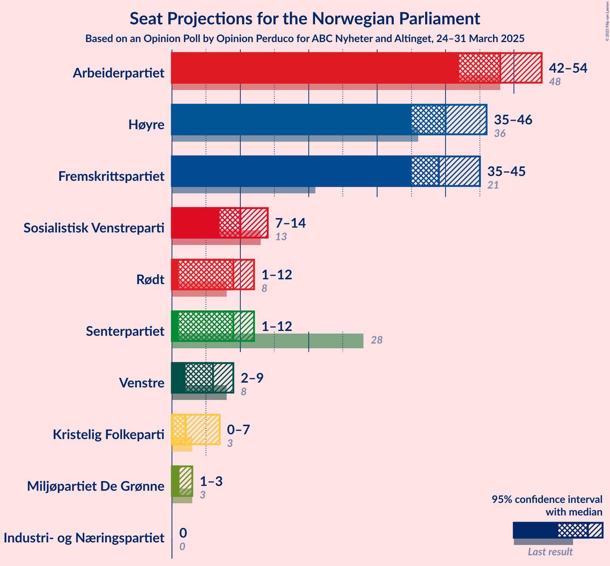
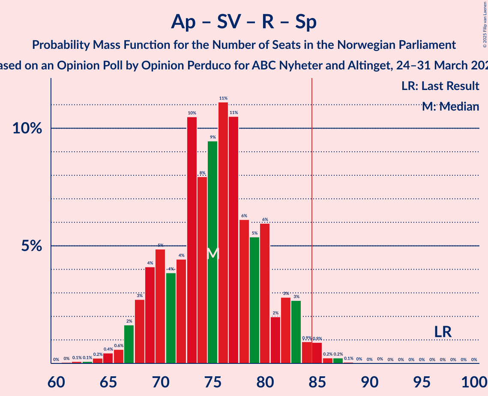
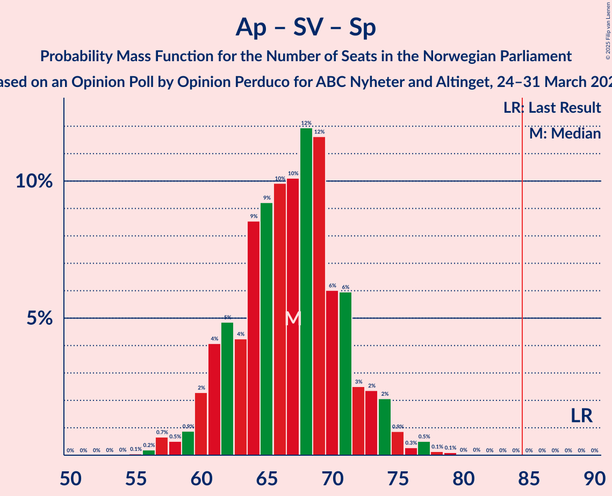
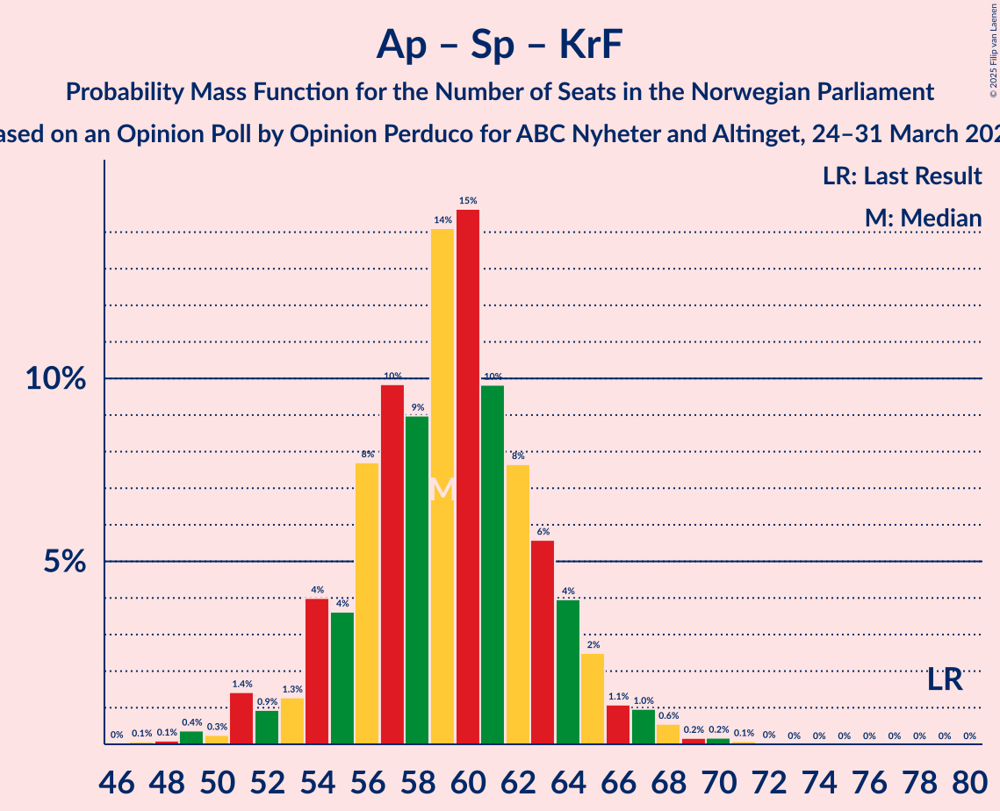

# Opinion Poll by Opinion Perduco for ABC Nyheter and Altinget, 24–31 March 2025

<a href="#voting-intentions">Voting Intentions</a> | <a href="#seats">Seats</a> | <a href="#coalitions">Coalitions</a> | <a href="#technical-information">Technical Information</a>

## Voting Intentions

### Confidence Intervals

| Party | Last Result | Poll Result | 80% Confidence Interval | 90% Confidence Interval | 95% Confidence Interval | 99% Confidence Interval |
|:-----:|:-----------:|:-----------:|:-----------------------:|:-----------------------:|:-----------------------:|:-----------------------:|
| Arbeiderpartiet | 26.2% | 24.9% | 22.9–27.0% |22.4–27.6% |21.9–28.1% |21.0–29.1% |
| Høyre | 20.4% | 22.2% | 20.4–24.3% |19.9–24.8% |19.4–25.3% |18.6–26.3% |
| Fremskrittspartiet | 11.6% | 20.9% | 19.1–22.9% |18.6–23.5% |18.2–24.0% |17.3–24.9% |
| Sosialistisk Venstreparti | 7.6% | 6.2% | 5.2–7.5% |4.9–7.8% |4.7–8.1% |4.2–8.8% |
| Rødt | 4.7% | 5.3% | 4.4–6.5% |4.1–6.8% |3.9–7.1% |3.5–7.7% |
| Senterpartiet | 13.5% | 5.3% | 4.4–6.5% |4.1–6.8% |3.9–7.1% |3.5–7.7% |
| Venstre | 4.6% | 3.8% | 3.1–4.9% |2.9–5.2% |2.7–5.4% |2.3–6.0% |
| Miljøpartiet De Grønne | 3.9% | 3.7% | 2.9–4.7% |2.7–5.0% |2.6–5.3% |2.2–5.8% |
| Kristelig Folkeparti | 3.8% | 3.0% | 2.4–4.0% |2.2–4.3% |2.0–4.5% |1.8–5.0% |
| Industri- og Næringspartiet | 0.3% | 1.1% | 0.7–1.7% |0.6–1.9% |0.5–2.1% |0.4–2.4% |

*Note:* The poll result column reflects the actual value used in the calculations. Published results may vary slightly, and in addition be rounded to fewer digits.

## Seats

### Confidence Intervals

| Party | Last Result | Median | 80% Confidence Interval | 90% Confidence Interval | 95% Confidence Interval | 99% Confidence Interval |
|:-----:|:-----------:|:------:|:-----------------------:|:-----------------------:|:-----------------------:|:-----------------------:|
| <a href="#arbeiderpartiet">Arbeiderpartiet</a> | 48 | 48 | 45–51 |43–51 |42–52 |41–55 |
| <a href="#høyre">Høyre</a> | 36 | 40 | 37–44 |36–45 |34–46 |33–47 |
| <a href="#fremskrittspartiet">Fremskrittspartiet</a> | 21 | 40 | 37–42 |36–43 |35–44 |34–46 |
| <a href="#sosialistisk-venstreparti">Sosialistisk Venstreparti</a> | 13 | 11 | 8–14 |7–15 |7–15 |7–15 |
| <a href="#rødt">Rødt</a> | 8 | 9 | 7–11 |7–11 |6–12 |1–13 |
| <a href="#senterpartiet">Senterpartiet</a> | 28 | 9 | 7–11 |6–12 |1–12 |0–13 |
| <a href="#venstre">Venstre</a> | 8 | 3 | 2–8 |2–8 |2–9 |1–10 |
| <a href="#miljøpartiet-de-grønne">Miljøpartiet De Grønne</a> | 3 | 3 | 2–7 |1–8 |1–9 |1–9 |
| <a href="#kristelig-folkeparti">Kristelig Folkeparti</a> | 3 | 2 | 1–3 |1–3 |0–6 |0–8 |
| <a href="#industri--og-næringspartiet">Industri- og Næringspartiet</a> | 0 | 0 | 0 |0 |0 |0 |

### Arbeiderpartiet

*For a full overview of the results for this party, see the [Arbeiderpartiet](party-arbeiderpartiet.html) page.*

| Number of Seats | Probability | Accumulated | Special Marks |
|:---------------:|:-----------:|:-----------:|:-------------:|
| 38 | 0% | 100% |  |
| 39 | 0.1% | 99.9% |  |
| 40 | 0.2% | 99.8% |  |
| 41 | 0.6% | 99.7% |  |
| 42 | 3% | 99.1% |  |
| 43 | 2% | 96% |  |
| 44 | 3% | 94% |  |
| 45 | 7% | 91% |  |
| 46 | 6% | 84% |  |
| 47 | 19% | 78% |  |
| 48 | 22% | 59% | Last Result, Median |
| 49 | 15% | 38% |  |
| 50 | 7% | 23% |  |
| 51 | 13% | 16% |  |
| 52 | 1.0% | 3% |  |
| 53 | 0.5% | 2% |  |
| 54 | 0.9% | 2% |  |
| 55 | 0.3% | 0.6% |  |
| 56 | 0.1% | 0.2% |  |
| 57 | 0.1% | 0.1% |  |
| 58 | 0% | 0% |  |

### Høyre

*For a full overview of the results for this party, see the [Høyre](party-høyre.html) page.*

| Number of Seats | Probability | Accumulated | Special Marks |
|:---------------:|:-----------:|:-----------:|:-------------:|
| 31 | 0.1% | 100% |  |
| 32 | 0.3% | 99.9% |  |
| 33 | 1.1% | 99.6% |  |
| 34 | 1.2% | 98.5% |  |
| 35 | 0.6% | 97% |  |
| 36 | 3% | 97% | Last Result |
| 37 | 5% | 94% |  |
| 38 | 5% | 88% |  |
| 39 | 24% | 83% |  |
| 40 | 13% | 59% | Median |
| 41 | 15% | 46% |  |
| 42 | 18% | 31% |  |
| 43 | 2% | 14% |  |
| 44 | 5% | 12% |  |
| 45 | 3% | 6% |  |
| 46 | 1.5% | 3% |  |
| 47 | 1.2% | 2% |  |
| 48 | 0.2% | 0.4% |  |
| 49 | 0.2% | 0.3% |  |
| 50 | 0% | 0.1% |  |
| 51 | 0.1% | 0.1% |  |
| 52 | 0% | 0% |  |

### Fremskrittspartiet

*For a full overview of the results for this party, see the [Fremskrittspartiet](party-fremskrittspartiet.html) page.*

| Number of Seats | Probability | Accumulated | Special Marks |
|:---------------:|:-----------:|:-----------:|:-------------:|
| 21 | 0% | 100% | Last Result |
| 22 | 0% | 100% |  |
| 23 | 0% | 100% |  |
| 24 | 0% | 100% |  |
| 25 | 0% | 100% |  |
| 26 | 0% | 100% |  |
| 27 | 0% | 100% |  |
| 28 | 0% | 100% |  |
| 29 | 0% | 100% |  |
| 30 | 0% | 100% |  |
| 31 | 0% | 100% |  |
| 32 | 0.1% | 99.9% |  |
| 33 | 0.2% | 99.8% |  |
| 34 | 0.7% | 99.6% |  |
| 35 | 2% | 98.9% |  |
| 36 | 3% | 97% |  |
| 37 | 6% | 94% |  |
| 38 | 6% | 88% |  |
| 39 | 21% | 82% |  |
| 40 | 12% | 61% | Median |
| 41 | 12% | 49% |  |
| 42 | 30% | 37% |  |
| 43 | 2% | 7% |  |
| 44 | 3% | 5% |  |
| 45 | 1.4% | 2% |  |
| 46 | 0.2% | 0.6% |  |
| 47 | 0.3% | 0.4% |  |
| 48 | 0.1% | 0.2% |  |
| 49 | 0.1% | 0.1% |  |
| 50 | 0% | 0% |  |

### Sosialistisk Venstreparti

*For a full overview of the results for this party, see the [Sosialistisk Venstreparti](party-sosialistiskvenstreparti.html) page.*

| Number of Seats | Probability | Accumulated | Special Marks |
|:---------------:|:-----------:|:-----------:|:-------------:|
| 2 | 0.1% | 100% |  |
| 3 | 0% | 99.9% |  |
| 4 | 0% | 99.8% |  |
| 5 | 0% | 99.8% |  |
| 6 | 0.2% | 99.8% |  |
| 7 | 5% | 99.7% |  |
| 8 | 7% | 94% |  |
| 9 | 21% | 87% |  |
| 10 | 13% | 66% |  |
| 11 | 14% | 53% | Median |
| 12 | 21% | 39% |  |
| 13 | 7% | 18% | Last Result |
| 14 | 3% | 11% |  |
| 15 | 8% | 8% |  |
| 16 | 0.2% | 0.3% |  |
| 17 | 0.1% | 0.1% |  |
| 18 | 0% | 0% |  |

### Rødt

*For a full overview of the results for this party, see the [Rødt](party-rødt.html) page.*

| Number of Seats | Probability | Accumulated | Special Marks |
|:---------------:|:-----------:|:-----------:|:-------------:|
| 1 | 2% | 100% |  |
| 2 | 0% | 98% |  |
| 3 | 0% | 98% |  |
| 4 | 0% | 98% |  |
| 5 | 0% | 98% |  |
| 6 | 1.2% | 98% |  |
| 7 | 10% | 97% |  |
| 8 | 32% | 87% | Last Result |
| 9 | 30% | 55% | Median |
| 10 | 10% | 25% |  |
| 11 | 10% | 15% |  |
| 12 | 3% | 5% |  |
| 13 | 1.1% | 1.4% |  |
| 14 | 0.2% | 0.2% |  |
| 15 | 0% | 0.1% |  |
| 16 | 0% | 0% |  |

### Senterpartiet

*For a full overview of the results for this party, see the [Senterpartiet](party-senterpartiet.html) page.*

| Number of Seats | Probability | Accumulated | Special Marks |
|:---------------:|:-----------:|:-----------:|:-------------:|
| 0 | 0.7% | 100% |  |
| 1 | 3% | 99.3% |  |
| 2 | 0.1% | 96% |  |
| 3 | 0% | 96% |  |
| 4 | 0% | 96% |  |
| 5 | 0.6% | 96% |  |
| 6 | 1.5% | 95% |  |
| 7 | 15% | 94% |  |
| 8 | 17% | 79% |  |
| 9 | 35% | 62% | Median |
| 10 | 14% | 27% |  |
| 11 | 7% | 13% |  |
| 12 | 4% | 6% |  |
| 13 | 2% | 2% |  |
| 14 | 0.4% | 0.4% |  |
| 15 | 0.1% | 0.1% |  |
| 16 | 0% | 0% |  |
| 17 | 0% | 0% |  |
| 18 | 0% | 0% |  |
| 19 | 0% | 0% |  |
| 20 | 0% | 0% |  |
| 21 | 0% | 0% |  |
| 22 | 0% | 0% |  |
| 23 | 0% | 0% |  |
| 24 | 0% | 0% |  |
| 25 | 0% | 0% |  |
| 26 | 0% | 0% |  |
| 27 | 0% | 0% |  |
| 28 | 0% | 0% | Last Result |

### Venstre

*For a full overview of the results for this party, see the [Venstre](party-venstre.html) page.*

| Number of Seats | Probability | Accumulated | Special Marks |
|:---------------:|:-----------:|:-----------:|:-------------:|
| 1 | 2% | 100% |  |
| 2 | 18% | 98% |  |
| 3 | 36% | 80% | Median |
| 4 | 0% | 45% |  |
| 5 | 0.7% | 45% |  |
| 6 | 7% | 44% |  |
| 7 | 11% | 37% |  |
| 8 | 23% | 26% | Last Result |
| 9 | 2% | 3% |  |
| 10 | 0.4% | 0.5% |  |
| 11 | 0.1% | 0.1% |  |
| 12 | 0% | 0% |  |

### Miljøpartiet De Grønne

*For a full overview of the results for this party, see the [Miljøpartiet De Grønne](party-miljøpartietdegrønne.html) page.*

| Number of Seats | Probability | Accumulated | Special Marks |
|:---------------:|:-----------:|:-----------:|:-------------:|
| 1 | 10% | 100% |  |
| 2 | 28% | 90% |  |
| 3 | 35% | 63% | Last Result, Median |
| 4 | 0% | 28% |  |
| 5 | 0.3% | 28% |  |
| 6 | 6% | 28% |  |
| 7 | 16% | 22% |  |
| 8 | 3% | 6% |  |
| 9 | 2% | 3% |  |
| 10 | 0.3% | 0.4% |  |
| 11 | 0% | 0% |  |

### Kristelig Folkeparti

*For a full overview of the results for this party, see the [Kristelig Folkeparti](party-kristeligfolkeparti.html) page.*

| Number of Seats | Probability | Accumulated | Special Marks |
|:---------------:|:-----------:|:-----------:|:-------------:|
| 0 | 4% | 100% |  |
| 1 | 33% | 96% |  |
| 2 | 19% | 63% | Median |
| 3 | 39% | 44% | Last Result |
| 4 | 0% | 5% |  |
| 5 | 0.2% | 5% |  |
| 6 | 2% | 5% |  |
| 7 | 2% | 2% |  |
| 8 | 0.5% | 0.7% |  |
| 9 | 0.2% | 0.2% |  |
| 10 | 0% | 0% |  |

### Industri- og Næringspartiet

*For a full overview of the results for this party, see the [Industri- og Næringspartiet](party-industri-ognæringspartiet.html) page.*

| Number of Seats | Probability | Accumulated | Special Marks |
|:---------------:|:-----------:|:-----------:|:-------------:|
| 0 | 99.7% | 100% | Last Result, Median |
| 1 | 0.2% | 0.3% |  |
| 2 | 0.1% | 0.1% |  |
| 3 | 0% | 0% |  |

## Coalitions

### Confidence Intervals

| Coalition | Last Result | Median | Majority? | 80% Confidence Interval | 90% Confidence Interval | 95% Confidence Interval | 99% Confidence Interval |
|:---------:|:-----------:|:------:|:---------:|:-----------------------:|:-----------------------:|:-----------------------:|:-----------------------:|
| Høyre – Fremskrittspartiet – Senterpartiet – Venstre – Kristelig Folkeparti | 96 | 96 | 99.6% | 92–101 | 91–101 | 90–102 | 85–105 |
| Høyre – Fremskrittspartiet – Venstre – Miljøpartiet De Grønne – Kristelig Folkeparti | 71 | 91 | 96% | 86–95 | 85–97 | 84–99 | 82–101 |
| Høyre – Fremskrittspartiet – Venstre – Kristelig Folkeparti | 68 | 87 | 81% | 83–92 | 82–92 | 80–94 | 78–96 |
| Høyre – Fremskrittspartiet – Venstre | 65 | 85 | 53% | 81–89 | 80–89 | 78–90 | 76–94 |
| Høyre – Fremskrittspartiet | 57 | 81 | 4% | 78–83 | 75–84 | 74–87 | 71–88 |
| Arbeiderpartiet – Sosialistisk Venstreparti – Rødt – Senterpartiet – Miljøpartiet De Grønne | 100 | 79 | 7% | 76–84 | 74–85 | 73–87 | 69–91 |
| Arbeiderpartiet – Sosialistisk Venstreparti – Rødt – Senterpartiet | 97 | 76 | 0.6% | 71–82 | 69–82 | 68–82 | 65–85 |
| Arbeiderpartiet – Sosialistisk Venstreparti – Senterpartiet – Miljøpartiet De Grønne – Kristelig Folkeparti | 95 | 73 | 0.3% | 70–77 | 68–79 | 67–81 | 64–84 |
| Arbeiderpartiet – Sosialistisk Venstreparti – Senterpartiet – Miljøpartiet De Grønne | 92 | 71 | 0% | 67–75 | 65–76 | 65–78 | 61–81 |
| Arbeiderpartiet – Sosialistisk Venstreparti – Rødt – Miljøpartiet De Grønne | 72 | 71 | 0% | 67–75 | 65–77 | 64–78 | 61–80 |
| Arbeiderpartiet – Sosialistisk Venstreparti – Senterpartiet | 89 | 67 | 0% | 62–72 | 61–73 | 60–73 | 57–75 |
| Arbeiderpartiet – Senterpartiet – Miljøpartiet De Grønne – Kristelig Folkeparti | 82 | 62 | 0% | 59–66 | 57–68 | 56–71 | 53–73 |
| Arbeiderpartiet – Sosialistisk Venstreparti | 61 | 58 | 0% | 55–63 | 52–63 | 52–65 | 50–66 |
| Arbeiderpartiet – Senterpartiet – Kristelig Folkeparti | 79 | 59 | 0% | 55–63 | 53–63 | 52–64 | 50–67 |
| Arbeiderpartiet – Senterpartiet | 76 | 56 | 0% | 53–60 | 52–61 | 50–62 | 48–64 |
| Høyre – Venstre – Kristelig Folkeparti | 47 | 47 | 0% | 42–51 | 42–53 | 40–54 | 38–56 |
| Senterpartiet – Venstre – Kristelig Folkeparti | 39 | 15 | 0% | 12–20 | 11–21 | 7–22 | 4–24 |

### Høyre – Fremskrittspartiet – Senterpartiet – Venstre – Kristelig Folkeparti

| Number of Seats | Probability | Accumulated | Special Marks |
|:---------------:|:-----------:|:-----------:|:-------------:|
| 83 | 0% | 100% |  |
| 84 | 0.4% | 99.9% |  |
| 85 | 0.3% | 99.6% | Majority |
| 86 | 0.1% | 99.2% |  |
| 87 | 0.4% | 99.1% |  |
| 88 | 0.5% | 98.7% |  |
| 89 | 0.5% | 98% |  |
| 90 | 2% | 98% |  |
| 91 | 5% | 95% |  |
| 92 | 8% | 91% |  |
| 93 | 6% | 83% |  |
| 94 | 3% | 77% | Median |
| 95 | 18% | 75% |  |
| 96 | 14% | 56% | Last Result |
| 97 | 8% | 42% |  |
| 98 | 13% | 34% |  |
| 99 | 2% | 22% |  |
| 100 | 3% | 19% |  |
| 101 | 12% | 16% |  |
| 102 | 2% | 4% |  |
| 103 | 0.5% | 2% |  |
| 104 | 1.0% | 2% |  |
| 105 | 0.3% | 0.7% |  |
| 106 | 0.1% | 0.4% |  |
| 107 | 0% | 0.3% |  |
| 108 | 0.2% | 0.2% |  |
| 109 | 0.1% | 0.1% |  |
| 110 | 0% | 0% |  |

### Høyre – Fremskrittspartiet – Venstre – Miljøpartiet De Grønne – Kristelig Folkeparti

| Number of Seats | Probability | Accumulated | Special Marks |
|:---------------:|:-----------:|:-----------:|:-------------:|
| 71 | 0% | 100% | Last Result |
| 72 | 0% | 100% |  |
| 73 | 0% | 100% |  |
| 74 | 0% | 100% |  |
| 75 | 0% | 100% |  |
| 76 | 0% | 100% |  |
| 77 | 0% | 100% |  |
| 78 | 0% | 100% |  |
| 79 | 0% | 100% |  |
| 80 | 0.1% | 99.9% |  |
| 81 | 0.3% | 99.8% |  |
| 82 | 0.2% | 99.6% |  |
| 83 | 1.2% | 99.4% |  |
| 84 | 2% | 98% |  |
| 85 | 2% | 96% | Majority |
| 86 | 6% | 94% |  |
| 87 | 12% | 88% |  |
| 88 | 4% | 76% | Median |
| 89 | 11% | 72% |  |
| 90 | 8% | 61% |  |
| 91 | 3% | 53% |  |
| 92 | 5% | 49% |  |
| 93 | 11% | 45% |  |
| 94 | 4% | 33% |  |
| 95 | 21% | 30% |  |
| 96 | 3% | 8% |  |
| 97 | 2% | 6% |  |
| 98 | 0.4% | 3% |  |
| 99 | 1.5% | 3% |  |
| 100 | 0.9% | 2% |  |
| 101 | 0.2% | 0.6% |  |
| 102 | 0.3% | 0.5% |  |
| 103 | 0.1% | 0.2% |  |
| 104 | 0% | 0.1% |  |
| 105 | 0% | 0% |  |

### Høyre – Fremskrittspartiet – Venstre – Kristelig Folkeparti

| Number of Seats | Probability | Accumulated | Special Marks |
|:---------------:|:-----------:|:-----------:|:-------------:|
| 68 | 0% | 100% | Last Result |
| 69 | 0% | 100% |  |
| 70 | 0% | 100% |  |
| 71 | 0% | 100% |  |
| 72 | 0% | 100% |  |
| 73 | 0% | 100% |  |
| 74 | 0% | 100% |  |
| 75 | 0% | 100% |  |
| 76 | 0.1% | 99.9% |  |
| 77 | 0.2% | 99.9% |  |
| 78 | 0.7% | 99.6% |  |
| 79 | 1.0% | 98.9% |  |
| 80 | 0.8% | 98% |  |
| 81 | 1.1% | 97% |  |
| 82 | 2% | 96% |  |
| 83 | 6% | 94% |  |
| 84 | 6% | 87% |  |
| 85 | 11% | 81% | Median, Majority |
| 86 | 6% | 71% |  |
| 87 | 17% | 64% |  |
| 88 | 13% | 47% |  |
| 89 | 4% | 35% |  |
| 90 | 10% | 31% |  |
| 91 | 2% | 21% |  |
| 92 | 14% | 19% |  |
| 93 | 1.5% | 5% |  |
| 94 | 1.3% | 3% |  |
| 95 | 1.1% | 2% |  |
| 96 | 0.3% | 0.8% |  |
| 97 | 0.2% | 0.5% |  |
| 98 | 0.1% | 0.3% |  |
| 99 | 0.1% | 0.2% |  |
| 100 | 0.1% | 0.1% |  |
| 101 | 0% | 0% |  |

### Høyre – Fremskrittspartiet – Venstre

| Number of Seats | Probability | Accumulated | Special Marks |
|:---------------:|:-----------:|:-----------:|:-------------:|
| 65 | 0% | 100% | Last Result |
| 66 | 0% | 100% |  |
| 67 | 0% | 100% |  |
| 68 | 0% | 100% |  |
| 69 | 0% | 100% |  |
| 70 | 0% | 100% |  |
| 71 | 0% | 100% |  |
| 72 | 0% | 100% |  |
| 73 | 0.1% | 100% |  |
| 74 | 0.1% | 99.9% |  |
| 75 | 0.2% | 99.8% |  |
| 76 | 0.8% | 99.6% |  |
| 77 | 1.2% | 98.9% |  |
| 78 | 1.1% | 98% |  |
| 79 | 0.8% | 97% |  |
| 80 | 2% | 96% |  |
| 81 | 6% | 94% |  |
| 82 | 6% | 88% |  |
| 83 | 3% | 82% | Median |
| 84 | 25% | 79% |  |
| 85 | 9% | 53% | Majority |
| 86 | 4% | 45% |  |
| 87 | 11% | 41% |  |
| 88 | 9% | 30% |  |
| 89 | 16% | 21% |  |
| 90 | 3% | 5% |  |
| 91 | 0.8% | 2% |  |
| 92 | 0.6% | 1.4% |  |
| 93 | 0.2% | 0.8% |  |
| 94 | 0.2% | 0.5% |  |
| 95 | 0.2% | 0.3% |  |
| 96 | 0.1% | 0.2% |  |
| 97 | 0% | 0.1% |  |
| 98 | 0% | 0% |  |

### Høyre – Fremskrittspartiet

| Number of Seats | Probability | Accumulated | Special Marks |
|:---------------:|:-----------:|:-----------:|:-------------:|
| 57 | 0% | 100% | Last Result |
| 58 | 0% | 100% |  |
| 59 | 0% | 100% |  |
| 60 | 0% | 100% |  |
| 61 | 0% | 100% |  |
| 62 | 0% | 100% |  |
| 63 | 0% | 100% |  |
| 64 | 0% | 100% |  |
| 65 | 0% | 100% |  |
| 66 | 0% | 100% |  |
| 67 | 0% | 100% |  |
| 68 | 0% | 100% |  |
| 69 | 0.1% | 99.9% |  |
| 70 | 0.2% | 99.9% |  |
| 71 | 0.1% | 99.6% |  |
| 72 | 0.4% | 99.5% |  |
| 73 | 2% | 99.1% |  |
| 74 | 1.2% | 98% |  |
| 75 | 3% | 96% |  |
| 76 | 1.4% | 94% |  |
| 77 | 1.3% | 92% |  |
| 78 | 6% | 91% |  |
| 79 | 7% | 86% |  |
| 80 | 13% | 78% | Median |
| 81 | 42% | 66% |  |
| 82 | 13% | 24% |  |
| 83 | 6% | 11% |  |
| 84 | 1.4% | 6% |  |
| 85 | 1.2% | 4% | Majority |
| 86 | 0.5% | 3% |  |
| 87 | 1.5% | 3% |  |
| 88 | 0.6% | 1.0% |  |
| 89 | 0.2% | 0.4% |  |
| 90 | 0.1% | 0.3% |  |
| 91 | 0.1% | 0.2% |  |
| 92 | 0.1% | 0.1% |  |
| 93 | 0% | 0.1% |  |
| 94 | 0% | 0% |  |

### Arbeiderpartiet – Sosialistisk Venstreparti – Rødt – Senterpartiet – Miljøpartiet De Grønne

| Number of Seats | Probability | Accumulated | Special Marks |
|:---------------:|:-----------:|:-----------:|:-------------:|
| 66 | 0.1% | 100% |  |
| 67 | 0.1% | 99.8% |  |
| 68 | 0.1% | 99.7% |  |
| 69 | 0.2% | 99.6% |  |
| 70 | 0.6% | 99.5% |  |
| 71 | 0.7% | 98.9% |  |
| 72 | 0.6% | 98% |  |
| 73 | 2% | 98% |  |
| 74 | 1.3% | 96% |  |
| 75 | 4% | 95% |  |
| 76 | 9% | 90% |  |
| 77 | 14% | 81% |  |
| 78 | 4% | 67% |  |
| 79 | 15% | 63% |  |
| 80 | 6% | 48% | Median |
| 81 | 9% | 42% |  |
| 82 | 12% | 33% |  |
| 83 | 5% | 21% |  |
| 84 | 9% | 15% |  |
| 85 | 3% | 7% | Majority |
| 86 | 2% | 4% |  |
| 87 | 0.3% | 3% |  |
| 88 | 0.3% | 2% |  |
| 89 | 0.4% | 2% |  |
| 90 | 0.8% | 2% |  |
| 91 | 0.6% | 0.8% |  |
| 92 | 0.1% | 0.2% |  |
| 93 | 0.1% | 0.1% |  |
| 94 | 0% | 0% |  |
| 95 | 0% | 0% |  |
| 96 | 0% | 0% |  |
| 97 | 0% | 0% |  |
| 98 | 0% | 0% |  |
| 99 | 0% | 0% |  |
| 100 | 0% | 0% | Last Result |

### Arbeiderpartiet – Sosialistisk Venstreparti – Rødt – Senterpartiet

| Number of Seats | Probability | Accumulated | Special Marks |
|:---------------:|:-----------:|:-----------:|:-------------:|
| 61 | 0.1% | 100% |  |
| 62 | 0% | 99.9% |  |
| 63 | 0.1% | 99.9% |  |
| 64 | 0.3% | 99.8% |  |
| 65 | 0.2% | 99.5% |  |
| 66 | 0.7% | 99.4% |  |
| 67 | 0.6% | 98.7% |  |
| 68 | 0.8% | 98% |  |
| 69 | 3% | 97% |  |
| 70 | 3% | 94% |  |
| 71 | 3% | 91% |  |
| 72 | 3% | 89% |  |
| 73 | 8% | 85% |  |
| 74 | 23% | 77% |  |
| 75 | 3% | 55% |  |
| 76 | 13% | 52% |  |
| 77 | 5% | 39% | Median |
| 78 | 5% | 34% |  |
| 79 | 3% | 29% |  |
| 80 | 10% | 26% |  |
| 81 | 4% | 16% |  |
| 82 | 10% | 13% |  |
| 83 | 1.3% | 2% |  |
| 84 | 0.6% | 1.1% |  |
| 85 | 0.3% | 0.6% | Majority |
| 86 | 0.1% | 0.2% |  |
| 87 | 0% | 0.1% |  |
| 88 | 0.1% | 0.1% |  |
| 89 | 0% | 0% |  |
| 90 | 0% | 0% |  |
| 91 | 0% | 0% |  |
| 92 | 0% | 0% |  |
| 93 | 0% | 0% |  |
| 94 | 0% | 0% |  |
| 95 | 0% | 0% |  |
| 96 | 0% | 0% |  |
| 97 | 0% | 0% | Last Result |

### Arbeiderpartiet – Sosialistisk Venstreparti – Senterpartiet – Miljøpartiet De Grønne – Kristelig Folkeparti

| Number of Seats | Probability | Accumulated | Special Marks |
|:---------------:|:-----------:|:-----------:|:-------------:|
| 59 | 0.1% | 100% |  |
| 60 | 0% | 99.9% |  |
| 61 | 0% | 99.9% |  |
| 62 | 0.2% | 99.8% |  |
| 63 | 0.1% | 99.7% |  |
| 64 | 0.1% | 99.6% |  |
| 65 | 0.5% | 99.5% |  |
| 66 | 0.8% | 99.0% |  |
| 67 | 1.0% | 98% |  |
| 68 | 3% | 97% |  |
| 69 | 2% | 94% |  |
| 70 | 7% | 92% |  |
| 71 | 22% | 85% |  |
| 72 | 12% | 63% |  |
| 73 | 16% | 51% | Median |
| 74 | 6% | 36% |  |
| 75 | 5% | 30% |  |
| 76 | 7% | 25% |  |
| 77 | 10% | 17% |  |
| 78 | 2% | 7% |  |
| 79 | 1.1% | 5% |  |
| 80 | 1.3% | 4% |  |
| 81 | 0.5% | 3% |  |
| 82 | 0.9% | 2% |  |
| 83 | 1.0% | 2% |  |
| 84 | 0.2% | 0.5% |  |
| 85 | 0.1% | 0.3% | Majority |
| 86 | 0.1% | 0.1% |  |
| 87 | 0% | 0.1% |  |
| 88 | 0% | 0% |  |
| 89 | 0% | 0% |  |
| 90 | 0% | 0% |  |
| 91 | 0% | 0% |  |
| 92 | 0% | 0% |  |
| 93 | 0% | 0% |  |
| 94 | 0% | 0% |  |
| 95 | 0% | 0% | Last Result |

### Arbeiderpartiet – Sosialistisk Venstreparti – Senterpartiet – Miljøpartiet De Grønne

| Number of Seats | Probability | Accumulated | Special Marks |
|:---------------:|:-----------:|:-----------:|:-------------:|
| 58 | 0.1% | 100% |  |
| 59 | 0.2% | 99.9% |  |
| 60 | 0.1% | 99.7% |  |
| 61 | 0.4% | 99.6% |  |
| 62 | 0.4% | 99.3% |  |
| 63 | 0.5% | 98.9% |  |
| 64 | 0.9% | 98% |  |
| 65 | 3% | 98% |  |
| 66 | 2% | 95% |  |
| 67 | 4% | 93% |  |
| 68 | 16% | 89% |  |
| 69 | 11% | 73% |  |
| 70 | 8% | 62% |  |
| 71 | 12% | 53% | Median |
| 72 | 10% | 42% |  |
| 73 | 5% | 32% |  |
| 74 | 13% | 27% |  |
| 75 | 7% | 14% |  |
| 76 | 2% | 6% |  |
| 77 | 2% | 4% |  |
| 78 | 0.3% | 3% |  |
| 79 | 0.5% | 2% |  |
| 80 | 0.8% | 2% |  |
| 81 | 1.0% | 1.3% |  |
| 82 | 0.1% | 0.3% |  |
| 83 | 0.1% | 0.2% |  |
| 84 | 0.1% | 0.1% |  |
| 85 | 0% | 0% | Majority |
| 86 | 0% | 0% |  |
| 87 | 0% | 0% |  |
| 88 | 0% | 0% |  |
| 89 | 0% | 0% |  |
| 90 | 0% | 0% |  |
| 91 | 0% | 0% |  |
| 92 | 0% | 0% | Last Result |

### Arbeiderpartiet – Sosialistisk Venstreparti – Rødt – Miljøpartiet De Grønne

| Number of Seats | Probability | Accumulated | Special Marks |
|:---------------:|:-----------:|:-----------:|:-------------:|
| 57 | 0.1% | 100% |  |
| 58 | 0% | 99.9% |  |
| 59 | 0.1% | 99.9% |  |
| 60 | 0.2% | 99.8% |  |
| 61 | 0.2% | 99.6% |  |
| 62 | 0.4% | 99.4% |  |
| 63 | 0.4% | 98.9% |  |
| 64 | 2% | 98.6% |  |
| 65 | 2% | 97% |  |
| 66 | 4% | 95% |  |
| 67 | 6% | 90% |  |
| 68 | 13% | 84% |  |
| 69 | 5% | 71% |  |
| 70 | 7% | 66% |  |
| 71 | 15% | 59% | Median |
| 72 | 6% | 44% | Last Result |
| 73 | 11% | 38% |  |
| 74 | 17% | 28% |  |
| 75 | 2% | 11% |  |
| 76 | 4% | 9% |  |
| 77 | 2% | 6% |  |
| 78 | 2% | 4% |  |
| 79 | 1.4% | 2% |  |
| 80 | 0.4% | 0.7% |  |
| 81 | 0.1% | 0.3% |  |
| 82 | 0.1% | 0.3% |  |
| 83 | 0.1% | 0.1% |  |
| 84 | 0.1% | 0.1% |  |
| 85 | 0% | 0% | Majority |

### Arbeiderpartiet – Sosialistisk Venstreparti – Senterpartiet

| Number of Seats | Probability | Accumulated | Special Marks |
|:---------------:|:-----------:|:-----------:|:-------------:|
| 54 | 0.1% | 100% |  |
| 55 | 0% | 99.9% |  |
| 56 | 0.1% | 99.9% |  |
| 57 | 0.7% | 99.8% |  |
| 58 | 0.5% | 99.1% |  |
| 59 | 0.9% | 98.7% |  |
| 60 | 1.0% | 98% |  |
| 61 | 3% | 97% |  |
| 62 | 4% | 94% |  |
| 63 | 6% | 90% |  |
| 64 | 3% | 83% |  |
| 65 | 19% | 80% |  |
| 66 | 11% | 61% |  |
| 67 | 3% | 50% |  |
| 68 | 12% | 47% | Median |
| 69 | 3% | 35% |  |
| 70 | 5% | 32% |  |
| 71 | 5% | 26% |  |
| 72 | 12% | 22% |  |
| 73 | 8% | 9% |  |
| 74 | 0.5% | 1.1% |  |
| 75 | 0.1% | 0.6% |  |
| 76 | 0.2% | 0.5% |  |
| 77 | 0.1% | 0.3% |  |
| 78 | 0% | 0.2% |  |
| 79 | 0% | 0.1% |  |
| 80 | 0.1% | 0.1% |  |
| 81 | 0% | 0% |  |
| 82 | 0% | 0% |  |
| 83 | 0% | 0% |  |
| 84 | 0% | 0% |  |
| 85 | 0% | 0% | Majority |
| 86 | 0% | 0% |  |
| 87 | 0% | 0% |  |
| 88 | 0% | 0% |  |
| 89 | 0% | 0% | Last Result |

### Arbeiderpartiet – Senterpartiet – Miljøpartiet De Grønne – Kristelig Folkeparti

| Number of Seats | Probability | Accumulated | Special Marks |
|:---------------:|:-----------:|:-----------:|:-------------:|
| 50 | 0.1% | 100% |  |
| 51 | 0% | 99.9% |  |
| 52 | 0.1% | 99.8% |  |
| 53 | 0.5% | 99.7% |  |
| 54 | 0.5% | 99.2% |  |
| 55 | 0.9% | 98.7% |  |
| 56 | 2% | 98% |  |
| 57 | 1.1% | 96% |  |
| 58 | 2% | 95% |  |
| 59 | 4% | 92% |  |
| 60 | 5% | 88% |  |
| 61 | 25% | 84% |  |
| 62 | 22% | 59% | Median |
| 63 | 7% | 37% |  |
| 64 | 9% | 30% |  |
| 65 | 11% | 21% |  |
| 66 | 2% | 10% |  |
| 67 | 1.4% | 8% |  |
| 68 | 2% | 7% |  |
| 69 | 1.3% | 5% |  |
| 70 | 0.6% | 4% |  |
| 71 | 1.3% | 3% |  |
| 72 | 0.5% | 2% |  |
| 73 | 0.7% | 1.1% |  |
| 74 | 0.2% | 0.4% |  |
| 75 | 0.2% | 0.3% |  |
| 76 | 0.1% | 0.1% |  |
| 77 | 0% | 0% |  |
| 78 | 0% | 0% |  |
| 79 | 0% | 0% |  |
| 80 | 0% | 0% |  |
| 81 | 0% | 0% |  |
| 82 | 0% | 0% | Last Result |

### Arbeiderpartiet – Sosialistisk Venstreparti

| Number of Seats | Probability | Accumulated | Special Marks |
|:---------------:|:-----------:|:-----------:|:-------------:|
| 48 | 0.2% | 100% |  |
| 49 | 0.1% | 99.8% |  |
| 50 | 0.5% | 99.7% |  |
| 51 | 0.7% | 99.2% |  |
| 52 | 4% | 98% |  |
| 53 | 1.1% | 95% |  |
| 54 | 3% | 94% |  |
| 55 | 4% | 91% |  |
| 56 | 20% | 87% |  |
| 57 | 9% | 67% |  |
| 58 | 10% | 58% |  |
| 59 | 6% | 48% | Median |
| 60 | 12% | 42% |  |
| 61 | 5% | 29% | Last Result |
| 62 | 3% | 24% |  |
| 63 | 17% | 21% |  |
| 64 | 2% | 5% |  |
| 65 | 2% | 3% |  |
| 66 | 0.3% | 0.7% |  |
| 67 | 0.3% | 0.5% |  |
| 68 | 0.1% | 0.2% |  |
| 69 | 0.1% | 0.1% |  |
| 70 | 0% | 0% |  |

### Arbeiderpartiet – Senterpartiet – Kristelig Folkeparti

| Number of Seats | Probability | Accumulated | Special Marks |
|:---------------:|:-----------:|:-----------:|:-------------:|
| 47 | 0% | 100% |  |
| 48 | 0.1% | 99.9% |  |
| 49 | 0.2% | 99.8% |  |
| 50 | 0.4% | 99.6% |  |
| 51 | 1.4% | 99.2% |  |
| 52 | 0.5% | 98% |  |
| 53 | 3% | 97% |  |
| 54 | 4% | 94% |  |
| 55 | 4% | 90% |  |
| 56 | 3% | 86% |  |
| 57 | 12% | 83% |  |
| 58 | 16% | 71% |  |
| 59 | 24% | 55% | Median |
| 60 | 9% | 32% |  |
| 61 | 4% | 23% |  |
| 62 | 3% | 18% |  |
| 63 | 12% | 16% |  |
| 64 | 1.5% | 3% |  |
| 65 | 1.0% | 2% |  |
| 66 | 0.2% | 1.0% |  |
| 67 | 0.4% | 0.8% |  |
| 68 | 0.2% | 0.4% |  |
| 69 | 0.1% | 0.2% |  |
| 70 | 0.1% | 0.1% |  |
| 71 | 0% | 0% |  |
| 72 | 0% | 0% |  |
| 73 | 0% | 0% |  |
| 74 | 0% | 0% |  |
| 75 | 0% | 0% |  |
| 76 | 0% | 0% |  |
| 77 | 0% | 0% |  |
| 78 | 0% | 0% |  |
| 79 | 0% | 0% | Last Result |

### Arbeiderpartiet – Senterpartiet

| Number of Seats | Probability | Accumulated | Special Marks |
|:---------------:|:-----------:|:-----------:|:-------------:|
| 44 | 0% | 100% |  |
| 45 | 0% | 99.9% |  |
| 46 | 0.1% | 99.9% |  |
| 47 | 0.2% | 99.8% |  |
| 48 | 0.3% | 99.6% |  |
| 49 | 1.2% | 99.3% |  |
| 50 | 2% | 98% |  |
| 51 | 1.2% | 96% |  |
| 52 | 4% | 95% |  |
| 53 | 6% | 91% |  |
| 54 | 6% | 85% |  |
| 55 | 6% | 79% |  |
| 56 | 29% | 73% |  |
| 57 | 8% | 44% | Median |
| 58 | 11% | 35% |  |
| 59 | 7% | 24% |  |
| 60 | 12% | 17% |  |
| 61 | 1.4% | 6% |  |
| 62 | 3% | 4% |  |
| 63 | 0.5% | 1.1% |  |
| 64 | 0.3% | 0.6% |  |
| 65 | 0.1% | 0.2% |  |
| 66 | 0.1% | 0.1% |  |
| 67 | 0% | 0.1% |  |
| 68 | 0% | 0% |  |
| 69 | 0% | 0% |  |
| 70 | 0% | 0% |  |
| 71 | 0% | 0% |  |
| 72 | 0% | 0% |  |
| 73 | 0% | 0% |  |
| 74 | 0% | 0% |  |
| 75 | 0% | 0% |  |
| 76 | 0% | 0% | Last Result |

### Høyre – Venstre – Kristelig Folkeparti

| Number of Seats | Probability | Accumulated | Special Marks |
|:---------------:|:-----------:|:-----------:|:-------------:|
| 37 | 0.1% | 100% |  |
| 38 | 0.5% | 99.8% |  |
| 39 | 0.7% | 99.3% |  |
| 40 | 2% | 98.7% |  |
| 41 | 1.4% | 97% |  |
| 42 | 6% | 96% |  |
| 43 | 3% | 90% |  |
| 44 | 3% | 87% |  |
| 45 | 13% | 83% | Median |
| 46 | 12% | 70% |  |
| 47 | 14% | 58% | Last Result |
| 48 | 8% | 44% |  |
| 49 | 6% | 36% |  |
| 50 | 12% | 30% |  |
| 51 | 10% | 18% |  |
| 52 | 3% | 9% |  |
| 53 | 2% | 6% |  |
| 54 | 2% | 4% |  |
| 55 | 1.2% | 2% |  |
| 56 | 0.3% | 0.6% |  |
| 57 | 0.1% | 0.3% |  |
| 58 | 0.1% | 0.2% |  |
| 59 | 0% | 0.1% |  |
| 60 | 0.1% | 0.1% |  |
| 61 | 0% | 0% |  |

### Senterpartiet – Venstre – Kristelig Folkeparti

| Number of Seats | Probability | Accumulated | Special Marks |
|:---------------:|:-----------:|:-----------:|:-------------:|
| 3 | 0.1% | 100% |  |
| 4 | 2% | 99.9% |  |
| 5 | 0.2% | 98% |  |
| 6 | 0.2% | 98% |  |
| 7 | 0.3% | 98% |  |
| 8 | 0.1% | 97% |  |
| 9 | 0.4% | 97% |  |
| 10 | 1.2% | 97% |  |
| 11 | 4% | 96% |  |
| 12 | 5% | 92% |  |
| 13 | 7% | 87% |  |
| 14 | 19% | 80% | Median |
| 15 | 18% | 60% |  |
| 16 | 6% | 43% |  |
| 17 | 5% | 36% |  |
| 18 | 11% | 31% |  |
| 19 | 2% | 20% |  |
| 20 | 13% | 18% |  |
| 21 | 3% | 6% |  |
| 22 | 1.5% | 3% |  |
| 23 | 0.8% | 2% |  |
| 24 | 0.3% | 0.8% |  |
| 25 | 0.3% | 0.5% |  |
| 26 | 0.1% | 0.2% |  |
| 27 | 0% | 0.1% |  |
| 28 | 0% | 0.1% |  |
| 29 | 0% | 0% |  |
| 30 | 0% | 0% |  |
| 31 | 0% | 0% |  |
| 32 | 0% | 0% |  |
| 33 | 0% | 0% |  |
| 34 | 0% | 0% |  |
| 35 | 0% | 0% |  |
| 36 | 0% | 0% |  |
| 37 | 0% | 0% |  |
| 38 | 0% | 0% |  |
| 39 | 0% | 0% | Last Result |

## Technical Information

### Opinion Poll

+ **Polling firm:** Opinion Perduco
+ **Commissioner(s):** ABC Nyheter and Altinget
+ **Fieldwork period:** 24–31 March 2025

### Calculations

+ **Sample size:** 760
+ **Simulations done:** 1,048,576
+ **Error estimate:** 1.37%

