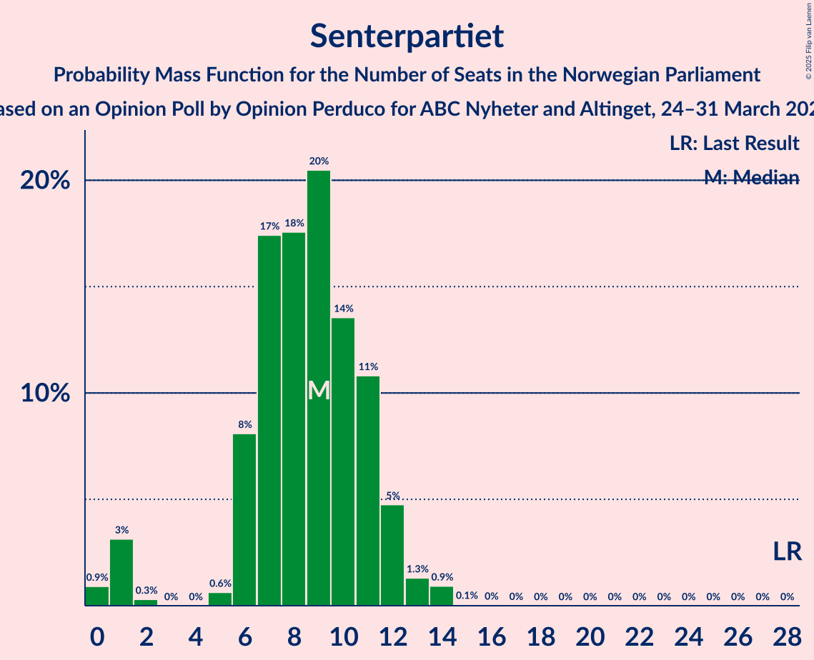
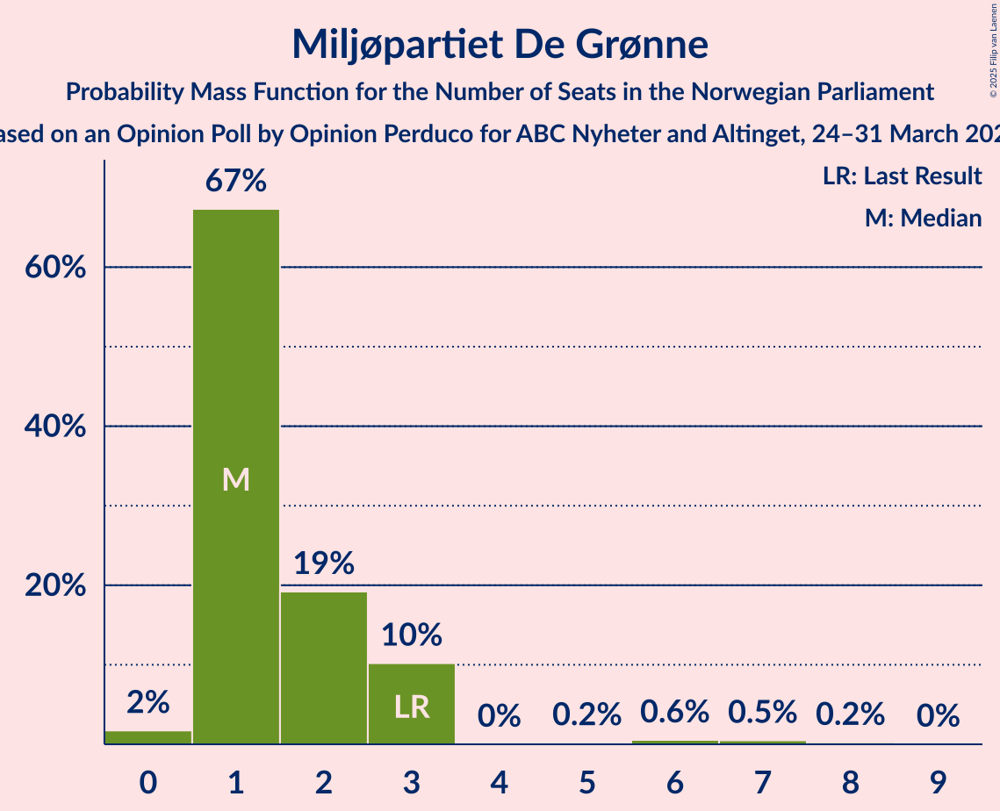
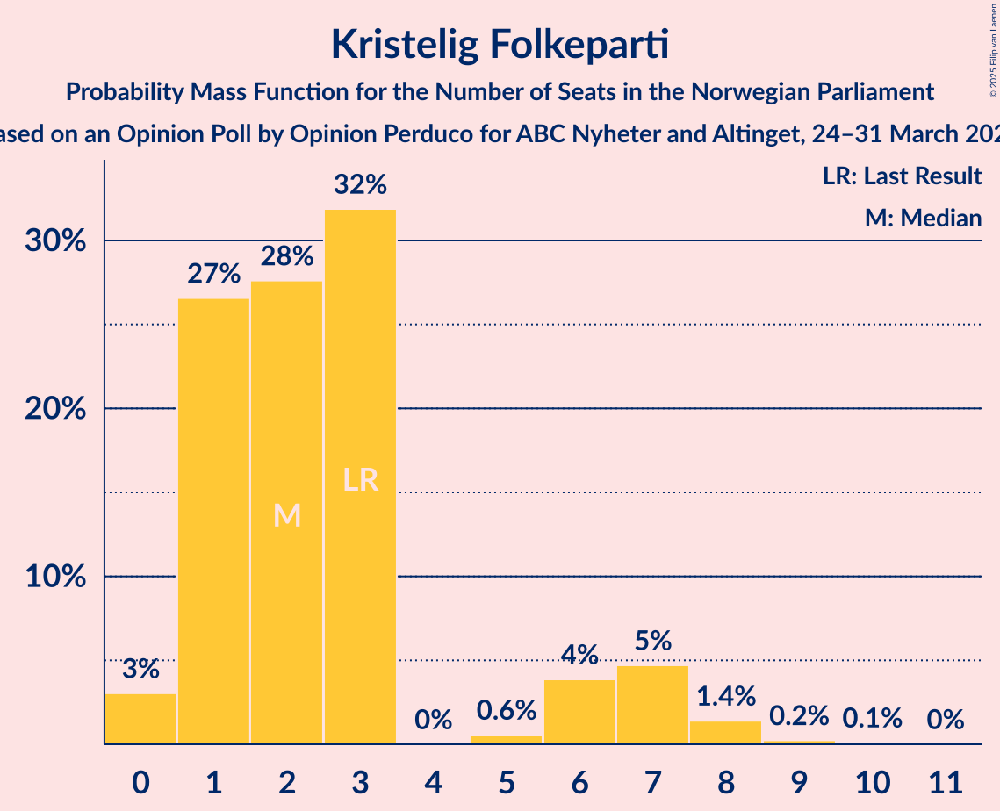
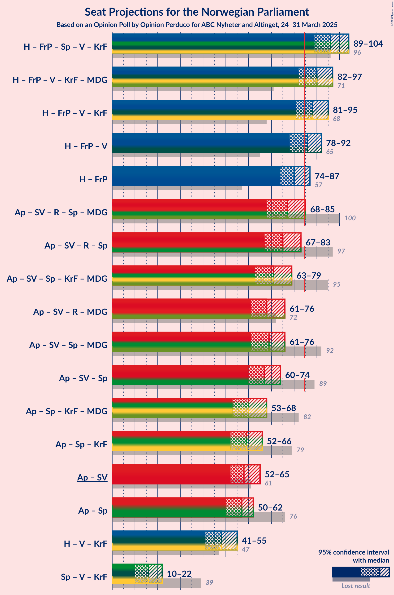
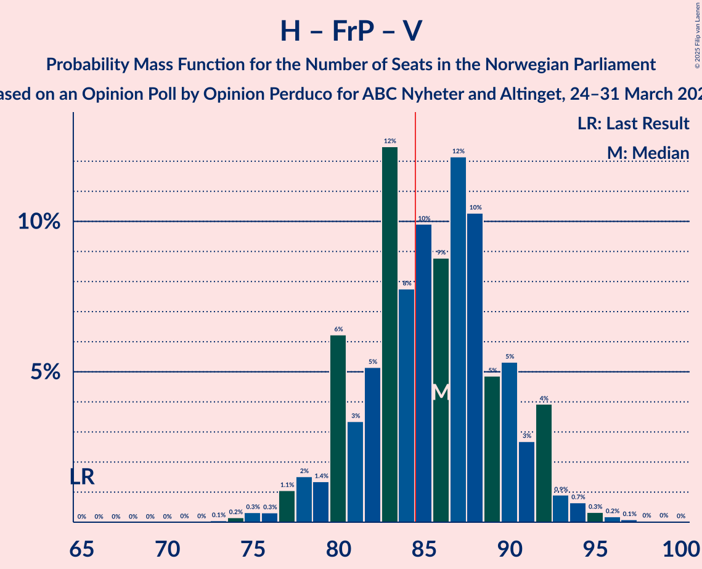
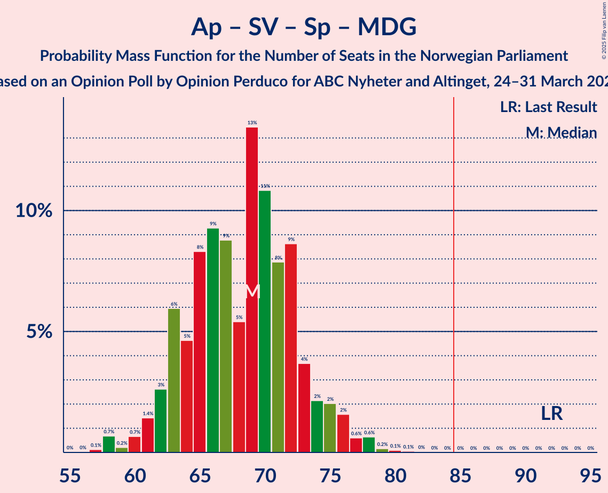

# Opinion Poll by Opinion Perduco for ABC Nyheter and Altinget, 24–31 March 2025

<a href="#voting-intentions">Voting Intentions</a> | <a href="#seats">Seats</a> | <a href="#coalitions">Coalitions</a> | <a href="#technical-information">Technical Information</a>

## Voting Intentions

### Confidence Intervals

| Party | Last Result | Poll Result | 80% Confidence Interval | 90% Confidence Interval | 95% Confidence Interval | 99% Confidence Interval |
|:-----:|:-----------:|:-----------:|:-----------------------:|:-----------------------:|:-----------------------:|:-----------------------:|
| Arbeiderpartiet | 26.2% | 24.9% | 22.9–27.0% |22.4–27.6% |21.9–28.1% |21.0–29.1% |
| Høyre | 20.4% | 22.2% | 20.4–24.3% |19.9–24.8% |19.4–25.3% |18.6–26.3% |
| Fremskrittspartiet | 11.6% | 20.9% | 19.1–22.9% |18.6–23.5% |18.2–24.0% |17.3–24.9% |
| Sosialistisk Venstreparti | 7.6% | 6.2% | 5.2–7.5% |4.9–7.8% |4.7–8.1% |4.2–8.8% |
| Rødt | 4.7% | 5.3% | 4.4–6.5% |4.1–6.8% |3.9–7.1% |3.5–7.7% |
| Senterpartiet | 13.5% | 5.3% | 4.4–6.5% |4.1–6.8% |3.9–7.1% |3.5–7.7% |
| Venstre | 4.6% | 3.8% | 3.1–4.9% |2.9–5.2% |2.7–5.4% |2.3–6.0% |
| Miljøpartiet De Grønne | 3.9% | 3.7% | 2.9–4.7% |2.7–5.0% |2.6–5.3% |2.2–5.8% |
| Kristelig Folkeparti | 3.8% | 3.0% | 2.4–4.0% |2.2–4.3% |2.0–4.5% |1.8–5.0% |
| Industri- og Næringspartiet | 0.3% | 1.1% | 0.7–1.7% |0.6–1.9% |0.5–2.1% |0.4–2.4% |

*Note:* The poll result column reflects the actual value used in the calculations. Published results may vary slightly, and in addition be rounded to fewer digits.

## Seats

### Confidence Intervals

| Party | Last Result | Median | 80% Confidence Interval | 90% Confidence Interval | 95% Confidence Interval | 99% Confidence Interval |
|:-----:|:-----------:|:------:|:-----------------------:|:-----------------------:|:-----------------------:|:-----------------------:|
| <a href="#arbeiderpartiet">Arbeiderpartiet</a> | 48 | 48 | 44–51 |43–51 |42–52 |41–55 |
| <a href="#høyre">Høyre</a> | 36 | 41 | 37–44 |36–45 |34–47 |33–48 |
| <a href="#fremskrittspartiet">Fremskrittspartiet</a> | 21 | 41 | 37–42 |36–43 |35–44 |34–47 |
| <a href="#sosialistisk-venstreparti">Sosialistisk Venstreparti</a> | 13 | 10 | 8–13 |8–15 |7–15 |7–15 |
| <a href="#rødt">Rødt</a> | 8 | 9 | 7–11 |7–12 |6–12 |1–13 |
| <a href="#senterpartiet">Senterpartiet</a> | 28 | 9 | 7–11 |6–12 |1–12 |0–14 |
| <a href="#venstre">Venstre</a> | 8 | 3 | 2–8 |2–8 |2–9 |1–10 |
| <a href="#miljøpartiet-de-grønne">Miljøpartiet De Grønne</a> | 3 | 3 | 2–7 |1–8 |1–9 |1–9 |
| <a href="#kristelig-folkeparti">Kristelig Folkeparti</a> | 3 | 2 | 1–3 |1–5 |0–7 |0–8 |
| <a href="#industri--og-næringspartiet">Industri- og Næringspartiet</a> | 0 | 0 | 0 |0 |0 |0 |

### Arbeiderpartiet

*For a full overview of the results for this party, see the [Arbeiderpartiet](party-arbeiderpartiet.html) page.*

| Number of Seats | Probability | Accumulated | Special Marks |
|:---------------:|:-----------:|:-----------:|:-------------:|
| 38 | 0% | 100% |  |
| 39 | 0.1% | 99.9% |  |
| 40 | 0.2% | 99.8% |  |
| 41 | 0.6% | 99.6% |  |
| 42 | 3% | 99.0% |  |
| 43 | 5% | 96% |  |
| 44 | 3% | 91% |  |
| 45 | 6% | 87% |  |
| 46 | 10% | 82% |  |
| 47 | 15% | 71% |  |
| 48 | 23% | 56% | Last Result, Median |
| 49 | 13% | 33% |  |
| 50 | 8% | 20% |  |
| 51 | 8% | 12% |  |
| 52 | 2% | 4% |  |
| 53 | 0.6% | 2% |  |
| 54 | 1.1% | 2% |  |
| 55 | 0.3% | 0.7% |  |
| 56 | 0.2% | 0.4% |  |
| 57 | 0.1% | 0.2% |  |
| 58 | 0% | 0.1% |  |
| 59 | 0% | 0% |  |

### Høyre

*For a full overview of the results for this party, see the [Høyre](party-høyre.html) page.*

| Number of Seats | Probability | Accumulated | Special Marks |
|:---------------:|:-----------:|:-----------:|:-------------:|
| 31 | 0.1% | 100% |  |
| 32 | 0.3% | 99.9% |  |
| 33 | 0.8% | 99.6% |  |
| 34 | 1.4% | 98.8% |  |
| 35 | 1.4% | 97% |  |
| 36 | 5% | 96% | Last Result |
| 37 | 4% | 91% |  |
| 38 | 5% | 87% |  |
| 39 | 16% | 82% |  |
| 40 | 14% | 66% |  |
| 41 | 19% | 51% | Median |
| 42 | 15% | 32% |  |
| 43 | 5% | 17% |  |
| 44 | 4% | 12% |  |
| 45 | 4% | 8% |  |
| 46 | 1.5% | 4% |  |
| 47 | 1.2% | 3% |  |
| 48 | 1.3% | 2% |  |
| 49 | 0.2% | 0.3% |  |
| 50 | 0.1% | 0.2% |  |
| 51 | 0% | 0% |  |

### Fremskrittspartiet

*For a full overview of the results for this party, see the [Fremskrittspartiet](party-fremskrittspartiet.html) page.*

| Number of Seats | Probability | Accumulated | Special Marks |
|:---------------:|:-----------:|:-----------:|:-------------:|
| 21 | 0% | 100% | Last Result |
| 22 | 0% | 100% |  |
| 23 | 0% | 100% |  |
| 24 | 0% | 100% |  |
| 25 | 0% | 100% |  |
| 26 | 0% | 100% |  |
| 27 | 0% | 100% |  |
| 28 | 0% | 100% |  |
| 29 | 0% | 100% |  |
| 30 | 0% | 100% |  |
| 31 | 0.1% | 100% |  |
| 32 | 0.1% | 99.9% |  |
| 33 | 0.3% | 99.8% |  |
| 34 | 0.6% | 99.5% |  |
| 35 | 2% | 99.0% |  |
| 36 | 5% | 97% |  |
| 37 | 7% | 92% |  |
| 38 | 5% | 86% |  |
| 39 | 14% | 80% |  |
| 40 | 12% | 66% |  |
| 41 | 20% | 54% | Median |
| 42 | 25% | 34% |  |
| 43 | 4% | 9% |  |
| 44 | 2% | 4% |  |
| 45 | 0.9% | 2% |  |
| 46 | 0.4% | 1.0% |  |
| 47 | 0.4% | 0.6% |  |
| 48 | 0.1% | 0.2% |  |
| 49 | 0.1% | 0.1% |  |
| 50 | 0% | 0% |  |

### Sosialistisk Venstreparti

*For a full overview of the results for this party, see the [Sosialistisk Venstreparti](party-sosialistiskvenstreparti.html) page.*

| Number of Seats | Probability | Accumulated | Special Marks |
|:---------------:|:-----------:|:-----------:|:-------------:|
| 2 | 0.1% | 100% |  |
| 3 | 0% | 99.9% |  |
| 4 | 0% | 99.9% |  |
| 5 | 0% | 99.9% |  |
| 6 | 0.2% | 99.9% |  |
| 7 | 4% | 99.7% |  |
| 8 | 7% | 96% |  |
| 9 | 24% | 89% |  |
| 10 | 23% | 65% | Median |
| 11 | 14% | 43% |  |
| 12 | 15% | 28% |  |
| 13 | 6% | 13% | Last Result |
| 14 | 2% | 8% |  |
| 15 | 5% | 5% |  |
| 16 | 0.2% | 0.5% |  |
| 17 | 0.2% | 0.2% |  |
| 18 | 0.1% | 0.1% |  |
| 19 | 0% | 0% |  |

### Rødt

*For a full overview of the results for this party, see the [Rødt](party-rødt.html) page.*

| Number of Seats | Probability | Accumulated | Special Marks |
|:---------------:|:-----------:|:-----------:|:-------------:|
| 1 | 2% | 100% |  |
| 2 | 0% | 98% |  |
| 3 | 0% | 98% |  |
| 4 | 0% | 98% |  |
| 5 | 0.1% | 98% |  |
| 6 | 2% | 98% |  |
| 7 | 11% | 96% |  |
| 8 | 20% | 85% | Last Result |
| 9 | 29% | 64% | Median |
| 10 | 18% | 35% |  |
| 11 | 9% | 18% |  |
| 12 | 7% | 9% |  |
| 13 | 2% | 2% |  |
| 14 | 0.3% | 0.3% |  |
| 15 | 0.1% | 0.1% |  |
| 16 | 0% | 0% |  |

### Senterpartiet

*For a full overview of the results for this party, see the [Senterpartiet](party-senterpartiet.html) page.*

| Number of Seats | Probability | Accumulated | Special Marks |
|:---------------:|:-----------:|:-----------:|:-------------:|
| 0 | 1.2% | 100% |  |
| 1 | 3% | 98.8% |  |
| 2 | 0.1% | 95% |  |
| 3 | 0% | 95% |  |
| 4 | 0% | 95% |  |
| 5 | 0.3% | 95% |  |
| 6 | 3% | 95% |  |
| 7 | 12% | 92% |  |
| 8 | 20% | 80% |  |
| 9 | 30% | 60% | Median |
| 10 | 13% | 30% |  |
| 11 | 10% | 16% |  |
| 12 | 5% | 7% |  |
| 13 | 2% | 2% |  |
| 14 | 0.4% | 0.6% |  |
| 15 | 0.1% | 0.2% |  |
| 16 | 0% | 0% |  |
| 17 | 0% | 0% |  |
| 18 | 0% | 0% |  |
| 19 | 0% | 0% |  |
| 20 | 0% | 0% |  |
| 21 | 0% | 0% |  |
| 22 | 0% | 0% |  |
| 23 | 0% | 0% |  |
| 24 | 0% | 0% |  |
| 25 | 0% | 0% |  |
| 26 | 0% | 0% |  |
| 27 | 0% | 0% |  |
| 28 | 0% | 0% | Last Result |

### Venstre

*For a full overview of the results for this party, see the [Venstre](party-venstre.html) page.*

| Number of Seats | Probability | Accumulated | Special Marks |
|:---------------:|:-----------:|:-----------:|:-------------:|
| 1 | 1.1% | 100% |  |
| 2 | 23% | 98.9% |  |
| 3 | 35% | 76% | Median |
| 4 | 0% | 41% |  |
| 5 | 0.4% | 41% |  |
| 6 | 8% | 41% |  |
| 7 | 15% | 33% |  |
| 8 | 15% | 18% | Last Result |
| 9 | 2% | 3% |  |
| 10 | 0.6% | 0.8% |  |
| 11 | 0.1% | 0.2% |  |
| 12 | 0% | 0% |  |

### Miljøpartiet De Grønne

*For a full overview of the results for this party, see the [Miljøpartiet De Grønne](party-miljøpartietdegrønne.html) page.*

| Number of Seats | Probability | Accumulated | Special Marks |
|:---------------:|:-----------:|:-----------:|:-------------:|
| 1 | 9% | 100% |  |
| 2 | 26% | 91% |  |
| 3 | 39% | 65% | Last Result, Median |
| 4 | 0% | 27% |  |
| 5 | 1.1% | 27% |  |
| 6 | 6% | 26% |  |
| 7 | 12% | 20% |  |
| 8 | 5% | 7% |  |
| 9 | 2% | 3% |  |
| 10 | 0.4% | 0.4% |  |
| 11 | 0.1% | 0.1% |  |
| 12 | 0% | 0% |  |

### Kristelig Folkeparti

*For a full overview of the results for this party, see the [Kristelig Folkeparti](party-kristeligfolkeparti.html) page.*

| Number of Seats | Probability | Accumulated | Special Marks |
|:---------------:|:-----------:|:-----------:|:-------------:|
| 0 | 5% | 100% |  |
| 1 | 32% | 95% |  |
| 2 | 21% | 64% | Median |
| 3 | 38% | 43% | Last Result |
| 4 | 0% | 5% |  |
| 5 | 0.1% | 5% |  |
| 6 | 2% | 5% |  |
| 7 | 2% | 3% |  |
| 8 | 0.8% | 1.0% |  |
| 9 | 0.1% | 0.2% |  |
| 10 | 0% | 0% |  |

### Industri- og Næringspartiet

*For a full overview of the results for this party, see the [Industri- og Næringspartiet](party-industri-ognæringspartiet.html) page.*

| Number of Seats | Probability | Accumulated | Special Marks |
|:---------------:|:-----------:|:-----------:|:-------------:|
| 0 | 99.7% | 100% | Last Result, Median |
| 1 | 0.2% | 0.3% |  |
| 2 | 0.1% | 0.1% |  |
| 3 | 0% | 0% |  |

## Coalitions

### Confidence Intervals

| Coalition | Last Result | Median | Majority? | 80% Confidence Interval | 90% Confidence Interval | 95% Confidence Interval | 99% Confidence Interval |
|:---------:|:-----------:|:------:|:---------:|:-----------------------:|:-----------------------:|:-----------------------:|:-----------------------:|
| Høyre – Fremskrittspartiet – Senterpartiet – Venstre – Kristelig Folkeparti | 96 | 96 | 99.7% | 91–101 | 90–101 | 89–102 | 85–105 |
| Høyre – Fremskrittspartiet – Venstre – Miljøpartiet De Grønne – Kristelig Folkeparti | 71 | 91 | 96% | 86–95 | 85–97 | 84–99 | 81–102 |
| Høyre – Fremskrittspartiet – Venstre – Kristelig Folkeparti | 68 | 87 | 83% | 83–92 | 82–93 | 80–94 | 77–97 |
| Høyre – Fremskrittspartiet – Venstre | 65 | 85 | 58% | 81–89 | 79–90 | 77–90 | 75–94 |
| Arbeiderpartiet – Sosialistisk Venstreparti – Rødt – Senterpartiet – Miljøpartiet De Grønne | 100 | 79 | 7% | 75–84 | 73–86 | 72–88 | 68–91 |
| Høyre – Fremskrittspartiet | 57 | 81 | 5% | 77–83 | 75–84 | 74–86 | 71–89 |
| Arbeiderpartiet – Sosialistisk Venstreparti – Rødt – Senterpartiet | 97 | 76 | 1.0% | 70–81 | 69–82 | 67–83 | 65–85 |
| Arbeiderpartiet – Sosialistisk Venstreparti – Senterpartiet – Miljøpartiet De Grønne – Kristelig Folkeparti | 95 | 72 | 0.5% | 69–77 | 67–80 | 66–82 | 64–84 |
| Arbeiderpartiet – Sosialistisk Venstreparti – Senterpartiet – Miljøpartiet De Grønne | 92 | 70 | 0% | 66–75 | 64–77 | 63–79 | 61–81 |
| Arbeiderpartiet – Sosialistisk Venstreparti – Rødt – Miljøpartiet De Grønne | 72 | 71 | 0% | 66–75 | 65–77 | 64–78 | 61–81 |
| Arbeiderpartiet – Sosialistisk Venstreparti – Senterpartiet | 89 | 67 | 0% | 62–72 | 60–73 | 60–73 | 57–76 |
| Arbeiderpartiet – Senterpartiet – Miljøpartiet De Grønne – Kristelig Folkeparti | 82 | 62 | 0% | 58–67 | 57–69 | 56–71 | 53–73 |
| Arbeiderpartiet – Senterpartiet – Kristelig Folkeparti | 79 | 59 | 0% | 54–63 | 53–63 | 51–65 | 50–68 |
| Arbeiderpartiet – Sosialistisk Venstreparti | 61 | 58 | 0% | 54–63 | 52–63 | 52–64 | 50–66 |
| Arbeiderpartiet – Senterpartiet | 76 | 56 | 0% | 52–60 | 51–61 | 49–62 | 48–64 |
| Høyre – Venstre – Kristelig Folkeparti | 47 | 47 | 0% | 43–52 | 42–54 | 40–54 | 38–56 |
| Senterpartiet – Venstre – Kristelig Folkeparti | 39 | 15 | 0% | 12–20 | 10–21 | 8–22 | 4–24 |

### Høyre – Fremskrittspartiet – Senterpartiet – Venstre – Kristelig Folkeparti

| Number of Seats | Probability | Accumulated | Special Marks |
|:---------------:|:-----------:|:-----------:|:-------------:|
| 83 | 0% | 100% |  |
| 84 | 0.2% | 99.9% |  |
| 85 | 0.2% | 99.7% | Majority |
| 86 | 0.4% | 99.5% |  |
| 87 | 0.4% | 99.1% |  |
| 88 | 1.1% | 98.8% |  |
| 89 | 0.9% | 98% |  |
| 90 | 2% | 97% |  |
| 91 | 5% | 95% |  |
| 92 | 6% | 90% |  |
| 93 | 5% | 83% |  |
| 94 | 7% | 78% |  |
| 95 | 14% | 71% |  |
| 96 | 16% | 57% | Last Result, Median |
| 97 | 8% | 41% |  |
| 98 | 9% | 32% |  |
| 99 | 3% | 24% |  |
| 100 | 4% | 21% |  |
| 101 | 13% | 17% |  |
| 102 | 2% | 4% |  |
| 103 | 0.9% | 2% |  |
| 104 | 0.7% | 1.5% |  |
| 105 | 0.3% | 0.8% |  |
| 106 | 0.1% | 0.4% |  |
| 107 | 0.1% | 0.3% |  |
| 108 | 0.1% | 0.2% |  |
| 109 | 0.1% | 0.1% |  |
| 110 | 0% | 0% |  |

### Høyre – Fremskrittspartiet – Venstre – Miljøpartiet De Grønne – Kristelig Folkeparti

| Number of Seats | Probability | Accumulated | Special Marks |
|:---------------:|:-----------:|:-----------:|:-------------:|
| 71 | 0% | 100% | Last Result |
| 72 | 0% | 100% |  |
| 73 | 0% | 100% |  |
| 74 | 0% | 100% |  |
| 75 | 0% | 100% |  |
| 76 | 0% | 100% |  |
| 77 | 0% | 100% |  |
| 78 | 0% | 100% |  |
| 79 | 0% | 100% |  |
| 80 | 0.3% | 99.9% |  |
| 81 | 0.2% | 99.7% |  |
| 82 | 0.2% | 99.5% |  |
| 83 | 1.0% | 99.3% |  |
| 84 | 2% | 98% |  |
| 85 | 3% | 96% | Majority |
| 86 | 4% | 94% |  |
| 87 | 7% | 90% |  |
| 88 | 5% | 82% |  |
| 89 | 10% | 77% |  |
| 90 | 13% | 67% | Median |
| 91 | 5% | 53% |  |
| 92 | 13% | 48% |  |
| 93 | 9% | 35% |  |
| 94 | 5% | 26% |  |
| 95 | 13% | 22% |  |
| 96 | 4% | 9% |  |
| 97 | 2% | 6% |  |
| 98 | 1.0% | 4% |  |
| 99 | 1.2% | 3% |  |
| 100 | 0.8% | 2% |  |
| 101 | 0.2% | 0.8% |  |
| 102 | 0.4% | 0.6% |  |
| 103 | 0.1% | 0.2% |  |
| 104 | 0.1% | 0.1% |  |
| 105 | 0% | 0% |  |

### Høyre – Fremskrittspartiet – Venstre – Kristelig Folkeparti

| Number of Seats | Probability | Accumulated | Special Marks |
|:---------------:|:-----------:|:-----------:|:-------------:|
| 68 | 0% | 100% | Last Result |
| 69 | 0% | 100% |  |
| 70 | 0% | 100% |  |
| 71 | 0% | 100% |  |
| 72 | 0% | 100% |  |
| 73 | 0% | 100% |  |
| 74 | 0.1% | 100% |  |
| 75 | 0.1% | 99.9% |  |
| 76 | 0.1% | 99.8% |  |
| 77 | 0.2% | 99.7% |  |
| 78 | 0.8% | 99.5% |  |
| 79 | 0.8% | 98.7% |  |
| 80 | 0.9% | 98% |  |
| 81 | 2% | 97% |  |
| 82 | 3% | 95% |  |
| 83 | 5% | 92% |  |
| 84 | 4% | 87% |  |
| 85 | 9% | 83% | Majority |
| 86 | 8% | 74% |  |
| 87 | 21% | 66% | Median |
| 88 | 9% | 45% |  |
| 89 | 6% | 36% |  |
| 90 | 11% | 29% |  |
| 91 | 3% | 19% |  |
| 92 | 10% | 15% |  |
| 93 | 3% | 6% |  |
| 94 | 1.1% | 3% |  |
| 95 | 0.9% | 2% |  |
| 96 | 0.2% | 0.9% |  |
| 97 | 0.2% | 0.6% |  |
| 98 | 0.1% | 0.4% |  |
| 99 | 0.2% | 0.3% |  |
| 100 | 0.1% | 0.1% |  |
| 101 | 0% | 0% |  |

### Høyre – Fremskrittspartiet – Venstre

| Number of Seats | Probability | Accumulated | Special Marks |
|:---------------:|:-----------:|:-----------:|:-------------:|
| 65 | 0% | 100% | Last Result |
| 66 | 0% | 100% |  |
| 67 | 0% | 100% |  |
| 68 | 0% | 100% |  |
| 69 | 0% | 100% |  |
| 70 | 0% | 100% |  |
| 71 | 0% | 100% |  |
| 72 | 0.1% | 100% |  |
| 73 | 0.1% | 99.9% |  |
| 74 | 0.1% | 99.8% |  |
| 75 | 0.2% | 99.7% |  |
| 76 | 0.8% | 99.5% |  |
| 77 | 1.2% | 98.7% |  |
| 78 | 1.2% | 97% |  |
| 79 | 2% | 96% |  |
| 80 | 2% | 94% |  |
| 81 | 6% | 92% |  |
| 82 | 7% | 87% |  |
| 83 | 3% | 80% |  |
| 84 | 20% | 78% |  |
| 85 | 12% | 58% | Median, Majority |
| 86 | 9% | 46% |  |
| 87 | 10% | 37% |  |
| 88 | 7% | 28% |  |
| 89 | 14% | 21% |  |
| 90 | 4% | 7% |  |
| 91 | 0.9% | 2% |  |
| 92 | 0.7% | 1.5% |  |
| 93 | 0.3% | 0.8% |  |
| 94 | 0.2% | 0.5% |  |
| 95 | 0.1% | 0.3% |  |
| 96 | 0.1% | 0.2% |  |
| 97 | 0% | 0.1% |  |
| 98 | 0% | 0% |  |

### Arbeiderpartiet – Sosialistisk Venstreparti – Rødt – Senterpartiet – Miljøpartiet De Grønne

| Number of Seats | Probability | Accumulated | Special Marks |
|:---------------:|:-----------:|:-----------:|:-------------:|
| 66 | 0.1% | 100% |  |
| 67 | 0.1% | 99.9% |  |
| 68 | 0.3% | 99.8% |  |
| 69 | 0.3% | 99.5% |  |
| 70 | 0.7% | 99.2% |  |
| 71 | 0.7% | 98% |  |
| 72 | 2% | 98% |  |
| 73 | 2% | 95% |  |
| 74 | 2% | 93% |  |
| 75 | 7% | 91% |  |
| 76 | 8% | 84% |  |
| 77 | 13% | 76% |  |
| 78 | 5% | 64% |  |
| 79 | 13% | 59% | Median |
| 80 | 6% | 46% |  |
| 81 | 7% | 39% |  |
| 82 | 13% | 32% |  |
| 83 | 6% | 19% |  |
| 84 | 6% | 13% |  |
| 85 | 2% | 7% | Majority |
| 86 | 2% | 5% |  |
| 87 | 0.4% | 4% |  |
| 88 | 1.4% | 3% |  |
| 89 | 0.6% | 2% |  |
| 90 | 0.5% | 1.3% |  |
| 91 | 0.5% | 0.8% |  |
| 92 | 0.1% | 0.3% |  |
| 93 | 0.1% | 0.2% |  |
| 94 | 0.1% | 0.1% |  |
| 95 | 0% | 0% |  |
| 96 | 0% | 0% |  |
| 97 | 0% | 0% |  |
| 98 | 0% | 0% |  |
| 99 | 0% | 0% |  |
| 100 | 0% | 0% | Last Result |

### Høyre – Fremskrittspartiet

| Number of Seats | Probability | Accumulated | Special Marks |
|:---------------:|:-----------:|:-----------:|:-------------:|
| 57 | 0% | 100% | Last Result |
| 58 | 0% | 100% |  |
| 59 | 0% | 100% |  |
| 60 | 0% | 100% |  |
| 61 | 0% | 100% |  |
| 62 | 0% | 100% |  |
| 63 | 0% | 100% |  |
| 64 | 0% | 100% |  |
| 65 | 0% | 100% |  |
| 66 | 0% | 100% |  |
| 67 | 0% | 100% |  |
| 68 | 0% | 100% |  |
| 69 | 0.1% | 100% |  |
| 70 | 0.2% | 99.9% |  |
| 71 | 0.2% | 99.7% |  |
| 72 | 0.4% | 99.4% |  |
| 73 | 1.5% | 99.0% |  |
| 74 | 2% | 98% |  |
| 75 | 3% | 96% |  |
| 76 | 2% | 93% |  |
| 77 | 3% | 91% |  |
| 78 | 5% | 88% |  |
| 79 | 6% | 83% |  |
| 80 | 9% | 76% |  |
| 81 | 25% | 67% |  |
| 82 | 23% | 42% | Median |
| 83 | 11% | 19% |  |
| 84 | 4% | 9% |  |
| 85 | 2% | 5% | Majority |
| 86 | 0.6% | 3% |  |
| 87 | 1.2% | 2% |  |
| 88 | 0.4% | 1.1% |  |
| 89 | 0.3% | 0.6% |  |
| 90 | 0.2% | 0.4% |  |
| 91 | 0.1% | 0.2% |  |
| 92 | 0% | 0.1% |  |
| 93 | 0.1% | 0.1% |  |
| 94 | 0% | 0% |  |

### Arbeiderpartiet – Sosialistisk Venstreparti – Rødt – Senterpartiet

| Number of Seats | Probability | Accumulated | Special Marks |
|:---------------:|:-----------:|:-----------:|:-------------:|
| 61 | 0% | 100% |  |
| 62 | 0% | 99.9% |  |
| 63 | 0.1% | 99.9% |  |
| 64 | 0.2% | 99.8% |  |
| 65 | 0.3% | 99.6% |  |
| 66 | 0.6% | 99.3% |  |
| 67 | 2% | 98.7% |  |
| 68 | 1.3% | 97% |  |
| 69 | 4% | 96% |  |
| 70 | 2% | 92% |  |
| 71 | 4% | 89% |  |
| 72 | 8% | 85% |  |
| 73 | 7% | 77% |  |
| 74 | 15% | 71% |  |
| 75 | 4% | 56% |  |
| 76 | 10% | 53% | Median |
| 77 | 9% | 42% |  |
| 78 | 5% | 33% |  |
| 79 | 7% | 28% |  |
| 80 | 9% | 21% |  |
| 81 | 3% | 12% |  |
| 82 | 6% | 9% |  |
| 83 | 1.1% | 3% |  |
| 84 | 0.5% | 2% |  |
| 85 | 0.5% | 1.0% | Majority |
| 86 | 0.3% | 0.5% |  |
| 87 | 0.1% | 0.1% |  |
| 88 | 0% | 0.1% |  |
| 89 | 0% | 0% |  |
| 90 | 0% | 0% |  |
| 91 | 0% | 0% |  |
| 92 | 0% | 0% |  |
| 93 | 0% | 0% |  |
| 94 | 0% | 0% |  |
| 95 | 0% | 0% |  |
| 96 | 0% | 0% |  |
| 97 | 0% | 0% | Last Result |

### Arbeiderpartiet – Sosialistisk Venstreparti – Senterpartiet – Miljøpartiet De Grønne – Kristelig Folkeparti

| Number of Seats | Probability | Accumulated | Special Marks |
|:---------------:|:-----------:|:-----------:|:-------------:|
| 59 | 0% | 100% |  |
| 60 | 0% | 99.9% |  |
| 61 | 0.1% | 99.9% |  |
| 62 | 0.2% | 99.9% |  |
| 63 | 0.1% | 99.7% |  |
| 64 | 0.3% | 99.6% |  |
| 65 | 0.5% | 99.3% |  |
| 66 | 3% | 98.8% |  |
| 67 | 2% | 96% |  |
| 68 | 4% | 94% |  |
| 69 | 7% | 90% |  |
| 70 | 10% | 84% |  |
| 71 | 20% | 73% |  |
| 72 | 12% | 53% | Median |
| 73 | 11% | 42% |  |
| 74 | 5% | 30% |  |
| 75 | 5% | 25% |  |
| 76 | 6% | 20% |  |
| 77 | 6% | 15% |  |
| 78 | 2% | 9% |  |
| 79 | 1.3% | 7% |  |
| 80 | 2% | 6% |  |
| 81 | 1.4% | 4% |  |
| 82 | 1.3% | 3% |  |
| 83 | 0.9% | 2% |  |
| 84 | 0.3% | 0.8% |  |
| 85 | 0.3% | 0.5% | Majority |
| 86 | 0.1% | 0.2% |  |
| 87 | 0.1% | 0.1% |  |
| 88 | 0% | 0% |  |
| 89 | 0% | 0% |  |
| 90 | 0% | 0% |  |
| 91 | 0% | 0% |  |
| 92 | 0% | 0% |  |
| 93 | 0% | 0% |  |
| 94 | 0% | 0% |  |
| 95 | 0% | 0% | Last Result |

### Arbeiderpartiet – Sosialistisk Venstreparti – Senterpartiet – Miljøpartiet De Grønne

| Number of Seats | Probability | Accumulated | Special Marks |
|:---------------:|:-----------:|:-----------:|:-------------:|
| 58 | 0% | 100% |  |
| 59 | 0.1% | 99.9% |  |
| 60 | 0.2% | 99.8% |  |
| 61 | 0.3% | 99.6% |  |
| 62 | 0.7% | 99.3% |  |
| 63 | 3% | 98.6% |  |
| 64 | 1.4% | 96% |  |
| 65 | 3% | 95% |  |
| 66 | 5% | 92% |  |
| 67 | 4% | 88% |  |
| 68 | 18% | 83% |  |
| 69 | 12% | 65% |  |
| 70 | 10% | 53% | Median |
| 71 | 9% | 44% |  |
| 72 | 9% | 35% |  |
| 73 | 4% | 25% |  |
| 74 | 9% | 21% |  |
| 75 | 5% | 12% |  |
| 76 | 2% | 7% |  |
| 77 | 2% | 6% |  |
| 78 | 0.5% | 4% |  |
| 79 | 2% | 4% |  |
| 80 | 0.7% | 2% |  |
| 81 | 0.8% | 1.3% |  |
| 82 | 0.1% | 0.5% |  |
| 83 | 0.2% | 0.3% |  |
| 84 | 0.1% | 0.1% |  |
| 85 | 0% | 0% | Majority |
| 86 | 0% | 0% |  |
| 87 | 0% | 0% |  |
| 88 | 0% | 0% |  |
| 89 | 0% | 0% |  |
| 90 | 0% | 0% |  |
| 91 | 0% | 0% |  |
| 92 | 0% | 0% | Last Result |

### Arbeiderpartiet – Sosialistisk Venstreparti – Rødt – Miljøpartiet De Grønne

| Number of Seats | Probability | Accumulated | Special Marks |
|:---------------:|:-----------:|:-----------:|:-------------:|
| 57 | 0% | 100% |  |
| 58 | 0% | 99.9% |  |
| 59 | 0.1% | 99.9% |  |
| 60 | 0.2% | 99.8% |  |
| 61 | 0.4% | 99.6% |  |
| 62 | 0.5% | 99.2% |  |
| 63 | 0.5% | 98.6% |  |
| 64 | 3% | 98% |  |
| 65 | 3% | 95% |  |
| 66 | 4% | 93% |  |
| 67 | 10% | 89% |  |
| 68 | 13% | 79% |  |
| 69 | 6% | 66% |  |
| 70 | 6% | 59% | Median |
| 71 | 11% | 53% |  |
| 72 | 6% | 42% | Last Result |
| 73 | 13% | 36% |  |
| 74 | 10% | 23% |  |
| 75 | 3% | 13% |  |
| 76 | 3% | 10% |  |
| 77 | 1.5% | 6% |  |
| 78 | 3% | 5% |  |
| 79 | 0.9% | 2% |  |
| 80 | 0.6% | 1.3% |  |
| 81 | 0.2% | 0.7% |  |
| 82 | 0.1% | 0.4% |  |
| 83 | 0.2% | 0.3% |  |
| 84 | 0.1% | 0.1% |  |
| 85 | 0% | 0% | Majority |

### Arbeiderpartiet – Sosialistisk Venstreparti – Senterpartiet

| Number of Seats | Probability | Accumulated | Special Marks |
|:---------------:|:-----------:|:-----------:|:-------------:|
| 54 | 0.1% | 100% |  |
| 55 | 0% | 99.9% |  |
| 56 | 0.1% | 99.9% |  |
| 57 | 0.5% | 99.8% |  |
| 58 | 0.5% | 99.3% |  |
| 59 | 1.1% | 98.9% |  |
| 60 | 3% | 98% |  |
| 61 | 4% | 95% |  |
| 62 | 5% | 91% |  |
| 63 | 7% | 85% |  |
| 64 | 3% | 78% |  |
| 65 | 15% | 75% |  |
| 66 | 10% | 60% |  |
| 67 | 12% | 50% | Median |
| 68 | 9% | 38% |  |
| 69 | 5% | 30% |  |
| 70 | 5% | 24% |  |
| 71 | 5% | 19% |  |
| 72 | 7% | 14% |  |
| 73 | 5% | 7% |  |
| 74 | 0.8% | 2% |  |
| 75 | 0.4% | 1.2% |  |
| 76 | 0.5% | 0.8% |  |
| 77 | 0.1% | 0.2% |  |
| 78 | 0% | 0.1% |  |
| 79 | 0% | 0.1% |  |
| 80 | 0% | 0.1% |  |
| 81 | 0% | 0% |  |
| 82 | 0% | 0% |  |
| 83 | 0% | 0% |  |
| 84 | 0% | 0% |  |
| 85 | 0% | 0% | Majority |
| 86 | 0% | 0% |  |
| 87 | 0% | 0% |  |
| 88 | 0% | 0% |  |
| 89 | 0% | 0% | Last Result |

### Arbeiderpartiet – Senterpartiet – Miljøpartiet De Grønne – Kristelig Folkeparti

| Number of Seats | Probability | Accumulated | Special Marks |
|:---------------:|:-----------:|:-----------:|:-------------:|
| 49 | 0% | 100% |  |
| 50 | 0.1% | 99.9% |  |
| 51 | 0% | 99.9% |  |
| 52 | 0.1% | 99.9% |  |
| 53 | 0.4% | 99.7% |  |
| 54 | 0.7% | 99.3% |  |
| 55 | 0.8% | 98.6% |  |
| 56 | 2% | 98% |  |
| 57 | 4% | 96% |  |
| 58 | 5% | 92% |  |
| 59 | 5% | 87% |  |
| 60 | 11% | 83% |  |
| 61 | 17% | 72% |  |
| 62 | 21% | 54% | Median |
| 63 | 8% | 34% |  |
| 64 | 7% | 26% |  |
| 65 | 7% | 20% |  |
| 66 | 2% | 13% |  |
| 67 | 3% | 11% |  |
| 68 | 2% | 8% |  |
| 69 | 2% | 6% |  |
| 70 | 1.0% | 4% |  |
| 71 | 1.2% | 3% |  |
| 72 | 0.7% | 2% |  |
| 73 | 0.5% | 0.9% |  |
| 74 | 0.2% | 0.4% |  |
| 75 | 0.1% | 0.2% |  |
| 76 | 0% | 0.1% |  |
| 77 | 0% | 0% |  |
| 78 | 0% | 0% |  |
| 79 | 0% | 0% |  |
| 80 | 0% | 0% |  |
| 81 | 0% | 0% |  |
| 82 | 0% | 0% | Last Result |

### Arbeiderpartiet – Senterpartiet – Kristelig Folkeparti

| Number of Seats | Probability | Accumulated | Special Marks |
|:---------------:|:-----------:|:-----------:|:-------------:|
| 47 | 0.1% | 100% |  |
| 48 | 0.1% | 99.9% |  |
| 49 | 0.2% | 99.8% |  |
| 50 | 0.9% | 99.6% |  |
| 51 | 2% | 98.7% |  |
| 52 | 0.9% | 97% |  |
| 53 | 2% | 96% |  |
| 54 | 7% | 94% |  |
| 55 | 6% | 87% |  |
| 56 | 4% | 81% |  |
| 57 | 9% | 77% |  |
| 58 | 15% | 68% |  |
| 59 | 24% | 54% | Median |
| 60 | 9% | 30% |  |
| 61 | 4% | 20% |  |
| 62 | 4% | 16% |  |
| 63 | 8% | 12% |  |
| 64 | 1.5% | 4% |  |
| 65 | 1.2% | 3% |  |
| 66 | 0.5% | 1.5% |  |
| 67 | 0.4% | 1.0% |  |
| 68 | 0.4% | 0.6% |  |
| 69 | 0.1% | 0.2% |  |
| 70 | 0% | 0.1% |  |
| 71 | 0% | 0.1% |  |
| 72 | 0% | 0% |  |
| 73 | 0% | 0% |  |
| 74 | 0% | 0% |  |
| 75 | 0% | 0% |  |
| 76 | 0% | 0% |  |
| 77 | 0% | 0% |  |
| 78 | 0% | 0% |  |
| 79 | 0% | 0% | Last Result |

### Arbeiderpartiet – Sosialistisk Venstreparti

| Number of Seats | Probability | Accumulated | Special Marks |
|:---------------:|:-----------:|:-----------:|:-------------:|
| 48 | 0.2% | 100% |  |
| 49 | 0.2% | 99.8% |  |
| 50 | 0.5% | 99.6% |  |
| 51 | 0.8% | 99.2% |  |
| 52 | 5% | 98% |  |
| 53 | 2% | 93% |  |
| 54 | 4% | 92% |  |
| 55 | 6% | 87% |  |
| 56 | 19% | 82% |  |
| 57 | 9% | 63% |  |
| 58 | 13% | 54% | Median |
| 59 | 8% | 41% |  |
| 60 | 9% | 33% |  |
| 61 | 7% | 24% | Last Result |
| 62 | 4% | 17% |  |
| 63 | 9% | 13% |  |
| 64 | 2% | 4% |  |
| 65 | 1.5% | 2% |  |
| 66 | 0.3% | 0.7% |  |
| 67 | 0.2% | 0.4% |  |
| 68 | 0.1% | 0.2% |  |
| 69 | 0% | 0.1% |  |
| 70 | 0% | 0% |  |

### Arbeiderpartiet – Senterpartiet

| Number of Seats | Probability | Accumulated | Special Marks |
|:---------------:|:-----------:|:-----------:|:-------------:|
| 44 | 0% | 100% |  |
| 45 | 0.1% | 99.9% |  |
| 46 | 0.1% | 99.9% |  |
| 47 | 0.2% | 99.8% |  |
| 48 | 0.4% | 99.6% |  |
| 49 | 2% | 99.3% |  |
| 50 | 2% | 97% |  |
| 51 | 4% | 95% |  |
| 52 | 5% | 91% |  |
| 53 | 6% | 86% |  |
| 54 | 5% | 80% |  |
| 55 | 5% | 75% |  |
| 56 | 24% | 70% |  |
| 57 | 15% | 46% | Median |
| 58 | 9% | 31% |  |
| 59 | 8% | 22% |  |
| 60 | 8% | 14% |  |
| 61 | 1.5% | 5% |  |
| 62 | 3% | 4% |  |
| 63 | 0.6% | 1.3% |  |
| 64 | 0.4% | 0.7% |  |
| 65 | 0.2% | 0.4% |  |
| 66 | 0.1% | 0.1% |  |
| 67 | 0% | 0.1% |  |
| 68 | 0% | 0% |  |
| 69 | 0% | 0% |  |
| 70 | 0% | 0% |  |
| 71 | 0% | 0% |  |
| 72 | 0% | 0% |  |
| 73 | 0% | 0% |  |
| 74 | 0% | 0% |  |
| 75 | 0% | 0% |  |
| 76 | 0% | 0% | Last Result |

### Høyre – Venstre – Kristelig Folkeparti

| Number of Seats | Probability | Accumulated | Special Marks |
|:---------------:|:-----------:|:-----------:|:-------------:|
| 36 | 0.1% | 100% |  |
| 37 | 0.1% | 99.9% |  |
| 38 | 0.8% | 99.8% |  |
| 39 | 0.5% | 99.0% |  |
| 40 | 2% | 98% |  |
| 41 | 1.3% | 97% |  |
| 42 | 4% | 95% |  |
| 43 | 5% | 91% |  |
| 44 | 4% | 86% |  |
| 45 | 15% | 82% |  |
| 46 | 12% | 67% | Median |
| 47 | 13% | 55% | Last Result |
| 48 | 7% | 43% |  |
| 49 | 10% | 35% |  |
| 50 | 9% | 26% |  |
| 51 | 6% | 17% |  |
| 52 | 4% | 11% |  |
| 53 | 2% | 7% |  |
| 54 | 4% | 6% |  |
| 55 | 1.5% | 2% |  |
| 56 | 0.5% | 0.8% |  |
| 57 | 0.1% | 0.4% |  |
| 58 | 0.1% | 0.2% |  |
| 59 | 0.1% | 0.1% |  |
| 60 | 0% | 0.1% |  |
| 61 | 0% | 0% |  |

### Senterpartiet – Venstre – Kristelig Folkeparti

| Number of Seats | Probability | Accumulated | Special Marks |
|:---------------:|:-----------:|:-----------:|:-------------:|
| 3 | 0.2% | 100% |  |
| 4 | 1.4% | 99.8% |  |
| 5 | 0.3% | 98% |  |
| 6 | 0.2% | 98% |  |
| 7 | 0.3% | 98% |  |
| 8 | 0.6% | 98% |  |
| 9 | 0.3% | 97% |  |
| 10 | 2% | 97% |  |
| 11 | 4% | 95% |  |
| 12 | 6% | 91% |  |
| 13 | 12% | 85% |  |
| 14 | 20% | 74% | Median |
| 15 | 12% | 54% |  |
| 16 | 7% | 42% |  |
| 17 | 4% | 35% |  |
| 18 | 11% | 31% |  |
| 19 | 7% | 20% |  |
| 20 | 8% | 13% |  |
| 21 | 2% | 6% |  |
| 22 | 2% | 3% |  |
| 23 | 0.8% | 2% |  |
| 24 | 0.3% | 0.8% |  |
| 25 | 0.3% | 0.4% |  |
| 26 | 0.1% | 0.2% |  |
| 27 | 0.1% | 0.1% |  |
| 28 | 0% | 0.1% |  |
| 29 | 0% | 0% |  |
| 30 | 0% | 0% |  |
| 31 | 0% | 0% |  |
| 32 | 0% | 0% |  |
| 33 | 0% | 0% |  |
| 34 | 0% | 0% |  |
| 35 | 0% | 0% |  |
| 36 | 0% | 0% |  |
| 37 | 0% | 0% |  |
| 38 | 0% | 0% |  |
| 39 | 0% | 0% | Last Result |

## Technical Information

### Opinion Poll

+ **Polling firm:** Opinion Perduco
+ **Commissioner(s):** ABC Nyheter and Altinget
+ **Fieldwork period:** 24–31 March 2025

### Calculations

+ **Sample size:** 760
+ **Simulations done:** 2,097,152
+ **Error estimate:** 1.19%

