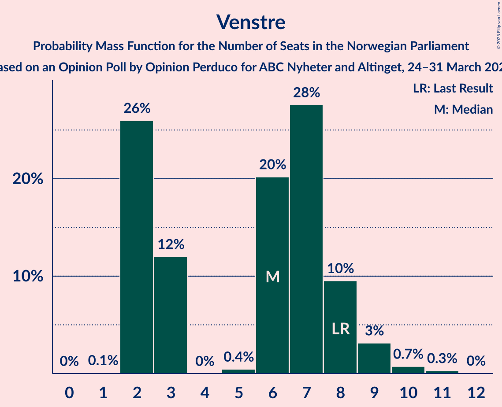
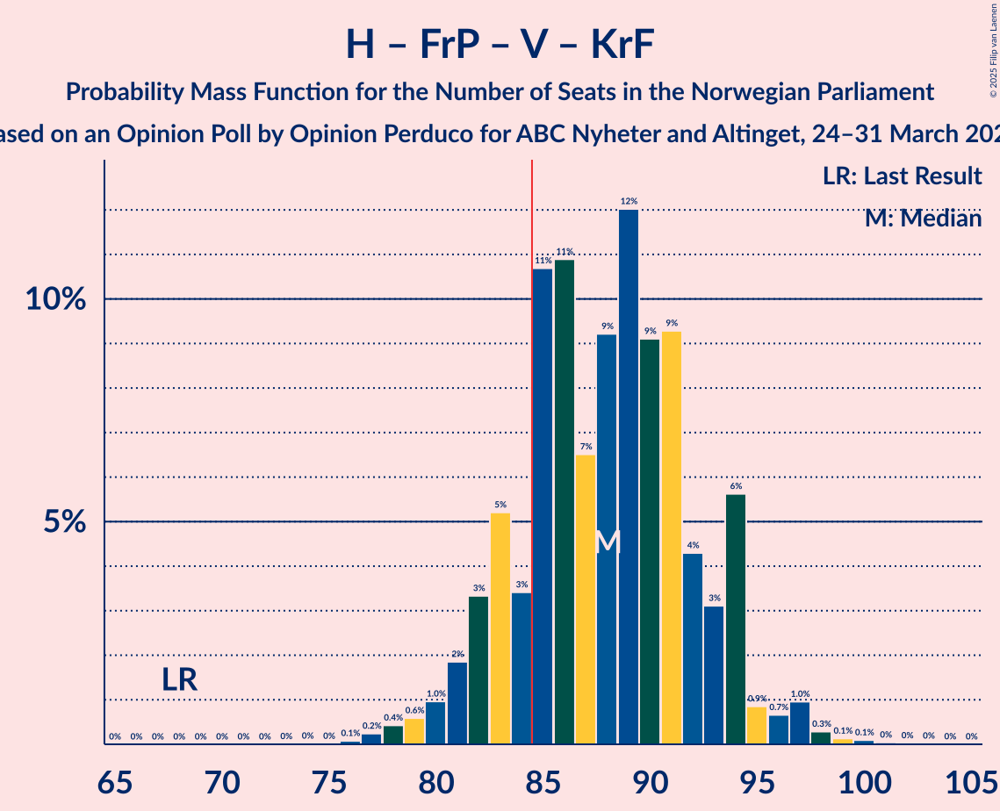
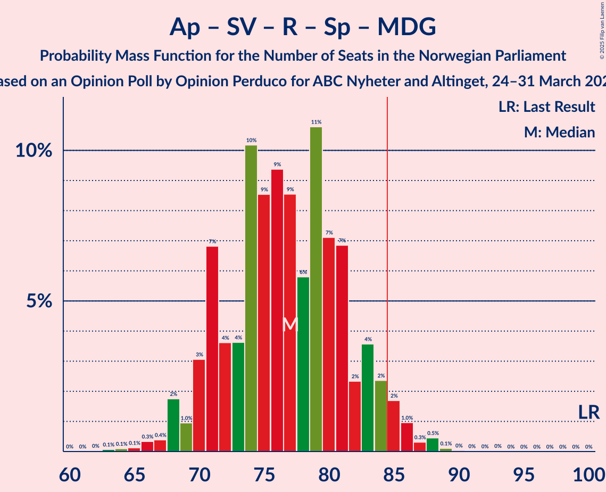
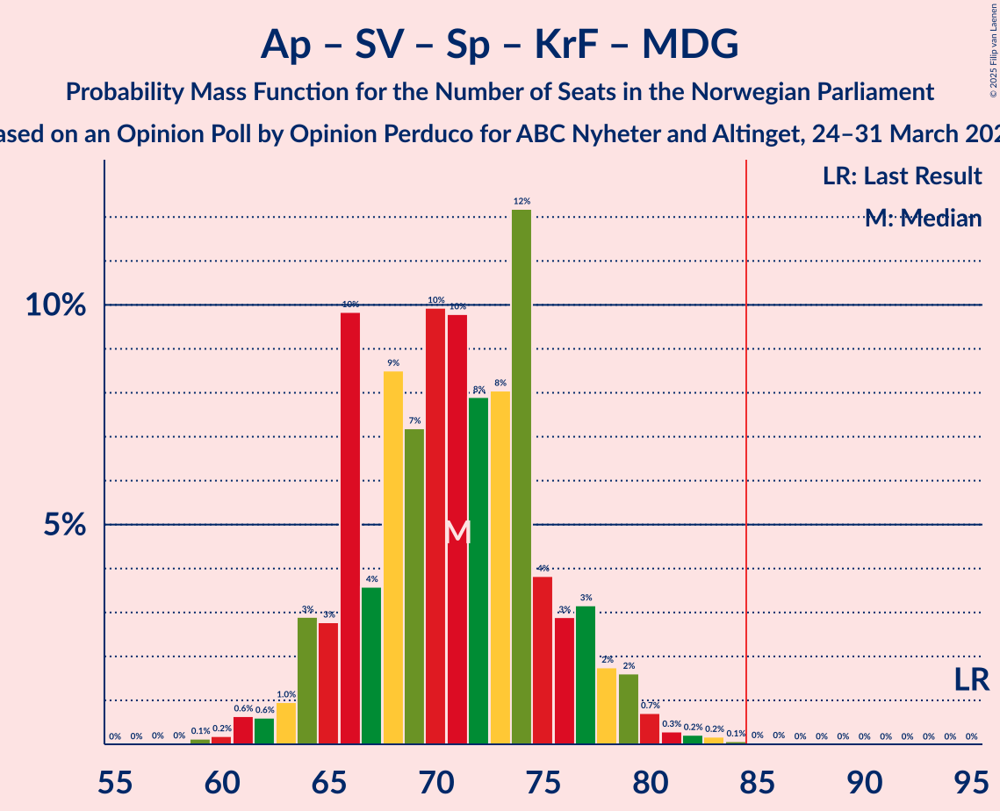
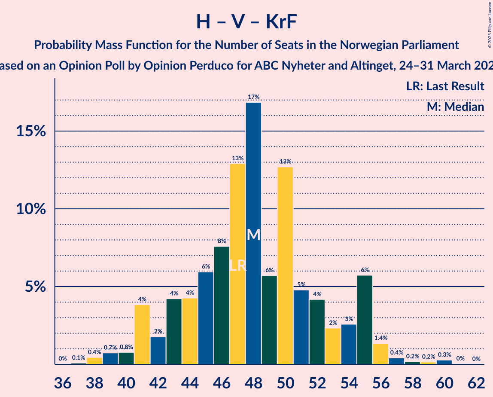

# Opinion Poll by Opinion Perduco for ABC Nyheter and Altinget, 24–31 March 2025

<a href="#voting-intentions">Voting Intentions</a> | <a href="#seats">Seats</a> | <a href="#coalitions">Coalitions</a> | <a href="#technical-information">Technical Information</a>

## Voting Intentions

### Confidence Intervals

| Party | Last Result | Poll Result | 80% Confidence Interval | 90% Confidence Interval | 95% Confidence Interval | 99% Confidence Interval |
|:-----:|:-----------:|:-----------:|:-----------------------:|:-----------------------:|:-----------------------:|:-----------------------:|
| Arbeiderpartiet | 26.2% | 25.1% | 23.2–27.2% |22.6–27.8% |22.2–28.3% |21.3–29.4% |
| Høyre | 20.4% | 22.5% | 20.6–24.5% |20.1–25.1% |19.7–25.6% |18.8–26.6% |
| Fremskrittspartiet | 11.6% | 21.1% | 19.3–23.0% |18.7–23.6% |18.3–24.1% |17.5–25.1% |
| Sosialistisk Venstreparti | 7.6% | 6.2% | 5.2–7.5% |4.9–7.8% |4.7–8.1% |4.2–8.8% |
| Rødt | 4.7% | 5.3% | 4.4–6.5% |4.1–6.8% |3.9–7.1% |3.5–7.7% |
| Senterpartiet | 13.5% | 5.3% | 4.4–6.5% |4.1–6.8% |3.9–7.1% |3.5–7.7% |
| Venstre | 4.6% | 3.8% | 3.1–4.9% |2.9–5.2% |2.7–5.4% |2.3–6.0% |
| Kristelig Folkeparti | 3.8% | 3.2% | 2.5–4.1% |2.3–4.4% |2.1–4.7% |1.8–5.2% |
| Miljøpartiet De Grønne | 3.9% | 2.5% | 1.9–3.4% |1.7–3.6% |1.6–3.9% |1.4–4.4% |
| Industri- og Næringspartiet | 0.3% | 1.1% | 0.7–1.7% |0.6–1.9% |0.5–2.1% |0.4–2.4% |

*Note:* The poll result column reflects the actual value used in the calculations. Published results may vary slightly, and in addition be rounded to fewer digits.

## Seats

### Confidence Intervals

| Party | Last Result | Median | 80% Confidence Interval | 90% Confidence Interval | 95% Confidence Interval | 99% Confidence Interval |
|:-----:|:-----------:|:------:|:-----------------------:|:-----------------------:|:-----------------------:|:-----------------------:|
| <a href="#arbeiderpartiet">Arbeiderpartiet</a> | 48 | 48 | 44–51 |43–52 |43–53 |41–56 |
| <a href="#høyre">Høyre</a> | 36 | 40 | 37–45 |36–45 |35–46 |33–48 |
| <a href="#fremskrittspartiet">Fremskrittspartiet</a> | 21 | 40 | 37–43 |36–44 |36–46 |34–47 |
| <a href="#sosialistisk-venstreparti">Sosialistisk Venstreparti</a> | 13 | 10 | 8–12 |8–13 |7–14 |6–15 |
| <a href="#rødt">Rødt</a> | 8 | 8 | 7–11 |6–12 |1–12 |1–13 |
| <a href="#senterpartiet">Senterpartiet</a> | 28 | 9 | 6–11 |6–12 |1–13 |0–14 |
| <a href="#venstre">Venstre</a> | 8 | 6 | 2–8 |2–8 |2–9 |2–10 |
| <a href="#kristelig-folkeparti">Kristelig Folkeparti</a> | 3 | 2 | 1–6 |1–7 |0–7 |0–8 |
| <a href="#miljøpartiet-de-grønne">Miljøpartiet De Grønne</a> | 3 | 1 | 1–3 |1–3 |1–3 |0–7 |
| <a href="#industri--og-næringspartiet">Industri- og Næringspartiet</a> | 0 | 0 | 0 |0 |0 |0–2 |

### Arbeiderpartiet

*For a full overview of the results for this party, see the [Arbeiderpartiet](party-arbeiderpartiet.html) page.*

| Number of Seats | Probability | Accumulated | Special Marks |
|:---------------:|:-----------:|:-----------:|:-------------:|
| 38 | 0% | 100% |  |
| 39 | 0.1% | 99.9% |  |
| 40 | 0.3% | 99.8% |  |
| 41 | 0.9% | 99.6% |  |
| 42 | 1.1% | 98.6% |  |
| 43 | 5% | 98% |  |
| 44 | 4% | 93% |  |
| 45 | 3% | 89% |  |
| 46 | 10% | 87% |  |
| 47 | 9% | 77% |  |
| 48 | 19% | 68% | Last Result, Median |
| 49 | 21% | 49% |  |
| 50 | 17% | 28% |  |
| 51 | 5% | 11% |  |
| 52 | 3% | 6% |  |
| 53 | 2% | 4% |  |
| 54 | 1.3% | 2% |  |
| 55 | 0.4% | 0.9% |  |
| 56 | 0.2% | 0.5% |  |
| 57 | 0.1% | 0.3% |  |
| 58 | 0.2% | 0.2% |  |
| 59 | 0% | 0% |  |

### Høyre

*For a full overview of the results for this party, see the [Høyre](party-høyre.html) page.*

| Number of Seats | Probability | Accumulated | Special Marks |
|:---------------:|:-----------:|:-----------:|:-------------:|
| 32 | 0.2% | 100% |  |
| 33 | 0.8% | 99.7% |  |
| 34 | 0.9% | 98.9% |  |
| 35 | 1.2% | 98% |  |
| 36 | 7% | 97% | Last Result |
| 37 | 7% | 90% |  |
| 38 | 18% | 83% |  |
| 39 | 13% | 65% |  |
| 40 | 9% | 52% | Median |
| 41 | 11% | 42% |  |
| 42 | 7% | 31% |  |
| 43 | 9% | 24% |  |
| 44 | 4% | 15% |  |
| 45 | 8% | 11% |  |
| 46 | 2% | 3% |  |
| 47 | 0.9% | 2% |  |
| 48 | 0.4% | 0.8% |  |
| 49 | 0.2% | 0.3% |  |
| 50 | 0.1% | 0.2% |  |
| 51 | 0% | 0.1% |  |
| 52 | 0.1% | 0.1% |  |
| 53 | 0% | 0% |  |

### Fremskrittspartiet

*For a full overview of the results for this party, see the [Fremskrittspartiet](party-fremskrittspartiet.html) page.*

| Number of Seats | Probability | Accumulated | Special Marks |
|:---------------:|:-----------:|:-----------:|:-------------:|
| 21 | 0% | 100% | Last Result |
| 22 | 0% | 100% |  |
| 23 | 0% | 100% |  |
| 24 | 0% | 100% |  |
| 25 | 0% | 100% |  |
| 26 | 0% | 100% |  |
| 27 | 0% | 100% |  |
| 28 | 0% | 100% |  |
| 29 | 0% | 100% |  |
| 30 | 0.1% | 100% |  |
| 31 | 0% | 99.9% |  |
| 32 | 0.2% | 99.9% |  |
| 33 | 0.2% | 99.7% |  |
| 34 | 0.5% | 99.6% |  |
| 35 | 0.8% | 99.0% |  |
| 36 | 4% | 98% |  |
| 37 | 17% | 95% |  |
| 38 | 17% | 78% |  |
| 39 | 9% | 61% |  |
| 40 | 9% | 51% | Median |
| 41 | 10% | 43% |  |
| 42 | 19% | 33% |  |
| 43 | 5% | 14% |  |
| 44 | 5% | 9% |  |
| 45 | 1.3% | 4% |  |
| 46 | 2% | 3% |  |
| 47 | 0.4% | 0.7% |  |
| 48 | 0.1% | 0.2% |  |
| 49 | 0.1% | 0.1% |  |
| 50 | 0% | 0% |  |

### Sosialistisk Venstreparti

*For a full overview of the results for this party, see the [Sosialistisk Venstreparti](party-sosialistiskvenstreparti.html) page.*

| Number of Seats | Probability | Accumulated | Special Marks |
|:---------------:|:-----------:|:-----------:|:-------------:|
| 2 | 0.1% | 100% |  |
| 3 | 0% | 99.9% |  |
| 4 | 0% | 99.9% |  |
| 5 | 0% | 99.8% |  |
| 6 | 0.5% | 99.8% |  |
| 7 | 4% | 99.3% |  |
| 8 | 14% | 96% |  |
| 9 | 25% | 82% |  |
| 10 | 21% | 58% | Median |
| 11 | 16% | 36% |  |
| 12 | 12% | 21% |  |
| 13 | 4% | 8% | Last Result |
| 14 | 3% | 4% |  |
| 15 | 0.8% | 1.1% |  |
| 16 | 0.2% | 0.3% |  |
| 17 | 0% | 0.1% |  |
| 18 | 0% | 0% |  |

### Rødt

*For a full overview of the results for this party, see the [Rødt](party-rødt.html) page.*

| Number of Seats | Probability | Accumulated | Special Marks |
|:---------------:|:-----------:|:-----------:|:-------------:|
| 1 | 4% | 100% |  |
| 2 | 0.6% | 96% |  |
| 3 | 0.1% | 96% |  |
| 4 | 0% | 96% |  |
| 5 | 0.2% | 96% |  |
| 6 | 2% | 95% |  |
| 7 | 9% | 94% |  |
| 8 | 36% | 85% | Last Result, Median |
| 9 | 19% | 48% |  |
| 10 | 15% | 30% |  |
| 11 | 8% | 15% |  |
| 12 | 5% | 7% |  |
| 13 | 1.4% | 2% |  |
| 14 | 0.3% | 0.4% |  |
| 15 | 0.1% | 0.1% |  |
| 16 | 0% | 0% |  |

### Senterpartiet

*For a full overview of the results for this party, see the [Senterpartiet](party-senterpartiet.html) page.*

| Number of Seats | Probability | Accumulated | Special Marks |
|:---------------:|:-----------:|:-----------:|:-------------:|
| 0 | 0.9% | 100% |  |
| 1 | 3% | 99.1% |  |
| 2 | 0.1% | 96% |  |
| 3 | 0% | 96% |  |
| 4 | 0% | 96% |  |
| 5 | 0.1% | 96% |  |
| 6 | 10% | 96% |  |
| 7 | 15% | 86% |  |
| 8 | 15% | 71% |  |
| 9 | 24% | 57% | Median |
| 10 | 14% | 33% |  |
| 11 | 11% | 19% |  |
| 12 | 5% | 8% |  |
| 13 | 2% | 3% |  |
| 14 | 1.0% | 1.1% |  |
| 15 | 0.1% | 0.1% |  |
| 16 | 0% | 0% |  |
| 17 | 0% | 0% |  |
| 18 | 0% | 0% |  |
| 19 | 0% | 0% |  |
| 20 | 0% | 0% |  |
| 21 | 0% | 0% |  |
| 22 | 0% | 0% |  |
| 23 | 0% | 0% |  |
| 24 | 0% | 0% |  |
| 25 | 0% | 0% |  |
| 26 | 0% | 0% |  |
| 27 | 0% | 0% |  |
| 28 | 0% | 0% | Last Result |

### Venstre

*For a full overview of the results for this party, see the [Venstre](party-venstre.html) page.*

| Number of Seats | Probability | Accumulated | Special Marks |
|:---------------:|:-----------:|:-----------:|:-------------:|
| 1 | 0.1% | 100% |  |
| 2 | 32% | 99.9% |  |
| 3 | 13% | 68% |  |
| 4 | 0% | 55% |  |
| 5 | 0.4% | 55% |  |
| 6 | 15% | 55% | Median |
| 7 | 26% | 40% |  |
| 8 | 10% | 14% | Last Result |
| 9 | 3% | 4% |  |
| 10 | 0.5% | 0.9% |  |
| 11 | 0.3% | 0.4% |  |
| 12 | 0% | 0% |  |

### Kristelig Folkeparti

*For a full overview of the results for this party, see the [Kristelig Folkeparti](party-kristeligfolkeparti.html) page.*

| Number of Seats | Probability | Accumulated | Special Marks |
|:---------------:|:-----------:|:-----------:|:-------------:|
| 0 | 4% | 100% |  |
| 1 | 21% | 96% |  |
| 2 | 31% | 75% | Median |
| 3 | 33% | 45% | Last Result |
| 4 | 0% | 11% |  |
| 5 | 0.1% | 11% |  |
| 6 | 4% | 11% |  |
| 7 | 5% | 7% |  |
| 8 | 1.4% | 2% |  |
| 9 | 0.2% | 0.3% |  |
| 10 | 0.1% | 0.1% |  |
| 11 | 0% | 0% |  |

### Miljøpartiet De Grønne

*For a full overview of the results for this party, see the [Miljøpartiet De Grønne](party-miljøpartietdegrønne.html) page.*

| Number of Seats | Probability | Accumulated | Special Marks |
|:---------------:|:-----------:|:-----------:|:-------------:|
| 0 | 1.3% | 100% |  |
| 1 | 71% | 98.7% | Median |
| 2 | 13% | 28% |  |
| 3 | 13% | 15% | Last Result |
| 4 | 0% | 2% |  |
| 5 | 0.4% | 2% |  |
| 6 | 0.5% | 1.4% |  |
| 7 | 0.8% | 0.9% |  |
| 8 | 0.1% | 0.2% |  |
| 9 | 0% | 0% |  |

### Industri- og Næringspartiet

*For a full overview of the results for this party, see the [Industri- og Næringspartiet](party-industri-ognæringspartiet.html) page.*

| Number of Seats | Probability | Accumulated | Special Marks |
|:---------------:|:-----------:|:-----------:|:-------------:|
| 0 | 99.0% | 100% | Last Result, Median |
| 1 | 0.5% | 1.0% |  |
| 2 | 0.5% | 0.5% |  |
| 3 | 0% | 0% |  |

## Coalitions

### Confidence Intervals

| Coalition | Last Result | Median | Majority? | 80% Confidence Interval | 90% Confidence Interval | 95% Confidence Interval | 99% Confidence Interval |
|:---------:|:-----------:|:------:|:---------:|:-----------------------:|:-----------------------:|:-----------------------:|:-----------------------:|
| Høyre – Fremskrittspartiet – Senterpartiet – Venstre – Kristelig Folkeparti | 96 | 96 | 99.9% | 92–100 | 91–103 | 89–103 | 87–106 |
| Høyre – Fremskrittspartiet – Venstre – Kristelig Folkeparti – Miljøpartiet De Grønne | 71 | 89 | 91% | 85–94 | 83–95 | 82–96 | 79–99 |
| Høyre – Fremskrittspartiet – Venstre – Kristelig Folkeparti | 68 | 87 | 80% | 83–92 | 82–94 | 81–95 | 78–98 |
| Høyre – Fremskrittspartiet – Venstre | 65 | 85 | 52% | 80–90 | 80–91 | 78–93 | 75–95 |
| Høyre – Fremskrittspartiet | 57 | 80 | 7% | 76–84 | 76–85 | 74–87 | 72–90 |
| Arbeiderpartiet – Sosialistisk Venstreparti – Rødt – Senterpartiet – Miljøpartiet De Grønne | 100 | 77 | 3% | 71–83 | 70–84 | 68–85 | 66–88 |
| Arbeiderpartiet – Sosialistisk Venstreparti – Rødt – Senterpartiet | 97 | 76 | 1.0% | 70–81 | 68–83 | 67–83 | 64–85 |
| Arbeiderpartiet – Sosialistisk Venstreparti – Senterpartiet – Kristelig Folkeparti – Miljøpartiet De Grønne | 95 | 71 | 0.1% | 66–76 | 65–77 | 63–78 | 61–82 |
| Arbeiderpartiet – Sosialistisk Venstreparti – Rødt – Miljøpartiet De Grønne | 72 | 68 | 0% | 63–73 | 62–74 | 61–75 | 59–78 |
| Arbeiderpartiet – Sosialistisk Venstreparti – Senterpartiet – Miljøpartiet De Grønne | 92 | 69 | 0% | 63–73 | 62–74 | 61–75 | 58–78 |
| Arbeiderpartiet – Sosialistisk Venstreparti – Senterpartiet | 89 | 67 | 0% | 62–71 | 60–73 | 60–74 | 57–76 |
| Arbeiderpartiet – Senterpartiet – Kristelig Folkeparti – Miljøpartiet De Grønne | 82 | 61 | 0% | 56–65 | 55–67 | 53–67 | 51–71 |
| Arbeiderpartiet – Senterpartiet – Kristelig Folkeparti | 79 | 59 | 0% | 55–63 | 54–64 | 51–65 | 49–69 |
| Arbeiderpartiet – Sosialistisk Venstreparti | 61 | 58 | 0% | 54–62 | 53–63 | 52–64 | 51–66 |
| Arbeiderpartiet – Senterpartiet | 76 | 57 | 0% | 52–60 | 51–61 | 50–62 | 48–64 |
| Høyre – Venstre – Kristelig Folkeparti | 47 | 48 | 0% | 42–53 | 41–55 | 41–55 | 39–59 |
| Senterpartiet – Venstre – Kristelig Folkeparti | 39 | 16 | 0% | 12–20 | 11–22 | 10–22 | 5–24 |

### Høyre – Fremskrittspartiet – Senterpartiet – Venstre – Kristelig Folkeparti

| Number of Seats | Probability | Accumulated | Special Marks |
|:---------------:|:-----------:|:-----------:|:-------------:|
| 83 | 0% | 100% |  |
| 84 | 0.1% | 99.9% |  |
| 85 | 0% | 99.9% | Majority |
| 86 | 0.2% | 99.8% |  |
| 87 | 0.9% | 99.7% |  |
| 88 | 0.7% | 98.8% |  |
| 89 | 0.9% | 98% |  |
| 90 | 2% | 97% |  |
| 91 | 2% | 95% |  |
| 92 | 7% | 93% |  |
| 93 | 12% | 87% |  |
| 94 | 12% | 75% |  |
| 95 | 8% | 63% |  |
| 96 | 10% | 55% | Last Result |
| 97 | 12% | 45% | Median |
| 98 | 10% | 33% |  |
| 99 | 6% | 23% |  |
| 100 | 8% | 17% |  |
| 101 | 3% | 9% |  |
| 102 | 2% | 7% |  |
| 103 | 3% | 5% |  |
| 104 | 1.1% | 2% |  |
| 105 | 0.6% | 1.4% |  |
| 106 | 0.3% | 0.8% |  |
| 107 | 0.2% | 0.5% |  |
| 108 | 0% | 0.3% |  |
| 109 | 0.1% | 0.2% |  |
| 110 | 0% | 0.1% |  |
| 111 | 0% | 0% |  |

### Høyre – Fremskrittspartiet – Venstre – Kristelig Folkeparti – Miljøpartiet De Grønne

| Number of Seats | Probability | Accumulated | Special Marks |
|:---------------:|:-----------:|:-----------:|:-------------:|
| 71 | 0% | 100% | Last Result |
| 72 | 0% | 100% |  |
| 73 | 0% | 100% |  |
| 74 | 0% | 100% |  |
| 75 | 0% | 100% |  |
| 76 | 0% | 100% |  |
| 77 | 0% | 100% |  |
| 78 | 0.4% | 100% |  |
| 79 | 0.5% | 99.6% |  |
| 80 | 0.2% | 99.1% |  |
| 81 | 0.4% | 98.9% |  |
| 82 | 1.2% | 98.6% |  |
| 83 | 4% | 97% |  |
| 84 | 2% | 93% |  |
| 85 | 4% | 91% | Majority |
| 86 | 18% | 86% |  |
| 87 | 9% | 68% |  |
| 88 | 7% | 59% |  |
| 89 | 8% | 52% | Median |
| 90 | 7% | 44% |  |
| 91 | 8% | 37% |  |
| 92 | 11% | 28% |  |
| 93 | 4% | 17% |  |
| 94 | 5% | 13% |  |
| 95 | 4% | 7% |  |
| 96 | 2% | 4% |  |
| 97 | 0.8% | 2% |  |
| 98 | 0.5% | 1.4% |  |
| 99 | 0.4% | 0.8% |  |
| 100 | 0.3% | 0.4% |  |
| 101 | 0.1% | 0.2% |  |
| 102 | 0% | 0.1% |  |
| 103 | 0% | 0% |  |

### Høyre – Fremskrittspartiet – Venstre – Kristelig Folkeparti

| Number of Seats | Probability | Accumulated | Special Marks |
|:---------------:|:-----------:|:-----------:|:-------------:|
| 68 | 0% | 100% | Last Result |
| 69 | 0% | 100% |  |
| 70 | 0% | 100% |  |
| 71 | 0% | 100% |  |
| 72 | 0% | 100% |  |
| 73 | 0% | 100% |  |
| 74 | 0% | 100% |  |
| 75 | 0% | 100% |  |
| 76 | 0.1% | 100% |  |
| 77 | 0.2% | 99.9% |  |
| 78 | 0.7% | 99.6% |  |
| 79 | 0.3% | 98.9% |  |
| 80 | 0.6% | 98.5% |  |
| 81 | 2% | 98% |  |
| 82 | 4% | 96% |  |
| 83 | 8% | 92% |  |
| 84 | 4% | 85% |  |
| 85 | 14% | 80% | Majority |
| 86 | 12% | 66% |  |
| 87 | 6% | 55% |  |
| 88 | 8% | 49% | Median |
| 89 | 10% | 41% |  |
| 90 | 6% | 30% |  |
| 91 | 10% | 24% |  |
| 92 | 5% | 14% |  |
| 93 | 3% | 9% |  |
| 94 | 4% | 6% |  |
| 95 | 1.1% | 3% |  |
| 96 | 0.3% | 2% |  |
| 97 | 0.5% | 1.2% |  |
| 98 | 0.4% | 0.7% |  |
| 99 | 0.2% | 0.3% |  |
| 100 | 0.1% | 0.1% |  |
| 101 | 0% | 0.1% |  |
| 102 | 0% | 0% |  |

### Høyre – Fremskrittspartiet – Venstre

| Number of Seats | Probability | Accumulated | Special Marks |
|:---------------:|:-----------:|:-----------:|:-------------:|
| 65 | 0% | 100% | Last Result |
| 66 | 0% | 100% |  |
| 67 | 0% | 100% |  |
| 68 | 0% | 100% |  |
| 69 | 0% | 100% |  |
| 70 | 0% | 100% |  |
| 71 | 0% | 100% |  |
| 72 | 0% | 100% |  |
| 73 | 0.1% | 100% |  |
| 74 | 0.1% | 99.9% |  |
| 75 | 0.3% | 99.8% |  |
| 76 | 0.4% | 99.5% |  |
| 77 | 0.9% | 99.1% |  |
| 78 | 1.3% | 98% |  |
| 79 | 1.3% | 97% |  |
| 80 | 10% | 96% |  |
| 81 | 2% | 85% |  |
| 82 | 6% | 83% |  |
| 83 | 19% | 77% |  |
| 84 | 7% | 58% |  |
| 85 | 9% | 52% | Majority |
| 86 | 7% | 43% | Median |
| 87 | 11% | 36% |  |
| 88 | 9% | 25% |  |
| 89 | 6% | 16% |  |
| 90 | 4% | 10% |  |
| 91 | 2% | 6% |  |
| 92 | 1.4% | 4% |  |
| 93 | 1.3% | 3% |  |
| 94 | 0.5% | 1.2% |  |
| 95 | 0.4% | 0.7% |  |
| 96 | 0.1% | 0.3% |  |
| 97 | 0.2% | 0.3% |  |
| 98 | 0% | 0.1% |  |
| 99 | 0% | 0.1% |  |
| 100 | 0% | 0.1% |  |
| 101 | 0% | 0% |  |

### Høyre – Fremskrittspartiet

| Number of Seats | Probability | Accumulated | Special Marks |
|:---------------:|:-----------:|:-----------:|:-------------:|
| 57 | 0% | 100% | Last Result |
| 58 | 0% | 100% |  |
| 59 | 0% | 100% |  |
| 60 | 0% | 100% |  |
| 61 | 0% | 100% |  |
| 62 | 0% | 100% |  |
| 63 | 0% | 100% |  |
| 64 | 0% | 100% |  |
| 65 | 0% | 100% |  |
| 66 | 0% | 100% |  |
| 67 | 0% | 100% |  |
| 68 | 0% | 100% |  |
| 69 | 0% | 100% |  |
| 70 | 0% | 99.9% |  |
| 71 | 0.2% | 99.9% |  |
| 72 | 0.2% | 99.6% |  |
| 73 | 1.0% | 99.4% |  |
| 74 | 1.4% | 98% |  |
| 75 | 2% | 97% |  |
| 76 | 9% | 95% |  |
| 77 | 8% | 87% |  |
| 78 | 15% | 79% |  |
| 79 | 9% | 64% |  |
| 80 | 15% | 55% | Median |
| 81 | 8% | 40% |  |
| 82 | 10% | 32% |  |
| 83 | 10% | 22% |  |
| 84 | 5% | 12% |  |
| 85 | 3% | 7% | Majority |
| 86 | 2% | 4% |  |
| 87 | 1.4% | 3% |  |
| 88 | 0.5% | 1.4% |  |
| 89 | 0.2% | 0.9% |  |
| 90 | 0.3% | 0.6% |  |
| 91 | 0.2% | 0.4% |  |
| 92 | 0.1% | 0.2% |  |
| 93 | 0.1% | 0.1% |  |
| 94 | 0% | 0% |  |

### Arbeiderpartiet – Sosialistisk Venstreparti – Rødt – Senterpartiet – Miljøpartiet De Grønne

| Number of Seats | Probability | Accumulated | Special Marks |
|:---------------:|:-----------:|:-----------:|:-------------:|
| 63 | 0.1% | 100% |  |
| 64 | 0% | 99.8% |  |
| 65 | 0.1% | 99.8% |  |
| 66 | 0.3% | 99.7% |  |
| 67 | 0.4% | 99.4% |  |
| 68 | 2% | 99.1% |  |
| 69 | 0.4% | 97% |  |
| 70 | 5% | 97% |  |
| 71 | 6% | 92% |  |
| 72 | 5% | 86% |  |
| 73 | 3% | 81% |  |
| 74 | 10% | 78% |  |
| 75 | 6% | 68% |  |
| 76 | 8% | 62% | Median |
| 77 | 9% | 54% |  |
| 78 | 8% | 45% |  |
| 79 | 10% | 37% |  |
| 80 | 10% | 27% |  |
| 81 | 4% | 17% |  |
| 82 | 2% | 13% |  |
| 83 | 4% | 11% |  |
| 84 | 4% | 7% |  |
| 85 | 2% | 3% | Majority |
| 86 | 0.4% | 1.2% |  |
| 87 | 0.1% | 0.8% |  |
| 88 | 0.4% | 0.6% |  |
| 89 | 0.1% | 0.2% |  |
| 90 | 0% | 0.1% |  |
| 91 | 0% | 0.1% |  |
| 92 | 0% | 0.1% |  |
| 93 | 0% | 0.1% |  |
| 94 | 0% | 0% |  |
| 95 | 0% | 0% |  |
| 96 | 0% | 0% |  |
| 97 | 0% | 0% |  |
| 98 | 0% | 0% |  |
| 99 | 0% | 0% |  |
| 100 | 0% | 0% | Last Result |

### Arbeiderpartiet – Sosialistisk Venstreparti – Rødt – Senterpartiet

| Number of Seats | Probability | Accumulated | Special Marks |
|:---------------:|:-----------:|:-----------:|:-------------:|
| 62 | 0.1% | 100% |  |
| 63 | 0% | 99.8% |  |
| 64 | 0.3% | 99.8% |  |
| 65 | 0.3% | 99.5% |  |
| 66 | 0.6% | 99.2% |  |
| 67 | 2% | 98.6% |  |
| 68 | 3% | 97% |  |
| 69 | 3% | 94% |  |
| 70 | 6% | 91% |  |
| 71 | 5% | 85% |  |
| 72 | 5% | 80% |  |
| 73 | 9% | 75% |  |
| 74 | 5% | 66% |  |
| 75 | 7% | 60% | Median |
| 76 | 14% | 53% |  |
| 77 | 10% | 39% |  |
| 78 | 7% | 29% |  |
| 79 | 6% | 21% |  |
| 80 | 5% | 16% |  |
| 81 | 1.4% | 11% |  |
| 82 | 4% | 10% |  |
| 83 | 4% | 6% |  |
| 84 | 1.2% | 2% |  |
| 85 | 0.5% | 1.0% | Majority |
| 86 | 0.1% | 0.4% |  |
| 87 | 0.3% | 0.4% |  |
| 88 | 0% | 0.1% |  |
| 89 | 0% | 0.1% |  |
| 90 | 0% | 0.1% |  |
| 91 | 0% | 0% |  |
| 92 | 0% | 0% |  |
| 93 | 0% | 0% |  |
| 94 | 0% | 0% |  |
| 95 | 0% | 0% |  |
| 96 | 0% | 0% |  |
| 97 | 0% | 0% | Last Result |

### Arbeiderpartiet – Sosialistisk Venstreparti – Senterpartiet – Kristelig Folkeparti – Miljøpartiet De Grønne

| Number of Seats | Probability | Accumulated | Special Marks |
|:---------------:|:-----------:|:-----------:|:-------------:|
| 58 | 0% | 100% |  |
| 59 | 0.1% | 99.9% |  |
| 60 | 0.2% | 99.8% |  |
| 61 | 1.1% | 99.6% |  |
| 62 | 0.5% | 98% |  |
| 63 | 0.8% | 98% |  |
| 64 | 1.0% | 97% |  |
| 65 | 3% | 96% |  |
| 66 | 9% | 93% |  |
| 67 | 4% | 84% |  |
| 68 | 7% | 79% |  |
| 69 | 6% | 72% |  |
| 70 | 9% | 66% | Median |
| 71 | 14% | 57% |  |
| 72 | 9% | 43% |  |
| 73 | 11% | 34% |  |
| 74 | 9% | 23% |  |
| 75 | 4% | 14% |  |
| 76 | 3% | 10% |  |
| 77 | 4% | 7% |  |
| 78 | 1.0% | 3% |  |
| 79 | 0.7% | 2% |  |
| 80 | 0.4% | 1.1% |  |
| 81 | 0.2% | 0.7% |  |
| 82 | 0.3% | 0.5% |  |
| 83 | 0.1% | 0.2% |  |
| 84 | 0.1% | 0.2% |  |
| 85 | 0% | 0.1% | Majority |
| 86 | 0% | 0.1% |  |
| 87 | 0% | 0% |  |
| 88 | 0% | 0% |  |
| 89 | 0% | 0% |  |
| 90 | 0% | 0% |  |
| 91 | 0% | 0% |  |
| 92 | 0% | 0% |  |
| 93 | 0% | 0% |  |
| 94 | 0% | 0% |  |
| 95 | 0% | 0% | Last Result |

### Arbeiderpartiet – Sosialistisk Venstreparti – Rødt – Miljøpartiet De Grønne

| Number of Seats | Probability | Accumulated | Special Marks |
|:---------------:|:-----------:|:-----------:|:-------------:|
| 55 | 0% | 100% |  |
| 56 | 0% | 99.9% |  |
| 57 | 0.1% | 99.9% |  |
| 58 | 0.1% | 99.8% |  |
| 59 | 0.7% | 99.7% |  |
| 60 | 0.5% | 99.0% |  |
| 61 | 1.1% | 98% |  |
| 62 | 3% | 97% |  |
| 63 | 5% | 94% |  |
| 64 | 6% | 89% |  |
| 65 | 8% | 83% |  |
| 66 | 4% | 75% |  |
| 67 | 7% | 71% | Median |
| 68 | 14% | 64% |  |
| 69 | 15% | 49% |  |
| 70 | 10% | 34% |  |
| 71 | 7% | 24% |  |
| 72 | 3% | 17% | Last Result |
| 73 | 7% | 13% |  |
| 74 | 3% | 7% |  |
| 75 | 1.3% | 4% |  |
| 76 | 0.9% | 2% |  |
| 77 | 0.7% | 1.4% |  |
| 78 | 0.2% | 0.6% |  |
| 79 | 0.2% | 0.4% |  |
| 80 | 0.1% | 0.2% |  |
| 81 | 0% | 0.1% |  |
| 82 | 0% | 0.1% |  |
| 83 | 0% | 0.1% |  |
| 84 | 0% | 0% |  |

### Arbeiderpartiet – Sosialistisk Venstreparti – Senterpartiet – Miljøpartiet De Grønne

| Number of Seats | Probability | Accumulated | Special Marks |
|:---------------:|:-----------:|:-----------:|:-------------:|
| 56 | 0% | 100% |  |
| 57 | 0.1% | 99.9% |  |
| 58 | 1.2% | 99.8% |  |
| 59 | 0.2% | 98.6% |  |
| 60 | 0.4% | 98% |  |
| 61 | 0.9% | 98% |  |
| 62 | 4% | 97% |  |
| 63 | 6% | 93% |  |
| 64 | 5% | 87% |  |
| 65 | 6% | 82% |  |
| 66 | 6% | 76% |  |
| 67 | 13% | 70% |  |
| 68 | 6% | 58% | Median |
| 69 | 11% | 52% |  |
| 70 | 16% | 41% |  |
| 71 | 6% | 25% |  |
| 72 | 7% | 18% |  |
| 73 | 5% | 11% |  |
| 74 | 3% | 6% |  |
| 75 | 2% | 4% |  |
| 76 | 0.9% | 2% |  |
| 77 | 0.4% | 0.9% |  |
| 78 | 0.3% | 0.5% |  |
| 79 | 0.1% | 0.2% |  |
| 80 | 0% | 0.2% |  |
| 81 | 0.1% | 0.1% |  |
| 82 | 0% | 0.1% |  |
| 83 | 0% | 0% |  |
| 84 | 0% | 0% |  |
| 85 | 0% | 0% | Majority |
| 86 | 0% | 0% |  |
| 87 | 0% | 0% |  |
| 88 | 0% | 0% |  |
| 89 | 0% | 0% |  |
| 90 | 0% | 0% |  |
| 91 | 0% | 0% |  |
| 92 | 0% | 0% | Last Result |

### Arbeiderpartiet – Sosialistisk Venstreparti – Senterpartiet

| Number of Seats | Probability | Accumulated | Special Marks |
|:---------------:|:-----------:|:-----------:|:-------------:|
| 55 | 0.1% | 100% |  |
| 56 | 0.2% | 99.9% |  |
| 57 | 1.1% | 99.7% |  |
| 58 | 0.5% | 98.6% |  |
| 59 | 0.5% | 98% |  |
| 60 | 3% | 98% |  |
| 61 | 2% | 95% |  |
| 62 | 7% | 92% |  |
| 63 | 5% | 85% |  |
| 64 | 6% | 80% |  |
| 65 | 6% | 74% |  |
| 66 | 13% | 68% |  |
| 67 | 13% | 55% | Median |
| 68 | 11% | 42% |  |
| 69 | 10% | 31% |  |
| 70 | 6% | 21% |  |
| 71 | 6% | 15% |  |
| 72 | 4% | 9% |  |
| 73 | 2% | 5% |  |
| 74 | 2% | 3% |  |
| 75 | 0.5% | 1.1% |  |
| 76 | 0.2% | 0.6% |  |
| 77 | 0.2% | 0.3% |  |
| 78 | 0.1% | 0.2% |  |
| 79 | 0.1% | 0.1% |  |
| 80 | 0% | 0% |  |
| 81 | 0% | 0% |  |
| 82 | 0% | 0% |  |
| 83 | 0% | 0% |  |
| 84 | 0% | 0% |  |
| 85 | 0% | 0% | Majority |
| 86 | 0% | 0% |  |
| 87 | 0% | 0% |  |
| 88 | 0% | 0% |  |
| 89 | 0% | 0% | Last Result |

### Arbeiderpartiet – Senterpartiet – Kristelig Folkeparti – Miljøpartiet De Grønne

| Number of Seats | Probability | Accumulated | Special Marks |
|:---------------:|:-----------:|:-----------:|:-------------:|
| 48 | 0.1% | 100% |  |
| 49 | 0.1% | 99.9% |  |
| 50 | 0.1% | 99.8% |  |
| 51 | 0.5% | 99.7% |  |
| 52 | 2% | 99.2% |  |
| 53 | 0.4% | 98% |  |
| 54 | 0.7% | 97% |  |
| 55 | 2% | 96% |  |
| 56 | 7% | 95% |  |
| 57 | 3% | 88% |  |
| 58 | 7% | 85% |  |
| 59 | 10% | 78% |  |
| 60 | 14% | 67% | Median |
| 61 | 17% | 53% |  |
| 62 | 8% | 36% |  |
| 63 | 7% | 29% |  |
| 64 | 10% | 22% |  |
| 65 | 4% | 12% |  |
| 66 | 3% | 8% |  |
| 67 | 3% | 5% |  |
| 68 | 0.8% | 2% |  |
| 69 | 0.6% | 1.5% |  |
| 70 | 0.3% | 0.9% |  |
| 71 | 0.2% | 0.5% |  |
| 72 | 0.2% | 0.3% |  |
| 73 | 0.1% | 0.1% |  |
| 74 | 0% | 0% |  |
| 75 | 0% | 0% |  |
| 76 | 0% | 0% |  |
| 77 | 0% | 0% |  |
| 78 | 0% | 0% |  |
| 79 | 0% | 0% |  |
| 80 | 0% | 0% |  |
| 81 | 0% | 0% |  |
| 82 | 0% | 0% | Last Result |

### Arbeiderpartiet – Senterpartiet – Kristelig Folkeparti

| Number of Seats | Probability | Accumulated | Special Marks |
|:---------------:|:-----------:|:-----------:|:-------------:|
| 47 | 0.1% | 100% |  |
| 48 | 0.1% | 99.8% |  |
| 49 | 0.3% | 99.8% |  |
| 50 | 0.3% | 99.4% |  |
| 51 | 2% | 99.1% |  |
| 52 | 1.3% | 97% |  |
| 53 | 1.1% | 96% |  |
| 54 | 3% | 95% |  |
| 55 | 5% | 92% |  |
| 56 | 4% | 87% |  |
| 57 | 8% | 83% |  |
| 58 | 11% | 75% |  |
| 59 | 14% | 64% | Median |
| 60 | 18% | 50% |  |
| 61 | 11% | 32% |  |
| 62 | 5% | 20% |  |
| 63 | 6% | 15% |  |
| 64 | 6% | 10% |  |
| 65 | 2% | 4% |  |
| 66 | 0.6% | 2% |  |
| 67 | 0.5% | 2% |  |
| 68 | 0.7% | 1.2% |  |
| 69 | 0.1% | 0.5% |  |
| 70 | 0.3% | 0.4% |  |
| 71 | 0.1% | 0.1% |  |
| 72 | 0% | 0% |  |
| 73 | 0% | 0% |  |
| 74 | 0% | 0% |  |
| 75 | 0% | 0% |  |
| 76 | 0% | 0% |  |
| 77 | 0% | 0% |  |
| 78 | 0% | 0% |  |
| 79 | 0% | 0% | Last Result |

### Arbeiderpartiet – Sosialistisk Venstreparti

| Number of Seats | Probability | Accumulated | Special Marks |
|:---------------:|:-----------:|:-----------:|:-------------:|
| 47 | 0% | 100% |  |
| 48 | 0.1% | 99.9% |  |
| 49 | 0.1% | 99.8% |  |
| 50 | 0.2% | 99.7% |  |
| 51 | 0.9% | 99.5% |  |
| 52 | 3% | 98.6% |  |
| 53 | 3% | 95% |  |
| 54 | 6% | 92% |  |
| 55 | 3% | 86% |  |
| 56 | 8% | 83% |  |
| 57 | 10% | 76% |  |
| 58 | 20% | 66% | Median |
| 59 | 17% | 46% |  |
| 60 | 12% | 29% |  |
| 61 | 5% | 17% | Last Result |
| 62 | 5% | 12% |  |
| 63 | 3% | 7% |  |
| 64 | 2% | 4% |  |
| 65 | 1.0% | 2% |  |
| 66 | 0.5% | 1.0% |  |
| 67 | 0.2% | 0.5% |  |
| 68 | 0.1% | 0.3% |  |
| 69 | 0.1% | 0.2% |  |
| 70 | 0.1% | 0.2% |  |
| 71 | 0% | 0% |  |

### Arbeiderpartiet – Senterpartiet

| Number of Seats | Probability | Accumulated | Special Marks |
|:---------------:|:-----------:|:-----------:|:-------------:|
| 44 | 0.1% | 100% |  |
| 45 | 0.1% | 99.9% |  |
| 46 | 0.1% | 99.8% |  |
| 47 | 0.1% | 99.8% |  |
| 48 | 2% | 99.7% |  |
| 49 | 0.5% | 98% |  |
| 50 | 2% | 98% |  |
| 51 | 3% | 96% |  |
| 52 | 3% | 93% |  |
| 53 | 5% | 90% |  |
| 54 | 7% | 85% |  |
| 55 | 5% | 78% |  |
| 56 | 11% | 73% |  |
| 57 | 24% | 62% | Median |
| 58 | 13% | 38% |  |
| 59 | 9% | 26% |  |
| 60 | 7% | 16% |  |
| 61 | 6% | 9% |  |
| 62 | 2% | 3% |  |
| 63 | 0.8% | 1.5% |  |
| 64 | 0.2% | 0.7% |  |
| 65 | 0.2% | 0.5% |  |
| 66 | 0% | 0.2% |  |
| 67 | 0.1% | 0.2% |  |
| 68 | 0.1% | 0.1% |  |
| 69 | 0% | 0% |  |
| 70 | 0% | 0% |  |
| 71 | 0% | 0% |  |
| 72 | 0% | 0% |  |
| 73 | 0% | 0% |  |
| 74 | 0% | 0% |  |
| 75 | 0% | 0% |  |
| 76 | 0% | 0% | Last Result |

### Høyre – Venstre – Kristelig Folkeparti

| Number of Seats | Probability | Accumulated | Special Marks |
|:---------------:|:-----------:|:-----------:|:-------------:|
| 37 | 0.1% | 100% |  |
| 38 | 0.2% | 99.9% |  |
| 39 | 1.1% | 99.7% |  |
| 40 | 0.5% | 98.6% |  |
| 41 | 6% | 98% |  |
| 42 | 2% | 92% |  |
| 43 | 6% | 90% |  |
| 44 | 4% | 84% |  |
| 45 | 6% | 80% |  |
| 46 | 4% | 73% |  |
| 47 | 17% | 70% | Last Result |
| 48 | 20% | 53% | Median |
| 49 | 5% | 33% |  |
| 50 | 9% | 28% |  |
| 51 | 3% | 19% |  |
| 52 | 6% | 17% |  |
| 53 | 2% | 11% |  |
| 54 | 3% | 8% |  |
| 55 | 3% | 6% |  |
| 56 | 1.1% | 2% |  |
| 57 | 0.4% | 1.1% |  |
| 58 | 0.1% | 0.7% |  |
| 59 | 0.1% | 0.6% |  |
| 60 | 0.4% | 0.4% |  |
| 61 | 0% | 0.1% |  |
| 62 | 0% | 0% |  |

### Senterpartiet – Venstre – Kristelig Folkeparti

| Number of Seats | Probability | Accumulated | Special Marks |
|:---------------:|:-----------:|:-----------:|:-------------:|
| 3 | 0.1% | 100% |  |
| 4 | 0.1% | 99.9% |  |
| 5 | 0.7% | 99.8% |  |
| 6 | 0.2% | 99.1% |  |
| 7 | 0.1% | 98.9% |  |
| 8 | 0.2% | 98.8% |  |
| 9 | 0.7% | 98.6% |  |
| 10 | 2% | 98% |  |
| 11 | 3% | 96% |  |
| 12 | 9% | 93% |  |
| 13 | 6% | 84% |  |
| 14 | 8% | 79% |  |
| 15 | 18% | 71% |  |
| 16 | 8% | 53% |  |
| 17 | 6% | 45% | Median |
| 18 | 18% | 39% |  |
| 19 | 8% | 21% |  |
| 20 | 6% | 14% |  |
| 21 | 2% | 8% |  |
| 22 | 4% | 6% |  |
| 23 | 1.0% | 2% |  |
| 24 | 0.5% | 0.9% |  |
| 25 | 0.1% | 0.4% |  |
| 26 | 0.1% | 0.3% |  |
| 27 | 0% | 0.2% |  |
| 28 | 0.1% | 0.1% |  |
| 29 | 0% | 0% |  |
| 30 | 0% | 0% |  |
| 31 | 0% | 0% |  |
| 32 | 0% | 0% |  |
| 33 | 0% | 0% |  |
| 34 | 0% | 0% |  |
| 35 | 0% | 0% |  |
| 36 | 0% | 0% |  |
| 37 | 0% | 0% |  |
| 38 | 0% | 0% |  |
| 39 | 0% | 0% | Last Result |

## Technical Information

### Opinion Poll

+ **Polling firm:** Opinion Perduco
+ **Commissioner(s):** ABC Nyheter and Altinget
+ **Fieldwork period:** 24–31 March 2025

### Calculations

+ **Sample size:** 760
+ **Simulations done:** 1,048,576
+ **Error estimate:** 2.83%

