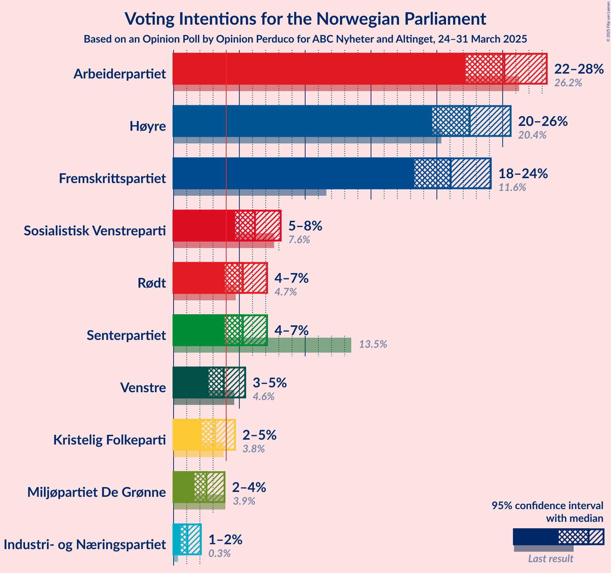
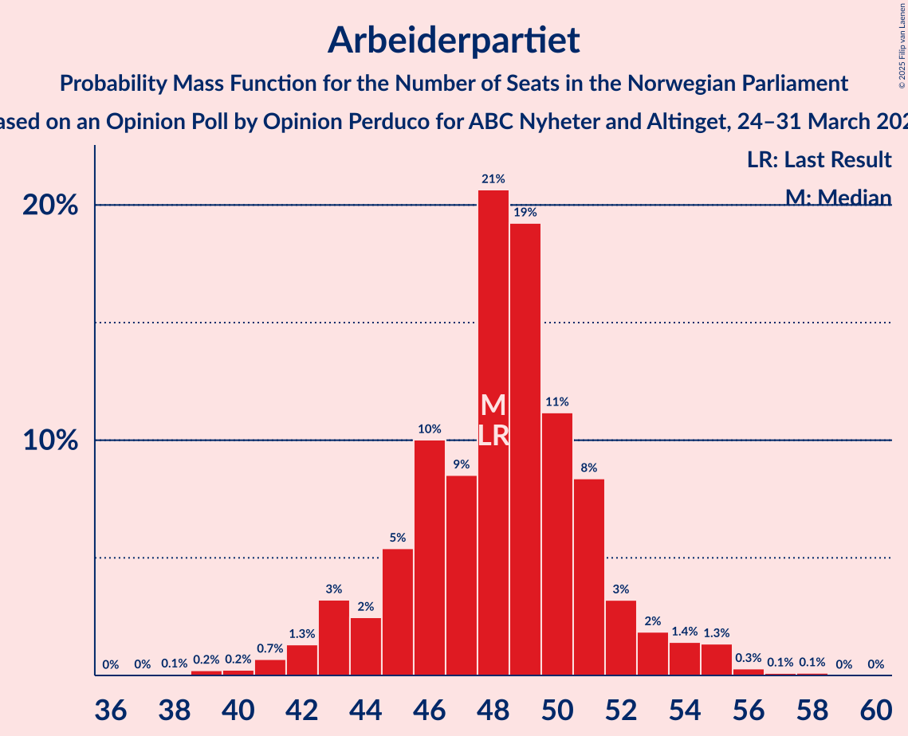
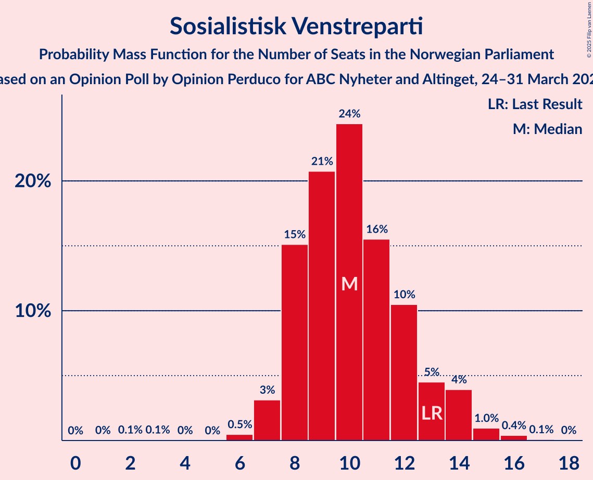
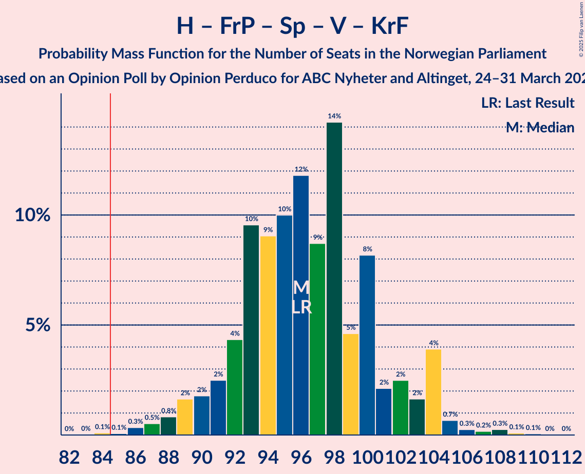
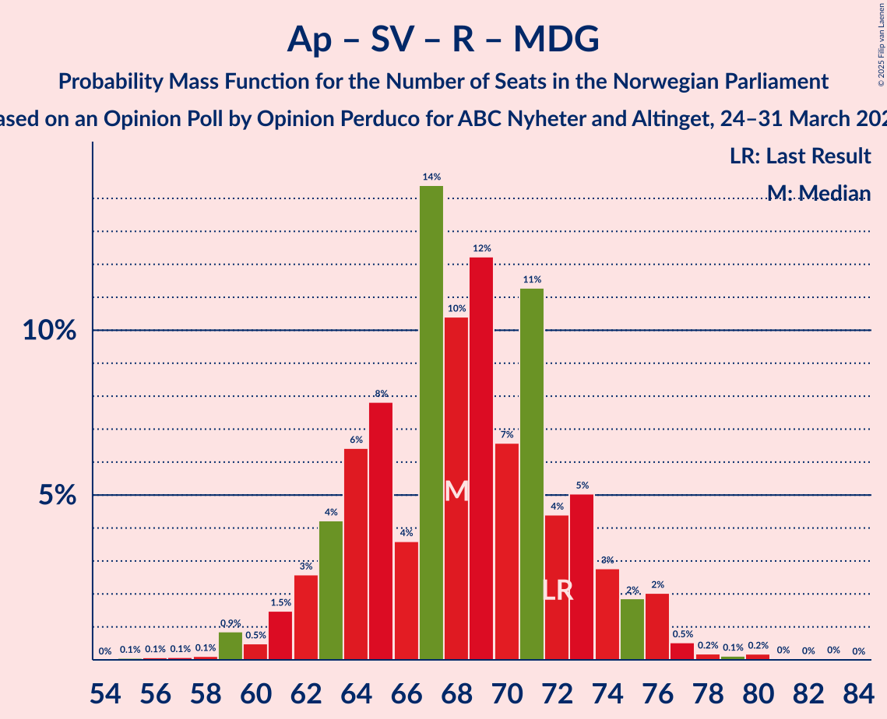
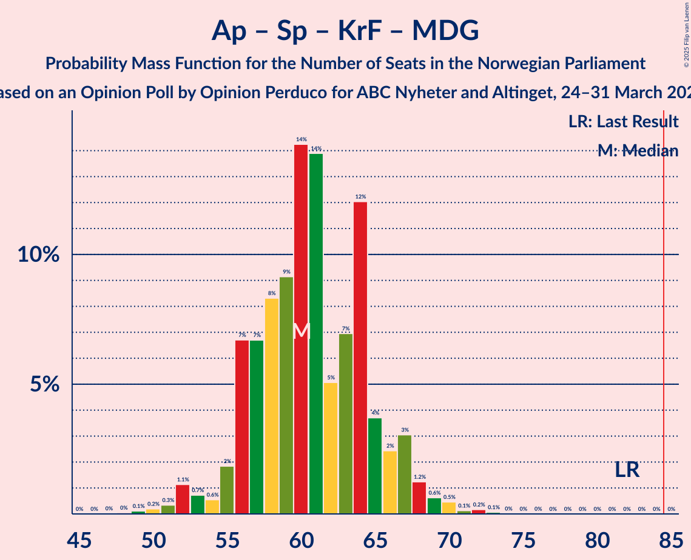
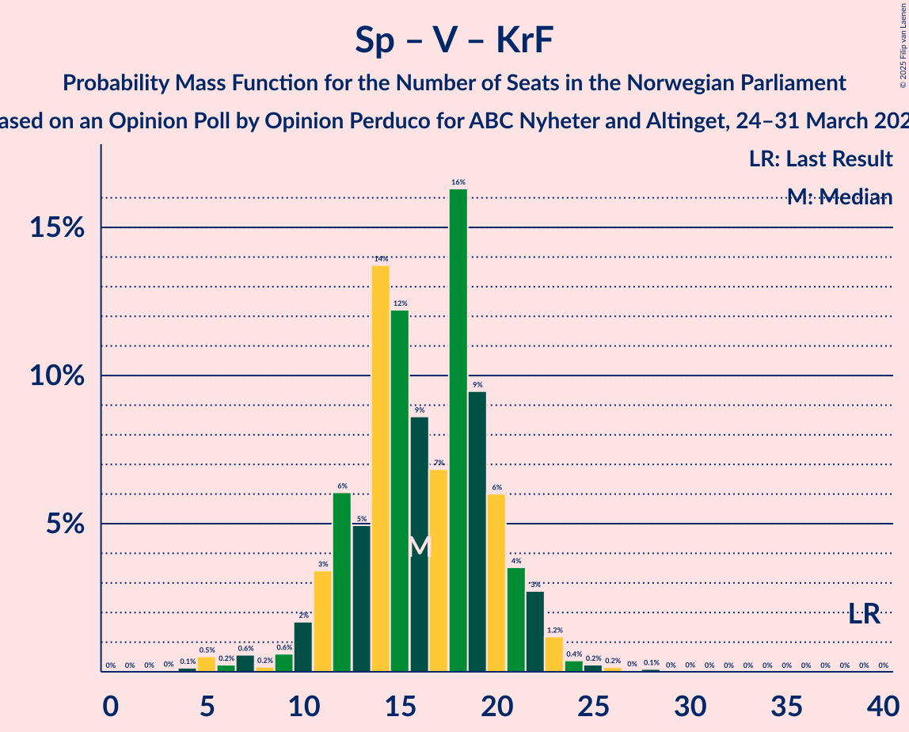

# Opinion Poll by Opinion Perduco for ABC Nyheter and Altinget, 24–31 March 2025

<a href="#voting-intentions">Voting Intentions</a> | <a href="#seats">Seats</a> | <a href="#coalitions">Coalitions</a> | <a href="#technical-information">Technical Information</a>

## Voting Intentions

### Confidence Intervals

| Party | Last Result | Poll Result | 80% Confidence Interval | 90% Confidence Interval | 95% Confidence Interval | 99% Confidence Interval |
|:-----:|:-----------:|:-----------:|:-----------------------:|:-----------------------:|:-----------------------:|:-----------------------:|
| Arbeiderpartiet | 26.2% | 25.1% | 23.2–27.2% |22.6–27.8% |22.2–28.3% |21.3–29.4% |
| Høyre | 20.4% | 22.5% | 20.6–24.5% |20.1–25.1% |19.7–25.6% |18.8–26.6% |
| Fremskrittspartiet | 11.6% | 21.1% | 19.3–23.0% |18.7–23.6% |18.3–24.1% |17.5–25.1% |
| Sosialistisk Venstreparti | 7.6% | 6.2% | 5.2–7.5% |4.9–7.8% |4.7–8.1% |4.2–8.8% |
| Rødt | 4.7% | 5.3% | 4.4–6.5% |4.1–6.8% |3.9–7.1% |3.5–7.7% |
| Senterpartiet | 13.5% | 5.3% | 4.4–6.5% |4.1–6.8% |3.9–7.1% |3.5–7.7% |
| Venstre | 4.6% | 3.8% | 3.1–4.9% |2.9–5.2% |2.7–5.4% |2.3–6.0% |
| Kristelig Folkeparti | 3.8% | 3.2% | 2.5–4.1% |2.3–4.4% |2.1–4.7% |1.8–5.2% |
| Miljøpartiet De Grønne | 3.9% | 2.5% | 1.9–3.4% |1.7–3.6% |1.6–3.9% |1.4–4.4% |
| Industri- og Næringspartiet | 0.3% | 1.1% | 0.7–1.7% |0.6–1.9% |0.5–2.1% |0.4–2.4% |

*Note:* The poll result column reflects the actual value used in the calculations. Published results may vary slightly, and in addition be rounded to fewer digits.

## Seats

### Confidence Intervals

| Party | Last Result | Median | 80% Confidence Interval | 90% Confidence Interval | 95% Confidence Interval | 99% Confidence Interval |
|:-----:|:-----------:|:------:|:-----------------------:|:-----------------------:|:-----------------------:|:-----------------------:|
| <a href="#arbeiderpartiet">Arbeiderpartiet</a> | 48 | 48 | 45–51 |43–53 |42–54 |40–56 |
| <a href="#høyre">Høyre</a> | 36 | 40 | 36–45 |36–46 |35–46 |33–48 |
| <a href="#fremskrittspartiet">Fremskrittspartiet</a> | 21 | 39 | 37–43 |36–44 |35–45 |34–48 |
| <a href="#sosialistisk-venstreparti">Sosialistisk Venstreparti</a> | 13 | 10 | 8–12 |8–14 |7–14 |6–16 |
| <a href="#rødt">Rødt</a> | 8 | 9 | 7–11 |6–12 |1–12 |1–13 |
| <a href="#senterpartiet">Senterpartiet</a> | 28 | 9 | 6–11 |6–12 |1–12 |0–14 |
| <a href="#venstre">Venstre</a> | 8 | 6 | 2–8 |2–8 |2–9 |2–10 |
| <a href="#kristelig-folkeparti">Kristelig Folkeparti</a> | 3 | 2 | 1–6 |1–7 |0–7 |0–8 |
| <a href="#miljøpartiet-de-grønne">Miljøpartiet De Grønne</a> | 3 | 1 | 1–3 |1–3 |1–3 |0–7 |
| <a href="#industri--og-næringspartiet">Industri- og Næringspartiet</a> | 0 | 0 | 0 |0 |0 |0–1 |

### Arbeiderpartiet

*For a full overview of the results for this party, see the [Arbeiderpartiet](party-arbeiderpartiet.html) page.*

| Number of Seats | Probability | Accumulated | Special Marks |
|:---------------:|:-----------:|:-----------:|:-------------:|
| 38 | 0.1% | 100% |  |
| 39 | 0.2% | 99.9% |  |
| 40 | 0.2% | 99.7% |  |
| 41 | 0.7% | 99.5% |  |
| 42 | 1.3% | 98.8% |  |
| 43 | 3% | 97% |  |
| 44 | 2% | 94% |  |
| 45 | 5% | 92% |  |
| 46 | 10% | 86% |  |
| 47 | 9% | 76% |  |
| 48 | 21% | 68% | Last Result, Median |
| 49 | 19% | 47% |  |
| 50 | 11% | 28% |  |
| 51 | 8% | 17% |  |
| 52 | 3% | 8% |  |
| 53 | 2% | 5% |  |
| 54 | 1.4% | 3% |  |
| 55 | 1.3% | 2% |  |
| 56 | 0.3% | 0.5% |  |
| 57 | 0.1% | 0.2% |  |
| 58 | 0.1% | 0.1% |  |
| 59 | 0% | 0% |  |

### Høyre

*For a full overview of the results for this party, see the [Høyre](party-høyre.html) page.*

| Number of Seats | Probability | Accumulated | Special Marks |
|:---------------:|:-----------:|:-----------:|:-------------:|
| 31 | 0% | 100% |  |
| 32 | 0.2% | 99.9% |  |
| 33 | 0.8% | 99.7% |  |
| 34 | 0.9% | 98.9% |  |
| 35 | 2% | 98% |  |
| 36 | 7% | 96% | Last Result |
| 37 | 6% | 89% |  |
| 38 | 16% | 84% |  |
| 39 | 9% | 67% |  |
| 40 | 10% | 58% | Median |
| 41 | 12% | 48% |  |
| 42 | 7% | 35% |  |
| 43 | 13% | 29% |  |
| 44 | 4% | 16% |  |
| 45 | 5% | 12% |  |
| 46 | 5% | 6% |  |
| 47 | 0.7% | 2% |  |
| 48 | 0.4% | 0.8% |  |
| 49 | 0.1% | 0.4% |  |
| 50 | 0.1% | 0.3% |  |
| 51 | 0.1% | 0.2% |  |
| 52 | 0% | 0.1% |  |
| 53 | 0.1% | 0.1% |  |
| 54 | 0% | 0% |  |

### Fremskrittspartiet

*For a full overview of the results for this party, see the [Fremskrittspartiet](party-fremskrittspartiet.html) page.*

| Number of Seats | Probability | Accumulated | Special Marks |
|:---------------:|:-----------:|:-----------:|:-------------:|
| 21 | 0% | 100% | Last Result |
| 22 | 0% | 100% |  |
| 23 | 0% | 100% |  |
| 24 | 0% | 100% |  |
| 25 | 0% | 100% |  |
| 26 | 0% | 100% |  |
| 27 | 0% | 100% |  |
| 28 | 0% | 100% |  |
| 29 | 0% | 100% |  |
| 30 | 0% | 100% |  |
| 31 | 0% | 100% |  |
| 32 | 0.2% | 99.9% |  |
| 33 | 0.2% | 99.7% |  |
| 34 | 0.8% | 99.5% |  |
| 35 | 1.3% | 98.7% |  |
| 36 | 4% | 97% |  |
| 37 | 12% | 93% |  |
| 38 | 14% | 82% |  |
| 39 | 18% | 68% | Median |
| 40 | 7% | 50% |  |
| 41 | 12% | 43% |  |
| 42 | 20% | 30% |  |
| 43 | 4% | 11% |  |
| 44 | 3% | 7% |  |
| 45 | 2% | 4% |  |
| 46 | 1.1% | 2% |  |
| 47 | 0.4% | 0.9% |  |
| 48 | 0.4% | 0.5% |  |
| 49 | 0.1% | 0.1% |  |
| 50 | 0% | 0% |  |

### Sosialistisk Venstreparti

*For a full overview of the results for this party, see the [Sosialistisk Venstreparti](party-sosialistiskvenstreparti.html) page.*

| Number of Seats | Probability | Accumulated | Special Marks |
|:---------------:|:-----------:|:-----------:|:-------------:|
| 2 | 0.1% | 100% |  |
| 3 | 0.1% | 99.9% |  |
| 4 | 0% | 99.8% |  |
| 5 | 0% | 99.8% |  |
| 6 | 0.5% | 99.8% |  |
| 7 | 3% | 99.3% |  |
| 8 | 15% | 96% |  |
| 9 | 21% | 81% |  |
| 10 | 24% | 60% | Median |
| 11 | 16% | 36% |  |
| 12 | 10% | 20% |  |
| 13 | 5% | 10% | Last Result |
| 14 | 4% | 5% |  |
| 15 | 1.0% | 1.5% |  |
| 16 | 0.4% | 0.5% |  |
| 17 | 0.1% | 0.1% |  |
| 18 | 0% | 0% |  |

### Rødt

*For a full overview of the results for this party, see the [Rødt](party-rødt.html) page.*

| Number of Seats | Probability | Accumulated | Special Marks |
|:---------------:|:-----------:|:-----------:|:-------------:|
| 1 | 4% | 100% |  |
| 2 | 0.5% | 96% |  |
| 3 | 0.1% | 95% |  |
| 4 | 0% | 95% |  |
| 5 | 0.1% | 95% |  |
| 6 | 2% | 95% |  |
| 7 | 11% | 93% |  |
| 8 | 32% | 82% | Last Result |
| 9 | 26% | 50% | Median |
| 10 | 12% | 24% |  |
| 11 | 7% | 12% |  |
| 12 | 4% | 6% |  |
| 13 | 2% | 2% |  |
| 14 | 0.2% | 0.3% |  |
| 15 | 0% | 0.1% |  |
| 16 | 0% | 0% |  |

### Senterpartiet

*For a full overview of the results for this party, see the [Senterpartiet](party-senterpartiet.html) page.*

| Number of Seats | Probability | Accumulated | Special Marks |
|:---------------:|:-----------:|:-----------:|:-------------:|
| 0 | 0.9% | 100% |  |
| 1 | 3% | 99.1% |  |
| 2 | 0.3% | 96% |  |
| 3 | 0% | 96% |  |
| 4 | 0% | 96% |  |
| 5 | 0.6% | 96% |  |
| 6 | 8% | 95% |  |
| 7 | 17% | 87% |  |
| 8 | 18% | 70% |  |
| 9 | 20% | 52% | Median |
| 10 | 14% | 31% |  |
| 11 | 11% | 18% |  |
| 12 | 5% | 7% |  |
| 13 | 1.3% | 2% |  |
| 14 | 0.9% | 1.0% |  |
| 15 | 0.1% | 0.1% |  |
| 16 | 0% | 0% |  |
| 17 | 0% | 0% |  |
| 18 | 0% | 0% |  |
| 19 | 0% | 0% |  |
| 20 | 0% | 0% |  |
| 21 | 0% | 0% |  |
| 22 | 0% | 0% |  |
| 23 | 0% | 0% |  |
| 24 | 0% | 0% |  |
| 25 | 0% | 0% |  |
| 26 | 0% | 0% |  |
| 27 | 0% | 0% |  |
| 28 | 0% | 0% | Last Result |

### Venstre

*For a full overview of the results for this party, see the [Venstre](party-venstre.html) page.*

| Number of Seats | Probability | Accumulated | Special Marks |
|:---------------:|:-----------:|:-----------:|:-------------:|
| 1 | 0.1% | 100% |  |
| 2 | 26% | 99.9% |  |
| 3 | 12% | 74% |  |
| 4 | 0% | 62% |  |
| 5 | 0.4% | 62% |  |
| 6 | 20% | 61% | Median |
| 7 | 28% | 41% |  |
| 8 | 10% | 14% | Last Result |
| 9 | 3% | 4% |  |
| 10 | 0.7% | 1.1% |  |
| 11 | 0.3% | 0.3% |  |
| 12 | 0% | 0% |  |

### Kristelig Folkeparti

*For a full overview of the results for this party, see the [Kristelig Folkeparti](party-kristeligfolkeparti.html) page.*

| Number of Seats | Probability | Accumulated | Special Marks |
|:---------------:|:-----------:|:-----------:|:-------------:|
| 0 | 3% | 100% |  |
| 1 | 27% | 97% |  |
| 2 | 28% | 70% | Median |
| 3 | 32% | 43% | Last Result |
| 4 | 0% | 11% |  |
| 5 | 0.6% | 11% |  |
| 6 | 4% | 10% |  |
| 7 | 5% | 6% |  |
| 8 | 1.4% | 2% |  |
| 9 | 0.2% | 0.3% |  |
| 10 | 0.1% | 0.1% |  |
| 11 | 0% | 0% |  |

### Miljøpartiet De Grønne

*For a full overview of the results for this party, see the [Miljøpartiet De Grønne](party-miljøpartietdegrønne.html) page.*

| Number of Seats | Probability | Accumulated | Special Marks |
|:---------------:|:-----------:|:-----------:|:-------------:|
| 0 | 2% | 100% |  |
| 1 | 67% | 98% | Median |
| 2 | 19% | 31% |  |
| 3 | 10% | 12% | Last Result |
| 4 | 0% | 2% |  |
| 5 | 0.2% | 2% |  |
| 6 | 0.6% | 1.3% |  |
| 7 | 0.5% | 0.8% |  |
| 8 | 0.2% | 0.3% |  |
| 9 | 0% | 0% |  |

### Industri- og Næringspartiet

*For a full overview of the results for this party, see the [Industri- og Næringspartiet](party-industri-ognæringspartiet.html) page.*

| Number of Seats | Probability | Accumulated | Special Marks |
|:---------------:|:-----------:|:-----------:|:-------------:|
| 0 | 99.3% | 100% | Last Result, Median |
| 1 | 0.3% | 0.7% |  |
| 2 | 0.4% | 0.4% |  |
| 3 | 0% | 0% |  |

## Coalitions

### Confidence Intervals

| Coalition | Last Result | Median | Majority? | 80% Confidence Interval | 90% Confidence Interval | 95% Confidence Interval | 99% Confidence Interval |
|:---------:|:-----------:|:------:|:---------:|:-----------------------:|:-----------------------:|:-----------------------:|:-----------------------:|
| Høyre – Fremskrittspartiet – Senterpartiet – Venstre – Kristelig Folkeparti | 96 | 96 | 99.9% | 92–101 | 90–104 | 89–104 | 86–107 |
| Høyre – Fremskrittspartiet – Venstre – Kristelig Folkeparti – Miljøpartiet De Grønne | 71 | 90 | 91% | 85–94 | 83–95 | 82–97 | 79–99 |
| Høyre – Fremskrittspartiet – Venstre – Kristelig Folkeparti | 68 | 88 | 84% | 83–93 | 82–94 | 81–95 | 78–98 |
| Høyre – Fremskrittspartiet – Venstre | 65 | 86 | 60% | 80–90 | 80–92 | 78–92 | 75–95 |
| Høyre – Fremskrittspartiet | 57 | 80 | 11% | 76–85 | 75–85 | 74–87 | 72–90 |
| Arbeiderpartiet – Sosialistisk Venstreparti – Rødt – Senterpartiet – Miljøpartiet De Grønne | 100 | 77 | 4% | 71–82 | 70–84 | 68–85 | 66–88 |
| Arbeiderpartiet – Sosialistisk Venstreparti – Rødt – Senterpartiet | 97 | 75 | 1.5% | 70–80 | 68–83 | 67–83 | 65–86 |
| Arbeiderpartiet – Sosialistisk Venstreparti – Senterpartiet – Kristelig Folkeparti – Miljøpartiet De Grønne | 95 | 71 | 0.1% | 66–76 | 64–77 | 63–79 | 61–82 |
| Arbeiderpartiet – Sosialistisk Venstreparti – Rødt – Miljøpartiet De Grønne | 72 | 68 | 0% | 63–73 | 62–75 | 61–76 | 59–78 |
| Arbeiderpartiet – Sosialistisk Venstreparti – Senterpartiet – Miljøpartiet De Grønne | 92 | 69 | 0% | 63–73 | 62–75 | 61–76 | 58–78 |
| Arbeiderpartiet – Sosialistisk Venstreparti – Senterpartiet | 89 | 67 | 0% | 62–71 | 61–73 | 60–74 | 57–77 |
| Arbeiderpartiet – Senterpartiet – Kristelig Folkeparti – Miljøpartiet De Grønne | 82 | 60 | 0% | 56–65 | 56–67 | 53–68 | 51–70 |
| Arbeiderpartiet – Senterpartiet – Kristelig Folkeparti | 79 | 59 | 0% | 55–63 | 54–65 | 52–66 | 49–68 |
| Arbeiderpartiet – Sosialistisk Venstreparti | 61 | 58 | 0% | 54–62 | 53–64 | 52–65 | 50–67 |
| Arbeiderpartiet – Senterpartiet | 76 | 57 | 0% | 53–60 | 51–61 | 50–62 | 48–66 |
| Høyre – Venstre – Kristelig Folkeparti | 47 | 48 | 0% | 43–54 | 41–55 | 41–55 | 38–58 |
| Senterpartiet – Venstre – Kristelig Folkeparti | 39 | 16 | 0% | 12–20 | 11–21 | 10–22 | 5–25 |

### Høyre – Fremskrittspartiet – Senterpartiet – Venstre – Kristelig Folkeparti

| Number of Seats | Probability | Accumulated | Special Marks |
|:---------------:|:-----------:|:-----------:|:-------------:|
| 84 | 0.1% | 100% |  |
| 85 | 0.1% | 99.9% | Majority |
| 86 | 0.3% | 99.8% |  |
| 87 | 0.5% | 99.4% |  |
| 88 | 0.8% | 98.9% |  |
| 89 | 2% | 98% |  |
| 90 | 2% | 96% |  |
| 91 | 2% | 95% |  |
| 92 | 4% | 92% |  |
| 93 | 10% | 88% |  |
| 94 | 9% | 78% |  |
| 95 | 10% | 69% |  |
| 96 | 12% | 59% | Last Result, Median |
| 97 | 9% | 47% |  |
| 98 | 14% | 39% |  |
| 99 | 5% | 24% |  |
| 100 | 8% | 20% |  |
| 101 | 2% | 12% |  |
| 102 | 2% | 10% |  |
| 103 | 2% | 7% |  |
| 104 | 4% | 5% |  |
| 105 | 0.7% | 2% |  |
| 106 | 0.3% | 0.9% |  |
| 107 | 0.2% | 0.6% |  |
| 108 | 0.3% | 0.4% |  |
| 109 | 0.1% | 0.2% |  |
| 110 | 0.1% | 0.1% |  |
| 111 | 0% | 0% |  |

### Høyre – Fremskrittspartiet – Venstre – Kristelig Folkeparti – Miljøpartiet De Grønne

| Number of Seats | Probability | Accumulated | Special Marks |
|:---------------:|:-----------:|:-----------:|:-------------:|
| 71 | 0% | 100% | Last Result |
| 72 | 0% | 100% |  |
| 73 | 0% | 100% |  |
| 74 | 0% | 100% |  |
| 75 | 0% | 100% |  |
| 76 | 0% | 100% |  |
| 77 | 0% | 100% |  |
| 78 | 0.3% | 99.9% |  |
| 79 | 0.3% | 99.6% |  |
| 80 | 0.5% | 99.4% |  |
| 81 | 0.5% | 98.9% |  |
| 82 | 1.4% | 98% |  |
| 83 | 3% | 97% |  |
| 84 | 2% | 93% |  |
| 85 | 3% | 91% | Majority |
| 86 | 13% | 88% |  |
| 87 | 10% | 76% |  |
| 88 | 7% | 65% | Median |
| 89 | 8% | 59% |  |
| 90 | 11% | 51% |  |
| 91 | 7% | 39% |  |
| 92 | 12% | 32% |  |
| 93 | 7% | 21% |  |
| 94 | 4% | 14% |  |
| 95 | 6% | 10% |  |
| 96 | 1.3% | 4% |  |
| 97 | 0.7% | 3% |  |
| 98 | 1.0% | 2% |  |
| 99 | 0.5% | 0.9% |  |
| 100 | 0.2% | 0.4% |  |
| 101 | 0.1% | 0.2% |  |
| 102 | 0% | 0.1% |  |
| 103 | 0% | 0.1% |  |
| 104 | 0% | 0% |  |

### Høyre – Fremskrittspartiet – Venstre – Kristelig Folkeparti

| Number of Seats | Probability | Accumulated | Special Marks |
|:---------------:|:-----------:|:-----------:|:-------------:|
| 68 | 0% | 100% | Last Result |
| 69 | 0% | 100% |  |
| 70 | 0% | 100% |  |
| 71 | 0% | 100% |  |
| 72 | 0% | 100% |  |
| 73 | 0% | 100% |  |
| 74 | 0% | 100% |  |
| 75 | 0% | 100% |  |
| 76 | 0.1% | 100% |  |
| 77 | 0.2% | 99.9% |  |
| 78 | 0.4% | 99.6% |  |
| 79 | 0.6% | 99.2% |  |
| 80 | 1.0% | 98.6% |  |
| 81 | 2% | 98% |  |
| 82 | 3% | 96% |  |
| 83 | 5% | 92% |  |
| 84 | 3% | 87% |  |
| 85 | 11% | 84% | Majority |
| 86 | 11% | 73% |  |
| 87 | 7% | 62% | Median |
| 88 | 9% | 56% |  |
| 89 | 12% | 47% |  |
| 90 | 9% | 35% |  |
| 91 | 9% | 25% |  |
| 92 | 4% | 16% |  |
| 93 | 3% | 12% |  |
| 94 | 6% | 9% |  |
| 95 | 0.9% | 3% |  |
| 96 | 0.7% | 2% |  |
| 97 | 1.0% | 2% |  |
| 98 | 0.3% | 0.6% |  |
| 99 | 0.1% | 0.3% |  |
| 100 | 0.1% | 0.2% |  |
| 101 | 0% | 0.1% |  |
| 102 | 0% | 0.1% |  |
| 103 | 0% | 0% |  |

### Høyre – Fremskrittspartiet – Venstre

| Number of Seats | Probability | Accumulated | Special Marks |
|:---------------:|:-----------:|:-----------:|:-------------:|
| 65 | 0% | 100% | Last Result |
| 66 | 0% | 100% |  |
| 67 | 0% | 100% |  |
| 68 | 0% | 100% |  |
| 69 | 0% | 100% |  |
| 70 | 0% | 100% |  |
| 71 | 0% | 100% |  |
| 72 | 0% | 100% |  |
| 73 | 0.1% | 100% |  |
| 74 | 0.2% | 99.9% |  |
| 75 | 0.3% | 99.8% |  |
| 76 | 0.3% | 99.4% |  |
| 77 | 1.1% | 99.1% |  |
| 78 | 2% | 98% |  |
| 79 | 1.4% | 97% |  |
| 80 | 6% | 95% |  |
| 81 | 3% | 89% |  |
| 82 | 5% | 86% |  |
| 83 | 12% | 80% |  |
| 84 | 8% | 68% |  |
| 85 | 10% | 60% | Median, Majority |
| 86 | 9% | 50% |  |
| 87 | 12% | 42% |  |
| 88 | 10% | 29% |  |
| 89 | 5% | 19% |  |
| 90 | 5% | 14% |  |
| 91 | 3% | 9% |  |
| 92 | 4% | 6% |  |
| 93 | 0.9% | 2% |  |
| 94 | 0.7% | 1.4% |  |
| 95 | 0.3% | 0.7% |  |
| 96 | 0.2% | 0.4% |  |
| 97 | 0.1% | 0.2% |  |
| 98 | 0% | 0.1% |  |
| 99 | 0% | 0.1% |  |
| 100 | 0% | 0% |  |

### Høyre – Fremskrittspartiet

| Number of Seats | Probability | Accumulated | Special Marks |
|:---------------:|:-----------:|:-----------:|:-------------:|
| 57 | 0% | 100% | Last Result |
| 58 | 0% | 100% |  |
| 59 | 0% | 100% |  |
| 60 | 0% | 100% |  |
| 61 | 0% | 100% |  |
| 62 | 0% | 100% |  |
| 63 | 0% | 100% |  |
| 64 | 0% | 100% |  |
| 65 | 0% | 100% |  |
| 66 | 0% | 100% |  |
| 67 | 0% | 100% |  |
| 68 | 0% | 100% |  |
| 69 | 0% | 100% |  |
| 70 | 0.1% | 99.9% |  |
| 71 | 0.3% | 99.8% |  |
| 72 | 0.3% | 99.5% |  |
| 73 | 1.0% | 99.2% |  |
| 74 | 1.1% | 98% |  |
| 75 | 3% | 97% |  |
| 76 | 6% | 94% |  |
| 77 | 8% | 89% |  |
| 78 | 11% | 81% |  |
| 79 | 13% | 70% | Median |
| 80 | 14% | 58% |  |
| 81 | 9% | 44% |  |
| 82 | 12% | 35% |  |
| 83 | 7% | 24% |  |
| 84 | 6% | 16% |  |
| 85 | 6% | 11% | Majority |
| 86 | 2% | 5% |  |
| 87 | 1.5% | 3% |  |
| 88 | 0.5% | 1.4% |  |
| 89 | 0.3% | 0.9% |  |
| 90 | 0.2% | 0.6% |  |
| 91 | 0.1% | 0.4% |  |
| 92 | 0.1% | 0.3% |  |
| 93 | 0.1% | 0.2% |  |
| 94 | 0.1% | 0.1% |  |
| 95 | 0% | 0% |  |

### Arbeiderpartiet – Sosialistisk Venstreparti – Rødt – Senterpartiet – Miljøpartiet De Grønne

| Number of Seats | Probability | Accumulated | Special Marks |
|:---------------:|:-----------:|:-----------:|:-------------:|
| 63 | 0.1% | 100% |  |
| 64 | 0.1% | 99.9% |  |
| 65 | 0.1% | 99.8% |  |
| 66 | 0.3% | 99.7% |  |
| 67 | 0.4% | 99.3% |  |
| 68 | 2% | 98.9% |  |
| 69 | 1.0% | 97% |  |
| 70 | 3% | 96% |  |
| 71 | 7% | 93% |  |
| 72 | 4% | 86% |  |
| 73 | 4% | 83% |  |
| 74 | 10% | 79% |  |
| 75 | 9% | 69% |  |
| 76 | 9% | 60% |  |
| 77 | 9% | 51% | Median |
| 78 | 6% | 42% |  |
| 79 | 11% | 37% |  |
| 80 | 7% | 26% |  |
| 81 | 7% | 19% |  |
| 82 | 2% | 12% |  |
| 83 | 4% | 10% |  |
| 84 | 2% | 6% |  |
| 85 | 2% | 4% | Majority |
| 86 | 1.0% | 2% |  |
| 87 | 0.3% | 1.0% |  |
| 88 | 0.5% | 0.7% |  |
| 89 | 0.1% | 0.2% |  |
| 90 | 0% | 0.1% |  |
| 91 | 0% | 0.1% |  |
| 92 | 0% | 0% |  |
| 93 | 0% | 0% |  |
| 94 | 0% | 0% |  |
| 95 | 0% | 0% |  |
| 96 | 0% | 0% |  |
| 97 | 0% | 0% |  |
| 98 | 0% | 0% |  |
| 99 | 0% | 0% |  |
| 100 | 0% | 0% | Last Result |

### Arbeiderpartiet – Sosialistisk Venstreparti – Rødt – Senterpartiet

| Number of Seats | Probability | Accumulated | Special Marks |
|:---------------:|:-----------:|:-----------:|:-------------:|
| 61 | 0% | 100% |  |
| 62 | 0.1% | 99.9% |  |
| 63 | 0.1% | 99.8% |  |
| 64 | 0.2% | 99.8% |  |
| 65 | 0.4% | 99.5% |  |
| 66 | 0.6% | 99.1% |  |
| 67 | 2% | 98% |  |
| 68 | 3% | 97% |  |
| 69 | 4% | 94% |  |
| 70 | 5% | 90% |  |
| 71 | 4% | 85% |  |
| 72 | 4% | 81% |  |
| 73 | 10% | 77% |  |
| 74 | 8% | 66% |  |
| 75 | 9% | 58% |  |
| 76 | 11% | 49% | Median |
| 77 | 11% | 38% |  |
| 78 | 6% | 27% |  |
| 79 | 5% | 21% |  |
| 80 | 6% | 16% |  |
| 81 | 2% | 10% |  |
| 82 | 3% | 8% |  |
| 83 | 3% | 5% |  |
| 84 | 0.9% | 2% |  |
| 85 | 0.9% | 1.5% | Majority |
| 86 | 0.2% | 0.6% |  |
| 87 | 0.2% | 0.4% |  |
| 88 | 0.1% | 0.1% |  |
| 89 | 0% | 0.1% |  |
| 90 | 0% | 0% |  |
| 91 | 0% | 0% |  |
| 92 | 0% | 0% |  |
| 93 | 0% | 0% |  |
| 94 | 0% | 0% |  |
| 95 | 0% | 0% |  |
| 96 | 0% | 0% |  |
| 97 | 0% | 0% | Last Result |

### Arbeiderpartiet – Sosialistisk Venstreparti – Senterpartiet – Kristelig Folkeparti – Miljøpartiet De Grønne

| Number of Seats | Probability | Accumulated | Special Marks |
|:---------------:|:-----------:|:-----------:|:-------------:|
| 58 | 0% | 100% |  |
| 59 | 0.1% | 99.9% |  |
| 60 | 0.2% | 99.8% |  |
| 61 | 0.6% | 99.6% |  |
| 62 | 0.6% | 99.0% |  |
| 63 | 1.0% | 98% |  |
| 64 | 3% | 97% |  |
| 65 | 3% | 95% |  |
| 66 | 10% | 92% |  |
| 67 | 4% | 82% |  |
| 68 | 9% | 78% |  |
| 69 | 7% | 70% |  |
| 70 | 10% | 63% | Median |
| 71 | 10% | 53% |  |
| 72 | 8% | 43% |  |
| 73 | 8% | 35% |  |
| 74 | 12% | 27% |  |
| 75 | 4% | 15% |  |
| 76 | 3% | 11% |  |
| 77 | 3% | 8% |  |
| 78 | 2% | 5% |  |
| 79 | 2% | 3% |  |
| 80 | 0.7% | 2% |  |
| 81 | 0.3% | 0.8% |  |
| 82 | 0.2% | 0.5% |  |
| 83 | 0.2% | 0.3% |  |
| 84 | 0.1% | 0.1% |  |
| 85 | 0% | 0.1% | Majority |
| 86 | 0% | 0% |  |
| 87 | 0% | 0% |  |
| 88 | 0% | 0% |  |
| 89 | 0% | 0% |  |
| 90 | 0% | 0% |  |
| 91 | 0% | 0% |  |
| 92 | 0% | 0% |  |
| 93 | 0% | 0% |  |
| 94 | 0% | 0% |  |
| 95 | 0% | 0% | Last Result |

### Arbeiderpartiet – Sosialistisk Venstreparti – Rødt – Miljøpartiet De Grønne

| Number of Seats | Probability | Accumulated | Special Marks |
|:---------------:|:-----------:|:-----------:|:-------------:|
| 55 | 0.1% | 100% |  |
| 56 | 0.1% | 99.9% |  |
| 57 | 0.1% | 99.8% |  |
| 58 | 0.1% | 99.8% |  |
| 59 | 0.9% | 99.6% |  |
| 60 | 0.5% | 98.8% |  |
| 61 | 1.5% | 98% |  |
| 62 | 3% | 97% |  |
| 63 | 4% | 94% |  |
| 64 | 6% | 90% |  |
| 65 | 8% | 84% |  |
| 66 | 4% | 76% |  |
| 67 | 14% | 72% |  |
| 68 | 10% | 58% | Median |
| 69 | 12% | 47% |  |
| 70 | 7% | 35% |  |
| 71 | 11% | 29% |  |
| 72 | 4% | 17% | Last Result |
| 73 | 5% | 13% |  |
| 74 | 3% | 8% |  |
| 75 | 2% | 5% |  |
| 76 | 2% | 3% |  |
| 77 | 0.5% | 1.1% |  |
| 78 | 0.2% | 0.6% |  |
| 79 | 0.1% | 0.4% |  |
| 80 | 0.2% | 0.3% |  |
| 81 | 0% | 0.1% |  |
| 82 | 0% | 0.1% |  |
| 83 | 0% | 0.1% |  |
| 84 | 0% | 0% |  |

### Arbeiderpartiet – Sosialistisk Venstreparti – Senterpartiet – Miljøpartiet De Grønne

| Number of Seats | Probability | Accumulated | Special Marks |
|:---------------:|:-----------:|:-----------:|:-------------:|
| 56 | 0% | 100% |  |
| 57 | 0.1% | 99.9% |  |
| 58 | 0.7% | 99.8% |  |
| 59 | 0.2% | 99.1% |  |
| 60 | 0.7% | 98.9% |  |
| 61 | 1.4% | 98% |  |
| 62 | 3% | 97% |  |
| 63 | 6% | 94% |  |
| 64 | 5% | 88% |  |
| 65 | 8% | 84% |  |
| 66 | 9% | 75% |  |
| 67 | 9% | 66% |  |
| 68 | 5% | 57% | Median |
| 69 | 13% | 52% |  |
| 70 | 11% | 38% |  |
| 71 | 8% | 28% |  |
| 72 | 9% | 20% |  |
| 73 | 4% | 11% |  |
| 74 | 2% | 7% |  |
| 75 | 2% | 5% |  |
| 76 | 2% | 3% |  |
| 77 | 0.6% | 2% |  |
| 78 | 0.6% | 1.0% |  |
| 79 | 0.2% | 0.4% |  |
| 80 | 0.1% | 0.2% |  |
| 81 | 0.1% | 0.1% |  |
| 82 | 0% | 0.1% |  |
| 83 | 0% | 0% |  |
| 84 | 0% | 0% |  |
| 85 | 0% | 0% | Majority |
| 86 | 0% | 0% |  |
| 87 | 0% | 0% |  |
| 88 | 0% | 0% |  |
| 89 | 0% | 0% |  |
| 90 | 0% | 0% |  |
| 91 | 0% | 0% |  |
| 92 | 0% | 0% | Last Result |

### Arbeiderpartiet – Sosialistisk Venstreparti – Senterpartiet

| Number of Seats | Probability | Accumulated | Special Marks |
|:---------------:|:-----------:|:-----------:|:-------------:|
| 55 | 0.1% | 100% |  |
| 56 | 0.2% | 99.9% |  |
| 57 | 0.7% | 99.7% |  |
| 58 | 0.5% | 99.1% |  |
| 59 | 0.9% | 98.5% |  |
| 60 | 2% | 98% |  |
| 61 | 4% | 95% |  |
| 62 | 5% | 91% |  |
| 63 | 4% | 86% |  |
| 64 | 9% | 82% |  |
| 65 | 9% | 74% |  |
| 66 | 10% | 64% |  |
| 67 | 10% | 55% | Median |
| 68 | 12% | 44% |  |
| 69 | 12% | 32% |  |
| 70 | 6% | 21% |  |
| 71 | 6% | 15% |  |
| 72 | 3% | 9% |  |
| 73 | 2% | 6% |  |
| 74 | 2% | 4% |  |
| 75 | 0.9% | 2% |  |
| 76 | 0.3% | 1.1% |  |
| 77 | 0.5% | 0.8% |  |
| 78 | 0.1% | 0.3% |  |
| 79 | 0.1% | 0.1% |  |
| 80 | 0% | 0% |  |
| 81 | 0% | 0% |  |
| 82 | 0% | 0% |  |
| 83 | 0% | 0% |  |
| 84 | 0% | 0% |  |
| 85 | 0% | 0% | Majority |
| 86 | 0% | 0% |  |
| 87 | 0% | 0% |  |
| 88 | 0% | 0% |  |
| 89 | 0% | 0% | Last Result |

### Arbeiderpartiet – Senterpartiet – Kristelig Folkeparti – Miljøpartiet De Grønne

| Number of Seats | Probability | Accumulated | Special Marks |
|:---------------:|:-----------:|:-----------:|:-------------:|
| 48 | 0% | 100% |  |
| 49 | 0.1% | 99.9% |  |
| 50 | 0.2% | 99.8% |  |
| 51 | 0.3% | 99.6% |  |
| 52 | 1.1% | 99.3% |  |
| 53 | 0.7% | 98% |  |
| 54 | 0.6% | 97% |  |
| 55 | 2% | 97% |  |
| 56 | 7% | 95% |  |
| 57 | 7% | 88% |  |
| 58 | 8% | 82% |  |
| 59 | 9% | 73% |  |
| 60 | 14% | 64% | Median |
| 61 | 14% | 50% |  |
| 62 | 5% | 36% |  |
| 63 | 7% | 31% |  |
| 64 | 12% | 24% |  |
| 65 | 4% | 12% |  |
| 66 | 2% | 8% |  |
| 67 | 3% | 6% |  |
| 68 | 1.2% | 3% |  |
| 69 | 0.6% | 1.5% |  |
| 70 | 0.5% | 0.9% |  |
| 71 | 0.1% | 0.4% |  |
| 72 | 0.2% | 0.3% |  |
| 73 | 0.1% | 0.1% |  |
| 74 | 0% | 0% |  |
| 75 | 0% | 0% |  |
| 76 | 0% | 0% |  |
| 77 | 0% | 0% |  |
| 78 | 0% | 0% |  |
| 79 | 0% | 0% |  |
| 80 | 0% | 0% |  |
| 81 | 0% | 0% |  |
| 82 | 0% | 0% | Last Result |

### Arbeiderpartiet – Senterpartiet – Kristelig Folkeparti

| Number of Seats | Probability | Accumulated | Special Marks |
|:---------------:|:-----------:|:-----------:|:-------------:|
| 47 | 0.1% | 100% |  |
| 48 | 0.1% | 99.9% |  |
| 49 | 0.4% | 99.8% |  |
| 50 | 0.3% | 99.4% |  |
| 51 | 1.4% | 99.2% |  |
| 52 | 0.9% | 98% |  |
| 53 | 1.3% | 97% |  |
| 54 | 4% | 96% |  |
| 55 | 4% | 92% |  |
| 56 | 8% | 88% |  |
| 57 | 10% | 80% |  |
| 58 | 9% | 70% |  |
| 59 | 14% | 61% | Median |
| 60 | 15% | 47% |  |
| 61 | 10% | 33% |  |
| 62 | 8% | 23% |  |
| 63 | 6% | 15% |  |
| 64 | 4% | 10% |  |
| 65 | 2% | 6% |  |
| 66 | 1.1% | 3% |  |
| 67 | 1.0% | 2% |  |
| 68 | 0.6% | 1.0% |  |
| 69 | 0.2% | 0.5% |  |
| 70 | 0.2% | 0.3% |  |
| 71 | 0.1% | 0.1% |  |
| 72 | 0% | 0% |  |
| 73 | 0% | 0% |  |
| 74 | 0% | 0% |  |
| 75 | 0% | 0% |  |
| 76 | 0% | 0% |  |
| 77 | 0% | 0% |  |
| 78 | 0% | 0% |  |
| 79 | 0% | 0% | Last Result |

### Arbeiderpartiet – Sosialistisk Venstreparti

| Number of Seats | Probability | Accumulated | Special Marks |
|:---------------:|:-----------:|:-----------:|:-------------:|
| 48 | 0.1% | 100% |  |
| 49 | 0.1% | 99.9% |  |
| 50 | 0.5% | 99.8% |  |
| 51 | 0.9% | 99.2% |  |
| 52 | 2% | 98% |  |
| 53 | 2% | 96% |  |
| 54 | 6% | 94% |  |
| 55 | 6% | 88% |  |
| 56 | 6% | 82% |  |
| 57 | 13% | 76% |  |
| 58 | 15% | 63% | Median |
| 59 | 16% | 47% |  |
| 60 | 9% | 32% |  |
| 61 | 8% | 23% | Last Result |
| 62 | 6% | 14% |  |
| 63 | 3% | 8% |  |
| 64 | 2% | 6% |  |
| 65 | 2% | 3% |  |
| 66 | 1.1% | 2% |  |
| 67 | 0.3% | 0.8% |  |
| 68 | 0.3% | 0.5% |  |
| 69 | 0.1% | 0.2% |  |
| 70 | 0.1% | 0.1% |  |
| 71 | 0% | 0% |  |

### Arbeiderpartiet – Senterpartiet

| Number of Seats | Probability | Accumulated | Special Marks |
|:---------------:|:-----------:|:-----------:|:-------------:|
| 44 | 0.1% | 100% |  |
| 45 | 0.1% | 99.9% |  |
| 46 | 0.2% | 99.9% |  |
| 47 | 0.2% | 99.7% |  |
| 48 | 1.0% | 99.5% |  |
| 49 | 0.5% | 98.5% |  |
| 50 | 2% | 98% |  |
| 51 | 3% | 96% |  |
| 52 | 2% | 94% |  |
| 53 | 6% | 91% |  |
| 54 | 5% | 85% |  |
| 55 | 13% | 81% |  |
| 56 | 8% | 67% |  |
| 57 | 21% | 59% | Median |
| 58 | 11% | 38% |  |
| 59 | 12% | 27% |  |
| 60 | 6% | 15% |  |
| 61 | 4% | 9% |  |
| 62 | 3% | 5% |  |
| 63 | 0.6% | 2% |  |
| 64 | 0.3% | 1.2% |  |
| 65 | 0.2% | 0.9% |  |
| 66 | 0.5% | 0.6% |  |
| 67 | 0.1% | 0.1% |  |
| 68 | 0.1% | 0.1% |  |
| 69 | 0% | 0% |  |
| 70 | 0% | 0% |  |
| 71 | 0% | 0% |  |
| 72 | 0% | 0% |  |
| 73 | 0% | 0% |  |
| 74 | 0% | 0% |  |
| 75 | 0% | 0% |  |
| 76 | 0% | 0% | Last Result |

### Høyre – Venstre – Kristelig Folkeparti

| Number of Seats | Probability | Accumulated | Special Marks |
|:---------------:|:-----------:|:-----------:|:-------------:|
| 37 | 0.1% | 100% |  |
| 38 | 0.4% | 99.9% |  |
| 39 | 0.7% | 99.4% |  |
| 40 | 0.8% | 98.7% |  |
| 41 | 4% | 98% |  |
| 42 | 2% | 94% |  |
| 43 | 4% | 92% |  |
| 44 | 4% | 88% |  |
| 45 | 6% | 84% |  |
| 46 | 8% | 78% |  |
| 47 | 13% | 70% | Last Result |
| 48 | 17% | 57% | Median |
| 49 | 6% | 40% |  |
| 50 | 13% | 35% |  |
| 51 | 5% | 22% |  |
| 52 | 4% | 17% |  |
| 53 | 2% | 13% |  |
| 54 | 3% | 11% |  |
| 55 | 6% | 8% |  |
| 56 | 1.4% | 2% |  |
| 57 | 0.4% | 1.1% |  |
| 58 | 0.2% | 0.7% |  |
| 59 | 0.2% | 0.5% |  |
| 60 | 0.3% | 0.3% |  |
| 61 | 0% | 0.1% |  |
| 62 | 0% | 0% |  |

### Senterpartiet – Venstre – Kristelig Folkeparti

| Number of Seats | Probability | Accumulated | Special Marks |
|:---------------:|:-----------:|:-----------:|:-------------:|
| 4 | 0.1% | 100% |  |
| 5 | 0.5% | 99.8% |  |
| 6 | 0.2% | 99.3% |  |
| 7 | 0.6% | 99.1% |  |
| 8 | 0.2% | 98% |  |
| 9 | 0.6% | 98% |  |
| 10 | 2% | 98% |  |
| 11 | 3% | 96% |  |
| 12 | 6% | 93% |  |
| 13 | 5% | 87% |  |
| 14 | 14% | 82% |  |
| 15 | 12% | 68% |  |
| 16 | 9% | 56% |  |
| 17 | 7% | 47% | Median |
| 18 | 16% | 40% |  |
| 19 | 9% | 24% |  |
| 20 | 6% | 14% |  |
| 21 | 4% | 8% |  |
| 22 | 3% | 5% |  |
| 23 | 1.2% | 2% |  |
| 24 | 0.4% | 0.9% |  |
| 25 | 0.2% | 0.6% |  |
| 26 | 0.2% | 0.3% |  |
| 27 | 0% | 0.2% |  |
| 28 | 0.1% | 0.1% |  |
| 29 | 0% | 0% |  |
| 30 | 0% | 0% |  |
| 31 | 0% | 0% |  |
| 32 | 0% | 0% |  |
| 33 | 0% | 0% |  |
| 34 | 0% | 0% |  |
| 35 | 0% | 0% |  |
| 36 | 0% | 0% |  |
| 37 | 0% | 0% |  |
| 38 | 0% | 0% |  |
| 39 | 0% | 0% | Last Result |

## Technical Information

### Opinion Poll

+ **Polling firm:** Opinion Perduco
+ **Commissioner(s):** ABC Nyheter and Altinget
+ **Fieldwork period:** 24–31 March 2025

### Calculations

+ **Sample size:** 760
+ **Simulations done:** 2,097,152
+ **Error estimate:** 1.49%

