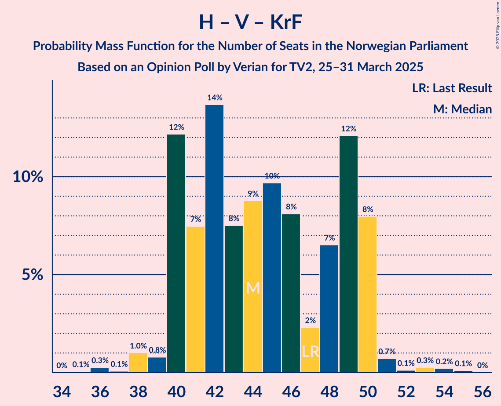

# Opinion Poll by Verian for TV2, 25–31 March 2025

<a href="#voting-intentions">Voting Intentions</a> | <a href="#seats">Seats</a> | <a href="#coalitions">Coalitions</a> | <a href="#technical-information">Technical Information</a>

## Voting Intentions

### Confidence Intervals

| Party | Last Result | Poll Result | 80% Confidence Interval | 90% Confidence Interval | 95% Confidence Interval | 99% Confidence Interval |
|:-----:|:-----------:|:-----------:|:-----------------------:|:-----------------------:|:-----------------------:|:-----------------------:|
| Arbeiderpartiet | 26.2% | 29.4% | 27.6–31.3% |27.1–31.8% |26.6–32.3% |25.8–33.2% |
| Høyre | 20.4% | 19.5% | 17.9–21.2% |17.5–21.6% |17.1–22.1% |16.4–22.9% |
| Fremskrittspartiet | 11.6% | 19.0% | 17.5–20.7% |17.1–21.2% |16.7–21.6% |16.0–22.5% |
| Senterpartiet | 13.5% | 6.5% | 5.6–7.6% |5.3–7.9% |5.1–8.2% |4.7–8.8% |
| Sosialistisk Venstreparti | 7.6% | 6.4% | 5.5–7.5% |5.2–7.8% |5.0–8.1% |4.6–8.7% |
| Rødt | 4.7% | 6.1% | 5.2–7.2% |5.0–7.5% |4.8–7.8% |4.4–8.3% |
| Venstre | 4.6% | 4.1% | 3.4–5.0% |3.2–5.2% |3.0–5.5% |2.7–6.0% |
| Kristelig Folkeparti | 3.8% | 3.9% | 3.2–4.8% |3.0–5.0% |2.8–5.2% |2.5–5.7% |
| Miljøpartiet De Grønne | 3.9% | 2.5% | 2.0–3.3% |1.8–3.5% |1.7–3.7% |1.5–4.1% |
| Norgesdemokratene | 1.1% | 1.2% | 0.9–1.8% |0.8–2.0% |0.7–2.1% |0.6–2.4% |
| Konservativt | 0.4% | 0.4% | 0.2–0.8% |0.2–0.9% |0.2–1.0% |0.1–1.3% |
| Pensjonistpartiet | 0.6% | 0.2% | 0.1–0.5% |0.1–0.6% |0.1–0.7% |0.0–0.9% |

*Note:* The poll result column reflects the actual value used in the calculations. Published results may vary slightly, and in addition be rounded to fewer digits.

## Seats

### Confidence Intervals

| Party | Last Result | Median | 80% Confidence Interval | 90% Confidence Interval | 95% Confidence Interval | 99% Confidence Interval |
|:-----:|:-----------:|:------:|:-----------------------:|:-----------------------:|:-----------------------:|:-----------------------:|
| <a href="#arbeiderpartiet">Arbeiderpartiet</a> | 48 | 53 | 50–60 |50–60 |49–60 |47–61 |
| <a href="#høyre">Høyre</a> | 36 | 34 | 31–37 |31–38 |31–39 |29–40 |
| <a href="#fremskrittspartiet">Fremskrittspartiet</a> | 21 | 35 | 32–38 |31–38 |30–39 |29–42 |
| <a href="#senterpartiet">Senterpartiet</a> | 28 | 11 | 9–14 |9–14 |9–15 |8–15 |
| <a href="#sosialistisk-venstreparti">Sosialistisk Venstreparti</a> | 13 | 11 | 9–14 |9–14 |9–14 |9–16 |
| <a href="#rødt">Rødt</a> | 8 | 10 | 8–13 |8–13 |8–13 |7–14 |
| <a href="#venstre">Venstre</a> | 8 | 7 | 2–8 |2–9 |2–10 |2–11 |
| <a href="#kristelig-folkeparti">Kristelig Folkeparti</a> | 3 | 3 | 2–8 |2–8 |2–9 |1–10 |
| <a href="#miljøpartiet-de-grønne">Miljøpartiet De Grønne</a> | 3 | 1 | 1–2 |1–3 |0–3 |0–3 |
| <a href="#norgesdemokratene">Norgesdemokratene</a> | 0 | 0 | 0 |0 |0 |0 |
| <a href="#konservativt">Konservativt</a> | 0 | 0 | 0 |0 |0 |0 |
| <a href="#pensjonistpartiet">Pensjonistpartiet</a> | 0 | 0 | 0 |0 |0 |0 |

### Arbeiderpartiet

*For a full overview of the results for this party, see the [Arbeiderpartiet](party-arbeiderpartiet.html) page.*

| Number of Seats | Probability | Accumulated | Special Marks |
|:---------------:|:-----------:|:-----------:|:-------------:|
| 46 | 0.1% | 100% |  |
| 47 | 0.5% | 99.9% |  |
| 48 | 0.9% | 99.4% | Last Result |
| 49 | 2% | 98.5% |  |
| 50 | 14% | 96% |  |
| 51 | 7% | 82% |  |
| 52 | 8% | 75% |  |
| 53 | 19% | 67% | Median |
| 54 | 2% | 48% |  |
| 55 | 5% | 46% |  |
| 56 | 8% | 41% |  |
| 57 | 7% | 33% |  |
| 58 | 9% | 26% |  |
| 59 | 3% | 17% |  |
| 60 | 13% | 13% |  |
| 61 | 0.3% | 0.6% |  |
| 62 | 0.1% | 0.3% |  |
| 63 | 0.1% | 0.2% |  |
| 64 | 0.1% | 0.1% |  |
| 65 | 0% | 0% |  |

### Høyre

*For a full overview of the results for this party, see the [Høyre](party-høyre.html) page.*

| Number of Seats | Probability | Accumulated | Special Marks |
|:---------------:|:-----------:|:-----------:|:-------------:|
| 28 | 0.1% | 100% |  |
| 29 | 0.5% | 99.9% |  |
| 30 | 2% | 99.4% |  |
| 31 | 14% | 98% |  |
| 32 | 8% | 84% |  |
| 33 | 10% | 76% |  |
| 34 | 19% | 65% | Median |
| 35 | 5% | 46% |  |
| 36 | 23% | 41% | Last Result |
| 37 | 11% | 17% |  |
| 38 | 2% | 6% |  |
| 39 | 3% | 4% |  |
| 40 | 0.7% | 0.9% |  |
| 41 | 0.1% | 0.2% |  |
| 42 | 0.1% | 0.1% |  |
| 43 | 0% | 0% |  |

### Fremskrittspartiet

*For a full overview of the results for this party, see the [Fremskrittspartiet](party-fremskrittspartiet.html) page.*

| Number of Seats | Probability | Accumulated | Special Marks |
|:---------------:|:-----------:|:-----------:|:-------------:|
| 21 | 0% | 100% | Last Result |
| 22 | 0% | 100% |  |
| 23 | 0% | 100% |  |
| 24 | 0% | 100% |  |
| 25 | 0% | 100% |  |
| 26 | 0.1% | 100% |  |
| 27 | 0% | 99.9% |  |
| 28 | 0.1% | 99.9% |  |
| 29 | 0.4% | 99.8% |  |
| 30 | 3% | 99.4% |  |
| 31 | 2% | 97% |  |
| 32 | 12% | 95% |  |
| 33 | 8% | 82% |  |
| 34 | 13% | 75% |  |
| 35 | 20% | 62% | Median |
| 36 | 12% | 42% |  |
| 37 | 8% | 30% |  |
| 38 | 17% | 21% |  |
| 39 | 2% | 4% |  |
| 40 | 1.0% | 2% |  |
| 41 | 0.5% | 1.2% |  |
| 42 | 0.6% | 0.7% |  |
| 43 | 0.1% | 0.1% |  |
| 44 | 0% | 0% |  |

### Senterpartiet

*For a full overview of the results for this party, see the [Senterpartiet](party-senterpartiet.html) page.*

| Number of Seats | Probability | Accumulated | Special Marks |
|:---------------:|:-----------:|:-----------:|:-------------:|
| 6 | 0.1% | 100% |  |
| 7 | 0.4% | 99.9% |  |
| 8 | 0.8% | 99.5% |  |
| 9 | 14% | 98.7% |  |
| 10 | 22% | 85% |  |
| 11 | 25% | 63% | Median |
| 12 | 11% | 38% |  |
| 13 | 5% | 27% |  |
| 14 | 18% | 21% |  |
| 15 | 3% | 3% |  |
| 16 | 0.2% | 0.2% |  |
| 17 | 0% | 0% |  |
| 18 | 0% | 0% |  |
| 19 | 0% | 0% |  |
| 20 | 0% | 0% |  |
| 21 | 0% | 0% |  |
| 22 | 0% | 0% |  |
| 23 | 0% | 0% |  |
| 24 | 0% | 0% |  |
| 25 | 0% | 0% |  |
| 26 | 0% | 0% |  |
| 27 | 0% | 0% |  |
| 28 | 0% | 0% | Last Result |

### Sosialistisk Venstreparti

*For a full overview of the results for this party, see the [Sosialistisk Venstreparti](party-sosialistiskvenstreparti.html) page.*

| Number of Seats | Probability | Accumulated | Special Marks |
|:---------------:|:-----------:|:-----------:|:-------------:|
| 7 | 0.2% | 100% |  |
| 8 | 0.3% | 99.8% |  |
| 9 | 13% | 99.5% |  |
| 10 | 29% | 86% |  |
| 11 | 14% | 57% | Median |
| 12 | 7% | 43% |  |
| 13 | 26% | 36% | Last Result |
| 14 | 9% | 11% |  |
| 15 | 0.8% | 2% |  |
| 16 | 1.4% | 1.4% |  |
| 17 | 0% | 0% |  |

### Rødt

*For a full overview of the results for this party, see the [Rødt](party-rødt.html) page.*

| Number of Seats | Probability | Accumulated | Special Marks |
|:---------------:|:-----------:|:-----------:|:-------------:|
| 7 | 1.1% | 100% |  |
| 8 | 9% | 98.8% | Last Result |
| 9 | 6% | 90% |  |
| 10 | 34% | 84% | Median |
| 11 | 20% | 49% |  |
| 12 | 14% | 29% |  |
| 13 | 13% | 15% |  |
| 14 | 2% | 2% |  |
| 15 | 0.2% | 0.3% |  |
| 16 | 0% | 0.1% |  |
| 17 | 0% | 0% |  |

### Venstre

*For a full overview of the results for this party, see the [Venstre](party-venstre.html) page.*

| Number of Seats | Probability | Accumulated | Special Marks |
|:---------------:|:-----------:|:-----------:|:-------------:|
| 2 | 20% | 100% |  |
| 3 | 22% | 80% |  |
| 4 | 0% | 58% |  |
| 5 | 0% | 58% |  |
| 6 | 0.4% | 58% |  |
| 7 | 14% | 58% | Median |
| 8 | 36% | 44% | Last Result |
| 9 | 3% | 8% |  |
| 10 | 4% | 5% |  |
| 11 | 0.6% | 0.6% |  |
| 12 | 0% | 0% |  |

### Kristelig Folkeparti

*For a full overview of the results for this party, see the [Kristelig Folkeparti](party-kristeligfolkeparti.html) page.*

| Number of Seats | Probability | Accumulated | Special Marks |
|:---------------:|:-----------:|:-----------:|:-------------:|
| 1 | 2% | 100% |  |
| 2 | 16% | 98% |  |
| 3 | 45% | 82% | Last Result, Median |
| 4 | 0% | 37% |  |
| 5 | 0% | 37% |  |
| 6 | 0.4% | 37% |  |
| 7 | 17% | 36% |  |
| 8 | 15% | 20% |  |
| 9 | 4% | 4% |  |
| 10 | 0.5% | 0.5% |  |
| 11 | 0% | 0% |  |

### Miljøpartiet De Grønne

*For a full overview of the results for this party, see the [Miljøpartiet De Grønne](party-miljøpartietdegrønne.html) page.*

| Number of Seats | Probability | Accumulated | Special Marks |
|:---------------:|:-----------:|:-----------:|:-------------:|
| 0 | 3% | 100% |  |
| 1 | 62% | 97% | Median |
| 2 | 26% | 35% |  |
| 3 | 9% | 9% | Last Result |
| 4 | 0% | 0.5% |  |
| 5 | 0% | 0.5% |  |
| 6 | 0% | 0.5% |  |
| 7 | 0.4% | 0.5% |  |
| 8 | 0.1% | 0.1% |  |
| 9 | 0% | 0% |  |

### Norgesdemokratene

*For a full overview of the results for this party, see the [Norgesdemokratene](party-norgesdemokratene.html) page.*

| Number of Seats | Probability | Accumulated | Special Marks |
|:---------------:|:-----------:|:-----------:|:-------------:|
| 0 | 100% | 100% | Last Result, Median |

### Konservativt

*For a full overview of the results for this party, see the [Konservativt](party-konservativt.html) page.*

| Number of Seats | Probability | Accumulated | Special Marks |
|:---------------:|:-----------:|:-----------:|:-------------:|
| 0 | 100% | 100% | Last Result, Median |

### Pensjonistpartiet

*For a full overview of the results for this party, see the [Pensjonistpartiet](party-pensjonistpartiet.html) page.*

| Number of Seats | Probability | Accumulated | Special Marks |
|:---------------:|:-----------:|:-----------:|:-------------:|
| 0 | 100% | 100% | Last Result, Median |

## Coalitions

### Confidence Intervals

| Coalition | Last Result | Median | Majority? | 80% Confidence Interval | 90% Confidence Interval | 95% Confidence Interval | 99% Confidence Interval |
|:---------:|:-----------:|:------:|:---------:|:-----------------------:|:-----------------------:|:-----------------------:|:-----------------------:|
| Høyre – Fremskrittspartiet – Senterpartiet – Venstre – Kristelig Folkeparti | 96 | 92 | 99.4% | 85–94 | 85–96 | 85–97 | 84–99 |
| Arbeiderpartiet – Senterpartiet – Sosialistisk Venstreparti – Rødt – Miljøpartiet De Grønne | 100 | 89 | 95% | 85–95 | 85–95 | 84–95 | 81–98 |
| Arbeiderpartiet – Senterpartiet – Sosialistisk Venstreparti – Rødt | 97 | 87 | 79% | 83–94 | 83–94 | 82–94 | 79–96 |
| Arbeiderpartiet – Senterpartiet – Sosialistisk Venstreparti – Kristelig Folkeparti – Miljøpartiet De Grønne | 95 | 82 | 35% | 79–88 | 78–89 | 76–90 | 75–94 |
| Høyre – Fremskrittspartiet – Venstre – Kristelig Folkeparti – Miljøpartiet De Grønne | 71 | 82 | 21% | 75–86 | 75–86 | 75–87 | 73–90 |
| Høyre – Fremskrittspartiet – Venstre – Kristelig Folkeparti | 68 | 80 | 5% | 74–84 | 74–84 | 74–85 | 71–88 |
| Arbeiderpartiet – Senterpartiet – Sosialistisk Venstreparti – Miljøpartiet De Grønne | 92 | 78 | 13% | 75–85 | 73–85 | 72–85 | 70–87 |
| Arbeiderpartiet – Sosialistisk Venstreparti – Rødt – Miljøpartiet De Grønne | 72 | 77 | 0.6% | 75–84 | 73–84 | 72–84 | 70–85 |
| Arbeiderpartiet – Senterpartiet – Sosialistisk Venstreparti | 89 | 77 | 0.8% | 73–84 | 72–84 | 71–84 | 69–85 |
| Høyre – Fremskrittspartiet – Venstre | 65 | 76 | 0.4% | 71–78 | 70–79 | 69–81 | 66–84 |
| Arbeiderpartiet – Senterpartiet – Kristelig Folkeparti – Miljøpartiet De Grønne | 82 | 72 | 0% | 66–76 | 65–77 | 65–79 | 63–80 |
| Arbeiderpartiet – Senterpartiet – Kristelig Folkeparti | 79 | 70 | 0% | 65–75 | 64–76 | 64–78 | 62–79 |
| Høyre – Fremskrittspartiet | 57 | 69 | 0% | 63–74 | 63–75 | 63–75 | 62–78 |
| Arbeiderpartiet – Sosialistisk Venstreparti | 61 | 66 | 0% | 62–73 | 61–73 | 60–73 | 57–73 |
| Arbeiderpartiet – Senterpartiet | 76 | 65 | 0% | 61–71 | 61–71 | 61–72 | 58–73 |
| Høyre – Venstre – Kristelig Folkeparti | 47 | 44 | 0% | 40–49 | 40–50 | 40–50 | 38–53 |
| Senterpartiet – Venstre – Kristelig Folkeparti | 39 | 22 | 0% | 17–25 | 15–26 | 15–27 | 15–29 |

### Høyre – Fremskrittspartiet – Senterpartiet – Venstre – Kristelig Folkeparti

| Number of Seats | Probability | Accumulated | Special Marks |
|:---------------:|:-----------:|:-----------:|:-------------:|
| 81 | 0.1% | 100% |  |
| 82 | 0% | 99.9% |  |
| 83 | 0.1% | 99.9% |  |
| 84 | 0.3% | 99.8% |  |
| 85 | 13% | 99.4% | Majority |
| 86 | 1.2% | 87% |  |
| 87 | 2% | 86% |  |
| 88 | 2% | 84% |  |
| 89 | 4% | 82% |  |
| 90 | 20% | 78% | Median |
| 91 | 4% | 58% |  |
| 92 | 22% | 54% |  |
| 93 | 7% | 32% |  |
| 94 | 16% | 26% |  |
| 95 | 3% | 9% |  |
| 96 | 3% | 6% | Last Result |
| 97 | 1.3% | 3% |  |
| 98 | 0.3% | 2% |  |
| 99 | 0.9% | 1.3% |  |
| 100 | 0.2% | 0.4% |  |
| 101 | 0.1% | 0.2% |  |
| 102 | 0.1% | 0.1% |  |
| 103 | 0% | 0% |  |

### Arbeiderpartiet – Senterpartiet – Sosialistisk Venstreparti – Rødt – Miljøpartiet De Grønne

| Number of Seats | Probability | Accumulated | Special Marks |
|:---------------:|:-----------:|:-----------:|:-------------:|
| 77 | 0.1% | 100% |  |
| 78 | 0% | 99.8% |  |
| 79 | 0.1% | 99.8% |  |
| 80 | 0.2% | 99.7% |  |
| 81 | 0.3% | 99.6% |  |
| 82 | 1.0% | 99.3% |  |
| 83 | 0.5% | 98% |  |
| 84 | 3% | 98% |  |
| 85 | 14% | 95% | Majority |
| 86 | 6% | 81% | Median |
| 87 | 6% | 75% |  |
| 88 | 14% | 69% |  |
| 89 | 10% | 55% |  |
| 90 | 7% | 45% |  |
| 91 | 16% | 38% |  |
| 92 | 2% | 22% |  |
| 93 | 1.1% | 20% |  |
| 94 | 4% | 19% |  |
| 95 | 13% | 15% |  |
| 96 | 0.9% | 2% |  |
| 97 | 0.4% | 0.9% |  |
| 98 | 0.4% | 0.6% |  |
| 99 | 0.1% | 0.1% |  |
| 100 | 0% | 0% | Last Result |

### Arbeiderpartiet – Senterpartiet – Sosialistisk Venstreparti – Rødt

| Number of Seats | Probability | Accumulated | Special Marks |
|:---------------:|:-----------:|:-----------:|:-------------:|
| 76 | 0.1% | 100% |  |
| 77 | 0.1% | 99.8% |  |
| 78 | 0.1% | 99.8% |  |
| 79 | 0.3% | 99.7% |  |
| 80 | 0.5% | 99.4% |  |
| 81 | 0.9% | 98.9% |  |
| 82 | 0.5% | 98% |  |
| 83 | 14% | 97% |  |
| 84 | 4% | 83% |  |
| 85 | 7% | 79% | Median, Majority |
| 86 | 12% | 72% |  |
| 87 | 12% | 60% |  |
| 88 | 4% | 48% |  |
| 89 | 9% | 44% |  |
| 90 | 14% | 35% |  |
| 91 | 2% | 21% |  |
| 92 | 2% | 19% |  |
| 93 | 5% | 18% |  |
| 94 | 12% | 13% |  |
| 95 | 0.7% | 1.3% |  |
| 96 | 0.2% | 0.6% |  |
| 97 | 0.3% | 0.4% | Last Result |
| 98 | 0.1% | 0.1% |  |
| 99 | 0% | 0% |  |

### Arbeiderpartiet – Senterpartiet – Sosialistisk Venstreparti – Kristelig Folkeparti – Miljøpartiet De Grønne

| Number of Seats | Probability | Accumulated | Special Marks |
|:---------------:|:-----------:|:-----------:|:-------------:|
| 71 | 0.1% | 100% |  |
| 72 | 0% | 99.9% |  |
| 73 | 0.1% | 99.8% |  |
| 74 | 0.2% | 99.7% |  |
| 75 | 2% | 99.5% |  |
| 76 | 0.5% | 98% |  |
| 77 | 1.5% | 97% |  |
| 78 | 1.4% | 96% |  |
| 79 | 8% | 94% | Median |
| 80 | 11% | 87% |  |
| 81 | 13% | 76% |  |
| 82 | 21% | 63% |  |
| 83 | 3% | 42% |  |
| 84 | 4% | 39% |  |
| 85 | 5% | 35% | Majority |
| 86 | 5% | 30% |  |
| 87 | 5% | 25% |  |
| 88 | 13% | 20% |  |
| 89 | 3% | 7% |  |
| 90 | 2% | 4% |  |
| 91 | 1.0% | 2% |  |
| 92 | 0% | 0.7% |  |
| 93 | 0.1% | 0.7% |  |
| 94 | 0.3% | 0.6% |  |
| 95 | 0% | 0.3% | Last Result |
| 96 | 0.2% | 0.3% |  |
| 97 | 0% | 0% |  |

### Høyre – Fremskrittspartiet – Venstre – Kristelig Folkeparti – Miljøpartiet De Grønne

| Number of Seats | Probability | Accumulated | Special Marks |
|:---------------:|:-----------:|:-----------:|:-------------:|
| 71 | 0.1% | 100% | Last Result |
| 72 | 0.3% | 99.9% |  |
| 73 | 0.2% | 99.6% |  |
| 74 | 0.7% | 99.4% |  |
| 75 | 12% | 98.7% |  |
| 76 | 5% | 87% |  |
| 77 | 2% | 82% |  |
| 78 | 2% | 81% |  |
| 79 | 14% | 79% |  |
| 80 | 9% | 65% | Median |
| 81 | 4% | 56% |  |
| 82 | 12% | 52% |  |
| 83 | 12% | 40% |  |
| 84 | 7% | 28% |  |
| 85 | 4% | 21% | Majority |
| 86 | 14% | 17% |  |
| 87 | 0.5% | 3% |  |
| 88 | 0.9% | 2% |  |
| 89 | 0.5% | 1.1% |  |
| 90 | 0.3% | 0.6% |  |
| 91 | 0.1% | 0.3% |  |
| 92 | 0.1% | 0.2% |  |
| 93 | 0.1% | 0.2% |  |
| 94 | 0% | 0% |  |

### Høyre – Fremskrittspartiet – Venstre – Kristelig Folkeparti

| Number of Seats | Probability | Accumulated | Special Marks |
|:---------------:|:-----------:|:-----------:|:-------------:|
| 68 | 0% | 100% | Last Result |
| 69 | 0% | 100% |  |
| 70 | 0.1% | 100% |  |
| 71 | 0.4% | 99.9% |  |
| 72 | 0.4% | 99.4% |  |
| 73 | 0.9% | 99.1% |  |
| 74 | 13% | 98% |  |
| 75 | 4% | 85% |  |
| 76 | 1.1% | 81% |  |
| 77 | 2% | 80% |  |
| 78 | 16% | 78% |  |
| 79 | 7% | 62% | Median |
| 80 | 10% | 55% |  |
| 81 | 14% | 45% |  |
| 82 | 6% | 31% |  |
| 83 | 6% | 25% |  |
| 84 | 14% | 19% |  |
| 85 | 3% | 5% | Majority |
| 86 | 0.5% | 2% |  |
| 87 | 1.0% | 2% |  |
| 88 | 0.3% | 0.7% |  |
| 89 | 0.2% | 0.4% |  |
| 90 | 0.1% | 0.3% |  |
| 91 | 0% | 0.2% |  |
| 92 | 0.1% | 0.2% |  |
| 93 | 0% | 0% |  |

### Arbeiderpartiet – Senterpartiet – Sosialistisk Venstreparti – Miljøpartiet De Grønne

| Number of Seats | Probability | Accumulated | Special Marks |
|:---------------:|:-----------:|:-----------:|:-------------:|
| 68 | 0.1% | 100% |  |
| 69 | 0.1% | 99.8% |  |
| 70 | 0.5% | 99.7% |  |
| 71 | 0.6% | 99.2% |  |
| 72 | 3% | 98.6% |  |
| 73 | 1.2% | 96% |  |
| 74 | 2% | 95% |  |
| 75 | 14% | 93% |  |
| 76 | 11% | 79% | Median |
| 77 | 4% | 68% |  |
| 78 | 24% | 64% |  |
| 79 | 8% | 40% |  |
| 80 | 5% | 32% |  |
| 81 | 4% | 26% |  |
| 82 | 5% | 23% |  |
| 83 | 1.4% | 18% |  |
| 84 | 4% | 17% |  |
| 85 | 12% | 13% | Majority |
| 86 | 0.9% | 1.4% |  |
| 87 | 0.2% | 0.5% |  |
| 88 | 0% | 0.3% |  |
| 89 | 0.3% | 0.3% |  |
| 90 | 0% | 0% |  |
| 91 | 0% | 0% |  |
| 92 | 0% | 0% | Last Result |

### Arbeiderpartiet – Sosialistisk Venstreparti – Rødt – Miljøpartiet De Grønne

| Number of Seats | Probability | Accumulated | Special Marks |
|:---------------:|:-----------:|:-----------:|:-------------:|
| 67 | 0.1% | 100% |  |
| 68 | 0.1% | 99.9% |  |
| 69 | 0.2% | 99.8% |  |
| 70 | 0.9% | 99.6% |  |
| 71 | 0.3% | 98.7% |  |
| 72 | 1.3% | 98% | Last Result |
| 73 | 3% | 97% |  |
| 74 | 3% | 94% |  |
| 75 | 16% | 91% | Median |
| 76 | 7% | 74% |  |
| 77 | 22% | 68% |  |
| 78 | 4% | 46% |  |
| 79 | 20% | 42% |  |
| 80 | 4% | 22% |  |
| 81 | 2% | 18% |  |
| 82 | 2% | 16% |  |
| 83 | 1.2% | 14% |  |
| 84 | 13% | 13% |  |
| 85 | 0.3% | 0.6% | Majority |
| 86 | 0.1% | 0.2% |  |
| 87 | 0% | 0.1% |  |
| 88 | 0.1% | 0.1% |  |
| 89 | 0% | 0% |  |

### Arbeiderpartiet – Senterpartiet – Sosialistisk Venstreparti

| Number of Seats | Probability | Accumulated | Special Marks |
|:---------------:|:-----------:|:-----------:|:-------------:|
| 67 | 0.2% | 100% |  |
| 68 | 0.1% | 99.7% |  |
| 69 | 0.5% | 99.6% |  |
| 70 | 0.9% | 99.1% |  |
| 71 | 3% | 98% |  |
| 72 | 1.3% | 96% |  |
| 73 | 14% | 94% |  |
| 74 | 4% | 81% |  |
| 75 | 14% | 77% | Median |
| 76 | 11% | 63% |  |
| 77 | 16% | 52% |  |
| 78 | 7% | 37% |  |
| 79 | 4% | 29% |  |
| 80 | 4% | 25% |  |
| 81 | 4% | 21% |  |
| 82 | 1.4% | 17% |  |
| 83 | 3% | 16% |  |
| 84 | 11% | 12% |  |
| 85 | 0.4% | 0.8% | Majority |
| 86 | 0.2% | 0.5% |  |
| 87 | 0% | 0.3% |  |
| 88 | 0.3% | 0.3% |  |
| 89 | 0% | 0% | Last Result |

### Høyre – Fremskrittspartiet – Venstre

| Number of Seats | Probability | Accumulated | Special Marks |
|:---------------:|:-----------:|:-----------:|:-------------:|
| 63 | 0.1% | 100% |  |
| 64 | 0.3% | 99.9% |  |
| 65 | 0% | 99.7% | Last Result |
| 66 | 0.4% | 99.7% |  |
| 67 | 0.9% | 99.3% |  |
| 68 | 0.6% | 98% |  |
| 69 | 0.9% | 98% |  |
| 70 | 3% | 97% |  |
| 71 | 12% | 94% |  |
| 72 | 9% | 82% |  |
| 73 | 1.4% | 73% |  |
| 74 | 5% | 71% |  |
| 75 | 7% | 67% |  |
| 76 | 21% | 59% | Median |
| 77 | 17% | 38% |  |
| 78 | 13% | 21% |  |
| 79 | 4% | 9% |  |
| 80 | 0.9% | 5% |  |
| 81 | 2% | 4% |  |
| 82 | 0.3% | 1.2% |  |
| 83 | 0.3% | 0.9% |  |
| 84 | 0.2% | 0.6% |  |
| 85 | 0.2% | 0.4% | Majority |
| 86 | 0.1% | 0.2% |  |
| 87 | 0.1% | 0.1% |  |
| 88 | 0% | 0% |  |

### Arbeiderpartiet – Senterpartiet – Kristelig Folkeparti – Miljøpartiet De Grønne

| Number of Seats | Probability | Accumulated | Special Marks |
|:---------------:|:-----------:|:-----------:|:-------------:|
| 62 | 0.2% | 100% |  |
| 63 | 0.4% | 99.8% |  |
| 64 | 0.2% | 99.4% |  |
| 65 | 6% | 99.2% |  |
| 66 | 5% | 93% |  |
| 67 | 11% | 88% |  |
| 68 | 2% | 77% | Median |
| 69 | 2% | 75% |  |
| 70 | 0.6% | 73% |  |
| 71 | 7% | 73% |  |
| 72 | 25% | 65% |  |
| 73 | 3% | 40% |  |
| 74 | 10% | 37% |  |
| 75 | 13% | 27% |  |
| 76 | 6% | 13% |  |
| 77 | 3% | 8% |  |
| 78 | 1.2% | 4% |  |
| 79 | 2% | 3% |  |
| 80 | 0.4% | 0.9% |  |
| 81 | 0.3% | 0.4% |  |
| 82 | 0% | 0.2% | Last Result |
| 83 | 0.1% | 0.1% |  |
| 84 | 0.1% | 0.1% |  |
| 85 | 0% | 0% | Majority |

### Arbeiderpartiet – Senterpartiet – Kristelig Folkeparti

| Number of Seats | Probability | Accumulated | Special Marks |
|:---------------:|:-----------:|:-----------:|:-------------:|
| 60 | 0% | 100% |  |
| 61 | 0.2% | 99.9% |  |
| 62 | 0.4% | 99.7% |  |
| 63 | 0.2% | 99.4% |  |
| 64 | 7% | 99.1% |  |
| 65 | 4% | 92% |  |
| 66 | 12% | 88% |  |
| 67 | 2% | 76% | Median |
| 68 | 7% | 74% |  |
| 69 | 1.4% | 68% |  |
| 70 | 20% | 67% |  |
| 71 | 8% | 47% |  |
| 72 | 5% | 39% |  |
| 73 | 8% | 34% |  |
| 74 | 15% | 26% |  |
| 75 | 6% | 11% |  |
| 76 | 1.4% | 5% |  |
| 77 | 1.0% | 4% |  |
| 78 | 2% | 3% |  |
| 79 | 0.2% | 0.6% | Last Result |
| 80 | 0.3% | 0.4% |  |
| 81 | 0% | 0.1% |  |
| 82 | 0.1% | 0.1% |  |
| 83 | 0% | 0% |  |

### Høyre – Fremskrittspartiet

| Number of Seats | Probability | Accumulated | Special Marks |
|:---------------:|:-----------:|:-----------:|:-------------:|
| 57 | 0% | 100% | Last Result |
| 58 | 0% | 100% |  |
| 59 | 0.1% | 100% |  |
| 60 | 0.1% | 99.9% |  |
| 61 | 0.2% | 99.9% |  |
| 62 | 0.4% | 99.7% |  |
| 63 | 12% | 99.3% |  |
| 64 | 1.3% | 87% |  |
| 65 | 0.9% | 86% |  |
| 66 | 6% | 85% |  |
| 67 | 5% | 79% |  |
| 68 | 7% | 75% |  |
| 69 | 23% | 68% | Median |
| 70 | 6% | 45% |  |
| 71 | 12% | 39% |  |
| 72 | 2% | 27% |  |
| 73 | 6% | 25% |  |
| 74 | 11% | 19% |  |
| 75 | 6% | 8% |  |
| 76 | 0.8% | 2% |  |
| 77 | 0.4% | 1.1% |  |
| 78 | 0.3% | 0.7% |  |
| 79 | 0.3% | 0.4% |  |
| 80 | 0.1% | 0.1% |  |
| 81 | 0% | 0% |  |

### Arbeiderpartiet – Sosialistisk Venstreparti

| Number of Seats | Probability | Accumulated | Special Marks |
|:---------------:|:-----------:|:-----------:|:-------------:|
| 57 | 0.6% | 100% |  |
| 58 | 0.7% | 99.4% |  |
| 59 | 0.3% | 98.7% |  |
| 60 | 3% | 98% |  |
| 61 | 3% | 95% | Last Result |
| 62 | 5% | 92% |  |
| 63 | 28% | 87% |  |
| 64 | 2% | 59% | Median |
| 65 | 6% | 57% |  |
| 66 | 10% | 51% |  |
| 67 | 16% | 42% |  |
| 68 | 3% | 26% |  |
| 69 | 7% | 23% |  |
| 70 | 1.5% | 16% |  |
| 71 | 2% | 14% |  |
| 72 | 0.7% | 13% |  |
| 73 | 11% | 12% |  |
| 74 | 0.3% | 0.5% |  |
| 75 | 0.1% | 0.2% |  |
| 76 | 0% | 0% |  |

### Arbeiderpartiet – Senterpartiet

| Number of Seats | Probability | Accumulated | Special Marks |
|:---------------:|:-----------:|:-----------:|:-------------:|
| 57 | 0.1% | 100% |  |
| 58 | 0.4% | 99.9% |  |
| 59 | 0.7% | 99.4% |  |
| 60 | 0.9% | 98.7% |  |
| 61 | 8% | 98% |  |
| 62 | 5% | 90% |  |
| 63 | 13% | 85% |  |
| 64 | 14% | 71% | Median |
| 65 | 11% | 57% |  |
| 66 | 6% | 46% |  |
| 67 | 10% | 40% |  |
| 68 | 6% | 30% |  |
| 69 | 1.2% | 23% |  |
| 70 | 7% | 22% |  |
| 71 | 12% | 16% |  |
| 72 | 3% | 4% |  |
| 73 | 0.4% | 0.6% |  |
| 74 | 0.1% | 0.3% |  |
| 75 | 0.1% | 0.2% |  |
| 76 | 0.1% | 0.1% | Last Result |
| 77 | 0% | 0% |  |

### Høyre – Venstre – Kristelig Folkeparti

| Number of Seats | Probability | Accumulated | Special Marks |
|:---------------:|:-----------:|:-----------:|:-------------:|
| 35 | 0.1% | 100% |  |
| 36 | 0.3% | 99.9% |  |
| 37 | 0.1% | 99.7% |  |
| 38 | 1.0% | 99.6% |  |
| 39 | 0.8% | 98.6% |  |
| 40 | 12% | 98% |  |
| 41 | 7% | 86% |  |
| 42 | 14% | 78% |  |
| 43 | 8% | 64% |  |
| 44 | 9% | 57% | Median |
| 45 | 10% | 48% |  |
| 46 | 8% | 38% |  |
| 47 | 2% | 30% | Last Result |
| 48 | 7% | 28% |  |
| 49 | 12% | 22% |  |
| 50 | 8% | 9% |  |
| 51 | 0.7% | 1.5% |  |
| 52 | 0.1% | 0.7% |  |
| 53 | 0.3% | 0.6% |  |
| 54 | 0.2% | 0.3% |  |
| 55 | 0.1% | 0.1% |  |
| 56 | 0% | 0% |  |

### Senterpartiet – Venstre – Kristelig Folkeparti

| Number of Seats | Probability | Accumulated | Special Marks |
|:---------------:|:-----------:|:-----------:|:-------------:|
| 13 | 0.1% | 100% |  |
| 14 | 0.3% | 99.9% |  |
| 15 | 6% | 99.6% |  |
| 16 | 2% | 94% |  |
| 17 | 3% | 92% |  |
| 18 | 11% | 89% |  |
| 19 | 13% | 78% |  |
| 20 | 0.8% | 65% |  |
| 21 | 5% | 64% | Median |
| 22 | 18% | 60% |  |
| 23 | 9% | 42% |  |
| 24 | 7% | 34% |  |
| 25 | 19% | 26% |  |
| 26 | 3% | 7% |  |
| 27 | 2% | 4% |  |
| 28 | 0.9% | 2% |  |
| 29 | 1.0% | 1.5% |  |
| 30 | 0.3% | 0.4% |  |
| 31 | 0.1% | 0.2% |  |
| 32 | 0% | 0% |  |
| 33 | 0% | 0% |  |
| 34 | 0% | 0% |  |
| 35 | 0% | 0% |  |
| 36 | 0% | 0% |  |
| 37 | 0% | 0% |  |
| 38 | 0% | 0% |  |
| 39 | 0% | 0% | Last Result |

## Technical Information

### Opinion Poll

+ **Polling firm:** Verian
+ **Commissioner(s):** TV2
+ **Fieldwork period:** 25–31 March 2025

### Calculations

+ **Sample size:** 987
+ **Simulations done:** 2,097,152
+ **Error estimate:** 3.20%

