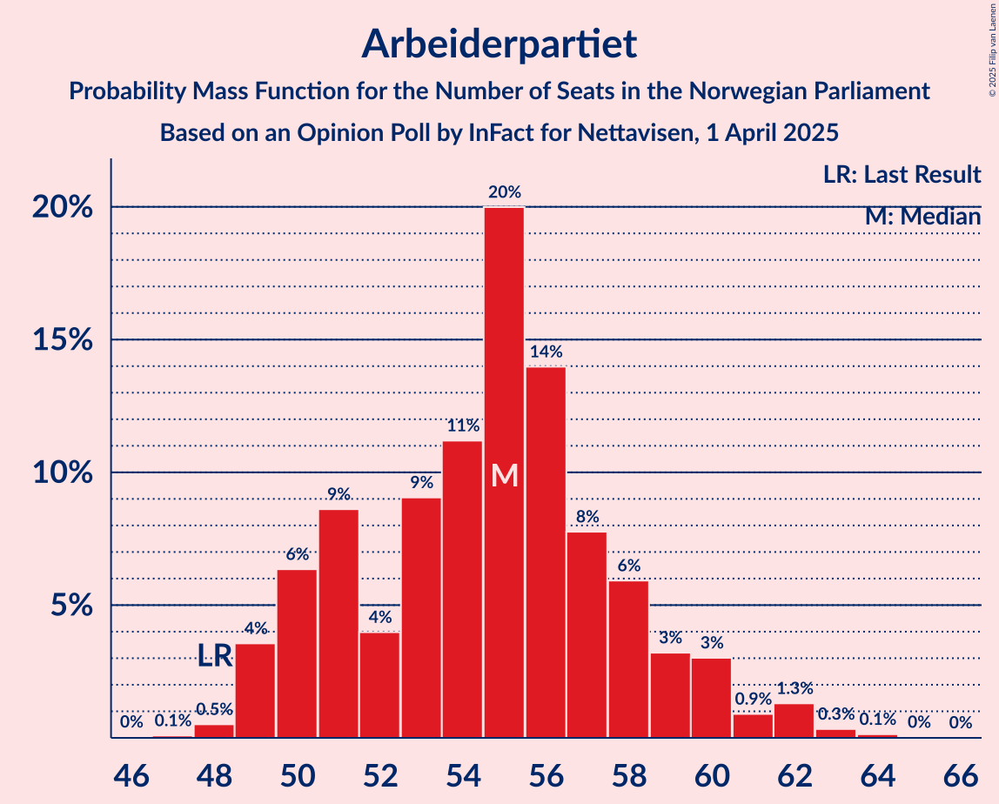
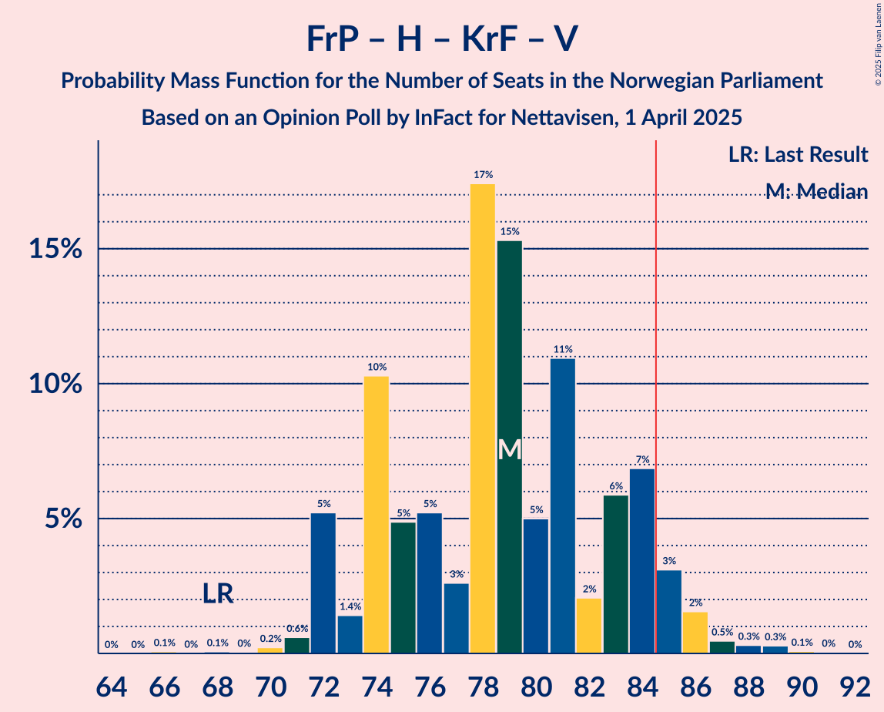
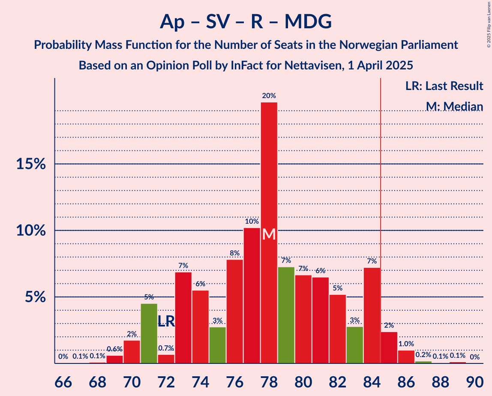
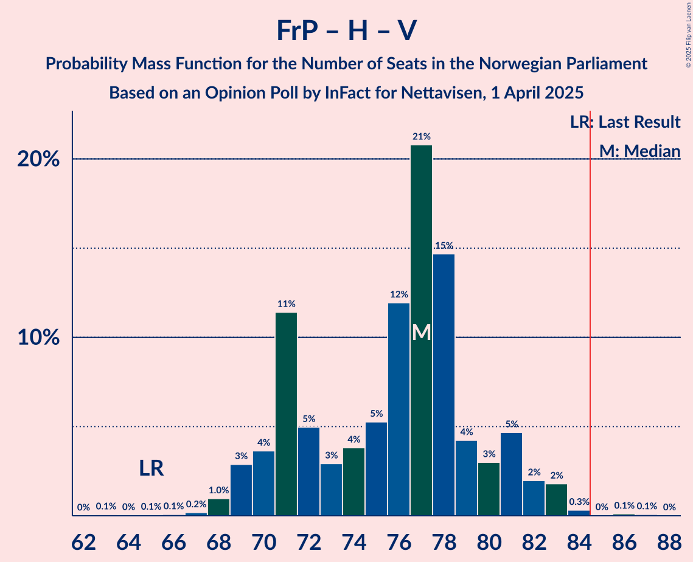

# Opinion Poll by InFact for Nettavisen, 1 April 2025

<a href="#voting-intentions">Voting Intentions</a> | <a href="#seats">Seats</a> | <a href="#coalitions">Coalitions</a> | <a href="#technical-information">Technical Information</a>

## Voting Intentions

### Confidence Intervals

| Party | Last Result | Poll Result | 80% Confidence Interval | 90% Confidence Interval | 95% Confidence Interval | 99% Confidence Interval |
|:-----:|:-----------:|:-----------:|:-----------------------:|:-----------------------:|:-----------------------:|:-----------------------:|
| Arbeiderpartiet | 26.2% | 29.5% | 27.8–31.3% |27.3–31.9% |26.9–32.3% |26.0–33.2% |
| Fremskrittspartiet | 11.6% | 21.3% | 19.7–22.9% |19.3–23.4% |18.9–23.8% |18.2–24.6% |
| Høyre | 20.4% | 18.0% | 16.6–19.6% |16.2–20.1% |15.9–20.5% |15.2–21.2% |
| Senterpartiet | 13.5% | 6.6% | 5.7–7.6% |5.4–7.9% |5.2–8.2% |4.8–8.7% |
| Sosialistisk Venstreparti | 7.6% | 5.8% | 5.0–6.8% |4.8–7.1% |4.6–7.4% |4.2–7.9% |
| Rødt | 4.7% | 5.4% | 4.6–6.4% |4.4–6.6% |4.2–6.9% |3.8–7.4% |
| Kristelig Folkeparti | 3.8% | 3.3% | 2.7–4.1% |2.5–4.4% |2.4–4.6% |2.1–5.0% |
| Venstre | 4.6% | 3.1% | 2.5–3.8% |2.3–4.1% |2.2–4.3% |1.9–4.7% |
| Miljøpartiet De Grønne | 3.9% | 3.1% | 2.5–3.8% |2.3–4.1% |2.2–4.3% |1.9–4.7% |
| Industri- og Næringspartiet | 0.3% | 0.9% | 0.6–1.4% |0.6–1.6% |0.5–1.7% |0.4–2.0% |
| Norgesdemokratene | 1.1% | 0.6% | 0.4–1.0% |0.3–1.1% |0.3–1.2% |0.2–1.4% |
| Konservativt | 0.4% | 0.6% | 0.4–1.0% |0.3–1.1% |0.3–1.2% |0.2–1.4% |

*Note:* The poll result column reflects the actual value used in the calculations. Published results may vary slightly, and in addition be rounded to fewer digits.

## Seats

### Confidence Intervals

| Party | Last Result | Median | 80% Confidence Interval | 90% Confidence Interval | 95% Confidence Interval | 99% Confidence Interval |
|:-----:|:-----------:|:------:|:-----------------------:|:-----------------------:|:-----------------------:|:-----------------------:|
| <a href="#arbeiderpartiet">Arbeiderpartiet</a> | 48 | 55 | 50–58 |50–60 |49–61 |48–63 |
| <a href="#fremskrittspartiet">Fremskrittspartiet</a> | 21 | 39 | 37–43 |35–44 |35–45 |34–46 |
| <a href="#høyre">Høyre</a> | 36 | 32 | 30–36 |28–37 |28–38 |27–40 |
| <a href="#senterpartiet">Senterpartiet</a> | 28 | 12 | 10–15 |10–15 |9–15 |8–17 |
| <a href="#sosialistisk-venstreparti">Sosialistisk Venstreparti</a> | 13 | 11 | 9–12 |8–13 |8–14 |7–16 |
| <a href="#rødt">Rødt</a> | 8 | 10 | 8–11 |7–12 |1–13 |1–14 |
| <a href="#kristelig-folkeparti">Kristelig Folkeparti</a> | 3 | 2 | 1–7 |1–8 |1–8 |0–9 |
| <a href="#venstre">Venstre</a> | 8 | 2 | 2–8 |2–8 |1–8 |1–9 |
| <a href="#miljøpartiet-de-grønne">Miljøpartiet De Grønne</a> | 3 | 3 | 1–8 |1–8 |1–8 |1–9 |
| <a href="#industri--og-næringspartiet">Industri- og Næringspartiet</a> | 0 | 0 | 0 |0 |0 |0 |
| <a href="#norgesdemokratene">Norgesdemokratene</a> | 0 | 0 | 0 |0 |0 |0 |
| <a href="#konservativt">Konservativt</a> | 0 | 0 | 0 |0 |0 |0 |

### Arbeiderpartiet

*For a full overview of the results for this party, see the [Arbeiderpartiet](party-arbeiderpartiet.html) page.*

| Number of Seats | Probability | Accumulated | Special Marks |
|:---------------:|:-----------:|:-----------:|:-------------:|
| 47 | 0.1% | 100% |  |
| 48 | 0.5% | 99.9% | Last Result |
| 49 | 4% | 99.4% |  |
| 50 | 6% | 96% |  |
| 51 | 9% | 89% |  |
| 52 | 4% | 81% |  |
| 53 | 9% | 77% |  |
| 54 | 11% | 68% |  |
| 55 | 20% | 57% | Median |
| 56 | 14% | 37% |  |
| 57 | 8% | 23% |  |
| 58 | 6% | 15% |  |
| 59 | 3% | 9% |  |
| 60 | 3% | 6% |  |
| 61 | 0.9% | 3% |  |
| 62 | 1.3% | 2% |  |
| 63 | 0.3% | 0.5% |  |
| 64 | 0.1% | 0.2% |  |
| 65 | 0% | 0% |  |

### Fremskrittspartiet

*For a full overview of the results for this party, see the [Fremskrittspartiet](party-fremskrittspartiet.html) page.*

| Number of Seats | Probability | Accumulated | Special Marks |
|:---------------:|:-----------:|:-----------:|:-------------:|
| 21 | 0% | 100% | Last Result |
| 22 | 0% | 100% |  |
| 23 | 0% | 100% |  |
| 24 | 0% | 100% |  |
| 25 | 0% | 100% |  |
| 26 | 0% | 100% |  |
| 27 | 0% | 100% |  |
| 28 | 0% | 100% |  |
| 29 | 0% | 100% |  |
| 30 | 0% | 100% |  |
| 31 | 0.1% | 100% |  |
| 32 | 0% | 99.9% |  |
| 33 | 0.1% | 99.9% |  |
| 34 | 1.2% | 99.7% |  |
| 35 | 4% | 98.5% |  |
| 36 | 3% | 95% |  |
| 37 | 6% | 91% |  |
| 38 | 7% | 86% |  |
| 39 | 29% | 78% | Median |
| 40 | 13% | 49% |  |
| 41 | 15% | 36% |  |
| 42 | 6% | 21% |  |
| 43 | 7% | 15% |  |
| 44 | 5% | 8% |  |
| 45 | 3% | 4% |  |
| 46 | 0.5% | 0.8% |  |
| 47 | 0.2% | 0.3% |  |
| 48 | 0.1% | 0.1% |  |
| 49 | 0% | 0% |  |

### Høyre

*For a full overview of the results for this party, see the [Høyre](party-høyre.html) page.*

| Number of Seats | Probability | Accumulated | Special Marks |
|:---------------:|:-----------:|:-----------:|:-------------:|
| 26 | 0.3% | 100% |  |
| 27 | 0.3% | 99.6% |  |
| 28 | 6% | 99.4% |  |
| 29 | 3% | 94% |  |
| 30 | 18% | 90% |  |
| 31 | 19% | 72% |  |
| 32 | 15% | 54% | Median |
| 33 | 5% | 39% |  |
| 34 | 8% | 34% |  |
| 35 | 6% | 26% |  |
| 36 | 12% | 21% | Last Result |
| 37 | 5% | 9% |  |
| 38 | 2% | 3% |  |
| 39 | 0.5% | 1.1% |  |
| 40 | 0.3% | 0.6% |  |
| 41 | 0.1% | 0.2% |  |
| 42 | 0% | 0.1% |  |
| 43 | 0.1% | 0.1% |  |
| 44 | 0% | 0% |  |

### Senterpartiet

*For a full overview of the results for this party, see the [Senterpartiet](party-senterpartiet.html) page.*

| Number of Seats | Probability | Accumulated | Special Marks |
|:---------------:|:-----------:|:-----------:|:-------------:|
| 7 | 0.1% | 100% |  |
| 8 | 0.9% | 99.9% |  |
| 9 | 4% | 99.0% |  |
| 10 | 11% | 95% |  |
| 11 | 13% | 84% |  |
| 12 | 23% | 71% | Median |
| 13 | 24% | 48% |  |
| 14 | 13% | 24% |  |
| 15 | 9% | 11% |  |
| 16 | 0.7% | 1.4% |  |
| 17 | 0.6% | 0.7% |  |
| 18 | 0.1% | 0.1% |  |
| 19 | 0% | 0% |  |
| 20 | 0% | 0% |  |
| 21 | 0% | 0% |  |
| 22 | 0% | 0% |  |
| 23 | 0% | 0% |  |
| 24 | 0% | 0% |  |
| 25 | 0% | 0% |  |
| 26 | 0% | 0% |  |
| 27 | 0% | 0% |  |
| 28 | 0% | 0% | Last Result |

### Sosialistisk Venstreparti

*For a full overview of the results for this party, see the [Sosialistisk Venstreparti](party-sosialistiskvenstreparti.html) page.*

| Number of Seats | Probability | Accumulated | Special Marks |
|:---------------:|:-----------:|:-----------:|:-------------:|
| 2 | 0.3% | 100% |  |
| 3 | 0.1% | 99.7% |  |
| 4 | 0.1% | 99.6% |  |
| 5 | 0% | 99.5% |  |
| 6 | 0% | 99.5% |  |
| 7 | 0.8% | 99.5% |  |
| 8 | 8% | 98.7% |  |
| 9 | 8% | 91% |  |
| 10 | 20% | 83% |  |
| 11 | 33% | 62% | Median |
| 12 | 21% | 29% |  |
| 13 | 5% | 9% | Last Result |
| 14 | 2% | 4% |  |
| 15 | 0.3% | 2% |  |
| 16 | 1.4% | 1.4% |  |
| 17 | 0% | 0% |  |

### Rødt

*For a full overview of the results for this party, see the [Rødt](party-rødt.html) page.*

| Number of Seats | Probability | Accumulated | Special Marks |
|:---------------:|:-----------:|:-----------:|:-------------:|
| 1 | 3% | 100% |  |
| 2 | 0.8% | 97% |  |
| 3 | 0.2% | 96% |  |
| 4 | 0% | 96% |  |
| 5 | 0% | 96% |  |
| 6 | 0% | 96% |  |
| 7 | 0.8% | 96% |  |
| 8 | 25% | 95% | Last Result |
| 9 | 19% | 70% |  |
| 10 | 26% | 50% | Median |
| 11 | 15% | 25% |  |
| 12 | 7% | 10% |  |
| 13 | 3% | 3% |  |
| 14 | 0.5% | 0.5% |  |
| 15 | 0.1% | 0.1% |  |
| 16 | 0% | 0% |  |

### Kristelig Folkeparti

*For a full overview of the results for this party, see the [Kristelig Folkeparti](party-kristeligfolkeparti.html) page.*

| Number of Seats | Probability | Accumulated | Special Marks |
|:---------------:|:-----------:|:-----------:|:-------------:|
| 0 | 0.8% | 100% |  |
| 1 | 29% | 99.2% |  |
| 2 | 26% | 71% | Median |
| 3 | 27% | 45% | Last Result |
| 4 | 0% | 17% |  |
| 5 | 0% | 17% |  |
| 6 | 0% | 17% |  |
| 7 | 9% | 17% |  |
| 8 | 6% | 8% |  |
| 9 | 2% | 2% |  |
| 10 | 0.1% | 0.1% |  |
| 11 | 0% | 0% |  |

### Venstre

*For a full overview of the results for this party, see the [Venstre](party-venstre.html) page.*

| Number of Seats | Probability | Accumulated | Special Marks |
|:---------------:|:-----------:|:-----------:|:-------------:|
| 1 | 4% | 100% |  |
| 2 | 53% | 96% | Median |
| 3 | 20% | 44% |  |
| 4 | 0% | 24% |  |
| 5 | 0% | 24% |  |
| 6 | 0.6% | 24% |  |
| 7 | 10% | 23% |  |
| 8 | 12% | 13% | Last Result |
| 9 | 1.3% | 1.4% |  |
| 10 | 0% | 0% |  |

### Miljøpartiet De Grønne

*For a full overview of the results for this party, see the [Miljøpartiet De Grønne](party-miljøpartietdegrønne.html) page.*

| Number of Seats | Probability | Accumulated | Special Marks |
|:---------------:|:-----------:|:-----------:|:-------------:|
| 1 | 33% | 100% |  |
| 2 | 10% | 67% |  |
| 3 | 34% | 57% | Last Result, Median |
| 4 | 0% | 23% |  |
| 5 | 0% | 23% |  |
| 6 | 0.3% | 23% |  |
| 7 | 9% | 23% |  |
| 8 | 11% | 14% |  |
| 9 | 2% | 2% |  |
| 10 | 0% | 0% |  |

### Industri- og Næringspartiet

*For a full overview of the results for this party, see the [Industri- og Næringspartiet](party-industri-ognæringspartiet.html) page.*

| Number of Seats | Probability | Accumulated | Special Marks |
|:---------------:|:-----------:|:-----------:|:-------------:|
| 0 | 99.9% | 100% | Last Result, Median |
| 1 | 0% | 0.1% |  |
| 2 | 0.1% | 0.1% |  |
| 3 | 0% | 0% |  |

### Norgesdemokratene

*For a full overview of the results for this party, see the [Norgesdemokratene](party-norgesdemokratene.html) page.*

| Number of Seats | Probability | Accumulated | Special Marks |
|:---------------:|:-----------:|:-----------:|:-------------:|
| 0 | 100% | 100% | Last Result, Median |

### Konservativt

*For a full overview of the results for this party, see the [Konservativt](party-konservativt.html) page.*

| Number of Seats | Probability | Accumulated | Special Marks |
|:---------------:|:-----------:|:-----------:|:-------------:|
| 0 | 100% | 100% | Last Result, Median |

## Coalitions

### Confidence Intervals

| Coalition | Last Result | Median | Majority? | 80% Confidence Interval | 90% Confidence Interval | 95% Confidence Interval | 99% Confidence Interval |
|:---------:|:-----------:|:------:|:---------:|:-----------------------:|:-----------------------:|:-----------------------:|:-----------------------:|
| Fremskrittspartiet – Høyre – Senterpartiet – Kristelig Folkeparti – Venstre | 96 | 91 | 96% | 85–96 | 85–98 | 84–99 | 83–100 |
| Arbeiderpartiet – Senterpartiet – Sosialistisk Venstreparti – Rødt – Miljøpartiet De Grønne | 100 | 90 | 94% | 85–95 | 84–97 | 83–97 | 81–98 |
| Arbeiderpartiet – Senterpartiet – Sosialistisk Venstreparti – Rødt | 97 | 87 | 76% | 82–92 | 82–93 | 81–94 | 78–96 |
| Arbeiderpartiet – Senterpartiet – Sosialistisk Venstreparti – Kristelig Folkeparti – Miljøpartiet De Grønne | 95 | 84 | 39% | 79–89 | 78–90 | 77–91 | 75–92 |
| Fremskrittspartiet – Høyre – Kristelig Folkeparti – Miljøpartiet De Grønne – Venstre | 71 | 82 | 24% | 77–87 | 76–87 | 75–88 | 73–91 |
| Arbeiderpartiet – Senterpartiet – Sosialistisk Venstreparti – Miljøpartiet De Grønne | 92 | 81 | 21% | 76–86 | 74–86 | 73–87 | 72–89 |
| Fremskrittspartiet – Høyre – Kristelig Folkeparti – Venstre | 68 | 79 | 6% | 74–84 | 72–85 | 72–86 | 71–88 |
| Arbeiderpartiet – Sosialistisk Venstreparti – Rødt – Miljøpartiet De Grønne | 72 | 78 | 4% | 73–84 | 71–84 | 70–85 | 69–86 |
| Arbeiderpartiet – Senterpartiet – Sosialistisk Venstreparti | 89 | 78 | 2% | 73–83 | 72–83 | 71–84 | 70–85 |
| Fremskrittspartiet – Høyre – Venstre | 65 | 77 | 0.2% | 71–80 | 70–81 | 69–82 | 68–84 |
| Arbeiderpartiet – Senterpartiet – Kristelig Folkeparti – Miljøpartiet De Grønne | 82 | 73 | 0.1% | 69–77 | 66–80 | 66–81 | 65–82 |
| Fremskrittspartiet – Høyre | 57 | 73 | 0.1% | 68–77 | 67–78 | 67–79 | 64–81 |
| Arbeiderpartiet – Senterpartiet – Kristelig Folkeparti | 79 | 69 | 0% | 65–74 | 65–75 | 64–78 | 63–80 |
| Arbeiderpartiet – Senterpartiet | 76 | 67 | 0% | 63–71 | 62–72 | 61–73 | 60–75 |
| Arbeiderpartiet – Sosialistisk Venstreparti | 61 | 65 | 0% | 61–69 | 60–71 | 59–72 | 58–73 |
| Høyre – Kristelig Folkeparti – Venstre | 47 | 39 | 0% | 34–43 | 33–44 | 33–45 | 32–48 |
| Senterpartiet – Kristelig Folkeparti – Venstre | 39 | 18 | 0% | 15–24 | 15–25 | 14–25 | 13–27 |

### Fremskrittspartiet – Høyre – Senterpartiet – Kristelig Folkeparti – Venstre

| Number of Seats | Probability | Accumulated | Special Marks |
|:---------------:|:-----------:|:-----------:|:-------------:|
| 80 | 0.1% | 100% |  |
| 81 | 0.1% | 99.9% |  |
| 82 | 0.2% | 99.8% |  |
| 83 | 1.0% | 99.6% |  |
| 84 | 2% | 98.6% |  |
| 85 | 7% | 96% | Majority |
| 86 | 3% | 89% |  |
| 87 | 5% | 86% | Median |
| 88 | 6% | 81% |  |
| 89 | 7% | 75% |  |
| 90 | 7% | 68% |  |
| 91 | 20% | 61% |  |
| 92 | 10% | 41% |  |
| 93 | 8% | 31% |  |
| 94 | 3% | 23% |  |
| 95 | 5% | 20% |  |
| 96 | 7% | 15% | Last Result |
| 97 | 0.7% | 8% |  |
| 98 | 5% | 7% |  |
| 99 | 2% | 3% |  |
| 100 | 0.6% | 0.8% |  |
| 101 | 0.1% | 0.2% |  |
| 102 | 0.1% | 0.1% |  |
| 103 | 0% | 0.1% |  |
| 104 | 0% | 0% |  |

### Arbeiderpartiet – Senterpartiet – Sosialistisk Venstreparti – Rødt – Miljøpartiet De Grønne

| Number of Seats | Probability | Accumulated | Special Marks |
|:---------------:|:-----------:|:-----------:|:-------------:|
| 78 | 0% | 100% |  |
| 79 | 0.1% | 99.9% |  |
| 80 | 0.3% | 99.9% |  |
| 81 | 0.3% | 99.6% |  |
| 82 | 0.5% | 99.3% |  |
| 83 | 2% | 98.8% |  |
| 84 | 3% | 97% |  |
| 85 | 7% | 94% | Majority |
| 86 | 6% | 87% |  |
| 87 | 2% | 81% |  |
| 88 | 11% | 79% |  |
| 89 | 5% | 68% |  |
| 90 | 15% | 63% |  |
| 91 | 17% | 48% | Median |
| 92 | 3% | 31% |  |
| 93 | 5% | 28% |  |
| 94 | 5% | 23% |  |
| 95 | 10% | 18% |  |
| 96 | 1.4% | 8% |  |
| 97 | 5% | 6% |  |
| 98 | 0.6% | 1.0% |  |
| 99 | 0.2% | 0.4% |  |
| 100 | 0% | 0.2% | Last Result |
| 101 | 0.1% | 0.2% |  |
| 102 | 0% | 0.1% |  |
| 103 | 0.1% | 0.1% |  |
| 104 | 0% | 0% |  |

### Arbeiderpartiet – Senterpartiet – Sosialistisk Venstreparti – Rødt

| Number of Seats | Probability | Accumulated | Special Marks |
|:---------------:|:-----------:|:-----------:|:-------------:|
| 76 | 0% | 100% |  |
| 77 | 0.1% | 99.9% |  |
| 78 | 0.5% | 99.8% |  |
| 79 | 0.8% | 99.3% |  |
| 80 | 0.4% | 98.6% |  |
| 81 | 2% | 98% |  |
| 82 | 9% | 96% |  |
| 83 | 4% | 87% |  |
| 84 | 7% | 83% |  |
| 85 | 11% | 76% | Majority |
| 86 | 7% | 65% |  |
| 87 | 10% | 59% |  |
| 88 | 14% | 49% | Median |
| 89 | 14% | 35% |  |
| 90 | 8% | 21% |  |
| 91 | 3% | 13% |  |
| 92 | 5% | 10% |  |
| 93 | 3% | 5% |  |
| 94 | 1.5% | 3% |  |
| 95 | 0.5% | 1.2% |  |
| 96 | 0.3% | 0.7% |  |
| 97 | 0.3% | 0.4% | Last Result |
| 98 | 0% | 0.1% |  |
| 99 | 0% | 0% |  |

### Arbeiderpartiet – Senterpartiet – Sosialistisk Venstreparti – Kristelig Folkeparti – Miljøpartiet De Grønne

| Number of Seats | Probability | Accumulated | Special Marks |
|:---------------:|:-----------:|:-----------:|:-------------:|
| 71 | 0.1% | 100% |  |
| 72 | 0% | 99.9% |  |
| 73 | 0% | 99.9% |  |
| 74 | 0.1% | 99.9% |  |
| 75 | 0.3% | 99.8% |  |
| 76 | 1.5% | 99.5% |  |
| 77 | 2% | 98% |  |
| 78 | 3% | 96% |  |
| 79 | 3% | 93% |  |
| 80 | 3% | 90% |  |
| 81 | 13% | 87% |  |
| 82 | 6% | 74% |  |
| 83 | 14% | 68% | Median |
| 84 | 16% | 54% |  |
| 85 | 8% | 39% | Majority |
| 86 | 3% | 31% |  |
| 87 | 11% | 28% |  |
| 88 | 5% | 17% |  |
| 89 | 7% | 12% |  |
| 90 | 2% | 5% |  |
| 91 | 2% | 4% |  |
| 92 | 1.4% | 2% |  |
| 93 | 0.2% | 0.4% |  |
| 94 | 0.1% | 0.2% |  |
| 95 | 0.1% | 0.2% | Last Result |
| 96 | 0.1% | 0.1% |  |
| 97 | 0% | 0% |  |

### Fremskrittspartiet – Høyre – Kristelig Folkeparti – Miljøpartiet De Grønne – Venstre

| Number of Seats | Probability | Accumulated | Special Marks |
|:---------------:|:-----------:|:-----------:|:-------------:|
| 71 | 0% | 100% | Last Result |
| 72 | 0.3% | 99.9% |  |
| 73 | 0.3% | 99.6% |  |
| 74 | 0.5% | 99.3% |  |
| 75 | 1.5% | 98.8% |  |
| 76 | 3% | 97% |  |
| 77 | 5% | 95% |  |
| 78 | 3% | 90% | Median |
| 79 | 8% | 87% |  |
| 80 | 14% | 79% |  |
| 81 | 14% | 65% |  |
| 82 | 10% | 51% |  |
| 83 | 7% | 41% |  |
| 84 | 11% | 35% |  |
| 85 | 7% | 24% | Majority |
| 86 | 4% | 17% |  |
| 87 | 9% | 13% |  |
| 88 | 2% | 4% |  |
| 89 | 0.4% | 2% |  |
| 90 | 0.8% | 1.4% |  |
| 91 | 0.5% | 0.7% |  |
| 92 | 0.1% | 0.2% |  |
| 93 | 0% | 0.1% |  |
| 94 | 0% | 0% |  |

### Arbeiderpartiet – Senterpartiet – Sosialistisk Venstreparti – Miljøpartiet De Grønne

| Number of Seats | Probability | Accumulated | Special Marks |
|:---------------:|:-----------:|:-----------:|:-------------:|
| 69 | 0.1% | 100% |  |
| 70 | 0% | 99.9% |  |
| 71 | 0.2% | 99.8% |  |
| 72 | 1.3% | 99.7% |  |
| 73 | 2% | 98% |  |
| 74 | 1.1% | 96% |  |
| 75 | 4% | 95% |  |
| 76 | 6% | 91% |  |
| 77 | 4% | 85% |  |
| 78 | 5% | 81% |  |
| 79 | 9% | 76% |  |
| 80 | 11% | 67% |  |
| 81 | 6% | 56% | Median |
| 82 | 8% | 50% |  |
| 83 | 16% | 42% |  |
| 84 | 5% | 26% |  |
| 85 | 7% | 21% | Majority |
| 86 | 9% | 14% |  |
| 87 | 3% | 5% |  |
| 88 | 0.6% | 2% |  |
| 89 | 1.2% | 2% |  |
| 90 | 0.2% | 0.3% |  |
| 91 | 0.1% | 0.2% |  |
| 92 | 0.1% | 0.1% | Last Result |
| 93 | 0% | 0% |  |

### Fremskrittspartiet – Høyre – Kristelig Folkeparti – Venstre

| Number of Seats | Probability | Accumulated | Special Marks |
|:---------------:|:-----------:|:-----------:|:-------------:|
| 66 | 0.1% | 100% |  |
| 67 | 0% | 99.9% |  |
| 68 | 0.1% | 99.9% | Last Result |
| 69 | 0% | 99.8% |  |
| 70 | 0.2% | 99.8% |  |
| 71 | 0.6% | 99.6% |  |
| 72 | 5% | 99.0% |  |
| 73 | 1.4% | 94% |  |
| 74 | 10% | 92% |  |
| 75 | 5% | 82% | Median |
| 76 | 5% | 77% |  |
| 77 | 3% | 72% |  |
| 78 | 17% | 69% |  |
| 79 | 15% | 52% |  |
| 80 | 5% | 37% |  |
| 81 | 11% | 32% |  |
| 82 | 2% | 21% |  |
| 83 | 6% | 19% |  |
| 84 | 7% | 13% |  |
| 85 | 3% | 6% | Majority |
| 86 | 2% | 3% |  |
| 87 | 0.5% | 1.2% |  |
| 88 | 0.3% | 0.7% |  |
| 89 | 0.3% | 0.4% |  |
| 90 | 0.1% | 0.1% |  |
| 91 | 0% | 0.1% |  |
| 92 | 0% | 0% |  |

### Arbeiderpartiet – Sosialistisk Venstreparti – Rødt – Miljøpartiet De Grønne

| Number of Seats | Probability | Accumulated | Special Marks |
|:---------------:|:-----------:|:-----------:|:-------------:|
| 66 | 0% | 100% |  |
| 67 | 0.1% | 99.9% |  |
| 68 | 0.1% | 99.9% |  |
| 69 | 0.6% | 99.8% |  |
| 70 | 2% | 99.2% |  |
| 71 | 5% | 97% |  |
| 72 | 0.7% | 93% | Last Result |
| 73 | 7% | 92% |  |
| 74 | 6% | 85% |  |
| 75 | 3% | 80% |  |
| 76 | 8% | 77% |  |
| 77 | 10% | 69% |  |
| 78 | 20% | 59% |  |
| 79 | 7% | 39% | Median |
| 80 | 7% | 32% |  |
| 81 | 6% | 25% |  |
| 82 | 5% | 19% |  |
| 83 | 3% | 14% |  |
| 84 | 7% | 11% |  |
| 85 | 2% | 4% | Majority |
| 86 | 1.0% | 1.4% |  |
| 87 | 0.2% | 0.4% |  |
| 88 | 0.1% | 0.2% |  |
| 89 | 0.1% | 0.1% |  |
| 90 | 0% | 0% |  |

### Arbeiderpartiet – Senterpartiet – Sosialistisk Venstreparti

| Number of Seats | Probability | Accumulated | Special Marks |
|:---------------:|:-----------:|:-----------:|:-------------:|
| 67 | 0% | 100% |  |
| 68 | 0.1% | 99.9% |  |
| 69 | 0.2% | 99.8% |  |
| 70 | 2% | 99.6% |  |
| 71 | 0.9% | 98% |  |
| 72 | 4% | 97% |  |
| 73 | 3% | 93% |  |
| 74 | 7% | 90% |  |
| 75 | 9% | 83% |  |
| 76 | 13% | 74% |  |
| 77 | 5% | 60% |  |
| 78 | 14% | 56% | Median |
| 79 | 10% | 41% |  |
| 80 | 13% | 31% |  |
| 81 | 6% | 18% |  |
| 82 | 2% | 12% |  |
| 83 | 6% | 10% |  |
| 84 | 2% | 4% |  |
| 85 | 2% | 2% | Majority |
| 86 | 0.2% | 0.4% |  |
| 87 | 0.2% | 0.2% |  |
| 88 | 0% | 0.1% |  |
| 89 | 0% | 0% | Last Result |

### Fremskrittspartiet – Høyre – Venstre

| Number of Seats | Probability | Accumulated | Special Marks |
|:---------------:|:-----------:|:-----------:|:-------------:|
| 63 | 0.1% | 100% |  |
| 64 | 0% | 99.9% |  |
| 65 | 0.1% | 99.9% | Last Result |
| 66 | 0.1% | 99.8% |  |
| 67 | 0.2% | 99.8% |  |
| 68 | 1.0% | 99.6% |  |
| 69 | 3% | 98.6% |  |
| 70 | 4% | 96% |  |
| 71 | 11% | 92% |  |
| 72 | 5% | 81% |  |
| 73 | 3% | 76% | Median |
| 74 | 4% | 73% |  |
| 75 | 5% | 69% |  |
| 76 | 12% | 64% |  |
| 77 | 21% | 52% |  |
| 78 | 15% | 31% |  |
| 79 | 4% | 16% |  |
| 80 | 3% | 12% |  |
| 81 | 5% | 9% |  |
| 82 | 2% | 4% |  |
| 83 | 2% | 2% |  |
| 84 | 0.3% | 0.6% |  |
| 85 | 0% | 0.2% | Majority |
| 86 | 0.1% | 0.2% |  |
| 87 | 0.1% | 0.1% |  |
| 88 | 0% | 0% |  |

### Arbeiderpartiet – Senterpartiet – Kristelig Folkeparti – Miljøpartiet De Grønne

| Number of Seats | Probability | Accumulated | Special Marks |
|:---------------:|:-----------:|:-----------:|:-------------:|
| 64 | 0.2% | 100% |  |
| 65 | 0.4% | 99.8% |  |
| 66 | 5% | 99.4% |  |
| 67 | 1.2% | 95% |  |
| 68 | 2% | 94% |  |
| 69 | 4% | 91% |  |
| 70 | 7% | 88% |  |
| 71 | 9% | 80% |  |
| 72 | 17% | 71% | Median |
| 73 | 12% | 54% |  |
| 74 | 7% | 42% |  |
| 75 | 8% | 34% |  |
| 76 | 10% | 27% |  |
| 77 | 7% | 17% |  |
| 78 | 3% | 10% |  |
| 79 | 0.9% | 7% |  |
| 80 | 2% | 6% |  |
| 81 | 4% | 4% |  |
| 82 | 0.1% | 0.6% | Last Result |
| 83 | 0.3% | 0.4% |  |
| 84 | 0% | 0.2% |  |
| 85 | 0.1% | 0.1% | Majority |
| 86 | 0% | 0% |  |

### Fremskrittspartiet – Høyre

| Number of Seats | Probability | Accumulated | Special Marks |
|:---------------:|:-----------:|:-----------:|:-------------:|
| 57 | 0% | 100% | Last Result |
| 58 | 0% | 100% |  |
| 59 | 0% | 100% |  |
| 60 | 0% | 100% |  |
| 61 | 0.1% | 100% |  |
| 62 | 0% | 99.9% |  |
| 63 | 0.4% | 99.9% |  |
| 64 | 0.1% | 99.5% |  |
| 65 | 0.6% | 99.4% |  |
| 66 | 1.0% | 98.8% |  |
| 67 | 6% | 98% |  |
| 68 | 3% | 92% |  |
| 69 | 26% | 89% |  |
| 70 | 5% | 64% |  |
| 71 | 4% | 58% | Median |
| 72 | 3% | 54% |  |
| 73 | 12% | 51% |  |
| 74 | 6% | 40% |  |
| 75 | 10% | 33% |  |
| 76 | 10% | 23% |  |
| 77 | 7% | 13% |  |
| 78 | 1.0% | 6% |  |
| 79 | 4% | 5% |  |
| 80 | 0.1% | 1.0% |  |
| 81 | 0.6% | 0.9% |  |
| 82 | 0.2% | 0.3% |  |
| 83 | 0% | 0.1% |  |
| 84 | 0% | 0.1% |  |
| 85 | 0% | 0.1% | Majority |
| 86 | 0% | 0% |  |

### Arbeiderpartiet – Senterpartiet – Kristelig Folkeparti

| Number of Seats | Probability | Accumulated | Special Marks |
|:---------------:|:-----------:|:-----------:|:-------------:|
| 61 | 0.2% | 100% |  |
| 62 | 0.2% | 99.8% |  |
| 63 | 1.4% | 99.6% |  |
| 64 | 2% | 98% |  |
| 65 | 8% | 96% |  |
| 66 | 4% | 89% |  |
| 67 | 12% | 85% |  |
| 68 | 10% | 73% |  |
| 69 | 13% | 63% | Median |
| 70 | 11% | 50% |  |
| 71 | 7% | 39% |  |
| 72 | 8% | 32% |  |
| 73 | 7% | 24% |  |
| 74 | 9% | 17% |  |
| 75 | 3% | 8% |  |
| 76 | 1.3% | 5% |  |
| 77 | 0.6% | 4% |  |
| 78 | 1.3% | 3% |  |
| 79 | 0.1% | 2% | Last Result |
| 80 | 2% | 2% |  |
| 81 | 0% | 0.1% |  |
| 82 | 0% | 0.1% |  |
| 83 | 0% | 0% |  |

### Arbeiderpartiet – Senterpartiet

| Number of Seats | Probability | Accumulated | Special Marks |
|:---------------:|:-----------:|:-----------:|:-------------:|
| 58 | 0.1% | 100% |  |
| 59 | 0.2% | 99.9% |  |
| 60 | 1.1% | 99.7% |  |
| 61 | 2% | 98.7% |  |
| 62 | 6% | 97% |  |
| 63 | 8% | 91% |  |
| 64 | 4% | 83% |  |
| 65 | 17% | 80% |  |
| 66 | 4% | 63% |  |
| 67 | 13% | 58% | Median |
| 68 | 19% | 45% |  |
| 69 | 3% | 27% |  |
| 70 | 8% | 24% |  |
| 71 | 9% | 16% |  |
| 72 | 4% | 7% |  |
| 73 | 1.2% | 3% |  |
| 74 | 1.2% | 2% |  |
| 75 | 0.4% | 0.6% |  |
| 76 | 0.1% | 0.2% | Last Result |
| 77 | 0.1% | 0.1% |  |
| 78 | 0% | 0% |  |

### Arbeiderpartiet – Sosialistisk Venstreparti

| Number of Seats | Probability | Accumulated | Special Marks |
|:---------------:|:-----------:|:-----------:|:-------------:|
| 56 | 0% | 100% |  |
| 57 | 0.3% | 99.9% |  |
| 58 | 0.4% | 99.6% |  |
| 59 | 4% | 99.2% |  |
| 60 | 4% | 95% |  |
| 61 | 1.2% | 91% | Last Result |
| 62 | 11% | 90% |  |
| 63 | 4% | 79% |  |
| 64 | 9% | 75% |  |
| 65 | 16% | 66% |  |
| 66 | 10% | 49% | Median |
| 67 | 17% | 40% |  |
| 68 | 11% | 23% |  |
| 69 | 4% | 11% |  |
| 70 | 2% | 7% |  |
| 71 | 1.5% | 6% |  |
| 72 | 2% | 4% |  |
| 73 | 2% | 2% |  |
| 74 | 0.1% | 0.3% |  |
| 75 | 0.1% | 0.2% |  |
| 76 | 0% | 0.1% |  |
| 77 | 0% | 0% |  |

### Høyre – Kristelig Folkeparti – Venstre

| Number of Seats | Probability | Accumulated | Special Marks |
|:---------------:|:-----------:|:-----------:|:-------------:|
| 30 | 0% | 100% |  |
| 31 | 0.1% | 99.9% |  |
| 32 | 0.5% | 99.8% |  |
| 33 | 6% | 99.4% |  |
| 34 | 5% | 94% |  |
| 35 | 8% | 89% |  |
| 36 | 8% | 81% | Median |
| 37 | 7% | 72% |  |
| 38 | 7% | 65% |  |
| 39 | 15% | 59% |  |
| 40 | 9% | 43% |  |
| 41 | 12% | 34% |  |
| 42 | 9% | 22% |  |
| 43 | 5% | 13% |  |
| 44 | 4% | 8% |  |
| 45 | 2% | 4% |  |
| 46 | 1.4% | 2% |  |
| 47 | 0.3% | 0.8% | Last Result |
| 48 | 0.4% | 0.5% |  |
| 49 | 0.1% | 0.2% |  |
| 50 | 0% | 0.1% |  |
| 51 | 0% | 0% |  |

### Senterpartiet – Kristelig Folkeparti – Venstre

| Number of Seats | Probability | Accumulated | Special Marks |
|:---------------:|:-----------:|:-----------:|:-------------:|
| 11 | 0% | 100% |  |
| 12 | 0.3% | 99.9% |  |
| 13 | 2% | 99.7% |  |
| 14 | 3% | 98% |  |
| 15 | 12% | 95% |  |
| 16 | 15% | 84% | Median |
| 17 | 15% | 68% |  |
| 18 | 5% | 53% |  |
| 19 | 11% | 48% |  |
| 20 | 8% | 37% |  |
| 21 | 2% | 29% |  |
| 22 | 12% | 27% |  |
| 23 | 4% | 15% |  |
| 24 | 2% | 11% |  |
| 25 | 7% | 9% |  |
| 26 | 0.6% | 2% |  |
| 27 | 0.8% | 1.2% |  |
| 28 | 0.4% | 0.4% |  |
| 29 | 0.1% | 0.1% |  |
| 30 | 0% | 0% |  |
| 31 | 0% | 0% |  |
| 32 | 0% | 0% |  |
| 33 | 0% | 0% |  |
| 34 | 0% | 0% |  |
| 35 | 0% | 0% |  |
| 36 | 0% | 0% |  |
| 37 | 0% | 0% |  |
| 38 | 0% | 0% |  |
| 39 | 0% | 0% | Last Result |

## Technical Information

### Opinion Poll

+ **Polling firm:** InFact
+ **Commissioner(s):** Nettavisen
+ **Fieldwork period:** 1 April 2025

### Calculations

+ **Sample size:** 1081
+ **Simulations done:** 2,097,152
+ **Error estimate:** 2.68%

