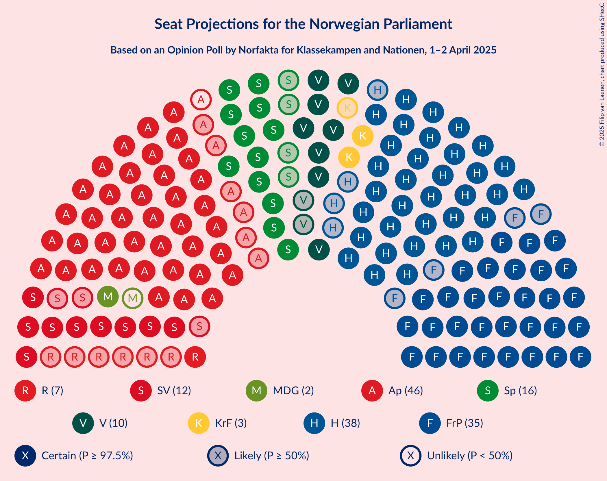
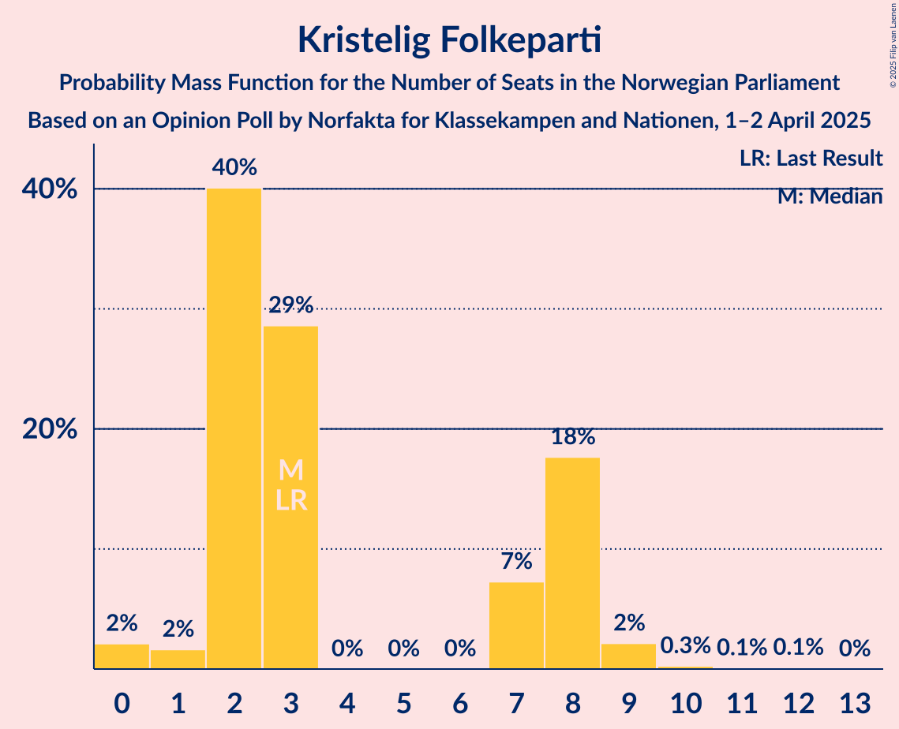
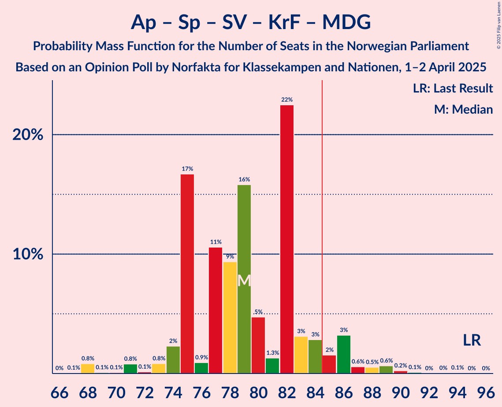

# Opinion Poll by Norfakta for Klassekampen and Nationen, 1–2 April 2025

<a href="#voting-intentions">Voting Intentions</a> | <a href="#seats">Seats</a> | <a href="#coalitions">Coalitions</a> | <a href="#technical-information">Technical Information</a>

## Voting Intentions

### Confidence Intervals

| Party | Last Result | Poll Result | 80% Confidence Interval | 90% Confidence Interval | 95% Confidence Interval | 99% Confidence Interval |
|:-----:|:-----------:|:-----------:|:-----------------------:|:-----------------------:|:-----------------------:|:-----------------------:|
| Arbeiderpartiet | 26.2% | 23.9% | 22.1–26.0% |21.5–26.5% |21.1–27.0% |20.2–28.0% |
| Høyre | 20.4% | 21.5% | 19.7–23.5% |19.2–24.0% |18.8–24.5% |18.0–25.5% |
| Fremskrittspartiet | 11.6% | 19.2% | 17.5–21.1% |17.1–21.7% |16.6–22.1% |15.9–23.1% |
| Senterpartiet | 13.5% | 8.4% | 7.2–9.8% |6.9–10.2% |6.6–10.5% |6.1–11.2% |
| Sosialistisk Venstreparti | 7.6% | 6.7% | 5.7–8.0% |5.4–8.4% |5.2–8.7% |4.7–9.3% |
| Venstre | 4.6% | 5.3% | 4.4–6.5% |4.2–6.8% |3.9–7.1% |3.6–7.7% |
| Rødt | 4.7% | 4.1% | 3.3–5.1% |3.1–5.4% |2.9–5.7% |2.5–6.2% |
| Kristelig Folkeparti | 3.8% | 3.5% | 2.8–4.5% |2.6–4.8% |2.5–5.1% |2.2–5.6% |
| Miljøpartiet De Grønne | 3.9% | 3.0% | 2.4–4.0% |2.2–4.3% |2.0–4.5% |1.8–5.0% |
| Norgesdemokratene | 1.1% | 1.5% | 1.1–2.2% |1.0–2.5% |0.9–2.6% |0.7–3.0% |
| Industri- og Næringspartiet | 0.3% | 1.1% | 0.8–1.8% |0.7–2.0% |0.6–2.1% |0.5–2.5% |
| Konservativt | 0.4% | 0.9% | 0.6–1.5% |0.5–1.7% |0.4–1.8% |0.3–2.2% |
| Folkets parti | 0.1% | 0.1% | 0.1–0.5% |0.0–0.6% |0.0–0.7% |0.0–0.9% |

*Note:* The poll result column reflects the actual value used in the calculations. Published results may vary slightly, and in addition be rounded to fewer digits.

## Seats

### Confidence Intervals

| Party | Last Result | Median | 80% Confidence Interval | 90% Confidence Interval | 95% Confidence Interval | 99% Confidence Interval |
|:-----:|:-----------:|:------:|:-----------------------:|:-----------------------:|:-----------------------:|:-----------------------:|
| <a href="#arbeiderpartiet">Arbeiderpartiet</a> | 48 | 43 | 41–48 |41–48 |40–50 |38–52 |
| <a href="#høyre">Høyre</a> | 36 | 39 | 34–42 |32–43 |32–44 |32–46 |
| <a href="#fremskrittspartiet">Fremskrittspartiet</a> | 21 | 35 | 34–38 |31–40 |30–41 |29–43 |
| <a href="#senterpartiet">Senterpartiet</a> | 28 | 16 | 14–18 |12–19 |12–19 |11–22 |
| <a href="#sosialistisk-venstreparti">Sosialistisk Venstreparti</a> | 13 | 12 | 11–13 |10–14 |9–16 |8–18 |
| <a href="#venstre">Venstre</a> | 8 | 10 | 8–12 |8–12 |8–13 |3–15 |
| <a href="#rødt">Rødt</a> | 8 | 9 | 1–11 |1–11 |1–11 |1–11 |
| <a href="#kristelig-folkeparti">Kristelig Folkeparti</a> | 3 | 3 | 2–7 |2–8 |0–8 |0–9 |
| <a href="#miljøpartiet-de-grønne">Miljøpartiet De Grønne</a> | 3 | 2 | 1–3 |1–8 |1–8 |1–8 |
| <a href="#norgesdemokratene">Norgesdemokratene</a> | 0 | 0 | 0 |0 |0 |0 |
| <a href="#industri--og-næringspartiet">Industri- og Næringspartiet</a> | 0 | 0 | 0 |0 |0 |0 |
| <a href="#konservativt">Konservativt</a> | 0 | 0 | 0 |0 |0 |0 |
| <a href="#folkets-parti">Folkets parti</a> | 0 | 0 | 0 |0 |0 |0 |

### Arbeiderpartiet

*For a full overview of the results for this party, see the [Arbeiderpartiet](party-arbeiderpartiet.html) page.*

| Number of Seats | Probability | Accumulated | Special Marks |
|:---------------:|:-----------:|:-----------:|:-------------:|
| 36 | 0% | 100% |  |
| 37 | 0.3% | 99.9% |  |
| 38 | 0.4% | 99.6% |  |
| 39 | 0.3% | 99.2% |  |
| 40 | 2% | 99.0% |  |
| 41 | 34% | 97% |  |
| 42 | 12% | 63% |  |
| 43 | 12% | 51% | Median |
| 44 | 1.3% | 39% |  |
| 45 | 2% | 38% |  |
| 46 | 3% | 36% |  |
| 47 | 8% | 33% |  |
| 48 | 20% | 24% | Last Result |
| 49 | 1.0% | 4% |  |
| 50 | 2% | 3% |  |
| 51 | 1.1% | 2% |  |
| 52 | 0.3% | 0.7% |  |
| 53 | 0% | 0.4% |  |
| 54 | 0.2% | 0.3% |  |
| 55 | 0.1% | 0.1% |  |
| 56 | 0% | 0% |  |

### Høyre

*For a full overview of the results for this party, see the [Høyre](party-høyre.html) page.*

| Number of Seats | Probability | Accumulated | Special Marks |
|:---------------:|:-----------:|:-----------:|:-------------:|
| 30 | 0.1% | 100% |  |
| 31 | 0.1% | 99.9% |  |
| 32 | 8% | 99.7% |  |
| 33 | 0.7% | 91% |  |
| 34 | 0.9% | 91% |  |
| 35 | 3% | 90% |  |
| 36 | 5% | 87% | Last Result |
| 37 | 3% | 82% |  |
| 38 | 22% | 79% |  |
| 39 | 36% | 57% | Median |
| 40 | 2% | 21% |  |
| 41 | 9% | 19% |  |
| 42 | 1.1% | 10% |  |
| 43 | 6% | 9% |  |
| 44 | 0.7% | 3% |  |
| 45 | 1.3% | 2% |  |
| 46 | 0.9% | 1.2% |  |
| 47 | 0.2% | 0.3% |  |
| 48 | 0% | 0.1% |  |
| 49 | 0% | 0% |  |

### Fremskrittspartiet

*For a full overview of the results for this party, see the [Fremskrittspartiet](party-fremskrittspartiet.html) page.*

| Number of Seats | Probability | Accumulated | Special Marks |
|:---------------:|:-----------:|:-----------:|:-------------:|
| 21 | 0% | 100% | Last Result |
| 22 | 0% | 100% |  |
| 23 | 0% | 100% |  |
| 24 | 0% | 100% |  |
| 25 | 0% | 100% |  |
| 26 | 0% | 100% |  |
| 27 | 0% | 100% |  |
| 28 | 0.1% | 100% |  |
| 29 | 0.9% | 99.9% |  |
| 30 | 2% | 99.0% |  |
| 31 | 3% | 97% |  |
| 32 | 1.5% | 94% |  |
| 33 | 2% | 93% |  |
| 34 | 23% | 91% |  |
| 35 | 38% | 68% | Median |
| 36 | 1.4% | 30% |  |
| 37 | 11% | 29% |  |
| 38 | 11% | 18% |  |
| 39 | 1.1% | 7% |  |
| 40 | 2% | 6% |  |
| 41 | 1.1% | 3% |  |
| 42 | 1.3% | 2% |  |
| 43 | 0.9% | 1.2% |  |
| 44 | 0.1% | 0.2% |  |
| 45 | 0.1% | 0.1% |  |
| 46 | 0% | 0% |  |

### Senterpartiet

*For a full overview of the results for this party, see the [Senterpartiet](party-senterpartiet.html) page.*

| Number of Seats | Probability | Accumulated | Special Marks |
|:---------------:|:-----------:|:-----------:|:-------------:|
| 10 | 0.4% | 100% |  |
| 11 | 0.5% | 99.6% |  |
| 12 | 5% | 99.1% |  |
| 13 | 3% | 94% |  |
| 14 | 3% | 91% |  |
| 15 | 23% | 88% |  |
| 16 | 34% | 65% | Median |
| 17 | 12% | 31% |  |
| 18 | 9% | 19% |  |
| 19 | 8% | 10% |  |
| 20 | 0.1% | 1.3% |  |
| 21 | 0.3% | 1.2% |  |
| 22 | 0.8% | 0.9% |  |
| 23 | 0% | 0% |  |
| 24 | 0% | 0% |  |
| 25 | 0% | 0% |  |
| 26 | 0% | 0% |  |
| 27 | 0% | 0% |  |
| 28 | 0% | 0% | Last Result |

### Sosialistisk Venstreparti

*For a full overview of the results for this party, see the [Sosialistisk Venstreparti](party-sosialistiskvenstreparti.html) page.*

| Number of Seats | Probability | Accumulated | Special Marks |
|:---------------:|:-----------:|:-----------:|:-------------:|
| 8 | 0.9% | 100% |  |
| 9 | 2% | 99.0% |  |
| 10 | 2% | 97% |  |
| 11 | 22% | 95% |  |
| 12 | 50% | 73% | Median |
| 13 | 16% | 23% | Last Result |
| 14 | 3% | 8% |  |
| 15 | 2% | 5% |  |
| 16 | 2% | 3% |  |
| 17 | 0.2% | 0.8% |  |
| 18 | 0.5% | 0.6% |  |
| 19 | 0% | 0.1% |  |
| 20 | 0.1% | 0.1% |  |
| 21 | 0% | 0% |  |

### Venstre

*For a full overview of the results for this party, see the [Venstre](party-venstre.html) page.*

| Number of Seats | Probability | Accumulated | Special Marks |
|:---------------:|:-----------:|:-----------:|:-------------:|
| 2 | 0.1% | 100% |  |
| 3 | 1.3% | 99.9% |  |
| 4 | 0% | 98.6% |  |
| 5 | 0% | 98.6% |  |
| 6 | 0% | 98.6% |  |
| 7 | 0.6% | 98.6% |  |
| 8 | 21% | 98% | Last Result |
| 9 | 15% | 77% |  |
| 10 | 43% | 62% | Median |
| 11 | 5% | 19% |  |
| 12 | 9% | 14% |  |
| 13 | 4% | 5% |  |
| 14 | 0.4% | 1.3% |  |
| 15 | 0.8% | 0.8% |  |
| 16 | 0% | 0% |  |

### Rødt

*For a full overview of the results for this party, see the [Rødt](party-rødt.html) page.*

| Number of Seats | Probability | Accumulated | Special Marks |
|:---------------:|:-----------:|:-----------:|:-------------:|
| 1 | 24% | 100% |  |
| 2 | 0.2% | 76% |  |
| 3 | 0% | 75% |  |
| 4 | 0% | 75% |  |
| 5 | 0% | 75% |  |
| 6 | 0.4% | 75% |  |
| 7 | 3% | 75% |  |
| 8 | 13% | 73% | Last Result |
| 9 | 40% | 60% | Median |
| 10 | 2% | 20% |  |
| 11 | 17% | 17% |  |
| 12 | 0.1% | 0.2% |  |
| 13 | 0% | 0% |  |

### Kristelig Folkeparti

*For a full overview of the results for this party, see the [Kristelig Folkeparti](party-kristeligfolkeparti.html) page.*

| Number of Seats | Probability | Accumulated | Special Marks |
|:---------------:|:-----------:|:-----------:|:-------------:|
| 0 | 4% | 100% |  |
| 1 | 1.1% | 96% |  |
| 2 | 34% | 95% |  |
| 3 | 44% | 61% | Last Result, Median |
| 4 | 0% | 16% |  |
| 5 | 0% | 16% |  |
| 6 | 0% | 16% |  |
| 7 | 10% | 16% |  |
| 8 | 4% | 6% |  |
| 9 | 2% | 2% |  |
| 10 | 0.2% | 0.5% |  |
| 11 | 0% | 0.3% |  |
| 12 | 0.3% | 0.3% |  |
| 13 | 0% | 0% |  |

### Miljøpartiet De Grønne

*For a full overview of the results for this party, see the [Miljøpartiet De Grønne](party-miljøpartietdegrønne.html) page.*

| Number of Seats | Probability | Accumulated | Special Marks |
|:---------------:|:-----------:|:-----------:|:-------------:|
| 0 | 0.1% | 100% |  |
| 1 | 15% | 99.9% |  |
| 2 | 42% | 85% | Median |
| 3 | 37% | 43% | Last Result |
| 4 | 0.1% | 7% |  |
| 5 | 0% | 6% |  |
| 6 | 0% | 6% |  |
| 7 | 1.2% | 6% |  |
| 8 | 5% | 5% |  |
| 9 | 0.4% | 0.5% |  |
| 10 | 0.1% | 0.1% |  |
| 11 | 0% | 0% |  |

### Norgesdemokratene

*For a full overview of the results for this party, see the [Norgesdemokratene](party-norgesdemokratene.html) page.*

| Number of Seats | Probability | Accumulated | Special Marks |
|:---------------:|:-----------:|:-----------:|:-------------:|
| 0 | 100% | 100% | Last Result, Median |

### Industri- og Næringspartiet

*For a full overview of the results for this party, see the [Industri- og Næringspartiet](party-industri-ognæringspartiet.html) page.*

| Number of Seats | Probability | Accumulated | Special Marks |
|:---------------:|:-----------:|:-----------:|:-------------:|
| 0 | 99.8% | 100% | Last Result, Median |
| 1 | 0% | 0.2% |  |
| 2 | 0.1% | 0.1% |  |
| 3 | 0% | 0% |  |

### Konservativt

*For a full overview of the results for this party, see the [Konservativt](party-konservativt.html) page.*

| Number of Seats | Probability | Accumulated | Special Marks |
|:---------------:|:-----------:|:-----------:|:-------------:|
| 0 | 100% | 100% | Last Result, Median |

### Folkets parti

*For a full overview of the results for this party, see the [Folkets parti](party-folketsparti.html) page.*

| Number of Seats | Probability | Accumulated | Special Marks |
|:---------------:|:-----------:|:-----------:|:-------------:|
| 0 | 100% | 100% | Last Result, Median |

## Coalitions

### Confidence Intervals

| Coalition | Last Result | Median | Majority? | 80% Confidence Interval | 90% Confidence Interval | 95% Confidence Interval | 99% Confidence Interval |
|:---------:|:-----------:|:------:|:---------:|:-----------------------:|:-----------------------:|:-----------------------:|:-----------------------:|
| Høyre – Fremskrittspartiet – Senterpartiet – Venstre – Kristelig Folkeparti | 96 | 103 | 100% | 97–109 | 97–109 | 97–109 | 94–112 |
| Høyre – Fremskrittspartiet – Venstre – Kristelig Folkeparti – Miljøpartiet De Grønne | 71 | 90 | 79% | 84–94 | 84–95 | 83–96 | 82–99 |
| Høyre – Fremskrittspartiet – Venstre – Kristelig Folkeparti | 68 | 87 | 74% | 82–92 | 82–93 | 81–93 | 80–96 |
| Høyre – Fremskrittspartiet – Venstre | 65 | 84 | 23% | 79–90 | 79–90 | 79–91 | 76–93 |
| Arbeiderpartiet – Senterpartiet – Sosialistisk Venstreparti – Rødt – Miljøpartiet De Grønne | 100 | 81 | 25% | 76–87 | 75–87 | 75–88 | 73–89 |
| Arbeiderpartiet – Senterpartiet – Sosialistisk Venstreparti – Rødt | 97 | 78 | 21% | 74–85 | 74–85 | 73–86 | 70–87 |
| Arbeiderpartiet – Senterpartiet – Sosialistisk Venstreparti – Kristelig Folkeparti – Miljøpartiet De Grønne | 95 | 77 | 7% | 75–83 | 74–85 | 71–86 | 68–90 |
| Arbeiderpartiet – Senterpartiet – Sosialistisk Venstreparti – Miljøpartiet De Grønne | 92 | 75 | 0.5% | 72–79 | 70–82 | 68–84 | 66–84 |
| Høyre – Fremskrittspartiet | 57 | 74 | 0.1% | 70–78 | 70–80 | 70–81 | 67–83 |
| Arbeiderpartiet – Senterpartiet – Sosialistisk Venstreparti | 89 | 73 | 0.3% | 69–76 | 67–77 | 66–79 | 64–80 |
| Arbeiderpartiet – Senterpartiet – Kristelig Folkeparti – Miljøpartiet De Grønne | 82 | 64 | 0% | 63–70 | 61–73 | 58–75 | 58–77 |
| Arbeiderpartiet – Sosialistisk Venstreparti – Rødt – Miljøpartiet De Grønne | 72 | 65 | 0% | 59–72 | 59–72 | 59–72 | 57–75 |
| Arbeiderpartiet – Senterpartiet – Kristelig Folkeparti | 79 | 62 | 0% | 60–68 | 59–68 | 57–71 | 56–75 |
| Arbeiderpartiet – Senterpartiet | 76 | 60 | 0% | 57–65 | 55–65 | 55–67 | 52–69 |
| Arbeiderpartiet – Sosialistisk Venstreparti | 61 | 55 | 0% | 53–60 | 53–61 | 53–64 | 50–65 |
| Høyre – Venstre – Kristelig Folkeparti | 47 | 52 | 0% | 48–55 | 47–57 | 46–58 | 44–63 |
| Senterpartiet – Venstre – Kristelig Folkeparti | 39 | 29 | 0% | 25–35 | 25–35 | 24–35 | 20–37 |

### Høyre – Fremskrittspartiet – Senterpartiet – Venstre – Kristelig Folkeparti

| Number of Seats | Probability | Accumulated | Special Marks |
|:---------------:|:-----------:|:-----------:|:-------------:|
| 92 | 0.1% | 100% |  |
| 93 | 0% | 99.9% |  |
| 94 | 0.4% | 99.8% |  |
| 95 | 0.2% | 99.4% |  |
| 96 | 0.3% | 99.2% | Last Result |
| 97 | 17% | 98.9% |  |
| 98 | 0.8% | 82% |  |
| 99 | 5% | 81% |  |
| 100 | 3% | 76% |  |
| 101 | 2% | 73% |  |
| 102 | 4% | 72% |  |
| 103 | 34% | 68% | Median |
| 104 | 2% | 33% |  |
| 105 | 12% | 31% |  |
| 106 | 1.5% | 19% |  |
| 107 | 4% | 17% |  |
| 108 | 3% | 13% |  |
| 109 | 8% | 10% |  |
| 110 | 1.4% | 2% |  |
| 111 | 0.1% | 0.7% |  |
| 112 | 0.1% | 0.6% |  |
| 113 | 0.4% | 0.5% |  |
| 114 | 0% | 0.1% |  |
| 115 | 0% | 0% |  |

### Høyre – Fremskrittspartiet – Venstre – Kristelig Folkeparti – Miljøpartiet De Grønne

| Number of Seats | Probability | Accumulated | Special Marks |
|:---------------:|:-----------:|:-----------:|:-------------:|
| 71 | 0% | 100% | Last Result |
| 72 | 0% | 100% |  |
| 73 | 0% | 100% |  |
| 74 | 0% | 100% |  |
| 75 | 0% | 100% |  |
| 76 | 0% | 100% |  |
| 77 | 0% | 100% |  |
| 78 | 0% | 100% |  |
| 79 | 0% | 100% |  |
| 80 | 0% | 100% |  |
| 81 | 0.4% | 100% |  |
| 82 | 0.2% | 99.5% |  |
| 83 | 4% | 99.4% |  |
| 84 | 17% | 96% |  |
| 85 | 0.3% | 79% | Majority |
| 86 | 0.5% | 78% |  |
| 87 | 1.0% | 78% |  |
| 88 | 11% | 77% |  |
| 89 | 5% | 66% | Median |
| 90 | 33% | 62% |  |
| 91 | 4% | 29% |  |
| 92 | 4% | 24% |  |
| 93 | 5% | 21% |  |
| 94 | 10% | 16% |  |
| 95 | 3% | 6% |  |
| 96 | 0.4% | 3% |  |
| 97 | 1.3% | 2% |  |
| 98 | 0.4% | 0.9% |  |
| 99 | 0.1% | 0.5% |  |
| 100 | 0.2% | 0.4% |  |
| 101 | 0% | 0.2% |  |
| 102 | 0.1% | 0.2% |  |
| 103 | 0% | 0% |  |

### Høyre – Fremskrittspartiet – Venstre – Kristelig Folkeparti

| Number of Seats | Probability | Accumulated | Special Marks |
|:---------------:|:-----------:|:-----------:|:-------------:|
| 68 | 0% | 100% | Last Result |
| 69 | 0% | 100% |  |
| 70 | 0% | 100% |  |
| 71 | 0% | 100% |  |
| 72 | 0% | 100% |  |
| 73 | 0% | 100% |  |
| 74 | 0% | 100% |  |
| 75 | 0% | 100% |  |
| 76 | 0% | 100% |  |
| 77 | 0% | 100% |  |
| 78 | 0.3% | 100% |  |
| 79 | 0.1% | 99.7% |  |
| 80 | 0.3% | 99.6% |  |
| 81 | 4% | 99.2% |  |
| 82 | 17% | 95% |  |
| 83 | 1.2% | 79% |  |
| 84 | 3% | 77% |  |
| 85 | 1.0% | 74% | Majority |
| 86 | 11% | 73% |  |
| 87 | 36% | 63% | Median |
| 88 | 4% | 26% |  |
| 89 | 0.7% | 23% |  |
| 90 | 4% | 22% |  |
| 91 | 2% | 18% |  |
| 92 | 11% | 16% |  |
| 93 | 3% | 6% |  |
| 94 | 0.4% | 2% |  |
| 95 | 1.3% | 2% |  |
| 96 | 0.2% | 0.6% |  |
| 97 | 0.1% | 0.3% |  |
| 98 | 0.2% | 0.3% |  |
| 99 | 0.1% | 0.1% |  |
| 100 | 0% | 0% |  |

### Høyre – Fremskrittspartiet – Venstre

| Number of Seats | Probability | Accumulated | Special Marks |
|:---------------:|:-----------:|:-----------:|:-------------:|
| 65 | 0% | 100% | Last Result |
| 66 | 0% | 100% |  |
| 67 | 0% | 100% |  |
| 68 | 0% | 100% |  |
| 69 | 0% | 100% |  |
| 70 | 0% | 100% |  |
| 71 | 0% | 100% |  |
| 72 | 0% | 100% |  |
| 73 | 0% | 100% |  |
| 74 | 0.3% | 100% |  |
| 75 | 0.2% | 99.7% |  |
| 76 | 0.4% | 99.5% |  |
| 77 | 0.4% | 99.1% |  |
| 78 | 0.7% | 98.7% |  |
| 79 | 9% | 98% |  |
| 80 | 17% | 89% |  |
| 81 | 6% | 72% |  |
| 82 | 4% | 66% |  |
| 83 | 3% | 62% |  |
| 84 | 36% | 59% | Median |
| 85 | 3% | 23% | Majority |
| 86 | 2% | 20% |  |
| 87 | 2% | 18% |  |
| 88 | 2% | 16% |  |
| 89 | 2% | 14% |  |
| 90 | 8% | 12% |  |
| 91 | 2% | 3% |  |
| 92 | 0.4% | 1.4% |  |
| 93 | 0.8% | 1.0% |  |
| 94 | 0% | 0.2% |  |
| 95 | 0% | 0.1% |  |
| 96 | 0.1% | 0.1% |  |
| 97 | 0% | 0% |  |

### Arbeiderpartiet – Senterpartiet – Sosialistisk Venstreparti – Rødt – Miljøpartiet De Grønne

| Number of Seats | Probability | Accumulated | Special Marks |
|:---------------:|:-----------:|:-----------:|:-------------:|
| 70 | 0.2% | 100% |  |
| 71 | 0.1% | 99.8% |  |
| 72 | 0.1% | 99.7% |  |
| 73 | 1.3% | 99.6% |  |
| 74 | 0.4% | 98% |  |
| 75 | 3% | 98% |  |
| 76 | 8% | 95% |  |
| 77 | 3% | 87% |  |
| 78 | 3% | 84% |  |
| 79 | 2% | 80% |  |
| 80 | 0.8% | 78% |  |
| 81 | 36% | 77% |  |
| 82 | 4% | 41% | Median |
| 83 | 11% | 37% |  |
| 84 | 0.8% | 26% |  |
| 85 | 3% | 25% | Majority |
| 86 | 1.1% | 22% |  |
| 87 | 17% | 21% |  |
| 88 | 4% | 5% |  |
| 89 | 0.3% | 0.7% |  |
| 90 | 0.1% | 0.4% |  |
| 91 | 0.3% | 0.3% |  |
| 92 | 0% | 0% |  |
| 93 | 0% | 0% |  |
| 94 | 0% | 0% |  |
| 95 | 0% | 0% |  |
| 96 | 0% | 0% |  |
| 97 | 0% | 0% |  |
| 98 | 0% | 0% |  |
| 99 | 0% | 0% |  |
| 100 | 0% | 0% | Last Result |

### Arbeiderpartiet – Senterpartiet – Sosialistisk Venstreparti – Rødt

| Number of Seats | Probability | Accumulated | Special Marks |
|:---------------:|:-----------:|:-----------:|:-------------:|
| 66 | 0.1% | 100% |  |
| 67 | 0% | 99.8% |  |
| 68 | 0.2% | 99.8% |  |
| 69 | 0.1% | 99.7% |  |
| 70 | 0.2% | 99.5% |  |
| 71 | 1.4% | 99.4% |  |
| 72 | 0.4% | 98% |  |
| 73 | 1.5% | 98% |  |
| 74 | 11% | 96% |  |
| 75 | 0.8% | 85% |  |
| 76 | 4% | 84% |  |
| 77 | 6% | 79% |  |
| 78 | 35% | 74% |  |
| 79 | 0.6% | 39% |  |
| 80 | 5% | 38% | Median |
| 81 | 11% | 34% |  |
| 82 | 0.9% | 23% |  |
| 83 | 0.5% | 22% |  |
| 84 | 0.3% | 21% |  |
| 85 | 17% | 21% | Majority |
| 86 | 4% | 4% |  |
| 87 | 0.2% | 0.6% |  |
| 88 | 0.4% | 0.5% |  |
| 89 | 0% | 0% |  |
| 90 | 0% | 0% |  |
| 91 | 0% | 0% |  |
| 92 | 0% | 0% |  |
| 93 | 0% | 0% |  |
| 94 | 0% | 0% |  |
| 95 | 0% | 0% |  |
| 96 | 0% | 0% |  |
| 97 | 0% | 0% | Last Result |

### Arbeiderpartiet – Senterpartiet – Sosialistisk Venstreparti – Kristelig Folkeparti – Miljøpartiet De Grønne

| Number of Seats | Probability | Accumulated | Special Marks |
|:---------------:|:-----------:|:-----------:|:-------------:|
| 67 | 0.1% | 100% |  |
| 68 | 2% | 99.9% |  |
| 69 | 0.1% | 98% |  |
| 70 | 0.1% | 98% |  |
| 71 | 1.3% | 98% |  |
| 72 | 0.2% | 97% |  |
| 73 | 0.9% | 97% |  |
| 74 | 2% | 96% |  |
| 75 | 34% | 94% |  |
| 76 | 0.7% | 60% | Median |
| 77 | 11% | 59% |  |
| 78 | 18% | 49% |  |
| 79 | 6% | 30% |  |
| 80 | 2% | 24% |  |
| 81 | 2% | 22% |  |
| 82 | 10% | 20% |  |
| 83 | 1.0% | 10% |  |
| 84 | 3% | 9% |  |
| 85 | 2% | 7% | Majority |
| 86 | 3% | 5% |  |
| 87 | 0.3% | 2% |  |
| 88 | 0.6% | 2% |  |
| 89 | 0.4% | 1.1% |  |
| 90 | 0.4% | 0.7% |  |
| 91 | 0.2% | 0.3% |  |
| 92 | 0% | 0.1% |  |
| 93 | 0.1% | 0.1% |  |
| 94 | 0% | 0% |  |
| 95 | 0% | 0% | Last Result |

### Arbeiderpartiet – Senterpartiet – Sosialistisk Venstreparti – Miljøpartiet De Grønne

| Number of Seats | Probability | Accumulated | Special Marks |
|:---------------:|:-----------:|:-----------:|:-------------:|
| 61 | 0.1% | 100% |  |
| 62 | 0% | 99.9% |  |
| 63 | 0% | 99.9% |  |
| 64 | 0% | 99.9% |  |
| 65 | 0.3% | 99.9% |  |
| 66 | 2% | 99.6% |  |
| 67 | 0.2% | 98% |  |
| 68 | 1.3% | 98% |  |
| 69 | 1.1% | 97% |  |
| 70 | 1.0% | 95% |  |
| 71 | 2% | 94% |  |
| 72 | 34% | 93% |  |
| 73 | 3% | 59% | Median |
| 74 | 4% | 56% |  |
| 75 | 16% | 52% |  |
| 76 | 20% | 36% |  |
| 77 | 1.3% | 16% |  |
| 78 | 2% | 15% |  |
| 79 | 4% | 13% |  |
| 80 | 1.2% | 9% |  |
| 81 | 3% | 8% |  |
| 82 | 2% | 5% |  |
| 83 | 0% | 3% |  |
| 84 | 2% | 3% |  |
| 85 | 0.1% | 0.5% | Majority |
| 86 | 0.1% | 0.4% |  |
| 87 | 0% | 0.3% |  |
| 88 | 0.2% | 0.3% |  |
| 89 | 0% | 0.1% |  |
| 90 | 0.1% | 0.1% |  |
| 91 | 0% | 0% |  |
| 92 | 0% | 0% | Last Result |

### Høyre – Fremskrittspartiet

| Number of Seats | Probability | Accumulated | Special Marks |
|:---------------:|:-----------:|:-----------:|:-------------:|
| 57 | 0% | 100% | Last Result |
| 58 | 0% | 100% |  |
| 59 | 0% | 100% |  |
| 60 | 0% | 100% |  |
| 61 | 0% | 100% |  |
| 62 | 0% | 100% |  |
| 63 | 0% | 100% |  |
| 64 | 0% | 100% |  |
| 65 | 0.3% | 100% |  |
| 66 | 0.1% | 99.7% |  |
| 67 | 0.3% | 99.6% |  |
| 68 | 0.3% | 99.3% |  |
| 69 | 0.7% | 98.9% |  |
| 70 | 9% | 98% |  |
| 71 | 7% | 89% |  |
| 72 | 21% | 82% |  |
| 73 | 4% | 60% |  |
| 74 | 34% | 57% | Median |
| 75 | 3% | 23% |  |
| 76 | 2% | 20% |  |
| 77 | 2% | 19% |  |
| 78 | 10% | 17% |  |
| 79 | 2% | 7% |  |
| 80 | 2% | 5% |  |
| 81 | 2% | 3% |  |
| 82 | 0.3% | 0.9% |  |
| 83 | 0.3% | 0.6% |  |
| 84 | 0.2% | 0.3% |  |
| 85 | 0% | 0.1% | Majority |
| 86 | 0% | 0.1% |  |
| 87 | 0.1% | 0.1% |  |
| 88 | 0% | 0% |  |

### Arbeiderpartiet – Senterpartiet – Sosialistisk Venstreparti

| Number of Seats | Probability | Accumulated | Special Marks |
|:---------------:|:-----------:|:-----------:|:-------------:|
| 59 | 0.1% | 100% |  |
| 60 | 0% | 99.9% |  |
| 61 | 0% | 99.9% |  |
| 62 | 0.1% | 99.9% |  |
| 63 | 0.2% | 99.8% |  |
| 64 | 0.2% | 99.6% |  |
| 65 | 2% | 99.4% |  |
| 66 | 0.2% | 98% |  |
| 67 | 3% | 97% |  |
| 68 | 1.1% | 95% |  |
| 69 | 34% | 94% |  |
| 70 | 3% | 60% |  |
| 71 | 0.6% | 57% | Median |
| 72 | 4% | 57% |  |
| 73 | 19% | 53% |  |
| 74 | 18% | 34% |  |
| 75 | 4% | 16% |  |
| 76 | 4% | 12% |  |
| 77 | 4% | 9% |  |
| 78 | 0.2% | 4% |  |
| 79 | 2% | 4% |  |
| 80 | 2% | 2% |  |
| 81 | 0.1% | 0.5% |  |
| 82 | 0% | 0.4% |  |
| 83 | 0% | 0.4% |  |
| 84 | 0% | 0.3% |  |
| 85 | 0% | 0.3% | Majority |
| 86 | 0.1% | 0.3% |  |
| 87 | 0.2% | 0.2% |  |
| 88 | 0% | 0% |  |
| 89 | 0% | 0% | Last Result |

### Arbeiderpartiet – Senterpartiet – Kristelig Folkeparti – Miljøpartiet De Grønne

| Number of Seats | Probability | Accumulated | Special Marks |
|:---------------:|:-----------:|:-----------:|:-------------:|
| 55 | 0.1% | 100% |  |
| 56 | 0% | 99.9% |  |
| 57 | 0% | 99.8% |  |
| 58 | 3% | 99.8% |  |
| 59 | 0.9% | 97% |  |
| 60 | 0.2% | 96% |  |
| 61 | 0.9% | 96% |  |
| 62 | 2% | 95% |  |
| 63 | 34% | 92% |  |
| 64 | 9% | 58% | Median |
| 65 | 2% | 50% |  |
| 66 | 1.3% | 48% |  |
| 67 | 23% | 47% |  |
| 68 | 2% | 24% |  |
| 69 | 4% | 22% |  |
| 70 | 9% | 18% |  |
| 71 | 1.2% | 9% |  |
| 72 | 2% | 8% |  |
| 73 | 1.2% | 6% |  |
| 74 | 0.5% | 5% |  |
| 75 | 3% | 4% |  |
| 76 | 0.4% | 1.1% |  |
| 77 | 0.3% | 0.8% |  |
| 78 | 0.3% | 0.4% |  |
| 79 | 0% | 0.1% |  |
| 80 | 0% | 0.1% |  |
| 81 | 0.1% | 0.1% |  |
| 82 | 0% | 0% | Last Result |

### Arbeiderpartiet – Sosialistisk Venstreparti – Rødt – Miljøpartiet De Grønne

| Number of Seats | Probability | Accumulated | Special Marks |
|:---------------:|:-----------:|:-----------:|:-------------:|
| 55 | 0.2% | 100% |  |
| 56 | 0.3% | 99.8% |  |
| 57 | 0.1% | 99.5% |  |
| 58 | 1.4% | 99.4% |  |
| 59 | 8% | 98% |  |
| 60 | 1.2% | 90% |  |
| 61 | 3% | 89% |  |
| 62 | 4% | 86% |  |
| 63 | 3% | 82% |  |
| 64 | 12% | 79% |  |
| 65 | 33% | 67% |  |
| 66 | 2% | 34% | Median |
| 67 | 4% | 32% |  |
| 68 | 1.5% | 28% |  |
| 69 | 3% | 27% |  |
| 70 | 5% | 24% |  |
| 71 | 0.8% | 19% |  |
| 72 | 17% | 18% | Last Result |
| 73 | 0.3% | 1.1% |  |
| 74 | 0.2% | 0.8% |  |
| 75 | 0.4% | 0.5% |  |
| 76 | 0% | 0.2% |  |
| 77 | 0.1% | 0.1% |  |
| 78 | 0% | 0% |  |

### Arbeiderpartiet – Senterpartiet – Kristelig Folkeparti

| Number of Seats | Probability | Accumulated | Special Marks |
|:---------------:|:-----------:|:-----------:|:-------------:|
| 53 | 0.1% | 100% |  |
| 54 | 0.1% | 99.9% |  |
| 55 | 0% | 99.8% |  |
| 56 | 0.3% | 99.7% |  |
| 57 | 4% | 99.5% |  |
| 58 | 0.3% | 96% |  |
| 59 | 0.9% | 96% |  |
| 60 | 34% | 95% |  |
| 61 | 3% | 61% |  |
| 62 | 10% | 58% | Median |
| 63 | 1.4% | 48% |  |
| 64 | 2% | 47% |  |
| 65 | 21% | 44% |  |
| 66 | 5% | 24% |  |
| 67 | 6% | 19% |  |
| 68 | 9% | 13% |  |
| 69 | 0.1% | 4% |  |
| 70 | 0.9% | 4% |  |
| 71 | 0.8% | 3% |  |
| 72 | 0.1% | 2% |  |
| 73 | 0.5% | 2% |  |
| 74 | 0.5% | 1.2% |  |
| 75 | 0.3% | 0.8% |  |
| 76 | 0.1% | 0.4% |  |
| 77 | 0.3% | 0.3% |  |
| 78 | 0% | 0% |  |
| 79 | 0% | 0% | Last Result |

### Arbeiderpartiet – Senterpartiet

| Number of Seats | Probability | Accumulated | Special Marks |
|:---------------:|:-----------:|:-----------:|:-------------:|
| 49 | 0.1% | 100% |  |
| 50 | 0.1% | 99.9% |  |
| 51 | 0.1% | 99.8% |  |
| 52 | 0.4% | 99.6% |  |
| 53 | 0.2% | 99.3% |  |
| 54 | 2% | 99.1% |  |
| 55 | 3% | 98% |  |
| 56 | 0.5% | 94% |  |
| 57 | 34% | 94% |  |
| 58 | 2% | 60% |  |
| 59 | 6% | 58% | Median |
| 60 | 9% | 52% |  |
| 61 | 10% | 42% |  |
| 62 | 1.4% | 32% |  |
| 63 | 20% | 31% |  |
| 64 | 0.7% | 11% |  |
| 65 | 7% | 10% |  |
| 66 | 0.4% | 3% |  |
| 67 | 1.3% | 3% |  |
| 68 | 0.9% | 1.4% |  |
| 69 | 0.2% | 0.6% |  |
| 70 | 0.1% | 0.4% |  |
| 71 | 0.2% | 0.3% |  |
| 72 | 0% | 0.1% |  |
| 73 | 0% | 0.1% |  |
| 74 | 0.1% | 0.1% |  |
| 75 | 0% | 0% |  |
| 76 | 0% | 0% | Last Result |

### Arbeiderpartiet – Sosialistisk Venstreparti

| Number of Seats | Probability | Accumulated | Special Marks |
|:---------------:|:-----------:|:-----------:|:-------------:|
| 47 | 0.1% | 100% |  |
| 48 | 0.1% | 99.9% |  |
| 49 | 0.1% | 99.7% |  |
| 50 | 1.2% | 99.6% |  |
| 51 | 0.2% | 98% |  |
| 52 | 0.6% | 98% |  |
| 53 | 36% | 98% |  |
| 54 | 9% | 62% |  |
| 55 | 5% | 52% | Median |
| 56 | 8% | 48% |  |
| 57 | 2% | 39% |  |
| 58 | 4% | 37% |  |
| 59 | 20% | 32% |  |
| 60 | 6% | 12% |  |
| 61 | 2% | 6% | Last Result |
| 62 | 0.6% | 4% |  |
| 63 | 0.9% | 4% |  |
| 64 | 2% | 3% |  |
| 65 | 0.2% | 0.6% |  |
| 66 | 0% | 0.4% |  |
| 67 | 0.1% | 0.3% |  |
| 68 | 0.2% | 0.3% |  |
| 69 | 0% | 0% |  |

### Høyre – Venstre – Kristelig Folkeparti

| Number of Seats | Probability | Accumulated | Special Marks |
|:---------------:|:-----------:|:-----------:|:-------------:|
| 42 | 0% | 100% |  |
| 43 | 0.2% | 99.9% |  |
| 44 | 0.4% | 99.8% |  |
| 45 | 0.4% | 99.4% |  |
| 46 | 3% | 99.0% |  |
| 47 | 2% | 96% | Last Result |
| 48 | 26% | 94% |  |
| 49 | 1.3% | 68% |  |
| 50 | 7% | 67% |  |
| 51 | 2% | 60% |  |
| 52 | 33% | 58% | Median |
| 53 | 1.0% | 25% |  |
| 54 | 3% | 24% |  |
| 55 | 13% | 22% |  |
| 56 | 3% | 8% |  |
| 57 | 1.5% | 6% |  |
| 58 | 2% | 4% |  |
| 59 | 0.5% | 2% |  |
| 60 | 0.2% | 2% |  |
| 61 | 0.1% | 1.5% |  |
| 62 | 0.1% | 1.4% |  |
| 63 | 1.1% | 1.2% |  |
| 64 | 0% | 0.1% |  |
| 65 | 0.1% | 0.1% |  |
| 66 | 0% | 0% |  |

### Senterpartiet – Venstre – Kristelig Folkeparti

| Number of Seats | Probability | Accumulated | Special Marks |
|:---------------:|:-----------:|:-----------:|:-------------:|
| 17 | 0% | 100% |  |
| 18 | 0% | 99.9% |  |
| 19 | 0% | 99.9% |  |
| 20 | 0.5% | 99.9% |  |
| 21 | 0.1% | 99.4% |  |
| 22 | 0.5% | 99.3% |  |
| 23 | 0.3% | 98.7% |  |
| 24 | 2% | 98% |  |
| 25 | 18% | 96% |  |
| 26 | 1.1% | 78% |  |
| 27 | 6% | 77% |  |
| 28 | 6% | 71% |  |
| 29 | 36% | 65% | Median |
| 30 | 4% | 29% |  |
| 31 | 8% | 25% |  |
| 32 | 2% | 17% |  |
| 33 | 2% | 15% |  |
| 34 | 3% | 14% |  |
| 35 | 9% | 11% |  |
| 36 | 0.2% | 2% |  |
| 37 | 1.0% | 1.3% |  |
| 38 | 0.3% | 0.3% |  |
| 39 | 0% | 0.1% | Last Result |
| 40 | 0% | 0% |  |

## Technical Information

### Opinion Poll

+ **Polling firm:** Norfakta
+ **Commissioner(s):** Klassekampen and Nationen
+ **Fieldwork period:** 1–2 April 2025

### Calculations

+ **Sample size:** 790
+ **Simulations done:** 1,048,576
+ **Error estimate:** 1.57%

