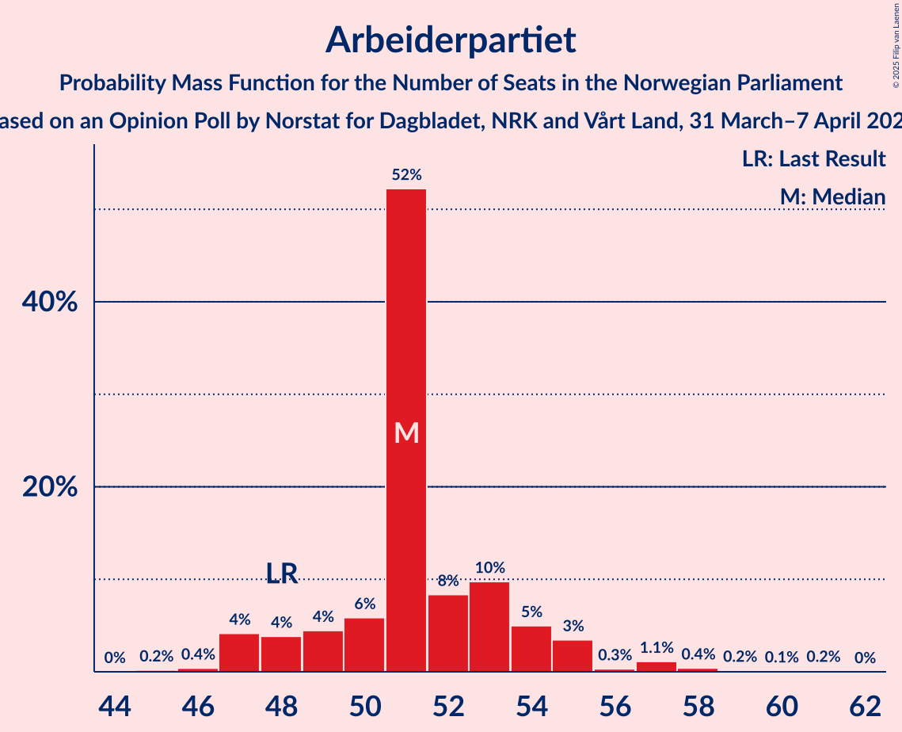
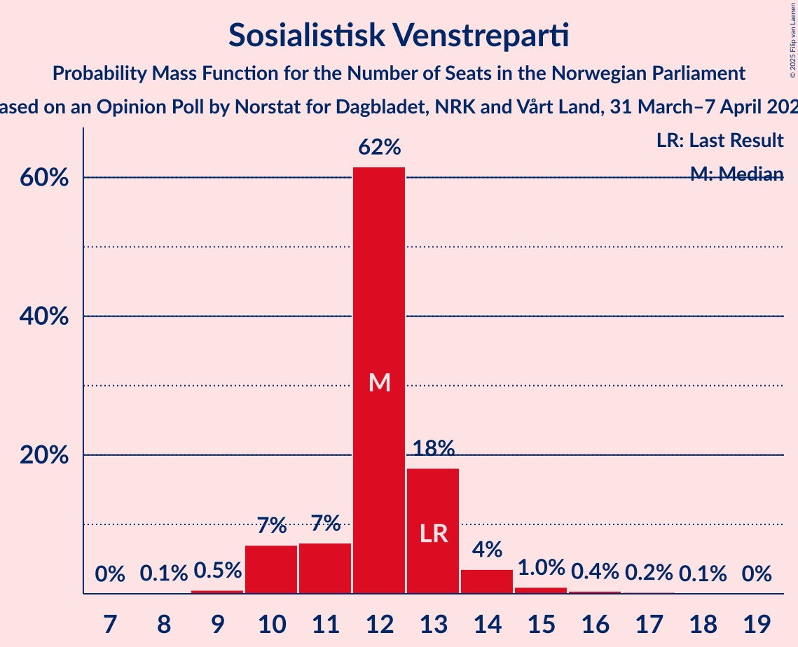
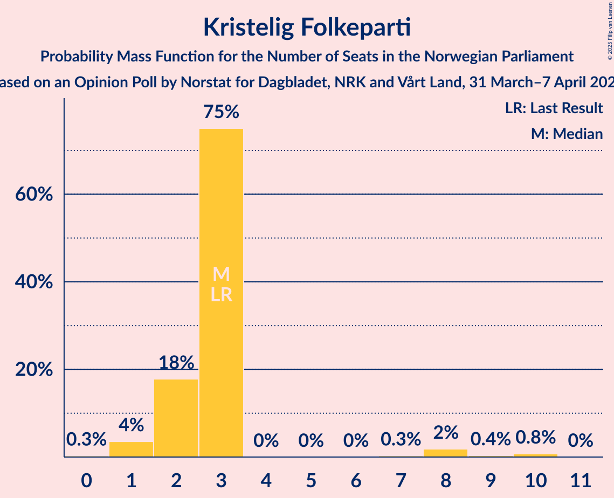
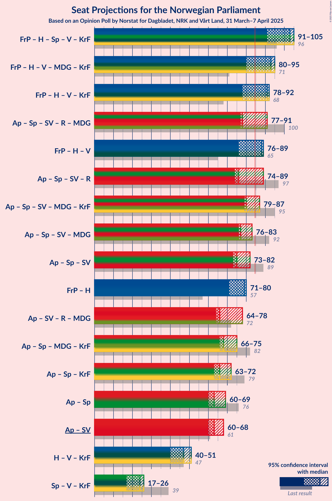
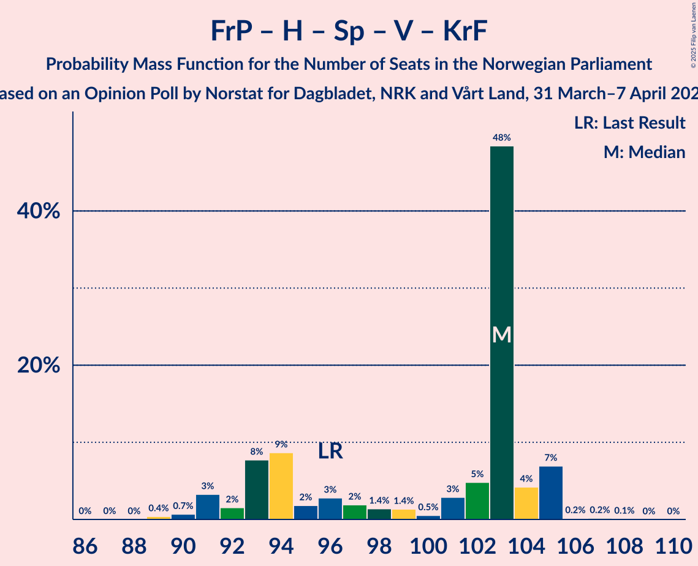
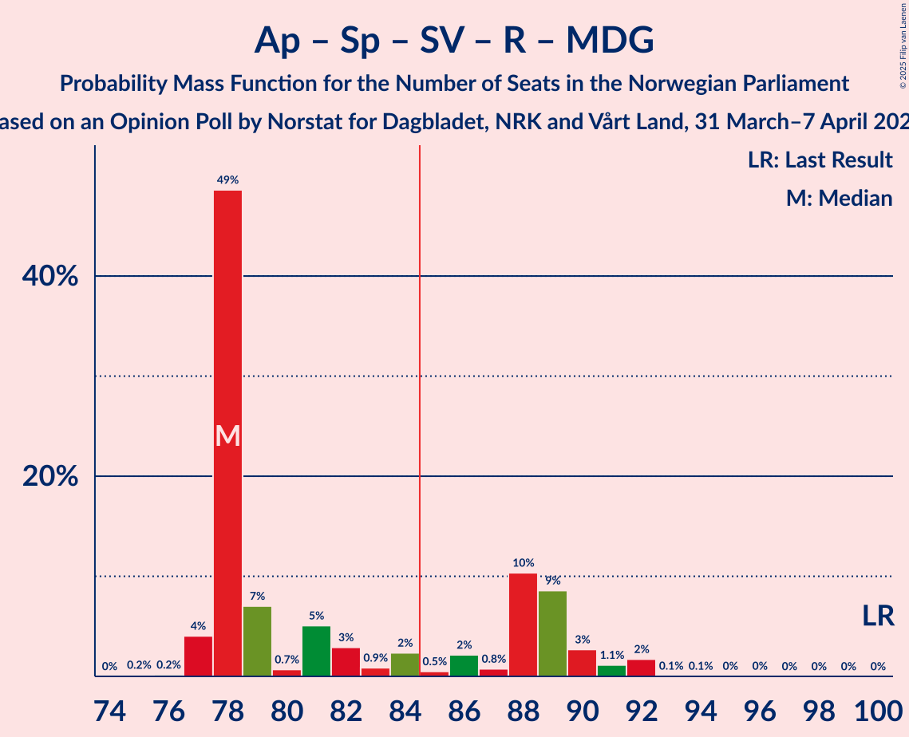
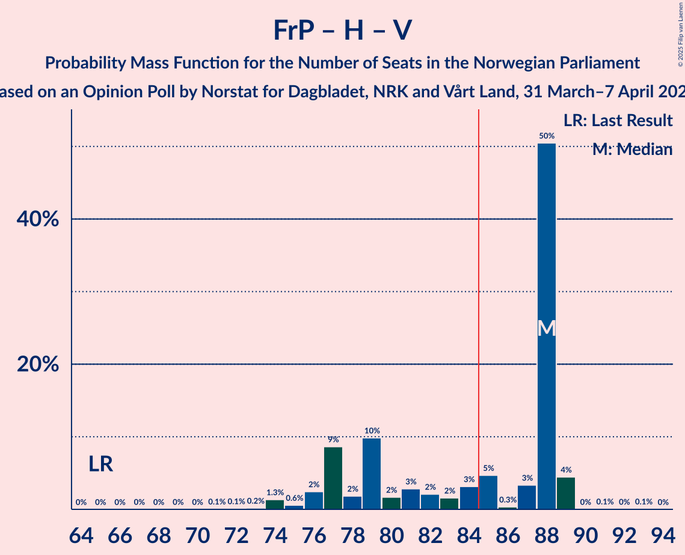
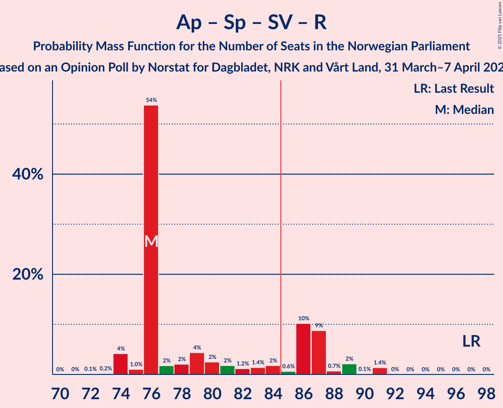
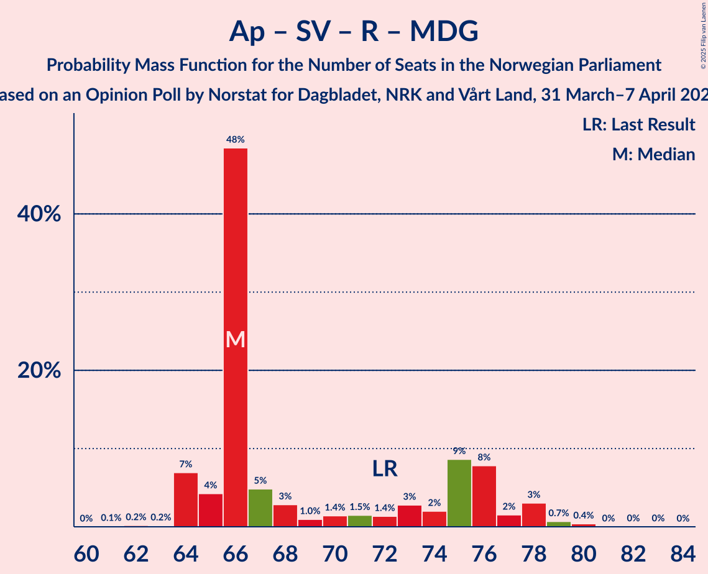
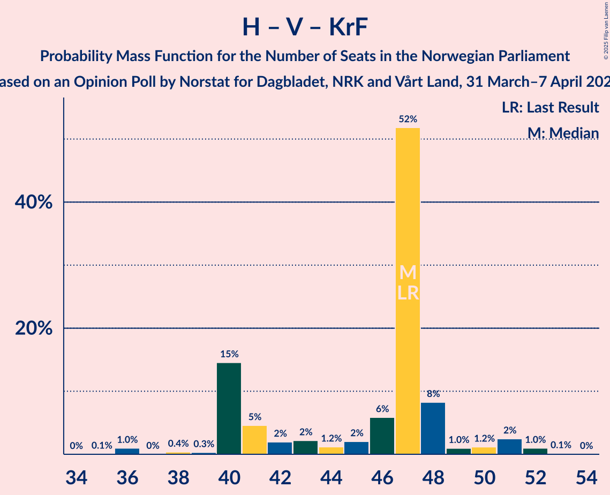

# Opinion Poll by Norstat for Dagbladet, NRK and Vårt Land, 31 March–7 April 2025

<a href="#voting-intentions">Voting Intentions</a> | <a href="#seats">Seats</a> | <a href="#coalitions">Coalitions</a> | <a href="#technical-information">Technical Information</a>

## Voting Intentions

### Confidence Intervals

| Party | Last Result | Poll Result | 80% Confidence Interval | 90% Confidence Interval | 95% Confidence Interval | 99% Confidence Interval |
|:-----:|:-----------:|:-----------:|:-----------------------:|:-----------------------:|:-----------------------:|:-----------------------:|
| Arbeiderpartiet | 26.2% | 27.9% | 26.1–29.8% |25.6–30.3% |25.2–30.7% |24.3–31.7% |
| Fremskrittspartiet | 11.6% | 21.0% | 19.4–22.8% |19.0–23.2% |18.6–23.7% |17.9–24.5% |
| Høyre | 20.4% | 18.9% | 17.4–20.6% |17.0–21.1% |16.6–21.5% |15.9–22.3% |
| Senterpartiet | 13.5% | 7.2% | 6.3–8.4% |6.0–8.7% |5.8–9.0% |5.4–9.6% |
| Sosialistisk Venstreparti | 7.6% | 6.3% | 5.4–7.5% |5.2–7.8% |5.0–8.0% |4.6–8.6% |
| Venstre | 4.6% | 3.8% | 3.1–4.7% |3.0–5.0% |2.8–5.2% |2.5–5.7% |
| Rødt | 4.7% | 3.7% | 3.0–4.6% |2.9–4.9% |2.7–5.1% |2.4–5.6% |
| Miljøpartiet De Grønne | 3.9% | 3.3% | 2.7–4.2% |2.5–4.4% |2.4–4.6% |2.1–5.1% |
| Kristelig Folkeparti | 3.8% | 3.2% | 2.6–4.1% |2.4–4.3% |2.3–4.5% |2.0–5.0% |
| Industri- og Næringspartiet | 0.3% | 1.6% | 1.2–2.3% |1.1–2.4% |1.0–2.6% |0.8–3.0% |
| Norgesdemokratene | 1.1% | 0.7% | 0.5–1.2% |0.4–1.3% |0.3–1.4% |0.3–1.7% |
| Konservativt | 0.4% | 0.7% | 0.5–1.2% |0.4–1.3% |0.3–1.4% |0.3–1.7% |
| Pensjonistpartiet | 0.6% | 0.4% | 0.2–0.8% |0.2–0.9% |0.2–1.0% |0.1–1.3% |

*Note:* The poll result column reflects the actual value used in the calculations. Published results may vary slightly, and in addition be rounded to fewer digits.

## Seats

### Confidence Intervals

| Party | Last Result | Median | 80% Confidence Interval | 90% Confidence Interval | 95% Confidence Interval | 99% Confidence Interval |
|:-----:|:-----------:|:------:|:-----------------------:|:-----------------------:|:-----------------------:|:-----------------------:|
| <a href="#arbeiderpartiet">Arbeiderpartiet</a> | 48 | 51 | 49–54 |48–55 |47–55 |46–58 |
| <a href="#fremskrittspartiet">Fremskrittspartiet</a> | 21 | 44 | 38–44 |36–44 |35–44 |34–45 |
| <a href="#høyre">Høyre</a> | 36 | 35 | 34–37 |34–39 |33–39 |31–42 |
| <a href="#senterpartiet">Senterpartiet</a> | 28 | 12 | 12–14 |12–15 |12–15 |11–17 |
| <a href="#sosialistisk-venstreparti">Sosialistisk Venstreparti</a> | 13 | 12 | 11–13 |10–14 |10–14 |9–16 |
| <a href="#venstre">Venstre</a> | 8 | 9 | 3–9 |3–9 |2–9 |2–10 |
| <a href="#rødt">Rødt</a> | 8 | 1 | 1–9 |1–9 |1–9 |1–10 |
| <a href="#miljøpartiet-de-grønne">Miljøpartiet De Grønne</a> | 3 | 2 | 1–3 |1–3 |1–7 |1–9 |
| <a href="#kristelig-folkeparti">Kristelig Folkeparti</a> | 3 | 3 | 2–3 |2–3 |1–8 |1–10 |
| <a href="#industri--og-næringspartiet">Industri- og Næringspartiet</a> | 0 | 0 | 0 |0 |0 |0–2 |
| <a href="#norgesdemokratene">Norgesdemokratene</a> | 0 | 0 | 0 |0 |0 |0 |
| <a href="#konservativt">Konservativt</a> | 0 | 0 | 0 |0 |0 |0 |
| <a href="#pensjonistpartiet">Pensjonistpartiet</a> | 0 | 0 | 0 |0 |0 |0 |

### Arbeiderpartiet

*For a full overview of the results for this party, see the [Arbeiderpartiet](party-arbeiderpartiet.html) page.*

| Number of Seats | Probability | Accumulated | Special Marks |
|:---------------:|:-----------:|:-----------:|:-------------:|
| 45 | 0.2% | 100% |  |
| 46 | 0.4% | 99.8% |  |
| 47 | 4% | 99.4% |  |
| 48 | 4% | 95% | Last Result |
| 49 | 4% | 91% |  |
| 50 | 6% | 87% |  |
| 51 | 52% | 81% | Median |
| 52 | 8% | 29% |  |
| 53 | 10% | 20% |  |
| 54 | 5% | 11% |  |
| 55 | 3% | 6% |  |
| 56 | 0.3% | 2% |  |
| 57 | 1.1% | 2% |  |
| 58 | 0.4% | 0.8% |  |
| 59 | 0.2% | 0.4% |  |
| 60 | 0.1% | 0.3% |  |
| 61 | 0.2% | 0.2% |  |
| 62 | 0% | 0% |  |

### Fremskrittspartiet

*For a full overview of the results for this party, see the [Fremskrittspartiet](party-fremskrittspartiet.html) page.*

| Number of Seats | Probability | Accumulated | Special Marks |
|:---------------:|:-----------:|:-----------:|:-------------:|
| 21 | 0% | 100% | Last Result |
| 22 | 0% | 100% |  |
| 23 | 0% | 100% |  |
| 24 | 0% | 100% |  |
| 25 | 0% | 100% |  |
| 26 | 0% | 100% |  |
| 27 | 0% | 100% |  |
| 28 | 0% | 100% |  |
| 29 | 0% | 100% |  |
| 30 | 0% | 100% |  |
| 31 | 0% | 100% |  |
| 32 | 0% | 99.9% |  |
| 33 | 0.1% | 99.9% |  |
| 34 | 2% | 99.8% |  |
| 35 | 2% | 98% |  |
| 36 | 2% | 96% |  |
| 37 | 3% | 94% |  |
| 38 | 2% | 91% |  |
| 39 | 3% | 88% |  |
| 40 | 12% | 85% |  |
| 41 | 8% | 73% |  |
| 42 | 9% | 65% |  |
| 43 | 4% | 56% |  |
| 44 | 51% | 52% | Median |
| 45 | 0.1% | 0.5% |  |
| 46 | 0.1% | 0.4% |  |
| 47 | 0.3% | 0.4% |  |
| 48 | 0% | 0% |  |

### Høyre

*For a full overview of the results for this party, see the [Høyre](party-høyre.html) page.*

| Number of Seats | Probability | Accumulated | Special Marks |
|:---------------:|:-----------:|:-----------:|:-------------:|
| 28 | 0% | 100% |  |
| 29 | 0% | 99.9% |  |
| 30 | 0.2% | 99.9% |  |
| 31 | 0.5% | 99.7% |  |
| 32 | 1.2% | 99.2% |  |
| 33 | 2% | 98% |  |
| 34 | 12% | 96% |  |
| 35 | 59% | 84% | Median |
| 36 | 10% | 25% | Last Result |
| 37 | 5% | 14% |  |
| 38 | 2% | 9% |  |
| 39 | 5% | 7% |  |
| 40 | 0.6% | 2% |  |
| 41 | 0.7% | 1.4% |  |
| 42 | 0.6% | 0.7% |  |
| 43 | 0.1% | 0.1% |  |
| 44 | 0% | 0% |  |

### Senterpartiet

*For a full overview of the results for this party, see the [Senterpartiet](party-senterpartiet.html) page.*

| Number of Seats | Probability | Accumulated | Special Marks |
|:---------------:|:-----------:|:-----------:|:-------------:|
| 9 | 0.1% | 100% |  |
| 10 | 0.2% | 99.8% |  |
| 11 | 1.3% | 99.6% |  |
| 12 | 61% | 98% | Median |
| 13 | 10% | 37% |  |
| 14 | 19% | 27% |  |
| 15 | 7% | 8% |  |
| 16 | 1.2% | 2% |  |
| 17 | 0.2% | 0.6% |  |
| 18 | 0.2% | 0.4% |  |
| 19 | 0.2% | 0.2% |  |
| 20 | 0% | 0% |  |
| 21 | 0% | 0% |  |
| 22 | 0% | 0% |  |
| 23 | 0% | 0% |  |
| 24 | 0% | 0% |  |
| 25 | 0% | 0% |  |
| 26 | 0% | 0% |  |
| 27 | 0% | 0% |  |
| 28 | 0% | 0% | Last Result |

### Sosialistisk Venstreparti

*For a full overview of the results for this party, see the [Sosialistisk Venstreparti](party-sosialistiskvenstreparti.html) page.*

| Number of Seats | Probability | Accumulated | Special Marks |
|:---------------:|:-----------:|:-----------:|:-------------:|
| 8 | 0.1% | 100% |  |
| 9 | 0.5% | 99.8% |  |
| 10 | 7% | 99.3% |  |
| 11 | 7% | 92% |  |
| 12 | 62% | 85% | Median |
| 13 | 18% | 23% | Last Result |
| 14 | 4% | 5% |  |
| 15 | 1.0% | 2% |  |
| 16 | 0.4% | 0.7% |  |
| 17 | 0.2% | 0.3% |  |
| 18 | 0.1% | 0.1% |  |
| 19 | 0% | 0% |  |

### Venstre

*For a full overview of the results for this party, see the [Venstre](party-venstre.html) page.*

| Number of Seats | Probability | Accumulated | Special Marks |
|:---------------:|:-----------:|:-----------:|:-------------:|
| 2 | 3% | 100% |  |
| 3 | 25% | 97% |  |
| 4 | 0% | 72% |  |
| 5 | 0% | 72% |  |
| 6 | 0% | 72% |  |
| 7 | 1.0% | 72% |  |
| 8 | 5% | 71% | Last Result |
| 9 | 65% | 66% | Median |
| 10 | 0.5% | 0.8% |  |
| 11 | 0.2% | 0.3% |  |
| 12 | 0.1% | 0.1% |  |
| 13 | 0% | 0% |  |

### Rødt

*For a full overview of the results for this party, see the [Rødt](party-rødt.html) page.*

| Number of Seats | Probability | Accumulated | Special Marks |
|:---------------:|:-----------:|:-----------:|:-------------:|
| 1 | 71% | 100% | Median |
| 2 | 0.5% | 29% |  |
| 3 | 0.2% | 28% |  |
| 4 | 0% | 28% |  |
| 5 | 0% | 28% |  |
| 6 | 0% | 28% |  |
| 7 | 0.5% | 28% |  |
| 8 | 13% | 28% | Last Result |
| 9 | 14% | 15% |  |
| 10 | 0.7% | 0.8% |  |
| 11 | 0.1% | 0.1% |  |
| 12 | 0% | 0% |  |

### Miljøpartiet De Grønne

*For a full overview of the results for this party, see the [Miljøpartiet De Grønne](party-miljøpartietdegrønne.html) page.*

| Number of Seats | Probability | Accumulated | Special Marks |
|:---------------:|:-----------:|:-----------:|:-------------:|
| 1 | 13% | 100% |  |
| 2 | 61% | 87% | Median |
| 3 | 23% | 26% | Last Result |
| 4 | 0.4% | 3% |  |
| 5 | 0% | 3% |  |
| 6 | 0% | 3% |  |
| 7 | 0.6% | 3% |  |
| 8 | 2% | 2% |  |
| 9 | 0.4% | 0.5% |  |
| 10 | 0.1% | 0.1% |  |
| 11 | 0% | 0% |  |

### Kristelig Folkeparti

*For a full overview of the results for this party, see the [Kristelig Folkeparti](party-kristeligfolkeparti.html) page.*

| Number of Seats | Probability | Accumulated | Special Marks |
|:---------------:|:-----------:|:-----------:|:-------------:|
| 0 | 0.3% | 100% |  |
| 1 | 4% | 99.7% |  |
| 2 | 18% | 96% |  |
| 3 | 75% | 78% | Last Result, Median |
| 4 | 0% | 3% |  |
| 5 | 0% | 3% |  |
| 6 | 0% | 3% |  |
| 7 | 0.3% | 3% |  |
| 8 | 2% | 3% |  |
| 9 | 0.4% | 1.1% |  |
| 10 | 0.8% | 0.8% |  |
| 11 | 0% | 0% |  |

### Industri- og Næringspartiet

*For a full overview of the results for this party, see the [Industri- og Næringspartiet](party-industri-ognæringspartiet.html) page.*

| Number of Seats | Probability | Accumulated | Special Marks |
|:---------------:|:-----------:|:-----------:|:-------------:|
| 0 | 98% | 100% | Last Result, Median |
| 1 | 0.8% | 2% |  |
| 2 | 1.0% | 1.0% |  |
| 3 | 0% | 0% |  |

### Norgesdemokratene

*For a full overview of the results for this party, see the [Norgesdemokratene](party-norgesdemokratene.html) page.*

| Number of Seats | Probability | Accumulated | Special Marks |
|:---------------:|:-----------:|:-----------:|:-------------:|
| 0 | 100% | 100% | Last Result, Median |

### Konservativt

*For a full overview of the results for this party, see the [Konservativt](party-konservativt.html) page.*

| Number of Seats | Probability | Accumulated | Special Marks |
|:---------------:|:-----------:|:-----------:|:-------------:|
| 0 | 100% | 100% | Last Result, Median |

### Pensjonistpartiet

*For a full overview of the results for this party, see the [Pensjonistpartiet](party-pensjonistpartiet.html) page.*

| Number of Seats | Probability | Accumulated | Special Marks |
|:---------------:|:-----------:|:-----------:|:-------------:|
| 0 | 100% | 100% | Last Result, Median |

## Coalitions

### Confidence Intervals

| Coalition | Last Result | Median | Majority? | 80% Confidence Interval | 90% Confidence Interval | 95% Confidence Interval | 99% Confidence Interval |
|:---------:|:-----------:|:------:|:---------:|:-----------------------:|:-----------------------:|:-----------------------:|:-----------------------:|
| Fremskrittspartiet – Høyre – Senterpartiet – Venstre – Kristelig Folkeparti | 96 | 103 | 100% | 93–104 | 92–105 | 91–105 | 89–105 |
| Fremskrittspartiet – Høyre – Venstre – Miljøpartiet De Grønne – Kristelig Folkeparti | 71 | 93 | 76% | 82–93 | 82–94 | 80–95 | 78–95 |
| Fremskrittspartiet – Høyre – Venstre – Kristelig Folkeparti | 68 | 91 | 71% | 80–91 | 79–91 | 78–92 | 77–92 |
| Arbeiderpartiet – Senterpartiet – Sosialistisk Venstreparti – Rødt – Miljøpartiet De Grønne | 100 | 78 | 28% | 78–89 | 78–90 | 77–91 | 77–92 |
| Fremskrittspartiet – Høyre – Venstre | 65 | 88 | 64% | 77–88 | 77–88 | 76–89 | 74–89 |
| Arbeiderpartiet – Senterpartiet – Sosialistisk Venstreparti – Rødt | 97 | 76 | 24% | 76–87 | 75–87 | 74–89 | 74–91 |
| Arbeiderpartiet – Senterpartiet – Sosialistisk Venstreparti – Miljøpartiet De Grønne – Kristelig Folkeparti | 95 | 80 | 8% | 80–84 | 79–86 | 79–87 | 76–90 |
| Arbeiderpartiet – Senterpartiet – Sosialistisk Venstreparti – Miljøpartiet De Grønne | 92 | 77 | 2% | 77–81 | 76–82 | 76–83 | 74–88 |
| Arbeiderpartiet – Senterpartiet – Sosialistisk Venstreparti | 89 | 75 | 0.5% | 75–78 | 73–80 | 73–82 | 71–84 |
| Fremskrittspartiet – Høyre | 57 | 79 | 0% | 74–79 | 73–80 | 71–80 | 68–81 |
| Arbeiderpartiet – Sosialistisk Venstreparti – Rødt – Miljøpartiet De Grønne | 72 | 66 | 0% | 65–76 | 64–77 | 64–78 | 64–79 |
| Arbeiderpartiet – Senterpartiet – Miljøpartiet De Grønne – Kristelig Folkeparti | 82 | 68 | 0% | 68–73 | 66–74 | 66–75 | 64–79 |
| Arbeiderpartiet – Senterpartiet – Kristelig Folkeparti | 79 | 66 | 0% | 65–71 | 63–71 | 63–72 | 62–76 |
| Arbeiderpartiet – Senterpartiet | 76 | 63 | 0% | 63–67 | 61–68 | 60–69 | 59–71 |
| Arbeiderpartiet – Sosialistisk Venstreparti | 61 | 63 | 0% | 61–66 | 60–67 | 60–68 | 58–72 |
| Høyre – Venstre – Kristelig Folkeparti | 47 | 47 | 0% | 40–48 | 40–49 | 40–51 | 36–52 |
| Senterpartiet – Venstre – Kristelig Folkeparti | 39 | 24 | 0% | 17–26 | 17–26 | 17–26 | 14–29 |

### Fremskrittspartiet – Høyre – Senterpartiet – Venstre – Kristelig Folkeparti

| Number of Seats | Probability | Accumulated | Special Marks |
|:---------------:|:-----------:|:-----------:|:-------------:|
| 87 | 0% | 100% |  |
| 88 | 0% | 99.9% |  |
| 89 | 0.4% | 99.9% |  |
| 90 | 0.7% | 99.5% |  |
| 91 | 3% | 98.8% |  |
| 92 | 2% | 96% |  |
| 93 | 8% | 94% |  |
| 94 | 9% | 86% |  |
| 95 | 2% | 78% |  |
| 96 | 3% | 76% | Last Result |
| 97 | 2% | 73% |  |
| 98 | 1.4% | 71% |  |
| 99 | 1.4% | 70% |  |
| 100 | 0.5% | 68% |  |
| 101 | 3% | 68% |  |
| 102 | 5% | 65% |  |
| 103 | 48% | 60% | Median |
| 104 | 4% | 12% |  |
| 105 | 7% | 7% |  |
| 106 | 0.2% | 0.4% |  |
| 107 | 0.2% | 0.3% |  |
| 108 | 0.1% | 0.1% |  |
| 109 | 0% | 0% |  |

### Fremskrittspartiet – Høyre – Venstre – Miljøpartiet De Grønne – Kristelig Folkeparti

| Number of Seats | Probability | Accumulated | Special Marks |
|:---------------:|:-----------:|:-----------:|:-------------:|
| 71 | 0% | 100% | Last Result |
| 72 | 0% | 100% |  |
| 73 | 0% | 100% |  |
| 74 | 0% | 100% |  |
| 75 | 0% | 100% |  |
| 76 | 0% | 100% |  |
| 77 | 0% | 100% |  |
| 78 | 1.4% | 100% |  |
| 79 | 0.1% | 98.6% |  |
| 80 | 2% | 98.5% |  |
| 81 | 0.7% | 96% |  |
| 82 | 9% | 96% |  |
| 83 | 10% | 87% |  |
| 84 | 0.4% | 76% |  |
| 85 | 2% | 76% | Majority |
| 86 | 0.9% | 74% |  |
| 87 | 1.1% | 73% |  |
| 88 | 2% | 72% |  |
| 89 | 3% | 70% |  |
| 90 | 4% | 67% |  |
| 91 | 2% | 63% |  |
| 92 | 2% | 61% |  |
| 93 | 54% | 59% | Median |
| 94 | 1.1% | 5% |  |
| 95 | 4% | 4% |  |
| 96 | 0.1% | 0.2% |  |
| 97 | 0.1% | 0.1% |  |
| 98 | 0% | 0% |  |

### Fremskrittspartiet – Høyre – Venstre – Kristelig Folkeparti

| Number of Seats | Probability | Accumulated | Special Marks |
|:---------------:|:-----------:|:-----------:|:-------------:|
| 68 | 0% | 100% | Last Result |
| 69 | 0% | 100% |  |
| 70 | 0% | 100% |  |
| 71 | 0% | 100% |  |
| 72 | 0% | 100% |  |
| 73 | 0% | 100% |  |
| 74 | 0% | 99.9% |  |
| 75 | 0.1% | 99.9% |  |
| 76 | 0.1% | 99.8% |  |
| 77 | 2% | 99.7% |  |
| 78 | 1.1% | 98% |  |
| 79 | 3% | 97% |  |
| 80 | 9% | 94% |  |
| 81 | 10% | 85% |  |
| 82 | 0.9% | 75% |  |
| 83 | 2% | 74% |  |
| 84 | 0.9% | 72% |  |
| 85 | 2% | 71% | Majority |
| 86 | 1.2% | 69% |  |
| 87 | 3% | 68% |  |
| 88 | 5% | 65% |  |
| 89 | 0.7% | 61% |  |
| 90 | 7% | 60% |  |
| 91 | 49% | 53% | Median |
| 92 | 4% | 4% |  |
| 93 | 0.1% | 0.3% |  |
| 94 | 0.1% | 0.2% |  |
| 95 | 0% | 0% |  |

### Arbeiderpartiet – Senterpartiet – Sosialistisk Venstreparti – Rødt – Miljøpartiet De Grønne

| Number of Seats | Probability | Accumulated | Special Marks |
|:---------------:|:-----------:|:-----------:|:-------------:|
| 75 | 0.2% | 100% |  |
| 76 | 0.2% | 99.8% |  |
| 77 | 4% | 99.7% |  |
| 78 | 49% | 96% | Median |
| 79 | 7% | 47% |  |
| 80 | 0.7% | 40% |  |
| 81 | 5% | 39% |  |
| 82 | 3% | 34% |  |
| 83 | 0.9% | 31% |  |
| 84 | 2% | 30% |  |
| 85 | 0.5% | 28% | Majority |
| 86 | 2% | 28% |  |
| 87 | 0.8% | 25% |  |
| 88 | 10% | 25% |  |
| 89 | 9% | 14% |  |
| 90 | 3% | 6% |  |
| 91 | 1.1% | 3% |  |
| 92 | 2% | 2% |  |
| 93 | 0.1% | 0.2% |  |
| 94 | 0.1% | 0.2% |  |
| 95 | 0% | 0.1% |  |
| 96 | 0% | 0.1% |  |
| 97 | 0% | 0% |  |
| 98 | 0% | 0% |  |
| 99 | 0% | 0% |  |
| 100 | 0% | 0% | Last Result |

### Fremskrittspartiet – Høyre – Venstre

| Number of Seats | Probability | Accumulated | Special Marks |
|:---------------:|:-----------:|:-----------:|:-------------:|
| 65 | 0% | 100% | Last Result |
| 66 | 0% | 100% |  |
| 67 | 0% | 100% |  |
| 68 | 0% | 100% |  |
| 69 | 0% | 100% |  |
| 70 | 0% | 99.9% |  |
| 71 | 0.1% | 99.9% |  |
| 72 | 0.1% | 99.9% |  |
| 73 | 0.2% | 99.8% |  |
| 74 | 1.3% | 99.6% |  |
| 75 | 0.6% | 98% |  |
| 76 | 2% | 98% |  |
| 77 | 9% | 95% |  |
| 78 | 2% | 87% |  |
| 79 | 10% | 85% |  |
| 80 | 2% | 75% |  |
| 81 | 3% | 73% |  |
| 82 | 2% | 70% |  |
| 83 | 2% | 68% |  |
| 84 | 3% | 67% |  |
| 85 | 5% | 64% | Majority |
| 86 | 0.3% | 59% |  |
| 87 | 3% | 58% |  |
| 88 | 50% | 55% | Median |
| 89 | 4% | 5% |  |
| 90 | 0% | 0.2% |  |
| 91 | 0.1% | 0.2% |  |
| 92 | 0% | 0.1% |  |
| 93 | 0.1% | 0.1% |  |
| 94 | 0% | 0% |  |

### Arbeiderpartiet – Senterpartiet – Sosialistisk Venstreparti – Rødt

| Number of Seats | Probability | Accumulated | Special Marks |
|:---------------:|:-----------:|:-----------:|:-------------:|
| 72 | 0.1% | 100% |  |
| 73 | 0.2% | 99.9% |  |
| 74 | 4% | 99.7% |  |
| 75 | 1.0% | 96% |  |
| 76 | 54% | 94% | Median |
| 77 | 2% | 41% |  |
| 78 | 2% | 39% |  |
| 79 | 4% | 37% |  |
| 80 | 2% | 33% |  |
| 81 | 2% | 30% |  |
| 82 | 1.2% | 28% |  |
| 83 | 1.4% | 27% |  |
| 84 | 2% | 26% |  |
| 85 | 0.6% | 24% | Majority |
| 86 | 10% | 23% |  |
| 87 | 9% | 13% |  |
| 88 | 0.7% | 4% |  |
| 89 | 2% | 4% |  |
| 90 | 0.1% | 1.5% |  |
| 91 | 1.4% | 1.4% |  |
| 92 | 0% | 0% |  |
| 93 | 0% | 0% |  |
| 94 | 0% | 0% |  |
| 95 | 0% | 0% |  |
| 96 | 0% | 0% |  |
| 97 | 0% | 0% | Last Result |

### Arbeiderpartiet – Senterpartiet – Sosialistisk Venstreparti – Miljøpartiet De Grønne – Kristelig Folkeparti

| Number of Seats | Probability | Accumulated | Special Marks |
|:---------------:|:-----------:|:-----------:|:-------------:|
| 73 | 0.1% | 100% |  |
| 74 | 0% | 99.9% |  |
| 75 | 0.1% | 99.9% |  |
| 76 | 0.4% | 99.8% |  |
| 77 | 0.3% | 99.4% |  |
| 78 | 0.2% | 99.0% |  |
| 79 | 6% | 98.8% |  |
| 80 | 52% | 93% | Median |
| 81 | 13% | 40% |  |
| 82 | 1.1% | 27% |  |
| 83 | 7% | 26% |  |
| 84 | 11% | 20% |  |
| 85 | 2% | 8% | Majority |
| 86 | 2% | 6% |  |
| 87 | 1.4% | 4% |  |
| 88 | 1.0% | 2% |  |
| 89 | 0.5% | 1.4% |  |
| 90 | 0.4% | 0.9% |  |
| 91 | 0.1% | 0.5% |  |
| 92 | 0.1% | 0.3% |  |
| 93 | 0.1% | 0.3% |  |
| 94 | 0.1% | 0.2% |  |
| 95 | 0% | 0.1% | Last Result |
| 96 | 0% | 0.1% |  |
| 97 | 0% | 0% |  |

### Arbeiderpartiet – Senterpartiet – Sosialistisk Venstreparti – Miljøpartiet De Grønne

| Number of Seats | Probability | Accumulated | Special Marks |
|:---------------:|:-----------:|:-----------:|:-------------:|
| 71 | 0.1% | 100% |  |
| 72 | 0.1% | 99.9% |  |
| 73 | 0.1% | 99.8% |  |
| 74 | 0.6% | 99.7% |  |
| 75 | 0.5% | 99.1% |  |
| 76 | 5% | 98.6% |  |
| 77 | 49% | 93% | Median |
| 78 | 8% | 44% |  |
| 79 | 10% | 35% |  |
| 80 | 6% | 25% |  |
| 81 | 11% | 19% |  |
| 82 | 3% | 8% |  |
| 83 | 2% | 5% |  |
| 84 | 0.5% | 2% |  |
| 85 | 0.8% | 2% | Majority |
| 86 | 0.1% | 1.2% |  |
| 87 | 0.5% | 1.1% |  |
| 88 | 0.2% | 0.5% |  |
| 89 | 0.1% | 0.3% |  |
| 90 | 0.1% | 0.2% |  |
| 91 | 0.1% | 0.1% |  |
| 92 | 0% | 0% | Last Result |

### Arbeiderpartiet – Senterpartiet – Sosialistisk Venstreparti

| Number of Seats | Probability | Accumulated | Special Marks |
|:---------------:|:-----------:|:-----------:|:-------------:|
| 67 | 0.2% | 100% |  |
| 68 | 0.1% | 99.8% |  |
| 69 | 0.1% | 99.8% |  |
| 70 | 0.2% | 99.7% |  |
| 71 | 0.2% | 99.5% |  |
| 72 | 0.8% | 99.4% |  |
| 73 | 5% | 98.6% |  |
| 74 | 2% | 93% |  |
| 75 | 54% | 91% | Median |
| 76 | 4% | 37% |  |
| 77 | 5% | 33% |  |
| 78 | 20% | 29% |  |
| 79 | 2% | 9% |  |
| 80 | 1.4% | 6% |  |
| 81 | 2% | 5% |  |
| 82 | 2% | 3% |  |
| 83 | 0.2% | 1.2% |  |
| 84 | 0.4% | 0.9% |  |
| 85 | 0.3% | 0.5% | Majority |
| 86 | 0.1% | 0.2% |  |
| 87 | 0.1% | 0.2% |  |
| 88 | 0% | 0.1% |  |
| 89 | 0% | 0.1% | Last Result |
| 90 | 0% | 0% |  |

### Fremskrittspartiet – Høyre

| Number of Seats | Probability | Accumulated | Special Marks |
|:---------------:|:-----------:|:-----------:|:-------------:|
| 57 | 0% | 100% | Last Result |
| 58 | 0% | 100% |  |
| 59 | 0% | 100% |  |
| 60 | 0% | 100% |  |
| 61 | 0% | 100% |  |
| 62 | 0% | 100% |  |
| 63 | 0% | 100% |  |
| 64 | 0% | 100% |  |
| 65 | 0.1% | 100% |  |
| 66 | 0.1% | 99.9% |  |
| 67 | 0.1% | 99.8% |  |
| 68 | 0.6% | 99.7% |  |
| 69 | 0.3% | 99.1% |  |
| 70 | 0.9% | 98.8% |  |
| 71 | 2% | 98% |  |
| 72 | 0.7% | 96% |  |
| 73 | 3% | 96% |  |
| 74 | 10% | 92% |  |
| 75 | 4% | 83% |  |
| 76 | 15% | 79% |  |
| 77 | 1.2% | 64% |  |
| 78 | 6% | 63% |  |
| 79 | 51% | 57% | Median |
| 80 | 5% | 6% |  |
| 81 | 0.9% | 1.2% |  |
| 82 | 0.1% | 0.3% |  |
| 83 | 0.1% | 0.2% |  |
| 84 | 0.1% | 0.1% |  |
| 85 | 0% | 0% | Majority |

### Arbeiderpartiet – Sosialistisk Venstreparti – Rødt – Miljøpartiet De Grønne

| Number of Seats | Probability | Accumulated | Special Marks |
|:---------------:|:-----------:|:-----------:|:-------------:|
| 61 | 0.1% | 100% |  |
| 62 | 0.2% | 99.9% |  |
| 63 | 0.2% | 99.7% |  |
| 64 | 7% | 99.6% |  |
| 65 | 4% | 93% |  |
| 66 | 48% | 88% | Median |
| 67 | 5% | 40% |  |
| 68 | 3% | 35% |  |
| 69 | 1.0% | 32% |  |
| 70 | 1.4% | 31% |  |
| 71 | 1.5% | 30% |  |
| 72 | 1.4% | 28% | Last Result |
| 73 | 3% | 27% |  |
| 74 | 2% | 24% |  |
| 75 | 9% | 22% |  |
| 76 | 8% | 14% |  |
| 77 | 2% | 6% |  |
| 78 | 3% | 4% |  |
| 79 | 0.7% | 1.2% |  |
| 80 | 0.4% | 0.5% |  |
| 81 | 0% | 0.1% |  |
| 82 | 0% | 0.1% |  |
| 83 | 0% | 0% |  |

### Arbeiderpartiet – Senterpartiet – Miljøpartiet De Grønne – Kristelig Folkeparti

| Number of Seats | Probability | Accumulated | Special Marks |
|:---------------:|:-----------:|:-----------:|:-------------:|
| 63 | 0.1% | 100% |  |
| 64 | 0.4% | 99.9% |  |
| 65 | 1.2% | 99.4% |  |
| 66 | 5% | 98% |  |
| 67 | 0.6% | 93% |  |
| 68 | 61% | 92% | Median |
| 69 | 2% | 32% |  |
| 70 | 5% | 29% |  |
| 71 | 2% | 25% |  |
| 72 | 11% | 23% |  |
| 73 | 6% | 12% |  |
| 74 | 2% | 6% |  |
| 75 | 1.5% | 4% |  |
| 76 | 0.5% | 2% |  |
| 77 | 0.7% | 2% |  |
| 78 | 0.3% | 0.9% |  |
| 79 | 0.3% | 0.6% |  |
| 80 | 0.1% | 0.3% |  |
| 81 | 0.1% | 0.2% |  |
| 82 | 0.1% | 0.2% | Last Result |
| 83 | 0.1% | 0.1% |  |
| 84 | 0% | 0% |  |

### Arbeiderpartiet – Senterpartiet – Kristelig Folkeparti

| Number of Seats | Probability | Accumulated | Special Marks |
|:---------------:|:-----------:|:-----------:|:-------------:|
| 60 | 0.1% | 100% |  |
| 61 | 0.4% | 99.9% |  |
| 62 | 0.6% | 99.5% |  |
| 63 | 5% | 98.9% |  |
| 64 | 2% | 94% |  |
| 65 | 4% | 92% |  |
| 66 | 51% | 88% | Median |
| 67 | 12% | 36% |  |
| 68 | 3% | 25% |  |
| 69 | 9% | 22% |  |
| 70 | 2% | 13% |  |
| 71 | 6% | 11% |  |
| 72 | 3% | 5% |  |
| 73 | 0.2% | 2% |  |
| 74 | 1.1% | 2% |  |
| 75 | 0.2% | 0.8% |  |
| 76 | 0.2% | 0.6% |  |
| 77 | 0.3% | 0.5% |  |
| 78 | 0.1% | 0.2% |  |
| 79 | 0.1% | 0.1% | Last Result |
| 80 | 0% | 0% |  |

### Arbeiderpartiet – Senterpartiet

| Number of Seats | Probability | Accumulated | Special Marks |
|:---------------:|:-----------:|:-----------:|:-------------:|
| 58 | 0.3% | 100% |  |
| 59 | 0.3% | 99.7% |  |
| 60 | 4% | 99.4% |  |
| 61 | 1.2% | 95% |  |
| 62 | 3% | 94% |  |
| 63 | 53% | 91% | Median |
| 64 | 8% | 38% |  |
| 65 | 9% | 30% |  |
| 66 | 8% | 21% |  |
| 67 | 4% | 13% |  |
| 68 | 6% | 9% |  |
| 69 | 2% | 4% |  |
| 70 | 1.0% | 2% |  |
| 71 | 0.3% | 0.8% |  |
| 72 | 0.3% | 0.5% |  |
| 73 | 0.1% | 0.2% |  |
| 74 | 0% | 0.1% |  |
| 75 | 0% | 0.1% |  |
| 76 | 0% | 0% | Last Result |

### Arbeiderpartiet – Sosialistisk Venstreparti

| Number of Seats | Probability | Accumulated | Special Marks |
|:---------------:|:-----------:|:-----------:|:-------------:|
| 55 | 0.1% | 100% |  |
| 56 | 0.1% | 99.9% |  |
| 57 | 0.2% | 99.8% |  |
| 58 | 0.5% | 99.6% |  |
| 59 | 0.7% | 99.1% |  |
| 60 | 7% | 98% |  |
| 61 | 6% | 91% | Last Result |
| 62 | 4% | 85% |  |
| 63 | 49% | 81% | Median |
| 64 | 15% | 32% |  |
| 65 | 3% | 17% |  |
| 66 | 9% | 14% |  |
| 67 | 0.9% | 6% |  |
| 68 | 3% | 5% |  |
| 69 | 1.0% | 2% |  |
| 70 | 0.2% | 1.0% |  |
| 71 | 0.1% | 0.8% |  |
| 72 | 0.4% | 0.7% |  |
| 73 | 0.1% | 0.3% |  |
| 74 | 0.2% | 0.2% |  |
| 75 | 0% | 0% |  |

### Høyre – Venstre – Kristelig Folkeparti

| Number of Seats | Probability | Accumulated | Special Marks |
|:---------------:|:-----------:|:-----------:|:-------------:|
| 35 | 0.1% | 100% |  |
| 36 | 1.0% | 99.9% |  |
| 37 | 0% | 98.9% |  |
| 38 | 0.4% | 98.9% |  |
| 39 | 0.3% | 98.5% |  |
| 40 | 15% | 98% |  |
| 41 | 5% | 84% |  |
| 42 | 2% | 79% |  |
| 43 | 2% | 77% |  |
| 44 | 1.2% | 75% |  |
| 45 | 2% | 74% |  |
| 46 | 6% | 72% |  |
| 47 | 52% | 66% | Last Result, Median |
| 48 | 8% | 14% |  |
| 49 | 1.0% | 6% |  |
| 50 | 1.2% | 5% |  |
| 51 | 2% | 4% |  |
| 52 | 1.0% | 1.2% |  |
| 53 | 0.1% | 0.2% |  |
| 54 | 0% | 0% |  |

### Senterpartiet – Venstre – Kristelig Folkeparti

| Number of Seats | Probability | Accumulated | Special Marks |
|:---------------:|:-----------:|:-----------:|:-------------:|
| 13 | 0.1% | 100% |  |
| 14 | 0.6% | 99.9% |  |
| 15 | 0.4% | 99.3% |  |
| 16 | 0.3% | 98.9% |  |
| 17 | 10% | 98.6% |  |
| 18 | 0.8% | 89% |  |
| 19 | 2% | 88% |  |
| 20 | 12% | 86% |  |
| 21 | 0.9% | 75% |  |
| 22 | 1.3% | 74% |  |
| 23 | 4% | 72% |  |
| 24 | 49% | 69% | Median |
| 25 | 5% | 20% |  |
| 26 | 14% | 15% |  |
| 27 | 0.4% | 1.4% |  |
| 28 | 0.4% | 1.1% |  |
| 29 | 0.3% | 0.7% |  |
| 30 | 0.1% | 0.4% |  |
| 31 | 0.2% | 0.3% |  |
| 32 | 0% | 0% |  |
| 33 | 0% | 0% |  |
| 34 | 0% | 0% |  |
| 35 | 0% | 0% |  |
| 36 | 0% | 0% |  |
| 37 | 0% | 0% |  |
| 38 | 0% | 0% |  |
| 39 | 0% | 0% | Last Result |

## Technical Information

### Opinion Poll

+ **Polling firm:** Norstat
+ **Commissioner(s):** Dagbladet, NRK and Vårt Land
+ **Fieldwork period:** 31 March–7 April 2025

### Calculations

+ **Sample size:** 994
+ **Simulations done:** 2,097,152
+ **Error estimate:** 1.65%

