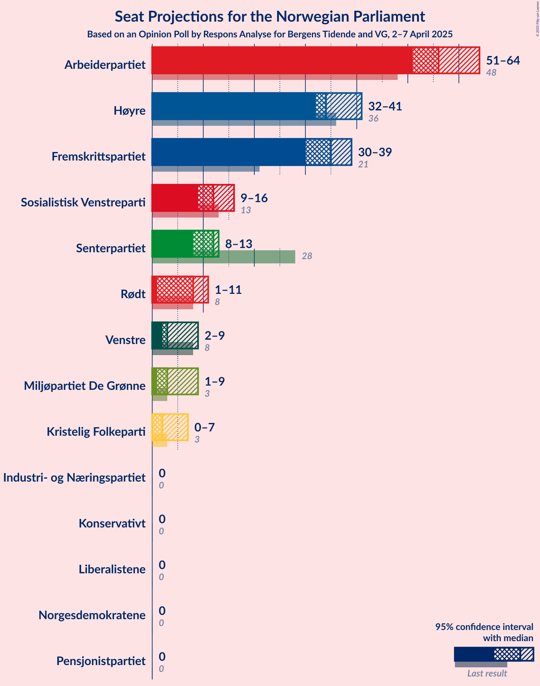
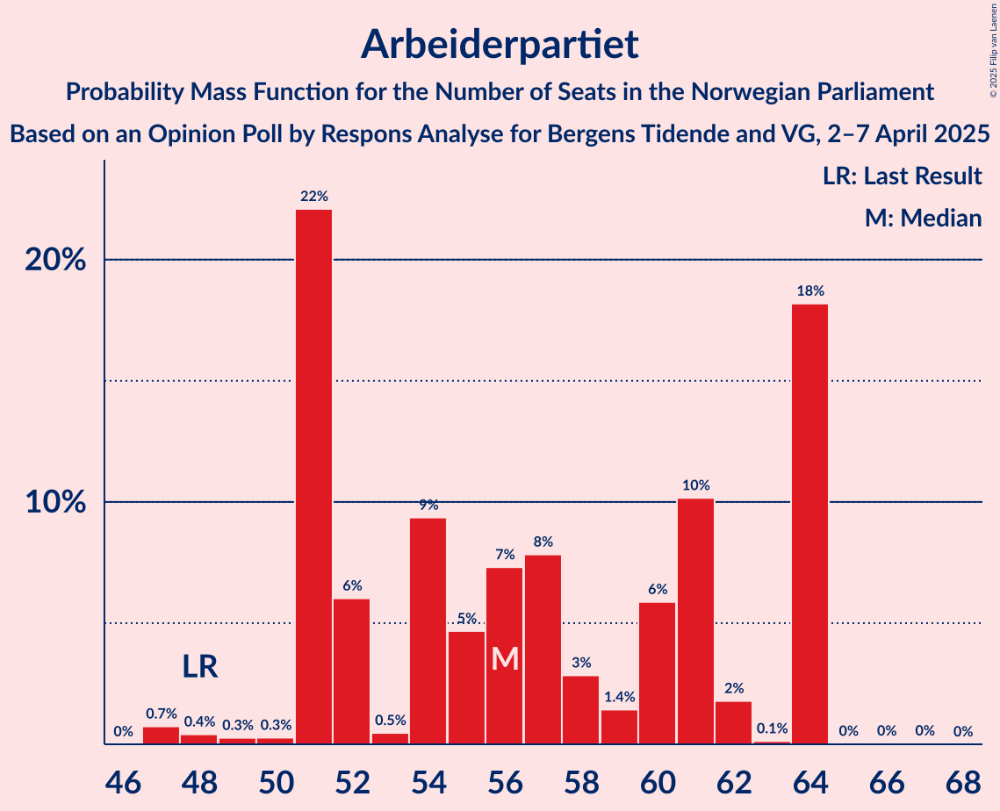
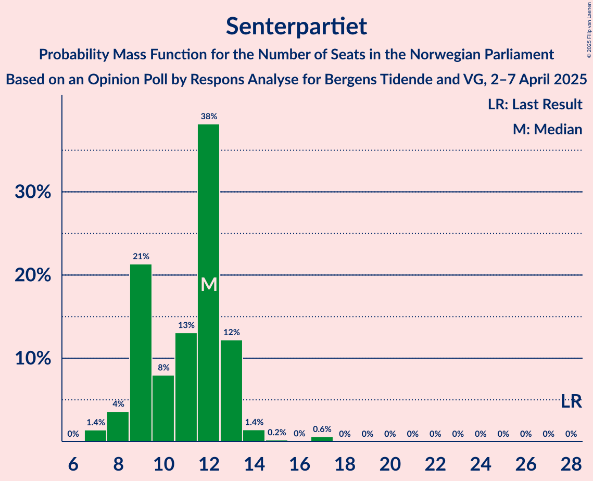
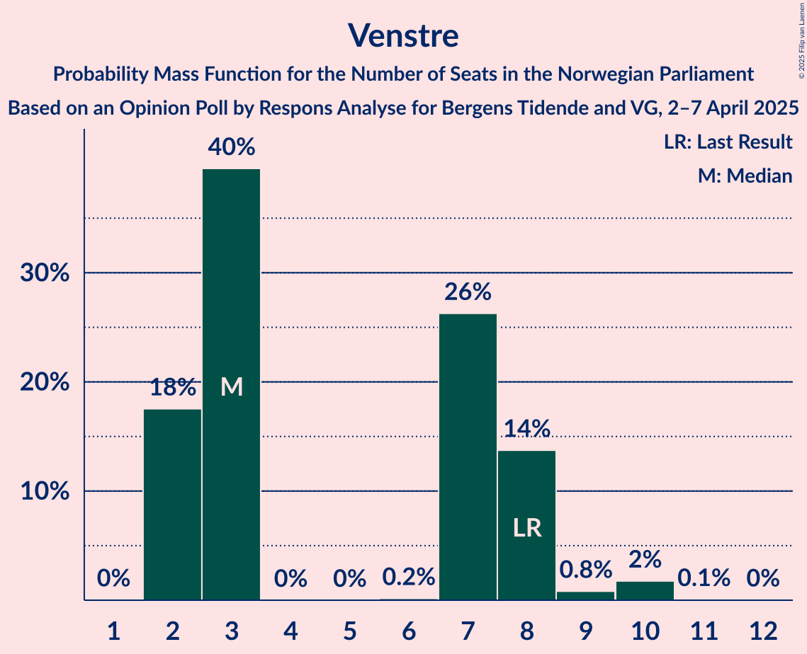
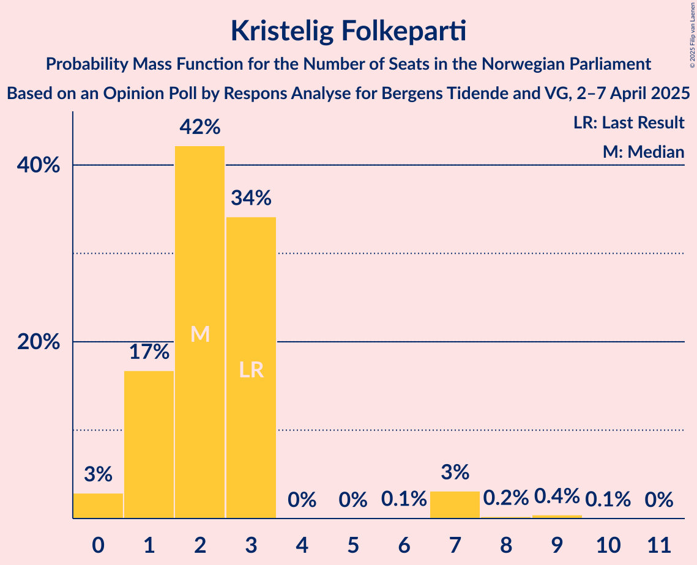
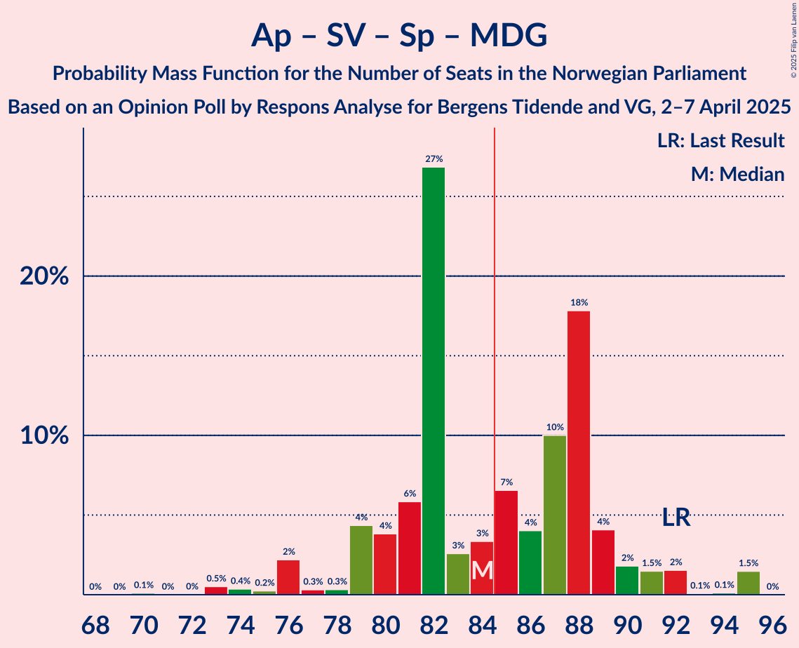
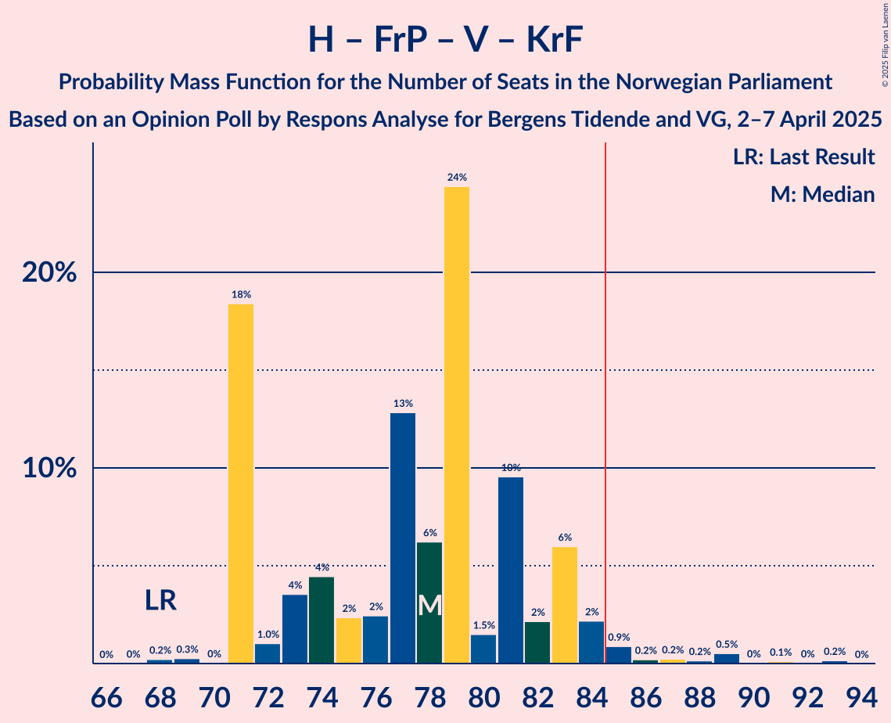

# Opinion Poll by Respons Analyse for Bergens Tidende and VG, 2–7 April 2025

<a href="#voting-intentions">Voting Intentions</a> | <a href="#seats">Seats</a> | <a href="#coalitions">Coalitions</a> | <a href="#technical-information">Technical Information</a>

## Voting Intentions

### Confidence Intervals

| Party | Last Result | Poll Result | 80% Confidence Interval | 90% Confidence Interval | 95% Confidence Interval | 99% Confidence Interval |
|:-----:|:-----------:|:-----------:|:-----------------------:|:-----------------------:|:-----------------------:|:-----------------------:|
| Arbeiderpartiet | 26.2% | 30.1% | 28.3–32.0% |27.7–32.5% |27.3–33.0% |26.4–33.9% |
| Høyre | 20.4% | 20.4% | 18.8–22.1% |18.4–22.6% |18.0–23.0% |17.3–23.8% |
| Fremskrittspartiet | 11.6% | 18.6% | 17.1–20.2% |16.6–20.7% |16.3–21.1% |15.6–21.9% |
| Sosialistisk Venstreparti | 7.6% | 6.4% | 5.5–7.5% |5.2–7.8% |5.0–8.1% |4.6–8.7% |
| Senterpartiet | 13.5% | 5.9% | 5.0–7.0% |4.8–7.3% |4.6–7.5% |4.2–8.1% |
| Rødt | 4.7% | 4.7% | 3.9–5.7% |3.7–5.9% |3.6–6.2% |3.2–6.7% |
| Venstre | 4.6% | 3.9% | 3.2–4.8% |3.0–5.1% |2.9–5.3% |2.6–5.8% |
| Miljøpartiet De Grønne | 3.9% | 3.8% | 3.1–4.7% |2.9–5.0% |2.8–5.2% |2.5–5.6% |
| Kristelig Folkeparti | 3.8% | 3.0% | 2.4–3.8% |2.2–4.0% |2.1–4.3% |1.9–4.7% |
| Industri- og Næringspartiet | 0.3% | 0.9% | 0.6–1.4% |0.5–1.6% |0.5–1.7% |0.4–2.0% |
| Konservativt | 0.4% | 0.4% | 0.2–0.8% |0.2–0.9% |0.2–1.0% |0.1–1.3% |
| Pensjonistpartiet | 0.6% | 0.3% | 0.2–0.7% |0.1–0.8% |0.1–0.9% |0.1–1.1% |
| Liberalistene | 0.2% | 0.2% | 0.1–0.5% |0.1–0.6% |0.1–0.7% |0.0–0.9% |
| Norgesdemokratene | 1.1% | 0.2% | 0.1–0.5% |0.1–0.6% |0.1–0.7% |0.0–0.9% |

*Note:* The poll result column reflects the actual value used in the calculations. Published results may vary slightly, and in addition be rounded to fewer digits.

## Seats

### Confidence Intervals

| Party | Last Result | Median | 80% Confidence Interval | 90% Confidence Interval | 95% Confidence Interval | 99% Confidence Interval |
|:-----:|:-----------:|:------:|:-----------------------:|:-----------------------:|:-----------------------:|:-----------------------:|
| <a href="#arbeiderpartiet">Arbeiderpartiet</a> | 48 | 57 | 51–64 |51–64 |51–64 |47–64 |
| <a href="#høyre">Høyre</a> | 36 | 34 | 33–41 |33–41 |33–41 |32–43 |
| <a href="#fremskrittspartiet">Fremskrittspartiet</a> | 21 | 36 | 32–37 |32–37 |32–39 |30–40 |
| <a href="#sosialistisk-venstreparti">Sosialistisk Venstreparti</a> | 13 | 12 | 11–14 |10–16 |10–16 |8–17 |
| <a href="#senterpartiet">Senterpartiet</a> | 28 | 12 | 9–12 |9–12 |8–13 |7–13 |
| <a href="#rødt">Rødt</a> | 8 | 8 | 1–10 |1–10 |1–11 |1–11 |
| <a href="#venstre">Venstre</a> | 8 | 3 | 2–7 |2–7 |2–8 |2–9 |
| <a href="#miljøpartiet-de-grønne">Miljøpartiet De Grønne</a> | 3 | 3 | 2–8 |2–8 |2–9 |1–10 |
| <a href="#kristelig-folkeparti">Kristelig Folkeparti</a> | 3 | 2 | 1–3 |1–3 |1–7 |0–9 |
| <a href="#industri--og-næringspartiet">Industri- og Næringspartiet</a> | 0 | 0 | 0 |0 |0 |0 |
| <a href="#konservativt">Konservativt</a> | 0 | 0 | 0 |0 |0 |0 |
| <a href="#pensjonistpartiet">Pensjonistpartiet</a> | 0 | 0 | 0 |0 |0 |0 |
| <a href="#liberalistene">Liberalistene</a> | 0 | 0 | 0 |0 |0 |0 |
| <a href="#norgesdemokratene">Norgesdemokratene</a> | 0 | 0 | 0 |0 |0 |0 |

### Arbeiderpartiet

*For a full overview of the results for this party, see the [Arbeiderpartiet](party-arbeiderpartiet.html) page.*

| Number of Seats | Probability | Accumulated | Special Marks |
|:---------------:|:-----------:|:-----------:|:-------------:|
| 47 | 1.0% | 100% |  |
| 48 | 0.4% | 99.0% | Last Result |
| 49 | 0% | 98.6% |  |
| 50 | 0.3% | 98.5% |  |
| 51 | 27% | 98% |  |
| 52 | 2% | 71% |  |
| 53 | 0.1% | 70% |  |
| 54 | 8% | 69% |  |
| 55 | 3% | 62% |  |
| 56 | 7% | 59% |  |
| 57 | 9% | 52% | Median |
| 58 | 1.1% | 43% |  |
| 59 | 0.8% | 42% |  |
| 60 | 4% | 41% |  |
| 61 | 12% | 37% |  |
| 62 | 0.1% | 25% |  |
| 63 | 0.2% | 25% |  |
| 64 | 24% | 24% |  |
| 65 | 0% | 0.1% |  |
| 66 | 0% | 0% |  |

### Høyre

*For a full overview of the results for this party, see the [Høyre](party-høyre.html) page.*

| Number of Seats | Probability | Accumulated | Special Marks |
|:---------------:|:-----------:|:-----------:|:-------------:|
| 30 | 0.1% | 100% |  |
| 31 | 0.3% | 99.9% |  |
| 32 | 0.4% | 99.6% |  |
| 33 | 25% | 99.2% |  |
| 34 | 37% | 74% | Median |
| 35 | 0.5% | 37% |  |
| 36 | 3% | 36% | Last Result |
| 37 | 15% | 33% |  |
| 38 | 0.7% | 18% |  |
| 39 | 3% | 17% |  |
| 40 | 0.2% | 14% |  |
| 41 | 13% | 14% |  |
| 42 | 0.1% | 0.6% |  |
| 43 | 0.1% | 0.5% |  |
| 44 | 0.4% | 0.5% |  |
| 45 | 0% | 0% |  |

### Fremskrittspartiet

*For a full overview of the results for this party, see the [Fremskrittspartiet](party-fremskrittspartiet.html) page.*

| Number of Seats | Probability | Accumulated | Special Marks |
|:---------------:|:-----------:|:-----------:|:-------------:|
| 21 | 0% | 100% | Last Result |
| 22 | 0% | 100% |  |
| 23 | 0% | 100% |  |
| 24 | 0% | 100% |  |
| 25 | 0% | 100% |  |
| 26 | 0% | 100% |  |
| 27 | 0% | 100% |  |
| 28 | 0% | 100% |  |
| 29 | 0.1% | 99.9% |  |
| 30 | 1.1% | 99.9% |  |
| 31 | 0.2% | 98.8% |  |
| 32 | 30% | 98.5% |  |
| 33 | 7% | 69% |  |
| 34 | 5% | 62% |  |
| 35 | 3% | 57% |  |
| 36 | 43% | 54% | Median |
| 37 | 8% | 11% |  |
| 38 | 1.3% | 4% |  |
| 39 | 2% | 3% |  |
| 40 | 0.8% | 0.9% |  |
| 41 | 0% | 0.1% |  |
| 42 | 0% | 0.1% |  |
| 43 | 0% | 0% |  |

### Sosialistisk Venstreparti

*For a full overview of the results for this party, see the [Sosialistisk Venstreparti](party-sosialistiskvenstreparti.html) page.*

| Number of Seats | Probability | Accumulated | Special Marks |
|:---------------:|:-----------:|:-----------:|:-------------:|
| 8 | 0.5% | 100% |  |
| 9 | 0.9% | 99.5% |  |
| 10 | 8% | 98.6% |  |
| 11 | 18% | 91% |  |
| 12 | 30% | 73% | Median |
| 13 | 29% | 43% | Last Result |
| 14 | 7% | 14% |  |
| 15 | 0.1% | 7% |  |
| 16 | 6% | 7% |  |
| 17 | 0.6% | 0.6% |  |
| 18 | 0% | 0% |  |

### Senterpartiet

*For a full overview of the results for this party, see the [Senterpartiet](party-senterpartiet.html) page.*

| Number of Seats | Probability | Accumulated | Special Marks |
|:---------------:|:-----------:|:-----------:|:-------------:|
| 7 | 0.7% | 100% |  |
| 8 | 2% | 99.3% |  |
| 9 | 28% | 97% |  |
| 10 | 8% | 69% |  |
| 11 | 8% | 61% |  |
| 12 | 49% | 53% | Median |
| 13 | 4% | 5% |  |
| 14 | 0.4% | 0.5% |  |
| 15 | 0.1% | 0.1% |  |
| 16 | 0% | 0% |  |
| 17 | 0% | 0% |  |
| 18 | 0% | 0% |  |
| 19 | 0% | 0% |  |
| 20 | 0% | 0% |  |
| 21 | 0% | 0% |  |
| 22 | 0% | 0% |  |
| 23 | 0% | 0% |  |
| 24 | 0% | 0% |  |
| 25 | 0% | 0% |  |
| 26 | 0% | 0% |  |
| 27 | 0% | 0% |  |
| 28 | 0% | 0% | Last Result |

### Rødt

*For a full overview of the results for this party, see the [Rødt](party-rødt.html) page.*

| Number of Seats | Probability | Accumulated | Special Marks |
|:---------------:|:-----------:|:-----------:|:-------------:|
| 1 | 20% | 100% |  |
| 2 | 0% | 80% |  |
| 3 | 0% | 80% |  |
| 4 | 0% | 80% |  |
| 5 | 0% | 80% |  |
| 6 | 0.3% | 80% |  |
| 7 | 2% | 79% |  |
| 8 | 33% | 77% | Last Result, Median |
| 9 | 2% | 45% |  |
| 10 | 39% | 43% |  |
| 11 | 4% | 4% |  |
| 12 | 0.1% | 0.1% |  |
| 13 | 0% | 0.1% |  |
| 14 | 0% | 0% |  |

### Venstre

*For a full overview of the results for this party, see the [Venstre](party-venstre.html) page.*

| Number of Seats | Probability | Accumulated | Special Marks |
|:---------------:|:-----------:|:-----------:|:-------------:|
| 2 | 17% | 100% |  |
| 3 | 48% | 83% | Median |
| 4 | 0% | 35% |  |
| 5 | 0% | 35% |  |
| 6 | 0.2% | 35% |  |
| 7 | 30% | 35% |  |
| 8 | 4% | 5% | Last Result |
| 9 | 0.9% | 1.2% |  |
| 10 | 0.3% | 0.3% |  |
| 11 | 0% | 0% |  |

### Miljøpartiet De Grønne

*For a full overview of the results for this party, see the [Miljøpartiet De Grønne](party-miljøpartietdegrønne.html) page.*

| Number of Seats | Probability | Accumulated | Special Marks |
|:---------------:|:-----------:|:-----------:|:-------------:|
| 1 | 0.7% | 100% |  |
| 2 | 42% | 99.3% |  |
| 3 | 13% | 58% | Last Result, Median |
| 4 | 0% | 45% |  |
| 5 | 0% | 44% |  |
| 6 | 0% | 44% |  |
| 7 | 34% | 44% |  |
| 8 | 6% | 10% |  |
| 9 | 3% | 4% |  |
| 10 | 0.9% | 0.9% |  |
| 11 | 0% | 0% |  |

### Kristelig Folkeparti

*For a full overview of the results for this party, see the [Kristelig Folkeparti](party-kristeligfolkeparti.html) page.*

| Number of Seats | Probability | Accumulated | Special Marks |
|:---------------:|:-----------:|:-----------:|:-------------:|
| 0 | 2% | 100% |  |
| 1 | 13% | 98% |  |
| 2 | 45% | 85% | Median |
| 3 | 36% | 40% | Last Result |
| 4 | 0% | 3% |  |
| 5 | 0% | 3% |  |
| 6 | 0% | 3% |  |
| 7 | 3% | 3% |  |
| 8 | 0.3% | 0.8% |  |
| 9 | 0.4% | 0.5% |  |
| 10 | 0.1% | 0.1% |  |
| 11 | 0% | 0% |  |

### Industri- og Næringspartiet

*For a full overview of the results for this party, see the [Industri- og Næringspartiet](party-industri-ognæringspartiet.html) page.*

| Number of Seats | Probability | Accumulated | Special Marks |
|:---------------:|:-----------:|:-----------:|:-------------:|
| 0 | 100% | 100% | Last Result, Median |

### Konservativt

*For a full overview of the results for this party, see the [Konservativt](party-konservativt.html) page.*

| Number of Seats | Probability | Accumulated | Special Marks |
|:---------------:|:-----------:|:-----------:|:-------------:|
| 0 | 100% | 100% | Last Result, Median |

### Pensjonistpartiet

*For a full overview of the results for this party, see the [Pensjonistpartiet](party-pensjonistpartiet.html) page.*

| Number of Seats | Probability | Accumulated | Special Marks |
|:---------------:|:-----------:|:-----------:|:-------------:|
| 0 | 100% | 100% | Last Result, Median |

### Liberalistene

*For a full overview of the results for this party, see the [Liberalistene](party-liberalistene.html) page.*

| Number of Seats | Probability | Accumulated | Special Marks |
|:---------------:|:-----------:|:-----------:|:-------------:|
| 0 | 100% | 100% | Last Result, Median |

### Norgesdemokratene

*For a full overview of the results for this party, see the [Norgesdemokratene](party-norgesdemokratene.html) page.*

| Number of Seats | Probability | Accumulated | Special Marks |
|:---------------:|:-----------:|:-----------:|:-------------:|
| 0 | 100% | 100% | Last Result, Median |

## Coalitions

### Confidence Intervals

| Coalition | Last Result | Median | Majority? | 80% Confidence Interval | 90% Confidence Interval | 95% Confidence Interval | 99% Confidence Interval |
|:---------:|:-----------:|:------:|:---------:|:-----------------------:|:-----------------------:|:-----------------------:|:-----------------------:|
| Arbeiderpartiet – Sosialistisk Venstreparti – Senterpartiet – Rødt – Miljøpartiet De Grønne | 100 | 90 | 99.0% | 88–98 | 87–98 | 86–98 | 83–98 |
| Arbeiderpartiet – Sosialistisk Venstreparti – Senterpartiet – Rødt | 97 | 85 | 59% | 82–96 | 80–96 | 78–96 | 77–96 |
| Høyre – Fremskrittspartiet – Senterpartiet – Venstre – Kristelig Folkeparti | 96 | 90 | 69% | 80–93 | 80–93 | 80–93 | 80–96 |
| Arbeiderpartiet – Sosialistisk Venstreparti – Senterpartiet – Miljøpartiet De Grønne – Kristelig Folkeparti | 95 | 87 | 65% | 84–91 | 82–92 | 78–93 | 76–96 |
| Arbeiderpartiet – Sosialistisk Venstreparti – Senterpartiet – Miljøpartiet De Grønne | 92 | 85 | 56% | 82–88 | 80–89 | 76–91 | 75–92 |
| Høyre – Fremskrittspartiet – Venstre – Miljøpartiet De Grønne – Kristelig Folkeparti | 71 | 84 | 41% | 73–87 | 73–89 | 73–91 | 73–92 |
| Arbeiderpartiet – Sosialistisk Venstreparti – Rødt – Miljøpartiet De Grønne | 72 | 79 | 31% | 76–89 | 76–89 | 76–89 | 73–89 |
| Arbeiderpartiet – Sosialistisk Venstreparti – Senterpartiet | 89 | 81 | 25% | 75–86 | 74–86 | 72–86 | 69–86 |
| Høyre – Fremskrittspartiet – Venstre – Kristelig Folkeparti | 68 | 79 | 1.0% | 71–81 | 71–82 | 71–83 | 71–86 |
| Arbeiderpartiet – Senterpartiet – Miljøpartiet De Grønne – Kristelig Folkeparti | 82 | 74 | 0.4% | 71–78 | 70–82 | 68–82 | 65–83 |
| Høyre – Fremskrittspartiet – Venstre | 65 | 76 | 0.4% | 68–79 | 68–80 | 68–82 | 67–83 |
| Høyre – Fremskrittspartiet | 57 | 70 | 0% | 65–77 | 65–77 | 65–77 | 64–78 |
| Arbeiderpartiet – Sosialistisk Venstreparti | 61 | 70 | 0% | 63–77 | 63–77 | 63–77 | 57–77 |
| Arbeiderpartiet – Senterpartiet – Kristelig Folkeparti | 79 | 69 | 0% | 65–76 | 65–76 | 63–76 | 61–77 |
| Arbeiderpartiet – Senterpartiet | 76 | 67 | 0% | 63–73 | 63–73 | 63–73 | 59–73 |
| Høyre – Venstre – Kristelig Folkeparti | 47 | 43 | 0% | 39–45 | 39–47 | 39–47 | 38–51 |
| Senterpartiet – Venstre – Kristelig Folkeparti | 39 | 17 | 0% | 15–21 | 14–21 | 14–21 | 14–24 |

### Arbeiderpartiet – Sosialistisk Venstreparti – Senterpartiet – Rødt – Miljøpartiet De Grønne

| Number of Seats | Probability | Accumulated | Special Marks |
|:---------------:|:-----------:|:-----------:|:-------------:|
| 76 | 0.2% | 100% |  |
| 77 | 0% | 99.8% |  |
| 78 | 0% | 99.8% |  |
| 79 | 0% | 99.8% |  |
| 80 | 0% | 99.7% |  |
| 81 | 0.1% | 99.7% |  |
| 82 | 0% | 99.6% |  |
| 83 | 0.1% | 99.6% |  |
| 84 | 0.4% | 99.4% |  |
| 85 | 0.9% | 99.0% | Majority |
| 86 | 1.3% | 98% |  |
| 87 | 3% | 97% |  |
| 88 | 13% | 94% |  |
| 89 | 0.3% | 81% |  |
| 90 | 32% | 81% |  |
| 91 | 3% | 49% |  |
| 92 | 8% | 46% | Median |
| 93 | 2% | 38% |  |
| 94 | 2% | 36% |  |
| 95 | 6% | 34% |  |
| 96 | 2% | 27% |  |
| 97 | 0.5% | 25% |  |
| 98 | 24% | 25% |  |
| 99 | 0% | 0.4% |  |
| 100 | 0.1% | 0.4% | Last Result |
| 101 | 0.3% | 0.3% |  |
| 102 | 0% | 0% |  |

### Arbeiderpartiet – Sosialistisk Venstreparti – Senterpartiet – Rødt

| Number of Seats | Probability | Accumulated | Special Marks |
|:---------------:|:-----------:|:-----------:|:-------------:|
| 73 | 0.2% | 100% |  |
| 74 | 0% | 99.8% |  |
| 75 | 0% | 99.8% |  |
| 76 | 0% | 99.8% |  |
| 77 | 1.0% | 99.7% |  |
| 78 | 2% | 98.7% |  |
| 79 | 1.2% | 97% |  |
| 80 | 1.4% | 96% |  |
| 81 | 0.5% | 95% |  |
| 82 | 4% | 94% |  |
| 83 | 28% | 90% |  |
| 84 | 3% | 62% |  |
| 85 | 13% | 59% | Majority |
| 86 | 0.3% | 45% |  |
| 87 | 3% | 45% |  |
| 88 | 0.3% | 42% |  |
| 89 | 0.9% | 42% | Median |
| 90 | 8% | 41% |  |
| 91 | 0.2% | 33% |  |
| 92 | 0.4% | 33% |  |
| 93 | 6% | 32% |  |
| 94 | 2% | 26% |  |
| 95 | 0% | 24% |  |
| 96 | 24% | 24% |  |
| 97 | 0.1% | 0.1% | Last Result |
| 98 | 0% | 0% |  |

### Høyre – Fremskrittspartiet – Senterpartiet – Venstre – Kristelig Folkeparti

| Number of Seats | Probability | Accumulated | Special Marks |
|:---------------:|:-----------:|:-----------:|:-------------:|
| 80 | 24% | 100% |  |
| 81 | 0.3% | 76% |  |
| 82 | 0.1% | 75% |  |
| 83 | 0.2% | 75% |  |
| 84 | 7% | 75% |  |
| 85 | 0.3% | 69% | Majority |
| 86 | 5% | 68% |  |
| 87 | 3% | 64% | Median |
| 88 | 2% | 61% |  |
| 89 | 7% | 58% |  |
| 90 | 6% | 51% |  |
| 91 | 28% | 45% |  |
| 92 | 3% | 18% |  |
| 93 | 13% | 15% |  |
| 94 | 0.2% | 1.5% |  |
| 95 | 0.2% | 1.3% |  |
| 96 | 0.7% | 1.1% | Last Result |
| 97 | 0% | 0.5% |  |
| 98 | 0% | 0.4% |  |
| 99 | 0% | 0.4% |  |
| 100 | 0% | 0.4% |  |
| 101 | 0.1% | 0.4% |  |
| 102 | 0% | 0.2% |  |
| 103 | 0% | 0.2% |  |
| 104 | 0% | 0.2% |  |
| 105 | 0% | 0.2% |  |
| 106 | 0.2% | 0.2% |  |
| 107 | 0% | 0% |  |

### Arbeiderpartiet – Sosialistisk Venstreparti – Senterpartiet – Miljøpartiet De Grønne – Kristelig Folkeparti

| Number of Seats | Probability | Accumulated | Special Marks |
|:---------------:|:-----------:|:-----------:|:-------------:|
| 76 | 1.3% | 100% |  |
| 77 | 0.4% | 98.6% |  |
| 78 | 0.9% | 98% |  |
| 79 | 0.1% | 97% |  |
| 80 | 0.6% | 97% |  |
| 81 | 0.4% | 97% |  |
| 82 | 2% | 96% |  |
| 83 | 0.4% | 94% |  |
| 84 | 28% | 93% |  |
| 85 | 7% | 65% | Majority |
| 86 | 7% | 58% | Median |
| 87 | 4% | 52% |  |
| 88 | 0.8% | 47% |  |
| 89 | 12% | 46% |  |
| 90 | 3% | 35% |  |
| 91 | 26% | 32% |  |
| 92 | 4% | 6% |  |
| 93 | 1.2% | 3% |  |
| 94 | 0.2% | 2% |  |
| 95 | 0.8% | 1.4% | Last Result |
| 96 | 0.6% | 0.6% |  |
| 97 | 0% | 0% |  |

### Arbeiderpartiet – Sosialistisk Venstreparti – Senterpartiet – Miljøpartiet De Grønne

| Number of Seats | Probability | Accumulated | Special Marks |
|:---------------:|:-----------:|:-----------:|:-------------:|
| 74 | 0.4% | 100% |  |
| 75 | 0.2% | 99.6% |  |
| 76 | 2% | 99.4% |  |
| 77 | 0.4% | 97% |  |
| 78 | 0.3% | 97% |  |
| 79 | 0.5% | 96% |  |
| 80 | 2% | 96% |  |
| 81 | 1.2% | 94% |  |
| 82 | 35% | 93% |  |
| 83 | 3% | 59% |  |
| 84 | 0.2% | 56% | Median |
| 85 | 9% | 56% | Majority |
| 86 | 2% | 47% |  |
| 87 | 13% | 44% |  |
| 88 | 24% | 32% |  |
| 89 | 4% | 7% |  |
| 90 | 0.6% | 3% |  |
| 91 | 0.5% | 3% |  |
| 92 | 2% | 2% | Last Result |
| 93 | 0.1% | 0.3% |  |
| 94 | 0.1% | 0.2% |  |
| 95 | 0% | 0% |  |

### Høyre – Fremskrittspartiet – Venstre – Miljøpartiet De Grønne – Kristelig Folkeparti

| Number of Seats | Probability | Accumulated | Special Marks |
|:---------------:|:-----------:|:-----------:|:-------------:|
| 71 | 0% | 100% | Last Result |
| 72 | 0.1% | 100% |  |
| 73 | 24% | 99.9% |  |
| 74 | 0% | 76% |  |
| 75 | 2% | 76% |  |
| 76 | 6% | 74% |  |
| 77 | 0.4% | 68% |  |
| 78 | 0.2% | 67% | Median |
| 79 | 8% | 67% |  |
| 80 | 0.9% | 59% |  |
| 81 | 0.3% | 58% |  |
| 82 | 3% | 58% |  |
| 83 | 0.3% | 55% |  |
| 84 | 13% | 55% |  |
| 85 | 3% | 41% | Majority |
| 86 | 28% | 38% |  |
| 87 | 4% | 10% |  |
| 88 | 0.5% | 6% |  |
| 89 | 1.4% | 5% |  |
| 90 | 1.2% | 4% |  |
| 91 | 2% | 3% |  |
| 92 | 1.0% | 1.3% |  |
| 93 | 0% | 0.3% |  |
| 94 | 0% | 0.2% |  |
| 95 | 0% | 0.2% |  |
| 96 | 0.2% | 0.2% |  |
| 97 | 0% | 0% |  |

### Arbeiderpartiet – Sosialistisk Venstreparti – Rødt – Miljøpartiet De Grønne

| Number of Seats | Probability | Accumulated | Special Marks |
|:---------------:|:-----------:|:-----------:|:-------------:|
| 63 | 0.2% | 100% |  |
| 64 | 0% | 99.8% |  |
| 65 | 0% | 99.8% |  |
| 66 | 0% | 99.8% |  |
| 67 | 0% | 99.8% |  |
| 68 | 0.1% | 99.8% |  |
| 69 | 0% | 99.6% |  |
| 70 | 0% | 99.6% |  |
| 71 | 0% | 99.6% |  |
| 72 | 0% | 99.6% | Last Result |
| 73 | 0.7% | 99.5% |  |
| 74 | 0.2% | 98.9% |  |
| 75 | 0.2% | 98.7% |  |
| 76 | 13% | 98.5% |  |
| 77 | 3% | 85% |  |
| 78 | 28% | 82% |  |
| 79 | 6% | 55% |  |
| 80 | 7% | 49% | Median |
| 81 | 2% | 42% |  |
| 82 | 3% | 39% |  |
| 83 | 5% | 36% |  |
| 84 | 0.3% | 32% |  |
| 85 | 7% | 31% | Majority |
| 86 | 0.2% | 25% |  |
| 87 | 0.1% | 25% |  |
| 88 | 0.3% | 25% |  |
| 89 | 24% | 24% |  |
| 90 | 0% | 0% |  |

### Arbeiderpartiet – Sosialistisk Venstreparti – Senterpartiet

| Number of Seats | Probability | Accumulated | Special Marks |
|:---------------:|:-----------:|:-----------:|:-------------:|
| 69 | 0.8% | 100% |  |
| 70 | 0.6% | 99.1% |  |
| 71 | 0.3% | 98.6% |  |
| 72 | 0.9% | 98% |  |
| 73 | 2% | 97% |  |
| 74 | 2% | 96% |  |
| 75 | 27% | 94% |  |
| 76 | 3% | 67% |  |
| 77 | 1.2% | 64% |  |
| 78 | 0.6% | 63% |  |
| 79 | 4% | 62% |  |
| 80 | 7% | 59% |  |
| 81 | 4% | 52% | Median |
| 82 | 1.3% | 48% |  |
| 83 | 9% | 46% |  |
| 84 | 12% | 38% |  |
| 85 | 0.1% | 25% | Majority |
| 86 | 25% | 25% |  |
| 87 | 0% | 0.2% |  |
| 88 | 0.1% | 0.2% |  |
| 89 | 0% | 0.1% | Last Result |
| 90 | 0% | 0% |  |

### Høyre – Fremskrittspartiet – Venstre – Kristelig Folkeparti

| Number of Seats | Probability | Accumulated | Special Marks |
|:---------------:|:-----------:|:-----------:|:-------------:|
| 68 | 0.3% | 100% | Last Result |
| 69 | 0.1% | 99.7% |  |
| 70 | 0% | 99.6% |  |
| 71 | 24% | 99.6% |  |
| 72 | 0.5% | 75% |  |
| 73 | 2% | 75% |  |
| 74 | 6% | 73% |  |
| 75 | 2% | 66% | Median |
| 76 | 2% | 64% |  |
| 77 | 8% | 62% |  |
| 78 | 3% | 54% |  |
| 79 | 32% | 51% |  |
| 80 | 0.3% | 19% |  |
| 81 | 13% | 19% |  |
| 82 | 3% | 6% |  |
| 83 | 1.3% | 3% |  |
| 84 | 0.9% | 2% |  |
| 85 | 0.4% | 1.0% | Majority |
| 86 | 0.1% | 0.6% |  |
| 87 | 0% | 0.4% |  |
| 88 | 0.1% | 0.4% |  |
| 89 | 0% | 0.3% |  |
| 90 | 0% | 0.3% |  |
| 91 | 0% | 0.2% |  |
| 92 | 0% | 0.2% |  |
| 93 | 0.2% | 0.2% |  |
| 94 | 0% | 0% |  |

### Arbeiderpartiet – Senterpartiet – Miljøpartiet De Grønne – Kristelig Folkeparti

| Number of Seats | Probability | Accumulated | Special Marks |
|:---------------:|:-----------:|:-----------:|:-------------:|
| 64 | 0% | 100% |  |
| 65 | 1.4% | 99.9% |  |
| 66 | 0.1% | 98.6% |  |
| 67 | 0.7% | 98.5% |  |
| 68 | 0.6% | 98% |  |
| 69 | 0.1% | 97% |  |
| 70 | 6% | 97% |  |
| 71 | 8% | 91% |  |
| 72 | 30% | 83% |  |
| 73 | 0.9% | 53% |  |
| 74 | 3% | 53% | Median |
| 75 | 3% | 50% |  |
| 76 | 0.1% | 47% |  |
| 77 | 0.5% | 47% |  |
| 78 | 37% | 46% |  |
| 79 | 3% | 9% |  |
| 80 | 0.4% | 6% |  |
| 81 | 0.3% | 6% |  |
| 82 | 5% | 6% | Last Result |
| 83 | 0.1% | 0.6% |  |
| 84 | 0% | 0.5% |  |
| 85 | 0.1% | 0.4% | Majority |
| 86 | 0.4% | 0.4% |  |
| 87 | 0% | 0% |  |

### Høyre – Fremskrittspartiet – Venstre

| Number of Seats | Probability | Accumulated | Special Marks |
|:---------------:|:-----------:|:-----------:|:-------------:|
| 65 | 0.1% | 100% | Last Result |
| 66 | 0% | 99.8% |  |
| 67 | 0.4% | 99.8% |  |
| 68 | 24% | 99.5% |  |
| 69 | 0.1% | 75% |  |
| 70 | 0.4% | 75% |  |
| 71 | 5% | 75% |  |
| 72 | 0.8% | 70% |  |
| 73 | 7% | 69% | Median |
| 74 | 9% | 63% |  |
| 75 | 1.3% | 53% |  |
| 76 | 4% | 52% |  |
| 77 | 29% | 48% |  |
| 78 | 0.6% | 19% |  |
| 79 | 11% | 18% |  |
| 80 | 3% | 7% |  |
| 81 | 0.5% | 4% |  |
| 82 | 3% | 4% |  |
| 83 | 0.1% | 0.5% |  |
| 84 | 0.1% | 0.4% |  |
| 85 | 0.3% | 0.4% | Majority |
| 86 | 0% | 0.1% |  |
| 87 | 0% | 0% |  |

### Høyre – Fremskrittspartiet

| Number of Seats | Probability | Accumulated | Special Marks |
|:---------------:|:-----------:|:-----------:|:-------------:|
| 57 | 0% | 100% | Last Result |
| 58 | 0% | 100% |  |
| 59 | 0% | 100% |  |
| 60 | 0% | 100% |  |
| 61 | 0% | 100% |  |
| 62 | 0.2% | 99.9% |  |
| 63 | 0.1% | 99.7% |  |
| 64 | 0.3% | 99.7% |  |
| 65 | 25% | 99.4% |  |
| 66 | 0.2% | 75% |  |
| 67 | 0.4% | 75% |  |
| 68 | 3% | 74% |  |
| 69 | 3% | 71% |  |
| 70 | 33% | 68% | Median |
| 71 | 10% | 35% |  |
| 72 | 1.4% | 25% |  |
| 73 | 6% | 23% |  |
| 74 | 3% | 18% |  |
| 75 | 3% | 15% |  |
| 76 | 0.5% | 12% |  |
| 77 | 11% | 12% |  |
| 78 | 0.5% | 0.6% |  |
| 79 | 0% | 0.1% |  |
| 80 | 0% | 0.1% |  |
| 81 | 0% | 0.1% |  |
| 82 | 0% | 0% |  |

### Arbeiderpartiet – Sosialistisk Venstreparti

| Number of Seats | Probability | Accumulated | Special Marks |
|:---------------:|:-----------:|:-----------:|:-------------:|
| 57 | 0.8% | 100% |  |
| 58 | 0.1% | 99.2% |  |
| 59 | 0.5% | 99.1% |  |
| 60 | 0.1% | 98.6% |  |
| 61 | 0.1% | 98.5% | Last Result |
| 62 | 0.2% | 98% |  |
| 63 | 29% | 98% |  |
| 64 | 0.7% | 69% |  |
| 65 | 2% | 69% |  |
| 66 | 0.9% | 67% |  |
| 67 | 4% | 66% |  |
| 68 | 9% | 62% |  |
| 69 | 1.2% | 52% | Median |
| 70 | 6% | 51% |  |
| 71 | 1.0% | 45% |  |
| 72 | 13% | 44% |  |
| 73 | 7% | 32% |  |
| 74 | 0.3% | 25% |  |
| 75 | 0.1% | 24% |  |
| 76 | 0.1% | 24% |  |
| 77 | 24% | 24% |  |
| 78 | 0% | 0.1% |  |
| 79 | 0% | 0% |  |

### Arbeiderpartiet – Senterpartiet – Kristelig Folkeparti

| Number of Seats | Probability | Accumulated | Special Marks |
|:---------------:|:-----------:|:-----------:|:-------------:|
| 60 | 0.3% | 100% |  |
| 61 | 0.6% | 99.7% |  |
| 62 | 0.4% | 99.1% |  |
| 63 | 2% | 98.7% |  |
| 64 | 0.6% | 97% |  |
| 65 | 29% | 97% |  |
| 66 | 1.4% | 67% |  |
| 67 | 0.5% | 66% |  |
| 68 | 9% | 65% |  |
| 69 | 7% | 57% |  |
| 70 | 1.2% | 49% |  |
| 71 | 1.0% | 48% | Median |
| 72 | 5% | 47% |  |
| 73 | 1.1% | 43% |  |
| 74 | 5% | 41% |  |
| 75 | 12% | 37% |  |
| 76 | 24% | 25% |  |
| 77 | 0.4% | 0.6% |  |
| 78 | 0.1% | 0.2% |  |
| 79 | 0% | 0.1% | Last Result |
| 80 | 0.1% | 0.1% |  |
| 81 | 0% | 0% |  |

### Arbeiderpartiet – Senterpartiet

| Number of Seats | Probability | Accumulated | Special Marks |
|:---------------:|:-----------:|:-----------:|:-------------:|
| 58 | 0.3% | 100% |  |
| 59 | 0.7% | 99.7% |  |
| 60 | 0.5% | 99.0% |  |
| 61 | 0.3% | 98% |  |
| 62 | 0.5% | 98% |  |
| 63 | 31% | 98% |  |
| 64 | 0.2% | 67% |  |
| 65 | 4% | 67% |  |
| 66 | 8% | 63% |  |
| 67 | 9% | 56% |  |
| 68 | 1.2% | 47% |  |
| 69 | 0.9% | 46% | Median |
| 70 | 4% | 45% |  |
| 71 | 4% | 41% |  |
| 72 | 0.3% | 38% |  |
| 73 | 37% | 37% |  |
| 74 | 0% | 0.2% |  |
| 75 | 0.1% | 0.2% |  |
| 76 | 0% | 0.1% | Last Result |
| 77 | 0% | 0.1% |  |
| 78 | 0.1% | 0.1% |  |
| 79 | 0% | 0% |  |

### Høyre – Venstre – Kristelig Folkeparti

| Number of Seats | Probability | Accumulated | Special Marks |
|:---------------:|:-----------:|:-----------:|:-------------:|
| 34 | 0.3% | 100% |  |
| 35 | 0% | 99.7% |  |
| 36 | 0% | 99.7% |  |
| 37 | 0.1% | 99.7% |  |
| 38 | 1.5% | 99.6% |  |
| 39 | 24% | 98% | Median |
| 40 | 7% | 74% |  |
| 41 | 11% | 67% |  |
| 42 | 0.5% | 56% |  |
| 43 | 33% | 55% |  |
| 44 | 1.2% | 22% |  |
| 45 | 12% | 21% |  |
| 46 | 4% | 9% |  |
| 47 | 3% | 5% | Last Result |
| 48 | 0.4% | 2% |  |
| 49 | 0.8% | 2% |  |
| 50 | 0.5% | 1.2% |  |
| 51 | 0.3% | 0.7% |  |
| 52 | 0.1% | 0.4% |  |
| 53 | 0% | 0.3% |  |
| 54 | 0.3% | 0.3% |  |
| 55 | 0% | 0% |  |

### Senterpartiet – Venstre – Kristelig Folkeparti

| Number of Seats | Probability | Accumulated | Special Marks |
|:---------------:|:-----------:|:-----------:|:-------------:|
| 10 | 0.1% | 100% |  |
| 11 | 0% | 99.9% |  |
| 12 | 0.1% | 99.9% |  |
| 13 | 0.2% | 99.9% |  |
| 14 | 7% | 99.7% |  |
| 15 | 27% | 93% |  |
| 16 | 13% | 66% |  |
| 17 | 8% | 53% | Median |
| 18 | 12% | 45% |  |
| 19 | 2% | 33% |  |
| 20 | 1.0% | 31% |  |
| 21 | 28% | 30% |  |
| 22 | 1.0% | 2% |  |
| 23 | 0.2% | 1.1% |  |
| 24 | 0.5% | 0.9% |  |
| 25 | 0.1% | 0.4% |  |
| 26 | 0.1% | 0.4% |  |
| 27 | 0% | 0.3% |  |
| 28 | 0% | 0.3% |  |
| 29 | 0% | 0.2% |  |
| 30 | 0.2% | 0.2% |  |
| 31 | 0% | 0% |  |
| 32 | 0% | 0% |  |
| 33 | 0% | 0% |  |
| 34 | 0% | 0% |  |
| 35 | 0% | 0% |  |
| 36 | 0% | 0% |  |
| 37 | 0% | 0% |  |
| 38 | 0% | 0% |  |
| 39 | 0% | 0% | Last Result |

## Technical Information

### Opinion Poll

+ **Polling firm:** Respons Analyse
+ **Commissioner(s):** Bergens Tidende and VG
+ **Fieldwork period:** 2–7 April 2025

### Calculations

+ **Sample size:** 1001
+ **Simulations done:** 1,048,576
+ **Error estimate:** 1.81%

