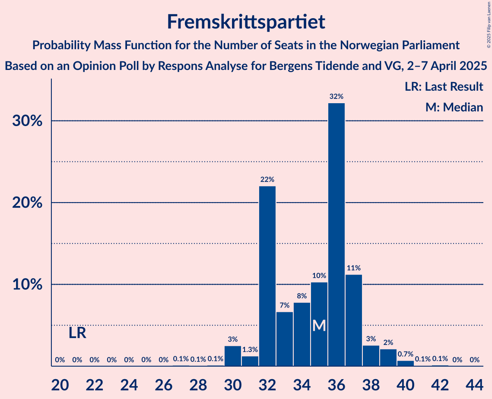
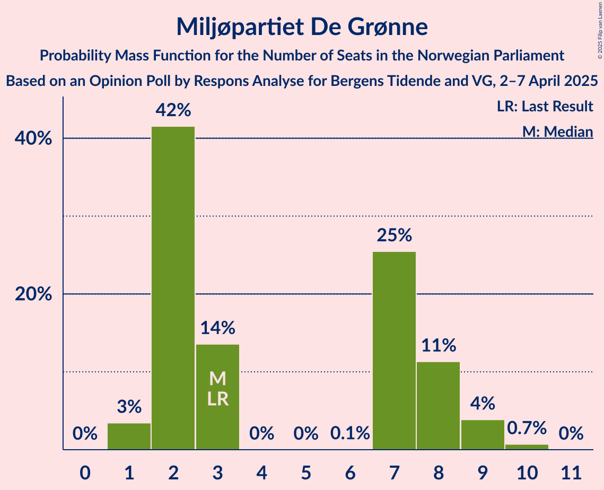
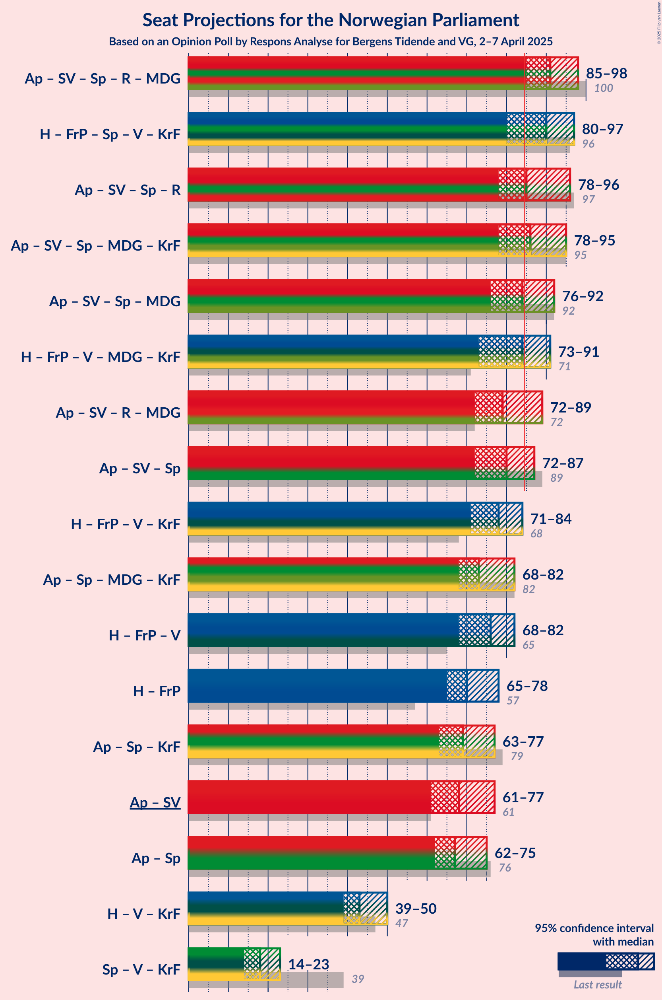
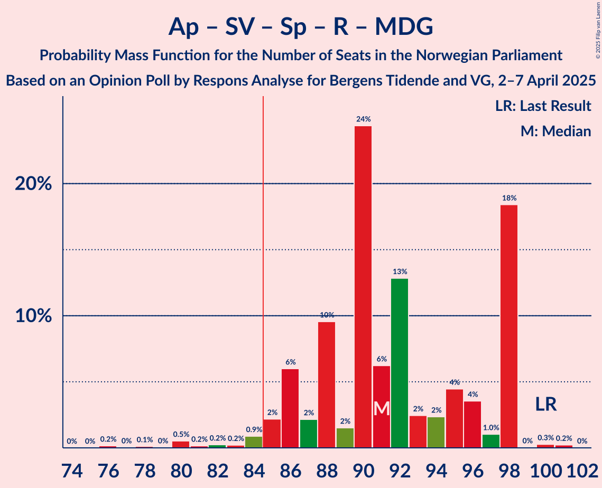
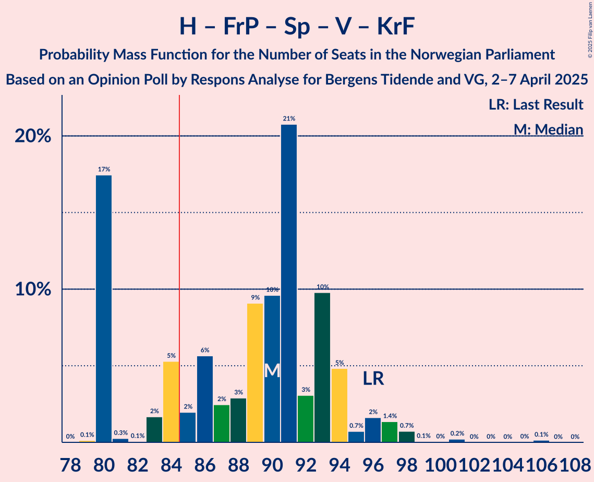
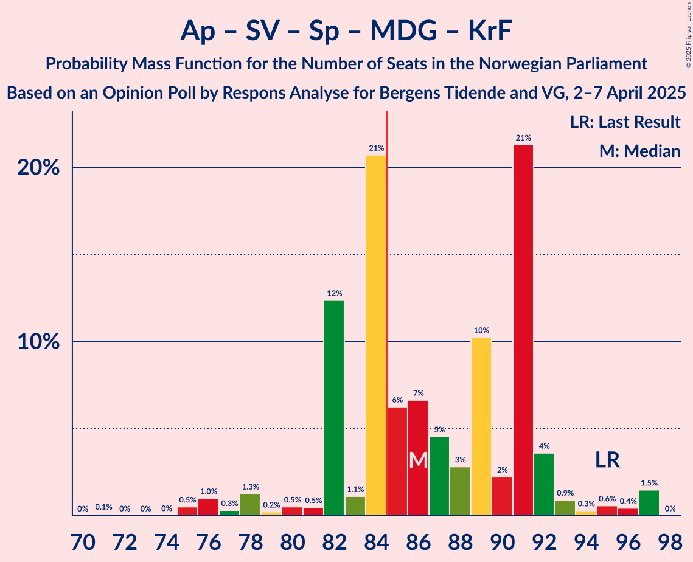
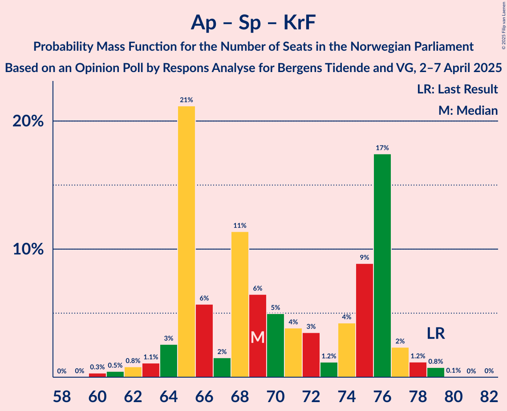

# Opinion Poll by Respons Analyse for Bergens Tidende and VG, 2–7 April 2025

<a href="#voting-intentions">Voting Intentions</a> | <a href="#seats">Seats</a> | <a href="#coalitions">Coalitions</a> | <a href="#technical-information">Technical Information</a>

## Voting Intentions

### Confidence Intervals

| Party | Last Result | Poll Result | 80% Confidence Interval | 90% Confidence Interval | 95% Confidence Interval | 99% Confidence Interval |
|:-----:|:-----------:|:-----------:|:-----------------------:|:-----------------------:|:-----------------------:|:-----------------------:|
| Arbeiderpartiet | 26.2% | 30.1% | 28.3–32.0% |27.7–32.5% |27.3–33.0% |26.4–33.9% |
| Høyre | 20.4% | 20.4% | 18.8–22.1% |18.4–22.6% |18.0–23.0% |17.3–23.8% |
| Fremskrittspartiet | 11.6% | 18.6% | 17.1–20.2% |16.6–20.7% |16.3–21.1% |15.6–21.9% |
| Sosialistisk Venstreparti | 7.6% | 6.4% | 5.5–7.5% |5.2–7.8% |5.0–8.1% |4.6–8.7% |
| Senterpartiet | 13.5% | 5.9% | 5.0–7.0% |4.8–7.3% |4.6–7.5% |4.2–8.1% |
| Rødt | 4.7% | 4.7% | 3.9–5.7% |3.7–5.9% |3.6–6.2% |3.2–6.7% |
| Venstre | 4.6% | 3.9% | 3.2–4.8% |3.0–5.1% |2.9–5.3% |2.6–5.8% |
| Miljøpartiet De Grønne | 3.9% | 3.8% | 3.1–4.7% |2.9–5.0% |2.8–5.2% |2.5–5.6% |
| Kristelig Folkeparti | 3.8% | 3.0% | 2.4–3.8% |2.2–4.0% |2.1–4.3% |1.9–4.7% |
| Industri- og Næringspartiet | 0.3% | 0.9% | 0.6–1.4% |0.5–1.6% |0.5–1.7% |0.4–2.0% |
| Konservativt | 0.4% | 0.4% | 0.2–0.8% |0.2–0.9% |0.2–1.0% |0.1–1.3% |
| Pensjonistpartiet | 0.6% | 0.3% | 0.2–0.7% |0.1–0.8% |0.1–0.9% |0.1–1.1% |
| Liberalistene | 0.2% | 0.2% | 0.1–0.5% |0.1–0.6% |0.1–0.7% |0.0–0.9% |
| Norgesdemokratene | 1.1% | 0.2% | 0.1–0.5% |0.1–0.6% |0.1–0.7% |0.0–0.9% |

*Note:* The poll result column reflects the actual value used in the calculations. Published results may vary slightly, and in addition be rounded to fewer digits.

## Seats

### Confidence Intervals

| Party | Last Result | Median | 80% Confidence Interval | 90% Confidence Interval | 95% Confidence Interval | 99% Confidence Interval |
|:-----:|:-----------:|:------:|:-----------------------:|:-----------------------:|:-----------------------:|:-----------------------:|
| <a href="#arbeiderpartiet">Arbeiderpartiet</a> | 48 | 56 | 51–64 |51–64 |51–64 |47–64 |
| <a href="#høyre">Høyre</a> | 36 | 34 | 33–41 |33–41 |32–41 |31–44 |
| <a href="#fremskrittspartiet">Fremskrittspartiet</a> | 21 | 35 | 32–37 |32–38 |30–39 |30–40 |
| <a href="#sosialistisk-venstreparti">Sosialistisk Venstreparti</a> | 13 | 12 | 10–14 |10–16 |9–16 |8–17 |
| <a href="#senterpartiet">Senterpartiet</a> | 28 | 12 | 9–13 |8–13 |8–13 |7–17 |
| <a href="#rødt">Rødt</a> | 8 | 8 | 1–11 |1–11 |1–11 |1–11 |
| <a href="#venstre">Venstre</a> | 8 | 3 | 2–8 |2–8 |2–9 |2–10 |
| <a href="#miljøpartiet-de-grønne">Miljøpartiet De Grønne</a> | 3 | 3 | 2–8 |2–8 |1–9 |1–10 |
| <a href="#kristelig-folkeparti">Kristelig Folkeparti</a> | 3 | 2 | 1–3 |1–3 |0–7 |0–8 |
| <a href="#industri--og-næringspartiet">Industri- og Næringspartiet</a> | 0 | 0 | 0 |0 |0 |0 |
| <a href="#konservativt">Konservativt</a> | 0 | 0 | 0 |0 |0 |0 |
| <a href="#pensjonistpartiet">Pensjonistpartiet</a> | 0 | 0 | 0 |0 |0 |0 |
| <a href="#liberalistene">Liberalistene</a> | 0 | 0 | 0 |0 |0 |0 |
| <a href="#norgesdemokratene">Norgesdemokratene</a> | 0 | 0 | 0 |0 |0 |0 |

### Arbeiderpartiet

*For a full overview of the results for this party, see the [Arbeiderpartiet](party-arbeiderpartiet.html) page.*

| Number of Seats | Probability | Accumulated | Special Marks |
|:---------------:|:-----------:|:-----------:|:-------------:|
| 47 | 0.7% | 100% |  |
| 48 | 0.4% | 99.3% | Last Result |
| 49 | 0.3% | 98.8% |  |
| 50 | 0.3% | 98.6% |  |
| 51 | 22% | 98% |  |
| 52 | 6% | 76% |  |
| 53 | 0.5% | 70% |  |
| 54 | 9% | 70% |  |
| 55 | 5% | 60% |  |
| 56 | 7% | 56% | Median |
| 57 | 8% | 48% |  |
| 58 | 3% | 41% |  |
| 59 | 1.4% | 38% |  |
| 60 | 6% | 36% |  |
| 61 | 10% | 30% |  |
| 62 | 2% | 20% |  |
| 63 | 0.1% | 18% |  |
| 64 | 18% | 18% |  |
| 65 | 0% | 0.1% |  |
| 66 | 0% | 0.1% |  |
| 67 | 0% | 0% |  |

### Høyre

*For a full overview of the results for this party, see the [Høyre](party-høyre.html) page.*

| Number of Seats | Probability | Accumulated | Special Marks |
|:---------------:|:-----------:|:-----------:|:-------------:|
| 30 | 0.2% | 100% |  |
| 31 | 1.5% | 99.7% |  |
| 32 | 2% | 98% |  |
| 33 | 24% | 97% |  |
| 34 | 31% | 73% | Median |
| 35 | 4% | 42% |  |
| 36 | 4% | 37% | Last Result |
| 37 | 12% | 34% |  |
| 38 | 2% | 21% |  |
| 39 | 4% | 20% |  |
| 40 | 0.8% | 15% |  |
| 41 | 14% | 14% |  |
| 42 | 0.3% | 0.9% |  |
| 43 | 0.1% | 0.6% |  |
| 44 | 0.5% | 0.6% |  |
| 45 | 0.1% | 0.1% |  |
| 46 | 0% | 0% |  |

### Fremskrittspartiet

*For a full overview of the results for this party, see the [Fremskrittspartiet](party-fremskrittspartiet.html) page.*

| Number of Seats | Probability | Accumulated | Special Marks |
|:---------------:|:-----------:|:-----------:|:-------------:|
| 21 | 0% | 100% | Last Result |
| 22 | 0% | 100% |  |
| 23 | 0% | 100% |  |
| 24 | 0% | 100% |  |
| 25 | 0% | 100% |  |
| 26 | 0% | 100% |  |
| 27 | 0.1% | 100% |  |
| 28 | 0.1% | 99.9% |  |
| 29 | 0.1% | 99.8% |  |
| 30 | 3% | 99.7% |  |
| 31 | 1.3% | 97% |  |
| 32 | 22% | 96% |  |
| 33 | 7% | 74% |  |
| 34 | 8% | 67% |  |
| 35 | 10% | 59% | Median |
| 36 | 32% | 49% |  |
| 37 | 11% | 17% |  |
| 38 | 3% | 6% |  |
| 39 | 2% | 3% |  |
| 40 | 0.7% | 1.0% |  |
| 41 | 0.1% | 0.3% |  |
| 42 | 0.1% | 0.2% |  |
| 43 | 0% | 0% |  |

### Sosialistisk Venstreparti

*For a full overview of the results for this party, see the [Sosialistisk Venstreparti](party-sosialistiskvenstreparti.html) page.*

| Number of Seats | Probability | Accumulated | Special Marks |
|:---------------:|:-----------:|:-----------:|:-------------:|
| 8 | 0.6% | 100% |  |
| 9 | 4% | 99.4% |  |
| 10 | 10% | 95% |  |
| 11 | 14% | 86% |  |
| 12 | 30% | 71% | Median |
| 13 | 25% | 42% | Last Result |
| 14 | 11% | 17% |  |
| 15 | 0.6% | 6% |  |
| 16 | 4% | 5% |  |
| 17 | 0.9% | 0.9% |  |
| 18 | 0% | 0% |  |

### Senterpartiet

*For a full overview of the results for this party, see the [Senterpartiet](party-senterpartiet.html) page.*

| Number of Seats | Probability | Accumulated | Special Marks |
|:---------------:|:-----------:|:-----------:|:-------------:|
| 7 | 1.4% | 100% |  |
| 8 | 4% | 98.6% |  |
| 9 | 21% | 95% |  |
| 10 | 8% | 74% |  |
| 11 | 13% | 66% |  |
| 12 | 38% | 53% | Median |
| 13 | 12% | 14% |  |
| 14 | 1.4% | 2% |  |
| 15 | 0.2% | 0.8% |  |
| 16 | 0% | 0.6% |  |
| 17 | 0.6% | 0.6% |  |
| 18 | 0% | 0% |  |
| 19 | 0% | 0% |  |
| 20 | 0% | 0% |  |
| 21 | 0% | 0% |  |
| 22 | 0% | 0% |  |
| 23 | 0% | 0% |  |
| 24 | 0% | 0% |  |
| 25 | 0% | 0% |  |
| 26 | 0% | 0% |  |
| 27 | 0% | 0% |  |
| 28 | 0% | 0% | Last Result |

### Rødt

*For a full overview of the results for this party, see the [Rødt](party-rødt.html) page.*

| Number of Seats | Probability | Accumulated | Special Marks |
|:---------------:|:-----------:|:-----------:|:-------------:|
| 1 | 21% | 100% |  |
| 2 | 1.1% | 79% |  |
| 3 | 0% | 78% |  |
| 4 | 0% | 78% |  |
| 5 | 0% | 78% |  |
| 6 | 2% | 78% |  |
| 7 | 7% | 76% |  |
| 8 | 26% | 68% | Last Result, Median |
| 9 | 2% | 43% |  |
| 10 | 28% | 40% |  |
| 11 | 11% | 12% |  |
| 12 | 0.4% | 0.5% |  |
| 13 | 0.1% | 0.1% |  |
| 14 | 0% | 0% |  |

### Venstre

*For a full overview of the results for this party, see the [Venstre](party-venstre.html) page.*

| Number of Seats | Probability | Accumulated | Special Marks |
|:---------------:|:-----------:|:-----------:|:-------------:|
| 2 | 18% | 100% |  |
| 3 | 40% | 82% | Median |
| 4 | 0% | 43% |  |
| 5 | 0% | 43% |  |
| 6 | 0.2% | 43% |  |
| 7 | 26% | 43% |  |
| 8 | 14% | 16% | Last Result |
| 9 | 0.8% | 3% |  |
| 10 | 2% | 2% |  |
| 11 | 0.1% | 0.1% |  |
| 12 | 0% | 0% |  |

### Miljøpartiet De Grønne

*For a full overview of the results for this party, see the [Miljøpartiet De Grønne](party-miljøpartietdegrønne.html) page.*

| Number of Seats | Probability | Accumulated | Special Marks |
|:---------------:|:-----------:|:-----------:|:-------------:|
| 1 | 3% | 100% |  |
| 2 | 42% | 97% |  |
| 3 | 14% | 55% | Last Result, Median |
| 4 | 0% | 41% |  |
| 5 | 0% | 41% |  |
| 6 | 0.1% | 41% |  |
| 7 | 25% | 41% |  |
| 8 | 11% | 16% |  |
| 9 | 4% | 5% |  |
| 10 | 0.7% | 0.7% |  |
| 11 | 0% | 0% |  |

### Kristelig Folkeparti

*For a full overview of the results for this party, see the [Kristelig Folkeparti](party-kristeligfolkeparti.html) page.*

| Number of Seats | Probability | Accumulated | Special Marks |
|:---------------:|:-----------:|:-----------:|:-------------:|
| 0 | 3% | 100% |  |
| 1 | 17% | 97% |  |
| 2 | 42% | 80% | Median |
| 3 | 34% | 38% | Last Result |
| 4 | 0% | 4% |  |
| 5 | 0% | 4% |  |
| 6 | 0.1% | 4% |  |
| 7 | 3% | 4% |  |
| 8 | 0.2% | 0.7% |  |
| 9 | 0.4% | 0.5% |  |
| 10 | 0.1% | 0.1% |  |
| 11 | 0% | 0% |  |

### Industri- og Næringspartiet

*For a full overview of the results for this party, see the [Industri- og Næringspartiet](party-industri-ognæringspartiet.html) page.*

| Number of Seats | Probability | Accumulated | Special Marks |
|:---------------:|:-----------:|:-----------:|:-------------:|
| 0 | 100% | 100% | Last Result, Median |

### Konservativt

*For a full overview of the results for this party, see the [Konservativt](party-konservativt.html) page.*

| Number of Seats | Probability | Accumulated | Special Marks |
|:---------------:|:-----------:|:-----------:|:-------------:|
| 0 | 100% | 100% | Last Result, Median |

### Pensjonistpartiet

*For a full overview of the results for this party, see the [Pensjonistpartiet](party-pensjonistpartiet.html) page.*

| Number of Seats | Probability | Accumulated | Special Marks |
|:---------------:|:-----------:|:-----------:|:-------------:|
| 0 | 100% | 100% | Last Result, Median |

### Liberalistene

*For a full overview of the results for this party, see the [Liberalistene](party-liberalistene.html) page.*

| Number of Seats | Probability | Accumulated | Special Marks |
|:---------------:|:-----------:|:-----------:|:-------------:|
| 0 | 100% | 100% | Last Result, Median |

### Norgesdemokratene

*For a full overview of the results for this party, see the [Norgesdemokratene](party-norgesdemokratene.html) page.*

| Number of Seats | Probability | Accumulated | Special Marks |
|:---------------:|:-----------:|:-----------:|:-------------:|
| 0 | 100% | 100% | Last Result, Median |

## Coalitions

### Confidence Intervals

| Coalition | Last Result | Median | Majority? | 80% Confidence Interval | 90% Confidence Interval | 95% Confidence Interval | 99% Confidence Interval |
|:---------:|:-----------:|:------:|:---------:|:-----------------------:|:-----------------------:|:-----------------------:|:-----------------------:|
| Arbeiderpartiet – Sosialistisk Venstreparti – Senterpartiet – Rødt – Miljøpartiet De Grønne | 100 | 91 | 98% | 86–98 | 86–98 | 85–98 | 80–100 |
| Høyre – Fremskrittspartiet – Senterpartiet – Venstre – Kristelig Folkeparti | 96 | 90 | 75% | 80–93 | 80–94 | 80–97 | 80–99 |
| Arbeiderpartiet – Sosialistisk Venstreparti – Senterpartiet – Rødt | 97 | 85 | 56% | 83–96 | 81–96 | 78–96 | 77–96 |
| Arbeiderpartiet – Sosialistisk Venstreparti – Senterpartiet – Miljøpartiet De Grønne – Kristelig Folkeparti | 95 | 86 | 61% | 82–91 | 82–92 | 78–95 | 75–97 |
| Arbeiderpartiet – Sosialistisk Venstreparti – Senterpartiet – Miljøpartiet De Grønne | 92 | 84 | 49% | 80–89 | 79–90 | 76–92 | 73–95 |
| Høyre – Fremskrittspartiet – Venstre – Miljøpartiet De Grønne – Kristelig Folkeparti | 71 | 84 | 44% | 73–86 | 73–88 | 73–91 | 73–92 |
| Arbeiderpartiet – Sosialistisk Venstreparti – Rødt – Miljøpartiet De Grønne | 72 | 79 | 25% | 76–89 | 75–89 | 72–89 | 70–89 |
| Arbeiderpartiet – Sosialistisk Venstreparti – Senterpartiet | 89 | 80 | 21% | 75–86 | 73–86 | 72–87 | 69–88 |
| Høyre – Fremskrittspartiet – Venstre – Kristelig Folkeparti | 68 | 78 | 2% | 71–83 | 71–83 | 71–84 | 69–89 |
| Arbeiderpartiet – Senterpartiet – Miljøpartiet De Grønne – Kristelig Folkeparti | 82 | 73 | 2% | 70–79 | 68–82 | 68–82 | 65–85 |
| Høyre – Fremskrittspartiet – Venstre | 65 | 76 | 1.0% | 68–80 | 68–82 | 68–82 | 67–87 |
| Høyre – Fremskrittspartiet | 57 | 70 | 0% | 65–77 | 65–77 | 65–78 | 61–79 |
| Arbeiderpartiet – Senterpartiet – Kristelig Folkeparti | 79 | 69 | 0% | 65–76 | 64–76 | 63–77 | 61–79 |
| Arbeiderpartiet – Sosialistisk Venstreparti | 61 | 68 | 0% | 63–77 | 63–77 | 61–77 | 57–77 |
| Arbeiderpartiet – Senterpartiet | 76 | 67 | 0% | 63–73 | 63–73 | 62–75 | 59–76 |
| Høyre – Venstre – Kristelig Folkeparti | 47 | 43 | 0% | 39–46 | 39–47 | 39–50 | 38–53 |
| Senterpartiet – Venstre – Kristelig Folkeparti | 39 | 18 | 0% | 15–22 | 14–22 | 14–23 | 13–25 |

### Arbeiderpartiet – Sosialistisk Venstreparti – Senterpartiet – Rødt – Miljøpartiet De Grønne

| Number of Seats | Probability | Accumulated | Special Marks |
|:---------------:|:-----------:|:-----------:|:-------------:|
| 76 | 0.2% | 100% |  |
| 77 | 0% | 99.8% |  |
| 78 | 0.1% | 99.8% |  |
| 79 | 0% | 99.7% |  |
| 80 | 0.5% | 99.7% |  |
| 81 | 0.2% | 99.1% |  |
| 82 | 0.2% | 99.0% |  |
| 83 | 0.2% | 98.7% |  |
| 84 | 0.9% | 98.5% |  |
| 85 | 2% | 98% | Majority |
| 86 | 6% | 95% |  |
| 87 | 2% | 89% |  |
| 88 | 10% | 87% |  |
| 89 | 2% | 78% |  |
| 90 | 24% | 76% |  |
| 91 | 6% | 52% | Median |
| 92 | 13% | 46% |  |
| 93 | 2% | 33% |  |
| 94 | 2% | 30% |  |
| 95 | 4% | 28% |  |
| 96 | 4% | 24% |  |
| 97 | 1.0% | 20% |  |
| 98 | 18% | 19% |  |
| 99 | 0% | 0.5% |  |
| 100 | 0.3% | 0.5% | Last Result |
| 101 | 0.2% | 0.2% |  |
| 102 | 0% | 0% |  |

### Høyre – Fremskrittspartiet – Senterpartiet – Venstre – Kristelig Folkeparti

| Number of Seats | Probability | Accumulated | Special Marks |
|:---------------:|:-----------:|:-----------:|:-------------:|
| 79 | 0.1% | 100% |  |
| 80 | 17% | 99.8% |  |
| 81 | 0.3% | 82% |  |
| 82 | 0.1% | 82% |  |
| 83 | 2% | 82% |  |
| 84 | 5% | 80% |  |
| 85 | 2% | 75% | Majority |
| 86 | 6% | 73% | Median |
| 87 | 2% | 67% |  |
| 88 | 3% | 65% |  |
| 89 | 9% | 62% |  |
| 90 | 10% | 53% |  |
| 91 | 21% | 43% |  |
| 92 | 3% | 23% |  |
| 93 | 10% | 20% |  |
| 94 | 5% | 10% |  |
| 95 | 0.7% | 5% |  |
| 96 | 2% | 4% | Last Result |
| 97 | 1.4% | 3% |  |
| 98 | 0.7% | 1.2% |  |
| 99 | 0.1% | 0.5% |  |
| 100 | 0% | 0.4% |  |
| 101 | 0.2% | 0.4% |  |
| 102 | 0% | 0.2% |  |
| 103 | 0% | 0.2% |  |
| 104 | 0% | 0.2% |  |
| 105 | 0% | 0.2% |  |
| 106 | 0.1% | 0.1% |  |
| 107 | 0% | 0% |  |

### Arbeiderpartiet – Sosialistisk Venstreparti – Senterpartiet – Rødt

| Number of Seats | Probability | Accumulated | Special Marks |
|:---------------:|:-----------:|:-----------:|:-------------:|
| 73 | 0.2% | 100% |  |
| 74 | 0% | 99.8% |  |
| 75 | 0% | 99.8% |  |
| 76 | 0% | 99.8% |  |
| 77 | 1.3% | 99.7% |  |
| 78 | 1.2% | 98% |  |
| 79 | 1.1% | 97% |  |
| 80 | 1.1% | 96% |  |
| 81 | 0.7% | 95% |  |
| 82 | 3% | 94% |  |
| 83 | 27% | 91% |  |
| 84 | 9% | 65% |  |
| 85 | 10% | 56% | Majority |
| 86 | 1.1% | 46% |  |
| 87 | 4% | 45% |  |
| 88 | 3% | 41% | Median |
| 89 | 2% | 38% |  |
| 90 | 10% | 36% |  |
| 91 | 0.7% | 26% |  |
| 92 | 0.6% | 26% |  |
| 93 | 4% | 25% |  |
| 94 | 2% | 21% |  |
| 95 | 1.4% | 19% |  |
| 96 | 17% | 17% |  |
| 97 | 0% | 0.1% | Last Result |
| 98 | 0% | 0% |  |

### Arbeiderpartiet – Sosialistisk Venstreparti – Senterpartiet – Miljøpartiet De Grønne – Kristelig Folkeparti

| Number of Seats | Probability | Accumulated | Special Marks |
|:---------------:|:-----------:|:-----------:|:-------------:|
| 71 | 0.1% | 100% |  |
| 72 | 0% | 99.9% |  |
| 73 | 0% | 99.9% |  |
| 74 | 0% | 99.9% |  |
| 75 | 0.5% | 99.9% |  |
| 76 | 1.0% | 99.4% |  |
| 77 | 0.3% | 98% |  |
| 78 | 1.3% | 98% |  |
| 79 | 0.2% | 97% |  |
| 80 | 0.5% | 97% |  |
| 81 | 0.5% | 96% |  |
| 82 | 12% | 96% |  |
| 83 | 1.1% | 83% |  |
| 84 | 21% | 82% |  |
| 85 | 6% | 61% | Median, Majority |
| 86 | 7% | 55% |  |
| 87 | 5% | 48% |  |
| 88 | 3% | 44% |  |
| 89 | 10% | 41% |  |
| 90 | 2% | 31% |  |
| 91 | 21% | 29% |  |
| 92 | 4% | 7% |  |
| 93 | 0.9% | 4% |  |
| 94 | 0.3% | 3% |  |
| 95 | 0.6% | 3% | Last Result |
| 96 | 0.4% | 2% |  |
| 97 | 1.5% | 2% |  |
| 98 | 0% | 0% |  |

### Arbeiderpartiet – Sosialistisk Venstreparti – Senterpartiet – Miljøpartiet De Grønne

| Number of Seats | Probability | Accumulated | Special Marks |
|:---------------:|:-----------:|:-----------:|:-------------:|
| 70 | 0.1% | 100% |  |
| 71 | 0% | 99.9% |  |
| 72 | 0% | 99.9% |  |
| 73 | 0.5% | 99.9% |  |
| 74 | 0.4% | 99.3% |  |
| 75 | 0.2% | 99.0% |  |
| 76 | 2% | 98.7% |  |
| 77 | 0.3% | 97% |  |
| 78 | 0.3% | 96% |  |
| 79 | 4% | 96% |  |
| 80 | 4% | 92% |  |
| 81 | 6% | 88% |  |
| 82 | 27% | 82% |  |
| 83 | 3% | 55% | Median |
| 84 | 3% | 52% |  |
| 85 | 7% | 49% | Majority |
| 86 | 4% | 42% |  |
| 87 | 10% | 38% |  |
| 88 | 18% | 28% |  |
| 89 | 4% | 11% |  |
| 90 | 2% | 7% |  |
| 91 | 1.5% | 5% |  |
| 92 | 2% | 3% | Last Result |
| 93 | 0.1% | 2% |  |
| 94 | 0.1% | 2% |  |
| 95 | 1.5% | 1.5% |  |
| 96 | 0% | 0% |  |

### Høyre – Fremskrittspartiet – Venstre – Miljøpartiet De Grønne – Kristelig Folkeparti

| Number of Seats | Probability | Accumulated | Special Marks |
|:---------------:|:-----------:|:-----------:|:-------------:|
| 71 | 0% | 100% | Last Result |
| 72 | 0% | 100% |  |
| 73 | 17% | 99.9% |  |
| 74 | 1.4% | 83% |  |
| 75 | 2% | 81% |  |
| 76 | 4% | 79% |  |
| 77 | 0.6% | 75% | Median |
| 78 | 0.7% | 74% |  |
| 79 | 10% | 74% |  |
| 80 | 2% | 64% |  |
| 81 | 3% | 62% |  |
| 82 | 4% | 59% |  |
| 83 | 1.1% | 55% |  |
| 84 | 10% | 54% |  |
| 85 | 9% | 44% | Majority |
| 86 | 27% | 35% |  |
| 87 | 3% | 9% |  |
| 88 | 0.7% | 6% |  |
| 89 | 1.1% | 5% |  |
| 90 | 1.1% | 4% |  |
| 91 | 1.2% | 3% |  |
| 92 | 1.3% | 2% |  |
| 93 | 0% | 0.3% |  |
| 94 | 0% | 0.2% |  |
| 95 | 0% | 0.2% |  |
| 96 | 0.2% | 0.2% |  |
| 97 | 0% | 0% |  |

### Arbeiderpartiet – Sosialistisk Venstreparti – Rødt – Miljøpartiet De Grønne

| Number of Seats | Probability | Accumulated | Special Marks |
|:---------------:|:-----------:|:-----------:|:-------------:|
| 63 | 0.1% | 100% |  |
| 64 | 0% | 99.9% |  |
| 65 | 0% | 99.8% |  |
| 66 | 0% | 99.8% |  |
| 67 | 0% | 99.8% |  |
| 68 | 0.2% | 99.8% |  |
| 69 | 0% | 99.6% |  |
| 70 | 0.1% | 99.6% |  |
| 71 | 0.7% | 99.5% |  |
| 72 | 1.4% | 98.8% | Last Result |
| 73 | 2% | 97% |  |
| 74 | 0.7% | 96% |  |
| 75 | 5% | 95% |  |
| 76 | 10% | 90% |  |
| 77 | 3% | 80% |  |
| 78 | 21% | 77% |  |
| 79 | 10% | 57% | Median |
| 80 | 9% | 47% |  |
| 81 | 3% | 38% |  |
| 82 | 2% | 35% |  |
| 83 | 6% | 33% |  |
| 84 | 2% | 27% |  |
| 85 | 5% | 25% | Majority |
| 86 | 2% | 20% |  |
| 87 | 0.1% | 18% |  |
| 88 | 0.3% | 18% |  |
| 89 | 17% | 18% |  |
| 90 | 0.1% | 0.2% |  |
| 91 | 0% | 0% |  |

### Arbeiderpartiet – Sosialistisk Venstreparti – Senterpartiet

| Number of Seats | Probability | Accumulated | Special Marks |
|:---------------:|:-----------:|:-----------:|:-------------:|
| 69 | 0.7% | 100% |  |
| 70 | 0.9% | 99.3% |  |
| 71 | 0.3% | 98% |  |
| 72 | 3% | 98% |  |
| 73 | 1.3% | 95% |  |
| 74 | 2% | 94% |  |
| 75 | 20% | 92% |  |
| 76 | 3% | 72% |  |
| 77 | 7% | 69% |  |
| 78 | 1.3% | 63% |  |
| 79 | 7% | 61% |  |
| 80 | 7% | 54% | Median |
| 81 | 5% | 47% |  |
| 82 | 2% | 42% |  |
| 83 | 9% | 40% |  |
| 84 | 10% | 32% |  |
| 85 | 0.3% | 21% | Majority |
| 86 | 18% | 21% |  |
| 87 | 2% | 3% |  |
| 88 | 0.8% | 0.9% |  |
| 89 | 0% | 0.1% | Last Result |
| 90 | 0% | 0% |  |

### Høyre – Fremskrittspartiet – Venstre – Kristelig Folkeparti

| Number of Seats | Probability | Accumulated | Special Marks |
|:---------------:|:-----------:|:-----------:|:-------------:|
| 68 | 0.2% | 100% | Last Result |
| 69 | 0.3% | 99.8% |  |
| 70 | 0% | 99.5% |  |
| 71 | 18% | 99.5% |  |
| 72 | 1.0% | 81% |  |
| 73 | 4% | 80% |  |
| 74 | 4% | 76% | Median |
| 75 | 2% | 72% |  |
| 76 | 2% | 70% |  |
| 77 | 13% | 67% |  |
| 78 | 6% | 54% |  |
| 79 | 24% | 48% |  |
| 80 | 1.5% | 24% |  |
| 81 | 10% | 22% |  |
| 82 | 2% | 13% |  |
| 83 | 6% | 11% |  |
| 84 | 2% | 5% |  |
| 85 | 0.9% | 2% | Majority |
| 86 | 0.2% | 1.5% |  |
| 87 | 0.2% | 1.3% |  |
| 88 | 0.2% | 1.0% |  |
| 89 | 0.5% | 0.9% |  |
| 90 | 0% | 0.3% |  |
| 91 | 0.1% | 0.3% |  |
| 92 | 0% | 0.2% |  |
| 93 | 0.2% | 0.2% |  |
| 94 | 0% | 0% |  |

### Arbeiderpartiet – Senterpartiet – Miljøpartiet De Grønne – Kristelig Folkeparti

| Number of Seats | Probability | Accumulated | Special Marks |
|:---------------:|:-----------:|:-----------:|:-------------:|
| 61 | 0.1% | 100% |  |
| 62 | 0% | 99.9% |  |
| 63 | 0% | 99.9% |  |
| 64 | 0.1% | 99.9% |  |
| 65 | 1.5% | 99.8% |  |
| 66 | 0.1% | 98% |  |
| 67 | 0.7% | 98% |  |
| 68 | 5% | 98% |  |
| 69 | 0.8% | 93% |  |
| 70 | 9% | 92% |  |
| 71 | 7% | 83% |  |
| 72 | 25% | 76% |  |
| 73 | 2% | 51% | Median |
| 74 | 3% | 50% |  |
| 75 | 3% | 47% |  |
| 76 | 0.2% | 43% |  |
| 77 | 2% | 43% |  |
| 78 | 29% | 42% |  |
| 79 | 4% | 13% |  |
| 80 | 3% | 9% |  |
| 81 | 0.5% | 6% |  |
| 82 | 4% | 6% | Last Result |
| 83 | 0.1% | 2% |  |
| 84 | 0% | 2% |  |
| 85 | 2% | 2% | Majority |
| 86 | 0.3% | 0.3% |  |
| 87 | 0% | 0% |  |

### Høyre – Fremskrittspartiet – Venstre

| Number of Seats | Probability | Accumulated | Special Marks |
|:---------------:|:-----------:|:-----------:|:-------------:|
| 65 | 0.1% | 100% | Last Result |
| 66 | 0% | 99.9% |  |
| 67 | 0.4% | 99.9% |  |
| 68 | 17% | 99.5% |  |
| 69 | 1.2% | 82% |  |
| 70 | 1.2% | 81% |  |
| 71 | 5% | 80% |  |
| 72 | 0.7% | 75% | Median |
| 73 | 6% | 74% |  |
| 74 | 7% | 68% |  |
| 75 | 3% | 60% |  |
| 76 | 11% | 57% |  |
| 77 | 24% | 46% |  |
| 78 | 1.4% | 23% |  |
| 79 | 8% | 21% |  |
| 80 | 7% | 13% |  |
| 81 | 0.5% | 6% |  |
| 82 | 4% | 6% |  |
| 83 | 0.6% | 2% |  |
| 84 | 0.3% | 1.2% |  |
| 85 | 0.2% | 1.0% | Majority |
| 86 | 0.1% | 0.7% |  |
| 87 | 0.5% | 0.6% |  |
| 88 | 0% | 0.1% |  |
| 89 | 0% | 0.1% |  |
| 90 | 0.1% | 0.1% |  |
| 91 | 0% | 0% |  |

### Høyre – Fremskrittspartiet

| Number of Seats | Probability | Accumulated | Special Marks |
|:---------------:|:-----------:|:-----------:|:-------------:|
| 57 | 0% | 100% | Last Result |
| 58 | 0% | 100% |  |
| 59 | 0% | 100% |  |
| 60 | 0.1% | 100% |  |
| 61 | 0.9% | 99.9% |  |
| 62 | 0.6% | 99.0% |  |
| 63 | 0.1% | 98% |  |
| 64 | 0.4% | 98% |  |
| 65 | 19% | 98% |  |
| 66 | 0.3% | 79% |  |
| 67 | 0.6% | 79% |  |
| 68 | 10% | 78% |  |
| 69 | 4% | 68% | Median |
| 70 | 25% | 64% |  |
| 71 | 8% | 39% |  |
| 72 | 5% | 31% |  |
| 73 | 6% | 25% |  |
| 74 | 3% | 19% |  |
| 75 | 4% | 16% |  |
| 76 | 0.6% | 12% |  |
| 77 | 9% | 12% |  |
| 78 | 2% | 3% |  |
| 79 | 1.4% | 2% |  |
| 80 | 0.1% | 0.4% |  |
| 81 | 0.2% | 0.2% |  |
| 82 | 0% | 0% |  |

### Arbeiderpartiet – Senterpartiet – Kristelig Folkeparti

| Number of Seats | Probability | Accumulated | Special Marks |
|:---------------:|:-----------:|:-----------:|:-------------:|
| 60 | 0.3% | 100% |  |
| 61 | 0.5% | 99.6% |  |
| 62 | 0.8% | 99.2% |  |
| 63 | 1.1% | 98% |  |
| 64 | 3% | 97% |  |
| 65 | 21% | 95% |  |
| 66 | 6% | 73% |  |
| 67 | 2% | 68% |  |
| 68 | 11% | 66% |  |
| 69 | 6% | 55% |  |
| 70 | 5% | 48% | Median |
| 71 | 4% | 43% |  |
| 72 | 3% | 40% |  |
| 73 | 1.2% | 36% |  |
| 74 | 4% | 35% |  |
| 75 | 9% | 31% |  |
| 76 | 17% | 22% |  |
| 77 | 2% | 4% |  |
| 78 | 1.2% | 2% |  |
| 79 | 0.8% | 0.9% | Last Result |
| 80 | 0.1% | 0.1% |  |
| 81 | 0% | 0% |  |

### Arbeiderpartiet – Sosialistisk Venstreparti

| Number of Seats | Probability | Accumulated | Special Marks |
|:---------------:|:-----------:|:-----------:|:-------------:|
| 57 | 0.6% | 100% |  |
| 58 | 0.1% | 99.4% |  |
| 59 | 0.5% | 99.3% |  |
| 60 | 0.2% | 98.8% |  |
| 61 | 3% | 98.7% | Last Result |
| 62 | 0.6% | 96% |  |
| 63 | 21% | 95% |  |
| 64 | 0.5% | 75% |  |
| 65 | 2% | 74% |  |
| 66 | 10% | 72% |  |
| 67 | 4% | 62% |  |
| 68 | 9% | 58% | Median |
| 69 | 3% | 49% |  |
| 70 | 8% | 46% |  |
| 71 | 2% | 39% |  |
| 72 | 11% | 36% |  |
| 73 | 6% | 26% |  |
| 74 | 2% | 20% |  |
| 75 | 0.3% | 19% |  |
| 76 | 0.8% | 18% |  |
| 77 | 17% | 17% |  |
| 78 | 0.1% | 0.1% |  |
| 79 | 0% | 0% |  |

### Arbeiderpartiet – Senterpartiet

| Number of Seats | Probability | Accumulated | Special Marks |
|:---------------:|:-----------:|:-----------:|:-------------:|
| 58 | 0.2% | 100% |  |
| 59 | 0.6% | 99.8% |  |
| 60 | 0.9% | 99.1% |  |
| 61 | 0.3% | 98% |  |
| 62 | 3% | 98% |  |
| 63 | 22% | 95% |  |
| 64 | 0.6% | 73% |  |
| 65 | 12% | 73% |  |
| 66 | 7% | 61% |  |
| 67 | 7% | 54% |  |
| 68 | 5% | 47% | Median |
| 69 | 3% | 42% |  |
| 70 | 4% | 39% |  |
| 71 | 4% | 35% |  |
| 72 | 1.3% | 31% |  |
| 73 | 27% | 30% |  |
| 74 | 0% | 3% |  |
| 75 | 2% | 3% |  |
| 76 | 1.3% | 1.4% | Last Result |
| 77 | 0% | 0.1% |  |
| 78 | 0% | 0.1% |  |
| 79 | 0% | 0% |  |

### Høyre – Venstre – Kristelig Folkeparti

| Number of Seats | Probability | Accumulated | Special Marks |
|:---------------:|:-----------:|:-----------:|:-------------:|
| 34 | 0.2% | 100% |  |
| 35 | 0% | 99.8% |  |
| 36 | 0% | 99.8% |  |
| 37 | 0.1% | 99.7% |  |
| 38 | 1.2% | 99.6% |  |
| 39 | 20% | 98% | Median |
| 40 | 6% | 78% |  |
| 41 | 10% | 73% |  |
| 42 | 8% | 63% |  |
| 43 | 27% | 55% |  |
| 44 | 1.2% | 28% |  |
| 45 | 10% | 27% |  |
| 46 | 10% | 17% |  |
| 47 | 3% | 8% | Last Result |
| 48 | 0.3% | 4% |  |
| 49 | 1.2% | 4% |  |
| 50 | 1.0% | 3% |  |
| 51 | 0.4% | 2% |  |
| 52 | 0.2% | 1.2% |  |
| 53 | 0.6% | 1.0% |  |
| 54 | 0.4% | 0.4% |  |
| 55 | 0% | 0% |  |

### Senterpartiet – Venstre – Kristelig Folkeparti

| Number of Seats | Probability | Accumulated | Special Marks |
|:---------------:|:-----------:|:-----------:|:-------------:|
| 10 | 0.2% | 100% |  |
| 11 | 0% | 99.8% |  |
| 12 | 0.2% | 99.8% |  |
| 13 | 0.9% | 99.6% |  |
| 14 | 6% | 98.7% |  |
| 15 | 20% | 93% |  |
| 16 | 10% | 72% |  |
| 17 | 8% | 62% | Median |
| 18 | 14% | 54% |  |
| 19 | 2% | 40% |  |
| 20 | 3% | 38% |  |
| 21 | 22% | 35% |  |
| 22 | 10% | 13% |  |
| 23 | 0.4% | 3% |  |
| 24 | 0.6% | 2% |  |
| 25 | 1.3% | 2% |  |
| 26 | 0.2% | 0.4% |  |
| 27 | 0% | 0.2% |  |
| 28 | 0% | 0.2% |  |
| 29 | 0% | 0.2% |  |
| 30 | 0.2% | 0.2% |  |
| 31 | 0% | 0% |  |
| 32 | 0% | 0% |  |
| 33 | 0% | 0% |  |
| 34 | 0% | 0% |  |
| 35 | 0% | 0% |  |
| 36 | 0% | 0% |  |
| 37 | 0% | 0% |  |
| 38 | 0% | 0% |  |
| 39 | 0% | 0% | Last Result |

## Technical Information

### Opinion Poll

+ **Polling firm:** Respons Analyse
+ **Commissioner(s):** Bergens Tidende and VG
+ **Fieldwork period:** 2–7 April 2025

### Calculations

+ **Sample size:** 1001
+ **Simulations done:** 2,097,152
+ **Error estimate:** 1.37%

