# Opinion Poll by Opinion Perduco for Avisenes Nyhetsbyrå, Dagsavisen and FriFagbevegelse, 14–21 April 2025

<a href="#voting-intentions">Voting Intentions</a> | <a href="#seats">Seats</a> | <a href="#coalitions">Coalitions</a> | <a href="#technical-information">Technical Information</a>

## Voting Intentions

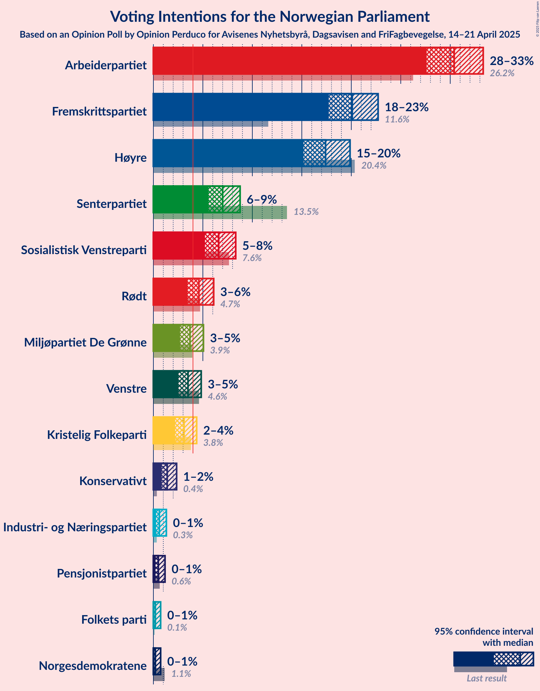

### Confidence Intervals

| Party | Last Result | Poll Result | 80% Confidence Interval | 90% Confidence Interval | 95% Confidence Interval | 99% Confidence Interval |
|:-----:|:-----------:|:-----------:|:-----------------------:|:-----------------------:|:-----------------------:|:-----------------------:|
| Arbeiderpartiet | 26.2% | 30.4% | 28.6–32.3% |28.1–32.9% |27.6–33.3% |26.8–34.3% |
| Fremskrittspartiet | 11.6% | 20.1% | 18.5–21.8% |18.1–22.3% |17.7–22.7% |17.0–23.5% |
| Høyre | 20.4% | 17.4% | 15.9–19.0% |15.5–19.5% |15.2–19.9% |14.5–20.7% |
| Senterpartiet | 13.5% | 7.0% | 6.1–8.2% |5.8–8.5% |5.6–8.8% |5.2–9.3% |
| Sosialistisk Venstreparti | 7.6% | 6.6% | 5.7–7.7% |5.4–8.0% |5.2–8.3% |4.8–8.9% |
| Rødt | 4.7% | 4.6% | 3.9–5.6% |3.6–5.9% |3.5–6.1% |3.1–6.6% |
| Miljøpartiet De Grønne | 3.9% | 3.7% | 3.0–4.6% |2.9–4.8% |2.7–5.1% |2.4–5.5% |
| Venstre | 4.6% | 3.5% | 2.9–4.4% |2.7–4.6% |2.5–4.8% |2.2–5.3% |
| Kristelig Folkeparti | 3.8% | 3.1% | 2.5–3.9% |2.3–4.2% |2.2–4.4% |1.9–4.8% |
| Konservativt | 0.4% | 1.4% | 1.0–2.0% |0.9–2.2% |0.8–2.3% |0.7–2.7% |
| Industri- og Næringspartiet | 0.3% | 0.6% | 0.4–1.1% |0.3–1.2% |0.3–1.3% |0.2–1.6% |
| Pensjonistpartiet | 0.6% | 0.5% | 0.3–0.9% |0.3–1.1% |0.2–1.2% |0.2–1.4% |
| Folkets parti | 0.1% | 0.2% | 0.1–0.5% |0.1–0.6% |0.1–0.7% |0.0–0.9% |
| Norgesdemokratene | 1.1% | 0.2% | 0.1–0.5% |0.1–0.6% |0.1–0.7% |0.0–0.9% |

*Note:* The poll result column reflects the actual value used in the calculations. Published results may vary slightly, and in addition be rounded to fewer digits.

## Seats

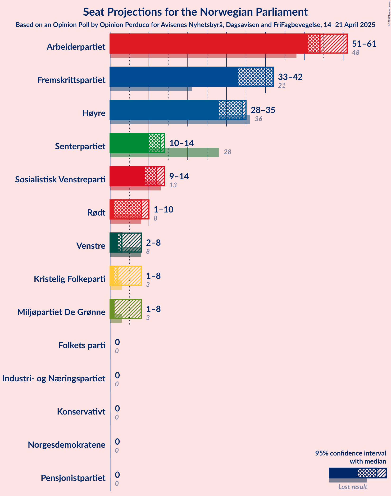

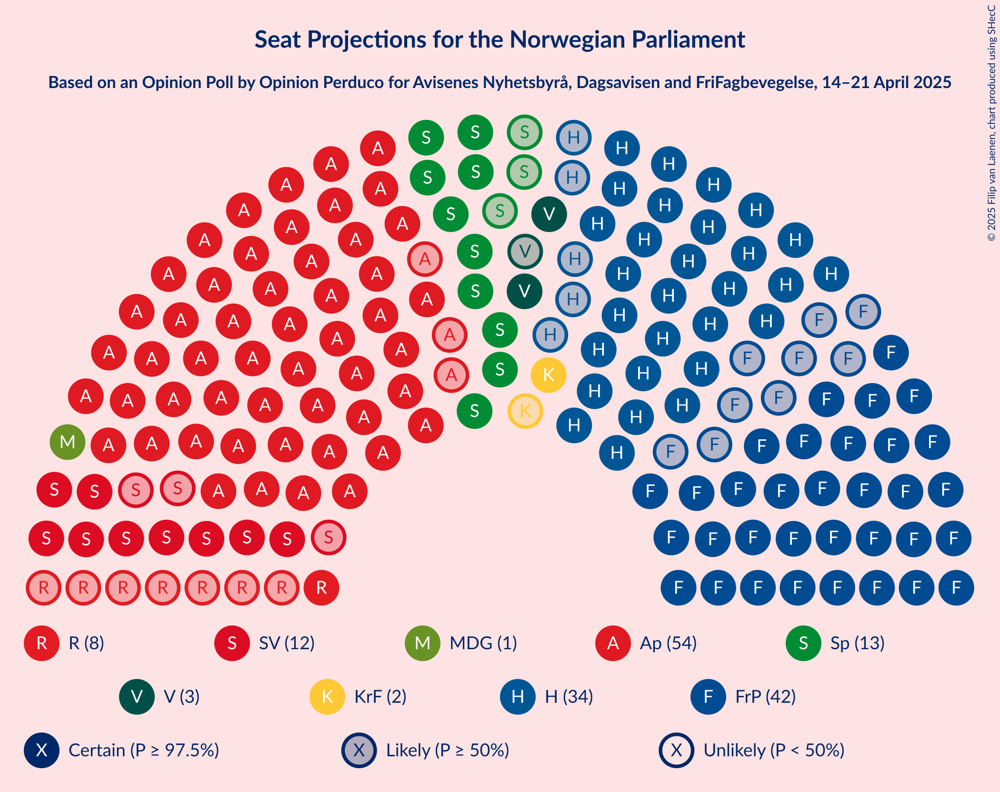

### Confidence Intervals

| Party | Last Result | Median | 80% Confidence Interval | 90% Confidence Interval | 95% Confidence Interval | 99% Confidence Interval |
|:-----:|:-----------:|:------:|:-----------------------:|:-----------------------:|:-----------------------:|:-----------------------:|
| <a href="#arbeiderpartiet">Arbeiderpartiet</a> | 48 | 54 | 54–56 |54–60 |51–61 |48–63 |
| <a href="#fremskrittspartiet">Fremskrittspartiet</a> | 21 | 42 | 38–42 |35–42 |33–42 |33–45 |
| <a href="#høyre">Høyre</a> | 36 | 34 | 31–34 |29–34 |28–35 |26–37 |
| <a href="#senterpartiet">Senterpartiet</a> | 28 | 13 | 12–13 |11–14 |10–14 |8–16 |
| <a href="#sosialistisk-venstreparti">Sosialistisk Venstreparti</a> | 13 | 12 | 12 |10–13 |9–14 |9–16 |
| <a href="#rødt">Rødt</a> | 8 | 8 | 8–9 |8–9 |1–10 |1–12 |
| <a href="#miljøpartiet-de-grønne">Miljøpartiet De Grønne</a> | 3 | 1 | 1–4 |1–8 |1–8 |1–9 |
| <a href="#venstre">Venstre</a> | 8 | 3 | 3 |2–7 |2–8 |1–9 |
| <a href="#kristelig-folkeparti">Kristelig Folkeparti</a> | 3 | 2 | 2–3 |1–3 |1–8 |0–8 |
| <a href="#konservativt">Konservativt</a> | 0 | 0 | 0 |0 |0 |0 |
| <a href="#industri--og-næringspartiet">Industri- og Næringspartiet</a> | 0 | 0 | 0 |0 |0 |0 |
| <a href="#pensjonistpartiet">Pensjonistpartiet</a> | 0 | 0 | 0 |0 |0 |0 |
| <a href="#folkets-parti">Folkets parti</a> | 0 | 0 | 0 |0 |0 |0 |
| <a href="#norgesdemokratene">Norgesdemokratene</a> | 0 | 0 | 0 |0 |0 |0 |

### Arbeiderpartiet

*For a full overview of the results for this party, see the [Arbeiderpartiet](party-arbeiderpartiet.html) page.*

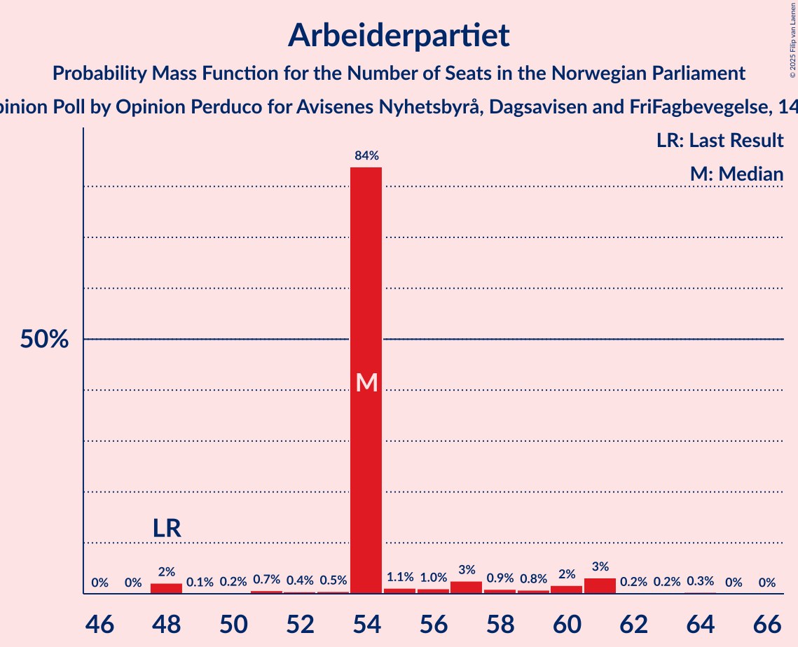

| Number of Seats | Probability | Accumulated | Special Marks |
|:---------------:|:-----------:|:-----------:|:-------------:|
| 48 | 2% | 100% | Last Result |
| 49 | 0.1% | 98% |  |
| 50 | 0.2% | 98% |  |
| 51 | 0.7% | 98% |  |
| 52 | 0.4% | 97% |  |
| 53 | 0.5% | 96% |  |
| 54 | 84% | 96% | Median |
| 55 | 1.1% | 12% |  |
| 56 | 1.0% | 11% |  |
| 57 | 3% | 10% |  |
| 58 | 0.9% | 7% |  |
| 59 | 0.8% | 6% |  |
| 60 | 2% | 6% |  |
| 61 | 3% | 4% |  |
| 62 | 0.2% | 0.8% |  |
| 63 | 0.2% | 0.6% |  |
| 64 | 0.3% | 0.4% |  |
| 65 | 0% | 0.1% |  |
| 66 | 0% | 0% |  |

### Fremskrittspartiet

*For a full overview of the results for this party, see the [Fremskrittspartiet](party-fremskrittspartiet.html) page.*

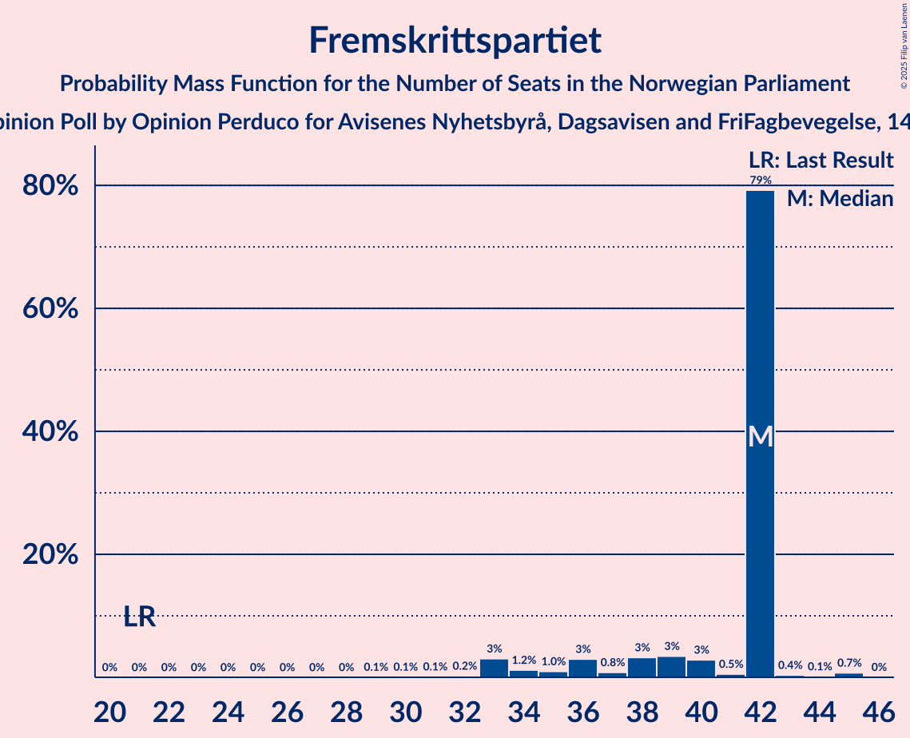

| Number of Seats | Probability | Accumulated | Special Marks |
|:---------------:|:-----------:|:-----------:|:-------------:|
| 21 | 0% | 100% | Last Result |
| 22 | 0% | 100% |  |
| 23 | 0% | 100% |  |
| 24 | 0% | 100% |  |
| 25 | 0% | 100% |  |
| 26 | 0% | 100% |  |
| 27 | 0% | 100% |  |
| 28 | 0% | 100% |  |
| 29 | 0.1% | 100% |  |
| 30 | 0.1% | 99.9% |  |
| 31 | 0.1% | 99.9% |  |
| 32 | 0.2% | 99.7% |  |
| 33 | 3% | 99.5% |  |
| 34 | 1.2% | 96% |  |
| 35 | 1.0% | 95% |  |
| 36 | 3% | 94% |  |
| 37 | 0.8% | 91% |  |
| 38 | 3% | 91% |  |
| 39 | 3% | 87% |  |
| 40 | 3% | 84% |  |
| 41 | 0.5% | 81% |  |
| 42 | 79% | 81% | Median |
| 43 | 0.4% | 1.3% |  |
| 44 | 0.1% | 0.9% |  |
| 45 | 0.7% | 0.8% |  |
| 46 | 0% | 0% |  |

### Høyre

*For a full overview of the results for this party, see the [Høyre](party-høyre.html) page.*

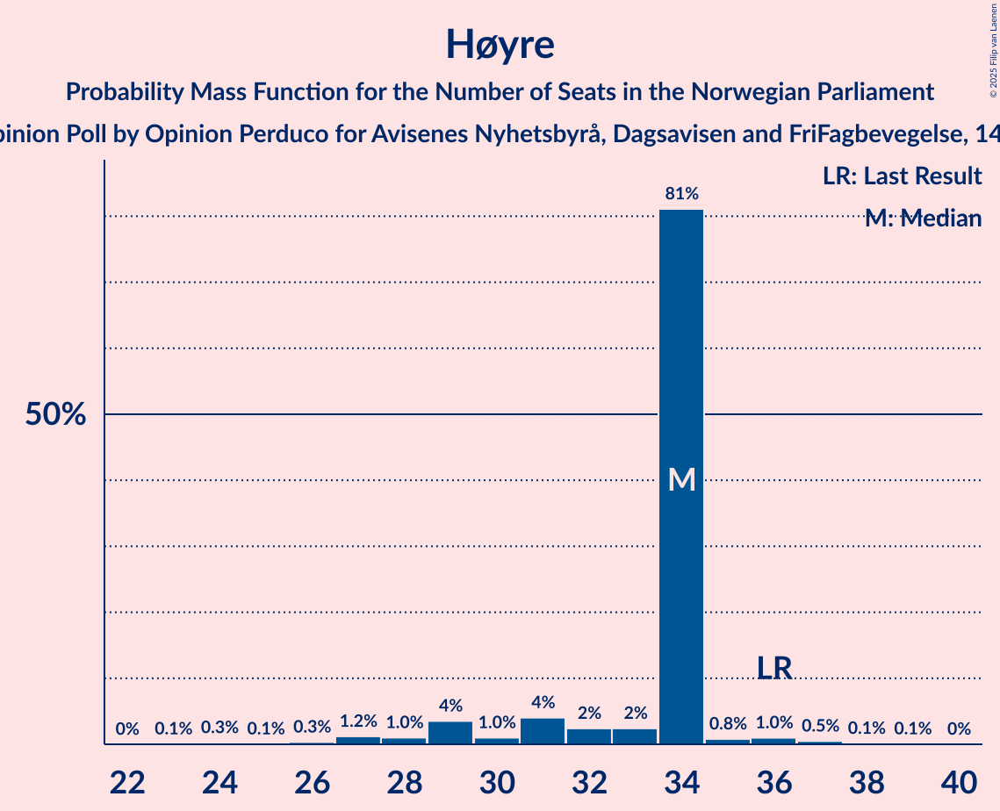

| Number of Seats | Probability | Accumulated | Special Marks |
|:---------------:|:-----------:|:-----------:|:-------------:|
| 23 | 0.1% | 100% |  |
| 24 | 0.3% | 99.9% |  |
| 25 | 0.1% | 99.7% |  |
| 26 | 0.3% | 99.6% |  |
| 27 | 1.2% | 99.3% |  |
| 28 | 1.0% | 98% |  |
| 29 | 4% | 97% |  |
| 30 | 1.0% | 94% |  |
| 31 | 4% | 93% |  |
| 32 | 2% | 88% |  |
| 33 | 2% | 86% |  |
| 34 | 81% | 84% | Median |
| 35 | 0.8% | 3% |  |
| 36 | 1.0% | 2% | Last Result |
| 37 | 0.5% | 0.7% |  |
| 38 | 0.1% | 0.2% |  |
| 39 | 0.1% | 0.1% |  |
| 40 | 0% | 0% |  |

### Senterpartiet

*For a full overview of the results for this party, see the [Senterpartiet](party-senterpartiet.html) page.*

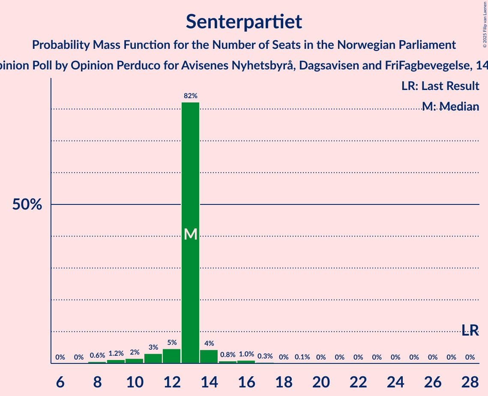

| Number of Seats | Probability | Accumulated | Special Marks |
|:---------------:|:-----------:|:-----------:|:-------------:|
| 8 | 0.6% | 100% |  |
| 9 | 1.2% | 99.4% |  |
| 10 | 2% | 98% |  |
| 11 | 3% | 97% |  |
| 12 | 5% | 93% |  |
| 13 | 82% | 89% | Median |
| 14 | 4% | 7% |  |
| 15 | 0.8% | 2% |  |
| 16 | 1.0% | 1.5% |  |
| 17 | 0.3% | 0.5% |  |
| 18 | 0% | 0.1% |  |
| 19 | 0.1% | 0.1% |  |
| 20 | 0% | 0% |  |
| 21 | 0% | 0% |  |
| 22 | 0% | 0% |  |
| 23 | 0% | 0% |  |
| 24 | 0% | 0% |  |
| 25 | 0% | 0% |  |
| 26 | 0% | 0% |  |
| 27 | 0% | 0% |  |
| 28 | 0% | 0% | Last Result |

### Sosialistisk Venstreparti

*For a full overview of the results for this party, see the [Sosialistisk Venstreparti](party-sosialistiskvenstreparti.html) page.*

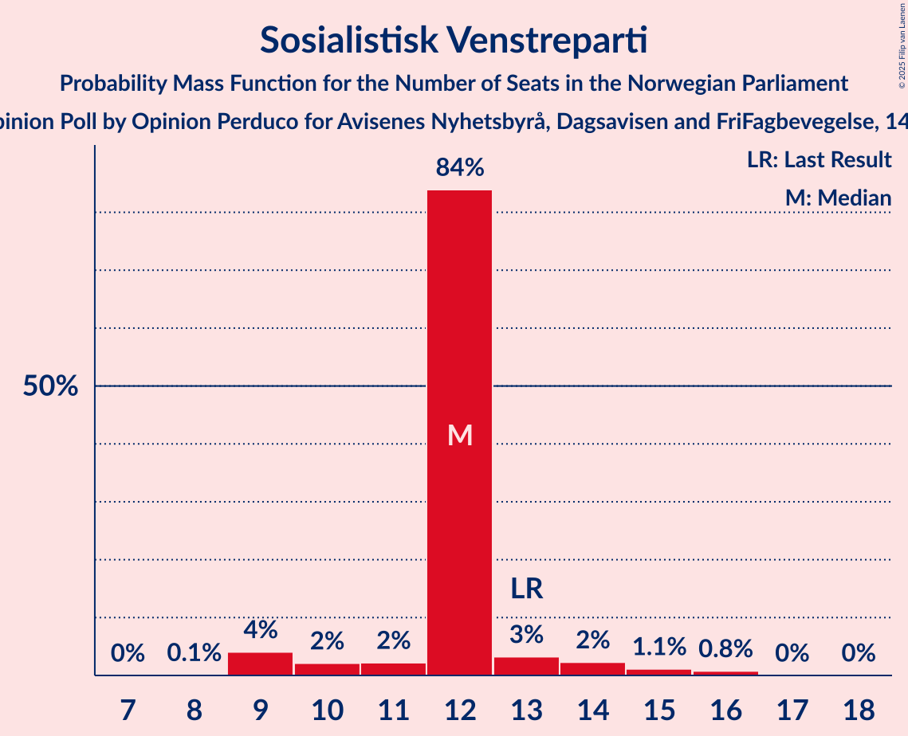

| Number of Seats | Probability | Accumulated | Special Marks |
|:---------------:|:-----------:|:-----------:|:-------------:|
| 8 | 0.1% | 100% |  |
| 9 | 4% | 99.9% |  |
| 10 | 2% | 96% |  |
| 11 | 2% | 94% |  |
| 12 | 84% | 91% | Median |
| 13 | 3% | 8% | Last Result |
| 14 | 2% | 4% |  |
| 15 | 1.1% | 2% |  |
| 16 | 0.8% | 0.9% |  |
| 17 | 0% | 0.1% |  |
| 18 | 0% | 0% |  |

### Rødt

*For a full overview of the results for this party, see the [Rødt](party-rødt.html) page.*

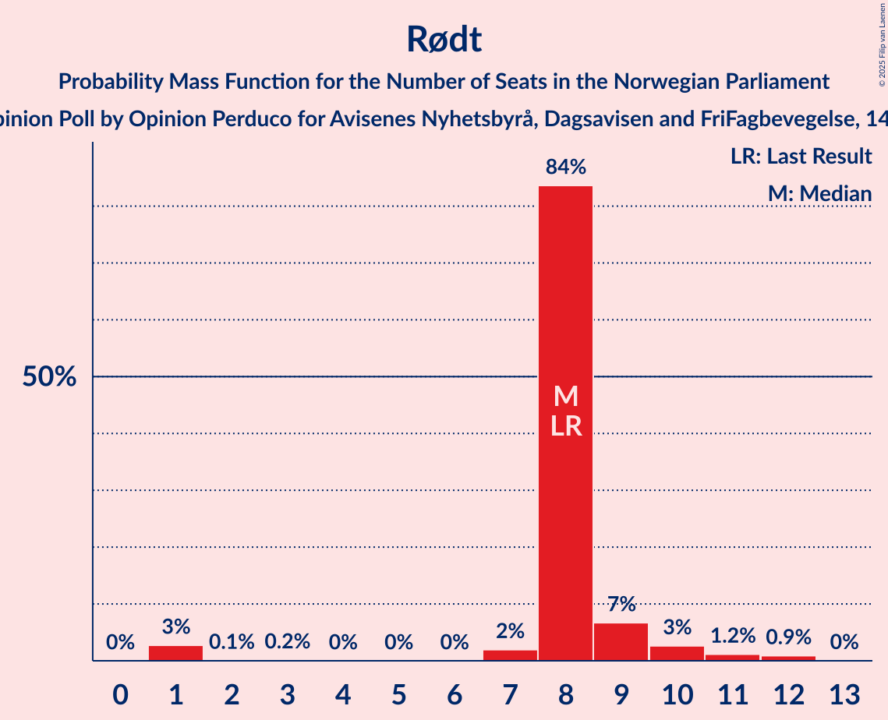

| Number of Seats | Probability | Accumulated | Special Marks |
|:---------------:|:-----------:|:-----------:|:-------------:|
| 1 | 3% | 100% |  |
| 2 | 0.1% | 97% |  |
| 3 | 0.2% | 97% |  |
| 4 | 0% | 97% |  |
| 5 | 0% | 97% |  |
| 6 | 0% | 97% |  |
| 7 | 2% | 97% |  |
| 8 | 84% | 95% | Last Result, Median |
| 9 | 7% | 11% |  |
| 10 | 3% | 5% |  |
| 11 | 1.2% | 2% |  |
| 12 | 0.9% | 0.9% |  |
| 13 | 0% | 0% |  |

### Miljøpartiet De Grønne

*For a full overview of the results for this party, see the [Miljøpartiet De Grønne](party-miljøpartietdegrønne.html) page.*

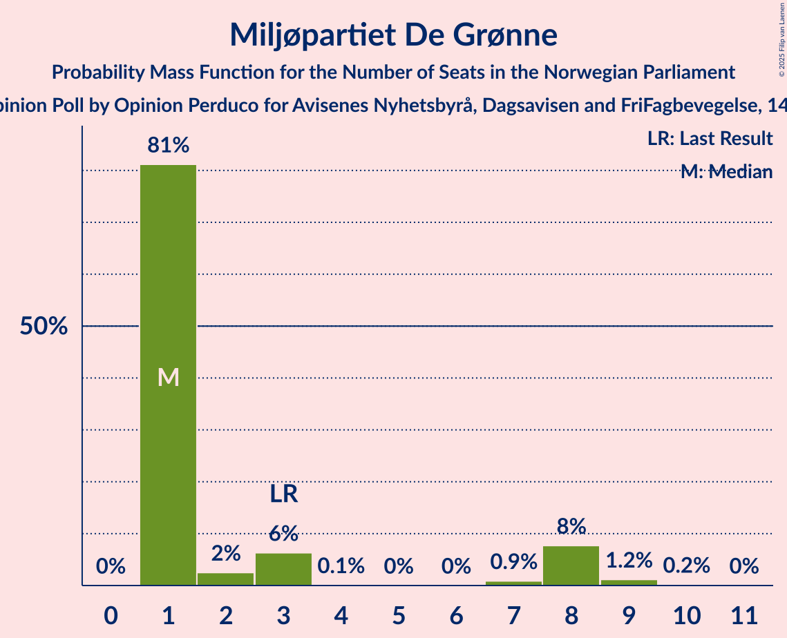

| Number of Seats | Probability | Accumulated | Special Marks |
|:---------------:|:-----------:|:-----------:|:-------------:|
| 1 | 81% | 100% | Median |
| 2 | 2% | 19% |  |
| 3 | 6% | 16% | Last Result |
| 4 | 0.1% | 10% |  |
| 5 | 0% | 10% |  |
| 6 | 0% | 10% |  |
| 7 | 0.9% | 10% |  |
| 8 | 8% | 9% |  |
| 9 | 1.2% | 1.3% |  |
| 10 | 0.2% | 0.2% |  |
| 11 | 0% | 0% |  |

### Venstre

*For a full overview of the results for this party, see the [Venstre](party-venstre.html) page.*

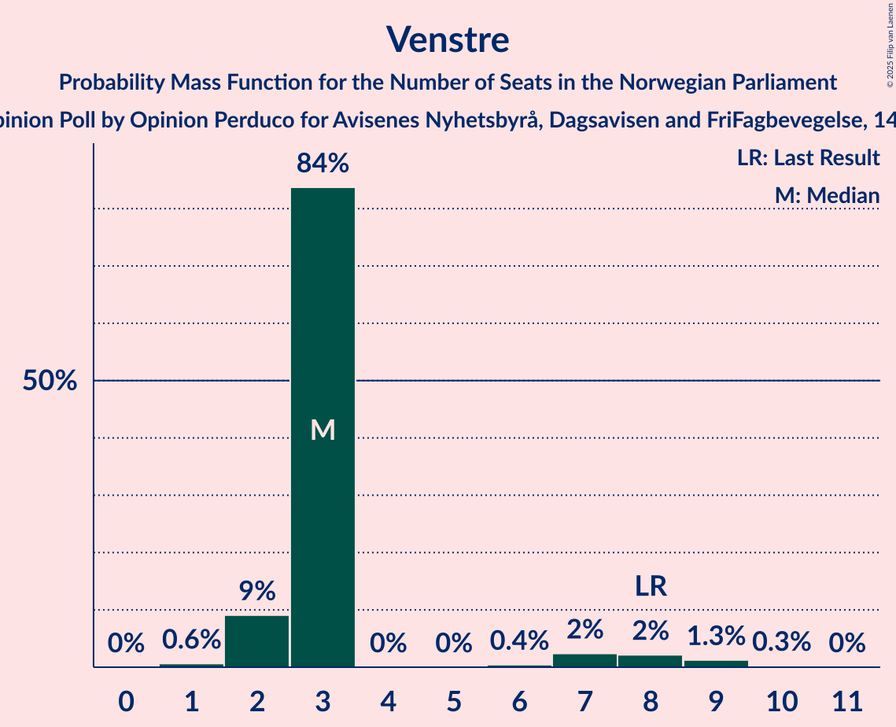

| Number of Seats | Probability | Accumulated | Special Marks |
|:---------------:|:-----------:|:-----------:|:-------------:|
| 1 | 0.6% | 100% |  |
| 2 | 9% | 99.4% |  |
| 3 | 84% | 90% | Median |
| 4 | 0% | 7% |  |
| 5 | 0% | 7% |  |
| 6 | 0.4% | 7% |  |
| 7 | 2% | 6% |  |
| 8 | 2% | 4% | Last Result |
| 9 | 1.3% | 2% |  |
| 10 | 0.3% | 0.3% |  |
| 11 | 0% | 0% |  |

### Kristelig Folkeparti

*For a full overview of the results for this party, see the [Kristelig Folkeparti](party-kristeligfolkeparti.html) page.*

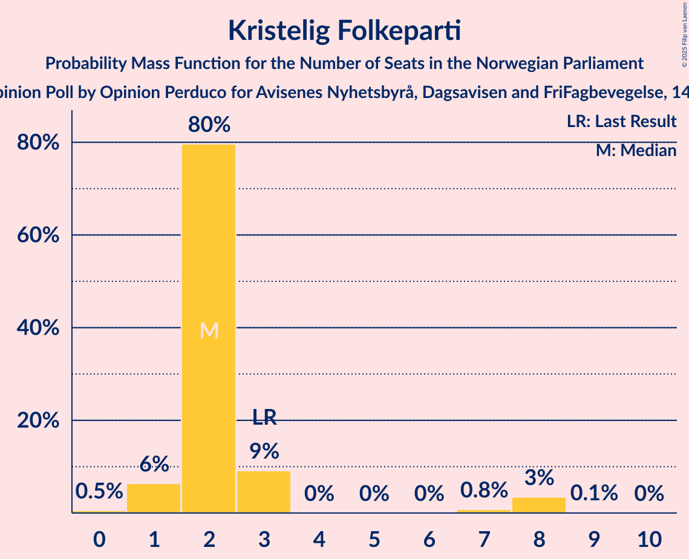

| Number of Seats | Probability | Accumulated | Special Marks |
|:---------------:|:-----------:|:-----------:|:-------------:|
| 0 | 0.5% | 100% |  |
| 1 | 6% | 99.5% |  |
| 2 | 80% | 93% | Median |
| 3 | 9% | 13% | Last Result |
| 4 | 0% | 4% |  |
| 5 | 0% | 4% |  |
| 6 | 0% | 4% |  |
| 7 | 0.8% | 4% |  |
| 8 | 3% | 4% |  |
| 9 | 0.1% | 0.1% |  |
| 10 | 0% | 0% |  |

### Konservativt

*For a full overview of the results for this party, see the [Konservativt](party-konservativt.html) page.*

| Number of Seats | Probability | Accumulated | Special Marks |
|:---------------:|:-----------:|:-----------:|:-------------:|
| 0 | 100% | 100% | Last Result, Median |

### Industri- og Næringspartiet

*For a full overview of the results for this party, see the [Industri- og Næringspartiet](party-industri-ognæringspartiet.html) page.*

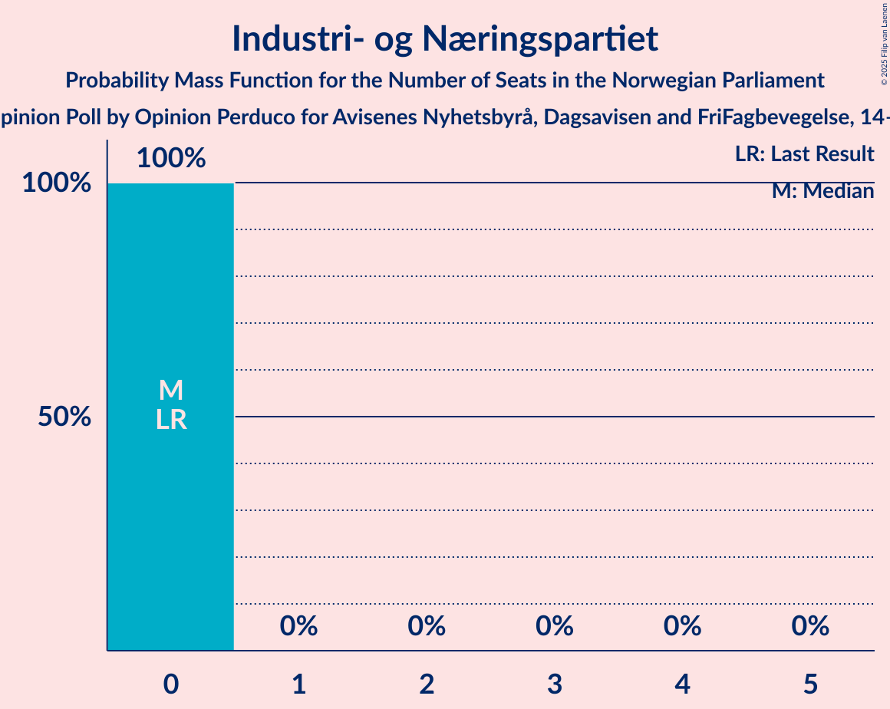

| Number of Seats | Probability | Accumulated | Special Marks |
|:---------------:|:-----------:|:-----------:|:-------------:|
| 0 | 100% | 100% | Last Result, Median |

### Pensjonistpartiet

*For a full overview of the results for this party, see the [Pensjonistpartiet](party-pensjonistpartiet.html) page.*

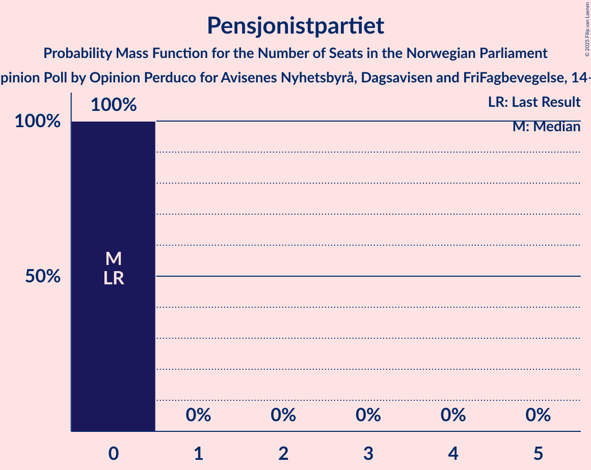

| Number of Seats | Probability | Accumulated | Special Marks |
|:---------------:|:-----------:|:-----------:|:-------------:|
| 0 | 100% | 100% | Last Result, Median |

### Folkets parti

*For a full overview of the results for this party, see the [Folkets parti](party-folketsparti.html) page.*

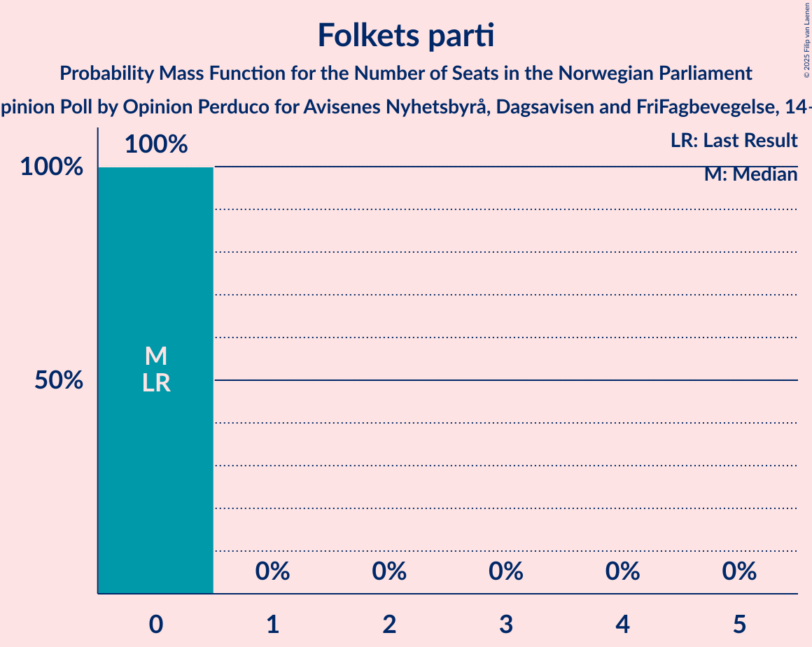

| Number of Seats | Probability | Accumulated | Special Marks |
|:---------------:|:-----------:|:-----------:|:-------------:|
| 0 | 100% | 100% | Last Result, Median |

### Norgesdemokratene

*For a full overview of the results for this party, see the [Norgesdemokratene](party-norgesdemokratene.html) page.*

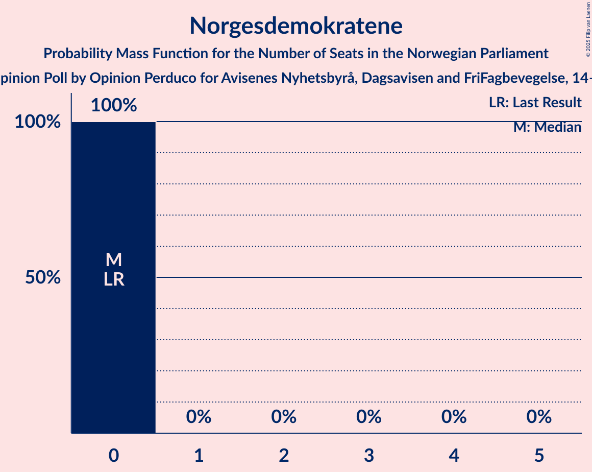

| Number of Seats | Probability | Accumulated | Special Marks |
|:---------------:|:-----------:|:-----------:|:-------------:|
| 0 | 100% | 100% | Last Result, Median |

## Coalitions

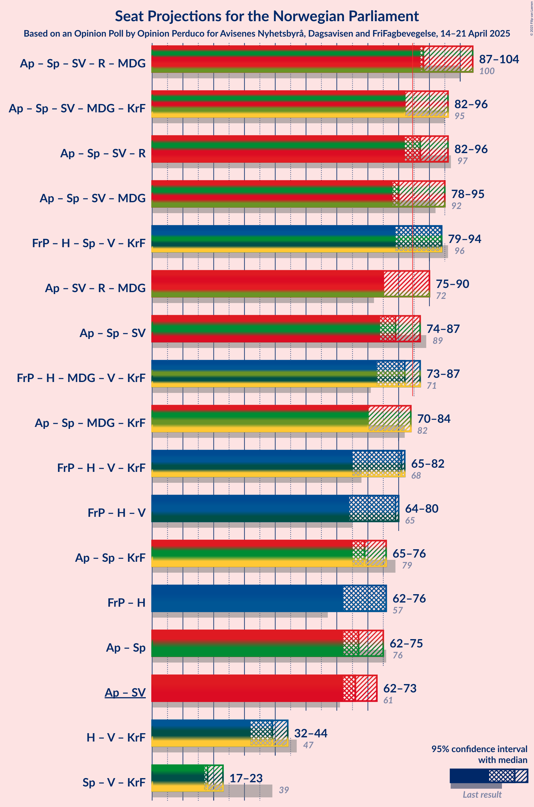

### Confidence Intervals

| Coalition | Last Result | Median | Majority? | 80% Confidence Interval | 90% Confidence Interval | 95% Confidence Interval | 99% Confidence Interval |
|:---------:|:-----------:|:------:|:---------:|:-----------------------:|:-----------------------:|:-----------------------:|:-----------------------:|
| Arbeiderpartiet – Senterpartiet – Sosialistisk Venstreparti – Rødt – Miljøpartiet De Grønne | 100 | 88 | 99.3% | 88–92 | 88–97 | 87–104 | 83–104 |
| Arbeiderpartiet – Senterpartiet – Sosialistisk Venstreparti – Miljøpartiet De Grønne – Kristelig Folkeparti | 95 | 82 | 18% | 82–87 | 82–93 | 82–96 | 79–96 |
| Arbeiderpartiet – Senterpartiet – Sosialistisk Venstreparti – Rødt | 97 | 87 | 94% | 86–88 | 83–93 | 82–96 | 78–96 |
| Arbeiderpartiet – Senterpartiet – Sosialistisk Venstreparti – Miljøpartiet De Grønne | 92 | 80 | 8% | 80–84 | 80–91 | 78–95 | 77–95 |
| Fremskrittspartiet – Høyre – Senterpartiet – Venstre – Kristelig Folkeparti | 96 | 94 | 95% | 89–94 | 84–94 | 79–94 | 79–97 |
| Arbeiderpartiet – Sosialistisk Venstreparti – Rødt – Miljøpartiet De Grønne | 72 | 75 | 5% | 75–80 | 75–85 | 75–90 | 72–90 |
| Arbeiderpartiet – Senterpartiet – Sosialistisk Venstreparti | 89 | 79 | 5% | 79–81 | 75–85 | 74–87 | 71–90 |
| Fremskrittspartiet – Høyre – Miljøpartiet De Grønne – Venstre – Kristelig Folkeparti | 71 | 82 | 6% | 81–83 | 76–86 | 73–87 | 73–91 |
| Arbeiderpartiet – Senterpartiet – Miljøpartiet De Grønne – Kristelig Folkeparti | 82 | 70 | 0.6% | 70–77 | 70–81 | 70–84 | 68–85 |
| Fremskrittspartiet – Høyre – Venstre – Kristelig Folkeparti | 68 | 81 | 0.7% | 77–81 | 72–81 | 65–82 | 65–86 |
| Fremskrittspartiet – Høyre – Venstre | 65 | 79 | 0% | 73–79 | 69–79 | 64–80 | 64–82 |
| Arbeiderpartiet – Senterpartiet – Kristelig Folkeparti | 79 | 69 | 0% | 69–73 | 68–75 | 65–76 | 63–79 |
| Fremskrittspartiet – Høyre | 57 | 76 | 0% | 69–76 | 65–76 | 62–76 | 62–77 |
| Arbeiderpartiet – Senterpartiet | 76 | 67 | 0% | 66–67 | 65–73 | 62–75 | 61–76 |
| Arbeiderpartiet – Sosialistisk Venstreparti | 61 | 66 | 0% | 66–69 | 63–72 | 62–73 | 60–76 |
| Høyre – Venstre – Kristelig Folkeparti | 47 | 39 | 0% | 38–39 | 35–43 | 32–44 | 32–48 |
| Senterpartiet – Venstre – Kristelig Folkeparti | 39 | 18 | 0% | 18–20 | 17–22 | 17–23 | 13–28 |

### Arbeiderpartiet – Senterpartiet – Sosialistisk Venstreparti – Rødt – Miljøpartiet De Grønne

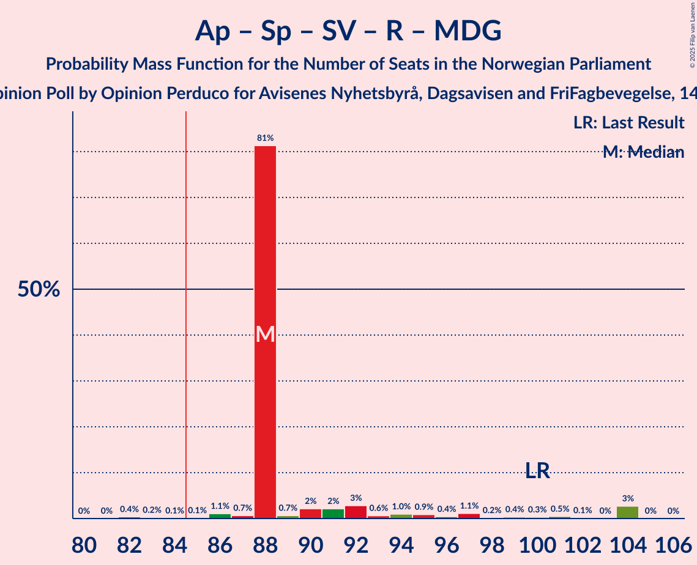

| Number of Seats | Probability | Accumulated | Special Marks |
|:---------------:|:-----------:|:-----------:|:-------------:|
| 82 | 0.4% | 100% |  |
| 83 | 0.2% | 99.6% |  |
| 84 | 0.1% | 99.3% |  |
| 85 | 0.1% | 99.3% | Majority |
| 86 | 1.1% | 99.1% |  |
| 87 | 0.7% | 98% |  |
| 88 | 81% | 97% | Median |
| 89 | 0.7% | 16% |  |
| 90 | 2% | 15% |  |
| 91 | 2% | 13% |  |
| 92 | 3% | 11% |  |
| 93 | 0.6% | 8% |  |
| 94 | 1.0% | 8% |  |
| 95 | 0.9% | 7% |  |
| 96 | 0.4% | 6% |  |
| 97 | 1.1% | 5% |  |
| 98 | 0.2% | 4% |  |
| 99 | 0.4% | 4% |  |
| 100 | 0.3% | 4% | Last Result |
| 101 | 0.5% | 3% |  |
| 102 | 0.1% | 3% |  |
| 103 | 0% | 3% |  |
| 104 | 3% | 3% |  |
| 105 | 0% | 0% |  |

### Arbeiderpartiet – Senterpartiet – Sosialistisk Venstreparti – Miljøpartiet De Grønne – Kristelig Folkeparti

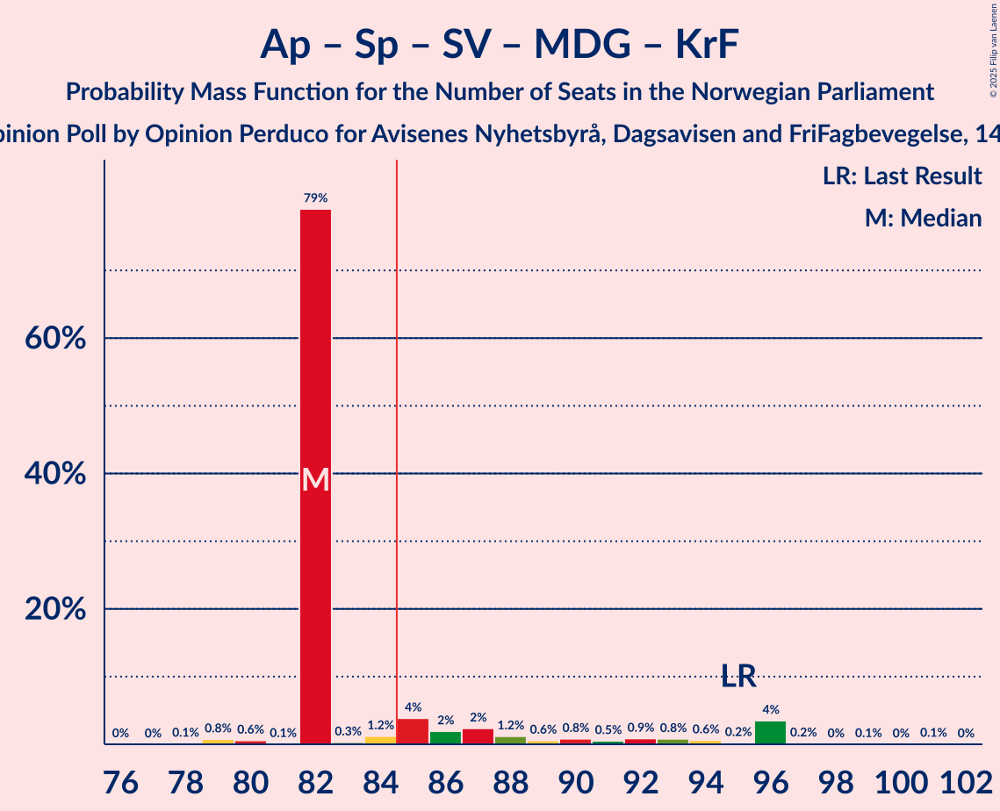

| Number of Seats | Probability | Accumulated | Special Marks |
|:---------------:|:-----------:|:-----------:|:-------------:|
| 76 | 0% | 100% |  |
| 77 | 0% | 99.9% |  |
| 78 | 0.1% | 99.9% |  |
| 79 | 0.8% | 99.8% |  |
| 80 | 0.6% | 99.0% |  |
| 81 | 0.1% | 98% |  |
| 82 | 79% | 98% | Median |
| 83 | 0.3% | 19% |  |
| 84 | 1.2% | 19% |  |
| 85 | 4% | 18% | Majority |
| 86 | 2% | 14% |  |
| 87 | 2% | 12% |  |
| 88 | 1.2% | 10% |  |
| 89 | 0.6% | 8% |  |
| 90 | 0.8% | 8% |  |
| 91 | 0.5% | 7% |  |
| 92 | 0.9% | 6% |  |
| 93 | 0.8% | 6% |  |
| 94 | 0.6% | 5% |  |
| 95 | 0.2% | 4% | Last Result |
| 96 | 4% | 4% |  |
| 97 | 0.2% | 0.4% |  |
| 98 | 0% | 0.3% |  |
| 99 | 0.1% | 0.2% |  |
| 100 | 0% | 0.2% |  |
| 101 | 0.1% | 0.2% |  |
| 102 | 0% | 0% |  |

### Arbeiderpartiet – Senterpartiet – Sosialistisk Venstreparti – Rødt

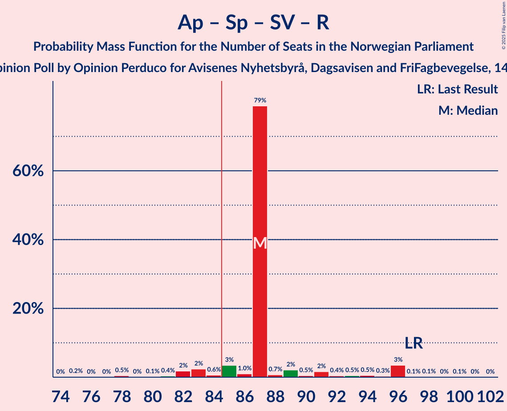

| Number of Seats | Probability | Accumulated | Special Marks |
|:---------------:|:-----------:|:-----------:|:-------------:|
| 75 | 0.2% | 100% |  |
| 76 | 0% | 99.8% |  |
| 77 | 0% | 99.8% |  |
| 78 | 0.5% | 99.8% |  |
| 79 | 0% | 99.3% |  |
| 80 | 0.1% | 99.3% |  |
| 81 | 0.4% | 99.1% |  |
| 82 | 2% | 98.7% |  |
| 83 | 2% | 97% |  |
| 84 | 0.6% | 95% |  |
| 85 | 3% | 94% | Majority |
| 86 | 1.0% | 90% |  |
| 87 | 79% | 89% | Median |
| 88 | 0.7% | 11% |  |
| 89 | 2% | 10% |  |
| 90 | 0.5% | 8% |  |
| 91 | 2% | 7% |  |
| 92 | 0.4% | 6% |  |
| 93 | 0.5% | 5% |  |
| 94 | 0.5% | 5% |  |
| 95 | 0.3% | 4% |  |
| 96 | 3% | 4% |  |
| 97 | 0.1% | 0.3% | Last Result |
| 98 | 0.1% | 0.3% |  |
| 99 | 0% | 0.1% |  |
| 100 | 0.1% | 0.1% |  |
| 101 | 0% | 0% |  |

### Arbeiderpartiet – Senterpartiet – Sosialistisk Venstreparti – Miljøpartiet De Grønne

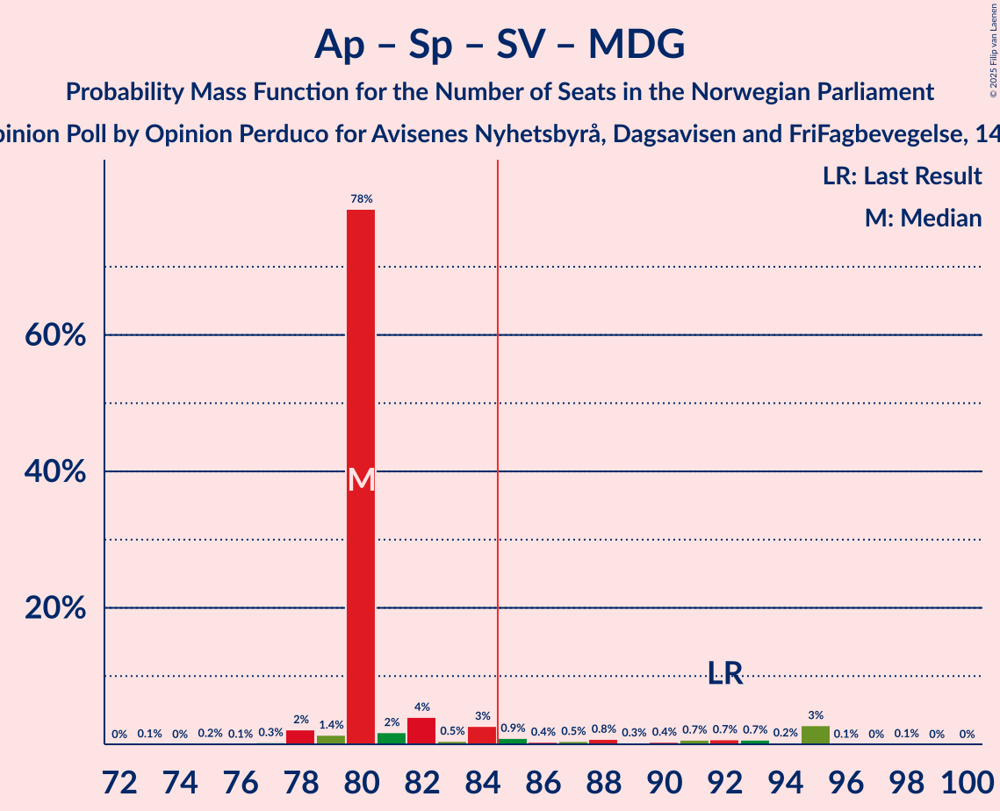

| Number of Seats | Probability | Accumulated | Special Marks |
|:---------------:|:-----------:|:-----------:|:-------------:|
| 73 | 0.1% | 100% |  |
| 74 | 0% | 99.9% |  |
| 75 | 0.2% | 99.9% |  |
| 76 | 0.1% | 99.7% |  |
| 77 | 0.3% | 99.7% |  |
| 78 | 2% | 99.4% |  |
| 79 | 1.4% | 97% |  |
| 80 | 78% | 96% | Median |
| 81 | 2% | 17% |  |
| 82 | 4% | 16% |  |
| 83 | 0.5% | 12% |  |
| 84 | 3% | 11% |  |
| 85 | 0.9% | 8% | Majority |
| 86 | 0.4% | 7% |  |
| 87 | 0.5% | 7% |  |
| 88 | 0.8% | 7% |  |
| 89 | 0.3% | 6% |  |
| 90 | 0.4% | 6% |  |
| 91 | 0.7% | 5% |  |
| 92 | 0.7% | 5% | Last Result |
| 93 | 0.7% | 4% |  |
| 94 | 0.2% | 3% |  |
| 95 | 3% | 3% |  |
| 96 | 0.1% | 0.2% |  |
| 97 | 0% | 0.2% |  |
| 98 | 0.1% | 0.1% |  |
| 99 | 0% | 0% |  |

### Fremskrittspartiet – Høyre – Senterpartiet – Venstre – Kristelig Folkeparti

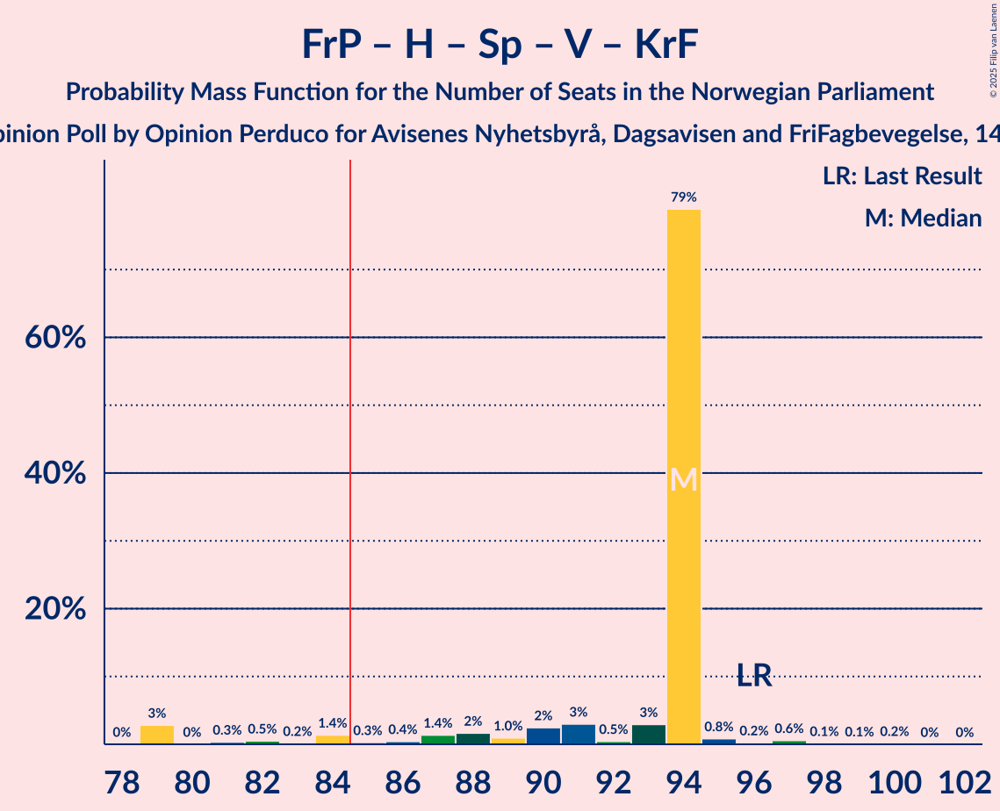

| Number of Seats | Probability | Accumulated | Special Marks |
|:---------------:|:-----------:|:-----------:|:-------------:|
| 78 | 0% | 100% |  |
| 79 | 3% | 99.9% |  |
| 80 | 0% | 97% |  |
| 81 | 0.3% | 97% |  |
| 82 | 0.5% | 97% |  |
| 83 | 0.2% | 96% |  |
| 84 | 1.4% | 96% |  |
| 85 | 0.3% | 95% | Majority |
| 86 | 0.4% | 94% |  |
| 87 | 1.4% | 94% |  |
| 88 | 2% | 93% |  |
| 89 | 1.0% | 91% |  |
| 90 | 2% | 90% |  |
| 91 | 3% | 87% |  |
| 92 | 0.5% | 84% |  |
| 93 | 3% | 84% |  |
| 94 | 79% | 81% | Median |
| 95 | 0.8% | 2% |  |
| 96 | 0.2% | 1.2% | Last Result |
| 97 | 0.6% | 1.0% |  |
| 98 | 0.1% | 0.4% |  |
| 99 | 0.1% | 0.3% |  |
| 100 | 0.2% | 0.2% |  |
| 101 | 0% | 0% |  |

### Arbeiderpartiet – Sosialistisk Venstreparti – Rødt – Miljøpartiet De Grønne

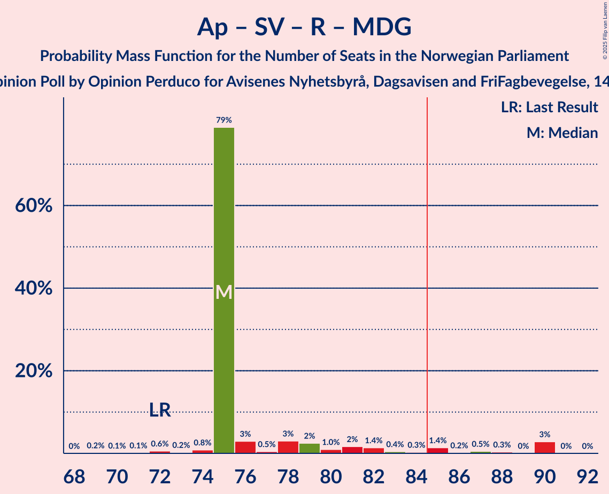

| Number of Seats | Probability | Accumulated | Special Marks |
|:---------------:|:-----------:|:-----------:|:-------------:|
| 69 | 0.2% | 100% |  |
| 70 | 0.1% | 99.8% |  |
| 71 | 0.1% | 99.7% |  |
| 72 | 0.6% | 99.6% | Last Result |
| 73 | 0.2% | 99.0% |  |
| 74 | 0.8% | 98.8% |  |
| 75 | 79% | 98% | Median |
| 76 | 3% | 19% |  |
| 77 | 0.5% | 16% |  |
| 78 | 3% | 16% |  |
| 79 | 2% | 13% |  |
| 80 | 1.0% | 10% |  |
| 81 | 2% | 9% |  |
| 82 | 1.4% | 7% |  |
| 83 | 0.4% | 6% |  |
| 84 | 0.3% | 6% |  |
| 85 | 1.4% | 5% | Majority |
| 86 | 0.2% | 4% |  |
| 87 | 0.5% | 4% |  |
| 88 | 0.3% | 3% |  |
| 89 | 0% | 3% |  |
| 90 | 3% | 3% |  |
| 91 | 0% | 0.1% |  |
| 92 | 0% | 0% |  |

### Arbeiderpartiet – Senterpartiet – Sosialistisk Venstreparti

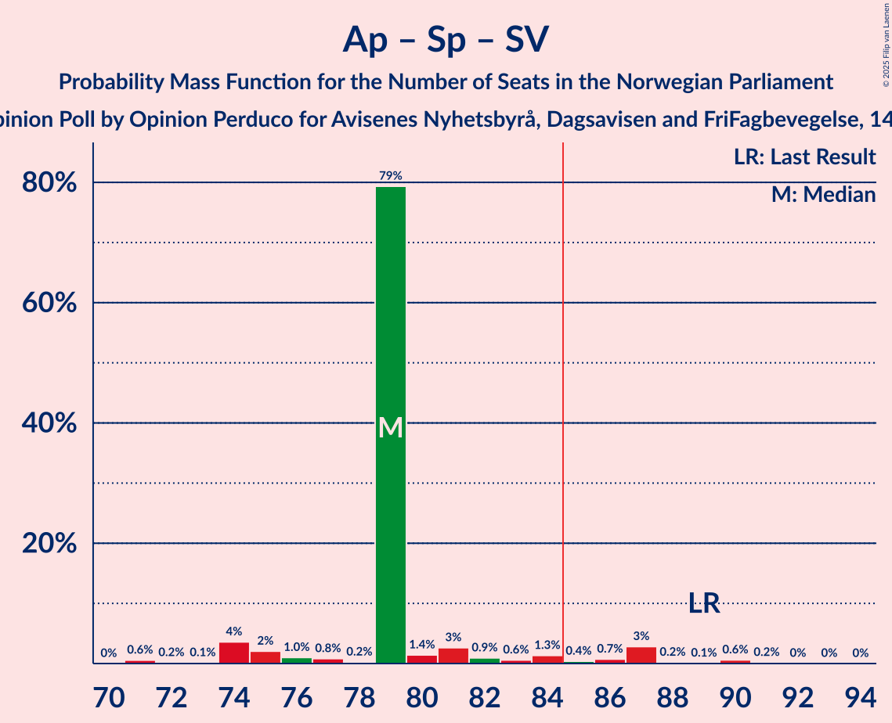

| Number of Seats | Probability | Accumulated | Special Marks |
|:---------------:|:-----------:|:-----------:|:-------------:|
| 71 | 0.6% | 100% |  |
| 72 | 0.2% | 99.4% |  |
| 73 | 0.1% | 99.3% |  |
| 74 | 4% | 99.1% |  |
| 75 | 2% | 96% |  |
| 76 | 1.0% | 93% |  |
| 77 | 0.8% | 92% |  |
| 78 | 0.2% | 92% |  |
| 79 | 79% | 91% | Median |
| 80 | 1.4% | 12% |  |
| 81 | 3% | 11% |  |
| 82 | 0.9% | 8% |  |
| 83 | 0.6% | 7% |  |
| 84 | 1.3% | 6% |  |
| 85 | 0.4% | 5% | Majority |
| 86 | 0.7% | 5% |  |
| 87 | 3% | 4% |  |
| 88 | 0.2% | 1.1% |  |
| 89 | 0.1% | 0.9% | Last Result |
| 90 | 0.6% | 0.9% |  |
| 91 | 0.2% | 0.3% |  |
| 92 | 0% | 0.1% |  |
| 93 | 0% | 0% |  |

### Fremskrittspartiet – Høyre – Miljøpartiet De Grønne – Venstre – Kristelig Folkeparti

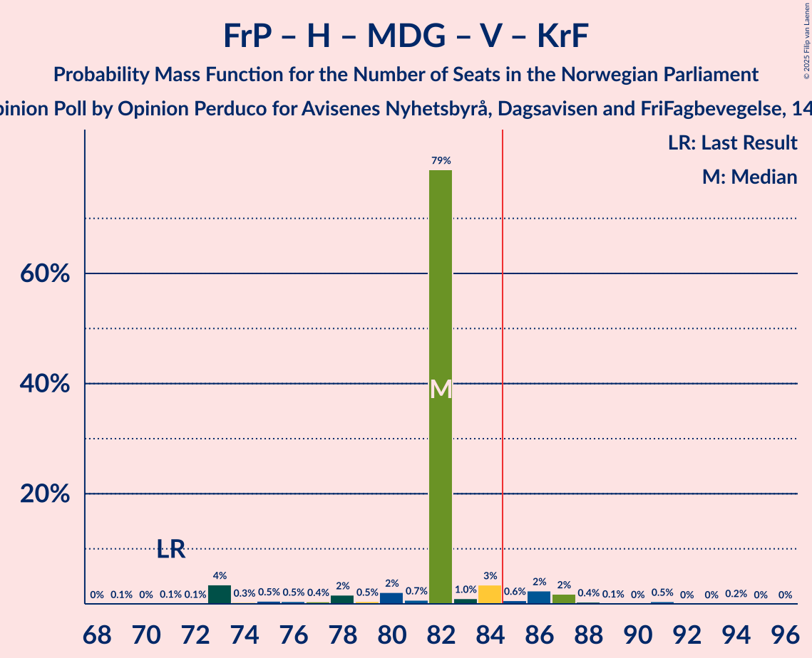

| Number of Seats | Probability | Accumulated | Special Marks |
|:---------------:|:-----------:|:-----------:|:-------------:|
| 69 | 0.1% | 100% |  |
| 70 | 0% | 99.9% |  |
| 71 | 0.1% | 99.9% | Last Result |
| 72 | 0.1% | 99.7% |  |
| 73 | 4% | 99.7% |  |
| 74 | 0.3% | 96% |  |
| 75 | 0.5% | 96% |  |
| 76 | 0.5% | 95% |  |
| 77 | 0.4% | 95% |  |
| 78 | 2% | 94% |  |
| 79 | 0.5% | 93% |  |
| 80 | 2% | 92% |  |
| 81 | 0.7% | 90% |  |
| 82 | 79% | 89% | Median |
| 83 | 1.0% | 11% |  |
| 84 | 3% | 10% |  |
| 85 | 0.6% | 6% | Majority |
| 86 | 2% | 5% |  |
| 87 | 2% | 3% |  |
| 88 | 0.4% | 1.3% |  |
| 89 | 0.1% | 0.9% |  |
| 90 | 0% | 0.7% |  |
| 91 | 0.5% | 0.7% |  |
| 92 | 0% | 0.2% |  |
| 93 | 0% | 0.2% |  |
| 94 | 0.2% | 0.2% |  |
| 95 | 0% | 0% |  |

### Arbeiderpartiet – Senterpartiet – Miljøpartiet De Grønne – Kristelig Folkeparti

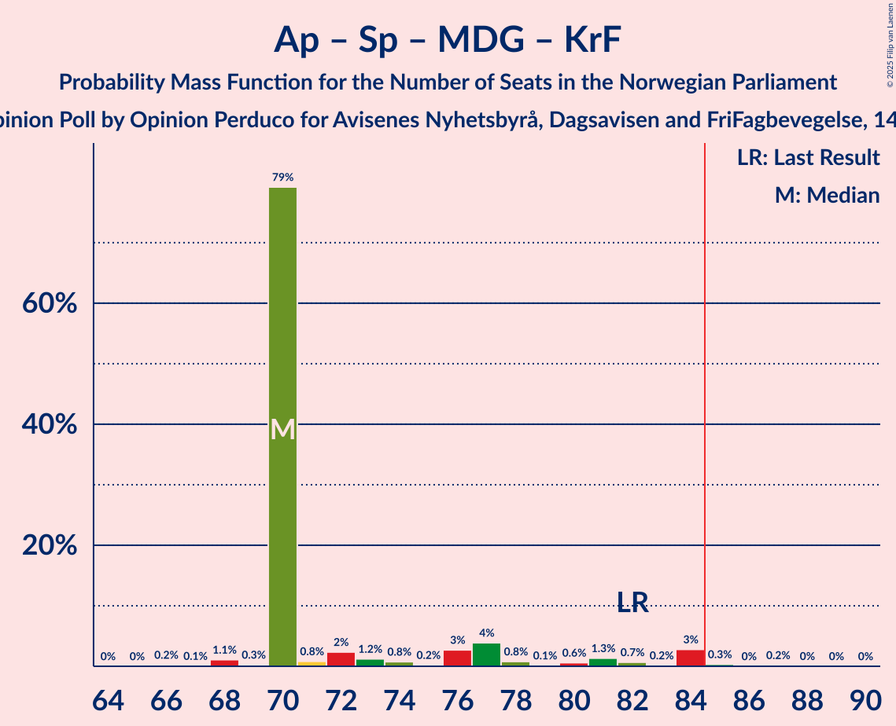

| Number of Seats | Probability | Accumulated | Special Marks |
|:---------------:|:-----------:|:-----------:|:-------------:|
| 66 | 0.2% | 100% |  |
| 67 | 0.1% | 99.7% |  |
| 68 | 1.1% | 99.7% |  |
| 69 | 0.3% | 98.6% |  |
| 70 | 79% | 98% | Median |
| 71 | 0.8% | 19% |  |
| 72 | 2% | 18% |  |
| 73 | 1.2% | 16% |  |
| 74 | 0.8% | 15% |  |
| 75 | 0.2% | 14% |  |
| 76 | 3% | 14% |  |
| 77 | 4% | 11% |  |
| 78 | 0.8% | 7% |  |
| 79 | 0.1% | 6% |  |
| 80 | 0.6% | 6% |  |
| 81 | 1.3% | 6% |  |
| 82 | 0.7% | 4% | Last Result |
| 83 | 0.2% | 4% |  |
| 84 | 3% | 3% |  |
| 85 | 0.3% | 0.6% | Majority |
| 86 | 0% | 0.3% |  |
| 87 | 0.2% | 0.3% |  |
| 88 | 0% | 0.1% |  |
| 89 | 0% | 0% |  |

### Fremskrittspartiet – Høyre – Venstre – Kristelig Folkeparti

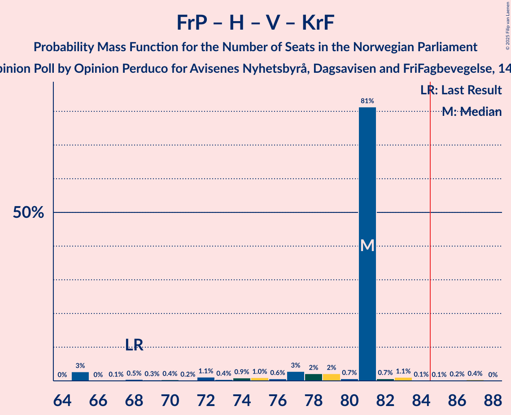

| Number of Seats | Probability | Accumulated | Special Marks |
|:---------------:|:-----------:|:-----------:|:-------------:|
| 65 | 3% | 100% |  |
| 66 | 0% | 97% |  |
| 67 | 0.1% | 97% |  |
| 68 | 0.5% | 97% | Last Result |
| 69 | 0.3% | 97% |  |
| 70 | 0.4% | 96% |  |
| 71 | 0.2% | 96% |  |
| 72 | 1.1% | 96% |  |
| 73 | 0.4% | 95% |  |
| 74 | 0.9% | 94% |  |
| 75 | 1.0% | 93% |  |
| 76 | 0.6% | 92% |  |
| 77 | 3% | 92% |  |
| 78 | 2% | 89% |  |
| 79 | 2% | 87% |  |
| 80 | 0.7% | 85% |  |
| 81 | 81% | 84% | Median |
| 82 | 0.7% | 3% |  |
| 83 | 1.1% | 2% |  |
| 84 | 0.1% | 0.9% |  |
| 85 | 0.1% | 0.7% | Majority |
| 86 | 0.2% | 0.7% |  |
| 87 | 0.4% | 0.4% |  |
| 88 | 0% | 0% |  |

### Fremskrittspartiet – Høyre – Venstre

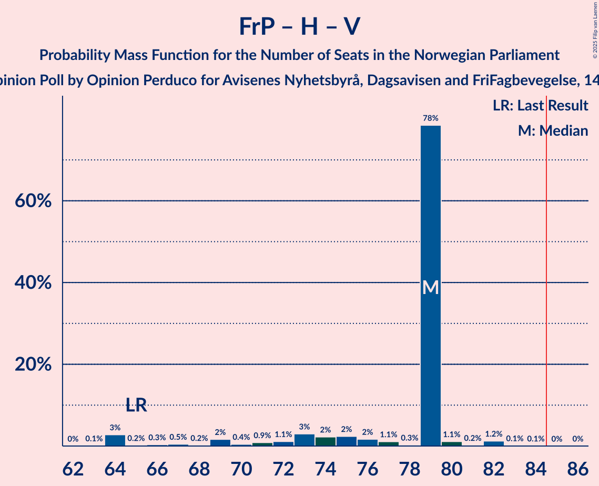

| Number of Seats | Probability | Accumulated | Special Marks |
|:---------------:|:-----------:|:-----------:|:-------------:|
| 63 | 0.1% | 100% |  |
| 64 | 3% | 99.9% |  |
| 65 | 0.2% | 97% | Last Result |
| 66 | 0.3% | 97% |  |
| 67 | 0.5% | 97% |  |
| 68 | 0.2% | 96% |  |
| 69 | 2% | 96% |  |
| 70 | 0.4% | 94% |  |
| 71 | 0.9% | 94% |  |
| 72 | 1.1% | 93% |  |
| 73 | 3% | 92% |  |
| 74 | 2% | 89% |  |
| 75 | 2% | 87% |  |
| 76 | 2% | 84% |  |
| 77 | 1.1% | 83% |  |
| 78 | 0.3% | 82% |  |
| 79 | 78% | 81% | Median |
| 80 | 1.1% | 3% |  |
| 81 | 0.2% | 2% |  |
| 82 | 1.2% | 1.4% |  |
| 83 | 0.1% | 0.2% |  |
| 84 | 0.1% | 0.1% |  |
| 85 | 0% | 0% | Majority |

### Arbeiderpartiet – Senterpartiet – Kristelig Folkeparti

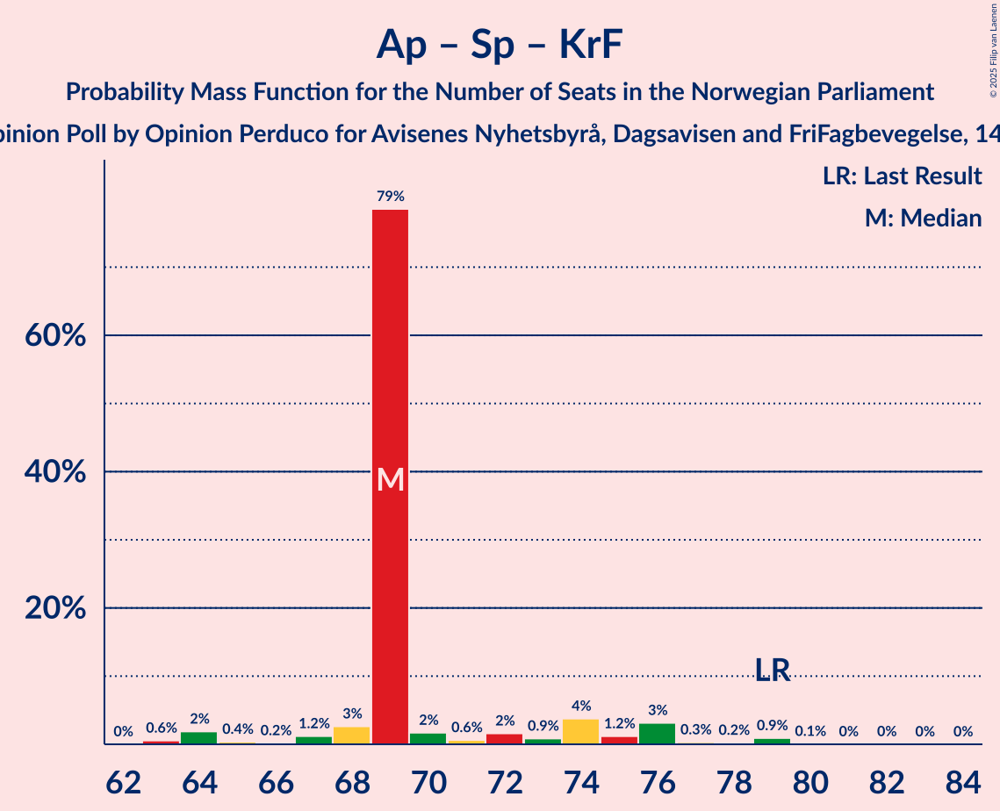

| Number of Seats | Probability | Accumulated | Special Marks |
|:---------------:|:-----------:|:-----------:|:-------------:|
| 63 | 0.6% | 100% |  |
| 64 | 2% | 99.4% |  |
| 65 | 0.4% | 98% |  |
| 66 | 0.2% | 97% |  |
| 67 | 1.2% | 97% |  |
| 68 | 3% | 96% |  |
| 69 | 79% | 93% | Median |
| 70 | 2% | 15% |  |
| 71 | 0.6% | 13% |  |
| 72 | 2% | 12% |  |
| 73 | 0.9% | 11% |  |
| 74 | 4% | 10% |  |
| 75 | 1.2% | 6% |  |
| 76 | 3% | 5% |  |
| 77 | 0.3% | 2% |  |
| 78 | 0.2% | 1.3% |  |
| 79 | 0.9% | 1.1% | Last Result |
| 80 | 0.1% | 0.2% |  |
| 81 | 0% | 0.1% |  |
| 82 | 0% | 0.1% |  |
| 83 | 0% | 0% |  |

### Fremskrittspartiet – Høyre

| Number of Seats | Probability | Accumulated | Special Marks |
|:---------------:|:-----------:|:-----------:|:-------------:|
| 57 | 0% | 100% | Last Result |
| 58 | 0% | 100% |  |
| 59 | 0% | 100% |  |
| 60 | 0.1% | 99.9% |  |
| 61 | 0.1% | 99.9% |  |
| 62 | 3% | 99.8% |  |
| 63 | 0.3% | 97% |  |
| 64 | 0.6% | 97% |  |
| 65 | 2% | 96% |  |
| 66 | 0.3% | 94% |  |
| 67 | 2% | 94% |  |
| 68 | 1.0% | 92% |  |
| 69 | 2% | 91% |  |
| 70 | 3% | 89% |  |
| 71 | 2% | 86% |  |
| 72 | 1.1% | 84% |  |
| 73 | 2% | 83% |  |
| 74 | 0.7% | 81% |  |
| 75 | 0.7% | 81% |  |
| 76 | 79% | 80% | Median |
| 77 | 0.7% | 1.1% |  |
| 78 | 0% | 0.3% |  |
| 79 | 0.2% | 0.3% |  |
| 80 | 0.1% | 0.1% |  |
| 81 | 0% | 0% |  |

### Arbeiderpartiet – Senterpartiet

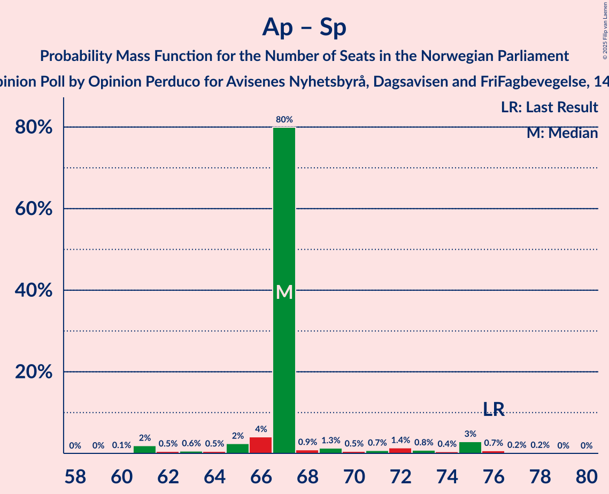

| Number of Seats | Probability | Accumulated | Special Marks |
|:---------------:|:-----------:|:-----------:|:-------------:|
| 60 | 0.1% | 100% |  |
| 61 | 2% | 99.8% |  |
| 62 | 0.5% | 98% |  |
| 63 | 0.6% | 97% |  |
| 64 | 0.5% | 97% |  |
| 65 | 2% | 96% |  |
| 66 | 4% | 94% |  |
| 67 | 80% | 90% | Median |
| 68 | 0.9% | 10% |  |
| 69 | 1.3% | 9% |  |
| 70 | 0.5% | 8% |  |
| 71 | 0.7% | 7% |  |
| 72 | 1.4% | 7% |  |
| 73 | 0.8% | 5% |  |
| 74 | 0.4% | 4% |  |
| 75 | 3% | 4% |  |
| 76 | 0.7% | 1.1% | Last Result |
| 77 | 0.2% | 0.4% |  |
| 78 | 0.2% | 0.2% |  |
| 79 | 0% | 0% |  |

### Arbeiderpartiet – Sosialistisk Venstreparti

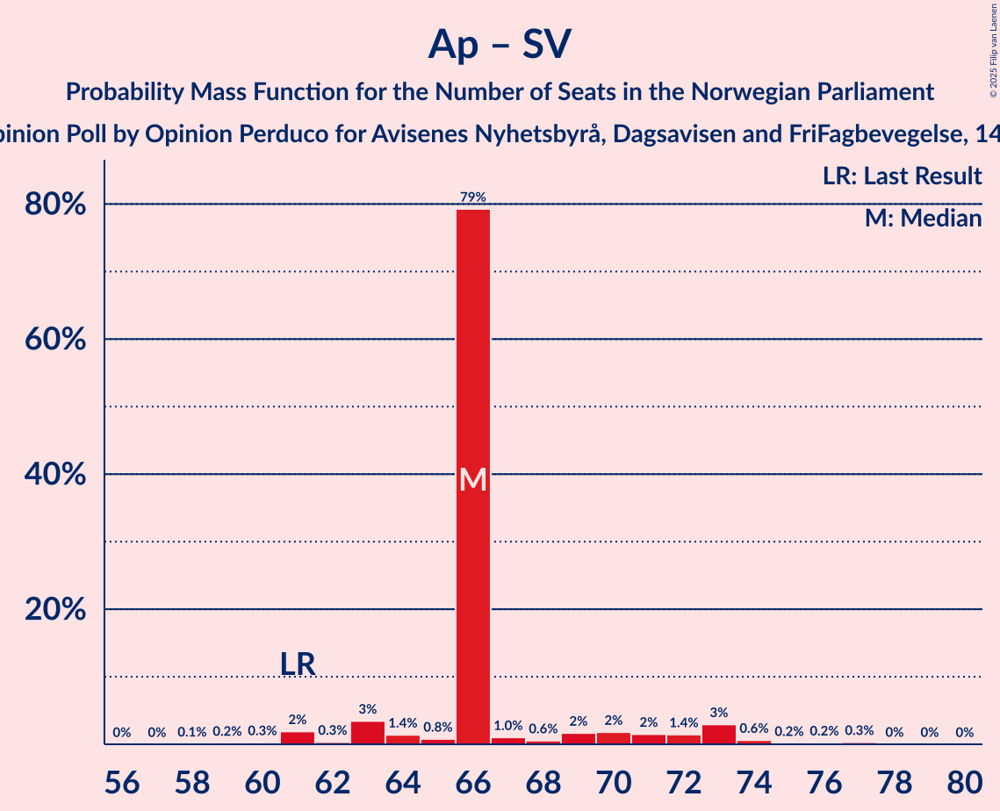

| Number of Seats | Probability | Accumulated | Special Marks |
|:---------------:|:-----------:|:-----------:|:-------------:|
| 58 | 0.1% | 100% |  |
| 59 | 0.2% | 99.9% |  |
| 60 | 0.3% | 99.7% |  |
| 61 | 2% | 99.5% | Last Result |
| 62 | 0.3% | 98% |  |
| 63 | 3% | 97% |  |
| 64 | 1.4% | 94% |  |
| 65 | 0.8% | 92% |  |
| 66 | 79% | 92% | Median |
| 67 | 1.0% | 12% |  |
| 68 | 0.6% | 11% |  |
| 69 | 2% | 11% |  |
| 70 | 2% | 9% |  |
| 71 | 2% | 7% |  |
| 72 | 1.4% | 6% |  |
| 73 | 3% | 4% |  |
| 74 | 0.6% | 1.4% |  |
| 75 | 0.2% | 0.8% |  |
| 76 | 0.2% | 0.6% |  |
| 77 | 0.3% | 0.4% |  |
| 78 | 0% | 0.1% |  |
| 79 | 0% | 0% |  |

### Høyre – Venstre – Kristelig Folkeparti

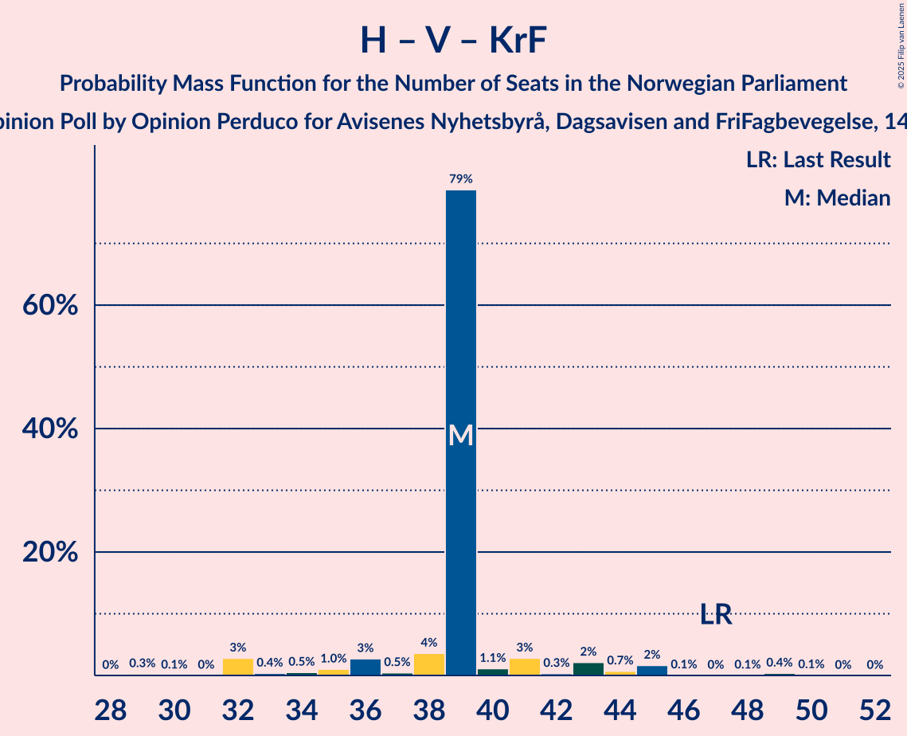

| Number of Seats | Probability | Accumulated | Special Marks |
|:---------------:|:-----------:|:-----------:|:-------------:|
| 29 | 0.3% | 100% |  |
| 30 | 0.1% | 99.7% |  |
| 31 | 0% | 99.7% |  |
| 32 | 3% | 99.6% |  |
| 33 | 0.4% | 97% |  |
| 34 | 0.5% | 96% |  |
| 35 | 1.0% | 96% |  |
| 36 | 3% | 95% |  |
| 37 | 0.5% | 92% |  |
| 38 | 4% | 92% |  |
| 39 | 79% | 88% | Median |
| 40 | 1.1% | 9% |  |
| 41 | 3% | 8% |  |
| 42 | 0.3% | 5% |  |
| 43 | 2% | 5% |  |
| 44 | 0.7% | 3% |  |
| 45 | 2% | 2% |  |
| 46 | 0.1% | 0.6% |  |
| 47 | 0% | 0.6% | Last Result |
| 48 | 0.1% | 0.5% |  |
| 49 | 0.4% | 0.5% |  |
| 50 | 0.1% | 0.1% |  |
| 51 | 0% | 0% |  |

### Senterpartiet – Venstre – Kristelig Folkeparti

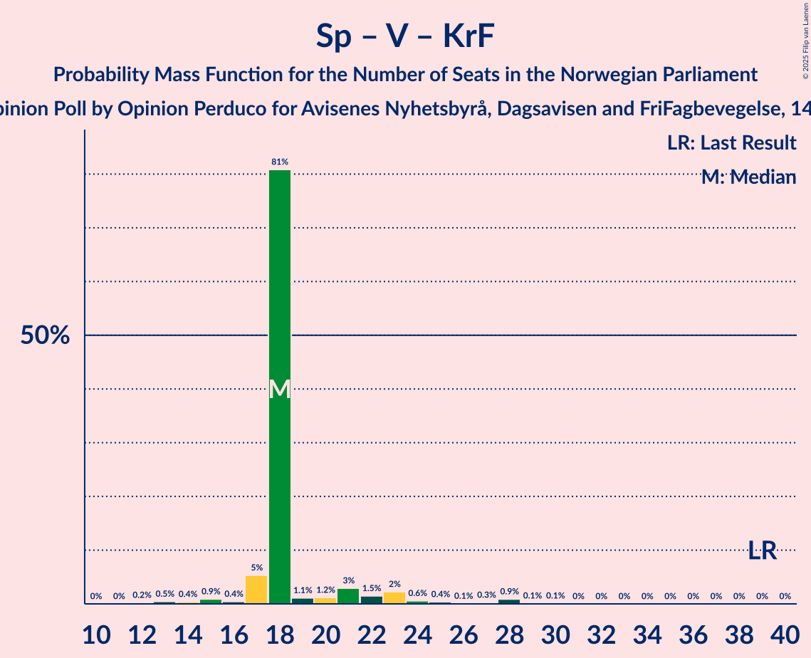

| Number of Seats | Probability | Accumulated | Special Marks |
|:---------------:|:-----------:|:-----------:|:-------------:|
| 12 | 0.2% | 100% |  |
| 13 | 0.5% | 99.8% |  |
| 14 | 0.4% | 99.3% |  |
| 15 | 0.9% | 98.9% |  |
| 16 | 0.4% | 98% |  |
| 17 | 5% | 98% |  |
| 18 | 81% | 92% | Median |
| 19 | 1.1% | 11% |  |
| 20 | 1.2% | 10% |  |
| 21 | 3% | 9% |  |
| 22 | 1.5% | 6% |  |
| 23 | 2% | 5% |  |
| 24 | 0.6% | 2% |  |
| 25 | 0.4% | 2% |  |
| 26 | 0.1% | 1.4% |  |
| 27 | 0.3% | 1.4% |  |
| 28 | 0.9% | 1.1% |  |
| 29 | 0.1% | 0.2% |  |
| 30 | 0.1% | 0.1% |  |
| 31 | 0% | 0% |  |
| 32 | 0% | 0% |  |
| 33 | 0% | 0% |  |
| 34 | 0% | 0% |  |
| 35 | 0% | 0% |  |
| 36 | 0% | 0% |  |
| 37 | 0% | 0% |  |
| 38 | 0% | 0% |  |
| 39 | 0% | 0% | Last Result |

## Technical Information

### Opinion Poll

+ **Polling firm:** Opinion Perduco
+ **Commissioner(s):** Avisenes Nyhetsbyrå, Dagsavisen and FriFagbevegelse
+ **Fieldwork period:** 14–21 April 2025

### Calculations

+ **Sample size:** 1000
+ **Simulations done:** 2,097,152
+ **Error estimate:** 2.47%

