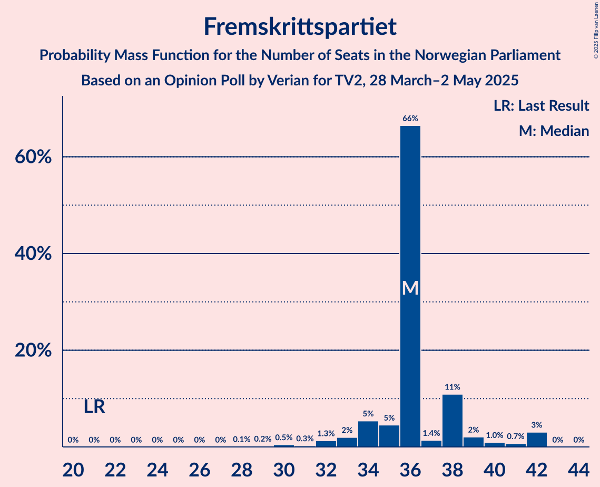
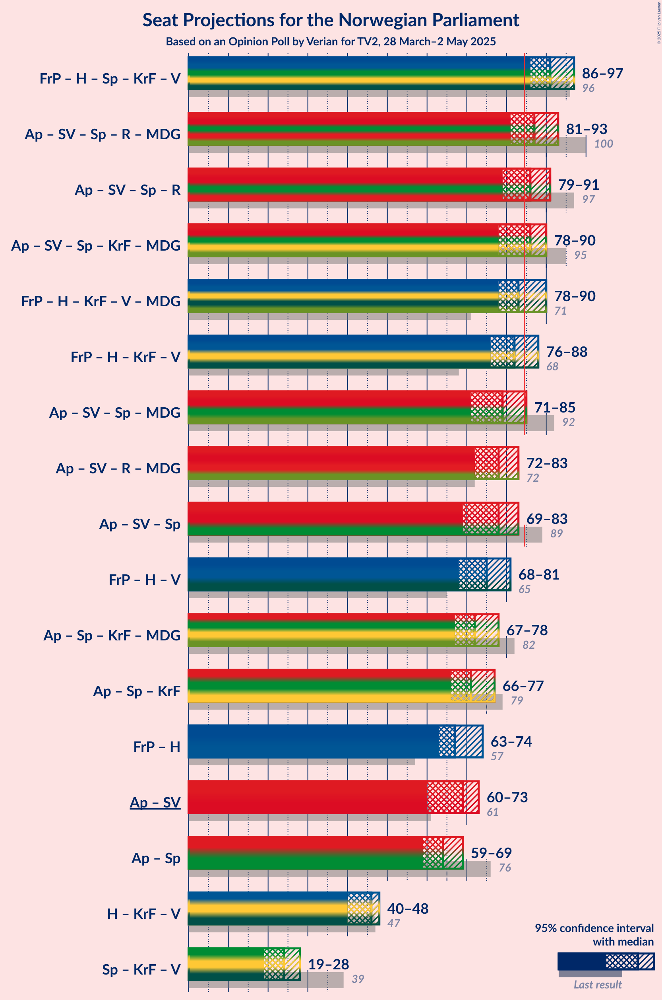

# Opinion Poll by Verian for TV2, 28 March–2 May 2025

<a href="#voting-intentions">Voting Intentions</a> | <a href="#seats">Seats</a> | <a href="#coalitions">Coalitions</a> | <a href="#technical-information">Technical Information</a>

## Voting Intentions

### Confidence Intervals

| Party | Last Result | Poll Result | 80% Confidence Interval | 90% Confidence Interval | 95% Confidence Interval | 99% Confidence Interval |
|:-----:|:-----------:|:-----------:|:-----------------------:|:-----------------------:|:-----------------------:|:-----------------------:|
| Arbeiderpartiet | 26.2% | 30.0% | 28.2–31.9% |27.7–32.5% |27.2–32.9% |26.4–33.9% |
| Fremskrittspartiet | 11.6% | 19.0% | 17.5–20.7% |17.0–21.1% |16.7–21.6% |16.0–22.4% |
| Høyre | 20.4% | 18.1% | 16.6–19.7% |16.2–20.2% |15.8–20.6% |15.1–21.4% |
| Sosialistisk Venstreparti | 7.6% | 7.4% | 6.4–8.6% |6.1–8.9% |5.9–9.2% |5.5–9.8% |
| Senterpartiet | 13.5% | 5.8% | 4.9–6.8% |4.7–7.1% |4.5–7.4% |4.1–7.9% |
| Rødt | 4.7% | 5.4% | 4.5–6.4% |4.3–6.7% |4.1–7.0% |3.7–7.5% |
| Kristelig Folkeparti | 3.8% | 4.5% | 3.8–5.5% |3.6–5.8% |3.4–6.0% |3.1–6.5% |
| Venstre | 4.6% | 4.2% | 3.5–5.2% |3.3–5.5% |3.2–5.7% |2.8–6.2% |
| Miljøpartiet De Grønne | 3.9% | 2.5% | 2.0–3.3% |1.8–3.5% |1.7–3.7% |1.5–4.1% |
| Konservativt | 0.4% | 0.7% | 0.5–1.2% |0.4–1.3% |0.3–1.5% |0.3–1.7% |
| Pensjonistpartiet | 0.6% | 0.4% | 0.2–0.8% |0.2–0.9% |0.2–1.0% |0.1–1.3% |
| Industri- og Næringspartiet | 0.3% | 0.4% | 0.2–0.8% |0.2–0.9% |0.2–1.0% |0.1–1.3% |
| Liberalistene | 0.2% | 0.3% | 0.2–0.7% |0.1–0.8% |0.1–0.9% |0.1–1.1% |
| Norgesdemokratene | 1.1% | 0.3% | 0.2–0.7% |0.1–0.8% |0.1–0.9% |0.1–1.1% |
| Kystpartiet | 0.0% | 0.1% | 0.0–0.4% |0.0–0.5% |0.0–0.6% |0.0–0.8% |

*Note:* The poll result column reflects the actual value used in the calculations. Published results may vary slightly, and in addition be rounded to fewer digits.

## Seats

### Confidence Intervals

| Party | Last Result | Median | 80% Confidence Interval | 90% Confidence Interval | 95% Confidence Interval | 99% Confidence Interval |
|:-----:|:-----------:|:------:|:-----------------------:|:-----------------------:|:-----------------------:|:-----------------------:|
| <a href="#arbeiderpartiet">Arbeiderpartiet</a> | 48 | 55 | 53–57 |51–58 |50–60 |48–62 |
| <a href="#fremskrittspartiet">Fremskrittspartiet</a> | 21 | 36 | 35–38 |34–39 |33–42 |30–42 |
| <a href="#høyre">Høyre</a> | 36 | 31 | 29–36 |27–36 |27–36 |25–37 |
| <a href="#sosialistisk-venstreparti">Sosialistisk Venstreparti</a> | 13 | 14 | 11–15 |10–16 |9–16 |9–17 |
| <a href="#senterpartiet">Senterpartiet</a> | 28 | 9 | 9–13 |7–13 |7–13 |1–13 |
| <a href="#rødt">Rødt</a> | 8 | 8 | 8–10 |8–11 |7–11 |6–12 |
| <a href="#kristelig-folkeparti">Kristelig Folkeparti</a> | 3 | 7 | 3–9 |3–10 |2–10 |1–10 |
| <a href="#venstre">Venstre</a> | 8 | 8 | 3–8 |3–10 |3–10 |2–10 |
| <a href="#miljøpartiet-de-grønne">Miljøpartiet De Grønne</a> | 3 | 1 | 1–2 |1–3 |1–5 |1–5 |
| <a href="#konservativt">Konservativt</a> | 0 | 0 | 0 |0 |0 |0 |
| <a href="#pensjonistpartiet">Pensjonistpartiet</a> | 0 | 0 | 0 |0 |0 |0 |
| <a href="#industri--og-næringspartiet">Industri- og Næringspartiet</a> | 0 | 0 | 0 |0 |0 |0 |
| <a href="#liberalistene">Liberalistene</a> | 0 | 0 | 0 |0 |0 |0 |
| <a href="#norgesdemokratene">Norgesdemokratene</a> | 0 | 0 | 0 |0 |0 |0 |
| <a href="#kystpartiet">Kystpartiet</a> | 0 | 0 | 0 |0 |0–1 |0–1 |

### Arbeiderpartiet

*For a full overview of the results for this party, see the [Arbeiderpartiet](party-arbeiderpartiet.html) page.*

| Number of Seats | Probability | Accumulated | Special Marks |
|:---------------:|:-----------:|:-----------:|:-------------:|
| 47 | 0.1% | 100% |  |
| 48 | 0.9% | 99.9% | Last Result |
| 49 | 0.4% | 99.0% |  |
| 50 | 3% | 98.6% |  |
| 51 | 1.3% | 96% |  |
| 52 | 4% | 94% |  |
| 53 | 9% | 91% |  |
| 54 | 2% | 82% |  |
| 55 | 49% | 80% | Median |
| 56 | 15% | 31% |  |
| 57 | 6% | 16% |  |
| 58 | 6% | 10% |  |
| 59 | 1.4% | 4% |  |
| 60 | 1.3% | 3% |  |
| 61 | 0.8% | 1.4% |  |
| 62 | 0.1% | 0.6% |  |
| 63 | 0.1% | 0.5% |  |
| 64 | 0% | 0.4% |  |
| 65 | 0.4% | 0.4% |  |
| 66 | 0% | 0% |  |

### Fremskrittspartiet

*For a full overview of the results for this party, see the [Fremskrittspartiet](party-fremskrittspartiet.html) page.*

| Number of Seats | Probability | Accumulated | Special Marks |
|:---------------:|:-----------:|:-----------:|:-------------:|
| 21 | 0% | 100% | Last Result |
| 22 | 0% | 100% |  |
| 23 | 0% | 100% |  |
| 24 | 0% | 100% |  |
| 25 | 0% | 100% |  |
| 26 | 0% | 100% |  |
| 27 | 0% | 100% |  |
| 28 | 0.1% | 100% |  |
| 29 | 0.2% | 99.9% |  |
| 30 | 0.5% | 99.7% |  |
| 31 | 0.3% | 99.2% |  |
| 32 | 1.3% | 98.9% |  |
| 33 | 2% | 98% |  |
| 34 | 5% | 96% |  |
| 35 | 5% | 90% |  |
| 36 | 66% | 86% | Median |
| 37 | 1.4% | 19% |  |
| 38 | 11% | 18% |  |
| 39 | 2% | 7% |  |
| 40 | 1.0% | 5% |  |
| 41 | 0.7% | 4% |  |
| 42 | 3% | 3% |  |
| 43 | 0% | 0% |  |

### Høyre

*For a full overview of the results for this party, see the [Høyre](party-høyre.html) page.*

| Number of Seats | Probability | Accumulated | Special Marks |
|:---------------:|:-----------:|:-----------:|:-------------:|
| 25 | 0.7% | 100% |  |
| 26 | 0.1% | 99.3% |  |
| 27 | 5% | 99.1% |  |
| 28 | 1.0% | 94% |  |
| 29 | 7% | 93% |  |
| 30 | 3% | 87% |  |
| 31 | 54% | 84% | Median |
| 32 | 11% | 30% |  |
| 33 | 2% | 19% |  |
| 34 | 0.9% | 18% |  |
| 35 | 1.1% | 17% |  |
| 36 | 14% | 16% | Last Result |
| 37 | 1.1% | 1.4% |  |
| 38 | 0% | 0.3% |  |
| 39 | 0.1% | 0.3% |  |
| 40 | 0.2% | 0.2% |  |
| 41 | 0% | 0% |  |

### Sosialistisk Venstreparti

*For a full overview of the results for this party, see the [Sosialistisk Venstreparti](party-sosialistiskvenstreparti.html) page.*

| Number of Seats | Probability | Accumulated | Special Marks |
|:---------------:|:-----------:|:-----------:|:-------------:|
| 8 | 0.1% | 100% |  |
| 9 | 5% | 99.9% |  |
| 10 | 4% | 95% |  |
| 11 | 18% | 91% |  |
| 12 | 8% | 73% |  |
| 13 | 3% | 65% | Last Result |
| 14 | 48% | 63% | Median |
| 15 | 6% | 15% |  |
| 16 | 8% | 9% |  |
| 17 | 0.8% | 0.9% |  |
| 18 | 0% | 0.1% |  |
| 19 | 0% | 0% |  |

### Senterpartiet

*For a full overview of the results for this party, see the [Senterpartiet](party-senterpartiet.html) page.*

| Number of Seats | Probability | Accumulated | Special Marks |
|:---------------:|:-----------:|:-----------:|:-------------:|
| 0 | 0.1% | 100% |  |
| 1 | 0.4% | 99.9% |  |
| 2 | 0% | 99.5% |  |
| 3 | 0% | 99.5% |  |
| 4 | 0% | 99.5% |  |
| 5 | 0% | 99.5% |  |
| 6 | 0.1% | 99.5% |  |
| 7 | 6% | 99.4% |  |
| 8 | 2% | 94% |  |
| 9 | 53% | 91% | Median |
| 10 | 10% | 38% |  |
| 11 | 11% | 28% |  |
| 12 | 4% | 18% |  |
| 13 | 14% | 14% |  |
| 14 | 0.1% | 0.2% |  |
| 15 | 0.1% | 0.1% |  |
| 16 | 0% | 0% |  |
| 17 | 0% | 0% |  |
| 18 | 0% | 0% |  |
| 19 | 0% | 0% |  |
| 20 | 0% | 0% |  |
| 21 | 0% | 0% |  |
| 22 | 0% | 0% |  |
| 23 | 0% | 0% |  |
| 24 | 0% | 0% |  |
| 25 | 0% | 0% |  |
| 26 | 0% | 0% |  |
| 27 | 0% | 0% |  |
| 28 | 0% | 0% | Last Result |

### Rødt

*For a full overview of the results for this party, see the [Rødt](party-rødt.html) page.*

| Number of Seats | Probability | Accumulated | Special Marks |
|:---------------:|:-----------:|:-----------:|:-------------:|
| 1 | 0.4% | 100% |  |
| 2 | 0% | 99.6% |  |
| 3 | 0% | 99.6% |  |
| 4 | 0% | 99.6% |  |
| 5 | 0% | 99.6% |  |
| 6 | 0.2% | 99.6% |  |
| 7 | 3% | 99.4% |  |
| 8 | 61% | 96% | Last Result, Median |
| 9 | 7% | 35% |  |
| 10 | 20% | 28% |  |
| 11 | 7% | 8% |  |
| 12 | 0.3% | 0.5% |  |
| 13 | 0.1% | 0.2% |  |
| 14 | 0.1% | 0.1% |  |
| 15 | 0% | 0% |  |

### Kristelig Folkeparti

*For a full overview of the results for this party, see the [Kristelig Folkeparti](party-kristeligfolkeparti.html) page.*

| Number of Seats | Probability | Accumulated | Special Marks |
|:---------------:|:-----------:|:-----------:|:-------------:|
| 1 | 0.5% | 100% |  |
| 2 | 4% | 99.5% |  |
| 3 | 20% | 96% | Last Result |
| 4 | 0% | 76% |  |
| 5 | 0% | 76% |  |
| 6 | 4% | 76% |  |
| 7 | 54% | 71% | Median |
| 8 | 5% | 18% |  |
| 9 | 6% | 13% |  |
| 10 | 7% | 7% |  |
| 11 | 0.2% | 0.3% |  |
| 12 | 0.1% | 0.1% |  |
| 13 | 0% | 0% |  |

### Venstre

*For a full overview of the results for this party, see the [Venstre](party-venstre.html) page.*

| Number of Seats | Probability | Accumulated | Special Marks |
|:---------------:|:-----------:|:-----------:|:-------------:|
| 2 | 1.1% | 100% |  |
| 3 | 20% | 98.9% |  |
| 4 | 0% | 79% |  |
| 5 | 0% | 79% |  |
| 6 | 4% | 79% |  |
| 7 | 13% | 75% |  |
| 8 | 53% | 62% | Last Result, Median |
| 9 | 5% | 10% |  |
| 10 | 5% | 5% |  |
| 11 | 0.1% | 0.1% |  |
| 12 | 0% | 0% |  |

### Miljøpartiet De Grønne

*For a full overview of the results for this party, see the [Miljøpartiet De Grønne](party-miljøpartietdegrønne.html) page.*

| Number of Seats | Probability | Accumulated | Special Marks |
|:---------------:|:-----------:|:-----------:|:-------------:|
| 0 | 0.3% | 100% |  |
| 1 | 84% | 99.7% | Median |
| 2 | 9% | 16% |  |
| 3 | 2% | 6% | Last Result |
| 4 | 0% | 4% |  |
| 5 | 4% | 4% |  |
| 6 | 0.1% | 0.3% |  |
| 7 | 0.2% | 0.2% |  |
| 8 | 0% | 0% |  |

### Konservativt

*For a full overview of the results for this party, see the [Konservativt](party-konservativt.html) page.*

| Number of Seats | Probability | Accumulated | Special Marks |
|:---------------:|:-----------:|:-----------:|:-------------:|
| 0 | 100% | 100% | Last Result, Median |

### Pensjonistpartiet

*For a full overview of the results for this party, see the [Pensjonistpartiet](party-pensjonistpartiet.html) page.*

| Number of Seats | Probability | Accumulated | Special Marks |
|:---------------:|:-----------:|:-----------:|:-------------:|
| 0 | 100% | 100% | Last Result, Median |

### Industri- og Næringspartiet

*For a full overview of the results for this party, see the [Industri- og Næringspartiet](party-industri-ognæringspartiet.html) page.*

| Number of Seats | Probability | Accumulated | Special Marks |
|:---------------:|:-----------:|:-----------:|:-------------:|
| 0 | 100% | 100% | Last Result, Median |

### Liberalistene

*For a full overview of the results for this party, see the [Liberalistene](party-liberalistene.html) page.*

| Number of Seats | Probability | Accumulated | Special Marks |
|:---------------:|:-----------:|:-----------:|:-------------:|
| 0 | 100% | 100% | Last Result, Median |

### Norgesdemokratene

*For a full overview of the results for this party, see the [Norgesdemokratene](party-norgesdemokratene.html) page.*

| Number of Seats | Probability | Accumulated | Special Marks |
|:---------------:|:-----------:|:-----------:|:-------------:|
| 0 | 100% | 100% | Last Result, Median |

### Kystpartiet

*For a full overview of the results for this party, see the [Kystpartiet](party-kystpartiet.html) page.*

| Number of Seats | Probability | Accumulated | Special Marks |
|:---------------:|:-----------:|:-----------:|:-------------:|
| 0 | 97% | 100% | Last Result, Median |
| 1 | 3% | 3% |  |
| 2 | 0% | 0% |  |

## Coalitions

### Confidence Intervals

| Coalition | Last Result | Median | Majority? | 80% Confidence Interval | 90% Confidence Interval | 95% Confidence Interval | 99% Confidence Interval |
|:---------:|:-----------:|:------:|:---------:|:-----------------------:|:-----------------------:|:-----------------------:|:-----------------------:|
| Fremskrittspartiet – Høyre – Senterpartiet – Kristelig Folkeparti – Venstre | 96 | 91 | 99.4% | 88–93 | 86–95 | 86–97 | 83–98 |
| Arbeiderpartiet – Sosialistisk Venstreparti – Senterpartiet – Rødt – Miljøpartiet De Grønne | 100 | 87 | 93% | 85–92 | 84–93 | 81–93 | 80–94 |
| Arbeiderpartiet – Sosialistisk Venstreparti – Senterpartiet – Rødt | 97 | 86 | 84% | 83–91 | 82–91 | 79–91 | 79–93 |
| Arbeiderpartiet – Sosialistisk Venstreparti – Senterpartiet – Kristelig Folkeparti – Miljøpartiet De Grønne | 95 | 86 | 72% | 83–88 | 81–90 | 78–90 | 77–93 |
| Fremskrittspartiet – Høyre – Kristelig Folkeparti – Venstre – Miljøpartiet De Grønne | 71 | 83 | 16% | 78–86 | 78–87 | 78–90 | 76–90 |
| Fremskrittspartiet – Høyre – Kristelig Folkeparti – Venstre | 68 | 82 | 7% | 77–84 | 76–85 | 76–88 | 75–89 |
| Arbeiderpartiet – Sosialistisk Venstreparti – Senterpartiet – Miljøpartiet De Grønne | 92 | 79 | 5% | 77–81 | 76–85 | 71–85 | 71–85 |
| Arbeiderpartiet – Sosialistisk Venstreparti – Rødt – Miljøpartiet De Grønne | 72 | 78 | 0.6% | 76–81 | 74–83 | 72–83 | 71–86 |
| Arbeiderpartiet – Sosialistisk Venstreparti – Senterpartiet | 89 | 78 | 0.3% | 75–80 | 73–83 | 69–83 | 69–84 |
| Fremskrittspartiet – Høyre – Venstre | 65 | 75 | 0.1% | 73–76 | 69–80 | 68–81 | 66–83 |
| Arbeiderpartiet – Senterpartiet – Kristelig Folkeparti – Miljøpartiet De Grønne | 82 | 72 | 0.1% | 70–75 | 67–77 | 67–78 | 62–82 |
| Arbeiderpartiet – Senterpartiet – Kristelig Folkeparti | 79 | 71 | 0% | 69–74 | 66–76 | 66–77 | 61–80 |
| Fremskrittspartiet – Høyre | 57 | 67 | 0% | 65–72 | 63–73 | 63–74 | 61–77 |
| Arbeiderpartiet – Sosialistisk Venstreparti | 61 | 69 | 0% | 65–70 | 64–73 | 60–73 | 60–75 |
| Arbeiderpartiet – Senterpartiet | 76 | 64 | 0% | 64–69 | 59–69 | 59–69 | 57–73 |
| Høyre – Kristelig Folkeparti – Venstre | 47 | 46 | 0% | 42–46 | 40–47 | 40–48 | 39–50 |
| Senterpartiet – Kristelig Folkeparti – Venstre | 39 | 24 | 0% | 19–25 | 19–28 | 19–28 | 15–28 |

### Fremskrittspartiet – Høyre – Senterpartiet – Kristelig Folkeparti – Venstre

| Number of Seats | Probability | Accumulated | Special Marks |
|:---------------:|:-----------:|:-----------:|:-------------:|
| 80 | 0.1% | 100% |  |
| 81 | 0% | 99.9% |  |
| 82 | 0.1% | 99.9% |  |
| 83 | 0.4% | 99.8% |  |
| 84 | 0.1% | 99.5% |  |
| 85 | 1.2% | 99.4% | Majority |
| 86 | 5% | 98% |  |
| 87 | 0.9% | 93% |  |
| 88 | 7% | 93% |  |
| 89 | 4% | 86% |  |
| 90 | 5% | 82% |  |
| 91 | 62% | 77% | Median |
| 92 | 4% | 15% |  |
| 93 | 2% | 11% |  |
| 94 | 0.4% | 10% |  |
| 95 | 5% | 9% |  |
| 96 | 1.0% | 4% | Last Result |
| 97 | 3% | 3% |  |
| 98 | 0.2% | 0.6% |  |
| 99 | 0.4% | 0.4% |  |
| 100 | 0% | 0% |  |

### Arbeiderpartiet – Sosialistisk Venstreparti – Senterpartiet – Rødt – Miljøpartiet De Grønne

| Number of Seats | Probability | Accumulated | Special Marks |
|:---------------:|:-----------:|:-----------:|:-------------:|
| 78 | 0.1% | 100% |  |
| 79 | 0.2% | 99.9% |  |
| 80 | 0.3% | 99.7% |  |
| 81 | 3% | 99.4% |  |
| 82 | 0.5% | 97% |  |
| 83 | 0.6% | 96% |  |
| 84 | 2% | 96% |  |
| 85 | 5% | 93% | Majority |
| 86 | 2% | 88% |  |
| 87 | 53% | 86% | Median |
| 88 | 1.4% | 33% |  |
| 89 | 4% | 32% |  |
| 90 | 0.8% | 28% |  |
| 91 | 17% | 27% |  |
| 92 | 4% | 11% |  |
| 93 | 6% | 7% |  |
| 94 | 0.5% | 0.9% |  |
| 95 | 0% | 0.4% |  |
| 96 | 0.1% | 0.3% |  |
| 97 | 0.2% | 0.2% |  |
| 98 | 0% | 0.1% |  |
| 99 | 0% | 0.1% |  |
| 100 | 0% | 0% | Last Result |

### Arbeiderpartiet – Sosialistisk Venstreparti – Senterpartiet – Rødt

| Number of Seats | Probability | Accumulated | Special Marks |
|:---------------:|:-----------:|:-----------:|:-------------:|
| 76 | 0.1% | 100% |  |
| 77 | 0% | 99.9% |  |
| 78 | 0.2% | 99.9% |  |
| 79 | 3% | 99.7% |  |
| 80 | 0.2% | 97% |  |
| 81 | 0.9% | 96% |  |
| 82 | 5% | 96% |  |
| 83 | 2% | 91% |  |
| 84 | 5% | 89% |  |
| 85 | 2% | 84% | Majority |
| 86 | 49% | 82% | Median |
| 87 | 2% | 33% |  |
| 88 | 4% | 31% |  |
| 89 | 0.5% | 27% |  |
| 90 | 17% | 27% |  |
| 91 | 9% | 10% |  |
| 92 | 0.2% | 1.0% |  |
| 93 | 0.5% | 0.8% |  |
| 94 | 0% | 0.3% |  |
| 95 | 0.1% | 0.2% |  |
| 96 | 0.1% | 0.1% |  |
| 97 | 0.1% | 0.1% | Last Result |
| 98 | 0% | 0% |  |

### Arbeiderpartiet – Sosialistisk Venstreparti – Senterpartiet – Kristelig Folkeparti – Miljøpartiet De Grønne

| Number of Seats | Probability | Accumulated | Special Marks |
|:---------------:|:-----------:|:-----------:|:-------------:|
| 76 | 0.3% | 100% |  |
| 77 | 0.2% | 99.7% |  |
| 78 | 3% | 99.4% |  |
| 79 | 0.6% | 96% |  |
| 80 | 0.2% | 95% |  |
| 81 | 0.2% | 95% |  |
| 82 | 1.4% | 95% |  |
| 83 | 4% | 94% |  |
| 84 | 18% | 90% |  |
| 85 | 3% | 72% | Majority |
| 86 | 49% | 69% | Median |
| 87 | 6% | 21% |  |
| 88 | 5% | 15% |  |
| 89 | 3% | 10% |  |
| 90 | 4% | 6% |  |
| 91 | 0.5% | 2% |  |
| 92 | 0.7% | 1.5% |  |
| 93 | 0.4% | 0.8% |  |
| 94 | 0.1% | 0.4% |  |
| 95 | 0.1% | 0.3% | Last Result |
| 96 | 0.2% | 0.2% |  |
| 97 | 0.1% | 0.1% |  |
| 98 | 0% | 0% |  |

### Fremskrittspartiet – Høyre – Kristelig Folkeparti – Venstre – Miljøpartiet De Grønne

| Number of Seats | Probability | Accumulated | Special Marks |
|:---------------:|:-----------:|:-----------:|:-------------:|
| 71 | 0% | 100% | Last Result |
| 72 | 0.1% | 100% |  |
| 73 | 0.1% | 99.9% |  |
| 74 | 0.1% | 99.9% |  |
| 75 | 0% | 99.8% |  |
| 76 | 0.5% | 99.7% |  |
| 77 | 0.3% | 99.2% |  |
| 78 | 9% | 99.0% |  |
| 79 | 17% | 90% |  |
| 80 | 1.5% | 73% |  |
| 81 | 3% | 72% |  |
| 82 | 2% | 69% |  |
| 83 | 50% | 67% | Median |
| 84 | 1.0% | 17% |  |
| 85 | 5% | 16% | Majority |
| 86 | 2% | 11% |  |
| 87 | 5% | 9% |  |
| 88 | 0.9% | 4% |  |
| 89 | 0.2% | 4% |  |
| 90 | 3% | 3% |  |
| 91 | 0.2% | 0.3% |  |
| 92 | 0% | 0.1% |  |
| 93 | 0.1% | 0.1% |  |
| 94 | 0% | 0% |  |

### Fremskrittspartiet – Høyre – Kristelig Folkeparti – Venstre

| Number of Seats | Probability | Accumulated | Special Marks |
|:---------------:|:-----------:|:-----------:|:-------------:|
| 68 | 0% | 100% | Last Result |
| 69 | 0% | 100% |  |
| 70 | 0% | 100% |  |
| 71 | 0% | 99.9% |  |
| 72 | 0.2% | 99.9% |  |
| 73 | 0.1% | 99.7% |  |
| 74 | 0% | 99.7% |  |
| 75 | 0.5% | 99.6% |  |
| 76 | 6% | 99.1% |  |
| 77 | 4% | 93% |  |
| 78 | 16% | 89% |  |
| 79 | 2% | 73% |  |
| 80 | 3% | 71% |  |
| 81 | 1.2% | 68% |  |
| 82 | 54% | 67% | Median |
| 83 | 0.9% | 13% |  |
| 84 | 5% | 12% |  |
| 85 | 2% | 7% | Majority |
| 86 | 0.6% | 4% |  |
| 87 | 0.5% | 4% |  |
| 88 | 3% | 3% |  |
| 89 | 0.3% | 0.6% |  |
| 90 | 0.2% | 0.3% |  |
| 91 | 0.1% | 0.1% |  |
| 92 | 0% | 0% |  |

### Arbeiderpartiet – Sosialistisk Venstreparti – Senterpartiet – Miljøpartiet De Grønne

| Number of Seats | Probability | Accumulated | Special Marks |
|:---------------:|:-----------:|:-----------:|:-------------:|
| 69 | 0.1% | 100% |  |
| 70 | 0% | 99.9% |  |
| 71 | 3% | 99.9% |  |
| 72 | 0.1% | 97% |  |
| 73 | 0.8% | 97% |  |
| 74 | 0.5% | 96% |  |
| 75 | 0.3% | 95% |  |
| 76 | 2% | 95% |  |
| 77 | 7% | 93% |  |
| 78 | 5% | 86% |  |
| 79 | 50% | 81% | Median |
| 80 | 0.3% | 31% |  |
| 81 | 22% | 31% |  |
| 82 | 3% | 9% |  |
| 83 | 0.4% | 6% |  |
| 84 | 0.2% | 6% |  |
| 85 | 5% | 5% | Majority |
| 86 | 0.2% | 0.4% |  |
| 87 | 0.1% | 0.2% |  |
| 88 | 0.1% | 0.1% |  |
| 89 | 0% | 0% |  |
| 90 | 0% | 0% |  |
| 91 | 0% | 0% |  |
| 92 | 0% | 0% | Last Result |

### Arbeiderpartiet – Sosialistisk Venstreparti – Rødt – Miljøpartiet De Grønne

| Number of Seats | Probability | Accumulated | Special Marks |
|:---------------:|:-----------:|:-----------:|:-------------:|
| 70 | 0.4% | 100% |  |
| 71 | 0.2% | 99.6% |  |
| 72 | 3% | 99.4% | Last Result |
| 73 | 1.0% | 97% |  |
| 74 | 5% | 96% |  |
| 75 | 0.4% | 91% |  |
| 76 | 3% | 90% |  |
| 77 | 2% | 87% |  |
| 78 | 62% | 85% | Median |
| 79 | 5% | 23% |  |
| 80 | 5% | 18% |  |
| 81 | 6% | 13% |  |
| 82 | 0.7% | 7% |  |
| 83 | 5% | 7% |  |
| 84 | 1.2% | 2% |  |
| 85 | 0.1% | 0.6% | Majority |
| 86 | 0.4% | 0.5% |  |
| 87 | 0.1% | 0.1% |  |
| 88 | 0% | 0.1% |  |
| 89 | 0.1% | 0.1% |  |
| 90 | 0% | 0% |  |

### Arbeiderpartiet – Sosialistisk Venstreparti – Senterpartiet

| Number of Seats | Probability | Accumulated | Special Marks |
|:---------------:|:-----------:|:-----------:|:-------------:|
| 67 | 0.1% | 100% |  |
| 68 | 0% | 99.9% |  |
| 69 | 3% | 99.9% |  |
| 70 | 1.0% | 97% |  |
| 71 | 0.1% | 96% |  |
| 72 | 0.5% | 96% |  |
| 73 | 5% | 96% |  |
| 74 | 0.1% | 91% |  |
| 75 | 2% | 91% |  |
| 76 | 7% | 89% |  |
| 77 | 1.2% | 82% |  |
| 78 | 50% | 81% | Median |
| 79 | 2% | 31% |  |
| 80 | 22% | 29% |  |
| 81 | 2% | 8% |  |
| 82 | 0.3% | 6% |  |
| 83 | 5% | 6% |  |
| 84 | 0.6% | 0.9% |  |
| 85 | 0.2% | 0.3% | Majority |
| 86 | 0.1% | 0.1% |  |
| 87 | 0% | 0% |  |
| 88 | 0% | 0% |  |
| 89 | 0% | 0% | Last Result |

### Fremskrittspartiet – Høyre – Venstre

| Number of Seats | Probability | Accumulated | Special Marks |
|:---------------:|:-----------:|:-----------:|:-------------:|
| 62 | 0.1% | 100% |  |
| 63 | 0% | 99.9% |  |
| 64 | 0.1% | 99.8% |  |
| 65 | 0% | 99.8% | Last Result |
| 66 | 0.6% | 99.7% |  |
| 67 | 0.2% | 99.1% |  |
| 68 | 4% | 98.9% |  |
| 69 | 0.4% | 95% |  |
| 70 | 0.5% | 95% |  |
| 71 | 3% | 94% |  |
| 72 | 1.2% | 91% |  |
| 73 | 7% | 90% |  |
| 74 | 6% | 83% |  |
| 75 | 63% | 77% | Median |
| 76 | 7% | 15% |  |
| 77 | 0.9% | 8% |  |
| 78 | 2% | 7% |  |
| 79 | 0.1% | 5% |  |
| 80 | 0.6% | 5% |  |
| 81 | 3% | 4% |  |
| 82 | 0.1% | 1.4% |  |
| 83 | 1.0% | 1.3% |  |
| 84 | 0.2% | 0.3% |  |
| 85 | 0% | 0.1% | Majority |
| 86 | 0% | 0% |  |

### Arbeiderpartiet – Senterpartiet – Kristelig Folkeparti – Miljøpartiet De Grønne

| Number of Seats | Probability | Accumulated | Special Marks |
|:---------------:|:-----------:|:-----------:|:-------------:|
| 61 | 0.2% | 100% |  |
| 62 | 0.8% | 99.8% |  |
| 63 | 0% | 99.0% |  |
| 64 | 0.3% | 99.0% |  |
| 65 | 0.4% | 98.7% |  |
| 66 | 0.1% | 98% |  |
| 67 | 3% | 98% |  |
| 68 | 4% | 95% |  |
| 69 | 0.6% | 91% |  |
| 70 | 1.0% | 91% |  |
| 71 | 0.5% | 90% |  |
| 72 | 49% | 89% | Median |
| 73 | 18% | 40% |  |
| 74 | 5% | 22% |  |
| 75 | 11% | 17% |  |
| 76 | 0.3% | 6% |  |
| 77 | 2% | 6% |  |
| 78 | 2% | 4% |  |
| 79 | 1.1% | 2% |  |
| 80 | 0.7% | 1.4% |  |
| 81 | 0.1% | 0.7% |  |
| 82 | 0.1% | 0.6% | Last Result |
| 83 | 0.3% | 0.5% |  |
| 84 | 0.1% | 0.1% |  |
| 85 | 0.1% | 0.1% | Majority |
| 86 | 0% | 0% |  |

### Arbeiderpartiet – Senterpartiet – Kristelig Folkeparti

| Number of Seats | Probability | Accumulated | Special Marks |
|:---------------:|:-----------:|:-----------:|:-------------:|
| 60 | 0.2% | 100% |  |
| 61 | 0.8% | 99.8% |  |
| 62 | 0.1% | 99.0% |  |
| 63 | 0.2% | 98.9% |  |
| 64 | 0.5% | 98.7% |  |
| 65 | 0.1% | 98% |  |
| 66 | 7% | 98% |  |
| 67 | 0.9% | 91% |  |
| 68 | 0.3% | 90% |  |
| 69 | 0.8% | 90% |  |
| 70 | 4% | 89% |  |
| 71 | 54% | 85% | Median |
| 72 | 14% | 31% |  |
| 73 | 5% | 18% |  |
| 74 | 6% | 12% |  |
| 75 | 0.3% | 6% |  |
| 76 | 3% | 6% |  |
| 77 | 2% | 3% |  |
| 78 | 0.6% | 2% |  |
| 79 | 0.3% | 0.9% | Last Result |
| 80 | 0.1% | 0.6% |  |
| 81 | 0.2% | 0.5% |  |
| 82 | 0.2% | 0.3% |  |
| 83 | 0.1% | 0.1% |  |
| 84 | 0% | 0% |  |

### Fremskrittspartiet – Høyre

| Number of Seats | Probability | Accumulated | Special Marks |
|:---------------:|:-----------:|:-----------:|:-------------:|
| 57 | 0% | 100% | Last Result |
| 58 | 0% | 100% |  |
| 59 | 0.1% | 100% |  |
| 60 | 0.2% | 99.8% |  |
| 61 | 0.3% | 99.7% |  |
| 62 | 0.4% | 99.4% |  |
| 63 | 7% | 99.0% |  |
| 64 | 2% | 92% |  |
| 65 | 6% | 91% |  |
| 66 | 1.3% | 85% |  |
| 67 | 55% | 83% | Median |
| 68 | 2% | 28% |  |
| 69 | 2% | 26% |  |
| 70 | 5% | 24% |  |
| 71 | 0.4% | 20% |  |
| 72 | 14% | 19% |  |
| 73 | 0.8% | 6% |  |
| 74 | 3% | 5% |  |
| 75 | 1.0% | 2% |  |
| 76 | 0.1% | 0.6% |  |
| 77 | 0% | 0.5% |  |
| 78 | 0.4% | 0.5% |  |
| 79 | 0% | 0% |  |

### Arbeiderpartiet – Sosialistisk Venstreparti

| Number of Seats | Probability | Accumulated | Special Marks |
|:---------------:|:-----------:|:-----------:|:-------------:|
| 60 | 3% | 100% |  |
| 61 | 0.2% | 97% | Last Result |
| 62 | 0.1% | 97% |  |
| 63 | 0.9% | 97% |  |
| 64 | 0.9% | 96% |  |
| 65 | 5% | 95% |  |
| 66 | 6% | 90% |  |
| 67 | 16% | 84% |  |
| 68 | 5% | 68% |  |
| 69 | 52% | 62% | Median |
| 70 | 1.4% | 10% |  |
| 71 | 2% | 9% |  |
| 72 | 0.6% | 7% |  |
| 73 | 5% | 6% |  |
| 74 | 0.2% | 0.8% |  |
| 75 | 0.1% | 0.6% |  |
| 76 | 0.4% | 0.5% |  |
| 77 | 0.1% | 0.1% |  |
| 78 | 0% | 0% |  |

### Arbeiderpartiet – Senterpartiet

| Number of Seats | Probability | Accumulated | Special Marks |
|:---------------:|:-----------:|:-----------:|:-------------:|
| 55 | 0.1% | 100% |  |
| 56 | 0% | 99.9% |  |
| 57 | 0.6% | 99.9% |  |
| 58 | 0.2% | 99.3% |  |
| 59 | 5% | 99.1% |  |
| 60 | 0.5% | 95% |  |
| 61 | 0.3% | 94% |  |
| 62 | 1.5% | 94% |  |
| 63 | 2% | 92% |  |
| 64 | 62% | 90% | Median |
| 65 | 1.2% | 28% |  |
| 66 | 2% | 27% |  |
| 67 | 2% | 25% |  |
| 68 | 6% | 23% |  |
| 69 | 16% | 17% |  |
| 70 | 0.4% | 1.3% |  |
| 71 | 0.2% | 1.0% |  |
| 72 | 0.1% | 0.8% |  |
| 73 | 0.6% | 0.7% |  |
| 74 | 0% | 0.1% |  |
| 75 | 0.1% | 0.1% |  |
| 76 | 0% | 0% | Last Result |

### Høyre – Kristelig Folkeparti – Venstre

| Number of Seats | Probability | Accumulated | Special Marks |
|:---------------:|:-----------:|:-----------:|:-------------:|
| 34 | 0.1% | 100% |  |
| 35 | 0% | 99.9% |  |
| 36 | 0% | 99.9% |  |
| 37 | 0% | 99.9% |  |
| 38 | 0.3% | 99.8% |  |
| 39 | 1.2% | 99.6% |  |
| 40 | 5% | 98% |  |
| 41 | 0.4% | 93% |  |
| 42 | 15% | 93% |  |
| 43 | 7% | 78% |  |
| 44 | 6% | 72% |  |
| 45 | 0.6% | 65% |  |
| 46 | 57% | 65% | Median |
| 47 | 4% | 8% | Last Result |
| 48 | 2% | 4% |  |
| 49 | 0.6% | 2% |  |
| 50 | 0.7% | 1.1% |  |
| 51 | 0.2% | 0.4% |  |
| 52 | 0.2% | 0.2% |  |
| 53 | 0% | 0.1% |  |
| 54 | 0% | 0% |  |

### Senterpartiet – Kristelig Folkeparti – Venstre

| Number of Seats | Probability | Accumulated | Special Marks |
|:---------------:|:-----------:|:-----------:|:-------------:|
| 13 | 0.2% | 100% |  |
| 14 | 0.2% | 99.8% |  |
| 15 | 0.1% | 99.6% |  |
| 16 | 0.1% | 99.5% |  |
| 17 | 0.3% | 99.4% |  |
| 18 | 0.8% | 99.1% |  |
| 19 | 19% | 98% |  |
| 20 | 1.0% | 80% |  |
| 21 | 2% | 79% |  |
| 22 | 1.1% | 77% |  |
| 23 | 14% | 76% |  |
| 24 | 50% | 61% | Median |
| 25 | 3% | 11% |  |
| 26 | 2% | 9% |  |
| 27 | 1.2% | 7% |  |
| 28 | 5% | 5% |  |
| 29 | 0.2% | 0.4% |  |
| 30 | 0.1% | 0.2% |  |
| 31 | 0% | 0.1% |  |
| 32 | 0% | 0% |  |
| 33 | 0% | 0% |  |
| 34 | 0% | 0% |  |
| 35 | 0% | 0% |  |
| 36 | 0% | 0% |  |
| 37 | 0% | 0% |  |
| 38 | 0% | 0% |  |
| 39 | 0% | 0% | Last Result |

## Technical Information

### Opinion Poll

+ **Polling firm:** Verian
+ **Commissioner(s):** TV2
+ **Fieldwork period:** 28 March–2 May 2025

### Calculations

+ **Sample size:** 990
+ **Simulations done:** 2,097,152
+ **Error estimate:** 2.79%

