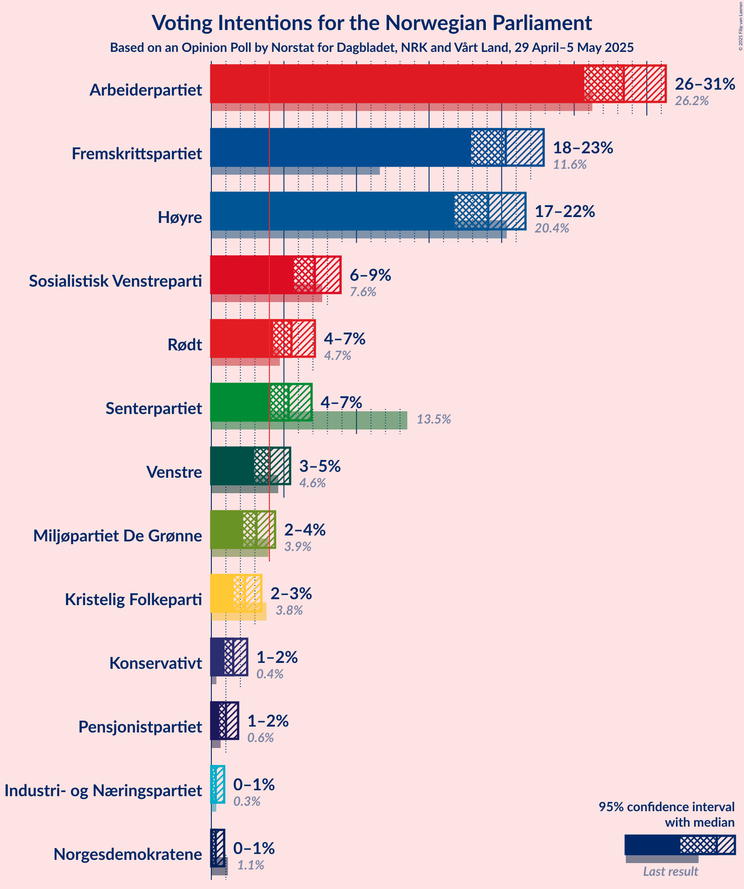
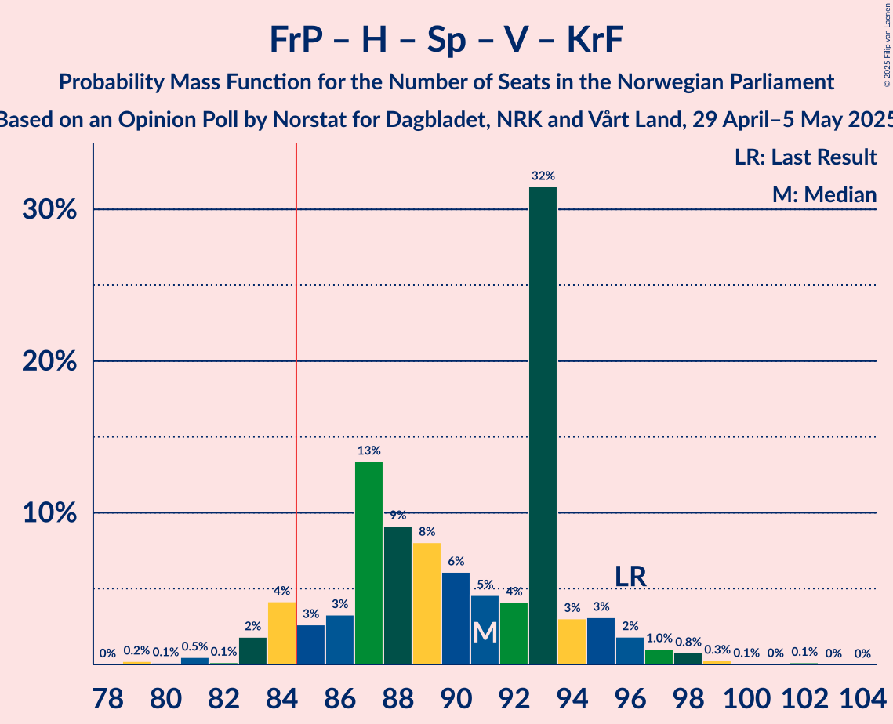
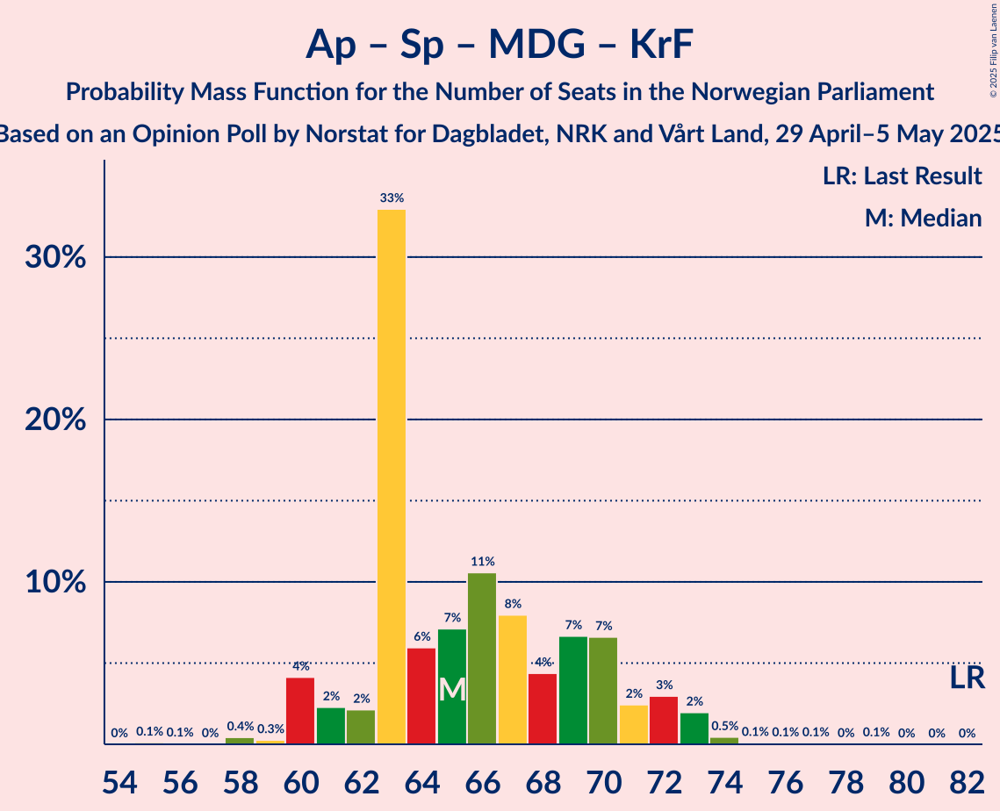

# Opinion Poll by Norstat for Dagbladet, NRK and Vårt Land, 29 April–5 May 2025

<a href="#voting-intentions">Voting Intentions</a> | <a href="#seats">Seats</a> | <a href="#coalitions">Coalitions</a> | <a href="#technical-information">Technical Information</a>

## Voting Intentions

### Confidence Intervals

| Party | Last Result | Poll Result | 80% Confidence Interval | 90% Confidence Interval | 95% Confidence Interval | 99% Confidence Interval |
|:-----:|:-----------:|:-----------:|:-----------------------:|:-----------------------:|:-----------------------:|:-----------------------:|
| Arbeiderpartiet | 26.2% | 28.4% | 26.6–30.3% |26.1–30.8% |25.7–31.3% |24.9–32.2% |
| Fremskrittspartiet | 11.6% | 20.3% | 18.7–22.0% |18.3–22.5% |17.9–22.9% |17.2–23.7% |
| Høyre | 20.4% | 19.1% | 17.5–20.8% |17.1–21.2% |16.8–21.6% |16.0–22.5% |
| Sosialistisk Venstreparti | 7.6% | 7.1% | 6.2–8.3% |5.9–8.6% |5.7–8.9% |5.3–9.5% |
| Rødt | 4.7% | 5.5% | 4.7–6.6% |4.5–6.9% |4.3–7.1% |3.9–7.7% |
| Senterpartiet | 13.5% | 5.3% | 4.5–6.4% |4.3–6.6% |4.1–6.9% |3.7–7.4% |
| Venstre | 4.6% | 4.0% | 3.3–4.9% |3.1–5.2% |3.0–5.4% |2.7–5.9% |
| Miljøpartiet De Grønne | 3.9% | 3.1% | 2.5–3.9% |2.3–4.2% |2.2–4.4% |1.9–4.8% |
| Kristelig Folkeparti | 3.8% | 2.3% | 1.8–3.0% |1.7–3.3% |1.5–3.4% |1.3–3.8% |
| Konservativt | 0.4% | 1.5% | 1.1–2.1% |1.0–2.3% |0.9–2.5% |0.7–2.8% |
| Pensjonistpartiet | 0.6% | 1.0% | 0.7–1.6% |0.6–1.7% |0.5–1.8% |0.4–2.1% |
| Norgesdemokratene | 1.1% | 0.3% | 0.2–0.7% |0.1–0.8% |0.1–0.9% |0.1–1.1% |
| Industri- og Næringspartiet | 0.3% | 0.3% | 0.2–0.7% |0.1–0.8% |0.1–0.9% |0.1–1.1% |

*Note:* The poll result column reflects the actual value used in the calculations. Published results may vary slightly, and in addition be rounded to fewer digits.

## Seats

### Confidence Intervals

| Party | Last Result | Median | 80% Confidence Interval | 90% Confidence Interval | 95% Confidence Interval | 99% Confidence Interval |
|:-----:|:-----------:|:------:|:-----------------------:|:-----------------------:|:-----------------------:|:-----------------------:|
| <a href="#arbeiderpartiet">Arbeiderpartiet</a> | 48 | 52 | 50–57 |50–58 |48–59 |47–61 |
| <a href="#fremskrittspartiet">Fremskrittspartiet</a> | 21 | 40 | 35–42 |35–42 |34–43 |33–45 |
| <a href="#høyre">Høyre</a> | 36 | 33 | 32–37 |31–39 |30–40 |28–43 |
| <a href="#sosialistisk-venstreparti">Sosialistisk Venstreparti</a> | 13 | 12 | 11–16 |10–17 |10–17 |9–18 |
| <a href="#rødt">Rødt</a> | 8 | 11 | 8–12 |8–13 |8–13 |1–14 |
| <a href="#senterpartiet">Senterpartiet</a> | 28 | 8 | 8–12 |1–13 |1–13 |0–14 |
| <a href="#venstre">Venstre</a> | 8 | 8 | 2–9 |2–9 |2–10 |2–11 |
| <a href="#miljøpartiet-de-grønne">Miljøpartiet De Grønne</a> | 3 | 3 | 1–3 |1–6 |1–7 |1–8 |
| <a href="#kristelig-folkeparti">Kristelig Folkeparti</a> | 3 | 2 | 0–2 |0–3 |0–3 |0–7 |
| <a href="#konservativt">Konservativt</a> | 0 | 0 | 0 |0 |0 |0 |
| <a href="#pensjonistpartiet">Pensjonistpartiet</a> | 0 | 0 | 0 |0 |0 |0 |
| <a href="#norgesdemokratene">Norgesdemokratene</a> | 0 | 0 | 0 |0 |0 |0 |
| <a href="#industri--og-næringspartiet">Industri- og Næringspartiet</a> | 0 | 0 | 0 |0 |0 |0 |

### Arbeiderpartiet

*For a full overview of the results for this party, see the [Arbeiderpartiet](party-arbeiderpartiet.html) page.*

| Number of Seats | Probability | Accumulated | Special Marks |
|:---------------:|:-----------:|:-----------:|:-------------:|
| 46 | 0.2% | 100% |  |
| 47 | 0.5% | 99.7% |  |
| 48 | 2% | 99.2% | Last Result |
| 49 | 2% | 97% |  |
| 50 | 34% | 95% |  |
| 51 | 4% | 62% |  |
| 52 | 10% | 57% | Median |
| 53 | 3% | 47% |  |
| 54 | 18% | 44% |  |
| 55 | 4% | 26% |  |
| 56 | 10% | 22% |  |
| 57 | 5% | 12% |  |
| 58 | 3% | 7% |  |
| 59 | 1.0% | 3% |  |
| 60 | 2% | 2% |  |
| 61 | 0.3% | 0.6% |  |
| 62 | 0.1% | 0.2% |  |
| 63 | 0% | 0.1% |  |
| 64 | 0% | 0.1% |  |
| 65 | 0% | 0% |  |

### Fremskrittspartiet

*For a full overview of the results for this party, see the [Fremskrittspartiet](party-fremskrittspartiet.html) page.*

| Number of Seats | Probability | Accumulated | Special Marks |
|:---------------:|:-----------:|:-----------:|:-------------:|
| 21 | 0% | 100% | Last Result |
| 22 | 0% | 100% |  |
| 23 | 0% | 100% |  |
| 24 | 0% | 100% |  |
| 25 | 0% | 100% |  |
| 26 | 0% | 100% |  |
| 27 | 0% | 100% |  |
| 28 | 0% | 100% |  |
| 29 | 0% | 100% |  |
| 30 | 0.1% | 100% |  |
| 31 | 0% | 99.9% |  |
| 32 | 0.2% | 99.9% |  |
| 33 | 1.3% | 99.7% |  |
| 34 | 1.5% | 98% |  |
| 35 | 10% | 97% |  |
| 36 | 3% | 87% |  |
| 37 | 3% | 84% |  |
| 38 | 5% | 80% |  |
| 39 | 15% | 75% |  |
| 40 | 12% | 61% | Median |
| 41 | 11% | 49% |  |
| 42 | 34% | 37% |  |
| 43 | 2% | 4% |  |
| 44 | 0.9% | 1.5% |  |
| 45 | 0.4% | 0.5% |  |
| 46 | 0% | 0.1% |  |
| 47 | 0.1% | 0.1% |  |
| 48 | 0% | 0% |  |

### Høyre

*For a full overview of the results for this party, see the [Høyre](party-høyre.html) page.*

| Number of Seats | Probability | Accumulated | Special Marks |
|:---------------:|:-----------:|:-----------:|:-------------:|
| 27 | 0% | 100% |  |
| 28 | 0.7% | 99.9% |  |
| 29 | 0.3% | 99.2% |  |
| 30 | 2% | 98.9% |  |
| 31 | 3% | 97% |  |
| 32 | 8% | 93% |  |
| 33 | 38% | 85% | Median |
| 34 | 8% | 47% |  |
| 35 | 18% | 39% |  |
| 36 | 6% | 21% | Last Result |
| 37 | 7% | 16% |  |
| 38 | 4% | 9% |  |
| 39 | 2% | 6% |  |
| 40 | 1.2% | 4% |  |
| 41 | 1.4% | 2% |  |
| 42 | 0.3% | 1.1% |  |
| 43 | 0.8% | 0.8% |  |
| 44 | 0% | 0% |  |

### Sosialistisk Venstreparti

*For a full overview of the results for this party, see the [Sosialistisk Venstreparti](party-sosialistiskvenstreparti.html) page.*

| Number of Seats | Probability | Accumulated | Special Marks |
|:---------------:|:-----------:|:-----------:|:-------------:|
| 9 | 1.3% | 100% |  |
| 10 | 4% | 98.6% |  |
| 11 | 5% | 95% |  |
| 12 | 43% | 89% | Median |
| 13 | 16% | 47% | Last Result |
| 14 | 6% | 31% |  |
| 15 | 9% | 25% |  |
| 16 | 11% | 16% |  |
| 17 | 5% | 6% |  |
| 18 | 1.0% | 1.1% |  |
| 19 | 0% | 0.1% |  |
| 20 | 0% | 0% |  |

### Rødt

*For a full overview of the results for this party, see the [Rødt](party-rødt.html) page.*

| Number of Seats | Probability | Accumulated | Special Marks |
|:---------------:|:-----------:|:-----------:|:-------------:|
| 1 | 1.2% | 100% |  |
| 2 | 0.2% | 98.8% |  |
| 3 | 0% | 98.6% |  |
| 4 | 0% | 98.6% |  |
| 5 | 0% | 98.6% |  |
| 6 | 0% | 98.6% |  |
| 7 | 0.6% | 98.6% |  |
| 8 | 11% | 98% | Last Result |
| 9 | 7% | 87% |  |
| 10 | 23% | 80% |  |
| 11 | 44% | 57% | Median |
| 12 | 6% | 14% |  |
| 13 | 5% | 8% |  |
| 14 | 2% | 2% |  |
| 15 | 0% | 0.1% |  |
| 16 | 0% | 0% |  |

### Senterpartiet

*For a full overview of the results for this party, see the [Senterpartiet](party-senterpartiet.html) page.*

| Number of Seats | Probability | Accumulated | Special Marks |
|:---------------:|:-----------:|:-----------:|:-------------:|
| 0 | 1.4% | 100% |  |
| 1 | 5% | 98.6% |  |
| 2 | 0% | 94% |  |
| 3 | 0% | 94% |  |
| 4 | 0% | 94% |  |
| 5 | 0% | 94% |  |
| 6 | 0.1% | 94% |  |
| 7 | 2% | 94% |  |
| 8 | 50% | 92% | Median |
| 9 | 13% | 42% |  |
| 10 | 11% | 30% |  |
| 11 | 9% | 19% |  |
| 12 | 5% | 10% |  |
| 13 | 4% | 5% |  |
| 14 | 1.1% | 1.4% |  |
| 15 | 0.2% | 0.2% |  |
| 16 | 0% | 0% |  |
| 17 | 0% | 0% |  |
| 18 | 0% | 0% |  |
| 19 | 0% | 0% |  |
| 20 | 0% | 0% |  |
| 21 | 0% | 0% |  |
| 22 | 0% | 0% |  |
| 23 | 0% | 0% |  |
| 24 | 0% | 0% |  |
| 25 | 0% | 0% |  |
| 26 | 0% | 0% |  |
| 27 | 0% | 0% |  |
| 28 | 0% | 0% | Last Result |

### Venstre

*For a full overview of the results for this party, see the [Venstre](party-venstre.html) page.*

| Number of Seats | Probability | Accumulated | Special Marks |
|:---------------:|:-----------:|:-----------:|:-------------:|
| 2 | 13% | 100% |  |
| 3 | 21% | 87% |  |
| 4 | 0% | 65% |  |
| 5 | 0% | 65% |  |
| 6 | 0% | 65% |  |
| 7 | 14% | 65% |  |
| 8 | 40% | 52% | Last Result, Median |
| 9 | 9% | 12% |  |
| 10 | 2% | 3% |  |
| 11 | 0.5% | 0.8% |  |
| 12 | 0.3% | 0.3% |  |
| 13 | 0% | 0% |  |

### Miljøpartiet De Grønne

*For a full overview of the results for this party, see the [Miljøpartiet De Grønne](party-miljøpartietdegrønne.html) page.*

| Number of Seats | Probability | Accumulated | Special Marks |
|:---------------:|:-----------:|:-----------:|:-------------:|
| 0 | 0.1% | 100% |  |
| 1 | 20% | 99.9% |  |
| 2 | 28% | 80% |  |
| 3 | 47% | 52% | Last Result, Median |
| 4 | 0% | 6% |  |
| 5 | 0% | 6% |  |
| 6 | 2% | 6% |  |
| 7 | 3% | 4% |  |
| 8 | 0.6% | 0.9% |  |
| 9 | 0.2% | 0.3% |  |
| 10 | 0.1% | 0.1% |  |
| 11 | 0% | 0% |  |

### Kristelig Folkeparti

*For a full overview of the results for this party, see the [Kristelig Folkeparti](party-kristeligfolkeparti.html) page.*

| Number of Seats | Probability | Accumulated | Special Marks |
|:---------------:|:-----------:|:-----------:|:-------------:|
| 0 | 21% | 100% |  |
| 1 | 24% | 79% |  |
| 2 | 46% | 56% | Median |
| 3 | 8% | 9% | Last Result |
| 4 | 0% | 2% |  |
| 5 | 0% | 2% |  |
| 6 | 0% | 2% |  |
| 7 | 2% | 2% |  |
| 8 | 0% | 0% |  |

### Konservativt

*For a full overview of the results for this party, see the [Konservativt](party-konservativt.html) page.*

| Number of Seats | Probability | Accumulated | Special Marks |
|:---------------:|:-----------:|:-----------:|:-------------:|
| 0 | 99.8% | 100% | Last Result, Median |
| 1 | 0.1% | 0.2% |  |
| 2 | 0.1% | 0.1% |  |
| 3 | 0% | 0% |  |

### Pensjonistpartiet

*For a full overview of the results for this party, see the [Pensjonistpartiet](party-pensjonistpartiet.html) page.*

| Number of Seats | Probability | Accumulated | Special Marks |
|:---------------:|:-----------:|:-----------:|:-------------:|
| 0 | 99.9% | 100% | Last Result, Median |
| 1 | 0.1% | 0.1% |  |
| 2 | 0% | 0% |  |

### Norgesdemokratene

*For a full overview of the results for this party, see the [Norgesdemokratene](party-norgesdemokratene.html) page.*

| Number of Seats | Probability | Accumulated | Special Marks |
|:---------------:|:-----------:|:-----------:|:-------------:|
| 0 | 100% | 100% | Last Result, Median |

### Industri- og Næringspartiet

*For a full overview of the results for this party, see the [Industri- og Næringspartiet](party-industri-ognæringspartiet.html) page.*

| Number of Seats | Probability | Accumulated | Special Marks |
|:---------------:|:-----------:|:-----------:|:-------------:|
| 0 | 100% | 100% | Last Result, Median |

## Coalitions

### Confidence Intervals

| Coalition | Last Result | Median | Majority? | 80% Confidence Interval | 90% Confidence Interval | 95% Confidence Interval | 99% Confidence Interval |
|:---------:|:-----------:|:------:|:---------:|:-----------------------:|:-----------------------:|:-----------------------:|:-----------------------:|
| Fremskrittspartiet – Høyre – Senterpartiet – Venstre – Kristelig Folkeparti | 96 | 91 | 93% | 86–94 | 84–95 | 83–96 | 81–99 |
| Arbeiderpartiet – Sosialistisk Venstreparti – Rødt – Senterpartiet – Miljøpartiet De Grønne | 100 | 88 | 59% | 83–93 | 83–95 | 81–95 | 79–98 |
| Arbeiderpartiet – Sosialistisk Venstreparti – Rødt – Senterpartiet | 97 | 84 | 49% | 81–91 | 80–92 | 79–93 | 76–96 |
| Fremskrittspartiet – Høyre – Venstre – Miljøpartiet De Grønne – Kristelig Folkeparti | 71 | 85 | 51% | 78–88 | 77–89 | 76–90 | 73–92 |
| Fremskrittspartiet – Høyre – Venstre – Kristelig Folkeparti | 68 | 81 | 41% | 76–86 | 74–86 | 74–88 | 71–90 |
| Fremskrittspartiet – Høyre – Venstre | 65 | 80 | 9% | 75–84 | 73–86 | 73–87 | 71–88 |
| Arbeiderpartiet – Sosialistisk Venstreparti – Rødt – Miljøpartiet De Grønne | 72 | 78 | 7% | 75–83 | 74–85 | 73–86 | 70–88 |
| Arbeiderpartiet – Sosialistisk Venstreparti – Senterpartiet – Miljøpartiet De Grønne – Kristelig Folkeparti | 95 | 78 | 8% | 75–84 | 74–85 | 72–86 | 72–88 |
| Arbeiderpartiet – Sosialistisk Venstreparti – Senterpartiet – Miljøpartiet De Grønne | 92 | 77 | 2% | 73–82 | 72–84 | 72–84 | 71–86 |
| Arbeiderpartiet – Sosialistisk Venstreparti – Senterpartiet | 89 | 75 | 0.3% | 70–80 | 70–82 | 69–82 | 68–84 |
| Fremskrittspartiet – Høyre | 57 | 75 | 0% | 70–77 | 69–78 | 69–80 | 66–83 |
| Arbeiderpartiet – Senterpartiet – Miljøpartiet De Grønne – Kristelig Folkeparti | 82 | 65 | 0% | 63–70 | 60–72 | 60–73 | 58–74 |
| Arbeiderpartiet – Sosialistisk Venstreparti | 61 | 66 | 0% | 62–71 | 62–71 | 61–72 | 60–75 |
| Arbeiderpartiet – Senterpartiet – Kristelig Folkeparti | 79 | 62 | 0% | 60–68 | 59–69 | 57–71 | 56–72 |
| Arbeiderpartiet – Senterpartiet | 76 | 62 | 0% | 58–66 | 57–67 | 57–68 | 55–70 |
| Høyre – Venstre – Kristelig Folkeparti | 47 | 43 | 0% | 37–45 | 36–47 | 35–48 | 33–51 |
| Senterpartiet – Venstre – Kristelig Folkeparti | 39 | 17 | 0% | 12–19 | 10–21 | 10–22 | 5–24 |

### Fremskrittspartiet – Høyre – Senterpartiet – Venstre – Kristelig Folkeparti

| Number of Seats | Probability | Accumulated | Special Marks |
|:---------------:|:-----------:|:-----------:|:-------------:|
| 79 | 0.2% | 100% |  |
| 80 | 0.1% | 99.7% |  |
| 81 | 0.5% | 99.6% |  |
| 82 | 0.1% | 99.2% |  |
| 83 | 2% | 99.0% |  |
| 84 | 4% | 97% |  |
| 85 | 3% | 93% | Majority |
| 86 | 3% | 90% |  |
| 87 | 13% | 87% |  |
| 88 | 9% | 74% |  |
| 89 | 8% | 65% |  |
| 90 | 6% | 57% |  |
| 91 | 5% | 50% | Median |
| 92 | 4% | 46% |  |
| 93 | 32% | 42% |  |
| 94 | 3% | 10% |  |
| 95 | 3% | 7% |  |
| 96 | 2% | 4% | Last Result |
| 97 | 1.0% | 2% |  |
| 98 | 0.8% | 1.3% |  |
| 99 | 0.3% | 0.5% |  |
| 100 | 0.1% | 0.2% |  |
| 101 | 0% | 0.2% |  |
| 102 | 0.1% | 0.1% |  |
| 103 | 0% | 0% |  |

### Arbeiderpartiet – Sosialistisk Venstreparti – Rødt – Senterpartiet – Miljøpartiet De Grønne

| Number of Seats | Probability | Accumulated | Special Marks |
|:---------------:|:-----------:|:-----------:|:-------------:|
| 78 | 0.2% | 100% |  |
| 79 | 0.5% | 99.8% |  |
| 80 | 0.3% | 99.3% |  |
| 81 | 2% | 99.1% |  |
| 82 | 2% | 97% |  |
| 83 | 6% | 96% |  |
| 84 | 31% | 90% |  |
| 85 | 2% | 59% | Majority |
| 86 | 2% | 56% | Median |
| 87 | 4% | 54% |  |
| 88 | 6% | 50% |  |
| 89 | 16% | 44% |  |
| 90 | 8% | 28% |  |
| 91 | 3% | 20% |  |
| 92 | 3% | 16% |  |
| 93 | 6% | 14% |  |
| 94 | 2% | 8% |  |
| 95 | 5% | 6% |  |
| 96 | 0.6% | 1.4% |  |
| 97 | 0.2% | 0.8% |  |
| 98 | 0.5% | 0.6% |  |
| 99 | 0.1% | 0.2% |  |
| 100 | 0% | 0.1% | Last Result |
| 101 | 0% | 0% |  |

### Arbeiderpartiet – Sosialistisk Venstreparti – Rødt – Senterpartiet

| Number of Seats | Probability | Accumulated | Special Marks |
|:---------------:|:-----------:|:-----------:|:-------------:|
| 74 | 0% | 100% |  |
| 75 | 0.2% | 99.9% |  |
| 76 | 0.3% | 99.8% |  |
| 77 | 0.3% | 99.5% |  |
| 78 | 1.1% | 99.2% |  |
| 79 | 0.7% | 98% |  |
| 80 | 5% | 97% |  |
| 81 | 32% | 93% |  |
| 82 | 6% | 61% |  |
| 83 | 3% | 55% | Median |
| 84 | 3% | 52% |  |
| 85 | 3% | 49% | Majority |
| 86 | 6% | 46% |  |
| 87 | 7% | 40% |  |
| 88 | 15% | 33% |  |
| 89 | 3% | 19% |  |
| 90 | 5% | 16% |  |
| 91 | 3% | 11% |  |
| 92 | 3% | 8% |  |
| 93 | 4% | 5% |  |
| 94 | 0.2% | 1.0% |  |
| 95 | 0.2% | 0.8% |  |
| 96 | 0.5% | 0.5% |  |
| 97 | 0.1% | 0.1% | Last Result |
| 98 | 0% | 0% |  |

### Fremskrittspartiet – Høyre – Venstre – Miljøpartiet De Grønne – Kristelig Folkeparti

| Number of Seats | Probability | Accumulated | Special Marks |
|:---------------:|:-----------:|:-----------:|:-------------:|
| 71 | 0% | 100% | Last Result |
| 72 | 0.1% | 100% |  |
| 73 | 0.5% | 99.9% |  |
| 74 | 0.2% | 99.5% |  |
| 75 | 0.2% | 99.2% |  |
| 76 | 4% | 99.0% |  |
| 77 | 3% | 95% |  |
| 78 | 3% | 92% |  |
| 79 | 5% | 89% |  |
| 80 | 3% | 84% |  |
| 81 | 15% | 81% |  |
| 82 | 7% | 67% |  |
| 83 | 6% | 60% |  |
| 84 | 3% | 54% |  |
| 85 | 3% | 51% | Majority |
| 86 | 3% | 48% | Median |
| 87 | 6% | 45% |  |
| 88 | 32% | 39% |  |
| 89 | 5% | 7% |  |
| 90 | 0.7% | 3% |  |
| 91 | 1.2% | 2% |  |
| 92 | 0.3% | 0.8% |  |
| 93 | 0.2% | 0.5% |  |
| 94 | 0.2% | 0.2% |  |
| 95 | 0% | 0% |  |

### Fremskrittspartiet – Høyre – Venstre – Kristelig Folkeparti

| Number of Seats | Probability | Accumulated | Special Marks |
|:---------------:|:-----------:|:-----------:|:-------------:|
| 68 | 0% | 100% | Last Result |
| 69 | 0% | 100% |  |
| 70 | 0.1% | 99.9% |  |
| 71 | 0.5% | 99.8% |  |
| 72 | 0.2% | 99.3% |  |
| 73 | 0.6% | 99.2% |  |
| 74 | 5% | 98.6% |  |
| 75 | 2% | 94% |  |
| 76 | 6% | 92% |  |
| 77 | 3% | 86% |  |
| 78 | 3% | 84% |  |
| 79 | 8% | 80% |  |
| 80 | 16% | 72% |  |
| 81 | 6% | 56% |  |
| 82 | 4% | 50% |  |
| 83 | 2% | 46% | Median |
| 84 | 2% | 44% |  |
| 85 | 31% | 41% | Majority |
| 86 | 6% | 10% |  |
| 87 | 2% | 4% |  |
| 88 | 2% | 3% |  |
| 89 | 0.2% | 0.9% |  |
| 90 | 0.4% | 0.6% |  |
| 91 | 0.2% | 0.2% |  |
| 92 | 0% | 0% |  |

### Fremskrittspartiet – Høyre – Venstre

| Number of Seats | Probability | Accumulated | Special Marks |
|:---------------:|:-----------:|:-----------:|:-------------:|
| 65 | 0% | 100% | Last Result |
| 66 | 0% | 100% |  |
| 67 | 0% | 100% |  |
| 68 | 0% | 100% |  |
| 69 | 0.1% | 99.9% |  |
| 70 | 0.1% | 99.8% |  |
| 71 | 1.2% | 99.7% |  |
| 72 | 0.4% | 98% |  |
| 73 | 5% | 98% |  |
| 74 | 2% | 93% |  |
| 75 | 6% | 91% |  |
| 76 | 4% | 85% |  |
| 77 | 8% | 80% |  |
| 78 | 5% | 73% |  |
| 79 | 11% | 67% |  |
| 80 | 6% | 56% |  |
| 81 | 4% | 50% | Median |
| 82 | 3% | 46% |  |
| 83 | 31% | 43% |  |
| 84 | 2% | 11% |  |
| 85 | 3% | 9% | Majority |
| 86 | 4% | 6% |  |
| 87 | 2% | 3% |  |
| 88 | 0.4% | 0.8% |  |
| 89 | 0.3% | 0.4% |  |
| 90 | 0.1% | 0.1% |  |
| 91 | 0% | 0% |  |

### Arbeiderpartiet – Sosialistisk Venstreparti – Rødt – Miljøpartiet De Grønne

| Number of Seats | Probability | Accumulated | Special Marks |
|:---------------:|:-----------:|:-----------:|:-------------:|
| 67 | 0.1% | 100% |  |
| 68 | 0% | 99.8% |  |
| 69 | 0.1% | 99.8% |  |
| 70 | 0.3% | 99.7% |  |
| 71 | 0.8% | 99.5% |  |
| 72 | 1.0% | 98.7% | Last Result |
| 73 | 2% | 98% |  |
| 74 | 3% | 96% |  |
| 75 | 3% | 93% |  |
| 76 | 32% | 90% |  |
| 77 | 4% | 58% |  |
| 78 | 5% | 54% | Median |
| 79 | 6% | 49% |  |
| 80 | 8% | 43% |  |
| 81 | 9% | 35% |  |
| 82 | 13% | 26% |  |
| 83 | 3% | 13% |  |
| 84 | 3% | 10% |  |
| 85 | 4% | 7% | Majority |
| 86 | 2% | 3% |  |
| 87 | 0.1% | 1.0% |  |
| 88 | 0.5% | 0.8% |  |
| 89 | 0.1% | 0.4% |  |
| 90 | 0.2% | 0.3% |  |
| 91 | 0% | 0% |  |

### Arbeiderpartiet – Sosialistisk Venstreparti – Senterpartiet – Miljøpartiet De Grønne – Kristelig Folkeparti

| Number of Seats | Probability | Accumulated | Special Marks |
|:---------------:|:-----------:|:-----------:|:-------------:|
| 69 | 0.1% | 100% |  |
| 70 | 0.1% | 99.9% |  |
| 71 | 0.1% | 99.8% |  |
| 72 | 3% | 99.7% |  |
| 73 | 1.2% | 97% |  |
| 74 | 3% | 95% |  |
| 75 | 31% | 92% |  |
| 76 | 5% | 61% |  |
| 77 | 4% | 56% | Median |
| 78 | 4% | 52% |  |
| 79 | 4% | 49% |  |
| 80 | 11% | 45% |  |
| 81 | 5% | 34% |  |
| 82 | 13% | 29% |  |
| 83 | 5% | 16% |  |
| 84 | 4% | 12% |  |
| 85 | 4% | 8% | Majority |
| 86 | 3% | 4% |  |
| 87 | 0.2% | 0.7% |  |
| 88 | 0.2% | 0.5% |  |
| 89 | 0.1% | 0.3% |  |
| 90 | 0% | 0.2% |  |
| 91 | 0.1% | 0.2% |  |
| 92 | 0% | 0% |  |
| 93 | 0% | 0% |  |
| 94 | 0% | 0% |  |
| 95 | 0% | 0% | Last Result |

### Arbeiderpartiet – Sosialistisk Venstreparti – Senterpartiet – Miljøpartiet De Grønne

| Number of Seats | Probability | Accumulated | Special Marks |
|:---------------:|:-----------:|:-----------:|:-------------:|
| 68 | 0% | 100% |  |
| 69 | 0.1% | 99.9% |  |
| 70 | 0.1% | 99.8% |  |
| 71 | 0.5% | 99.7% |  |
| 72 | 4% | 99.2% |  |
| 73 | 34% | 95% |  |
| 74 | 2% | 61% |  |
| 75 | 1.0% | 59% | Median |
| 76 | 6% | 58% |  |
| 77 | 4% | 53% |  |
| 78 | 6% | 49% |  |
| 79 | 12% | 43% |  |
| 80 | 12% | 31% |  |
| 81 | 6% | 19% |  |
| 82 | 4% | 13% |  |
| 83 | 2% | 9% |  |
| 84 | 4% | 7% |  |
| 85 | 0.9% | 2% | Majority |
| 86 | 0.9% | 1.4% |  |
| 87 | 0.2% | 0.5% |  |
| 88 | 0.1% | 0.3% |  |
| 89 | 0% | 0.2% |  |
| 90 | 0.1% | 0.2% |  |
| 91 | 0% | 0% |  |
| 92 | 0% | 0% | Last Result |

### Arbeiderpartiet – Sosialistisk Venstreparti – Senterpartiet

| Number of Seats | Probability | Accumulated | Special Marks |
|:---------------:|:-----------:|:-----------:|:-------------:|
| 65 | 0% | 100% |  |
| 66 | 0.1% | 99.9% |  |
| 67 | 0.2% | 99.8% |  |
| 68 | 0.2% | 99.7% |  |
| 69 | 3% | 99.5% |  |
| 70 | 32% | 96% |  |
| 71 | 4% | 65% |  |
| 72 | 3% | 61% | Median |
| 73 | 2% | 58% |  |
| 74 | 5% | 56% |  |
| 75 | 7% | 50% |  |
| 76 | 3% | 43% |  |
| 77 | 8% | 40% |  |
| 78 | 14% | 33% |  |
| 79 | 8% | 19% |  |
| 80 | 4% | 11% |  |
| 81 | 2% | 7% |  |
| 82 | 4% | 5% |  |
| 83 | 0.4% | 1.2% |  |
| 84 | 0.6% | 0.9% |  |
| 85 | 0.1% | 0.3% | Majority |
| 86 | 0.1% | 0.2% |  |
| 87 | 0% | 0.1% |  |
| 88 | 0% | 0.1% |  |
| 89 | 0% | 0% | Last Result |

### Fremskrittspartiet – Høyre

| Number of Seats | Probability | Accumulated | Special Marks |
|:---------------:|:-----------:|:-----------:|:-------------:|
| 57 | 0% | 100% | Last Result |
| 58 | 0% | 100% |  |
| 59 | 0% | 100% |  |
| 60 | 0% | 100% |  |
| 61 | 0% | 100% |  |
| 62 | 0% | 100% |  |
| 63 | 0% | 100% |  |
| 64 | 0.1% | 100% |  |
| 65 | 0.1% | 99.9% |  |
| 66 | 0.3% | 99.8% |  |
| 67 | 1.1% | 99.5% |  |
| 68 | 0.8% | 98% |  |
| 69 | 3% | 98% |  |
| 70 | 12% | 94% |  |
| 71 | 6% | 82% |  |
| 72 | 8% | 76% |  |
| 73 | 6% | 69% | Median |
| 74 | 8% | 63% |  |
| 75 | 32% | 55% |  |
| 76 | 5% | 23% |  |
| 77 | 11% | 18% |  |
| 78 | 2% | 7% |  |
| 79 | 2% | 5% |  |
| 80 | 1.4% | 3% |  |
| 81 | 0.4% | 2% |  |
| 82 | 0.5% | 1.3% |  |
| 83 | 0.7% | 0.8% |  |
| 84 | 0.1% | 0.1% |  |
| 85 | 0% | 0% | Majority |

### Arbeiderpartiet – Senterpartiet – Miljøpartiet De Grønne – Kristelig Folkeparti

| Number of Seats | Probability | Accumulated | Special Marks |
|:---------------:|:-----------:|:-----------:|:-------------:|
| 54 | 0% | 100% |  |
| 55 | 0.1% | 99.9% |  |
| 56 | 0.1% | 99.8% |  |
| 57 | 0% | 99.8% |  |
| 58 | 0.4% | 99.7% |  |
| 59 | 0.3% | 99.3% |  |
| 60 | 4% | 99.0% |  |
| 61 | 2% | 95% |  |
| 62 | 2% | 93% |  |
| 63 | 33% | 90% |  |
| 64 | 6% | 58% |  |
| 65 | 7% | 52% | Median |
| 66 | 11% | 44% |  |
| 67 | 8% | 34% |  |
| 68 | 4% | 26% |  |
| 69 | 7% | 21% |  |
| 70 | 7% | 15% |  |
| 71 | 2% | 8% |  |
| 72 | 3% | 6% |  |
| 73 | 2% | 3% |  |
| 74 | 0.5% | 0.8% |  |
| 75 | 0.1% | 0.4% |  |
| 76 | 0.1% | 0.3% |  |
| 77 | 0.1% | 0.2% |  |
| 78 | 0% | 0.1% |  |
| 79 | 0.1% | 0.1% |  |
| 80 | 0% | 0% |  |
| 81 | 0% | 0% |  |
| 82 | 0% | 0% | Last Result |

### Arbeiderpartiet – Sosialistisk Venstreparti

| Number of Seats | Probability | Accumulated | Special Marks |
|:---------------:|:-----------:|:-----------:|:-------------:|
| 57 | 0% | 100% |  |
| 58 | 0% | 99.9% |  |
| 59 | 0.3% | 99.9% |  |
| 60 | 1.2% | 99.6% |  |
| 61 | 2% | 98% | Last Result |
| 62 | 32% | 96% |  |
| 63 | 4% | 65% |  |
| 64 | 5% | 61% | Median |
| 65 | 4% | 56% |  |
| 66 | 6% | 51% |  |
| 67 | 6% | 45% |  |
| 68 | 7% | 39% |  |
| 69 | 10% | 31% |  |
| 70 | 9% | 21% |  |
| 71 | 10% | 13% |  |
| 72 | 2% | 3% |  |
| 73 | 0.7% | 2% |  |
| 74 | 0.3% | 0.8% |  |
| 75 | 0.2% | 0.5% |  |
| 76 | 0.2% | 0.3% |  |
| 77 | 0% | 0.1% |  |
| 78 | 0% | 0% |  |

### Arbeiderpartiet – Senterpartiet – Kristelig Folkeparti

| Number of Seats | Probability | Accumulated | Special Marks |
|:---------------:|:-----------:|:-----------:|:-------------:|
| 52 | 0.1% | 100% |  |
| 53 | 0.1% | 99.9% |  |
| 54 | 0.1% | 99.8% |  |
| 55 | 0% | 99.7% |  |
| 56 | 0.3% | 99.7% |  |
| 57 | 3% | 99.5% |  |
| 58 | 0.8% | 96% |  |
| 59 | 3% | 96% |  |
| 60 | 31% | 93% |  |
| 61 | 4% | 62% |  |
| 62 | 11% | 58% | Median |
| 63 | 7% | 47% |  |
| 64 | 9% | 39% |  |
| 65 | 8% | 31% |  |
| 66 | 5% | 23% |  |
| 67 | 5% | 17% |  |
| 68 | 5% | 12% |  |
| 69 | 4% | 8% |  |
| 70 | 2% | 4% |  |
| 71 | 0.6% | 3% |  |
| 72 | 2% | 2% |  |
| 73 | 0.2% | 0.3% |  |
| 74 | 0.1% | 0.1% |  |
| 75 | 0% | 0% |  |
| 76 | 0% | 0% |  |
| 77 | 0% | 0% |  |
| 78 | 0% | 0% |  |
| 79 | 0% | 0% | Last Result |

### Arbeiderpartiet – Senterpartiet

| Number of Seats | Probability | Accumulated | Special Marks |
|:---------------:|:-----------:|:-----------:|:-------------:|
| 52 | 0.1% | 100% |  |
| 53 | 0.1% | 99.8% |  |
| 54 | 0.1% | 99.8% |  |
| 55 | 0.4% | 99.7% |  |
| 56 | 0.4% | 99.3% |  |
| 57 | 4% | 98.9% |  |
| 58 | 31% | 95% |  |
| 59 | 4% | 63% |  |
| 60 | 3% | 59% | Median |
| 61 | 5% | 57% |  |
| 62 | 17% | 51% |  |
| 63 | 5% | 34% |  |
| 64 | 7% | 29% |  |
| 65 | 8% | 22% |  |
| 66 | 5% | 14% |  |
| 67 | 6% | 9% |  |
| 68 | 2% | 3% |  |
| 69 | 0.4% | 2% |  |
| 70 | 0.9% | 1.3% |  |
| 71 | 0.2% | 0.3% |  |
| 72 | 0.1% | 0.2% |  |
| 73 | 0% | 0.1% |  |
| 74 | 0% | 0% |  |
| 75 | 0% | 0% |  |
| 76 | 0% | 0% | Last Result |

### Høyre – Venstre – Kristelig Folkeparti

| Number of Seats | Probability | Accumulated | Special Marks |
|:---------------:|:-----------:|:-----------:|:-------------:|
| 31 | 0.1% | 100% |  |
| 32 | 0.3% | 99.9% |  |
| 33 | 0.2% | 99.6% |  |
| 34 | 2% | 99.4% |  |
| 35 | 2% | 98% |  |
| 36 | 3% | 96% |  |
| 37 | 3% | 93% |  |
| 38 | 3% | 89% |  |
| 39 | 7% | 86% |  |
| 40 | 6% | 80% |  |
| 41 | 12% | 73% |  |
| 42 | 5% | 61% |  |
| 43 | 34% | 56% | Median |
| 44 | 8% | 22% |  |
| 45 | 7% | 14% |  |
| 46 | 2% | 7% |  |
| 47 | 2% | 6% | Last Result |
| 48 | 2% | 4% |  |
| 49 | 1.3% | 2% |  |
| 50 | 0.1% | 1.1% |  |
| 51 | 1.0% | 1.0% |  |
| 52 | 0% | 0.1% |  |
| 53 | 0% | 0% |  |

### Senterpartiet – Venstre – Kristelig Folkeparti

| Number of Seats | Probability | Accumulated | Special Marks |
|:---------------:|:-----------:|:-----------:|:-------------:|
| 3 | 0.2% | 100% |  |
| 4 | 0.1% | 99.8% |  |
| 5 | 0.6% | 99.7% |  |
| 6 | 0.2% | 99.1% |  |
| 7 | 0% | 98.9% |  |
| 8 | 0.1% | 98.9% |  |
| 9 | 0.4% | 98.8% |  |
| 10 | 4% | 98% |  |
| 11 | 4% | 94% |  |
| 12 | 6% | 91% |  |
| 13 | 5% | 85% |  |
| 14 | 4% | 80% |  |
| 15 | 9% | 75% |  |
| 16 | 7% | 67% |  |
| 17 | 12% | 60% |  |
| 18 | 33% | 48% | Median |
| 19 | 5% | 15% |  |
| 20 | 4% | 10% |  |
| 21 | 1.0% | 5% |  |
| 22 | 2% | 4% |  |
| 23 | 2% | 2% |  |
| 24 | 0.3% | 0.6% |  |
| 25 | 0.2% | 0.3% |  |
| 26 | 0% | 0% |  |
| 27 | 0% | 0% |  |
| 28 | 0% | 0% |  |
| 29 | 0% | 0% |  |
| 30 | 0% | 0% |  |
| 31 | 0% | 0% |  |
| 32 | 0% | 0% |  |
| 33 | 0% | 0% |  |
| 34 | 0% | 0% |  |
| 35 | 0% | 0% |  |
| 36 | 0% | 0% |  |
| 37 | 0% | 0% |  |
| 38 | 0% | 0% |  |
| 39 | 0% | 0% | Last Result |

## Technical Information

### Opinion Poll

+ **Polling firm:** Norstat
+ **Commissioner(s):** Dagbladet, NRK and Vårt Land
+ **Fieldwork period:** 29 April–5 May 2025

### Calculations

+ **Sample size:** 996
+ **Simulations done:** 2,097,152
+ **Error estimate:** 2.65%

