# Opinion Poll by Opinion Perduco for ABC Nyheter and Altinget, 28 April–5 May 2025

<a href="#voting-intentions">Voting Intentions</a> | <a href="#seats">Seats</a> | <a href="#coalitions">Coalitions</a> | <a href="#technical-information">Technical Information</a>

## Voting Intentions

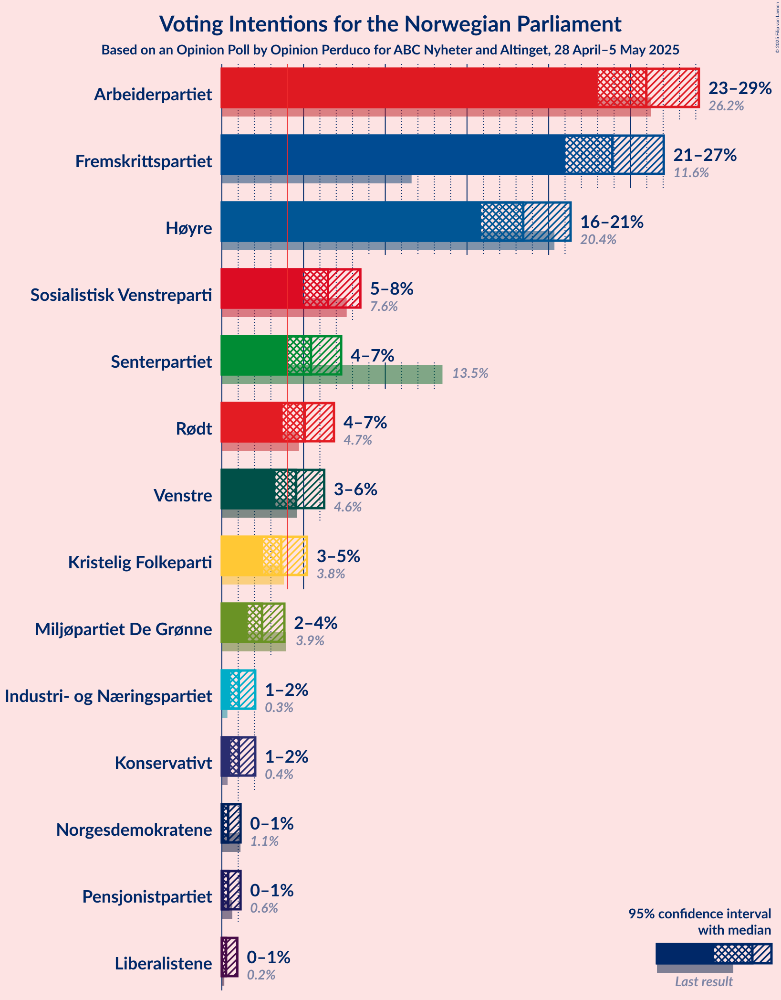

### Confidence Intervals

| Party | Last Result | Poll Result | 80% Confidence Interval | 90% Confidence Interval | 95% Confidence Interval | 99% Confidence Interval |
|:-----:|:-----------:|:-----------:|:-----------------------:|:-----------------------:|:-----------------------:|:-----------------------:|
| Arbeiderpartiet | 26.2% | 26.0% | 24.0–28.1% |23.5–28.7% |23.0–29.2% |22.1–30.2% |
| Fremskrittspartiet | 11.6% | 23.9% | 22.0–26.0% |21.5–26.5% |21.0–27.0% |20.1–28.0% |
| Høyre | 20.4% | 18.4% | 16.7–20.3% |16.3–20.9% |15.9–21.3% |15.1–22.3% |
| Sosialistisk Venstreparti | 7.6% | 6.5% | 5.5–7.8% |5.2–8.1% |5.0–8.5% |4.5–9.1% |
| Senterpartiet | 13.5% | 5.5% | 4.5–6.7% |4.3–7.0% |4.1–7.3% |3.7–7.9% |
| Rødt | 4.7% | 5.1% | 4.2–6.2% |3.9–6.6% |3.7–6.9% |3.3–7.5% |
| Venstre | 4.6% | 4.5% | 3.7–5.7% |3.5–6.0% |3.3–6.3% |2.9–6.8% |
| Kristelig Folkeparti | 3.8% | 3.6% | 2.9–4.7% |2.7–5.0% |2.5–5.2% |2.2–5.7% |
| Miljøpartiet De Grønne | 3.9% | 2.5% | 1.9–3.4% |1.7–3.6% |1.6–3.8% |1.3–4.3% |
| Konservativt | 0.4% | 1.0% | 0.7–1.7% |0.6–1.9% |0.5–2.0% |0.4–2.4% |
| Industri- og Næringspartiet | 0.3% | 1.0% | 0.7–1.7% |0.6–1.9% |0.5–2.0% |0.4–2.4% |
| Norgesdemokratene | 1.1% | 0.4% | 0.2–0.9% |0.2–1.0% |0.1–1.1% |0.1–1.4% |
| Pensjonistpartiet | 0.6% | 0.4% | 0.2–0.9% |0.2–1.0% |0.1–1.1% |0.1–1.4% |
| Liberalistene | 0.2% | 0.3% | 0.1–0.7% |0.1–0.8% |0.1–0.9% |0.0–1.2% |

*Note:* The poll result column reflects the actual value used in the calculations. Published results may vary slightly, and in addition be rounded to fewer digits.

## Seats

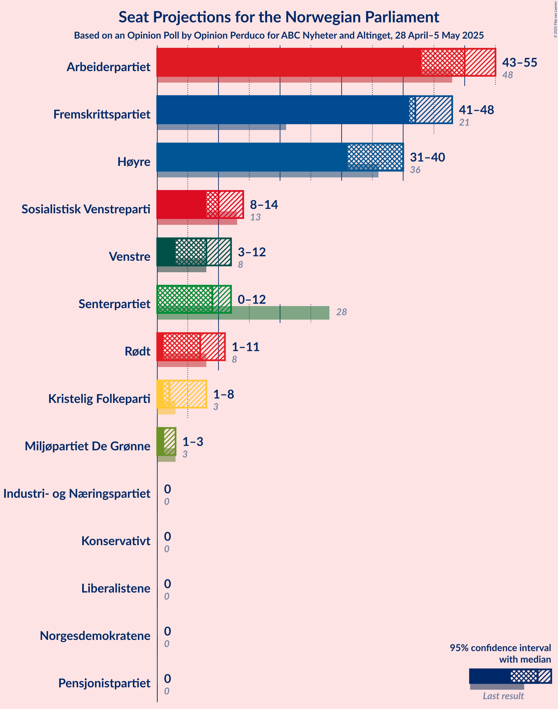

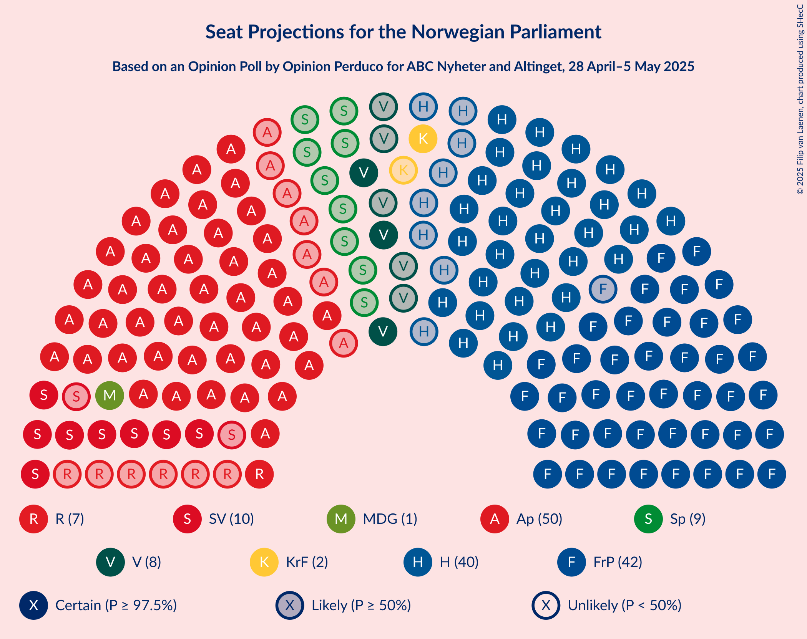

### Confidence Intervals

| Party | Last Result | Median | 80% Confidence Interval | 90% Confidence Interval | 95% Confidence Interval | 99% Confidence Interval |
|:-----:|:-----------:|:------:|:-----------------------:|:-----------------------:|:-----------------------:|:-----------------------:|
| <a href="#arbeiderpartiet">Arbeiderpartiet</a> | 48 | 50 | 48–53 |46–54 |43–55 |41–57 |
| <a href="#fremskrittspartiet">Fremskrittspartiet</a> | 21 | 42 | 42–46 |42–46 |41–48 |40–52 |
| <a href="#høyre">Høyre</a> | 36 | 40 | 31–40 |31–40 |31–40 |26–40 |
| <a href="#sosialistisk-venstreparti">Sosialistisk Venstreparti</a> | 13 | 10 | 10–12 |9–13 |8–14 |8–15 |
| <a href="#senterpartiet">Senterpartiet</a> | 28 | 9 | 8–10 |7–11 |0–12 |0–14 |
| <a href="#rødt">Rødt</a> | 8 | 7 | 7–10 |2–10 |1–11 |1–13 |
| <a href="#venstre">Venstre</a> | 8 | 8 | 8–10 |3–12 |3–12 |2–12 |
| <a href="#kristelig-folkeparti">Kristelig Folkeparti</a> | 3 | 2 | 2–7 |1–7 |1–8 |1–9 |
| <a href="#miljøpartiet-de-grønne">Miljøpartiet De Grønne</a> | 3 | 1 | 1–2 |1–3 |1–3 |0–6 |
| <a href="#konservativt">Konservativt</a> | 0 | 0 | 0 |0 |0 |0 |
| <a href="#industri--og-næringspartiet">Industri- og Næringspartiet</a> | 0 | 0 | 0 |0 |0 |0–2 |
| <a href="#norgesdemokratene">Norgesdemokratene</a> | 0 | 0 | 0 |0 |0 |0 |
| <a href="#pensjonistpartiet">Pensjonistpartiet</a> | 0 | 0 | 0 |0 |0 |0 |
| <a href="#liberalistene">Liberalistene</a> | 0 | 0 | 0 |0 |0 |0 |

### Arbeiderpartiet

*For a full overview of the results for this party, see the [Arbeiderpartiet](party-arbeiderpartiet.html) page.*

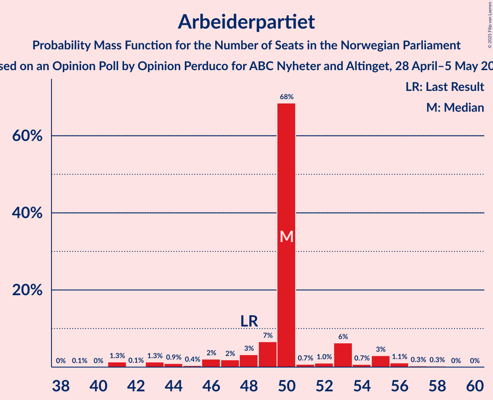

| Number of Seats | Probability | Accumulated | Special Marks |
|:---------------:|:-----------:|:-----------:|:-------------:|
| 39 | 0.1% | 100% |  |
| 40 | 0% | 99.9% |  |
| 41 | 1.3% | 99.9% |  |
| 42 | 0.1% | 98.5% |  |
| 43 | 1.3% | 98% |  |
| 44 | 0.9% | 97% |  |
| 45 | 0.4% | 96% |  |
| 46 | 2% | 96% |  |
| 47 | 2% | 94% |  |
| 48 | 3% | 92% | Last Result |
| 49 | 7% | 89% |  |
| 50 | 68% | 82% | Median |
| 51 | 0.7% | 13% |  |
| 52 | 1.0% | 13% |  |
| 53 | 6% | 12% |  |
| 54 | 0.7% | 5% |  |
| 55 | 3% | 5% |  |
| 56 | 1.1% | 2% |  |
| 57 | 0.3% | 0.7% |  |
| 58 | 0.3% | 0.4% |  |
| 59 | 0% | 0.1% |  |
| 60 | 0% | 0% |  |

### Fremskrittspartiet

*For a full overview of the results for this party, see the [Fremskrittspartiet](party-fremskrittspartiet.html) page.*

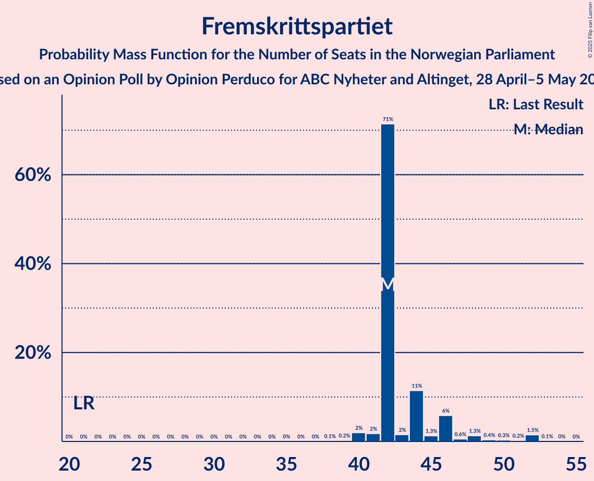

| Number of Seats | Probability | Accumulated | Special Marks |
|:---------------:|:-----------:|:-----------:|:-------------:|
| 21 | 0% | 100% | Last Result |
| 22 | 0% | 100% |  |
| 23 | 0% | 100% |  |
| 24 | 0% | 100% |  |
| 25 | 0% | 100% |  |
| 26 | 0% | 100% |  |
| 27 | 0% | 100% |  |
| 28 | 0% | 100% |  |
| 29 | 0% | 100% |  |
| 30 | 0% | 100% |  |
| 31 | 0% | 100% |  |
| 32 | 0% | 100% |  |
| 33 | 0% | 100% |  |
| 34 | 0% | 100% |  |
| 35 | 0% | 100% |  |
| 36 | 0% | 100% |  |
| 37 | 0% | 99.9% |  |
| 38 | 0.1% | 99.9% |  |
| 39 | 0.2% | 99.8% |  |
| 40 | 2% | 99.6% |  |
| 41 | 2% | 98% |  |
| 42 | 71% | 96% | Median |
| 43 | 2% | 24% |  |
| 44 | 11% | 23% |  |
| 45 | 1.3% | 11% |  |
| 46 | 6% | 10% |  |
| 47 | 0.6% | 4% |  |
| 48 | 1.3% | 4% |  |
| 49 | 0.4% | 2% |  |
| 50 | 0.3% | 2% |  |
| 51 | 0.2% | 2% |  |
| 52 | 1.5% | 2% |  |
| 53 | 0.1% | 0.1% |  |
| 54 | 0% | 0.1% |  |
| 55 | 0% | 0% |  |

### Høyre

*For a full overview of the results for this party, see the [Høyre](party-høyre.html) page.*

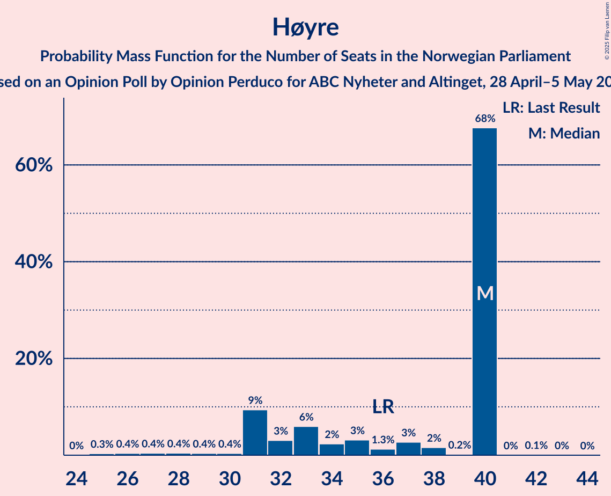

| Number of Seats | Probability | Accumulated | Special Marks |
|:---------------:|:-----------:|:-----------:|:-------------:|
| 24 | 0% | 100% |  |
| 25 | 0.3% | 99.9% |  |
| 26 | 0.4% | 99.6% |  |
| 27 | 0.4% | 99.2% |  |
| 28 | 0.4% | 98.8% |  |
| 29 | 0.4% | 98% |  |
| 30 | 0.4% | 98% |  |
| 31 | 9% | 98% |  |
| 32 | 3% | 88% |  |
| 33 | 6% | 85% |  |
| 34 | 2% | 79% |  |
| 35 | 3% | 77% |  |
| 36 | 1.3% | 74% | Last Result |
| 37 | 3% | 72% |  |
| 38 | 2% | 70% |  |
| 39 | 0.2% | 68% |  |
| 40 | 68% | 68% | Median |
| 41 | 0% | 0.2% |  |
| 42 | 0.1% | 0.2% |  |
| 43 | 0% | 0.1% |  |
| 44 | 0% | 0% |  |

### Sosialistisk Venstreparti

*For a full overview of the results for this party, see the [Sosialistisk Venstreparti](party-sosialistiskvenstreparti.html) page.*

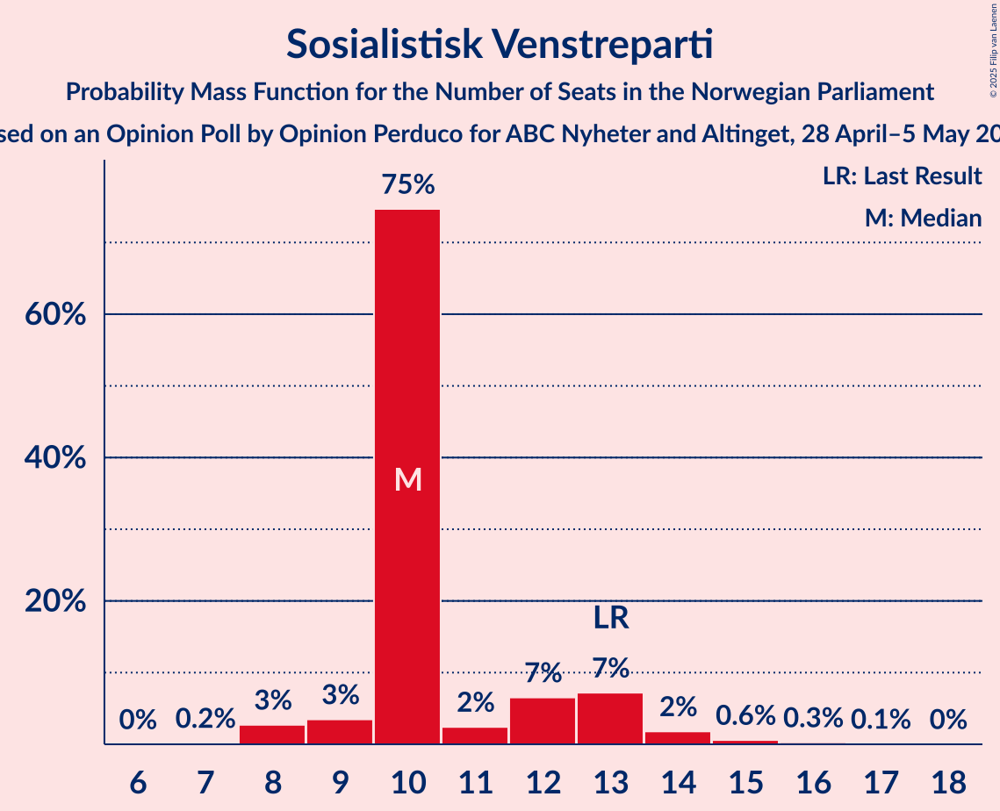

| Number of Seats | Probability | Accumulated | Special Marks |
|:---------------:|:-----------:|:-----------:|:-------------:|
| 7 | 0.2% | 100% |  |
| 8 | 3% | 99.8% |  |
| 9 | 3% | 97% |  |
| 10 | 75% | 94% | Median |
| 11 | 2% | 19% |  |
| 12 | 7% | 16% |  |
| 13 | 7% | 10% | Last Result |
| 14 | 2% | 3% |  |
| 15 | 0.6% | 1.0% |  |
| 16 | 0.3% | 0.4% |  |
| 17 | 0.1% | 0.1% |  |
| 18 | 0% | 0% |  |

### Senterpartiet

*For a full overview of the results for this party, see the [Senterpartiet](party-senterpartiet.html) page.*

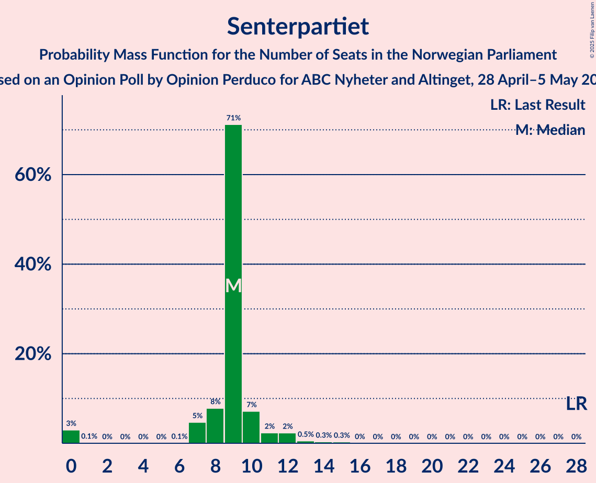

| Number of Seats | Probability | Accumulated | Special Marks |
|:---------------:|:-----------:|:-----------:|:-------------:|
| 0 | 3% | 100% |  |
| 1 | 0.1% | 97% |  |
| 2 | 0% | 97% |  |
| 3 | 0% | 97% |  |
| 4 | 0% | 97% |  |
| 5 | 0% | 97% |  |
| 6 | 0.1% | 97% |  |
| 7 | 5% | 97% |  |
| 8 | 8% | 92% |  |
| 9 | 71% | 84% | Median |
| 10 | 7% | 13% |  |
| 11 | 2% | 6% |  |
| 12 | 2% | 4% |  |
| 13 | 0.5% | 1.2% |  |
| 14 | 0.3% | 0.7% |  |
| 15 | 0.3% | 0.4% |  |
| 16 | 0% | 0% |  |
| 17 | 0% | 0% |  |
| 18 | 0% | 0% |  |
| 19 | 0% | 0% |  |
| 20 | 0% | 0% |  |
| 21 | 0% | 0% |  |
| 22 | 0% | 0% |  |
| 23 | 0% | 0% |  |
| 24 | 0% | 0% |  |
| 25 | 0% | 0% |  |
| 26 | 0% | 0% |  |
| 27 | 0% | 0% |  |
| 28 | 0% | 0% | Last Result |

### Rødt

*For a full overview of the results for this party, see the [Rødt](party-rødt.html) page.*

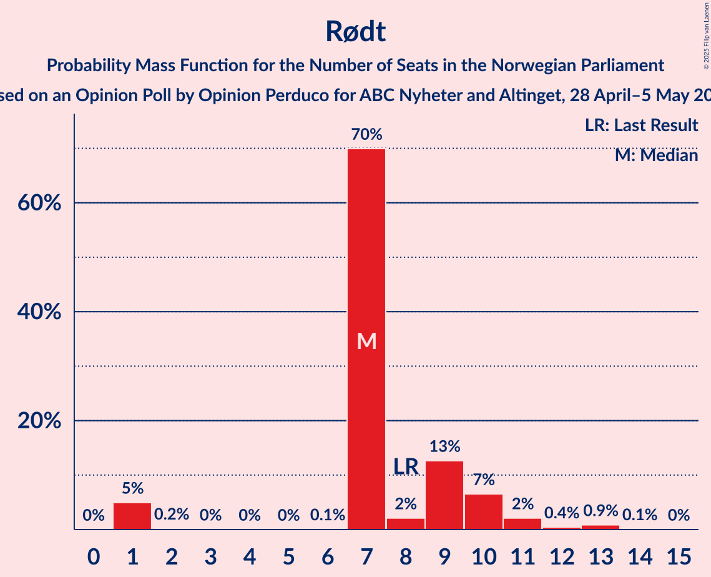

| Number of Seats | Probability | Accumulated | Special Marks |
|:---------------:|:-----------:|:-----------:|:-------------:|
| 1 | 5% | 100% |  |
| 2 | 0.2% | 95% |  |
| 3 | 0% | 95% |  |
| 4 | 0% | 95% |  |
| 5 | 0% | 95% |  |
| 6 | 0.1% | 95% |  |
| 7 | 70% | 95% | Median |
| 8 | 2% | 25% | Last Result |
| 9 | 13% | 23% |  |
| 10 | 7% | 10% |  |
| 11 | 2% | 3% |  |
| 12 | 0.4% | 1.4% |  |
| 13 | 0.9% | 1.0% |  |
| 14 | 0.1% | 0.1% |  |
| 15 | 0% | 0% |  |

### Venstre

*For a full overview of the results for this party, see the [Venstre](party-venstre.html) page.*

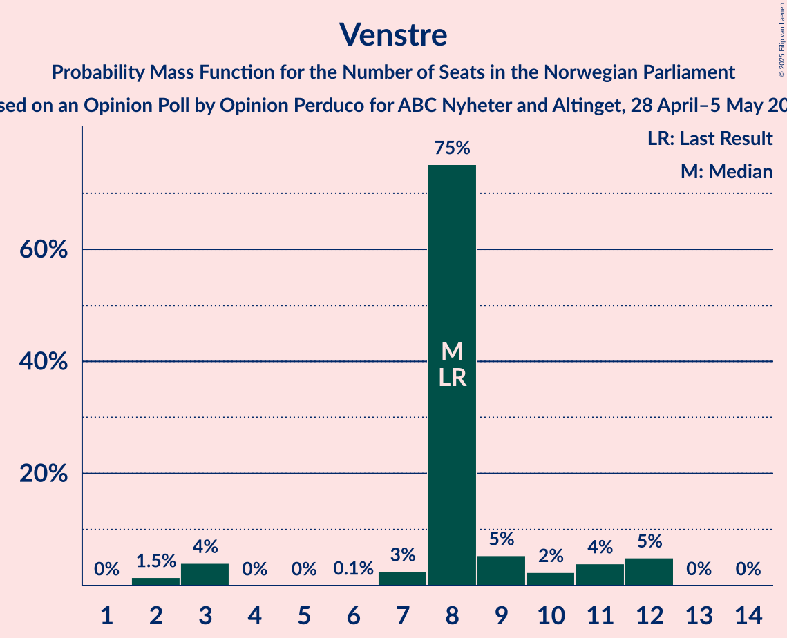

| Number of Seats | Probability | Accumulated | Special Marks |
|:---------------:|:-----------:|:-----------:|:-------------:|
| 2 | 1.5% | 100% |  |
| 3 | 4% | 98.5% |  |
| 4 | 0% | 95% |  |
| 5 | 0% | 95% |  |
| 6 | 0.1% | 95% |  |
| 7 | 3% | 94% |  |
| 8 | 75% | 92% | Last Result, Median |
| 9 | 5% | 17% |  |
| 10 | 2% | 11% |  |
| 11 | 4% | 9% |  |
| 12 | 5% | 5% |  |
| 13 | 0% | 0.1% |  |
| 14 | 0% | 0% |  |

### Kristelig Folkeparti

*For a full overview of the results for this party, see the [Kristelig Folkeparti](party-kristeligfolkeparti.html) page.*

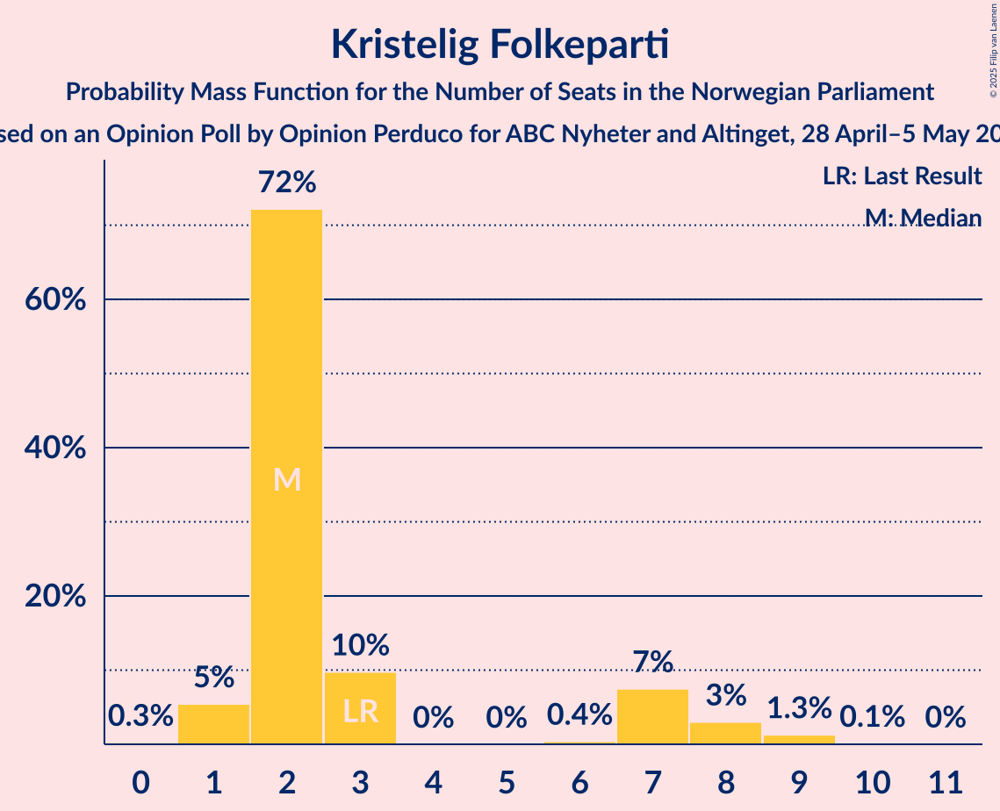

| Number of Seats | Probability | Accumulated | Special Marks |
|:---------------:|:-----------:|:-----------:|:-------------:|
| 0 | 0.3% | 100% |  |
| 1 | 5% | 99.7% |  |
| 2 | 72% | 94% | Median |
| 3 | 10% | 22% | Last Result |
| 4 | 0% | 12% |  |
| 5 | 0% | 12% |  |
| 6 | 0.4% | 12% |  |
| 7 | 7% | 12% |  |
| 8 | 3% | 4% |  |
| 9 | 1.3% | 1.4% |  |
| 10 | 0.1% | 0.2% |  |
| 11 | 0% | 0% |  |

### Miljøpartiet De Grønne

*For a full overview of the results for this party, see the [Miljøpartiet De Grønne](party-miljøpartietdegrønne.html) page.*

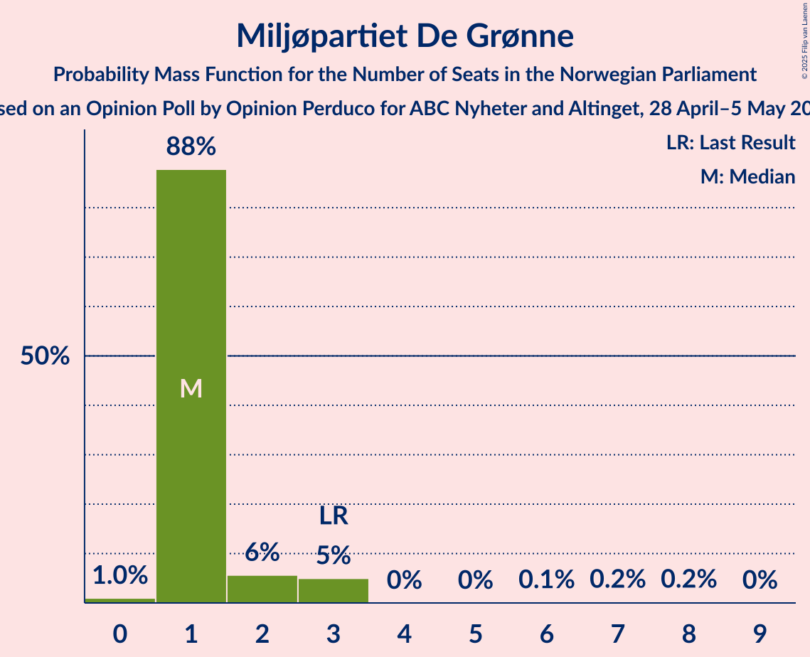

| Number of Seats | Probability | Accumulated | Special Marks |
|:---------------:|:-----------:|:-----------:|:-------------:|
| 0 | 1.0% | 100% |  |
| 1 | 88% | 99.0% | Median |
| 2 | 6% | 11% |  |
| 3 | 5% | 6% | Last Result |
| 4 | 0% | 0.6% |  |
| 5 | 0% | 0.6% |  |
| 6 | 0.1% | 0.6% |  |
| 7 | 0.2% | 0.5% |  |
| 8 | 0.2% | 0.2% |  |
| 9 | 0% | 0% |  |

### Konservativt

*For a full overview of the results for this party, see the [Konservativt](party-konservativt.html) page.*

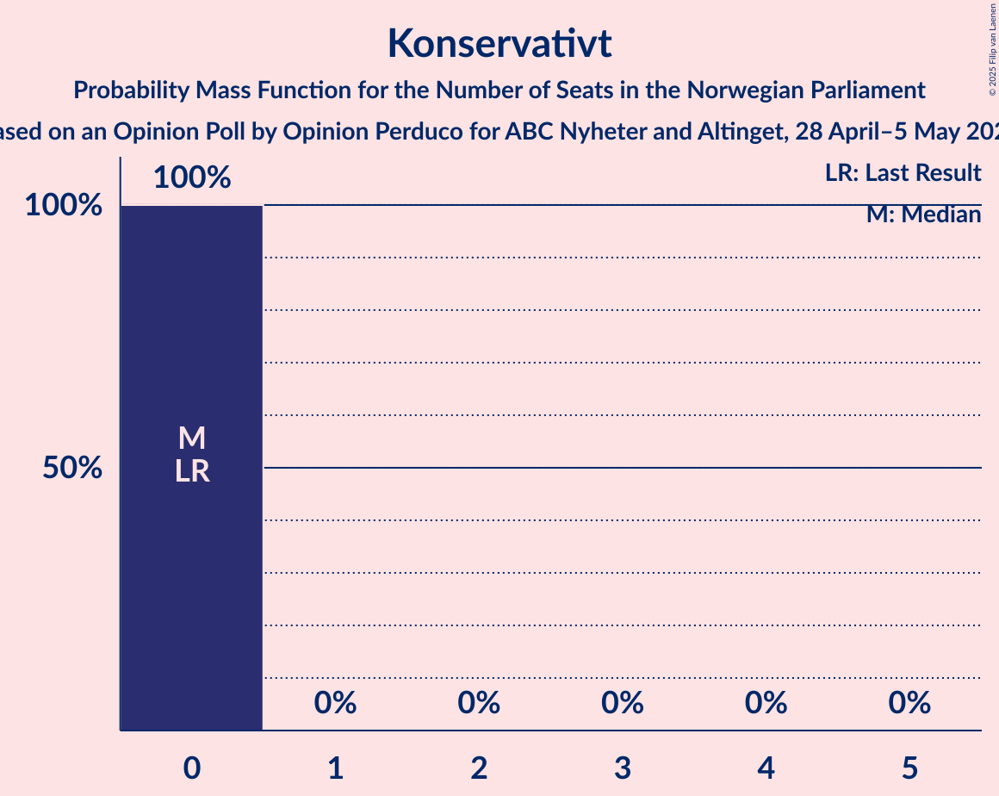

| Number of Seats | Probability | Accumulated | Special Marks |
|:---------------:|:-----------:|:-----------:|:-------------:|
| 0 | 100% | 100% | Last Result, Median |

### Industri- og Næringspartiet

*For a full overview of the results for this party, see the [Industri- og Næringspartiet](party-industri-ognæringspartiet.html) page.*

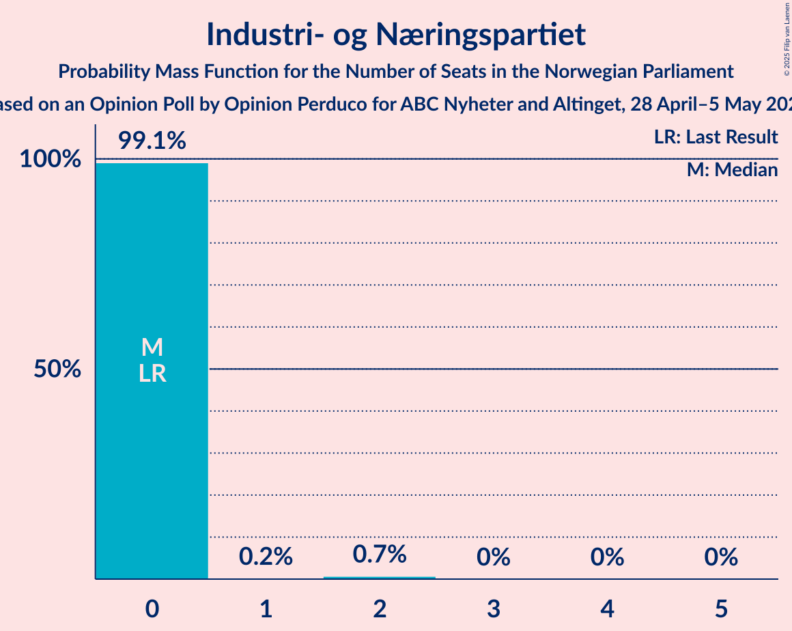

| Number of Seats | Probability | Accumulated | Special Marks |
|:---------------:|:-----------:|:-----------:|:-------------:|
| 0 | 99.1% | 100% | Last Result, Median |
| 1 | 0.2% | 0.9% |  |
| 2 | 0.7% | 0.7% |  |
| 3 | 0% | 0% |  |

### Norgesdemokratene

*For a full overview of the results for this party, see the [Norgesdemokratene](party-norgesdemokratene.html) page.*

| Number of Seats | Probability | Accumulated | Special Marks |
|:---------------:|:-----------:|:-----------:|:-------------:|
| 0 | 100% | 100% | Last Result, Median |

### Pensjonistpartiet

*For a full overview of the results for this party, see the [Pensjonistpartiet](party-pensjonistpartiet.html) page.*

| Number of Seats | Probability | Accumulated | Special Marks |
|:---------------:|:-----------:|:-----------:|:-------------:|
| 0 | 100% | 100% | Last Result, Median |

### Liberalistene

*For a full overview of the results for this party, see the [Liberalistene](party-liberalistene.html) page.*

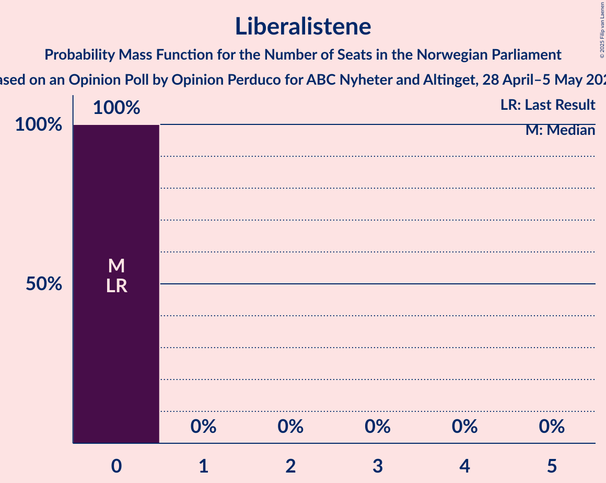

| Number of Seats | Probability | Accumulated | Special Marks |
|:---------------:|:-----------:|:-----------:|:-------------:|
| 0 | 100% | 100% | Last Result, Median |

## Coalitions

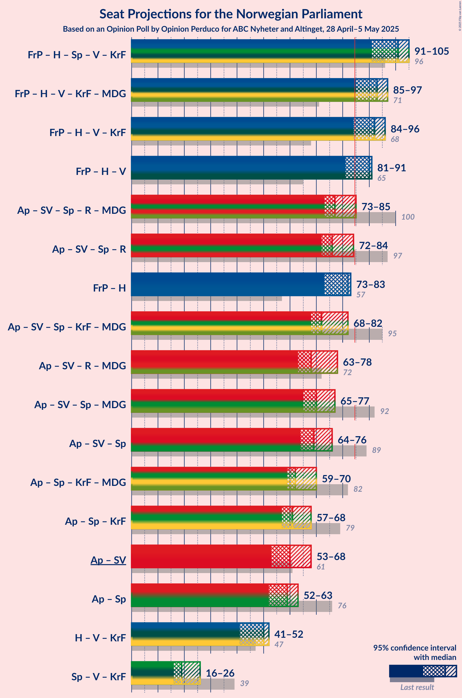

### Confidence Intervals

| Coalition | Last Result | Median | Majority? | 80% Confidence Interval | 90% Confidence Interval | 95% Confidence Interval | 99% Confidence Interval |
|:---------:|:-----------:|:------:|:---------:|:-----------------------:|:-----------------------:|:-----------------------:|:-----------------------:|
| Fremskrittspartiet – Høyre – Senterpartiet – Venstre – Kristelig Folkeparti | 96 | 101 | 100% | 96–101 | 93–104 | 91–105 | 90–109 |
| Fremskrittspartiet – Høyre – Venstre – Kristelig Folkeparti – Miljøpartiet De Grønne | 71 | 93 | 99.3% | 90–94 | 87–95 | 85–97 | 84–102 |
| Fremskrittspartiet – Høyre – Venstre – Kristelig Folkeparti | 68 | 92 | 97% | 88–92 | 86–94 | 84–96 | 81–101 |
| Fremskrittspartiet – Høyre – Venstre | 65 | 90 | 85% | 83–90 | 82–90 | 81–91 | 77–94 |
| Arbeiderpartiet – Sosialistisk Venstreparti – Senterpartiet – Rødt – Miljøpartiet De Grønne | 100 | 77 | 3% | 77–81 | 74–83 | 73–85 | 67–88 |
| Arbeiderpartiet – Sosialistisk Venstreparti – Senterpartiet – Rødt | 97 | 76 | 0.7% | 75–79 | 73–82 | 72–84 | 66–85 |
| Fremskrittspartiet – Høyre | 57 | 82 | 2% | 75–82 | 75–82 | 73–83 | 69–87 |
| Arbeiderpartiet – Sosialistisk Venstreparti – Senterpartiet – Kristelig Folkeparti – Miljøpartiet De Grønne | 95 | 72 | 0.2% | 72–77 | 71–80 | 68–82 | 67–84 |
| Arbeiderpartiet – Sosialistisk Venstreparti – Rødt – Miljøpartiet De Grønne | 72 | 68 | 0% | 68–73 | 65–76 | 63–78 | 59–79 |
| Arbeiderpartiet – Sosialistisk Venstreparti – Senterpartiet – Miljøpartiet De Grønne | 92 | 70 | 0% | 68–74 | 67–77 | 65–77 | 60–79 |
| Arbeiderpartiet – Sosialistisk Venstreparti – Senterpartiet | 89 | 69 | 0% | 67–72 | 65–75 | 64–76 | 59–77 |
| Arbeiderpartiet – Senterpartiet – Kristelig Folkeparti – Miljøpartiet De Grønne | 82 | 62 | 0% | 62–66 | 61–67 | 59–70 | 56–73 |
| Arbeiderpartiet – Senterpartiet – Kristelig Folkeparti | 79 | 61 | 0% | 60–64 | 60–66 | 57–68 | 55–71 |
| Arbeiderpartiet – Sosialistisk Venstreparti | 61 | 60 | 0% | 59–65 | 56–66 | 53–68 | 51–68 |
| Arbeiderpartiet – Senterpartiet | 76 | 59 | 0% | 57–60 | 53–63 | 52–63 | 51–66 |
| Høyre – Venstre – Kristelig Folkeparti | 47 | 50 | 0% | 44–50 | 42–50 | 41–52 | 37–54 |
| Senterpartiet – Venstre – Kristelig Folkeparti | 39 | 19 | 0% | 18–23 | 17–24 | 16–26 | 12–30 |

### Fremskrittspartiet – Høyre – Senterpartiet – Venstre – Kristelig Folkeparti

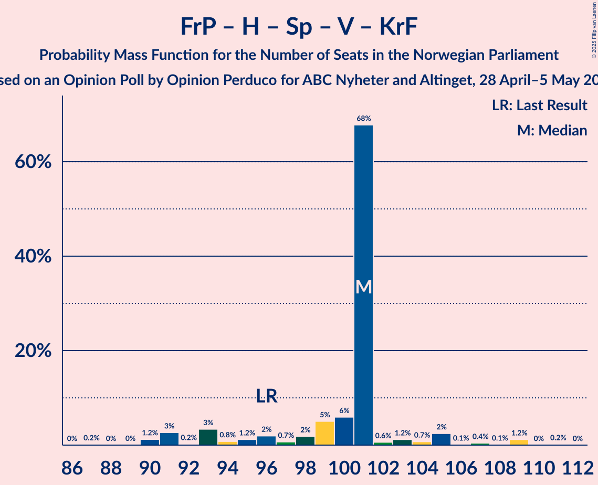

| Number of Seats | Probability | Accumulated | Special Marks |
|:---------------:|:-----------:|:-----------:|:-------------:|
| 87 | 0.2% | 100% |  |
| 88 | 0% | 99.8% |  |
| 89 | 0% | 99.8% |  |
| 90 | 1.2% | 99.8% |  |
| 91 | 3% | 98.6% |  |
| 92 | 0.2% | 96% |  |
| 93 | 3% | 96% |  |
| 94 | 0.8% | 92% |  |
| 95 | 1.2% | 92% |  |
| 96 | 2% | 90% | Last Result |
| 97 | 0.7% | 88% |  |
| 98 | 2% | 88% |  |
| 99 | 5% | 86% |  |
| 100 | 6% | 81% |  |
| 101 | 68% | 75% | Median |
| 102 | 0.6% | 7% |  |
| 103 | 1.2% | 6% |  |
| 104 | 0.7% | 5% |  |
| 105 | 2% | 4% |  |
| 106 | 0.1% | 2% |  |
| 107 | 0.4% | 2% |  |
| 108 | 0.1% | 2% |  |
| 109 | 1.2% | 1.4% |  |
| 110 | 0% | 0.2% |  |
| 111 | 0.2% | 0.2% |  |
| 112 | 0% | 0% |  |

### Fremskrittspartiet – Høyre – Venstre – Kristelig Folkeparti – Miljøpartiet De Grønne

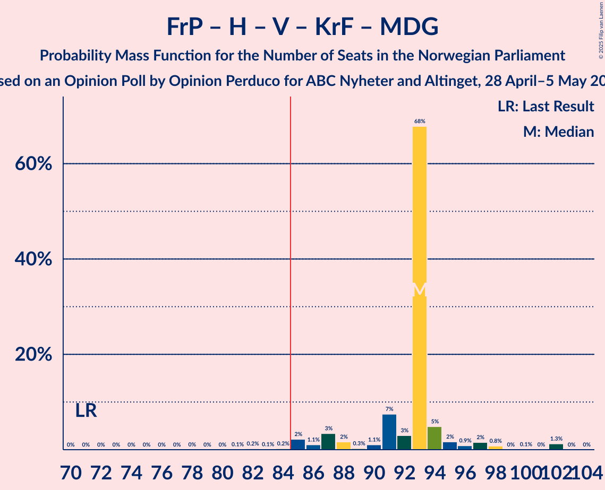

| Number of Seats | Probability | Accumulated | Special Marks |
|:---------------:|:-----------:|:-----------:|:-------------:|
| 71 | 0% | 100% | Last Result |
| 72 | 0% | 100% |  |
| 73 | 0% | 100% |  |
| 74 | 0% | 100% |  |
| 75 | 0% | 100% |  |
| 76 | 0% | 100% |  |
| 77 | 0% | 100% |  |
| 78 | 0% | 100% |  |
| 79 | 0% | 99.9% |  |
| 80 | 0% | 99.9% |  |
| 81 | 0.1% | 99.9% |  |
| 82 | 0.2% | 99.9% |  |
| 83 | 0.1% | 99.6% |  |
| 84 | 0.2% | 99.5% |  |
| 85 | 2% | 99.3% | Majority |
| 86 | 1.1% | 97% |  |
| 87 | 3% | 96% |  |
| 88 | 2% | 93% |  |
| 89 | 0.3% | 91% |  |
| 90 | 1.1% | 91% |  |
| 91 | 7% | 90% |  |
| 92 | 3% | 82% |  |
| 93 | 68% | 79% | Median |
| 94 | 5% | 11% |  |
| 95 | 2% | 6% |  |
| 96 | 0.9% | 5% |  |
| 97 | 2% | 4% |  |
| 98 | 0.8% | 2% |  |
| 99 | 0% | 1.5% |  |
| 100 | 0.1% | 1.4% |  |
| 101 | 0% | 1.4% |  |
| 102 | 1.3% | 1.3% |  |
| 103 | 0% | 0.1% |  |
| 104 | 0% | 0% |  |

### Fremskrittspartiet – Høyre – Venstre – Kristelig Folkeparti

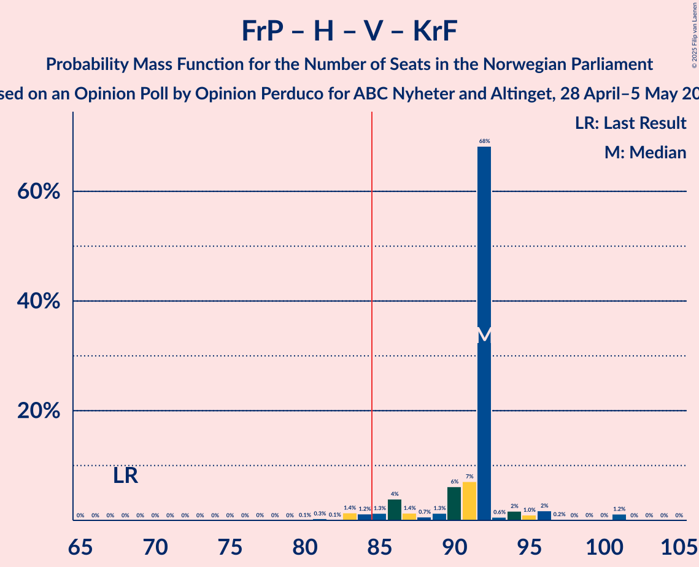

| Number of Seats | Probability | Accumulated | Special Marks |
|:---------------:|:-----------:|:-----------:|:-------------:|
| 68 | 0% | 100% | Last Result |
| 69 | 0% | 100% |  |
| 70 | 0% | 100% |  |
| 71 | 0% | 100% |  |
| 72 | 0% | 100% |  |
| 73 | 0% | 100% |  |
| 74 | 0% | 100% |  |
| 75 | 0% | 100% |  |
| 76 | 0% | 100% |  |
| 77 | 0% | 100% |  |
| 78 | 0% | 99.9% |  |
| 79 | 0% | 99.9% |  |
| 80 | 0.1% | 99.9% |  |
| 81 | 0.3% | 99.8% |  |
| 82 | 0.1% | 99.5% |  |
| 83 | 1.4% | 99.4% |  |
| 84 | 1.2% | 98% |  |
| 85 | 1.3% | 97% | Majority |
| 86 | 4% | 95% |  |
| 87 | 1.4% | 92% |  |
| 88 | 0.7% | 90% |  |
| 89 | 1.3% | 90% |  |
| 90 | 6% | 88% |  |
| 91 | 7% | 82% |  |
| 92 | 68% | 75% | Median |
| 93 | 0.6% | 7% |  |
| 94 | 2% | 6% |  |
| 95 | 1.0% | 4% |  |
| 96 | 2% | 3% |  |
| 97 | 0.2% | 2% |  |
| 98 | 0% | 1.3% |  |
| 99 | 0% | 1.3% |  |
| 100 | 0% | 1.3% |  |
| 101 | 1.2% | 1.2% |  |
| 102 | 0% | 0% |  |

### Fremskrittspartiet – Høyre – Venstre

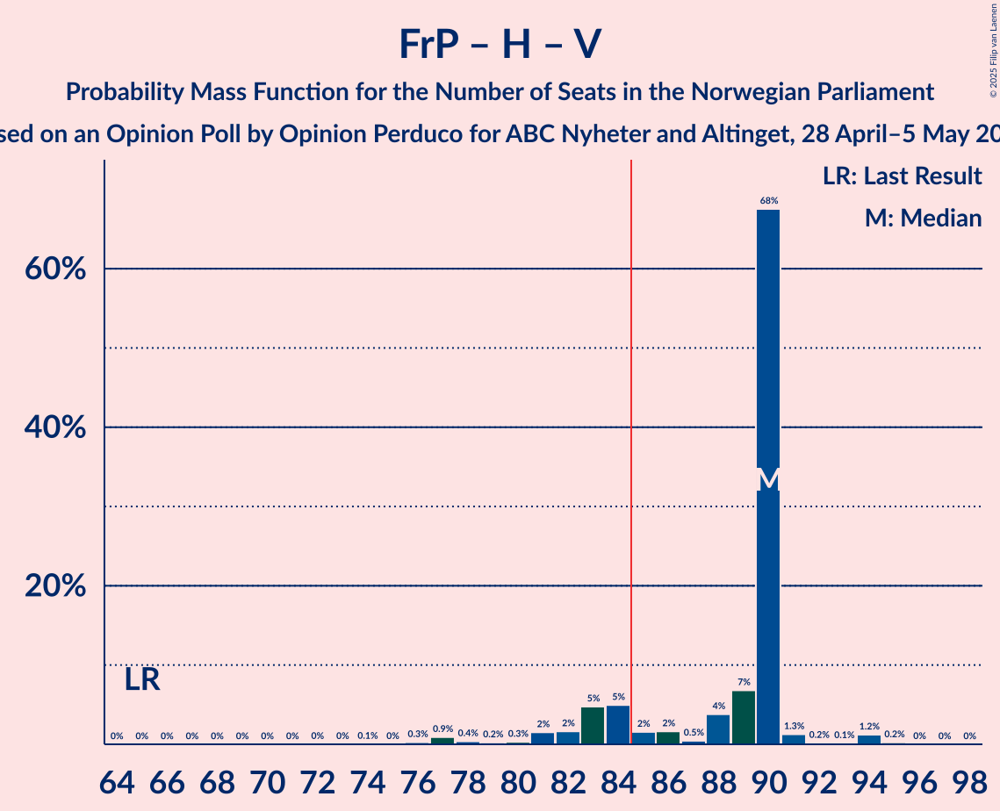

| Number of Seats | Probability | Accumulated | Special Marks |
|:---------------:|:-----------:|:-----------:|:-------------:|
| 65 | 0% | 100% | Last Result |
| 66 | 0% | 100% |  |
| 67 | 0% | 100% |  |
| 68 | 0% | 100% |  |
| 69 | 0% | 100% |  |
| 70 | 0% | 100% |  |
| 71 | 0% | 100% |  |
| 72 | 0% | 100% |  |
| 73 | 0% | 100% |  |
| 74 | 0.1% | 99.9% |  |
| 75 | 0% | 99.9% |  |
| 76 | 0.3% | 99.9% |  |
| 77 | 0.9% | 99.6% |  |
| 78 | 0.4% | 98.7% |  |
| 79 | 0.2% | 98% |  |
| 80 | 0.3% | 98% |  |
| 81 | 2% | 98% |  |
| 82 | 2% | 96% |  |
| 83 | 5% | 95% |  |
| 84 | 5% | 90% |  |
| 85 | 2% | 85% | Majority |
| 86 | 2% | 83% |  |
| 87 | 0.5% | 82% |  |
| 88 | 4% | 81% |  |
| 89 | 7% | 77% |  |
| 90 | 68% | 71% | Median |
| 91 | 1.3% | 3% |  |
| 92 | 0.2% | 2% |  |
| 93 | 0.1% | 2% |  |
| 94 | 1.2% | 2% |  |
| 95 | 0.2% | 0.3% |  |
| 96 | 0% | 0.1% |  |
| 97 | 0% | 0% |  |

### Arbeiderpartiet – Sosialistisk Venstreparti – Senterpartiet – Rødt – Miljøpartiet De Grønne

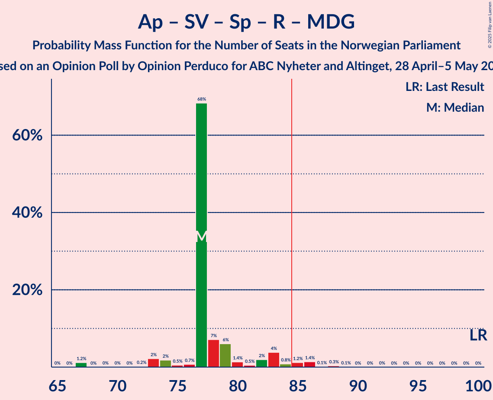

| Number of Seats | Probability | Accumulated | Special Marks |
|:---------------:|:-----------:|:-----------:|:-------------:|
| 67 | 1.2% | 100% |  |
| 68 | 0% | 98.8% |  |
| 69 | 0% | 98.8% |  |
| 70 | 0% | 98.7% |  |
| 71 | 0% | 98.7% |  |
| 72 | 0.2% | 98.7% |  |
| 73 | 2% | 98% |  |
| 74 | 2% | 96% |  |
| 75 | 0.5% | 94% |  |
| 76 | 0.7% | 94% |  |
| 77 | 68% | 93% | Median |
| 78 | 7% | 25% |  |
| 79 | 6% | 18% |  |
| 80 | 1.4% | 12% |  |
| 81 | 0.5% | 10% |  |
| 82 | 2% | 10% |  |
| 83 | 4% | 8% |  |
| 84 | 0.8% | 4% |  |
| 85 | 1.2% | 3% | Majority |
| 86 | 1.4% | 2% |  |
| 87 | 0.1% | 0.6% |  |
| 88 | 0.3% | 0.5% |  |
| 89 | 0.1% | 0.2% |  |
| 90 | 0% | 0.1% |  |
| 91 | 0% | 0.1% |  |
| 92 | 0% | 0.1% |  |
| 93 | 0% | 0% |  |
| 94 | 0% | 0% |  |
| 95 | 0% | 0% |  |
| 96 | 0% | 0% |  |
| 97 | 0% | 0% |  |
| 98 | 0% | 0% |  |
| 99 | 0% | 0% |  |
| 100 | 0% | 0% | Last Result |

### Arbeiderpartiet – Sosialistisk Venstreparti – Senterpartiet – Rødt

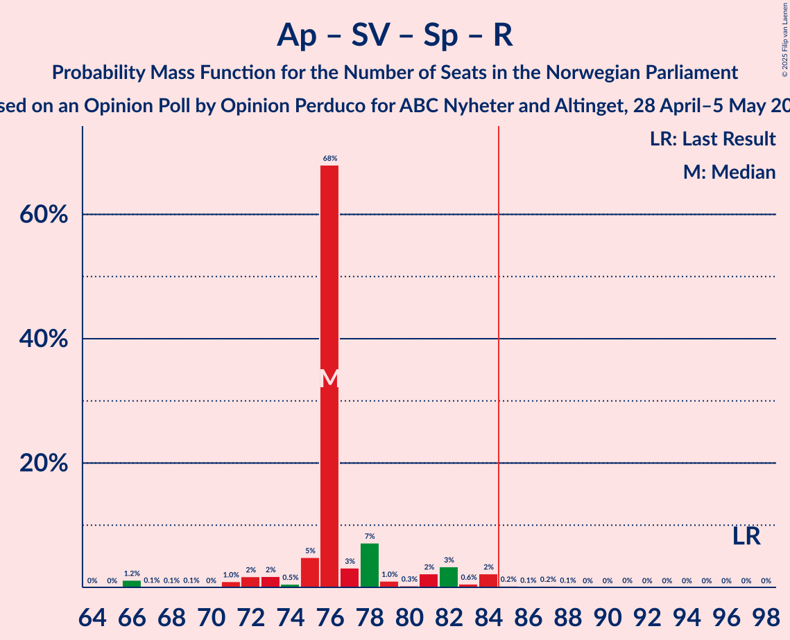

| Number of Seats | Probability | Accumulated | Special Marks |
|:---------------:|:-----------:|:-----------:|:-------------:|
| 65 | 0% | 100% |  |
| 66 | 1.2% | 99.9% |  |
| 67 | 0.1% | 98.8% |  |
| 68 | 0.1% | 98.7% |  |
| 69 | 0.1% | 98.6% |  |
| 70 | 0% | 98.6% |  |
| 71 | 1.0% | 98.5% |  |
| 72 | 2% | 98% |  |
| 73 | 2% | 96% |  |
| 74 | 0.5% | 94% |  |
| 75 | 5% | 93% |  |
| 76 | 68% | 89% | Median |
| 77 | 3% | 21% |  |
| 78 | 7% | 18% |  |
| 79 | 1.0% | 10% |  |
| 80 | 0.3% | 9% |  |
| 81 | 2% | 9% |  |
| 82 | 3% | 7% |  |
| 83 | 0.6% | 3% |  |
| 84 | 2% | 3% |  |
| 85 | 0.2% | 0.7% | Majority |
| 86 | 0.1% | 0.5% |  |
| 87 | 0.2% | 0.4% |  |
| 88 | 0.1% | 0.1% |  |
| 89 | 0% | 0.1% |  |
| 90 | 0% | 0.1% |  |
| 91 | 0% | 0.1% |  |
| 92 | 0% | 0% |  |
| 93 | 0% | 0% |  |
| 94 | 0% | 0% |  |
| 95 | 0% | 0% |  |
| 96 | 0% | 0% |  |
| 97 | 0% | 0% | Last Result |

### Fremskrittspartiet – Høyre

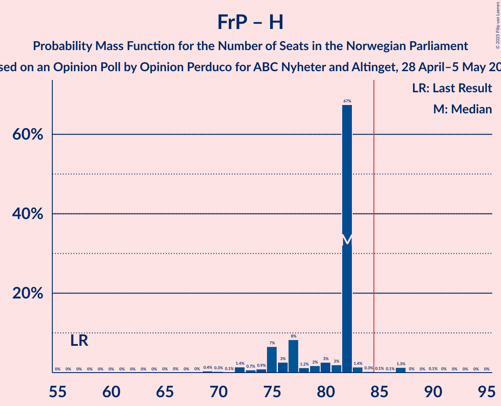

| Number of Seats | Probability | Accumulated | Special Marks |
|:---------------:|:-----------:|:-----------:|:-------------:|
| 57 | 0% | 100% | Last Result |
| 58 | 0% | 100% |  |
| 59 | 0% | 100% |  |
| 60 | 0% | 100% |  |
| 61 | 0% | 100% |  |
| 62 | 0% | 100% |  |
| 63 | 0% | 100% |  |
| 64 | 0% | 100% |  |
| 65 | 0% | 100% |  |
| 66 | 0% | 100% |  |
| 67 | 0% | 99.9% |  |
| 68 | 0% | 99.9% |  |
| 69 | 0.4% | 99.9% |  |
| 70 | 0.3% | 99.5% |  |
| 71 | 0.1% | 99.2% |  |
| 72 | 1.4% | 99.1% |  |
| 73 | 0.7% | 98% |  |
| 74 | 0.9% | 97% |  |
| 75 | 7% | 96% |  |
| 76 | 3% | 89% |  |
| 77 | 8% | 87% |  |
| 78 | 1.2% | 79% |  |
| 79 | 2% | 77% |  |
| 80 | 3% | 76% |  |
| 81 | 2% | 73% |  |
| 82 | 67% | 71% | Median |
| 83 | 1.4% | 3% |  |
| 84 | 0.3% | 2% |  |
| 85 | 0.1% | 2% | Majority |
| 86 | 0.1% | 2% |  |
| 87 | 1.3% | 2% |  |
| 88 | 0% | 0.2% |  |
| 89 | 0% | 0.2% |  |
| 90 | 0.1% | 0.2% |  |
| 91 | 0% | 0.1% |  |
| 92 | 0% | 0% |  |

### Arbeiderpartiet – Sosialistisk Venstreparti – Senterpartiet – Kristelig Folkeparti – Miljøpartiet De Grønne

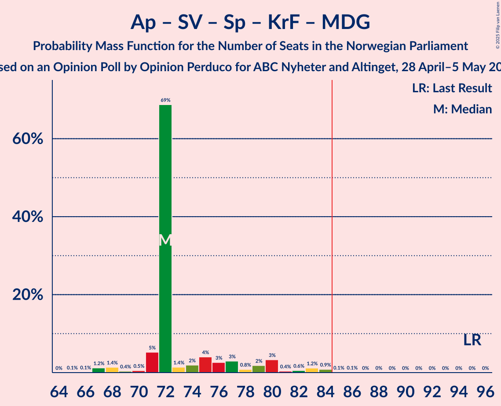

| Number of Seats | Probability | Accumulated | Special Marks |
|:---------------:|:-----------:|:-----------:|:-------------:|
| 65 | 0.1% | 100% |  |
| 66 | 0.1% | 99.8% |  |
| 67 | 1.2% | 99.7% |  |
| 68 | 1.4% | 98.5% |  |
| 69 | 0.4% | 97% |  |
| 70 | 0.5% | 97% |  |
| 71 | 5% | 96% |  |
| 72 | 69% | 91% | Median |
| 73 | 1.4% | 22% |  |
| 74 | 2% | 21% |  |
| 75 | 4% | 19% |  |
| 76 | 3% | 15% |  |
| 77 | 3% | 12% |  |
| 78 | 0.8% | 9% |  |
| 79 | 2% | 8% |  |
| 80 | 3% | 7% |  |
| 81 | 0.4% | 3% |  |
| 82 | 0.6% | 3% |  |
| 83 | 1.2% | 2% |  |
| 84 | 0.9% | 1.1% |  |
| 85 | 0.1% | 0.2% | Majority |
| 86 | 0.1% | 0.2% |  |
| 87 | 0% | 0.1% |  |
| 88 | 0% | 0% |  |
| 89 | 0% | 0% |  |
| 90 | 0% | 0% |  |
| 91 | 0% | 0% |  |
| 92 | 0% | 0% |  |
| 93 | 0% | 0% |  |
| 94 | 0% | 0% |  |
| 95 | 0% | 0% | Last Result |

### Arbeiderpartiet – Sosialistisk Venstreparti – Rødt – Miljøpartiet De Grønne

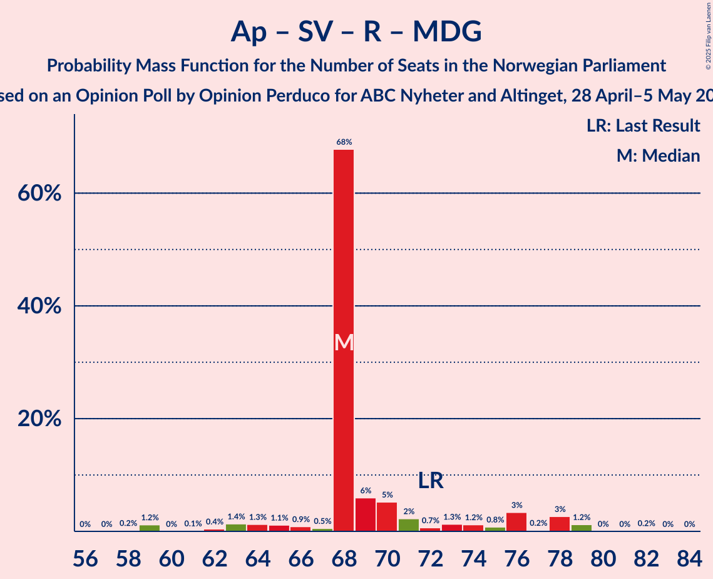

| Number of Seats | Probability | Accumulated | Special Marks |
|:---------------:|:-----------:|:-----------:|:-------------:|
| 58 | 0.2% | 100% |  |
| 59 | 1.2% | 99.8% |  |
| 60 | 0% | 98.6% |  |
| 61 | 0.1% | 98.6% |  |
| 62 | 0.4% | 98% |  |
| 63 | 1.4% | 98% |  |
| 64 | 1.3% | 97% |  |
| 65 | 1.1% | 95% |  |
| 66 | 0.9% | 94% |  |
| 67 | 0.5% | 93% |  |
| 68 | 68% | 93% | Median |
| 69 | 6% | 25% |  |
| 70 | 5% | 19% |  |
| 71 | 2% | 14% |  |
| 72 | 0.7% | 12% | Last Result |
| 73 | 1.3% | 11% |  |
| 74 | 1.2% | 10% |  |
| 75 | 0.8% | 8% |  |
| 76 | 3% | 8% |  |
| 77 | 0.2% | 4% |  |
| 78 | 3% | 4% |  |
| 79 | 1.2% | 1.4% |  |
| 80 | 0% | 0.2% |  |
| 81 | 0% | 0.2% |  |
| 82 | 0.2% | 0.2% |  |
| 83 | 0% | 0% |  |

### Arbeiderpartiet – Sosialistisk Venstreparti – Senterpartiet – Miljøpartiet De Grønne

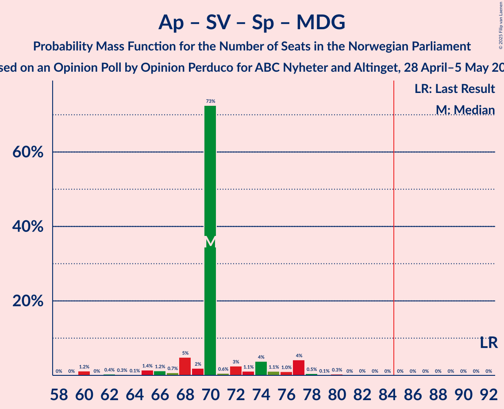

| Number of Seats | Probability | Accumulated | Special Marks |
|:---------------:|:-----------:|:-----------:|:-------------:|
| 60 | 1.2% | 100% |  |
| 61 | 0% | 98.8% |  |
| 62 | 0.4% | 98.8% |  |
| 63 | 0.3% | 98% |  |
| 64 | 0.1% | 98% |  |
| 65 | 1.4% | 98% |  |
| 66 | 1.2% | 97% |  |
| 67 | 0.7% | 95% |  |
| 68 | 5% | 95% |  |
| 69 | 2% | 90% |  |
| 70 | 73% | 88% | Median |
| 71 | 0.6% | 15% |  |
| 72 | 3% | 15% |  |
| 73 | 1.1% | 12% |  |
| 74 | 4% | 11% |  |
| 75 | 1.1% | 7% |  |
| 76 | 1.0% | 6% |  |
| 77 | 4% | 5% |  |
| 78 | 0.5% | 1.0% |  |
| 79 | 0.1% | 0.5% |  |
| 80 | 0.3% | 0.5% |  |
| 81 | 0% | 0.1% |  |
| 82 | 0% | 0.1% |  |
| 83 | 0% | 0% |  |
| 84 | 0% | 0% |  |
| 85 | 0% | 0% | Majority |
| 86 | 0% | 0% |  |
| 87 | 0% | 0% |  |
| 88 | 0% | 0% |  |
| 89 | 0% | 0% |  |
| 90 | 0% | 0% |  |
| 91 | 0% | 0% |  |
| 92 | 0% | 0% | Last Result |

### Arbeiderpartiet – Sosialistisk Venstreparti – Senterpartiet

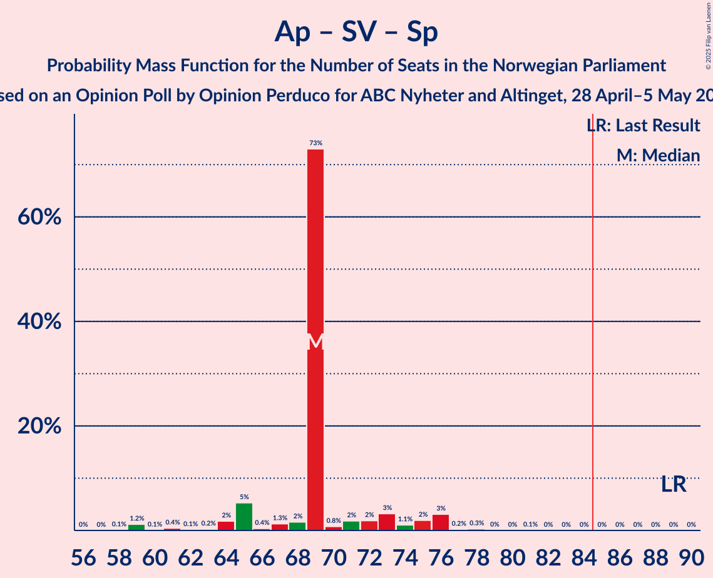

| Number of Seats | Probability | Accumulated | Special Marks |
|:---------------:|:-----------:|:-----------:|:-------------:|
| 58 | 0.1% | 100% |  |
| 59 | 1.2% | 99.9% |  |
| 60 | 0.1% | 98.7% |  |
| 61 | 0.4% | 98.6% |  |
| 62 | 0.1% | 98% |  |
| 63 | 0.2% | 98% |  |
| 64 | 2% | 98% |  |
| 65 | 5% | 96% |  |
| 66 | 0.4% | 91% |  |
| 67 | 1.3% | 90% |  |
| 68 | 2% | 89% |  |
| 69 | 73% | 87% | Median |
| 70 | 0.8% | 14% |  |
| 71 | 2% | 14% |  |
| 72 | 2% | 12% |  |
| 73 | 3% | 10% |  |
| 74 | 1.1% | 7% |  |
| 75 | 2% | 6% |  |
| 76 | 3% | 4% |  |
| 77 | 0.2% | 0.6% |  |
| 78 | 0.3% | 0.4% |  |
| 79 | 0% | 0.1% |  |
| 80 | 0% | 0.1% |  |
| 81 | 0.1% | 0.1% |  |
| 82 | 0% | 0% |  |
| 83 | 0% | 0% |  |
| 84 | 0% | 0% |  |
| 85 | 0% | 0% | Majority |
| 86 | 0% | 0% |  |
| 87 | 0% | 0% |  |
| 88 | 0% | 0% |  |
| 89 | 0% | 0% | Last Result |

### Arbeiderpartiet – Senterpartiet – Kristelig Folkeparti – Miljøpartiet De Grønne

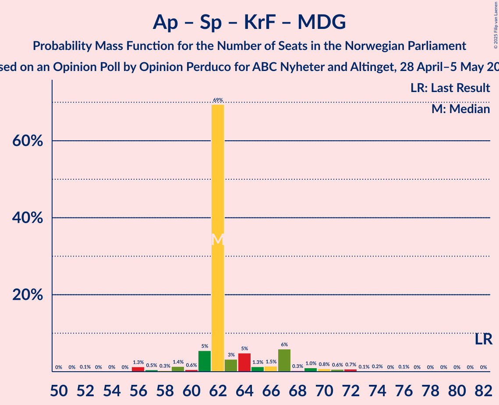

| Number of Seats | Probability | Accumulated | Special Marks |
|:---------------:|:-----------:|:-----------:|:-------------:|
| 52 | 0.1% | 100% |  |
| 53 | 0% | 99.9% |  |
| 54 | 0% | 99.8% |  |
| 55 | 0% | 99.8% |  |
| 56 | 1.3% | 99.8% |  |
| 57 | 0.5% | 98% |  |
| 58 | 0.3% | 98% |  |
| 59 | 1.4% | 98% |  |
| 60 | 0.6% | 96% |  |
| 61 | 5% | 96% |  |
| 62 | 69% | 90% | Median |
| 63 | 3% | 21% |  |
| 64 | 5% | 17% |  |
| 65 | 1.3% | 13% |  |
| 66 | 1.5% | 11% |  |
| 67 | 6% | 10% |  |
| 68 | 0.3% | 4% |  |
| 69 | 1.0% | 4% |  |
| 70 | 0.8% | 3% |  |
| 71 | 0.6% | 2% |  |
| 72 | 0.7% | 1.2% |  |
| 73 | 0.1% | 0.5% |  |
| 74 | 0.2% | 0.4% |  |
| 75 | 0% | 0.2% |  |
| 76 | 0.1% | 0.2% |  |
| 77 | 0% | 0% |  |
| 78 | 0% | 0% |  |
| 79 | 0% | 0% |  |
| 80 | 0% | 0% |  |
| 81 | 0% | 0% |  |
| 82 | 0% | 0% | Last Result |

### Arbeiderpartiet – Senterpartiet – Kristelig Folkeparti

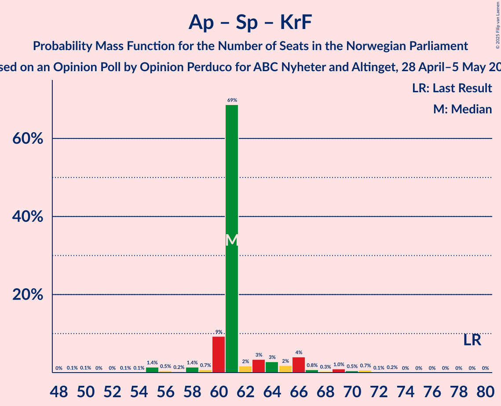

| Number of Seats | Probability | Accumulated | Special Marks |
|:---------------:|:-----------:|:-----------:|:-------------:|
| 49 | 0.1% | 100% |  |
| 50 | 0.1% | 99.9% |  |
| 51 | 0% | 99.8% |  |
| 52 | 0% | 99.8% |  |
| 53 | 0.1% | 99.8% |  |
| 54 | 0.1% | 99.7% |  |
| 55 | 1.4% | 99.6% |  |
| 56 | 0.5% | 98% |  |
| 57 | 0.2% | 98% |  |
| 58 | 1.4% | 97% |  |
| 59 | 0.7% | 96% |  |
| 60 | 9% | 95% |  |
| 61 | 69% | 86% | Median |
| 62 | 2% | 17% |  |
| 63 | 3% | 16% |  |
| 64 | 3% | 12% |  |
| 65 | 2% | 9% |  |
| 66 | 4% | 8% |  |
| 67 | 0.8% | 4% |  |
| 68 | 0.3% | 3% |  |
| 69 | 1.0% | 2% |  |
| 70 | 0.5% | 1.5% |  |
| 71 | 0.7% | 1.0% |  |
| 72 | 0.1% | 0.3% |  |
| 73 | 0.2% | 0.3% |  |
| 74 | 0% | 0% |  |
| 75 | 0% | 0% |  |
| 76 | 0% | 0% |  |
| 77 | 0% | 0% |  |
| 78 | 0% | 0% |  |
| 79 | 0% | 0% | Last Result |

### Arbeiderpartiet – Sosialistisk Venstreparti

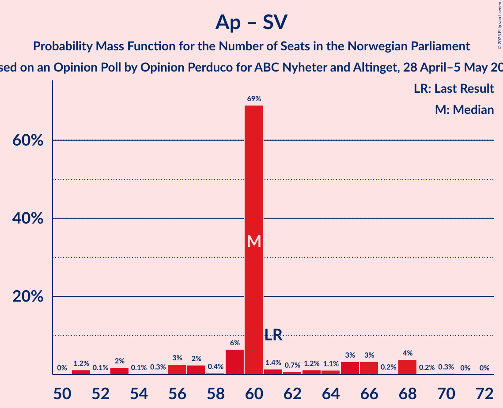

| Number of Seats | Probability | Accumulated | Special Marks |
|:---------------:|:-----------:|:-----------:|:-------------:|
| 50 | 0% | 100% |  |
| 51 | 1.2% | 99.9% |  |
| 52 | 0.1% | 98.7% |  |
| 53 | 2% | 98.6% |  |
| 54 | 0.1% | 97% |  |
| 55 | 0.3% | 97% |  |
| 56 | 3% | 96% |  |
| 57 | 2% | 94% |  |
| 58 | 0.4% | 91% |  |
| 59 | 6% | 91% |  |
| 60 | 69% | 85% | Median |
| 61 | 1.4% | 16% | Last Result |
| 62 | 0.7% | 14% |  |
| 63 | 1.2% | 13% |  |
| 64 | 1.1% | 12% |  |
| 65 | 3% | 11% |  |
| 66 | 3% | 8% |  |
| 67 | 0.2% | 5% |  |
| 68 | 4% | 4% |  |
| 69 | 0.2% | 0.5% |  |
| 70 | 0.3% | 0.3% |  |
| 71 | 0% | 0.1% |  |
| 72 | 0% | 0% |  |

### Arbeiderpartiet – Senterpartiet

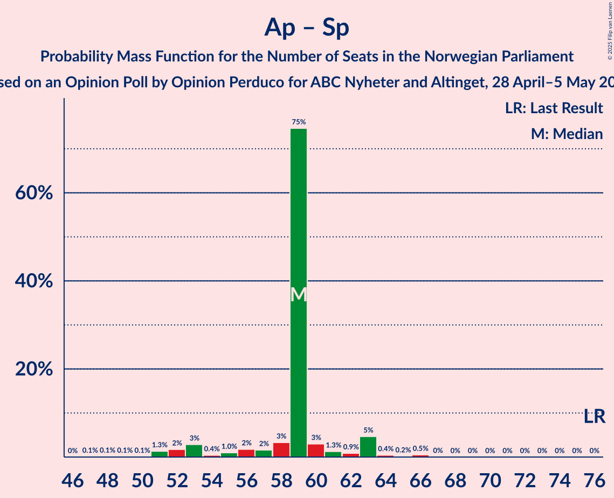

| Number of Seats | Probability | Accumulated | Special Marks |
|:---------------:|:-----------:|:-----------:|:-------------:|
| 47 | 0.1% | 100% |  |
| 48 | 0.1% | 99.9% |  |
| 49 | 0.1% | 99.8% |  |
| 50 | 0.1% | 99.7% |  |
| 51 | 1.3% | 99.6% |  |
| 52 | 2% | 98% |  |
| 53 | 3% | 97% |  |
| 54 | 0.4% | 94% |  |
| 55 | 1.0% | 93% |  |
| 56 | 2% | 92% |  |
| 57 | 2% | 91% |  |
| 58 | 3% | 89% |  |
| 59 | 75% | 86% | Median |
| 60 | 3% | 11% |  |
| 61 | 1.3% | 8% |  |
| 62 | 0.9% | 7% |  |
| 63 | 5% | 6% |  |
| 64 | 0.4% | 1.2% |  |
| 65 | 0.2% | 0.8% |  |
| 66 | 0.5% | 0.6% |  |
| 67 | 0% | 0.1% |  |
| 68 | 0% | 0% |  |
| 69 | 0% | 0% |  |
| 70 | 0% | 0% |  |
| 71 | 0% | 0% |  |
| 72 | 0% | 0% |  |
| 73 | 0% | 0% |  |
| 74 | 0% | 0% |  |
| 75 | 0% | 0% |  |
| 76 | 0% | 0% | Last Result |

### Høyre – Venstre – Kristelig Folkeparti

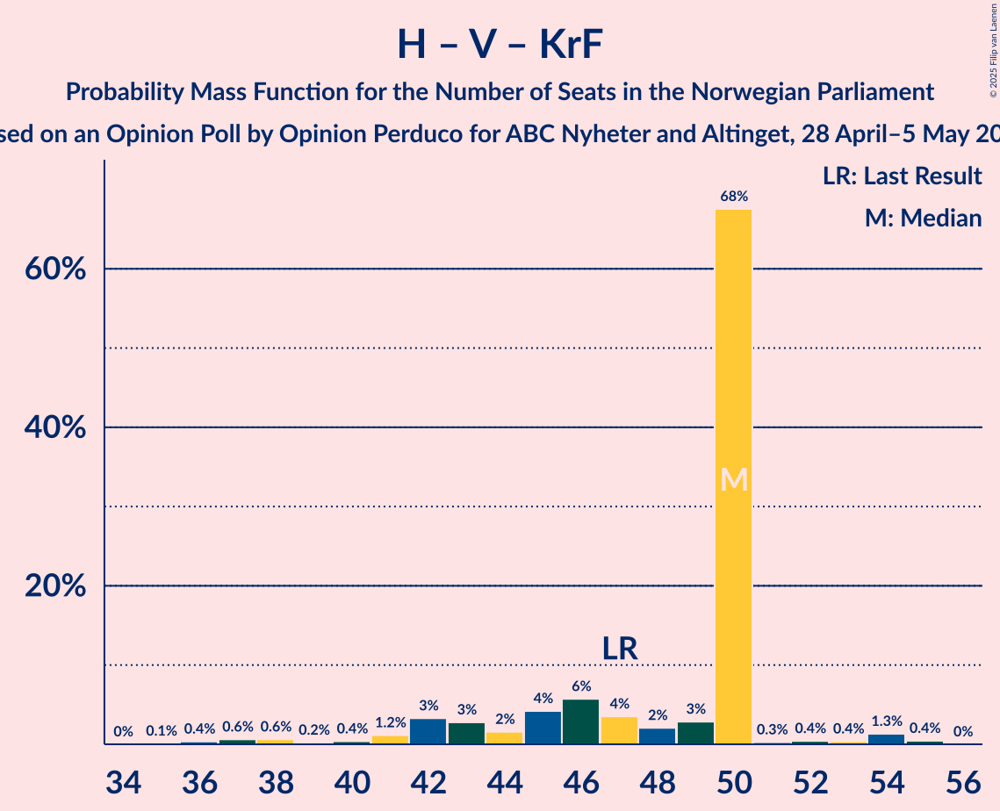

| Number of Seats | Probability | Accumulated | Special Marks |
|:---------------:|:-----------:|:-----------:|:-------------:|
| 35 | 0.1% | 100% |  |
| 36 | 0.4% | 99.9% |  |
| 37 | 0.6% | 99.5% |  |
| 38 | 0.6% | 98.9% |  |
| 39 | 0.2% | 98% |  |
| 40 | 0.4% | 98% |  |
| 41 | 1.2% | 98% |  |
| 42 | 3% | 97% |  |
| 43 | 3% | 93% |  |
| 44 | 2% | 90% |  |
| 45 | 4% | 89% |  |
| 46 | 6% | 85% |  |
| 47 | 4% | 79% | Last Result |
| 48 | 2% | 75% |  |
| 49 | 3% | 73% |  |
| 50 | 68% | 70% | Median |
| 51 | 0.3% | 3% |  |
| 52 | 0.4% | 3% |  |
| 53 | 0.4% | 2% |  |
| 54 | 1.3% | 2% |  |
| 55 | 0.4% | 0.5% |  |
| 56 | 0% | 0% |  |

### Senterpartiet – Venstre – Kristelig Folkeparti

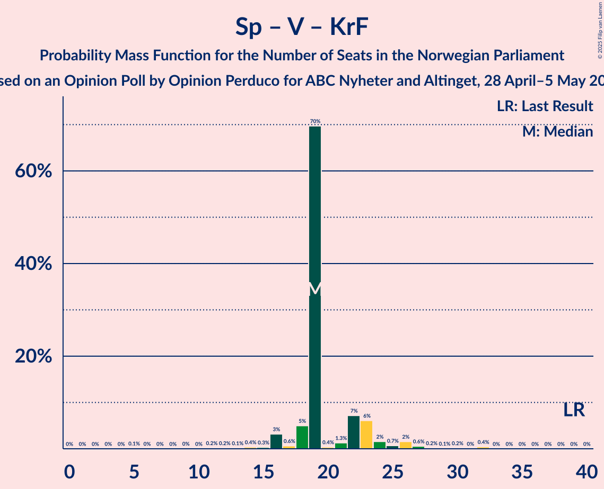

| Number of Seats | Probability | Accumulated | Special Marks |
|:---------------:|:-----------:|:-----------:|:-------------:|
| 5 | 0.1% | 100% |  |
| 6 | 0% | 99.9% |  |
| 7 | 0% | 99.9% |  |
| 8 | 0% | 99.9% |  |
| 9 | 0% | 99.9% |  |
| 10 | 0% | 99.8% |  |
| 11 | 0.2% | 99.8% |  |
| 12 | 0.2% | 99.6% |  |
| 13 | 0.1% | 99.5% |  |
| 14 | 0.4% | 99.3% |  |
| 15 | 0.3% | 99.0% |  |
| 16 | 3% | 98.6% |  |
| 17 | 0.6% | 95% |  |
| 18 | 5% | 95% |  |
| 19 | 70% | 90% | Median |
| 20 | 0.4% | 20% |  |
| 21 | 1.3% | 20% |  |
| 22 | 7% | 18% |  |
| 23 | 6% | 11% |  |
| 24 | 2% | 5% |  |
| 25 | 0.7% | 4% |  |
| 26 | 2% | 3% |  |
| 27 | 0.6% | 1.4% |  |
| 28 | 0.2% | 0.8% |  |
| 29 | 0.1% | 0.7% |  |
| 30 | 0.2% | 0.6% |  |
| 31 | 0% | 0.5% |  |
| 32 | 0.4% | 0.4% |  |
| 33 | 0% | 0% |  |
| 34 | 0% | 0% |  |
| 35 | 0% | 0% |  |
| 36 | 0% | 0% |  |
| 37 | 0% | 0% |  |
| 38 | 0% | 0% |  |
| 39 | 0% | 0% | Last Result |

## Technical Information

### Opinion Poll

+ **Polling firm:** Opinion Perduco
+ **Commissioner(s):** ABC Nyheter and Altinget
+ **Fieldwork period:** 28 April–5 May 2025

### Calculations

+ **Sample size:** 770
+ **Simulations done:** 2,097,152
+ **Error estimate:** 4.31%

