# Opinion Poll by InFact for Nettavisen, 6 May 2025

<a href="#voting-intentions">Voting Intentions</a> | <a href="#seats">Seats</a> | <a href="#coalitions">Coalitions</a> | <a href="#technical-information">Technical Information</a>

## Voting Intentions

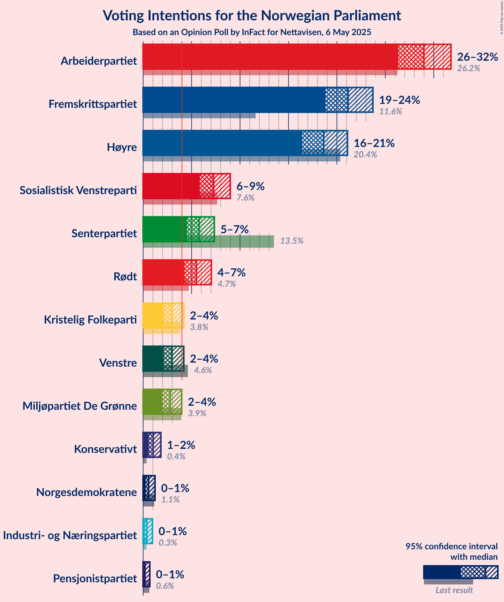

### Confidence Intervals

| Party | Last Result | Poll Result | 80% Confidence Interval | 90% Confidence Interval | 95% Confidence Interval | 99% Confidence Interval |
|:-----:|:-----------:|:-----------:|:-----------------------:|:-----------------------:|:-----------------------:|:-----------------------:|
| Arbeiderpartiet | 26.2% | 29.0% | 27.3–30.8% |26.8–31.3% |26.3–31.8% |25.5–32.7% |
| Fremskrittspartiet | 11.6% | 21.2% | 19.6–22.8% |19.2–23.3% |18.8–23.7% |18.1–24.5% |
| Høyre | 20.4% | 18.6% | 17.2–20.2% |16.8–20.7% |16.4–21.1% |15.7–21.9% |
| Sosialistisk Venstreparti | 7.6% | 7.3% | 6.3–8.4% |6.1–8.7% |5.9–9.0% |5.4–9.6% |
| Senterpartiet | 13.5% | 5.8% | 5.0–6.8% |4.7–7.1% |4.5–7.3% |4.2–7.9% |
| Rødt | 4.7% | 5.5% | 4.7–6.5% |4.5–6.8% |4.3–7.0% |3.9–7.5% |
| Venstre | 4.6% | 3.0% | 2.4–3.8% |2.3–4.0% |2.1–4.2% |1.9–4.6% |
| Kristelig Folkeparti | 3.8% | 3.0% | 2.4–3.8% |2.3–4.0% |2.1–4.2% |1.9–4.6% |
| Miljøpartiet De Grønne | 3.9% | 2.8% | 2.2–3.6% |2.1–3.8% |2.0–4.0% |1.7–4.4% |
| Konservativt | 0.4% | 1.0% | 0.7–1.6% |0.6–1.7% |0.6–1.8% |0.5–2.1% |
| Norgesdemokratene | 1.1% | 0.6% | 0.4–1.0% |0.3–1.1% |0.3–1.2% |0.2–1.5% |
| Industri- og Næringspartiet | 0.3% | 0.4% | 0.2–0.7% |0.2–0.9% |0.1–1.0% |0.1–1.2% |
| Pensjonistpartiet | 0.6% | 0.2% | 0.1–0.5% |0.1–0.6% |0.0–0.7% |0.0–0.9% |

*Note:* The poll result column reflects the actual value used in the calculations. Published results may vary slightly, and in addition be rounded to fewer digits.

## Seats

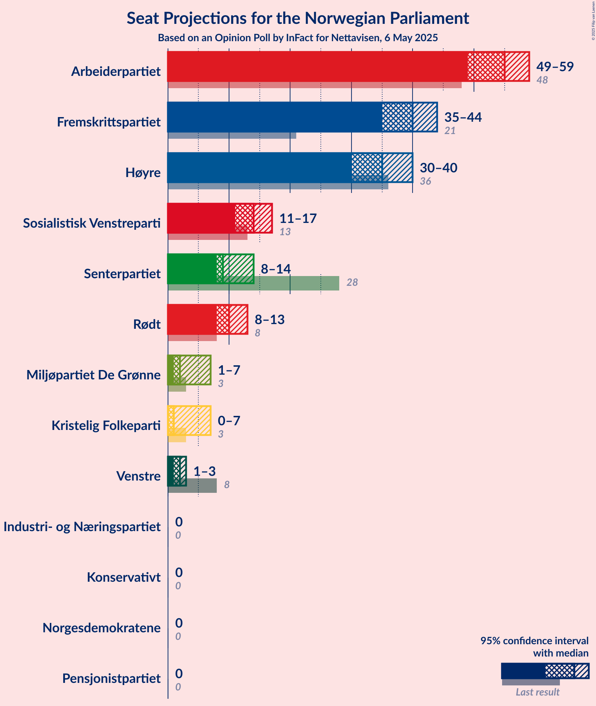

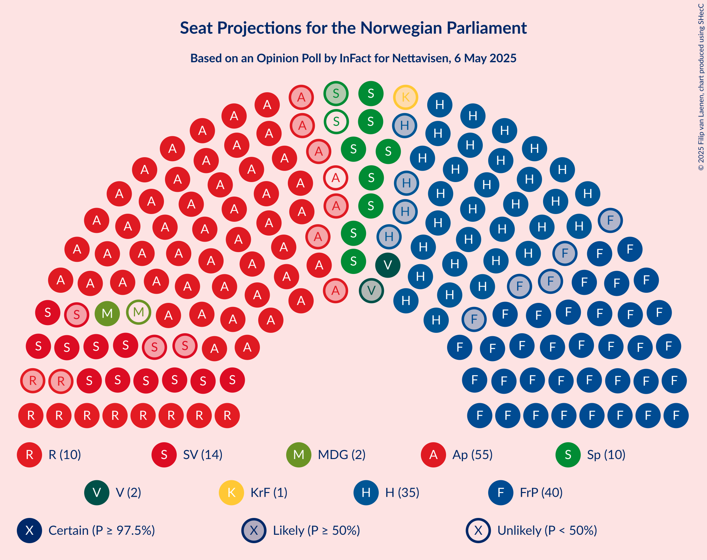

### Confidence Intervals

| Party | Last Result | Median | 80% Confidence Interval | 90% Confidence Interval | 95% Confidence Interval | 99% Confidence Interval |
|:-----:|:-----------:|:------:|:-----------------------:|:-----------------------:|:-----------------------:|:-----------------------:|
| <a href="#arbeiderpartiet">Arbeiderpartiet</a> | 48 | 55 | 51–56 |49–57 |49–59 |48–61 |
| <a href="#fremskrittspartiet">Fremskrittspartiet</a> | 21 | 40 | 38–42 |36–43 |35–44 |33–46 |
| <a href="#høyre">Høyre</a> | 36 | 35 | 31–37 |31–39 |30–40 |29–41 |
| <a href="#sosialistisk-venstreparti">Sosialistisk Venstreparti</a> | 13 | 14 | 12–17 |11–17 |11–17 |10–18 |
| <a href="#senterpartiet">Senterpartiet</a> | 28 | 9 | 8–12 |8–13 |8–14 |1–15 |
| <a href="#rødt">Rødt</a> | 8 | 10 | 9–12 |8–13 |8–13 |1–14 |
| <a href="#venstre">Venstre</a> | 8 | 2 | 2–3 |1–3 |1–3 |1–9 |
| <a href="#kristelig-folkeparti">Kristelig Folkeparti</a> | 3 | 1 | 0–3 |0–3 |0–7 |0–8 |
| <a href="#miljøpartiet-de-grønne">Miljøpartiet De Grønne</a> | 3 | 2 | 1–3 |1–3 |1–7 |1–8 |
| <a href="#konservativt">Konservativt</a> | 0 | 0 | 0 |0 |0 |0 |
| <a href="#norgesdemokratene">Norgesdemokratene</a> | 0 | 0 | 0 |0 |0 |0 |
| <a href="#industri--og-næringspartiet">Industri- og Næringspartiet</a> | 0 | 0 | 0 |0 |0 |0 |
| <a href="#pensjonistpartiet">Pensjonistpartiet</a> | 0 | 0 | 0 |0 |0 |0 |

### Arbeiderpartiet

*For a full overview of the results for this party, see the [Arbeiderpartiet](party-arbeiderpartiet.html) page.*

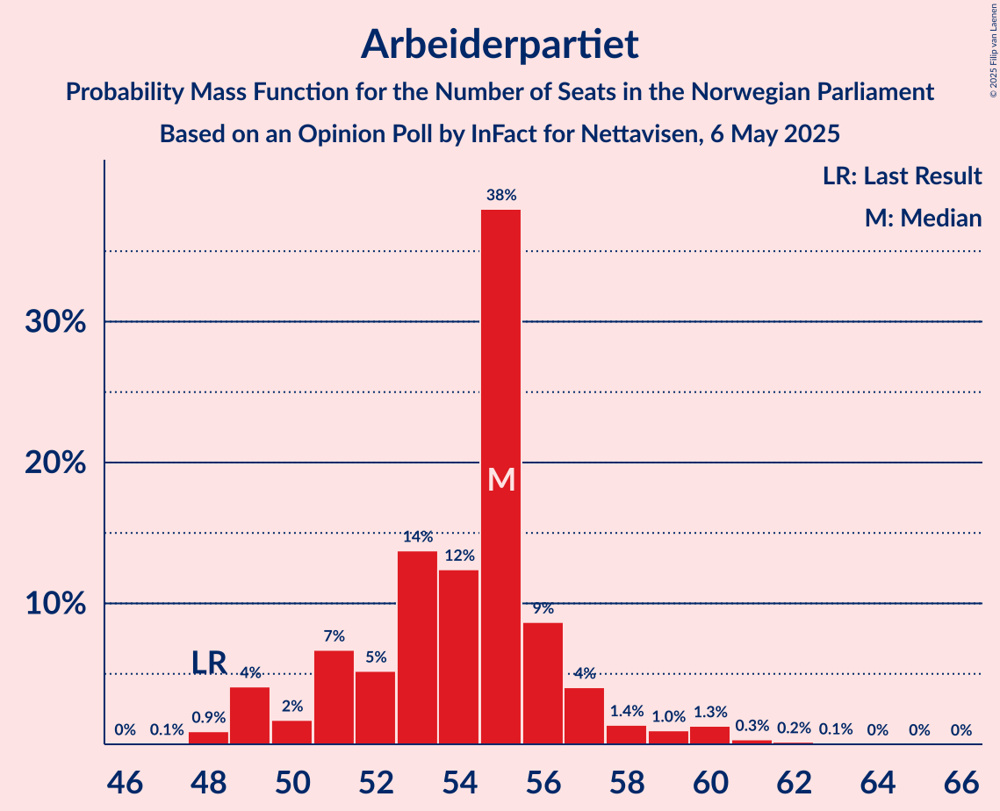

| Number of Seats | Probability | Accumulated | Special Marks |
|:---------------:|:-----------:|:-----------:|:-------------:|
| 46 | 0% | 100% |  |
| 47 | 0.1% | 99.9% |  |
| 48 | 0.9% | 99.9% | Last Result |
| 49 | 4% | 99.0% |  |
| 50 | 2% | 95% |  |
| 51 | 7% | 93% |  |
| 52 | 5% | 86% |  |
| 53 | 14% | 81% |  |
| 54 | 12% | 67% |  |
| 55 | 38% | 55% | Median |
| 56 | 9% | 17% |  |
| 57 | 4% | 8% |  |
| 58 | 1.4% | 4% |  |
| 59 | 1.0% | 3% |  |
| 60 | 1.3% | 2% |  |
| 61 | 0.3% | 0.7% |  |
| 62 | 0.2% | 0.3% |  |
| 63 | 0.1% | 0.2% |  |
| 64 | 0% | 0.1% |  |
| 65 | 0% | 0% |  |

### Fremskrittspartiet

*For a full overview of the results for this party, see the [Fremskrittspartiet](party-fremskrittspartiet.html) page.*

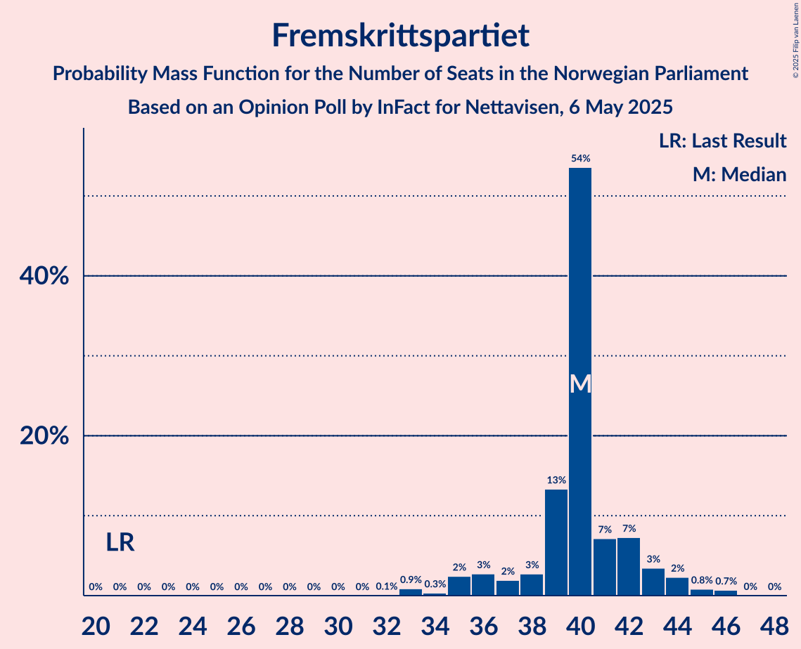

| Number of Seats | Probability | Accumulated | Special Marks |
|:---------------:|:-----------:|:-----------:|:-------------:|
| 21 | 0% | 100% | Last Result |
| 22 | 0% | 100% |  |
| 23 | 0% | 100% |  |
| 24 | 0% | 100% |  |
| 25 | 0% | 100% |  |
| 26 | 0% | 100% |  |
| 27 | 0% | 100% |  |
| 28 | 0% | 100% |  |
| 29 | 0% | 100% |  |
| 30 | 0% | 100% |  |
| 31 | 0% | 100% |  |
| 32 | 0.1% | 100% |  |
| 33 | 0.9% | 99.9% |  |
| 34 | 0.3% | 99.0% |  |
| 35 | 2% | 98.7% |  |
| 36 | 3% | 96% |  |
| 37 | 2% | 93% |  |
| 38 | 3% | 92% |  |
| 39 | 13% | 89% |  |
| 40 | 54% | 75% | Median |
| 41 | 7% | 22% |  |
| 42 | 7% | 15% |  |
| 43 | 3% | 7% |  |
| 44 | 2% | 4% |  |
| 45 | 0.8% | 2% |  |
| 46 | 0.7% | 0.8% |  |
| 47 | 0% | 0.1% |  |
| 48 | 0% | 0% |  |

### Høyre

*For a full overview of the results for this party, see the [Høyre](party-høyre.html) page.*

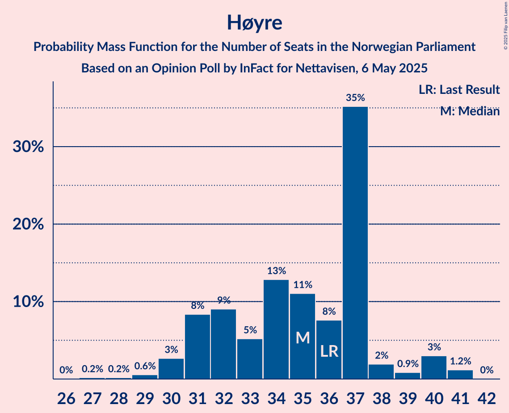

| Number of Seats | Probability | Accumulated | Special Marks |
|:---------------:|:-----------:|:-----------:|:-------------:|
| 26 | 0% | 100% |  |
| 27 | 0.2% | 99.9% |  |
| 28 | 0.2% | 99.7% |  |
| 29 | 0.6% | 99.6% |  |
| 30 | 3% | 99.0% |  |
| 31 | 8% | 96% |  |
| 32 | 9% | 88% |  |
| 33 | 5% | 79% |  |
| 34 | 13% | 74% |  |
| 35 | 11% | 61% | Median |
| 36 | 8% | 50% | Last Result |
| 37 | 35% | 42% |  |
| 38 | 2% | 7% |  |
| 39 | 0.9% | 5% |  |
| 40 | 3% | 4% |  |
| 41 | 1.2% | 1.2% |  |
| 42 | 0% | 0% |  |

### Sosialistisk Venstreparti

*For a full overview of the results for this party, see the [Sosialistisk Venstreparti](party-sosialistiskvenstreparti.html) page.*

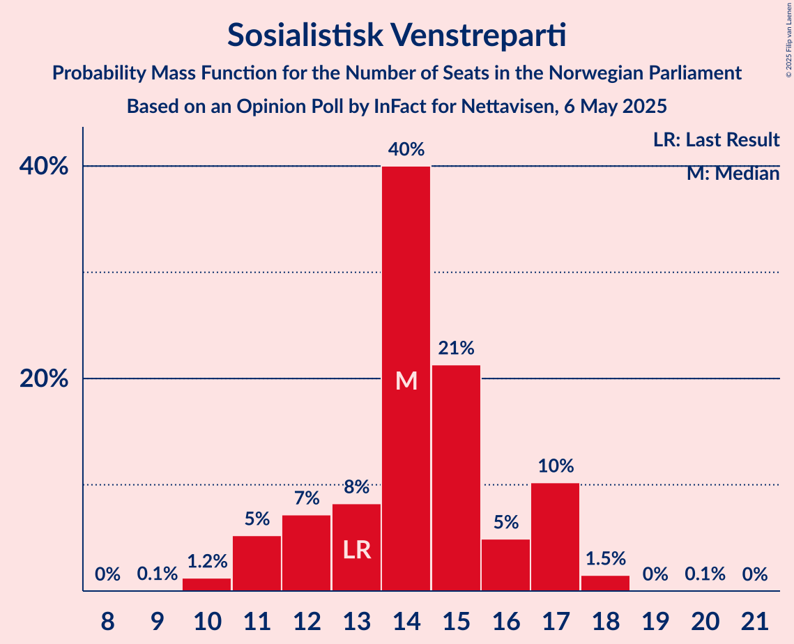

| Number of Seats | Probability | Accumulated | Special Marks |
|:---------------:|:-----------:|:-----------:|:-------------:|
| 9 | 0.1% | 100% |  |
| 10 | 1.2% | 99.9% |  |
| 11 | 5% | 98.7% |  |
| 12 | 7% | 93% |  |
| 13 | 8% | 86% | Last Result |
| 14 | 40% | 78% | Median |
| 15 | 21% | 38% |  |
| 16 | 5% | 17% |  |
| 17 | 10% | 12% |  |
| 18 | 1.5% | 2% |  |
| 19 | 0% | 0.1% |  |
| 20 | 0.1% | 0.1% |  |
| 21 | 0% | 0% |  |

### Senterpartiet

*For a full overview of the results for this party, see the [Senterpartiet](party-senterpartiet.html) page.*

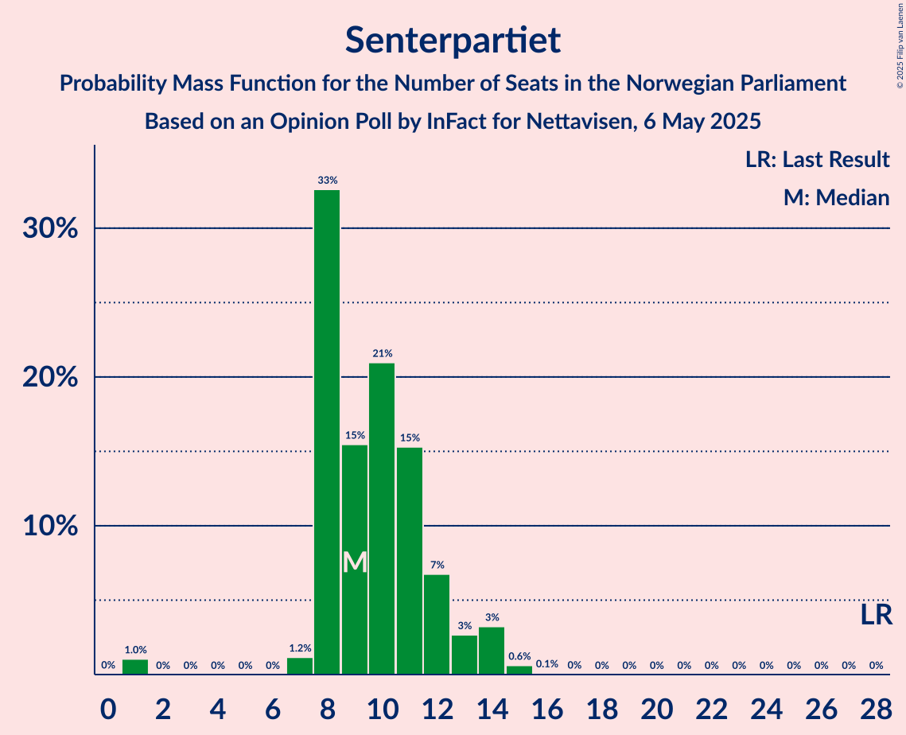

| Number of Seats | Probability | Accumulated | Special Marks |
|:---------------:|:-----------:|:-----------:|:-------------:|
| 1 | 1.0% | 100% |  |
| 2 | 0% | 98.9% |  |
| 3 | 0% | 98.9% |  |
| 4 | 0% | 98.9% |  |
| 5 | 0% | 98.9% |  |
| 6 | 0% | 98.9% |  |
| 7 | 1.2% | 98.9% |  |
| 8 | 33% | 98% |  |
| 9 | 15% | 65% | Median |
| 10 | 21% | 50% |  |
| 11 | 15% | 29% |  |
| 12 | 7% | 13% |  |
| 13 | 3% | 7% |  |
| 14 | 3% | 4% |  |
| 15 | 0.6% | 0.7% |  |
| 16 | 0.1% | 0.1% |  |
| 17 | 0% | 0% |  |
| 18 | 0% | 0% |  |
| 19 | 0% | 0% |  |
| 20 | 0% | 0% |  |
| 21 | 0% | 0% |  |
| 22 | 0% | 0% |  |
| 23 | 0% | 0% |  |
| 24 | 0% | 0% |  |
| 25 | 0% | 0% |  |
| 26 | 0% | 0% |  |
| 27 | 0% | 0% |  |
| 28 | 0% | 0% | Last Result |

### Rødt

*For a full overview of the results for this party, see the [Rødt](party-rødt.html) page.*

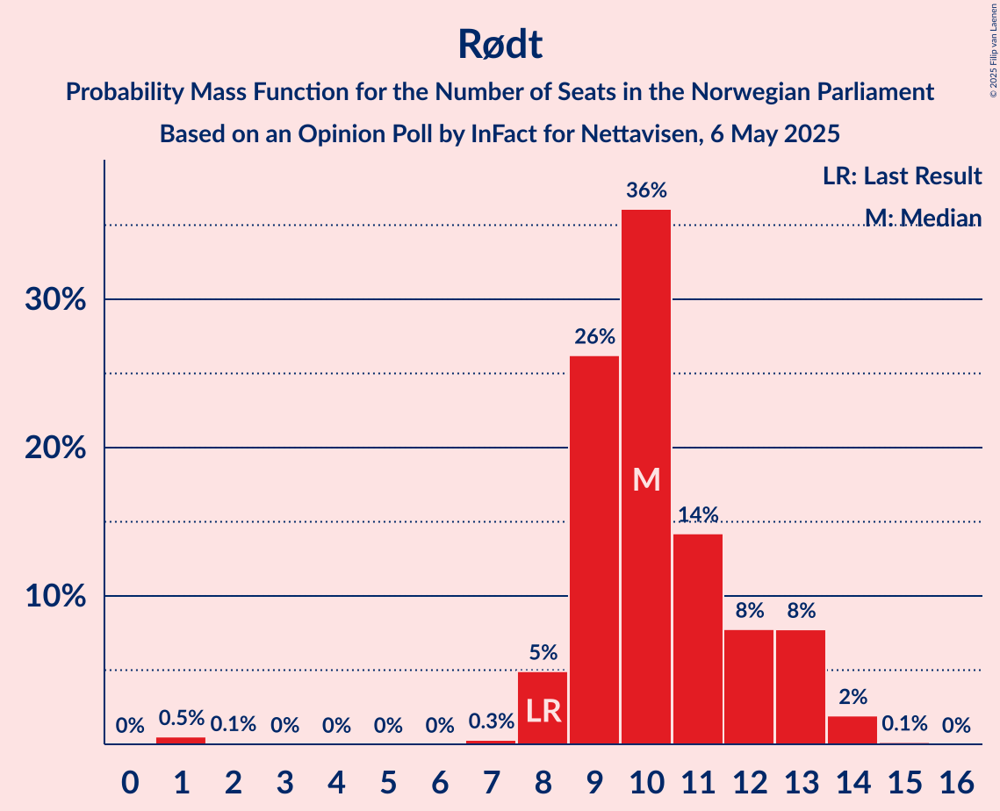

| Number of Seats | Probability | Accumulated | Special Marks |
|:---------------:|:-----------:|:-----------:|:-------------:|
| 1 | 0.5% | 100% |  |
| 2 | 0.1% | 99.5% |  |
| 3 | 0% | 99.4% |  |
| 4 | 0% | 99.4% |  |
| 5 | 0% | 99.4% |  |
| 6 | 0% | 99.4% |  |
| 7 | 0.3% | 99.3% |  |
| 8 | 5% | 99.1% | Last Result |
| 9 | 26% | 94% |  |
| 10 | 36% | 68% | Median |
| 11 | 14% | 32% |  |
| 12 | 8% | 18% |  |
| 13 | 8% | 10% |  |
| 14 | 2% | 2% |  |
| 15 | 0.1% | 0.1% |  |
| 16 | 0% | 0% |  |

### Venstre

*For a full overview of the results for this party, see the [Venstre](party-venstre.html) page.*

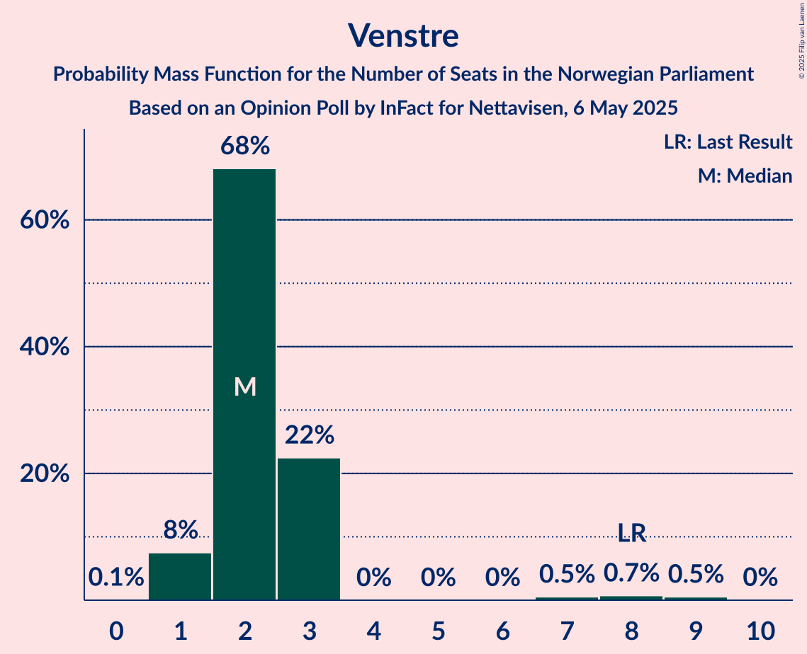

| Number of Seats | Probability | Accumulated | Special Marks |
|:---------------:|:-----------:|:-----------:|:-------------:|
| 0 | 0.1% | 100% |  |
| 1 | 8% | 99.9% |  |
| 2 | 68% | 92% | Median |
| 3 | 22% | 24% |  |
| 4 | 0% | 2% |  |
| 5 | 0% | 2% |  |
| 6 | 0% | 2% |  |
| 7 | 0.5% | 2% |  |
| 8 | 0.7% | 1.3% | Last Result |
| 9 | 0.5% | 0.6% |  |
| 10 | 0% | 0% |  |

### Kristelig Folkeparti

*For a full overview of the results for this party, see the [Kristelig Folkeparti](party-kristeligfolkeparti.html) page.*

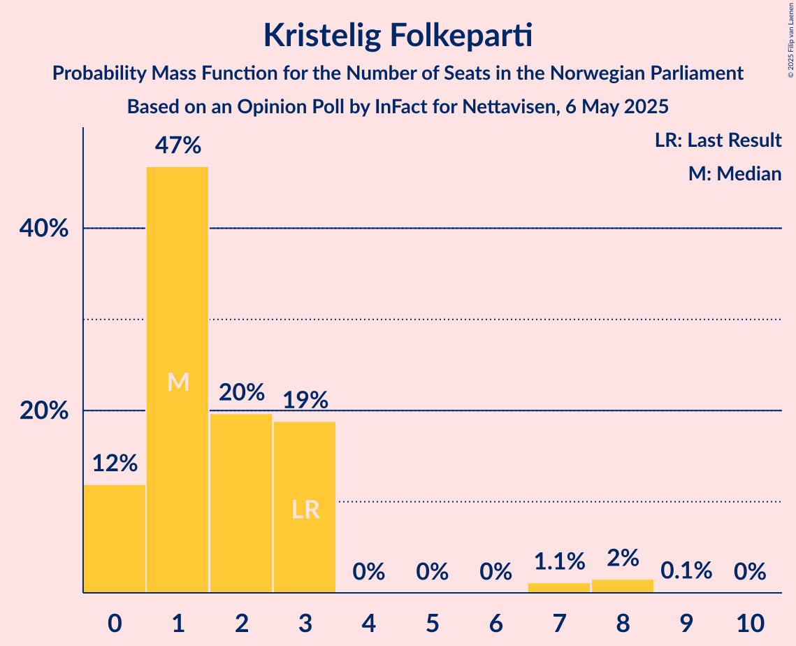

| Number of Seats | Probability | Accumulated | Special Marks |
|:---------------:|:-----------:|:-----------:|:-------------:|
| 0 | 12% | 100% |  |
| 1 | 47% | 88% | Median |
| 2 | 20% | 41% |  |
| 3 | 19% | 22% | Last Result |
| 4 | 0% | 3% |  |
| 5 | 0% | 3% |  |
| 6 | 0% | 3% |  |
| 7 | 1.1% | 3% |  |
| 8 | 2% | 2% |  |
| 9 | 0.1% | 0.1% |  |
| 10 | 0% | 0% |  |

### Miljøpartiet De Grønne

*For a full overview of the results for this party, see the [Miljøpartiet De Grønne](party-miljøpartietdegrønne.html) page.*

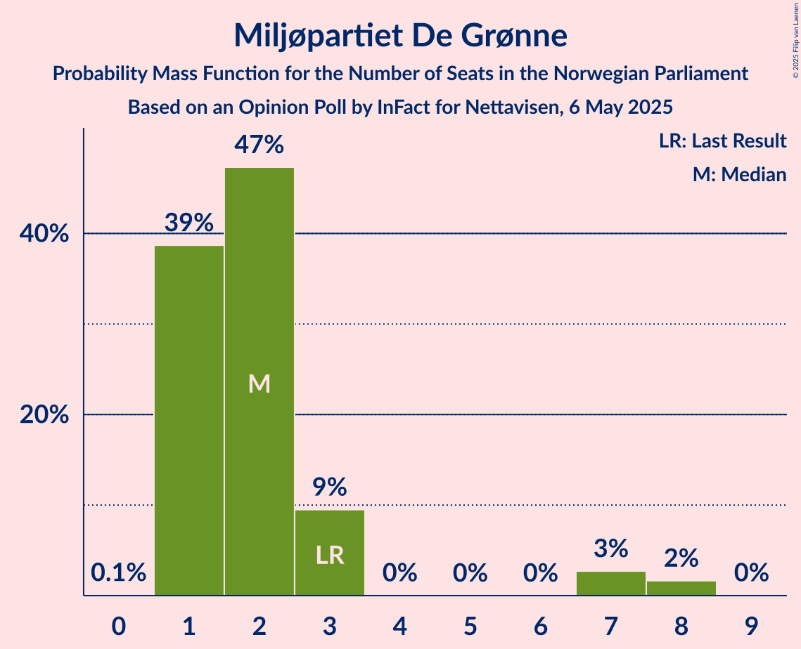

| Number of Seats | Probability | Accumulated | Special Marks |
|:---------------:|:-----------:|:-----------:|:-------------:|
| 0 | 0.1% | 100% |  |
| 1 | 39% | 99.9% |  |
| 2 | 47% | 61% | Median |
| 3 | 9% | 14% | Last Result |
| 4 | 0% | 4% |  |
| 5 | 0% | 4% |  |
| 6 | 0% | 4% |  |
| 7 | 3% | 4% |  |
| 8 | 2% | 2% |  |
| 9 | 0% | 0% |  |

### Konservativt

*For a full overview of the results for this party, see the [Konservativt](party-konservativt.html) page.*

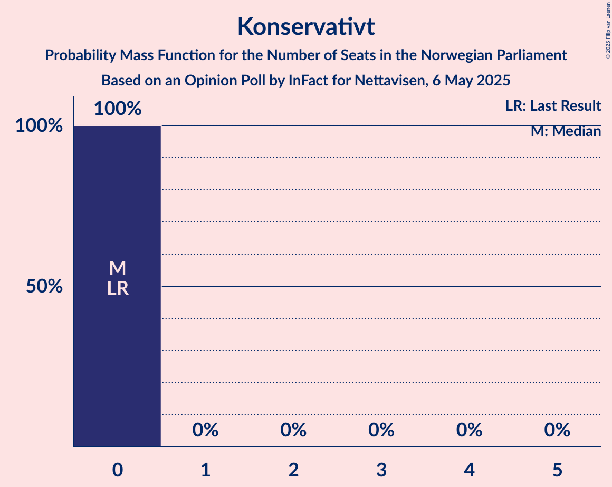

| Number of Seats | Probability | Accumulated | Special Marks |
|:---------------:|:-----------:|:-----------:|:-------------:|
| 0 | 100% | 100% | Last Result, Median |

### Norgesdemokratene

*For a full overview of the results for this party, see the [Norgesdemokratene](party-norgesdemokratene.html) page.*

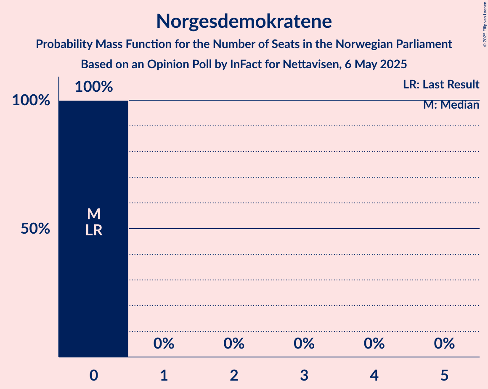

| Number of Seats | Probability | Accumulated | Special Marks |
|:---------------:|:-----------:|:-----------:|:-------------:|
| 0 | 100% | 100% | Last Result, Median |

### Industri- og Næringspartiet

*For a full overview of the results for this party, see the [Industri- og Næringspartiet](party-industri-ognæringspartiet.html) page.*

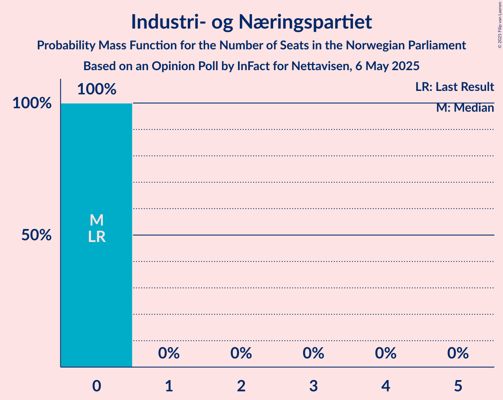

| Number of Seats | Probability | Accumulated | Special Marks |
|:---------------:|:-----------:|:-----------:|:-------------:|
| 0 | 100% | 100% | Last Result, Median |

### Pensjonistpartiet

*For a full overview of the results for this party, see the [Pensjonistpartiet](party-pensjonistpartiet.html) page.*

| Number of Seats | Probability | Accumulated | Special Marks |
|:---------------:|:-----------:|:-----------:|:-------------:|
| 0 | 100% | 100% | Last Result, Median |

## Coalitions

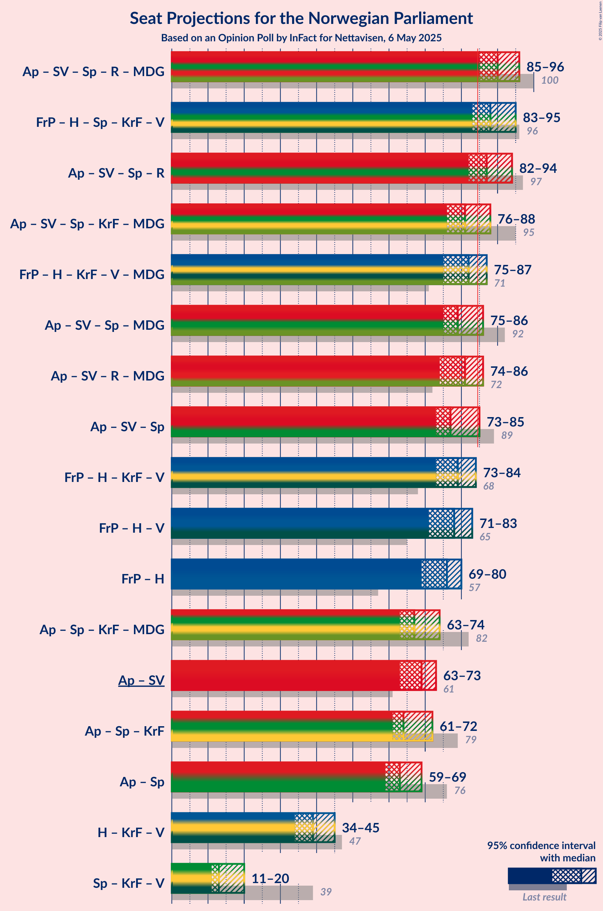

### Confidence Intervals

| Coalition | Last Result | Median | Majority? | 80% Confidence Interval | 90% Confidence Interval | 95% Confidence Interval | 99% Confidence Interval |
|:---------:|:-----------:|:------:|:---------:|:-----------------------:|:-----------------------:|:-----------------------:|:-----------------------:|
| Arbeiderpartiet – Sosialistisk Venstreparti – Senterpartiet – Rødt – Miljøpartiet De Grønne | 100 | 90 | 98% | 87–93 | 85–95 | 85–96 | 82–97 |
| Fremskrittspartiet – Høyre – Senterpartiet – Kristelig Folkeparti – Venstre | 96 | 88 | 95% | 85–92 | 85–94 | 83–95 | 83–97 |
| Arbeiderpartiet – Sosialistisk Venstreparti – Senterpartiet – Rødt | 97 | 87 | 90% | 85–92 | 83–94 | 82–94 | 81–95 |
| Arbeiderpartiet – Sosialistisk Venstreparti – Senterpartiet – Kristelig Folkeparti – Miljøpartiet De Grønne | 95 | 81 | 12% | 79–85 | 78–87 | 76–88 | 71–89 |
| Fremskrittspartiet – Høyre – Kristelig Folkeparti – Venstre – Miljøpartiet De Grønne | 71 | 82 | 10% | 77–84 | 75–86 | 75–87 | 74–88 |
| Arbeiderpartiet – Sosialistisk Venstreparti – Senterpartiet – Miljøpartiet De Grønne | 92 | 79 | 5% | 77–83 | 76–84 | 75–86 | 70–87 |
| Arbeiderpartiet – Sosialistisk Venstreparti – Rødt – Miljøpartiet De Grønne | 72 | 81 | 5% | 77–84 | 75–84 | 74–86 | 72–86 |
| Arbeiderpartiet – Sosialistisk Venstreparti – Senterpartiet | 89 | 77 | 3% | 75–81 | 74–82 | 73–85 | 69–85 |
| Fremskrittspartiet – Høyre – Kristelig Folkeparti – Venstre | 68 | 79 | 2% | 76–82 | 74–84 | 73–84 | 72–87 |
| Fremskrittspartiet – Høyre – Venstre | 65 | 78 | 1.0% | 73–80 | 72–81 | 71–83 | 69–86 |
| Fremskrittspartiet – Høyre | 57 | 76 | 0% | 71–77 | 70–79 | 69–80 | 68–84 |
| Arbeiderpartiet – Senterpartiet – Kristelig Folkeparti – Miljøpartiet De Grønne | 82 | 67 | 0% | 65–71 | 63–73 | 63–74 | 57–77 |
| Arbeiderpartiet – Sosialistisk Venstreparti | 61 | 69 | 0% | 65–71 | 64–72 | 63–73 | 61–75 |
| Arbeiderpartiet – Senterpartiet – Kristelig Folkeparti | 79 | 64 | 0% | 63–69 | 61–71 | 61–72 | 56–74 |
| Arbeiderpartiet – Senterpartiet | 76 | 63 | 0% | 61–67 | 60–68 | 59–69 | 55–71 |
| Høyre – Kristelig Folkeparti – Venstre | 47 | 39 | 0% | 35–42 | 35–43 | 34–45 | 33–46 |
| Senterpartiet – Kristelig Folkeparti – Venstre | 39 | 13 | 0% | 11–17 | 11–18 | 11–20 | 4–23 |

### Arbeiderpartiet – Sosialistisk Venstreparti – Senterpartiet – Rødt – Miljøpartiet De Grønne

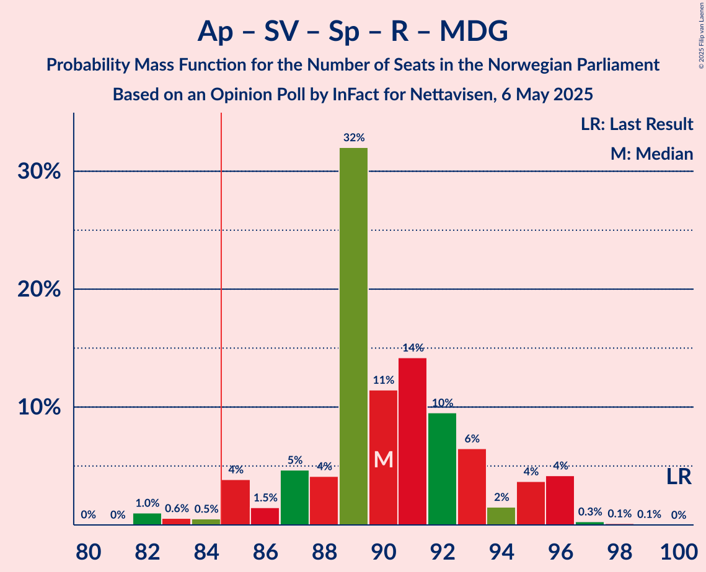

| Number of Seats | Probability | Accumulated | Special Marks |
|:---------------:|:-----------:|:-----------:|:-------------:|
| 80 | 0% | 100% |  |
| 81 | 0% | 99.9% |  |
| 82 | 1.0% | 99.9% |  |
| 83 | 0.6% | 98.9% |  |
| 84 | 0.5% | 98% |  |
| 85 | 4% | 98% | Majority |
| 86 | 1.5% | 94% |  |
| 87 | 5% | 92% |  |
| 88 | 4% | 88% |  |
| 89 | 32% | 84% |  |
| 90 | 11% | 52% | Median |
| 91 | 14% | 40% |  |
| 92 | 10% | 26% |  |
| 93 | 6% | 16% |  |
| 94 | 2% | 10% |  |
| 95 | 4% | 8% |  |
| 96 | 4% | 5% |  |
| 97 | 0.3% | 0.5% |  |
| 98 | 0.1% | 0.2% |  |
| 99 | 0.1% | 0.1% |  |
| 100 | 0% | 0% | Last Result |

### Fremskrittspartiet – Høyre – Senterpartiet – Kristelig Folkeparti – Venstre

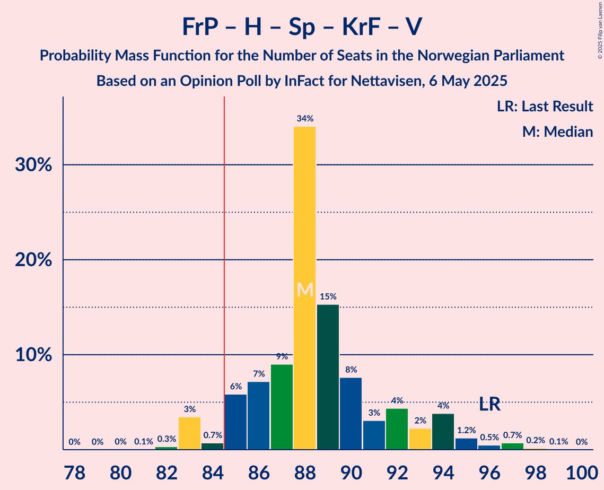

| Number of Seats | Probability | Accumulated | Special Marks |
|:---------------:|:-----------:|:-----------:|:-------------:|
| 79 | 0% | 100% |  |
| 80 | 0% | 99.9% |  |
| 81 | 0.1% | 99.9% |  |
| 82 | 0.3% | 99.8% |  |
| 83 | 3% | 99.5% |  |
| 84 | 0.7% | 96% |  |
| 85 | 6% | 95% | Majority |
| 86 | 7% | 89% |  |
| 87 | 9% | 82% | Median |
| 88 | 34% | 73% |  |
| 89 | 15% | 39% |  |
| 90 | 8% | 24% |  |
| 91 | 3% | 16% |  |
| 92 | 4% | 13% |  |
| 93 | 2% | 9% |  |
| 94 | 4% | 7% |  |
| 95 | 1.2% | 3% |  |
| 96 | 0.5% | 1.5% | Last Result |
| 97 | 0.7% | 1.0% |  |
| 98 | 0.2% | 0.3% |  |
| 99 | 0.1% | 0.1% |  |
| 100 | 0% | 0% |  |

### Arbeiderpartiet – Sosialistisk Venstreparti – Senterpartiet – Rødt

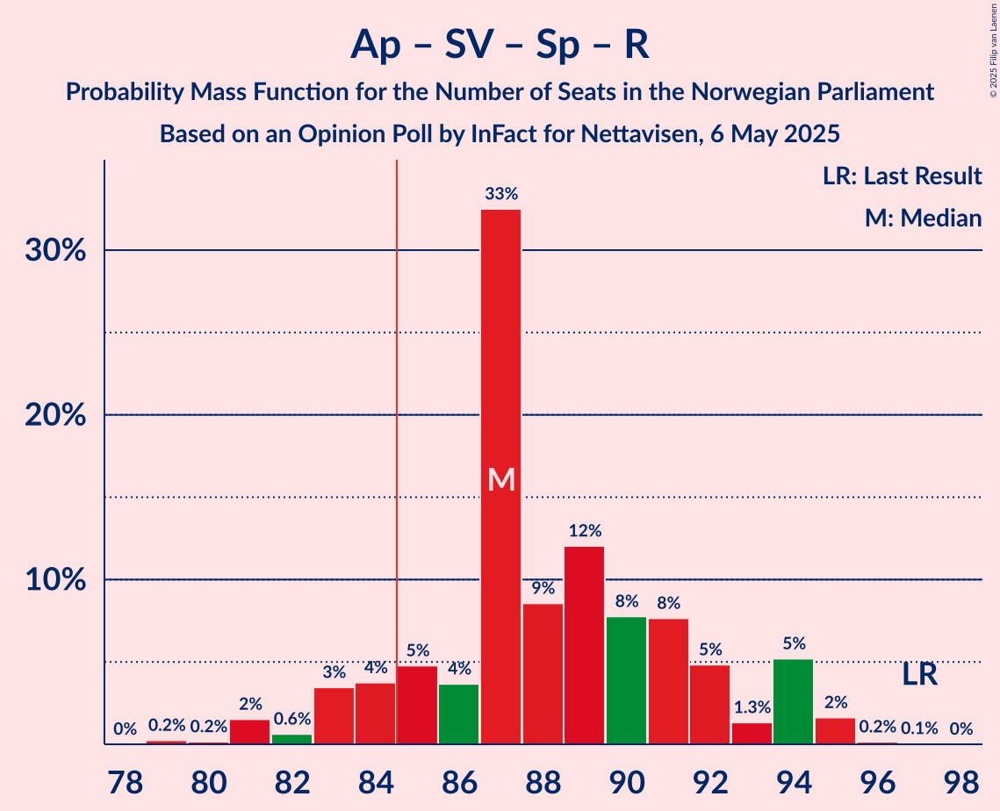

| Number of Seats | Probability | Accumulated | Special Marks |
|:---------------:|:-----------:|:-----------:|:-------------:|
| 79 | 0.2% | 100% |  |
| 80 | 0.2% | 99.7% |  |
| 81 | 2% | 99.6% |  |
| 82 | 0.6% | 98% |  |
| 83 | 3% | 97% |  |
| 84 | 4% | 94% |  |
| 85 | 5% | 90% | Majority |
| 86 | 4% | 85% |  |
| 87 | 33% | 82% |  |
| 88 | 9% | 49% | Median |
| 89 | 12% | 41% |  |
| 90 | 8% | 29% |  |
| 91 | 8% | 21% |  |
| 92 | 5% | 13% |  |
| 93 | 1.3% | 8% |  |
| 94 | 5% | 7% |  |
| 95 | 2% | 2% |  |
| 96 | 0.2% | 0.2% |  |
| 97 | 0.1% | 0.1% | Last Result |
| 98 | 0% | 0% |  |

### Arbeiderpartiet – Sosialistisk Venstreparti – Senterpartiet – Kristelig Folkeparti – Miljøpartiet De Grønne

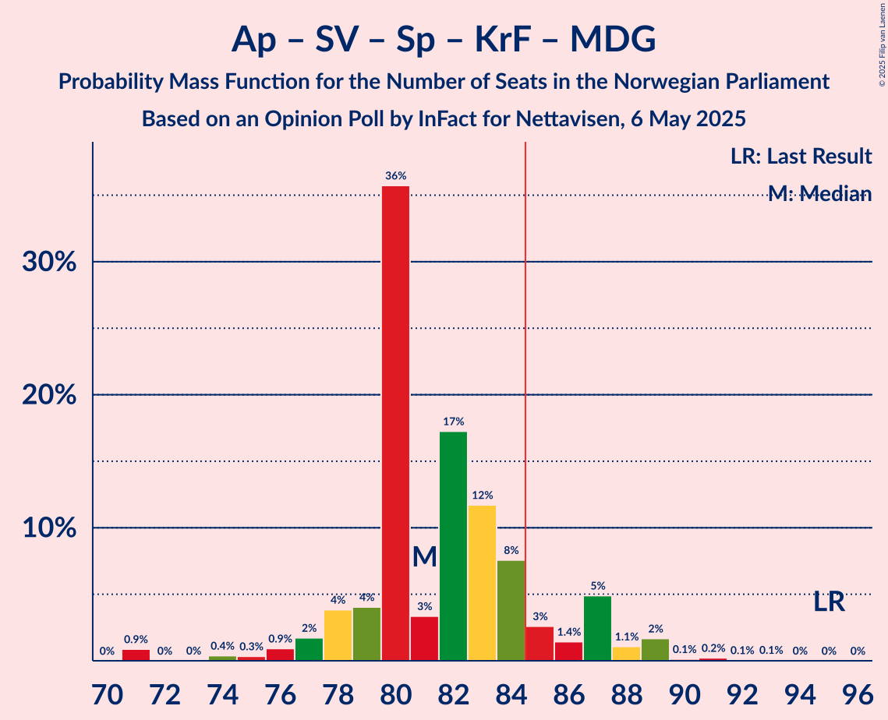

| Number of Seats | Probability | Accumulated | Special Marks |
|:---------------:|:-----------:|:-----------:|:-------------:|
| 71 | 0.9% | 100% |  |
| 72 | 0% | 99.1% |  |
| 73 | 0% | 99.1% |  |
| 74 | 0.4% | 99.1% |  |
| 75 | 0.3% | 98.7% |  |
| 76 | 0.9% | 98% |  |
| 77 | 2% | 97% |  |
| 78 | 4% | 96% |  |
| 79 | 4% | 92% |  |
| 80 | 36% | 88% |  |
| 81 | 3% | 52% | Median |
| 82 | 17% | 49% |  |
| 83 | 12% | 31% |  |
| 84 | 8% | 20% |  |
| 85 | 3% | 12% | Majority |
| 86 | 1.4% | 10% |  |
| 87 | 5% | 8% |  |
| 88 | 1.1% | 3% |  |
| 89 | 2% | 2% |  |
| 90 | 0.1% | 0.5% |  |
| 91 | 0.2% | 0.4% |  |
| 92 | 0.1% | 0.1% |  |
| 93 | 0.1% | 0.1% |  |
| 94 | 0% | 0% |  |
| 95 | 0% | 0% | Last Result |

### Fremskrittspartiet – Høyre – Kristelig Folkeparti – Venstre – Miljøpartiet De Grønne

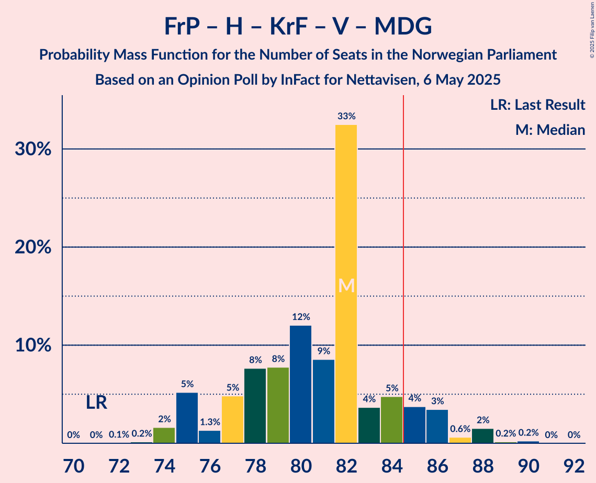

| Number of Seats | Probability | Accumulated | Special Marks |
|:---------------:|:-----------:|:-----------:|:-------------:|
| 71 | 0% | 100% | Last Result |
| 72 | 0.1% | 100% |  |
| 73 | 0.2% | 99.9% |  |
| 74 | 2% | 99.8% |  |
| 75 | 5% | 98% |  |
| 76 | 1.3% | 93% |  |
| 77 | 5% | 92% |  |
| 78 | 8% | 87% |  |
| 79 | 8% | 79% |  |
| 80 | 12% | 71% | Median |
| 81 | 9% | 59% |  |
| 82 | 33% | 51% |  |
| 83 | 4% | 18% |  |
| 84 | 5% | 15% |  |
| 85 | 4% | 10% | Majority |
| 86 | 3% | 6% |  |
| 87 | 0.6% | 3% |  |
| 88 | 2% | 2% |  |
| 89 | 0.2% | 0.4% |  |
| 90 | 0.2% | 0.3% |  |
| 91 | 0% | 0% |  |

### Arbeiderpartiet – Sosialistisk Venstreparti – Senterpartiet – Miljøpartiet De Grønne

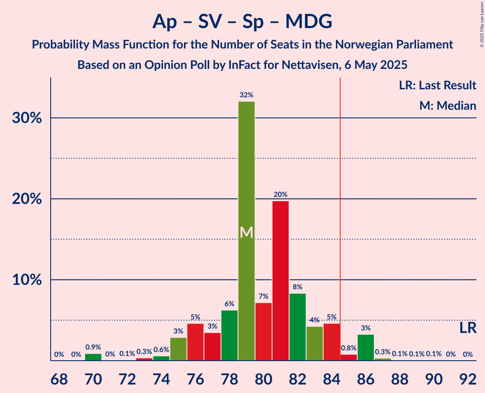

| Number of Seats | Probability | Accumulated | Special Marks |
|:---------------:|:-----------:|:-----------:|:-------------:|
| 70 | 0.9% | 100% |  |
| 71 | 0% | 99.1% |  |
| 72 | 0.1% | 99.1% |  |
| 73 | 0.3% | 99.0% |  |
| 74 | 0.6% | 98.6% |  |
| 75 | 3% | 98% |  |
| 76 | 5% | 95% |  |
| 77 | 3% | 91% |  |
| 78 | 6% | 87% |  |
| 79 | 32% | 81% |  |
| 80 | 7% | 49% | Median |
| 81 | 20% | 42% |  |
| 82 | 8% | 22% |  |
| 83 | 4% | 13% |  |
| 84 | 5% | 9% |  |
| 85 | 0.8% | 5% | Majority |
| 86 | 3% | 4% |  |
| 87 | 0.3% | 0.6% |  |
| 88 | 0.1% | 0.2% |  |
| 89 | 0.1% | 0.2% |  |
| 90 | 0.1% | 0.1% |  |
| 91 | 0% | 0% |  |
| 92 | 0% | 0% | Last Result |

### Arbeiderpartiet – Sosialistisk Venstreparti – Rødt – Miljøpartiet De Grønne

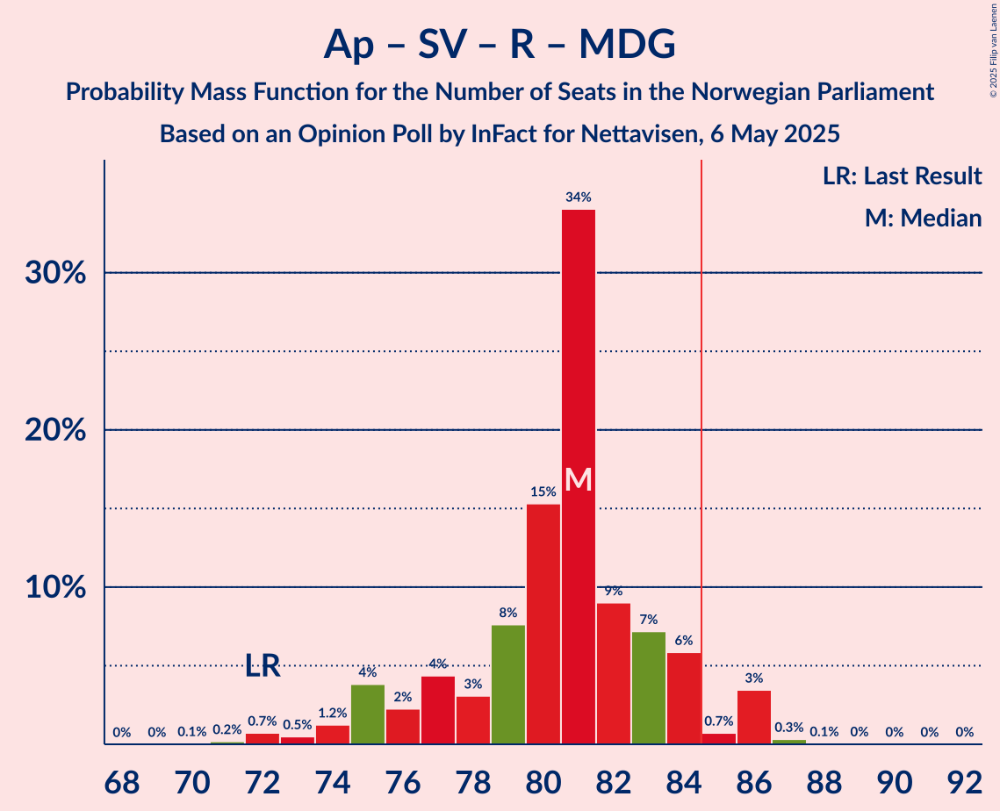

| Number of Seats | Probability | Accumulated | Special Marks |
|:---------------:|:-----------:|:-----------:|:-------------:|
| 70 | 0.1% | 100% |  |
| 71 | 0.2% | 99.9% |  |
| 72 | 0.7% | 99.7% | Last Result |
| 73 | 0.5% | 99.0% |  |
| 74 | 1.2% | 98.5% |  |
| 75 | 4% | 97% |  |
| 76 | 2% | 93% |  |
| 77 | 4% | 91% |  |
| 78 | 3% | 87% |  |
| 79 | 8% | 84% |  |
| 80 | 15% | 76% |  |
| 81 | 34% | 61% | Median |
| 82 | 9% | 27% |  |
| 83 | 7% | 18% |  |
| 84 | 6% | 11% |  |
| 85 | 0.7% | 5% | Majority |
| 86 | 3% | 4% |  |
| 87 | 0.3% | 0.5% |  |
| 88 | 0.1% | 0.2% |  |
| 89 | 0% | 0.1% |  |
| 90 | 0% | 0.1% |  |
| 91 | 0% | 0% |  |

### Arbeiderpartiet – Sosialistisk Venstreparti – Senterpartiet

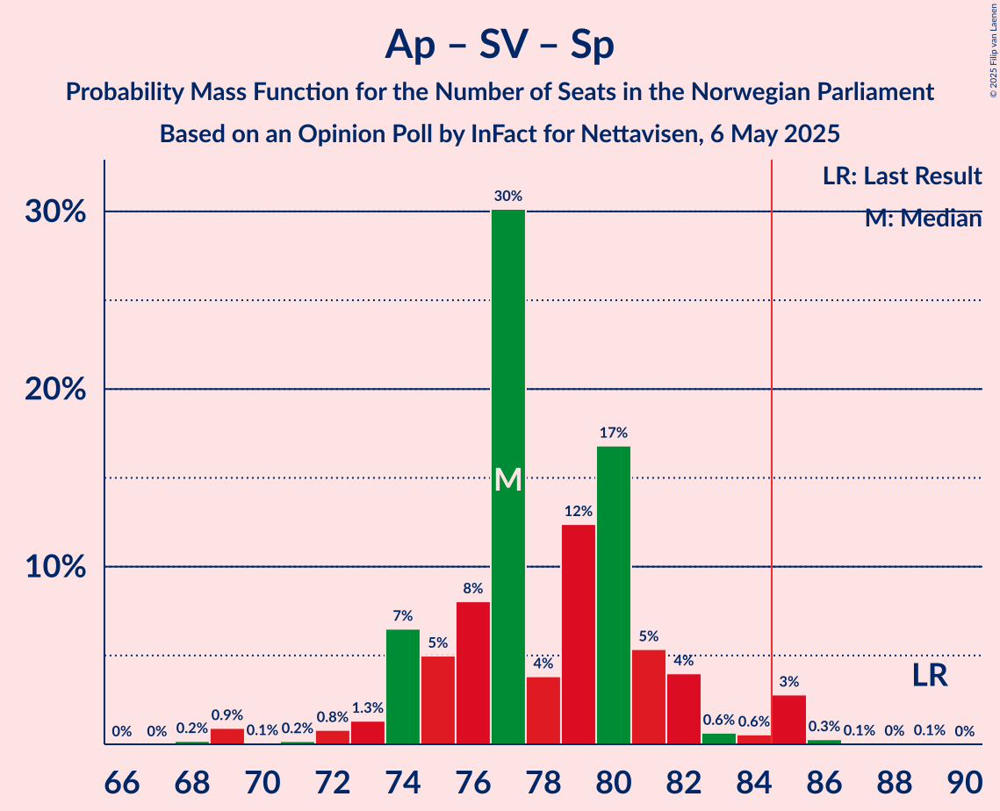

| Number of Seats | Probability | Accumulated | Special Marks |
|:---------------:|:-----------:|:-----------:|:-------------:|
| 68 | 0.2% | 100% |  |
| 69 | 0.9% | 99.8% |  |
| 70 | 0.1% | 98.9% |  |
| 71 | 0.2% | 98.8% |  |
| 72 | 0.8% | 98.6% |  |
| 73 | 1.3% | 98% |  |
| 74 | 7% | 97% |  |
| 75 | 5% | 90% |  |
| 76 | 8% | 85% |  |
| 77 | 30% | 77% |  |
| 78 | 4% | 47% | Median |
| 79 | 12% | 43% |  |
| 80 | 17% | 31% |  |
| 81 | 5% | 14% |  |
| 82 | 4% | 8% |  |
| 83 | 0.6% | 4% |  |
| 84 | 0.6% | 4% |  |
| 85 | 3% | 3% | Majority |
| 86 | 0.3% | 0.4% |  |
| 87 | 0.1% | 0.2% |  |
| 88 | 0% | 0.1% |  |
| 89 | 0.1% | 0.1% | Last Result |
| 90 | 0% | 0% |  |

### Fremskrittspartiet – Høyre – Kristelig Folkeparti – Venstre

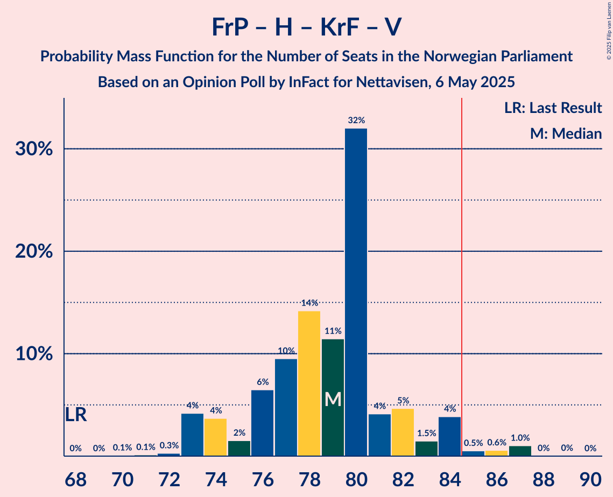

| Number of Seats | Probability | Accumulated | Special Marks |
|:---------------:|:-----------:|:-----------:|:-------------:|
| 68 | 0% | 100% | Last Result |
| 69 | 0% | 100% |  |
| 70 | 0.1% | 100% |  |
| 71 | 0.1% | 99.9% |  |
| 72 | 0.3% | 99.8% |  |
| 73 | 4% | 99.5% |  |
| 74 | 4% | 95% |  |
| 75 | 2% | 92% |  |
| 76 | 6% | 90% |  |
| 77 | 10% | 84% |  |
| 78 | 14% | 74% | Median |
| 79 | 11% | 60% |  |
| 80 | 32% | 48% |  |
| 81 | 4% | 16% |  |
| 82 | 5% | 12% |  |
| 83 | 1.5% | 8% |  |
| 84 | 4% | 6% |  |
| 85 | 0.5% | 2% | Majority |
| 86 | 0.6% | 2% |  |
| 87 | 1.0% | 1.1% |  |
| 88 | 0% | 0.1% |  |
| 89 | 0% | 0.1% |  |
| 90 | 0% | 0% |  |

### Fremskrittspartiet – Høyre – Venstre

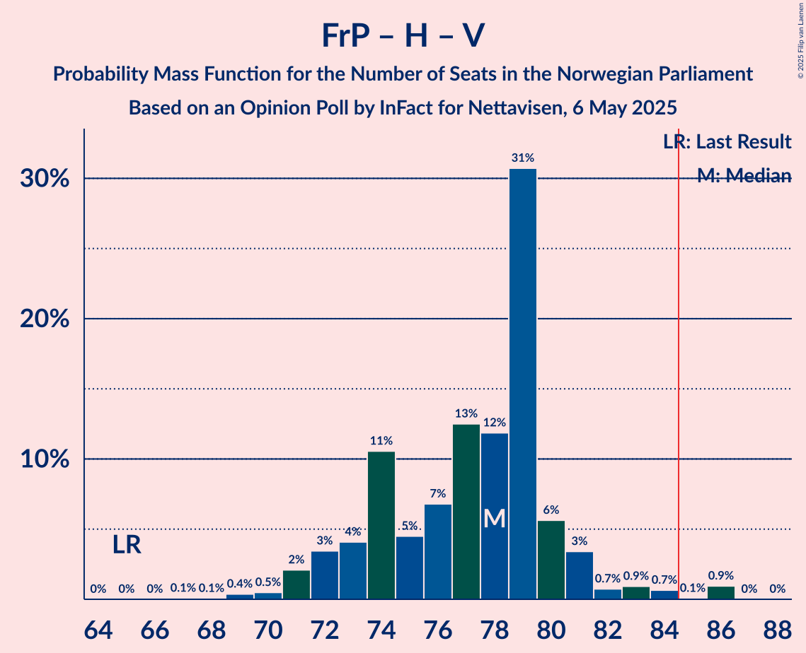

| Number of Seats | Probability | Accumulated | Special Marks |
|:---------------:|:-----------:|:-----------:|:-------------:|
| 65 | 0% | 100% | Last Result |
| 66 | 0% | 100% |  |
| 67 | 0.1% | 100% |  |
| 68 | 0.1% | 99.9% |  |
| 69 | 0.4% | 99.8% |  |
| 70 | 0.5% | 99.5% |  |
| 71 | 2% | 99.0% |  |
| 72 | 3% | 97% |  |
| 73 | 4% | 93% |  |
| 74 | 11% | 89% |  |
| 75 | 5% | 79% |  |
| 76 | 7% | 74% |  |
| 77 | 13% | 67% | Median |
| 78 | 12% | 55% |  |
| 79 | 31% | 43% |  |
| 80 | 6% | 12% |  |
| 81 | 3% | 7% |  |
| 82 | 0.7% | 3% |  |
| 83 | 0.9% | 3% |  |
| 84 | 0.7% | 2% |  |
| 85 | 0.1% | 1.0% | Majority |
| 86 | 0.9% | 1.0% |  |
| 87 | 0% | 0% |  |

### Fremskrittspartiet – Høyre

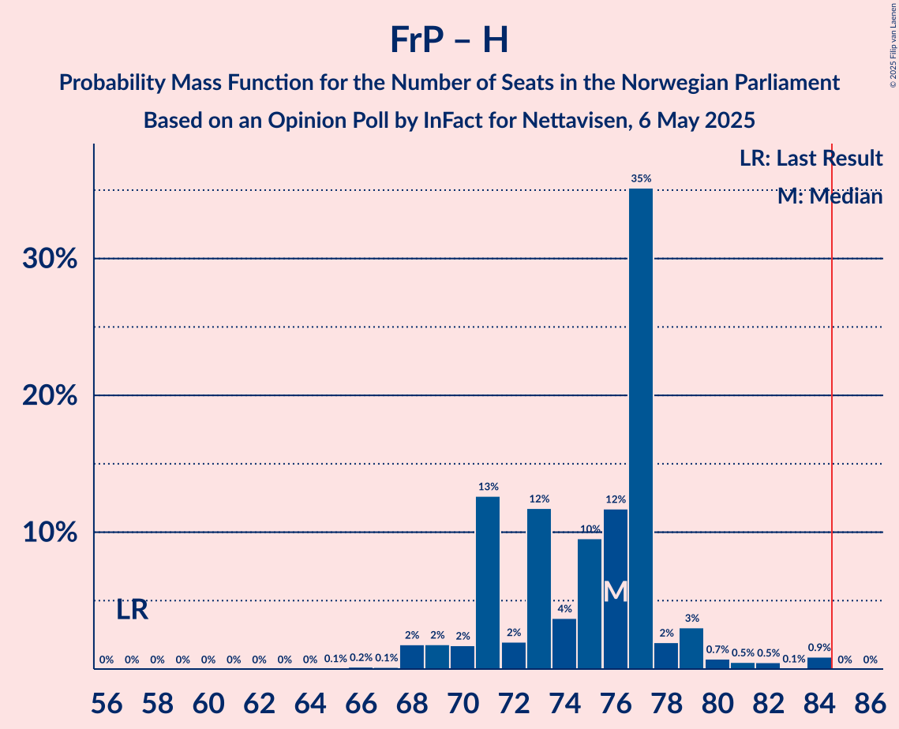

| Number of Seats | Probability | Accumulated | Special Marks |
|:---------------:|:-----------:|:-----------:|:-------------:|
| 57 | 0% | 100% | Last Result |
| 58 | 0% | 100% |  |
| 59 | 0% | 100% |  |
| 60 | 0% | 100% |  |
| 61 | 0% | 100% |  |
| 62 | 0% | 100% |  |
| 63 | 0% | 100% |  |
| 64 | 0% | 100% |  |
| 65 | 0.1% | 100% |  |
| 66 | 0.2% | 99.9% |  |
| 67 | 0.1% | 99.7% |  |
| 68 | 2% | 99.6% |  |
| 69 | 2% | 98% |  |
| 70 | 2% | 96% |  |
| 71 | 13% | 94% |  |
| 72 | 2% | 82% |  |
| 73 | 12% | 80% |  |
| 74 | 4% | 68% |  |
| 75 | 10% | 64% | Median |
| 76 | 12% | 55% |  |
| 77 | 35% | 43% |  |
| 78 | 2% | 8% |  |
| 79 | 3% | 6% |  |
| 80 | 0.7% | 3% |  |
| 81 | 0.5% | 2% |  |
| 82 | 0.5% | 1.5% |  |
| 83 | 0.1% | 1.0% |  |
| 84 | 0.9% | 0.9% |  |
| 85 | 0% | 0% | Majority |

### Arbeiderpartiet – Senterpartiet – Kristelig Folkeparti – Miljøpartiet De Grønne

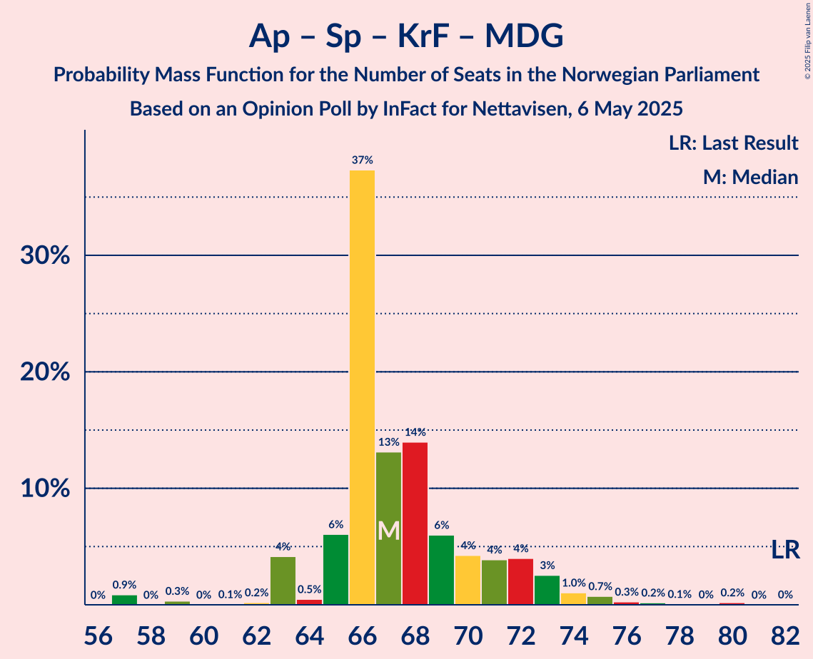

| Number of Seats | Probability | Accumulated | Special Marks |
|:---------------:|:-----------:|:-----------:|:-------------:|
| 57 | 0.9% | 100% |  |
| 58 | 0% | 99.1% |  |
| 59 | 0.3% | 99.1% |  |
| 60 | 0% | 98.8% |  |
| 61 | 0.1% | 98.8% |  |
| 62 | 0.2% | 98.7% |  |
| 63 | 4% | 98.5% |  |
| 64 | 0.5% | 94% |  |
| 65 | 6% | 94% |  |
| 66 | 37% | 88% |  |
| 67 | 13% | 50% | Median |
| 68 | 14% | 37% |  |
| 69 | 6% | 23% |  |
| 70 | 4% | 17% |  |
| 71 | 4% | 13% |  |
| 72 | 4% | 9% |  |
| 73 | 3% | 5% |  |
| 74 | 1.0% | 3% |  |
| 75 | 0.7% | 2% |  |
| 76 | 0.3% | 0.8% |  |
| 77 | 0.2% | 0.6% |  |
| 78 | 0.1% | 0.4% |  |
| 79 | 0% | 0.3% |  |
| 80 | 0.2% | 0.3% |  |
| 81 | 0% | 0% |  |
| 82 | 0% | 0% | Last Result |

### Arbeiderpartiet – Sosialistisk Venstreparti

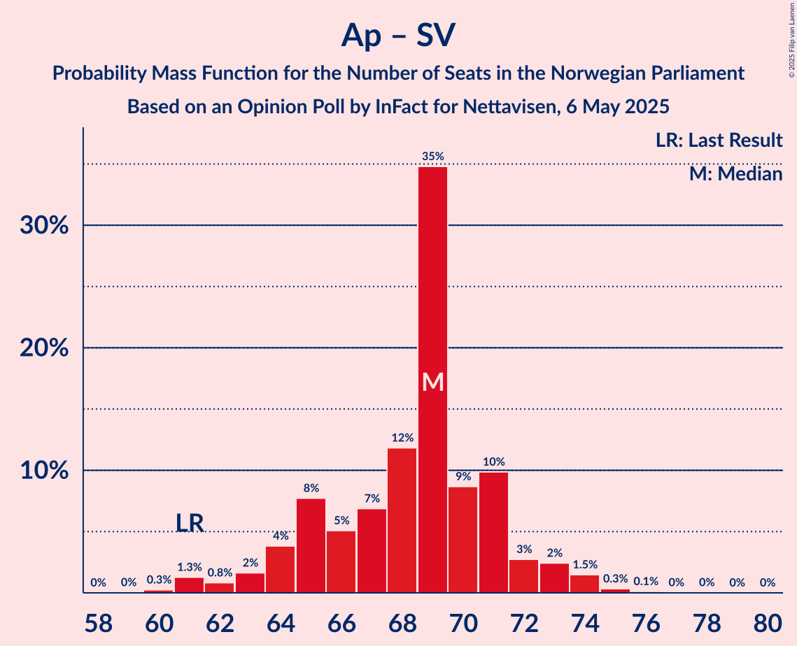

| Number of Seats | Probability | Accumulated | Special Marks |
|:---------------:|:-----------:|:-----------:|:-------------:|
| 59 | 0% | 100% |  |
| 60 | 0.3% | 99.9% |  |
| 61 | 1.3% | 99.7% | Last Result |
| 62 | 0.8% | 98% |  |
| 63 | 2% | 98% |  |
| 64 | 4% | 96% |  |
| 65 | 8% | 92% |  |
| 66 | 5% | 84% |  |
| 67 | 7% | 79% |  |
| 68 | 12% | 72% |  |
| 69 | 35% | 61% | Median |
| 70 | 9% | 26% |  |
| 71 | 10% | 17% |  |
| 72 | 3% | 7% |  |
| 73 | 2% | 4% |  |
| 74 | 1.5% | 2% |  |
| 75 | 0.3% | 0.6% |  |
| 76 | 0.1% | 0.2% |  |
| 77 | 0% | 0.1% |  |
| 78 | 0% | 0.1% |  |
| 79 | 0% | 0% |  |

### Arbeiderpartiet – Senterpartiet – Kristelig Folkeparti

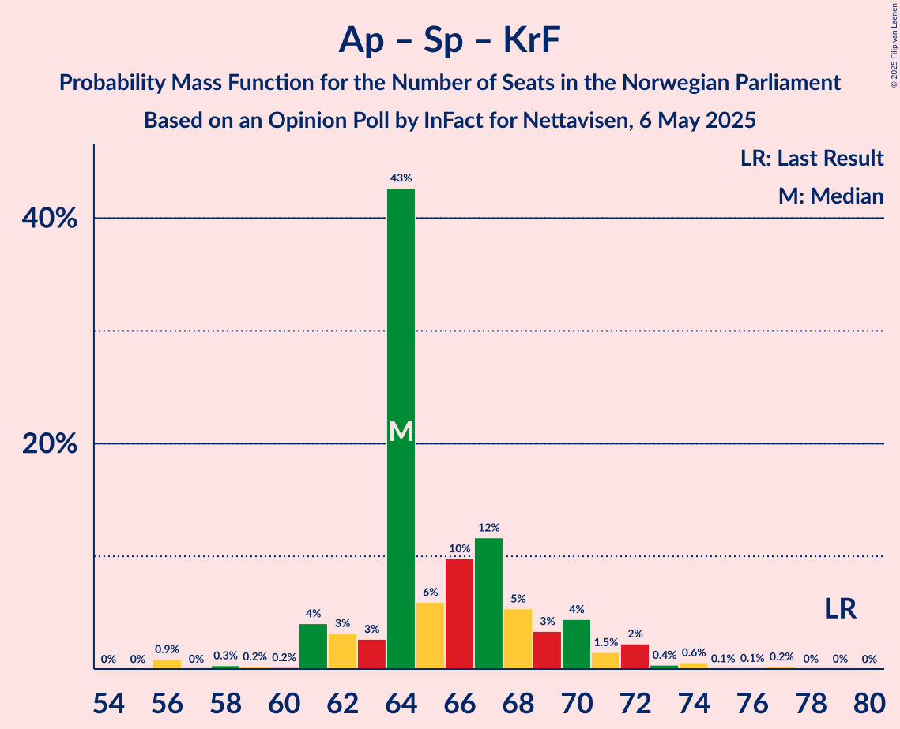

| Number of Seats | Probability | Accumulated | Special Marks |
|:---------------:|:-----------:|:-----------:|:-------------:|
| 56 | 0.9% | 100% |  |
| 57 | 0% | 99.1% |  |
| 58 | 0.3% | 99.1% |  |
| 59 | 0.2% | 98.8% |  |
| 60 | 0.2% | 98.5% |  |
| 61 | 4% | 98% |  |
| 62 | 3% | 94% |  |
| 63 | 3% | 91% |  |
| 64 | 43% | 88% |  |
| 65 | 6% | 46% | Median |
| 66 | 10% | 40% |  |
| 67 | 12% | 30% |  |
| 68 | 5% | 18% |  |
| 69 | 3% | 13% |  |
| 70 | 4% | 10% |  |
| 71 | 1.5% | 5% |  |
| 72 | 2% | 4% |  |
| 73 | 0.4% | 1.4% |  |
| 74 | 0.6% | 1.0% |  |
| 75 | 0.1% | 0.5% |  |
| 76 | 0.1% | 0.4% |  |
| 77 | 0.2% | 0.3% |  |
| 78 | 0% | 0.1% |  |
| 79 | 0% | 0% | Last Result |

### Arbeiderpartiet – Senterpartiet

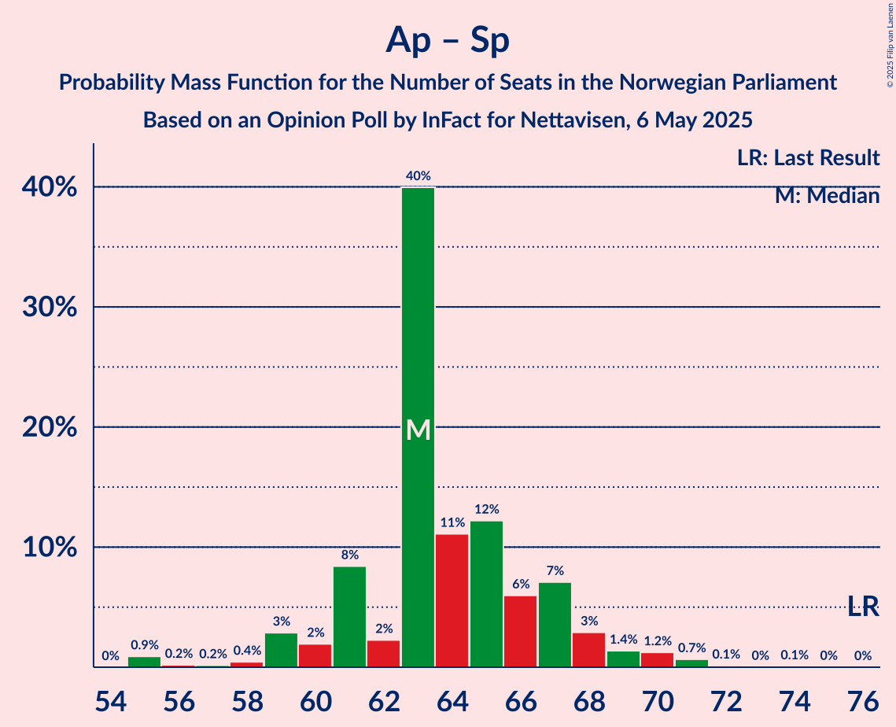

| Number of Seats | Probability | Accumulated | Special Marks |
|:---------------:|:-----------:|:-----------:|:-------------:|
| 55 | 0.9% | 100% |  |
| 56 | 0.2% | 99.1% |  |
| 57 | 0.2% | 98.9% |  |
| 58 | 0.4% | 98.7% |  |
| 59 | 3% | 98% |  |
| 60 | 2% | 95% |  |
| 61 | 8% | 93% |  |
| 62 | 2% | 85% |  |
| 63 | 40% | 83% |  |
| 64 | 11% | 43% | Median |
| 65 | 12% | 32% |  |
| 66 | 6% | 20% |  |
| 67 | 7% | 14% |  |
| 68 | 3% | 6% |  |
| 69 | 1.4% | 4% |  |
| 70 | 1.2% | 2% |  |
| 71 | 0.7% | 0.9% |  |
| 72 | 0.1% | 0.3% |  |
| 73 | 0% | 0.1% |  |
| 74 | 0.1% | 0.1% |  |
| 75 | 0% | 0% |  |
| 76 | 0% | 0% | Last Result |

### Høyre – Kristelig Folkeparti – Venstre

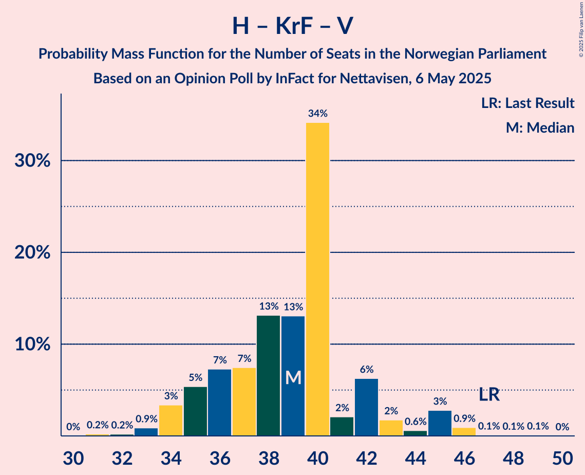

| Number of Seats | Probability | Accumulated | Special Marks |
|:---------------:|:-----------:|:-----------:|:-------------:|
| 31 | 0.2% | 100% |  |
| 32 | 0.2% | 99.7% |  |
| 33 | 0.9% | 99.5% |  |
| 34 | 3% | 98.7% |  |
| 35 | 5% | 95% |  |
| 36 | 7% | 90% |  |
| 37 | 7% | 83% |  |
| 38 | 13% | 75% | Median |
| 39 | 13% | 62% |  |
| 40 | 34% | 49% |  |
| 41 | 2% | 15% |  |
| 42 | 6% | 13% |  |
| 43 | 2% | 6% |  |
| 44 | 0.6% | 5% |  |
| 45 | 3% | 4% |  |
| 46 | 0.9% | 1.2% |  |
| 47 | 0.1% | 0.3% | Last Result |
| 48 | 0.1% | 0.2% |  |
| 49 | 0.1% | 0.1% |  |
| 50 | 0% | 0% |  |

### Senterpartiet – Kristelig Folkeparti – Venstre

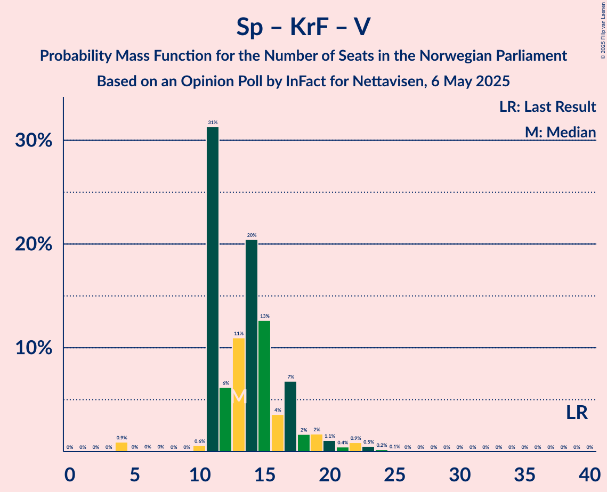

| Number of Seats | Probability | Accumulated | Special Marks |
|:---------------:|:-----------:|:-----------:|:-------------:|
| 4 | 0.9% | 100% |  |
| 5 | 0% | 99.1% |  |
| 6 | 0% | 99.1% |  |
| 7 | 0% | 99.0% |  |
| 8 | 0% | 99.0% |  |
| 9 | 0% | 99.0% |  |
| 10 | 0.6% | 99.0% |  |
| 11 | 31% | 98% |  |
| 12 | 6% | 67% | Median |
| 13 | 11% | 61% |  |
| 14 | 20% | 50% |  |
| 15 | 13% | 30% |  |
| 16 | 4% | 17% |  |
| 17 | 7% | 13% |  |
| 18 | 2% | 7% |  |
| 19 | 2% | 5% |  |
| 20 | 1.1% | 3% |  |
| 21 | 0.4% | 2% |  |
| 22 | 0.9% | 2% |  |
| 23 | 0.5% | 0.8% |  |
| 24 | 0.2% | 0.3% |  |
| 25 | 0.1% | 0.1% |  |
| 26 | 0% | 0% |  |
| 27 | 0% | 0% |  |
| 28 | 0% | 0% |  |
| 29 | 0% | 0% |  |
| 30 | 0% | 0% |  |
| 31 | 0% | 0% |  |
| 32 | 0% | 0% |  |
| 33 | 0% | 0% |  |
| 34 | 0% | 0% |  |
| 35 | 0% | 0% |  |
| 36 | 0% | 0% |  |
| 37 | 0% | 0% |  |
| 38 | 0% | 0% |  |
| 39 | 0% | 0% | Last Result |

## Technical Information

### Opinion Poll

+ **Polling firm:** InFact
+ **Commissioner(s):** Nettavisen
+ **Fieldwork period:** 6 May 2025

### Calculations

+ **Sample size:** 1073
+ **Simulations done:** 2,097,152
+ **Error estimate:** 1.72%

