# Opinion Poll by Norfakta for Klassekampen and Nationen, 6–7 May 2025

<a href="#voting-intentions">Voting Intentions</a> | <a href="#seats">Seats</a> | <a href="#coalitions">Coalitions</a> | <a href="#technical-information">Technical Information</a>

## Voting Intentions

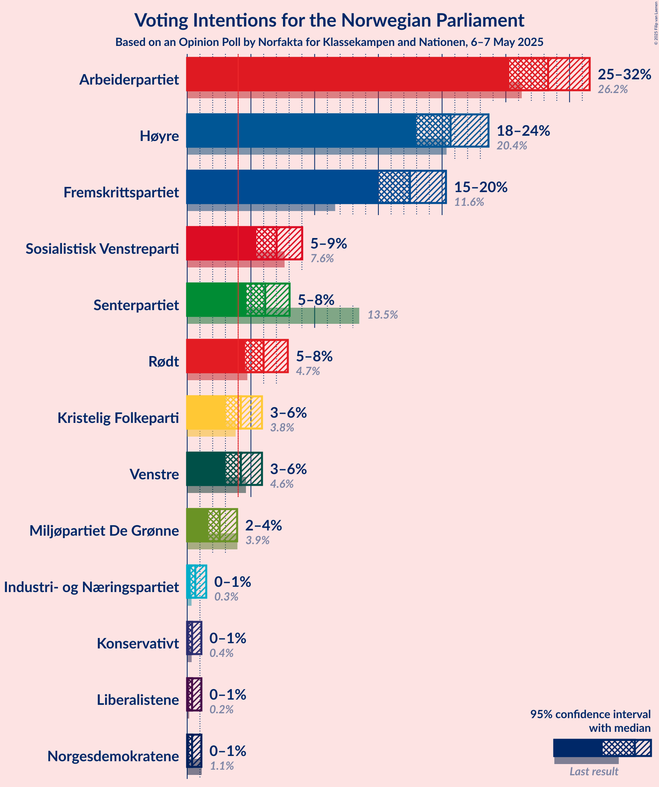

### Confidence Intervals

| Party | Last Result | Poll Result | 80% Confidence Interval | 90% Confidence Interval | 95% Confidence Interval | 99% Confidence Interval |
|:-----:|:-----------:|:-----------:|:-----------------------:|:-----------------------:|:-----------------------:|:-----------------------:|
| Arbeiderpartiet | 26.2% | 28.3% | 26.3–30.5% |25.8–31.0% |25.3–31.6% |24.3–32.6% |
| Høyre | 20.4% | 20.7% | 18.9–22.6% |18.4–23.2% |18.0–23.6% |17.1–24.6% |
| Fremskrittspartiet | 11.6% | 17.5% | 15.8–19.3% |15.4–19.8% |15.0–20.3% |14.2–21.2% |
| Sosialistisk Venstreparti | 7.6% | 7.0% | 6.0–8.3% |5.7–8.7% |5.4–9.0% |5.0–9.7% |
| Senterpartiet | 13.5% | 6.1% | 5.2–7.4% |4.9–7.7% |4.6–8.0% |4.2–8.7% |
| Rødt | 4.7% | 6.0% | 5.0–7.2% |4.8–7.6% |4.5–7.9% |4.1–8.5% |
| Venstre | 4.6% | 4.2% | 3.4–5.3% |3.2–5.6% |3.0–5.9% |2.7–6.4% |
| Kristelig Folkeparti | 3.8% | 4.2% | 3.4–5.3% |3.2–5.6% |3.0–5.9% |2.7–6.4% |
| Miljøpartiet De Grønne | 3.9% | 2.6% | 2.0–3.4% |1.8–3.7% |1.7–3.9% |1.4–4.4% |
| Industri- og Næringspartiet | 0.3% | 0.6% | 0.4–1.2% |0.3–1.3% |0.3–1.5% |0.2–1.8% |
| Liberalistene | 0.2% | 0.4% | 0.2–0.9% |0.2–1.0% |0.1–1.1% |0.1–1.4% |
| Norgesdemokratene | 1.1% | 0.4% | 0.2–0.9% |0.2–1.0% |0.1–1.1% |0.1–1.4% |
| Konservativt | 0.4% | 0.4% | 0.2–0.9% |0.2–1.0% |0.1–1.1% |0.1–1.4% |

*Note:* The poll result column reflects the actual value used in the calculations. Published results may vary slightly, and in addition be rounded to fewer digits.

## Seats

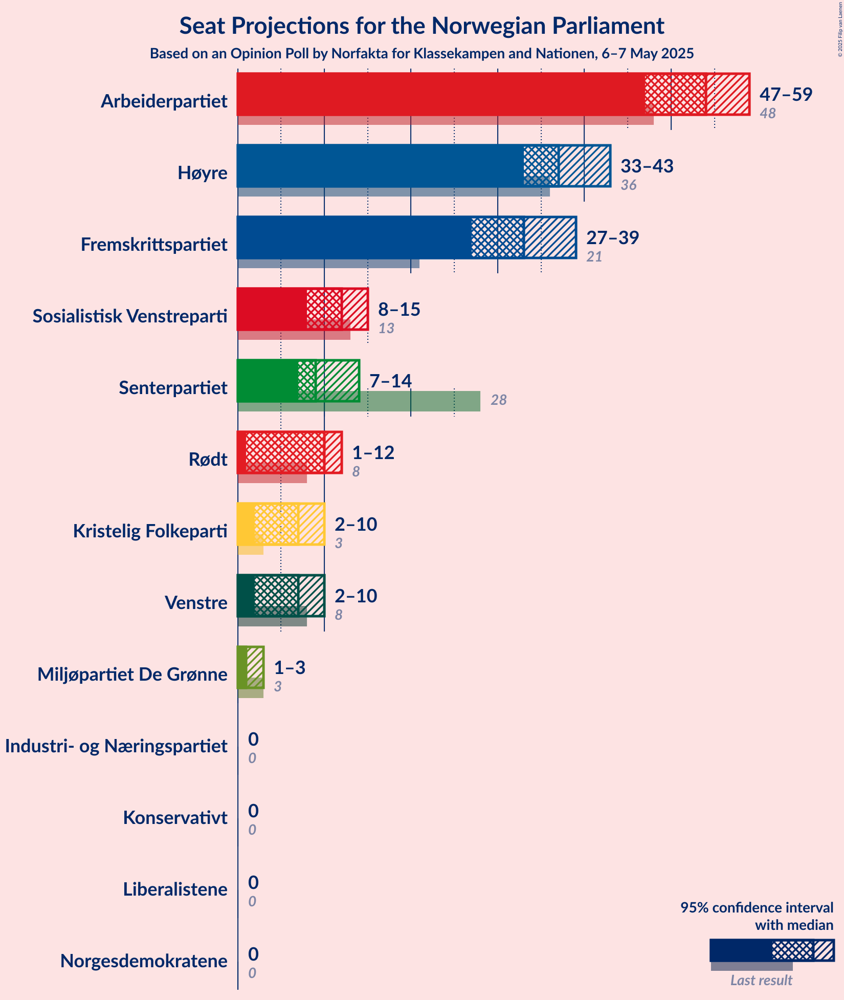

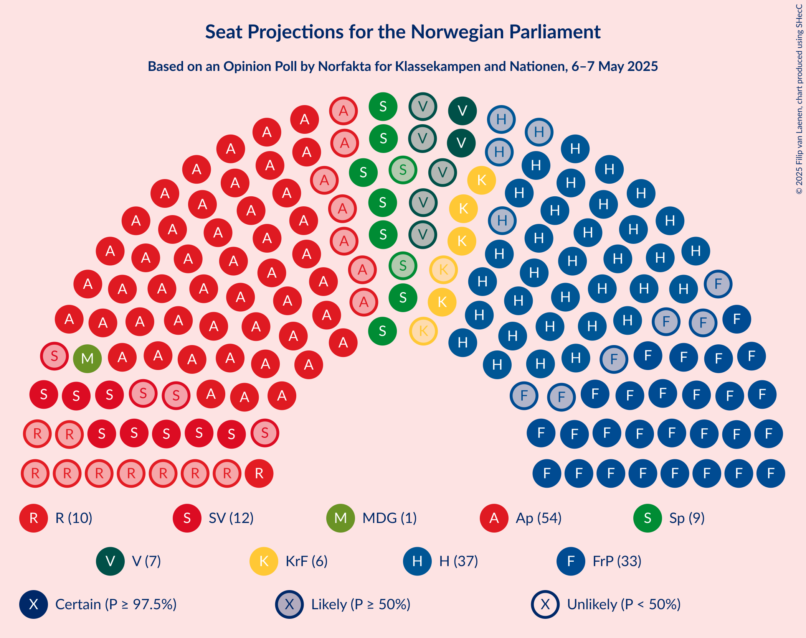

### Confidence Intervals

| Party | Last Result | Median | 80% Confidence Interval | 90% Confidence Interval | 95% Confidence Interval | 99% Confidence Interval |
|:-----:|:-----------:|:------:|:-----------------------:|:-----------------------:|:-----------------------:|:-----------------------:|
| <a href="#arbeiderpartiet">Arbeiderpartiet</a> | 48 | 54 | 50–57 |48–58 |47–59 |46–61 |
| <a href="#høyre">Høyre</a> | 36 | 37 | 33–41 |33–41 |33–43 |31–46 |
| <a href="#fremskrittspartiet">Fremskrittspartiet</a> | 21 | 33 | 28–36 |27–39 |27–39 |25–39 |
| <a href="#sosialistisk-venstreparti">Sosialistisk Venstreparti</a> | 13 | 12 | 8–15 |8–15 |8–15 |8–17 |
| <a href="#senterpartiet">Senterpartiet</a> | 28 | 9 | 8–14 |7–14 |7–14 |7–16 |
| <a href="#rødt">Rødt</a> | 8 | 10 | 8–11 |7–12 |1–12 |1–14 |
| <a href="#venstre">Venstre</a> | 8 | 7 | 2–9 |2–9 |2–10 |2–10 |
| <a href="#kristelig-folkeparti">Kristelig Folkeparti</a> | 3 | 7 | 3–8 |3–9 |2–10 |1–10 |
| <a href="#miljøpartiet-de-grønne">Miljøpartiet De Grønne</a> | 3 | 1 | 1–3 |1–3 |1–3 |0–8 |
| <a href="#industri--og-næringspartiet">Industri- og Næringspartiet</a> | 0 | 0 | 0 |0 |0 |0 |
| <a href="#liberalistene">Liberalistene</a> | 0 | 0 | 0 |0 |0 |0 |
| <a href="#norgesdemokratene">Norgesdemokratene</a> | 0 | 0 | 0 |0 |0 |0 |
| <a href="#konservativt">Konservativt</a> | 0 | 0 | 0 |0 |0 |0 |

### Arbeiderpartiet

*For a full overview of the results for this party, see the [Arbeiderpartiet](party-arbeiderpartiet.html) page.*

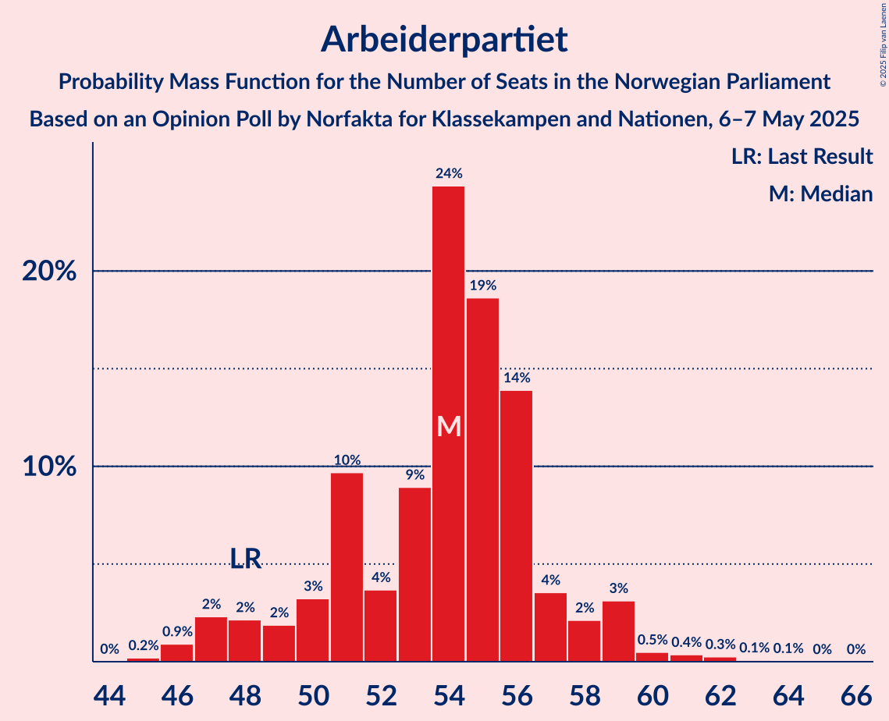

| Number of Seats | Probability | Accumulated | Special Marks |
|:---------------:|:-----------:|:-----------:|:-------------:|
| 45 | 0.2% | 100% |  |
| 46 | 0.9% | 99.8% |  |
| 47 | 2% | 98.9% |  |
| 48 | 2% | 97% | Last Result |
| 49 | 2% | 94% |  |
| 50 | 3% | 93% |  |
| 51 | 10% | 89% |  |
| 52 | 4% | 80% |  |
| 53 | 9% | 76% |  |
| 54 | 24% | 67% | Median |
| 55 | 19% | 43% |  |
| 56 | 14% | 24% |  |
| 57 | 4% | 10% |  |
| 58 | 2% | 7% |  |
| 59 | 3% | 4% |  |
| 60 | 0.5% | 1.3% |  |
| 61 | 0.4% | 0.8% |  |
| 62 | 0.3% | 0.4% |  |
| 63 | 0.1% | 0.1% |  |
| 64 | 0.1% | 0.1% |  |
| 65 | 0% | 0% |  |

### Høyre

*For a full overview of the results for this party, see the [Høyre](party-høyre.html) page.*

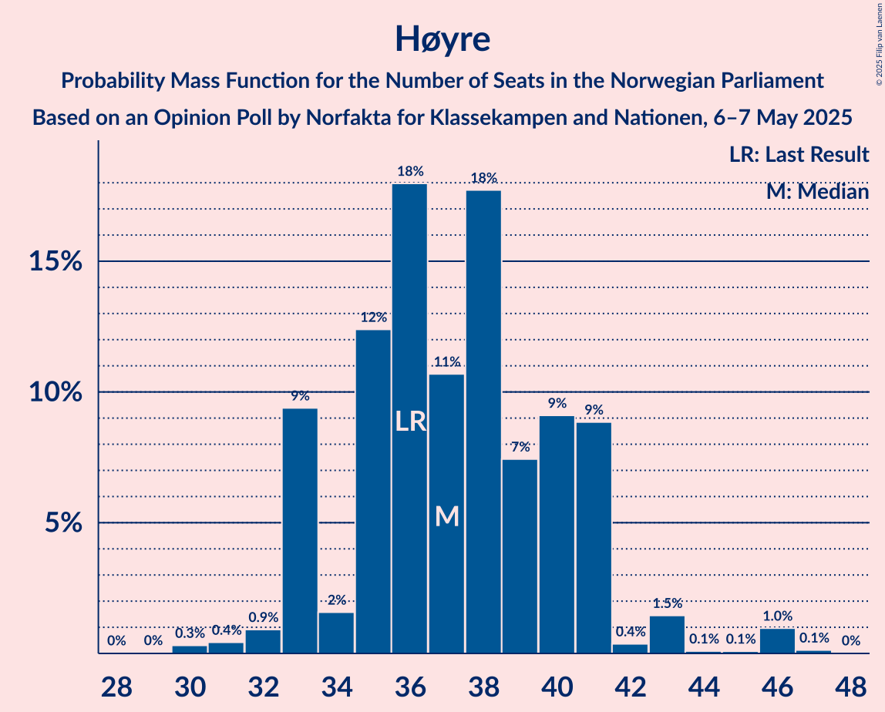

| Number of Seats | Probability | Accumulated | Special Marks |
|:---------------:|:-----------:|:-----------:|:-------------:|
| 28 | 0% | 100% |  |
| 29 | 0% | 99.9% |  |
| 30 | 0.3% | 99.9% |  |
| 31 | 0.4% | 99.6% |  |
| 32 | 0.9% | 99.2% |  |
| 33 | 9% | 98% |  |
| 34 | 2% | 89% |  |
| 35 | 12% | 87% |  |
| 36 | 18% | 75% | Last Result |
| 37 | 11% | 57% | Median |
| 38 | 18% | 46% |  |
| 39 | 7% | 29% |  |
| 40 | 9% | 21% |  |
| 41 | 9% | 12% |  |
| 42 | 0.4% | 3% |  |
| 43 | 1.5% | 3% |  |
| 44 | 0.1% | 1.3% |  |
| 45 | 0.1% | 1.2% |  |
| 46 | 1.0% | 1.1% |  |
| 47 | 0.1% | 0.2% |  |
| 48 | 0% | 0% |  |

### Fremskrittspartiet

*For a full overview of the results for this party, see the [Fremskrittspartiet](party-fremskrittspartiet.html) page.*

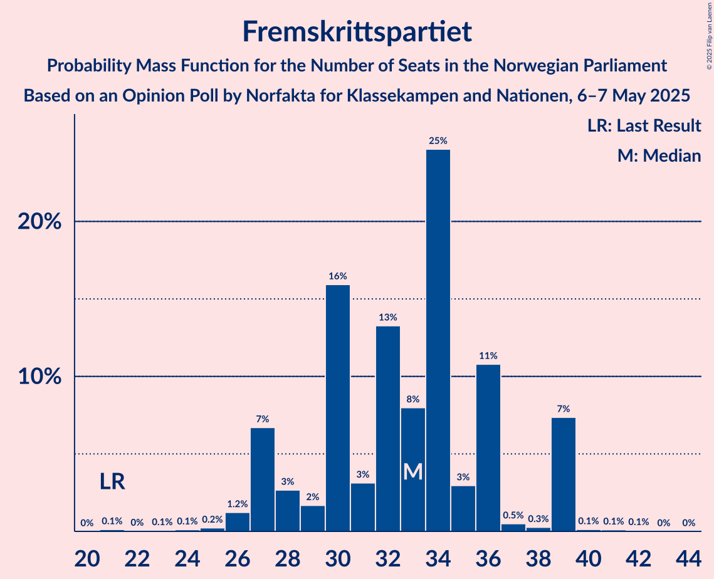

| Number of Seats | Probability | Accumulated | Special Marks |
|:---------------:|:-----------:|:-----------:|:-------------:|
| 21 | 0.1% | 100% | Last Result |
| 22 | 0% | 99.9% |  |
| 23 | 0.1% | 99.8% |  |
| 24 | 0.1% | 99.8% |  |
| 25 | 0.2% | 99.7% |  |
| 26 | 1.2% | 99.4% |  |
| 27 | 7% | 98% |  |
| 28 | 3% | 92% |  |
| 29 | 2% | 89% |  |
| 30 | 16% | 87% |  |
| 31 | 3% | 71% |  |
| 32 | 13% | 68% |  |
| 33 | 8% | 55% | Median |
| 34 | 25% | 47% |  |
| 35 | 3% | 22% |  |
| 36 | 11% | 19% |  |
| 37 | 0.5% | 8% |  |
| 38 | 0.3% | 8% |  |
| 39 | 7% | 8% |  |
| 40 | 0.1% | 0.3% |  |
| 41 | 0.1% | 0.2% |  |
| 42 | 0.1% | 0.1% |  |
| 43 | 0% | 0% |  |

### Sosialistisk Venstreparti

*For a full overview of the results for this party, see the [Sosialistisk Venstreparti](party-sosialistiskvenstreparti.html) page.*

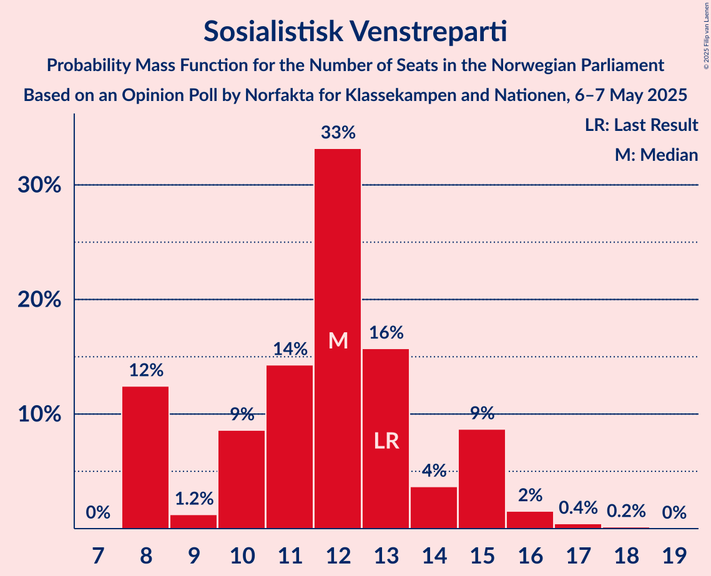

| Number of Seats | Probability | Accumulated | Special Marks |
|:---------------:|:-----------:|:-----------:|:-------------:|
| 8 | 12% | 100% |  |
| 9 | 1.2% | 88% |  |
| 10 | 9% | 86% |  |
| 11 | 14% | 78% |  |
| 12 | 33% | 63% | Median |
| 13 | 16% | 30% | Last Result |
| 14 | 4% | 15% |  |
| 15 | 9% | 11% |  |
| 16 | 2% | 2% |  |
| 17 | 0.4% | 0.6% |  |
| 18 | 0.2% | 0.2% |  |
| 19 | 0% | 0% |  |

### Senterpartiet

*For a full overview of the results for this party, see the [Senterpartiet](party-senterpartiet.html) page.*

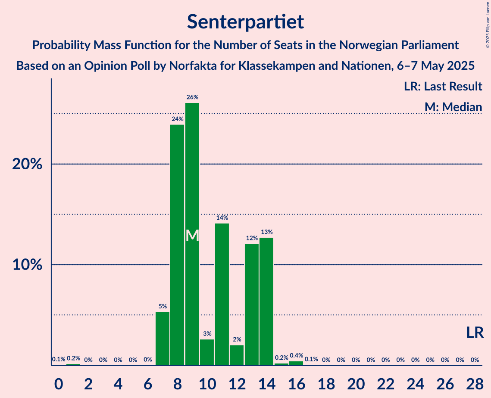

| Number of Seats | Probability | Accumulated | Special Marks |
|:---------------:|:-----------:|:-----------:|:-------------:|
| 0 | 0.1% | 100% |  |
| 1 | 0.2% | 99.9% |  |
| 2 | 0% | 99.8% |  |
| 3 | 0% | 99.8% |  |
| 4 | 0% | 99.8% |  |
| 5 | 0% | 99.8% |  |
| 6 | 0% | 99.8% |  |
| 7 | 5% | 99.7% |  |
| 8 | 24% | 94% |  |
| 9 | 26% | 70% | Median |
| 10 | 3% | 44% |  |
| 11 | 14% | 42% |  |
| 12 | 2% | 28% |  |
| 13 | 12% | 26% |  |
| 14 | 13% | 13% |  |
| 15 | 0.2% | 0.7% |  |
| 16 | 0.4% | 0.5% |  |
| 17 | 0.1% | 0.1% |  |
| 18 | 0% | 0% |  |
| 19 | 0% | 0% |  |
| 20 | 0% | 0% |  |
| 21 | 0% | 0% |  |
| 22 | 0% | 0% |  |
| 23 | 0% | 0% |  |
| 24 | 0% | 0% |  |
| 25 | 0% | 0% |  |
| 26 | 0% | 0% |  |
| 27 | 0% | 0% |  |
| 28 | 0% | 0% | Last Result |

### Rødt

*For a full overview of the results for this party, see the [Rødt](party-rødt.html) page.*

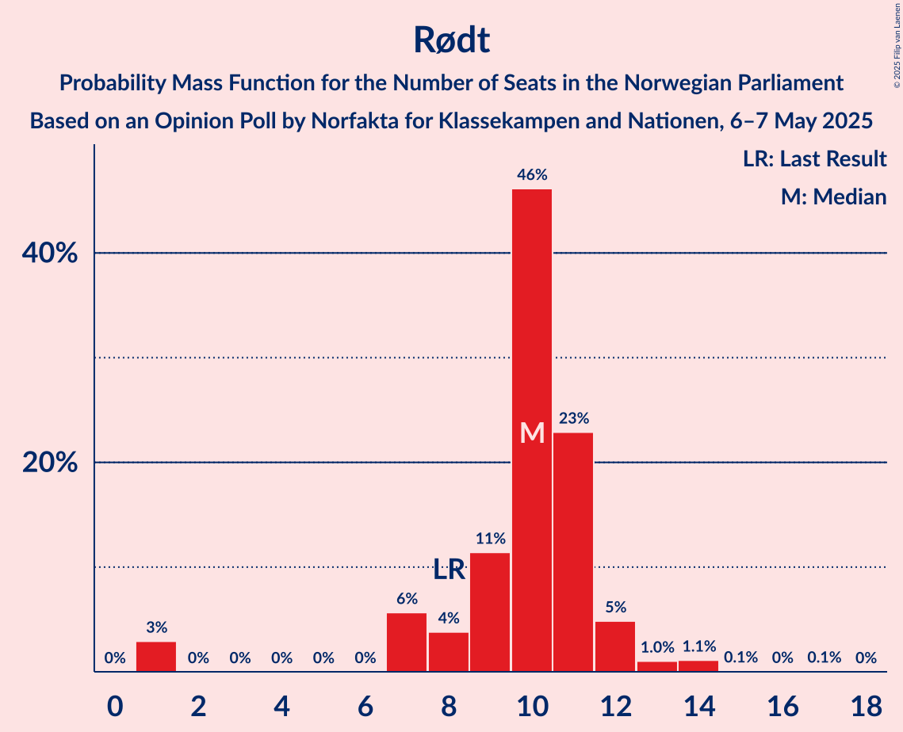

| Number of Seats | Probability | Accumulated | Special Marks |
|:---------------:|:-----------:|:-----------:|:-------------:|
| 1 | 3% | 100% |  |
| 2 | 0% | 97% |  |
| 3 | 0% | 97% |  |
| 4 | 0% | 97% |  |
| 5 | 0% | 97% |  |
| 6 | 0% | 97% |  |
| 7 | 6% | 97% |  |
| 8 | 4% | 91% | Last Result |
| 9 | 11% | 88% |  |
| 10 | 46% | 76% | Median |
| 11 | 23% | 30% |  |
| 12 | 5% | 7% |  |
| 13 | 1.0% | 2% |  |
| 14 | 1.1% | 1.3% |  |
| 15 | 0.1% | 0.2% |  |
| 16 | 0% | 0.1% |  |
| 17 | 0.1% | 0.1% |  |
| 18 | 0% | 0% |  |

### Venstre

*For a full overview of the results for this party, see the [Venstre](party-venstre.html) page.*

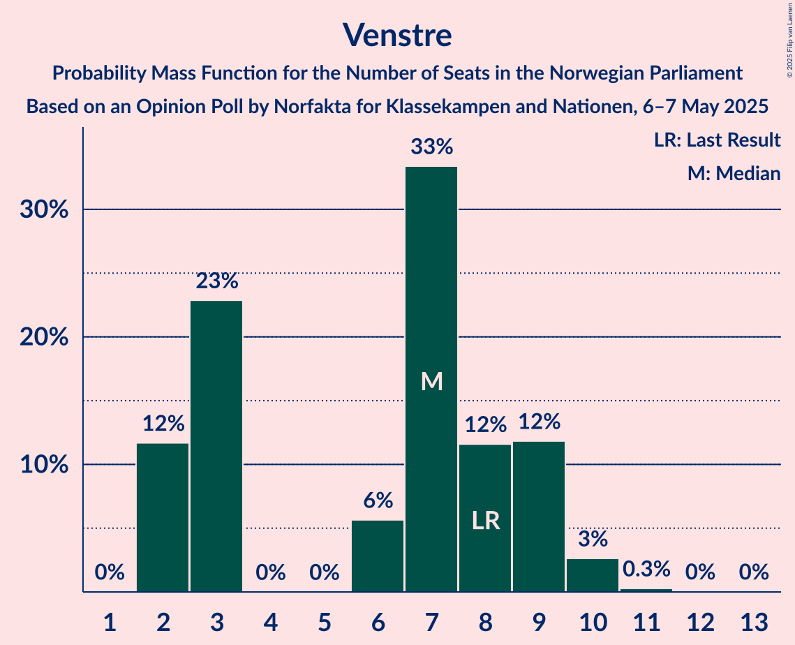

| Number of Seats | Probability | Accumulated | Special Marks |
|:---------------:|:-----------:|:-----------:|:-------------:|
| 2 | 12% | 100% |  |
| 3 | 23% | 88% |  |
| 4 | 0% | 65% |  |
| 5 | 0% | 65% |  |
| 6 | 6% | 65% |  |
| 7 | 33% | 60% | Median |
| 8 | 12% | 26% | Last Result |
| 9 | 12% | 15% |  |
| 10 | 3% | 3% |  |
| 11 | 0.3% | 0.3% |  |
| 12 | 0% | 0.1% |  |
| 13 | 0% | 0% |  |

### Kristelig Folkeparti

*For a full overview of the results for this party, see the [Kristelig Folkeparti](party-kristeligfolkeparti.html) page.*

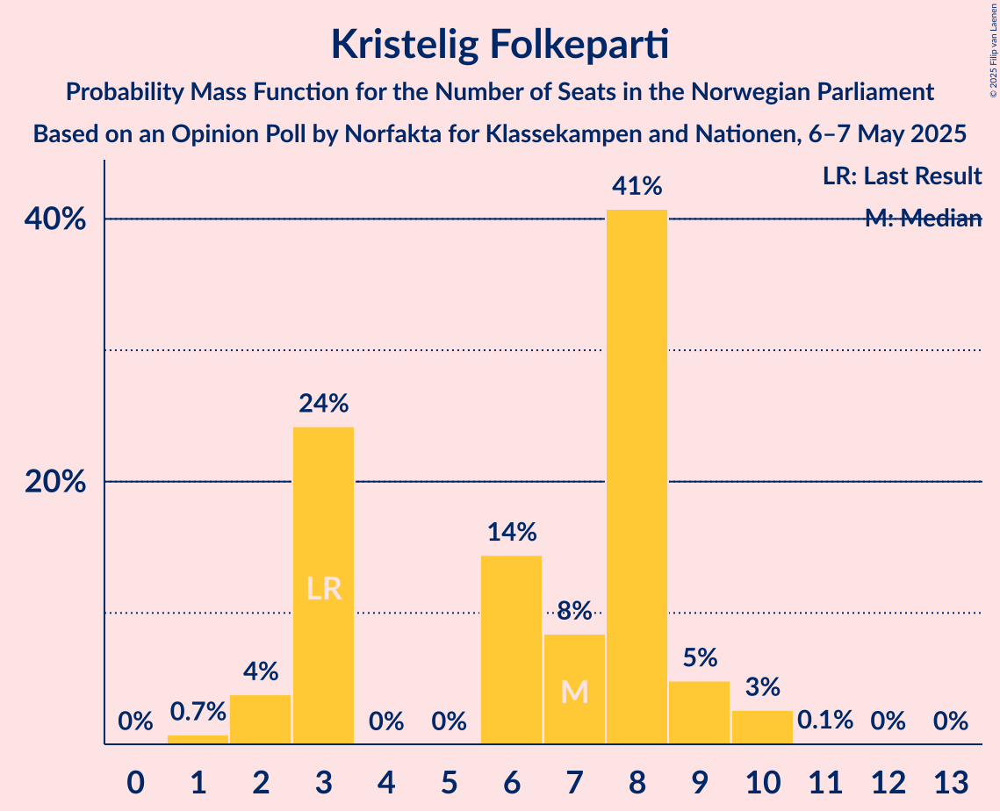

| Number of Seats | Probability | Accumulated | Special Marks |
|:---------------:|:-----------:|:-----------:|:-------------:|
| 1 | 0.7% | 100% |  |
| 2 | 4% | 99.2% |  |
| 3 | 24% | 95% | Last Result |
| 4 | 0% | 71% |  |
| 5 | 0% | 71% |  |
| 6 | 14% | 71% |  |
| 7 | 8% | 57% | Median |
| 8 | 41% | 48% |  |
| 9 | 5% | 8% |  |
| 10 | 3% | 3% |  |
| 11 | 0.1% | 0.2% |  |
| 12 | 0% | 0.1% |  |
| 13 | 0% | 0% |  |

### Miljøpartiet De Grønne

*For a full overview of the results for this party, see the [Miljøpartiet De Grønne](party-miljøpartietdegrønne.html) page.*

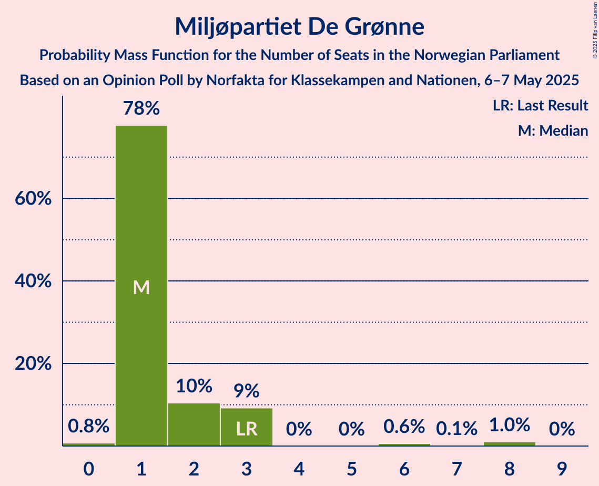

| Number of Seats | Probability | Accumulated | Special Marks |
|:---------------:|:-----------:|:-----------:|:-------------:|
| 0 | 0.8% | 100% |  |
| 1 | 78% | 99.2% | Median |
| 2 | 10% | 22% |  |
| 3 | 9% | 11% | Last Result |
| 4 | 0% | 2% |  |
| 5 | 0% | 2% |  |
| 6 | 0.6% | 2% |  |
| 7 | 0.1% | 1.2% |  |
| 8 | 1.0% | 1.1% |  |
| 9 | 0% | 0% |  |

### Industri- og Næringspartiet

*For a full overview of the results for this party, see the [Industri- og Næringspartiet](party-industri-ognæringspartiet.html) page.*

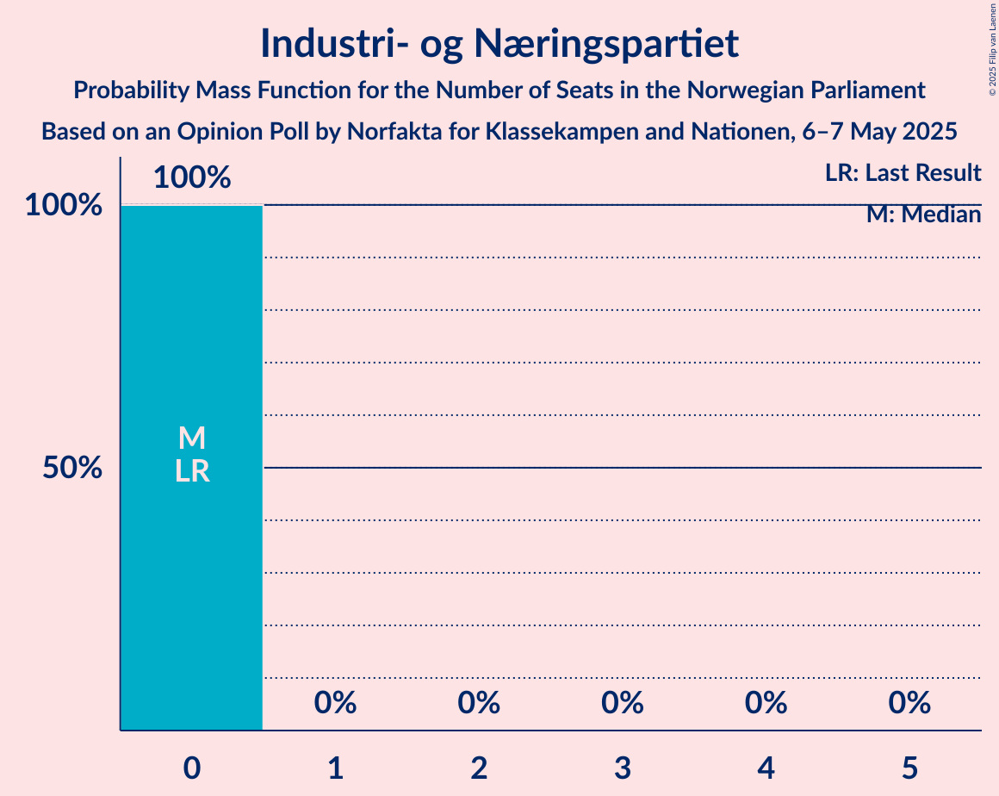

| Number of Seats | Probability | Accumulated | Special Marks |
|:---------------:|:-----------:|:-----------:|:-------------:|
| 0 | 100% | 100% | Last Result, Median |

### Liberalistene

*For a full overview of the results for this party, see the [Liberalistene](party-liberalistene.html) page.*

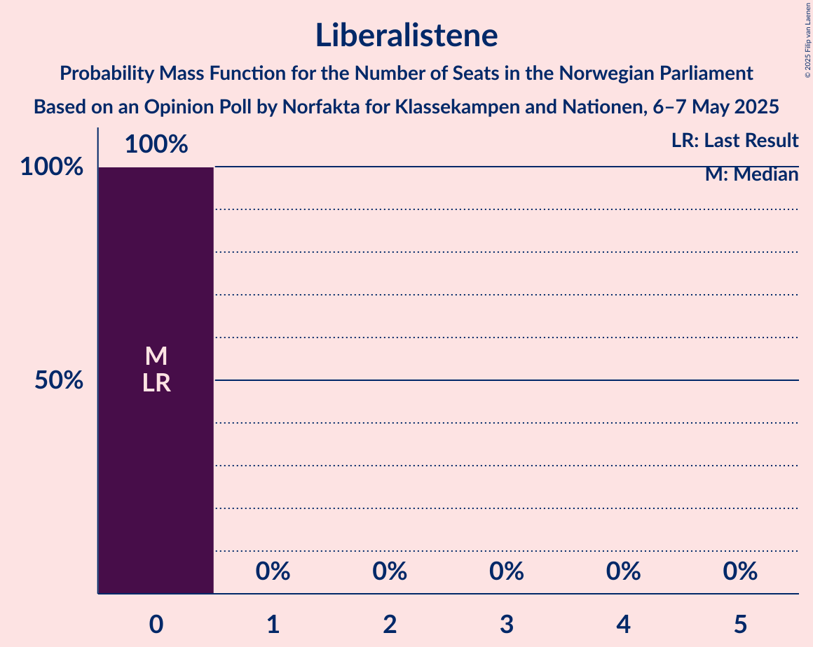

| Number of Seats | Probability | Accumulated | Special Marks |
|:---------------:|:-----------:|:-----------:|:-------------:|
| 0 | 100% | 100% | Last Result, Median |

### Norgesdemokratene

*For a full overview of the results for this party, see the [Norgesdemokratene](party-norgesdemokratene.html) page.*

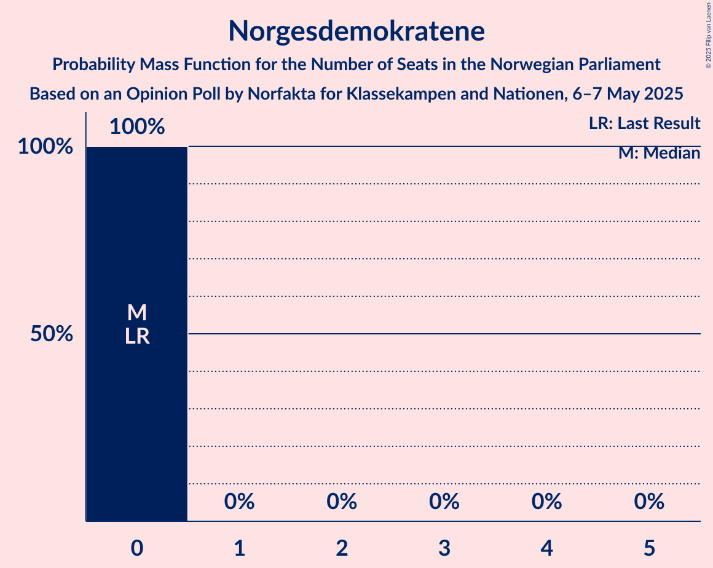

| Number of Seats | Probability | Accumulated | Special Marks |
|:---------------:|:-----------:|:-----------:|:-------------:|
| 0 | 100% | 100% | Last Result, Median |

### Konservativt

*For a full overview of the results for this party, see the [Konservativt](party-konservativt.html) page.*

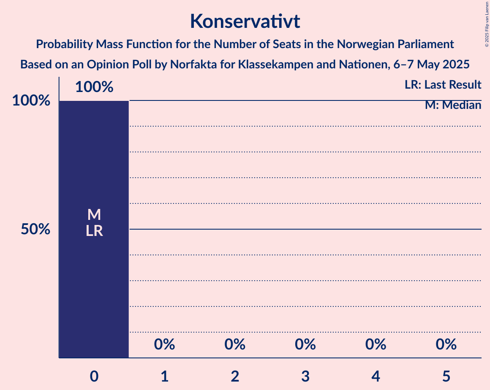

| Number of Seats | Probability | Accumulated | Special Marks |
|:---------------:|:-----------:|:-----------:|:-------------:|
| 0 | 100% | 100% | Last Result, Median |

## Coalitions

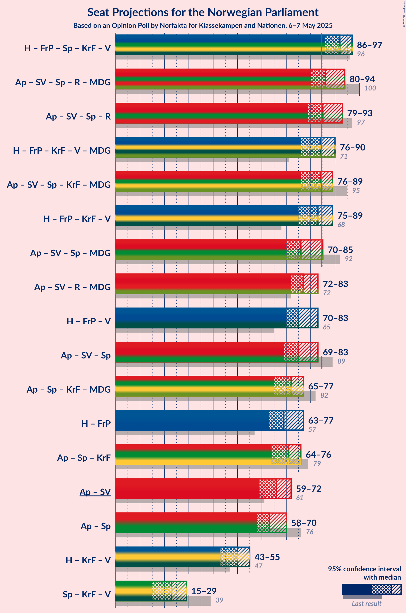

### Confidence Intervals

| Coalition | Last Result | Median | Majority? | 80% Confidence Interval | 90% Confidence Interval | 95% Confidence Interval | 99% Confidence Interval |
|:---------:|:-----------:|:------:|:---------:|:-----------------------:|:-----------------------:|:-----------------------:|:-----------------------:|
| Høyre – Fremskrittspartiet – Senterpartiet – Kristelig Folkeparti – Venstre | 96 | 92 | 98.8% | 87–96 | 87–97 | 86–97 | 83–100 |
| Arbeiderpartiet – Sosialistisk Venstreparti – Senterpartiet – Rødt – Miljøpartiet De Grønne | 100 | 86 | 75% | 81–92 | 80–92 | 80–94 | 78–97 |
| Arbeiderpartiet – Sosialistisk Venstreparti – Senterpartiet – Rødt | 97 | 85 | 60% | 80–91 | 79–91 | 79–93 | 77–96 |
| Høyre – Fremskrittspartiet – Kristelig Folkeparti – Venstre – Miljøpartiet De Grønne | 71 | 84 | 40% | 78–89 | 78–90 | 76–90 | 73–92 |
| Arbeiderpartiet – Sosialistisk Venstreparti – Senterpartiet – Kristelig Folkeparti – Miljøpartiet De Grønne | 95 | 84 | 29% | 80–89 | 76–89 | 76–89 | 75–92 |
| Høyre – Fremskrittspartiet – Kristelig Folkeparti – Venstre | 68 | 83 | 25% | 77–88 | 77–89 | 75–89 | 72–91 |
| Arbeiderpartiet – Sosialistisk Venstreparti – Senterpartiet – Miljøpartiet De Grønne | 92 | 76 | 6% | 72–82 | 70–85 | 70–85 | 69–85 |
| Arbeiderpartiet – Sosialistisk Venstreparti – Rødt – Miljøpartiet De Grønne | 72 | 77 | 1.2% | 73–82 | 72–82 | 72–83 | 69–86 |
| Høyre – Fremskrittspartiet – Venstre | 65 | 75 | 0.6% | 71–81 | 71–83 | 70–83 | 66–85 |
| Arbeiderpartiet – Sosialistisk Venstreparti – Senterpartiet | 89 | 75 | 0.2% | 71–80 | 69–83 | 69–83 | 68–84 |
| Arbeiderpartiet – Senterpartiet – Kristelig Folkeparti – Miljøpartiet De Grønne | 82 | 72 | 0% | 67–77 | 65–77 | 65–77 | 63–80 |
| Høyre – Fremskrittspartiet | 57 | 69 | 0% | 66–75 | 65–77 | 63–77 | 59–78 |
| Arbeiderpartiet – Senterpartiet – Kristelig Folkeparti | 79 | 71 | 0% | 66–74 | 64–75 | 64–76 | 61–78 |
| Arbeiderpartiet – Sosialistisk Venstreparti | 61 | 66 | 0% | 61–70 | 61–70 | 59–72 | 58–73 |
| Arbeiderpartiet – Senterpartiet | 76 | 63 | 0% | 59–68 | 58–70 | 58–70 | 56–71 |
| Høyre – Kristelig Folkeparti – Venstre | 47 | 50 | 0% | 44–53 | 43–55 | 43–55 | 41–60 |
| Senterpartiet – Kristelig Folkeparti – Venstre | 39 | 23 | 0% | 17–26 | 15–29 | 15–29 | 15–29 |

### Høyre – Fremskrittspartiet – Senterpartiet – Kristelig Folkeparti – Venstre

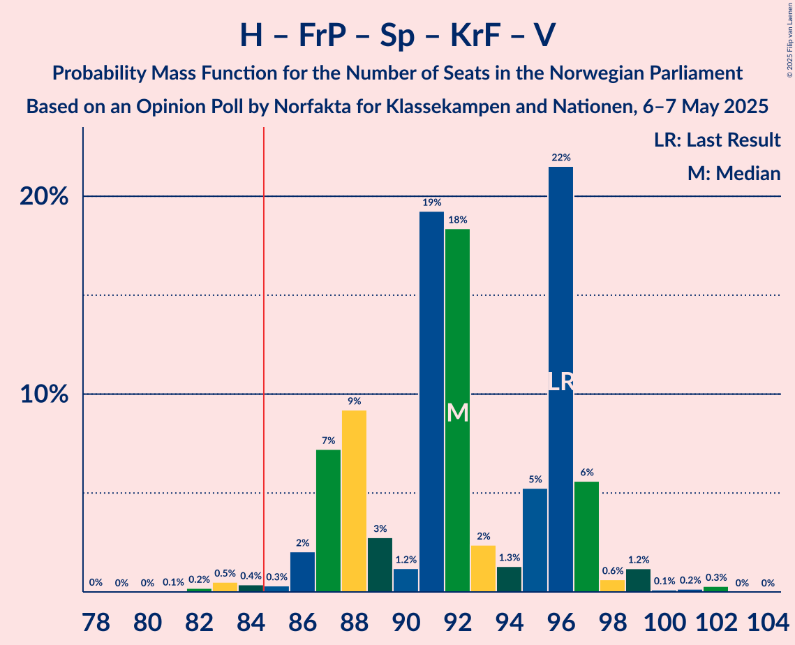

| Number of Seats | Probability | Accumulated | Special Marks |
|:---------------:|:-----------:|:-----------:|:-------------:|
| 79 | 0% | 100% |  |
| 80 | 0% | 99.9% |  |
| 81 | 0.1% | 99.9% |  |
| 82 | 0.2% | 99.9% |  |
| 83 | 0.5% | 99.7% |  |
| 84 | 0.4% | 99.2% |  |
| 85 | 0.3% | 98.8% | Majority |
| 86 | 2% | 98% |  |
| 87 | 7% | 96% |  |
| 88 | 9% | 89% |  |
| 89 | 3% | 80% |  |
| 90 | 1.2% | 77% |  |
| 91 | 19% | 76% |  |
| 92 | 18% | 57% |  |
| 93 | 2% | 38% | Median |
| 94 | 1.3% | 36% |  |
| 95 | 5% | 35% |  |
| 96 | 22% | 30% | Last Result |
| 97 | 6% | 8% |  |
| 98 | 0.6% | 2% |  |
| 99 | 1.2% | 2% |  |
| 100 | 0.1% | 0.6% |  |
| 101 | 0.2% | 0.5% |  |
| 102 | 0.3% | 0.3% |  |
| 103 | 0% | 0% |  |

### Arbeiderpartiet – Sosialistisk Venstreparti – Senterpartiet – Rødt – Miljøpartiet De Grønne

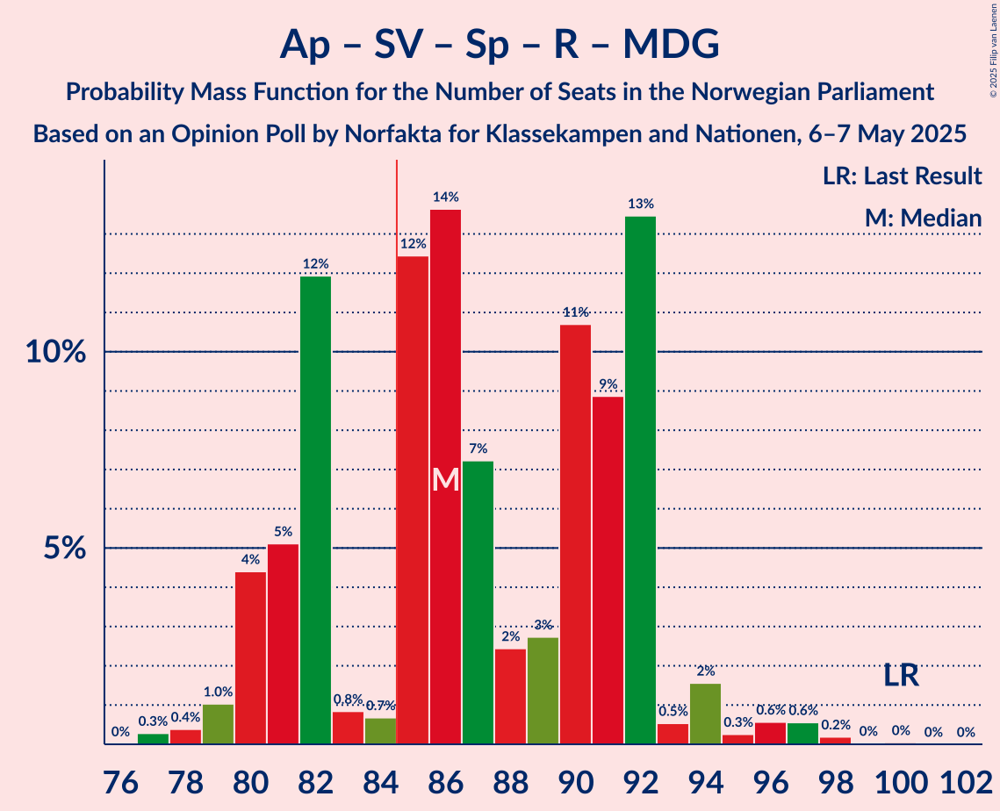

| Number of Seats | Probability | Accumulated | Special Marks |
|:---------------:|:-----------:|:-----------:|:-------------:|
| 77 | 0.3% | 100% |  |
| 78 | 0.4% | 99.7% |  |
| 79 | 1.0% | 99.3% |  |
| 80 | 4% | 98% |  |
| 81 | 5% | 94% |  |
| 82 | 12% | 89% |  |
| 83 | 0.8% | 77% |  |
| 84 | 0.7% | 76% |  |
| 85 | 12% | 75% | Majority |
| 86 | 14% | 63% | Median |
| 87 | 7% | 49% |  |
| 88 | 2% | 42% |  |
| 89 | 3% | 40% |  |
| 90 | 11% | 37% |  |
| 91 | 9% | 26% |  |
| 92 | 13% | 17% |  |
| 93 | 0.5% | 4% |  |
| 94 | 2% | 3% |  |
| 95 | 0.3% | 2% |  |
| 96 | 0.6% | 1.4% |  |
| 97 | 0.6% | 0.8% |  |
| 98 | 0.2% | 0.3% |  |
| 99 | 0% | 0.1% |  |
| 100 | 0% | 0.1% | Last Result |
| 101 | 0% | 0% |  |

### Arbeiderpartiet – Sosialistisk Venstreparti – Senterpartiet – Rødt

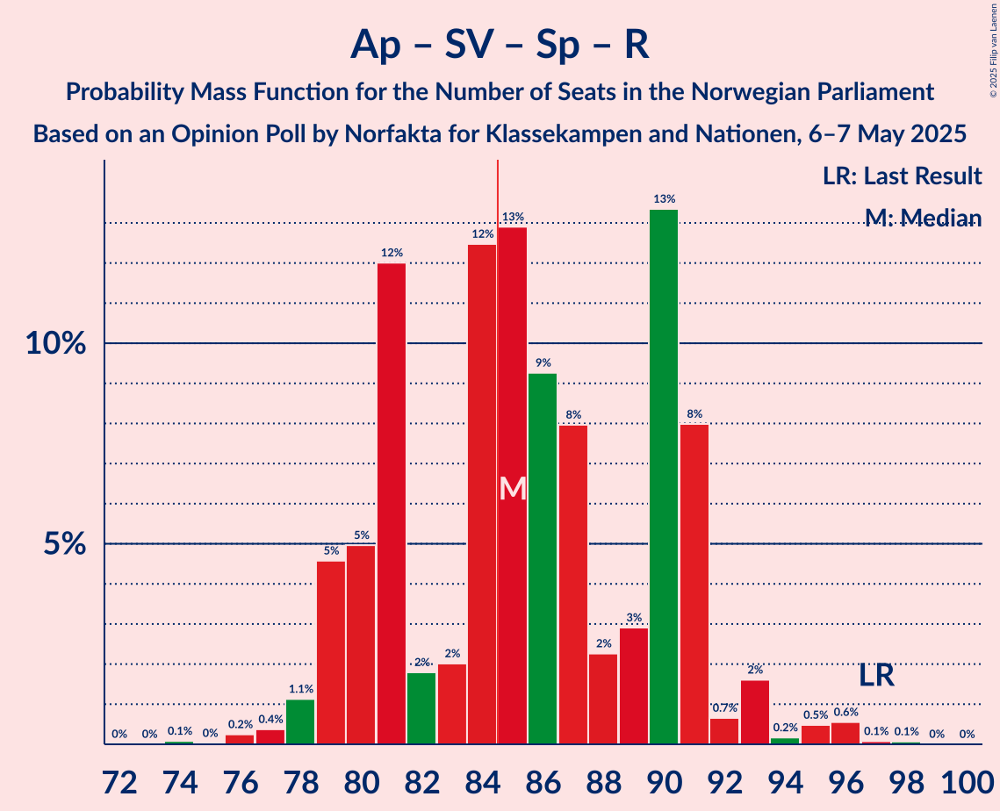

| Number of Seats | Probability | Accumulated | Special Marks |
|:---------------:|:-----------:|:-----------:|:-------------:|
| 74 | 0.1% | 100% |  |
| 75 | 0% | 99.9% |  |
| 76 | 0.2% | 99.9% |  |
| 77 | 0.4% | 99.6% |  |
| 78 | 1.1% | 99.2% |  |
| 79 | 5% | 98% |  |
| 80 | 5% | 94% |  |
| 81 | 12% | 89% |  |
| 82 | 2% | 77% |  |
| 83 | 2% | 75% |  |
| 84 | 12% | 73% |  |
| 85 | 13% | 60% | Median, Majority |
| 86 | 9% | 47% |  |
| 87 | 8% | 38% |  |
| 88 | 2% | 30% |  |
| 89 | 3% | 28% |  |
| 90 | 13% | 25% |  |
| 91 | 8% | 12% |  |
| 92 | 0.7% | 4% |  |
| 93 | 2% | 3% |  |
| 94 | 0.2% | 1.4% |  |
| 95 | 0.5% | 1.2% |  |
| 96 | 0.6% | 0.7% |  |
| 97 | 0.1% | 0.2% | Last Result |
| 98 | 0.1% | 0.1% |  |
| 99 | 0% | 0% |  |

### Høyre – Fremskrittspartiet – Kristelig Folkeparti – Venstre – Miljøpartiet De Grønne

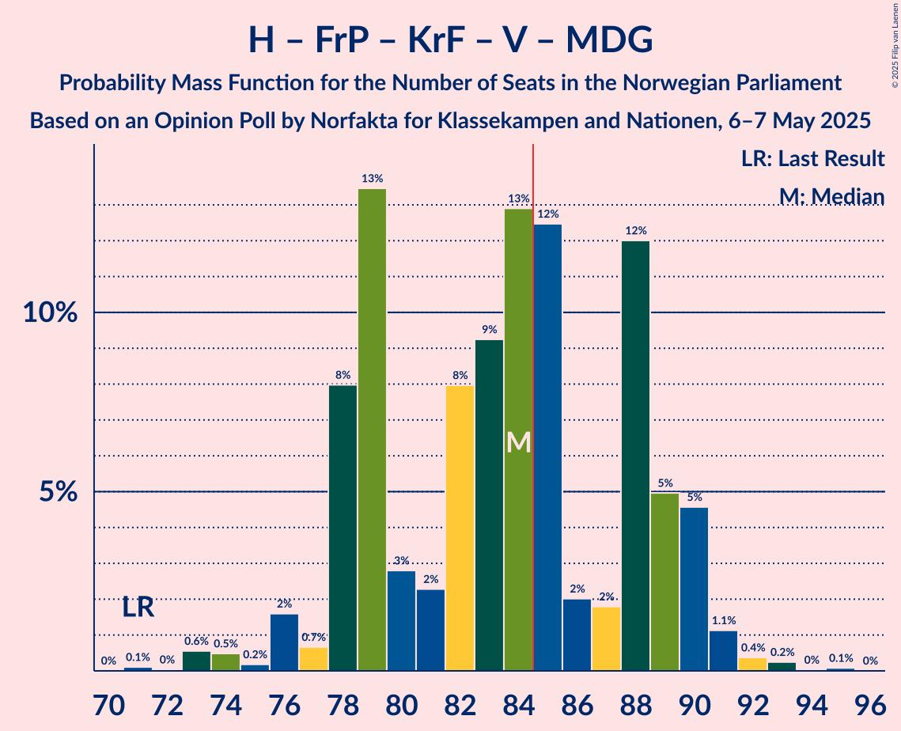

| Number of Seats | Probability | Accumulated | Special Marks |
|:---------------:|:-----------:|:-----------:|:-------------:|
| 71 | 0.1% | 100% | Last Result |
| 72 | 0% | 99.9% |  |
| 73 | 0.6% | 99.8% |  |
| 74 | 0.5% | 99.3% |  |
| 75 | 0.2% | 98.8% |  |
| 76 | 2% | 98.6% |  |
| 77 | 0.7% | 97% |  |
| 78 | 8% | 96% |  |
| 79 | 13% | 88% |  |
| 80 | 3% | 75% |  |
| 81 | 2% | 72% |  |
| 82 | 8% | 70% |  |
| 83 | 9% | 62% |  |
| 84 | 13% | 53% |  |
| 85 | 12% | 40% | Median, Majority |
| 86 | 2% | 27% |  |
| 87 | 2% | 25% |  |
| 88 | 12% | 23% |  |
| 89 | 5% | 11% |  |
| 90 | 5% | 6% |  |
| 91 | 1.1% | 2% |  |
| 92 | 0.4% | 0.7% |  |
| 93 | 0.2% | 0.4% |  |
| 94 | 0% | 0.1% |  |
| 95 | 0.1% | 0.1% |  |
| 96 | 0% | 0% |  |

### Arbeiderpartiet – Sosialistisk Venstreparti – Senterpartiet – Kristelig Folkeparti – Miljøpartiet De Grønne

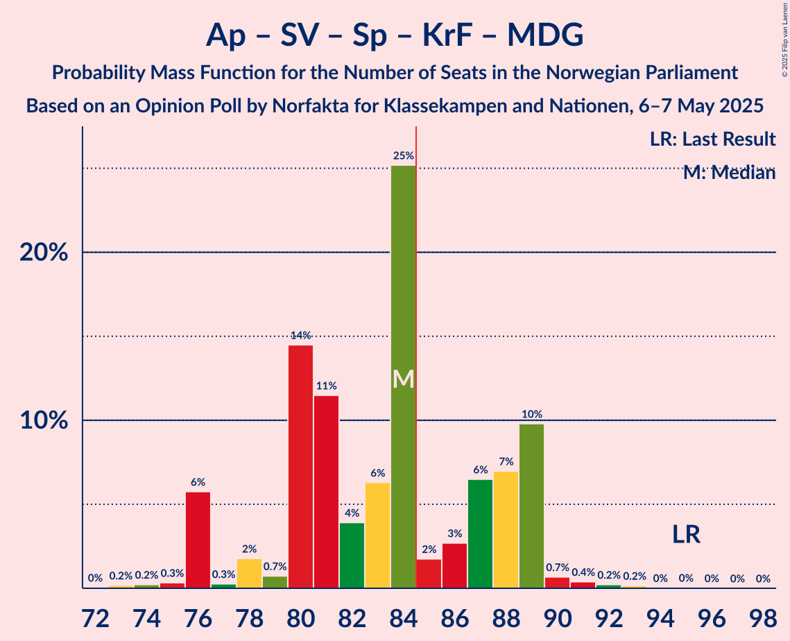

| Number of Seats | Probability | Accumulated | Special Marks |
|:---------------:|:-----------:|:-----------:|:-------------:|
| 72 | 0% | 100% |  |
| 73 | 0.2% | 99.9% |  |
| 74 | 0.2% | 99.8% |  |
| 75 | 0.3% | 99.5% |  |
| 76 | 6% | 99.2% |  |
| 77 | 0.3% | 93% |  |
| 78 | 2% | 93% |  |
| 79 | 0.7% | 91% |  |
| 80 | 14% | 91% |  |
| 81 | 11% | 76% |  |
| 82 | 4% | 65% |  |
| 83 | 6% | 61% | Median |
| 84 | 25% | 54% |  |
| 85 | 2% | 29% | Majority |
| 86 | 3% | 28% |  |
| 87 | 6% | 25% |  |
| 88 | 7% | 18% |  |
| 89 | 10% | 11% |  |
| 90 | 0.7% | 2% |  |
| 91 | 0.4% | 0.9% |  |
| 92 | 0.2% | 0.5% |  |
| 93 | 0.2% | 0.3% |  |
| 94 | 0% | 0.1% |  |
| 95 | 0% | 0.1% | Last Result |
| 96 | 0% | 0.1% |  |
| 97 | 0% | 0.1% |  |
| 98 | 0% | 0% |  |

### Høyre – Fremskrittspartiet – Kristelig Folkeparti – Venstre

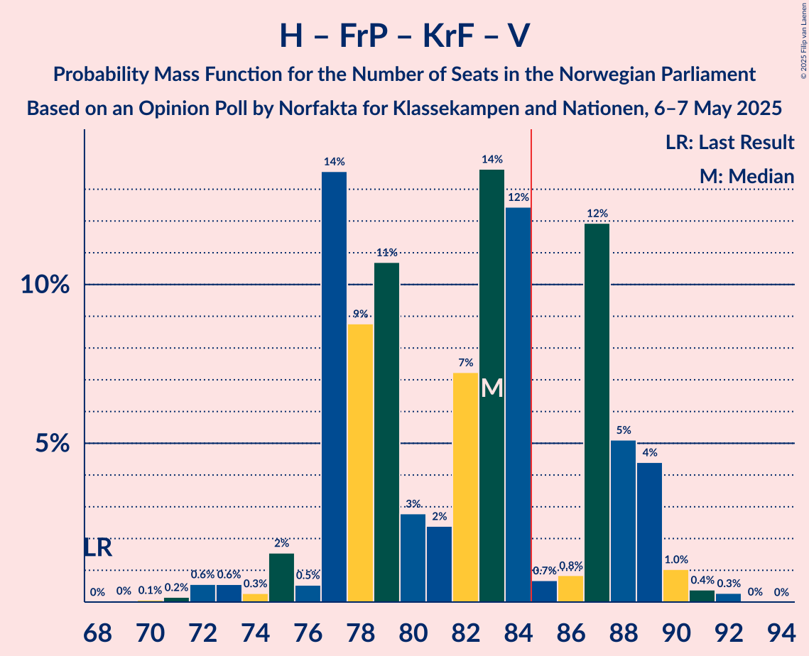

| Number of Seats | Probability | Accumulated | Special Marks |
|:---------------:|:-----------:|:-----------:|:-------------:|
| 68 | 0% | 100% | Last Result |
| 69 | 0% | 100% |  |
| 70 | 0.1% | 99.9% |  |
| 71 | 0.2% | 99.9% |  |
| 72 | 0.6% | 99.7% |  |
| 73 | 0.6% | 99.2% |  |
| 74 | 0.3% | 98.6% |  |
| 75 | 2% | 98% |  |
| 76 | 0.5% | 97% |  |
| 77 | 14% | 96% |  |
| 78 | 9% | 83% |  |
| 79 | 11% | 74% |  |
| 80 | 3% | 63% |  |
| 81 | 2% | 60% |  |
| 82 | 7% | 58% |  |
| 83 | 14% | 51% |  |
| 84 | 12% | 37% | Median |
| 85 | 0.7% | 25% | Majority |
| 86 | 0.8% | 24% |  |
| 87 | 12% | 23% |  |
| 88 | 5% | 11% |  |
| 89 | 4% | 6% |  |
| 90 | 1.0% | 2% |  |
| 91 | 0.4% | 0.7% |  |
| 92 | 0.3% | 0.3% |  |
| 93 | 0% | 0% |  |

### Arbeiderpartiet – Sosialistisk Venstreparti – Senterpartiet – Miljøpartiet De Grønne

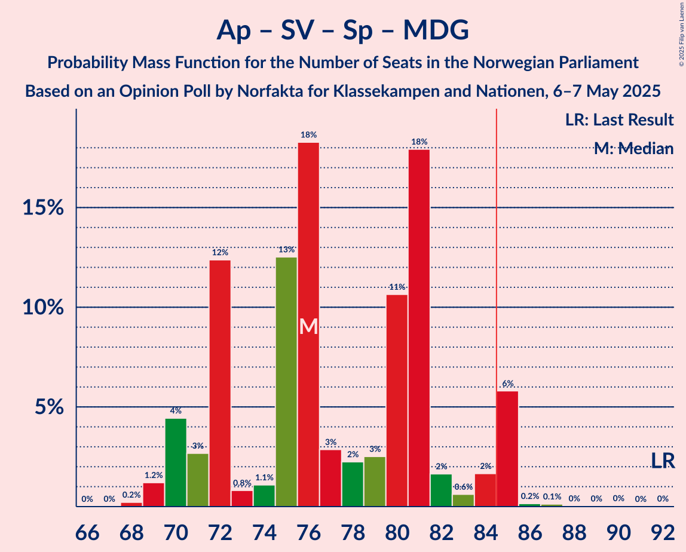

| Number of Seats | Probability | Accumulated | Special Marks |
|:---------------:|:-----------:|:-----------:|:-------------:|
| 68 | 0.2% | 100% |  |
| 69 | 1.2% | 99.7% |  |
| 70 | 4% | 98.5% |  |
| 71 | 3% | 94% |  |
| 72 | 12% | 91% |  |
| 73 | 0.8% | 79% |  |
| 74 | 1.1% | 78% |  |
| 75 | 13% | 77% |  |
| 76 | 18% | 65% | Median |
| 77 | 3% | 46% |  |
| 78 | 2% | 43% |  |
| 79 | 3% | 41% |  |
| 80 | 11% | 39% |  |
| 81 | 18% | 28% |  |
| 82 | 2% | 10% |  |
| 83 | 0.6% | 8% |  |
| 84 | 2% | 8% |  |
| 85 | 6% | 6% | Majority |
| 86 | 0.2% | 0.4% |  |
| 87 | 0.1% | 0.3% |  |
| 88 | 0% | 0.1% |  |
| 89 | 0% | 0.1% |  |
| 90 | 0% | 0.1% |  |
| 91 | 0% | 0% |  |
| 92 | 0% | 0% | Last Result |

### Arbeiderpartiet – Sosialistisk Venstreparti – Rødt – Miljøpartiet De Grønne

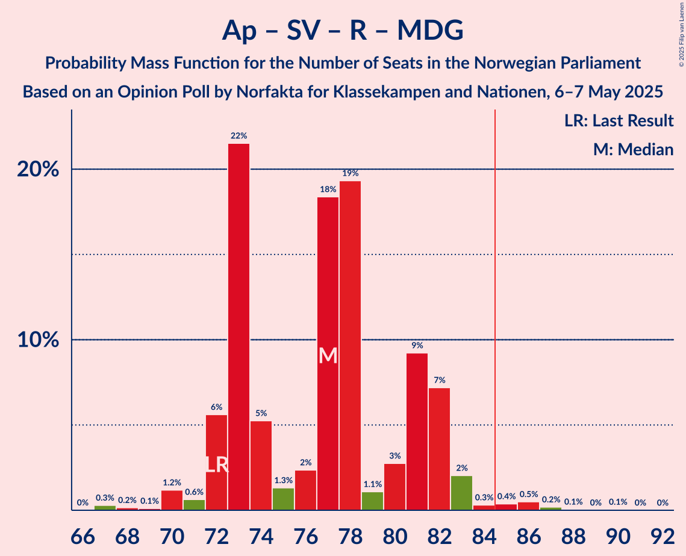

| Number of Seats | Probability | Accumulated | Special Marks |
|:---------------:|:-----------:|:-----------:|:-------------:|
| 67 | 0.3% | 100% |  |
| 68 | 0.2% | 99.7% |  |
| 69 | 0.1% | 99.5% |  |
| 70 | 1.2% | 99.4% |  |
| 71 | 0.6% | 98% |  |
| 72 | 6% | 98% | Last Result |
| 73 | 22% | 92% |  |
| 74 | 5% | 70% |  |
| 75 | 1.3% | 65% |  |
| 76 | 2% | 64% |  |
| 77 | 18% | 62% | Median |
| 78 | 19% | 43% |  |
| 79 | 1.1% | 24% |  |
| 80 | 3% | 23% |  |
| 81 | 9% | 20% |  |
| 82 | 7% | 11% |  |
| 83 | 2% | 4% |  |
| 84 | 0.3% | 2% |  |
| 85 | 0.4% | 1.2% | Majority |
| 86 | 0.5% | 0.8% |  |
| 87 | 0.2% | 0.3% |  |
| 88 | 0.1% | 0.1% |  |
| 89 | 0% | 0.1% |  |
| 90 | 0.1% | 0.1% |  |
| 91 | 0% | 0% |  |

### Høyre – Fremskrittspartiet – Venstre

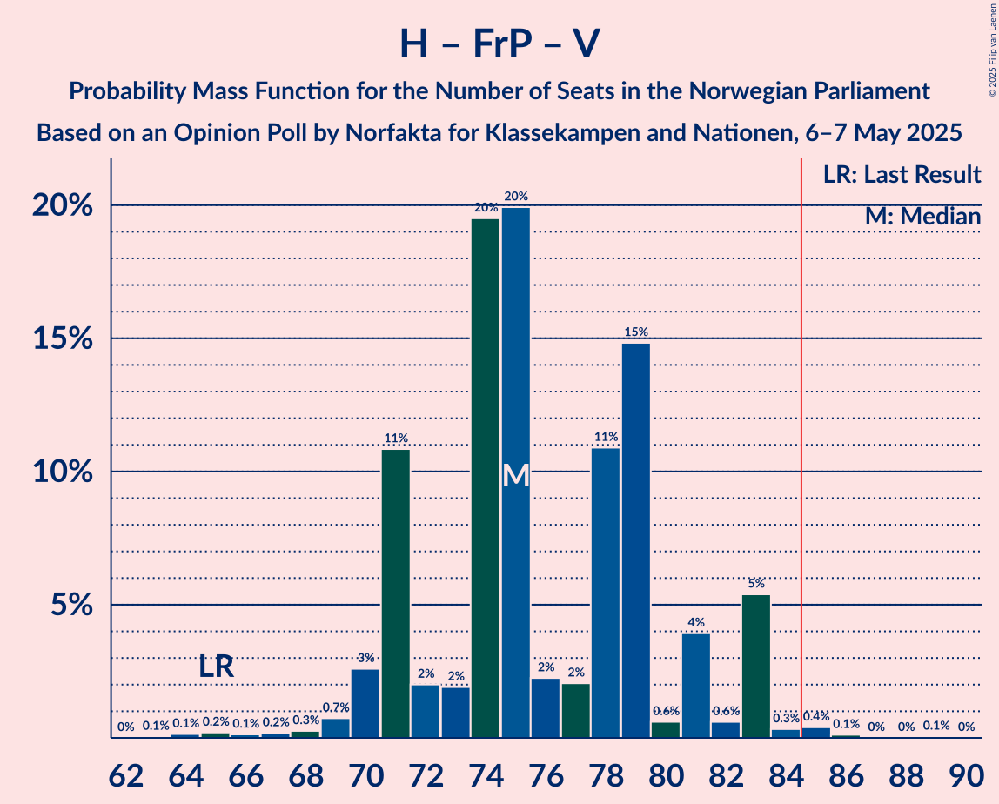

| Number of Seats | Probability | Accumulated | Special Marks |
|:---------------:|:-----------:|:-----------:|:-------------:|
| 63 | 0.1% | 100% |  |
| 64 | 0.1% | 99.9% |  |
| 65 | 0.2% | 99.8% | Last Result |
| 66 | 0.1% | 99.6% |  |
| 67 | 0.2% | 99.5% |  |
| 68 | 0.3% | 99.3% |  |
| 69 | 0.7% | 99.0% |  |
| 70 | 3% | 98% |  |
| 71 | 11% | 96% |  |
| 72 | 2% | 85% |  |
| 73 | 2% | 83% |  |
| 74 | 20% | 81% |  |
| 75 | 20% | 61% |  |
| 76 | 2% | 41% |  |
| 77 | 2% | 39% | Median |
| 78 | 11% | 37% |  |
| 79 | 15% | 26% |  |
| 80 | 0.6% | 11% |  |
| 81 | 4% | 11% |  |
| 82 | 0.6% | 7% |  |
| 83 | 5% | 6% |  |
| 84 | 0.3% | 0.9% |  |
| 85 | 0.4% | 0.6% | Majority |
| 86 | 0.1% | 0.2% |  |
| 87 | 0% | 0.1% |  |
| 88 | 0% | 0.1% |  |
| 89 | 0.1% | 0.1% |  |
| 90 | 0% | 0% |  |

### Arbeiderpartiet – Sosialistisk Venstreparti – Senterpartiet

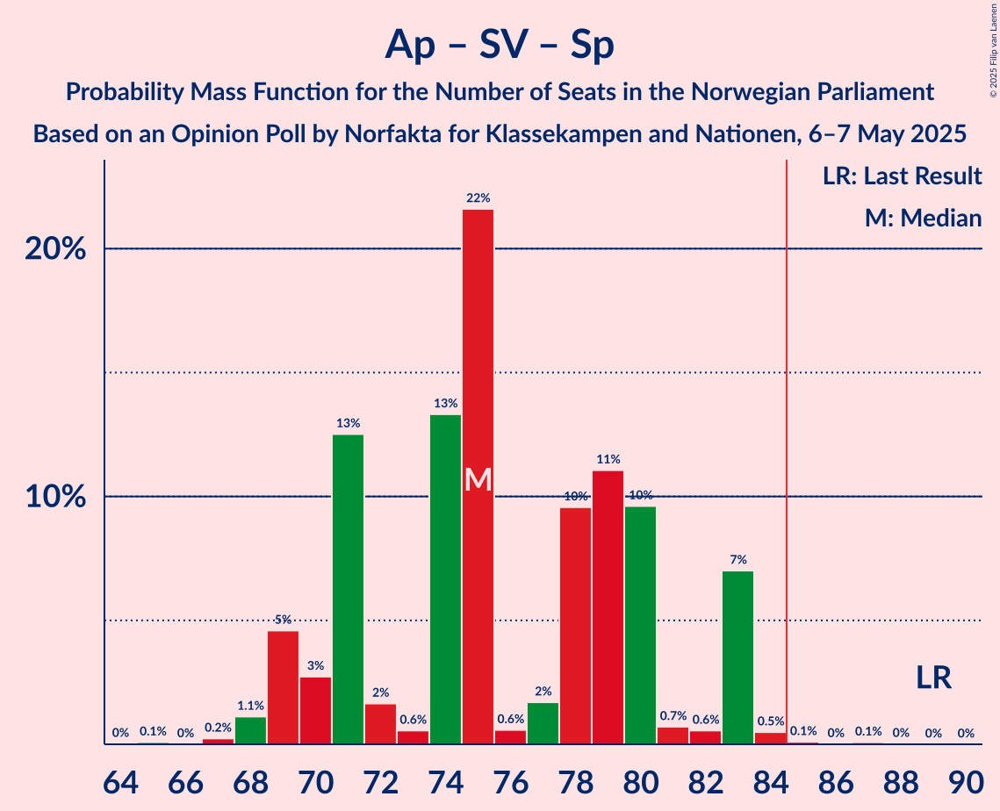

| Number of Seats | Probability | Accumulated | Special Marks |
|:---------------:|:-----------:|:-----------:|:-------------:|
| 65 | 0.1% | 100% |  |
| 66 | 0% | 99.9% |  |
| 67 | 0.2% | 99.9% |  |
| 68 | 1.1% | 99.6% |  |
| 69 | 5% | 98.5% |  |
| 70 | 3% | 94% |  |
| 71 | 13% | 91% |  |
| 72 | 2% | 79% |  |
| 73 | 0.6% | 77% |  |
| 74 | 13% | 76% |  |
| 75 | 22% | 63% | Median |
| 76 | 0.6% | 42% |  |
| 77 | 2% | 41% |  |
| 78 | 10% | 39% |  |
| 79 | 11% | 30% |  |
| 80 | 10% | 19% |  |
| 81 | 0.7% | 9% |  |
| 82 | 0.6% | 8% |  |
| 83 | 7% | 8% |  |
| 84 | 0.5% | 0.7% |  |
| 85 | 0.1% | 0.2% | Majority |
| 86 | 0% | 0.1% |  |
| 87 | 0.1% | 0.1% |  |
| 88 | 0% | 0% |  |
| 89 | 0% | 0% | Last Result |

### Arbeiderpartiet – Senterpartiet – Kristelig Folkeparti – Miljøpartiet De Grønne

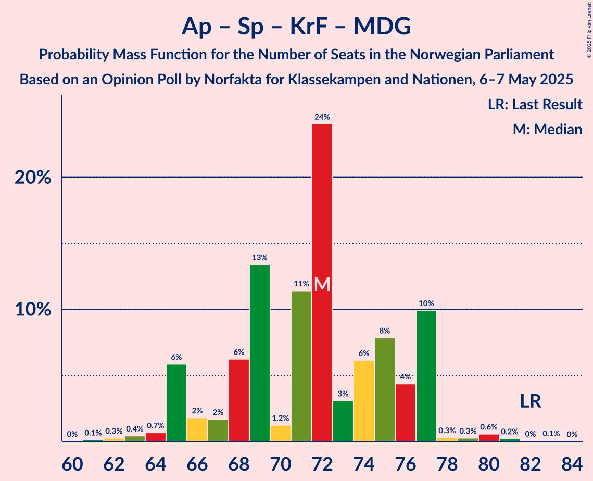

| Number of Seats | Probability | Accumulated | Special Marks |
|:---------------:|:-----------:|:-----------:|:-------------:|
| 61 | 0.1% | 100% |  |
| 62 | 0.3% | 99.8% |  |
| 63 | 0.4% | 99.6% |  |
| 64 | 0.7% | 99.2% |  |
| 65 | 6% | 98.5% |  |
| 66 | 2% | 93% |  |
| 67 | 2% | 91% |  |
| 68 | 6% | 89% |  |
| 69 | 13% | 83% |  |
| 70 | 1.2% | 70% |  |
| 71 | 11% | 68% | Median |
| 72 | 24% | 57% |  |
| 73 | 3% | 33% |  |
| 74 | 6% | 30% |  |
| 75 | 8% | 24% |  |
| 76 | 4% | 16% |  |
| 77 | 10% | 11% |  |
| 78 | 0.3% | 1.5% |  |
| 79 | 0.3% | 1.2% |  |
| 80 | 0.6% | 0.9% |  |
| 81 | 0.2% | 0.4% |  |
| 82 | 0% | 0.1% | Last Result |
| 83 | 0.1% | 0.1% |  |
| 84 | 0% | 0% |  |

### Høyre – Fremskrittspartiet

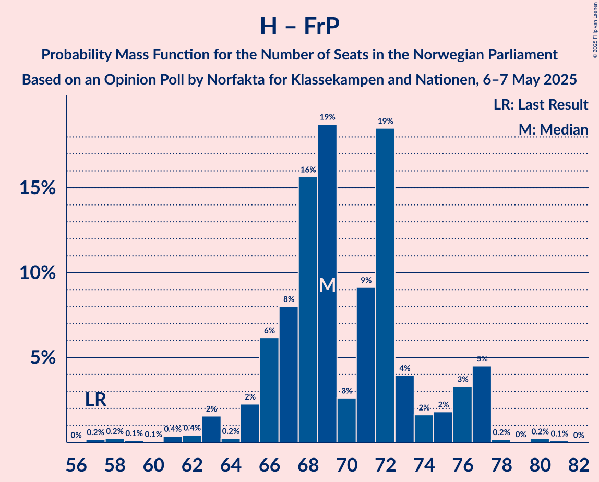

| Number of Seats | Probability | Accumulated | Special Marks |
|:---------------:|:-----------:|:-----------:|:-------------:|
| 57 | 0.2% | 100% | Last Result |
| 58 | 0.2% | 99.8% |  |
| 59 | 0.1% | 99.6% |  |
| 60 | 0.1% | 99.5% |  |
| 61 | 0.4% | 99.4% |  |
| 62 | 0.4% | 99.0% |  |
| 63 | 2% | 98.6% |  |
| 64 | 0.2% | 97% |  |
| 65 | 2% | 97% |  |
| 66 | 6% | 95% |  |
| 67 | 8% | 88% |  |
| 68 | 16% | 80% |  |
| 69 | 19% | 65% |  |
| 70 | 3% | 46% | Median |
| 71 | 9% | 43% |  |
| 72 | 19% | 34% |  |
| 73 | 4% | 16% |  |
| 74 | 2% | 12% |  |
| 75 | 2% | 10% |  |
| 76 | 3% | 8% |  |
| 77 | 5% | 5% |  |
| 78 | 0.2% | 0.5% |  |
| 79 | 0% | 0.4% |  |
| 80 | 0.2% | 0.3% |  |
| 81 | 0.1% | 0.1% |  |
| 82 | 0% | 0% |  |

### Arbeiderpartiet – Senterpartiet – Kristelig Folkeparti

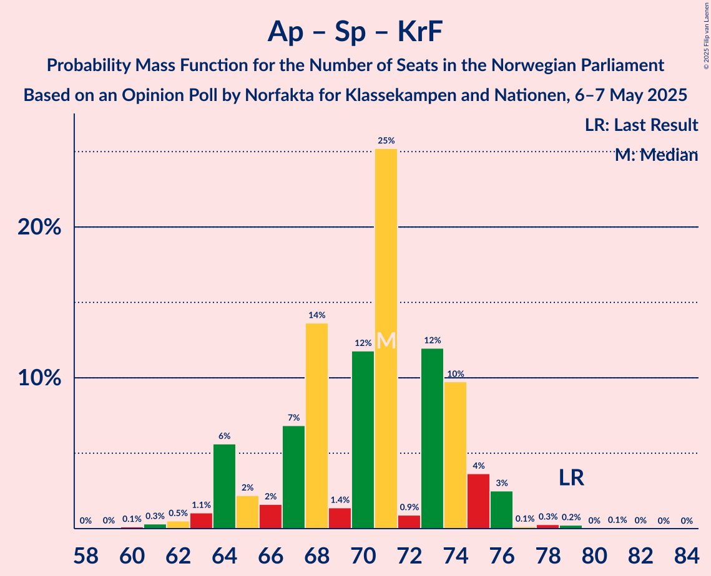

| Number of Seats | Probability | Accumulated | Special Marks |
|:---------------:|:-----------:|:-----------:|:-------------:|
| 59 | 0% | 100% |  |
| 60 | 0.1% | 99.9% |  |
| 61 | 0.3% | 99.8% |  |
| 62 | 0.5% | 99.5% |  |
| 63 | 1.1% | 99.0% |  |
| 64 | 6% | 98% |  |
| 65 | 2% | 92% |  |
| 66 | 2% | 90% |  |
| 67 | 7% | 88% |  |
| 68 | 14% | 82% |  |
| 69 | 1.4% | 68% |  |
| 70 | 12% | 67% | Median |
| 71 | 25% | 55% |  |
| 72 | 0.9% | 30% |  |
| 73 | 12% | 29% |  |
| 74 | 10% | 17% |  |
| 75 | 4% | 7% |  |
| 76 | 3% | 3% |  |
| 77 | 0.1% | 0.8% |  |
| 78 | 0.3% | 0.7% |  |
| 79 | 0.2% | 0.4% | Last Result |
| 80 | 0% | 0.1% |  |
| 81 | 0.1% | 0.1% |  |
| 82 | 0% | 0.1% |  |
| 83 | 0% | 0% |  |

### Arbeiderpartiet – Sosialistisk Venstreparti

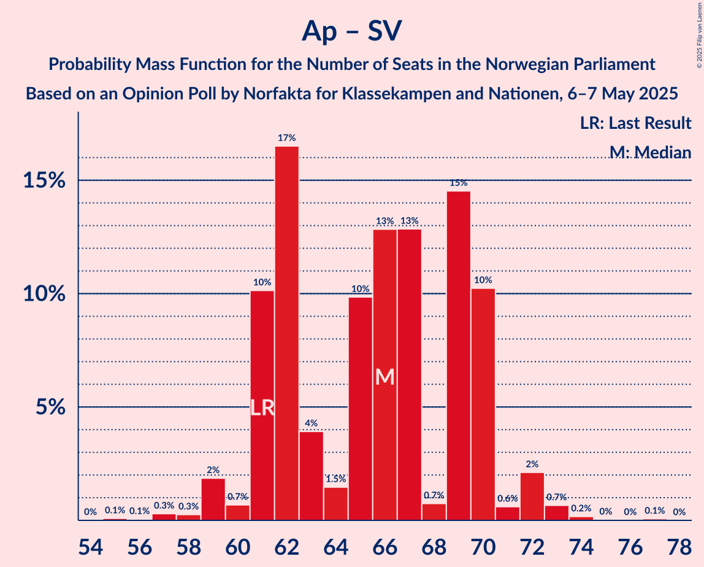

| Number of Seats | Probability | Accumulated | Special Marks |
|:---------------:|:-----------:|:-----------:|:-------------:|
| 55 | 0.1% | 100% |  |
| 56 | 0.1% | 99.9% |  |
| 57 | 0.3% | 99.8% |  |
| 58 | 0.3% | 99.6% |  |
| 59 | 2% | 99.3% |  |
| 60 | 0.7% | 97% |  |
| 61 | 10% | 97% | Last Result |
| 62 | 17% | 87% |  |
| 63 | 4% | 70% |  |
| 64 | 1.5% | 66% |  |
| 65 | 10% | 65% |  |
| 66 | 13% | 55% | Median |
| 67 | 13% | 42% |  |
| 68 | 0.7% | 29% |  |
| 69 | 15% | 28% |  |
| 70 | 10% | 14% |  |
| 71 | 0.6% | 4% |  |
| 72 | 2% | 3% |  |
| 73 | 0.7% | 1.0% |  |
| 74 | 0.2% | 0.3% |  |
| 75 | 0% | 0.1% |  |
| 76 | 0% | 0.1% |  |
| 77 | 0.1% | 0.1% |  |
| 78 | 0% | 0% |  |

### Arbeiderpartiet – Senterpartiet

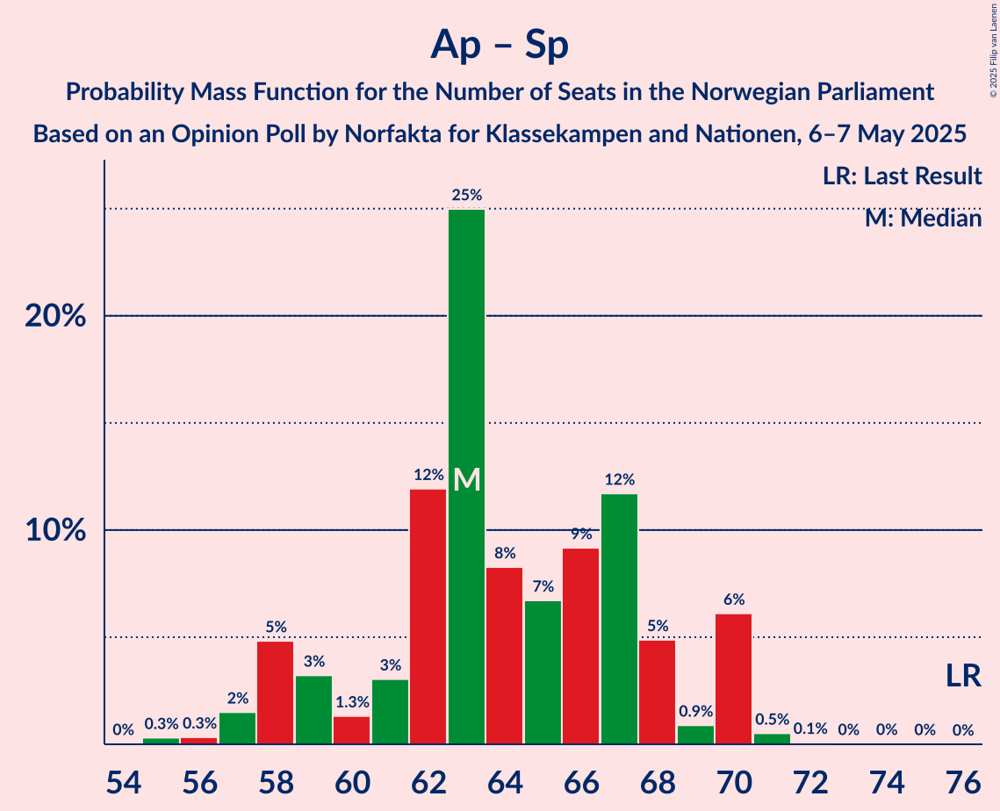

| Number of Seats | Probability | Accumulated | Special Marks |
|:---------------:|:-----------:|:-----------:|:-------------:|
| 54 | 0% | 100% |  |
| 55 | 0.3% | 99.9% |  |
| 56 | 0.3% | 99.6% |  |
| 57 | 2% | 99.3% |  |
| 58 | 5% | 98% |  |
| 59 | 3% | 93% |  |
| 60 | 1.3% | 90% |  |
| 61 | 3% | 88% |  |
| 62 | 12% | 85% |  |
| 63 | 25% | 73% | Median |
| 64 | 8% | 48% |  |
| 65 | 7% | 40% |  |
| 66 | 9% | 33% |  |
| 67 | 12% | 24% |  |
| 68 | 5% | 13% |  |
| 69 | 0.9% | 8% |  |
| 70 | 6% | 7% |  |
| 71 | 0.5% | 0.7% |  |
| 72 | 0.1% | 0.2% |  |
| 73 | 0% | 0.1% |  |
| 74 | 0% | 0.1% |  |
| 75 | 0% | 0% |  |
| 76 | 0% | 0% | Last Result |

### Høyre – Kristelig Folkeparti – Venstre

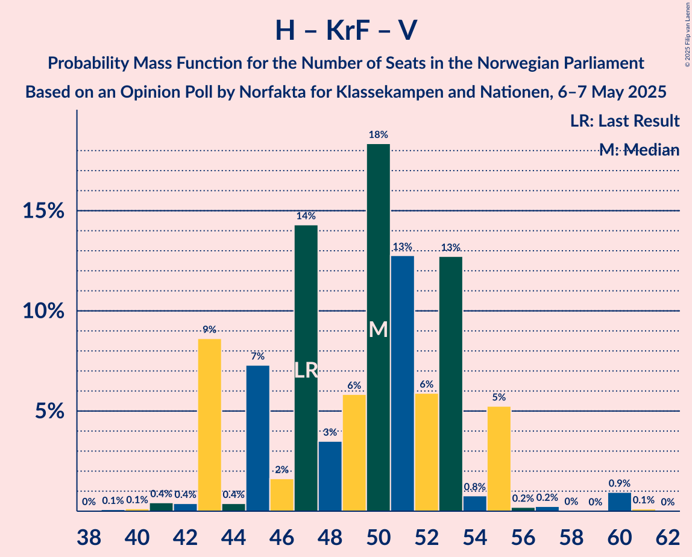

| Number of Seats | Probability | Accumulated | Special Marks |
|:---------------:|:-----------:|:-----------:|:-------------:|
| 38 | 0% | 100% |  |
| 39 | 0.1% | 99.9% |  |
| 40 | 0.1% | 99.9% |  |
| 41 | 0.4% | 99.7% |  |
| 42 | 0.4% | 99.3% |  |
| 43 | 9% | 98.9% |  |
| 44 | 0.4% | 90% |  |
| 45 | 7% | 90% |  |
| 46 | 2% | 83% |  |
| 47 | 14% | 81% | Last Result |
| 48 | 3% | 67% |  |
| 49 | 6% | 63% |  |
| 50 | 18% | 57% |  |
| 51 | 13% | 39% | Median |
| 52 | 6% | 26% |  |
| 53 | 13% | 20% |  |
| 54 | 0.8% | 8% |  |
| 55 | 5% | 7% |  |
| 56 | 0.2% | 2% |  |
| 57 | 0.2% | 1.4% |  |
| 58 | 0% | 1.2% |  |
| 59 | 0% | 1.1% |  |
| 60 | 0.9% | 1.1% |  |
| 61 | 0.1% | 0.1% |  |
| 62 | 0% | 0% |  |

### Senterpartiet – Kristelig Folkeparti – Venstre

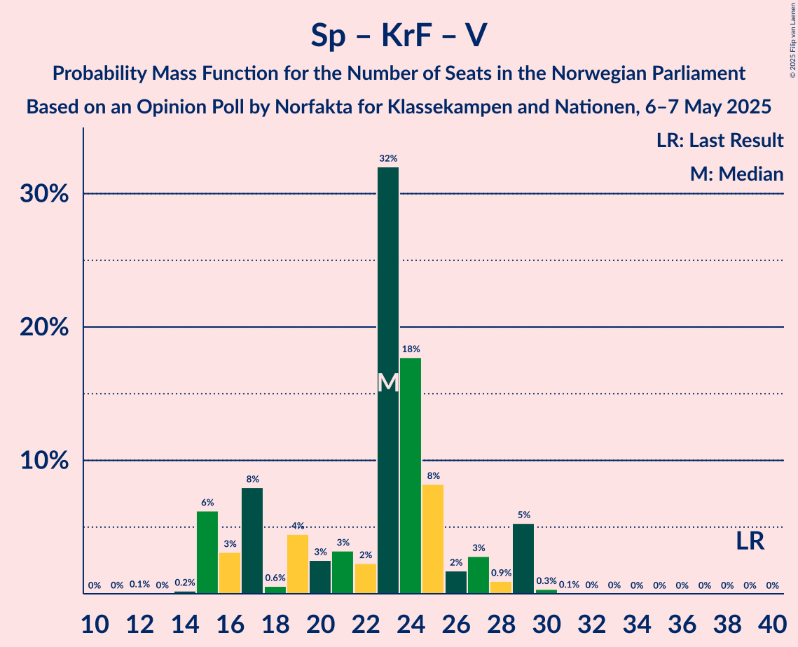

| Number of Seats | Probability | Accumulated | Special Marks |
|:---------------:|:-----------:|:-----------:|:-------------:|
| 12 | 0.1% | 100% |  |
| 13 | 0% | 99.9% |  |
| 14 | 0.2% | 99.9% |  |
| 15 | 6% | 99.6% |  |
| 16 | 3% | 93% |  |
| 17 | 8% | 90% |  |
| 18 | 0.6% | 82% |  |
| 19 | 4% | 82% |  |
| 20 | 3% | 77% |  |
| 21 | 3% | 75% |  |
| 22 | 2% | 72% |  |
| 23 | 32% | 69% | Median |
| 24 | 18% | 37% |  |
| 25 | 8% | 19% |  |
| 26 | 2% | 11% |  |
| 27 | 3% | 10% |  |
| 28 | 0.9% | 7% |  |
| 29 | 5% | 6% |  |
| 30 | 0.3% | 0.5% |  |
| 31 | 0.1% | 0.1% |  |
| 32 | 0% | 0.1% |  |
| 33 | 0% | 0% |  |
| 34 | 0% | 0% |  |
| 35 | 0% | 0% |  |
| 36 | 0% | 0% |  |
| 37 | 0% | 0% |  |
| 38 | 0% | 0% |  |
| 39 | 0% | 0% | Last Result |

## Technical Information

### Opinion Poll

+ **Polling firm:** Norfakta
+ **Commissioner(s):** Klassekampen and Nationen
+ **Fieldwork period:** 6–7 May 2025

### Calculations

+ **Sample size:** 784
+ **Simulations done:** 2,097,152
+ **Error estimate:** 2.32%

