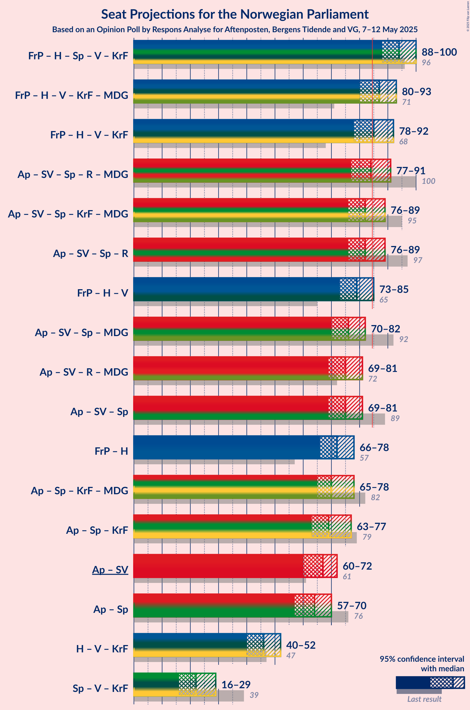

# Opinion Poll by Respons Analyse for Aftenposten, Bergens Tidende and VG, 7–12 May 2025

<a href="#voting-intentions">Voting Intentions</a> | <a href="#seats">Seats</a> | <a href="#coalitions">Coalitions</a> | <a href="#technical-information">Technical Information</a>

## Voting Intentions

### Confidence Intervals

| Party | Last Result | Poll Result | 80% Confidence Interval | 90% Confidence Interval | 95% Confidence Interval | 99% Confidence Interval |
|:-----:|:-----------:|:-----------:|:-----------------------:|:-----------------------:|:-----------------------:|:-----------------------:|
| Arbeiderpartiet | 26.2% | 29.3% | 27.5–31.2% |27.0–31.8% |26.6–32.3% |25.8–33.2% |
| Fremskrittspartiet | 11.6% | 21.1% | 19.5–22.8% |19.0–23.3% |18.6–23.7% |17.9–24.5% |
| Høyre | 20.4% | 18.6% | 17.1–20.2% |16.6–20.7% |16.3–21.1% |15.6–21.9% |
| Sosialistisk Venstreparti | 7.6% | 6.9% | 6.0–8.0% |5.7–8.4% |5.5–8.6% |5.1–9.2% |
| Senterpartiet | 13.5% | 5.2% | 4.4–6.2% |4.2–6.5% |4.0–6.8% |3.6–7.3% |
| Rødt | 4.7% | 4.9% | 4.1–5.9% |3.9–6.2% |3.7–6.4% |3.4–6.9% |
| Venstre | 4.6% | 4.8% | 4.0–5.8% |3.8–6.1% |3.6–6.3% |3.3–6.8% |
| Kristelig Folkeparti | 3.8% | 4.3% | 3.6–5.2% |3.4–5.5% |3.2–5.7% |2.9–6.2% |
| Miljøpartiet De Grønne | 3.9% | 2.6% | 2.1–3.4% |1.9–3.6% |1.8–3.8% |1.5–4.2% |
| Industri- og Næringspartiet | 0.3% | 0.6% | 0.4–1.1% |0.3–1.2% |0.3–1.3% |0.2–1.6% |

*Note:* The poll result column reflects the actual value used in the calculations. Published results may vary slightly, and in addition be rounded to fewer digits.

## Seats

### Confidence Intervals

| Party | Last Result | Median | 80% Confidence Interval | 90% Confidence Interval | 95% Confidence Interval | 99% Confidence Interval |
|:-----:|:-----------:|:------:|:-----------------------:|:-----------------------:|:-----------------------:|:-----------------------:|
| <a href="#arbeiderpartiet">Arbeiderpartiet</a> | 48 | 55 | 50–58 |49–59 |49–61 |48–62 |
| <a href="#fremskrittspartiet">Fremskrittspartiet</a> | 21 | 39 | 36–42 |35–43 |35–44 |33–45 |
| <a href="#høyre">Høyre</a> | 36 | 32 | 30–36 |29–37 |29–38 |27–40 |
| <a href="#sosialistisk-venstreparti">Sosialistisk Venstreparti</a> | 13 | 11 | 10–13 |9–14 |9–15 |8–16 |
| <a href="#senterpartiet">Senterpartiet</a> | 28 | 9 | 7–11 |6–11 |1–12 |0–13 |
| <a href="#rødt">Rødt</a> | 8 | 8 | 1–10 |1–10 |1–11 |1–11 |
| <a href="#venstre">Venstre</a> | 8 | 7 | 6–9 |3–10 |3–10 |2–11 |
| <a href="#kristelig-folkeparti">Kristelig Folkeparti</a> | 3 | 7 | 3–8 |2–9 |2–9 |1–10 |
| <a href="#miljøpartiet-de-grønne">Miljøpartiet De Grønne</a> | 3 | 1 | 1–2 |1–3 |1–3 |0–6 |
| <a href="#industri--og-næringspartiet">Industri- og Næringspartiet</a> | 0 | 0 | 0 |0 |0 |0 |

### Arbeiderpartiet

*For a full overview of the results for this party, see the [Arbeiderpartiet](party-arbeiderpartiet.html) page.*

| Number of Seats | Probability | Accumulated | Special Marks |
|:---------------:|:-----------:|:-----------:|:-------------:|
| 46 | 0% | 100% |  |
| 47 | 0.2% | 99.9% |  |
| 48 | 0.7% | 99.7% | Last Result |
| 49 | 7% | 99.0% |  |
| 50 | 4% | 92% |  |
| 51 | 5% | 88% |  |
| 52 | 8% | 83% |  |
| 53 | 5% | 75% |  |
| 54 | 13% | 70% |  |
| 55 | 11% | 57% | Median |
| 56 | 7% | 46% |  |
| 57 | 21% | 40% |  |
| 58 | 10% | 18% |  |
| 59 | 4% | 9% |  |
| 60 | 2% | 4% |  |
| 61 | 2% | 3% |  |
| 62 | 0.9% | 1.2% |  |
| 63 | 0.2% | 0.3% |  |
| 64 | 0.1% | 0.2% |  |
| 65 | 0% | 0% |  |

### Fremskrittspartiet

*For a full overview of the results for this party, see the [Fremskrittspartiet](party-fremskrittspartiet.html) page.*

| Number of Seats | Probability | Accumulated | Special Marks |
|:---------------:|:-----------:|:-----------:|:-------------:|
| 21 | 0% | 100% | Last Result |
| 22 | 0% | 100% |  |
| 23 | 0% | 100% |  |
| 24 | 0% | 100% |  |
| 25 | 0% | 100% |  |
| 26 | 0% | 100% |  |
| 27 | 0% | 100% |  |
| 28 | 0% | 100% |  |
| 29 | 0% | 100% |  |
| 30 | 0% | 100% |  |
| 31 | 0% | 100% |  |
| 32 | 0.1% | 100% |  |
| 33 | 0.6% | 99.8% |  |
| 34 | 2% | 99.2% |  |
| 35 | 3% | 98% |  |
| 36 | 6% | 94% |  |
| 37 | 6% | 88% |  |
| 38 | 15% | 81% |  |
| 39 | 18% | 66% | Median |
| 40 | 17% | 48% |  |
| 41 | 11% | 31% |  |
| 42 | 13% | 20% |  |
| 43 | 3% | 7% |  |
| 44 | 2% | 3% |  |
| 45 | 0.8% | 1.0% |  |
| 46 | 0.2% | 0.2% |  |
| 47 | 0% | 0.1% |  |
| 48 | 0% | 0% |  |

### Høyre

*For a full overview of the results for this party, see the [Høyre](party-høyre.html) page.*

| Number of Seats | Probability | Accumulated | Special Marks |
|:---------------:|:-----------:|:-----------:|:-------------:|
| 24 | 0% | 100% |  |
| 25 | 0.2% | 99.9% |  |
| 26 | 0.1% | 99.8% |  |
| 27 | 0.8% | 99.6% |  |
| 28 | 1.2% | 98.8% |  |
| 29 | 7% | 98% |  |
| 30 | 4% | 91% |  |
| 31 | 19% | 86% |  |
| 32 | 24% | 67% | Median |
| 33 | 11% | 44% |  |
| 34 | 17% | 33% |  |
| 35 | 4% | 15% |  |
| 36 | 4% | 11% | Last Result |
| 37 | 2% | 7% |  |
| 38 | 2% | 4% |  |
| 39 | 2% | 2% |  |
| 40 | 0.5% | 0.6% |  |
| 41 | 0.1% | 0.1% |  |
| 42 | 0% | 0% |  |

### Sosialistisk Venstreparti

*For a full overview of the results for this party, see the [Sosialistisk Venstreparti](party-sosialistiskvenstreparti.html) page.*

| Number of Seats | Probability | Accumulated | Special Marks |
|:---------------:|:-----------:|:-----------:|:-------------:|
| 7 | 0.3% | 100% |  |
| 8 | 2% | 99.7% |  |
| 9 | 6% | 98% |  |
| 10 | 26% | 92% |  |
| 11 | 25% | 65% | Median |
| 12 | 17% | 40% |  |
| 13 | 15% | 22% | Last Result |
| 14 | 4% | 8% |  |
| 15 | 2% | 3% |  |
| 16 | 0.6% | 1.0% |  |
| 17 | 0.4% | 0.4% |  |
| 18 | 0% | 0% |  |

### Senterpartiet

*For a full overview of the results for this party, see the [Senterpartiet](party-senterpartiet.html) page.*

| Number of Seats | Probability | Accumulated | Special Marks |
|:---------------:|:-----------:|:-----------:|:-------------:|
| 0 | 1.3% | 100% |  |
| 1 | 2% | 98.7% |  |
| 2 | 0% | 97% |  |
| 3 | 0% | 97% |  |
| 4 | 0% | 97% |  |
| 5 | 0% | 97% |  |
| 6 | 4% | 97% |  |
| 7 | 14% | 94% |  |
| 8 | 24% | 80% |  |
| 9 | 22% | 55% | Median |
| 10 | 21% | 33% |  |
| 11 | 9% | 13% |  |
| 12 | 3% | 4% |  |
| 13 | 0.9% | 0.9% |  |
| 14 | 0.1% | 0.1% |  |
| 15 | 0% | 0% |  |
| 16 | 0% | 0% |  |
| 17 | 0% | 0% |  |
| 18 | 0% | 0% |  |
| 19 | 0% | 0% |  |
| 20 | 0% | 0% |  |
| 21 | 0% | 0% |  |
| 22 | 0% | 0% |  |
| 23 | 0% | 0% |  |
| 24 | 0% | 0% |  |
| 25 | 0% | 0% |  |
| 26 | 0% | 0% |  |
| 27 | 0% | 0% |  |
| 28 | 0% | 0% | Last Result |

### Rødt

*For a full overview of the results for this party, see the [Rødt](party-rødt.html) page.*

| Number of Seats | Probability | Accumulated | Special Marks |
|:---------------:|:-----------:|:-----------:|:-------------:|
| 1 | 11% | 100% |  |
| 2 | 0.2% | 89% |  |
| 3 | 0% | 89% |  |
| 4 | 0% | 89% |  |
| 5 | 0% | 89% |  |
| 6 | 4% | 89% |  |
| 7 | 22% | 85% |  |
| 8 | 33% | 63% | Last Result, Median |
| 9 | 17% | 30% |  |
| 10 | 10% | 13% |  |
| 11 | 2% | 3% |  |
| 12 | 0.4% | 0.5% |  |
| 13 | 0.1% | 0.1% |  |
| 14 | 0% | 0% |  |

### Venstre

*For a full overview of the results for this party, see the [Venstre](party-venstre.html) page.*

| Number of Seats | Probability | Accumulated | Special Marks |
|:---------------:|:-----------:|:-----------:|:-------------:|
| 2 | 1.0% | 100% |  |
| 3 | 7% | 99.0% |  |
| 4 | 0% | 92% |  |
| 5 | 0% | 92% |  |
| 6 | 12% | 92% |  |
| 7 | 31% | 81% | Median |
| 8 | 22% | 50% | Last Result |
| 9 | 20% | 28% |  |
| 10 | 7% | 8% |  |
| 11 | 1.3% | 2% |  |
| 12 | 0.2% | 0.3% |  |
| 13 | 0% | 0% |  |

### Kristelig Folkeparti

*For a full overview of the results for this party, see the [Kristelig Folkeparti](party-kristeligfolkeparti.html) page.*

| Number of Seats | Probability | Accumulated | Special Marks |
|:---------------:|:-----------:|:-----------:|:-------------:|
| 1 | 0.8% | 100% |  |
| 2 | 5% | 99.2% |  |
| 3 | 25% | 94% | Last Result |
| 4 | 0% | 70% |  |
| 5 | 0% | 70% |  |
| 6 | 6% | 70% |  |
| 7 | 31% | 63% | Median |
| 8 | 23% | 32% |  |
| 9 | 8% | 9% |  |
| 10 | 1.0% | 1.2% |  |
| 11 | 0.2% | 0.2% |  |
| 12 | 0% | 0% |  |

### Miljøpartiet De Grønne

*For a full overview of the results for this party, see the [Miljøpartiet De Grønne](party-miljøpartietdegrønne.html) page.*

| Number of Seats | Probability | Accumulated | Special Marks |
|:---------------:|:-----------:|:-----------:|:-------------:|
| 0 | 0.7% | 100% |  |
| 1 | 74% | 99.3% | Median |
| 2 | 20% | 25% |  |
| 3 | 4% | 5% | Last Result |
| 4 | 0% | 0.8% |  |
| 5 | 0% | 0.8% |  |
| 6 | 0.4% | 0.8% |  |
| 7 | 0.4% | 0.4% |  |
| 8 | 0% | 0% |  |

### Industri- og Næringspartiet

*For a full overview of the results for this party, see the [Industri- og Næringspartiet](party-industri-ognæringspartiet.html) page.*

| Number of Seats | Probability | Accumulated | Special Marks |
|:---------------:|:-----------:|:-----------:|:-------------:|
| 0 | 100% | 100% | Last Result, Median |

## Coalitions

### Confidence Intervals

| Coalition | Last Result | Median | Majority? | 80% Confidence Interval | 90% Confidence Interval | 95% Confidence Interval | 99% Confidence Interval |
|:---------:|:-----------:|:------:|:---------:|:-----------------------:|:-----------------------:|:-----------------------:|:-----------------------:|
| Fremskrittspartiet – Høyre – Senterpartiet – Venstre – Kristelig Folkeparti | 96 | 94 | 99.7% | 90–99 | 88–100 | 88–100 | 85–102 |
| Fremskrittspartiet – Høyre – Venstre – Kristelig Folkeparti – Miljøpartiet De Grønne | 71 | 87 | 74% | 82–91 | 81–93 | 80–93 | 78–96 |
| Fremskrittspartiet – Høyre – Venstre – Kristelig Folkeparti | 68 | 85 | 65% | 81–90 | 80–91 | 78–92 | 76–94 |
| Arbeiderpartiet – Sosialistisk Venstreparti – Senterpartiet – Rødt – Miljøpartiet De Grønne | 100 | 84 | 35% | 79–88 | 78–89 | 77–91 | 75–93 |
| Arbeiderpartiet – Sosialistisk Venstreparti – Senterpartiet – Kristelig Folkeparti – Miljøpartiet De Grønne | 95 | 82 | 25% | 78–88 | 77–89 | 76–89 | 73–91 |
| Arbeiderpartiet – Sosialistisk Venstreparti – Senterpartiet – Rødt | 97 | 82 | 26% | 78–87 | 76–88 | 76–89 | 73–91 |
| Fremskrittspartiet – Høyre – Venstre | 65 | 79 | 6% | 75–84 | 73–85 | 73–85 | 71–89 |
| Arbeiderpartiet – Sosialistisk Venstreparti – Senterpartiet – Miljøpartiet De Grønne | 92 | 76 | 0.6% | 72–81 | 71–81 | 70–82 | 68–85 |
| Arbeiderpartiet – Sosialistisk Venstreparti – Rødt – Miljøpartiet De Grønne | 72 | 75 | 0.3% | 70–79 | 69–81 | 69–81 | 67–84 |
| Arbeiderpartiet – Sosialistisk Venstreparti – Senterpartiet | 89 | 75 | 0.1% | 70–80 | 69–80 | 69–81 | 66–83 |
| Fremskrittspartiet – Høyre | 57 | 72 | 0% | 68–76 | 67–77 | 66–78 | 64–80 |
| Arbeiderpartiet – Senterpartiet – Kristelig Folkeparti – Miljøpartiet De Grønne | 82 | 70 | 0% | 66–77 | 65–78 | 65–78 | 61–79 |
| Arbeiderpartiet – Senterpartiet – Kristelig Folkeparti | 79 | 69 | 0% | 65–76 | 64–76 | 63–77 | 59–78 |
| Arbeiderpartiet – Sosialistisk Venstreparti | 61 | 67 | 0% | 62–70 | 60–71 | 60–72 | 59–74 |
| Arbeiderpartiet – Senterpartiet | 76 | 64 | 0% | 60–68 | 59–69 | 57–70 | 55–71 |
| Høyre – Venstre – Kristelig Folkeparti | 47 | 46 | 0% | 42–50 | 41–51 | 40–52 | 38–54 |
| Senterpartiet – Venstre – Kristelig Folkeparti | 39 | 22 | 0% | 19–26 | 17–27 | 16–29 | 13–30 |

### Fremskrittspartiet – Høyre – Senterpartiet – Venstre – Kristelig Folkeparti

| Number of Seats | Probability | Accumulated | Special Marks |
|:---------------:|:-----------:|:-----------:|:-------------:|
| 81 | 0% | 100% |  |
| 82 | 0% | 99.9% |  |
| 83 | 0% | 99.9% |  |
| 84 | 0.1% | 99.9% |  |
| 85 | 0.5% | 99.7% | Majority |
| 86 | 0.5% | 99.2% |  |
| 87 | 1.0% | 98.6% |  |
| 88 | 3% | 98% |  |
| 89 | 4% | 95% |  |
| 90 | 7% | 91% |  |
| 91 | 7% | 84% |  |
| 92 | 8% | 78% |  |
| 93 | 14% | 69% |  |
| 94 | 9% | 55% | Median |
| 95 | 13% | 46% |  |
| 96 | 8% | 33% | Last Result |
| 97 | 10% | 25% |  |
| 98 | 4% | 16% |  |
| 99 | 6% | 12% |  |
| 100 | 3% | 5% |  |
| 101 | 0.7% | 2% |  |
| 102 | 1.2% | 2% |  |
| 103 | 0.1% | 0.5% |  |
| 104 | 0.2% | 0.3% |  |
| 105 | 0.1% | 0.2% |  |
| 106 | 0% | 0.1% |  |
| 107 | 0% | 0% |  |

### Fremskrittspartiet – Høyre – Venstre – Kristelig Folkeparti – Miljøpartiet De Grønne

| Number of Seats | Probability | Accumulated | Special Marks |
|:---------------:|:-----------:|:-----------:|:-------------:|
| 71 | 0% | 100% | Last Result |
| 72 | 0% | 100% |  |
| 73 | 0% | 100% |  |
| 74 | 0% | 100% |  |
| 75 | 0% | 100% |  |
| 76 | 0.1% | 100% |  |
| 77 | 0.2% | 99.8% |  |
| 78 | 0.7% | 99.6% |  |
| 79 | 0.8% | 99.0% |  |
| 80 | 1.2% | 98% |  |
| 81 | 2% | 97% |  |
| 82 | 5% | 94% |  |
| 83 | 6% | 90% |  |
| 84 | 10% | 84% |  |
| 85 | 7% | 74% | Majority |
| 86 | 14% | 67% | Median |
| 87 | 9% | 52% |  |
| 88 | 15% | 44% |  |
| 89 | 10% | 29% |  |
| 90 | 5% | 19% |  |
| 91 | 6% | 14% |  |
| 92 | 3% | 8% |  |
| 93 | 3% | 5% |  |
| 94 | 1.3% | 2% |  |
| 95 | 0.4% | 1.1% |  |
| 96 | 0.2% | 0.6% |  |
| 97 | 0.3% | 0.4% |  |
| 98 | 0.1% | 0.1% |  |
| 99 | 0% | 0.1% |  |
| 100 | 0% | 0% |  |

### Fremskrittspartiet – Høyre – Venstre – Kristelig Folkeparti

| Number of Seats | Probability | Accumulated | Special Marks |
|:---------------:|:-----------:|:-----------:|:-------------:|
| 68 | 0% | 100% | Last Result |
| 69 | 0% | 100% |  |
| 70 | 0% | 100% |  |
| 71 | 0% | 100% |  |
| 72 | 0% | 100% |  |
| 73 | 0% | 100% |  |
| 74 | 0.1% | 100% |  |
| 75 | 0.2% | 99.9% |  |
| 76 | 0.4% | 99.7% |  |
| 77 | 1.3% | 99.4% |  |
| 78 | 0.6% | 98% |  |
| 79 | 1.1% | 97% |  |
| 80 | 3% | 96% |  |
| 81 | 5% | 94% |  |
| 82 | 6% | 89% |  |
| 83 | 11% | 82% |  |
| 84 | 6% | 71% |  |
| 85 | 15% | 65% | Median, Majority |
| 86 | 12% | 50% |  |
| 87 | 11% | 37% |  |
| 88 | 10% | 26% |  |
| 89 | 5% | 17% |  |
| 90 | 4% | 11% |  |
| 91 | 3% | 7% |  |
| 92 | 2% | 4% |  |
| 93 | 1.0% | 2% |  |
| 94 | 0.4% | 0.8% |  |
| 95 | 0.1% | 0.5% |  |
| 96 | 0.2% | 0.3% |  |
| 97 | 0% | 0.1% |  |
| 98 | 0% | 0.1% |  |
| 99 | 0% | 0% |  |

### Arbeiderpartiet – Sosialistisk Venstreparti – Senterpartiet – Rødt – Miljøpartiet De Grønne

| Number of Seats | Probability | Accumulated | Special Marks |
|:---------------:|:-----------:|:-----------:|:-------------:|
| 71 | 0% | 100% |  |
| 72 | 0% | 99.9% |  |
| 73 | 0.2% | 99.9% |  |
| 74 | 0.1% | 99.7% |  |
| 75 | 0.4% | 99.5% |  |
| 76 | 1.0% | 99.2% |  |
| 77 | 2% | 98% |  |
| 78 | 3% | 96% |  |
| 79 | 4% | 93% |  |
| 80 | 5% | 89% |  |
| 81 | 10% | 83% |  |
| 82 | 11% | 74% |  |
| 83 | 12% | 63% |  |
| 84 | 15% | 50% | Median |
| 85 | 6% | 35% | Majority |
| 86 | 11% | 29% |  |
| 87 | 6% | 18% |  |
| 88 | 5% | 11% |  |
| 89 | 3% | 6% |  |
| 90 | 1.1% | 4% |  |
| 91 | 0.6% | 3% |  |
| 92 | 1.3% | 2% |  |
| 93 | 0.4% | 0.6% |  |
| 94 | 0.2% | 0.3% |  |
| 95 | 0.1% | 0.1% |  |
| 96 | 0% | 0% |  |
| 97 | 0% | 0% |  |
| 98 | 0% | 0% |  |
| 99 | 0% | 0% |  |
| 100 | 0% | 0% | Last Result |

### Arbeiderpartiet – Sosialistisk Venstreparti – Senterpartiet – Kristelig Folkeparti – Miljøpartiet De Grønne

| Number of Seats | Probability | Accumulated | Special Marks |
|:---------------:|:-----------:|:-----------:|:-------------:|
| 70 | 0.1% | 100% |  |
| 71 | 0.1% | 99.9% |  |
| 72 | 0.2% | 99.8% |  |
| 73 | 0.2% | 99.6% |  |
| 74 | 0.3% | 99.5% |  |
| 75 | 1.3% | 99.1% |  |
| 76 | 2% | 98% |  |
| 77 | 4% | 96% |  |
| 78 | 7% | 91% |  |
| 79 | 7% | 84% |  |
| 80 | 12% | 77% |  |
| 81 | 10% | 65% |  |
| 82 | 10% | 55% |  |
| 83 | 14% | 45% | Median |
| 84 | 6% | 31% |  |
| 85 | 6% | 25% | Majority |
| 86 | 4% | 19% |  |
| 87 | 2% | 15% |  |
| 88 | 4% | 13% |  |
| 89 | 8% | 9% |  |
| 90 | 0.4% | 1.1% |  |
| 91 | 0.4% | 0.7% |  |
| 92 | 0.2% | 0.3% |  |
| 93 | 0.1% | 0.2% |  |
| 94 | 0% | 0.1% |  |
| 95 | 0% | 0% | Last Result |

### Arbeiderpartiet – Sosialistisk Venstreparti – Senterpartiet – Rødt

| Number of Seats | Probability | Accumulated | Special Marks |
|:---------------:|:-----------:|:-----------:|:-------------:|
| 70 | 0% | 100% |  |
| 71 | 0.1% | 99.9% |  |
| 72 | 0.3% | 99.9% |  |
| 73 | 0.2% | 99.6% |  |
| 74 | 0.4% | 99.4% |  |
| 75 | 1.3% | 98.9% |  |
| 76 | 3% | 98% |  |
| 77 | 3% | 95% |  |
| 78 | 6% | 92% |  |
| 79 | 5% | 86% |  |
| 80 | 10% | 81% |  |
| 81 | 15% | 71% |  |
| 82 | 9% | 56% |  |
| 83 | 14% | 48% | Median |
| 84 | 7% | 33% |  |
| 85 | 10% | 26% | Majority |
| 86 | 6% | 16% |  |
| 87 | 5% | 10% |  |
| 88 | 2% | 6% |  |
| 89 | 1.2% | 3% |  |
| 90 | 0.8% | 2% |  |
| 91 | 0.7% | 1.0% |  |
| 92 | 0.2% | 0.4% |  |
| 93 | 0.1% | 0.2% |  |
| 94 | 0% | 0% |  |
| 95 | 0% | 0% |  |
| 96 | 0% | 0% |  |
| 97 | 0% | 0% | Last Result |

### Fremskrittspartiet – Høyre – Venstre

| Number of Seats | Probability | Accumulated | Special Marks |
|:---------------:|:-----------:|:-----------:|:-------------:|
| 65 | 0% | 100% | Last Result |
| 66 | 0% | 100% |  |
| 67 | 0% | 100% |  |
| 68 | 0.1% | 100% |  |
| 69 | 0.1% | 99.9% |  |
| 70 | 0.2% | 99.8% |  |
| 71 | 0.3% | 99.6% |  |
| 72 | 1.0% | 99.3% |  |
| 73 | 4% | 98% |  |
| 74 | 3% | 95% |  |
| 75 | 5% | 92% |  |
| 76 | 3% | 87% |  |
| 77 | 6% | 84% |  |
| 78 | 12% | 77% | Median |
| 79 | 19% | 65% |  |
| 80 | 12% | 46% |  |
| 81 | 7% | 33% |  |
| 82 | 11% | 26% |  |
| 83 | 5% | 15% |  |
| 84 | 5% | 11% |  |
| 85 | 3% | 6% | Majority |
| 86 | 1.1% | 2% |  |
| 87 | 0.4% | 1.4% |  |
| 88 | 0.4% | 1.0% |  |
| 89 | 0.2% | 0.5% |  |
| 90 | 0.2% | 0.3% |  |
| 91 | 0.1% | 0.1% |  |
| 92 | 0% | 0% |  |

### Arbeiderpartiet – Sosialistisk Venstreparti – Senterpartiet – Miljøpartiet De Grønne

| Number of Seats | Probability | Accumulated | Special Marks |
|:---------------:|:-----------:|:-----------:|:-------------:|
| 64 | 0% | 100% |  |
| 65 | 0% | 99.9% |  |
| 66 | 0.1% | 99.9% |  |
| 67 | 0.1% | 99.8% |  |
| 68 | 0.5% | 99.6% |  |
| 69 | 1.0% | 99.1% |  |
| 70 | 3% | 98% |  |
| 71 | 4% | 95% |  |
| 72 | 4% | 91% |  |
| 73 | 10% | 87% |  |
| 74 | 9% | 77% |  |
| 75 | 8% | 68% |  |
| 76 | 16% | 59% | Median |
| 77 | 9% | 43% |  |
| 78 | 9% | 34% |  |
| 79 | 9% | 25% |  |
| 80 | 3% | 16% |  |
| 81 | 10% | 14% |  |
| 82 | 1.5% | 4% |  |
| 83 | 0.7% | 2% |  |
| 84 | 1.0% | 2% |  |
| 85 | 0.4% | 0.6% | Majority |
| 86 | 0.2% | 0.3% |  |
| 87 | 0% | 0.1% |  |
| 88 | 0% | 0% |  |
| 89 | 0% | 0% |  |
| 90 | 0% | 0% |  |
| 91 | 0% | 0% |  |
| 92 | 0% | 0% | Last Result |

### Arbeiderpartiet – Sosialistisk Venstreparti – Rødt – Miljøpartiet De Grønne

| Number of Seats | Probability | Accumulated | Special Marks |
|:---------------:|:-----------:|:-----------:|:-------------:|
| 63 | 0% | 100% |  |
| 64 | 0.1% | 99.9% |  |
| 65 | 0.2% | 99.8% |  |
| 66 | 0.1% | 99.7% |  |
| 67 | 1.2% | 99.5% |  |
| 68 | 0.7% | 98% |  |
| 69 | 3% | 98% |  |
| 70 | 6% | 95% |  |
| 71 | 4% | 88% |  |
| 72 | 10% | 84% | Last Result |
| 73 | 8% | 75% |  |
| 74 | 13% | 67% |  |
| 75 | 9% | 54% | Median |
| 76 | 14% | 45% |  |
| 77 | 8% | 31% |  |
| 78 | 7% | 22% |  |
| 79 | 7% | 16% |  |
| 80 | 4% | 9% |  |
| 81 | 3% | 5% |  |
| 82 | 1.0% | 2% |  |
| 83 | 0.5% | 1.4% |  |
| 84 | 0.5% | 0.8% |  |
| 85 | 0.1% | 0.3% | Majority |
| 86 | 0% | 0.1% |  |
| 87 | 0% | 0.1% |  |
| 88 | 0% | 0.1% |  |
| 89 | 0% | 0% |  |

### Arbeiderpartiet – Sosialistisk Venstreparti – Senterpartiet

| Number of Seats | Probability | Accumulated | Special Marks |
|:---------------:|:-----------:|:-----------:|:-------------:|
| 63 | 0% | 100% |  |
| 64 | 0.1% | 99.9% |  |
| 65 | 0.2% | 99.8% |  |
| 66 | 0.2% | 99.7% |  |
| 67 | 0.7% | 99.5% |  |
| 68 | 1.1% | 98.8% |  |
| 69 | 3% | 98% |  |
| 70 | 5% | 94% |  |
| 71 | 6% | 89% |  |
| 72 | 9% | 83% |  |
| 73 | 10% | 74% |  |
| 74 | 10% | 64% |  |
| 75 | 14% | 54% | Median |
| 76 | 8% | 39% |  |
| 77 | 10% | 32% |  |
| 78 | 7% | 22% |  |
| 79 | 2% | 15% |  |
| 80 | 10% | 13% |  |
| 81 | 1.2% | 3% |  |
| 82 | 1.0% | 2% |  |
| 83 | 0.4% | 0.8% |  |
| 84 | 0.3% | 0.4% |  |
| 85 | 0.1% | 0.1% | Majority |
| 86 | 0% | 0% |  |
| 87 | 0% | 0% |  |
| 88 | 0% | 0% |  |
| 89 | 0% | 0% | Last Result |

### Fremskrittspartiet – Høyre

| Number of Seats | Probability | Accumulated | Special Marks |
|:---------------:|:-----------:|:-----------:|:-------------:|
| 57 | 0% | 100% | Last Result |
| 58 | 0% | 100% |  |
| 59 | 0% | 100% |  |
| 60 | 0% | 100% |  |
| 61 | 0% | 100% |  |
| 62 | 0.1% | 100% |  |
| 63 | 0.1% | 99.8% |  |
| 64 | 0.4% | 99.7% |  |
| 65 | 1.1% | 99.3% |  |
| 66 | 3% | 98% |  |
| 67 | 4% | 95% |  |
| 68 | 5% | 91% |  |
| 69 | 4% | 87% |  |
| 70 | 13% | 82% |  |
| 71 | 7% | 70% | Median |
| 72 | 20% | 62% |  |
| 73 | 16% | 42% |  |
| 74 | 7% | 26% |  |
| 75 | 7% | 19% |  |
| 76 | 6% | 12% |  |
| 77 | 2% | 5% |  |
| 78 | 2% | 3% |  |
| 79 | 0.8% | 1.5% |  |
| 80 | 0.4% | 0.7% |  |
| 81 | 0.2% | 0.3% |  |
| 82 | 0% | 0.1% |  |
| 83 | 0.1% | 0.1% |  |
| 84 | 0% | 0% |  |

### Arbeiderpartiet – Senterpartiet – Kristelig Folkeparti – Miljøpartiet De Grønne

| Number of Seats | Probability | Accumulated | Special Marks |
|:---------------:|:-----------:|:-----------:|:-------------:|
| 57 | 0% | 100% |  |
| 58 | 0.1% | 99.9% |  |
| 59 | 0% | 99.9% |  |
| 60 | 0.1% | 99.8% |  |
| 61 | 0.3% | 99.7% |  |
| 62 | 0.4% | 99.4% |  |
| 63 | 1.0% | 98.9% |  |
| 64 | 0.4% | 98% |  |
| 65 | 4% | 98% |  |
| 66 | 5% | 94% |  |
| 67 | 6% | 89% |  |
| 68 | 8% | 83% |  |
| 69 | 14% | 75% |  |
| 70 | 13% | 61% |  |
| 71 | 7% | 49% |  |
| 72 | 6% | 41% | Median |
| 73 | 14% | 36% |  |
| 74 | 6% | 22% |  |
| 75 | 3% | 16% |  |
| 76 | 1.3% | 14% |  |
| 77 | 6% | 12% |  |
| 78 | 5% | 6% |  |
| 79 | 0.6% | 1.0% |  |
| 80 | 0.2% | 0.4% |  |
| 81 | 0.1% | 0.2% |  |
| 82 | 0.1% | 0.1% | Last Result |
| 83 | 0% | 0% |  |

### Arbeiderpartiet – Senterpartiet – Kristelig Folkeparti

| Number of Seats | Probability | Accumulated | Special Marks |
|:---------------:|:-----------:|:-----------:|:-------------:|
| 56 | 0% | 100% |  |
| 57 | 0.1% | 99.9% |  |
| 58 | 0.1% | 99.8% |  |
| 59 | 0.3% | 99.7% |  |
| 60 | 0.3% | 99.4% |  |
| 61 | 0.5% | 99.2% |  |
| 62 | 0.9% | 98.7% |  |
| 63 | 1.2% | 98% |  |
| 64 | 5% | 97% |  |
| 65 | 6% | 92% |  |
| 66 | 6% | 86% |  |
| 67 | 9% | 80% |  |
| 68 | 13% | 72% |  |
| 69 | 12% | 58% |  |
| 70 | 8% | 46% |  |
| 71 | 5% | 38% | Median |
| 72 | 16% | 33% |  |
| 73 | 3% | 18% |  |
| 74 | 2% | 15% |  |
| 75 | 1.4% | 13% |  |
| 76 | 7% | 12% |  |
| 77 | 4% | 4% |  |
| 78 | 0.4% | 0.7% |  |
| 79 | 0.2% | 0.3% | Last Result |
| 80 | 0.1% | 0.1% |  |
| 81 | 0% | 0.1% |  |
| 82 | 0% | 0% |  |

### Arbeiderpartiet – Sosialistisk Venstreparti

| Number of Seats | Probability | Accumulated | Special Marks |
|:---------------:|:-----------:|:-----------:|:-------------:|
| 57 | 0.1% | 100% |  |
| 58 | 0.3% | 99.9% |  |
| 59 | 0.8% | 99.6% |  |
| 60 | 4% | 98.8% |  |
| 61 | 2% | 95% | Last Result |
| 62 | 7% | 93% |  |
| 63 | 10% | 86% |  |
| 64 | 10% | 76% |  |
| 65 | 8% | 66% |  |
| 66 | 8% | 58% | Median |
| 67 | 16% | 51% |  |
| 68 | 10% | 35% |  |
| 69 | 5% | 25% |  |
| 70 | 13% | 20% |  |
| 71 | 5% | 7% |  |
| 72 | 0.9% | 3% |  |
| 73 | 1.1% | 2% |  |
| 74 | 0.2% | 0.6% |  |
| 75 | 0.2% | 0.4% |  |
| 76 | 0.1% | 0.2% |  |
| 77 | 0% | 0.1% |  |
| 78 | 0% | 0% |  |

### Arbeiderpartiet – Senterpartiet

| Number of Seats | Probability | Accumulated | Special Marks |
|:---------------:|:-----------:|:-----------:|:-------------:|
| 51 | 0.1% | 100% |  |
| 52 | 0.1% | 99.9% |  |
| 53 | 0.2% | 99.8% |  |
| 54 | 0.2% | 99.7% |  |
| 55 | 0.2% | 99.5% |  |
| 56 | 0.6% | 99.3% |  |
| 57 | 1.5% | 98.7% |  |
| 58 | 2% | 97% |  |
| 59 | 5% | 96% |  |
| 60 | 7% | 90% |  |
| 61 | 13% | 83% |  |
| 62 | 9% | 70% |  |
| 63 | 11% | 62% |  |
| 64 | 10% | 51% | Median |
| 65 | 15% | 41% |  |
| 66 | 9% | 26% |  |
| 67 | 3% | 17% |  |
| 68 | 8% | 14% |  |
| 69 | 3% | 5% |  |
| 70 | 2% | 3% |  |
| 71 | 0.4% | 0.6% |  |
| 72 | 0.1% | 0.2% |  |
| 73 | 0.1% | 0.1% |  |
| 74 | 0% | 0% |  |
| 75 | 0% | 0% |  |
| 76 | 0% | 0% | Last Result |

### Høyre – Venstre – Kristelig Folkeparti

| Number of Seats | Probability | Accumulated | Special Marks |
|:---------------:|:-----------:|:-----------:|:-------------:|
| 36 | 0.1% | 100% |  |
| 37 | 0.3% | 99.9% |  |
| 38 | 0.4% | 99.6% |  |
| 39 | 0.7% | 99.2% |  |
| 40 | 2% | 98% |  |
| 41 | 2% | 96% |  |
| 42 | 7% | 94% |  |
| 43 | 9% | 87% |  |
| 44 | 10% | 78% |  |
| 45 | 7% | 68% |  |
| 46 | 14% | 61% | Median |
| 47 | 16% | 47% | Last Result |
| 48 | 12% | 31% |  |
| 49 | 4% | 19% |  |
| 50 | 8% | 16% |  |
| 51 | 4% | 8% |  |
| 52 | 2% | 4% |  |
| 53 | 1.2% | 2% |  |
| 54 | 0.6% | 1.0% |  |
| 55 | 0.2% | 0.4% |  |
| 56 | 0.2% | 0.2% |  |
| 57 | 0% | 0% |  |

### Senterpartiet – Venstre – Kristelig Folkeparti

| Number of Seats | Probability | Accumulated | Special Marks |
|:---------------:|:-----------:|:-----------:|:-------------:|
| 10 | 0% | 100% |  |
| 11 | 0.1% | 99.9% |  |
| 12 | 0.1% | 99.8% |  |
| 13 | 0.4% | 99.7% |  |
| 14 | 1.0% | 99.3% |  |
| 15 | 0.5% | 98% |  |
| 16 | 1.4% | 98% |  |
| 17 | 3% | 96% |  |
| 18 | 3% | 94% |  |
| 19 | 10% | 91% |  |
| 20 | 8% | 81% |  |
| 21 | 19% | 73% |  |
| 22 | 8% | 54% |  |
| 23 | 13% | 46% | Median |
| 24 | 8% | 33% |  |
| 25 | 11% | 26% |  |
| 26 | 9% | 15% |  |
| 27 | 2% | 6% |  |
| 28 | 0.6% | 4% |  |
| 29 | 3% | 3% |  |
| 30 | 0.3% | 0.5% |  |
| 31 | 0.1% | 0.2% |  |
| 32 | 0.1% | 0.1% |  |
| 33 | 0% | 0% |  |
| 34 | 0% | 0% |  |
| 35 | 0% | 0% |  |
| 36 | 0% | 0% |  |
| 37 | 0% | 0% |  |
| 38 | 0% | 0% |  |
| 39 | 0% | 0% | Last Result |

## Technical Information

### Opinion Poll

+ **Polling firm:** Respons Analyse
+ **Commissioner(s):** Aftenposten, Bergens Tidende and VG
+ **Fieldwork period:** 7–12 May 2025

### Calculations

+ **Sample size:** 1002
+ **Simulations done:** 2,097,152
+ **Error estimate:** 2.44%

