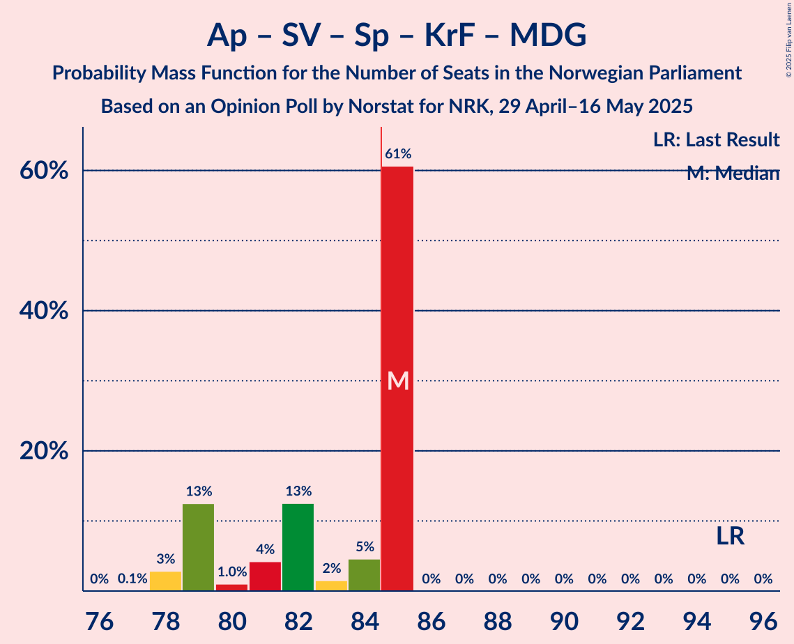

# Opinion Poll by Norstat for NRK, 29 April–16 May 2025

<a href="#voting-intentions">Voting Intentions</a> | <a href="#seats">Seats</a> | <a href="#coalitions">Coalitions</a> | <a href="#technical-information">Technical Information</a>

## Voting Intentions

### Confidence Intervals

| Party | Last Result | Poll Result | 80% Confidence Interval | 90% Confidence Interval | 95% Confidence Interval | 99% Confidence Interval |
|:-----:|:-----------:|:-----------:|:-----------------------:|:-----------------------:|:-----------------------:|:-----------------------:|
| Arbeiderpartiet | 26.2% | 29.4% | 28.9–29.9% |28.8–30.0% |28.6–30.1% |28.4–30.3% |
| Fremskrittspartiet | 11.6% | 20.6% | 20.1–21.0% |20.0–21.1% |19.9–21.2% |19.7–21.4% |
| Høyre | 20.4% | 18.4% | 18.0–18.8% |17.9–18.9% |17.8–19.0% |17.6–19.2% |
| Sosialistisk Venstreparti | 7.6% | 6.5% | 6.2–6.8% |6.2–6.8% |6.1–6.9% |6.0–7.0% |
| Senterpartiet | 13.5% | 5.5% | 5.3–5.7% |5.2–5.8% |5.1–5.9% |5.0–6.0% |
| Rødt | 4.7% | 5.4% | 5.2–5.6% |5.1–5.7% |5.0–5.8% |4.9–5.9% |
| Venstre | 4.6% | 4.0% | 3.8–4.2% |3.7–4.3% |3.7–4.3% |3.6–4.4% |
| Kristelig Folkeparti | 3.8% | 3.5% | 3.3–3.7% |3.2–3.7% |3.2–3.8% |3.1–3.9% |
| Miljøpartiet De Grønne | 3.9% | 3.1% | 2.9–3.3% |2.9–3.4% |2.8–3.4% |2.7–3.5% |
| Norgesdemokratene | 1.1% | 0.8% | 0.7–0.9% |0.7–0.9% |0.7–1.0% |0.6–1.0% |
| Industri- og Næringspartiet | 0.3% | 0.7% | 0.6–0.8% |0.6–0.8% |0.6–0.9% |0.5–0.9% |
| Konservativt | 0.4% | 0.6% | 0.5–0.7% |0.5–0.7% |0.5–0.7% |0.4–0.8% |
| Pensjonistpartiet | 0.6% | 0.3% | 0.2–0.4% |0.2–0.4% |0.2–0.4% |0.2–0.4% |

*Note:* The poll result column reflects the actual value used in the calculations. Published results may vary slightly, and in addition be rounded to fewer digits.

## Seats

### Confidence Intervals

| Party | Last Result | Median | 80% Confidence Interval | 90% Confidence Interval | 95% Confidence Interval | 99% Confidence Interval |
|:-----:|:-----------:|:------:|:-----------------------:|:-----------------------:|:-----------------------:|:-----------------------:|
| <a href="#arbeiderpartiet">Arbeiderpartiet</a> | 48 | 58 | 54–58 |54–58 |53–58 |53–58 |
| <a href="#fremskrittspartiet">Fremskrittspartiet</a> | 21 | 39 | 39–40 |39–41 |39–41 |39–41 |
| <a href="#høyre">Høyre</a> | 36 | 32 | 32–34 |32–35 |32–35 |32–35 |
| <a href="#sosialistisk-venstreparti">Sosialistisk Venstreparti</a> | 13 | 12 | 10–12 |10–12 |10–12 |9–13 |
| <a href="#senterpartiet">Senterpartiet</a> | 28 | 10 | 9–10 |9–10 |9–10 |8–11 |
| <a href="#rødt">Rødt</a> | 8 | 10 | 9–10 |8–10 |8–10 |8–11 |
| <a href="#venstre">Venstre</a> | 8 | 3 | 3–7 |3–7 |3–7 |3–7 |
| <a href="#kristelig-folkeparti">Kristelig Folkeparti</a> | 3 | 3 | 3 |3 |3 |2–3 |
| <a href="#miljøpartiet-de-grønne">Miljøpartiet De Grønne</a> | 3 | 2 | 2 |2 |2–3 |1–3 |
| <a href="#norgesdemokratene">Norgesdemokratene</a> | 0 | 0 | 0 |0 |0 |0 |
| <a href="#industri--og-næringspartiet">Industri- og Næringspartiet</a> | 0 | 0 | 0 |0 |0 |0 |
| <a href="#konservativt">Konservativt</a> | 0 | 0 | 0 |0 |0 |0 |
| <a href="#pensjonistpartiet">Pensjonistpartiet</a> | 0 | 0 | 0 |0 |0 |0 |

### Arbeiderpartiet

*For a full overview of the results for this party, see the [Arbeiderpartiet](party-arbeiderpartiet.html) page.*

| Number of Seats | Probability | Accumulated | Special Marks |
|:---------------:|:-----------:|:-----------:|:-------------:|
| 48 | 0% | 100% | Last Result |
| 49 | 0% | 100% |  |
| 50 | 0% | 100% |  |
| 51 | 0% | 100% |  |
| 52 | 0.1% | 100% |  |
| 53 | 3% | 99.9% |  |
| 54 | 10% | 97% |  |
| 55 | 13% | 87% |  |
| 56 | 4% | 74% |  |
| 57 | 3% | 69% |  |
| 58 | 66% | 66% | Median |
| 59 | 0% | 0% |  |

### Fremskrittspartiet

*For a full overview of the results for this party, see the [Fremskrittspartiet](party-fremskrittspartiet.html) page.*

| Number of Seats | Probability | Accumulated | Special Marks |
|:---------------:|:-----------:|:-----------:|:-------------:|
| 21 | 0% | 100% | Last Result |
| 22 | 0% | 100% |  |
| 23 | 0% | 100% |  |
| 24 | 0% | 100% |  |
| 25 | 0% | 100% |  |
| 26 | 0% | 100% |  |
| 27 | 0% | 100% |  |
| 28 | 0% | 100% |  |
| 29 | 0% | 100% |  |
| 30 | 0% | 100% |  |
| 31 | 0% | 100% |  |
| 32 | 0% | 100% |  |
| 33 | 0% | 100% |  |
| 34 | 0% | 100% |  |
| 35 | 0% | 100% |  |
| 36 | 0% | 100% |  |
| 37 | 0% | 100% |  |
| 38 | 0.2% | 100% |  |
| 39 | 71% | 99.8% | Median |
| 40 | 19% | 29% |  |
| 41 | 10% | 10% |  |
| 42 | 0% | 0% |  |

### Høyre

*For a full overview of the results for this party, see the [Høyre](party-høyre.html) page.*

| Number of Seats | Probability | Accumulated | Special Marks |
|:---------------:|:-----------:|:-----------:|:-------------:|
| 31 | 0.2% | 100% |  |
| 32 | 70% | 99.8% | Median |
| 33 | 4% | 30% |  |
| 34 | 17% | 26% |  |
| 35 | 9% | 9% |  |
| 36 | 0% | 0% | Last Result |

### Sosialistisk Venstreparti

*For a full overview of the results for this party, see the [Sosialistisk Venstreparti](party-sosialistiskvenstreparti.html) page.*

| Number of Seats | Probability | Accumulated | Special Marks |
|:---------------:|:-----------:|:-----------:|:-------------:|
| 9 | 1.4% | 100% |  |
| 10 | 10% | 98.6% |  |
| 11 | 11% | 89% |  |
| 12 | 76% | 78% | Median |
| 13 | 2% | 2% | Last Result |
| 14 | 0% | 0% |  |

### Senterpartiet

*For a full overview of the results for this party, see the [Senterpartiet](party-senterpartiet.html) page.*

| Number of Seats | Probability | Accumulated | Special Marks |
|:---------------:|:-----------:|:-----------:|:-------------:|
| 8 | 1.1% | 100% |  |
| 9 | 22% | 98.9% |  |
| 10 | 76% | 77% | Median |
| 11 | 0.9% | 0.9% |  |
| 12 | 0% | 0% |  |
| 13 | 0% | 0% |  |
| 14 | 0% | 0% |  |
| 15 | 0% | 0% |  |
| 16 | 0% | 0% |  |
| 17 | 0% | 0% |  |
| 18 | 0% | 0% |  |
| 19 | 0% | 0% |  |
| 20 | 0% | 0% |  |
| 21 | 0% | 0% |  |
| 22 | 0% | 0% |  |
| 23 | 0% | 0% |  |
| 24 | 0% | 0% |  |
| 25 | 0% | 0% |  |
| 26 | 0% | 0% |  |
| 27 | 0% | 0% |  |
| 28 | 0% | 0% | Last Result |

### Rødt

*For a full overview of the results for this party, see the [Rødt](party-rødt.html) page.*

| Number of Seats | Probability | Accumulated | Special Marks |
|:---------------:|:-----------:|:-----------:|:-------------:|
| 8 | 7% | 100% | Last Result |
| 9 | 17% | 93% |  |
| 10 | 75% | 76% | Median |
| 11 | 1.1% | 1.1% |  |
| 12 | 0% | 0% |  |

### Venstre

*For a full overview of the results for this party, see the [Venstre](party-venstre.html) page.*

| Number of Seats | Probability | Accumulated | Special Marks |
|:---------------:|:-----------:|:-----------:|:-------------:|
| 3 | 78% | 100% | Median |
| 4 | 0% | 22% |  |
| 5 | 0% | 22% |  |
| 6 | 0.1% | 22% |  |
| 7 | 22% | 22% |  |
| 8 | 0% | 0% | Last Result |

### Kristelig Folkeparti

*For a full overview of the results for this party, see the [Kristelig Folkeparti](party-kristeligfolkeparti.html) page.*

| Number of Seats | Probability | Accumulated | Special Marks |
|:---------------:|:-----------:|:-----------:|:-------------:|
| 2 | 0.8% | 100% |  |
| 3 | 99.0% | 99.1% | Last Result, Median |
| 4 | 0% | 0.1% |  |
| 5 | 0% | 0.1% |  |
| 6 | 0% | 0.1% |  |
| 7 | 0.1% | 0.1% |  |
| 8 | 0% | 0% |  |

### Miljøpartiet De Grønne

*For a full overview of the results for this party, see the [Miljøpartiet De Grønne](party-miljøpartietdegrønne.html) page.*

| Number of Seats | Probability | Accumulated | Special Marks |
|:---------------:|:-----------:|:-----------:|:-------------:|
| 1 | 2% | 100% |  |
| 2 | 95% | 98% | Median |
| 3 | 3% | 3% | Last Result |
| 4 | 0% | 0% |  |

### Norgesdemokratene

*For a full overview of the results for this party, see the [Norgesdemokratene](party-norgesdemokratene.html) page.*

| Number of Seats | Probability | Accumulated | Special Marks |
|:---------------:|:-----------:|:-----------:|:-------------:|
| 0 | 100% | 100% | Last Result, Median |

### Industri- og Næringspartiet

*For a full overview of the results for this party, see the [Industri- og Næringspartiet](party-industri-ognæringspartiet.html) page.*

| Number of Seats | Probability | Accumulated | Special Marks |
|:---------------:|:-----------:|:-----------:|:-------------:|
| 0 | 100% | 100% | Last Result, Median |

### Konservativt

*For a full overview of the results for this party, see the [Konservativt](party-konservativt.html) page.*

| Number of Seats | Probability | Accumulated | Special Marks |
|:---------------:|:-----------:|:-----------:|:-------------:|
| 0 | 100% | 100% | Last Result, Median |

### Pensjonistpartiet

*For a full overview of the results for this party, see the [Pensjonistpartiet](party-pensjonistpartiet.html) page.*

| Number of Seats | Probability | Accumulated | Special Marks |
|:---------------:|:-----------:|:-----------:|:-------------:|
| 0 | 100% | 100% | Last Result, Median |

## Coalitions

### Confidence Intervals

| Coalition | Last Result | Median | Majority? | 80% Confidence Interval | 90% Confidence Interval | 95% Confidence Interval | 99% Confidence Interval |
|:---------:|:-----------:|:------:|:---------:|:-----------------------:|:-----------------------:|:-----------------------:|:-----------------------:|
| Fremskrittspartiet – Høyre – Senterpartiet – Venstre – Kristelig Folkeparti | 96 | 87 | 100% | 87–93 | 87–94 | 87–94 | 87–94 |
| Arbeiderpartiet – Sosialistisk Venstreparti – Senterpartiet – Rødt – Miljøpartiet De Grønne | 100 | 92 | 94% | 85–92 | 84–92 | 84–92 | 84–92 |
| Arbeiderpartiet – Sosialistisk Venstreparti – Senterpartiet – Rødt | 97 | 90 | 84% | 83–90 | 82–90 | 82–90 | 82–90 |
| Fremskrittspartiet – Høyre – Venstre – Kristelig Folkeparti – Miljøpartiet De Grønne | 71 | 79 | 16% | 79–86 | 79–87 | 79–87 | 79–87 |
| Arbeiderpartiet – Sosialistisk Venstreparti – Senterpartiet – Kristelig Folkeparti – Miljøpartiet De Grønne | 95 | 85 | 61% | 79–85 | 79–85 | 78–85 | 78–85 |
| Fremskrittspartiet – Høyre – Venstre – Kristelig Folkeparti | 68 | 77 | 6% | 77–84 | 77–85 | 77–85 | 77–85 |
| Arbeiderpartiet – Sosialistisk Venstreparti – Rødt – Miljøpartiet De Grønne | 72 | 82 | 0% | 76–82 | 75–82 | 75–82 | 75–82 |
| Arbeiderpartiet – Sosialistisk Venstreparti – Senterpartiet – Miljøpartiet De Grønne | 92 | 82 | 0% | 76–82 | 76–82 | 75–82 | 75–82 |
| Fremskrittspartiet – Høyre – Venstre | 65 | 74 | 0% | 74–81 | 74–82 | 74–82 | 74–82 |
| Arbeiderpartiet – Sosialistisk Venstreparti – Senterpartiet | 89 | 80 | 0% | 74–80 | 74–80 | 73–80 | 73–80 |
| Fremskrittspartiet – Høyre | 57 | 71 | 0% | 71–74 | 71–75 | 71–75 | 71–75 |
| Arbeiderpartiet – Senterpartiet – Kristelig Folkeparti – Miljøpartiet De Grønne | 82 | 73 | 0% | 68–73 | 68–73 | 68–73 | 67–73 |
| Arbeiderpartiet – Senterpartiet – Kristelig Folkeparti | 79 | 71 | 0% | 66–71 | 66–71 | 66–71 | 65–71 |
| Arbeiderpartiet – Sosialistisk Venstreparti | 61 | 70 | 0% | 65–70 | 65–70 | 64–70 | 64–70 |
| Arbeiderpartiet – Senterpartiet | 76 | 68 | 0% | 63–68 | 63–68 | 63–68 | 62–68 |
| Høyre – Venstre – Kristelig Folkeparti | 47 | 38 | 0% | 38–44 | 38–44 | 38–44 | 38–44 |
| Senterpartiet – Venstre – Kristelig Folkeparti | 39 | 16 | 0% | 16–19 | 16–19 | 15–19 | 15–20 |

### Fremskrittspartiet – Høyre – Senterpartiet – Venstre – Kristelig Folkeparti

| Number of Seats | Probability | Accumulated | Special Marks |
|:---------------:|:-----------:|:-----------:|:-------------:|
| 86 | 0.1% | 100% |  |
| 87 | 62% | 99.9% | Median |
| 88 | 3% | 38% |  |
| 89 | 1.0% | 34% |  |
| 90 | 9% | 33% |  |
| 91 | 6% | 24% |  |
| 92 | 3% | 18% |  |
| 93 | 8% | 15% |  |
| 94 | 7% | 7% |  |
| 95 | 0% | 0% |  |
| 96 | 0% | 0% | Last Result |

### Arbeiderpartiet – Sosialistisk Venstreparti – Senterpartiet – Rødt – Miljøpartiet De Grønne

| Number of Seats | Probability | Accumulated | Special Marks |
|:---------------:|:-----------:|:-----------:|:-------------:|
| 84 | 6% | 100% |  |
| 85 | 10% | 94% | Majority |
| 86 | 0.8% | 84% |  |
| 87 | 6% | 84% |  |
| 88 | 2% | 78% |  |
| 89 | 9% | 76% |  |
| 90 | 1.0% | 67% |  |
| 91 | 6% | 66% |  |
| 92 | 60% | 60% | Median |
| 93 | 0% | 0% |  |
| 94 | 0% | 0% |  |
| 95 | 0% | 0% |  |
| 96 | 0% | 0% |  |
| 97 | 0% | 0% |  |
| 98 | 0% | 0% |  |
| 99 | 0% | 0% |  |
| 100 | 0% | 0% | Last Result |

### Arbeiderpartiet – Sosialistisk Venstreparti – Senterpartiet – Rødt

| Number of Seats | Probability | Accumulated | Special Marks |
|:---------------:|:-----------:|:-----------:|:-------------:|
| 82 | 6% | 100% |  |
| 83 | 10% | 94% |  |
| 84 | 0.7% | 85% |  |
| 85 | 6% | 84% | Majority |
| 86 | 2% | 78% |  |
| 87 | 10% | 76% |  |
| 88 | 3% | 66% |  |
| 89 | 4% | 63% |  |
| 90 | 60% | 60% | Median |
| 91 | 0% | 0% |  |
| 92 | 0% | 0% |  |
| 93 | 0% | 0% |  |
| 94 | 0% | 0% |  |
| 95 | 0% | 0% |  |
| 96 | 0% | 0% |  |
| 97 | 0% | 0% | Last Result |

### Fremskrittspartiet – Høyre – Venstre – Kristelig Folkeparti – Miljøpartiet De Grønne

| Number of Seats | Probability | Accumulated | Special Marks |
|:---------------:|:-----------:|:-----------:|:-------------:|
| 71 | 0% | 100% | Last Result |
| 72 | 0% | 100% |  |
| 73 | 0% | 100% |  |
| 74 | 0% | 100% |  |
| 75 | 0% | 100% |  |
| 76 | 0% | 100% |  |
| 77 | 0% | 100% |  |
| 78 | 0% | 100% |  |
| 79 | 60% | 100% | Median |
| 80 | 4% | 40% |  |
| 81 | 3% | 37% |  |
| 82 | 10% | 34% |  |
| 83 | 2% | 24% |  |
| 84 | 6% | 22% |  |
| 85 | 0.7% | 16% | Majority |
| 86 | 10% | 15% |  |
| 87 | 6% | 6% |  |
| 88 | 0% | 0% |  |

### Arbeiderpartiet – Sosialistisk Venstreparti – Senterpartiet – Kristelig Folkeparti – Miljøpartiet De Grønne

| Number of Seats | Probability | Accumulated | Special Marks |
|:---------------:|:-----------:|:-----------:|:-------------:|
| 77 | 0.1% | 100% |  |
| 78 | 3% | 99.9% |  |
| 79 | 13% | 97% |  |
| 80 | 1.0% | 85% |  |
| 81 | 4% | 84% |  |
| 82 | 13% | 79% |  |
| 83 | 2% | 67% |  |
| 84 | 5% | 65% |  |
| 85 | 61% | 61% | Median, Majority |
| 86 | 0% | 0% |  |
| 87 | 0% | 0% |  |
| 88 | 0% | 0% |  |
| 89 | 0% | 0% |  |
| 90 | 0% | 0% |  |
| 91 | 0% | 0% |  |
| 92 | 0% | 0% |  |
| 93 | 0% | 0% |  |
| 94 | 0% | 0% |  |
| 95 | 0% | 0% | Last Result |

### Fremskrittspartiet – Høyre – Venstre – Kristelig Folkeparti

| Number of Seats | Probability | Accumulated | Special Marks |
|:---------------:|:-----------:|:-----------:|:-------------:|
| 68 | 0% | 100% | Last Result |
| 69 | 0% | 100% |  |
| 70 | 0% | 100% |  |
| 71 | 0% | 100% |  |
| 72 | 0% | 100% |  |
| 73 | 0% | 100% |  |
| 74 | 0% | 100% |  |
| 75 | 0% | 100% |  |
| 76 | 0% | 100% |  |
| 77 | 60% | 100% | Median |
| 78 | 6% | 40% |  |
| 79 | 1.0% | 34% |  |
| 80 | 9% | 33% |  |
| 81 | 2% | 24% |  |
| 82 | 6% | 22% |  |
| 83 | 0.8% | 16% |  |
| 84 | 10% | 16% |  |
| 85 | 6% | 6% | Majority |
| 86 | 0% | 0% |  |

### Arbeiderpartiet – Sosialistisk Venstreparti – Rødt – Miljøpartiet De Grønne

| Number of Seats | Probability | Accumulated | Special Marks |
|:---------------:|:-----------:|:-----------:|:-------------:|
| 72 | 0% | 100% | Last Result |
| 73 | 0% | 100% |  |
| 74 | 0% | 100% |  |
| 75 | 7% | 100% |  |
| 76 | 8% | 93% |  |
| 77 | 3% | 85% |  |
| 78 | 6% | 82% |  |
| 79 | 9% | 76% |  |
| 80 | 1.0% | 67% |  |
| 81 | 3% | 66% |  |
| 82 | 62% | 62% | Median |
| 83 | 0.1% | 0.1% |  |
| 84 | 0% | 0% |  |

### Arbeiderpartiet – Sosialistisk Venstreparti – Senterpartiet – Miljøpartiet De Grønne

| Number of Seats | Probability | Accumulated | Special Marks |
|:---------------:|:-----------:|:-----------:|:-------------:|
| 75 | 3% | 100% |  |
| 76 | 13% | 97% |  |
| 77 | 0.9% | 85% |  |
| 78 | 4% | 84% |  |
| 79 | 13% | 79% |  |
| 80 | 2% | 67% |  |
| 81 | 4% | 65% |  |
| 82 | 61% | 61% | Median |
| 83 | 0% | 0% |  |
| 84 | 0% | 0% |  |
| 85 | 0% | 0% | Majority |
| 86 | 0% | 0% |  |
| 87 | 0% | 0% |  |
| 88 | 0% | 0% |  |
| 89 | 0% | 0% |  |
| 90 | 0% | 0% |  |
| 91 | 0% | 0% |  |
| 92 | 0% | 0% | Last Result |

### Fremskrittspartiet – Høyre – Venstre

| Number of Seats | Probability | Accumulated | Special Marks |
|:---------------:|:-----------:|:-----------:|:-------------:|
| 65 | 0% | 100% | Last Result |
| 66 | 0% | 100% |  |
| 67 | 0% | 100% |  |
| 68 | 0% | 100% |  |
| 69 | 0% | 100% |  |
| 70 | 0% | 100% |  |
| 71 | 0% | 100% |  |
| 72 | 0% | 100% |  |
| 73 | 0% | 100% |  |
| 74 | 60% | 100% | Median |
| 75 | 6% | 40% |  |
| 76 | 1.1% | 35% |  |
| 77 | 9% | 33% |  |
| 78 | 2% | 24% |  |
| 79 | 6% | 22% |  |
| 80 | 0.8% | 16% |  |
| 81 | 9% | 15% |  |
| 82 | 6% | 6% |  |
| 83 | 0% | 0% |  |

### Arbeiderpartiet – Sosialistisk Venstreparti – Senterpartiet

| Number of Seats | Probability | Accumulated | Special Marks |
|:---------------:|:-----------:|:-----------:|:-------------:|
| 73 | 3% | 100% |  |
| 74 | 13% | 97% |  |
| 75 | 0.5% | 84% |  |
| 76 | 4% | 84% |  |
| 77 | 13% | 80% |  |
| 78 | 4% | 67% |  |
| 79 | 2% | 63% |  |
| 80 | 61% | 61% | Median |
| 81 | 0% | 0% |  |
| 82 | 0% | 0% |  |
| 83 | 0% | 0% |  |
| 84 | 0% | 0% |  |
| 85 | 0% | 0% | Majority |
| 86 | 0% | 0% |  |
| 87 | 0% | 0% |  |
| 88 | 0% | 0% |  |
| 89 | 0% | 0% | Last Result |

### Fremskrittspartiet – Høyre

| Number of Seats | Probability | Accumulated | Special Marks |
|:---------------:|:-----------:|:-----------:|:-------------:|
| 57 | 0% | 100% | Last Result |
| 58 | 0% | 100% |  |
| 59 | 0% | 100% |  |
| 60 | 0% | 100% |  |
| 61 | 0% | 100% |  |
| 62 | 0% | 100% |  |
| 63 | 0% | 100% |  |
| 64 | 0% | 100% |  |
| 65 | 0% | 100% |  |
| 66 | 0% | 100% |  |
| 67 | 0% | 100% |  |
| 68 | 0% | 100% |  |
| 69 | 0% | 100% |  |
| 70 | 0.1% | 100% |  |
| 71 | 60% | 99.9% | Median |
| 72 | 12% | 40% |  |
| 73 | 2% | 28% |  |
| 74 | 19% | 27% |  |
| 75 | 8% | 8% |  |
| 76 | 0.3% | 0.3% |  |
| 77 | 0% | 0% |  |

### Arbeiderpartiet – Senterpartiet – Kristelig Folkeparti – Miljøpartiet De Grønne

| Number of Seats | Probability | Accumulated | Special Marks |
|:---------------:|:-----------:|:-----------:|:-------------:|
| 66 | 0.1% | 100% |  |
| 67 | 2% | 99.9% |  |
| 68 | 9% | 98% |  |
| 69 | 7% | 89% |  |
| 70 | 10% | 82% |  |
| 71 | 3% | 72% |  |
| 72 | 8% | 69% |  |
| 73 | 61% | 61% | Median |
| 74 | 0.1% | 0.1% |  |
| 75 | 0% | 0% |  |
| 76 | 0% | 0% |  |
| 77 | 0% | 0% |  |
| 78 | 0% | 0% |  |
| 79 | 0% | 0% |  |
| 80 | 0% | 0% |  |
| 81 | 0% | 0% |  |
| 82 | 0% | 0% | Last Result |

### Arbeiderpartiet – Senterpartiet – Kristelig Folkeparti

| Number of Seats | Probability | Accumulated | Special Marks |
|:---------------:|:-----------:|:-----------:|:-------------:|
| 64 | 0.1% | 100% |  |
| 65 | 2% | 99.9% |  |
| 66 | 9% | 98% |  |
| 67 | 7% | 89% |  |
| 68 | 10% | 82% |  |
| 69 | 6% | 72% |  |
| 70 | 5% | 66% |  |
| 71 | 61% | 61% | Median |
| 72 | 0.1% | 0.1% |  |
| 73 | 0% | 0% |  |
| 74 | 0% | 0% |  |
| 75 | 0% | 0% |  |
| 76 | 0% | 0% |  |
| 77 | 0% | 0% |  |
| 78 | 0% | 0% |  |
| 79 | 0% | 0% | Last Result |

### Arbeiderpartiet – Sosialistisk Venstreparti

| Number of Seats | Probability | Accumulated | Special Marks |
|:---------------:|:-----------:|:-----------:|:-------------:|
| 61 | 0% | 100% | Last Result |
| 62 | 0% | 100% |  |
| 63 | 0.1% | 100% |  |
| 64 | 4% | 99.9% |  |
| 65 | 11% | 96% |  |
| 66 | 2% | 85% |  |
| 67 | 12% | 83% |  |
| 68 | 5% | 70% |  |
| 69 | 4% | 65% |  |
| 70 | 61% | 61% | Median |
| 71 | 0% | 0% |  |

### Arbeiderpartiet – Senterpartiet

| Number of Seats | Probability | Accumulated | Special Marks |
|:---------------:|:-----------:|:-----------:|:-------------:|
| 62 | 2% | 100% |  |
| 63 | 9% | 98% |  |
| 64 | 7% | 89% |  |
| 65 | 10% | 82% |  |
| 66 | 6% | 72% |  |
| 67 | 5% | 67% |  |
| 68 | 61% | 61% | Median |
| 69 | 0.1% | 0.1% |  |
| 70 | 0% | 0% |  |
| 71 | 0% | 0% |  |
| 72 | 0% | 0% |  |
| 73 | 0% | 0% |  |
| 74 | 0% | 0% |  |
| 75 | 0% | 0% |  |
| 76 | 0% | 0% | Last Result |

### Høyre – Venstre – Kristelig Folkeparti

| Number of Seats | Probability | Accumulated | Special Marks |
|:---------------:|:-----------:|:-----------:|:-------------:|
| 38 | 64% | 100% | Median |
| 39 | 3% | 36% |  |
| 40 | 2% | 33% |  |
| 41 | 9% | 31% |  |
| 42 | 6% | 22% |  |
| 43 | 0.8% | 16% |  |
| 44 | 15% | 15% |  |
| 45 | 0% | 0% |  |
| 46 | 0% | 0% |  |
| 47 | 0% | 0% | Last Result |

### Senterpartiet – Venstre – Kristelig Folkeparti

| Number of Seats | Probability | Accumulated | Special Marks |
|:---------------:|:-----------:|:-----------:|:-------------:|
| 15 | 3% | 100% |  |
| 16 | 74% | 97% | Median |
| 17 | 0.6% | 23% |  |
| 18 | 1.2% | 22% |  |
| 19 | 19% | 21% |  |
| 20 | 2% | 2% |  |
| 21 | 0% | 0% |  |
| 22 | 0% | 0% |  |
| 23 | 0% | 0% |  |
| 24 | 0% | 0% |  |
| 25 | 0% | 0% |  |
| 26 | 0% | 0% |  |
| 27 | 0% | 0% |  |
| 28 | 0% | 0% |  |
| 29 | 0% | 0% |  |
| 30 | 0% | 0% |  |
| 31 | 0% | 0% |  |
| 32 | 0% | 0% |  |
| 33 | 0% | 0% |  |
| 34 | 0% | 0% |  |
| 35 | 0% | 0% |  |
| 36 | 0% | 0% |  |
| 37 | 0% | 0% |  |
| 38 | 0% | 0% |  |
| 39 | 0% | 0% | Last Result |

## Technical Information

### Opinion Poll

+ **Polling firm:** Norstat
+ **Commissioner(s):** NRK
+ **Fieldwork period:** 29 April–16 May 2025

### Calculations

+ **Sample size:** 15200
+ **Simulations done:** 2,097,152
+ **Error estimate:** 0.78%

