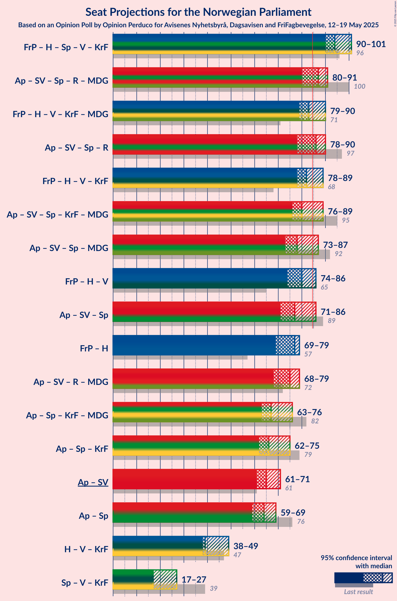
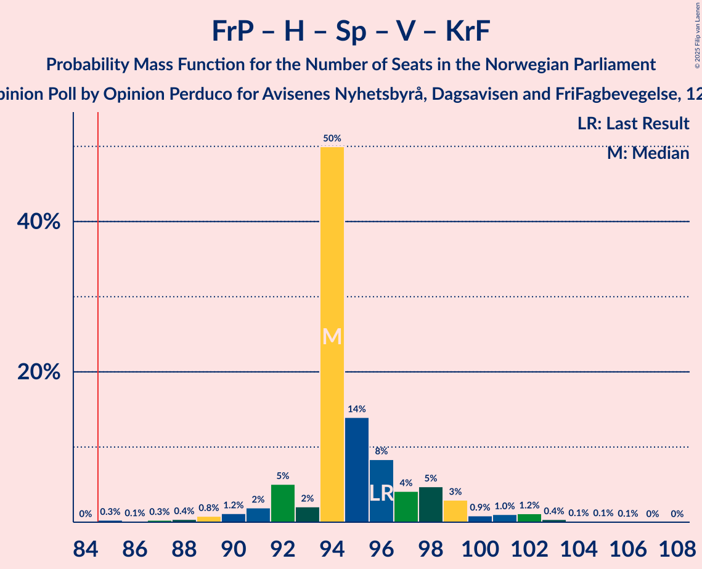
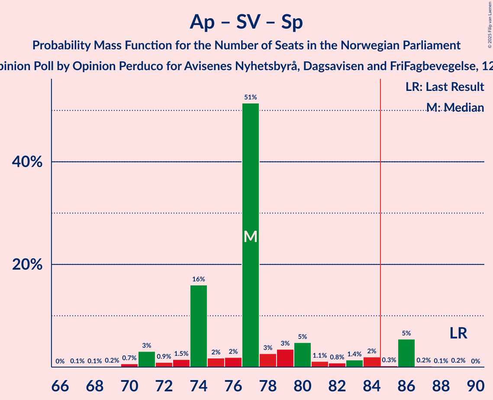

# Opinion Poll by Opinion Perduco for Avisenes Nyhetsbyrå, Dagsavisen and FriFagbevegelse, 12–19 May 2025

<a href="#voting-intentions">Voting Intentions</a> | <a href="#seats">Seats</a> | <a href="#coalitions">Coalitions</a> | <a href="#technical-information">Technical Information</a>

## Voting Intentions

### Confidence Intervals

| Party | Last Result | Poll Result | 80% Confidence Interval | 90% Confidence Interval | 95% Confidence Interval | 99% Confidence Interval |
|:-----:|:-----------:|:-----------:|:-----------------------:|:-----------------------:|:-----------------------:|:-----------------------:|
| Arbeiderpartiet | 26.2% | 27.5% | 25.7–29.4% |25.2–29.9% |24.8–30.4% |24.0–31.3% |
| Fremskrittspartiet | 11.6% | 21.0% | 19.4–22.7% |19.0–23.2% |18.6–23.6% |17.8–24.5% |
| Høyre | 20.4% | 17.9% | 16.4–19.5% |16.0–20.0% |15.6–20.4% |15.0–21.2% |
| Sosialistisk Venstreparti | 7.6% | 7.2% | 6.2–8.4% |6.0–8.7% |5.7–9.0% |5.3–9.6% |
| Senterpartiet | 13.5% | 6.2% | 5.3–7.3% |5.1–7.6% |4.9–7.9% |4.5–8.4% |
| Rødt | 4.7% | 4.3% | 3.6–5.2% |3.4–5.5% |3.2–5.7% |2.9–6.2% |
| Venstre | 4.6% | 4.2% | 3.5–5.1% |3.3–5.4% |3.1–5.6% |2.8–6.1% |
| Kristelig Folkeparti | 3.8% | 3.4% | 2.8–4.3% |2.6–4.5% |2.4–4.7% |2.2–5.2% |
| Miljøpartiet De Grønne | 3.9% | 2.7% | 2.1–3.5% |2.0–3.7% |1.9–3.9% |1.6–4.3% |
| Norgesdemokratene | 1.1% | 1.4% | 1.0–2.0% |0.9–2.2% |0.8–2.3% |0.7–2.7% |
| Industri- og Næringspartiet | 0.3% | 1.4% | 1.0–2.0% |0.9–2.2% |0.8–2.3% |0.7–2.7% |
| Konservativt | 0.4% | 1.2% | 0.9–1.8% |0.8–1.9% |0.7–2.1% |0.5–2.4% |

*Note:* The poll result column reflects the actual value used in the calculations. Published results may vary slightly, and in addition be rounded to fewer digits.

## Seats

### Confidence Intervals

| Party | Last Result | Median | 80% Confidence Interval | 90% Confidence Interval | 95% Confidence Interval | 99% Confidence Interval |
|:-----:|:-----------:|:------:|:-----------------------:|:-----------------------:|:-----------------------:|:-----------------------:|
| <a href="#arbeiderpartiet">Arbeiderpartiet</a> | 48 | 52 | 50–54 |49–56 |48–57 |46–60 |
| <a href="#fremskrittspartiet">Fremskrittspartiet</a> | 21 | 43 | 38–43 |37–43 |37–45 |35–46 |
| <a href="#høyre">Høyre</a> | 36 | 34 | 32–36 |30–37 |30–38 |28–39 |
| <a href="#sosialistisk-venstreparti">Sosialistisk Venstreparti</a> | 13 | 13 | 12–15 |11–17 |10–17 |9–18 |
| <a href="#senterpartiet">Senterpartiet</a> | 28 | 12 | 9–14 |9–15 |9–15 |8–16 |
| <a href="#rødt">Rødt</a> | 8 | 9 | 1–9 |1–9 |1–10 |1–11 |
| <a href="#venstre">Venstre</a> | 8 | 3 | 3–8 |3–9 |3–9 |2–11 |
| <a href="#kristelig-folkeparti">Kristelig Folkeparti</a> | 3 | 2 | 2–3 |2–7 |1–8 |1–8 |
| <a href="#miljøpartiet-de-grønne">Miljøpartiet De Grønne</a> | 3 | 1 | 1–2 |1–3 |1–3 |1–4 |
| <a href="#norgesdemokratene">Norgesdemokratene</a> | 0 | 0 | 0 |0 |0 |0 |
| <a href="#industri--og-næringspartiet">Industri- og Næringspartiet</a> | 0 | 0 | 0 |0 |0 |0–2 |
| <a href="#konservativt">Konservativt</a> | 0 | 0 | 0 |0 |0 |0 |

### Arbeiderpartiet

*For a full overview of the results for this party, see the [Arbeiderpartiet](party-arbeiderpartiet.html) page.*

| Number of Seats | Probability | Accumulated | Special Marks |
|:---------------:|:-----------:|:-----------:|:-------------:|
| 44 | 0.1% | 100% |  |
| 45 | 0.1% | 99.9% |  |
| 46 | 0.5% | 99.8% |  |
| 47 | 2% | 99.4% |  |
| 48 | 2% | 98% | Last Result |
| 49 | 3% | 96% |  |
| 50 | 6% | 93% |  |
| 51 | 1.2% | 87% |  |
| 52 | 52% | 86% | Median |
| 53 | 15% | 34% |  |
| 54 | 11% | 19% |  |
| 55 | 1.5% | 8% |  |
| 56 | 4% | 7% |  |
| 57 | 1.2% | 3% |  |
| 58 | 0.3% | 2% |  |
| 59 | 0.3% | 1.2% |  |
| 60 | 0.6% | 0.9% |  |
| 61 | 0.1% | 0.3% |  |
| 62 | 0.1% | 0.2% |  |
| 63 | 0.1% | 0.1% |  |
| 64 | 0% | 0% |  |

### Fremskrittspartiet

*For a full overview of the results for this party, see the [Fremskrittspartiet](party-fremskrittspartiet.html) page.*

| Number of Seats | Probability | Accumulated | Special Marks |
|:---------------:|:-----------:|:-----------:|:-------------:|
| 21 | 0% | 100% | Last Result |
| 22 | 0% | 100% |  |
| 23 | 0% | 100% |  |
| 24 | 0% | 100% |  |
| 25 | 0% | 100% |  |
| 26 | 0% | 100% |  |
| 27 | 0% | 100% |  |
| 28 | 0% | 100% |  |
| 29 | 0% | 100% |  |
| 30 | 0% | 100% |  |
| 31 | 0% | 100% |  |
| 32 | 0% | 100% |  |
| 33 | 0.2% | 100% |  |
| 34 | 0.2% | 99.8% |  |
| 35 | 0.6% | 99.6% |  |
| 36 | 0.8% | 99.0% |  |
| 37 | 4% | 98% |  |
| 38 | 5% | 94% |  |
| 39 | 4% | 89% |  |
| 40 | 8% | 85% |  |
| 41 | 4% | 77% |  |
| 42 | 20% | 73% |  |
| 43 | 50% | 54% | Median |
| 44 | 1.3% | 4% |  |
| 45 | 2% | 3% |  |
| 46 | 0.5% | 0.7% |  |
| 47 | 0% | 0.2% |  |
| 48 | 0.1% | 0.1% |  |
| 49 | 0% | 0% |  |

### Høyre

*For a full overview of the results for this party, see the [Høyre](party-høyre.html) page.*

| Number of Seats | Probability | Accumulated | Special Marks |
|:---------------:|:-----------:|:-----------:|:-------------:|
| 26 | 0% | 100% |  |
| 27 | 0.2% | 99.9% |  |
| 28 | 0.4% | 99.7% |  |
| 29 | 0.4% | 99.3% |  |
| 30 | 5% | 98.9% |  |
| 31 | 3% | 94% |  |
| 32 | 6% | 91% |  |
| 33 | 6% | 86% |  |
| 34 | 52% | 80% | Median |
| 35 | 15% | 28% |  |
| 36 | 8% | 13% | Last Result |
| 37 | 2% | 5% |  |
| 38 | 2% | 3% |  |
| 39 | 0.3% | 0.6% |  |
| 40 | 0% | 0.3% |  |
| 41 | 0.2% | 0.2% |  |
| 42 | 0% | 0% |  |

### Sosialistisk Venstreparti

*For a full overview of the results for this party, see the [Sosialistisk Venstreparti](party-sosialistiskvenstreparti.html) page.*

| Number of Seats | Probability | Accumulated | Special Marks |
|:---------------:|:-----------:|:-----------:|:-------------:|
| 8 | 0.5% | 100% |  |
| 9 | 0.4% | 99.5% |  |
| 10 | 2% | 99.1% |  |
| 11 | 3% | 97% |  |
| 12 | 15% | 94% |  |
| 13 | 55% | 79% | Last Result, Median |
| 14 | 12% | 24% |  |
| 15 | 2% | 12% |  |
| 16 | 3% | 10% |  |
| 17 | 6% | 7% |  |
| 18 | 0.6% | 0.8% |  |
| 19 | 0.1% | 0.2% |  |
| 20 | 0.1% | 0.1% |  |
| 21 | 0% | 0% |  |

### Senterpartiet

*For a full overview of the results for this party, see the [Senterpartiet](party-senterpartiet.html) page.*

| Number of Seats | Probability | Accumulated | Special Marks |
|:---------------:|:-----------:|:-----------:|:-------------:|
| 7 | 0% | 100% |  |
| 8 | 2% | 99.9% |  |
| 9 | 15% | 98% |  |
| 10 | 3% | 83% |  |
| 11 | 10% | 80% |  |
| 12 | 56% | 70% | Median |
| 13 | 4% | 15% |  |
| 14 | 3% | 10% |  |
| 15 | 6% | 8% |  |
| 16 | 1.1% | 1.3% |  |
| 17 | 0.1% | 0.1% |  |
| 18 | 0% | 0% |  |
| 19 | 0% | 0% |  |
| 20 | 0% | 0% |  |
| 21 | 0% | 0% |  |
| 22 | 0% | 0% |  |
| 23 | 0% | 0% |  |
| 24 | 0% | 0% |  |
| 25 | 0% | 0% |  |
| 26 | 0% | 0% |  |
| 27 | 0% | 0% |  |
| 28 | 0% | 0% | Last Result |

### Rødt

*For a full overview of the results for this party, see the [Rødt](party-rødt.html) page.*

| Number of Seats | Probability | Accumulated | Special Marks |
|:---------------:|:-----------:|:-----------:|:-------------:|
| 1 | 16% | 100% |  |
| 2 | 0.4% | 84% |  |
| 3 | 0.1% | 84% |  |
| 4 | 0% | 83% |  |
| 5 | 0% | 83% |  |
| 6 | 0% | 83% |  |
| 7 | 2% | 83% |  |
| 8 | 23% | 82% | Last Result |
| 9 | 55% | 58% | Median |
| 10 | 2% | 3% |  |
| 11 | 0.9% | 1.1% |  |
| 12 | 0.2% | 0.3% |  |
| 13 | 0% | 0% |  |

### Venstre

*For a full overview of the results for this party, see the [Venstre](party-venstre.html) page.*

| Number of Seats | Probability | Accumulated | Special Marks |
|:---------------:|:-----------:|:-----------:|:-------------:|
| 2 | 0.7% | 100% |  |
| 3 | 62% | 99.2% | Median |
| 4 | 0% | 37% |  |
| 5 | 0% | 37% |  |
| 6 | 0.1% | 37% |  |
| 7 | 16% | 37% |  |
| 8 | 15% | 22% | Last Result |
| 9 | 5% | 7% |  |
| 10 | 1.2% | 2% |  |
| 11 | 1.0% | 1.2% |  |
| 12 | 0.2% | 0.2% |  |
| 13 | 0% | 0% |  |

### Kristelig Folkeparti

*For a full overview of the results for this party, see the [Kristelig Folkeparti](party-kristeligfolkeparti.html) page.*

| Number of Seats | Probability | Accumulated | Special Marks |
|:---------------:|:-----------:|:-----------:|:-------------:|
| 0 | 0.4% | 100% |  |
| 1 | 4% | 99.6% |  |
| 2 | 73% | 96% | Median |
| 3 | 16% | 22% | Last Result |
| 4 | 0% | 7% |  |
| 5 | 0% | 7% |  |
| 6 | 0% | 7% |  |
| 7 | 2% | 7% |  |
| 8 | 4% | 5% |  |
| 9 | 0.4% | 0.5% |  |
| 10 | 0.1% | 0.1% |  |
| 11 | 0% | 0% |  |

### Miljøpartiet De Grønne

*For a full overview of the results for this party, see the [Miljøpartiet De Grønne](party-miljøpartietdegrønne.html) page.*

| Number of Seats | Probability | Accumulated | Special Marks |
|:---------------:|:-----------:|:-----------:|:-------------:|
| 0 | 0.2% | 100% |  |
| 1 | 83% | 99.8% | Median |
| 2 | 10% | 16% |  |
| 3 | 6% | 6% | Last Result |
| 4 | 0% | 0.5% |  |
| 5 | 0% | 0.5% |  |
| 6 | 0% | 0.5% |  |
| 7 | 0.3% | 0.5% |  |
| 8 | 0.1% | 0.2% |  |
| 9 | 0.1% | 0.1% |  |
| 10 | 0% | 0% |  |

### Norgesdemokratene

*For a full overview of the results for this party, see the [Norgesdemokratene](party-norgesdemokratene.html) page.*

| Number of Seats | Probability | Accumulated | Special Marks |
|:---------------:|:-----------:|:-----------:|:-------------:|
| 0 | 100% | 100% | Last Result, Median |

### Industri- og Næringspartiet

*For a full overview of the results for this party, see the [Industri- og Næringspartiet](party-industri-ognæringspartiet.html) page.*

| Number of Seats | Probability | Accumulated | Special Marks |
|:---------------:|:-----------:|:-----------:|:-------------:|
| 0 | 98.7% | 100% | Last Result, Median |
| 1 | 0.4% | 1.3% |  |
| 2 | 1.0% | 1.0% |  |
| 3 | 0% | 0% |  |

### Konservativt

*For a full overview of the results for this party, see the [Konservativt](party-konservativt.html) page.*

| Number of Seats | Probability | Accumulated | Special Marks |
|:---------------:|:-----------:|:-----------:|:-------------:|
| 0 | 100% | 100% | Last Result, Median |

## Coalitions

### Confidence Intervals

| Coalition | Last Result | Median | Majority? | 80% Confidence Interval | 90% Confidence Interval | 95% Confidence Interval | 99% Confidence Interval |
|:---------:|:-----------:|:------:|:---------:|:-----------------------:|:-----------------------:|:-----------------------:|:-----------------------:|
| Fremskrittspartiet – Høyre – Senterpartiet – Venstre – Kristelig Folkeparti | 96 | 94 | 100% | 92–98 | 91–99 | 90–101 | 87–103 |
| Arbeiderpartiet – Sosialistisk Venstreparti – Senterpartiet – Rødt – Miljøpartiet De Grønne | 100 | 87 | 70% | 82–88 | 81–89 | 80–91 | 78–94 |
| Fremskrittspartiet – Høyre – Venstre – Kristelig Folkeparti – Miljøpartiet De Grønne | 71 | 83 | 33% | 82–88 | 81–90 | 79–90 | 76–93 |
| Arbeiderpartiet – Sosialistisk Venstreparti – Senterpartiet – Rødt | 97 | 86 | 67% | 81–87 | 79–87 | 78–90 | 75–93 |
| Fremskrittspartiet – Høyre – Venstre – Kristelig Folkeparti | 68 | 82 | 29% | 81–87 | 80–88 | 78–89 | 75–91 |
| Arbeiderpartiet – Sosialistisk Venstreparti – Senterpartiet – Kristelig Folkeparti – Miljøpartiet De Grønne | 95 | 80 | 13% | 77–88 | 77–89 | 76–89 | 74–94 |
| Arbeiderpartiet – Sosialistisk Venstreparti – Senterpartiet – Miljøpartiet De Grønne | 92 | 78 | 9% | 75–84 | 74–87 | 73–87 | 72–88 |
| Fremskrittspartiet – Høyre – Venstre | 65 | 80 | 6% | 78–84 | 76–85 | 74–86 | 71–87 |
| Arbeiderpartiet – Sosialistisk Venstreparti – Senterpartiet | 89 | 77 | 6% | 74–82 | 73–86 | 71–86 | 70–86 |
| Fremskrittspartiet – Høyre | 57 | 77 | 0% | 71–77 | 69–78 | 69–79 | 66–82 |
| Arbeiderpartiet – Sosialistisk Venstreparti – Rødt – Miljøpartiet De Grønne | 72 | 75 | 0% | 71–76 | 70–78 | 68–79 | 66–82 |
| Arbeiderpartiet – Senterpartiet – Kristelig Folkeparti – Miljøpartiet De Grønne | 82 | 67 | 0% | 65–72 | 64–74 | 63–76 | 63–79 |
| Arbeiderpartiet – Senterpartiet – Kristelig Folkeparti | 79 | 66 | 0% | 64–71 | 62–72 | 62–75 | 61–77 |
| Arbeiderpartiet – Sosialistisk Venstreparti | 61 | 65 | 0% | 63–69 | 62–71 | 61–71 | 58–74 |
| Arbeiderpartiet – Senterpartiet | 76 | 64 | 0% | 61–68 | 60–69 | 59–69 | 58–72 |
| Høyre – Venstre – Kristelig Folkeparti | 47 | 39 | 0% | 39–46 | 39–47 | 38–49 | 36–50 |
| Senterpartiet – Venstre – Kristelig Folkeparti | 39 | 17 | 0% | 17–24 | 17–25 | 17–27 | 15–30 |

### Fremskrittspartiet – Høyre – Senterpartiet – Venstre – Kristelig Folkeparti

| Number of Seats | Probability | Accumulated | Special Marks |
|:---------------:|:-----------:|:-----------:|:-------------:|
| 85 | 0.3% | 100% | Majority |
| 86 | 0.1% | 99.7% |  |
| 87 | 0.3% | 99.6% |  |
| 88 | 0.4% | 99.3% |  |
| 89 | 0.8% | 98.9% |  |
| 90 | 1.2% | 98% |  |
| 91 | 2% | 97% |  |
| 92 | 5% | 95% |  |
| 93 | 2% | 90% |  |
| 94 | 50% | 88% | Median |
| 95 | 14% | 38% |  |
| 96 | 8% | 24% | Last Result |
| 97 | 4% | 16% |  |
| 98 | 5% | 11% |  |
| 99 | 3% | 7% |  |
| 100 | 0.9% | 4% |  |
| 101 | 1.0% | 3% |  |
| 102 | 1.2% | 2% |  |
| 103 | 0.4% | 0.7% |  |
| 104 | 0.1% | 0.3% |  |
| 105 | 0.1% | 0.2% |  |
| 106 | 0.1% | 0.1% |  |
| 107 | 0% | 0% |  |

### Arbeiderpartiet – Sosialistisk Venstreparti – Senterpartiet – Rødt – Miljøpartiet De Grønne

| Number of Seats | Probability | Accumulated | Special Marks |
|:---------------:|:-----------:|:-----------:|:-------------:|
| 75 | 0.1% | 100% |  |
| 76 | 0.1% | 99.8% |  |
| 77 | 0.1% | 99.7% |  |
| 78 | 0.4% | 99.6% |  |
| 79 | 0.7% | 99.2% |  |
| 80 | 2% | 98% |  |
| 81 | 2% | 96% |  |
| 82 | 5% | 94% |  |
| 83 | 14% | 88% |  |
| 84 | 4% | 74% |  |
| 85 | 2% | 70% | Majority |
| 86 | 2% | 69% |  |
| 87 | 51% | 67% | Median |
| 88 | 9% | 16% |  |
| 89 | 2% | 7% |  |
| 90 | 1.1% | 5% |  |
| 91 | 1.3% | 4% |  |
| 92 | 0.3% | 2% |  |
| 93 | 0.7% | 2% |  |
| 94 | 1.0% | 1.4% |  |
| 95 | 0% | 0.5% |  |
| 96 | 0.4% | 0.4% |  |
| 97 | 0% | 0% |  |
| 98 | 0% | 0% |  |
| 99 | 0% | 0% |  |
| 100 | 0% | 0% | Last Result |

### Fremskrittspartiet – Høyre – Venstre – Kristelig Folkeparti – Miljøpartiet De Grønne

| Number of Seats | Probability | Accumulated | Special Marks |
|:---------------:|:-----------:|:-----------:|:-------------:|
| 71 | 0% | 100% | Last Result |
| 72 | 0% | 100% |  |
| 73 | 0% | 100% |  |
| 74 | 0.4% | 100% |  |
| 75 | 0% | 99.6% |  |
| 76 | 0.9% | 99.6% |  |
| 77 | 0.5% | 98.7% |  |
| 78 | 0.1% | 98% |  |
| 79 | 1.0% | 98% |  |
| 80 | 0.8% | 97% |  |
| 81 | 1.3% | 96% |  |
| 82 | 10% | 95% |  |
| 83 | 49% | 85% | Median |
| 84 | 3% | 36% |  |
| 85 | 3% | 33% | Majority |
| 86 | 2% | 31% |  |
| 87 | 16% | 29% |  |
| 88 | 6% | 13% |  |
| 89 | 1.3% | 8% |  |
| 90 | 4% | 7% |  |
| 91 | 0.9% | 2% |  |
| 92 | 0.8% | 2% |  |
| 93 | 0.4% | 0.8% |  |
| 94 | 0.1% | 0.5% |  |
| 95 | 0.1% | 0.4% |  |
| 96 | 0.2% | 0.2% |  |
| 97 | 0% | 0% |  |

### Arbeiderpartiet – Sosialistisk Venstreparti – Senterpartiet – Rødt

| Number of Seats | Probability | Accumulated | Special Marks |
|:---------------:|:-----------:|:-----------:|:-------------:|
| 73 | 0.2% | 100% |  |
| 74 | 0.1% | 99.8% |  |
| 75 | 0.1% | 99.6% |  |
| 76 | 0.4% | 99.5% |  |
| 77 | 0.8% | 99.1% |  |
| 78 | 0.9% | 98% |  |
| 79 | 5% | 97% |  |
| 80 | 2% | 93% |  |
| 81 | 5% | 91% |  |
| 82 | 16% | 86% |  |
| 83 | 2% | 71% |  |
| 84 | 3% | 69% |  |
| 85 | 3% | 67% | Majority |
| 86 | 49% | 64% | Median |
| 87 | 10% | 15% |  |
| 88 | 1.1% | 5% |  |
| 89 | 0.8% | 4% |  |
| 90 | 1.0% | 3% |  |
| 91 | 0.1% | 2% |  |
| 92 | 0.5% | 2% |  |
| 93 | 0.9% | 1.3% |  |
| 94 | 0% | 0.4% |  |
| 95 | 0.4% | 0.4% |  |
| 96 | 0% | 0% |  |
| 97 | 0% | 0% | Last Result |

### Fremskrittspartiet – Høyre – Venstre – Kristelig Folkeparti

| Number of Seats | Probability | Accumulated | Special Marks |
|:---------------:|:-----------:|:-----------:|:-------------:|
| 68 | 0% | 100% | Last Result |
| 69 | 0% | 100% |  |
| 70 | 0% | 100% |  |
| 71 | 0% | 100% |  |
| 72 | 0% | 100% |  |
| 73 | 0.4% | 100% |  |
| 74 | 0% | 99.6% |  |
| 75 | 1.0% | 99.5% |  |
| 76 | 0.7% | 98.6% |  |
| 77 | 0.3% | 98% |  |
| 78 | 1.3% | 98% |  |
| 79 | 1.3% | 96% |  |
| 80 | 2% | 95% |  |
| 81 | 9% | 93% |  |
| 82 | 51% | 84% | Median |
| 83 | 2% | 33% |  |
| 84 | 1.5% | 31% |  |
| 85 | 4% | 29% | Majority |
| 86 | 15% | 26% |  |
| 87 | 6% | 11% |  |
| 88 | 2% | 6% |  |
| 89 | 2% | 4% |  |
| 90 | 0.7% | 2% |  |
| 91 | 0.4% | 0.8% |  |
| 92 | 0.1% | 0.4% |  |
| 93 | 0.1% | 0.3% |  |
| 94 | 0.1% | 0.2% |  |
| 95 | 0% | 0% |  |

### Arbeiderpartiet – Sosialistisk Venstreparti – Senterpartiet – Kristelig Folkeparti – Miljøpartiet De Grønne

| Number of Seats | Probability | Accumulated | Special Marks |
|:---------------:|:-----------:|:-----------:|:-------------:|
| 73 | 0% | 100% |  |
| 74 | 1.2% | 99.9% |  |
| 75 | 0.2% | 98.7% |  |
| 76 | 3% | 98.5% |  |
| 77 | 12% | 95% |  |
| 78 | 2% | 83% |  |
| 79 | 2% | 82% |  |
| 80 | 50% | 79% | Median |
| 81 | 3% | 29% |  |
| 82 | 3% | 26% |  |
| 83 | 4% | 23% |  |
| 84 | 6% | 19% |  |
| 85 | 0.6% | 13% | Majority |
| 86 | 2% | 13% |  |
| 87 | 0.7% | 11% |  |
| 88 | 2% | 10% |  |
| 89 | 6% | 8% |  |
| 90 | 0.4% | 2% |  |
| 91 | 0.8% | 2% |  |
| 92 | 0.3% | 1.3% |  |
| 93 | 0% | 1.0% |  |
| 94 | 0.8% | 0.9% |  |
| 95 | 0% | 0.1% | Last Result |
| 96 | 0.1% | 0.1% |  |
| 97 | 0% | 0% |  |

### Arbeiderpartiet – Sosialistisk Venstreparti – Senterpartiet – Miljøpartiet De Grønne

| Number of Seats | Probability | Accumulated | Special Marks |
|:---------------:|:-----------:|:-----------:|:-------------:|
| 69 | 0.1% | 100% |  |
| 70 | 0.1% | 99.9% |  |
| 71 | 0.2% | 99.8% |  |
| 72 | 2% | 99.6% |  |
| 73 | 1.4% | 98% |  |
| 74 | 2% | 96% |  |
| 75 | 15% | 95% |  |
| 76 | 2% | 80% |  |
| 77 | 2% | 77% |  |
| 78 | 50% | 76% | Median |
| 79 | 4% | 26% |  |
| 80 | 4% | 22% |  |
| 81 | 5% | 18% |  |
| 82 | 1.0% | 13% |  |
| 83 | 1.3% | 12% |  |
| 84 | 1.3% | 10% |  |
| 85 | 2% | 9% | Majority |
| 86 | 1.4% | 7% |  |
| 87 | 5% | 6% |  |
| 88 | 0.3% | 0.7% |  |
| 89 | 0.2% | 0.4% |  |
| 90 | 0.1% | 0.3% |  |
| 91 | 0.1% | 0.1% |  |
| 92 | 0% | 0% | Last Result |

### Fremskrittspartiet – Høyre – Venstre

| Number of Seats | Probability | Accumulated | Special Marks |
|:---------------:|:-----------:|:-----------:|:-------------:|
| 65 | 0% | 100% | Last Result |
| 66 | 0% | 100% |  |
| 67 | 0% | 100% |  |
| 68 | 0% | 100% |  |
| 69 | 0% | 100% |  |
| 70 | 0% | 99.9% |  |
| 71 | 0.4% | 99.9% |  |
| 72 | 2% | 99.5% |  |
| 73 | 0.3% | 98% |  |
| 74 | 1.3% | 98% |  |
| 75 | 0.6% | 96% |  |
| 76 | 2% | 96% |  |
| 77 | 3% | 94% |  |
| 78 | 3% | 91% |  |
| 79 | 6% | 88% |  |
| 80 | 53% | 81% | Median |
| 81 | 1.1% | 29% |  |
| 82 | 2% | 27% |  |
| 83 | 3% | 25% |  |
| 84 | 17% | 22% |  |
| 85 | 3% | 6% | Majority |
| 86 | 0.6% | 3% |  |
| 87 | 2% | 2% |  |
| 88 | 0.3% | 0.5% |  |
| 89 | 0.1% | 0.2% |  |
| 90 | 0.1% | 0.1% |  |
| 91 | 0% | 0% |  |

### Arbeiderpartiet – Sosialistisk Venstreparti – Senterpartiet

| Number of Seats | Probability | Accumulated | Special Marks |
|:---------------:|:-----------:|:-----------:|:-------------:|
| 67 | 0.1% | 100% |  |
| 68 | 0.1% | 99.9% |  |
| 69 | 0.2% | 99.9% |  |
| 70 | 0.7% | 99.7% |  |
| 71 | 3% | 99.1% |  |
| 72 | 0.9% | 96% |  |
| 73 | 1.5% | 95% |  |
| 74 | 16% | 94% |  |
| 75 | 2% | 78% |  |
| 76 | 2% | 76% |  |
| 77 | 51% | 74% | Median |
| 78 | 3% | 22% |  |
| 79 | 3% | 20% |  |
| 80 | 5% | 16% |  |
| 81 | 1.1% | 12% |  |
| 82 | 0.8% | 10% |  |
| 83 | 1.4% | 10% |  |
| 84 | 2% | 8% |  |
| 85 | 0.3% | 6% | Majority |
| 86 | 5% | 6% |  |
| 87 | 0.2% | 0.5% |  |
| 88 | 0.1% | 0.3% |  |
| 89 | 0.2% | 0.2% | Last Result |
| 90 | 0% | 0% |  |

### Fremskrittspartiet – Høyre

| Number of Seats | Probability | Accumulated | Special Marks |
|:---------------:|:-----------:|:-----------:|:-------------:|
| 57 | 0% | 100% | Last Result |
| 58 | 0% | 100% |  |
| 59 | 0% | 100% |  |
| 60 | 0% | 100% |  |
| 61 | 0% | 100% |  |
| 62 | 0% | 100% |  |
| 63 | 0% | 100% |  |
| 64 | 0% | 100% |  |
| 65 | 0.2% | 99.9% |  |
| 66 | 0.2% | 99.7% |  |
| 67 | 0.6% | 99.4% |  |
| 68 | 0.7% | 98.8% |  |
| 69 | 4% | 98% |  |
| 70 | 3% | 94% |  |
| 71 | 2% | 91% |  |
| 72 | 3% | 89% |  |
| 73 | 3% | 86% |  |
| 74 | 2% | 82% |  |
| 75 | 4% | 81% |  |
| 76 | 10% | 76% |  |
| 77 | 61% | 66% | Median |
| 78 | 2% | 5% |  |
| 79 | 2% | 3% |  |
| 80 | 0.3% | 1.4% |  |
| 81 | 0.4% | 1.1% |  |
| 82 | 0.4% | 0.7% |  |
| 83 | 0.3% | 0.3% |  |
| 84 | 0% | 0% |  |

### Arbeiderpartiet – Sosialistisk Venstreparti – Rødt – Miljøpartiet De Grønne

| Number of Seats | Probability | Accumulated | Special Marks |
|:---------------:|:-----------:|:-----------:|:-------------:|
| 63 | 0.1% | 100% |  |
| 64 | 0.1% | 99.9% |  |
| 65 | 0.1% | 99.8% |  |
| 66 | 0.4% | 99.7% |  |
| 67 | 1.1% | 99.3% |  |
| 68 | 1.1% | 98% |  |
| 69 | 0.9% | 97% |  |
| 70 | 3% | 96% |  |
| 71 | 5% | 93% |  |
| 72 | 4% | 88% | Last Result |
| 73 | 8% | 84% |  |
| 74 | 14% | 76% |  |
| 75 | 50% | 62% | Median |
| 76 | 2% | 12% |  |
| 77 | 5% | 10% |  |
| 78 | 2% | 5% |  |
| 79 | 1.1% | 3% |  |
| 80 | 0.6% | 2% |  |
| 81 | 0.4% | 1.1% |  |
| 82 | 0.3% | 0.7% |  |
| 83 | 0.1% | 0.4% |  |
| 84 | 0.3% | 0.3% |  |
| 85 | 0% | 0% | Majority |

### Arbeiderpartiet – Senterpartiet – Kristelig Folkeparti – Miljøpartiet De Grønne

| Number of Seats | Probability | Accumulated | Special Marks |
|:---------------:|:-----------:|:-----------:|:-------------:|
| 60 | 0% | 100% |  |
| 61 | 0% | 99.9% |  |
| 62 | 0.3% | 99.9% |  |
| 63 | 2% | 99.6% |  |
| 64 | 4% | 97% |  |
| 65 | 13% | 94% |  |
| 66 | 3% | 80% |  |
| 67 | 50% | 77% | Median |
| 68 | 3% | 27% |  |
| 69 | 4% | 24% |  |
| 70 | 3% | 20% |  |
| 71 | 3% | 16% |  |
| 72 | 7% | 13% |  |
| 73 | 0.7% | 6% |  |
| 74 | 1.2% | 6% |  |
| 75 | 0.9% | 4% |  |
| 76 | 1.3% | 3% |  |
| 77 | 0.2% | 2% |  |
| 78 | 0.8% | 2% |  |
| 79 | 0.9% | 1.1% |  |
| 80 | 0.2% | 0.2% |  |
| 81 | 0% | 0.1% |  |
| 82 | 0% | 0% | Last Result |

### Arbeiderpartiet – Senterpartiet – Kristelig Folkeparti

| Number of Seats | Probability | Accumulated | Special Marks |
|:---------------:|:-----------:|:-----------:|:-------------:|
| 59 | 0.1% | 100% |  |
| 60 | 0.2% | 99.8% |  |
| 61 | 1.2% | 99.6% |  |
| 62 | 4% | 98% |  |
| 63 | 2% | 95% |  |
| 64 | 15% | 92% |  |
| 65 | 3% | 78% |  |
| 66 | 50% | 75% | Median |
| 67 | 4% | 25% |  |
| 68 | 4% | 22% |  |
| 69 | 3% | 18% |  |
| 70 | 3% | 15% |  |
| 71 | 7% | 12% |  |
| 72 | 1.3% | 5% |  |
| 73 | 0.6% | 4% |  |
| 74 | 0.5% | 4% |  |
| 75 | 2% | 3% |  |
| 76 | 0.1% | 1.1% |  |
| 77 | 0.9% | 1.1% |  |
| 78 | 0.2% | 0.2% |  |
| 79 | 0% | 0% | Last Result |

### Arbeiderpartiet – Sosialistisk Venstreparti

| Number of Seats | Probability | Accumulated | Special Marks |
|:---------------:|:-----------:|:-----------:|:-------------:|
| 57 | 0.1% | 100% |  |
| 58 | 1.0% | 99.8% |  |
| 59 | 0.2% | 98.9% |  |
| 60 | 0.5% | 98.7% |  |
| 61 | 1.4% | 98% | Last Result |
| 62 | 3% | 97% |  |
| 63 | 5% | 94% |  |
| 64 | 5% | 89% |  |
| 65 | 62% | 85% | Median |
| 66 | 2% | 23% |  |
| 67 | 2% | 21% |  |
| 68 | 6% | 19% |  |
| 69 | 4% | 13% |  |
| 70 | 1.5% | 9% |  |
| 71 | 6% | 8% |  |
| 72 | 0.3% | 1.3% |  |
| 73 | 0.4% | 1.0% |  |
| 74 | 0.2% | 0.6% |  |
| 75 | 0.2% | 0.4% |  |
| 76 | 0.1% | 0.2% |  |
| 77 | 0.1% | 0.1% |  |
| 78 | 0% | 0% |  |

### Arbeiderpartiet – Senterpartiet

| Number of Seats | Probability | Accumulated | Special Marks |
|:---------------:|:-----------:|:-----------:|:-------------:|
| 56 | 0.1% | 100% |  |
| 57 | 0.1% | 99.8% |  |
| 58 | 0.7% | 99.7% |  |
| 59 | 2% | 99.0% |  |
| 60 | 3% | 97% |  |
| 61 | 5% | 93% |  |
| 62 | 15% | 89% |  |
| 63 | 3% | 73% |  |
| 64 | 50% | 70% | Median |
| 65 | 4% | 20% |  |
| 66 | 2% | 17% |  |
| 67 | 4% | 14% |  |
| 68 | 0.8% | 10% |  |
| 69 | 7% | 9% |  |
| 70 | 0.3% | 2% |  |
| 71 | 0.4% | 2% |  |
| 72 | 1.3% | 2% |  |
| 73 | 0.2% | 0.4% |  |
| 74 | 0.1% | 0.2% |  |
| 75 | 0.2% | 0.2% |  |
| 76 | 0% | 0% | Last Result |

### Høyre – Venstre – Kristelig Folkeparti

| Number of Seats | Probability | Accumulated | Special Marks |
|:---------------:|:-----------:|:-----------:|:-------------:|
| 34 | 0% | 100% |  |
| 35 | 0.1% | 99.9% |  |
| 36 | 0.4% | 99.8% |  |
| 37 | 1.0% | 99.4% |  |
| 38 | 2% | 98% |  |
| 39 | 49% | 97% | Median |
| 40 | 1.4% | 47% |  |
| 41 | 8% | 46% |  |
| 42 | 4% | 38% |  |
| 43 | 4% | 34% |  |
| 44 | 18% | 30% |  |
| 45 | 2% | 13% |  |
| 46 | 2% | 10% |  |
| 47 | 4% | 8% | Last Result |
| 48 | 1.0% | 4% |  |
| 49 | 2% | 3% |  |
| 50 | 0.4% | 0.7% |  |
| 51 | 0.1% | 0.3% |  |
| 52 | 0.1% | 0.2% |  |
| 53 | 0.1% | 0.1% |  |
| 54 | 0% | 0% |  |

### Senterpartiet – Venstre – Kristelig Folkeparti

| Number of Seats | Probability | Accumulated | Special Marks |
|:---------------:|:-----------:|:-----------:|:-------------:|
| 13 | 0.1% | 100% |  |
| 14 | 0.2% | 99.9% |  |
| 15 | 0.5% | 99.7% |  |
| 16 | 0.7% | 99.3% |  |
| 17 | 50% | 98.6% | Median |
| 18 | 15% | 49% |  |
| 19 | 3% | 34% |  |
| 20 | 7% | 31% |  |
| 21 | 3% | 24% |  |
| 22 | 8% | 21% |  |
| 23 | 3% | 13% |  |
| 24 | 4% | 10% |  |
| 25 | 1.1% | 6% |  |
| 26 | 2% | 5% |  |
| 27 | 0.5% | 3% |  |
| 28 | 0.9% | 2% |  |
| 29 | 0.4% | 1.4% |  |
| 30 | 0.8% | 0.9% |  |
| 31 | 0.1% | 0.2% |  |
| 32 | 0% | 0.1% |  |
| 33 | 0% | 0% |  |
| 34 | 0% | 0% |  |
| 35 | 0% | 0% |  |
| 36 | 0% | 0% |  |
| 37 | 0% | 0% |  |
| 38 | 0% | 0% |  |
| 39 | 0% | 0% | Last Result |

## Technical Information

### Opinion Poll

+ **Polling firm:** Opinion Perduco
+ **Commissioner(s):** Avisenes Nyhetsbyrå, Dagsavisen and FriFagbevegelse
+ **Fieldwork period:** 12–19 May 2025

### Calculations

+ **Sample size:** 1000
+ **Simulations done:** 2,097,152
+ **Error estimate:** 1.97%

