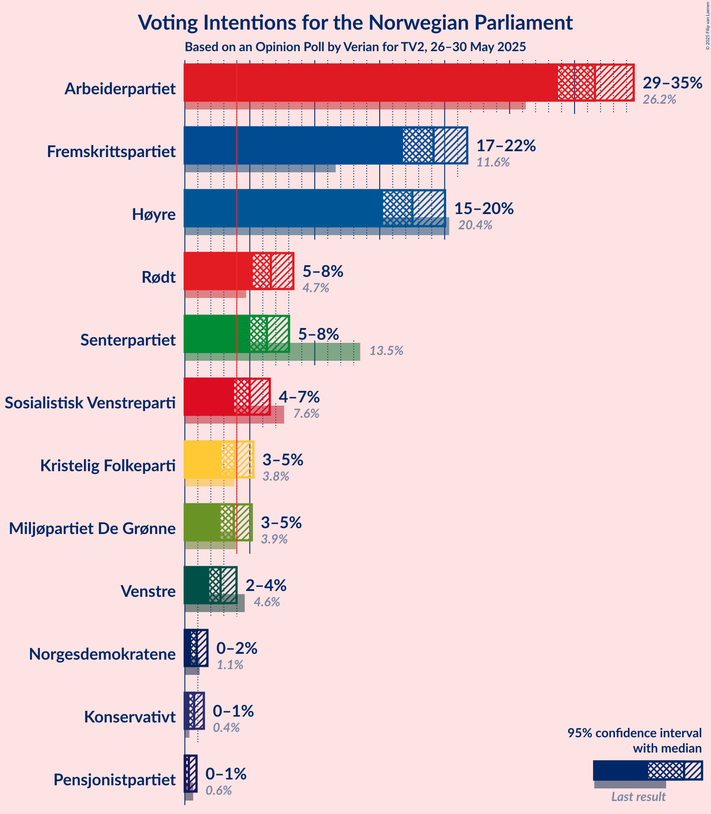
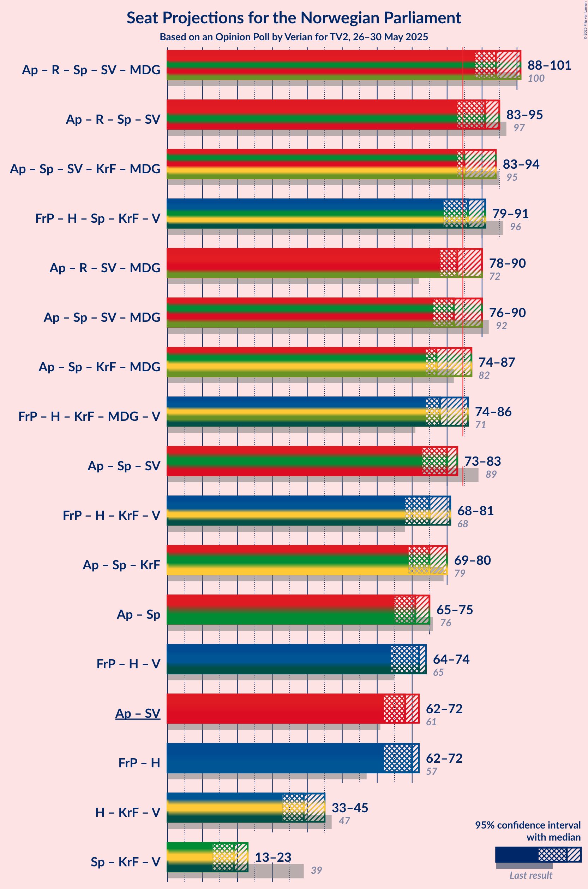
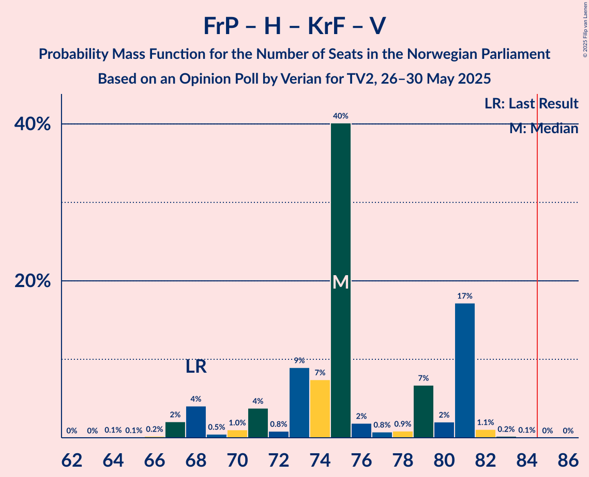

# Opinion Poll by Verian for TV2, 26–30 May 2025

<a href="#voting-intentions">Voting Intentions</a> | <a href="#seats">Seats</a> | <a href="#coalitions">Coalitions</a> | <a href="#technical-information">Technical Information</a>

## Voting Intentions

### Confidence Intervals

| Party | Last Result | Poll Result | 80% Confidence Interval | 90% Confidence Interval | 95% Confidence Interval | 99% Confidence Interval |
|:-----:|:-----------:|:-----------:|:-----------------------:|:-----------------------:|:-----------------------:|:-----------------------:|
| Arbeiderpartiet | 26.2% | 31.6% | 29.7–33.5% |29.2–34.1% |28.7–34.6% |27.9–35.5% |
| Fremskrittspartiet | 11.6% | 19.1% | 17.6–20.8% |17.2–21.3% |16.8–21.7% |16.1–22.6% |
| Høyre | 20.4% | 17.5% | 16.0–19.2% |15.6–19.6% |15.3–20.0% |14.6–20.8% |
| Rødt | 4.7% | 6.6% | 5.7–7.8% |5.4–8.1% |5.2–8.4% |4.8–8.9% |
| Senterpartiet | 13.5% | 6.3% | 5.4–7.4% |5.2–7.7% |5.0–8.0% |4.6–8.6% |
| Sosialistisk Venstreparti | 7.6% | 5.0% | 4.2–6.0% |4.0–6.3% |3.8–6.5% |3.4–7.1% |
| Kristelig Folkeparti | 3.8% | 3.9% | 3.2–4.8% |3.0–5.0% |2.8–5.3% |2.5–5.7% |
| Miljøpartiet De Grønne | 3.9% | 3.8% | 3.1–4.7% |2.9–4.9% |2.7–5.2% |2.5–5.6% |
| Venstre | 4.6% | 2.7% | 2.2–3.6% |2.0–3.8% |1.9–4.0% |1.7–4.4% |
| Norgesdemokratene | 1.1% | 0.9% | 0.6–1.4% |0.5–1.6% |0.5–1.7% |0.4–2.0% |
| Konservativt | 0.4% | 0.7% | 0.5–1.2% |0.4–1.3% |0.4–1.5% |0.3–1.7% |
| Pensjonistpartiet | 0.6% | 0.3% | 0.2–0.7% |0.1–0.8% |0.1–0.9% |0.1–1.1% |

*Note:* The poll result column reflects the actual value used in the calculations. Published results may vary slightly, and in addition be rounded to fewer digits.

## Seats

### Confidence Intervals

| Party | Last Result | Median | 80% Confidence Interval | 90% Confidence Interval | 95% Confidence Interval | 99% Confidence Interval |
|:-----:|:-----------:|:------:|:-----------------------:|:-----------------------:|:-----------------------:|:-----------------------:|
| <a href="#arbeiderpartiet">Arbeiderpartiet</a> | 48 | 59 | 56–61 |55–61 |54–63 |51–66 |
| <a href="#fremskrittspartiet">Fremskrittspartiet</a> | 21 | 37 | 33–38 |33–38 |32–39 |30–40 |
| <a href="#høyre">Høyre</a> | 36 | 33 | 29–33 |28–34 |28–35 |26–38 |
| <a href="#rødt">Rødt</a> | 8 | 11 | 10–12 |9–13 |9–14 |9–15 |
| <a href="#senterpartiet">Senterpartiet</a> | 28 | 11 | 9–12 |8–13 |8–14 |8–16 |
| <a href="#sosialistisk-venstreparti">Sosialistisk Venstreparti</a> | 13 | 9 | 7–10 |7–12 |3–12 |1–13 |
| <a href="#kristelig-folkeparti">Kristelig Folkeparti</a> | 3 | 7 | 3–8 |3–8 |2–9 |1–10 |
| <a href="#miljøpartiet-de-grønne">Miljøpartiet De Grønne</a> | 3 | 3 | 2–8 |2–8 |2–9 |1–10 |
| <a href="#venstre">Venstre</a> | 8 | 2 | 1–3 |1–3 |1–3 |1–7 |
| <a href="#norgesdemokratene">Norgesdemokratene</a> | 0 | 0 | 0 |0 |0 |0 |
| <a href="#konservativt">Konservativt</a> | 0 | 0 | 0 |0 |0 |0 |
| <a href="#pensjonistpartiet">Pensjonistpartiet</a> | 0 | 0 | 0 |0 |0 |0 |

### Arbeiderpartiet

*For a full overview of the results for this party, see the [Arbeiderpartiet](party-arbeiderpartiet.html) page.*

| Number of Seats | Probability | Accumulated | Special Marks |
|:---------------:|:-----------:|:-----------:|:-------------:|
| 48 | 0% | 100% | Last Result |
| 49 | 0.1% | 100% |  |
| 50 | 0% | 99.9% |  |
| 51 | 0.8% | 99.9% |  |
| 52 | 0.2% | 99.1% |  |
| 53 | 0.8% | 98.9% |  |
| 54 | 2% | 98% |  |
| 55 | 3% | 96% |  |
| 56 | 18% | 94% |  |
| 57 | 8% | 76% |  |
| 58 | 8% | 68% |  |
| 59 | 25% | 60% | Median |
| 60 | 3% | 35% |  |
| 61 | 28% | 32% |  |
| 62 | 2% | 5% |  |
| 63 | 1.1% | 3% |  |
| 64 | 0.5% | 2% |  |
| 65 | 0.7% | 1.4% |  |
| 66 | 0.3% | 0.7% |  |
| 67 | 0.4% | 0.5% |  |
| 68 | 0% | 0.1% |  |
| 69 | 0% | 0.1% |  |
| 70 | 0% | 0% |  |

### Fremskrittspartiet

*For a full overview of the results for this party, see the [Fremskrittspartiet](party-fremskrittspartiet.html) page.*

| Number of Seats | Probability | Accumulated | Special Marks |
|:---------------:|:-----------:|:-----------:|:-------------:|
| 21 | 0% | 100% | Last Result |
| 22 | 0% | 100% |  |
| 23 | 0% | 100% |  |
| 24 | 0% | 100% |  |
| 25 | 0% | 100% |  |
| 26 | 0% | 100% |  |
| 27 | 0% | 100% |  |
| 28 | 0.1% | 100% |  |
| 29 | 0.4% | 99.9% |  |
| 30 | 0.3% | 99.6% |  |
| 31 | 1.1% | 99.3% |  |
| 32 | 0.8% | 98% |  |
| 33 | 12% | 97% |  |
| 34 | 4% | 85% |  |
| 35 | 11% | 81% |  |
| 36 | 11% | 71% |  |
| 37 | 10% | 60% | Median |
| 38 | 46% | 50% |  |
| 39 | 2% | 4% |  |
| 40 | 1.4% | 2% |  |
| 41 | 0.1% | 0.2% |  |
| 42 | 0% | 0.1% |  |
| 43 | 0% | 0% |  |

### Høyre

*For a full overview of the results for this party, see the [Høyre](party-høyre.html) page.*

| Number of Seats | Probability | Accumulated | Special Marks |
|:---------------:|:-----------:|:-----------:|:-------------:|
| 24 | 0.1% | 100% |  |
| 25 | 0.1% | 99.9% |  |
| 26 | 1.0% | 99.8% |  |
| 27 | 0.5% | 98.8% |  |
| 28 | 5% | 98% |  |
| 29 | 8% | 93% |  |
| 30 | 17% | 85% |  |
| 31 | 9% | 69% |  |
| 32 | 7% | 60% |  |
| 33 | 47% | 53% | Median |
| 34 | 2% | 6% |  |
| 35 | 3% | 4% |  |
| 36 | 0.3% | 1.3% | Last Result |
| 37 | 0.3% | 1.1% |  |
| 38 | 0.6% | 0.8% |  |
| 39 | 0.1% | 0.3% |  |
| 40 | 0% | 0.2% |  |
| 41 | 0.1% | 0.2% |  |
| 42 | 0% | 0% |  |

### Rødt

*For a full overview of the results for this party, see the [Rødt](party-rødt.html) page.*

| Number of Seats | Probability | Accumulated | Special Marks |
|:---------------:|:-----------:|:-----------:|:-------------:|
| 8 | 0.4% | 100% | Last Result |
| 9 | 8% | 99.6% |  |
| 10 | 9% | 91% |  |
| 11 | 39% | 83% | Median |
| 12 | 35% | 44% |  |
| 13 | 5% | 8% |  |
| 14 | 2% | 4% |  |
| 15 | 0.7% | 1.1% |  |
| 16 | 0.3% | 0.4% |  |
| 17 | 0% | 0.1% |  |
| 18 | 0% | 0% |  |

### Senterpartiet

*For a full overview of the results for this party, see the [Senterpartiet](party-senterpartiet.html) page.*

| Number of Seats | Probability | Accumulated | Special Marks |
|:---------------:|:-----------:|:-----------:|:-------------:|
| 7 | 0.1% | 100% |  |
| 8 | 9% | 99.9% |  |
| 9 | 9% | 91% |  |
| 10 | 23% | 82% |  |
| 11 | 34% | 59% | Median |
| 12 | 16% | 25% |  |
| 13 | 6% | 9% |  |
| 14 | 2% | 4% |  |
| 15 | 0.9% | 2% |  |
| 16 | 0.6% | 0.6% |  |
| 17 | 0.1% | 0.1% |  |
| 18 | 0% | 0% |  |
| 19 | 0% | 0% |  |
| 20 | 0% | 0% |  |
| 21 | 0% | 0% |  |
| 22 | 0% | 0% |  |
| 23 | 0% | 0% |  |
| 24 | 0% | 0% |  |
| 25 | 0% | 0% |  |
| 26 | 0% | 0% |  |
| 27 | 0% | 0% |  |
| 28 | 0% | 0% | Last Result |

### Sosialistisk Venstreparti

*For a full overview of the results for this party, see the [Sosialistisk Venstreparti](party-sosialistiskvenstreparti.html) page.*

| Number of Seats | Probability | Accumulated | Special Marks |
|:---------------:|:-----------:|:-----------:|:-------------:|
| 1 | 1.0% | 100% |  |
| 2 | 1.1% | 99.0% |  |
| 3 | 1.0% | 98% |  |
| 4 | 0.1% | 97% |  |
| 5 | 0% | 97% |  |
| 6 | 0.1% | 97% |  |
| 7 | 7% | 97% |  |
| 8 | 35% | 89% |  |
| 9 | 37% | 54% | Median |
| 10 | 10% | 18% |  |
| 11 | 2% | 8% |  |
| 12 | 5% | 5% |  |
| 13 | 0.3% | 0.6% | Last Result |
| 14 | 0.3% | 0.3% |  |
| 15 | 0% | 0% |  |

### Kristelig Folkeparti

*For a full overview of the results for this party, see the [Kristelig Folkeparti](party-kristeligfolkeparti.html) page.*

| Number of Seats | Probability | Accumulated | Special Marks |
|:---------------:|:-----------:|:-----------:|:-------------:|
| 0 | 0.1% | 100% |  |
| 1 | 0.9% | 99.9% |  |
| 2 | 3% | 99.1% |  |
| 3 | 41% | 96% | Last Result |
| 4 | 0% | 55% |  |
| 5 | 0% | 55% |  |
| 6 | 0.2% | 55% |  |
| 7 | 21% | 55% | Median |
| 8 | 30% | 34% |  |
| 9 | 3% | 4% |  |
| 10 | 0.7% | 0.8% |  |
| 11 | 0.1% | 0.2% |  |
| 12 | 0% | 0% |  |

### Miljøpartiet De Grønne

*For a full overview of the results for this party, see the [Miljøpartiet De Grønne](party-miljøpartietdegrønne.html) page.*

| Number of Seats | Probability | Accumulated | Special Marks |
|:---------------:|:-----------:|:-----------:|:-------------:|
| 1 | 2% | 100% |  |
| 2 | 45% | 98% |  |
| 3 | 20% | 54% | Last Result, Median |
| 4 | 0% | 33% |  |
| 5 | 0% | 33% |  |
| 6 | 0% | 33% |  |
| 7 | 12% | 33% |  |
| 8 | 18% | 21% |  |
| 9 | 0.9% | 3% |  |
| 10 | 2% | 2% |  |
| 11 | 0% | 0% |  |

### Venstre

*For a full overview of the results for this party, see the [Venstre](party-venstre.html) page.*

| Number of Seats | Probability | Accumulated | Special Marks |
|:---------------:|:-----------:|:-----------:|:-------------:|
| 0 | 0.3% | 100% |  |
| 1 | 40% | 99.7% |  |
| 2 | 34% | 59% | Median |
| 3 | 25% | 25% |  |
| 4 | 0% | 0.7% |  |
| 5 | 0% | 0.7% |  |
| 6 | 0% | 0.7% |  |
| 7 | 0.4% | 0.7% |  |
| 8 | 0.3% | 0.3% | Last Result |
| 9 | 0% | 0% |  |

### Norgesdemokratene

*For a full overview of the results for this party, see the [Norgesdemokratene](party-norgesdemokratene.html) page.*

| Number of Seats | Probability | Accumulated | Special Marks |
|:---------------:|:-----------:|:-----------:|:-------------:|
| 0 | 100% | 100% | Last Result, Median |

### Konservativt

*For a full overview of the results for this party, see the [Konservativt](party-konservativt.html) page.*

| Number of Seats | Probability | Accumulated | Special Marks |
|:---------------:|:-----------:|:-----------:|:-------------:|
| 0 | 100% | 100% | Last Result, Median |

### Pensjonistpartiet

*For a full overview of the results for this party, see the [Pensjonistpartiet](party-pensjonistpartiet.html) page.*

| Number of Seats | Probability | Accumulated | Special Marks |
|:---------------:|:-----------:|:-----------:|:-------------:|
| 0 | 100% | 100% | Last Result, Median |

## Coalitions

### Confidence Intervals

| Coalition | Last Result | Median | Majority? | 80% Confidence Interval | 90% Confidence Interval | 95% Confidence Interval | 99% Confidence Interval |
|:---------:|:-----------:|:------:|:---------:|:-----------------------:|:-----------------------:|:-----------------------:|:-----------------------:|
| Arbeiderpartiet – Rødt – Senterpartiet – Sosialistisk Venstreparti – Miljøpartiet De Grønne | 100 | 94 | 100% | 88–98 | 88–101 | 88–101 | 87–102 |
| Arbeiderpartiet – Rødt – Senterpartiet – Sosialistisk Venstreparti | 97 | 91 | 92% | 86–93 | 83–93 | 83–95 | 81–98 |
| Arbeiderpartiet – Senterpartiet – Sosialistisk Venstreparti – Kristelig Folkeparti – Miljøpartiet De Grønne | 95 | 85 | 79% | 84–93 | 84–93 | 83–94 | 80–97 |
| Fremskrittspartiet – Høyre – Senterpartiet – Kristelig Folkeparti – Venstre | 96 | 86 | 73% | 83–91 | 80–91 | 79–91 | 78–94 |
| Arbeiderpartiet – Rødt – Sosialistisk Venstreparti – Miljøpartiet De Grønne | 72 | 83 | 27% | 78–86 | 78–89 | 78–90 | 75–91 |
| Arbeiderpartiet – Senterpartiet – Sosialistisk Venstreparti – Miljøpartiet De Grønne | 92 | 82 | 21% | 77–87 | 77–89 | 76–90 | 75–91 |
| Arbeiderpartiet – Senterpartiet – Kristelig Folkeparti – Miljøpartiet De Grønne | 82 | 77 | 8% | 75–83 | 75–85 | 74–87 | 72–89 |
| Fremskrittspartiet – Høyre – Kristelig Folkeparti – Miljøpartiet De Grønne – Venstre | 71 | 78 | 8% | 76–83 | 76–86 | 74–86 | 71–88 |
| Arbeiderpartiet – Senterpartiet – Sosialistisk Venstreparti | 89 | 80 | 1.1% | 74–82 | 74–82 | 73–83 | 71–87 |
| Fremskrittspartiet – Høyre – Kristelig Folkeparti – Venstre | 68 | 75 | 0% | 71–81 | 68–81 | 68–81 | 67–82 |
| Arbeiderpartiet – Senterpartiet – Kristelig Folkeparti | 79 | 75 | 0.5% | 69–80 | 69–80 | 69–80 | 67–85 |
| Arbeiderpartiet – Senterpartiet | 76 | 71 | 0% | 66–72 | 66–73 | 65–75 | 63–79 |
| Fremskrittspartiet – Høyre – Venstre | 65 | 72 | 0% | 65–74 | 65–74 | 64–74 | 61–77 |
| Arbeiderpartiet – Sosialistisk Venstreparti | 61 | 68 | 0% | 65–71 | 64–71 | 62–72 | 59–75 |
| Fremskrittspartiet – Høyre | 57 | 70 | 0% | 63–71 | 63–71 | 62–72 | 59–74 |
| Høyre – Kristelig Folkeparti – Venstre | 47 | 39 | 0% | 37–43 | 34–43 | 33–45 | 33–47 |
| Senterpartiet – Kristelig Folkeparti – Venstre | 39 | 19 | 0% | 14–22 | 14–22 | 13–23 | 12–26 |

### Arbeiderpartiet – Rødt – Senterpartiet – Sosialistisk Venstreparti – Miljøpartiet De Grønne

| Number of Seats | Probability | Accumulated | Special Marks |
|:---------------:|:-----------:|:-----------:|:-------------:|
| 85 | 0.1% | 100% | Majority |
| 86 | 0.2% | 99.9% |  |
| 87 | 1.1% | 99.7% |  |
| 88 | 17% | 98.6% |  |
| 89 | 2% | 81% |  |
| 90 | 7% | 79% |  |
| 91 | 0.9% | 73% |  |
| 92 | 0.8% | 72% |  |
| 93 | 2% | 71% | Median |
| 94 | 40% | 69% |  |
| 95 | 7% | 29% |  |
| 96 | 9% | 22% |  |
| 97 | 0.8% | 13% |  |
| 98 | 4% | 12% |  |
| 99 | 1.0% | 8% |  |
| 100 | 0.5% | 7% | Last Result |
| 101 | 4% | 7% |  |
| 102 | 2% | 2% |  |
| 103 | 0.2% | 0.4% |  |
| 104 | 0.1% | 0.2% |  |
| 105 | 0.1% | 0.1% |  |
| 106 | 0% | 0% |  |

### Arbeiderpartiet – Rødt – Senterpartiet – Sosialistisk Venstreparti

| Number of Seats | Probability | Accumulated | Special Marks |
|:---------------:|:-----------:|:-----------:|:-------------:|
| 78 | 0% | 100% |  |
| 79 | 0% | 99.9% |  |
| 80 | 0% | 99.9% |  |
| 81 | 0.5% | 99.9% |  |
| 82 | 0.7% | 99.4% |  |
| 83 | 6% | 98.7% |  |
| 84 | 0.7% | 93% |  |
| 85 | 1.0% | 92% | Majority |
| 86 | 27% | 91% |  |
| 87 | 3% | 64% |  |
| 88 | 2% | 61% |  |
| 89 | 4% | 59% |  |
| 90 | 2% | 55% | Median |
| 91 | 13% | 53% |  |
| 92 | 24% | 40% |  |
| 93 | 12% | 16% |  |
| 94 | 0.8% | 4% |  |
| 95 | 2% | 3% |  |
| 96 | 0.2% | 1.5% |  |
| 97 | 0.4% | 1.3% | Last Result |
| 98 | 0.4% | 0.9% |  |
| 99 | 0.2% | 0.5% |  |
| 100 | 0.2% | 0.3% |  |
| 101 | 0% | 0.1% |  |
| 102 | 0% | 0% |  |

### Arbeiderpartiet – Senterpartiet – Sosialistisk Venstreparti – Kristelig Folkeparti – Miljøpartiet De Grønne

| Number of Seats | Probability | Accumulated | Special Marks |
|:---------------:|:-----------:|:-----------:|:-------------:|
| 77 | 0.1% | 100% |  |
| 78 | 0.2% | 99.9% |  |
| 79 | 0.1% | 99.7% |  |
| 80 | 0.6% | 99.6% |  |
| 81 | 0.1% | 99.0% |  |
| 82 | 1.2% | 98.9% |  |
| 83 | 0.5% | 98% |  |
| 84 | 18% | 97% |  |
| 85 | 29% | 79% | Majority |
| 86 | 4% | 50% |  |
| 87 | 2% | 46% |  |
| 88 | 1.2% | 43% |  |
| 89 | 7% | 42% | Median |
| 90 | 1.2% | 35% |  |
| 91 | 14% | 34% |  |
| 92 | 4% | 19% |  |
| 93 | 12% | 16% |  |
| 94 | 1.1% | 3% |  |
| 95 | 0.2% | 2% | Last Result |
| 96 | 0.6% | 2% |  |
| 97 | 1.3% | 1.4% |  |
| 98 | 0.1% | 0.2% |  |
| 99 | 0.1% | 0.1% |  |
| 100 | 0% | 0% |  |

### Fremskrittspartiet – Høyre – Senterpartiet – Kristelig Folkeparti – Venstre

| Number of Seats | Probability | Accumulated | Special Marks |
|:---------------:|:-----------:|:-----------:|:-------------:|
| 75 | 0.1% | 100% |  |
| 76 | 0% | 99.9% |  |
| 77 | 0.2% | 99.9% |  |
| 78 | 0.6% | 99.7% |  |
| 79 | 4% | 99.1% |  |
| 80 | 0.8% | 95% |  |
| 81 | 3% | 94% |  |
| 82 | 2% | 92% |  |
| 83 | 6% | 90% |  |
| 84 | 11% | 85% |  |
| 85 | 8% | 73% | Majority |
| 86 | 22% | 65% |  |
| 87 | 18% | 43% |  |
| 88 | 1.4% | 24% |  |
| 89 | 1.3% | 23% |  |
| 90 | 3% | 22% | Median |
| 91 | 17% | 19% |  |
| 92 | 0.9% | 2% |  |
| 93 | 0.5% | 1.1% |  |
| 94 | 0.3% | 0.6% |  |
| 95 | 0.2% | 0.2% |  |
| 96 | 0% | 0.1% | Last Result |
| 97 | 0% | 0% |  |

### Arbeiderpartiet – Rødt – Sosialistisk Venstreparti – Miljøpartiet De Grønne

| Number of Seats | Probability | Accumulated | Special Marks |
|:---------------:|:-----------:|:-----------:|:-------------:|
| 72 | 0% | 100% | Last Result |
| 73 | 0% | 100% |  |
| 74 | 0.2% | 99.9% |  |
| 75 | 0.3% | 99.8% |  |
| 76 | 0.5% | 99.4% |  |
| 77 | 0.9% | 98.9% |  |
| 78 | 17% | 98% |  |
| 79 | 3% | 81% |  |
| 80 | 1.3% | 78% |  |
| 81 | 1.4% | 77% |  |
| 82 | 18% | 76% | Median |
| 83 | 22% | 57% |  |
| 84 | 8% | 35% |  |
| 85 | 11% | 27% | Majority |
| 86 | 6% | 15% |  |
| 87 | 2% | 10% |  |
| 88 | 3% | 8% |  |
| 89 | 0.8% | 6% |  |
| 90 | 4% | 5% |  |
| 91 | 0.6% | 0.9% |  |
| 92 | 0.2% | 0.3% |  |
| 93 | 0% | 0.1% |  |
| 94 | 0.1% | 0.1% |  |
| 95 | 0% | 0% |  |

### Arbeiderpartiet – Senterpartiet – Sosialistisk Venstreparti – Miljøpartiet De Grønne

| Number of Seats | Probability | Accumulated | Special Marks |
|:---------------:|:-----------:|:-----------:|:-------------:|
| 73 | 0.2% | 100% |  |
| 74 | 0.2% | 99.7% |  |
| 75 | 0.4% | 99.6% |  |
| 76 | 2% | 99.2% |  |
| 77 | 18% | 97% |  |
| 78 | 0.8% | 80% |  |
| 79 | 0.8% | 79% |  |
| 80 | 2% | 78% |  |
| 81 | 7% | 76% |  |
| 82 | 29% | 70% | Median |
| 83 | 17% | 41% |  |
| 84 | 3% | 24% |  |
| 85 | 5% | 21% | Majority |
| 86 | 5% | 16% |  |
| 87 | 1.2% | 11% |  |
| 88 | 2% | 9% |  |
| 89 | 3% | 7% |  |
| 90 | 4% | 5% |  |
| 91 | 0.3% | 0.5% |  |
| 92 | 0.1% | 0.2% | Last Result |
| 93 | 0.1% | 0.2% |  |
| 94 | 0% | 0.1% |  |
| 95 | 0% | 0.1% |  |
| 96 | 0% | 0% |  |

### Arbeiderpartiet – Senterpartiet – Kristelig Folkeparti – Miljøpartiet De Grønne

| Number of Seats | Probability | Accumulated | Special Marks |
|:---------------:|:-----------:|:-----------:|:-------------:|
| 68 | 0% | 100% |  |
| 69 | 0.1% | 99.9% |  |
| 70 | 0.1% | 99.9% |  |
| 71 | 0.2% | 99.8% |  |
| 72 | 1.1% | 99.5% |  |
| 73 | 0.2% | 98% |  |
| 74 | 1.0% | 98% |  |
| 75 | 17% | 97% |  |
| 76 | 2% | 80% |  |
| 77 | 31% | 78% |  |
| 78 | 2% | 47% |  |
| 79 | 1.1% | 45% |  |
| 80 | 1.1% | 43% | Median |
| 81 | 6% | 42% |  |
| 82 | 19% | 36% | Last Result |
| 83 | 8% | 17% |  |
| 84 | 1.4% | 9% |  |
| 85 | 4% | 8% | Majority |
| 86 | 0.5% | 3% |  |
| 87 | 2% | 3% |  |
| 88 | 0.3% | 1.0% |  |
| 89 | 0.5% | 0.7% |  |
| 90 | 0.1% | 0.2% |  |
| 91 | 0% | 0.1% |  |
| 92 | 0% | 0% |  |

### Fremskrittspartiet – Høyre – Kristelig Folkeparti – Miljøpartiet De Grønne – Venstre

| Number of Seats | Probability | Accumulated | Special Marks |
|:---------------:|:-----------:|:-----------:|:-------------:|
| 68 | 0% | 100% |  |
| 69 | 0.2% | 99.9% |  |
| 70 | 0.2% | 99.7% |  |
| 71 | 0.4% | 99.5% | Last Result |
| 72 | 0.4% | 99.1% |  |
| 73 | 0.2% | 98.7% |  |
| 74 | 2% | 98.5% |  |
| 75 | 0.8% | 97% |  |
| 76 | 12% | 96% |  |
| 77 | 24% | 84% |  |
| 78 | 13% | 60% |  |
| 79 | 2% | 47% |  |
| 80 | 4% | 45% |  |
| 81 | 2% | 41% |  |
| 82 | 3% | 39% | Median |
| 83 | 27% | 36% |  |
| 84 | 1.0% | 9% |  |
| 85 | 0.7% | 8% | Majority |
| 86 | 6% | 7% |  |
| 87 | 0.7% | 1.3% |  |
| 88 | 0.5% | 0.6% |  |
| 89 | 0% | 0.1% |  |
| 90 | 0% | 0.1% |  |
| 91 | 0% | 0.1% |  |
| 92 | 0% | 0% |  |

### Arbeiderpartiet – Senterpartiet – Sosialistisk Venstreparti

| Number of Seats | Probability | Accumulated | Special Marks |
|:---------------:|:-----------:|:-----------:|:-------------:|
| 68 | 0.1% | 100% |  |
| 69 | 0% | 99.9% |  |
| 70 | 0.3% | 99.9% |  |
| 71 | 0.4% | 99.5% |  |
| 72 | 0.8% | 99.1% |  |
| 73 | 0.9% | 98% |  |
| 74 | 15% | 97% |  |
| 75 | 20% | 82% |  |
| 76 | 3% | 63% |  |
| 77 | 1.3% | 60% |  |
| 78 | 2% | 59% |  |
| 79 | 6% | 57% | Median |
| 80 | 34% | 51% |  |
| 81 | 4% | 17% |  |
| 82 | 9% | 13% |  |
| 83 | 2% | 4% |  |
| 84 | 0.6% | 2% |  |
| 85 | 0.2% | 1.1% | Majority |
| 86 | 0.1% | 0.8% |  |
| 87 | 0.4% | 0.7% |  |
| 88 | 0.3% | 0.3% |  |
| 89 | 0% | 0.1% | Last Result |
| 90 | 0% | 0% |  |

### Fremskrittspartiet – Høyre – Kristelig Folkeparti – Venstre

| Number of Seats | Probability | Accumulated | Special Marks |
|:---------------:|:-----------:|:-----------:|:-------------:|
| 64 | 0.1% | 100% |  |
| 65 | 0.1% | 99.9% |  |
| 66 | 0.2% | 99.8% |  |
| 67 | 2% | 99.6% |  |
| 68 | 4% | 98% | Last Result |
| 69 | 0.5% | 93% |  |
| 70 | 1.0% | 93% |  |
| 71 | 4% | 92% |  |
| 72 | 0.8% | 88% |  |
| 73 | 9% | 87% |  |
| 74 | 7% | 78% |  |
| 75 | 40% | 71% |  |
| 76 | 2% | 31% |  |
| 77 | 0.8% | 29% |  |
| 78 | 0.9% | 28% |  |
| 79 | 7% | 27% | Median |
| 80 | 2% | 21% |  |
| 81 | 17% | 19% |  |
| 82 | 1.1% | 1.4% |  |
| 83 | 0.2% | 0.3% |  |
| 84 | 0.1% | 0.1% |  |
| 85 | 0% | 0% | Majority |

### Arbeiderpartiet – Senterpartiet – Kristelig Folkeparti

| Number of Seats | Probability | Accumulated | Special Marks |
|:---------------:|:-----------:|:-----------:|:-------------:|
| 64 | 0% | 100% |  |
| 65 | 0.2% | 99.9% |  |
| 66 | 0.1% | 99.7% |  |
| 67 | 0.1% | 99.6% |  |
| 68 | 0.3% | 99.5% |  |
| 69 | 11% | 99.1% |  |
| 70 | 0.4% | 88% |  |
| 71 | 0.9% | 88% |  |
| 72 | 1.3% | 87% |  |
| 73 | 23% | 86% |  |
| 74 | 2% | 62% |  |
| 75 | 29% | 60% |  |
| 76 | 4% | 31% |  |
| 77 | 0.7% | 28% | Median |
| 78 | 5% | 27% |  |
| 79 | 10% | 22% | Last Result |
| 80 | 9% | 12% |  |
| 81 | 0.4% | 2% |  |
| 82 | 0.4% | 2% |  |
| 83 | 0.3% | 1.4% |  |
| 84 | 0.6% | 1.1% |  |
| 85 | 0.4% | 0.5% | Majority |
| 86 | 0.1% | 0.2% |  |
| 87 | 0% | 0% |  |

### Arbeiderpartiet – Senterpartiet

| Number of Seats | Probability | Accumulated | Special Marks |
|:---------------:|:-----------:|:-----------:|:-------------:|
| 60 | 0.1% | 100% |  |
| 61 | 0% | 99.9% |  |
| 62 | 0.1% | 99.9% |  |
| 63 | 0.6% | 99.7% |  |
| 64 | 1.2% | 99.1% |  |
| 65 | 2% | 98% |  |
| 66 | 25% | 96% |  |
| 67 | 8% | 71% |  |
| 68 | 4% | 63% |  |
| 69 | 1.5% | 59% |  |
| 70 | 7% | 58% | Median |
| 71 | 17% | 50% |  |
| 72 | 28% | 33% |  |
| 73 | 2% | 5% |  |
| 74 | 0.6% | 3% |  |
| 75 | 0.5% | 3% |  |
| 76 | 1.4% | 2% | Last Result |
| 77 | 0.1% | 0.9% |  |
| 78 | 0.2% | 0.8% |  |
| 79 | 0.2% | 0.6% |  |
| 80 | 0.1% | 0.4% |  |
| 81 | 0.1% | 0.3% |  |
| 82 | 0% | 0.1% |  |
| 83 | 0.1% | 0.1% |  |
| 84 | 0% | 0% |  |

### Fremskrittspartiet – Høyre – Venstre

| Number of Seats | Probability | Accumulated | Special Marks |
|:---------------:|:-----------:|:-----------:|:-------------:|
| 59 | 0% | 100% |  |
| 60 | 0.4% | 99.9% |  |
| 61 | 0.2% | 99.5% |  |
| 62 | 0.4% | 99.4% |  |
| 63 | 1.2% | 98.9% |  |
| 64 | 2% | 98% |  |
| 65 | 11% | 96% | Last Result |
| 66 | 9% | 85% |  |
| 67 | 10% | 76% |  |
| 68 | 2% | 66% |  |
| 69 | 2% | 64% |  |
| 70 | 2% | 62% |  |
| 71 | 6% | 60% |  |
| 72 | 32% | 54% | Median |
| 73 | 4% | 22% |  |
| 74 | 15% | 18% |  |
| 75 | 1.3% | 2% |  |
| 76 | 0.3% | 0.9% |  |
| 77 | 0.3% | 0.6% |  |
| 78 | 0.1% | 0.3% |  |
| 79 | 0.1% | 0.2% |  |
| 80 | 0% | 0% |  |

### Arbeiderpartiet – Sosialistisk Venstreparti

| Number of Seats | Probability | Accumulated | Special Marks |
|:---------------:|:-----------:|:-----------:|:-------------:|
| 57 | 0.1% | 100% |  |
| 58 | 0.2% | 99.8% |  |
| 59 | 0.4% | 99.7% |  |
| 60 | 0.3% | 99.3% |  |
| 61 | 0.5% | 99.0% | Last Result |
| 62 | 1.4% | 98% |  |
| 63 | 2% | 97% |  |
| 64 | 3% | 96% |  |
| 65 | 26% | 92% |  |
| 66 | 7% | 66% |  |
| 67 | 7% | 59% |  |
| 68 | 14% | 51% | Median |
| 69 | 22% | 37% |  |
| 70 | 2% | 15% |  |
| 71 | 9% | 13% |  |
| 72 | 3% | 4% |  |
| 73 | 0.6% | 1.5% |  |
| 74 | 0.4% | 0.9% |  |
| 75 | 0.2% | 0.5% |  |
| 76 | 0.1% | 0.3% |  |
| 77 | 0.1% | 0.2% |  |
| 78 | 0% | 0% |  |

### Fremskrittspartiet – Høyre

| Number of Seats | Probability | Accumulated | Special Marks |
|:---------------:|:-----------:|:-----------:|:-------------:|
| 56 | 0% | 100% |  |
| 57 | 0.3% | 99.9% | Last Result |
| 58 | 0% | 99.7% |  |
| 59 | 0.3% | 99.6% |  |
| 60 | 0.5% | 99.3% |  |
| 61 | 1.2% | 98.8% |  |
| 62 | 2% | 98% |  |
| 63 | 10% | 96% |  |
| 64 | 7% | 86% |  |
| 65 | 4% | 78% |  |
| 66 | 11% | 74% |  |
| 67 | 2% | 64% |  |
| 68 | 2% | 62% |  |
| 69 | 7% | 60% |  |
| 70 | 13% | 54% | Median |
| 71 | 37% | 41% |  |
| 72 | 2% | 4% |  |
| 73 | 0.2% | 1.2% |  |
| 74 | 0.6% | 1.0% |  |
| 75 | 0.3% | 0.5% |  |
| 76 | 0.2% | 0.2% |  |
| 77 | 0% | 0% |  |

### Høyre – Kristelig Folkeparti – Venstre

| Number of Seats | Probability | Accumulated | Special Marks |
|:---------------:|:-----------:|:-----------:|:-------------:|
| 30 | 0.1% | 100% |  |
| 31 | 0.2% | 99.9% |  |
| 32 | 0.2% | 99.7% |  |
| 33 | 4% | 99.5% |  |
| 34 | 2% | 95% |  |
| 35 | 2% | 93% |  |
| 36 | 1.3% | 91% |  |
| 37 | 26% | 90% |  |
| 38 | 13% | 64% |  |
| 39 | 10% | 50% |  |
| 40 | 7% | 40% |  |
| 41 | 10% | 33% |  |
| 42 | 2% | 23% | Median |
| 43 | 17% | 21% |  |
| 44 | 2% | 4% |  |
| 45 | 0.3% | 3% |  |
| 46 | 2% | 2% |  |
| 47 | 0.5% | 0.6% | Last Result |
| 48 | 0.1% | 0.1% |  |
| 49 | 0% | 0% |  |

### Senterpartiet – Kristelig Folkeparti – Venstre

| Number of Seats | Probability | Accumulated | Special Marks |
|:---------------:|:-----------:|:-----------:|:-------------:|
| 12 | 0.6% | 100% |  |
| 13 | 3% | 99.4% |  |
| 14 | 8% | 96% |  |
| 15 | 25% | 89% |  |
| 16 | 2% | 64% |  |
| 17 | 1.4% | 62% |  |
| 18 | 9% | 60% |  |
| 19 | 3% | 51% |  |
| 20 | 20% | 48% | Median |
| 21 | 17% | 28% |  |
| 22 | 8% | 11% |  |
| 23 | 1.0% | 3% |  |
| 24 | 0.8% | 2% |  |
| 25 | 0.1% | 0.8% |  |
| 26 | 0.5% | 0.6% |  |
| 27 | 0% | 0.1% |  |
| 28 | 0% | 0.1% |  |
| 29 | 0% | 0% |  |
| 30 | 0% | 0% |  |
| 31 | 0% | 0% |  |
| 32 | 0% | 0% |  |
| 33 | 0% | 0% |  |
| 34 | 0% | 0% |  |
| 35 | 0% | 0% |  |
| 36 | 0% | 0% |  |
| 37 | 0% | 0% |  |
| 38 | 0% | 0% |  |
| 39 | 0% | 0% | Last Result |

## Technical Information

### Opinion Poll

+ **Polling firm:** Verian
+ **Commissioner(s):** TV2
+ **Fieldwork period:** 26–30 May 2025

### Calculations

+ **Sample size:** 982
+ **Simulations done:** 2,097,152
+ **Error estimate:** 3.78%

