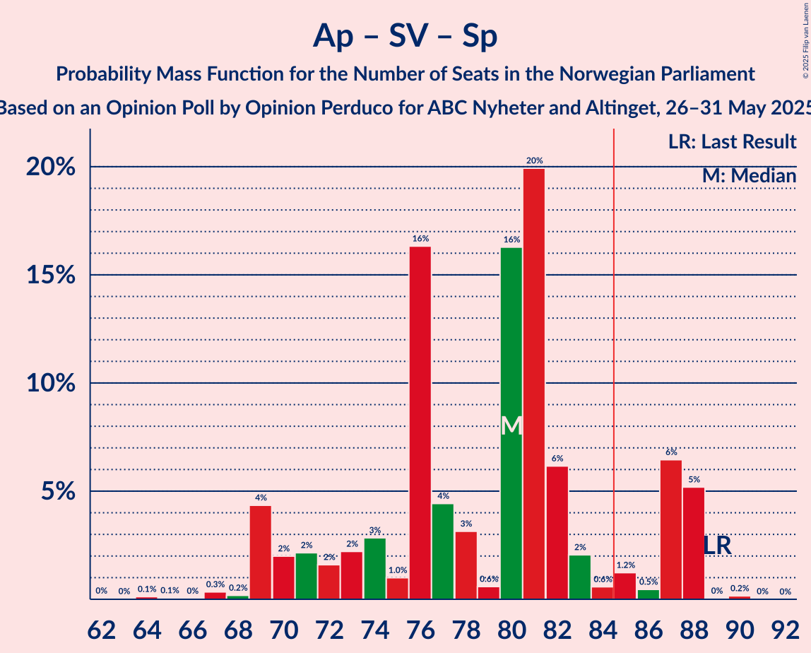

# Opinion Poll by Opinion Perduco for ABC Nyheter and Altinget, 26–31 May 2025

<a href="#voting-intentions">Voting Intentions</a> | <a href="#seats">Seats</a> | <a href="#coalitions">Coalitions</a> | <a href="#technical-information">Technical Information</a>

## Voting Intentions

### Confidence Intervals

| Party | Last Result | Poll Result | 80% Confidence Interval | 90% Confidence Interval | 95% Confidence Interval | 99% Confidence Interval |
|:-----:|:-----------:|:-----------:|:-----------------------:|:-----------------------:|:-----------------------:|:-----------------------:|
| Arbeiderpartiet | 26.2% | 30.9% | 28.9–33.1% |28.3–33.7% |27.8–34.3% |26.8–35.3% |
| Fremskrittspartiet | 11.6% | 19.6% | 17.8–21.5% |17.3–22.0% |16.9–22.5% |16.1–23.4% |
| Høyre | 20.4% | 13.9% | 12.5–15.7% |12.0–16.1% |11.7–16.6% |11.0–17.4% |
| Rødt | 4.7% | 5.8% | 4.8–7.0% |4.5–7.3% |4.3–7.6% |3.9–8.2% |
| Sosialistisk Venstreparti | 7.6% | 5.5% | 4.6–6.7% |4.3–7.0% |4.1–7.3% |3.7–7.9% |
| Venstre | 4.6% | 5.2% | 4.3–6.4% |4.1–6.8% |3.9–7.0% |3.5–7.7% |
| Kristelig Folkeparti | 3.8% | 4.6% | 3.8–5.7% |3.5–6.0% |3.3–6.3% |3.0–6.9% |
| Senterpartiet | 13.5% | 4.6% | 3.8–5.7% |3.5–6.0% |3.3–6.3% |3.0–6.9% |
| Miljøpartiet De Grønne | 3.9% | 3.8% | 3.1–4.9% |2.9–5.2% |2.7–5.4% |2.4–6.0% |
| Konservativt | 0.4% | 2.0% | 1.5–2.9% |1.4–3.1% |1.3–3.3% |1.1–3.7% |
| Industri- og Næringspartiet | 0.3% | 1.7% | 1.2–2.4% |1.1–2.6% |1.0–2.8% |0.8–3.2% |
| Norgesdemokratene | 1.1% | 0.5% | 0.3–1.0% |0.2–1.2% |0.2–1.3% |0.1–1.6% |
| Pensjonistpartiet | 0.6% | 0.3% | 0.1–0.7% |0.1–0.8% |0.1–0.9% |0.0–1.2% |

*Note:* The poll result column reflects the actual value used in the calculations. Published results may vary slightly, and in addition be rounded to fewer digits.

## Seats

### Confidence Intervals

| Party | Last Result | Median | 80% Confidence Interval | 90% Confidence Interval | 95% Confidence Interval | 99% Confidence Interval |
|:-----:|:-----------:|:------:|:-----------------------:|:-----------------------:|:-----------------------:|:-----------------------:|
| <a href="#arbeiderpartiet">Arbeiderpartiet</a> | 48 | 62 | 56–70 |54–70 |52–70 |52–72 |
| <a href="#fremskrittspartiet">Fremskrittspartiet</a> | 21 | 37 | 35–41 |34–42 |34–43 |31–44 |
| <a href="#høyre">Høyre</a> | 36 | 23 | 20–28 |18–29 |17–30 |17–31 |
| <a href="#rødt">Rødt</a> | 8 | 10 | 8–12 |7–12 |7–12 |3–14 |
| <a href="#sosialistisk-venstreparti">Sosialistisk Venstreparti</a> | 13 | 8 | 7–11 |7–12 |7–12 |2–13 |
| <a href="#venstre">Venstre</a> | 8 | 9 | 6–11 |3–12 |3–12 |3–12 |
| <a href="#kristelig-folkeparti">Kristelig Folkeparti</a> | 3 | 7 | 3–10 |3–10 |3–10 |2–11 |
| <a href="#senterpartiet">Senterpartiet</a> | 28 | 7 | 1–11 |1–11 |1–11 |0–12 |
| <a href="#miljøpartiet-de-grønne">Miljøpartiet De Grønne</a> | 3 | 3 | 2–7 |1–8 |1–9 |1–10 |
| <a href="#konservativt">Konservativt</a> | 0 | 0 | 0 |0 |0–1 |0–2 |
| <a href="#industri--og-næringspartiet">Industri- og Næringspartiet</a> | 0 | 0 | 0 |0–2 |0–2 |0–2 |
| <a href="#norgesdemokratene">Norgesdemokratene</a> | 0 | 0 | 0 |0 |0 |0 |
| <a href="#pensjonistpartiet">Pensjonistpartiet</a> | 0 | 0 | 0 |0 |0 |0 |

### Arbeiderpartiet

*For a full overview of the results for this party, see the [Arbeiderpartiet](party-arbeiderpartiet.html) page.*

| Number of Seats | Probability | Accumulated | Special Marks |
|:---------------:|:-----------:|:-----------:|:-------------:|
| 48 | 0% | 100% | Last Result |
| 49 | 0% | 100% |  |
| 50 | 0.1% | 100% |  |
| 51 | 0% | 99.9% |  |
| 52 | 2% | 99.9% |  |
| 53 | 1.2% | 97% |  |
| 54 | 3% | 96% |  |
| 55 | 2% | 93% |  |
| 56 | 2% | 91% |  |
| 57 | 0.9% | 90% |  |
| 58 | 3% | 89% |  |
| 59 | 5% | 86% |  |
| 60 | 3% | 81% |  |
| 61 | 9% | 78% |  |
| 62 | 21% | 68% | Median |
| 63 | 5% | 47% |  |
| 64 | 3% | 43% |  |
| 65 | 0.4% | 39% |  |
| 66 | 13% | 39% |  |
| 67 | 9% | 26% |  |
| 68 | 2% | 17% |  |
| 69 | 3% | 16% |  |
| 70 | 12% | 13% |  |
| 71 | 0.1% | 0.9% |  |
| 72 | 0.8% | 0.9% |  |
| 73 | 0% | 0% |  |

### Fremskrittspartiet

*For a full overview of the results for this party, see the [Fremskrittspartiet](party-fremskrittspartiet.html) page.*

| Number of Seats | Probability | Accumulated | Special Marks |
|:---------------:|:-----------:|:-----------:|:-------------:|
| 21 | 0% | 100% | Last Result |
| 22 | 0% | 100% |  |
| 23 | 0% | 100% |  |
| 24 | 0% | 100% |  |
| 25 | 0% | 100% |  |
| 26 | 0% | 100% |  |
| 27 | 0% | 100% |  |
| 28 | 0% | 100% |  |
| 29 | 0% | 100% |  |
| 30 | 0% | 100% |  |
| 31 | 0.5% | 99.9% |  |
| 32 | 0.4% | 99.5% |  |
| 33 | 0.7% | 99.1% |  |
| 34 | 7% | 98% |  |
| 35 | 18% | 92% |  |
| 36 | 15% | 74% |  |
| 37 | 21% | 59% | Median |
| 38 | 14% | 39% |  |
| 39 | 11% | 25% |  |
| 40 | 1.1% | 14% |  |
| 41 | 5% | 13% |  |
| 42 | 5% | 8% |  |
| 43 | 0.8% | 3% |  |
| 44 | 2% | 2% |  |
| 45 | 0.2% | 0.4% |  |
| 46 | 0.1% | 0.2% |  |
| 47 | 0.1% | 0.1% |  |
| 48 | 0% | 0% |  |

### Høyre

*For a full overview of the results for this party, see the [Høyre](party-høyre.html) page.*

| Number of Seats | Probability | Accumulated | Special Marks |
|:---------------:|:-----------:|:-----------:|:-------------:|
| 16 | 0.1% | 100% |  |
| 17 | 3% | 99.9% |  |
| 18 | 4% | 96% |  |
| 19 | 1.2% | 93% |  |
| 20 | 4% | 92% |  |
| 21 | 24% | 88% |  |
| 22 | 9% | 64% |  |
| 23 | 11% | 54% | Median |
| 24 | 1.4% | 43% |  |
| 25 | 10% | 41% |  |
| 26 | 5% | 32% |  |
| 27 | 15% | 27% |  |
| 28 | 5% | 11% |  |
| 29 | 3% | 6% |  |
| 30 | 1.2% | 3% |  |
| 31 | 1.5% | 2% |  |
| 32 | 0.2% | 0.2% |  |
| 33 | 0% | 0.1% |  |
| 34 | 0% | 0% |  |
| 35 | 0% | 0% |  |
| 36 | 0% | 0% | Last Result |

### Rødt

*For a full overview of the results for this party, see the [Rødt](party-rødt.html) page.*

| Number of Seats | Probability | Accumulated | Special Marks |
|:---------------:|:-----------:|:-----------:|:-------------:|
| 1 | 0.3% | 100% |  |
| 2 | 0.1% | 99.7% |  |
| 3 | 0.4% | 99.6% |  |
| 4 | 0% | 99.2% |  |
| 5 | 0% | 99.2% |  |
| 6 | 0.2% | 99.2% |  |
| 7 | 4% | 99.0% |  |
| 8 | 20% | 95% | Last Result |
| 9 | 18% | 74% |  |
| 10 | 25% | 56% | Median |
| 11 | 7% | 31% |  |
| 12 | 22% | 24% |  |
| 13 | 0.8% | 2% |  |
| 14 | 0.6% | 0.8% |  |
| 15 | 0.1% | 0.2% |  |
| 16 | 0% | 0.1% |  |
| 17 | 0% | 0% |  |

### Sosialistisk Venstreparti

*For a full overview of the results for this party, see the [Sosialistisk Venstreparti](party-sosialistiskvenstreparti.html) page.*

| Number of Seats | Probability | Accumulated | Special Marks |
|:---------------:|:-----------:|:-----------:|:-------------:|
| 1 | 0.3% | 100% |  |
| 2 | 0.4% | 99.7% |  |
| 3 | 1.0% | 99.3% |  |
| 4 | 0.1% | 98% |  |
| 5 | 0% | 98% |  |
| 6 | 0.1% | 98% |  |
| 7 | 20% | 98% |  |
| 8 | 39% | 78% | Median |
| 9 | 6% | 40% |  |
| 10 | 18% | 33% |  |
| 11 | 6% | 15% |  |
| 12 | 8% | 9% |  |
| 13 | 0.5% | 1.0% | Last Result |
| 14 | 0.3% | 0.4% |  |
| 15 | 0.1% | 0.1% |  |
| 16 | 0% | 0% |  |

### Venstre

*For a full overview of the results for this party, see the [Venstre](party-venstre.html) page.*

| Number of Seats | Probability | Accumulated | Special Marks |
|:---------------:|:-----------:|:-----------:|:-------------:|
| 2 | 0.3% | 100% |  |
| 3 | 9% | 99.7% |  |
| 4 | 0% | 91% |  |
| 5 | 0% | 91% |  |
| 6 | 9% | 91% |  |
| 7 | 11% | 82% |  |
| 8 | 6% | 70% | Last Result |
| 9 | 30% | 65% | Median |
| 10 | 21% | 35% |  |
| 11 | 6% | 14% |  |
| 12 | 8% | 8% |  |
| 13 | 0.2% | 0.2% |  |
| 14 | 0% | 0% |  |

### Kristelig Folkeparti

*For a full overview of the results for this party, see the [Kristelig Folkeparti](party-kristeligfolkeparti.html) page.*

| Number of Seats | Probability | Accumulated | Special Marks |
|:---------------:|:-----------:|:-----------:|:-------------:|
| 1 | 0.1% | 100% |  |
| 2 | 1.5% | 99.9% |  |
| 3 | 23% | 98% | Last Result |
| 4 | 0% | 76% |  |
| 5 | 0% | 76% |  |
| 6 | 9% | 76% |  |
| 7 | 19% | 66% | Median |
| 8 | 17% | 47% |  |
| 9 | 16% | 30% |  |
| 10 | 13% | 14% |  |
| 11 | 0.4% | 0.7% |  |
| 12 | 0.3% | 0.3% |  |
| 13 | 0% | 0% |  |

### Senterpartiet

*For a full overview of the results for this party, see the [Senterpartiet](party-senterpartiet.html) page.*

| Number of Seats | Probability | Accumulated | Special Marks |
|:---------------:|:-----------:|:-----------:|:-------------:|
| 0 | 2% | 100% |  |
| 1 | 12% | 98% |  |
| 2 | 0.3% | 86% |  |
| 3 | 0% | 86% |  |
| 4 | 0% | 86% |  |
| 5 | 0% | 86% |  |
| 6 | 4% | 86% |  |
| 7 | 40% | 82% | Median |
| 8 | 13% | 42% |  |
| 9 | 3% | 28% |  |
| 10 | 5% | 25% |  |
| 11 | 19% | 20% |  |
| 12 | 0.4% | 0.6% |  |
| 13 | 0.2% | 0.2% |  |
| 14 | 0% | 0% |  |
| 15 | 0% | 0% |  |
| 16 | 0% | 0% |  |
| 17 | 0% | 0% |  |
| 18 | 0% | 0% |  |
| 19 | 0% | 0% |  |
| 20 | 0% | 0% |  |
| 21 | 0% | 0% |  |
| 22 | 0% | 0% |  |
| 23 | 0% | 0% |  |
| 24 | 0% | 0% |  |
| 25 | 0% | 0% |  |
| 26 | 0% | 0% |  |
| 27 | 0% | 0% |  |
| 28 | 0% | 0% | Last Result |

### Miljøpartiet De Grønne

*For a full overview of the results for this party, see the [Miljøpartiet De Grønne](party-miljøpartietdegrønne.html) page.*

| Number of Seats | Probability | Accumulated | Special Marks |
|:---------------:|:-----------:|:-----------:|:-------------:|
| 1 | 6% | 100% |  |
| 2 | 19% | 94% |  |
| 3 | 44% | 76% | Last Result, Median |
| 4 | 0.2% | 31% |  |
| 5 | 0% | 31% |  |
| 6 | 10% | 31% |  |
| 7 | 13% | 21% |  |
| 8 | 5% | 8% |  |
| 9 | 1.5% | 3% |  |
| 10 | 1.5% | 2% |  |
| 11 | 0.1% | 0.1% |  |
| 12 | 0% | 0% |  |

### Konservativt

*For a full overview of the results for this party, see the [Konservativt](party-konservativt.html) page.*

| Number of Seats | Probability | Accumulated | Special Marks |
|:---------------:|:-----------:|:-----------:|:-------------:|
| 0 | 97% | 100% | Last Result, Median |
| 1 | 1.1% | 3% |  |
| 2 | 2% | 2% |  |
| 3 | 0% | 0.1% |  |
| 4 | 0% | 0.1% |  |
| 5 | 0% | 0.1% |  |
| 6 | 0% | 0.1% |  |
| 7 | 0% | 0% |  |

### Industri- og Næringspartiet

*For a full overview of the results for this party, see the [Industri- og Næringspartiet](party-industri-ognæringspartiet.html) page.*

| Number of Seats | Probability | Accumulated | Special Marks |
|:---------------:|:-----------:|:-----------:|:-------------:|
| 0 | 93% | 100% | Last Result, Median |
| 1 | 2% | 7% |  |
| 2 | 5% | 5% |  |
| 3 | 0.1% | 0.1% |  |
| 4 | 0% | 0% |  |

### Norgesdemokratene

*For a full overview of the results for this party, see the [Norgesdemokratene](party-norgesdemokratene.html) page.*

| Number of Seats | Probability | Accumulated | Special Marks |
|:---------------:|:-----------:|:-----------:|:-------------:|
| 0 | 100% | 100% | Last Result, Median |

### Pensjonistpartiet

*For a full overview of the results for this party, see the [Pensjonistpartiet](party-pensjonistpartiet.html) page.*

| Number of Seats | Probability | Accumulated | Special Marks |
|:---------------:|:-----------:|:-----------:|:-------------:|
| 0 | 100% | 100% | Last Result, Median |

## Coalitions

### Confidence Intervals

| Coalition | Last Result | Median | Majority? | 80% Confidence Interval | 90% Confidence Interval | 95% Confidence Interval | 99% Confidence Interval |
|:---------:|:-----------:|:------:|:---------:|:-----------------------:|:-----------------------:|:-----------------------:|:-----------------------:|
| Arbeiderpartiet – Rødt – Sosialistisk Venstreparti – Senterpartiet – Miljøpartiet De Grønne | 100 | 95 | 95% | 86–99 | 85–99 | 83–99 | 80–101 |
| Arbeiderpartiet – Sosialistisk Venstreparti – Kristelig Folkeparti – Senterpartiet – Miljøpartiet De Grønne | 95 | 89 | 90% | 84–96 | 82–97 | 81–97 | 79–100 |
| Arbeiderpartiet – Rødt – Sosialistisk Venstreparti – Senterpartiet | 97 | 89 | 81% | 82–96 | 80–96 | 79–96 | 76–97 |
| Fremskrittspartiet – Høyre – Venstre – Kristelig Folkeparti – Senterpartiet | 96 | 82 | 45% | 78–90 | 77–93 | 76–94 | 75–96 |
| Arbeiderpartiet – Rødt – Sosialistisk Venstreparti – Miljøpartiet De Grønne | 72 | 86 | 55% | 79–91 | 76–92 | 75–92 | 73–94 |
| Arbeiderpartiet – Sosialistisk Venstreparti – Senterpartiet – Miljøpartiet De Grønne | 92 | 83 | 40% | 77–90 | 75–91 | 72–91 | 71–93 |
| Fremskrittspartiet – Høyre – Venstre – Kristelig Folkeparti – Miljøpartiet De Grønne | 71 | 80 | 18% | 73–87 | 73–89 | 73–90 | 72–93 |
| Arbeiderpartiet – Kristelig Folkeparti – Senterpartiet – Miljøpartiet De Grønne | 82 | 81 | 23% | 74–88 | 74–88 | 72–88 | 69–92 |
| Arbeiderpartiet – Sosialistisk Venstreparti – Senterpartiet | 89 | 80 | 14% | 72–87 | 69–88 | 69–88 | 67–88 |
| Fremskrittspartiet – Høyre – Venstre – Kristelig Folkeparti | 68 | 74 | 4% | 70–82 | 70–84 | 70–86 | 68–89 |
| Arbeiderpartiet – Kristelig Folkeparti – Senterpartiet | 79 | 77 | 2% | 71–82 | 70–84 | 67–84 | 63–86 |
| Arbeiderpartiet – Sosialistisk Venstreparti | 61 | 72 | 0% | 64–80 | 62–80 | 62–80 | 61–80 |
| Fremskrittspartiet – Høyre – Venstre | 65 | 70 | 0.1% | 64–75 | 63–76 | 63–78 | 60–80 |
| Arbeiderpartiet – Senterpartiet | 76 | 71 | 0% | 63–77 | 61–78 | 60–78 | 59–79 |
| Fremskrittspartiet – Høyre | 57 | 61 | 0% | 57–66 | 55–67 | 55–69 | 54–71 |
| Høyre – Venstre – Kristelig Folkeparti | 47 | 39 | 0% | 32–45 | 31–46 | 30–48 | 30–48 |
| Venstre – Kristelig Folkeparti – Senterpartiet | 39 | 23 | 0% | 17–27 | 17–29 | 17–30 | 12–30 |

### Arbeiderpartiet – Rødt – Sosialistisk Venstreparti – Senterpartiet – Miljøpartiet De Grønne

| Number of Seats | Probability | Accumulated | Special Marks |
|:---------------:|:-----------:|:-----------:|:-------------:|
| 77 | 0.1% | 100% |  |
| 78 | 0% | 99.8% |  |
| 79 | 0% | 99.8% |  |
| 80 | 0.3% | 99.8% |  |
| 81 | 0.1% | 99.4% |  |
| 82 | 0.5% | 99.3% |  |
| 83 | 3% | 98.8% |  |
| 84 | 0.6% | 96% |  |
| 85 | 2% | 95% | Majority |
| 86 | 4% | 93% |  |
| 87 | 3% | 90% |  |
| 88 | 4% | 87% |  |
| 89 | 9% | 83% |  |
| 90 | 5% | 73% | Median |
| 91 | 8% | 68% |  |
| 92 | 5% | 59% |  |
| 93 | 1.3% | 54% |  |
| 94 | 2% | 53% |  |
| 95 | 18% | 51% |  |
| 96 | 16% | 33% |  |
| 97 | 3% | 17% |  |
| 98 | 0.3% | 14% |  |
| 99 | 12% | 14% |  |
| 100 | 0.3% | 2% | Last Result |
| 101 | 2% | 2% |  |
| 102 | 0% | 0.1% |  |
| 103 | 0% | 0.1% |  |
| 104 | 0% | 0% |  |

### Arbeiderpartiet – Sosialistisk Venstreparti – Kristelig Folkeparti – Senterpartiet – Miljøpartiet De Grønne

| Number of Seats | Probability | Accumulated | Special Marks |
|:---------------:|:-----------:|:-----------:|:-------------:|
| 73 | 0% | 100% |  |
| 74 | 0.2% | 99.9% |  |
| 75 | 0% | 99.8% |  |
| 76 | 0% | 99.7% |  |
| 77 | 0.1% | 99.7% |  |
| 78 | 0.1% | 99.6% |  |
| 79 | 0.1% | 99.6% |  |
| 80 | 0.5% | 99.5% |  |
| 81 | 2% | 98.9% |  |
| 82 | 4% | 97% |  |
| 83 | 2% | 93% |  |
| 84 | 1.4% | 91% |  |
| 85 | 10% | 90% | Majority |
| 86 | 15% | 80% |  |
| 87 | 2% | 65% | Median |
| 88 | 8% | 63% |  |
| 89 | 11% | 55% |  |
| 90 | 0.6% | 44% |  |
| 91 | 1.5% | 44% |  |
| 92 | 8% | 42% |  |
| 93 | 3% | 34% |  |
| 94 | 5% | 32% |  |
| 95 | 12% | 27% | Last Result |
| 96 | 6% | 15% |  |
| 97 | 7% | 9% |  |
| 98 | 0.5% | 2% |  |
| 99 | 0.7% | 1.2% |  |
| 100 | 0.1% | 0.5% |  |
| 101 | 0% | 0.5% |  |
| 102 | 0.4% | 0.4% |  |
| 103 | 0% | 0% |  |

### Arbeiderpartiet – Rødt – Sosialistisk Venstreparti – Senterpartiet

| Number of Seats | Probability | Accumulated | Special Marks |
|:---------------:|:-----------:|:-----------:|:-------------:|
| 73 | 0.1% | 100% |  |
| 74 | 0% | 99.9% |  |
| 75 | 0.3% | 99.9% |  |
| 76 | 0.2% | 99.6% |  |
| 77 | 0.6% | 99.4% |  |
| 78 | 1.1% | 98.9% |  |
| 79 | 1.2% | 98% |  |
| 80 | 4% | 97% |  |
| 81 | 2% | 93% |  |
| 82 | 1.0% | 90% |  |
| 83 | 4% | 89% |  |
| 84 | 5% | 85% |  |
| 85 | 2% | 81% | Majority |
| 86 | 11% | 78% |  |
| 87 | 1.1% | 68% | Median |
| 88 | 7% | 67% |  |
| 89 | 13% | 59% |  |
| 90 | 12% | 47% |  |
| 91 | 2% | 34% |  |
| 92 | 4% | 33% |  |
| 93 | 15% | 29% |  |
| 94 | 1.0% | 14% |  |
| 95 | 1.0% | 13% |  |
| 96 | 11% | 12% |  |
| 97 | 0.3% | 0.6% | Last Result |
| 98 | 0.1% | 0.3% |  |
| 99 | 0% | 0.2% |  |
| 100 | 0.2% | 0.2% |  |
| 101 | 0% | 0% |  |

### Fremskrittspartiet – Høyre – Venstre – Kristelig Folkeparti – Senterpartiet

| Number of Seats | Probability | Accumulated | Special Marks |
|:---------------:|:-----------:|:-----------:|:-------------:|
| 72 | 0% | 100% |  |
| 73 | 0.1% | 99.9% |  |
| 74 | 0.1% | 99.8% |  |
| 75 | 0.7% | 99.8% |  |
| 76 | 2% | 99.1% |  |
| 77 | 7% | 97% |  |
| 78 | 8% | 90% |  |
| 79 | 0.8% | 82% |  |
| 80 | 16% | 81% |  |
| 81 | 10% | 65% |  |
| 82 | 6% | 55% |  |
| 83 | 0.7% | 50% | Median |
| 84 | 4% | 49% |  |
| 85 | 22% | 45% | Majority |
| 86 | 3% | 23% |  |
| 87 | 2% | 20% |  |
| 88 | 3% | 19% |  |
| 89 | 5% | 15% |  |
| 90 | 2% | 10% |  |
| 91 | 0.9% | 8% |  |
| 92 | 1.1% | 7% |  |
| 93 | 3% | 6% |  |
| 94 | 3% | 3% |  |
| 95 | 0% | 0.6% |  |
| 96 | 0.5% | 0.5% | Last Result |
| 97 | 0% | 0.1% |  |
| 98 | 0% | 0% |  |

### Arbeiderpartiet – Rødt – Sosialistisk Venstreparti – Miljøpartiet De Grønne

| Number of Seats | Probability | Accumulated | Special Marks |
|:---------------:|:-----------:|:-----------:|:-------------:|
| 72 | 0% | 100% | Last Result |
| 73 | 0.5% | 99.9% |  |
| 74 | 0.1% | 99.5% |  |
| 75 | 3% | 99.4% |  |
| 76 | 3% | 97% |  |
| 77 | 1.0% | 93% |  |
| 78 | 0.9% | 92% |  |
| 79 | 2% | 92% |  |
| 80 | 6% | 89% |  |
| 81 | 6% | 84% |  |
| 82 | 0.6% | 78% |  |
| 83 | 0.8% | 77% | Median |
| 84 | 22% | 76% |  |
| 85 | 4% | 55% | Majority |
| 86 | 2% | 51% |  |
| 87 | 6% | 49% |  |
| 88 | 9% | 43% |  |
| 89 | 16% | 34% |  |
| 90 | 0.5% | 17% |  |
| 91 | 8% | 17% |  |
| 92 | 7% | 9% |  |
| 93 | 2% | 2% |  |
| 94 | 0.7% | 0.8% |  |
| 95 | 0% | 0.2% |  |
| 96 | 0.1% | 0.1% |  |
| 97 | 0% | 0% |  |

### Arbeiderpartiet – Sosialistisk Venstreparti – Senterpartiet – Miljøpartiet De Grønne

| Number of Seats | Probability | Accumulated | Special Marks |
|:---------------:|:-----------:|:-----------:|:-------------:|
| 65 | 0.1% | 100% |  |
| 66 | 0% | 99.9% |  |
| 67 | 0% | 99.8% |  |
| 68 | 0% | 99.8% |  |
| 69 | 0% | 99.8% |  |
| 70 | 0.1% | 99.8% |  |
| 71 | 0.4% | 99.7% |  |
| 72 | 3% | 99.3% |  |
| 73 | 0.6% | 96% |  |
| 74 | 0.7% | 96% |  |
| 75 | 2% | 95% |  |
| 76 | 2% | 93% |  |
| 77 | 3% | 91% |  |
| 78 | 1.5% | 88% |  |
| 79 | 17% | 87% |  |
| 80 | 4% | 70% | Median |
| 81 | 6% | 66% |  |
| 82 | 0.5% | 60% |  |
| 83 | 17% | 59% |  |
| 84 | 2% | 42% |  |
| 85 | 5% | 40% | Majority |
| 86 | 11% | 35% |  |
| 87 | 0.3% | 24% |  |
| 88 | 7% | 23% |  |
| 89 | 3% | 17% |  |
| 90 | 8% | 14% |  |
| 91 | 5% | 6% |  |
| 92 | 0.1% | 0.6% | Last Result |
| 93 | 0.1% | 0.5% |  |
| 94 | 0.5% | 0.5% |  |
| 95 | 0% | 0% |  |

### Fremskrittspartiet – Høyre – Venstre – Kristelig Folkeparti – Miljøpartiet De Grønne

| Number of Seats | Probability | Accumulated | Special Marks |
|:---------------:|:-----------:|:-----------:|:-------------:|
| 69 | 0.2% | 100% |  |
| 70 | 0.1% | 99.8% |  |
| 71 | 0.1% | 99.7% | Last Result |
| 72 | 0.3% | 99.6% |  |
| 73 | 11% | 99.3% |  |
| 74 | 2% | 88% |  |
| 75 | 1.1% | 86% |  |
| 76 | 15% | 85% |  |
| 77 | 4% | 71% |  |
| 78 | 1.4% | 66% |  |
| 79 | 12% | 65% | Median |
| 80 | 13% | 53% |  |
| 81 | 9% | 40% |  |
| 82 | 0.9% | 31% |  |
| 83 | 10% | 30% |  |
| 84 | 2% | 20% |  |
| 85 | 5% | 18% | Majority |
| 86 | 3% | 14% |  |
| 87 | 0.9% | 11% |  |
| 88 | 3% | 10% |  |
| 89 | 4% | 7% |  |
| 90 | 0.6% | 3% |  |
| 91 | 1.4% | 2% |  |
| 92 | 0.1% | 0.7% |  |
| 93 | 0.2% | 0.5% |  |
| 94 | 0.3% | 0.4% |  |
| 95 | 0% | 0.1% |  |
| 96 | 0% | 0.1% |  |
| 97 | 0% | 0% |  |

### Arbeiderpartiet – Kristelig Folkeparti – Senterpartiet – Miljøpartiet De Grønne

| Number of Seats | Probability | Accumulated | Special Marks |
|:---------------:|:-----------:|:-----------:|:-------------:|
| 62 | 0% | 100% |  |
| 63 | 0% | 99.9% |  |
| 64 | 0.1% | 99.9% |  |
| 65 | 0% | 99.8% |  |
| 66 | 0.1% | 99.8% |  |
| 67 | 0.1% | 99.7% |  |
| 68 | 0.1% | 99.6% |  |
| 69 | 0.2% | 99.5% |  |
| 70 | 1.1% | 99.3% |  |
| 71 | 0.4% | 98% |  |
| 72 | 2% | 98% |  |
| 73 | 1.0% | 96% |  |
| 74 | 6% | 95% |  |
| 75 | 1.2% | 89% |  |
| 76 | 0.2% | 88% |  |
| 77 | 9% | 88% |  |
| 78 | 15% | 78% |  |
| 79 | 2% | 64% | Median |
| 80 | 3% | 61% |  |
| 81 | 15% | 58% |  |
| 82 | 5% | 43% | Last Result |
| 83 | 0.6% | 38% |  |
| 84 | 14% | 38% |  |
| 85 | 2% | 23% | Majority |
| 86 | 1.3% | 22% |  |
| 87 | 7% | 20% |  |
| 88 | 12% | 14% |  |
| 89 | 0.3% | 2% |  |
| 90 | 0.2% | 1.3% |  |
| 91 | 0.1% | 1.2% |  |
| 92 | 0.6% | 1.1% |  |
| 93 | 0.4% | 0.4% |  |
| 94 | 0% | 0% |  |

### Arbeiderpartiet – Sosialistisk Venstreparti – Senterpartiet

| Number of Seats | Probability | Accumulated | Special Marks |
|:---------------:|:-----------:|:-----------:|:-------------:|
| 62 | 0% | 100% |  |
| 63 | 0% | 99.9% |  |
| 64 | 0.1% | 99.9% |  |
| 65 | 0.1% | 99.8% |  |
| 66 | 0% | 99.7% |  |
| 67 | 0.3% | 99.7% |  |
| 68 | 0.2% | 99.4% |  |
| 69 | 4% | 99.2% |  |
| 70 | 2% | 95% |  |
| 71 | 2% | 93% |  |
| 72 | 2% | 91% |  |
| 73 | 2% | 89% |  |
| 74 | 3% | 87% |  |
| 75 | 1.0% | 84% |  |
| 76 | 16% | 83% |  |
| 77 | 4% | 67% | Median |
| 78 | 3% | 62% |  |
| 79 | 0.6% | 59% |  |
| 80 | 16% | 59% |  |
| 81 | 20% | 42% |  |
| 82 | 6% | 22% |  |
| 83 | 2% | 16% |  |
| 84 | 0.6% | 14% |  |
| 85 | 1.2% | 14% | Majority |
| 86 | 0.5% | 12% |  |
| 87 | 6% | 12% |  |
| 88 | 5% | 5% |  |
| 89 | 0% | 0.2% | Last Result |
| 90 | 0.2% | 0.2% |  |
| 91 | 0% | 0% |  |

### Fremskrittspartiet – Høyre – Venstre – Kristelig Folkeparti

| Number of Seats | Probability | Accumulated | Special Marks |
|:---------------:|:-----------:|:-----------:|:-------------:|
| 65 | 0% | 100% |  |
| 66 | 0% | 99.9% |  |
| 67 | 0.1% | 99.9% |  |
| 68 | 2% | 99.8% | Last Result |
| 69 | 0.3% | 98% |  |
| 70 | 12% | 98% |  |
| 71 | 0.6% | 86% |  |
| 72 | 3% | 85% |  |
| 73 | 16% | 82% |  |
| 74 | 18% | 66% |  |
| 75 | 1.2% | 48% |  |
| 76 | 2% | 47% | Median |
| 77 | 5% | 45% |  |
| 78 | 9% | 40% |  |
| 79 | 6% | 31% |  |
| 80 | 10% | 25% |  |
| 81 | 2% | 14% |  |
| 82 | 2% | 12% |  |
| 83 | 3% | 9% |  |
| 84 | 2% | 6% |  |
| 85 | 0.2% | 4% | Majority |
| 86 | 3% | 4% |  |
| 87 | 0.4% | 1.0% |  |
| 88 | 0.1% | 0.6% |  |
| 89 | 0.3% | 0.5% |  |
| 90 | 0% | 0.2% |  |
| 91 | 0% | 0.2% |  |
| 92 | 0.1% | 0.2% |  |
| 93 | 0% | 0% |  |

### Arbeiderpartiet – Kristelig Folkeparti – Senterpartiet

| Number of Seats | Probability | Accumulated | Special Marks |
|:---------------:|:-----------:|:-----------:|:-------------:|
| 59 | 0% | 100% |  |
| 60 | 0% | 99.9% |  |
| 61 | 0.1% | 99.9% |  |
| 62 | 0.3% | 99.8% |  |
| 63 | 0.3% | 99.5% |  |
| 64 | 0.6% | 99.3% |  |
| 65 | 0.2% | 98.7% |  |
| 66 | 0.1% | 98% |  |
| 67 | 1.4% | 98% |  |
| 68 | 0.5% | 97% |  |
| 69 | 0.3% | 96% |  |
| 70 | 4% | 96% |  |
| 71 | 7% | 93% |  |
| 72 | 2% | 86% |  |
| 73 | 0.8% | 84% |  |
| 74 | 10% | 83% |  |
| 75 | 1.1% | 73% |  |
| 76 | 16% | 72% | Median |
| 77 | 7% | 56% |  |
| 78 | 10% | 49% |  |
| 79 | 6% | 39% | Last Result |
| 80 | 4% | 33% |  |
| 81 | 11% | 28% |  |
| 82 | 9% | 18% |  |
| 83 | 0.2% | 9% |  |
| 84 | 7% | 9% |  |
| 85 | 0.7% | 2% | Majority |
| 86 | 1.0% | 1.5% |  |
| 87 | 0.5% | 0.5% |  |
| 88 | 0% | 0% |  |

### Arbeiderpartiet – Sosialistisk Venstreparti

| Number of Seats | Probability | Accumulated | Special Marks |
|:---------------:|:-----------:|:-----------:|:-------------:|
| 59 | 0.1% | 100% |  |
| 60 | 0.2% | 99.8% |  |
| 61 | 0.9% | 99.6% | Last Result |
| 62 | 4% | 98.7% |  |
| 63 | 3% | 95% |  |
| 64 | 2% | 92% |  |
| 65 | 0.7% | 89% |  |
| 66 | 2% | 89% |  |
| 67 | 0.5% | 87% |  |
| 68 | 2% | 87% |  |
| 69 | 12% | 84% |  |
| 70 | 20% | 73% | Median |
| 71 | 3% | 53% |  |
| 72 | 3% | 50% |  |
| 73 | 10% | 48% |  |
| 74 | 10% | 37% |  |
| 75 | 10% | 27% |  |
| 76 | 3% | 17% |  |
| 77 | 0.8% | 14% |  |
| 78 | 0.3% | 13% |  |
| 79 | 1.4% | 13% |  |
| 80 | 11% | 11% |  |
| 81 | 0.1% | 0.4% |  |
| 82 | 0.1% | 0.3% |  |
| 83 | 0.2% | 0.2% |  |
| 84 | 0% | 0% |  |

### Fremskrittspartiet – Høyre – Venstre

| Number of Seats | Probability | Accumulated | Special Marks |
|:---------------:|:-----------:|:-----------:|:-------------:|
| 59 | 0.1% | 100% |  |
| 60 | 0.5% | 99.9% |  |
| 61 | 0.3% | 99.4% |  |
| 62 | 1.1% | 99.2% |  |
| 63 | 7% | 98% |  |
| 64 | 9% | 91% |  |
| 65 | 7% | 82% | Last Result |
| 66 | 4% | 75% |  |
| 67 | 9% | 71% |  |
| 68 | 4% | 62% |  |
| 69 | 2% | 58% | Median |
| 70 | 12% | 56% |  |
| 71 | 17% | 45% |  |
| 72 | 12% | 27% |  |
| 73 | 1.4% | 15% |  |
| 74 | 3% | 14% |  |
| 75 | 3% | 11% |  |
| 76 | 3% | 7% |  |
| 77 | 2% | 4% |  |
| 78 | 1.0% | 3% |  |
| 79 | 0.9% | 1.5% |  |
| 80 | 0.1% | 0.6% |  |
| 81 | 0.2% | 0.5% |  |
| 82 | 0% | 0.3% |  |
| 83 | 0.2% | 0.3% |  |
| 84 | 0% | 0.1% |  |
| 85 | 0.1% | 0.1% | Majority |
| 86 | 0% | 0% |  |

### Arbeiderpartiet – Senterpartiet

| Number of Seats | Probability | Accumulated | Special Marks |
|:---------------:|:-----------:|:-----------:|:-------------:|
| 54 | 0.1% | 100% |  |
| 55 | 0.1% | 99.8% |  |
| 56 | 0.1% | 99.8% |  |
| 57 | 0% | 99.7% |  |
| 58 | 0.1% | 99.7% |  |
| 59 | 0.6% | 99.6% |  |
| 60 | 2% | 99.0% |  |
| 61 | 3% | 97% |  |
| 62 | 4% | 94% |  |
| 63 | 4% | 90% |  |
| 64 | 0.6% | 86% |  |
| 65 | 1.1% | 86% |  |
| 66 | 2% | 85% |  |
| 67 | 2% | 82% |  |
| 68 | 18% | 80% |  |
| 69 | 8% | 62% | Median |
| 70 | 3% | 55% |  |
| 71 | 2% | 51% |  |
| 72 | 0.8% | 49% |  |
| 73 | 27% | 48% |  |
| 74 | 4% | 21% |  |
| 75 | 3% | 17% |  |
| 76 | 1.4% | 14% | Last Result |
| 77 | 7% | 13% |  |
| 78 | 5% | 6% |  |
| 79 | 0.6% | 0.7% |  |
| 80 | 0% | 0% |  |

### Fremskrittspartiet – Høyre

| Number of Seats | Probability | Accumulated | Special Marks |
|:---------------:|:-----------:|:-----------:|:-------------:|
| 51 | 0% | 100% |  |
| 52 | 0% | 99.9% |  |
| 53 | 0.2% | 99.9% |  |
| 54 | 0.2% | 99.7% |  |
| 55 | 8% | 99.5% |  |
| 56 | 1.1% | 92% |  |
| 57 | 5% | 91% | Last Result |
| 58 | 10% | 85% |  |
| 59 | 6% | 75% |  |
| 60 | 19% | 69% | Median |
| 61 | 12% | 50% |  |
| 62 | 20% | 38% |  |
| 63 | 1.1% | 19% |  |
| 64 | 5% | 17% |  |
| 65 | 1.0% | 12% |  |
| 66 | 2% | 11% |  |
| 67 | 5% | 9% |  |
| 68 | 0.7% | 3% |  |
| 69 | 0.7% | 3% |  |
| 70 | 1.2% | 2% |  |
| 71 | 0.2% | 0.6% |  |
| 72 | 0.3% | 0.5% |  |
| 73 | 0.1% | 0.2% |  |
| 74 | 0% | 0.1% |  |
| 75 | 0% | 0% |  |

### Høyre – Venstre – Kristelig Folkeparti

| Number of Seats | Probability | Accumulated | Special Marks |
|:---------------:|:-----------:|:-----------:|:-------------:|
| 25 | 0.1% | 100% |  |
| 26 | 0% | 99.9% |  |
| 27 | 0% | 99.9% |  |
| 28 | 0% | 99.9% |  |
| 29 | 0% | 99.9% |  |
| 30 | 3% | 99.9% |  |
| 31 | 5% | 97% |  |
| 32 | 8% | 92% |  |
| 33 | 1.4% | 84% |  |
| 34 | 2% | 83% |  |
| 35 | 5% | 81% |  |
| 36 | 9% | 76% |  |
| 37 | 1.5% | 66% |  |
| 38 | 4% | 65% |  |
| 39 | 23% | 61% | Median |
| 40 | 0.8% | 38% |  |
| 41 | 11% | 37% |  |
| 42 | 2% | 26% |  |
| 43 | 2% | 24% |  |
| 44 | 12% | 22% |  |
| 45 | 3% | 10% |  |
| 46 | 3% | 7% |  |
| 47 | 0.3% | 4% | Last Result |
| 48 | 4% | 4% |  |
| 49 | 0.1% | 0.3% |  |
| 50 | 0.1% | 0.2% |  |
| 51 | 0.1% | 0.2% |  |
| 52 | 0% | 0% |  |

### Venstre – Kristelig Folkeparti – Senterpartiet

| Number of Seats | Probability | Accumulated | Special Marks |
|:---------------:|:-----------:|:-----------:|:-------------:|
| 10 | 0.3% | 100% |  |
| 11 | 0.1% | 99.7% |  |
| 12 | 0.2% | 99.6% |  |
| 13 | 0.6% | 99.5% |  |
| 14 | 0.2% | 98.9% |  |
| 15 | 0.4% | 98.6% |  |
| 16 | 0.5% | 98% |  |
| 17 | 9% | 98% |  |
| 18 | 7% | 89% |  |
| 19 | 4% | 82% |  |
| 20 | 9% | 79% |  |
| 21 | 3% | 69% |  |
| 22 | 13% | 66% |  |
| 23 | 15% | 53% | Median |
| 24 | 1.0% | 38% |  |
| 25 | 20% | 37% |  |
| 26 | 5% | 17% |  |
| 27 | 5% | 12% |  |
| 28 | 2% | 7% |  |
| 29 | 3% | 6% |  |
| 30 | 3% | 3% |  |
| 31 | 0.2% | 0.3% |  |
| 32 | 0% | 0.1% |  |
| 33 | 0% | 0% |  |
| 34 | 0% | 0% |  |
| 35 | 0% | 0% |  |
| 36 | 0% | 0% |  |
| 37 | 0% | 0% |  |
| 38 | 0% | 0% |  |
| 39 | 0% | 0% | Last Result |

## Technical Information

### Opinion Poll

+ **Polling firm:** Opinion Perduco
+ **Commissioner(s):** ABC Nyheter and Altinget
+ **Fieldwork period:** 26–31 May 2025

### Calculations

+ **Sample size:** 782
+ **Simulations done:** 2,097,152
+ **Error estimate:** 1.74%

