# Opinion Poll by InFact for Nettavisen, 3 June 2025

<a href="#voting-intentions">Voting Intentions</a> | <a href="#seats">Seats</a> | <a href="#coalitions">Coalitions</a> | <a href="#technical-information">Technical Information</a>

## Voting Intentions

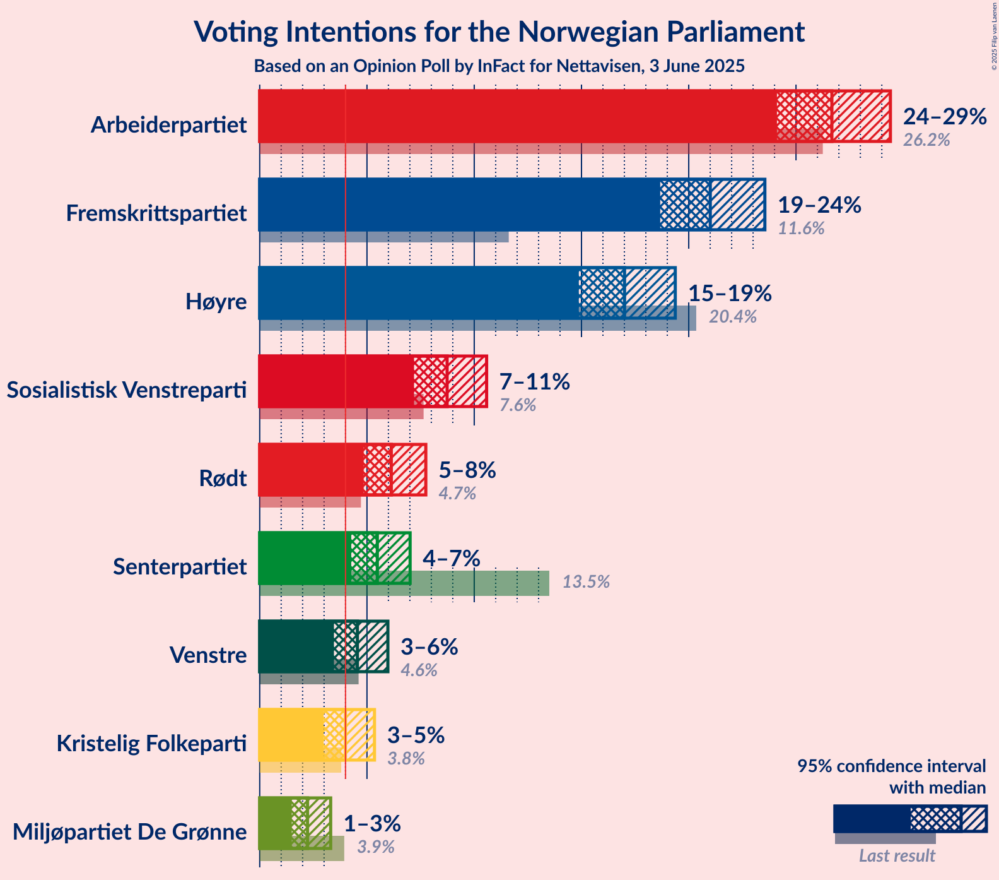

### Confidence Intervals

| Party | Last Result | Poll Result | 80% Confidence Interval | 90% Confidence Interval | 95% Confidence Interval | 99% Confidence Interval |
|:-----:|:-----------:|:-----------:|:-----------------------:|:-----------------------:|:-----------------------:|:-----------------------:|
| Arbeiderpartiet | 26.2% | 26.7% | 25.0–28.5% |24.5–29.0% |24.1–29.4% |23.3–30.3% |
| Fremskrittspartiet | 11.6% | 21.0% | 19.5–22.7% |19.0–23.1% |18.7–23.5% |18.0–24.4% |
| Høyre | 20.4% | 17.0% | 15.6–18.6% |15.2–19.0% |14.9–19.4% |14.2–20.1% |
| Sosialistisk Venstreparti | 7.6% | 8.7% | 7.7–9.9% |7.4–10.3% |7.2–10.6% |6.7–11.2% |
| Rødt | 4.7% | 6.1% | 5.3–7.2% |5.0–7.5% |4.8–7.7% |4.5–8.3% |
| Senterpartiet | 13.5% | 5.5% | 4.7–6.5% |4.5–6.8% |4.3–7.0% |3.9–7.5% |
| Venstre | 4.6% | 4.6% | 3.8–5.5% |3.6–5.7% |3.5–6.0% |3.1–6.4% |
| Kristelig Folkeparti | 3.8% | 4.0% | 3.3–4.9% |3.1–5.1% |3.0–5.3% |2.7–5.8% |
| Miljøpartiet De Grønne | 3.9% | 2.2% | 1.8–2.9% |1.6–3.1% |1.5–3.3% |1.3–3.7% |

*Note:* The poll result column reflects the actual value used in the calculations. Published results may vary slightly, and in addition be rounded to fewer digits.

## Seats

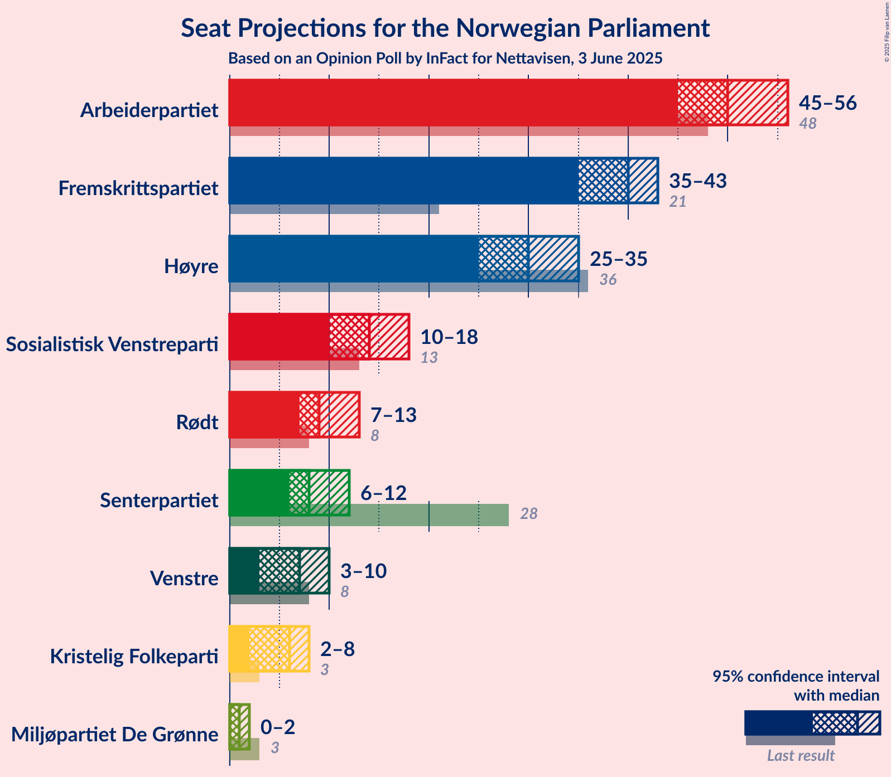

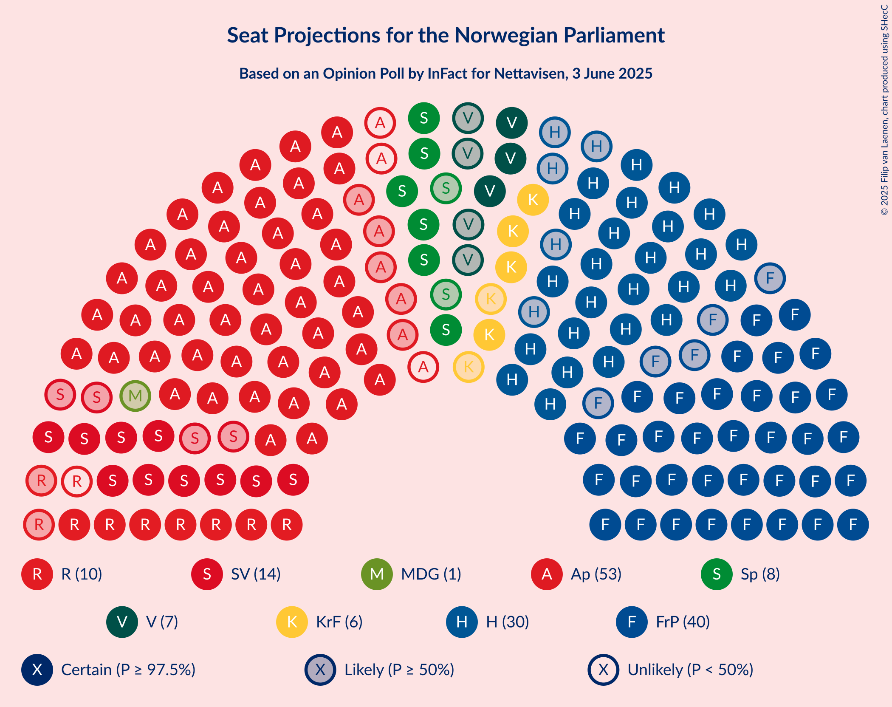

### Confidence Intervals

| Party | Last Result | Median | 80% Confidence Interval | 90% Confidence Interval | 95% Confidence Interval | 99% Confidence Interval |
|:-----:|:-----------:|:------:|:-----------------------:|:-----------------------:|:-----------------------:|:-----------------------:|
| <a href="#arbeiderpartiet">Arbeiderpartiet</a> | 48 | 50 | 47–54 |46–55 |45–56 |44–57 |
| <a href="#fremskrittspartiet">Fremskrittspartiet</a> | 21 | 40 | 37–42 |36–42 |35–43 |33–44 |
| <a href="#høyre">Høyre</a> | 36 | 30 | 26–33 |26–33 |25–35 |22–36 |
| <a href="#sosialistisk-venstreparti">Sosialistisk Venstreparti</a> | 13 | 14 | 11–16 |11–17 |10–18 |9–19 |
| <a href="#rødt">Rødt</a> | 8 | 9 | 8–12 |8–12 |7–13 |7–14 |
| <a href="#senterpartiet">Senterpartiet</a> | 28 | 8 | 7–11 |6–12 |6–12 |1–13 |
| <a href="#venstre">Venstre</a> | 8 | 7 | 3–9 |3–10 |3–10 |2–11 |
| <a href="#kristelig-folkeparti">Kristelig Folkeparti</a> | 3 | 6 | 2–8 |2–8 |2–8 |1–9 |
| <a href="#miljøpartiet-de-grønne">Miljøpartiet De Grønne</a> | 3 | 1 | 1–2 |1–2 |0–2 |0–3 |

### Arbeiderpartiet

*For a full overview of the results for this party, see the [Arbeiderpartiet](party-arbeiderpartiet.html) page.*

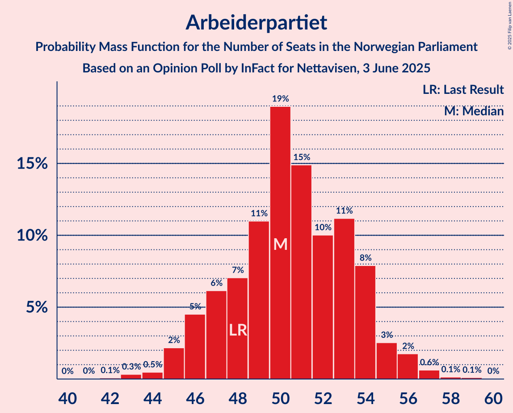

| Number of Seats | Probability | Accumulated | Special Marks |
|:---------------:|:-----------:|:-----------:|:-------------:|
| 41 | 0% | 100% |  |
| 42 | 0.1% | 99.9% |  |
| 43 | 0.3% | 99.9% |  |
| 44 | 0.5% | 99.5% |  |
| 45 | 2% | 99.1% |  |
| 46 | 5% | 97% |  |
| 47 | 6% | 92% |  |
| 48 | 7% | 86% | Last Result |
| 49 | 11% | 79% |  |
| 50 | 19% | 68% | Median |
| 51 | 15% | 49% |  |
| 52 | 10% | 34% |  |
| 53 | 11% | 24% |  |
| 54 | 8% | 13% |  |
| 55 | 3% | 5% |  |
| 56 | 2% | 3% |  |
| 57 | 0.6% | 0.9% |  |
| 58 | 0.1% | 0.3% |  |
| 59 | 0.1% | 0.1% |  |
| 60 | 0% | 0% |  |

### Fremskrittspartiet

*For a full overview of the results for this party, see the [Fremskrittspartiet](party-fremskrittspartiet.html) page.*

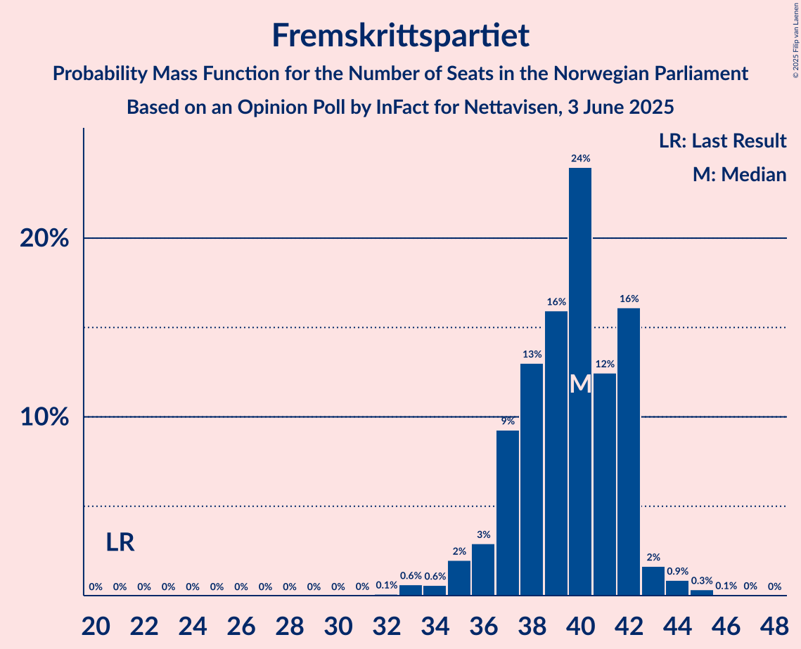

| Number of Seats | Probability | Accumulated | Special Marks |
|:---------------:|:-----------:|:-----------:|:-------------:|
| 21 | 0% | 100% | Last Result |
| 22 | 0% | 100% |  |
| 23 | 0% | 100% |  |
| 24 | 0% | 100% |  |
| 25 | 0% | 100% |  |
| 26 | 0% | 100% |  |
| 27 | 0% | 100% |  |
| 28 | 0% | 100% |  |
| 29 | 0% | 100% |  |
| 30 | 0% | 100% |  |
| 31 | 0% | 100% |  |
| 32 | 0.1% | 100% |  |
| 33 | 0.6% | 99.9% |  |
| 34 | 0.6% | 99.3% |  |
| 35 | 2% | 98.7% |  |
| 36 | 3% | 97% |  |
| 37 | 9% | 94% |  |
| 38 | 13% | 84% |  |
| 39 | 16% | 71% |  |
| 40 | 24% | 56% | Median |
| 41 | 12% | 32% |  |
| 42 | 16% | 19% |  |
| 43 | 2% | 3% |  |
| 44 | 0.9% | 1.3% |  |
| 45 | 0.3% | 0.5% |  |
| 46 | 0.1% | 0.1% |  |
| 47 | 0% | 0.1% |  |
| 48 | 0% | 0% |  |

### Høyre

*For a full overview of the results for this party, see the [Høyre](party-høyre.html) page.*

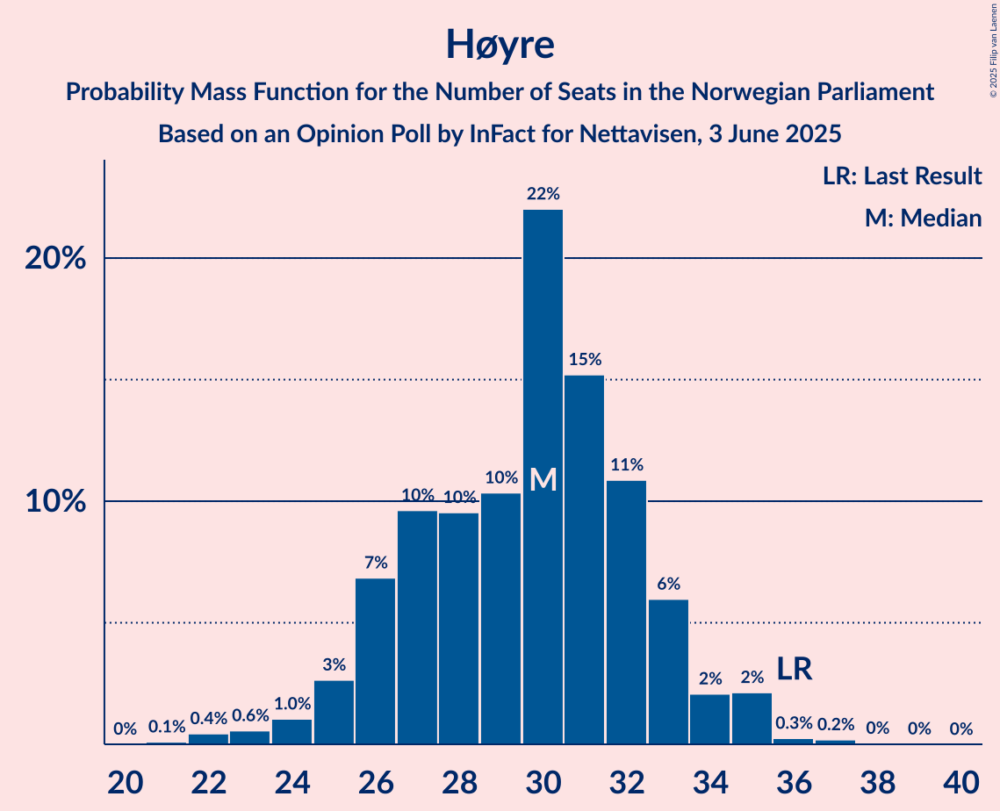

| Number of Seats | Probability | Accumulated | Special Marks |
|:---------------:|:-----------:|:-----------:|:-------------:|
| 21 | 0.1% | 100% |  |
| 22 | 0.4% | 99.9% |  |
| 23 | 0.6% | 99.4% |  |
| 24 | 1.0% | 98.9% |  |
| 25 | 3% | 98% |  |
| 26 | 7% | 95% |  |
| 27 | 10% | 88% |  |
| 28 | 10% | 79% |  |
| 29 | 10% | 69% |  |
| 30 | 22% | 59% | Median |
| 31 | 15% | 37% |  |
| 32 | 11% | 22% |  |
| 33 | 6% | 11% |  |
| 34 | 2% | 5% |  |
| 35 | 2% | 3% |  |
| 36 | 0.3% | 0.5% | Last Result |
| 37 | 0.2% | 0.3% |  |
| 38 | 0% | 0.1% |  |
| 39 | 0% | 0% |  |

### Sosialistisk Venstreparti

*For a full overview of the results for this party, see the [Sosialistisk Venstreparti](party-sosialistiskvenstreparti.html) page.*

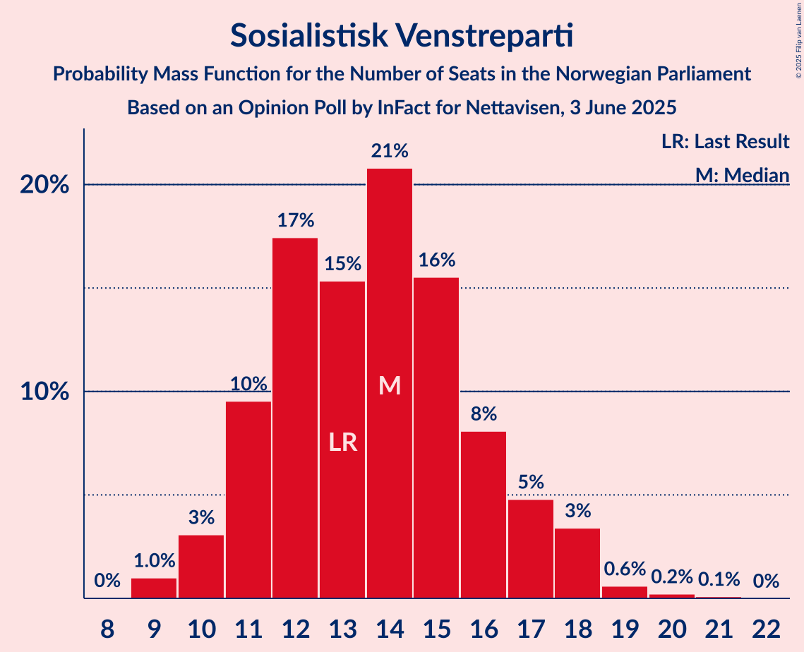

| Number of Seats | Probability | Accumulated | Special Marks |
|:---------------:|:-----------:|:-----------:|:-------------:|
| 9 | 1.0% | 100% |  |
| 10 | 3% | 99.0% |  |
| 11 | 10% | 96% |  |
| 12 | 17% | 86% |  |
| 13 | 15% | 69% | Last Result |
| 14 | 21% | 54% | Median |
| 15 | 16% | 33% |  |
| 16 | 8% | 17% |  |
| 17 | 5% | 9% |  |
| 18 | 3% | 4% |  |
| 19 | 0.6% | 0.9% |  |
| 20 | 0.2% | 0.3% |  |
| 21 | 0.1% | 0.1% |  |
| 22 | 0% | 0% |  |

### Rødt

*For a full overview of the results for this party, see the [Rødt](party-rødt.html) page.*

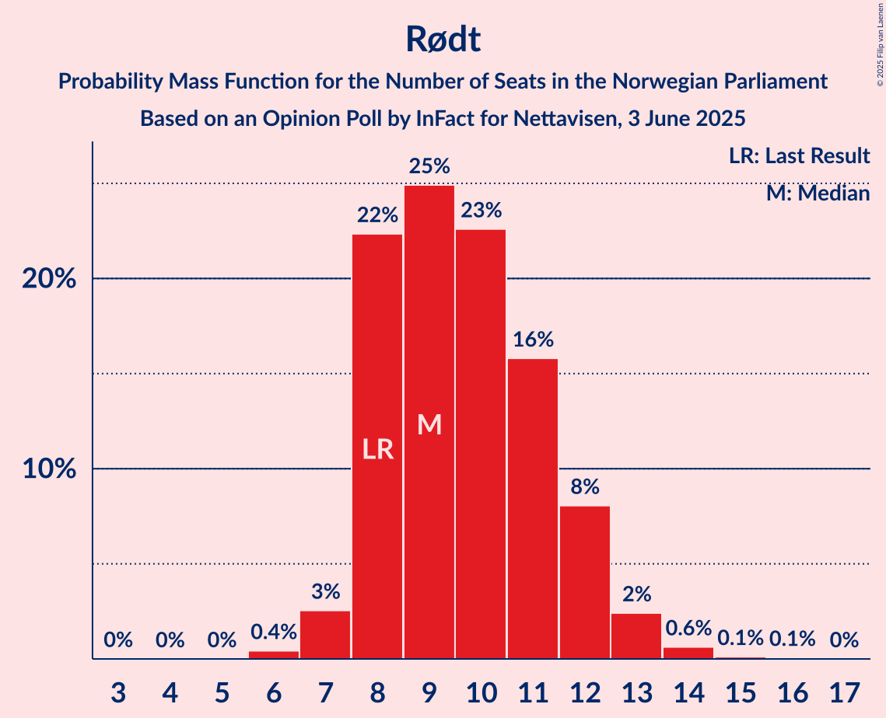

| Number of Seats | Probability | Accumulated | Special Marks |
|:---------------:|:-----------:|:-----------:|:-------------:|
| 3 | 0% | 100% |  |
| 4 | 0% | 99.9% |  |
| 5 | 0% | 99.9% |  |
| 6 | 0.4% | 99.9% |  |
| 7 | 3% | 99.5% |  |
| 8 | 22% | 97% | Last Result |
| 9 | 25% | 75% | Median |
| 10 | 23% | 50% |  |
| 11 | 16% | 27% |  |
| 12 | 8% | 11% |  |
| 13 | 2% | 3% |  |
| 14 | 0.6% | 0.8% |  |
| 15 | 0.1% | 0.2% |  |
| 16 | 0.1% | 0.1% |  |
| 17 | 0% | 0% |  |

### Senterpartiet

*For a full overview of the results for this party, see the [Senterpartiet](party-senterpartiet.html) page.*

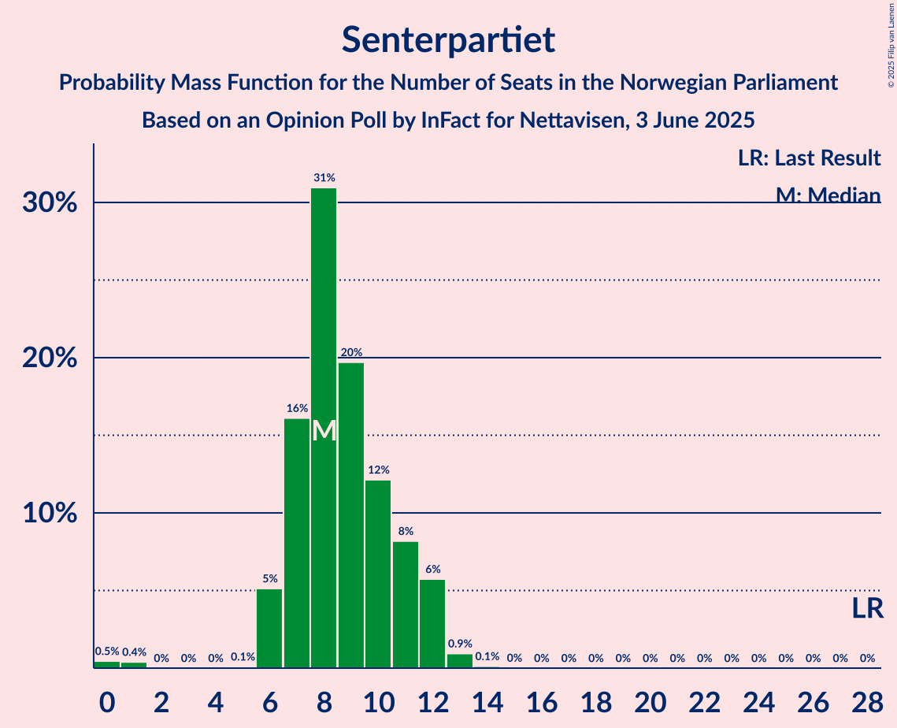

| Number of Seats | Probability | Accumulated | Special Marks |
|:---------------:|:-----------:|:-----------:|:-------------:|
| 0 | 0.5% | 100% |  |
| 1 | 0.4% | 99.5% |  |
| 2 | 0% | 99.1% |  |
| 3 | 0% | 99.1% |  |
| 4 | 0% | 99.1% |  |
| 5 | 0.1% | 99.1% |  |
| 6 | 5% | 99.1% |  |
| 7 | 16% | 94% |  |
| 8 | 31% | 78% | Median |
| 9 | 20% | 47% |  |
| 10 | 12% | 27% |  |
| 11 | 8% | 15% |  |
| 12 | 6% | 7% |  |
| 13 | 0.9% | 1.1% |  |
| 14 | 0.1% | 0.1% |  |
| 15 | 0% | 0% |  |
| 16 | 0% | 0% |  |
| 17 | 0% | 0% |  |
| 18 | 0% | 0% |  |
| 19 | 0% | 0% |  |
| 20 | 0% | 0% |  |
| 21 | 0% | 0% |  |
| 22 | 0% | 0% |  |
| 23 | 0% | 0% |  |
| 24 | 0% | 0% |  |
| 25 | 0% | 0% |  |
| 26 | 0% | 0% |  |
| 27 | 0% | 0% |  |
| 28 | 0% | 0% | Last Result |

### Venstre

*For a full overview of the results for this party, see the [Venstre](party-venstre.html) page.*

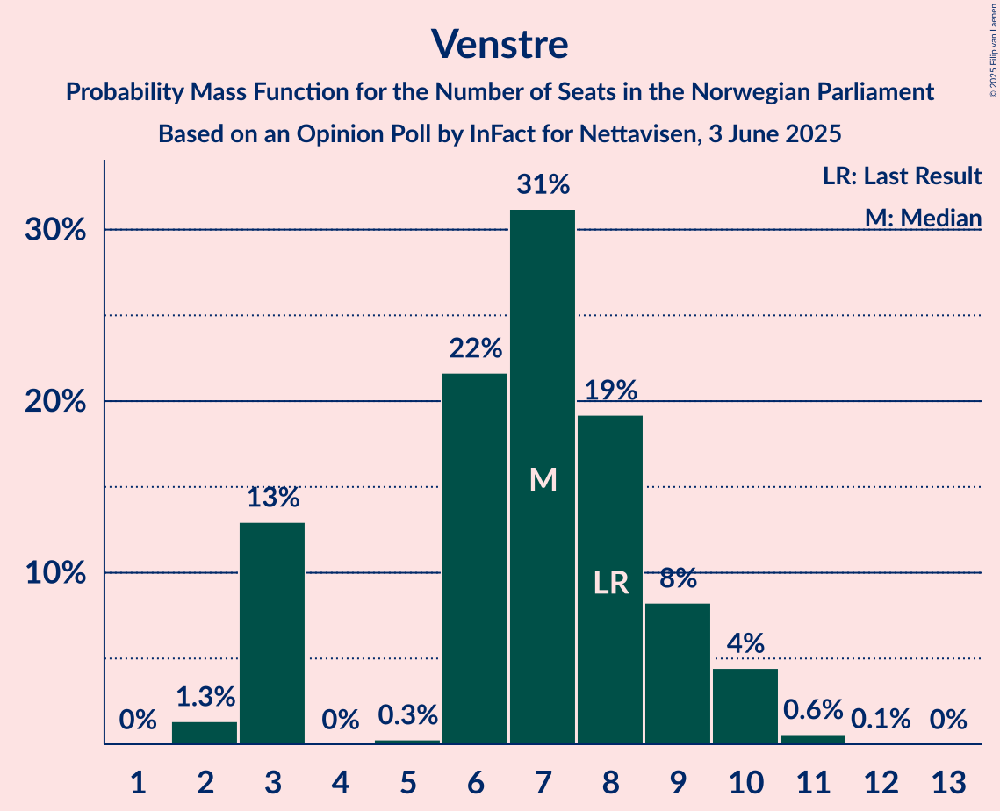

| Number of Seats | Probability | Accumulated | Special Marks |
|:---------------:|:-----------:|:-----------:|:-------------:|
| 2 | 1.3% | 100% |  |
| 3 | 13% | 98.7% |  |
| 4 | 0% | 86% |  |
| 5 | 0.3% | 86% |  |
| 6 | 22% | 85% |  |
| 7 | 31% | 64% | Median |
| 8 | 19% | 33% | Last Result |
| 9 | 8% | 13% |  |
| 10 | 4% | 5% |  |
| 11 | 0.6% | 0.7% |  |
| 12 | 0.1% | 0.1% |  |
| 13 | 0% | 0% |  |

### Kristelig Folkeparti

*For a full overview of the results for this party, see the [Kristelig Folkeparti](party-kristeligfolkeparti.html) page.*

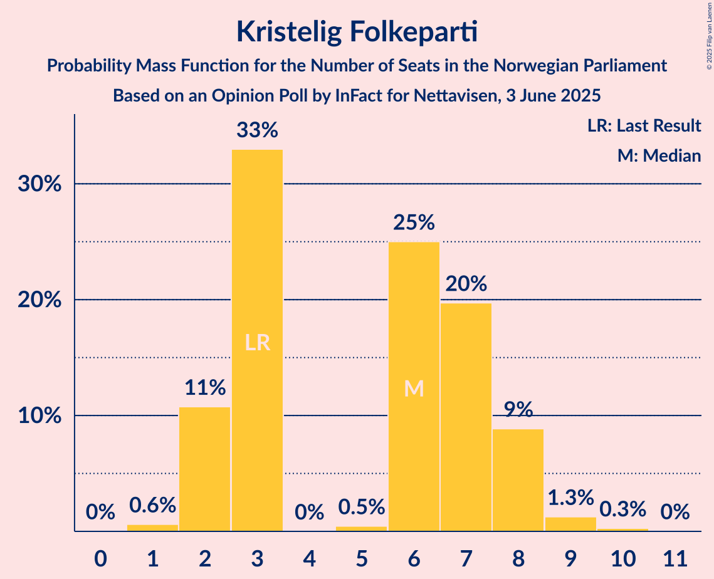

| Number of Seats | Probability | Accumulated | Special Marks |
|:---------------:|:-----------:|:-----------:|:-------------:|
| 1 | 0.6% | 100% |  |
| 2 | 11% | 99.4% |  |
| 3 | 33% | 89% | Last Result |
| 4 | 0% | 56% |  |
| 5 | 0.5% | 56% |  |
| 6 | 25% | 55% | Median |
| 7 | 20% | 30% |  |
| 8 | 9% | 10% |  |
| 9 | 1.3% | 2% |  |
| 10 | 0.3% | 0.3% |  |
| 11 | 0% | 0% |  |

### Miljøpartiet De Grønne

*For a full overview of the results for this party, see the [Miljøpartiet De Grønne](party-miljøpartietdegrønne.html) page.*

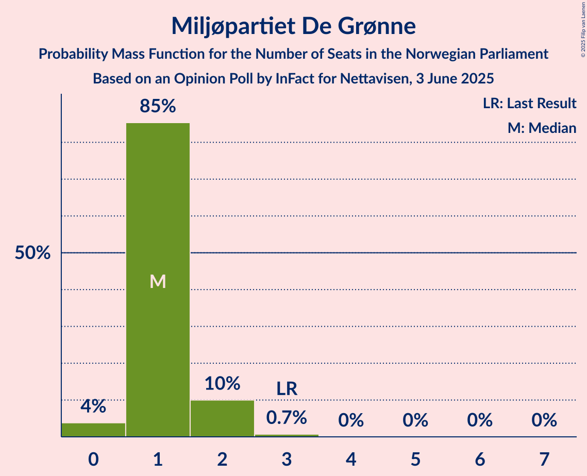

| Number of Seats | Probability | Accumulated | Special Marks |
|:---------------:|:-----------:|:-----------:|:-------------:|
| 0 | 4% | 100% |  |
| 1 | 85% | 96% | Median |
| 2 | 10% | 11% |  |
| 3 | 0.7% | 0.8% | Last Result |
| 4 | 0% | 0.1% |  |
| 5 | 0% | 0.1% |  |
| 6 | 0% | 0.1% |  |
| 7 | 0% | 0% |  |

## Coalitions

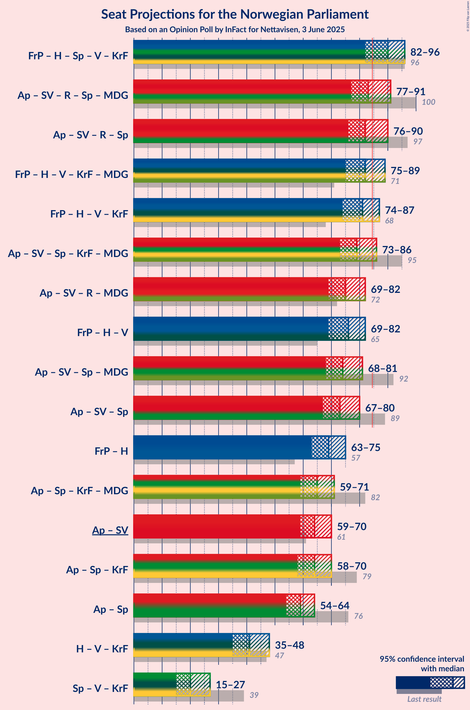

### Confidence Intervals

| Coalition | Last Result | Median | Majority? | 80% Confidence Interval | 90% Confidence Interval | 95% Confidence Interval | 99% Confidence Interval |
|:---------:|:-----------:|:------:|:---------:|:-----------------------:|:-----------------------:|:-----------------------:|:-----------------------:|
| Fremskrittspartiet – Høyre – Senterpartiet – Venstre – Kristelig Folkeparti | 96 | 90 | 93% | 85–94 | 84–95 | 82–96 | 80–98 |
| Arbeiderpartiet – Sosialistisk Venstreparti – Rødt – Senterpartiet – Miljøpartiet De Grønne | 100 | 83 | 42% | 78–88 | 78–90 | 77–91 | 75–93 |
| Arbeiderpartiet – Sosialistisk Venstreparti – Rødt – Senterpartiet | 97 | 82 | 32% | 77–87 | 77–89 | 76–90 | 74–92 |
| Fremskrittspartiet – Høyre – Venstre – Kristelig Folkeparti – Miljøpartiet De Grønne | 71 | 82 | 24% | 78–86 | 76–87 | 75–89 | 72–91 |
| Fremskrittspartiet – Høyre – Venstre – Kristelig Folkeparti | 68 | 81 | 17% | 77–85 | 75–86 | 74–87 | 71–90 |
| Arbeiderpartiet – Sosialistisk Venstreparti – Senterpartiet – Kristelig Folkeparti – Miljøpartiet De Grønne | 95 | 79 | 6% | 74–83 | 73–85 | 73–86 | 71–89 |
| Arbeiderpartiet – Sosialistisk Venstreparti – Rødt – Miljøpartiet De Grønne | 72 | 75 | 0.4% | 70–79 | 70–81 | 69–82 | 67–84 |
| Fremskrittspartiet – Høyre – Venstre | 65 | 76 | 0.2% | 71–80 | 70–81 | 69–82 | 67–84 |
| Arbeiderpartiet – Sosialistisk Venstreparti – Senterpartiet – Miljøpartiet De Grønne | 92 | 74 | 0.1% | 70–78 | 69–79 | 68–81 | 66–82 |
| Arbeiderpartiet – Sosialistisk Venstreparti – Senterpartiet | 89 | 73 | 0% | 69–77 | 68–78 | 67–80 | 65–81 |
| Fremskrittspartiet – Høyre | 57 | 69 | 0% | 65–73 | 64–74 | 63–75 | 61–77 |
| Arbeiderpartiet – Senterpartiet – Kristelig Folkeparti – Miljøpartiet De Grønne | 82 | 65 | 0% | 61–69 | 60–70 | 59–71 | 57–73 |
| Arbeiderpartiet – Sosialistisk Venstreparti | 61 | 64 | 0% | 61–68 | 60–69 | 59–70 | 57–72 |
| Arbeiderpartiet – Senterpartiet – Kristelig Folkeparti | 79 | 64 | 0% | 60–68 | 59–69 | 58–70 | 56–72 |
| Arbeiderpartiet – Senterpartiet | 76 | 59 | 0% | 56–62 | 55–63 | 54–64 | 52–66 |
| Høyre – Venstre – Kristelig Folkeparti | 47 | 41 | 0% | 36–45 | 36–47 | 35–48 | 32–49 |
| Senterpartiet – Venstre – Kristelig Folkeparti | 39 | 20 | 0% | 17–24 | 15–26 | 15–27 | 13–28 |

### Fremskrittspartiet – Høyre – Senterpartiet – Venstre – Kristelig Folkeparti

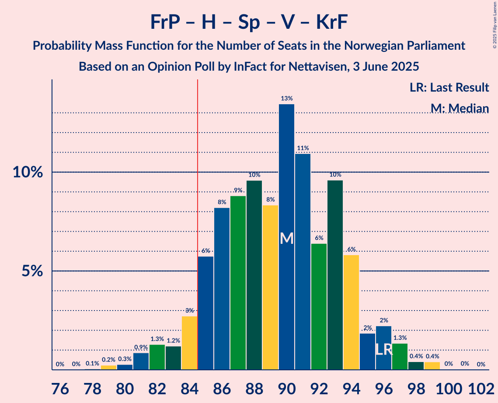

| Number of Seats | Probability | Accumulated | Special Marks |
|:---------------:|:-----------:|:-----------:|:-------------:|
| 78 | 0.1% | 100% |  |
| 79 | 0.2% | 99.9% |  |
| 80 | 0.3% | 99.7% |  |
| 81 | 0.9% | 99.4% |  |
| 82 | 1.3% | 98.5% |  |
| 83 | 1.2% | 97% |  |
| 84 | 3% | 96% |  |
| 85 | 6% | 93% | Majority |
| 86 | 8% | 88% |  |
| 87 | 9% | 79% |  |
| 88 | 10% | 71% |  |
| 89 | 8% | 61% |  |
| 90 | 13% | 53% |  |
| 91 | 11% | 39% | Median |
| 92 | 6% | 28% |  |
| 93 | 10% | 22% |  |
| 94 | 6% | 12% |  |
| 95 | 2% | 6% |  |
| 96 | 2% | 4% | Last Result |
| 97 | 1.3% | 2% |  |
| 98 | 0.4% | 0.9% |  |
| 99 | 0.4% | 0.5% |  |
| 100 | 0% | 0.1% |  |
| 101 | 0% | 0.1% |  |
| 102 | 0% | 0% |  |

### Arbeiderpartiet – Sosialistisk Venstreparti – Rødt – Senterpartiet – Miljøpartiet De Grønne

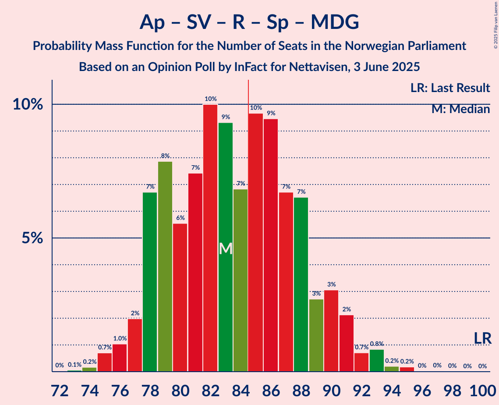

| Number of Seats | Probability | Accumulated | Special Marks |
|:---------------:|:-----------:|:-----------:|:-------------:|
| 73 | 0.1% | 100% |  |
| 74 | 0.2% | 99.9% |  |
| 75 | 0.7% | 99.7% |  |
| 76 | 1.0% | 99.0% |  |
| 77 | 2% | 98% |  |
| 78 | 7% | 96% |  |
| 79 | 8% | 89% |  |
| 80 | 6% | 81% |  |
| 81 | 7% | 76% |  |
| 82 | 10% | 68% | Median |
| 83 | 9% | 58% |  |
| 84 | 7% | 49% |  |
| 85 | 10% | 42% | Majority |
| 86 | 9% | 33% |  |
| 87 | 7% | 23% |  |
| 88 | 7% | 16% |  |
| 89 | 3% | 10% |  |
| 90 | 3% | 7% |  |
| 91 | 2% | 4% |  |
| 92 | 0.7% | 2% |  |
| 93 | 0.8% | 1.3% |  |
| 94 | 0.2% | 0.5% |  |
| 95 | 0.2% | 0.3% |  |
| 96 | 0% | 0.1% |  |
| 97 | 0% | 0.1% |  |
| 98 | 0% | 0% |  |
| 99 | 0% | 0% |  |
| 100 | 0% | 0% | Last Result |

### Arbeiderpartiet – Sosialistisk Venstreparti – Rødt – Senterpartiet

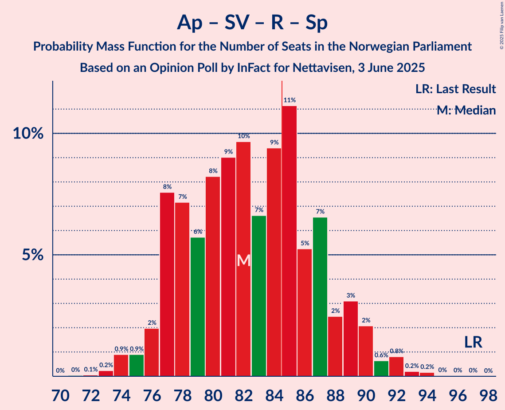

| Number of Seats | Probability | Accumulated | Special Marks |
|:---------------:|:-----------:|:-----------:|:-------------:|
| 71 | 0% | 100% |  |
| 72 | 0.1% | 99.9% |  |
| 73 | 0.2% | 99.9% |  |
| 74 | 0.9% | 99.7% |  |
| 75 | 0.9% | 98.8% |  |
| 76 | 2% | 98% |  |
| 77 | 8% | 96% |  |
| 78 | 7% | 88% |  |
| 79 | 6% | 81% |  |
| 80 | 8% | 75% |  |
| 81 | 9% | 67% | Median |
| 82 | 10% | 58% |  |
| 83 | 7% | 49% |  |
| 84 | 9% | 42% |  |
| 85 | 11% | 32% | Majority |
| 86 | 5% | 21% |  |
| 87 | 7% | 16% |  |
| 88 | 2% | 10% |  |
| 89 | 3% | 7% |  |
| 90 | 2% | 4% |  |
| 91 | 0.6% | 2% |  |
| 92 | 0.8% | 1.2% |  |
| 93 | 0.2% | 0.4% |  |
| 94 | 0.2% | 0.2% |  |
| 95 | 0% | 0.1% |  |
| 96 | 0% | 0% |  |
| 97 | 0% | 0% | Last Result |

### Fremskrittspartiet – Høyre – Venstre – Kristelig Folkeparti – Miljøpartiet De Grønne

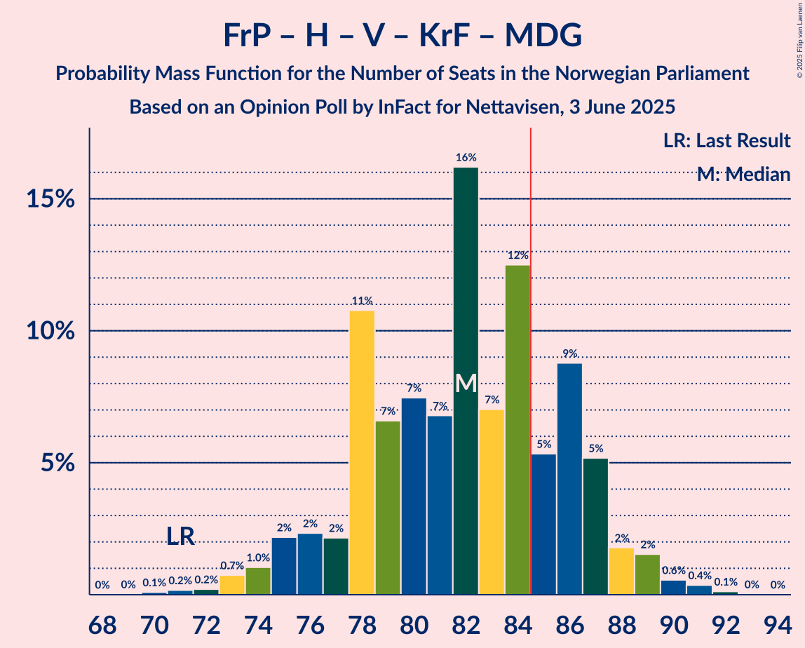

| Number of Seats | Probability | Accumulated | Special Marks |
|:---------------:|:-----------:|:-----------:|:-------------:|
| 70 | 0.1% | 100% |  |
| 71 | 0.2% | 99.9% | Last Result |
| 72 | 0.2% | 99.7% |  |
| 73 | 0.7% | 99.5% |  |
| 74 | 1.0% | 98.8% |  |
| 75 | 2% | 98% |  |
| 76 | 2% | 96% |  |
| 77 | 2% | 93% |  |
| 78 | 11% | 91% |  |
| 79 | 7% | 80% |  |
| 80 | 7% | 74% |  |
| 81 | 7% | 66% |  |
| 82 | 16% | 59% |  |
| 83 | 7% | 43% |  |
| 84 | 12% | 36% | Median |
| 85 | 5% | 24% | Majority |
| 86 | 9% | 18% |  |
| 87 | 5% | 10% |  |
| 88 | 2% | 4% |  |
| 89 | 2% | 3% |  |
| 90 | 0.6% | 1.1% |  |
| 91 | 0.4% | 0.5% |  |
| 92 | 0.1% | 0.2% |  |
| 93 | 0% | 0% |  |

### Fremskrittspartiet – Høyre – Venstre – Kristelig Folkeparti

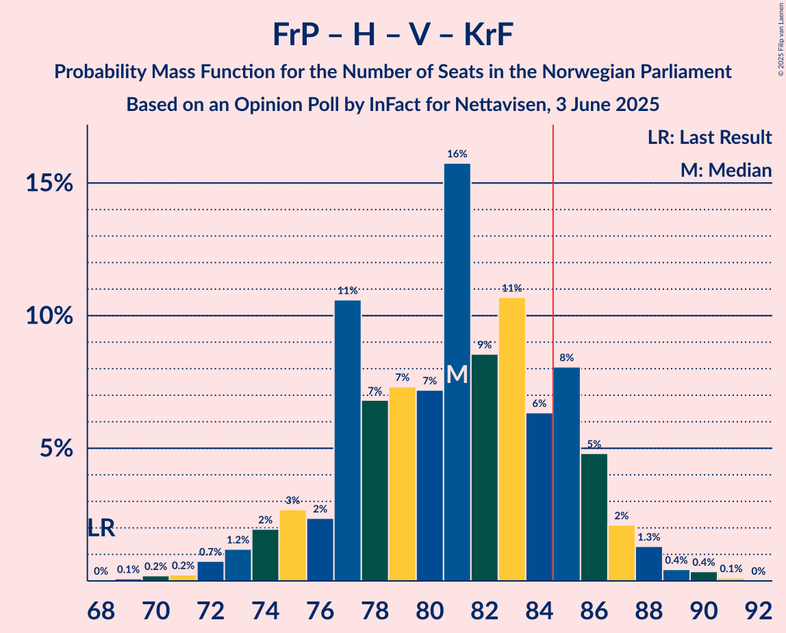

| Number of Seats | Probability | Accumulated | Special Marks |
|:---------------:|:-----------:|:-----------:|:-------------:|
| 68 | 0% | 100% | Last Result |
| 69 | 0.1% | 100% |  |
| 70 | 0.2% | 99.9% |  |
| 71 | 0.2% | 99.7% |  |
| 72 | 0.7% | 99.5% |  |
| 73 | 1.2% | 98.7% |  |
| 74 | 2% | 98% |  |
| 75 | 3% | 96% |  |
| 76 | 2% | 93% |  |
| 77 | 11% | 91% |  |
| 78 | 7% | 80% |  |
| 79 | 7% | 73% |  |
| 80 | 7% | 66% |  |
| 81 | 16% | 59% |  |
| 82 | 9% | 43% |  |
| 83 | 11% | 34% | Median |
| 84 | 6% | 24% |  |
| 85 | 8% | 17% | Majority |
| 86 | 5% | 9% |  |
| 87 | 2% | 4% |  |
| 88 | 1.3% | 2% |  |
| 89 | 0.4% | 0.9% |  |
| 90 | 0.4% | 0.5% |  |
| 91 | 0.1% | 0.2% |  |
| 92 | 0% | 0% |  |

### Arbeiderpartiet – Sosialistisk Venstreparti – Senterpartiet – Kristelig Folkeparti – Miljøpartiet De Grønne

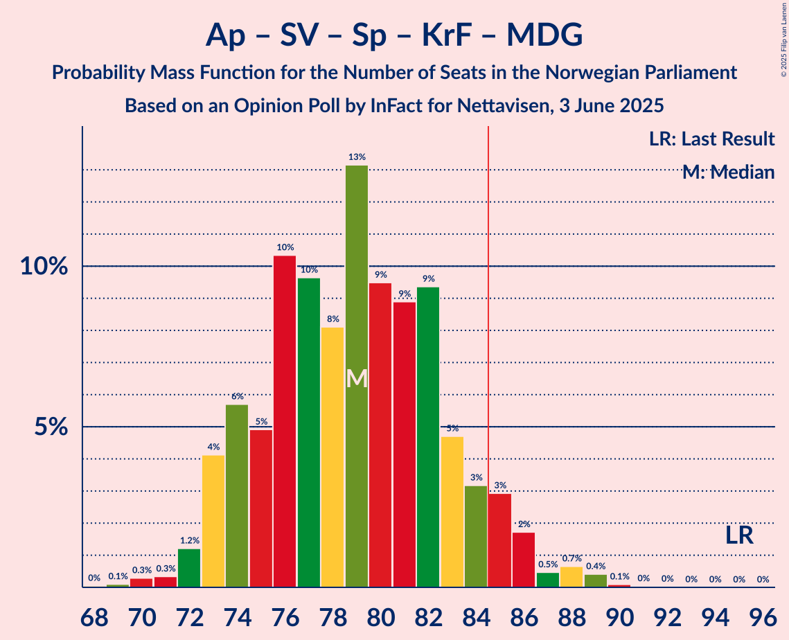

| Number of Seats | Probability | Accumulated | Special Marks |
|:---------------:|:-----------:|:-----------:|:-------------:|
| 68 | 0% | 100% |  |
| 69 | 0.1% | 99.9% |  |
| 70 | 0.3% | 99.8% |  |
| 71 | 0.3% | 99.5% |  |
| 72 | 1.2% | 99.2% |  |
| 73 | 4% | 98% |  |
| 74 | 6% | 94% |  |
| 75 | 5% | 88% |  |
| 76 | 10% | 83% |  |
| 77 | 10% | 73% |  |
| 78 | 8% | 63% |  |
| 79 | 13% | 55% | Median |
| 80 | 9% | 42% |  |
| 81 | 9% | 33% |  |
| 82 | 9% | 24% |  |
| 83 | 5% | 14% |  |
| 84 | 3% | 10% |  |
| 85 | 3% | 6% | Majority |
| 86 | 2% | 3% |  |
| 87 | 0.5% | 2% |  |
| 88 | 0.7% | 1.2% |  |
| 89 | 0.4% | 0.6% |  |
| 90 | 0.1% | 0.2% |  |
| 91 | 0% | 0.1% |  |
| 92 | 0% | 0% |  |
| 93 | 0% | 0% |  |
| 94 | 0% | 0% |  |
| 95 | 0% | 0% | Last Result |

### Arbeiderpartiet – Sosialistisk Venstreparti – Rødt – Miljøpartiet De Grønne

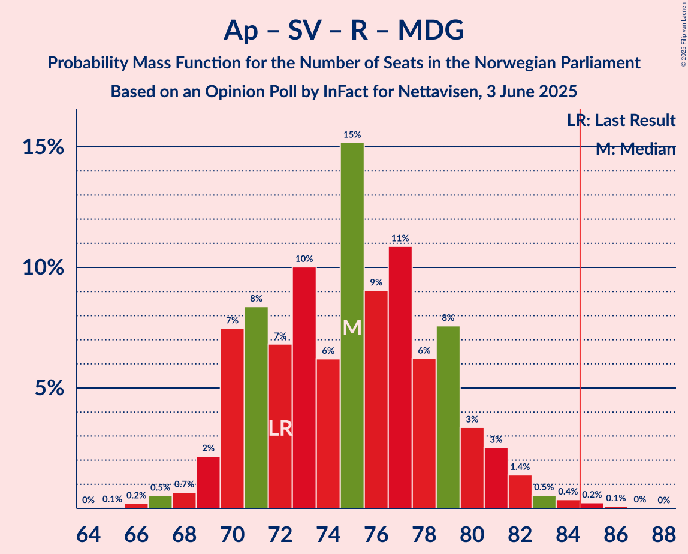

| Number of Seats | Probability | Accumulated | Special Marks |
|:---------------:|:-----------:|:-----------:|:-------------:|
| 65 | 0.1% | 100% |  |
| 66 | 0.2% | 99.9% |  |
| 67 | 0.5% | 99.7% |  |
| 68 | 0.7% | 99.2% |  |
| 69 | 2% | 98.5% |  |
| 70 | 7% | 96% |  |
| 71 | 8% | 89% |  |
| 72 | 7% | 81% | Last Result |
| 73 | 10% | 74% |  |
| 74 | 6% | 64% | Median |
| 75 | 15% | 57% |  |
| 76 | 9% | 42% |  |
| 77 | 11% | 33% |  |
| 78 | 6% | 22% |  |
| 79 | 8% | 16% |  |
| 80 | 3% | 9% |  |
| 81 | 3% | 5% |  |
| 82 | 1.4% | 3% |  |
| 83 | 0.5% | 1.3% |  |
| 84 | 0.4% | 0.8% |  |
| 85 | 0.2% | 0.4% | Majority |
| 86 | 0.1% | 0.2% |  |
| 87 | 0% | 0.1% |  |
| 88 | 0% | 0% |  |

### Fremskrittspartiet – Høyre – Venstre

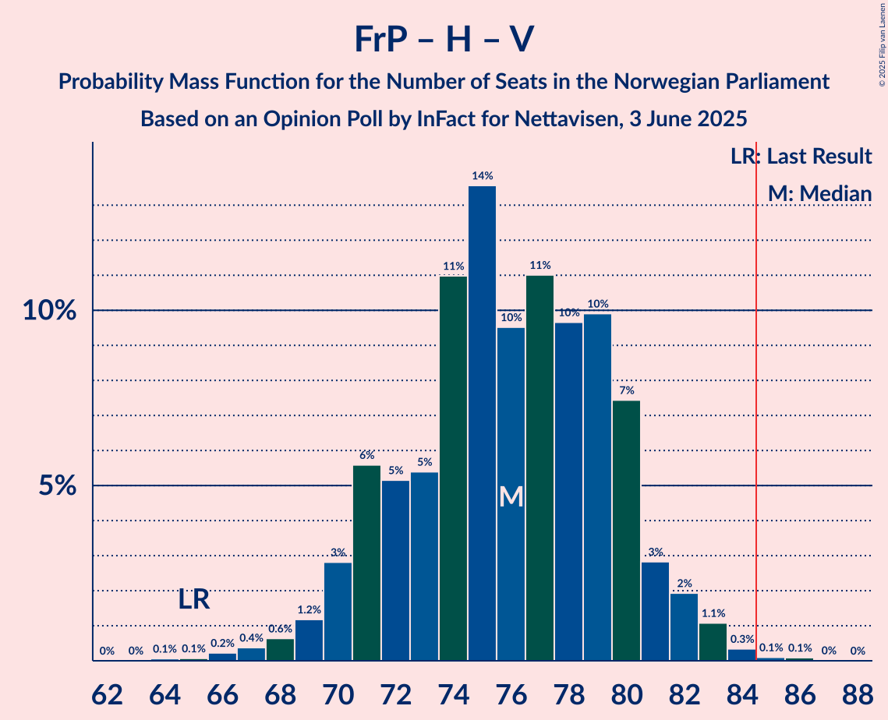

| Number of Seats | Probability | Accumulated | Special Marks |
|:---------------:|:-----------:|:-----------:|:-------------:|
| 64 | 0.1% | 100% |  |
| 65 | 0.1% | 99.9% | Last Result |
| 66 | 0.2% | 99.9% |  |
| 67 | 0.4% | 99.6% |  |
| 68 | 0.6% | 99.2% |  |
| 69 | 1.2% | 98.6% |  |
| 70 | 3% | 97% |  |
| 71 | 6% | 95% |  |
| 72 | 5% | 89% |  |
| 73 | 5% | 84% |  |
| 74 | 11% | 78% |  |
| 75 | 14% | 67% |  |
| 76 | 10% | 54% |  |
| 77 | 11% | 44% | Median |
| 78 | 10% | 33% |  |
| 79 | 10% | 24% |  |
| 80 | 7% | 14% |  |
| 81 | 3% | 6% |  |
| 82 | 2% | 4% |  |
| 83 | 1.1% | 2% |  |
| 84 | 0.3% | 0.6% |  |
| 85 | 0.1% | 0.2% | Majority |
| 86 | 0.1% | 0.1% |  |
| 87 | 0% | 0% |  |

### Arbeiderpartiet – Sosialistisk Venstreparti – Senterpartiet – Miljøpartiet De Grønne

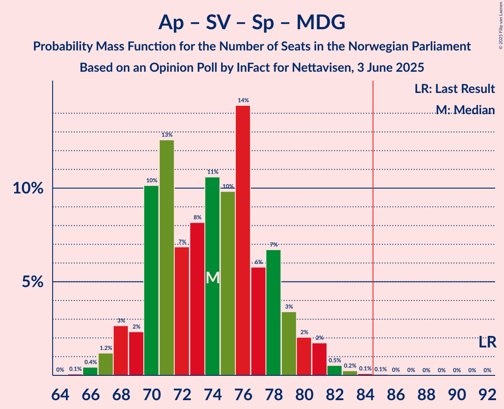

| Number of Seats | Probability | Accumulated | Special Marks |
|:---------------:|:-----------:|:-----------:|:-------------:|
| 64 | 0% | 100% |  |
| 65 | 0.1% | 99.9% |  |
| 66 | 0.4% | 99.9% |  |
| 67 | 1.2% | 99.4% |  |
| 68 | 3% | 98% |  |
| 69 | 2% | 96% |  |
| 70 | 10% | 93% |  |
| 71 | 13% | 83% |  |
| 72 | 7% | 71% |  |
| 73 | 8% | 64% | Median |
| 74 | 11% | 55% |  |
| 75 | 10% | 45% |  |
| 76 | 14% | 35% |  |
| 77 | 6% | 21% |  |
| 78 | 7% | 15% |  |
| 79 | 3% | 8% |  |
| 80 | 2% | 5% |  |
| 81 | 2% | 3% |  |
| 82 | 0.5% | 1.0% |  |
| 83 | 0.2% | 0.4% |  |
| 84 | 0.1% | 0.2% |  |
| 85 | 0.1% | 0.1% | Majority |
| 86 | 0% | 0% |  |
| 87 | 0% | 0% |  |
| 88 | 0% | 0% |  |
| 89 | 0% | 0% |  |
| 90 | 0% | 0% |  |
| 91 | 0% | 0% |  |
| 92 | 0% | 0% | Last Result |

### Arbeiderpartiet – Sosialistisk Venstreparti – Senterpartiet

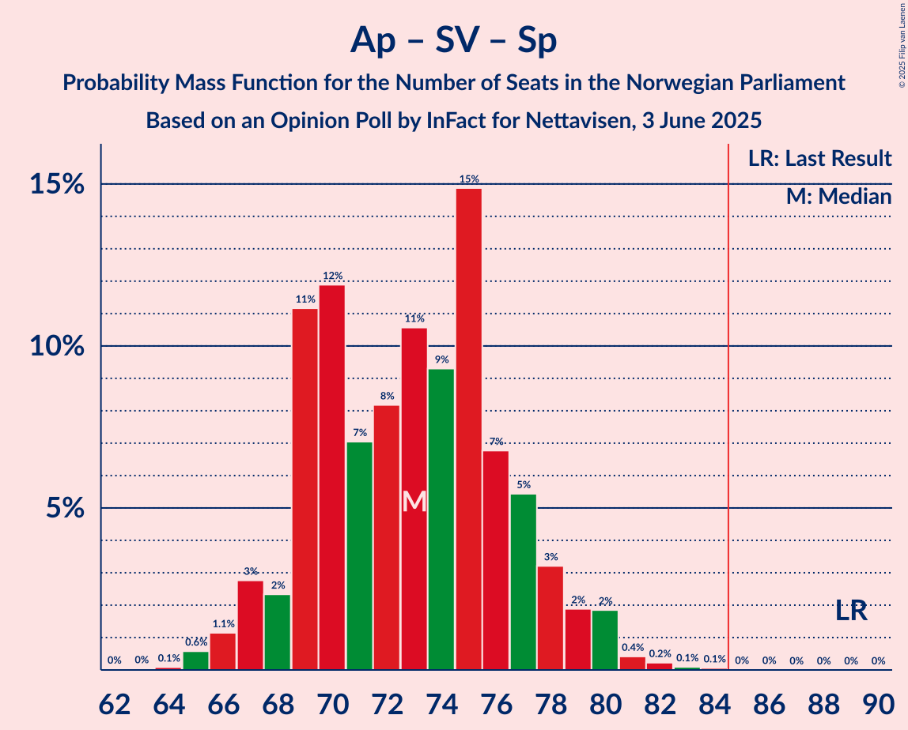

| Number of Seats | Probability | Accumulated | Special Marks |
|:---------------:|:-----------:|:-----------:|:-------------:|
| 63 | 0% | 100% |  |
| 64 | 0.1% | 99.9% |  |
| 65 | 0.6% | 99.8% |  |
| 66 | 1.1% | 99.3% |  |
| 67 | 3% | 98% |  |
| 68 | 2% | 95% |  |
| 69 | 11% | 93% |  |
| 70 | 12% | 82% |  |
| 71 | 7% | 70% |  |
| 72 | 8% | 63% | Median |
| 73 | 11% | 55% |  |
| 74 | 9% | 44% |  |
| 75 | 15% | 35% |  |
| 76 | 7% | 20% |  |
| 77 | 5% | 13% |  |
| 78 | 3% | 8% |  |
| 79 | 2% | 5% |  |
| 80 | 2% | 3% |  |
| 81 | 0.4% | 0.8% |  |
| 82 | 0.2% | 0.4% |  |
| 83 | 0.1% | 0.2% |  |
| 84 | 0.1% | 0.1% |  |
| 85 | 0% | 0% | Majority |
| 86 | 0% | 0% |  |
| 87 | 0% | 0% |  |
| 88 | 0% | 0% |  |
| 89 | 0% | 0% | Last Result |

### Fremskrittspartiet – Høyre

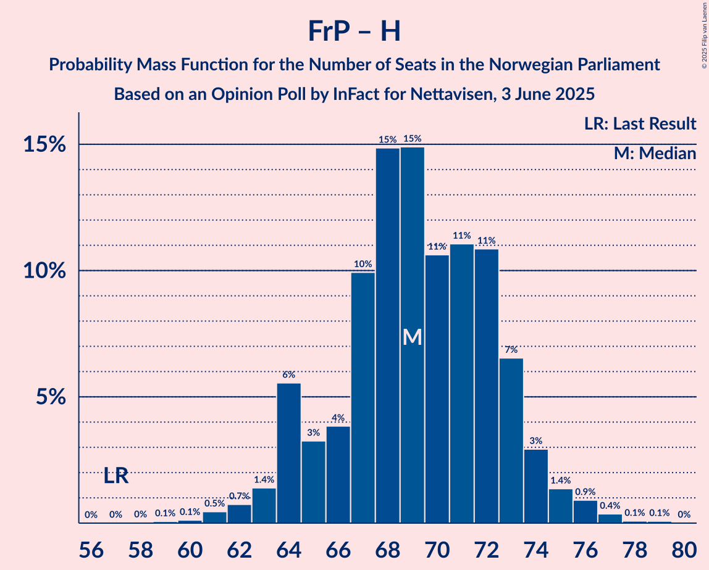

| Number of Seats | Probability | Accumulated | Special Marks |
|:---------------:|:-----------:|:-----------:|:-------------:|
| 57 | 0% | 100% | Last Result |
| 58 | 0% | 100% |  |
| 59 | 0.1% | 100% |  |
| 60 | 0.1% | 99.9% |  |
| 61 | 0.5% | 99.8% |  |
| 62 | 0.7% | 99.3% |  |
| 63 | 1.4% | 98.6% |  |
| 64 | 6% | 97% |  |
| 65 | 3% | 92% |  |
| 66 | 4% | 88% |  |
| 67 | 10% | 85% |  |
| 68 | 15% | 75% |  |
| 69 | 15% | 60% |  |
| 70 | 11% | 45% | Median |
| 71 | 11% | 34% |  |
| 72 | 11% | 23% |  |
| 73 | 7% | 12% |  |
| 74 | 3% | 6% |  |
| 75 | 1.4% | 3% |  |
| 76 | 0.9% | 1.5% |  |
| 77 | 0.4% | 0.5% |  |
| 78 | 0.1% | 0.2% |  |
| 79 | 0.1% | 0.1% |  |
| 80 | 0% | 0% |  |

### Arbeiderpartiet – Senterpartiet – Kristelig Folkeparti – Miljøpartiet De Grønne

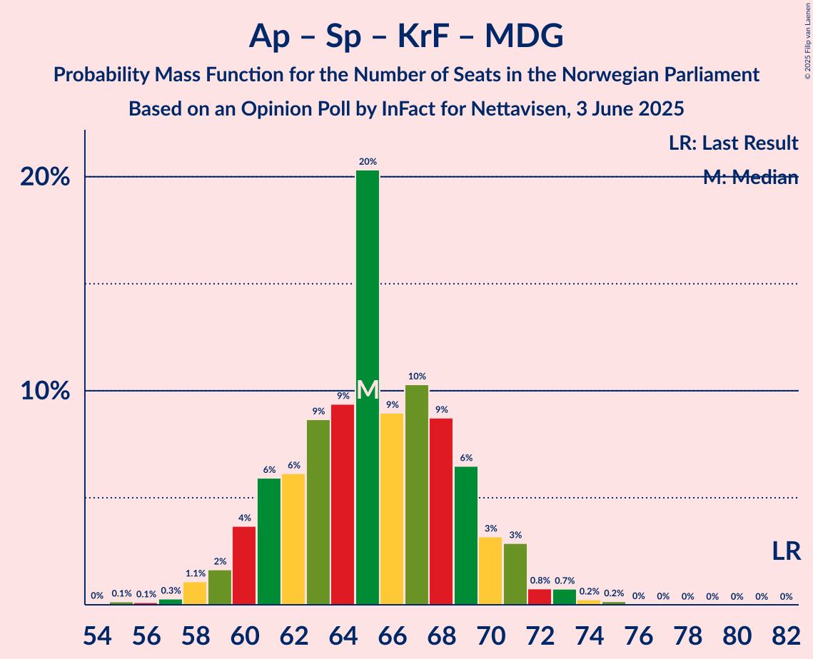

| Number of Seats | Probability | Accumulated | Special Marks |
|:---------------:|:-----------:|:-----------:|:-------------:|
| 54 | 0% | 100% |  |
| 55 | 0.1% | 99.9% |  |
| 56 | 0.1% | 99.8% |  |
| 57 | 0.3% | 99.7% |  |
| 58 | 1.1% | 99.4% |  |
| 59 | 2% | 98% |  |
| 60 | 4% | 97% |  |
| 61 | 6% | 93% |  |
| 62 | 6% | 87% |  |
| 63 | 9% | 81% |  |
| 64 | 9% | 72% |  |
| 65 | 20% | 63% | Median |
| 66 | 9% | 43% |  |
| 67 | 10% | 34% |  |
| 68 | 9% | 23% |  |
| 69 | 6% | 15% |  |
| 70 | 3% | 8% |  |
| 71 | 3% | 5% |  |
| 72 | 0.8% | 2% |  |
| 73 | 0.7% | 1.2% |  |
| 74 | 0.2% | 0.5% |  |
| 75 | 0.2% | 0.2% |  |
| 76 | 0% | 0.1% |  |
| 77 | 0% | 0% |  |
| 78 | 0% | 0% |  |
| 79 | 0% | 0% |  |
| 80 | 0% | 0% |  |
| 81 | 0% | 0% |  |
| 82 | 0% | 0% | Last Result |

### Arbeiderpartiet – Sosialistisk Venstreparti

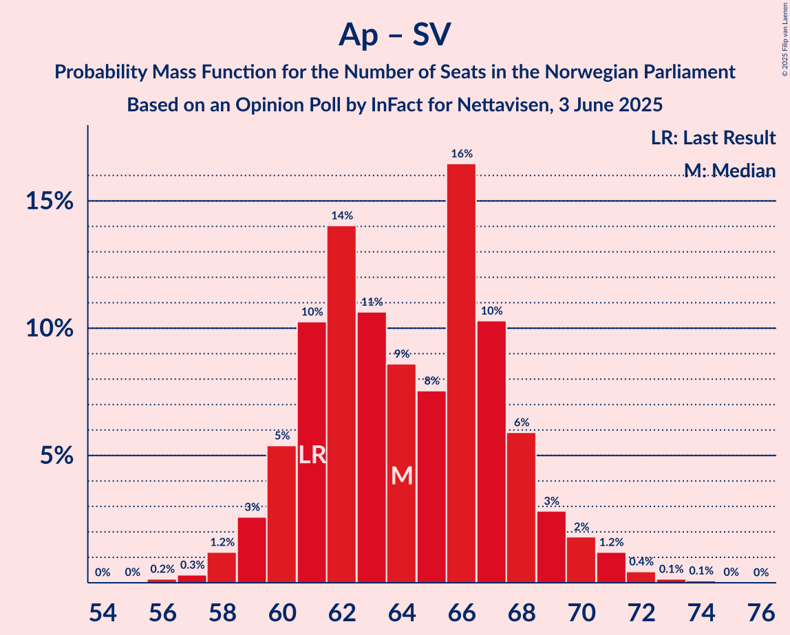

| Number of Seats | Probability | Accumulated | Special Marks |
|:---------------:|:-----------:|:-----------:|:-------------:|
| 55 | 0% | 100% |  |
| 56 | 0.2% | 99.9% |  |
| 57 | 0.3% | 99.8% |  |
| 58 | 1.2% | 99.5% |  |
| 59 | 3% | 98% |  |
| 60 | 5% | 96% |  |
| 61 | 10% | 90% | Last Result |
| 62 | 14% | 80% |  |
| 63 | 11% | 66% |  |
| 64 | 9% | 55% | Median |
| 65 | 8% | 47% |  |
| 66 | 16% | 39% |  |
| 67 | 10% | 23% |  |
| 68 | 6% | 12% |  |
| 69 | 3% | 7% |  |
| 70 | 2% | 4% |  |
| 71 | 1.2% | 2% |  |
| 72 | 0.4% | 0.7% |  |
| 73 | 0.1% | 0.3% |  |
| 74 | 0.1% | 0.1% |  |
| 75 | 0% | 0.1% |  |
| 76 | 0% | 0% |  |

### Arbeiderpartiet – Senterpartiet – Kristelig Folkeparti

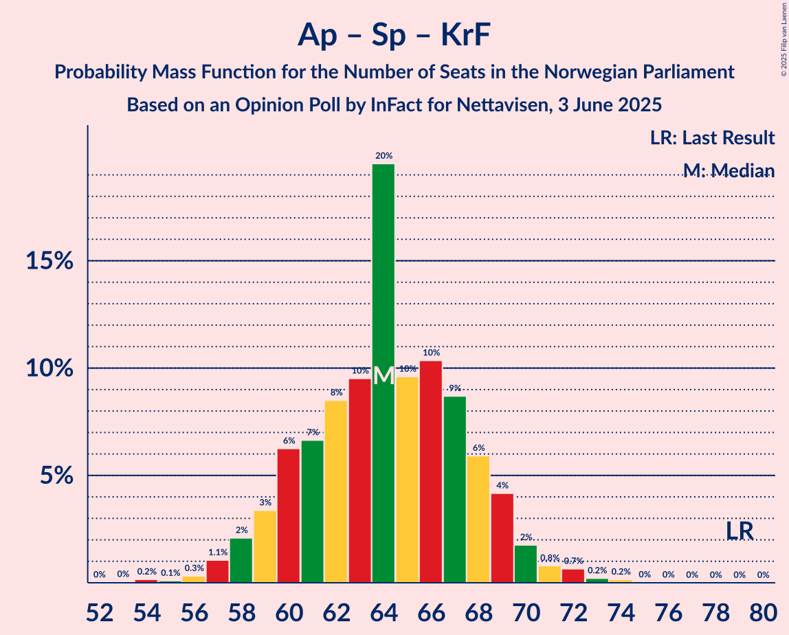

| Number of Seats | Probability | Accumulated | Special Marks |
|:---------------:|:-----------:|:-----------:|:-------------:|
| 53 | 0% | 100% |  |
| 54 | 0.2% | 99.9% |  |
| 55 | 0.1% | 99.8% |  |
| 56 | 0.3% | 99.7% |  |
| 57 | 1.1% | 99.3% |  |
| 58 | 2% | 98% |  |
| 59 | 3% | 96% |  |
| 60 | 6% | 93% |  |
| 61 | 7% | 87% |  |
| 62 | 8% | 80% |  |
| 63 | 10% | 71% |  |
| 64 | 20% | 62% | Median |
| 65 | 10% | 42% |  |
| 66 | 10% | 33% |  |
| 67 | 9% | 22% |  |
| 68 | 6% | 14% |  |
| 69 | 4% | 8% |  |
| 70 | 2% | 4% |  |
| 71 | 0.8% | 2% |  |
| 72 | 0.7% | 1.1% |  |
| 73 | 0.2% | 0.4% |  |
| 74 | 0.2% | 0.2% |  |
| 75 | 0% | 0.1% |  |
| 76 | 0% | 0% |  |
| 77 | 0% | 0% |  |
| 78 | 0% | 0% |  |
| 79 | 0% | 0% | Last Result |

### Arbeiderpartiet – Senterpartiet

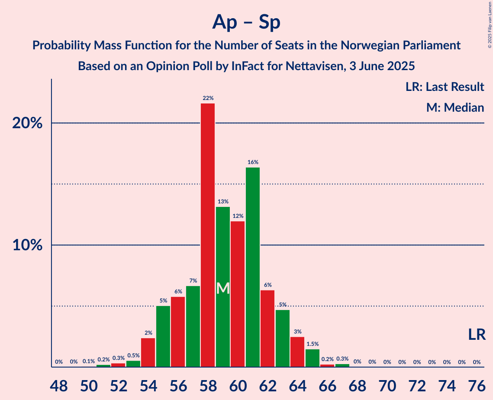

| Number of Seats | Probability | Accumulated | Special Marks |
|:---------------:|:-----------:|:-----------:|:-------------:|
| 49 | 0% | 100% |  |
| 50 | 0.1% | 99.9% |  |
| 51 | 0.2% | 99.8% |  |
| 52 | 0.3% | 99.6% |  |
| 53 | 0.5% | 99.3% |  |
| 54 | 2% | 98.7% |  |
| 55 | 5% | 96% |  |
| 56 | 6% | 91% |  |
| 57 | 7% | 85% |  |
| 58 | 22% | 79% | Median |
| 59 | 13% | 57% |  |
| 60 | 12% | 44% |  |
| 61 | 16% | 32% |  |
| 62 | 6% | 16% |  |
| 63 | 5% | 9% |  |
| 64 | 3% | 5% |  |
| 65 | 1.5% | 2% |  |
| 66 | 0.2% | 0.6% |  |
| 67 | 0.3% | 0.4% |  |
| 68 | 0% | 0.1% |  |
| 69 | 0% | 0% |  |
| 70 | 0% | 0% |  |
| 71 | 0% | 0% |  |
| 72 | 0% | 0% |  |
| 73 | 0% | 0% |  |
| 74 | 0% | 0% |  |
| 75 | 0% | 0% |  |
| 76 | 0% | 0% | Last Result |

### Høyre – Venstre – Kristelig Folkeparti

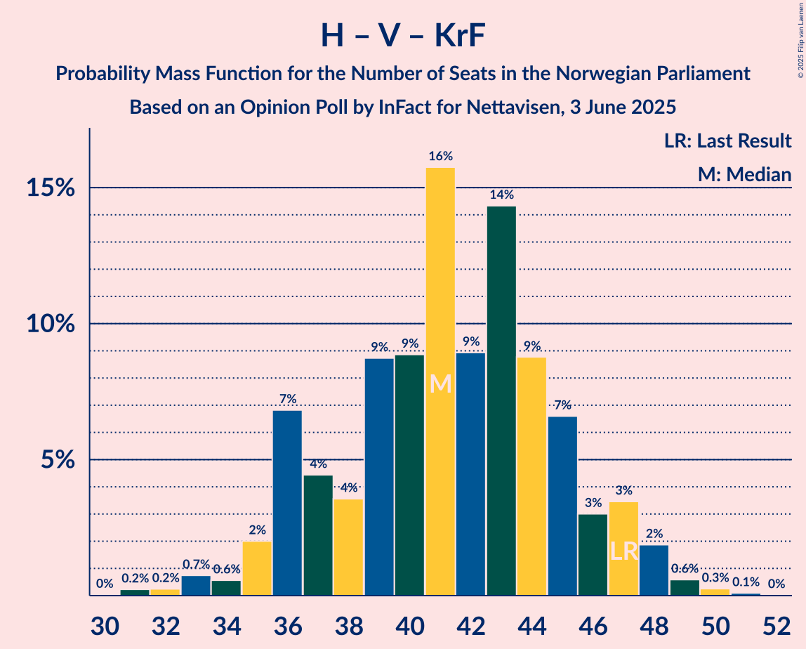

| Number of Seats | Probability | Accumulated | Special Marks |
|:---------------:|:-----------:|:-----------:|:-------------:|
| 30 | 0% | 100% |  |
| 31 | 0.2% | 99.9% |  |
| 32 | 0.2% | 99.7% |  |
| 33 | 0.7% | 99.4% |  |
| 34 | 0.6% | 98.7% |  |
| 35 | 2% | 98% |  |
| 36 | 7% | 96% |  |
| 37 | 4% | 89% |  |
| 38 | 4% | 85% |  |
| 39 | 9% | 81% |  |
| 40 | 9% | 73% |  |
| 41 | 16% | 64% |  |
| 42 | 9% | 48% |  |
| 43 | 14% | 39% | Median |
| 44 | 9% | 25% |  |
| 45 | 7% | 16% |  |
| 46 | 3% | 9% |  |
| 47 | 3% | 6% | Last Result |
| 48 | 2% | 3% |  |
| 49 | 0.6% | 1.0% |  |
| 50 | 0.3% | 0.4% |  |
| 51 | 0.1% | 0.1% |  |
| 52 | 0% | 0% |  |

### Senterpartiet – Venstre – Kristelig Folkeparti

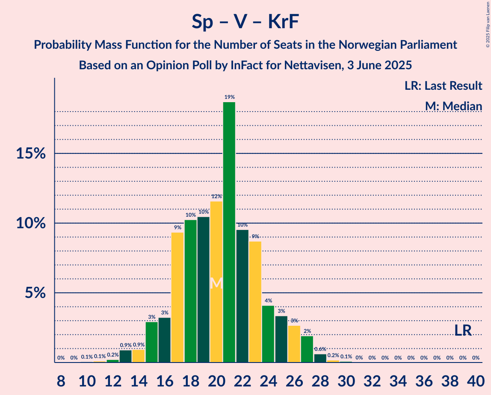

| Number of Seats | Probability | Accumulated | Special Marks |
|:---------------:|:-----------:|:-----------:|:-------------:|
| 10 | 0.1% | 100% |  |
| 11 | 0.1% | 99.9% |  |
| 12 | 0.2% | 99.8% |  |
| 13 | 0.9% | 99.6% |  |
| 14 | 0.9% | 98.7% |  |
| 15 | 3% | 98% |  |
| 16 | 3% | 95% |  |
| 17 | 9% | 92% |  |
| 18 | 10% | 82% |  |
| 19 | 10% | 72% |  |
| 20 | 12% | 61% |  |
| 21 | 19% | 50% | Median |
| 22 | 10% | 31% |  |
| 23 | 9% | 22% |  |
| 24 | 4% | 13% |  |
| 25 | 3% | 9% |  |
| 26 | 3% | 5% |  |
| 27 | 2% | 3% |  |
| 28 | 0.6% | 0.9% |  |
| 29 | 0.2% | 0.3% |  |
| 30 | 0.1% | 0.1% |  |
| 31 | 0% | 0% |  |
| 32 | 0% | 0% |  |
| 33 | 0% | 0% |  |
| 34 | 0% | 0% |  |
| 35 | 0% | 0% |  |
| 36 | 0% | 0% |  |
| 37 | 0% | 0% |  |
| 38 | 0% | 0% |  |
| 39 | 0% | 0% | Last Result |

## Technical Information

### Opinion Poll

+ **Polling firm:** InFact
+ **Commissioner(s):** Nettavisen
+ **Fieldwork period:** 3 June 2025

### Calculations

+ **Sample size:** 1076
+ **Simulations done:** 2,097,152
+ **Error estimate:** 1.25%

