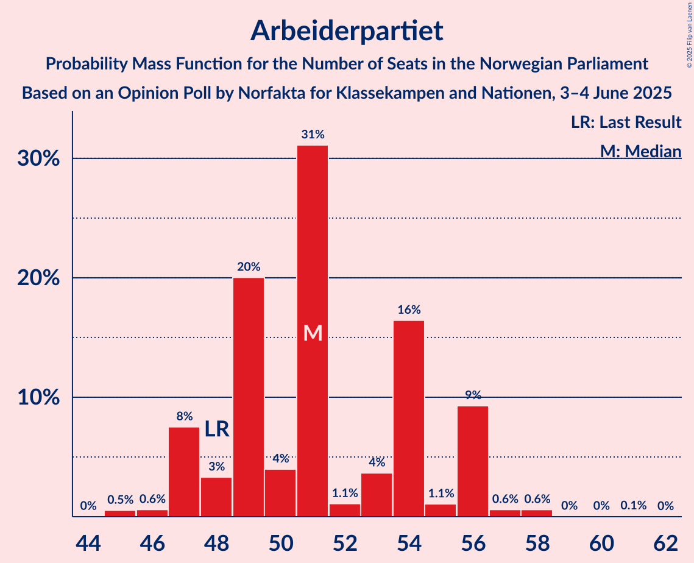
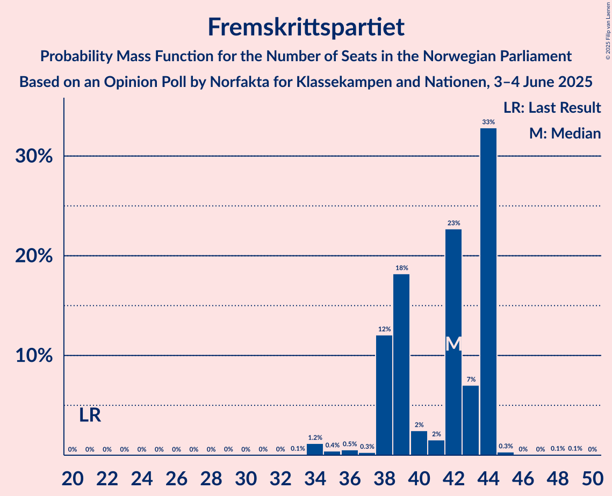
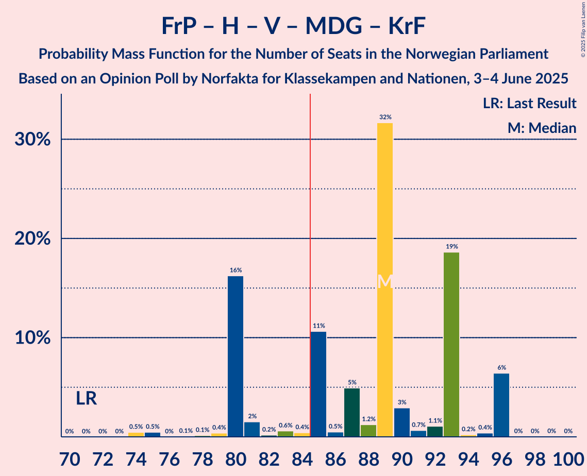
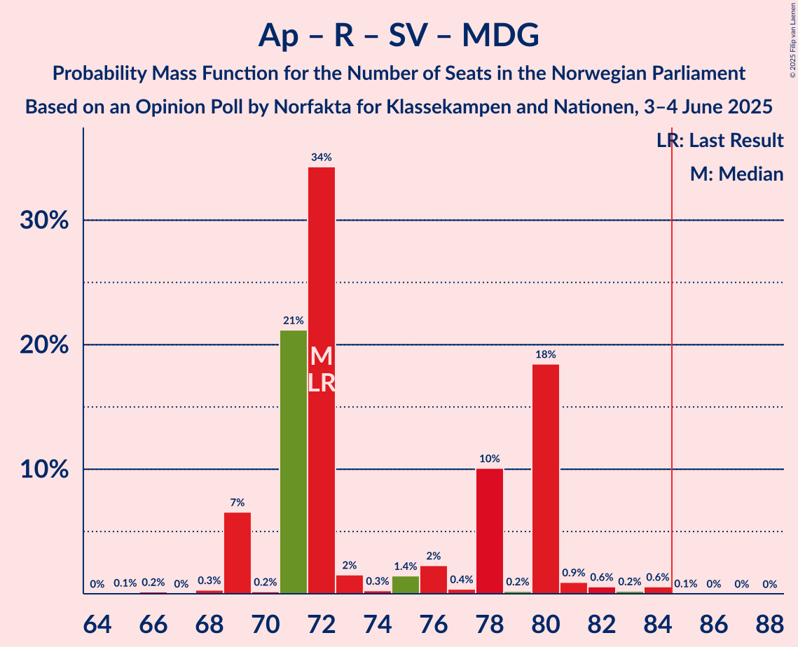
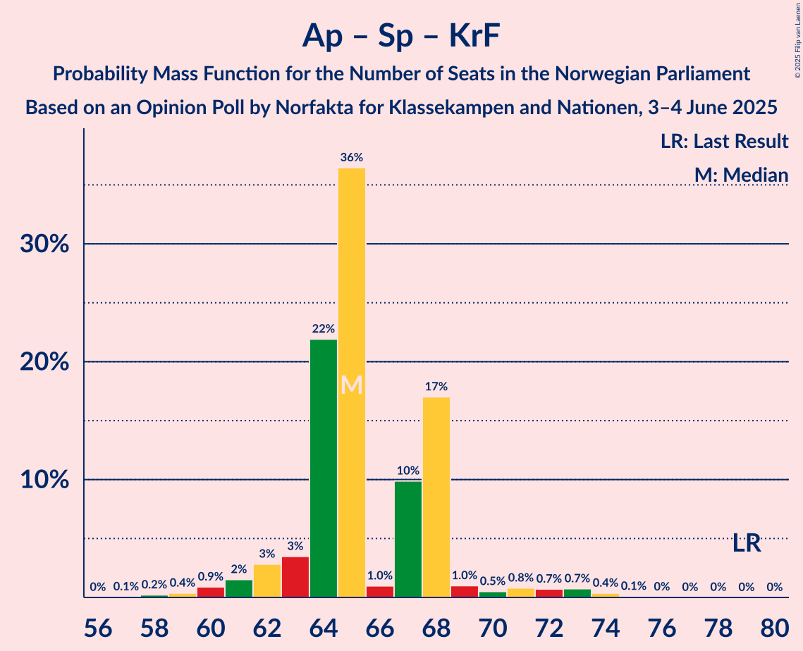
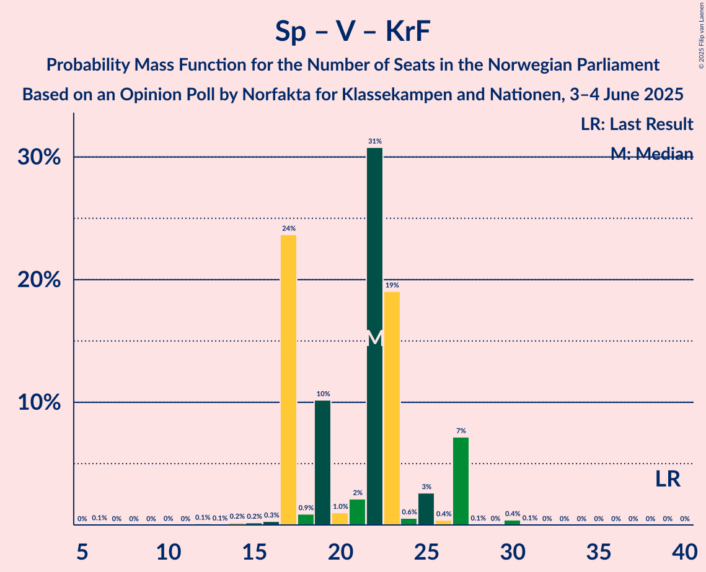

# Opinion Poll by Norfakta for Klassekampen and Nationen, 3–4 June 2025

<a href="#voting-intentions">Voting Intentions</a> | <a href="#seats">Seats</a> | <a href="#coalitions">Coalitions</a> | <a href="#technical-information">Technical Information</a>

## Voting Intentions

### Confidence Intervals

| Party | Last Result | Poll Result | 80% Confidence Interval | 90% Confidence Interval | 95% Confidence Interval | 99% Confidence Interval |
|:-----:|:-----------:|:-----------:|:-----------------------:|:-----------------------:|:-----------------------:|:-----------------------:|
| Arbeiderpartiet | 26.2% | 27.3% | 25.4–29.4% |24.8–30.0% |24.3–30.6% |23.4–31.6% |
| Fremskrittspartiet | 11.6% | 21.5% | 19.7–23.5% |19.2–24.0% |18.8–24.5% |18.0–25.5% |
| Høyre | 20.4% | 18.2% | 16.6–20.1% |16.1–20.6% |15.7–21.1% |14.9–22.0% |
| Rødt | 4.7% | 6.3% | 5.3–7.6% |5.1–7.9% |4.8–8.3% |4.4–8.9% |
| Senterpartiet | 13.5% | 5.9% | 5.0–7.2% |4.7–7.5% |4.5–7.8% |4.1–8.5% |
| Sosialistisk Venstreparti | 7.6% | 5.4% | 4.5–6.6% |4.3–7.0% |4.1–7.3% |3.7–7.9% |
| Venstre | 4.6% | 4.6% | 3.7–5.7% |3.5–6.0% |3.3–6.2% |3.0–6.8% |
| Miljøpartiet De Grønne | 3.9% | 3.7% | 2.9–4.7% |2.7–5.0% |2.6–5.2% |2.3–5.8% |
| Kristelig Folkeparti | 3.8% | 3.5% | 2.8–4.5% |2.6–4.8% |2.5–5.1% |2.2–5.6% |
| Konservativt | 0.4% | 1.0% | 0.7–1.6% |0.6–1.8% |0.5–2.0% |0.4–2.3% |
| Pensjonistpartiet | 0.6% | 0.5% | 0.3–1.0% |0.2–1.2% |0.2–1.3% |0.1–1.6% |
| Industri- og Næringspartiet | 0.3% | 0.4% | 0.2–0.9% |0.2–1.0% |0.1–1.1% |0.1–1.4% |
| Norgesdemokratene | 1.1% | 0.3% | 0.1–0.7% |0.1–0.8% |0.1–0.9% |0.0–1.2% |

*Note:* The poll result column reflects the actual value used in the calculations. Published results may vary slightly, and in addition be rounded to fewer digits.

## Seats

### Confidence Intervals

| Party | Last Result | Median | 80% Confidence Interval | 90% Confidence Interval | 95% Confidence Interval | 99% Confidence Interval |
|:-----:|:-----------:|:------:|:-----------------------:|:-----------------------:|:-----------------------:|:-----------------------:|
| <a href="#arbeiderpartiet">Arbeiderpartiet</a> | 48 | 51 | 48–56 |47–56 |47–56 |45–58 |
| <a href="#fremskrittspartiet">Fremskrittspartiet</a> | 21 | 42 | 38–44 |38–44 |37–44 |34–45 |
| <a href="#høyre">Høyre</a> | 36 | 33 | 30–34 |30–36 |30–38 |28–39 |
| <a href="#rødt">Rødt</a> | 8 | 10 | 9–12 |7–13 |7–14 |7–14 |
| <a href="#senterpartiet">Senterpartiet</a> | 28 | 11 | 8–12 |8–13 |8–13 |7–15 |
| <a href="#sosialistisk-venstreparti">Sosialistisk Venstreparti</a> | 13 | 8 | 8–11 |8–11 |8–13 |3–14 |
| <a href="#venstre">Venstre</a> | 8 | 8 | 3–9 |3–9 |3–9 |2–11 |
| <a href="#miljøpartiet-de-grønne">Miljøpartiet De Grønne</a> | 3 | 3 | 2–6 |2–6 |1–9 |1–9 |
| <a href="#kristelig-folkeparti">Kristelig Folkeparti</a> | 3 | 3 | 2–7 |2–8 |1–8 |1–10 |
| <a href="#konservativt">Konservativt</a> | 0 | 0 | 0 |0 |0 |0 |
| <a href="#pensjonistpartiet">Pensjonistpartiet</a> | 0 | 0 | 0 |0 |0 |0 |
| <a href="#industri--og-næringspartiet">Industri- og Næringspartiet</a> | 0 | 0 | 0 |0 |0 |0 |
| <a href="#norgesdemokratene">Norgesdemokratene</a> | 0 | 0 | 0 |0 |0 |0 |

### Arbeiderpartiet

*For a full overview of the results for this party, see the [Arbeiderpartiet](party-arbeiderpartiet.html) page.*

| Number of Seats | Probability | Accumulated | Special Marks |
|:---------------:|:-----------:|:-----------:|:-------------:|
| 45 | 0.5% | 100% |  |
| 46 | 0.6% | 99.4% |  |
| 47 | 8% | 98.8% |  |
| 48 | 3% | 91% | Last Result |
| 49 | 20% | 88% |  |
| 50 | 4% | 68% |  |
| 51 | 31% | 64% | Median |
| 52 | 1.1% | 33% |  |
| 53 | 4% | 32% |  |
| 54 | 16% | 28% |  |
| 55 | 1.1% | 12% |  |
| 56 | 9% | 11% |  |
| 57 | 0.6% | 1.3% |  |
| 58 | 0.6% | 0.7% |  |
| 59 | 0% | 0.1% |  |
| 60 | 0% | 0.1% |  |
| 61 | 0.1% | 0.1% |  |
| 62 | 0% | 0% |  |

### Fremskrittspartiet

*For a full overview of the results for this party, see the [Fremskrittspartiet](party-fremskrittspartiet.html) page.*

| Number of Seats | Probability | Accumulated | Special Marks |
|:---------------:|:-----------:|:-----------:|:-------------:|
| 21 | 0% | 100% | Last Result |
| 22 | 0% | 100% |  |
| 23 | 0% | 100% |  |
| 24 | 0% | 100% |  |
| 25 | 0% | 100% |  |
| 26 | 0% | 100% |  |
| 27 | 0% | 100% |  |
| 28 | 0% | 100% |  |
| 29 | 0% | 100% |  |
| 30 | 0% | 100% |  |
| 31 | 0% | 100% |  |
| 32 | 0% | 100% |  |
| 33 | 0.1% | 99.9% |  |
| 34 | 1.2% | 99.8% |  |
| 35 | 0.4% | 98.7% |  |
| 36 | 0.5% | 98% |  |
| 37 | 0.3% | 98% |  |
| 38 | 12% | 97% |  |
| 39 | 18% | 85% |  |
| 40 | 2% | 67% |  |
| 41 | 2% | 65% |  |
| 42 | 23% | 63% | Median |
| 43 | 7% | 40% |  |
| 44 | 33% | 33% |  |
| 45 | 0.3% | 0.6% |  |
| 46 | 0% | 0.2% |  |
| 47 | 0% | 0.2% |  |
| 48 | 0.1% | 0.2% |  |
| 49 | 0.1% | 0.1% |  |
| 50 | 0% | 0% |  |

### Høyre

*For a full overview of the results for this party, see the [Høyre](party-høyre.html) page.*

| Number of Seats | Probability | Accumulated | Special Marks |
|:---------------:|:-----------:|:-----------:|:-------------:|
| 24 | 0% | 100% |  |
| 25 | 0% | 99.9% |  |
| 26 | 0.1% | 99.9% |  |
| 27 | 0.2% | 99.9% |  |
| 28 | 0.3% | 99.7% |  |
| 29 | 0.4% | 99.3% |  |
| 30 | 11% | 98.9% |  |
| 31 | 32% | 88% |  |
| 32 | 0.9% | 56% |  |
| 33 | 37% | 56% | Median |
| 34 | 11% | 19% |  |
| 35 | 0.8% | 8% |  |
| 36 | 4% | 7% | Last Result |
| 37 | 0.8% | 3% |  |
| 38 | 1.4% | 3% |  |
| 39 | 1.1% | 1.1% |  |
| 40 | 0% | 0.1% |  |
| 41 | 0% | 0.1% |  |
| 42 | 0% | 0% |  |

### Rødt

*For a full overview of the results for this party, see the [Rødt](party-rødt.html) page.*

| Number of Seats | Probability | Accumulated | Special Marks |
|:---------------:|:-----------:|:-----------:|:-------------:|
| 7 | 6% | 100% |  |
| 8 | 2% | 94% | Last Result |
| 9 | 13% | 92% |  |
| 10 | 32% | 79% | Median |
| 11 | 23% | 47% |  |
| 12 | 18% | 24% |  |
| 13 | 3% | 7% |  |
| 14 | 3% | 4% |  |
| 15 | 0.3% | 0.4% |  |
| 16 | 0.1% | 0.1% |  |
| 17 | 0% | 0.1% |  |
| 18 | 0% | 0% |  |

### Senterpartiet

*For a full overview of the results for this party, see the [Senterpartiet](party-senterpartiet.html) page.*

| Number of Seats | Probability | Accumulated | Special Marks |
|:---------------:|:-----------:|:-----------:|:-------------:|
| 0 | 0.1% | 100% |  |
| 1 | 0.1% | 99.9% |  |
| 2 | 0% | 99.8% |  |
| 3 | 0% | 99.8% |  |
| 4 | 0% | 99.8% |  |
| 5 | 0% | 99.8% |  |
| 6 | 0% | 99.8% |  |
| 7 | 0.6% | 99.8% |  |
| 8 | 22% | 99.2% |  |
| 9 | 11% | 78% |  |
| 10 | 9% | 67% |  |
| 11 | 31% | 57% | Median |
| 12 | 21% | 26% |  |
| 13 | 3% | 5% |  |
| 14 | 1.0% | 2% |  |
| 15 | 0.9% | 1.2% |  |
| 16 | 0.3% | 0.3% |  |
| 17 | 0% | 0% |  |
| 18 | 0% | 0% |  |
| 19 | 0% | 0% |  |
| 20 | 0% | 0% |  |
| 21 | 0% | 0% |  |
| 22 | 0% | 0% |  |
| 23 | 0% | 0% |  |
| 24 | 0% | 0% |  |
| 25 | 0% | 0% |  |
| 26 | 0% | 0% |  |
| 27 | 0% | 0% |  |
| 28 | 0% | 0% | Last Result |

### Sosialistisk Venstreparti

*For a full overview of the results for this party, see the [Sosialistisk Venstreparti](party-sosialistiskvenstreparti.html) page.*

| Number of Seats | Probability | Accumulated | Special Marks |
|:---------------:|:-----------:|:-----------:|:-------------:|
| 1 | 0.1% | 100% |  |
| 2 | 0.2% | 99.9% |  |
| 3 | 0.8% | 99.7% |  |
| 4 | 0% | 98.9% |  |
| 5 | 0% | 98.9% |  |
| 6 | 0% | 98.9% |  |
| 7 | 1.2% | 98.9% |  |
| 8 | 50% | 98% | Median |
| 9 | 14% | 48% |  |
| 10 | 13% | 34% |  |
| 11 | 18% | 21% |  |
| 12 | 0.7% | 3% |  |
| 13 | 2% | 3% | Last Result |
| 14 | 0.9% | 0.9% |  |
| 15 | 0% | 0% |  |

### Venstre

*For a full overview of the results for this party, see the [Venstre](party-venstre.html) page.*

| Number of Seats | Probability | Accumulated | Special Marks |
|:---------------:|:-----------:|:-----------:|:-------------:|
| 2 | 0.8% | 100% |  |
| 3 | 24% | 99.2% |  |
| 4 | 0% | 75% |  |
| 5 | 0% | 75% |  |
| 6 | 0.1% | 75% |  |
| 7 | 4% | 75% |  |
| 8 | 60% | 71% | Last Result, Median |
| 9 | 9% | 11% |  |
| 10 | 2% | 2% |  |
| 11 | 0.4% | 0.6% |  |
| 12 | 0.2% | 0.2% |  |
| 13 | 0% | 0% |  |

### Miljøpartiet De Grønne

*For a full overview of the results for this party, see the [Miljøpartiet De Grønne](party-miljøpartietdegrønne.html) page.*

| Number of Seats | Probability | Accumulated | Special Marks |
|:---------------:|:-----------:|:-----------:|:-------------:|
| 1 | 4% | 100% |  |
| 2 | 7% | 96% |  |
| 3 | 77% | 89% | Last Result, Median |
| 4 | 0.1% | 12% |  |
| 5 | 0% | 12% |  |
| 6 | 7% | 12% |  |
| 7 | 0.8% | 5% |  |
| 8 | 2% | 4% |  |
| 9 | 2% | 3% |  |
| 10 | 0.2% | 0.2% |  |
| 11 | 0% | 0% |  |

### Kristelig Folkeparti

*For a full overview of the results for this party, see the [Kristelig Folkeparti](party-kristeligfolkeparti.html) page.*

| Number of Seats | Probability | Accumulated | Special Marks |
|:---------------:|:-----------:|:-----------:|:-------------:|
| 0 | 0.3% | 100% |  |
| 1 | 4% | 99.7% |  |
| 2 | 33% | 96% |  |
| 3 | 34% | 63% | Last Result, Median |
| 4 | 0% | 29% |  |
| 5 | 0% | 29% |  |
| 6 | 0.4% | 29% |  |
| 7 | 19% | 29% |  |
| 8 | 8% | 9% |  |
| 9 | 0.9% | 1.4% |  |
| 10 | 0.4% | 0.5% |  |
| 11 | 0.1% | 0.1% |  |
| 12 | 0% | 0% |  |

### Konservativt

*For a full overview of the results for this party, see the [Konservativt](party-konservativt.html) page.*

| Number of Seats | Probability | Accumulated | Special Marks |
|:---------------:|:-----------:|:-----------:|:-------------:|
| 0 | 100% | 100% | Last Result, Median |

### Pensjonistpartiet

*For a full overview of the results for this party, see the [Pensjonistpartiet](party-pensjonistpartiet.html) page.*

| Number of Seats | Probability | Accumulated | Special Marks |
|:---------------:|:-----------:|:-----------:|:-------------:|
| 0 | 100% | 100% | Last Result, Median |

### Industri- og Næringspartiet

*For a full overview of the results for this party, see the [Industri- og Næringspartiet](party-industri-ognæringspartiet.html) page.*

| Number of Seats | Probability | Accumulated | Special Marks |
|:---------------:|:-----------:|:-----------:|:-------------:|
| 0 | 100% | 100% | Last Result, Median |

### Norgesdemokratene

*For a full overview of the results for this party, see the [Norgesdemokratene](party-norgesdemokratene.html) page.*

| Number of Seats | Probability | Accumulated | Special Marks |
|:---------------:|:-----------:|:-----------:|:-------------:|
| 0 | 100% | 100% | Last Result, Median |

## Coalitions

### Confidence Intervals

| Coalition | Last Result | Median | Majority? | 80% Confidence Interval | 90% Confidence Interval | 95% Confidence Interval | 99% Confidence Interval |
|:---------:|:-----------:|:------:|:---------:|:-----------------------:|:-----------------------:|:-----------------------:|:-----------------------:|
| Fremskrittspartiet – Høyre – Senterpartiet – Venstre – Kristelig Folkeparti | 96 | 97 | 99.9% | 89–98 | 89–100 | 89–100 | 85–101 |
| Fremskrittspartiet – Høyre – Venstre – Miljøpartiet De Grønne – Kristelig Folkeparti | 71 | 89 | 79% | 80–93 | 80–96 | 80–96 | 75–96 |
| Arbeiderpartiet – Rødt – Senterpartiet – Sosialistisk Venstreparti – Miljøpartiet De Grønne | 100 | 83 | 37% | 79–92 | 79–92 | 79–92 | 79–97 |
| Fremskrittspartiet – Høyre – Venstre – Kristelig Folkeparti | 68 | 86 | 63% | 77–90 | 77–90 | 77–90 | 72–90 |
| Arbeiderpartiet – Rødt – Senterpartiet – Sosialistisk Venstreparti | 97 | 80 | 21% | 76–89 | 73–89 | 73–89 | 73–94 |
| Fremskrittspartiet – Høyre – Venstre | 65 | 83 | 2% | 75–83 | 75–83 | 74–84 | 71–87 |
| Arbeiderpartiet – Senterpartiet – Sosialistisk Venstreparti – Miljøpartiet De Grønne – Kristelig Folkeparti | 95 | 76 | 1.0% | 75–82 | 75–82 | 73–84 | 72–86 |
| Arbeiderpartiet – Rødt – Sosialistisk Venstreparti – Miljøpartiet De Grønne | 72 | 72 | 0.1% | 71–80 | 69–80 | 69–80 | 68–84 |
| Fremskrittspartiet – Høyre | 57 | 75 | 0% | 72–75 | 71–77 | 69–80 | 66–80 |
| Arbeiderpartiet – Senterpartiet – Sosialistisk Venstreparti – Miljøpartiet De Grønne | 92 | 73 | 0.1% | 68–80 | 68–80 | 68–80 | 68–83 |
| Arbeiderpartiet – Senterpartiet – Sosialistisk Venstreparti | 89 | 70 | 0% | 65–77 | 65–77 | 65–77 | 65–81 |
| Arbeiderpartiet – Senterpartiet – Miljøpartiet De Grønne – Kristelig Folkeparti | 82 | 68 | 0% | 67–71 | 65–72 | 63–74 | 61–78 |
| Arbeiderpartiet – Senterpartiet – Kristelig Folkeparti | 79 | 65 | 0% | 64–68 | 62–68 | 61–71 | 59–74 |
| Arbeiderpartiet – Senterpartiet | 76 | 62 | 0% | 57–66 | 57–66 | 57–66 | 56–71 |
| Arbeiderpartiet – Sosialistisk Venstreparti | 61 | 59 | 0% | 57–66 | 56–66 | 56–66 | 53–68 |
| Høyre – Venstre – Kristelig Folkeparti | 47 | 42 | 0% | 38–48 | 38–48 | 38–48 | 34–50 |
| Senterpartiet – Venstre – Kristelig Folkeparti | 39 | 22 | 0% | 17–25 | 17–27 | 17–27 | 15–29 |

### Fremskrittspartiet – Høyre – Senterpartiet – Venstre – Kristelig Folkeparti

| Number of Seats | Probability | Accumulated | Special Marks |
|:---------------:|:-----------:|:-----------:|:-------------:|
| 83 | 0% | 100% |  |
| 84 | 0.1% | 99.9% |  |
| 85 | 0.6% | 99.9% | Majority |
| 86 | 0.2% | 99.3% |  |
| 87 | 0.6% | 99.1% |  |
| 88 | 0.9% | 98.5% |  |
| 89 | 18% | 98% |  |
| 90 | 0.2% | 79% |  |
| 91 | 10% | 79% |  |
| 92 | 0.4% | 69% |  |
| 93 | 2% | 68% |  |
| 94 | 1.4% | 66% |  |
| 95 | 0.3% | 65% |  |
| 96 | 2% | 64% | Last Result |
| 97 | 34% | 63% | Median |
| 98 | 21% | 29% |  |
| 99 | 0.2% | 7% |  |
| 100 | 7% | 7% |  |
| 101 | 0.3% | 0.7% |  |
| 102 | 0% | 0.4% |  |
| 103 | 0.2% | 0.3% |  |
| 104 | 0.1% | 0.2% |  |
| 105 | 0% | 0.1% |  |
| 106 | 0% | 0% |  |

### Fremskrittspartiet – Høyre – Venstre – Miljøpartiet De Grønne – Kristelig Folkeparti

| Number of Seats | Probability | Accumulated | Special Marks |
|:---------------:|:-----------:|:-----------:|:-------------:|
| 71 | 0% | 100% | Last Result |
| 72 | 0% | 100% |  |
| 73 | 0% | 100% |  |
| 74 | 0.5% | 100% |  |
| 75 | 0.5% | 99.5% |  |
| 76 | 0% | 99.0% |  |
| 77 | 0.1% | 99.0% |  |
| 78 | 0.1% | 99.0% |  |
| 79 | 0.4% | 98.8% |  |
| 80 | 16% | 98% |  |
| 81 | 2% | 82% |  |
| 82 | 0.2% | 81% |  |
| 83 | 0.6% | 80% |  |
| 84 | 0.4% | 80% |  |
| 85 | 11% | 79% | Majority |
| 86 | 0.5% | 69% |  |
| 87 | 5% | 68% |  |
| 88 | 1.2% | 63% |  |
| 89 | 32% | 62% | Median |
| 90 | 3% | 30% |  |
| 91 | 0.7% | 28% |  |
| 92 | 1.1% | 27% |  |
| 93 | 19% | 26% |  |
| 94 | 0.2% | 7% |  |
| 95 | 0.4% | 7% |  |
| 96 | 6% | 7% |  |
| 97 | 0% | 0.1% |  |
| 98 | 0% | 0.1% |  |
| 99 | 0% | 0.1% |  |
| 100 | 0% | 0% |  |

### Arbeiderpartiet – Rødt – Senterpartiet – Sosialistisk Venstreparti – Miljøpartiet De Grønne

| Number of Seats | Probability | Accumulated | Special Marks |
|:---------------:|:-----------:|:-----------:|:-------------:|
| 75 | 0% | 100% |  |
| 76 | 0.1% | 99.9% |  |
| 77 | 0.2% | 99.8% |  |
| 78 | 0.1% | 99.6% |  |
| 79 | 25% | 99.5% |  |
| 80 | 1.3% | 75% |  |
| 81 | 0.7% | 73% |  |
| 82 | 1.3% | 73% |  |
| 83 | 31% | 71% | Median |
| 84 | 4% | 40% |  |
| 85 | 1.2% | 37% | Majority |
| 86 | 2% | 35% |  |
| 87 | 11% | 34% |  |
| 88 | 3% | 23% |  |
| 89 | 2% | 20% |  |
| 90 | 0.5% | 19% |  |
| 91 | 0.2% | 18% |  |
| 92 | 16% | 18% |  |
| 93 | 0.4% | 2% |  |
| 94 | 0.1% | 1.2% |  |
| 95 | 0.1% | 1.1% |  |
| 96 | 0.5% | 1.0% |  |
| 97 | 0.5% | 0.5% |  |
| 98 | 0% | 0% |  |
| 99 | 0% | 0% |  |
| 100 | 0% | 0% | Last Result |

### Fremskrittspartiet – Høyre – Venstre – Kristelig Folkeparti

| Number of Seats | Probability | Accumulated | Special Marks |
|:---------------:|:-----------:|:-----------:|:-------------:|
| 68 | 0% | 100% | Last Result |
| 69 | 0% | 100% |  |
| 70 | 0% | 100% |  |
| 71 | 0% | 100% |  |
| 72 | 0.5% | 100% |  |
| 73 | 0.5% | 99.5% |  |
| 74 | 0.1% | 99.0% |  |
| 75 | 0.1% | 98.9% |  |
| 76 | 0.4% | 98.8% |  |
| 77 | 16% | 98% |  |
| 78 | 0.2% | 82% |  |
| 79 | 0.5% | 82% |  |
| 80 | 2% | 81% |  |
| 81 | 3% | 80% |  |
| 82 | 11% | 77% |  |
| 83 | 2% | 66% |  |
| 84 | 1.2% | 65% |  |
| 85 | 4% | 63% | Majority |
| 86 | 31% | 60% | Median |
| 87 | 1.3% | 28% |  |
| 88 | 0.7% | 27% |  |
| 89 | 1.3% | 27% |  |
| 90 | 25% | 25% |  |
| 91 | 0.1% | 0.5% |  |
| 92 | 0.2% | 0.4% |  |
| 93 | 0.1% | 0.2% |  |
| 94 | 0% | 0.1% |  |
| 95 | 0% | 0% |  |

### Arbeiderpartiet – Rødt – Senterpartiet – Sosialistisk Venstreparti

| Number of Seats | Probability | Accumulated | Special Marks |
|:---------------:|:-----------:|:-----------:|:-------------:|
| 70 | 0% | 100% |  |
| 71 | 0% | 99.9% |  |
| 72 | 0% | 99.9% |  |
| 73 | 6% | 99.9% |  |
| 74 | 0.4% | 93% |  |
| 75 | 0.2% | 93% |  |
| 76 | 19% | 93% |  |
| 77 | 1.1% | 74% |  |
| 78 | 0.6% | 73% |  |
| 79 | 3% | 72% |  |
| 80 | 32% | 70% | Median |
| 81 | 1.2% | 38% |  |
| 82 | 5% | 37% |  |
| 83 | 0.5% | 32% |  |
| 84 | 11% | 31% |  |
| 85 | 0.4% | 21% | Majority |
| 86 | 0.6% | 20% |  |
| 87 | 0.2% | 20% |  |
| 88 | 2% | 19% |  |
| 89 | 16% | 18% |  |
| 90 | 0.4% | 2% |  |
| 91 | 0.1% | 1.2% |  |
| 92 | 0.1% | 1.0% |  |
| 93 | 0% | 1.0% |  |
| 94 | 0.5% | 1.0% |  |
| 95 | 0.5% | 0.5% |  |
| 96 | 0% | 0% |  |
| 97 | 0% | 0% | Last Result |

### Fremskrittspartiet – Høyre – Venstre

| Number of Seats | Probability | Accumulated | Special Marks |
|:---------------:|:-----------:|:-----------:|:-------------:|
| 65 | 0% | 100% | Last Result |
| 66 | 0% | 100% |  |
| 67 | 0% | 100% |  |
| 68 | 0.1% | 99.9% |  |
| 69 | 0.1% | 99.8% |  |
| 70 | 0% | 99.7% |  |
| 71 | 0.5% | 99.7% |  |
| 72 | 0.9% | 99.2% |  |
| 73 | 0.3% | 98% |  |
| 74 | 1.1% | 98% |  |
| 75 | 16% | 97% |  |
| 76 | 0.8% | 81% |  |
| 77 | 0.3% | 80% |  |
| 78 | 0.8% | 79% |  |
| 79 | 4% | 79% |  |
| 80 | 11% | 75% |  |
| 81 | 1.4% | 64% |  |
| 82 | 7% | 62% |  |
| 83 | 52% | 55% | Median |
| 84 | 1.4% | 3% |  |
| 85 | 0.8% | 2% | Majority |
| 86 | 0.6% | 1.1% |  |
| 87 | 0.4% | 0.5% |  |
| 88 | 0% | 0.1% |  |
| 89 | 0.1% | 0.1% |  |
| 90 | 0% | 0% |  |

### Arbeiderpartiet – Senterpartiet – Sosialistisk Venstreparti – Miljøpartiet De Grønne – Kristelig Folkeparti

| Number of Seats | Probability | Accumulated | Special Marks |
|:---------------:|:-----------:|:-----------:|:-------------:|
| 68 | 0% | 100% |  |
| 69 | 0% | 99.9% |  |
| 70 | 0.1% | 99.9% |  |
| 71 | 0.1% | 99.8% |  |
| 72 | 1.3% | 99.7% |  |
| 73 | 1.0% | 98% |  |
| 74 | 0.7% | 97% |  |
| 75 | 22% | 97% |  |
| 76 | 33% | 75% | Median |
| 77 | 1.2% | 43% |  |
| 78 | 2% | 41% |  |
| 79 | 0.4% | 40% |  |
| 80 | 16% | 39% |  |
| 81 | 4% | 23% |  |
| 82 | 16% | 19% |  |
| 83 | 0.2% | 3% |  |
| 84 | 2% | 3% |  |
| 85 | 0.4% | 1.0% | Majority |
| 86 | 0.3% | 0.6% |  |
| 87 | 0% | 0.3% |  |
| 88 | 0.1% | 0.3% |  |
| 89 | 0% | 0.2% |  |
| 90 | 0% | 0.2% |  |
| 91 | 0.1% | 0.2% |  |
| 92 | 0% | 0.1% |  |
| 93 | 0% | 0.1% |  |
| 94 | 0% | 0% |  |
| 95 | 0% | 0% | Last Result |

### Arbeiderpartiet – Rødt – Sosialistisk Venstreparti – Miljøpartiet De Grønne

| Number of Seats | Probability | Accumulated | Special Marks |
|:---------------:|:-----------:|:-----------:|:-------------:|
| 64 | 0% | 100% |  |
| 65 | 0.1% | 99.9% |  |
| 66 | 0.2% | 99.8% |  |
| 67 | 0% | 99.7% |  |
| 68 | 0.3% | 99.6% |  |
| 69 | 7% | 99.3% |  |
| 70 | 0.2% | 93% |  |
| 71 | 21% | 93% |  |
| 72 | 34% | 71% | Last Result, Median |
| 73 | 2% | 37% |  |
| 74 | 0.3% | 36% |  |
| 75 | 1.4% | 35% |  |
| 76 | 2% | 34% |  |
| 77 | 0.4% | 32% |  |
| 78 | 10% | 31% |  |
| 79 | 0.2% | 21% |  |
| 80 | 18% | 21% |  |
| 81 | 0.9% | 2% |  |
| 82 | 0.6% | 1.5% |  |
| 83 | 0.2% | 0.9% |  |
| 84 | 0.6% | 0.7% |  |
| 85 | 0.1% | 0.1% | Majority |
| 86 | 0% | 0.1% |  |
| 87 | 0% | 0% |  |

### Fremskrittspartiet – Høyre

| Number of Seats | Probability | Accumulated | Special Marks |
|:---------------:|:-----------:|:-----------:|:-------------:|
| 57 | 0% | 100% | Last Result |
| 58 | 0% | 100% |  |
| 59 | 0% | 100% |  |
| 60 | 0% | 100% |  |
| 61 | 0% | 100% |  |
| 62 | 0% | 99.9% |  |
| 63 | 0% | 99.9% |  |
| 64 | 0.1% | 99.9% |  |
| 65 | 0.3% | 99.8% |  |
| 66 | 0.3% | 99.5% |  |
| 67 | 0.1% | 99.2% |  |
| 68 | 1.2% | 99.1% |  |
| 69 | 1.3% | 98% |  |
| 70 | 0.3% | 97% |  |
| 71 | 2% | 96% |  |
| 72 | 28% | 94% |  |
| 73 | 9% | 66% |  |
| 74 | 0.5% | 57% |  |
| 75 | 49% | 57% | Median |
| 76 | 2% | 8% |  |
| 77 | 0.6% | 5% |  |
| 78 | 0.8% | 4% |  |
| 79 | 0.4% | 4% |  |
| 80 | 3% | 3% |  |
| 81 | 0% | 0.2% |  |
| 82 | 0.1% | 0.1% |  |
| 83 | 0% | 0% |  |

### Arbeiderpartiet – Senterpartiet – Sosialistisk Venstreparti – Miljøpartiet De Grønne

| Number of Seats | Probability | Accumulated | Special Marks |
|:---------------:|:-----------:|:-----------:|:-------------:|
| 64 | 0% | 100% |  |
| 65 | 0% | 99.9% |  |
| 66 | 0.1% | 99.9% |  |
| 67 | 0.2% | 99.8% |  |
| 68 | 18% | 99.7% |  |
| 69 | 1.0% | 81% |  |
| 70 | 0.9% | 80% |  |
| 71 | 2% | 79% |  |
| 72 | 8% | 78% |  |
| 73 | 34% | 70% | Median |
| 74 | 2% | 36% |  |
| 75 | 3% | 35% |  |
| 76 | 0.8% | 32% |  |
| 77 | 0.7% | 31% |  |
| 78 | 10% | 30% |  |
| 79 | 2% | 20% |  |
| 80 | 16% | 18% |  |
| 81 | 0.4% | 2% |  |
| 82 | 0.1% | 1.5% |  |
| 83 | 1.2% | 1.4% |  |
| 84 | 0.1% | 0.2% |  |
| 85 | 0% | 0.1% | Majority |
| 86 | 0% | 0.1% |  |
| 87 | 0% | 0.1% |  |
| 88 | 0% | 0.1% |  |
| 89 | 0% | 0% |  |
| 90 | 0% | 0% |  |
| 91 | 0% | 0% |  |
| 92 | 0% | 0% | Last Result |

### Arbeiderpartiet – Senterpartiet – Sosialistisk Venstreparti

| Number of Seats | Probability | Accumulated | Special Marks |
|:---------------:|:-----------:|:-----------:|:-------------:|
| 60 | 0% | 100% |  |
| 61 | 0% | 99.9% |  |
| 62 | 0.1% | 99.9% |  |
| 63 | 0.1% | 99.8% |  |
| 64 | 0.2% | 99.8% |  |
| 65 | 19% | 99.6% |  |
| 66 | 7% | 81% |  |
| 67 | 1.4% | 73% |  |
| 68 | 0.5% | 72% |  |
| 69 | 2% | 72% |  |
| 70 | 34% | 70% | Median |
| 71 | 4% | 36% |  |
| 72 | 1.3% | 32% |  |
| 73 | 1.1% | 31% |  |
| 74 | 2% | 30% |  |
| 75 | 10% | 28% |  |
| 76 | 0.1% | 17% |  |
| 77 | 16% | 17% |  |
| 78 | 0.2% | 2% |  |
| 79 | 0.1% | 1.4% |  |
| 80 | 0.3% | 1.3% |  |
| 81 | 1.0% | 1.0% |  |
| 82 | 0% | 0% |  |
| 83 | 0% | 0% |  |
| 84 | 0% | 0% |  |
| 85 | 0% | 0% | Majority |
| 86 | 0% | 0% |  |
| 87 | 0% | 0% |  |
| 88 | 0% | 0% |  |
| 89 | 0% | 0% | Last Result |

### Arbeiderpartiet – Senterpartiet – Miljøpartiet De Grønne – Kristelig Folkeparti

| Number of Seats | Probability | Accumulated | Special Marks |
|:---------------:|:-----------:|:-----------:|:-------------:|
| 60 | 0% | 100% |  |
| 61 | 0.6% | 99.9% |  |
| 62 | 0.1% | 99.4% |  |
| 63 | 2% | 99.3% |  |
| 64 | 0.9% | 97% |  |
| 65 | 1.4% | 96% |  |
| 66 | 4% | 95% |  |
| 67 | 19% | 91% |  |
| 68 | 31% | 72% | Median |
| 69 | 1.2% | 41% |  |
| 70 | 11% | 40% |  |
| 71 | 23% | 29% |  |
| 72 | 3% | 6% |  |
| 73 | 0.3% | 4% |  |
| 74 | 2% | 3% |  |
| 75 | 0.2% | 2% |  |
| 76 | 0.7% | 1.3% |  |
| 77 | 0.1% | 0.6% |  |
| 78 | 0.4% | 0.6% |  |
| 79 | 0% | 0.1% |  |
| 80 | 0% | 0.1% |  |
| 81 | 0% | 0.1% |  |
| 82 | 0% | 0.1% | Last Result |
| 83 | 0% | 0.1% |  |
| 84 | 0% | 0.1% |  |
| 85 | 0% | 0% | Majority |

### Arbeiderpartiet – Senterpartiet – Kristelig Folkeparti

| Number of Seats | Probability | Accumulated | Special Marks |
|:---------------:|:-----------:|:-----------:|:-------------:|
| 57 | 0.1% | 100% |  |
| 58 | 0.2% | 99.9% |  |
| 59 | 0.4% | 99.7% |  |
| 60 | 0.9% | 99.3% |  |
| 61 | 2% | 98% |  |
| 62 | 3% | 97% |  |
| 63 | 3% | 94% |  |
| 64 | 22% | 91% |  |
| 65 | 36% | 69% | Median |
| 66 | 1.0% | 32% |  |
| 67 | 10% | 31% |  |
| 68 | 17% | 21% |  |
| 69 | 1.0% | 4% |  |
| 70 | 0.5% | 3% |  |
| 71 | 0.8% | 3% |  |
| 72 | 0.7% | 2% |  |
| 73 | 0.7% | 1.3% |  |
| 74 | 0.4% | 0.5% |  |
| 75 | 0.1% | 0.2% |  |
| 76 | 0% | 0.1% |  |
| 77 | 0% | 0% |  |
| 78 | 0% | 0% |  |
| 79 | 0% | 0% | Last Result |

### Arbeiderpartiet – Senterpartiet

| Number of Seats | Probability | Accumulated | Special Marks |
|:---------------:|:-----------:|:-----------:|:-------------:|
| 54 | 0.1% | 100% |  |
| 55 | 0.2% | 99.9% |  |
| 56 | 0.4% | 99.7% |  |
| 57 | 25% | 99.2% |  |
| 58 | 1.5% | 74% |  |
| 59 | 1.2% | 72% |  |
| 60 | 0.9% | 71% |  |
| 61 | 6% | 70% |  |
| 62 | 35% | 65% | Median |
| 63 | 1.2% | 30% |  |
| 64 | 0.5% | 29% |  |
| 65 | 10% | 28% |  |
| 66 | 16% | 18% |  |
| 67 | 1.0% | 2% |  |
| 68 | 0.1% | 1.0% |  |
| 69 | 0.1% | 0.9% |  |
| 70 | 0.3% | 0.8% |  |
| 71 | 0.5% | 0.5% |  |
| 72 | 0% | 0% |  |
| 73 | 0% | 0% |  |
| 74 | 0% | 0% |  |
| 75 | 0% | 0% |  |
| 76 | 0% | 0% | Last Result |

### Arbeiderpartiet – Sosialistisk Venstreparti

| Number of Seats | Probability | Accumulated | Special Marks |
|:---------------:|:-----------:|:-----------:|:-------------:|
| 49 | 0% | 100% |  |
| 50 | 0% | 99.9% |  |
| 51 | 0% | 99.9% |  |
| 52 | 0.1% | 99.9% |  |
| 53 | 0.6% | 99.8% |  |
| 54 | 0.3% | 99.2% |  |
| 55 | 0.7% | 98.9% |  |
| 56 | 7% | 98% |  |
| 57 | 20% | 91% |  |
| 58 | 0.9% | 71% |  |
| 59 | 33% | 70% | Median |
| 60 | 3% | 37% |  |
| 61 | 2% | 34% | Last Result |
| 62 | 3% | 32% |  |
| 63 | 0.6% | 28% |  |
| 64 | 1.1% | 28% |  |
| 65 | 16% | 27% |  |
| 66 | 9% | 11% |  |
| 67 | 0.7% | 2% |  |
| 68 | 0.7% | 0.8% |  |
| 69 | 0.1% | 0.2% |  |
| 70 | 0% | 0.1% |  |
| 71 | 0% | 0% |  |

### Høyre – Venstre – Kristelig Folkeparti

| Number of Seats | Probability | Accumulated | Special Marks |
|:---------------:|:-----------:|:-----------:|:-------------:|
| 32 | 0% | 100% |  |
| 33 | 0% | 99.9% |  |
| 34 | 0.5% | 99.9% |  |
| 35 | 0.1% | 99.4% |  |
| 36 | 0.1% | 99.4% |  |
| 37 | 0.7% | 99.3% |  |
| 38 | 16% | 98.5% |  |
| 39 | 3% | 82% |  |
| 40 | 0.9% | 80% |  |
| 41 | 4% | 79% |  |
| 42 | 33% | 75% |  |
| 43 | 0.7% | 42% |  |
| 44 | 11% | 41% | Median |
| 45 | 0.6% | 31% |  |
| 46 | 0.6% | 30% |  |
| 47 | 7% | 29% | Last Result |
| 48 | 20% | 22% |  |
| 49 | 1.5% | 2% |  |
| 50 | 0.3% | 0.7% |  |
| 51 | 0.1% | 0.3% |  |
| 52 | 0.1% | 0.2% |  |
| 53 | 0% | 0.1% |  |
| 54 | 0.1% | 0.1% |  |
| 55 | 0% | 0% |  |

### Senterpartiet – Venstre – Kristelig Folkeparti

| Number of Seats | Probability | Accumulated | Special Marks |
|:---------------:|:-----------:|:-----------:|:-------------:|
| 6 | 0.1% | 100% |  |
| 7 | 0% | 99.9% |  |
| 8 | 0% | 99.9% |  |
| 9 | 0% | 99.9% |  |
| 10 | 0% | 99.9% |  |
| 11 | 0% | 99.9% |  |
| 12 | 0.1% | 99.9% |  |
| 13 | 0.1% | 99.8% |  |
| 14 | 0.2% | 99.7% |  |
| 15 | 0.2% | 99.5% |  |
| 16 | 0.3% | 99.3% |  |
| 17 | 24% | 99.0% |  |
| 18 | 0.9% | 75% |  |
| 19 | 10% | 74% |  |
| 20 | 1.0% | 64% |  |
| 21 | 2% | 63% |  |
| 22 | 31% | 61% | Median |
| 23 | 19% | 30% |  |
| 24 | 0.6% | 11% |  |
| 25 | 3% | 11% |  |
| 26 | 0.4% | 8% |  |
| 27 | 7% | 8% |  |
| 28 | 0.1% | 0.6% |  |
| 29 | 0% | 0.5% |  |
| 30 | 0.4% | 0.5% |  |
| 31 | 0.1% | 0.1% |  |
| 32 | 0% | 0% |  |
| 33 | 0% | 0% |  |
| 34 | 0% | 0% |  |
| 35 | 0% | 0% |  |
| 36 | 0% | 0% |  |
| 37 | 0% | 0% |  |
| 38 | 0% | 0% |  |
| 39 | 0% | 0% | Last Result |

## Technical Information

### Opinion Poll

+ **Polling firm:** Norfakta
+ **Commissioner(s):** Klassekampen and Nationen
+ **Fieldwork period:** 3–4 June 2025

### Calculations

+ **Sample size:** 790
+ **Simulations done:** 2,097,152
+ **Error estimate:** 4.69%

