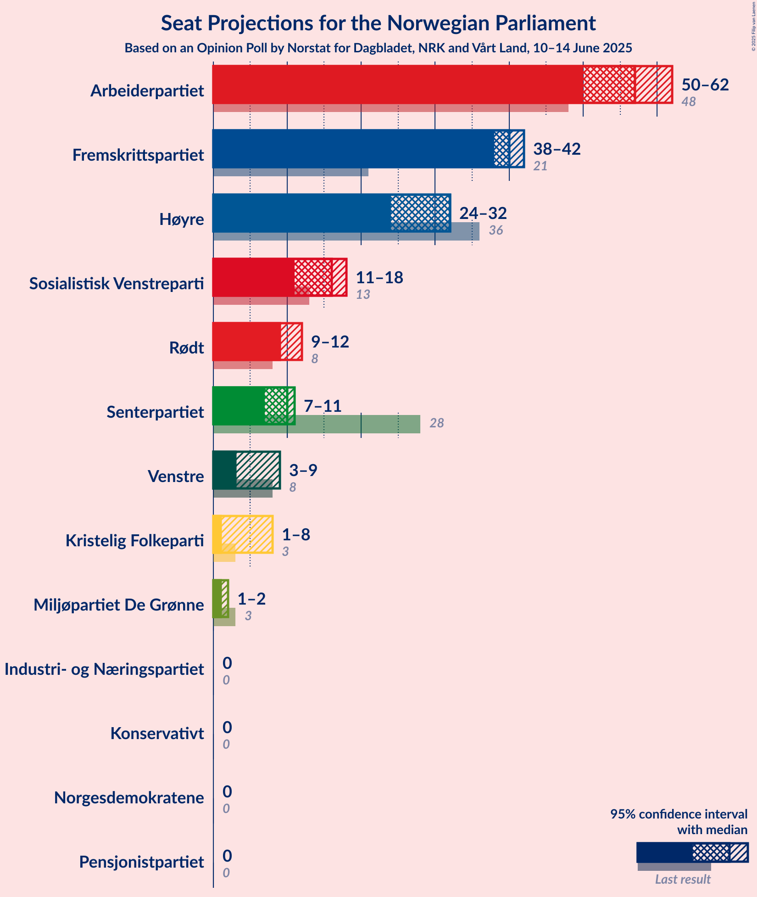
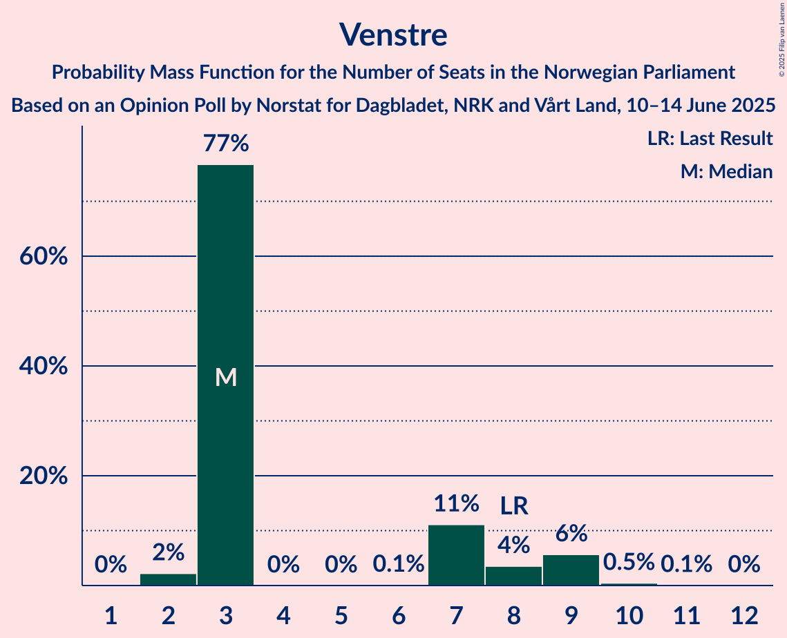
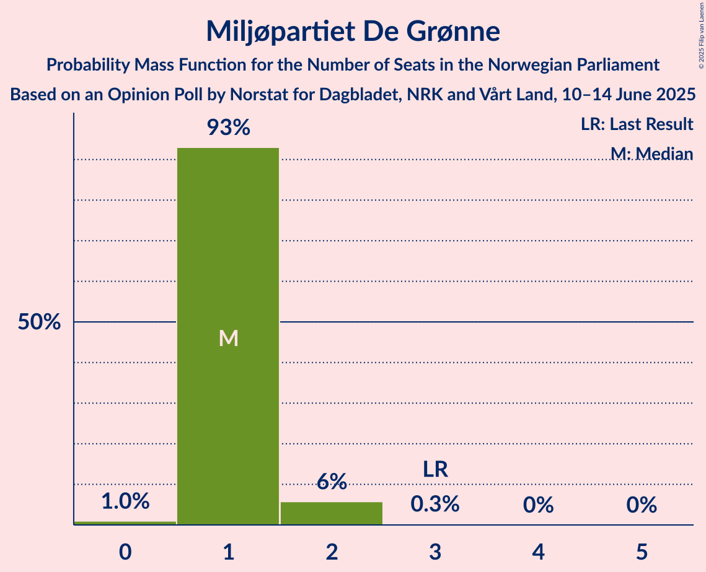
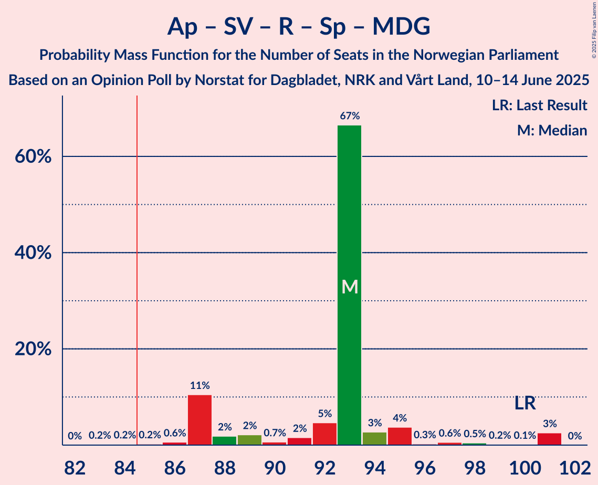

# Opinion Poll by Norstat for Dagbladet, NRK and Vårt Land, 10–14 June 2025

<a href="#voting-intentions">Voting Intentions</a> | <a href="#seats">Seats</a> | <a href="#coalitions">Coalitions</a> | <a href="#technical-information">Technical Information</a>

## Voting Intentions

### Confidence Intervals

| Party | Last Result | Poll Result | 80% Confidence Interval | 90% Confidence Interval | 95% Confidence Interval | 99% Confidence Interval |
|:-----:|:-----------:|:-----------:|:-----------------------:|:-----------------------:|:-----------------------:|:-----------------------:|
| Arbeiderpartiet | 26.2% | 29.9% | 28.1–31.8% |27.6–32.3% |27.1–32.8% |26.3–33.7% |
| Fremskrittspartiet | 11.6% | 21.3% | 19.7–23.0% |19.2–23.5% |18.8–23.9% |18.1–24.7% |
| Høyre | 20.4% | 15.8% | 14.4–17.3% |14.0–17.8% |13.7–18.2% |13.0–18.9% |
| Sosialistisk Venstreparti | 7.6% | 7.9% | 7.0–9.1% |6.7–9.5% |6.4–9.8% |6.0–10.4% |
| Rødt | 4.7% | 5.6% | 4.7–6.6% |4.5–6.9% |4.3–7.2% |3.9–7.7% |
| Senterpartiet | 13.5% | 5.3% | 4.5–6.3% |4.2–6.6% |4.0–6.8% |3.7–7.3% |
| Venstre | 4.6% | 4.2% | 3.5–5.1% |3.3–5.4% |3.1–5.6% |2.8–6.1% |
| Kristelig Folkeparti | 3.8% | 3.3% | 2.7–4.1% |2.5–4.4% |2.3–4.6% |2.1–5.0% |
| Miljøpartiet De Grønne | 3.9% | 2.1% | 1.6–2.8% |1.5–3.0% |1.4–3.2% |1.2–3.6% |
| Norgesdemokratene | 1.1% | 1.0% | 0.7–1.5% |0.6–1.7% |0.5–1.8% |0.4–2.1% |
| Pensjonistpartiet | 0.6% | 0.7% | 0.5–1.2% |0.4–1.3% |0.3–1.4% |0.2–1.7% |
| Industri- og Næringspartiet | 0.3% | 0.7% | 0.5–1.2% |0.4–1.3% |0.3–1.4% |0.2–1.7% |
| Konservativt | 0.4% | 0.3% | 0.2–0.7% |0.1–0.8% |0.1–0.9% |0.1–1.1% |

*Note:* The poll result column reflects the actual value used in the calculations. Published results may vary slightly, and in addition be rounded to fewer digits.

## Seats

### Confidence Intervals

| Party | Last Result | Median | 80% Confidence Interval | 90% Confidence Interval | 95% Confidence Interval | 99% Confidence Interval |
|:-----:|:-----------:|:------:|:-----------------------:|:-----------------------:|:-----------------------:|:-----------------------:|
| <a href="#arbeiderpartiet">Arbeiderpartiet</a> | 48 | 57 | 57 |56–57 |55–60 |52–63 |
| <a href="#fremskrittspartiet">Fremskrittspartiet</a> | 21 | 40 | 40 |40–41 |39–41 |36–43 |
| <a href="#høyre">Høyre</a> | 36 | 32 | 31–32 |29–32 |25–32 |24–33 |
| <a href="#sosialistisk-venstreparti">Sosialistisk Venstreparti</a> | 13 | 16 | 15–16 |13–16 |11–16 |11–17 |
| <a href="#rødt">Rødt</a> | 8 | 9 | 9 |9–10 |9–11 |8–13 |
| <a href="#senterpartiet">Senterpartiet</a> | 28 | 10 | 10 |8–11 |8–11 |7–13 |
| <a href="#venstre">Venstre</a> | 8 | 3 | 3 |3–9 |3–9 |2–9 |
| <a href="#kristelig-folkeparti">Kristelig Folkeparti</a> | 3 | 1 | 1 |1–2 |1–3 |1–7 |
| <a href="#miljøpartiet-de-grønne">Miljøpartiet De Grønne</a> | 3 | 1 | 1 |1–2 |1–2 |0–2 |
| <a href="#norgesdemokratene">Norgesdemokratene</a> | 0 | 0 | 0 |0 |0 |0 |
| <a href="#pensjonistpartiet">Pensjonistpartiet</a> | 0 | 0 | 0 |0 |0 |0 |
| <a href="#industri--og-næringspartiet">Industri- og Næringspartiet</a> | 0 | 0 | 0 |0 |0 |0 |
| <a href="#konservativt">Konservativt</a> | 0 | 0 | 0 |0 |0 |0 |

### Arbeiderpartiet

*For a full overview of the results for this party, see the [Arbeiderpartiet](party-arbeiderpartiet.html) page.*

| Number of Seats | Probability | Accumulated | Special Marks |
|:---------------:|:-----------:|:-----------:|:-------------:|
| 48 | 0% | 100% | Last Result |
| 49 | 0% | 100% |  |
| 50 | 0.1% | 100% |  |
| 51 | 0.2% | 99.9% |  |
| 52 | 0.6% | 99.7% |  |
| 53 | 0.4% | 99.1% |  |
| 54 | 0.4% | 98.6% |  |
| 55 | 2% | 98% |  |
| 56 | 4% | 96% |  |
| 57 | 87% | 92% | Median |
| 58 | 0.4% | 5% |  |
| 59 | 1.0% | 4% |  |
| 60 | 1.2% | 3% |  |
| 61 | 0.2% | 2% |  |
| 62 | 1.4% | 2% |  |
| 63 | 0.4% | 0.6% |  |
| 64 | 0.1% | 0.2% |  |
| 65 | 0% | 0.1% |  |
| 66 | 0.1% | 0.1% |  |
| 67 | 0% | 0% |  |

### Fremskrittspartiet

*For a full overview of the results for this party, see the [Fremskrittspartiet](party-fremskrittspartiet.html) page.*

| Number of Seats | Probability | Accumulated | Special Marks |
|:---------------:|:-----------:|:-----------:|:-------------:|
| 21 | 0% | 100% | Last Result |
| 22 | 0% | 100% |  |
| 23 | 0% | 100% |  |
| 24 | 0% | 100% |  |
| 25 | 0% | 100% |  |
| 26 | 0% | 100% |  |
| 27 | 0% | 100% |  |
| 28 | 0% | 100% |  |
| 29 | 0% | 100% |  |
| 30 | 0% | 100% |  |
| 31 | 0% | 100% |  |
| 32 | 0% | 100% |  |
| 33 | 0% | 100% |  |
| 34 | 0% | 100% |  |
| 35 | 0.2% | 99.9% |  |
| 36 | 0.3% | 99.8% |  |
| 37 | 0.2% | 99.4% |  |
| 38 | 0.9% | 99.2% |  |
| 39 | 3% | 98% |  |
| 40 | 89% | 95% | Median |
| 41 | 4% | 6% |  |
| 42 | 2% | 2% |  |
| 43 | 0.6% | 0.9% |  |
| 44 | 0.1% | 0.2% |  |
| 45 | 0.1% | 0.2% |  |
| 46 | 0% | 0.1% |  |
| 47 | 0% | 0% |  |

### Høyre

*For a full overview of the results for this party, see the [Høyre](party-høyre.html) page.*

| Number of Seats | Probability | Accumulated | Special Marks |
|:---------------:|:-----------:|:-----------:|:-------------:|
| 21 | 0.1% | 100% |  |
| 22 | 0.1% | 99.9% |  |
| 23 | 0% | 99.9% |  |
| 24 | 2% | 99.8% |  |
| 25 | 0.3% | 98% |  |
| 26 | 0.6% | 97% |  |
| 27 | 0.7% | 97% |  |
| 28 | 0.4% | 96% |  |
| 29 | 3% | 96% |  |
| 30 | 3% | 93% |  |
| 31 | 0.2% | 90% |  |
| 32 | 89% | 90% | Median |
| 33 | 0.1% | 0.5% |  |
| 34 | 0.2% | 0.4% |  |
| 35 | 0% | 0.2% |  |
| 36 | 0.2% | 0.2% | Last Result |
| 37 | 0% | 0% |  |

### Sosialistisk Venstreparti

*For a full overview of the results for this party, see the [Sosialistisk Venstreparti](party-sosialistiskvenstreparti.html) page.*

| Number of Seats | Probability | Accumulated | Special Marks |
|:---------------:|:-----------:|:-----------:|:-------------:|
| 10 | 0.2% | 100% |  |
| 11 | 2% | 99.8% |  |
| 12 | 0.7% | 97% |  |
| 13 | 5% | 97% | Last Result |
| 14 | 0.6% | 92% |  |
| 15 | 4% | 91% |  |
| 16 | 86% | 87% | Median |
| 17 | 0.3% | 0.7% |  |
| 18 | 0.2% | 0.4% |  |
| 19 | 0.1% | 0.2% |  |
| 20 | 0% | 0% |  |

### Rødt

*For a full overview of the results for this party, see the [Rødt](party-rødt.html) page.*

| Number of Seats | Probability | Accumulated | Special Marks |
|:---------------:|:-----------:|:-----------:|:-------------:|
| 2 | 0% | 100% |  |
| 3 | 0% | 99.9% |  |
| 4 | 0% | 99.9% |  |
| 5 | 0% | 99.9% |  |
| 6 | 0% | 99.9% |  |
| 7 | 0.1% | 99.9% |  |
| 8 | 0.8% | 99.9% | Last Result |
| 9 | 90% | 99.1% | Median |
| 10 | 5% | 9% |  |
| 11 | 2% | 4% |  |
| 12 | 0.3% | 1.5% |  |
| 13 | 0.9% | 1.1% |  |
| 14 | 0.3% | 0.3% |  |
| 15 | 0% | 0% |  |

### Senterpartiet

*For a full overview of the results for this party, see the [Senterpartiet](party-senterpartiet.html) page.*

| Number of Seats | Probability | Accumulated | Special Marks |
|:---------------:|:-----------:|:-----------:|:-------------:|
| 0 | 0.2% | 100% |  |
| 1 | 0% | 99.8% |  |
| 2 | 0% | 99.8% |  |
| 3 | 0% | 99.8% |  |
| 4 | 0% | 99.8% |  |
| 5 | 0% | 99.8% |  |
| 6 | 0% | 99.8% |  |
| 7 | 1.4% | 99.8% |  |
| 8 | 5% | 98% |  |
| 9 | 1.1% | 93% |  |
| 10 | 87% | 92% | Median |
| 11 | 4% | 5% |  |
| 12 | 0.3% | 1.0% |  |
| 13 | 0.5% | 0.7% |  |
| 14 | 0.1% | 0.1% |  |
| 15 | 0% | 0% |  |
| 16 | 0% | 0% |  |
| 17 | 0% | 0% |  |
| 18 | 0% | 0% |  |
| 19 | 0% | 0% |  |
| 20 | 0% | 0% |  |
| 21 | 0% | 0% |  |
| 22 | 0% | 0% |  |
| 23 | 0% | 0% |  |
| 24 | 0% | 0% |  |
| 25 | 0% | 0% |  |
| 26 | 0% | 0% |  |
| 27 | 0% | 0% |  |
| 28 | 0% | 0% | Last Result |

### Venstre

*For a full overview of the results for this party, see the [Venstre](party-venstre.html) page.*

| Number of Seats | Probability | Accumulated | Special Marks |
|:---------------:|:-----------:|:-----------:|:-------------:|
| 2 | 0.8% | 100% |  |
| 3 | 91% | 99.2% | Median |
| 4 | 0% | 9% |  |
| 5 | 0% | 9% |  |
| 6 | 0% | 9% |  |
| 7 | 0.3% | 9% |  |
| 8 | 1.5% | 8% | Last Result |
| 9 | 7% | 7% |  |
| 10 | 0.1% | 0.2% |  |
| 11 | 0% | 0.1% |  |
| 12 | 0% | 0% |  |

### Kristelig Folkeparti

*For a full overview of the results for this party, see the [Kristelig Folkeparti](party-kristeligfolkeparti.html) page.*

| Number of Seats | Probability | Accumulated | Special Marks |
|:---------------:|:-----------:|:-----------:|:-------------:|
| 0 | 0.2% | 100% |  |
| 1 | 91% | 99.8% | Median |
| 2 | 5% | 9% |  |
| 3 | 4% | 4% | Last Result |
| 4 | 0% | 0.6% |  |
| 5 | 0% | 0.6% |  |
| 6 | 0% | 0.6% |  |
| 7 | 0.3% | 0.6% |  |
| 8 | 0.2% | 0.3% |  |
| 9 | 0.1% | 0.1% |  |
| 10 | 0% | 0% |  |

### Miljøpartiet De Grønne

*For a full overview of the results for this party, see the [Miljøpartiet De Grønne](party-miljøpartietdegrønne.html) page.*

| Number of Seats | Probability | Accumulated | Special Marks |
|:---------------:|:-----------:|:-----------:|:-------------:|
| 0 | 0.9% | 100% |  |
| 1 | 92% | 99.1% | Median |
| 2 | 6% | 7% |  |
| 3 | 0.2% | 0.2% | Last Result |
| 4 | 0% | 0% |  |

### Norgesdemokratene

*For a full overview of the results for this party, see the [Norgesdemokratene](party-norgesdemokratene.html) page.*

| Number of Seats | Probability | Accumulated | Special Marks |
|:---------------:|:-----------:|:-----------:|:-------------:|
| 0 | 100% | 100% | Last Result, Median |

### Pensjonistpartiet

*For a full overview of the results for this party, see the [Pensjonistpartiet](party-pensjonistpartiet.html) page.*

| Number of Seats | Probability | Accumulated | Special Marks |
|:---------------:|:-----------:|:-----------:|:-------------:|
| 0 | 100% | 100% | Last Result, Median |

### Industri- og Næringspartiet

*For a full overview of the results for this party, see the [Industri- og Næringspartiet](party-industri-ognæringspartiet.html) page.*

| Number of Seats | Probability | Accumulated | Special Marks |
|:---------------:|:-----------:|:-----------:|:-------------:|
| 0 | 100% | 100% | Last Result, Median |

### Konservativt

*For a full overview of the results for this party, see the [Konservativt](party-konservativt.html) page.*

| Number of Seats | Probability | Accumulated | Special Marks |
|:---------------:|:-----------:|:-----------:|:-------------:|
| 0 | 100% | 100% | Last Result, Median |

## Coalitions

### Confidence Intervals

| Coalition | Last Result | Median | Majority? | 80% Confidence Interval | 90% Confidence Interval | 95% Confidence Interval | 99% Confidence Interval |
|:---------:|:-----------:|:------:|:---------:|:-----------------------:|:-----------------------:|:-----------------------:|:-----------------------:|
| Arbeiderpartiet – Sosialistisk Venstreparti – Rødt – Senterpartiet – Miljøpartiet De Grønne | 100 | 93 | 99.8% | 92–93 | 89–93 | 88–94 | 87–98 |
| Arbeiderpartiet – Sosialistisk Venstreparti – Rødt – Senterpartiet | 97 | 92 | 99.7% | 90–92 | 87–92 | 87–93 | 86–97 |
| Fremskrittspartiet – Høyre – Senterpartiet – Venstre – Kristelig Folkeparti | 96 | 86 | 97% | 86–87 | 86–88 | 83–89 | 81–92 |
| Arbeiderpartiet – Sosialistisk Venstreparti – Senterpartiet – Kristelig Folkeparti – Miljøpartiet De Grønne | 95 | 85 | 89% | 84–85 | 81–85 | 80–86 | 80–90 |
| Arbeiderpartiet – Sosialistisk Venstreparti – Rødt – Miljøpartiet De Grønne | 72 | 83 | 3% | 82–83 | 81–83 | 80–86 | 77–88 |
| Arbeiderpartiet – Sosialistisk Venstreparti – Senterpartiet – Miljøpartiet De Grønne | 92 | 84 | 3% | 82–84 | 80–84 | 77–85 | 77–88 |
| Arbeiderpartiet – Sosialistisk Venstreparti – Senterpartiet | 89 | 83 | 1.0% | 80–83 | 78–83 | 76–84 | 76–87 |
| Fremskrittspartiet – Høyre – Venstre – Kristelig Folkeparti – Miljøpartiet De Grønne | 71 | 77 | 0.3% | 77–79 | 77–82 | 76–82 | 72–83 |
| Fremskrittspartiet – Høyre – Venstre – Kristelig Folkeparti | 68 | 76 | 0.2% | 76–77 | 76–80 | 75–81 | 71–82 |
| Fremskrittspartiet – Høyre – Venstre | 65 | 75 | 0.1% | 75 | 75–78 | 74–79 | 68–79 |
| Arbeiderpartiet – Sosialistisk Venstreparti | 61 | 73 | 0% | 71–73 | 69–73 | 68–75 | 66–78 |
| Fremskrittspartiet – Høyre | 57 | 72 | 0% | 71–72 | 68–72 | 66–72 | 64–75 |
| Arbeiderpartiet – Senterpartiet – Kristelig Folkeparti – Miljøpartiet De Grønne | 82 | 69 | 0% | 69 | 69–71 | 66–71 | 65–76 |
| Arbeiderpartiet – Senterpartiet – Kristelig Folkeparti | 79 | 68 | 0% | 68 | 68–69 | 64–70 | 64–75 |
| Arbeiderpartiet – Senterpartiet | 76 | 67 | 0% | 67 | 65–67 | 63–69 | 62–72 |
| Høyre – Venstre – Kristelig Folkeparti | 47 | 36 | 0% | 36–37 | 36–39 | 34–42 | 32–42 |
| Senterpartiet – Venstre – Kristelig Folkeparti | 39 | 14 | 0% | 14–16 | 14–18 | 14–20 | 13–22 |

### Arbeiderpartiet – Sosialistisk Venstreparti – Rødt – Senterpartiet – Miljøpartiet De Grønne

| Number of Seats | Probability | Accumulated | Special Marks |
|:---------------:|:-----------:|:-----------:|:-------------:|
| 83 | 0.1% | 100% |  |
| 84 | 0% | 99.9% |  |
| 85 | 0.1% | 99.8% | Majority |
| 86 | 0.2% | 99.8% |  |
| 87 | 0.4% | 99.6% |  |
| 88 | 2% | 99.2% |  |
| 89 | 2% | 97% |  |
| 90 | 0.6% | 95% |  |
| 91 | 0.7% | 94% |  |
| 92 | 4% | 93% |  |
| 93 | 86% | 89% | Median |
| 94 | 2% | 4% |  |
| 95 | 0.3% | 2% |  |
| 96 | 0.2% | 2% |  |
| 97 | 0.6% | 1.3% |  |
| 98 | 0.5% | 0.7% |  |
| 99 | 0.2% | 0.2% |  |
| 100 | 0% | 0% | Last Result |

### Arbeiderpartiet – Sosialistisk Venstreparti – Rødt – Senterpartiet

| Number of Seats | Probability | Accumulated | Special Marks |
|:---------------:|:-----------:|:-----------:|:-------------:|
| 82 | 0.1% | 100% |  |
| 83 | 0% | 99.9% |  |
| 84 | 0.1% | 99.8% |  |
| 85 | 0.2% | 99.7% | Majority |
| 86 | 0.3% | 99.5% |  |
| 87 | 4% | 99.2% |  |
| 88 | 0.3% | 95% |  |
| 89 | 0.8% | 95% |  |
| 90 | 4% | 94% |  |
| 91 | 0.5% | 90% |  |
| 92 | 86% | 89% | Median |
| 93 | 2% | 3% |  |
| 94 | 0.3% | 2% |  |
| 95 | 0.2% | 2% |  |
| 96 | 0.5% | 1.4% |  |
| 97 | 0.6% | 0.9% | Last Result |
| 98 | 0.2% | 0.3% |  |
| 99 | 0% | 0% |  |

### Fremskrittspartiet – Høyre – Senterpartiet – Venstre – Kristelig Folkeparti

| Number of Seats | Probability | Accumulated | Special Marks |
|:---------------:|:-----------:|:-----------:|:-------------:|
| 79 | 0.1% | 100% |  |
| 80 | 0.3% | 99.9% |  |
| 81 | 0.4% | 99.6% |  |
| 82 | 1.4% | 99.2% |  |
| 83 | 0.9% | 98% |  |
| 84 | 0.2% | 97% |  |
| 85 | 0.3% | 97% | Majority |
| 86 | 86% | 96% | Median |
| 87 | 0.4% | 10% |  |
| 88 | 6% | 10% |  |
| 89 | 2% | 4% |  |
| 90 | 0.1% | 1.4% |  |
| 91 | 0.4% | 1.3% |  |
| 92 | 0.6% | 0.9% |  |
| 93 | 0% | 0.3% |  |
| 94 | 0.1% | 0.2% |  |
| 95 | 0.1% | 0.2% |  |
| 96 | 0.1% | 0.1% | Last Result |
| 97 | 0% | 0% |  |

### Arbeiderpartiet – Sosialistisk Venstreparti – Senterpartiet – Kristelig Folkeparti – Miljøpartiet De Grønne

| Number of Seats | Probability | Accumulated | Special Marks |
|:---------------:|:-----------:|:-----------:|:-------------:|
| 75 | 0.2% | 100% |  |
| 76 | 0.1% | 99.8% |  |
| 77 | 0% | 99.7% |  |
| 78 | 0.1% | 99.7% |  |
| 79 | 0.1% | 99.6% |  |
| 80 | 2% | 99.5% |  |
| 81 | 3% | 97% |  |
| 82 | 0.6% | 95% |  |
| 83 | 0.6% | 94% |  |
| 84 | 5% | 94% |  |
| 85 | 85% | 89% | Median, Majority |
| 86 | 2% | 4% |  |
| 87 | 0.1% | 2% |  |
| 88 | 0.4% | 2% |  |
| 89 | 0.5% | 1.1% |  |
| 90 | 0.2% | 0.6% |  |
| 91 | 0.1% | 0.5% |  |
| 92 | 0.1% | 0.3% |  |
| 93 | 0.2% | 0.2% |  |
| 94 | 0% | 0.1% |  |
| 95 | 0% | 0% | Last Result |

### Arbeiderpartiet – Sosialistisk Venstreparti – Rødt – Miljøpartiet De Grønne

| Number of Seats | Probability | Accumulated | Special Marks |
|:---------------:|:-----------:|:-----------:|:-------------:|
| 72 | 0% | 100% | Last Result |
| 73 | 0.1% | 100% |  |
| 74 | 0.1% | 99.9% |  |
| 75 | 0.1% | 99.8% |  |
| 76 | 0% | 99.8% |  |
| 77 | 0.6% | 99.7% |  |
| 78 | 0.4% | 99.1% |  |
| 79 | 0.1% | 98.7% |  |
| 80 | 2% | 98.6% |  |
| 81 | 6% | 96% |  |
| 82 | 0.4% | 90% |  |
| 83 | 86% | 90% | Median |
| 84 | 0.3% | 4% |  |
| 85 | 0.2% | 3% | Majority |
| 86 | 0.9% | 3% |  |
| 87 | 1.4% | 2% |  |
| 88 | 0.4% | 0.8% |  |
| 89 | 0.3% | 0.4% |  |
| 90 | 0.1% | 0.1% |  |
| 91 | 0% | 0% |  |

### Arbeiderpartiet – Sosialistisk Venstreparti – Senterpartiet – Miljøpartiet De Grønne

| Number of Seats | Probability | Accumulated | Special Marks |
|:---------------:|:-----------:|:-----------:|:-------------:|
| 73 | 0.1% | 100% |  |
| 74 | 0.1% | 99.8% |  |
| 75 | 0.1% | 99.7% |  |
| 76 | 0% | 99.6% |  |
| 77 | 2% | 99.6% |  |
| 78 | 0.3% | 97% |  |
| 79 | 0.6% | 97% |  |
| 80 | 2% | 97% |  |
| 81 | 0.7% | 94% |  |
| 82 | 4% | 93% |  |
| 83 | 1.1% | 89% |  |
| 84 | 85% | 88% | Median |
| 85 | 2% | 3% | Majority |
| 86 | 0.2% | 1.0% |  |
| 87 | 0.1% | 0.8% |  |
| 88 | 0.4% | 0.7% |  |
| 89 | 0.1% | 0.3% |  |
| 90 | 0.1% | 0.1% |  |
| 91 | 0% | 0% |  |
| 92 | 0% | 0% | Last Result |

### Arbeiderpartiet – Sosialistisk Venstreparti – Senterpartiet

| Number of Seats | Probability | Accumulated | Special Marks |
|:---------------:|:-----------:|:-----------:|:-------------:|
| 72 | 0.1% | 100% |  |
| 73 | 0% | 99.8% |  |
| 74 | 0.2% | 99.8% |  |
| 75 | 0% | 99.6% |  |
| 76 | 2% | 99.6% |  |
| 77 | 0.4% | 97% |  |
| 78 | 3% | 97% |  |
| 79 | 0.3% | 94% |  |
| 80 | 4% | 94% |  |
| 81 | 0.2% | 90% |  |
| 82 | 1.2% | 89% |  |
| 83 | 85% | 88% | Median |
| 84 | 2% | 3% |  |
| 85 | 0.2% | 1.0% | Majority |
| 86 | 0.2% | 0.9% |  |
| 87 | 0.2% | 0.6% |  |
| 88 | 0.4% | 0.4% |  |
| 89 | 0% | 0% | Last Result |

### Fremskrittspartiet – Høyre – Venstre – Kristelig Folkeparti – Miljøpartiet De Grønne

| Number of Seats | Probability | Accumulated | Special Marks |
|:---------------:|:-----------:|:-----------:|:-------------:|
| 71 | 0.2% | 100% | Last Result |
| 72 | 0.6% | 99.7% |  |
| 73 | 0.5% | 99.1% |  |
| 74 | 0.2% | 98.6% |  |
| 75 | 0.3% | 98% |  |
| 76 | 2% | 98% |  |
| 77 | 86% | 97% | Median |
| 78 | 0.5% | 11% |  |
| 79 | 4% | 10% |  |
| 80 | 0.8% | 6% |  |
| 81 | 0.3% | 5% |  |
| 82 | 4% | 5% |  |
| 83 | 0.3% | 0.8% |  |
| 84 | 0.2% | 0.5% |  |
| 85 | 0.1% | 0.3% | Majority |
| 86 | 0% | 0.2% |  |
| 87 | 0.1% | 0.1% |  |
| 88 | 0% | 0% |  |

### Fremskrittspartiet – Høyre – Venstre – Kristelig Folkeparti

| Number of Seats | Probability | Accumulated | Special Marks |
|:---------------:|:-----------:|:-----------:|:-------------:|
| 68 | 0% | 100% | Last Result |
| 69 | 0% | 100% |  |
| 70 | 0.2% | 100% |  |
| 71 | 0.5% | 99.8% |  |
| 72 | 0.6% | 99.3% |  |
| 73 | 0.2% | 98.7% |  |
| 74 | 0.3% | 98% |  |
| 75 | 2% | 98% |  |
| 76 | 86% | 96% | Median |
| 77 | 4% | 11% |  |
| 78 | 0.7% | 7% |  |
| 79 | 0.6% | 6% |  |
| 80 | 2% | 5% |  |
| 81 | 2% | 3% |  |
| 82 | 0.4% | 0.8% |  |
| 83 | 0.2% | 0.4% |  |
| 84 | 0.1% | 0.2% |  |
| 85 | 0% | 0.2% | Majority |
| 86 | 0.1% | 0.1% |  |
| 87 | 0% | 0% |  |

### Fremskrittspartiet – Høyre – Venstre

| Number of Seats | Probability | Accumulated | Special Marks |
|:---------------:|:-----------:|:-----------:|:-------------:|
| 65 | 0% | 100% | Last Result |
| 66 | 0% | 100% |  |
| 67 | 0.1% | 99.9% |  |
| 68 | 0.4% | 99.8% |  |
| 69 | 0.2% | 99.4% |  |
| 70 | 0.7% | 99.2% |  |
| 71 | 0.5% | 98.6% |  |
| 72 | 0.3% | 98% |  |
| 73 | 0.1% | 98% |  |
| 74 | 2% | 98% |  |
| 75 | 90% | 96% | Median |
| 76 | 0.4% | 6% |  |
| 77 | 0.5% | 6% |  |
| 78 | 3% | 5% |  |
| 79 | 3% | 3% |  |
| 80 | 0% | 0.4% |  |
| 81 | 0.2% | 0.4% |  |
| 82 | 0% | 0.1% |  |
| 83 | 0% | 0.1% |  |
| 84 | 0% | 0.1% |  |
| 85 | 0.1% | 0.1% | Majority |
| 86 | 0% | 0% |  |

### Arbeiderpartiet – Sosialistisk Venstreparti

| Number of Seats | Probability | Accumulated | Special Marks |
|:---------------:|:-----------:|:-----------:|:-------------:|
| 61 | 0% | 100% | Last Result |
| 62 | 0% | 100% |  |
| 63 | 0% | 100% |  |
| 64 | 0.2% | 99.9% |  |
| 65 | 0.1% | 99.7% |  |
| 66 | 0.2% | 99.6% |  |
| 67 | 0.6% | 99.4% |  |
| 68 | 2% | 98.9% |  |
| 69 | 4% | 97% |  |
| 70 | 2% | 92% |  |
| 71 | 0.5% | 90% |  |
| 72 | 2% | 90% |  |
| 73 | 85% | 88% | Median |
| 74 | 0.4% | 3% |  |
| 75 | 0.3% | 3% |  |
| 76 | 0.5% | 2% |  |
| 77 | 1.3% | 2% |  |
| 78 | 0.2% | 0.6% |  |
| 79 | 0.3% | 0.4% |  |
| 80 | 0% | 0% |  |

### Fremskrittspartiet – Høyre

| Number of Seats | Probability | Accumulated | Special Marks |
|:---------------:|:-----------:|:-----------:|:-------------:|
| 57 | 0% | 100% | Last Result |
| 58 | 0% | 100% |  |
| 59 | 0% | 100% |  |
| 60 | 0% | 100% |  |
| 61 | 0.1% | 99.9% |  |
| 62 | 0.2% | 99.8% |  |
| 63 | 0.1% | 99.7% |  |
| 64 | 0.3% | 99.6% |  |
| 65 | 1.4% | 99.2% |  |
| 66 | 2% | 98% |  |
| 67 | 0.5% | 96% |  |
| 68 | 0.9% | 96% |  |
| 69 | 2% | 95% |  |
| 70 | 2% | 93% |  |
| 71 | 0.4% | 90% |  |
| 72 | 89% | 90% | Median |
| 73 | 0.2% | 1.3% |  |
| 74 | 0.4% | 1.1% |  |
| 75 | 0.5% | 0.7% |  |
| 76 | 0.1% | 0.2% |  |
| 77 | 0% | 0.2% |  |
| 78 | 0.1% | 0.1% |  |
| 79 | 0% | 0% |  |

### Arbeiderpartiet – Senterpartiet – Kristelig Folkeparti – Miljøpartiet De Grønne

| Number of Seats | Probability | Accumulated | Special Marks |
|:---------------:|:-----------:|:-----------:|:-------------:|
| 62 | 0.1% | 100% |  |
| 63 | 0% | 99.8% |  |
| 64 | 0.3% | 99.8% |  |
| 65 | 0.3% | 99.5% |  |
| 66 | 3% | 99.3% |  |
| 67 | 1.0% | 97% |  |
| 68 | 0.2% | 96% |  |
| 69 | 87% | 96% | Median |
| 70 | 0.6% | 9% |  |
| 71 | 6% | 8% |  |
| 72 | 0.2% | 2% |  |
| 73 | 0.4% | 2% |  |
| 74 | 0.6% | 2% |  |
| 75 | 0.2% | 1.0% |  |
| 76 | 0.4% | 0.9% |  |
| 77 | 0.2% | 0.5% |  |
| 78 | 0.1% | 0.3% |  |
| 79 | 0.1% | 0.1% |  |
| 80 | 0% | 0% |  |
| 81 | 0% | 0% |  |
| 82 | 0% | 0% | Last Result |

### Arbeiderpartiet – Senterpartiet – Kristelig Folkeparti

| Number of Seats | Probability | Accumulated | Special Marks |
|:---------------:|:-----------:|:-----------:|:-------------:|
| 61 | 0.1% | 100% |  |
| 62 | 0% | 99.8% |  |
| 63 | 0.2% | 99.8% |  |
| 64 | 3% | 99.6% |  |
| 65 | 0.5% | 97% |  |
| 66 | 0.7% | 97% |  |
| 67 | 0.3% | 96% |  |
| 68 | 87% | 96% | Median |
| 69 | 4% | 9% |  |
| 70 | 2% | 4% |  |
| 71 | 0.3% | 2% |  |
| 72 | 0.3% | 2% |  |
| 73 | 0.6% | 2% |  |
| 74 | 0.2% | 1.1% |  |
| 75 | 0.4% | 0.9% |  |
| 76 | 0.2% | 0.4% |  |
| 77 | 0.1% | 0.2% |  |
| 78 | 0.1% | 0.1% |  |
| 79 | 0% | 0% | Last Result |

### Arbeiderpartiet – Senterpartiet

| Number of Seats | Probability | Accumulated | Special Marks |
|:---------------:|:-----------:|:-----------:|:-------------:|
| 59 | 0.2% | 100% |  |
| 60 | 0.2% | 99.8% |  |
| 61 | 0.1% | 99.6% |  |
| 62 | 0.5% | 99.6% |  |
| 63 | 3% | 99.1% |  |
| 64 | 0.3% | 96% |  |
| 65 | 3% | 96% |  |
| 66 | 0.4% | 94% |  |
| 67 | 89% | 93% | Median |
| 68 | 0.8% | 5% |  |
| 69 | 2% | 4% |  |
| 70 | 0.1% | 2% |  |
| 71 | 0.6% | 1.4% |  |
| 72 | 0.5% | 0.9% |  |
| 73 | 0.1% | 0.3% |  |
| 74 | 0.2% | 0.3% |  |
| 75 | 0.1% | 0.1% |  |
| 76 | 0% | 0% | Last Result |

### Høyre – Venstre – Kristelig Folkeparti

| Number of Seats | Probability | Accumulated | Special Marks |
|:---------------:|:-----------:|:-----------:|:-------------:|
| 28 | 0.1% | 100% |  |
| 29 | 0% | 99.9% |  |
| 30 | 0.1% | 99.9% |  |
| 31 | 0.2% | 99.8% |  |
| 32 | 0.1% | 99.6% |  |
| 33 | 0.4% | 99.4% |  |
| 34 | 3% | 99.0% |  |
| 35 | 0.1% | 96% |  |
| 36 | 86% | 96% | Median |
| 37 | 4% | 10% |  |
| 38 | 0.3% | 6% |  |
| 39 | 2% | 6% |  |
| 40 | 0.5% | 3% |  |
| 41 | 0.3% | 3% |  |
| 42 | 2% | 3% |  |
| 43 | 0.2% | 0.3% |  |
| 44 | 0.1% | 0.1% |  |
| 45 | 0% | 0.1% |  |
| 46 | 0% | 0% |  |
| 47 | 0% | 0% | Last Result |

### Senterpartiet – Venstre – Kristelig Folkeparti

| Number of Seats | Probability | Accumulated | Special Marks |
|:---------------:|:-----------:|:-----------:|:-------------:|
| 6 | 0.1% | 100% |  |
| 7 | 0% | 99.9% |  |
| 8 | 0% | 99.9% |  |
| 9 | 0% | 99.9% |  |
| 10 | 0% | 99.9% |  |
| 11 | 0% | 99.8% |  |
| 12 | 0.1% | 99.8% |  |
| 13 | 0.4% | 99.8% |  |
| 14 | 85% | 99.4% | Median |
| 15 | 0.6% | 14% |  |
| 16 | 4% | 14% |  |
| 17 | 2% | 10% |  |
| 18 | 3% | 7% |  |
| 19 | 0.5% | 5% |  |
| 20 | 3% | 4% |  |
| 21 | 0.3% | 0.9% |  |
| 22 | 0.2% | 0.6% |  |
| 23 | 0.2% | 0.4% |  |
| 24 | 0.1% | 0.2% |  |
| 25 | 0.1% | 0.1% |  |
| 26 | 0% | 0% |  |
| 27 | 0% | 0% |  |
| 28 | 0% | 0% |  |
| 29 | 0% | 0% |  |
| 30 | 0% | 0% |  |
| 31 | 0% | 0% |  |
| 32 | 0% | 0% |  |
| 33 | 0% | 0% |  |
| 34 | 0% | 0% |  |
| 35 | 0% | 0% |  |
| 36 | 0% | 0% |  |
| 37 | 0% | 0% |  |
| 38 | 0% | 0% |  |
| 39 | 0% | 0% | Last Result |

## Technical Information

### Opinion Poll

+ **Polling firm:** Norstat
+ **Commissioner(s):** Dagbladet, NRK and Vårt Land
+ **Fieldwork period:** 10–14 June 2025

### Calculations

+ **Sample size:** 1007
+ **Simulations done:** 1,048,576
+ **Error estimate:** 1.13%

